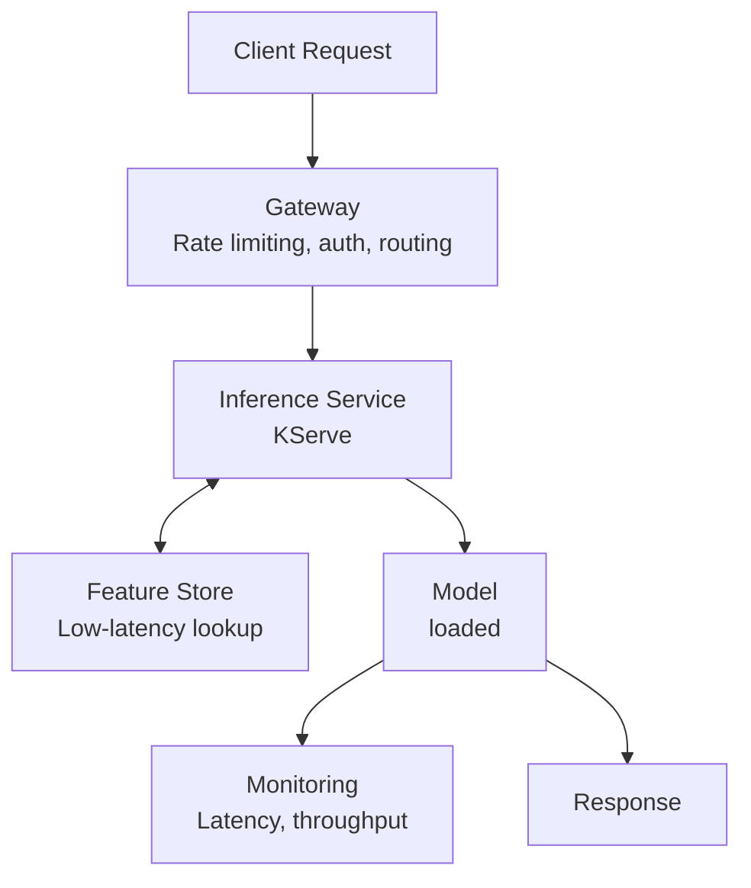
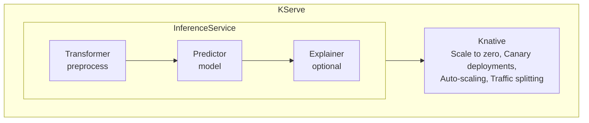
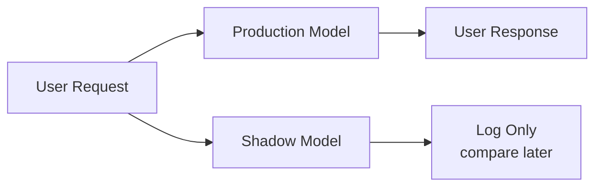
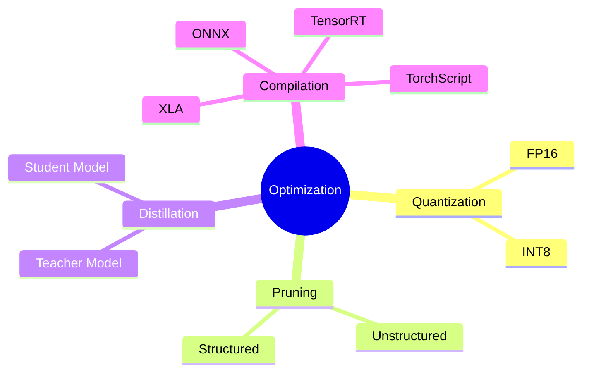
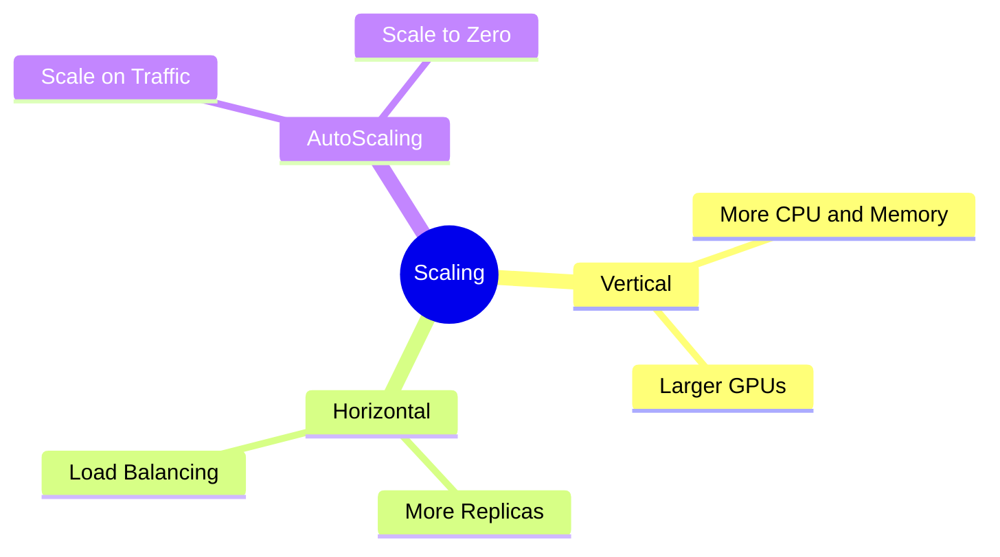

> **Discipline Track** | Complexity: `[COMPLEX]` | Time: 55-65 min

## Prerequisites

Before starting this module:

- [Module 5.3: Model Training & Experimentation](../module-5.3-model-training/)
- Understanding of REST APIs and request/response contracts
- Basic Kubernetes concepts: Deployments, Services, Pods, resource requests, and autoscaling
- Familiarity with containerization and image-based delivery
- Basic awareness of latency, throughput, error rates, and service-level objectives

## Learning Outcomes

After completing this module, you will be able to:

- **Design** a model-serving architecture that matches latency, freshness, cost, and reliability requirements.
- **Evaluate** serving frameworks such as KServe, Seldon Core, BentoML, TorchServe, TensorFlow Serving, and Triton against production constraints.
- **Debug** slow or unstable inference paths by separating model latency, feature lookup latency, dependency latency, and cold-start latency.
- **Compare** rollout strategies such as canary, shadow, and A/B testing, then choose the right one for business risk.
- **Configure** scaling and optimization approaches that balance response time, throughput, GPU utilization, and cloud cost.

## Why This Module Matters

A model in a notebook is not a product.

A data scientist may train a fraud model that performs beautifully on validation data.

The model may have clean experiment tracking, strong offline metrics, and an impressive ROC curve.

Then the platform team puts it behind an API, connects it to checkout traffic, and learns the real lesson.

The model takes two seconds to return a prediction.

The payment gateway times out.

The checkout service retries.

The inference pods scale too slowly.

The feature store starts throttling requests.

The business sees more abandoned carts than blocked fraud.

No one cares that the notebook looked good.

Model serving is the moment when machine learning becomes a production system.

It is where latency, memory, network hops, model size, rollout safety, autoscaling, and dependency design all become part of model quality.

A model with slightly weaker offline accuracy but reliable 40 ms predictions may be more valuable than a larger model that times out under peak traffic.

A model that can be rolled back in one command is safer than a model that needs an emergency rebuild.

A model that can degrade gracefully during a feature-store outage is more production-ready than a model with perfect training metrics and no fallback path.

The senior skill is not "deploy the model."

The senior skill is designing the serving path so the model can fail, scale, change, and recover without surprising the rest of the system.

> **Stop and think**: Think about a user-facing workflow that depends on a prediction: fraud approval, search ranking, recommendation, support triage, or medical image routing. What happens if the prediction is correct but arrives after the caller has already timed out?

## Serving Patterns

Before choosing a serving framework, choose the serving pattern.

This is the first architectural decision because it controls almost everything else.

It controls whether the user waits for the model.

It controls whether predictions must be fresh to the second.

It controls whether cost is paid continuously or in scheduled bursts.

It controls whether a failure becomes a user-facing outage or a delayed background job.

A common beginner mistake is to assume every model needs an online prediction endpoint.

In practice, many successful ML systems avoid online inference whenever they can.

They precompute predictions, cache results, score events asynchronously, or push smaller models to edge devices.

The right question is not "How do we serve this model?"

The right question is "When does the prediction need to be known, and who is blocked while it is being computed?"



Online serving means a caller sends a request and waits for the prediction.

This is appropriate when the prediction changes the current decision.

Fraud detection often needs online serving because a payment must be approved or blocked now.

Search ranking often uses online serving because the query is only known at request time.

Support-ticket routing may use online serving if the ticket must be assigned immediately.

Batch serving means predictions are generated ahead of time and stored.

This is appropriate when the prediction can be refreshed on a schedule.

Recommendation systems often use batch serving because many recommendations can be computed before the user opens the page.

Churn scoring often uses batch serving because a daily or hourly score is fresh enough for a retention campaign.

Credit-risk reports may use batch scoring because the business consumes the results later.

Streaming serving means predictions are applied to events as they flow through a system.

This is appropriate when the system needs low-latency reactions but the result does not belong to a synchronous request path.

Log anomaly detection is a common example.

A Kafka topic receives events, a model scores each event, and suspicious events go to another topic for alerting or investigation.

Edge serving means the model runs close to the user or device.

This is appropriate when network latency, privacy, offline behavior, or bandwidth constraints dominate the design.

A phone-based image classifier may run locally so the app still works on a train or in a warehouse.

A factory sensor may use an edge model because sending every raw signal to the cloud is too slow or too expensive.

```mermaid
flowchart TD
    subgraph Online [ONLINE / Real-time]
        direction LR
        Req1[Request] --> FL[Feature Lookup] --> Mod1[Model] --> Resp1[Response]
    end

    subgraph Batch [BATCH / Scheduled]
        direction LR
        Data2[Data] --> Mod2[Model] --> Pred2[Predictions] --> Store2[Store]
    end

    subgraph Streaming [STREAMING / Event-driven]
        direction LR
        Ev1[Event Stream] --> Mod3[Model] --> Ev2[Event Stream]
    end

    subgraph Edge [EDGE / On-device]
        direction LR
        Dev[Device Input] --> LMod[Local Model] --> Pred3[Prediction]
    end
```

### Choosing a Pattern

| Use Case | Pattern | Why |
|----------|---------|-----|
| Fraud detection | Online | Must block transaction in real-time |
| Product recommendations | Batch | Pre-compute, serve from cache |
| Log anomaly detection | Streaming | Process events as they arrive |
| Mobile image classification | Edge | Works offline, low latency |
| Credit scoring | Online + Batch | Real-time for decisions, batch for reports |

The table looks simple, but real systems often combine patterns.

A recommendation platform may use batch scoring for the candidate list, online scoring for final ranking, and streaming scoring to react to recent clicks.

A fraud platform may use online scoring for the payment decision and batch scoring for investigation queues.

A security platform may run an edge model on an endpoint, stream suspicious events to a central model, and batch-train new signatures overnight.

This is why pattern selection is a design activity, not a vocabulary quiz.

You are deciding where latency is paid.

You are deciding where failure is visible.

You are deciding where data freshness matters.

You are deciding how much operational complexity the business actually needs.

### War Story: The Recommendation Catastrophe

A startup built an impressive recommendation model.

In offline tests, it improved engagement metrics.

In notebooks, the recommendations were personalized, relevant, and explainable.

The team deployed it as a real-time service in the homepage render path.

> **Pause and predict**: What happens to a web page when it has to wait for a complex machine learning model to run sequentially before rendering the HTML?

Launch day exposed the hidden coupling.

Each recommendation call took roughly 500 ms.

A page with many recommendation slots waited on repeated model calls.

The page became slow enough that users left before they saw the recommendations.

Revenue fell even though the model was "better."

The fix was not a new algorithm.

The fix was a serving-pattern change.

The team precomputed recommendations hourly, stored them in Redis, and made the homepage perform a fast lookup.

Latency dropped from user-visible seconds to a few milliseconds.

The model stayed mostly the same.

The product experience changed completely.

The lesson is that serving design can matter more than model architecture.

If the prediction is not needed synchronously, do not put expensive inference on the synchronous path.

If a cached prediction is good enough, cache it.

If a batch refresh is fresh enough, batch it.

If the user cannot wait, remove the model from the part of the system where the user waits.

### Pattern Decision Questions

Use these questions before opening a serving-framework comparison page.

Can the caller continue without the prediction?

If yes, prefer asynchronous scoring or shadow evaluation.

Can the prediction be reused across users, sessions, or requests?

If yes, consider batch scoring and caching.

Does the model need data that exists only at request time?

If yes, online serving may be necessary.

Does the prediction need to trigger a near-real-time workflow but not block a user?

If yes, streaming serving may fit.

Does the system need to work without a network connection?

If yes, edge serving may be the real requirement.

Is the model large enough that loading it dominates latency?

If yes, cold-start strategy becomes part of the pattern decision.

Is the expected traffic spiky?

If yes, autoscaling, queueing, and warm capacity must be designed early.

Is the prediction expensive enough to threaten margin?

If yes, optimization and caching are product requirements, not later polish.

### Beginner Mental Model

Think of serving patterns as answers to one question: "Where does the work happen?"

Online serving does the work while the user waits.

Batch serving does the work before the user asks.

Streaming serving does the work as events move.

Edge serving does the work on or near the device.

That mental model keeps the first design discussion grounded.

### Senior Mental Model

Senior engineers add a second question: "Where does the failure land?"

If an online model fails, the caller may fail.

If a batch job fails, the system may serve stale predictions.

If a streaming model fails, the system may build lag or miss detections.

If an edge model fails, the device may need a fallback or a later sync.

None of these is universally better.

They are different risk placements.

A mature MLOps design makes that risk placement explicit.

## Online Inference Architecture

Online inference is the most operationally demanding pattern because it puts the model in the request path.

Every dependency becomes part of the caller's latency budget.

Every retry can amplify load.

Every cold start can become a user-visible timeout.

Every model reload can cause a brief error burst if it is not managed carefully.

A production online-serving path usually contains more than just the model container.

It contains routing, authentication, feature retrieval, preprocessing, inference, postprocessing, monitoring, and sometimes explanation.

The architecture below shows a common request path.



The gateway protects the model service from direct exposure.

It handles authentication, authorization, request size limits, rate limits, routing, and sometimes request shaping.

This matters because model endpoints are easy to overload.

A small number of expensive requests can consume CPU, GPU memory, or feature-store capacity.

The inference service owns the model-serving contract.

It receives a request, validates the payload, performs optional transformations, invokes the model, and returns a response.

In Kubernetes-native stacks, this may be a KServe InferenceService.

In simpler stacks, it may be a Deployment running a FastAPI or BentoML server.

In GPU-heavy stacks, it may be Triton with dynamic batching.

The feature store provides low-latency features.

This is often the most underestimated part of online inference.

The model may run in 15 ms, but feature lookup may take 80 ms if it calls multiple stores or performs expensive joins.

The monitoring layer records latency, throughput, error rates, model version, request shape, and sometimes prediction distributions.

This is not just for dashboards.

It is how teams detect whether a rollout is safe, whether autoscaling is late, and whether model inputs have shifted.

The response path should be boring.

A serving endpoint should return predictable status codes, bounded response sizes, and stable schemas.

A model should not surprise callers by changing field names during a rollout.

### Anatomy of One Prediction

A request to an online model usually passes through these stages:

1. The client sends a request with identifiers or raw features.
2. The gateway authenticates and routes the request.
3. The inference service validates the schema.
4. The service fetches online features when needed.
5. The transformer normalizes or encodes inputs.
6. The model runtime performs inference.
7. The postprocessor converts raw outputs into a business response.
8. The service emits metrics and logs.
9. The response returns to the caller.

Each stage has a latency budget.

Each stage can fail.

Each stage needs an owner.

A senior serving design does not treat "model latency" as one number.

It decomposes latency into the parts that can be optimized separately.

### Worked Example: Budgeting a Fraud Endpoint

Suppose a payment service has a 250 ms timeout for fraud decisions.

The fraud platform team wants the model endpoint to meet a 99th percentile latency objective under normal peak traffic.

The team starts by writing a budget.

| Stage | Target p99 | Notes |
|-------|------------|-------|
| Gateway routing | 15 ms | Includes auth and rate-limit checks |
| Feature lookup | 60 ms | Online store lookup must be bounded |
| Preprocessing | 15 ms | Schema validation and feature shaping |
| Model inference | 75 ms | Runtime execution with loaded model |
| Postprocessing | 15 ms | Thresholding and response formatting |
| Network overhead | 30 ms | Cross-service overhead and serialization |
| Safety margin | 40 ms | Absorbs jitter and minor spikes |

This budget adds up to 250 ms.

The model team initially focuses only on the 75 ms inference target.

The platform team notices that feature lookup is almost as important.

If feature lookup drifts from 60 ms to 140 ms, the endpoint fails even if the model is fast.

The fix might be a faster model.

It might also be a feature-store index, a smaller request contract, a cache, or precomputed features.

This is the difference between debugging ML code and debugging an inference system.

### Active Learning Prompt: Find the Bottleneck

A model endpoint has this p99 profile during peak traffic:

| Stage | Observed p99 |
|-------|--------------|
| Gateway routing | 12 ms |
| Feature lookup | 170 ms |
| Preprocessing | 10 ms |
| Model inference | 35 ms |
| Postprocessing | 8 ms |
| Network overhead | 25 ms |

The team proposes quantizing the model.

Before reading further, decide whether that is the highest-leverage first fix.

Quantization may help later, but it is not the first fix here.

The model is already 35 ms.

Feature lookup is the dominant source of latency.

A better first investigation is feature-store saturation, missing indexes, cache misses, network distance, or too many separate feature calls.

This pattern appears constantly in production ML systems.

The slow part is not always the model.

### Model Serving Frameworks

A framework is useful only if it fits the operating model of the team.

A small team with one model may need a simple packaging tool.

A platform team serving many models for many teams may need Kubernetes-native lifecycle control, traffic splitting, and standardized observability.

A GPU platform may need dynamic batching and runtime-level optimization.

A regulated business may need explainability, auditability, and strict rollout records.

### Framework Comparison

| Framework | Best For | Pros | Cons |
|-----------|----------|------|------|
| **KServe** | Kubernetes-native ML | Autoscaling, multi-framework | K8s complexity |
| **Seldon Core** | Enterprise ML | Explainability, A/B testing | Complex setup |
| **BentoML** | Simple deployment | Easy packaging | Less scalable |
| **TorchServe** | PyTorch models | Optimized for PyTorch | Framework-specific |
| **TensorFlow Serving** | TensorFlow models | High performance | TF only |
| **Triton** | Multi-framework GPU | Best GPU utilization | NVIDIA only |

KServe is a strong fit when Kubernetes is already the platform boundary.

It gives platform teams a custom resource for model serving.

It integrates with Knative in many deployments for autoscaling and traffic routing.

It supports common model formats and can separate transformer, predictor, and explainer responsibilities.

Seldon Core is a strong fit when enterprise rollout patterns and inference graphs are central.

It is often chosen for complex deployment graphs, explainability, and experimentation workflows.

BentoML is a strong fit when packaging and developer ergonomics matter more than building a multi-team platform.

It can be a practical starting point for teams that need to move from notebook to service quickly.

TorchServe and TensorFlow Serving are strong fits when the model framework is fixed and runtime performance inside that ecosystem matters.

They reduce platform breadth in exchange for framework-specific depth.

Triton is a strong fit for GPU-heavy serving.

It supports multiple model formats, concurrent model execution, and dynamic batching.

The tradeoff is operational complexity and dependence on NVIDIA-oriented infrastructure.

### KServe: Kubernetes Serving

KServe is a Kubernetes-native serving layer for machine-learning models.

It gives you an `InferenceService` resource rather than asking every team to hand-write Deployments and Services.

That resource can describe the model format, storage location, resources, scaling policy, and rollout configuration.

The goal is not just to run a container.

The goal is to standardize how models are served across teams.



The transformer handles request preprocessing.

It may validate schemas, normalize fields, tokenize text, resize images, or fetch related context.

The predictor handles model execution.

It loads the model artifact and exposes the prediction API.

The explainer is optional.

It may provide feature attribution or other explanations for model behavior.

This separation matters because preprocessing and inference often scale differently.

A tokenizer may be CPU-bound.

A neural model may be GPU-bound.

An explainer may be too expensive to run for every request.

Keeping these responsibilities separate makes scaling and cost control easier.

### KServe InferenceService

The following example serves a scikit-learn fraud model from object storage.

It requests enough resources for a small online model and caps the maximum replica count.

The autoscaling policy targets concurrency rather than raw CPU because request concurrency maps more directly to user-facing latency for this workload.

```yaml
apiVersion: serving.kserve.io/v1beta1
kind: InferenceService
metadata:
  name: fraud-detector
  namespace: ml-serving
spec:
  predictor:
    model:
      modelFormat:
        name: sklearn
      storageUri: s3://models/fraud-detector/v1
      resources:
        requests:
          cpu: "500m"
          memory: "512Mi"
        limits:
          cpu: "1"
          memory: "1Gi"
    minReplicas: 1
    maxReplicas: 10
    scaleTarget: 10
    scaleMetric: concurrency
```

This manifest has several production implications.

`storageUri` must point to a versioned model artifact.

If it points to a mutable path such as `latest`, rollback becomes unsafe.

`resources.requests` affects scheduling and autoscaling.

If requests are too low, Kubernetes may place too many pods on a node.

If limits are too low, the runtime may be throttled or killed.

`minReplicas: 1` avoids scale-to-zero cold starts for a latency-sensitive endpoint.

`maxReplicas: 10` prevents runaway scale, but it also creates a capacity ceiling.

`scaleTarget: 10` means each replica should handle roughly ten concurrent requests before autoscaling adds more capacity.

### Deploying to KServe

The examples use `kubectl`.

After the first command, you may use the common alias `k` for `kubectl` if your shell defines it.

```bash
kubectl apply -f inference-service.yaml
```

```bash
kubectl get inferenceservice fraud-detector -n ml-serving
```

```bash
SERVICE_URL=$(kubectl get inferenceservice fraud-detector \
  -n ml-serving \
  -o jsonpath='{.status.url}')

echo "$SERVICE_URL"
```

```bash
curl -X POST "${SERVICE_URL}/v1/models/fraud-detector:predict" \
  -H "Content-Type: application/json" \
  -d '{"instances": [[0.5, 0.3, 0.2, 0.8, 0.1]]}'
```

A healthy deployment is not proven by one successful `curl`.

A real verification checks readiness, latency, error rate, logs, resource usage, and model version.

A single request proves only that the endpoint can answer once.

A production readiness check proves that it can answer predictably under expected traffic.

### Request Contracts Matter

A model API is a contract between teams.

The caller needs to know what fields are required.

The serving team needs to know which schema version the caller uses.

The monitoring team needs to know which model version produced each result.

The incident team needs enough metadata to debug a bad decision later.

A useful prediction response often includes these fields:

```json
{
  "prediction": "review",
  "score": 0.82,
  "threshold": 0.75,
  "model_version": "fraud-detector-v2.3.1",
  "request_id": "pay_20260425_001",
  "decision_id": "fd_9f13a2"
}
```

The caller should not need to parse raw tensors.

The caller should receive a business-level response.

For fraud, that might be `approve`, `review`, or `block`.

For search, that might be a ranked list with scores.

For support triage, that might be a queue name and confidence.

A senior-serving API hides model runtime details from product services.

It also exposes enough traceability to audit decisions later.

### Dependency Loops

Inference services often depend on feature stores, identity services, event streams, object storage, and monitoring systems.

That is normal.

The dangerous version is a dependency loop.

A dependency loop happens when service A needs the model, the model needs service B, and service B needs service A or something on A's critical path.

For example, a recommendation model calls a personalization service for features.

The personalization service calls the recommendation API to decide which profile to return.

Both services now wait on each other.

The failure mode may look like random timeouts, but the root cause is architecture.

Another common loop appears during fallback design.

A model fails, so the caller falls back to a cached score.

The cache refresh path calls the same model endpoint that is failing.

During an outage, the fallback path increases pressure on the broken service.

Avoid loops by drawing the inference dependency graph.

Mark synchronous dependencies.

Mark fallback dependencies.

Mark refresh jobs.

Then ask: "If this service fails, does the fallback path call it again?"

## Deployment Strategies

Model deployment is risk management.

A new model can be technically healthy but commercially harmful.

It can return fast responses and still make worse decisions.

It can pass offline evaluation and still behave poorly on current production data.

It can improve average outcomes while harming a protected segment or a high-value customer group.

This is why model rollout strategies are more nuanced than normal stateless service deployment.

You are not only asking "Does the service run?"

You are also asking "Should the business trust its decisions?"

### Canary Deployments

```mermaid
gantt
    title Canary Deployment Traffic Shift
    dateFormat X
    axisFormat %s
    section Day 1
    v1 (100%) : 0, 10
    v2 (0%)   : 0, 0
    section Day 2
    v1 (90%)  : 0, 9
    v2 (10%)  : 0, 1
    section Day 3
    v1 (50%)  : 0, 5
    v2 (50%)  : 0, 5
    section Day 4
    v1 (0%)   : 0, 0
    v2 (100%) : 0, 10
```

A canary deployment sends a small percentage of real traffic to the new model.

The new model affects real users or real business decisions.

That makes canary deployments powerful and risky.

Use canaries when the blast radius is acceptable and the team can detect harm quickly.

Use them for low-risk recommendations, ranking changes, non-critical personalization, or models with strong guardrails.

Avoid starting with canaries when a bad prediction can approve bad loans, deny medical care, block valid payments, or create compliance exposure.



A safe canary needs promotion criteria before traffic shifts.

Do not decide success by looking at whatever dashboard appears healthy.

Define the guardrails first.

Example guardrails:

- p99 latency stays below the endpoint SLO.
- 5xx error rate does not increase beyond the agreed threshold.
- business conversion does not fall beyond the experiment boundary.
- fraud loss proxy does not worsen beyond the risk limit.
- prediction distribution does not shift unexpectedly.
- support tickets or manual review volume do not spike.
- protected-segment metrics remain within policy limits.

A canary also needs rollback criteria.

Rollback should be boring.

If the new model breaches the guardrail, shift traffic back.

Do not debate the rollback during the incident.

Debate the model after the system is safe.

### KServe Canary

The following KServe example keeps most traffic on the primary model and sends a small percentage to a canary model.

```yaml
apiVersion: serving.kserve.io/v1beta1
kind: InferenceService
metadata:
  name: fraud-detector
spec:
  predictor:
    # Primary (90% traffic)
    model:
      modelFormat:
        name: sklearn
      storageUri: s3://models/fraud-detector/v1
    # Canary (10% traffic)
    canaryTrafficPercent: 10
  canary:
    predictor:
      model:
        modelFormat:
          name: sklearn
        storageUri: s3://models/fraud-detector/v2
```

This manifest is not enough by itself.

It describes traffic routing.

It does not define business success.

It does not ensure that feature schemas are compatible.

It does not prove that the new model is fair.

It does not prove that downstream services can handle changed response distributions.

A rollout plan must include those checks.

### Shadow Deployments

Shadow mode sends a copy of production traffic to the new model.

The new model does not affect the response.

Its predictions are logged for comparison.

This is ideal when the business wants production realism without production impact.



Benefits:

- Real production traffic.
- No direct user impact.
- Comparison against the current model on current data.
- Safer validation before promotion.
- Better visibility into latency and failure modes under real request shapes.

Shadow mode is not a full replacement for canary or A/B testing.

It proves how the model would have behaved.

It does not prove how users or systems respond when the model's decision is actually used.

A shadow recommendation model may look better offline, but user behavior can change when rankings change.

A shadow fraud model may flag more suspicious transactions, but the business impact depends on what happens when those transactions are blocked.

> **Stop and think**: If a shadow deployment proves the new model is technically stable and returns fast predictions, does it prove the model will actually improve user engagement?

No.

It proves technical readiness under mirrored traffic.

It can support model-quality comparison.

It cannot fully measure behavior change caused by the model because users never experience the new decisions.

### A/B Testing

A/B testing compares variants with real users or real decisions.

It is used when the main question is business impact, not just technical safety.

For example, two ranking models may both meet latency and reliability requirements.

An A/B test can measure which one improves click-through, conversion, retention, or other product outcomes.

```yaml
apiVersion: machinelearning.seldon.io/v1
kind: SeldonDeployment
metadata:
  name: ab-test
spec:
  predictors:
    - name: model-a
      traffic: 50
      graph:
        name: classifier-a
        modelUri: gs://models/model-a
    - name: model-b
      traffic: 50
      graph:
        name: classifier-b
        modelUri: gs://models/model-b
```

A good A/B test needs stable assignment.

The same user should usually see the same variant during the test window.

A good A/B test needs enough sample size.

A tiny test may produce noise and false confidence.

A good A/B test needs guardrail metrics.

A model might improve clicks while worsening latency, complaints, fairness, or long-term retention.

A good A/B test needs clear stop rules.

If a guardrail fails, the test stops.

If the sample is too small, the test continues or is declared inconclusive.

### Choosing Rollout Strategy

Use this decision matrix when planning deployment.

| Situation | Best First Strategy | Reason |
|-----------|---------------------|--------|
| Bad prediction has high financial or safety risk | Shadow | Real traffic without using new decisions |
| User behavior must be measured | A/B test | Measures actual response to the model |
| Low-risk model improvement | Canary | Limits blast radius while validating operations |
| Pure runtime upgrade with same model artifact | Canary | Focuses on technical safety |
| New model changes decision thresholds | Shadow, then canary | Separates behavior validation from rollout |
| Offline metrics are strong but production data may drift | Shadow | Tests current data distribution first |

### Active Learning Prompt: Pick the Rollout

Your team has a new loan-approval model.

Offline evaluation shows fewer defaults and more approvals.

A false approval can create direct financial loss.

A false denial can create compliance and customer-trust risk.

The business wants production evidence before using it.

Which rollout should happen first?

The first rollout should be shadow deployment.

It lets the team compare the new model against live traffic without using its decisions.

If the shadow results are acceptable, the next step may be a tightly controlled canary or an A/B test with manual review guardrails.

Starting with a broad canary would expose the business to the exact risk it wants to study.

### Rollback Is a Feature

Rollback should be planned before rollout.

The old model artifact should remain available.

The old feature schema should remain compatible.

The serving platform should support traffic shifting back.

Dashboards should show both old and new versions.

Runbooks should state who can roll back and under what conditions.

A rollback that requires rebuilding an image, searching for an old model file, or editing unknown YAML during an incident is not a rollback plan.

It is hope.

## Model Optimization

Optimization is not about making benchmarks look good.

Optimization is about meeting a business constraint with less waste.

The constraint may be latency.

It may be throughput.

It may be memory.

It may be GPU cost.

It may be battery consumption on an edge device.

It may be carbon footprint.

It may be the ability to run more tenants on the same platform.

The first optimization step is measurement.

Do not optimize a model until you know whether the bottleneck is inference, feature lookup, serialization, network, cold start, batching, or downstream retries.

### Why Optimize?

| Metric | Impact of Optimization |
|--------|----------------------|
| Latency | 50ms → 10ms (5x faster) |
| Throughput | 100 RPS → 1000 RPS (10x higher) |
| Memory | 1GB → 100MB (10x smaller) |
| Cost | $1000/mo → $100/mo (10x cheaper) |

The table shows why optimization can change architecture.

A model that drops from 50 ms to 10 ms may no longer require a queue.

A model that handles ten times more throughput may need fewer replicas.

A model that drops from 1 GB to 100 MB may fit on cheaper instances.

A model that becomes small enough for edge serving may remove an entire network dependency.

### Optimization Techniques



Quantization reduces numeric precision.

A model trained with 32-bit floating point values may be served with 16-bit floats or 8-bit integers.

This can reduce memory usage and speed computation.

The tradeoff is possible accuracy loss.

Quantization is often attractive for edge devices, high-throughput CPU serving, and GPU inference.

Pruning removes weights or structures from a model.

Unstructured pruning removes individual weights.

Structured pruning removes larger units such as channels or heads.

Structured pruning is often easier for hardware to accelerate because the resulting model shape is more regular.

Distillation trains a smaller student model to imitate a larger teacher model.

This is useful when a large model gives strong accuracy but is too slow or expensive to serve.

The student model may preserve enough behavior for production while fitting the latency budget.

Compilation transforms the model graph into a form optimized for a runtime or hardware target.

ONNX Runtime, TensorRT, XLA, and TorchScript can reduce overhead and improve execution.

The tradeoff is toolchain complexity and compatibility testing.

Batching combines multiple requests into one model execution.

This can dramatically improve GPU utilization.

The tradeoff is added waiting time because requests may wait briefly for a batch to form.

Caching avoids inference when the same input or entity can reuse a recent result.

This is powerful for recommendations, embeddings, and expensive transformations.

The tradeoff is freshness and invalidation complexity.

### Measure Before Optimizing

Start with a simple profiling table.

| Question | Measurement |
|----------|-------------|
| How long does feature lookup take? | p50, p95, p99 feature-store latency |
| How long does model execution take? | runtime inference histogram |
| How much time is spent in serialization? | request and response encoding timings |
| How often do requests repeat? | cache key cardinality and hit rate |
| How large is the model? | artifact size and loaded memory |
| How long does startup take? | pod start, download, load, readiness times |
| How busy is the GPU? | utilization, memory, batch size, queue time |

This table prevents wasted work.

If startup time dominates, optimize loading and warm capacity.

If GPU utilization is low, consider batching or model co-location.

If model execution is already small, optimize dependencies instead.

If cache hit rate could be high, avoid repeated inference.

### ONNX for Portability

ONNX provides a common model representation that can be executed by ONNX Runtime and other serving tools.

It is useful when teams want to separate model training frameworks from serving runtimes.

The example below converts a scikit-learn model to ONNX and runs it with ONNX Runtime.

```python
from pathlib import Path

import numpy as np
import onnxruntime as ort
from skl2onnx import convert_sklearn
from skl2onnx.common.data_types import FloatTensorType
from sklearn.datasets import load_iris
from sklearn.ensemble import RandomForestClassifier
from sklearn.model_selection import train_test_split

model_path = Path("model.onnx")

x, y = load_iris(return_X_y=True)
x_train, x_test, y_train, y_test = train_test_split(
    x,
    y,
    test_size=0.2,
    random_state=42,
)

sklearn_model = RandomForestClassifier(n_estimators=100, random_state=42)
sklearn_model.fit(x_train, y_train)

initial_type = [("float_input", FloatTensorType([None, 4]))]
onnx_model = convert_sklearn(sklearn_model, initial_types=initial_type)

model_path.write_bytes(onnx_model.SerializeToString())

session = ort.InferenceSession(str(model_path), providers=["CPUExecutionProvider"])
input_name = session.get_inputs()[0].name
output_name = session.get_outputs()[0].name

sample = x_test[:2].astype(np.float32)
predictions = session.run([output_name], {input_name: sample})[0]

print(f"saved={model_path}")
print(f"predictions={predictions.tolist()}")
```

This code is intentionally complete.

It trains a small model, converts it, writes the ONNX artifact, loads it, and performs inference.

In a production pipeline, training and serving would usually be separated.

The training pipeline would publish the artifact.

The serving deployment would load a versioned artifact.

The principle is the same: prove that the serving runtime can execute the model before you promote it.

### Quantization Example

The following TensorFlow Lite example converts a Keras model with float16 quantization.

It compares artifact sizes so you can see the operational effect.

```python
from pathlib import Path

import tensorflow as tf

model_path = Path("model.h5")
quantized_path = Path("model_quantized.tflite")

model = tf.keras.Sequential(
    [
        tf.keras.layers.Input(shape=(4,)),
        tf.keras.layers.Dense(16, activation="relu"),
        tf.keras.layers.Dense(3, activation="softmax"),
    ]
)

model.compile(optimizer="adam", loss="sparse_categorical_crossentropy")
model.save(model_path)

converter = tf.lite.TFLiteConverter.from_keras_model(model)
converter.optimizations = [tf.lite.Optimize.DEFAULT]
converter.target_spec.supported_types = [tf.float16]

tflite_model = converter.convert()
quantized_path.write_bytes(tflite_model)

original_mb = model_path.stat().st_size / 1024 / 1024
quantized_mb = quantized_path.stat().st_size / 1024 / 1024

print(f"Original: {original_mb:.2f} MB")
print(f"Quantized: {quantized_mb:.2f} MB")
```

Quantization should be validated with production-like data.

A model can shrink while becoming worse for specific segments.

A fraud model might preserve average accuracy while missing rare but expensive cases.

A vision model might work well in bright images and degrade in low light.

A language model might preserve common labels and degrade on short ambiguous text.

Optimization is not complete until you re-check model quality.

### Batching Example

Batching improves throughput by grouping requests.

It is most useful when a runtime handles a batch more efficiently than many individual calls.

GPUs usually benefit from batching.

Small CPU models may not.

Batching adds queueing delay.

That delay must fit inside the latency budget.

Here is the tradeoff:

| Batch Setting | Throughput | Latency Risk | Best Fit |
|---------------|------------|--------------|----------|
| No batching | Lower | Lower | Strict low-latency APIs |
| Small dynamic batches | Medium | Medium | Balanced online serving |
| Large batches | Higher | Higher | Async or batch workloads |
| Scheduled batch jobs | Highest | Not interactive | Offline scoring |

A senior design sets a maximum batch delay.

For example, "wait up to 5 ms to form a batch, then run whatever is available."

That can improve GPU use without creating unbounded user-facing delays.

### Cost Optimization Is Production Work

Serving cost is often larger than training cost.

Training may run for hours or days.

Serving may run every minute of every day.

A small per-request inefficiency can become expensive at scale.

Cost spikes often come from autoscaling without guardrails.

A model endpoint receives a traffic burst.

Autoscaling adds many GPU pods.

Each pod downloads a large model.

The feature store slows down.

Requests retry.

More pods start.

The bill rises while the service still struggles.

Cost control needs both technical and product decisions.

Set maximum replicas.

Use rate limits.

Use queues for non-interactive work.

Cache repeated predictions.

Precompute when freshness allows.

Use smaller models for lower-value requests.

Use high-accuracy expensive models only when the business value justifies them.

### Optimization Decision Tree

Ask these questions in order:

1. Is the serving pattern wrong?
2. Is the model actually the bottleneck?
3. Can the prediction be cached or precomputed?
4. Can feature lookup be simplified?
5. Can batching improve utilization without breaking latency?
6. Can quantization or compilation reduce runtime cost?
7. Can a smaller distilled model meet the business target?
8. Can traffic be routed to different model tiers by value or risk?

This order matters.

If batch serving solves the problem, quantizing an online model may be wasted effort.

If feature lookup dominates latency, TensorRT will not fix the endpoint.

If the business does not need fresh predictions, precomputation may beat every runtime optimization.

## Scaling Strategies

Scaling means matching capacity to demand without violating latency, reliability, or cost constraints.

It is tempting to say "add replicas."

That is only one lever.

A model service can scale vertically by using larger machines.

It can scale horizontally by adding replicas.

It can scale through batching by increasing work per execution.

It can scale through caching by avoiding work.

It can scale through queueing by smoothing bursts.

It can scale through product design by reducing when predictions are required.

### Horizontal vs. Vertical Scaling



Vertical scaling gives each replica more CPU, memory, or GPU capacity.

It is useful when the model is too large for current nodes or when single-request latency improves with stronger hardware.

The limit is that larger nodes cost more and may not improve throughput linearly.

Horizontal scaling adds replicas.

It is useful when requests can be handled independently.

The limit is that shared dependencies may become bottlenecks.

If every replica calls the same feature store, adding model replicas can overload the feature store.

Autoscaling changes capacity based on demand.

It is useful when traffic varies.

The limit is reaction time.

Autoscaling is not instant.

Pods need to schedule, download models, load artifacts, and become ready.

Scale-to-zero saves cost but creates cold starts.

Scale-to-zero can be excellent for internal tools, asynchronous jobs, or rarely used models.

Scale-to-zero can be painful for user-facing endpoints with strict timeouts.

### KServe Autoscaling

```yaml
apiVersion: serving.kserve.io/v1beta1
kind: InferenceService
metadata:
  name: fraud-detector
  annotations:
    # Knative autoscaling
    autoscaling.knative.dev/class: kpa.autoscaling.knative.dev
    autoscaling.knative.dev/metric: concurrency
    autoscaling.knative.dev/target: "10"
spec:
  predictor:
    minReplicas: 1
    maxReplicas: 100
    model:
      modelFormat:
        name: sklearn
      storageUri: s3://models/fraud-detector/v1
```

This configuration targets concurrency.

Concurrency is often a better signal than CPU for inference services because request waiting time matters.

A CPU-based autoscaler may react too late if requests are already queueing.

A concurrency-based autoscaler reacts to how many requests are in flight.

That said, concurrency does not tell the whole story.

If the feature store is slow, concurrency may rise even though model replicas are not the root cause.

If the model runtime has internal batching, high concurrency might be healthy.

If requests vary widely in cost, a single target may be too crude.

A mature platform combines autoscaling metrics with SLO monitoring.

### Scaling Failure Modes

Scaling can create new failures.

More replicas can overload the feature store.

More replicas can increase object-storage downloads during rollout.

More replicas can increase database connections.

More replicas can create more logs and metrics than the observability stack can handle.

More replicas can multiply a bad retry policy.

More replicas can hide inefficient code until the cloud bill arrives.

The senior question is: "What else scales when this model scales?"

Draw the dependency chain.

```
+------------------+      +-------------------+      +-------------------+
| Caller service   | ---> | Inference service | ---> | Feature store     |
| timeout: 250 ms  |      | replicas: 1..100  |      | shared dependency |
+------------------+      +-------------------+      +-------------------+
                                  |
                                  v
                           +-------------------+
                           | Model artifact    |
                           | object storage    |
                           +-------------------+
                                  |
                                  v
                           +-------------------+
                           | Metrics pipeline  |
                           | logs + traces     |
                           +-------------------+
```

If the inference service scales from 5 replicas to 100 replicas, feature-store traffic may increase sharply.

If each replica downloads a large model during rollout, object storage may become a deployment bottleneck.

If every request emits high-cardinality metrics, the metrics backend may become expensive.

Scaling is a system property.

### Active Learning Prompt: Spot the Hidden Bottleneck

A team doubles the maximum replicas for a model from 20 to 40.

Peak latency gets worse.

CPU on the model pods is only 45 percent.

The feature store shows rising p99 latency and connection saturation.

What should the team investigate first?

The team should investigate feature-store capacity, connection pooling, caching, request fan-out, and online feature design.

Adding more model replicas increased pressure on the shared dependency.

The model pods look healthy because they are waiting.

This is why autoscaling policy must include dependency awareness.

### Queueing and Backpressure

Not every request deserves immediate inference.

Some prediction workloads can wait.

A nightly scoring job can queue.

A report can queue.

A bulk enrichment workflow can queue.

A user checkout request usually cannot.

Backpressure means the system refuses, delays, or sheds work instead of collapsing.

For model serving, backpressure may include:

- rejecting requests above a rate limit;
- returning a cached prediction;
- returning a default low-risk decision;
- moving work to an asynchronous queue;
- using a smaller fallback model;
- prioritizing high-value traffic;
- disabling non-critical personalization.

Backpressure is not failure.

Backpressure is controlled degradation.

Without it, overloaded inference services often fail through retries.

Retries can turn one overloaded service into a wider outage.

### Fallback Design

Fallbacks should be explicit.

A fraud service might fall back to manual review for uncertain transactions.

A recommendation service might fall back to popular products.

A search ranking service might fall back to lexical ranking.

A support classifier might fall back to a default queue.

A fallback should be safe for the business.

A fallback should be observable.

A fallback should not call the failing service again.

A fallback should have its own SLO.

A fallback should be tested before the incident.

A fallback that no one has tested is not an operational control.

### Multi-Model Serving

Some platforms serve many models from the same runtime pool.

This can improve utilization.

It can also create noisy-neighbor problems.

One large model can consume memory and harm smaller models.

One high-traffic tenant can increase latency for others.

One rollout can evict cached artifacts used by another team.

A multi-model platform needs isolation decisions.

Isolation can happen by namespace.

It can happen by node pool.

It can happen by GPU partitioning.

It can happen by priority class.

It can happen by separate serving runtimes.

The right level depends on risk.

A low-risk internal classifier may share capacity.

A payment decision model may deserve dedicated capacity.

### SLO-Driven Scaling

Scaling should be driven by service objectives.

A useful serving SLO might include:

- availability of prediction endpoint;
- p95 and p99 latency;
- error rate;
- cold-start frequency;
- stale-prediction rate for cached or batch serving;
- fallback rate;
- model-version freshness;
- cost per thousand predictions.

Cost per prediction belongs beside latency.

If a model meets latency by using excessive GPU capacity, the architecture may still be unhealthy.

If a model is cheap but misses the business timeout, it is also unhealthy.

The goal is not maximum performance.

The goal is acceptable performance at acceptable cost and risk.

## Serving Pipelines and Production Contracts

Most production inference is more than one model call.

A serving pipeline may include input validation, feature retrieval, transformation, inference, postprocessing, policy checks, logging, and monitoring.

A model may be only the center stage.

The surrounding stages determine whether the endpoint is usable by real services.

```
+------------------+
| Request schema   |
| validation       |
+--------+---------+
         |
         v
+------------------+
| Feature lookup   |
| cache / store    |
+--------+---------+
         |
         v
+------------------+
| Preprocessing    |
| encode / scale   |
+--------+---------+
         |
         v
+------------------+
| Predictor        |
| model runtime    |
+--------+---------+
         |
         v
+------------------+
| Postprocessing   |
| threshold/policy |
+--------+---------+
         |
         v
+------------------+
| Response schema  |
| traceable output |
+------------------+
```

Input validation protects the model from bad requests.

It checks required fields, types, value ranges, and schema versions.

Without validation, malformed requests may produce strange predictions instead of clear errors.

Feature retrieval joins the request with online context.

This may include user history, account age, device reputation, current inventory, or recent behavior.

Feature retrieval must be bounded because it sits inside the serving path.

Preprocessing converts business inputs into model inputs.

This can include tokenization, normalization, image resizing, categorical encoding, and missing-value handling.

Preprocessing must match training.

If training used one encoding and serving uses another, the model can be technically healthy and logically wrong.

Inference executes the model.

This stage should be as deterministic and observable as possible.

Postprocessing turns raw model output into a decision.

A fraud model may output a score, but the product service needs a decision.

A postprocessor may apply thresholds, segment-specific policies, or safety rules.

Response formatting gives callers a stable contract.

The response should include enough version and trace metadata for debugging.

### Training-Serving Skew

Training-serving skew happens when the data transformation used during serving differs from the transformation used during training.

It is one of the most common causes of mysterious model degradation.

Examples include:

- training normalizes age in years while serving sends age in days;
- training encodes unknown categories as `0` while serving drops the field;
- training uses UTC timestamps while serving uses local time;
- training includes a feature that is unavailable online;
- serving uses a newer tokenizer than training;
- batch features are computed with a different join window than online features.

The best defense is shared transformation code or generated feature definitions.

The second-best defense is contract tests.

The worst defense is tribal memory.

### Contract Test Example

The following Python script validates a small inference request before it reaches a model.

It is intentionally simple.

The point is to show that validation is executable and testable, not just a documentation paragraph.

```python
from dataclasses import dataclass


@dataclass(frozen=True)
class FraudRequest:
    transaction_amount: float
    account_age_days: int
    device_risk_score: float
    country_code: str


def validate_request(payload: dict) -> FraudRequest:
    required = {
        "transaction_amount",
        "account_age_days",
        "device_risk_score",
        "country_code",
    }

    missing = required - payload.keys()
    if missing:
        raise ValueError(f"missing required fields: {sorted(missing)}")

    amount = float(payload["transaction_amount"])
    age_days = int(payload["account_age_days"])
    risk = float(payload["device_risk_score"])
    country = str(payload["country_code"])

    if amount < 0:
        raise ValueError("transaction_amount must be non-negative")

    if age_days < 0:
        raise ValueError("account_age_days must be non-negative")

    if not 0.0 <= risk <= 1.0:
        raise ValueError("device_risk_score must be between 0 and 1")

    if len(country) != 2:
        raise ValueError("country_code must be an ISO 3166-1 alpha-2 code")

    return FraudRequest(
        transaction_amount=amount,
        account_age_days=age_days,
        device_risk_score=risk,
        country_code=country.upper(),
    )


if __name__ == "__main__":
    request = validate_request(
        {
            "transaction_amount": 81.25,
            "account_age_days": 125,
            "device_risk_score": 0.72,
            "country_code": "us",
        }
    )

    print(request)
```

Run it locally with:

```bash
.venv/bin/python validate_request.py
```

Expected output:

```text
FraudRequest(transaction_amount=81.25, account_age_days=125, device_risk_score=0.72, country_code='US')
```

This style of validation prevents silent bad predictions.

A bad request becomes a clear error.

A clear error can be counted, alerted, and fixed.

A silent bad prediction may become a business incident.

### Model Versioning

Every served model needs a version.

The version should connect the serving endpoint to the training run, artifact, data snapshot, feature definitions, and evaluation report.

A model version is not just a file name.

It is the audit trail for a decision.

A production model version should answer:

- Which training code produced this artifact?
- Which data snapshot trained it?
- Which feature definitions were used?
- Which evaluation metrics approved it?
- Which container image served it?
- Which rollout promoted it?
- Which requests used it?

Without versioning, rollback is guesswork.

Without versioning, incident review becomes archaeology.

Without versioning, two teams may think they are discussing the same model while looking at different artifacts.

### Observability for Serving

Monitoring model serving requires both service metrics and model metrics.

Service metrics answer: "Is the endpoint healthy?"

Model metrics answer: "Is the model behaving acceptably?"

Service metrics include latency, throughput, errors, saturation, cold starts, pod restarts, queue depth, and resource usage.

Model metrics include prediction distribution, feature distribution, missing-feature rates, confidence distribution, fallback rate, and model-version mix.

Business metrics include conversion, fraud loss, review volume, manual override rate, customer complaints, and downstream task success.

A model can pass service metrics and fail business metrics.

A model can pass business metrics during low traffic and fail service metrics during peak traffic.

A mature rollout watches all three categories.

### Security and Access Control

Model endpoints often expose sensitive behavior.

They may reveal fraud thresholds, credit decisions, identity risk, medical routing, or proprietary ranking logic.

Serving systems need security controls.

Use authentication at the gateway.

Use authorization for callers.

Limit request sizes.

Avoid logging sensitive raw payloads.

Redact personal data from traces.

Separate model artifact access by environment.

Sign or verify artifacts when supply-chain risk is high.

Track who promoted each model version.

Security is part of serving because an inference endpoint is a production API.

### Operational Runbook

A serving runbook should answer practical incident questions.

How do we identify the active model version?

How do we roll back?

How do we disable canary traffic?

How do we switch to fallback behavior?

How do we know whether the feature store is the bottleneck?

How do we distinguish model errors from request-schema errors?

How do we cap cost during a traffic spike?

How do we drain a bad runtime without losing all capacity?

How do we confirm that downstream callers recovered?

A runbook is successful when a tired engineer can use it under pressure.

## Did You Know?

- **Netflix serves massive volumes of predictions** using a combination of batch and real-time serving because different product experiences need different freshness and latency tradeoffs.
- **The latency budget for real-time inference is often under 100 ms** when the model is embedded inside a larger user-facing request path that also includes network, feature lookup, and application logic.
- **Small delays can have large product impact** because predictions are often inside workflows where users are waiting, such as search, checkout, feed ranking, and recommendations.
- **Model serving costs can exceed training costs** because training is periodic while successful inference services may run continuously at production traffic levels.

## Common Mistakes

| Mistake | Problem | Solution |
|---------|---------|----------|
| No latency budget | Teams optimize randomly and discover too late that the endpoint cannot meet caller timeouts | Set p95 and p99 budgets for gateway, feature lookup, preprocessing, inference, postprocessing, and network overhead |
| Ignoring cold starts | First requests after scale-up or scale-to-zero time out while pods download and load model artifacts | Use `minReplicas`, pre-warming, smaller artifacts, local caching, or scheduled warm-up before expected traffic |
| No batching strategy | GPU utilization stays low, cost rises, and throughput disappoints | Use dynamic batching with a bounded max delay when latency budget allows it |
| No fallback path | Model or feature-store failure becomes a full product outage | Define safe defaults, cached responses, manual review paths, circuit breakers, and tested degradation modes |
| Wrong serving pattern | Expensive real-time inference slows user workflows that could have used cached or batch predictions | Choose online, batch, streaming, or edge based on freshness, blocking behavior, reuse, and failure impact |
| No model versioning | Teams cannot prove which model made a decision or roll back safely after a bad deployment | Version artifacts, training runs, feature definitions, container images, and serving releases together |
| Unbounded cost scaling | Traffic spikes or retry storms create many expensive replicas without improving user experience | Set max replicas, rate limits, queues, request priorities, cost alerts, and business-aware admission control |
| Model-service dependency loops | Fallbacks, feature refreshes, or personalization calls re-enter the same failing path and amplify outages | Draw synchronous and fallback dependencies, break loops, and test failure paths before production |

## Quiz

Test your understanding with production scenarios.

<details>
<summary>1. Your team deploys a fraud model that has excellent offline metrics. In production, the payment service times out even though model inference takes only 35 ms. Traces show feature lookup p99 at 170 ms. What should you investigate first, and why is model quantization not the first fix?</summary>

**Answer**: Investigate the feature-store path first: indexes, cache hit rate, request fan-out, connection pooling, network distance, throttling, and online feature design. Quantization optimizes model execution, but the model is not the dominant latency contributor in this scenario. The endpoint is failing because the dependency inside the serving path is too slow. A senior response decomposes the latency budget instead of treating "model serving" as one number.
</details>

<details>
<summary>2. An e-commerce homepage waits for a large recommendation model before rendering. The model improves offline recommendation quality, but page load time increases by several seconds and conversion drops. What serving pattern would you redesign toward, and what tradeoff are you accepting?</summary>

**Answer**: Redesign toward batch serving with a fast lookup path, usually by precomputing recommendations and storing them in a cache or key-value store. The tradeoff is freshness: recommendations may be minutes or hours old instead of computed at request time. That tradeoff is often acceptable for homepage recommendations because fast page rendering can matter more than perfectly fresh predictions. If fresh behavior is needed, a hybrid design can use batch candidates with lightweight online re-ranking.
</details>

<details>
<summary>3. A bank has a new loan-approval model. Offline metrics look better, but a wrong approval creates financial loss and a wrong denial creates compliance risk. The business wants production evidence before using the model. Should the first deployment be canary, shadow, or A/B, and what would you measure?</summary>

**Answer**: Start with shadow deployment. Shadow mode mirrors production traffic to the new model but does not use its decisions, so it provides current production evidence without exposing the business to decision risk. Measure technical health such as latency, errors, and schema failures. Also compare prediction distributions, approval/denial differences, segment-level behavior, and disagreement with the current model. If shadow results pass guardrails, move to a tightly controlled canary or A/B test with clear rollback criteria.
</details>

<details>
<summary>4. Your GPU-backed NLP model is cheap during normal traffic but creates a large cost spike during marketing campaigns. Autoscaling adds many replicas, but latency still worsens because the feature store slows down and clients retry. What changes would you recommend?</summary>

**Answer**: Treat this as a system-scaling problem, not only a replica-count problem. Add rate limits and backpressure to prevent retry amplification. Set maximum replicas and cost alerts. Cache or precompute reusable predictions where possible. Investigate feature-store capacity and reduce request fan-out. Use bounded dynamic batching to improve GPU utilization if the latency budget allows it. Prioritize high-value traffic and move non-critical requests to an asynchronous queue. The goal is controlled degradation instead of expensive collapse.
</details>

<details>
<summary>5. A model endpoint scales to zero overnight to save money. The first user each morning sees a timeout while the pod starts, downloads the model, and loads it. The team wants to keep most of the cost savings. How would you fix this?</summary>

**Answer**: This is a cold-start problem. Options include setting `minReplicas: 1` during business hours, scheduling a warm-up before expected traffic, reducing model artifact size, caching artifacts on nodes, or using a smaller fallback model for the first request window. If overnight traffic is truly absent, scheduled pre-warming preserves most savings while avoiding the first-user timeout. For strict low-latency production endpoints, keeping at least one warm replica is often the simpler and safer choice.
</details>

<details>
<summary>6. Your team converts a model to ONNX and sees faster inference in staging. During production shadow testing, prediction distributions shift for one customer segment. What should you do before promoting the optimized model?</summary>

**Answer**: Pause promotion and compare the optimized model against the original model with segment-level evaluation. Check conversion correctness, preprocessing consistency, unsupported operators, numeric precision differences, and input schema handling. Faster inference is not enough if behavior changes in a harmful way. Optimization must preserve acceptable model quality, especially for high-risk segments. The team should either fix the conversion, adjust validation thresholds, or keep the original runtime for that segment until the issue is understood.
</details>

<details>
<summary>7. A recommendation service has a fallback to "popular products" when the model fails. During an incident, the fallback also times out because the popular-products cache refresh job calls the same recommendation model. What architecture problem is this, and how should it be corrected?</summary>

**Answer**: This is a model-service dependency loop. The fallback depends on the failing service, so it amplifies the incident instead of isolating it. Correct it by making the fallback independent of the online model path. Popular products should be computed by a separate batch job, stored independently, and available even when the recommendation model is down. The dependency graph should show synchronous paths and fallback paths so loops are visible before production.
</details>

## Hands-On Exercise: Design, Deploy, and Evaluate a Model Serving Path

In this exercise, you will build a small model artifact, define a KServe InferenceService, plan canary rollout, and evaluate serving risks.

The goal is not only to deploy a model.

The goal is to practice the production reasoning from this module.

You will create a simple classifier, write an inference manifest, define latency and rollout checks, and document how you would roll back.

### Assumptions

You have access to a Kubernetes cluster with KServe installed.

You have access to object storage or a PersistentVolume path that your KServe installation can read.

You have a local Python environment with the project virtual environment available.

Use `kubectl` for the first command.

After that, the examples use `k` as the common alias for `kubectl`.

If your shell does not define `k`, run `alias k=kubectl`.

### Step 1: Create a Namespace

Create a namespace for model serving work.

```bash
kubectl create namespace ml-serving
```

Verify it exists.

```bash
k get namespace ml-serving
```

### Step 2: Train and Export a Small Model

Create `train_and_export.py`.

```python
from pathlib import Path

import joblib
from sklearn.datasets import load_iris
from sklearn.ensemble import RandomForestClassifier
from sklearn.model_selection import train_test_split

artifact_dir = Path("iris-model")
artifact_dir.mkdir(exist_ok=True)

x, y = load_iris(return_X_y=True)

x_train, x_test, y_train, y_test = train_test_split(
    x,
    y,
    test_size=0.2,
    random_state=42,
    stratify=y,
)

model = RandomForestClassifier(n_estimators=100, random_state=42)
model.fit(x_train, y_train)

accuracy = model.score(x_test, y_test)
joblib.dump(model, artifact_dir / "model.joblib")

print(f"Accuracy: {accuracy:.4f}")
print(f"Model saved to {artifact_dir / 'model.joblib'}")
```

Run it.

```bash
.venv/bin/python train_and_export.py
```

You should see an accuracy value and a saved `iris-model/model.joblib` artifact.

In a real platform, this artifact would be uploaded by a training pipeline.

For this exercise, upload or mount the artifact in whatever way your KServe installation supports.

### Step 3: Define the InferenceService

Create `inference-service.yaml`.

Replace the `storageUri` value with a location that works in your cluster.

```yaml
apiVersion: serving.kserve.io/v1beta1
kind: InferenceService
metadata:
  name: iris-classifier
  namespace: ml-serving
spec:
  predictor:
    model:
      modelFormat:
        name: sklearn
      storageUri: s3://your-bucket/iris-model
      resources:
        requests:
          cpu: "100m"
          memory: "256Mi"
        limits:
          cpu: "500m"
          memory: "512Mi"
    minReplicas: 1
    maxReplicas: 5
    scaleTarget: 10
    scaleMetric: concurrency
```

Before applying it, answer these design questions in your notes:

- Why is `minReplicas: 1` appropriate for a latency-sensitive endpoint?
- What happens if `maxReplicas: 5` is too low for peak traffic?
- What dependency could become the bottleneck if this model scaled to many replicas?
- What would you monitor before increasing `maxReplicas`?

Apply the manifest.

```bash
k apply -f inference-service.yaml
```

Wait for readiness.

```bash
k wait --for=condition=Ready inferenceservice/iris-classifier \
  -n ml-serving \
  --timeout=300s
```

### Step 4: Send Prediction Requests

Get the service URL.

```bash
SERVICE_URL=$(k get inferenceservice iris-classifier \
  -n ml-serving \
  -o jsonpath='{.status.url}')

echo "Service URL: ${SERVICE_URL}"
```

Send a test request.

```bash
curl -X POST "${SERVICE_URL}/v1/models/iris-classifier:predict" \
  -H "Content-Type: application/json" \
  -d '{
    "instances": [
      [5.1, 3.5, 1.4, 0.2],
      [6.2, 3.4, 5.4, 2.3]
    ]
  }'
```

Record the response.

Then send several repeated requests and observe whether responses stay stable.

```bash
for i in 1 2 3 4 5; do
  curl -s -X POST "${SERVICE_URL}/v1/models/iris-classifier:predict" \
    -H "Content-Type: application/json" \
    -d '{"instances": [[5.1, 3.5, 1.4, 0.2]]}'
  echo
done
```

### Step 5: Define a Canary Plan

Create `canary-deployment.yaml`.

Replace both storage URIs with real versioned paths in your environment.

```yaml
apiVersion: serving.kserve.io/v1beta1
kind: InferenceService
metadata:
  name: iris-classifier
  namespace: ml-serving
spec:
  predictor:
    model:
      modelFormat:
        name: sklearn
      storageUri: s3://your-bucket/iris-model-v1
    canaryTrafficPercent: 20
  canary:
    predictor:
      model:
        modelFormat:
          name: sklearn
        storageUri: s3://your-bucket/iris-model-v2
```

Do not apply it blindly.

Write a promotion policy first.

Your policy should include:

- maximum acceptable p99 latency;
- maximum acceptable error rate;
- expected model-version labels in metrics or logs;
- a business or quality metric you would compare;
- a rollback trigger;
- who is allowed to promote to 100 percent.

Apply the canary only after you can explain the policy.

```bash
k apply -f canary-deployment.yaml
```

Check the traffic status.

```bash
k get inferenceservice iris-classifier -n ml-serving -o yaml | grep -A 10 "traffic"
```

### Step 6: Promote or Roll Back

If the canary meets your policy, promote it.

```bash
k patch inferenceservice iris-classifier \
  -n ml-serving \
  --type='merge' \
  -p '
spec:
  predictor:
    canaryTrafficPercent: 100
'
```

If the canary violates your policy, roll it back.

```bash
k patch inferenceservice iris-classifier \
  -n ml-serving \
  --type='merge' \
  -p '
spec:
  predictor:
    canaryTrafficPercent: 0
'
```

After either action, verify the service is ready.

```bash
k get inferenceservice iris-classifier -n ml-serving
```

### Step 7: Diagnose a Scaling Scenario

Imagine this endpoint starts timing out during peak traffic.

You are given these observations:

| Signal | Observation |
|--------|-------------|
| Model pod CPU | 40-55 percent |
| Model pod memory | Stable |
| Request concurrency | Rising |
| Feature-store latency | Rising sharply |
| Error type | Caller timeout |
| Replica count | At maximum |
| Cloud cost | Rising faster than traffic |

Write a short diagnosis.

Your diagnosis should identify why adding more replicas may not help.

It should name the likely shared dependency.

It should recommend at least three actions from this module.

Good answers mention dependency saturation, retry control, backpressure, caching, feature lookup optimization, and cost guardrails.

### Step 8: Clean Up

When finished, remove the serving resource and namespace if this is a disposable environment.

```bash
k delete inferenceservice iris-classifier -n ml-serving
```

```bash
k delete namespace ml-serving
```

### Success Criteria

You have completed this exercise when you can:

- [ ] Train and export a small model artifact.
- [ ] Explain which serving pattern the exercise uses and why.
- [ ] Deploy a model as a KServe InferenceService.
- [ ] Send prediction requests and inspect the response.
- [ ] Explain the purpose of `minReplicas`, `maxReplicas`, `scaleTarget`, and `scaleMetric`.
- [ ] Define a canary rollout policy before shifting traffic.
- [ ] Promote or roll back a canary using `kubectl` or `k`.
- [ ] Diagnose a serving bottleneck that is outside the model runtime.
- [ ] Identify at least one cost-spike risk in the design.
- [ ] Identify at least one dependency-loop risk in a fallback path.

## Next Module

Continue to [Module 5.5: Model Monitoring & Observability](../module-5.5-model-monitoring/) to learn how to detect model degradation before it impacts users.
