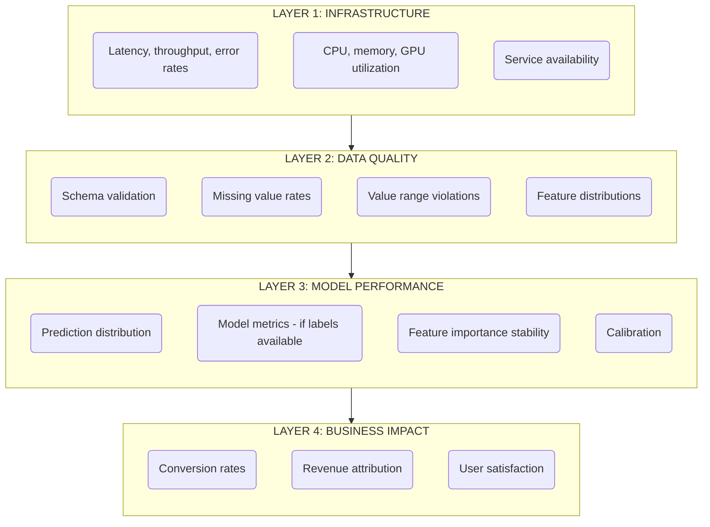
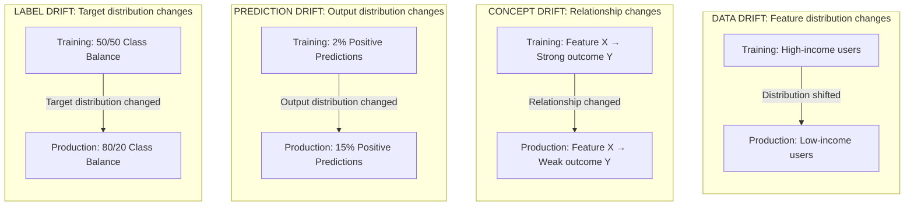
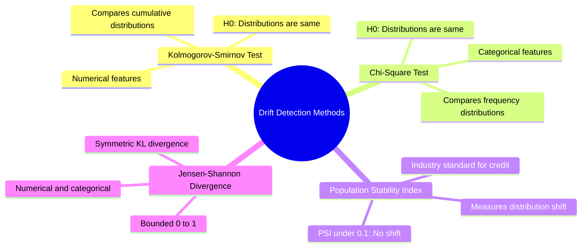
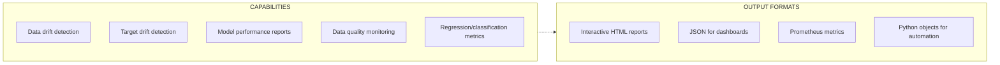
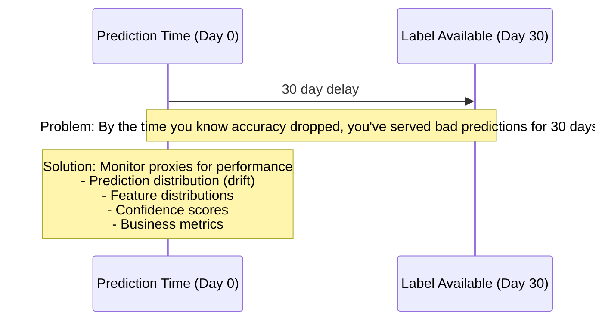

> **Discipline Track** | Complexity: `[COMPLEX]` | Time: 40-45 min

## Prerequisites

Before starting this module:
- [Module 5.4: Model Serving & Inference](../module-5.4-model-serving/)
- [Observability Theory Track](/platform/foundations/observability-theory/) (recommended)
- Understanding of statistical distributions
- Basic Prometheus/Grafana knowledge

## What You'll Be Able to Do

After completing this module, you will be able to:

- **Implement model monitoring systems that detect data drift, prediction drift, and performance degradation**
- **Design alerting policies that trigger model retraining when prediction quality drops below thresholds**
- **Build monitoring dashboards that track model accuracy, latency, and feature distribution over time**
- **Evaluate monitoring approaches — statistical tests, reference windows, population stability — for your models**

## Why This Module Matters

ML models fail silently. A web server crashes—you get an alert. A model returns wrong predictions—nothing happens. The model is "up," returning 200 OK, while making decisions that cost you money, customers, or worse.

Traditional monitoring (latency, uptime, errors) is necessary but insufficient. You need to know: Is the model still accurate? Has the data changed? Are predictions still relevant?

Companies like Uber, Airbnb, and Stripe invest heavily in model monitoring because they've learned the cost of undetected model degradation.

## Did You Know?

- **Model accuracy degrades 2-10% per year** on average without retraining, according to research by Google and Microsoft—faster in volatile domains
- **90% of ML models in production have no performance monitoring**—teams only discover failures through user complaints or revenue drops
- **Uber's ML platform detects data drift** before it impacts predictions, enabling proactive retraining instead of reactive firefighting
- **The time to detect model failure** averages 3-6 months without proper monitoring—by then, significant damage has occurred

## What to Monitor



> **Stop and think**: If your model prediction endpoint returns an HTTP 200 within 50ms, but its predictions are entirely inverted due to a shifted feature, which monitoring layer would catch this first?

### The Four Questions

| Question | Monitoring Layer |
|----------|------------------|
| "Is the service healthy?" | Infrastructure |
| "Is the data valid?" | Data Quality |
| "Is the model accurate?" | Model Performance |
| "Is it working for the business?" | Business Impact |

Most teams only answer question 1. You need all four.

## Understanding Drift

### Types of Drift



### War Story: The Slow Decline

A financial model predicted loan defaults. Initial accuracy: 94%. Twelve months later: 71%. The decline was gradual—no single day showed a dramatic drop.

The problem? Economic conditions changed slowly. Features that predicted defaults in 2019 didn't work in 2020. Without drift monitoring, the team only discovered the problem during quarterly reviews.

A drift detector would have flagged the issue within weeks, not months.

## Drift Detection Methods

### Statistical Tests



### PSI Calculation

```
PSI = Σ (Actual% - Expected%) × ln(Actual% / Expected%)

Example:
Bucket    Training    Production    Contribution
─────────────────────────────────────────────────
0-20%     20%         15%           0.015
20-40%    20%         18%           0.002
40-60%    20%         22%           0.002
60-80%    20%         25%           0.013
80-100%   20%         20%           0.000
─────────────────────────────────────────────────
PSI = 0.032 → No significant drift
```

## Evidently for Drift Detection

Evidently is the leading open-source tool for ML monitoring:



### Evidently Reports

```python
from evidently import ColumnMapping
from evidently.report import Report
from evidently.metric_preset import (
    DataDriftPreset,
    DataQualityPreset,
    TargetDriftPreset,
)

# Column mapping
column_mapping = ColumnMapping(
    target='target',
    prediction='prediction',
    numerical_features=['feature1', 'feature2', 'feature3'],
    categorical_features=['category1', 'category2'],
)

# Create report
report = Report(metrics=[
    DataDriftPreset(),
    DataQualityPreset(),
    TargetDriftPreset(),
])

# Generate report
report.run(
    reference_data=training_data,
    current_data=production_data,
    column_mapping=column_mapping,
)

# Save HTML report
report.save_html("drift_report.html")

# Get results as dict
results = report.as_dict()
drift_detected = results['metrics'][0]['result']['dataset_drift']
```

### Evidently Tests (CI/CD)

```python
from evidently.test_suite import TestSuite
from evidently.tests import (
    TestShareOfDriftedColumns,
    TestNumberOfMissingValues,
    TestValueRange,
)

# Define tests
test_suite = TestSuite(tests=[
    TestShareOfDriftedColumns(lt=0.3),  # Less than 30% columns drifted
    TestNumberOfMissingValues(eq=0),     # No missing values
    TestValueRange(column_name='age', left=0, right=120),
])

# Run tests
test_suite.run(
    reference_data=training_data,
    current_data=production_data,
)

# Check results
if not test_suite.as_dict()['summary']['all_passed']:
    print("Tests failed! Block deployment.")
```

## Monitoring Pipeline

### Architecture


### Prometheus Metrics

```python
from prometheus_client import Counter, Histogram, Gauge, start_http_server

# Define metrics
PREDICTION_COUNT = Counter(
    'model_predictions_total',
    'Total predictions',
    ['model_version', 'prediction_class']
)

PREDICTION_LATENCY = Histogram(
    'model_prediction_latency_seconds',
    'Prediction latency',
    ['model_version'],
    buckets=[0.01, 0.05, 0.1, 0.5, 1.0]
)

FEATURE_VALUE = Gauge(
    'model_feature_value',
    'Feature values',
    ['feature_name']
)

DRIFT_SCORE = Gauge(
    'model_drift_score',
    'Drift score by feature',
    ['feature_name']
)

# Instrument predictions
def predict_with_monitoring(features):
    with PREDICTION_LATENCY.labels(model_version='v1').time():
        prediction = model.predict(features)

    PREDICTION_COUNT.labels(
        model_version='v1',
        prediction_class=str(prediction)
    ).inc()

    # Log feature values
    for name, value in features.items():
        FEATURE_VALUE.labels(feature_name=name).set(value)

    return prediction

# Start metrics server
start_http_server(8000)
```

### Grafana Dashboard

```json
{
  "dashboard": {
    "title": "ML Model Monitoring",
    "panels": [
      {
        "title": "Prediction Volume",
        "type": "graph",
        "targets": [
          {
            "expr": "rate(model_predictions_total[5m])",
            "legendFormat": "{{model_version}}"
          }
        ]
      },
      {
        "title": "Prediction Latency (p99)",
        "type": "graph",
        "targets": [
          {
            "expr": "histogram_quantile(0.99, rate(model_prediction_latency_seconds_bucket[5m]))",
            "legendFormat": "p99"
          }
        ]
      },
      {
        "title": "Drift Score by Feature",
        "type": "gauge",
        "targets": [
          {
            "expr": "model_drift_score",
            "legendFormat": "{{feature_name}}"
          }
        ]
      },
      {
        "title": "Prediction Distribution",
        "type": "piechart",
        "targets": [
          {
            "expr": "sum(model_predictions_total) by (prediction_class)",
            "legendFormat": "{{prediction_class}}"
          }
        ]
      }
    ]
  }
}
```

> **Pause and predict**: If you trigger a PagerDuty alert on every single minor feature that experiences data drift, what will happen to your on-call team after a week? How would you design a smarter, composite alerting strategy?

## Alerting Strategy

### What to Alert On

| Condition | Severity | Action |
|-----------|----------|--------|
| Service down | Critical | Page on-call |
| Latency > SLO | High | Investigate immediately |
| Error rate > 1% | High | Investigate immediately |
| Drift detected (single feature) | Medium | Review within 24h |
| Drift detected (multiple features) | High | Review immediately |
| Accuracy drop > 5% | Critical | Retrain or rollback |
| Prediction distribution shift | Medium | Investigate cause |

### Alert Examples

```yaml
# Prometheus alerting rules
groups:
  - name: ml-model-alerts
    rules:
      - alert: ModelLatencyHigh
        expr: histogram_quantile(0.99, rate(model_prediction_latency_seconds_bucket[5m])) > 0.5
        for: 5m
        labels:
          severity: warning
        annotations:
          summary: "Model latency is high"
          description: "P99 latency is {{ $value }}s (threshold: 0.5s)"

      - alert: ModelDriftDetected
        expr: model_drift_score > 0.25
        for: 1h
        labels:
          severity: warning
        annotations:
          summary: "Data drift detected"
          description: "Feature {{ $labels.feature_name }} has drift score {{ $value }}"

      - alert: PredictionDistributionShift
        expr: |
          abs(
            (sum(rate(model_predictions_total{prediction_class="1"}[1h])) /
             sum(rate(model_predictions_total[1h])))
            -
            0.02  # Expected positive rate
          ) > 0.01
        for: 30m
        labels:
          severity: warning
        annotations:
          summary: "Prediction distribution has shifted"
```

## Performance Monitoring Without Labels

### The Delayed Label Problem



### Proxy Metrics

When you can't measure accuracy directly:

| Proxy Metric | What It Indicates |
|--------------|-------------------|
| Prediction confidence | Model uncertainty |
| Prediction distribution | Overall behavior change |
| Feature drift | Input distribution shift |
| Business metrics | Real-world impact |
| User behavior | Implicit feedback |

### NannyML for Performance Estimation

```python
import nannyml as nml

# Estimate performance without labels
estimator = nml.CBPE(
    y_pred_proba='prediction_probability',
    y_pred='prediction',
    y_true='target',  # Only needed for reference
    metrics=['roc_auc', 'f1'],
    chunk_size=5000,
)

# Fit on reference data (with labels)
estimator.fit(reference_data)

# Estimate on production data (without labels)
estimates = estimator.estimate(production_data)

# Plot
figure = estimates.plot()
```

## Common Mistakes

| Mistake | Problem | Solution |
|---------|---------|----------|
| Only monitoring infrastructure | Model fails silently | Add data and model metrics |
| No reference baseline | Can't detect drift | Store training data statistics |
| Alerting on every drift | Alert fatigue | Set meaningful thresholds |
| No automated response | Manual intervention required | Auto-retrain or auto-rollback |
| Ignoring business metrics | Technical success, business failure | Track conversion, revenue |
| No root cause analysis | Fix symptoms, not causes | Investigate why drift occurred |

## Quiz

Test your understanding:

<details>
<summary>1. Your e-commerce fraud detection model suddenly starts seeing a massive influx of users with IPs from a region it rarely saw during training. At the same time, the relationship between "time on site" and "fraud likelihood" has completely inverted due to a new scam tactic. Which types of drift are you experiencing?</summary>

**Answer**:
You are experiencing both data drift and concept drift simultaneously.
The massive influx of users from a new IP region represents data drift, because the input feature distribution has shifted away from the training baseline. The inversion of the relationship between "time on site" and "fraud likelihood" represents concept drift, because the underlying pattern mapping the features to the target outcome has fundamentally changed. Distinguishing between the two is critical because data drift might only require gathering new representative data, whereas concept drift often necessitates entirely new feature engineering to capture the new scam tactics.
</details>

<details>
<summary>2. You are building a credit scoring model for a highly regulated bank. The compliance team demands a drift detection metric that is easily interpretable, works without immediate true labels, and has widely accepted industry thresholds. Which method should you choose and why?</summary>

**Answer**:
You should choose the Population Stability Index (PSI) for this scenario.
PSI is the established industry standard in financial services and is readily accepted by regulators for credit scoring models. It provides a simple, interpretable number with clear, standardized thresholds (e.g., < 0.1 means no significant shift, > 0.25 means significant shift), making it easy to explain to non-technical stakeholders and compliance officers. Furthermore, PSI only requires comparing the distribution of current model predictions (or features) against the baseline distribution from training, meaning it can be calculated immediately without waiting for delayed true labels (loan defaults).
</details>

<details>
<summary>3. Your ride-sharing company deploys a model to predict rider churn (whether a user will delete the app in the next 30 days). You won't know if a prediction is correct until 30 days have passed, but you need to know today if the new model version is misbehaving. How can you effectively monitor this model right now?</summary>

**Answer**:
You must rely on proxy metrics to monitor the model's performance while waiting for the true labels to mature.
First, you should monitor prediction drift by comparing the overall distribution of churn predictions today against the expected distribution from validation; a sudden spike from 5% to 40% predicted churn indicates a severe issue. Second, you can track feature drift on critical inputs (like recent ride frequency) to ensure the data feeding the model hasn't changed drastically. Finally, you can employ performance estimation techniques (using tools like NannyML) which use the current feature distributions and the model's confidence scores to mathematically estimate what the ROC AUC will likely be once the labels finally arrive.
</details>

<details>
<summary>4. Your on-call engineer gets paged at 2 AM because a single minor feature in your model ("user_browser_version") triggered a data drift alert. The overall model accuracy proxy remains perfectly stable. What is wrong with your alerting strategy, and how should you fix it?</summary>

**Answer**:
Your alerting strategy is overly sensitive and is causing alert fatigue by paging on non-critical, isolated data drift.
Models often contain dozens or hundreds of features, and minor features will naturally drift over time without significantly impacting the final prediction accuracy. Alerts that wake up engineers should be reserved for critical business impact or severe model degradation, not routine statistical shifts in low-importance features. To fix this, you should adjust the alert to only trigger if the drift occurs across multiple features simultaneously, if the drifted feature has high importance (such as a high SHAP value), or if the drift is accompanied by a significant change in the overall prediction distribution.
</details>

## Hands-On Exercise: Build a Monitoring Pipeline

Set up drift detection and alerting:

### Setup

```bash
mkdir ml-monitoring && cd ml-monitoring
python -m venv venv
source venv/bin/activate
pip install evidently pandas scikit-learn prometheus-client
```

### Step 1: Generate Data with Drift

```python
# generate_data.py
import pandas as pd
import numpy as np
from sklearn.datasets import make_classification

np.random.seed(42)

def generate_dataset(n_samples, drift_factor=0.0):
    """Generate classification dataset with optional drift."""
    X, y = make_classification(
        n_samples=n_samples,
        n_features=5,
        n_informative=3,
        n_redundant=1,
        random_state=42
    )

    df = pd.DataFrame(X, columns=[f'feature_{i}' for i in range(5)])
    df['target'] = y

    # Add drift to feature_0 and feature_1
    df['feature_0'] = df['feature_0'] + drift_factor
    df['feature_1'] = df['feature_1'] * (1 + drift_factor * 0.5)

    return df

# Generate reference (training) data
reference = generate_dataset(1000, drift_factor=0.0)
reference.to_parquet('reference_data.parquet')
print("Reference data:")
print(reference.describe())

# Generate production data with drift
production = generate_dataset(1000, drift_factor=0.5)
production.to_parquet('production_data.parquet')
print("\nProduction data (with drift):")
print(production.describe())
```

### Step 2: Create Drift Detection Report

```python
# detect_drift.py
import pandas as pd
from evidently import ColumnMapping
from evidently.report import Report
from evidently.metric_preset import DataDriftPreset, DataQualityPreset

# Load data
reference = pd.read_parquet('reference_data.parquet')
production = pd.read_parquet('production_data.parquet')

# Column mapping
column_mapping = ColumnMapping(
    target='target',
    numerical_features=['feature_0', 'feature_1', 'feature_2', 'feature_3', 'feature_4'],
)

# Create report
report = Report(metrics=[
    DataDriftPreset(),
    DataQualityPreset(),
])

# Run report
report.run(
    reference_data=reference,
    current_data=production,
    column_mapping=column_mapping,
)

# Save HTML report
report.save_html('drift_report.html')
print("Drift report saved to drift_report.html")

# Extract drift results
results = report.as_dict()
drift_info = results['metrics'][0]['result']

print(f"\nDataset drift detected: {drift_info['dataset_drift']}")
print(f"Drifted features: {drift_info['number_of_drifted_columns']}/{drift_info['number_of_columns']}")

for col_name, col_data in drift_info['drift_by_columns'].items():
    if col_data['drift_detected']:
        print(f"  - {col_name}: drift_score={col_data['drift_score']:.4f}")
```

### Step 3: Create Automated Tests

```python
# test_data.py
import pandas as pd
from evidently import ColumnMapping
from evidently.test_suite import TestSuite
from evidently.tests import (
    TestShareOfDriftedColumns,
    TestColumnDrift,
    TestNumberOfMissingValues,
    TestShareOfOutRangeValues,
)

# Load data
reference = pd.read_parquet('reference_data.parquet')
production = pd.read_parquet('production_data.parquet')

# Column mapping
column_mapping = ColumnMapping(
    target='target',
    numerical_features=['feature_0', 'feature_1', 'feature_2', 'feature_3', 'feature_4'],
)

# Define test suite
test_suite = TestSuite(tests=[
    # No more than 30% of columns should drift
    TestShareOfDriftedColumns(lt=0.3),

    # Specific column tests
    TestColumnDrift(column_name='feature_0'),
    TestColumnDrift(column_name='feature_1'),

    # Data quality
    TestNumberOfMissingValues(eq=0),
])

# Run tests
test_suite.run(
    reference_data=reference,
    current_data=production,
    column_mapping=column_mapping,
)

# Check results
results = test_suite.as_dict()

print("Test Results:")
print(f"All passed: {results['summary']['all_passed']}")
print(f"Success: {results['summary']['success_tests']}")
print(f"Failed: {results['summary']['failed_tests']}")

for test in results['tests']:
    status = "✓" if test['status'] == 'SUCCESS' else "✗"
    print(f"  {status} {test['name']}: {test['status']}")

# Exit with error if tests fail
if not results['summary']['all_passed']:
    print("\nTests failed! Would block deployment.")
    exit(1)
```

### Step 4: Add Prometheus Metrics

```python
# monitoring_service.py
from prometheus_client import start_http_server, Gauge
import pandas as pd
import time
from evidently import ColumnMapping
from evidently.report import Report
from evidently.metric_preset import DataDriftPreset

# Prometheus metrics
DRIFT_SCORE = Gauge('model_drift_score', 'Drift score by feature', ['feature'])
DATASET_DRIFT = Gauge('model_dataset_drift', 'Overall dataset drift detected')

def calculate_drift():
    """Calculate drift and update metrics."""
    reference = pd.read_parquet('reference_data.parquet')
    production = pd.read_parquet('production_data.parquet')

    column_mapping = ColumnMapping(
        target='target',
        numerical_features=['feature_0', 'feature_1', 'feature_2', 'feature_3', 'feature_4'],
    )

    report = Report(metrics=[DataDriftPreset()])
    report.run(reference_data=reference, current_data=production, column_mapping=column_mapping)

    results = report.as_dict()
    drift_info = results['metrics'][0]['result']

    # Update metrics
    DATASET_DRIFT.set(1 if drift_info['dataset_drift'] else 0)

    for col_name, col_data in drift_info['drift_by_columns'].items():
        DRIFT_SCORE.labels(feature=col_name).set(col_data['drift_score'])

    print(f"Drift metrics updated. Dataset drift: {drift_info['dataset_drift']}")

# Start metrics server
start_http_server(8000)
print("Metrics server started on :8000")

# Update metrics periodically
while True:
    calculate_drift()
    time.sleep(60)  # Update every minute
```

### Step 5: View Results

```bash
# Generate data
python generate_data.py

# Run drift detection
python detect_drift.py
# Open drift_report.html in browser

# Run tests
python test_data.py

# Start metrics server
python monitoring_service.py

# In another terminal, view metrics
curl localhost:8000/metrics | grep model_
```

### Success Criteria

You've completed this exercise when you can:
- [ ] Generate reference and production data with drift
- [ ] Create HTML drift report
- [ ] Run automated drift tests
- [ ] Export drift metrics to Prometheus format
- [ ] Identify which features drifted

## Key Takeaways

1. **ML needs additional monitoring**: Infrastructure monitoring isn't enough
2. **Drift detection catches problems early**: Before accuracy degrades
3. **Labels are often delayed**: Use proxy metrics for immediate feedback
4. **Automate responses**: Alert, then retrain or rollback
5. **Business metrics matter most**: Technical success ≠ business success

## Further Reading

- [Evidently Documentation](https://docs.evidentlyai.com/) — ML monitoring library
- [NannyML Documentation](https://nannyml.readthedocs.io/) — Performance estimation
- [Monitoring ML Models in Production](https://christophergs.com/machine%20learning/2020/03/14/how-to-monitor-machine-learning-models/) — Comprehensive guide
- [Google's ML Test Score](https://research.google/pubs/pub46555/) — ML testing best practices

## Summary

Model monitoring goes beyond infrastructure observability. You need to track data quality, drift detection, and business impact. Statistical tests (KS, PSI, chi-square) detect distribution changes. Evidently provides comprehensive reports and automated tests. When labels are delayed, use proxy metrics. The goal is catching problems before users do—proactive retraining instead of reactive firefighting.

---

## Next Module

Continue to [Module 5.6: ML Pipelines & Automation](../module-5.6-ml-pipelines/) to learn how to automate the entire ML lifecycle.