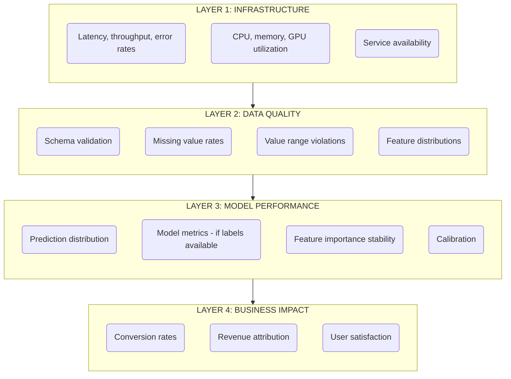
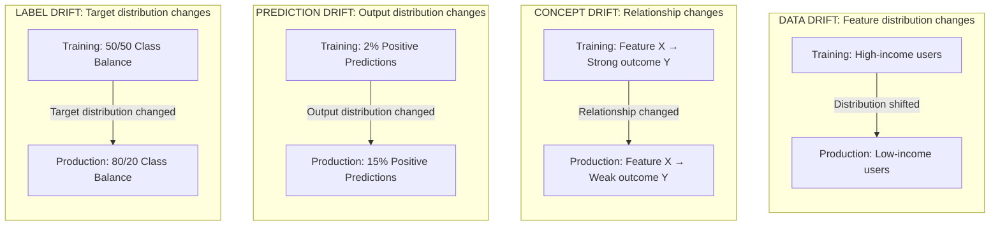
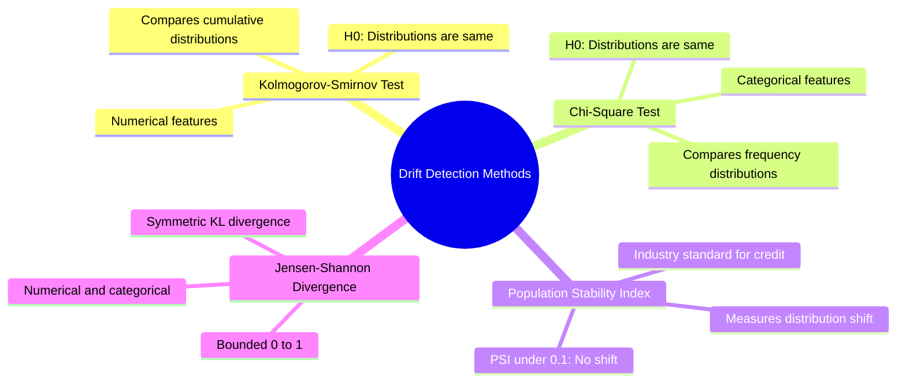
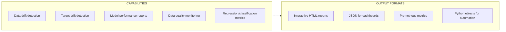
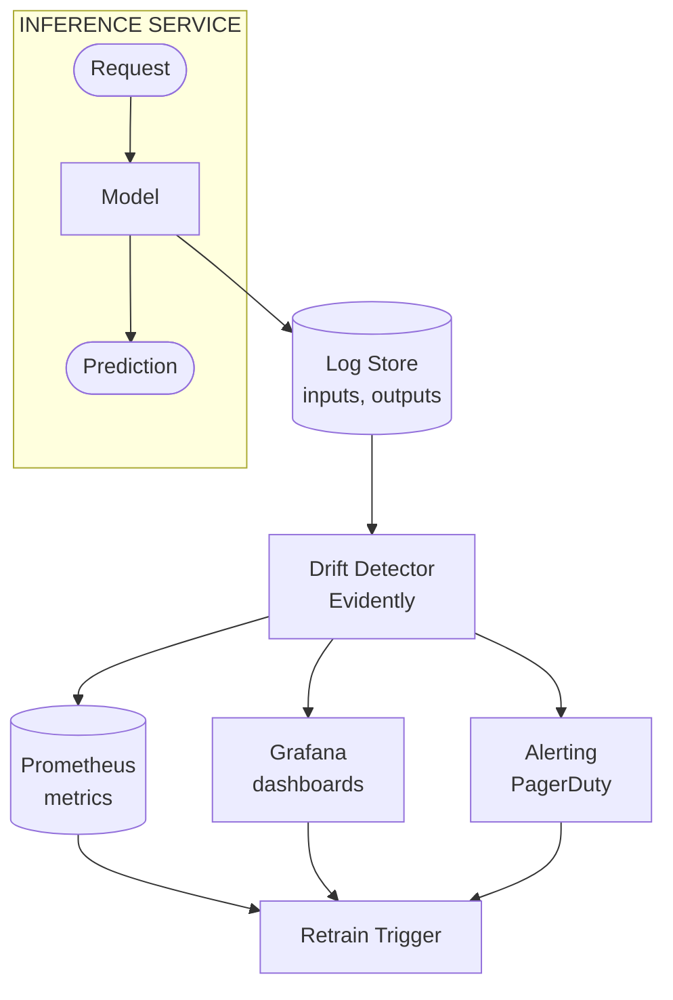
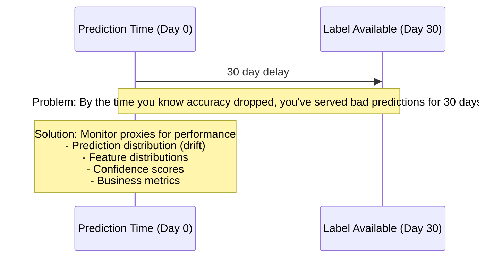

> **Discipline Track** | Complexity: `[COMPLEX]` | Time: 40-45 min

## Prerequisites

Before starting this module:

- [Module 5.4: Model Serving & Inference](../module-5.4-model-serving/)
- [Observability Theory Track](/platform/foundations/observability-theory/) recommended
- Understanding of statistical distributions
- Basic Prometheus and Grafana knowledge
- Familiarity with model evaluation metrics such as precision, recall, F1, ROC AUC, and calibration

## Learning Outcomes

After completing this module, learners will be able to:

- **Design** a layered monitoring strategy that separates infrastructure health, data quality, model behavior, and business impact.
- **Diagnose** data drift, prediction drift, label drift, and concept drift using production symptoms and available evidence.
- **Implement** runnable drift checks, Prometheus metrics, and alert rules that turn model behavior into observable signals.
- **Evaluate** monitoring approaches such as statistical tests, reference windows, Population Stability Index, proxy metrics, and delayed-label performance estimation.
- **Justify** alerting and response policies that balance fast detection with low alert fatigue and clear operational ownership.

## Why This Module Matters

A machine learning service can be healthy while the model inside it is failing.

The load balancer may report green status.

The API may return HTTP 200 in under 50 ms.

The container may have stable CPU, memory, and GPU utilization.

The business may still be losing money because the model is confidently making stale decisions.

That is the central operational trap of production machine learning.

Traditional software tends to fail loudly.

A process exits.

A dependency times out.

An error rate spikes.

A disk fills.

A model can fail quietly because the serving path still works.

The input distribution can shift.

The meaning of a feature can change.

A fraud pattern can evolve.

A recommender can start over-promoting low-quality content.

A credit model can become unfair to a newly common applicant segment.

A churn model can keep predicting with low latency while no longer predicting churn.

Model monitoring exists because production ML has two contracts.

The first contract is the software contract: the service must be available, fast, and reliable.

The second contract is the statistical contract: the data seen in production must remain close enough to the data and relationships the model learned from.

Senior MLOps practice treats both contracts as first-class production concerns.

When monitoring only checks uptime, model failures are discovered through complaints, revenue movement, compliance reviews, or post-incident analysis.

When monitoring includes data quality, drift, prediction behavior, delayed labels, and business outcomes, teams can detect degradation early enough to investigate, retrain, roll back, or route traffic away from risky model versions.

This module builds that monitoring system from first principles.

It starts with the failure modes.

It then adds drift detection.

It turns drift into metrics.

It designs alerts that humans can act on.

It closes with a hands-on pipeline that creates reference data, injects drift, computes scores, exports Prometheus metrics, and tests the result.

## 1. Monitoring Starts With Failure Modes

Model observability begins with a simple question.

What could be wrong even when the endpoint is up?

A model endpoint is a software system, a data system, a statistical system, and a business decision system at the same time.

Each layer can fail independently.

A model service can be down.

A model service can be slow.

A model service can receive malformed records.

A model service can receive valid records from a changed population.

A model service can produce a changed prediction distribution.

A model service can still look statistically stable while the business process around it has changed.

Good monitoring separates these layers because each layer answers a different operational question.



The diagram is intentionally layered.

Infrastructure monitoring answers whether the service can respond.

Data quality monitoring answers whether the input records are valid.

Model performance monitoring answers whether the model behavior is still plausible.

Business impact monitoring answers whether the model is helping the system it was built to improve.

A useful monitoring design asks all four questions.

| Question | Monitoring Layer |
|----------|------------------|
| "Is the service healthy?" | Infrastructure |
| "Is the data valid?" | Data Quality |
| "Is the model accurate?" | Model Performance |
| "Is it working for the business?" | Business Impact |

Most immature deployments answer only the first question.

That is enough for a normal stateless API.

It is not enough for production ML.

Consider a ranking model that chooses which products appear at the top of a marketplace.

If the endpoint is down, infrastructure monitoring catches it.

If request payloads start missing `user_country`, schema validation catches it.

If the model starts predicting high relevance for a much larger share of items, prediction monitoring catches it.

If conversion rate drops while every technical metric looks stable, business monitoring catches it.

Each layer reduces blind spots from the layer below it.

A senior monitoring design does not page every team for every layer.

It routes signals by ownership.

The platform team owns availability and latency.

The data platform team owns ingestion and schema quality.

The ML team owns drift, calibration, and model metrics.

The product or business owner owns whether model behavior still improves the intended outcome.

Those ownership boundaries matter because unowned alerts become ignored alerts.

> **Active learning prompt**: An endpoint returns HTTP 200 within 50 ms, but a recently changed feature encoding inverts predictions for a high-value customer segment. Which layer should detect the first symptom, and which layer confirms the business impact?

A strong answer separates detection from confirmation.

The data quality layer may detect the encoding change if the value distribution changes or the schema validator catches a categorical mismatch.

The model performance layer may detect a prediction distribution shift or confidence collapse.

The business layer confirms whether the shift affects customer outcomes.

No single layer is sufficient.

The practical goal is not to build a dashboard with every possible chart.

The practical goal is to create a short path from symptom to decision.

A good model monitoring dashboard helps an on-call engineer answer:

- Is the service broken?
- Is the input data broken?
- Is the model behaving differently?
- Is the business outcome moving?
- Which model version, feature group, or data source changed first?
- Is this severe enough to page, retrain, roll back, or investigate during business hours?

A poor dashboard is a collection of attractive charts without an operating model.

A useful dashboard is an incident tool.

### Infrastructure Signals

Infrastructure signals are the same signals used for other production services.

They include latency, throughput, saturation, availability, restart counts, and error rates.

For model serving, infrastructure signals should be labeled by model version.

Without the model version label, a rollout can hide the difference between a healthy old model and a slow new model.

Useful infrastructure metrics include:

- Request rate per model version.
- Error rate per model version.
- P50, P95, and P99 latency.
- Queue depth for batch or async inference.
- CPU, memory, GPU, and accelerator utilization.
- Container restarts and readiness failures.
- Dependency latency for feature stores, vector databases, and embedding services.

Infrastructure signals are necessary because a statistically perfect model is useless when the service is unavailable.

They are insufficient because a statistically broken model can still be available.

### Data Quality Signals

Data quality signals protect the model from invalid input.

They are usually cheaper and faster to detect than model performance degradation.

Useful data quality metrics include:

- Missing value rate per feature.
- Unexpected nulls in required fields.
- Categorical values outside the known vocabulary.
- Numeric values outside expected ranges.
- Schema version mismatch.
- Feature freshness and event-time lag.
- Duplicate request rate.
- Join success rate for online features.
- Training-serving skew indicators.

A feature can pass schema validation and still drift.

For example, an `age` feature can remain numeric and non-null while the population shifts from mostly adults to mostly teenagers.

That is why data quality checks and drift checks are related but not identical.

Data quality asks whether the data is valid.

Drift asks whether the data is familiar.

### Model Behavior Signals

Model behavior signals observe the model output directly.

They are valuable even when labels are delayed.

Useful model behavior metrics include:

- Prediction distribution by class or score bucket.
- Mean and percentile prediction confidence.
- Share of high-risk decisions.
- Calibration buckets when labels are available.
- Estimated performance when labels are delayed.
- Feature attribution stability for high-impact models.
- Model version comparison during canary or shadow deployments.

A binary classifier that normally predicts positive 2% of the time and suddenly predicts positive 20% of the time may be experiencing data drift, concept drift, a broken feature, or a legitimate external event.

The monitoring signal does not prove the cause.

It identifies where investigation should begin.

### Business Impact Signals

Business impact signals connect model behavior to the reason the model exists.

They are often the slowest to interpret because many business metrics have confounders.

A recommendation model may affect conversion rate, but conversion rate is also affected by pricing, inventory, seasonality, marketing, and site performance.

This does not make business metrics optional.

It means they must be interpreted with context.

Useful business impact metrics include:

- Conversion rate.
- Revenue per session.
- Fraud loss.
- Chargeback rate.
- False-positive manual review cost.
- Customer support contacts.
- User satisfaction.
- Retention.
- Time saved by automation.
- Human override rate.

The best model monitoring systems connect technical and business signals without pretending the relationship is always simple.

For example, a fraud model may show stable precision and recall on delayed labels, but manual reviewers may report a surge in edge cases.

That human feedback is an operational signal.

It belongs in the monitoring conversation.

## 2. Understanding Drift

Drift means the statistical world around the model has changed.

That definition is broad because production change is broad.

Sometimes the input population changes.

Sometimes the relationship between features and target changes.

Sometimes the model output distribution changes.

Sometimes the label distribution changes.

Each drift type points to a different investigation path.



Data drift is a change in input feature distributions.

A fraud model trained mostly on domestic transactions may start receiving many international transactions.

A demand forecasting model trained before a new pricing strategy may see a changed distribution of discounts.

A support routing model may see more messages from a new product line.

Data drift does not always mean the model is wrong.

It means the model is operating in a region that may be less represented in training.

Concept drift is a change in the relationship between inputs and the target.

The same feature values no longer imply the same outcome.

A fraudster behavior pattern changes.

A promotion changes how customers respond to price.

A hiring model trained on historical patterns no longer matches a corrected recruiting process.

Concept drift is harder than data drift because it may not be visible from input distributions alone.

It often requires labels, proxy metrics, experiments, or domain investigation.

Prediction drift is a change in the output distribution.

A classifier that used to approve 30% of applications now approves 60%.

A recommender that used to spread impressions across categories now concentrates them in one category.

A risk model that used to produce well-distributed scores now clusters around a narrow band.

Prediction drift is easy to measure because predictions are available immediately.

It is also ambiguous because prediction drift can be caused by legitimate population change, a broken feature, a changed threshold, a model bug, or a real-world event.

Label drift is a change in the target distribution.

A default model may face a different default rate during an economic downturn.

A diagnosis model may see a changed disease prevalence.

A churn model may experience changed churn rates after a pricing change.

Label drift often arrives late because labels are frequently delayed.

In many production systems, the true outcome is known days, weeks, or months after prediction time.

### War Story: The Slow Decline

A financial model predicted loan defaults.

Initial accuracy was 94%.

Twelve months later, accuracy had fallen to 71%.

The decline was gradual.

No single day looked catastrophic.

No outage occurred.

No deployment failed.

No endpoint breached its latency SLO.

The problem was that economic conditions changed slowly.

Features that predicted defaults in one year were weaker in the next year.

The model continued to serve predictions with excellent uptime.

The business process trusted those predictions because no monitoring signal said otherwise.

Quarterly review eventually exposed the drop.

By then, bad approvals and bad rejections had already accumulated.

A drift detector would not have solved the whole problem.

It would have shortened the time to investigation.

A delayed-label performance monitor would have shown the metric trend as labels matured.

A business metric dashboard would have raised concern before the quarterly review.

A retraining policy would have given the team a prepared response instead of an emergency meeting.

The lesson is not that drift detection is magic.

The lesson is that production ML needs early warning signals because ground truth often arrives late.

### Drift Is a Symptom, Not a Root Cause

Drift detection says that something changed.

It does not say why the change happened.

A changed feature distribution may be caused by:

- A new marketing campaign.
- A new customer segment.
- A data pipeline bug.
- A missing join.
- A changed upstream schema.
- A seasonal event.
- A product launch.
- A changed feature encoding.
- A real-world event.
- A bot or abuse pattern.

A changed prediction distribution may be caused by:

- Feature drift.
- Concept drift.
- Threshold change.
- Model version change.
- Broken preprocessing.
- Missing online feature values.
- Traffic mix change.
- Canary routing error.
- Legitimate product growth.

This is why drift alerts should include investigation context.

An alert that only says `drift detected` is weak.

A useful alert says which feature drifted, how severe the shift is, which model version is affected, when it started, whether prediction distribution also moved, and whether business metrics are moving.

### Reference Windows

Every drift detector compares current data to reference data.

The reference window is the baseline.

Choosing that baseline is one of the most important monitoring decisions.

A poor baseline creates noisy alerts or missed degradation.

Common reference choices include:

- Training dataset.
- Validation dataset.
- First stable production week after launch.
- Rolling production window.
- Seasonally matched historical window.
- Champion model traffic during a canary.
- Human-reviewed golden dataset.

The training dataset is easy to store and explain.

It may not represent production well if training data was sampled, filtered, or cleaned differently.

The validation dataset is useful for model evaluation alignment.

It may be too small or too stale.

A stable production window often represents reality better.

It can still encode past problems if the production system was already degraded.

A rolling window adapts to gradual change.

It can also normalize bad behavior if the model slowly degrades.

A seasonally matched window is valuable for businesses with weekly, monthly, or yearly patterns.

For example, retail traffic in late November should not always be compared to traffic in early March.

Senior teams often use multiple baselines.

They compare current data against the training baseline to detect model assumption drift.

They compare current data against recent production data to detect sudden incidents.

They compare current data against seasonally matched data to avoid predictable false positives.

> **Active learning prompt**: A grocery delivery model sees a large spike in evening orders every Friday. A drift detector compares Friday evening traffic to the average of all weekday mornings and pages weekly. Is the model drifting, or is the baseline wrong? What reference window would reduce noise?

The best answer is that the baseline is mismatched.

The model may be seeing a normal weekly pattern.

A seasonally matched reference window, such as previous Friday evenings, would be a better comparison.

The detector should not force humans to rediscover calendar patterns every week.

### Drift Severity

Not every drift event deserves the same response.

A low-importance feature drifting slightly may be a ticket.

A high-importance feature drifting severely may be an immediate investigation.

Multiple features drifting together may indicate a data pipeline incident.

Prediction distribution shifting while feature distributions appear stable may indicate concept drift, threshold change, or an internal model behavior change.

Severity should consider:

- Magnitude of the statistical shift.
- Number of drifted features.
- Feature importance.
- Affected traffic volume.
- Model criticality.
- Regulatory or safety risk.
- Prediction distribution change.
- Business metric movement.
- Whether labels confirm performance degradation.
- Whether the shift is expected from known events.

A senior alerting policy does not treat all drift as equal.

It combines statistical evidence with operational context.

## 3. Drift Detection Methods and Baselines

There is no universal drift test.

A detector is a comparison between two samples.

The right comparison depends on data type, sample size, model risk, and operational need.

The most useful production systems use a small set of well-understood tests rather than a large set of poorly interpreted scores.



The Kolmogorov-Smirnov test is commonly used for numeric features.

It compares cumulative distributions.

It is sensitive to differences in shape, location, and spread.

It can be very sensitive with large sample sizes, so practical thresholds matter.

The chi-square test is commonly used for categorical features.

It compares observed frequencies against expected frequencies.

It works best when categories have enough observations.

Rare categories often need grouping into an `other` bucket.

Population Stability Index, or PSI, is common in credit risk and regulated financial contexts.

It bins values and measures how much production proportions differ from reference proportions.

It is interpretable for stakeholders who need a single score.

It is also sensitive to binning decisions.

Jensen-Shannon divergence compares probability distributions.

It is symmetric and bounded, which makes it easier to reason about than raw KL divergence.

It can work for categorical distributions and binned numeric distributions.

No method removes the need for judgment.

A statistical test can show that distributions differ.

The team must decide whether the difference matters.

### PSI Calculation

```
PSI = Σ (Actual% - Expected%) × ln(Actual% / Expected%)

Example:
Bucket    Training    Production    Contribution
─────────────────────────────────────────────────
0-20%     20%         15%           0.015
20-40%    20%         18%           0.002
40-60%    20%         22%           0.002
60-80%    20%         25%           0.013
80-100%   20%         20%           0.000
─────────────────────────────────────────────────
PSI = 0.032 → No significant drift
```

This worked example uses equally sized reference buckets.

The production distribution is slightly shifted toward higher buckets.

The final score is low, so the detector would not treat it as severe drift.

The example is simple, but it demonstrates the operating idea.

A PSI score is not a model metric.

It does not measure accuracy.

It measures distribution movement.

### Worked Example: Computing PSI

The following script computes PSI for a single numeric feature.

It is intentionally small enough to inspect.

It avoids a monitoring framework so the mechanics are visible.

```python
# psi_example.py
from __future__ import annotations

import math

REFERENCE = [10, 12, 14, 15, 18, 22, 25, 28, 31, 34, 36, 39]
CURRENT = [12, 14, 19, 21, 26, 29, 33, 36, 40, 44, 46, 52]


def make_edges(values: list[float], buckets: int) -> list[float]:
    sorted_values = sorted(values)
    edges = [sorted_values[0]]

    for index in range(1, buckets):
        position = int(index * len(sorted_values) / buckets)
        edges.append(sorted_values[position])

    edges.append(sorted_values[-1] + 0.000001)
    return edges


def bucket_counts(values: list[float], edges: list[float]) -> list[int]:
    counts = [0 for _ in range(len(edges) - 1)]

    for value in values:
        for index in range(len(edges) - 1):
            if edges[index] <= value < edges[index + 1]:
                counts[index] += 1
                break

    return counts


def population_stability_index(
    reference_values: list[float],
    current_values: list[float],
    buckets: int = 5,
) -> float:
    edges = make_edges(reference_values, buckets)
    reference_counts = bucket_counts(reference_values, edges)
    current_counts = bucket_counts(current_values, edges)

    score = 0.0
    epsilon = 0.000001

    for reference_count, current_count in zip(reference_counts, current_counts):
        expected = max(reference_count / len(reference_values), epsilon)
        actual = max(current_count / len(current_values), epsilon)
        score += (actual - expected) * math.log(actual / expected)

    return score


if __name__ == "__main__":
    psi = population_stability_index(REFERENCE, CURRENT)
    print(f"psi={psi:.4f}")

    if psi < 0.1:
        print("interpretation=no meaningful shift")
    elif psi < 0.25:
        print("interpretation=moderate shift, investigate during business hours")
    else:
        print("interpretation=significant shift, investigate urgently")
```

Run it with the virtual environment Python used for the project:

```bash
.venv/bin/python psi_example.py
```

Expected output will look like this:

```text
psi=0.1352
interpretation=moderate shift, investigate during business hours
```

This example has a key lesson.

The detector does not say the model is wrong.

It says the current feature distribution differs enough from the reference distribution to justify investigation.

The next step is to compare this feature against prediction distribution, feature importance, business context, and any delayed labels.

### Choosing Thresholds

Thresholds are not universal laws.

A PSI threshold from credit risk may not fit an image model, recommender, or fraud model.

A tiny p-value may be meaningless at very large traffic volumes.

A large drift score may be expected during a known seasonal event.

Thresholds should be calibrated with historical backtesting.

A practical thresholding workflow looks like this:

1. Collect historical production windows.
2. Mark known incidents, known seasonal events, and known stable periods.
3. Run candidate drift checks across those windows.
4. Measure false positives during stable periods.
5. Measure whether known incidents would have been detected early.
6. Set thresholds that match operational tolerance.
7. Revisit thresholds after major product, traffic, or model changes.

This process turns drift detection from a theoretical statistic into an operational control.

### Feature Importance and Drift

Feature drift severity depends partly on feature importance.

If a rarely used metadata feature drifts, the model may not care.

If the top predictive feature drifts, the risk is much higher.

Feature importance can come from:

- Model-native importance.
- Permutation importance.
- SHAP values.
- Monotonic constraints in regulated models.
- Domain knowledge.
- Business criticality.

Feature importance must be handled carefully.

A feature can be low importance globally but critical for a small protected segment.

A feature can be high importance because it leaks the target in training but fails in production.

A feature can drift because a pipeline bug replaced real values with defaults.

The monitoring system should support slicing by segment.

A drift detector that only looks at the global dataset can hide severe drift in a minority segment.

For example, a model may be stable overall while failing for a new region that represents 5% of traffic.

Segment-level monitoring is where senior practice begins.

Useful slices include:

- Geography.
- Device type.
- Customer tier.
- Product category.
- Traffic source.
- Model version.
- Feature store version.
- Data producer.
- Protected or compliance-sensitive groups where legally and ethically appropriate.

Segment monitoring must also avoid exploding metric cardinality.

Prometheus labels should not include unbounded user IDs, request IDs, or raw feature values.

The system should aggregate slices into controlled dimensions.

### Training-Serving Skew

Training-serving skew happens when the model sees different feature logic during training and serving.

It is one of the most common causes of production model failure.

Examples include:

- Training uses batch-computed features while serving uses online features with different freshness.
- Training fills missing values with median values while serving fills them with zeros.
- Training normalizes with one statistics file while serving uses another.
- Training includes a feature that is not available at prediction time.
- Serving uses a different categorical vocabulary than training.
- Time windows are calculated with different boundaries.

Drift detection may catch training-serving skew after deployment.

Better systems prevent skew earlier with shared feature definitions, feature store validation, and contract tests.

Monitoring is still needed because even shared systems can fail.

A good monitoring system reports feature freshness, missing rates, and value distributions alongside model outputs.

That combination helps separate a data pipeline incident from a legitimate population shift.

## 4. From Reports to Production Signals

A report is useful during analysis.

A production monitoring system needs continuous signals.

That distinction matters.

A notebook-based drift report can help a data scientist investigate.

It does not automatically wake the right team, annotate a deployment, trigger a rollback, or start a retraining workflow.

Production monitoring turns checks into metrics, dashboards, alerts, and response decisions.

### Evidently for Drift Detection

Evidently is a common open-source tool for ML monitoring reports and tests.

It can generate interactive reports, structured outputs, and checks suitable for automated workflows.



A report-oriented workflow is useful for investigation.

A test-oriented workflow is useful for gates.

A metrics-oriented workflow is useful for continuous monitoring.

Those three workflows serve different moments.

During model development, reports help compare training and validation data.

During CI/CD, tests can block a deployment if a candidate model fails data checks.

During production, metrics show whether current traffic is changing.

A mature platform often supports all three.

The most important design choice is not the tool name.

The important choice is where the monitoring check runs.

Monitoring checks can run:

- Inline during inference.
- Asynchronous from request logs.
- In batch over production windows.
- In CI/CD before deployment.
- In shadow traffic comparison.
- In canary analysis.
- After labels arrive.

Inline checks provide immediate feedback.

They can increase latency and reduce availability if implemented poorly.

Asynchronous checks are safer for serving latency.

They may detect problems later.

Batch checks are simpler and cheaper.

They may miss fast-moving incidents.

Canary checks compare old and new model versions during rollout.

They are powerful when traffic routing supports them.

Delayed-label checks provide the strongest performance evidence.

They arrive too late to be the only signal.

### Monitoring Pipeline

The core pipeline captures inputs and outputs, computes checks, exports metrics, and links alerts to response actions.



The log store is a critical component.

Without logged inputs and outputs, the team cannot reconstruct what the model saw.

Logs should include enough context for debugging without violating privacy or compliance rules.

Common logged fields include:

- Request timestamp.
- Model name.
- Model version.
- Feature schema version.
- Feature values or safe aggregates.
- Prediction.
- Prediction score or probability.
- Decision threshold.
- Request segment.
- Data source versions.
- Correlation ID.
- Later label join key where allowed.

Sensitive fields should be minimized, hashed, tokenized, aggregated, or excluded according to policy.

A model monitoring system is also a data governance system.

Storing every raw feature forever is rarely acceptable.

A senior design defines retention, access control, and redaction.

### Prometheus Metrics

Prometheus is not a feature store.

It is not a data warehouse.

It is a time-series monitoring system.

That makes it excellent for aggregated model signals and dangerous for high-cardinality raw data.

The following example instruments prediction count, latency, feature aggregates, and drift scores.

It includes a tiny runnable model stub so the file can execute as a demonstration.

```python
# monitoring_metrics_demo.py
from __future__ import annotations

import random
import time

from prometheus_client import Counter, Gauge, Histogram, start_http_server

PREDICTION_COUNT = Counter(
    "model_predictions_total",
    "Total predictions",
    ["model_version", "prediction_class"],
)

PREDICTION_LATENCY = Histogram(
    "model_prediction_latency_seconds",
    "Prediction latency",
    ["model_version"],
    buckets=[0.01, 0.05, 0.1, 0.5, 1.0],
)

FEATURE_VALUE = Gauge(
    "model_feature_value",
    "Latest aggregate feature value",
    ["feature_name"],
)

DRIFT_SCORE = Gauge(
    "model_drift_score",
    "Drift score by feature",
    ["feature_name"],
)


class DemoModel:
    def predict(self, features: dict[str, float]) -> int:
        score = 0.7 * features["account_age_days"] - 1.2 * features["failed_logins"]
        return 1 if score < 5 else 0


MODEL = DemoModel()


def predict_with_monitoring(features: dict[str, float]) -> int:
    model_version = "v1"

    with PREDICTION_LATENCY.labels(model_version=model_version).time():
        prediction = MODEL.predict(features)

    PREDICTION_COUNT.labels(
        model_version=model_version,
        prediction_class=str(prediction),
    ).inc()

    for name, value in features.items():
        FEATURE_VALUE.labels(feature_name=name).set(value)

    return prediction


def simulate_drift_score(features: dict[str, float]) -> None:
    account_age_score = min(abs(features["account_age_days"] - 30) / 100, 1.0)
    failed_login_score = min(abs(features["failed_logins"] - 1) / 10, 1.0)

    DRIFT_SCORE.labels(feature_name="account_age_days").set(account_age_score)
    DRIFT_SCORE.labels(feature_name="failed_logins").set(failed_login_score)


if __name__ == "__main__":
    start_http_server(8000)
    print("metrics server listening on 127.0.0.1:8000")

    while True:
        sample = {
            "account_age_days": random.uniform(1, 120),
            "failed_logins": random.uniform(0, 8),
        }
        predict_with_monitoring(sample)
        simulate_drift_score(sample)
        time.sleep(2)
```

Run the file and inspect metrics from another terminal:

```bash
.venv/bin/python monitoring_metrics_demo.py
curl -s 127.0.0.1:8000/metrics | grep model_
```

This example deliberately uses controlled labels.

It labels by model version, prediction class, and feature name.

It does not label by user ID.

It does not label by request ID.

It does not label by raw feature value.

Those would create unbounded cardinality and damage the monitoring system.

### Grafana Dashboard

A useful Grafana dashboard should move from service health to model behavior to business context.

The JSON below preserves the key dashboard panels from the previous module and keeps the focus on operational diagnosis.

```json
{
  "dashboard": {
    "title": "ML Model Monitoring",
    "panels": [
      {
        "title": "Prediction Volume",
        "type": "graph",
        "targets": [
          {
            "expr": "rate(model_predictions_total[5m])",
            "legendFormat": "{{model_version}}"
          }
        ]
      },
      {
        "title": "Prediction Latency (p99)",
        "type": "graph",
        "targets": [
          {
            "expr": "histogram_quantile(0.99, rate(model_prediction_latency_seconds_bucket[5m]))",
            "legendFormat": "p99"
          }
        ]
      },
      {
        "title": "Drift Score by Feature",
        "type": "gauge",
        "targets": [
          {
            "expr": "model_drift_score",
            "legendFormat": "{{feature_name}}"
          }
        ]
      },
      {
        "title": "Prediction Distribution",
        "type": "piechart",
        "targets": [
          {
            "expr": "sum(model_predictions_total) by (prediction_class)",
            "legendFormat": "{{prediction_class}}"
          }
        ]
      }
    ]
  }
}
```

A production dashboard should usually add annotations.

Deployment annotations show when a model version changed.

Data pipeline annotations show when upstream data changed.

Experiment annotations show when traffic routing changed.

Incident annotations show when prior investigations started.

Without annotations, humans waste time matching metric changes to operational events.

### Designing Dashboard Flow

Dashboard order matters.

A good dashboard should support incident triage.

One practical order is:

1. Model service availability.
2. Request rate and traffic mix.
3. Error rate and latency.
4. Model version distribution.
5. Data quality checks.
6. Feature drift summary.
7. Prediction distribution.
8. Segment-level drift for high-risk slices.
9. Delayed-label performance when available.
10. Business outcome metrics.
11. Recent deployments and data changes.

This order follows the likely investigation path.

First check whether the service is broken.

Then check whether traffic changed.

Then check whether input data changed.

Then check whether predictions changed.

Then check whether outcomes changed.

A dashboard that starts with ten unrelated gauges creates cognitive load.

A dashboard that tells an investigation story reduces cognitive load.

> **Active learning prompt**: A dashboard shows stable latency, stable request volume, no schema violations, a large drift score on `merchant_category`, and a positive prediction rate that doubled in two hours. What should be checked before triggering retraining?

A strong answer checks upstream data changes, known business events, category vocabulary changes, traffic segment shifts, and model version rollout before retraining.

Retraining is not the first response to every drift event.

If the category mapping broke, retraining would hide the data bug rather than fix it.

If a legitimate campaign changed traffic, retraining may be appropriate later but not as an emergency fix.

## 5. Alerting and Response Design

Alerting is where many model monitoring systems fail.

A team builds drift checks.

The checks produce many signals.

Every signal becomes a page.

The on-call engineer gets paged for low-risk statistical movement.

After enough noisy pages, the team distrusts the monitoring system.

Alerting should be designed around actionability.

A page means immediate human action is required.

A ticket means investigation is needed but can wait.

A dashboard-only signal means context should be visible during review.

A retraining trigger means the system can start a controlled workflow.

A rollback trigger means the risk is high enough to reduce exposure.

### What to Alert On

| Condition | Severity | Action |
|-----------|----------|--------|
| Service down | Critical | Page on-call |
| Latency > SLO | High | Investigate immediately |
| Error rate > 1% | High | Investigate immediately |
| Drift detected (single feature) | Medium | Review within 24h |
| Drift detected (multiple features) | High | Review immediately |
| Accuracy drop > 5% | Critical | Retrain or rollback |
| Prediction distribution shift | Medium | Investigate cause |

This table is a starting point.

It should not be copied blindly.

A fraud model with high financial exposure may treat prediction distribution shift as high severity.

A low-risk content tagging model may treat the same shift as a business-hours ticket.

The severity should match user impact, business risk, and regulatory exposure.

### Composite Alerts

Composite alerts reduce noise.

Instead of paging on every single feature drift, combine signals.

Examples of stronger alert conditions include:

- A high-importance feature drifts and prediction distribution also shifts.
- More than 30% of monitored features drift for one hour.
- A prediction distribution shift affects a critical segment.
- Estimated performance drops and business metric movement confirms impact.
- Data quality failures occur immediately after a pipeline deployment.
- Canary model predictions diverge from champion model predictions beyond a threshold.

Composite alerts are not just quieter.

They are more meaningful.

They encode the team's operational judgment.

> **Pause and predict**: If a PagerDuty alert fires on every minor feature that experiences data drift, what will happen to the on-call team after a week? How should a smarter composite alerting strategy behave?

The likely result is alert fatigue.

The team will acknowledge alerts without investigation or disable them.

A smarter strategy routes isolated low-importance drift to tickets or dashboards, pages only when drift is severe or correlated with model/business symptoms, and includes runbook context.

### Alert Examples

The following Prometheus alerting rules preserve the original alert examples while tightening the operational intent.

```yaml
groups:
  - name: ml-model-alerts
    rules:
      - alert: ModelLatencyHigh
        expr: histogram_quantile(0.99, rate(model_prediction_latency_seconds_bucket[5m])) > 0.5
        for: 5m
        labels:
          severity: warning
        annotations:
          summary: "Model latency is high"
          description: "P99 latency is {{ $value }}s and the threshold is 0.5s"

      - alert: ModelDriftDetected
        expr: model_drift_score > 0.25
        for: 1h
        labels:
          severity: warning
        annotations:
          summary: "Data drift detected"
          description: "Feature {{ $labels.feature_name }} has drift score {{ $value }}"

      - alert: PredictionDistributionShift
        expr: |
          abs(
            (sum(rate(model_predictions_total{prediction_class="1"}[1h])) /
             sum(rate(model_predictions_total[1h])))
            -
            0.02
          ) > 0.01
        for: 30m
        labels:
          severity: warning
        annotations:
          summary: "Prediction distribution has shifted"
          description: "Positive prediction rate differs from the expected baseline"
```

These rules still need production hardening.

The `PredictionDistributionShift` rule uses a fixed expected positive rate.

That may be acceptable for a stable model with stable traffic.

It is weak for seasonal systems.

A stronger approach stores expected baselines by segment, season, and model version.

Another improvement is to add model version labels to expressions.

A canary rollout should compare the candidate model to the champion model under similar traffic.

### Runbooks

Every alert should link to a runbook.

A runbook turns an alert from a notification into an operational procedure.

A model drift runbook should include:

- Alert meaning.
- Dashboard link.
- Expected baseline.
- Recent model deployments.
- Recent data pipeline deployments.
- Known seasonal events.
- Feature owner.
- Model owner.
- Business owner.
- First diagnostic queries.
- Rollback criteria.
- Retraining criteria.
- Communication channel.
- Post-incident review expectations.

A runbook also prevents retraining from becoming the default reflex.

If drift is caused by a data pipeline bug, retraining on corrupted data is harmful.

If drift is caused by a legitimate market change, retraining may be appropriate.

If drift is caused by a temporary event, threshold adjustment or a temporary annotation may be better.

### Automated Response

Automated response should be conservative.

Automatically retraining a model can be powerful.

It can also automate failure.

A retraining trigger should require guardrails.

Useful guardrails include:

- Data quality checks pass before retraining.
- Training dataset includes enough fresh labels.
- Candidate model beats champion on holdout and slice metrics.
- Fairness or compliance checks pass where required.
- Canary deployment compares candidate and champion.
- Human approval is required for high-impact models.
- Rollback path is tested.
- Model registry stores lineage and metrics.

Automatic rollback can be safer than automatic retraining when a new model version causes immediate degradation.

For example, if a canary model doubles error rate or produces extreme prediction distribution shift, routing traffic back to the champion model is a clear response.

Retraining is slower and requires stronger validation.

### Performance Monitoring Without Labels

Many production models do not receive labels immediately.

A churn prediction may need 30 days before the outcome is known.

A loan default model may need months.

A medical outcome model may need follow-up data.

A fraud model may receive partial labels from chargebacks and manual reviews.

This creates the delayed label problem.



Delayed labels create an evidence hierarchy.

Immediate proxy metrics are fast but indirect.

Delayed labels are direct but slow.

Business metrics may be fast or slow depending on the domain.

A senior monitoring system uses all of them.

### Proxy Metrics

When labels are unavailable, proxy metrics provide early warning.

| Proxy Metric | What It Indicates |
|--------------|-------------------|
| Prediction confidence | Model uncertainty |
| Prediction distribution | Overall behavior change |
| Feature drift | Input distribution shift |
| Business metrics | Real-world impact |
| User behavior | Implicit feedback |

Prediction confidence can expose uncertainty.

If a model that usually predicts with high confidence suddenly produces many borderline scores, the input distribution may have changed.

Prediction distribution can expose behavior change.

If a fraud model suddenly predicts far fewer risky transactions, either the world got safer or the model stopped detecting risk.

Feature drift can expose upstream changes.

If important input features drift, model assumptions may be weaker.

Business metrics can expose impact.

If approval rate, loss rate, or conversion rate changes after model behavior changes, the investigation becomes more urgent.

User behavior can provide implicit labels.

Clicks, overrides, complaints, manual review decisions, and abandonment can all be early signals.

Proxy metrics are not replacements for labels.

They are early warnings.

### NannyML for Performance Estimation

Performance estimation tools such as NannyML attempt to estimate model performance before true labels arrive.

They typically use reference data, predicted probabilities, confidence behavior, and production distributions to infer likely metric movement.

These approaches are valuable when labels are delayed, but they require careful validation.

They should be backtested against historical periods where labels eventually arrived.

If an estimator consistently predicts performance drops before labels confirm them, it can become part of the alerting strategy.

If it is noisy, it may belong on a dashboard rather than in PagerDuty.

The operating question is not whether estimation is mathematically interesting.

The operating question is whether it improves decisions before labels arrive.

### Monitoring Slices and Fairness

Aggregate metrics can hide harm.

A model can maintain global accuracy while degrading badly for a small segment.

This matters for product quality, regulatory exposure, and ethical risk.

Slice monitoring should include the segments that are operationally and legally appropriate for the model domain.

Examples include:

- Region.
- Language.
- Device class.
- Customer tier.
- Product type.
- Acquisition channel.
- New versus returning users.
- High-value versus low-value transactions.
- Manually reviewed versus automatically approved decisions.

For regulated domains, slice monitoring may require collaboration with legal, compliance, privacy, and responsible AI teams.

The goal is not to collect sensitive data carelessly.

The goal is to ensure monitoring can detect harmful or non-compliant degradation.

### Model Version Comparison

Model monitoring becomes more powerful during rollout.

A canary deployment can compare candidate and champion behavior on live traffic.

A shadow deployment can send production requests to a candidate model without using its predictions for decisions.

Useful comparison metrics include:

- Prediction agreement rate.
- Mean score difference.
- Distribution difference.
- Segment-specific disagreement.
- Latency difference.
- Error difference.
- Business metric difference where canary decisions are live.
- Human override difference.

A candidate model does not need to match the champion exactly.

If it did, it would not improve anything.

The question is whether the differences are expected, beneficial, and safe.

A monitoring system should make those differences visible before full rollout.

### Root Cause Workflow

When a drift alert fires, investigation should follow a structured path.

First, identify the scope.

Is the issue global or segment-specific?

Is it one model version or all versions?

Is it one feature or a feature group?

Is it one data source or many?

Second, check recent changes.

Was there a model deployment?

Was there a feature pipeline deployment?

Was there a schema change?

Was there an experiment?

Was there a business event?

Third, compare layers.

Did data quality change before prediction distribution changed?

Did latency or errors change?

Did business metrics move?

Are delayed labels confirming the issue?

Fourth, choose the response.

Fix a data pipeline bug.

Rollback a model version.

Disable a feature.

Adjust an alert baseline.

Retrain with fresh data.

Launch a canary.

Escalate to product or business owners.

The workflow matters because model incidents often cross team boundaries.

The monitoring system should make those boundaries explicit.

## Did You Know?

- **Silent model failure is common**: A model can keep serving successful API responses while its statistical assumptions are no longer valid.
- **Delayed labels change operations**: Many ML teams must act on proxy signals because true outcomes arrive days, weeks, or months after prediction time.
- **Drift is not automatically bad**: A distribution shift may reflect real business growth, seasonality, or a successful campaign rather than a model defect.
- **Alert design is part of model quality**: A statistically sound detector can still fail operationally if it pages humans for low-risk, unactionable changes.

## Common Mistakes

| Mistake | Problem | Solution |
|---------|---------|----------|
| Only monitoring infrastructure | The service can be healthy while predictions are wrong | Add data quality, drift, prediction, and business metrics |
| No reference baseline | The team cannot tell whether current data is unusual | Store training, validation, and stable production baselines with model lineage |
| Alerting on every drift | On-call engineers stop trusting model alerts | Use severity, feature importance, segment impact, and composite alert conditions |
| No automated response plan | Detection creates urgency but no clear action | Define runbooks for investigate, retrain, rollback, suppress, and escalate decisions |
| Ignoring business metrics | Technical metrics look stable while the model fails its purpose | Connect model dashboards to outcome metrics and product context |
| No root cause analysis | Teams retrain models when the real issue is data quality or pipeline logic | Compare infrastructure, data, model, and business layers before choosing a response |
| Treating aggregate metrics as enough | A model can degrade for a small but important segment | Monitor high-risk slices and controlled segments where appropriate |
| Using unbounded metric labels | Prometheus becomes slow or unusable from high cardinality | Aggregate raw data elsewhere and expose bounded labels such as model version and feature name |

## Quiz

Test applied understanding with production scenarios.

<details>
<summary>1. A fraud detection endpoint has stable P99 latency and no increase in HTTP errors. Over one afternoon, the positive fraud prediction rate drops from 3% to 0.4%. Chargeback labels will not arrive for several weeks. What should the team check first, and why?</summary>

**Answer**:

The team should first check whether the prediction distribution shift lines up with data quality changes, feature drift, model version changes, threshold changes, or traffic mix changes.

Stable latency and error rate only prove the serving layer is healthy.

The sudden drop in positive predictions is a model behavior signal.

Because labels are delayed, the team needs proxy evidence.

The best first checks are recent deployments, missing or defaulted high-importance features, schema changes, categorical vocabulary changes, and segment-level traffic shifts.

If a critical feature is suddenly null or defaulted, the correct response is to fix the data path rather than retrain the model.

If the traffic mix changed because a low-risk segment dominated the afternoon, the alert may be expected.

If a model or threshold changed, rollback or canary analysis may be appropriate.

</details>

<details>
<summary>2. A credit scoring model operates in a regulated environment. The compliance team asks for an interpretable drift score that can be reviewed without waiting for loan default labels. Which approach is a strong fit, and what limitation should still be explained?</summary>

**Answer**:

Population Stability Index is a strong fit because it compares current distributions against a reference distribution and produces an interpretable score.

It is widely used in credit risk contexts and can be computed without immediate true labels.

It can be applied to features or score distributions.

The limitation is that PSI measures distribution movement, not model accuracy.

A low PSI does not prove the model is fair or accurate.

A high PSI does not prove the model is wrong.

The team should explain the chosen reference window, binning strategy, thresholds, and follow-up process.

Delayed-label performance and segment analysis should still be monitored when labels become available.

</details>

<details>
<summary>3. A recommendation model shows drift in a low-importance browser-version feature. No prediction distribution shift appears, conversion is stable, and no high-importance features moved. The current alert pages the on-call engineer. How should the alerting policy change?</summary>

**Answer**:

The alert should not page on isolated low-importance drift when model behavior and business outcomes are stable.

The policy should downgrade this case to a ticket or dashboard annotation.

Paging should be reserved for severe drift, drift in high-importance features, multiple features drifting together, prediction distribution shift, estimated performance drop, or business impact.

A better composite rule could require drift in an important feature plus prediction distribution movement, or more than a threshold share of monitored features drifting for a sustained period.

The goal is to preserve attention for actionable incidents.

</details>

<details>
<summary>4. A churn model predicts whether users will leave within 30 days. The new model version is deployed today, but true labels will not be known until the prediction window closes. What monitoring strategy can reduce risk during rollout?</summary>

**Answer**:

The team should combine canary or shadow deployment with immediate proxy metrics.

Useful signals include prediction distribution compared with the champion model, prediction confidence, feature drift, segment-level disagreement, latency, error rate, and early business proxies such as app engagement or cancellation intent events.

If possible, the candidate model should receive a small percentage of traffic first.

The team should compare candidate and champion behavior under similar traffic.

The rollout should pause or roll back if the candidate shows unexpected distribution shifts, severe segment disagreement, or operational degradation.

When labels arrive later, the team should compare actual performance and update thresholds for future rollouts.

</details>

<details>
<summary>5. A model drift alert fires after a marketing campaign brings a large number of first-time users from a new region. The model's input distribution changed, but conversion rate improved. Should the team immediately retrain?</summary>

**Answer**:

Immediate retraining is not automatically the right response.

The drift may reflect legitimate business growth rather than a defect.

The team should inspect segment-level performance, prediction distribution, model confidence, business metrics, and any early labels or proxy outcomes for the new region.

If the model performs acceptably and business outcomes improve, the correct response may be to annotate the event, adjust baselines, and plan a future retraining cycle with representative data.

If the new segment shows poor performance, unfair behavior, or unstable predictions, retraining or segment-specific mitigation may be needed.

The alert should trigger investigation, not automatic retraining without evidence.

</details>

<details>
<summary>6. A team compares current retail traffic from a holiday weekend against a reference window from ordinary weekdays. The detector reports severe drift every year during the same holiday period. What is wrong with the monitoring design?</summary>

**Answer**:

The reference window is mismatched.

The detector is comparing a predictable seasonal pattern against an ordinary baseline.

That creates repeated false positives.

The team should use a seasonally matched reference window, such as the same holiday period from previous years or comparable campaign windows.

The dashboard should include calendar and campaign annotations.

The alert policy should distinguish expected seasonal movement from unexpected movement within the seasonal context.

This improves signal quality without disabling drift monitoring.

</details>

<details>
<summary>7. A canary model has the same global accuracy estimate as the champion, but it disagrees with the champion on a small enterprise customer segment and increases manual overrides there. What should the rollout decision consider?</summary>

**Answer**:

The rollout should consider segment-level risk rather than relying on global metrics.

The disagreement and manual override increase suggest that the candidate may harm an important slice even if aggregate performance looks stable.

The team should inspect feature drift, prediction distributions, confidence, business impact, and available labels for that segment.

If the segment is high-value or regulated, the rollout should pause until the cause is understood.

The team may need a targeted fix, threshold adjustment, additional training data, or separate evaluation gate for that segment.

Global metrics are not enough for production rollout decisions.

</details>

## Hands-On Exercise: Build a Monitoring Pipeline

In this exercise, learners build a small monitoring pipeline that detects drift, exports Prometheus metrics, and applies an alert-style decision.

The exercise uses synthetic data so the expected drift is controllable.

The workflow mirrors a production pattern:

1. Create reference data.
2. Create production data with drift.
3. Compute drift scores.
4. Export scores as metrics.
5. Apply a threshold decision.
6. Inspect the result.

### Setup

Run the exercise from the repository root or from any directory that already has a `.venv` virtual environment available.

Install the required packages into that environment:

```bash
mkdir -p ml-monitoring
cd ml-monitoring
../.venv/bin/python -m pip install pandas numpy scikit-learn prometheus-client pyarrow
```

### Step 1: Generate Data with Drift

Create `generate_data.py`.

```python
# generate_data.py
from __future__ import annotations

import numpy as np
import pandas as pd
from sklearn.datasets import make_classification


def generate_dataset(n_samples: int, drift_factor: float = 0.0) -> pd.DataFrame:
    features, target = make_classification(
        n_samples=n_samples,
        n_features=5,
        n_informative=3,
        n_redundant=1,
        random_state=42,
    )

    dataset = pd.DataFrame(features, columns=[f"feature_{index}" for index in range(5)])
    dataset["target"] = target

    dataset["feature_0"] = dataset["feature_0"] + drift_factor
    dataset["feature_1"] = dataset["feature_1"] * (1 + drift_factor * 0.5)

    return dataset


if __name__ == "__main__":
    reference = generate_dataset(1000, drift_factor=0.0)
    production = generate_dataset(1000, drift_factor=0.5)

    reference.to_parquet("reference_data.parquet")
    production.to_parquet("production_data.parquet")

    print("Reference data summary:")
    print(reference.describe())

    print("\nProduction data summary:")
    print(production.describe())
```

Run it:

```bash
../.venv/bin/python generate_data.py
```

The production dataset intentionally shifts `feature_0` and `feature_1`.

This creates a known expected result before the detector runs.

That is important for testing monitoring code.

A detector that cannot find known injected drift is not ready for production.

### Step 2: Create Drift Detection Logic

Create `detect_drift.py`.

```python
# detect_drift.py
from __future__ import annotations

import json
import math

import numpy as np
import pandas as pd


FEATURES = [f"feature_{index}" for index in range(5)]


def make_edges(reference: pd.Series, buckets: int = 10) -> np.ndarray:
    quantiles = np.linspace(0, 1, buckets + 1)
    edges = reference.quantile(quantiles).to_numpy()
    edges = np.unique(edges)

    if len(edges) < 2:
        value = float(reference.iloc[0])
        return np.array([value - 0.5, value + 0.5])

    edges[0] = -math.inf
    edges[-1] = math.inf
    return edges


def psi(reference: pd.Series, current: pd.Series, buckets: int = 10) -> float:
    edges = make_edges(reference, buckets)
    reference_counts, _ = np.histogram(reference, bins=edges)
    current_counts, _ = np.histogram(current, bins=edges)

    epsilon = 0.000001
    reference_share = np.maximum(reference_counts / len(reference), epsilon)
    current_share = np.maximum(current_counts / len(current), epsilon)

    return float(np.sum((current_share - reference_share) * np.log(current_share / reference_share)))


def interpret(score: float) -> str:
    if score < 0.1:
        return "stable"
    if score < 0.25:
        return "moderate_drift"
    return "significant_drift"


if __name__ == "__main__":
    reference_data = pd.read_parquet("reference_data.parquet")
    production_data = pd.read_parquet("production_data.parquet")

    results = {}

    for feature in FEATURES:
        score = psi(reference_data[feature], production_data[feature])
        results[feature] = {
            "psi": round(score, 4),
            "status": interpret(score),
        }

    drifted_features = [
        feature for feature, result in results.items()
        if result["status"] != "stable"
    ]

    report = {
        "features": results,
        "drifted_features": drifted_features,
        "drifted_feature_count": len(drifted_features),
        "feature_count": len(FEATURES),
        "dataset_drift": len(drifted_features) / len(FEATURES) >= 0.3,
    }

    with open("drift_report.json", "w", encoding="utf-8") as report_file:
        json.dump(report, report_file, indent=2)

    print(json.dumps(report, indent=2))
```

Run it:

```bash
../.venv/bin/python detect_drift.py
```

The detector should identify drift in the shifted features.

If it does not, inspect the generated summaries.

The goal is to reason from data generation to expected monitoring output.

### Step 3: Create an Alert-Style Test

Create `test_drift_policy.py`.

```python
# test_drift_policy.py
from __future__ import annotations

import json


MAX_SIGNIFICANT_FEATURES = 1


if __name__ == "__main__":
    with open("drift_report.json", "r", encoding="utf-8") as report_file:
        report = json.load(report_file)

    significant_features = [
        feature
        for feature, result in report["features"].items()
        if result["status"] == "significant_drift"
    ]

    print(f"significant_features={significant_features}")

    if len(significant_features) > MAX_SIGNIFICANT_FEATURES:
        print("policy=FAIL")
        print("reason=too many significantly drifted features")
        raise SystemExit(1)

    print("policy=PASS")
```

Run it:

```bash
../.venv/bin/python test_drift_policy.py
```

This test is intentionally simple.

It demonstrates the difference between a drift report and an operational policy.

The report says what changed.

The policy says whether the change crosses an action threshold.

### Step 4: Export Drift Metrics to Prometheus

Create `monitoring_service.py`.

```python
# monitoring_service.py
from __future__ import annotations

import json
import time

from prometheus_client import Gauge, start_http_server


DRIFT_SCORE = Gauge(
    "model_drift_score",
    "PSI drift score by feature",
    ["feature"],
)

DATASET_DRIFT = Gauge(
    "model_dataset_drift",
    "Overall dataset drift detected",
)

DRIFTED_FEATURES = Gauge(
    "model_drifted_features",
    "Number of drifted features",
)


def publish_metrics() -> None:
    with open("drift_report.json", "r", encoding="utf-8") as report_file:
        report = json.load(report_file)

    DATASET_DRIFT.set(1 if report["dataset_drift"] else 0)
    DRIFTED_FEATURES.set(report["drifted_feature_count"])

    for feature, result in report["features"].items():
        DRIFT_SCORE.labels(feature=feature).set(result["psi"])

    print(
        "published metrics: "
        f"dataset_drift={report['dataset_drift']} "
        f"drifted_features={report['drifted_feature_count']}"
    )


if __name__ == "__main__":
    start_http_server(8000)
    print("metrics server listening on 127.0.0.1:8000")

    while True:
        publish_metrics()
        time.sleep(30)
```

Start the metrics server:

```bash
../.venv/bin/python monitoring_service.py
```

In another terminal, inspect the metrics:

```bash
curl -s 127.0.0.1:8000/metrics | grep model_
```

The output should include `model_drift_score`, `model_dataset_drift`, and `model_drifted_features`.

This is the bridge from data science checks to production observability.

### Step 5: Interpret the Result

Answer these prompts in a short note:

- Which features drifted?
- Did the dataset-level policy treat the drift as severe?
- Would this be a page, a ticket, or a dashboard-only signal?
- What additional evidence would be needed before retraining?
- Which reference window did this exercise use, and what weakness does that create?

A strong answer identifies that the reference dataset is the baseline.

It recognizes that injected drift should not automatically cause retraining.

It asks for feature importance, prediction distribution, segment impact, business metrics, and labels or proxy outcomes.

### Success Criteria

The exercise is complete when learners can verify all of the following:

- [ ] Generate reference and production datasets with intentional drift.
- [ ] Produce a JSON drift report with PSI scores per feature.
- [ ] Explain why a drift score is not the same as model accuracy.
- [ ] Run an alert-style policy test that passes or fails based on drift severity.
- [ ] Export drift metrics in Prometheus format.
- [ ] Inspect metrics through `curl` on `127.0.0.1:8000`.
- [ ] Decide whether the result should page, create a ticket, or remain dashboard-only.
- [ ] Name at least two additional signals needed before retraining.

### Extension Challenge

Modify `generate_data.py` so only `feature_4` drifts.

Then rerun the pipeline.

Decide whether the same alert policy is still appropriate.

If the feature is low importance, the right response may be lower severity.

If the feature is critical, the response may stay urgent.

This is the core lesson of model monitoring.

Statistics create evidence.

Operations decide action.

## Next Module

Continue to [Module 5.6: ML Pipelines & Automation](../module-5.6-ml-pipelines/) to learn how to automate the full ML lifecycle, including training, validation, deployment, monitoring feedback, and controlled retraining.
