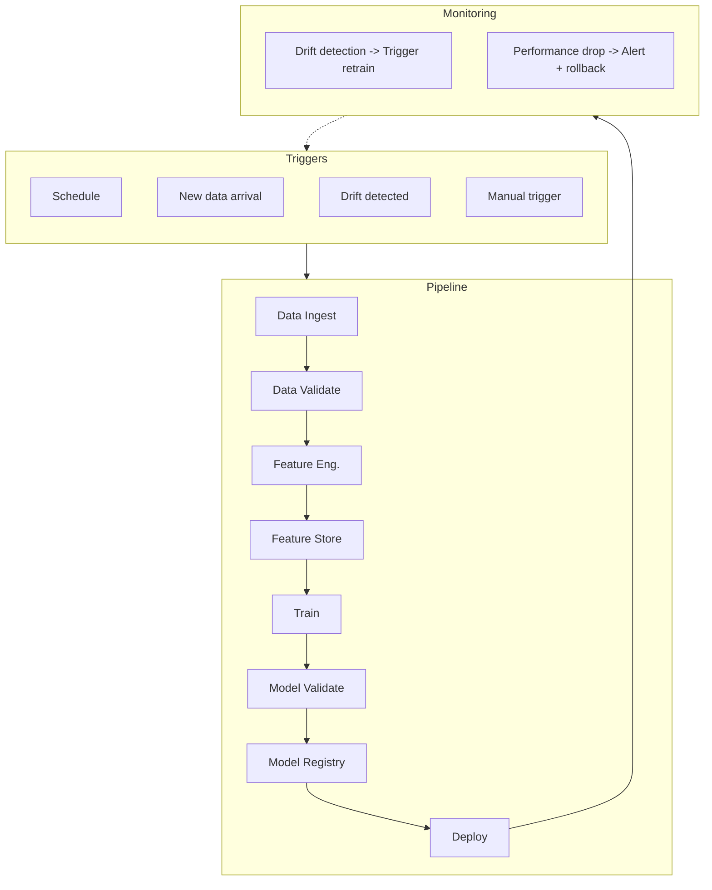
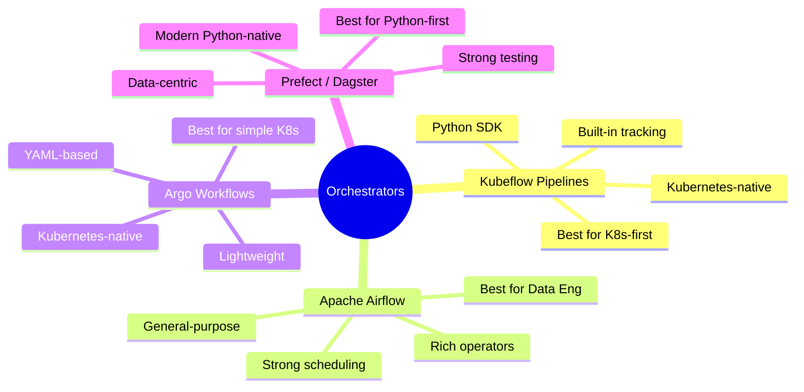
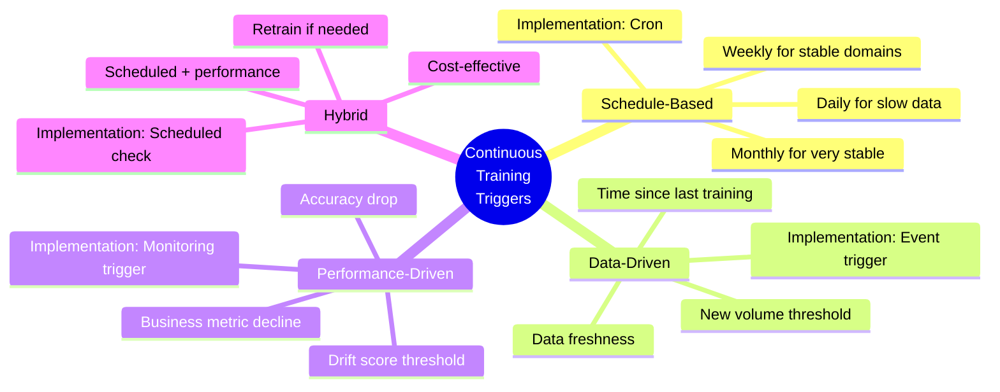
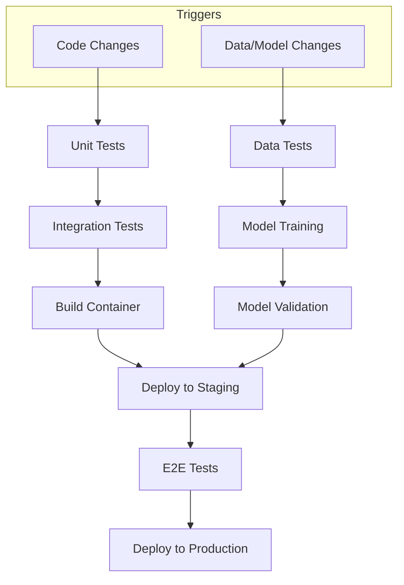

> **Discipline Track** | Complexity: `[COMPLEX]` | Time: 55-70 min

## Prerequisites

Before starting this module:

- [Module 5.5: Model Monitoring & Observability](../module-5.5-model-monitoring/)
- Working knowledge of CI/CD concepts such as tests, artifacts, environments, and promotion
- Basic Kubernetes knowledge, including Jobs, resource requests, and container images
- Familiarity with DAGs, meaning Directed Acyclic Graphs where later tasks depend on earlier tasks
- Basic Python experience with virtual environments, functions, and command-line scripts

## Learning Outcomes

After completing this module, you will be able to:

- **Design** an end-to-end ML pipeline that coordinates data validation, feature preparation, training, evaluation, registration, and deployment.
- **Debug** failing pipeline runs by tracing task inputs, outputs, gates, artifacts, and retry behavior.
- **Evaluate** Kubeflow Pipelines, Argo Workflows, Airflow, and Python-native orchestrators against team constraints.
- **Implement** runnable pipeline components with valid Kubeflow `@component` decorators and reproducible inputs.
- **Configure** ML CI/CD workflows that use valid GitHub Actions syntax and separate code, data, model, and deployment checks.

## Why This Module Matters

A retail company's recommendation system looked healthy on Friday.

The training notebook had run.

The model artifact existed.

The deployment script completed.

By Monday morning, revenue had dropped because the model had learned from a partial export that contained only one region's weekend data.

Nobody had meant to deploy a bad model.

The team had unit tests.

The container built correctly.

The problem was that their workflow treated machine learning like ordinary application delivery.

Application delivery asks, "Does this code build and pass tests?"

ML delivery must ask harder questions.

Did the data arrive completely?

Did the schema change?

Did the training set match the expected population?

Did the model beat the current production baseline?

Did the registry store the exact artifact, parameters, data version, and metric evidence?

Did deployment wait for those gates?

An ML pipeline is the control system that makes these questions executable.

It turns a fragile chain of notebooks, shell commands, and manual approvals into a visible, repeatable, auditable workflow.

At beginner level, pipelines help teams stop forgetting steps.

At intermediate level, they make training reproducible and deployment safer.

At senior level, they become the contract between data science, platform engineering, security, compliance, and operations.

The goal is not to automate everything blindly.

The goal is to automate the right decisions, expose the right evidence, and stop the wrong artifacts before they reach users.

## Core Content

## 1. What an ML Pipeline Actually Controls

An ML pipeline is not just a sequence of Python functions.

It is a dependency graph for producing, validating, and promoting model artifacts.

Each node should have a clear responsibility.

Each edge should carry a concrete artifact or decision.

Each gate should answer a production-relevant question.

A good pipeline makes failure explicit.

A bad pipeline hides failure inside logs, notebooks, and overwritten files.

The simplest useful mental model is this:

```text
+----------------+    +----------------+    +----------------+
| Data evidence  | -> | Model evidence | -> | Release choice |
+----------------+    +----------------+    +----------------+
        |                     |                      |
        v                     v                      v
 Schema, volume,        Metrics, fairness,     Canary, rollback,
 drift, freshness       baseline comparison    registry state
```

The orchestrator runs tasks, but the pipeline design decides what counts as safe progress.

That distinction matters.

You can run a risky pipeline on a powerful orchestrator and still ship bad models.

You can also run a careful pipeline with a smaller tool and get good operational results.

The architecture starts with the lifecycle.



The diagram shows a feedback loop.

Production monitoring feeds future training decisions.

That loop is what separates a one-time training job from a living ML system.

The first trap is to see the pipeline as "train then deploy."

That misses the real control points.

The pipeline must also control the evidence around the artifact.

A model file without data version, code version, parameters, metrics, and validation result is not a release candidate.

It is just a file.

### Pipeline Components

| Component | Purpose | Tools |
|-----------|---------|-------|
| **Orchestrator** | Schedule, manage DAGs | Kubeflow, Airflow, Argo |
| **Data Validation** | Quality checks | Great Expectations, TFDV |
| **Feature Engineering** | Transform data | Feast, custom code |
| **Training** | Model training | Any ML framework |
| **Model Validation** | Quality gates | Custom metrics |
| **Registry** | Version, stage models | MLflow, Vertex AI |
| **Deployment** | Serve models | KServe, Seldon |
| **Monitoring** | Detect issues | Evidently, custom |

A beginner can read this table as a list of stages.

A practitioner should read it as a list of contracts.

The data validation stage promises that downstream training will not receive malformed input.

The model validation stage promises that deployment will not receive an unproven artifact.

The registry promises that a future incident responder can reconstruct exactly what was shipped.

The monitoring stage promises that production signals are not disconnected from training decisions.

> **Active learning prompt:** Imagine the data validation stage passes because the schema is correct, but the business distribution has shifted sharply. Which later stage should catch the risk, and what metric would you add to make that possible?

A pipeline should not try to answer every possible question in one task.

It should split risk into inspectable checkpoints.

For example, checking that a CSV has no missing values is not the same as checking that a model improves conversion.

Those checks belong in different stages because they fail for different reasons and require different owners.

The platform engineer usually cares about orchestration, resource policy, artifact flow, and deployment safety.

The data scientist usually cares about feature logic, training quality, and evaluation metrics.

The data engineer usually cares about source freshness, lineage, and schema contracts.

The security or compliance team may care about secrets, access control, retention, and audit trails.

A mature pipeline gives each group a place to enforce its concern without turning the whole workflow into a manual approval chain.

## 2. Choosing the Right Orchestrator

The orchestrator is the runtime that schedules tasks and records task state.

It is not the entire MLOps platform.

It does not replace data quality.

It does not replace model evaluation.

It does not replace deployment strategy.

It gives you a reliable way to execute the graph and observe where it failed.

> **Stop and think:** If your team is already heavily invested in Kubernetes and uses Argo CD for standard application deployments, which ML orchestrator might offer the lowest operational overhead and learning curve for your platform team?

There is no universal best orchestrator.

There is only the orchestrator that matches your workload, team skills, governance needs, and operational boundaries.

### Tool Comparison



Kubeflow Pipelines fits teams that want ML-specific workflow concepts on Kubernetes.

It gives Python component authoring, artifact passing, experiment concepts, and integration paths with larger Kubeflow deployments.

It can be a strong fit when platform teams already operate Kubernetes clusters and data science teams are comfortable with Python SDKs.

Its cost is operational complexity.

You must understand the Kubeflow control plane, artifact storage, permissions, images, and cluster resources.

Apache Airflow fits data engineering organizations that already schedule many workflows.

It has a large operator ecosystem and strong scheduling vocabulary.

It is often easier to introduce when the company already uses Airflow for ETL.

Its challenge is that ML artifact semantics are not the core abstraction.

You may need to add model registry integration, metric gates, and artifact lineage patterns yourself.

Argo Workflows fits Kubernetes-native teams that want lightweight DAG execution using Kubernetes resources.

It is powerful for containerized jobs and works naturally with GitOps patterns.

It can be easier to reason about for platform engineers who already understand Kubernetes manifests.

Its challenge is that data scientists may find YAML-heavy workflow authoring less ergonomic.

Prefect and Dagster fit Python-first teams that want testable workflow code and modern developer experience.

They can be excellent for data pipelines and ML workflows that do not require deep Kubeflow integration.

The main tradeoff is whether the platform team wants to operate another control plane and how deployment will connect to Kubernetes.

A useful decision matrix is:

| Team situation | Strong candidate | Why |
|----------------|------------------|-----|
| Kubernetes-first platform team, ML-specific artifacts needed | Kubeflow Pipelines | Native container execution plus ML workflow vocabulary |
| Existing enterprise scheduler already runs ETL | Airflow | Low adoption friction and rich scheduling ecosystem |
| GitOps-heavy platform team, container tasks are enough | Argo Workflows | Clear Kubernetes-native execution model |
| Python-first data platform team | Dagster or Prefect | Strong local development and testing ergonomics |
| Regulated environment requiring strict artifact evidence | Kubeflow plus registry, or Airflow plus registry | Orchestrator must be paired with lineage and approval controls |
| Small team proving the workflow | Argo Workflows or Python-native orchestration | Simpler operations can beat feature depth |

### War Story: The 3AM Pager

A team ran their ML pipeline with cron jobs.

Data ingestion at 1AM.

Training at 2AM.

Deployment at 4AM.

One night, data ingestion failed silently.

Training started on stale data.

The model deployed was garbage.

3AM pager: "Revenue down 40%."

The model was recommending random products.

With a proper orchestrator, data validation would have failed and stopped the pipeline.

Training would not have consumed empty or stale data.

Deployment would not have promoted an unvalidated artifact.

The team would still need a good validation check.

The orchestrator would make that check enforceable.

The lesson is not "cron is always bad."

The lesson is that cron does not understand task dependencies, artifacts, retries, gates, or lineage.

Once the workflow has production risk, those missing concepts become operational debt.

## 3. Building Kubeflow Pipelines Correctly

Kubeflow Pipelines components are Python functions wrapped with the `@component` decorator.

The decorator must be valid Python.

It should look like `@component(...)`.

It must not be replaced with a local file path.

A broken decorator such as `@src/content/docs/k8s/kcna/...` is not Python syntax, is not a Kubeflow component, and will fail before the pipeline can even compile.

The corrected pattern is:

```python
from kfp.dsl import component

@component(base_image="python:3.11")
def my_component() -> str:
    return "ready"
```

The decorator describes how Kubeflow should package and execute that function.

The function body contains the task logic.

The component inputs and outputs define the artifact contract.

A runnable component should avoid hidden local dependencies.

If a component imports a library, its component definition should install the needed package or use an image that already contains it.

If a component writes an artifact, it should write to the output path supplied by Kubeflow.

If a component reads an artifact, it should read from the input path supplied by Kubeflow.

The following example uses valid Kubeflow Pipelines syntax.

It is intentionally small enough to understand, but complete enough to compile.

```python
# pipeline.py
from kfp import compiler, dsl
from kfp.dsl import Dataset, Input, Metrics, Model, Output, component


@component(
    base_image="python:3.11",
    packages_to_install=["pandas==2.2.2", "scikit-learn==1.5.1"],
)
def load_data(output_data: Output[Dataset]) -> None:
    """Create a deterministic training dataset."""
    import pandas as pd
    from sklearn.datasets import load_iris

    iris = load_iris(as_frame=True)
    df = iris.frame.rename(columns={"target": "label"})
    df.to_csv(output_data.path, index=False)


@component(
    base_image="python:3.11",
    packages_to_install=["pandas==2.2.2"],
)
def validate_data(
    input_data: Input[Dataset],
    validated_data: Output[Dataset],
    min_rows: int,
) -> bool:
    """Validate that the dataset is usable for training."""
    import pandas as pd

    df = pd.read_csv(input_data.path)

    checks = {
        "has_enough_rows": len(df) >= min_rows,
        "has_label": "label" in df.columns,
        "has_no_nulls": df.isna().sum().sum() == 0,
        "has_three_classes": df["label"].nunique() == 3,
    }

    print(f"Data validation checks: {checks}")

    if not all(checks.values()):
        return False

    df.to_csv(validated_data.path, index=False)
    return True


@component(
    base_image="python:3.11",
    packages_to_install=["joblib==1.4.2", "pandas==2.2.2", "scikit-learn==1.5.1"],
)
def train_model(
    input_data: Input[Dataset],
    n_estimators: int,
    max_depth: int,
    output_model: Output[Model],
    metrics: Output[Metrics],
) -> None:
    """Train and evaluate a deterministic random forest model."""
    import joblib
    import pandas as pd
    from sklearn.ensemble import RandomForestClassifier
    from sklearn.metrics import accuracy_score, f1_score
    from sklearn.model_selection import train_test_split

    df = pd.read_csv(input_data.path)
    x = df.drop(columns=["label"])
    y = df["label"]

    x_train, x_test, y_train, y_test = train_test_split(
        x,
        y,
        test_size=0.2,
        random_state=42,
        stratify=y,
    )

    model = RandomForestClassifier(
        n_estimators=n_estimators,
        max_depth=max_depth,
        random_state=42,
    )
    model.fit(x_train, y_train)

    predictions = model.predict(x_test)
    accuracy = accuracy_score(y_test, predictions)
    f1 = f1_score(y_test, predictions, average="weighted")

    metrics.log_metric("accuracy", float(accuracy))
    metrics.log_metric("f1_score", float(f1))
    metrics.log_metric("n_estimators", int(n_estimators))
    metrics.log_metric("max_depth", int(max_depth))

    joblib.dump(model, output_model.path)


@component(base_image="python:3.11")
def validate_model(
    metrics: Input[Metrics],
    min_accuracy: float,
    min_f1: float,
) -> bool:
    """Decide whether the trained model is good enough to register."""
    accuracy = float(metrics.metadata.get("accuracy", 0.0))
    f1_score = float(metrics.metadata.get("f1_score", 0.0))

    passed = accuracy >= min_accuracy and f1_score >= min_f1

    print(f"accuracy={accuracy:.4f}, required={min_accuracy:.4f}")
    print(f"f1_score={f1_score:.4f}, required={min_f1:.4f}")
    print(f"passed={passed}")

    return passed


@component(base_image="python:3.11")
def register_model(
    model: Input[Model],
    metrics: Input[Metrics],
    model_name: str,
) -> None:
    """Represent model registration with auditable logging."""
    import json
    from pathlib import Path

    model_path = Path(model.path)
    evidence = {
        "model_name": model_name,
        "model_path": str(model_path),
        "metrics": dict(metrics.metadata),
    }

    print(json.dumps(evidence, indent=2, sort_keys=True))


@dsl.pipeline(
    name="ml-training-pipeline",
    description="End-to-end ML training pipeline with data and model gates",
)
def ml_pipeline(
    n_estimators: int = 100,
    max_depth: int = 10,
    min_rows: int = 120,
    min_accuracy: float = 0.90,
    min_f1: float = 0.90,
    model_name: str = "iris-classifier",
) -> None:
    load_task = load_data()

    data_gate = validate_data(
        input_data=load_task.outputs["output_data"],
        min_rows=min_rows,
    )

    with dsl.If(data_gate.output == True, name="data-valid"):
        train_task = train_model(
            input_data=data_gate.outputs["validated_data"],
            n_estimators=n_estimators,
            max_depth=max_depth,
        )

        model_gate = validate_model(
            metrics=train_task.outputs["metrics"],
            min_accuracy=min_accuracy,
            min_f1=min_f1,
        )

        with dsl.If(model_gate.output == True, name="model-valid"):
            register_model(
                model=train_task.outputs["output_model"],
                metrics=train_task.outputs["metrics"],
                model_name=model_name,
            )


if __name__ == "__main__":
    compiler.Compiler().compile(
        pipeline_func=ml_pipeline,
        package_path="pipeline.yaml",
    )
    print("Compiled pipeline.yaml")
```

This example has two gates.

The first gate asks whether the data is usable.

The second gate asks whether the model is good enough.

Both gates return booleans that control downstream tasks.

That is a better design than letting every task run and hoping a human notices a bad metric later.

> **Active learning prompt:** Before reading on, predict what happens if `min_rows` is set to `1000` in this pipeline. Which tasks should run, which tasks should be skipped, and what evidence would you inspect first?

The correct answer is that `load_data` still runs.

`validate_data` runs and returns `False`.

The `data-valid` branch does not run.

Training, model validation, and registration are skipped.

The first evidence to inspect is the validation task log, because that is the gate that stopped the graph.

This is the debugging behavior you want.

A failure should point to the earliest violated contract.

### Compiling and Running

The compile step converts Python pipeline structure into a pipeline package.

The resulting YAML is the artifact you submit to a Kubeflow Pipelines backend.

```python
from kfp import Client, compiler

from pipeline import ml_pipeline

compiler.Compiler().compile(
    pipeline_func=ml_pipeline,
    package_path="pipeline.yaml",
)

client = Client(host="https://kubeflow.example.com")
run = client.create_run_from_pipeline_func(
    pipeline_func=ml_pipeline,
    arguments={
        "n_estimators": 200,
        "max_depth": 12,
        "min_rows": 120,
        "min_accuracy": 0.90,
        "min_f1": 0.90,
        "model_name": "iris-classifier",
    },
    experiment_name="iris-training",
)

print(f"Run submitted: {run.run_id}")
```

The `Client` example requires access to a real Kubeflow Pipelines endpoint.

The compile step does not.

That separation is important for CI.

You can compile a pipeline in pull requests without needing a live cluster.

You can reserve cluster execution for scheduled jobs, staging environments, or manual promotion workflows.

A practical team usually tests at several layers.

First, unit test the pure Python logic outside Kubeflow.

Second, compile the pipeline to catch invalid component syntax.

Third, run the pipeline in a non-production namespace.

Fourth, promote only if metrics and operational checks pass.

This layered testing avoids the expensive mistake of using the cluster as the first place syntax errors appear.

## 4. Continuous Training Without Blind Automation

Continuous training means the system can retrain when conditions justify it.

It does not mean the system should retrain constantly.

Training has cost.

Training consumes cluster capacity.

Training may introduce instability.

Training may create a model that is statistically better on one metric but worse for a business segment or fairness constraint.

The point is controlled freshness, not endless churn.

### Trigger Strategies



Schedule-based retraining is simple and predictable.

It works when data changes slowly and the cost of stale models is modest.

It fails when the world changes between schedules.

Data-driven retraining reacts to new input availability.

It works when model freshness depends mainly on the amount or recency of data.

It can waste compute if new data is large but not meaningfully different.

Performance-driven retraining reacts to production signals.

It works when monitoring can detect degradation quickly and reliably.

It can become noisy if alerts are poorly tuned or business metrics fluctuate for reasons unrelated to model quality.

Hybrid retraining combines a periodic check with data and performance thresholds.

For many teams, hybrid is the most practical design.

A scheduled job asks, "Is retraining justified now?"

Monitoring can also trigger an urgent run when the risk is high.

A senior design treats retraining as a decision pipeline before it becomes a training pipeline.

```text
+--------------------+
| Observe production |
+--------------------+
          |
          v
+--------------------+
| Compare thresholds |
+--------------------+
          |
          v
+--------------------+       no        +--------------------+
| Retraining needed? | --------------> | Record no-op run   |
+--------------------+                 +--------------------+
          |
         yes
          v
+--------------------+
| Train candidate    |
+--------------------+
          |
          v
+--------------------+
| Validate candidate |
+--------------------+
          |
          v
+--------------------+
| Promote or reject  |
+--------------------+
```

The "no-op run" matters.

It creates evidence that the system checked and deliberately chose not to train.

That evidence helps during audits and incident reviews.

It also helps teams understand whether trigger thresholds are too sensitive or too conservative.

### Automated Retraining Pipeline

The following Kubeflow-style pipeline shows the structure.

The helper components are not expanded here, but the control flow is valid.

The important detail is the use of real `@component` decorators when components are defined and `dsl.If` for conditions.

```python
from kfp import dsl


@dsl.pipeline(name="continuous-training-pipeline")
def continuous_training_pipeline(
    model_name: str,
    drift_threshold: float = 0.25,
    min_accuracy: float = 0.90,
) -> None:
    """Pipeline with drift-triggered retraining."""

    drift_check = check_drift(
        model_name=model_name,
        threshold=drift_threshold,
    )

    with dsl.If(drift_check.outputs["drift_detected"] == True, name="drift-detected"):
        data = load_fresh_data(model_name=model_name)

        validated = validate_data(
            input_data=data.outputs["data"],
            min_rows=1000,
        )

        with dsl.If(validated.output == True, name="fresh-data-valid"):
            trained = train_model(
                input_data=validated.outputs["validated_data"],
                n_estimators=200,
                max_depth=12,
            )

            validation = validate_model(
                metrics=trained.outputs["metrics"],
                min_accuracy=min_accuracy,
                min_f1=0.88,
            )

            with dsl.If(validation.output == True, name="candidate-valid"):
                deploy_model(
                    model=trained.outputs["output_model"],
                    model_name=model_name,
                    deployment_strategy="canary",
                )
```

This design separates three questions.

Has production changed enough to justify retraining?

Is the fresh data safe to train on?

Is the candidate model safe to deploy?

Each question has its own gate.

That makes the pipeline debuggable.

If retraining does not happen, you can tell whether the cause was no drift, bad data, or weak model performance.

A common anti-pattern is to trigger retraining directly from drift detection and deploy the result automatically.

That collapses observation, training, and release into one uncontrolled action.

A better pattern is observation triggers candidate creation, and candidate validation controls promotion.

## 5. CI/CD for ML

Traditional CI/CD is necessary for ML systems.

It is not sufficient.

ML CI/CD has to reason about multiple changing objects.

Code changes.

Data changes.

Feature definitions change.

Training parameters change.

Model artifacts change.

Serving infrastructure changes.

Production behavior changes.

A safe workflow treats each object as a possible release trigger and a possible failure source.

> **Pause and predict:** How would an ML CI/CD pipeline handle a scenario where the codebase has not changed at all, but the statistical distribution of the incoming data has shifted significantly over the weekend?

A code-only CI/CD workflow would do nothing.

An ML-aware workflow would detect drift or performance degradation, start a retraining decision pipeline, validate the new candidate against quality gates, and deploy only if the candidate beats the required baseline.

### ML CI/CD Pipeline



The key teaching point in this diagram is the split between code validation and model validation.

Unit tests can prove that feature code runs.

They cannot prove that the trained model is useful.

Container builds can prove the serving image exists.

They cannot prove that the artifact inside the image is better than the current production model.

End-to-end tests can prove the service returns responses.

They cannot prove the predictions are fair, calibrated, or profitable.

You need all of these checks because each one catches a different class of failure.

### GitHub Actions for ML

The workflow below uses valid GitHub Actions syntax.

Action references use standard version tags such as `actions/checkout@v4`.

Local scripts appear only in `run:` commands, which is where repository scripts belong.

A line such as `uses: @scripts/pipeline_v4_batch.py` would be invalid because `uses:` expects an action reference, not a local Python script path.

```yaml
# .github/workflows/ml-pipeline.yaml
name: ML Pipeline

on:
  push:
    branches: [main]
    paths:
      - "src/**"
      - "data/**"
      - "models/**"
      - "pipelines/**"
      - ".github/workflows/ml-pipeline.yaml"
  schedule:
    - cron: "0 0 * * 0"
  workflow_dispatch:
    inputs:
      force_retrain:
        description: "Force model retraining"
        required: false
        default: "false"
        type: choice
        options:
          - "false"
          - "true"

jobs:
  test:
    runs-on: ubuntu-latest
    outputs:
      drift_detected: ${{ steps.drift.outputs.drift_detected }}
    steps:
      - uses: actions/checkout@v4

      - name: Set up Python
        uses: actions/setup-python@v5
        with:
          python-version: "3.11"

      - name: Install dependencies
        run: pip install -r requirements.txt

      - name: Run unit tests
        run: pytest tests/unit/

      - name: Run data validation
        run: python scripts/validate_data.py

      - name: Check for drift
        id: drift
        run: |
          python scripts/check_drift.py --output drift_result.txt
          echo "drift_detected=$(cat drift_result.txt)" >> "$GITHUB_OUTPUT"

  train:
    needs: test
    if: needs.test.outputs.drift_detected == 'true' || github.event.inputs.force_retrain == 'true'
    runs-on: ubuntu-latest
    steps:
      - uses: actions/checkout@v4

      - name: Set up Python
        uses: actions/setup-python@v5
        with:
          python-version: "3.11"

      - name: Install dependencies
        run: pip install -r requirements.txt

      - name: Train model
        run: python scripts/train.py --output models/candidate

      - name: Validate model
        run: python scripts/validate_model.py --model models/candidate

      - name: Upload model artifact
        uses: actions/upload-artifact@v4
        with:
          name: candidate-model
          path: models/candidate/

  deploy-staging:
    needs: train
    runs-on: ubuntu-latest
    environment: staging
    steps:
      - uses: actions/checkout@v4

      - name: Download model
        uses: actions/download-artifact@v4
        with:
          name: candidate-model
          path: models/candidate/

      - name: Deploy to staging
        run: python scripts/deploy.py --env staging --model models/candidate

      - name: Run integration tests
        run: pytest tests/integration/ --env staging

  deploy-production:
    needs: deploy-staging
    runs-on: ubuntu-latest
    environment: production
    steps:
      - uses: actions/checkout@v4

      - name: Download model
        uses: actions/download-artifact@v4
        with:
          name: candidate-model
          path: models/candidate/

      - name: Deploy canary
        run: python scripts/deploy.py --env production --model models/candidate --canary 10

      - name: Monitor canary
        run: python scripts/check_canary.py --window 300 --min-success-rate 0.99

      - name: Promote canary
        run: python scripts/deploy.py --env production --model models/candidate --canary 100
```

This workflow is still simplified.

A production version would usually add permissions, concurrency controls, artifact retention settings, environment protection rules, signed images, secrets management, and rollback behavior.

Even so, it demonstrates the corrected syntax and the key ML-specific structure.

The `test` job emits a drift decision.

The `train` job runs only when drift is detected or a human forces retraining.

The model is uploaded as an artifact.

Staging receives the candidate before production.

Production begins with a canary.

The workflow also shows an important limitation.

GitHub Actions can orchestrate CI/CD steps, but it is not always the right place to run heavy model training.

Large GPU training jobs usually belong in Kubernetes, a managed ML platform, or a batch system.

In those designs, GitHub Actions triggers the pipeline and records the result rather than doing all compute directly on a hosted runner.

A senior design keeps CI responsible for coordination and evidence, while specialized infrastructure handles heavy execution.

## 6. Pipeline Reliability Patterns

Reliability in ML pipelines comes from boring discipline.

Use versioned inputs.

Use deterministic task behavior where possible.

Write artifacts to unique paths.

Pass artifacts explicitly.

Validate before promotion.

Retry only safe operations.

Make every skipped deployment explainable.

### 1. Idempotency

A pipeline task is idempotent when rerunning it with the same inputs produces the same intended result.

ML work makes this harder because data changes, random seeds change, and external services change.

You do not get reproducibility by accident.

You design for it.

```python
# BAD: Not idempotent
def train():
    data = load_latest_data()
    model = train_model(data)
    save_model(model, "model.pkl")
```

This function hides the data version.

It overwrites the model path.

It makes reruns hard to compare.

A better version passes the data version and run identifier explicitly.

```python
# GOOD: Idempotent
from pathlib import Path

from sklearn.ensemble import RandomForestClassifier


def train(data_version: str, run_id: str) -> Path:
    data = load_data(version=data_version)
    model = RandomForestClassifier(random_state=42)
    model.fit(data.features, data.labels)

    output_path = Path("models") / run_id / "model.joblib"
    output_path.parent.mkdir(parents=True, exist_ok=True)
    save_model(model, output_path)

    return output_path
```

The good version still depends on the implementation of `load_data`.

If `load_data(version="2026-04-25")` changes its result tomorrow, reproducibility is still broken.

That is why mature teams version by immutable dataset snapshot, object storage URI, table snapshot, or content hash rather than a loose label.

### 2. Checkpointing

Checkpointing matters when training is expensive.

A failed task should not always throw away hours of useful progress.

The risk is that checkpointing can also preserve bad state if it is not tied to a run identity and data version.

```python
from pathlib import Path


def train_with_checkpoints(
    data_path: str,
    checkpoint_dir: str,
    output_model_path: str,
    total_epochs: int = 10,
) -> None:
    """Training loop sketch with resume capability."""
    import joblib

    checkpoint_path = Path(checkpoint_dir) / "checkpoint.joblib"

    if checkpoint_path.exists():
        state = joblib.load(checkpoint_path)
        start_epoch = int(state["epoch"]) + 1
        model = state["model"]
        print(f"Resuming from epoch {start_epoch}")
    else:
        start_epoch = 0
        model = create_model()
        print("Starting new training run")

    data = load_training_data(data_path)

    for epoch in range(start_epoch, total_epochs):
        model = train_one_epoch(model, data)

        joblib.dump(
            {
                "epoch": epoch,
                "model": model,
                "data_path": data_path,
            },
            checkpoint_path,
        )

    joblib.dump(model, output_model_path)
```

This code is a runnable pattern only when `create_model`, `load_training_data`, and `train_one_epoch` are implemented in your project.

The important design choice is that the checkpoint records the data path.

A real implementation should also record code version, parameters, and dependency versions.

### 3. Resource Management

Pipeline tasks run somewhere.

On Kubernetes, they run as Pods.

Those Pods need resource requests and limits.

Without requests, the scheduler cannot place work intelligently.

Without limits, one training task can consume too much memory or GPU capacity.

```yaml
# Argo Workflow training template with resource controls
apiVersion: argoproj.io/v1alpha1
kind: Workflow
metadata:
  generateName: train-model-
spec:
  entrypoint: train
  templates:
    - name: train
      container:
        image: ghcr.io/example/ml-training:1.0.0
        command: ["python", "train.py"]
        resources:
          requests:
            memory: "4Gi"
            cpu: "2"
            nvidia.com/gpu: "1"
          limits:
            memory: "8Gi"
            cpu: "4"
            nvidia.com/gpu: "1"
      nodeSelector:
        accelerator: "nvidia"
```

This manifest is not a Kubeflow component.

It is an Argo Workflow template.

That distinction matters because Kubeflow Pipelines may compile into an Argo-based backend in some installations, but users should not mix syntax carelessly.

If you are authoring Kubeflow components, define resources through the Kubeflow task APIs supported by your KFP version.

If you are authoring Argo Workflows directly, define container resources in workflow YAML.

### 4. Failure Handling

Retries are useful for transient failures.

They are dangerous for deterministic failures.

Retrying a network timeout may help.

Retrying a data validation failure usually wastes compute and hides the real problem.

A strong rule is: retry infrastructure uncertainty, fail fast on invalid evidence.

```python
from kfp import dsl


@dsl.pipeline(name="robust-training-pipeline")
def robust_pipeline() -> None:
    """Pipeline with retry and validation gates."""

    train_task = train_model(
        n_estimators=100,
        max_depth=10,
    ).set_retry(
        num_retries=2,
        backoff_duration="60s",
        backoff_factor=2.0,
    )

    validation_task = validate_model(
        metrics=train_task.outputs["metrics"],
        min_accuracy=0.90,
        min_f1=0.90,
    )

    with dsl.If(validation_task.output == True, name="validated"):
        deploy_model(model=train_task.outputs["output_model"])
```

Do not add retries because a task often fails.

First understand why it fails.

If it fails because object storage occasionally times out, retries help.

If it fails because the schema keeps changing, retries hide a data contract problem.

If it fails because GPU memory is too low, retries increase cluster waste.

If it fails because validation is doing its job, retries are the wrong response.

### 5. Artifact Lineage

Every production model should answer a small set of questions.

What code produced it?

What data trained it?

What parameters were used?

What metrics justified it?

Who or what approved promotion?

Where is it deployed?

What previous model can we roll back to?

A registry is the natural place to attach this evidence.

The registry should not be a folder of files named `model.pkl`, `model-final.pkl`, and `model-final-really.pkl`.

It should store versions, stages, metadata, and relationships.

```text
+-------------------+      +--------------------+      +--------------------+
| Dataset Snapshot  | ---> | Pipeline Run       | ---> | Model Version      |
| id: ds-20260425   |      | id: run-1842       |      | name: recommender  |
+-------------------+      +--------------------+      | version: 18        |
          |                         |                  +--------------------+
          v                         v                            |
+-------------------+      +--------------------+                v
| Feature Definition|      | Metric Evidence    |      +--------------------+
| id: feat-31       |      | auc, f1, latency   | ---> | Deployment         |
+-------------------+      +--------------------+      | prod canary 10%    |
                                                       +--------------------+
```

During an incident, this graph is not paperwork.

It is the map that lets the team determine whether the failure came from data, code, parameters, serving infrastructure, or production drift.

## 7. Worked Example: Debugging a Failed Pipeline Run

Now put the pieces together.

A team has this incident:

A scheduled pipeline ran overnight.

Data validation passed.

Training completed.

Model validation failed.

No deployment happened.

The product manager asks why the weekly model did not ship.

A weak response is, "The pipeline failed."

A useful response explains the violated contract and the next action.

Start with the pipeline graph.

```text
load_data -> validate_data -> train_model -> validate_model -> register_model -> deploy
                 passed          passed          failed             skipped       skipped
```

The earliest failed gate is `validate_model`.

That means the data contract was acceptable and training produced an artifact.

The candidate simply did not meet the promotion threshold.

Next inspect the model validation evidence.

```text
accuracy:     0.872
required:     0.900

f1_score:     0.861
required:     0.900

baseline_f1:  0.884
candidate_f1: 0.861
```

The candidate underperformed both the absolute threshold and the current baseline.

Deployment should be blocked.

Now inspect whether the failure is expected.

Maybe the training data changed.

Maybe the feature code changed.

Maybe the hyperparameters changed.

Maybe production behavior drifted and the current model is also degrading.

The debugging sequence should be:

1. Compare the candidate metrics against the current production model.
2. Check the dataset snapshot and row counts.
3. Check schema and feature distribution reports.
4. Check code and dependency versions.
5. Check training parameters and random seeds.
6. Decide whether to tune, roll back the data snapshot, fix features, or keep the current model.

A senior engineer does not override the gate because a deadline exists.

The gate is the safety mechanism.

The correct action is to diagnose why the candidate is weak and either produce a better candidate or document why production should remain unchanged.

Here is a small local script that demonstrates the reasoning pattern with metric evidence.

```python
# validate_candidate.py
from __future__ import annotations

import argparse
import json
from pathlib import Path


def load_metrics(path: Path) -> dict[str, float]:
    with path.open("r", encoding="utf-8") as file:
        raw = json.load(file)

    return {key: float(value) for key, value in raw.items()}


def validate_candidate(
    candidate: dict[str, float],
    baseline: dict[str, float],
    min_accuracy: float,
    min_f1: float,
) -> tuple[bool, list[str]]:
    reasons: list[str] = []

    if candidate["accuracy"] < min_accuracy:
        reasons.append(
            f"accuracy {candidate['accuracy']:.3f} is below required {min_accuracy:.3f}"
        )

    if candidate["f1_score"] < min_f1:
        reasons.append(
            f"f1_score {candidate['f1_score']:.3f} is below required {min_f1:.3f}"
        )

    if candidate["f1_score"] < baseline["f1_score"]:
        reasons.append(
            f"candidate f1_score {candidate['f1_score']:.3f} is below baseline "
            f"{baseline['f1_score']:.3f}"
        )

    return len(reasons) == 0, reasons


def main() -> None:
    parser = argparse.ArgumentParser()
    parser.add_argument("--candidate", required=True)
    parser.add_argument("--baseline", required=True)
    parser.add_argument("--min-accuracy", type=float, default=0.90)
    parser.add_argument("--min-f1", type=float, default=0.90)
    args = parser.parse_args()

    candidate = load_metrics(Path(args.candidate))
    baseline = load_metrics(Path(args.baseline))

    passed, reasons = validate_candidate(
        candidate=candidate,
        baseline=baseline,
        min_accuracy=args.min_accuracy,
        min_f1=args.min_f1,
    )

    if passed:
        print("candidate accepted")
        return

    print("candidate rejected")
    for reason in reasons:
        print(f"- {reason}")

    raise SystemExit(1)


if __name__ == "__main__":
    main()
```

Example input:

```json
{
  "accuracy": 0.872,
  "f1_score": 0.861
}
```

Baseline input:

```json
{
  "accuracy": 0.891,
  "f1_score": 0.884
}
```

Example command:

```bash
python validate_candidate.py \
  --candidate candidate-metrics.json \
  --baseline baseline-metrics.json \
  --min-accuracy 0.90 \
  --min-f1 0.90
```

Expected result:

```text
candidate rejected
- accuracy 0.872 is below required 0.900
- f1_score 0.861 is below required 0.900
- candidate f1_score 0.861 is below baseline 0.884
```

This worked example is intentionally simple.

It teaches the core operational habit.

Do not ask, "Did the pipeline fail?"

Ask, "Which contract failed, what evidence proves it, and what should happen next?"

## 8. Senior Design Concerns

Once a team has basic pipelines working, the hard problems shift.

The question becomes less about whether a model can train and more about whether the platform can support many teams safely.

Senior pipeline design includes ownership, tenancy, cost, security, compliance, and long-term maintainability.

### Multi-Team Ownership

A single ML platform may support fraud, search, recommendations, forecasting, and risk models.

Those teams should not all edit one giant pipeline.

Shared platform components should handle common concerns.

Team-owned components should handle domain logic.

A useful split is:

| Layer | Owned by | Examples |
|-------|----------|----------|
| Platform templates | Platform engineering | Base images, task wrappers, resource policies |
| Data contracts | Data platform and domain teams | Schemas, freshness expectations, lineage |
| Training logic | Data science teams | Feature selection, model architecture, parameters |
| Release gates | ML platform and product owners | Metric thresholds, approval rules, fairness gates |
| Serving integration | Platform and application teams | KServe, Seldon, canary, rollback |
| Monitoring | SRE, ML platform, product teams | Drift, latency, error rate, business KPIs |

This split prevents two extremes.

One extreme is a centralized platform team that blocks every model change.

The other extreme is every data science team inventing its own unsafe deployment process.

The right design gives teams self-service within guardrails.

### Security and Secrets

Pipelines often need access to data stores, object storage, registries, and deployment APIs.

Do not bake credentials into component code or container images.

Use the platform's identity mechanism.

On Kubernetes, that usually means service accounts, workload identity, mounted secrets, or external secret operators.

Each pipeline should have the narrowest permissions it needs.

A training pipeline may need read access to training data and write access to a registry.

It should not automatically have permission to mutate production serving resources unless deployment is part of its approved responsibility.

### Cost and Capacity

Training jobs can consume expensive GPUs.

Pipelines can accidentally stampede the cluster when many triggers fire at once.

Use concurrency limits.

Use quotas.

Use priority classes where appropriate.

Use resource requests that match reality.

Use caching carefully.

Caching can save money when inputs are immutable.

Caching can be dangerous when task outputs depend on hidden external state.

A cached "validation passed" result is trustworthy only if the validation inputs are truly the same.

### Promotion Policy

Not every trained model should be deployed.

A mature system separates candidate creation from production promotion.

A candidate may be registered without being deployed.

A candidate may be deployed to staging without reaching production.

A candidate may be canaried to a small percentage of traffic.

A candidate may be rejected after offline metrics pass because online metrics fail.

This separation protects the business from treating training success as release approval.

### Human Approval

Human approval is not a failure of automation.

It is part of automation when the decision requires accountability, business context, or risk acceptance.

The trick is to make human approval evidence-based.

An approver should see data version, code version, model version, metrics, baseline comparison, risk notes, and rollback plan.

They should not be asked to approve a mysterious file path.

Automation should gather the evidence.

Humans should decide only where judgment is actually needed.

## Did You Know?

- **Kubeflow Pipelines components are ordinary Python functions packaged as containerized tasks.** The `@component` decorator is what tells the SDK how to turn the function into executable pipeline structure.
- **A CI workflow can be syntactically valid and still unsafe for ML.** Traditional tests may pass while data drift, weak model metrics, or missing registry evidence make the candidate unsuitable for production.
- **A no-op retraining decision can be valuable evidence.** Recording that the system checked drift and intentionally skipped training helps audits and incident reviews.
- **Model promotion is a release decision, not a training side effect.** A trained artifact should become production only after validation, registration, deployment testing, and rollback planning.

## Common Mistakes

| Mistake | Problem | Solution |
|---------|---------|----------|
| Replacing `@component` with a file path | The code is invalid Python and cannot compile into a Kubeflow pipeline | Use valid decorators such as `@component(base_image="python:3.11")` |
| Using local script paths in `uses:` | GitHub Actions expects an action reference such as `actions/checkout@v4`, not a repository script | Put local scripts under `run:` and reserve `uses:` for actions |
| Training directly after drift detection | Drift proves conditions changed, not that a new model is safe | Treat drift as a retraining trigger, then validate data and model quality |
| Pulling "latest" data in every rerun | Reruns become impossible to reproduce because the input changes | Use immutable dataset snapshots, timestamps, hashes, or versioned tables |
| Deploying every successfully trained model | Training success does not prove production readiness | Add model validation, baseline comparison, registry state, and canary gates |
| Retrying validation failures | The pipeline wastes compute and hides a violated contract | Retry transient infrastructure failures, fail fast on bad evidence |
| Building one monolithic pipeline | Debugging and ownership become unclear | Split data, training, validation, registry, and deployment into clear components |
| Ignoring resource requests and limits | Training jobs can starve other workloads or fail unpredictably | Set CPU, memory, and GPU requests and limits for every heavy task |

## Quiz

Test your understanding with scenario-based questions.

<details>
<summary>1. Your team copied a Kubeflow example into a module, but every component decorator now looks like a documentation path instead of `@component(...)`. The pipeline will not compile. What should you fix first, and why?</summary>

**Answer:** Fix the decorators first because the file is invalid Python before Kubeflow can reason about pipeline structure. Each component should use a valid decorator such as `@component(base_image="python:3.11", packages_to_install=[...])`. A local documentation path is not a Python decorator and not a Kubeflow component definition. Once the syntax is valid, you can compile the pipeline and then debug task inputs, outputs, packages, and runtime behavior.
</details>

<details>
<summary>2. A GitHub Actions workflow contains `uses: @scripts/train_model.py` in a training step. The repository has that script, but the workflow fails before training starts. How should the step be rewritten?</summary>

**Answer:** `uses:` is for GitHub Actions references such as `actions/checkout@v4` or `actions/setup-python@v5`. A local Python script should run under a `run:` step, for example `run: python scripts/train_model.py`. The workflow should use actions for checkout, Python setup, artifact upload, and artifact download, while repository scripts should be executed as shell commands.
</details>

<details>
<summary>3. A nightly pipeline loads the latest rows from a warehouse, trains a model, and writes `model.pkl`. The deployment step fails. A rerun succeeds, but the model metrics are different. What design flaw makes the incident hard to debug?</summary>

**Answer:** The pipeline is not reproducible. It uses mutable "latest" data and overwrites the model path, so the rerun does not necessarily use the same inputs or produce comparable artifacts. The fix is to pass an immutable data version or snapshot into the pipeline, write outputs to a unique run path, record parameters and code version, and compare metrics against the exact failed run.
</details>

<details>
<summary>4. A recommendation model's click-through rate drops after a major marketing campaign in a new country. The next scheduled retraining run is several days away. What trigger strategy should the team add?</summary>

**Answer:** The team should add performance-driven or data-driven triggers, ideally as part of a hybrid strategy. Monitoring should detect the click-through-rate drop or input distribution shift and trigger a retraining decision pipeline. That pipeline should still validate fresh data and candidate model metrics before deployment. The trigger starts investigation and candidate creation; it should not blindly promote a new model.
</details>

<details>
<summary>5. A model candidate beats the minimum accuracy threshold but performs worse than the current production model on F1 score. The product team wants to ship because the pipeline is green on unit tests. What should the release gate do?</summary>

**Answer:** The release gate should reject or hold the candidate because unit tests do not prove model quality. A production promotion gate should compare the candidate against absolute thresholds and the current baseline. If F1 score is a required business or reliability metric, underperforming the baseline is enough reason to block deployment until the team understands the tradeoff and explicitly approves the risk.
</details>

<details>
<summary>6. A training task frequently fails because object storage occasionally times out. A data validation task frequently fails because required columns are missing. Which task should get retries, and which should fail fast?</summary>

**Answer:** The training task may deserve retries if the timeout is transient infrastructure uncertainty. The data validation task should fail fast because missing required columns are bad evidence, not a transient execution problem. Retrying a schema failure wastes compute and can hide a broken upstream data contract. The right fix is to repair the producer or adjust the contract deliberately.
</details>

<details>
<summary>7. Your platform team supports six ML teams. Each team wants custom training logic, but security wants consistent secrets handling and deployment gates. How should the pipeline ownership model be structured?</summary>

**Answer:** Shared platform templates should own common concerns such as base images, identity, secrets handling, resource policy, artifact storage, registry integration, and deployment gates. Individual ML teams should own domain-specific feature logic, model code, and metric choices within those guardrails. This provides self-service without allowing every team to invent separate production safety controls.
</details>

<details>
<summary>8. A canary deployment passes service health checks but business conversion drops for the canary cohort. The model artifact had strong offline validation metrics. What should the pipeline do next?</summary>

**Answer:** The pipeline should stop promotion and either roll back or hold the canary for investigation, depending on the severity and policy. Offline metrics are necessary but not sufficient. Online business metrics can reveal issues caused by serving context, feature skew, user behavior, or metric mismatch. The incident evidence should link the model version, canary cohort, online metrics, and rollback decision.
</details>

## Hands-On Exercise: Build and Debug an End-to-End ML Pipeline

In this exercise, you will build a small but realistic pipeline structure.

You will compile a Kubeflow pipeline.

You will test the validation logic locally.

You will inspect how gates prevent unsafe promotion.

The goal is not to operate a full Kubeflow cluster.

The goal is to practice the design habits that make ML pipelines safe.

### Setup

Create a local project.

```bash
mkdir ml-pipeline
cd ml-pipeline
python -m venv venv
source venv/bin/activate
pip install "kfp>=2.7.0" "pandas>=2.2.0" "scikit-learn>=1.5.0" "joblib>=1.4.0"
```

### Step 1: Create Reusable Validation Logic

Create `quality_gates.py`.

```python
from __future__ import annotations


def validate_data_profile(
    row_count: int,
    null_count: int,
    class_count: int,
    min_rows: int,
    expected_classes: int,
) -> tuple[bool, list[str]]:
    reasons: list[str] = []

    if row_count < min_rows:
        reasons.append(f"row_count {row_count} is below min_rows {min_rows}")

    if null_count != 0:
        reasons.append(f"null_count {null_count} must be zero")

    if class_count != expected_classes:
        reasons.append(
            f"class_count {class_count} does not match expected_classes {expected_classes}"
        )

    return len(reasons) == 0, reasons


def validate_model_metrics(
    candidate_accuracy: float,
    candidate_f1: float,
    baseline_f1: float,
    min_accuracy: float,
    min_f1: float,
) -> tuple[bool, list[str]]:
    reasons: list[str] = []

    if candidate_accuracy < min_accuracy:
        reasons.append(
            f"candidate_accuracy {candidate_accuracy:.3f} is below {min_accuracy:.3f}"
        )

    if candidate_f1 < min_f1:
        reasons.append(f"candidate_f1 {candidate_f1:.3f} is below {min_f1:.3f}")

    if candidate_f1 < baseline_f1:
        reasons.append(
            f"candidate_f1 {candidate_f1:.3f} is below baseline {baseline_f1:.3f}"
        )

    return len(reasons) == 0, reasons
```

### Step 2: Add Local Tests for the Gates

Create `test_quality_gates.py`.

```python
from quality_gates import validate_data_profile, validate_model_metrics


def test_data_profile_passes() -> None:
    passed, reasons = validate_data_profile(
        row_count=150,
        null_count=0,
        class_count=3,
        min_rows=120,
        expected_classes=3,
    )

    assert passed is True
    assert reasons == []


def test_data_profile_fails_on_missing_rows() -> None:
    passed, reasons = validate_data_profile(
        row_count=90,
        null_count=0,
        class_count=3,
        min_rows=120,
        expected_classes=3,
    )

    assert passed is False
    assert "row_count 90 is below min_rows 120" in reasons


def test_model_metrics_reject_weak_candidate() -> None:
    passed, reasons = validate_model_metrics(
        candidate_accuracy=0.88,
        candidate_f1=0.86,
        baseline_f1=0.89,
        min_accuracy=0.90,
        min_f1=0.90,
    )

    assert passed is False
    assert len(reasons) == 3
```

Run the tests.

```bash
pip install pytest
pytest -q
```

### Step 3: Create the Kubeflow Pipeline

Create `pipeline.py`.

```python
from kfp import compiler, dsl
from kfp.dsl import Dataset, Input, Metrics, Model, Output, component


@component(
    base_image="python:3.11",
    packages_to_install=["pandas==2.2.2", "scikit-learn==1.5.1"],
)
def load_data(output_data: Output[Dataset]) -> None:
    import pandas as pd
    from sklearn.datasets import load_iris

    iris = load_iris(as_frame=True)
    df = iris.frame.rename(columns={"target": "label"})
    df.to_csv(output_data.path, index=False)


@component(
    base_image="python:3.11",
    packages_to_install=["pandas==2.2.2"],
)
def validate_data(
    input_data: Input[Dataset],
    validated_data: Output[Dataset],
    min_rows: int,
) -> bool:
    import pandas as pd

    df = pd.read_csv(input_data.path)
    row_count = len(df)
    null_count = int(df.isna().sum().sum())
    class_count = int(df["label"].nunique()) if "label" in df.columns else 0

    checks = {
        "row_count": row_count,
        "null_count": null_count,
        "class_count": class_count,
        "min_rows": min_rows,
    }
    print(checks)

    passed = row_count >= min_rows and null_count == 0 and class_count == 3

    if passed:
        df.to_csv(validated_data.path, index=False)

    return passed


@component(
    base_image="python:3.11",
    packages_to_install=["joblib==1.4.2", "pandas==2.2.2", "scikit-learn==1.5.1"],
)
def train_model(
    input_data: Input[Dataset],
    output_model: Output[Model],
    metrics: Output[Metrics],
) -> None:
    import joblib
    import pandas as pd
    from sklearn.ensemble import RandomForestClassifier
    from sklearn.metrics import accuracy_score, f1_score
    from sklearn.model_selection import train_test_split

    df = pd.read_csv(input_data.path)
    x = df.drop(columns=["label"])
    y = df["label"]

    x_train, x_test, y_train, y_test = train_test_split(
        x,
        y,
        test_size=0.2,
        random_state=42,
        stratify=y,
    )

    model = RandomForestClassifier(
        n_estimators=100,
        max_depth=10,
        random_state=42,
    )
    model.fit(x_train, y_train)

    predictions = model.predict(x_test)
    accuracy = accuracy_score(y_test, predictions)
    f1 = f1_score(y_test, predictions, average="weighted")

    metrics.log_metric("accuracy", float(accuracy))
    metrics.log_metric("f1_score", float(f1))

    joblib.dump(model, output_model.path)


@component(base_image="python:3.11")
def validate_model(
    metrics: Input[Metrics],
    min_accuracy: float,
    min_f1: float,
    baseline_f1: float,
) -> bool:
    accuracy = float(metrics.metadata.get("accuracy", 0.0))
    f1 = float(metrics.metadata.get("f1_score", 0.0))

    passed = accuracy >= min_accuracy and f1 >= min_f1 and f1 >= baseline_f1

    print(f"accuracy={accuracy:.4f}")
    print(f"f1_score={f1:.4f}")
    print(f"baseline_f1={baseline_f1:.4f}")
    print(f"passed={passed}")

    return passed


@component(base_image="python:3.11")
def register_model(model: Input[Model], metrics: Input[Metrics], model_name: str) -> None:
    print(f"Registering model_name={model_name}")
    print(f"model_path={model.path}")
    print(f"metrics={dict(metrics.metadata)}")


@dsl.pipeline(name="exercise-ml-pipeline")
def exercise_pipeline(
    min_rows: int = 120,
    min_accuracy: float = 0.90,
    min_f1: float = 0.90,
    baseline_f1: float = 0.88,
    model_name: str = "iris-classifier",
) -> None:
    data = load_data()

    data_gate = validate_data(
        input_data=data.outputs["output_data"],
        min_rows=min_rows,
    )

    with dsl.If(data_gate.output == True, name="data-valid"):
        trained = train_model(input_data=data_gate.outputs["validated_data"])

        model_gate = validate_model(
            metrics=trained.outputs["metrics"],
            min_accuracy=min_accuracy,
            min_f1=min_f1,
            baseline_f1=baseline_f1,
        )

        with dsl.If(model_gate.output == True, name="model-valid"):
            register_model(
                model=trained.outputs["output_model"],
                metrics=trained.outputs["metrics"],
                model_name=model_name,
            )


if __name__ == "__main__":
    compiler.Compiler().compile(
        pipeline_func=exercise_pipeline,
        package_path="pipeline.yaml",
    )
    print("Compiled pipeline.yaml")
```

Compile the pipeline.

```bash
python pipeline.py
```

### Step 4: Inspect the Compiled Artifact

Check that the pipeline file exists.

```bash
ls -lh pipeline.yaml
```

Search for your component names.

```bash
grep -E "load-data|validate-data|train-model|validate-model|register-model" pipeline.yaml
```

You should see task names in the compiled YAML.

If compilation fails, fix syntax before thinking about cluster execution.

Most beginner pipeline failures happen before Kubernetes is involved.

### Step 5: Force a Gate Failure Deliberately

Edit the pipeline defaults so `min_rows` is higher than the generated dataset size.

For example, set `min_rows` to `1000`.

Compile again.

The pipeline should still compile.

In a real Kubeflow run, `load_data` and `validate_data` would run, and the training branch would be skipped.

This is a good failure.

The gate protected downstream stages from invalid evidence.

### Step 6: Design the CI Workflow Around the Pipeline

Create `.github/workflows/ml-pipeline.yaml` in a real repository when you are ready to automate.

Use this shape:

```yaml
name: ML Pipeline

on:
  pull_request:
    paths:
      - "pipeline.py"
      - "quality_gates.py"
      - "test_quality_gates.py"
      - ".github/workflows/ml-pipeline.yaml"
  workflow_dispatch:

jobs:
  validate-pipeline:
    runs-on: ubuntu-latest
    steps:
      - uses: actions/checkout@v4

      - name: Set up Python
        uses: actions/setup-python@v5
        with:
          python-version: "3.11"

      - name: Install dependencies
        run: pip install "kfp>=2.7.0" "pandas>=2.2.0" "scikit-learn>=1.5.0" "joblib>=1.4.0" pytest

      - name: Run local gate tests
        run: pytest -q

      - name: Compile Kubeflow pipeline
        run: python pipeline.py

      - name: Upload compiled pipeline
        uses: actions/upload-artifact@v4
        with:
          name: compiled-pipeline
          path: pipeline.yaml
```

Notice the split.

GitHub-provided actions use `uses:`.

Local project commands use `run:`.

This avoids the invalid syntax that caused the audit failure in the previous module version.

### Success Criteria

You have completed this exercise when you can verify all of the following:

- [ ] You created validation logic that can be tested without a Kubeflow cluster.
- [ ] You wrote tests that prove both passing and failing gate behavior.
- [ ] You defined Kubeflow components with valid `@component` decorators.
- [ ] You compiled the pipeline into `pipeline.yaml`.
- [ ] You can explain which tasks should be skipped when the data gate fails.
- [ ] You can identify where GitHub Actions requires `uses:` and where local scripts belong under `run:`.
- [ ] You can describe why model promotion should compare against a production baseline.
- [ ] You can explain what evidence an incident responder needs from a model registry.

## Next Module

The MLOps discipline sequence is complete.

Next, move from discipline theory into implementation choices with the [ML Platforms Toolkit](/platform/toolkits/data-ai-platforms/ml-platforms/).
