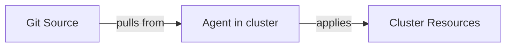
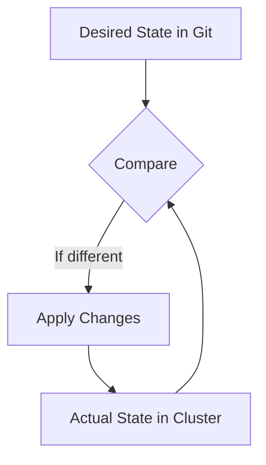
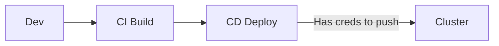
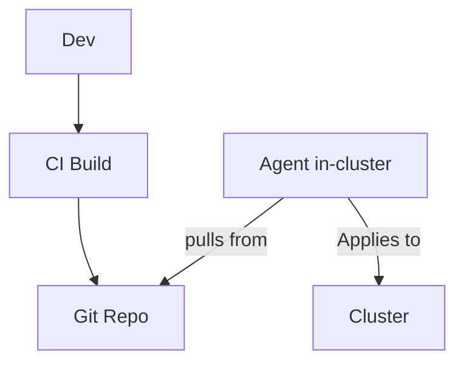
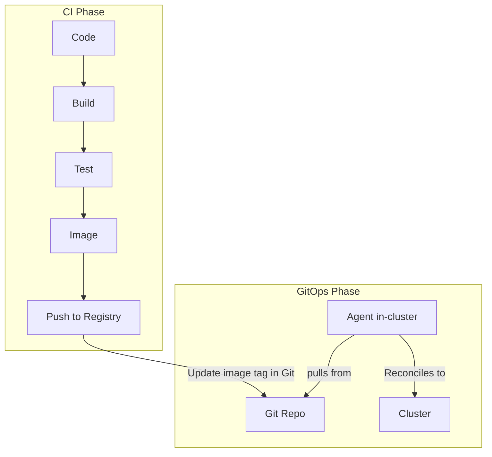

> **Discipline Module** | Complexity: `[MEDIUM]` | Time: 30-35 min

## Prerequisites

Before starting this module:
- **Required**: [Systems Thinking Track](/platform/foundations/systems-thinking/) — Understanding feedback loops
- **Required**: Basic Git knowledge (branches, commits, pull requests)
- **Recommended**: [Kubernetes Basics](/prerequisites/kubernetes-basics/) — Pod, Deployment, Service concepts
- **Helpful**: Experience with CI/CD pipelines

---

## What You'll Be Able to Do

After completing this module, you will be able to:

- **Evaluate whether GitOps principles apply to your deployment workflows and infrastructure management**
- **Design a GitOps architecture with clear separation between application and configuration repositories**
- **Implement a basic GitOps workflow using Flux or Argo CD with automated reconciliation**
- **Analyze the operational benefits and trade-offs of GitOps compared to traditional CI/CD push models**

## Why This Module Matters

You've built a great CI/CD pipeline. Code gets tested, images get built, deployments happen automatically.

Then someone runs `kubectl apply` directly in production. Your Git repo and production are now out of sync. Which one is "right"?

> **Stop and think**: If someone modifies a deployment directly in production to fix a bug, and later a CI pipeline deploys an unrelated update, what happens to that bug fix? In a traditional push model, it likely gets silently overwritten.

**This is the problem GitOps solves.**

GitOps makes Git the single source of truth for your infrastructure. Not your CI/CD tool. Not someone's terminal. Git.

After this module, you'll understand:
- Why GitOps emerged and what problems it solves
- The four core principles of GitOps
- How GitOps differs from traditional CI/CD
- When GitOps is (and isn't) the right approach

---

## The Origin Story

### 2017: Weaveworks' Challenge

Weaveworks was running Kubernetes clusters at scale. They had a problem:

**Traditional deployment workflow:**
```
Developer → CI/CD Pipeline → kubectl apply → Cluster
```

This worked, but:
- CI/CD systems had production credentials
- Hard to know what's actually deployed
- Manual changes bypassed the pipeline
- No easy way to recover from disasters

**Their insight**: What if the cluster continuously pulled its desired state from Git, instead of being pushed to?

They called this approach **GitOps**.

> "GitOps is a way of implementing Continuous Deployment for cloud native applications."
> — Weaveworks, 2017

### The Evolution: From Blog Post to Industry Standard

The history of GitOps follows a clear arc:

- **2017**: Alexis Richardson (Weaveworks CEO) publishes "GitOps - Operations by Pull Request," coining the term. The core idea: combine Infrastructure as Code with pull-based delivery, using Git as the single source of truth.
- **2018-2020**: Flux and ArgoCD emerge as the dominant GitOps operators. The community debates what "counts" as GitOps versus just "using Git for config."
- **2021**: The CNCF forms the **OpenGitOps working group** to create a vendor-neutral definition. This was critical because "GitOps" was becoming a marketing buzzword applied to any tool that touched Git.
- **2021**: OpenGitOps publishes the four core principles (below), giving the community a clear standard. GitOps becomes a CNCF Sandbox project.
- **2023+**: GitOps matures beyond Kubernetes. Teams apply the principles to infrastructure (Terraform + GitOps), databases, and even network configuration.

The key insight that made GitOps stick: it wasn't just "store config in Git" (people had done that for years). It was the **pull model with continuous reconciliation** that made it fundamentally different from traditional CI/CD.

---

## The Four GitOps Principles

From OpenGitOps.dev:

### Principle 1: Declarative

> "A system managed by GitOps must have its desired state expressed declaratively."

**What this means:**
- Describe *what* you want, not *how* to get there
- YAML manifests, not shell scripts
- The end state, not the steps

```yaml
# Declarative (GitOps)
apiVersion: apps/v1
kind: Deployment
metadata:
  name: my-app
spec:
  replicas: 3
  template:
    spec:
      containers:
        - name: app
          image: my-app:v1.2.3
```

```bash
# Imperative (NOT GitOps)
kubectl scale deployment my-app --replicas=3
kubectl set image deployment/my-app app=my-app:v1.2.3
```

### Principle 2: Versioned and Immutable

> "Desired state is stored in a way that enforces immutability, versioning and retains a complete version history."

**What this means:**
- Git as the storage system
- Every change is a commit
- Full audit trail
- Easy rollback (git revert)

```
commit abc123: Update replicas to 5
commit def456: Update image to v1.2.4
commit ghi789: Add resource limits
commit jkl012: Rollback to v1.2.3  ← Easy!
```

### Principle 3: Pulled Automatically

> "Software agents automatically pull the desired state declarations from the source."

**What this means:**
- Agents in the cluster pull from Git
- No push access needed to cluster
- Continuous reconciliation
- Cluster pulls what it needs



### Principle 4: Continuously Reconciled

> "Software agents continuously observe actual system state and attempt to apply the desired state."

**What this means:**
- Agents compare desired vs actual state
- Differences trigger reconciliation
- Self-healing: drift is automatically corrected
- Constant loop, not one-time action



---

## Try This: GitOps Mental Model

Think about a service you manage. Answer these questions:

```
1. Where is the desired state defined?
   [ ] Git repo (declarative YAML)
   [ ] CI/CD pipeline scripts
   [ ] Someone's local machine
   [ ] It's... complicated

2. If I delete a pod manually, what happens?
   [ ] Agent recreates it from Git (GitOps)
   [ ] Nothing until next deploy
   [ ] Depends on who's watching

3. How do you know what's deployed in production?
   [ ] Check the Git repo
   [ ] Run kubectl commands
   [ ] Ask the last person who deployed
   [ ] Hope for the best
```

GitOps answers should be: Git repo, Agent recreates it, Check Git repo.

---

## Pull vs Push: The Key Difference

> **Pause and predict**: If the CD system lives outside your network and needs to push to your Kubernetes cluster, what firewall rules and credential management challenges does that create?

### Traditional CI/CD (Push Model)



**How it works:**
1. Developer pushes code
2. CI builds and tests
3. CD has cluster credentials
4. CD pushes changes to cluster

**Problems:**
- CD system needs cluster credentials
- Credentials outside the cluster = attack surface
- One-time push, no continuous reconciliation
- Drift can occur between pushes

### GitOps (Pull Model)



**How it works:**
1. Developer pushes code
2. CI builds, tests, pushes image, updates Git
3. Agent in cluster pulls from Git
4. Agent applies changes to cluster

**Benefits:**
- No external system has cluster credentials
- Agent only needs read access to Git
- Continuous reconciliation (self-healing)
- Git is always the truth

---

## Did You Know?

1. **The term "GitOps" was coined by Alexis Richardson** (Weaveworks CEO) in a 2017 blog post. He was trying to describe how Weaveworks operated their own infrastructure.

2. **GitOps isn't Git-specific**. While Git is the most common, the principles work with any version control system that provides immutability and history. Some teams use OCI registries for config storage.

3. **Google's Borg (Kubernetes' predecessor) used a similar pattern** — a central config system with continuous reconciliation — long before GitOps was named.

4. **The OpenGitOps project** became a CNCF Sandbox project in 2021, establishing GitOps as an industry-standard practice with formal principles rather than just a marketing term.

---

## War Story: The Deployment That Fixed Itself

A company I worked with had just adopted GitOps with ArgoCD.

**The Incident:**

Friday afternoon. A developer was debugging a production issue. In desperation, they ran:

```bash
kubectl scale deployment api-server --replicas=10
```

The extra replicas helped temporarily. Developer went home for the weekend.

**What Happened Next (Old World):**

In the old CI/CD world, those 10 replicas would stay until someone noticed and asked "why do we have 10 replicas?" Probably Monday. Maybe never.

**What Happened Next (GitOps World):**

Within 3 minutes:
1. ArgoCD detected drift: Git said 3 replicas, cluster had 10
2. ArgoCD reconciled: scaled back to 3 replicas
3. Alert fired: "Deployment modified outside GitOps"

The developer got a Slack notification. They realized they needed to:
1. Fix the actual problem (not just scale)
2. If scaling was needed, do it through Git

**The Lesson:**

GitOps didn't prevent the manual change — but it **detected it immediately** and **corrected it automatically**. The cluster state always matched Git.

**Bonus**: The audit trail showed exactly when the manual change happened, who the ArgoCD alert notified, and when it was corrected.

---

## GitOps vs CI/CD

GitOps and CI/CD aren't opposites — they're complementary.

### What CI Does

- Build code
- Run tests
- Create artifacts (images, packages)
- Scan for vulnerabilities

### What CD Does (Traditional)

- Deploy artifacts to environments
- Manage credentials
- Execute deployment scripts

### What GitOps Does

- Store desired state in Git
- Continuously reconcile cluster to match Git
- Detect and fix drift
- Provide audit trail

### The Combined Model



CI builds. GitOps deploys.

---

## When GitOps Works Best

### Good Fit

| Scenario | Why GitOps Helps |
|----------|------------------|
| Kubernetes workloads | Native YAML, reconciliation-friendly |
| Multiple environments | Same process, different configs |
| Compliance requirements | Built-in audit trail |
| Team collaboration | PRs for infrastructure changes |
| Disaster recovery | Redeploy from Git |
| Multi-cluster | Single source of truth |

### Less Good Fit

| Scenario | Challenge |
|----------|-----------|
| Stateful systems | State in cluster != state in Git |
| Real-time config | Git commit latency |
| Legacy systems | May not be declarative |
| Secrets (naively) | Can't store plaintext in Git |
| One-off scripts | Imperative by nature |

### The Hybrid Reality

Most organizations use GitOps for:
- Kubernetes manifests
- Infrastructure as Code
- Configuration management

But keep traditional approaches for:
- Secrets management (with integration)
- Stateful operations
- Emergency fixes (then sync to Git)

---

## GitOps Tooling Landscape

Several tools implement GitOps principles:

### Flux

- CNCF graduated project
- Kubernetes-native
- Composable toolkit
- Git + Helm + Kustomize support

### ArgoCD

- CNCF incubating project
- Web UI included
- Application-centric model
- Popular in enterprises

### Others

- **Rancher Fleet**: Multi-cluster focus
- **Jenkins X**: Full CI/CD + GitOps
- **Werf**: Integrated CI/CD
- **Codefresh**: Commercial GitOps platform

We'll explore specific tools in the [GitOps Tools Toolkit](/platform/toolkits/cicd-delivery/gitops-deployments/).

---

## Common Mistakes

| Mistake | Problem | Solution |
|---------|---------|----------|
| Storing secrets in Git | Security breach | Use Sealed Secrets, External Secrets, or SOPS |
| Push model labeled "GitOps" | Missing reconciliation benefits | True GitOps is pull-based with continuous reconciliation |
| Manual kubectl "just this once" | Drift, confusion | All changes through Git, enforce with policies |
| No drift detection alerts | Don't know when drift occurs | Configure alerts for reconciliation failures |
| Giant monorepo | Slow sync, coupling | Consider repo structure carefully |
| Branch-per-environment | Merge conflicts, confusion | Directory-per-environment preferred |

---

## Quiz: Check Your Understanding

### Question 1
Scenario: Your team is debating moving from a Jenkins pipeline that runs `kubectl apply` to a Flux-based workflow. A junior engineer asks, "Isn't Flux just doing the same thing Jenkins did, but inside the cluster?" How do you explain the fundamental architectural difference?

<details>
<summary>Show Answer</summary>

While both approaches automate deployments, they operate on completely different models of control and state management. Jenkins relies on a "push" model where an external system executes a one-time deployment command and then forgets about it until the next pipeline run. If configuration drifts after that push, Jenkins has no way of knowing or fixing it. Flux, however, uses a "pull" model with a continuous reconciliation loop that constantly compares the cluster's actual state to the desired state in Git. This means Flux doesn't just deploy the application once; it actively maintains that state, automatically correcting any unauthorized changes to ensure Git always reflects reality.

</details>

### Question 2
Scenario: It's 3 AM. A critical application is crash-looping. A panicked on-call engineer runs `kubectl scale deployment payment-api --replicas=10` directly against the production cluster to handle the load, bypassing Git entirely. In a cluster managed strictly by Argo CD with auto-sync enabled, what happens next?

<details>
<summary>Show Answer</summary>

The GitOps agent (Argo CD) will almost immediately detect that the actual state of the cluster (10 replicas) no longer matches the desired state declared in Git (e.g., 3 replicas). Because the system is designed for continuous reconciliation, it will treat this manual scaling as configuration drift. Argo CD will automatically issue a scaling command to revert the deployment back to 3 replicas to match the Git repository. To properly scale the application in a GitOps environment, the engineer must commit the replica change to the Git repository, which the agent will then pull and apply. This enforces the principle that Git is the absolute single source of truth, even during emergencies.

</details>

### Question 3
Scenario: A rogue script accidentally deletes your entire production Kubernetes cluster. You have a new, empty cluster provisioned. Your applications and infrastructure were entirely managed via GitOps. Describe the exact steps required to restore production services, and contrast this with a traditional CI/CD disaster recovery.

<details>
<summary>Show Answer</summary>

In a GitOps environment, disaster recovery is vastly simplified because the entire desired state of your infrastructure and applications is stored declaratively in a versioned Git repository. To restore the cluster, you simply install your GitOps agent (like Flux or Argo CD) on the new cluster and provide it with read access to your Git repository. The agent will methodically pull all configurations and apply them, rebuilding the cluster's state exactly as it was before the disaster. In contrast, traditional CI/CD disaster recovery often involves manually triggering dozens of historical pipelines in a specific order, hunting down lost deployment scripts, or relying on outdated cluster backups. GitOps eliminates this guesswork by ensuring that your Git repository is a complete, executable blueprint of your production environment.

</details>

### Question 4
Scenario: Your CISO mandates that no external system, including your SaaS CI provider, is allowed to hold administrative credentials to the production Kubernetes cluster. How does a GitOps architecture satisfy this compliance requirement without breaking automated deployments?

<details>
<summary>Show Answer</summary>

GitOps fundamentally shifts the deployment paradigm from a "push" model to a "pull" model, which neatly solves this security challenge. In a traditional setup, the external CI/CD pipeline needs administrative credentials to authenticate with the cluster's API server and push changes. With GitOps, the deployment agent lives completely inside the secure boundary of the Kubernetes cluster. The cluster reaches out to read the Git repository, meaning no external system ever needs inbound access or administrative credentials to your cluster. This drastically reduces your attack surface and fully satisfies the CISO's mandate while still enabling fully automated, continuous deployments.

</details>

---

## Hands-On Exercise: GitOps Readiness Assessment

Evaluate your current deployment process against GitOps principles.

### Part 1: Current State Assessment

For a service you manage, answer:

```markdown
## Service: _________________

### Principle 1: Declarative
- Is the desired state in declarative YAML/config? [ ] Yes [ ] Partial [ ] No
- Are there imperative scripts in the deploy process? [ ] Yes [ ] No
- Could someone recreate the deployment from config alone? [ ] Yes [ ] No

Declarative Score: ___/3

### Principle 2: Versioned and Immutable
- Is the config in Git? [ ] Yes [ ] Partial [ ] No
- Is every change a commit? [ ] Yes [ ] No
- Can you see full change history? [ ] Yes [ ] No

Versioned Score: ___/3

### Principle 3: Pulled Automatically
- Does an agent pull from Git? [ ] Yes [ ] No
- Or does CI/CD push to cluster? [ ] Push [ ] Pull
- Who has cluster credentials? [ ] Only in-cluster [ ] External systems

Pull Model Score: ___/3

### Principle 4: Continuously Reconciled
- Is there continuous sync? [ ] Yes [ ] No (only at deploy)
- Is drift detected automatically? [ ] Yes [ ] No
- Is drift corrected automatically? [ ] Yes [ ] No

Reconciliation Score: ___/3

Total Score: ___/12
```

### Part 2: Gap Analysis

Based on your scores, identify:

```markdown
## Biggest Gaps

1. Lowest scoring principle: _________________
   - What's missing: _________________
   - What would fix it: _________________

2. Second lowest: _________________
   - What's missing: _________________
   - What would fix it: _________________

## Quick Wins (easy improvements)

1. _________________
2. _________________
3. _________________

## Blockers (hard to change)

1. _________________
   - Why it's hard: _________________
```

### Part 3: Migration Sketch

If you were to adopt GitOps fully:

```markdown
## GitOps Migration Plan (Sketch)

### Repository Structure
- Where would config live? _________________
- Monorepo or polyrepo? _________________

### Tool Selection
- GitOps operator: [ ] Flux [ ] ArgoCD [ ] Other: _____
- Why: _________________

### Migration Approach
- [ ] Big bang (convert everything at once)
- [ ] Incremental (one service at a time)
- [ ] Parallel (run both, compare)

### First Service to Migrate
- Service: _________________
- Why this one: _________________
```

### Success Criteria

- [ ] Assessed all four principles honestly
- [ ] Identified top 2 gaps
- [ ] Listed at least 3 quick wins
- [ ] Sketched high-level migration approach

---

## Key Takeaways

1. **GitOps = Git as source of truth** — all changes through Git, continuously reconciled
2. **Four principles**: Declarative, Versioned, Pulled, Continuously Reconciled
3. **Pull > Push**: Agent in cluster pulls from Git, no external credentials needed
4. **Self-healing**: Drift is detected and corrected automatically
5. **CI builds, GitOps deploys**: They're complementary, not competing

---

## Further Reading

**Specification**:
- **OpenGitOps.dev** — Official GitOps principles

**Books**:
- **"GitOps and Kubernetes"** — Billy Yuen, et al. (Manning)
- **"Argo CD in Practice"** — Liviu Costea, et al.

**Articles**:
- **"GitOps - Operations by Pull Request"** — Weaveworks (original 2017 post)
- **"Guide to GitOps"** — Weaveworks

**Talks**:
- **"GitOps: Reconcile Your Desire"** — Stefan Prodan (KubeCon)
- **"Intro to GitOps"** — Alexis Richardson (YouTube)

---

## Summary

GitOps is an operational model where:
- Git is the single source of truth
- Desired state is declarative and versioned
- Agents pull and apply changes continuously
- Drift is detected and corrected automatically

It's not just "using Git for config" — it's a fundamentally different deployment model that provides:
- Better security (no external cluster credentials)
- Better reliability (self-healing)
- Better auditability (full Git history)
- Better disaster recovery (rebuild from Git)

GitOps transforms how you think about deployments: from "push changes to production" to "declare what production should be."

---

## Next Module

Continue to [Module 3.2: Repository Strategies](../module-3.2-repository-strategies/) to learn how to structure your Git repositories for GitOps.

---

*"The Git repository is the source of truth. The cluster is just a reflection."* — GitOps Proverb