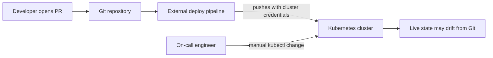
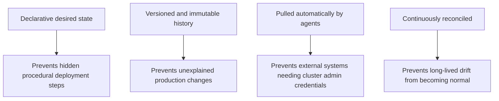
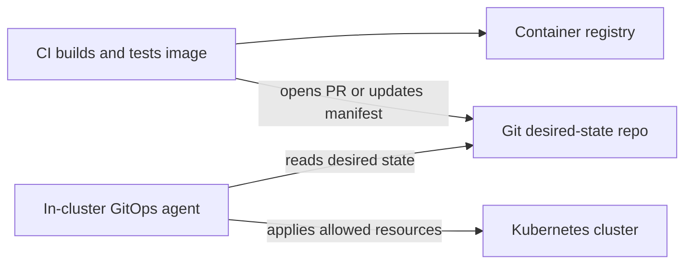
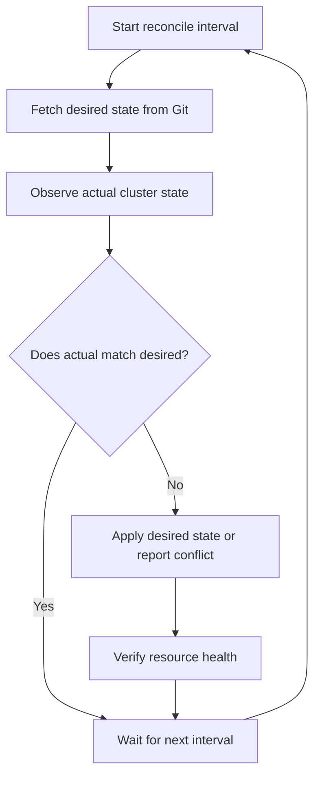
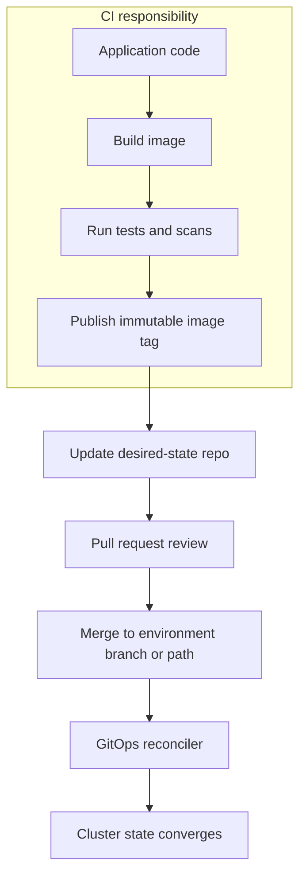
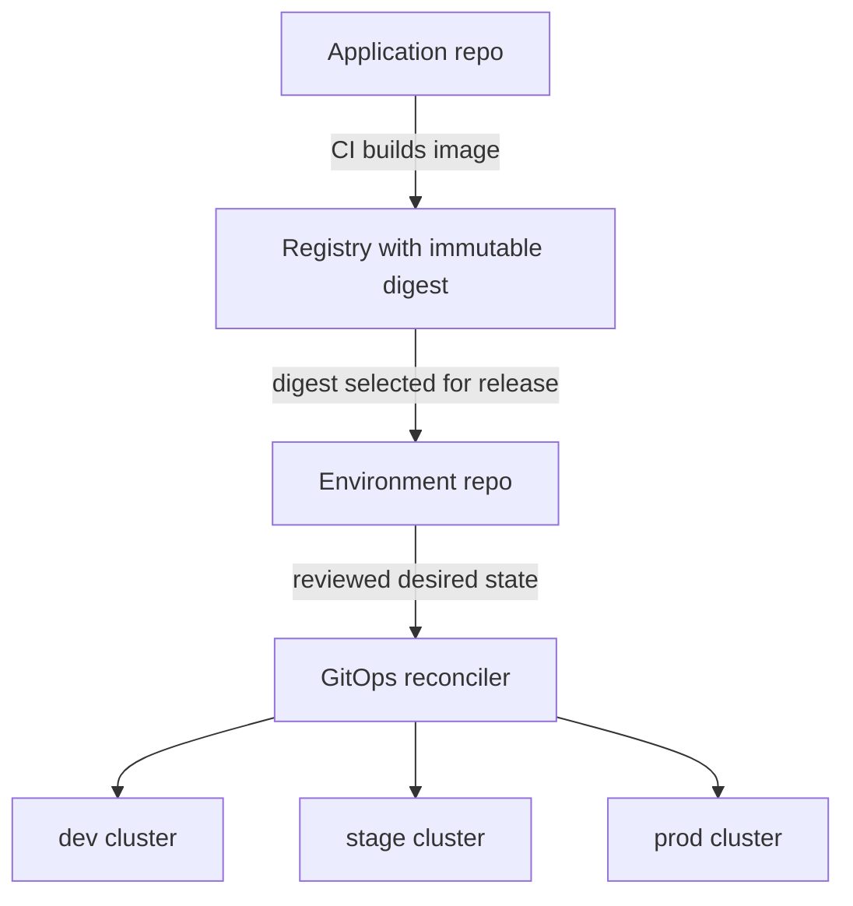
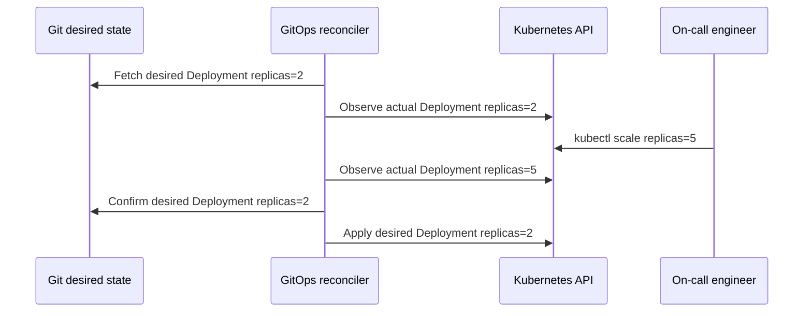

> **Discipline Module** | Complexity: `[MEDIUM]` | Time: 35 min

## Prerequisites

Before starting this module, you should be comfortable making small changes in Git, reading Kubernetes manifests, and explaining the difference between a desired configuration and the live state of a running system. GitOps is not hard because the first example is complicated; it is hard because it changes where teams place authority during deployment and operations.

- **Required**: [Systems Thinking Track](/platform/foundations/systems-thinking/) — especially feedback loops and control systems.
- **Required**: Basic Git knowledge — commits, branches, pull requests, and revert operations.
- **Required**: Basic Kubernetes concepts — Pods, Deployments, Services, namespaces, and declarative YAML.
- **Recommended**: Familiarity with CI pipelines that build container images and run tests.
- **Recommended for the lab**: `git`, `kubectl`, `kind`, and a local shell that can run Bash scripts.

---

## Learning Outcomes

After completing this module, you will be able to:

- **Evaluate** whether a deployment workflow satisfies the four GitOps principles instead of merely storing YAML in a repository.
- **Design** a GitOps control path that separates build artifacts, desired environment state, and cluster reconciliation responsibilities.
- **Implement** a small GitOps-style reconciliation workflow that detects drift, applies desired state, and proves that Git remains authoritative.
- **Analyze** the security, reliability, and operational trade-offs between push-based CI/CD and pull-based GitOps reconciliation.

---

## Why This Module Matters

A payments team ships a harmless-looking configuration change on a Thursday afternoon. The CI pipeline passes, the container image is built, and the deploy job runs `kubectl apply` against production. Ten minutes later the service begins timing out because an environment-specific setting was overwritten by an older manifest that nobody realized still lived in the deploy job workspace. The team opens dashboards, checks the last pipeline run, and finds three competing stories about reality: Git says one thing, the cluster says another, and the deploy job logs contain a third version that no longer exists anywhere else.

This is the operational failure GitOps is designed to prevent. GitOps makes the desired state of the system explicit, versioned, reviewable, and continuously reconciled. It does not make every deployment safe by magic, and it does not remove the need for tests, observability, or incident response. It does give the team a single place to answer the most important question during change: what should this system look like right now?

The core mental shift is authority. In a traditional push model, the deployment tool is often the actor with production power, and Git is mostly an input to that actor. In GitOps, Git is the source of desired state, and a reconciler keeps the running system aligned with that state. The cluster is no longer a place where people make permanent changes by hand; it is a reflection of reviewed declarations.

> **Active learning prompt**: Think about the last production change your team made. If the cluster disappeared and you had to rebuild it from scratch, could Git alone recreate the workloads, namespaces, policies, and configuration needed to serve traffic? If the honest answer is "not quite," identify the pieces that exist only in a pipeline, wiki, ticket, terminal history, or someone's memory.

GitOps matters because modern delivery systems are not just about speed. They are about recovering from mistakes, proving what changed, limiting credential exposure, and making operations repeatable under stress. A deployment model that is fast but cannot explain itself during an incident is only partially automated.

---

## 1. The Problem GitOps Solves

Before GitOps, many teams already kept Kubernetes manifests in Git. That practice helped with code review and history, but it did not automatically make Git the authority over production. A Jenkins job, GitHub Actions workflow, or laptop script could still push a different version of the same resource into the cluster. Once that happened, the team had drift: the live system no longer matched the repository that people believed described it.



The word "drift" is important because it describes a gap between desired state and actual state, not merely a failed deployment. Drift can happen when someone patches a Deployment during an incident, when a Helm release is changed outside the expected path, when a controller mutates fields that were not accounted for, or when a pipeline deploys a stale artifact. The damage is not only technical; drift weakens trust because engineers no longer know which system tells the truth.

A simple Kubernetes example makes the problem concrete. Suppose Git declares that the `checkout-api` Deployment should run three replicas, but someone scales it manually to handle a traffic spike. The manual change may be reasonable as an emergency action, yet it creates a second source of truth unless the change is also recorded in Git. Later, a normal deployment may overwrite the emergency change, or the manual change may remain forever as unexplained production folklore.

```yaml
apiVersion: apps/v1
kind: Deployment
metadata:
  name: checkout-api
  namespace: shop
spec:
  replicas: 3
  selector:
    matchLabels:
      app: checkout-api
  template:
    metadata:
      labels:
        app: checkout-api
    spec:
      containers:
        - name: api
          image: nginx:1.27
          ports:
            - containerPort: 80
```

A push-based workflow usually treats deployment as an event. The pipeline runs, sends commands to the cluster, and exits. If someone changes the cluster afterward, the pipeline does not know unless another system detects it. GitOps treats deployment as an ongoing control loop. A reconciler repeatedly compares desired state from Git with actual state from the cluster, then acts when they differ.

```ascii
+--------------------+        +--------------------+        +--------------------+
| Desired state      |        | Reconciler         |        | Actual state       |
| Git commits        | -----> | Compare and apply  | -----> | Cluster resources  |
| Reviewed changes   |        | Repeat continuously|        | Running workloads  |
+--------------------+        +--------------------+        +--------------------+
          ^                              |                              |
          |                              v                              |
          +---------------------- Drift detected -----------------------+
```

This is why "we store YAML in Git" is not enough. GitOps requires a loop that keeps the system aligned after the first deployment. Without that loop, Git is an archive of intent, not an operational source of truth.

> **Active learning prompt**: Imagine that Git declares three replicas, production currently has eight, and the service is healthy only because of those extra replicas. Should the reconciler immediately restore three replicas, pause and alert, or allow the difference temporarily? Write down your answer before continuing, then connect it to your team's incident policy.

The senior-level lesson is that GitOps is a governance model as much as a deployment model. It defines how change is proposed, reviewed, applied, observed, corrected, and audited. Tools such as Flux and Argo CD implement that model, but the model is what determines whether the tool improves operations or simply becomes another automation layer.

---

## 2. The Four Principles, Applied

The OpenGitOps principles are short, but each one carries operational consequences. The principles are declarative desired state, versioned and immutable storage, automatic pull-based application, and continuous reconciliation. The easiest way to learn them is to map each principle to a failure it prevents.



The first principle is **declarative desired state**. A declarative file says what the system should look like, not the step-by-step procedure for getting there. Kubernetes manifests are a natural fit because a Deployment can declare image, replica count, labels, probes, and resource requests without telling Kubernetes exactly which Pod to create first.

```yaml
apiVersion: apps/v1
kind: Deployment
metadata:
  name: inventory-api
  namespace: shop
spec:
  replicas: 2
  selector:
    matchLabels:
      app: inventory-api
  template:
    metadata:
      labels:
        app: inventory-api
    spec:
      containers:
        - name: api
          image: nginx:1.27
          resources:
            requests:
              cpu: 100m
              memory: 128Mi
            limits:
              cpu: 500m
              memory: 256Mi
```

The same change expressed imperatively may work once, but it is harder to audit and replay. A command like `kubectl scale deployment inventory-api --replicas=2` changes a live object, but it does not explain why two replicas are correct, whether the value was reviewed, or whether the change belongs in every environment. GitOps favors declarations because declarations can be reviewed before they become production behavior.

The second principle is **versioned and immutable storage**. Git provides commit history, authorship, review context, diffs, branches, tags, and revert mechanics. This does not mean Git history can never be rewritten in any repository; it means the desired state used for operations must preserve an auditable chain of changes. A production fix should become a commit, not a terminal command that disappears when the shell closes.

```bash
git log --oneline --decorate -- clusters/prod/apps/checkout-api.yaml
git show HEAD -- clusters/prod/apps/checkout-api.yaml
git revert HEAD
```

The third principle is **automatic pull**. In GitOps, a controller inside or near the target environment pulls desired state from the source. That design changes the credential boundary. The CI system can build and test images, but it does not need administrative credentials to push manifests into the production cluster. The reconciler has the cluster permissions it needs, and the external systems usually need only write access to Git or an image registry.



The fourth principle is **continuous reconciliation**. A GitOps agent does not merely apply a manifest once. It observes desired state and actual state repeatedly, then converges the system when they diverge. This makes drift visible and correctable, but it also means teams must be deliberate about emergency operations. If a manual change is necessary, the team needs a policy for pausing reconciliation, committing the change, or accepting that the manual patch will be reversed.



The principles are mutually reinforcing. Declarative state without versioning gives you files with weak history. Versioning without pull-based agents leaves production credentials in external systems. Pull without continuous reconciliation gives you a delayed push model. Reconciliation without a reviewed source of truth can automate bad changes faster than humans can understand them.

| Principle | What the learner should check | Failure signal | Practical design response |
|-----------|-------------------------------|----------------|---------------------------|
| Declarative | Can the desired end state be described as files? | Deployment depends on hidden shell steps | Move environment state into manifests, Helm values, or Kustomize overlays |
| Versioned | Can a reviewer see who changed what and why? | Production changes exist only in tickets or terminals | Require PRs, protected branches, and revertable commits |
| Pulled | Does the target environment fetch desired state? | External CI has cluster-admin credentials | Put the reconciler near the cluster and limit CI to build and Git updates |
| Reconciled | Does drift get detected after deployment? | Manual fixes persist silently | Configure sync status, drift alerts, and clear break-glass procedures |

A strong GitOps implementation does not ask engineers to trust a slogan. It gives them a concrete path from proposed change to reviewed commit, from reviewed commit to reconciled cluster, and from unexpected drift to a visible operational decision.

---

## 3. Push Pipelines and Pull Reconciliation

Traditional CI/CD and GitOps are often presented as rivals, but a mature platform uses both. CI is excellent at building artifacts, running tests, scanning dependencies, and producing container images. GitOps is excellent at applying desired environment state, preserving review history, and continuously correcting drift. The handoff between them is the important design point.



In a push model, the deployment pipeline often holds credentials that can mutate the cluster directly. This can be convenient because one system controls the whole path from commit to production. It can also be risky because compromise of the CI system may become compromise of the cluster, and because deployment state may live partly in pipeline configuration rather than in environment declarations.

```bash
# Push-style deployment event: useful as a contrast, not the target GitOps pattern.
kubectl apply -f clusters/prod/apps/checkout-api.yaml
kubectl rollout status deployment/checkout-api -n shop
```

In a pull model, the pipeline may still update a manifest after publishing a new image. The difference is that the pipeline writes desired state to Git, and the reconciler applies that state from within the control boundary. The production cluster does not need to accept inbound deployment commands from the CI provider. Instead, it needs outbound read access to the desired-state source and the image registry.

```ascii
+-----------------------+       +-----------------------+       +-----------------------+
| CI system             |       | Git desired state     |       | Cluster boundary      |
| Build, test, scan     | ----> | PR, review, merge     | <---- | Reconciler pulls      |
| Publish image tag     |       | Environment config    |       | Applies with RBAC     |
+-----------------------+       +-----------------------+       +-----------------------+
```

This architecture affects security reviews. A CISO who refuses to let a SaaS CI provider hold production cluster credentials is not blocking automation; they are pushing the team toward a cleaner trust boundary. The CI system can still propose a version bump, but the cluster-local reconciler performs the mutation using scoped service account permissions.

The architecture also affects troubleshooting. When a push deployment fails, you often inspect a pipeline run and infer what happened inside the cluster. When GitOps reconciliation fails, you inspect the desired-state commit, the reconciler status, the Kubernetes events, and the health of the target resources. That is a different operational muscle, and teams should practice it before relying on GitOps for critical workloads.

| Model | Who initiates the cluster change? | Where production credentials live | What happens after the deploy event? | Best fit |
|-------|-----------------------------------|-----------------------------------|--------------------------------------|----------|
| Push CI/CD | External pipeline or operator terminal | CI system, runner, or operator workstation | Usually nothing until the next run | Simple systems, early-stage teams, manual gates |
| GitOps pull | Reconciler near the target environment | In-cluster controller service account | Continuous comparison and convergence | Kubernetes platforms, multi-environment delivery, audit-heavy systems |
| Hybrid | CI proposes, GitOps reconciles | CI has Git access, reconciler has cluster access | Drift is monitored and corrected | Most mature platform teams |

A useful rule is "CI builds; GitOps deploys." The rule is not absolute because some teams use progressive delivery controllers, image automation, or release orchestration tools that blur the boundary. Still, the sentence keeps beginners from granting cluster-admin permissions to every build runner and calling the result GitOps.

> **Active learning prompt**: Your team uses GitHub Actions to build images and deploy to production. You want to move to GitOps without slowing delivery. Which permission should be removed first from the CI runner: image registry write access, Git repository write access, or Kubernetes cluster write access? Explain your choice in terms of blast radius.

The answer is usually Kubernetes cluster write access. The CI runner still needs to publish artifacts, and it may need to open or update pull requests. What it should not need in a pull-based GitOps design is the ability to mutate production workloads directly.

---

## 4. Designing the Source of Truth

The phrase "Git is the source of truth" is easy to repeat and easy to misuse. In practice, there are several kinds of truth. Application source code describes how the service behaves. Build metadata describes which artifact was produced. Environment desired state describes which artifact, configuration, and policies should be running in a specific target. GitOps works best when those responsibilities are clear.

```ascii
+--------------------------+        +-----------------------------+
| Application repository   |        | Environment repository      |
| Source code              |        | Kubernetes manifests        |
| Unit tests               |        | Helm values or overlays     |
| Dockerfile               |        | Namespaces and policies     |
| CI pipeline definition   |        | Image tags per environment  |
+--------------------------+        +-----------------------------+
          |                                      ^
          | publishes image                      |
          v                                      |
+--------------------------+                     |
| Container registry       | -------------------+
| Immutable image digest   |
| Vulnerability metadata   |
+--------------------------+
```

Many teams begin by keeping application code and deployment manifests in the same repository. That can be perfectly reasonable for a small service because developers can change code and configuration together. The risk appears when environment configuration becomes entangled with application development. A production hotfix should not require unrelated application code permissions, and a platform policy change should not need to touch dozens of application repositories unless that coupling is intentional.

A separate environment repository gives platform teams a clean review boundary for production state. It also makes multi-cluster and multi-environment views easier because the repository can be organized by cluster, namespace, or service. The trade-off is coordination: image automation or release tooling must update the environment repository after CI publishes a new artifact.



The best repository strategy depends on scale, ownership, and compliance needs. A small product team may prefer one repository per service because it keeps changes close to the code. A platform organization managing hundreds of services may prefer a dedicated environment repository because it centralizes production state and policy review. GitOps does not mandate one layout, but it does require the selected layout to be understandable during an incident.

| Repository pattern | Strength | Risk | Use when |
|--------------------|----------|------|----------|
| App and config together | Simple ownership and fast local changes | Production state can be mixed with code churn | One team owns the whole service lifecycle |
| Separate environment repo | Clear operational source of truth | Requires release automation or coordination | Platform teams manage shared environments |
| Monorepo for all environments | Easy global visibility and policy checks | Large repos can create noisy reviews and slow syncs | Organization values central governance |
| Repo per cluster or tenant | Strong isolation and smaller blast radius | Harder to coordinate broad changes | Clusters have distinct owners or compliance boundaries |

There is also a senior-level trap around image tags. If Git declares `image: checkout-api:latest`, the manifest looks declarative but the artifact is mutable. A Git commit should point to a specific artifact, often by immutable tag or digest, so that reverting the commit really reverts the running workload. Otherwise, Git records a name whose meaning can change outside Git.

```yaml
# Better for reproducibility because the digest identifies exact image content.
apiVersion: apps/v1
kind: Deployment
metadata:
  name: checkout-api
  namespace: shop
spec:
  template:
    spec:
      containers:
        - name: api
          image: registry.example.com/shop/checkout-api@sha256:1111111111111111111111111111111111111111111111111111111111111111
```

Secrets require separate care. GitOps does not mean plaintext secrets belong in Git. Teams commonly use External Secrets Operator, SOPS, Sealed Secrets, Vault integrations, or cloud secret managers so that Git stores references or encrypted material rather than exposed credentials. The principle is still declarative desired state, but the sensitive value is protected by a tool designed for that purpose.

A good source-of-truth design answers three questions without a meeting. Which commit changed production? Which artifact is running? Which controller applied it? If an engineer cannot answer those questions from the repository, reconciler status, and cluster state, the GitOps design is not yet operationally mature.

---

## 5. Worked Example: Drift, Reconciliation, and Recovery

Now we will walk through a small example before the lab asks you to implement a similar workflow. The example is intentionally simple because the important concept is the loop: desired state is declared, actual state changes, drift is detected, and reconciliation restores the declared state.

Assume Git contains a namespace and a Deployment for `inventory-api`. The desired state says the application should run two replicas. A reconciler applies the manifests and verifies that Kubernetes accepts them. At this moment, the Git commit and cluster agree.

```yaml
apiVersion: v1
kind: Namespace
metadata:
  name: shop
---
apiVersion: apps/v1
kind: Deployment
metadata:
  name: inventory-api
  namespace: shop
spec:
  replicas: 2
  selector:
    matchLabels:
      app: inventory-api
  template:
    metadata:
      labels:
        app: inventory-api
    spec:
      containers:
        - name: api
          image: nginx:1.27
          ports:
            - containerPort: 80
```

During an incident, someone runs a manual scale command. This is a real operational possibility, not a moral failure. On-call engineers sometimes need to act quickly. The GitOps question is what happens afterward: does the manual change become invisible drift, or does the system detect it and force a decision?

```bash
kubectl scale deployment inventory-api -n shop --replicas=5
kubectl get deployment inventory-api -n shop -o jsonpath='{.spec.replicas}{"\n"}'
```

A reconciler comparing Git and the cluster sees that the live object now differs from the desired manifest. In an auto-sync mode, it applies the desired manifest again and returns the Deployment to two replicas. In a manual-sync mode, it reports the drift and waits for an operator to approve the correction. Both modes can be valid; the mistake is running without a policy.



The worked example teaches an uncomfortable lesson. GitOps will sometimes undo a manual change that temporarily improved a symptom. That is not a flaw if the team has designed emergency procedures. It is a flaw if the team adopts auto-sync without teaching responders how to pause reconciliation, commit emergency changes, or use a documented break-glass process.

A mature incident process might look like this. If manual intervention is required, the responder either pauses the affected application sync or makes the change through Git. If the change must happen faster than review allows, the responder records a break-glass action, applies the patch, and immediately opens a follow-up PR that reconciles the repository with the accepted emergency state. The system should make the exception visible rather than silently accepting a new source of truth.

```ascii
+------------------------------+
| Incident decision point      |
+------------------------------+
| Is the desired state wrong?  |
+---------------+--------------+
                |
        +-------+-------+
        |               |
       Yes              No
        |               |
        v               v
+---------------+   +--------------------------+
| Commit change |   | Let reconciler restore   |
| through Git   |   | declared desired state   |
+---------------+   +--------------------------+
        |
        v
+------------------------------+
| Review, merge, reconcile     |
+------------------------------+
```

The recovery story is equally important. If a cluster is lost, a GitOps-managed environment can be rebuilt by creating a new cluster, installing the reconciler, granting it access to the desired-state repository, and allowing it to apply the declarations. This does not automatically restore external databases or lost persistent volumes, but it dramatically reduces ambiguity for stateless workloads and infrastructure objects that are declared in Git.

A senior practitioner separates "cluster reconstruction" from "data recovery." GitOps is strong at reconstructing Kubernetes objects, controller configuration, policy resources, and workload definitions. It is not a backup strategy for database contents or object storage data. Treating GitOps as a complete disaster recovery plan without testing data restore procedures is a common and expensive misunderstanding.

---

## 6. When GitOps Fits, and When It Needs Guardrails

GitOps works especially well when the managed system has a declarative API and a controller-friendly reconciliation model. Kubernetes is the classic example because the platform already operates through desired state, controllers, and observed status. GitOps extends that idea to the delivery workflow by making Git the declared source for what the controllers should maintain.

| Scenario | Why GitOps helps | Guardrail to add |
|----------|------------------|------------------|
| Kubernetes workloads | Manifests are declarative and Kubernetes already reconciles objects | Validate manifests before merge and monitor sync health |
| Multi-environment delivery | Same change path can promote from dev to stage to production | Keep environment differences explicit and reviewed |
| Compliance-heavy systems | Pull requests, commits, and reconciler events create an audit path | Protect branches and require approvals for sensitive paths |
| Multi-cluster platforms | One desired-state model can feed many clusters | Use clear ownership boundaries and cluster-specific overlays |
| Disaster reconstruction | Reapplying Git state can recreate declared resources | Test bootstrap order and keep data backups separate |

GitOps is less comfortable when the system cannot be expressed declaratively or when change must be immediate and highly interactive. Some legacy platforms only expose imperative scripts. Some database operations require careful sequencing, locks, and human judgment. Some emergency mitigations need temporary state that should not become permanent desired state. GitOps can still participate in those workflows, but forcing every action into the same pattern can create operational theater rather than reliability.

| Scenario | Why GitOps is challenging | Safer approach |
|----------|---------------------------|----------------|
| Plaintext secrets | Git history preserves leaked values even after deletion | Store encrypted secrets or references to a secret manager |
| Mutable image tags | Git no longer identifies exact runtime content | Use immutable tags or image digests |
| One-off data migrations | Declarative state may not capture sequencing and rollback needs | Use migration tools with reviewed runbooks and status reporting |
| Fast incident experiments | Auto-sync may undo manual changes before responders learn | Define pause, override, and follow-up PR procedures |
| Legacy imperative systems | Scripts hide desired end state inside procedural steps | Wrap gradually, extract declarative configuration, and keep manual gates |

A strong adoption plan starts with low-risk services whose desired state is already mostly declarative. The first migration should teach the team how review, sync, drift detection, rollback, and alerting feel in practice. Migrating the most complicated service first can obscure the model because the team spends all its energy on edge cases.

Progressive delivery also deserves a note. GitOps can declare that a new image should be rolled out, but traffic shifting, canary analysis, and automated rollback may be handled by tools such as Argo Rollouts, Flagger, service meshes, or platform-specific release controllers. That does not contradict GitOps. It means Git declares the intended release policy, and specialized controllers execute and report on the rollout.

The decision to use auto-sync should be explicit. Auto-sync is powerful for self-healing and reducing human toil, but it can surprise teams that still rely on manual cluster patches. Manual sync provides more control but can weaken the "continuous" part of GitOps if people forget to apply changes. Many teams use auto-sync in lower environments first, then apply stricter policies and alerting before enabling it in production.

A useful design review question is: "What happens when Git and the cluster disagree?" If the answer is vague, the team has not finished designing GitOps. The correct answer should name the reconciler behavior, alerting path, human decision point, and procedure for making the desired state correct.

---

## Did You Know?

1. **GitOps was named after existing operational patterns became visible in Kubernetes delivery.** The term became popular through Weaveworks, but the underlying idea of declared desired state plus reconciliation was already familiar in control-plane design.

2. **GitOps is not limited to application deployments.** Teams use the same principles for cluster add-ons, policy resources, infrastructure controllers, network configuration, and platform APIs when those systems expose declarative interfaces.

3. **A GitOps rollback is often a Git revert, but only when artifacts are immutable.** If the manifest points to a mutable image tag, reverting the manifest may not recreate the same runtime behavior.

4. **GitOps can improve security by removing cluster credentials from external CI systems.** The improvement depends on scoped reconciler permissions, protected repositories, and careful secret management rather than on the word "GitOps" alone.

---

## Common Mistakes

| Mistake | Problem | Better approach |
|---------|---------|-----------------|
| Calling any YAML-in-Git workflow GitOps | The team may still rely on one-time push deployments with no drift detection | Verify the four principles: declarative, versioned, pulled, and reconciled |
| Giving CI cluster-admin credentials | A compromised CI runner can become a production cluster compromise | Let CI build artifacts and update Git while an in-cluster reconciler applies changes |
| Using mutable image tags like `latest` | Git cannot prove exactly which artifact is running or being rolled back | Pin releases to immutable tags or digests and record them in desired state |
| Storing plaintext secrets in Git | Secret values remain in history and may spread through forks, caches, and backups | Use SOPS, Sealed Secrets, External Secrets Operator, Vault, or cloud secret references |
| Enabling auto-sync without incident procedures | Manual emergency changes may be reverted before responders understand why | Define pause, break-glass, follow-up PR, and alerting procedures before production use |
| Mixing application source and production state without boundaries | Code changes and operational changes become hard to review independently | Choose repository structure based on ownership, risk, and review requirements |
| Ignoring reconciler health | Git may be correct while the cluster stops converging because the agent is failing | Alert on sync failures, authentication errors, stale revisions, and unhealthy resources |

---

## Quiz: Apply the Model

### Question 1

Your team says it has adopted GitOps because every Kubernetes manifest is stored in Git. During a review, you discover that Jenkins still runs `kubectl apply` from outside the cluster and nobody checks for drift after the pipeline finishes. How would you evaluate this workflow against the GitOps principles, and what is the first architectural change you would recommend?

<details>
<summary>Show Answer</summary>

The workflow satisfies part of the declarative and versioned principles because manifests are stored in Git, but it fails the pull and continuous reconciliation principles. Jenkins is still the external actor pushing state into the cluster, and the system does not keep comparing actual state with desired state after deployment. The first architectural change should be to introduce a reconciler such as Flux or Argo CD near the cluster and move Jenkins away from direct cluster mutation. Jenkins can continue building images and proposing desired-state updates, but the reconciler should apply and monitor the environment state.

</details>

### Question 2

A production Deployment is declared in Git with three replicas. During a traffic spike, an on-call engineer manually scales it to nine replicas, and the GitOps agent scales it back to three two minutes later. The engineer argues that GitOps made the incident worse. How do you analyze the failure and improve the operating model?

<details>
<summary>Show Answer</summary>

The immediate behavior is consistent with auto-sync GitOps: the agent treated the manual scale as drift and restored the declared desired state. The failure is not that reconciliation exists; the failure is that the team lacked an emergency procedure for cases where desired state must change quickly. The improvement is to define a break-glass path: pause sync for the affected application, commit the emergency replica change through Git, or apply a temporary override with a required follow-up PR. The team should also decide which workloads may use auto-sync in production and alert responders when manual drift is corrected.

</details>

### Question 3

A security architect bans SaaS CI systems from holding production Kubernetes credentials. The delivery team worries that this will make automated deployments impossible. Design a GitOps control path that preserves automation while satisfying the credential constraint.

<details>
<summary>Show Answer</summary>

The CI system should keep responsibility for building, testing, scanning, and publishing immutable container images. After publishing an image, it should update the desired-state repository through a pull request or controlled commit. A GitOps reconciler running inside the cluster should pull that repository and apply the reviewed manifests with a scoped Kubernetes service account. This preserves automated delivery because merges still trigger convergence, but it removes production cluster credentials from the external CI system. The design also improves auditability because the production change is represented as a Git diff.

</details>

### Question 4

Your organization uses `image: registry.example.com/orders-api:latest` in the production manifest. Rollbacks are performed by reverting the last Git commit, but the team notices that a revert sometimes leaves the same broken code running. What is happening, and how would you fix it?

<details>
<summary>Show Answer</summary>

The manifest points to a mutable tag, so the Git commit does not identify exact image content. Reverting the manifest may restore the same tag string while the registry still resolves that tag to the broken image. The fix is to promote immutable image tags or digests through the desired-state repository. When Git records a digest, a revert points the cluster back to known image content, making rollback behavior reproducible. The team should also ensure CI publishes unique artifacts and that the reconciler observes the selected immutable reference.

</details>

### Question 5

A platform team wants one repository for all production cluster configuration because it improves visibility. Application teams worry that every service release will be slowed by central review. How would you compare repository strategies and propose a compromise?

<details>
<summary>Show Answer</summary>

A central environment repository improves operational visibility, policy enforcement, and audit review, but it can become a bottleneck if every application release requires broad platform approval. A compromise is to separate ownership by path. Platform-owned paths can require platform approvals for namespaces, policies, add-ons, and shared controllers, while application-owned paths can allow service teams to approve image promotions within their namespace. CODEOWNERS, branch protection, and automated validation can enforce those boundaries. The key is to make the source of truth clear without forcing every change through the same human queue.

</details>

### Question 6

A team stores encrypted secrets in Git using a tool that decrypts them inside the cluster. A reviewer says this violates GitOps because secrets should never appear in Git. How would you evaluate the design?

<details>
<summary>Show Answer</summary>

Plaintext secrets should not be stored in Git, but encrypted secrets or references to an external secret manager can be compatible with GitOps when implemented carefully. The desired state in Git may declare that a secret should exist and may store encrypted material that only the cluster or a trusted controller can decrypt. The review should focus on key management, access control, rotation, auditability, and whether decrypted values can leak through logs or generated manifests. The design can satisfy GitOps principles if Git contains safe desired declarations and the sensitive material is protected by an appropriate secret-management system.

</details>

### Question 7

Your GitOps agent reports that an application is out of sync, but the latest commit looks correct. The live cluster has an older ConfigMap, and application Pods still reference stale configuration. What debugging sequence would you use before changing the manifest again?

<details>
<summary>Show Answer</summary>

Start by checking the reconciler status to see whether it fetched the latest revision and whether it encountered an apply error. Then inspect Kubernetes events and resource ownership to confirm whether another controller or manual process is overwriting the ConfigMap. Next, compare the live ConfigMap with the rendered desired manifest, because Helm or Kustomize output may differ from the source file the reviewer inspected. Finally, check whether Pods need a restart or rollout trigger to consume the updated configuration. Changing the manifest again before understanding the reconciliation failure may hide the real issue and create more drift.

</details>

---

## Hands-On Exercise: Implement a Minimal GitOps Reconciliation Loop

In this lab you will implement a small GitOps-style workflow on a local Kubernetes cluster. The lab uses a teaching reconciler written in Bash so you can see the mechanics directly: desired state lives in Git, a reconciliation command compares and applies it, a manual change creates drift, and another reconciliation restores the declared state. Production teams normally use Flux or Argo CD for this role, but the control-loop behavior you practice here is the same model those tools automate.

### Lab Goal

You will create a local desired-state repository, apply a Kubernetes Deployment from that repository, introduce manual drift, detect the difference, and reconcile the cluster back to Git. The outcome is technical rather than conceptual: you will run commands, inspect live state, modify manifests, and verify that the cluster converges to the committed desired state.

### Step 1: Create a Local Cluster

Run the following commands from a temporary working directory. The examples target Kubernetes 1.35 or newer through `kind`; if your local `kind` image tag differs, use an available 1.35+ node image and keep the rest of the lab unchanged.

```bash
kind create cluster --name gitops-intro --image kindest/node:v1.35.0
kubectl cluster-info --context kind-gitops-intro
alias k=kubectl
k get nodes
```

The module uses the common `k` alias for `kubectl` after defining it once. If your shell does not preserve aliases in scripts, keep using `kubectl` there; the important behavior is the Kubernetes API interaction, not the alias itself.

### Step 2: Create a Desired-State Repository

Create a small repository that represents the desired state for one local cluster. The directory layout is intentionally modest, but it already separates cluster identity from application manifests.

```bash
mkdir gitops-intro-state
cd gitops-intro-state
git init
mkdir -p clusters/local/apps
```

Now create the desired Kubernetes state. The file includes a namespace and a Deployment so the lab can be applied to a clean cluster without extra setup.

```bash
cat > clusters/local/apps/inventory-api.yaml <<'YAML'
apiVersion: v1
kind: Namespace
metadata:
  name: shop
---
apiVersion: apps/v1
kind: Deployment
metadata:
  name: inventory-api
  namespace: shop
  labels:
    app.kubernetes.io/name: inventory-api
spec:
  replicas: 2
  selector:
    matchLabels:
      app.kubernetes.io/name: inventory-api
  template:
    metadata:
      labels:
        app.kubernetes.io/name: inventory-api
    spec:
      containers:
        - name: api
          image: nginx:1.27
          ports:
            - containerPort: 80
YAML

git add clusters/local/apps/inventory-api.yaml
git commit -m "Declare inventory API desired state"
```

### Step 3: Add a Teaching Reconciler

This script is not a replacement for Flux or Argo CD. It is a deliberately small reconciler that makes the compare-and-apply cycle visible. It checks whether Kubernetes sees a diff, applies the desired state, and reports the Git commit that acted as the source of truth.

```bash
cat > reconcile-once.sh <<'BASH'
#!/usr/bin/env bash
set -euo pipefail

MANIFEST_DIR="clusters/local/apps"
REVISION="$(git rev-parse --short HEAD)"

echo "Reconciling desired state from Git revision ${REVISION}"
echo "Checking for drift between ${MANIFEST_DIR} and the cluster"

if kubectl diff -f "${MANIFEST_DIR}" >/tmp/gitops-intro-diff.txt 2>&1; then
  echo "No drift detected before apply"
else
  STATUS=$?
  if [ "${STATUS}" -eq 1 ]; then
    echo "Drift detected:"
    cat /tmp/gitops-intro-diff.txt
  else
    cat /tmp/gitops-intro-diff.txt
    exit "${STATUS}"
  fi
fi

kubectl apply -f "${MANIFEST_DIR}"
kubectl rollout status deployment/inventory-api -n shop --timeout=90s
kubectl get deployment inventory-api -n shop -o jsonpath='replicas={.spec.replicas} image={.spec.template.spec.containers[0].image}{"\n"}'
BASH

chmod +x reconcile-once.sh
git add reconcile-once.sh
git commit -m "Add visible reconciliation command"
```

### Step 4: Reconcile the Cluster to Git

Run the reconciler once. The first run should create the namespace and Deployment because the actual cluster does not yet match the repository.

```bash
./reconcile-once.sh
k get all -n shop
git log --oneline --decorate -2
```

At this point, write down the Git revision shown by the script and the replica count shown by Kubernetes. You are building the habit GitOps operators need during incidents: always connect the live state to a desired-state revision.

### Step 5: Create Manual Drift

Now simulate the common operational mistake: someone changes production directly. This manual scale command does not update Git, so it creates drift by definition.

```bash
k scale deployment inventory-api -n shop --replicas=5
k get deployment inventory-api -n shop -o jsonpath='live replicas={.spec.replicas}{"\n"}'
git grep "replicas:" clusters/local/apps/inventory-api.yaml
```

Before reconciling, explain what you expect the script to do. If you predict that the live cluster will stay at five replicas, you are thinking in a one-time deployment model. If you predict that the next reconciliation will restore two replicas, you are thinking in a GitOps control-loop model.

### Step 6: Detect and Correct the Drift

Run the reconciler again. You should see a diff showing that the live Deployment changed away from the desired manifest, followed by an apply that restores the declared replica count.

```bash
./reconcile-once.sh
k get deployment inventory-api -n shop -o jsonpath='live replicas={.spec.replicas}{"\n"}'
```

The important learning is not that two replicas are better than five. The important learning is that the declared state won because the reconciliation policy said Git was authoritative. In a real production system, you would pair this behavior with alerts and emergency procedures so the team knows when drift was corrected.

### Step 7: Change Desired State Through Git

Now make the correct kind of change. Instead of scaling the live Deployment, update the desired state and commit it. This is the path a GitOps workflow wants for durable operational changes.

```bash
perl -0pi -e 's/replicas: 2/replicas: 3/' clusters/local/apps/inventory-api.yaml
git diff
git add clusters/local/apps/inventory-api.yaml
git commit -m "Scale inventory API to three replicas"
./reconcile-once.sh
k get deployment inventory-api -n shop -o jsonpath='live replicas={.spec.replicas}{"\n"}'
```

This sequence demonstrates constructive alignment with the learning outcomes. You designed a source-of-truth path, implemented reconciliation, analyzed drift, and evaluated the operational difference between manual mutation and reviewed desired-state change.

### Step 8: Practice Rollback

A GitOps rollback should be a source-of-truth operation. Revert the last commit, reconcile again, and verify that the live cluster follows the repository back to two replicas.

```bash
git revert --no-edit HEAD
./reconcile-once.sh
k get deployment inventory-api -n shop -o jsonpath='live replicas={.spec.replicas}{"\n"}'
git log --oneline --decorate -4
```

This rollback works because the manifest contains the replica value directly. The same principle applies to image versions only when the manifest references immutable artifacts. If you used `latest`, Git could revert the text while the registry still points that text at different content.

### Step 9: Map the Lab to Production Tools

Use this comparison to connect the teaching reconciler to real GitOps operators. The lab script made each step visible, while Flux and Argo CD run the loop continuously, expose status, integrate with authentication, and handle more resource types and failure modes.

| Lab component | Flux or Argo CD equivalent | Production concern |
|---------------|----------------------------|--------------------|
| `clusters/local/apps` directory | Git source plus Kustomization or Application | Repository layout and ownership boundaries |
| `kubectl diff` | Controller comparison and sync status | Drift detection, health checks, and alerting |
| `kubectl apply` | Controller apply operation | RBAC scope, pruning policy, and sync waves |
| Git commit hash | Observed revision in reconciler status | Audit trail and rollback target |
| Manual `k scale` drift | Out-of-band cluster mutation | Break-glass procedure and policy enforcement |

### Success Criteria

- [ ] You created a local desired-state repository with Kubernetes manifests committed to Git.
- [ ] You reconciled a clean cluster from the repository and verified that the Deployment became healthy.
- [ ] You introduced manual drift with `k scale` and observed that Git no longer matched the live cluster.
- [ ] You ran the reconciler again and verified that the live cluster returned to the Git-declared replica count.
- [ ] You changed desired state through a Git commit and verified that reconciliation applied the new state.
- [ ] You reverted a Git commit and verified that the cluster followed the reverted desired state.
- [ ] You can explain which parts of the lab correspond to Flux or Argo CD in a production GitOps architecture.

### Cleanup

When you are finished, delete the local cluster. Keep the repository if you want to inspect the commit history later, or remove the temporary directory after reviewing the sequence.

```bash
kind delete cluster --name gitops-intro
```

---

## Next Module

Continue to [Module 3.2: Repository Strategies](../module-3.2-repository-strategies/) to design repository layouts, promotion paths, and ownership boundaries for real GitOps environments.
