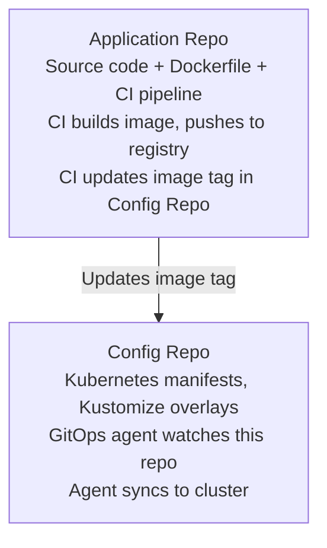

> **Discipline Module** | Complexity: `[MEDIUM]` | Time: 30-35 min

## Prerequisites

Before starting this module:
- **Required**: [Module 3.1: What is GitOps?](../module-3.1-what-is-gitops/) — GitOps fundamentals
- **Required**: Git branching and PR workflow experience
- **Recommended**: Experience managing multiple services/environments

---

## What You'll Be Able to Do

After completing this module, you will be able to:

- **Design repository structures that support GitOps at scale — monorepo, multi-repo, or hybrid approaches**
- **Implement branch and directory strategies that map cleanly to environments and team ownership**
- **Evaluate repository access patterns to prevent configuration drift and unauthorized changes**
- **Build repository conventions that make GitOps workflows self-documenting and auditable**

## Why This Module Matters

You've decided to adopt GitOps. Great! Now where do you put things?

This seemingly simple question determines:
- **Who can change what**: Access control
- **How fast you can deploy**: Sync times, blast radius
- **How teams collaborate**: Coupling vs autonomy
- **How you recover from disasters**: What to restore from where

Bad repository structure creates friction. Good structure enables flow.

This module helps you choose the right structure for your organization.

---

> **Stop and think**: If you put all your configurations in a single repository, how will you prevent a junior developer from accidentally breaking production infrastructure while updating a staging application?

## The Core Decision: Monorepo vs Polyrepo

### Monorepo

All configuration in a single repository.

```text
gitops-config/
├── apps/
│   ├── frontend/
│   │   ├── base/
│   │   └── overlays/
│   │       ├── dev/
│   │       ├── staging/
│   │       └── prod/
│   ├── backend/
│   │   ├── base/
│   │   └── overlays/
│   └── database/
├── infrastructure/
│   ├── cert-manager/
│   ├── ingress-nginx/
│   └── monitoring/
└── clusters/
    ├── dev/
    ├── staging/
    └── prod/
```

**Pros:**
- Single place to see everything
- Easier cross-cutting changes
- Simplified tooling
- Single set of access controls

**Cons:**
- Can become large and slow
- Tight coupling between teams
- Harder to scale permissions
- One repo's issues affect everyone

**Best for:**
- Smaller organizations (< 50 engineers)
- Platform teams managing infrastructure
- Strong central control needed

### Polyrepo

Configuration spread across multiple repositories.

```text
# Repository: team-a-config
team-a-config/
├── service-1/
│   └── overlays/
└── service-2/
    └── overlays/

# Repository: team-b-config
team-b-config/
├── api-gateway/
└── auth-service/

# Repository: platform-config
platform-config/
├── infrastructure/
├── policies/
└── cluster-addons/
```

**Pros:**
- Team autonomy
- Fine-grained access control
- Independent scaling
- Smaller, focused repos

**Cons:**
- Harder to see full picture
- Cross-cutting changes need multiple PRs
- More tooling complexity
- Potential for drift between repos

**Best for:**
- Larger organizations
- Strong team boundaries
- High autonomy cultures

### Hybrid Approach

Most organizations land somewhere in between:

```text
# Platform repo (central team)
platform-config/
├── infrastructure/
├── policies/
└── base-configs/

# Team repos (each team owns)
team-a-apps/
├── service-1/
└── service-2/

team-b-apps/
├── api/
└── worker/
```

**Platform repo**: Shared infrastructure, policies, base configurations
**Team repos**: Team-specific applications and customizations

---

> **Pause and predict**: If your application source code and deployment manifests live in the same repository, what happens to your Git history and CI pipeline when you need to scale up replicas without changing any application code?

## App Repo vs Config Repo

Another key decision: where does configuration live relative to application code?

### Single Repo (App + Config Together)

```text
my-service/
├── src/
│   └── main.go
├── Dockerfile
├── Makefile
└── deploy/
    ├── base/
    │   ├── deployment.yaml
    │   ├── service.yaml
    │   └── kustomization.yaml
    └── overlays/
        ├── dev/
        ├── staging/
        └── prod/
```

**Pros:**
- Everything in one place
- App and config versioned together
- Simpler for small teams
- Natural code review includes deploy changes

**Cons:**
- App changes trigger config pipeline
- Config changes trigger app pipeline
- Different audiences (dev vs ops)
- CI/CD complexity

### Separate Repos

```text
# Repository: my-service (app code)
my-service/
├── src/
├── Dockerfile
└── Makefile

# Repository: my-service-config (GitOps config)
my-service-config/
├── base/
│   ├── deployment.yaml
│   └── service.yaml
└── overlays/
    ├── dev/
    ├── staging/
    └── prod/
```

**Pros:**
- Clean separation of concerns
- Different permissions (devs vs ops)
- Config changes don't rebuild app
- Clear GitOps boundary

**Cons:**
- Two repos to manage
- Coordination needed
- More complex CI/CD

### The Common Pattern

Most teams settle on:



---

## Try This: Map Your Current Structure

Draw your current repository structure:

```text
Current structure:
├── Where is app code? _________________
├── Where are Kubernetes manifests? _________________
├── Where is infrastructure config? _________________
├── How many repos total? _________________

Questions:
1. Can a team deploy without touching other teams' repos? Y/N
2. Can you see all deployed services in one place? Y/N
3. Do app changes require config changes in separate commits? Y/N
4. Are permissions appropriately scoped? Y/N
```

---

## Directory Structures

How you organize files within repos matters as much as which repos you use.

### Environment-Based Structure

```text
my-service/
├── base/
│   ├── deployment.yaml
│   ├── service.yaml
│   ├── configmap.yaml
│   └── kustomization.yaml
└── overlays/
    ├── dev/
    │   ├── kustomization.yaml
    │   ├── replica-patch.yaml
    │   └── config-patch.yaml
    ├── staging/
    │   ├── kustomization.yaml
    │   └── replica-patch.yaml
    └── prod/
        ├── kustomization.yaml
        ├── replica-patch.yaml
        ├── hpa.yaml
        └── pdb.yaml
```

**How Kustomize works:**

```yaml
# base/kustomization.yaml
apiVersion: kustomize.config.k8s.io/v1beta1
kind: Kustomization
resources:
  - deployment.yaml
  - service.yaml
  - configmap.yaml

# overlays/prod/kustomization.yaml
apiVersion: kustomize.config.k8s.io/v1beta1
kind: Kustomization
resources:
  - ../../base
patches:
  - path: replica-patch.yaml
  - path: hpa.yaml
  - path: pdb.yaml
```

### Cluster-Based Structure

When managing multiple clusters:

```text
clusters/
├── dev-cluster/
│   ├── kustomization.yaml
│   ├── apps/
│   │   ├── frontend/
│   │   └── backend/
│   └── infrastructure/
│       ├── cert-manager/
│       └── ingress/
├── staging-cluster/
│   └── ...
└── prod-cluster/
    ├── us-east/
    │   └── ...
    └── eu-west/
        └── ...
```

### Application-Centric Structure

Organized by application, then environment:

```text
apps/
├── frontend/
│   ├── base/
│   └── overlays/
│       ├── dev/
│       ├── staging/
│       └── prod/
├── backend/
│   ├── base/
│   └── overlays/
├── worker/
│   └── ...
└── infrastructure/
    ├── monitoring/
    ├── logging/
    └── ingress/
```

### Choosing a Structure

| Factor | Environment-Based | Cluster-Based | App-Centric |
|--------|-------------------|---------------|-------------|
| "What's in prod?" | Check each app's prod/ | Check prod-cluster/ | Check each app's prod/ |
| "What apps in this cluster?" | Check multiple places | One place | Check multiple places |
| "All configs for this app?" | One place | Multiple clusters | One place |
| Best for | Single cluster per env | Multi-region/cluster | App-focused teams |

---

## Did You Know?

1. **Google's entire codebase lives in one repository** with billions of files. They built custom tooling (Piper) to make this work. Most organizations can't replicate this.

2. **The "trunk-based development" pattern** pairs well with directory-per-environment GitOps. Short-lived branches for changes, merge to main, promote through directories.

3. **Spotify pioneered many polyrepo patterns** for autonomy, but found they needed strong conventions and tooling to avoid chaos. Their "Golden Path" concept addresses this.

4. **Microsoft's Windows codebase moved to Git** in 2017 with over 3.5 million files—they had to create Git Virtual File System (GVFS, now VFS for Git) to make it practical. Repository strategy isn't just about organization, it's about tooling limitations.

---

> **Pause and predict**: What happens when the staging environment branch receives three hotfixes that were originally pushed to the development branch, but one of them was deliberately excluded from the upcoming production release?

## War Story: The Branch Strategy That Backfired

A company I worked with tried branch-per-environment GitOps:

**The Setup:**
```text
main branch → production
staging branch → staging
develop branch → development
```

**The Theory:**
- Merge develop → staging to promote
- Merge staging → main to go to prod
- Each environment has "its own branch"

**What Actually Happened:**

Week 1: "This is clean!"

Week 4:
```text
develop: 127 commits ahead of staging
staging: 43 commits ahead of main
```

Week 8:
- Merging staging → main caused massive conflicts
- Some features accidentally skipped staging
- "Which branch has the fix?" became common
- Cherry-picks created divergence
- Team spent hours resolving merge conflicts

**The Root Problem:**

Branches diverge. That's what branches do. Environment promotion isn't the same as code development.

**The Fix:**

Switched to directory-per-environment:

```text
config-repo/
└── my-service/
    ├── base/
    └── overlays/
        ├── dev/      ← always in main
        ├── staging/  ← always in main
        └── prod/     ← always in main
```

Promotion became:
```bash
# Copy dev image tag to staging
yq eval '.images[0].newTag = "v1.2.3"' -i overlays/staging/kustomization.yaml

# PR, review, merge
# GitOps agent syncs staging
```

**Results:**
- No merge conflicts
- Clear promotion path
- All envs visible in one branch
- PR shows exactly what changes

**Lesson**: Branches are for code development, not environment promotion.

---

## Branch Strategies (And Why to Avoid Them)

### The Temptation

Branches feel natural for environments:
- "main is prod"
- "develop is dev"
- "we control promotion with merges"

### The Problems

**Problem 1: Divergence**
```text
Branches naturally diverge. Environments shouldn't.

develop: adds feature A, B, C
staging: only has A, B (C not promoted)
main: only has A (B pending)

Now you have three different states to reason about.
```

**Problem 2: Merge Conflicts**
```text
Config conflicts are worse than code conflicts.
Code: "which version of this function?"
Config: "which version of the cluster state?"

Bad merges → bad deployments.
```

**Problem 3: Lost Changes**
```text
Feature in develop, cherry-picked to main,
but staging branch never got it.

"Why is this bug in staging but not prod?"
```

**Problem 4: Audit Complexity**
```text
Q: "What changed between staging and prod?"
A: "Let me diff two branches that have
    diverged significantly..."

vs. Directory-based:
A: "Let me diff two directories on main."
```

### When Branches Might Work

- Very simple setups (2 environments max)
- Full lockstep promotion (always all changes)
- Strong discipline and tooling
- Small teams with clear ownership

### The Recommendation

**Use directories, not branches, for environment separation.**

```bash
# Instead of:
git checkout staging
git merge develop

# Do:
# Update prod/kustomization.yaml with new image tag
git commit -m "Promote v1.2.3 to prod"
git push origin main
```

---

## Common Mistakes

| Mistake | Problem | Solution |
|---------|---------|----------|
| Branch-per-environment | Divergence, merge hell | Directory-per-environment |
| Giant monorepo without tooling | Slow, coupled | Split or invest in tooling |
| Too many small repos | Fragmentation, no visibility | Consolidate by team/domain |
| Mixing app code and config | Wrong triggers, permissions | Separate config repo |
| No clear ownership | Confusion, drift | Document who owns what |
| Inconsistent structure | Hard to automate | Standardize patterns |

---

## Quiz: Check Your Understanding

### Question 1
Your team currently uses a branching strategy where the `develop` branch deploys to the development environment, and the `main` branch deploys to production. Recently, an urgent hotfix was merged directly into `main` and deployed successfully, but two weeks later, the bug reappeared in production after a routine release. Based on GitOps principles, what architectural flaw in your repository strategy caused this, and how should it be redesigned?

<details>
<summary>Show Answer</summary>

The root cause of this regression is the use of a branch-per-environment strategy, which inevitably leads to configuration divergence. When the hotfix was applied directly to `main`, the `develop` branch lost sync with production's actual state. Later, when `develop` was merged into `main` for the routine release, the hotfix was overwritten or ignored because the environments were represented by divergent histories rather than a single source of truth. To solve this, the team should adopt a directory-per-environment structure on a single branch (such as `main`). In this model, both the development and production configurations live side-by-side, making promotions a simple file update (like changing an image tag) rather than a complex Git merge, which completely eliminates environment divergence and prevents lost changes.

</details>

### Question 2
You are the lead architect for a rapidly growing fintech company. Currently, all 50 microservices and the core infrastructure configurations are housed in a single GitOps monorepo. Recently, the platform team has complained that their PRs are being delayed by application team approvals, and application teams are accidentally modifying ingress configurations they shouldn't have access to. Why is the current monorepo failing your organizational needs, and what GitOps repository pattern would better serve your scaling company?

<details>
<summary>Show Answer</summary>

The monorepo pattern is failing because it forces tight coupling and centralized access control on an organization that has outgrown it, creating bottlenecks and security risks. As organizations scale, different teams require distinct permission boundaries and independent deployment lifecycles that a single repository cannot easily enforce without highly complex tooling. To resolve this, you should migrate to a hybrid polyrepo strategy where the platform team manages a core infrastructure repository and individual application teams own their specific configuration repositories. This separation naturally enforces fine-grained access control through repository permissions and allows teams to operate with full autonomy, ensuring that platform changes do not block application deployments and vice versa.

</details>

### Question 3
Your platform engineering team is setting up GitOps for a new product suite consisting of 10 microservices. The services will be deployed across three distinct Kubernetes clusters representing `dev`, `staging`, and `prod` environments. The application developers want a straightforward way to update their services, while the platform team needs to maintain consistent baseline configurations. How should you structure the configuration repository to satisfy both teams while minimizing configuration duplication?

<details>
<summary>Show Answer</summary>

You should implement an application-centric directory structure utilizing Kustomize within a single configuration repository. In this setup, each microservice gets its own top-level directory containing a `base` folder for shared configurations and an `overlays` folder containing subdirectories for `dev`, `staging`, and `prod`. This structure minimizes duplication by keeping all common manifests in the base, while allowing environment-specific patches (like replica counts or resource limits) to be cleanly isolated in the overlays. It provides developers with a clear, single location to manage their application's entire lifecycle across all clusters, while enabling the platform team to enforce standard baseline policies that apply to every environment.

</details>

### Question 4
A developer on your team is confused about the new deployment pipeline. They just merged a feature into the application repository, and the CI system successfully built and pushed the new Docker image to the registry. However, the developer is asking why the GitOps agent hasn't deployed the new image to the cluster yet. What crucial step is missing in the CI/CD flow, and how does this separation protect the GitOps model?

<details>
<summary>Show Answer</summary>

The missing step is that the CI pipeline did not update the configuration repository with the newly generated image tag. In a proper GitOps workflow, the CI system never communicates directly with the Kubernetes cluster or the GitOps agent; its final job is to commit the new image tag to the deployment manifests in the configuration repository. Once the configuration repository is updated, the GitOps agent detects the Git commit and automatically syncs the cluster state to match. This strict separation of concerns is vital because it ensures that the Git repository remains the sole, auditable source of truth for the environment, preventing untracked changes and allowing for instant rollbacks by simply reverting a Git commit.

</details>

---

## Hands-On Exercise: Design Your Repository Structure

Design a GitOps repository structure for a scenario.

### Scenario

Your organization has:
- 3 teams (Platform, Frontend, Backend)
- 8 services total:
  - Platform: cert-manager, ingress-nginx, monitoring
  - Frontend: web-app, mobile-api
  - Backend: user-service, order-service, notification-service
- 3 environments: dev, staging, prod
- Each team wants autonomy over their services
- Platform team needs to set base policies

### Your Task

**Part 1: Repository Decision**

```markdown
## Repository Strategy

How many repos? [ ] 1 (monorepo) [ ] 4 (team repos) [ ] Other: ___

Rationale:
_________________________________________________
_________________________________________________

Who owns each repo?
- Repo 1: _______________ Owner: _______________
- Repo 2: _______________ Owner: _______________
- ...
```

**Part 2: Directory Structure**

Design the structure for one of the repos:

```markdown
## Directory Structure for: _______________

repo-name/
├──
├──
├──
└──

Explain your choices:
- Why this structure? _______________
- How do environments differ? _______________
- Where are base configs? _______________
```

**Part 3: Promotion Flow**

How does a change get from dev to prod?

```markdown
## Promotion Flow

1. Developer makes change: _______________
2. Change gets to dev: _______________
3. Promote to staging: _______________
4. Promote to prod: _______________

Automation opportunities:
- _______________
- _______________
```

**Part 4: Access Control**

```markdown
## Access Control

| Repo | Read Access | Write Access | Admin |
|------|-------------|--------------|-------|
|      |             |              |       |
|      |             |              |       |

Branch protection rules:
- main: _______________
```

### Success Criteria

- [ ] Chose monorepo/polyrepo with clear rationale
- [ ] Designed directory structure for at least one repo
- [ ] Defined environment promotion flow
- [ ] Documented access control approach
- [ ] Avoided branch-per-environment

---

## Key Takeaways

1. **Monorepo vs Polyrepo**: Choose based on org size, team autonomy, access needs
2. **Separate app and config repos**: Different cadences, different permissions
3. **Directory-per-environment**: Avoid branch-per-environment pattern
4. **Use Kustomize base/overlays**: Reduce duplication, capture differences
5. **CI updates Git, GitOps deploys**: Clean separation of concerns

---

## Further Reading

**Books**:
- **"GitOps and Kubernetes"** — Chapter on Repository Strategies
- **"Monorepo vs Polyrepo"** — Various blog comparisons

**Articles**:
- **"GitOps Repository Strategies"** — Weaveworks
- **"Why We Use a Monorepo"** — Various tech blog posts
- **"Kustomize Best Practices"** — Kubernetes docs

**Tools**:
- **Kustomize**: kubernetes.io/docs/tasks/manage-kubernetes-objects/kustomization/
- **Helm**: For chart-based templating
- **yq**: YAML manipulation for CI

---

## Summary

Repository strategy determines how smoothly GitOps operates.

Key decisions:
- **Monorepo vs Polyrepo**: Based on org size and autonomy needs
- **App repo vs Config repo**: Typically separate for GitOps
- **Directory structure**: Environment-based with base/overlays
- **Branch strategy**: Avoid branch-per-env; use directory-per-env

There's no universally "right" answer — but there are patterns that work better for different situations. Start simple, evolve as needed.

---

## Next Module

Continue to [Module 3.3: Environment Promotion](../module-3.3-environment-promotion/) to learn strategies for moving changes safely through environments.

---

*"The best repository structure is the one your team can actually follow."* — GitOps Wisdom