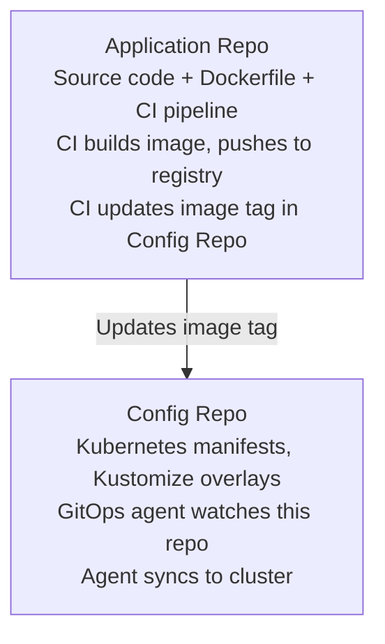
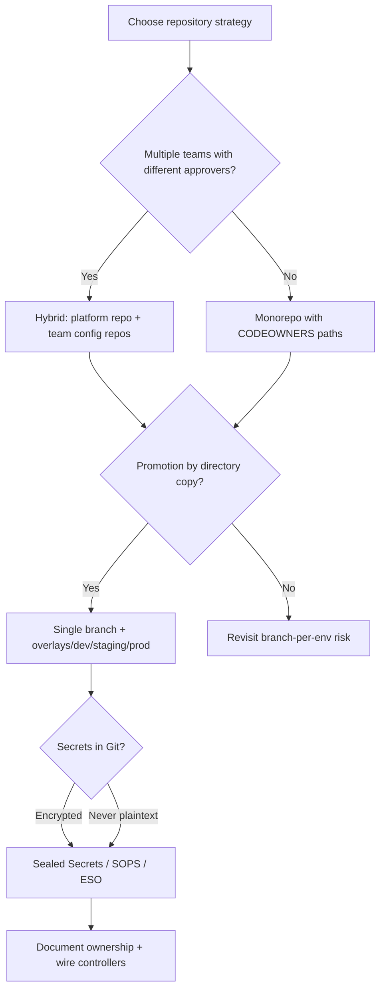

> **Discipline Module** | Complexity: `[MEDIUM]` | Time: 45-55 min | Track: Platform Engineering / GitOps

## Prerequisites

Before starting this module, you should already understand the GitOps control loop from [Module 3.1: What is GitOps?](../module-3.1-what-is-gitops/) and be comfortable opening pull requests, reviewing YAML, and explaining why Git should remain the source of truth for cluster state. Repository strategy sits between theory and daily practice: it determines who can propose a change, how that change is reviewed, and how safely it can propagate across environments.

- **Required**: [Module 3.1: What is GitOps?](../module-3.1-what-is-gitops/) — declarative desired state, pull-based reconciliation, and continuous alignment.
- **Required**: Git branching and pull-request workflow experience.
- **Recommended**: Familiarity with Kustomize or Helm overlays for environment-specific configuration.
- **Recommended**: Experience managing more than one Kubernetes cluster or namespace boundary.

---

## What You'll Be Able to Do

After completing this module, you will be able to:

- **Design repository structures that support GitOps at scale — monorepo, multi-repo, or hybrid approaches**
- **Implement branch and directory strategies that map cleanly to environments and team ownership**
- **Evaluate repository access patterns to prevent configuration drift and unauthorized changes**
- **Build repository conventions that make GitOps workflows self-documenting and auditable**

---

## Why This Module Matters

Hypothetical scenario: a platform team adopts GitOps for twelve microservices across development, staging, and production clusters. They store every manifest in the application repository beside the source code, grant all developers write access, and map each environment to a long-lived Git branch. For the first month the model feels simple. By the third month, a staging-only replica patch merges into the production branch during a routine release, CI pipelines rebuild containers when someone only wanted to change an ingress annotation, and nobody can answer which commit actually represents production without diffing three divergent branches.

That failure is architectural, not accidental. In GitOps the repository layout is part of the control system. Structure determines blast radius when a pull request merges, which teams can approve which paths, how promotion works, and whether the Git history you read during an incident matches what the cluster reconciler applies. A controller can only enforce what Git declares; if the repository boundaries are unclear, the controller faithfully automates confusion.

Repository strategy also shapes collaboration. Platform engineers need shared baselines for ingress, monitoring, policy, and cluster add-ons. Application teams need autonomy to iterate on their workloads without waiting for unrelated approvals. Security teams need boundaries that prevent a frontend developer from editing a shared certificate issuer. Finance and compliance stakeholders need an audit trail that ties production state to reviewed commits rather than to shell history. None of those needs is solved by picking Argo CD or Flux alone; they are solved by how you partition repositories, directories, and permissions before the first sync succeeds.

The durable lesson is that repository design is a first-class GitOps decision alongside reconciliation policy, secrets handling, and promotion flow. Tools implement the loop described in the [OpenGitOps principles](https://opengitops.dev/); repository structure decides whether that loop remains understandable at scale. This module teaches the durable axes—app versus config separation, monorepo versus polyrepo, environment modeling, multi-app bootstrapping, access control, and secrets placement—so you can evolve tooling without redesigning your operating model every quarter.

> **Stop and think**: If every Kubernetes manifest for your organization lived in one repository with one shared `main` branch, what is the smallest change a developer could merge that would still create a production-impacting blast radius, and which repository boundary would have prevented it?

---

## 1. Repository Structure as a First-Class GitOps Decision

When teams first adopt GitOps, repository structure is often treated as a housekeeping detail left until after the controller is installed. That ordering creates expensive rework. The GitOps agent watches specific repositories, paths, and revisions; access control is enforced at the Git host; promotion workflows copy or patch files between directories; and incident response begins with `git log`. If those elements were chosen casually, every later improvement fights the grain of the repository itself.

Think of the configuration repository as both source of truth and audit log. Each merged pull request becomes a durable record of intent: who approved a replica increase, when an image tag changed, which network policy opened a port, and whether a emergency fix was backported. That record only remains trustworthy when repository boundaries align with ownership boundaries. When unrelated teams share a flat directory without CODEOWNERS rules or path-scoped permissions, the audit log still exists but the social contract breaks down because reviewers cannot confidently know whether a change in one path affects another team's production path.

Repository structure also defines blast radius. A monorepo can make cross-cutting improvements easy—updating a shared monitoring label across thirty services in one reviewed change—but it can also couple unrelated failure domains. A polyrepo can isolate teams, yet it can hide dependencies when a platform repository changes a mutating webhook contract that application repositories assume. Hybrid models exist because real organizations rarely choose pure extremes; they centralize shared platform baselines while decentralizing application overlays. The design task is to make those boundaries explicit enough that a new engineer can predict where a change belongs before opening a pull request.

Finally, structure determines review flow. GitOps succeeds when the same change that fixes a problem is the change the controller applies. If developers must edit three repositories, run a manual script, and ping a platform operator to trigger sync, the repository layout is working against the model even if the controller is healthy. Good structure makes the happy path obvious: application continuous integration updates the image tag in the config repository, platform engineers edit shared bases in the platform repository, and environment differences live in overlays that promotion can copy or patch with mechanical precision.

```ascii
+---------------------------+       +---------------------------+
| Git hosting + RBAC        |       | GitOps controller         |
| repos, branches, CODEOWNERS| ----> | watches declared paths    |
+---------------------------+       +---------------------------+
            |                                     |
            v                                     v
+---------------------------+       +---------------------------+
| Human review + audit log    |       | Cluster desired state     |
| PRs, commits, blame         |       | reconciled continuously   |
+---------------------------+       +---------------------------+
```

The diagram above is intentionally tool-agnostic. Whether you use Argo CD Applications or Flux Kustomizations, the controller reads Git state that humans already agreed should be authoritative. Repository strategy is the bridge between organizational boundaries and reconciler boundaries. When that bridge is well designed, GitOps feels like acceleration. When it is improvised, GitOps feels like merge conflicts wearing a Kubernetes costume.

---

## 2. App Code Versus Configuration Separation

A recurring early decision is whether application source code and deployment manifests should live in the same repository. Co-location is attractive for small teams because a single pull request can change business logic and the Deployment that runs it, which simplifies local development and code review for beginners. The pattern breaks down as delivery cadence, permissions, and controller boundaries mature. Application repositories change when features ship; configuration repositories change when operators tune replicas, ingress hosts, resource limits, and secrets references. Those are related but not identical lifecycles.

Keeping deployment configuration in a separate repository decouples build from deploy in the way GitOps intends. Continuous integration builds and pushes an immutable container image, then updates a manifest field—typically an image digest or semver tag—in the config repository. The GitOps controller observes that commit and reconciles the cluster. No cluster credential needs to live in the application pipeline if the pipeline's final step is a Git commit rather than a `kubectl apply`. That separation also prevents accidental coupling where a documentation-only application change retriggers a full deployment pipeline merely because a YAML file sits beside the code.

Separate repositories also clarify permissions. Application developers may need write access to service code but only propose configuration changes through pull requests reviewed by a platform or release group. Conversely, on-call engineers may need emergency configuration edits without granting them push access to proprietary application source. When both live together, Git host permissions become coarse: granting write access to fix production replicas also grants write access to business logic unless path-based rules are meticulously maintained.

The commit-loop trap appears when teams try to keep a single repository but still automate image updates. Continuous integration builds an image, then writes the tag back into the same repository that triggered the build, which can retrigger pipelines, create noisy commits, or race with feature work on open branches. A dedicated config repository breaks that loop because the application repository merge no longer implies an immediate cluster change until the config repository records the new tag. Image automation controllers—Flux image automation and Argo CD Image Updater are common examples—still commit back to Git, but the write target is the config repository where reviewers expect operational changes.


```mermaid
graph TD
    AppRepo["Application Repo<br/>Source code + Dockerfile + CI pipeline<br/>CI builds image, pushes to registry<br/>CI updates image tag in Config Repo"]
    ConfigRepo["Config Repo<br/>Kubernetes manifests, Kustomize overlays<br/>GitOps agent watches this repo<br/>Agent syncs to cluster"]

    AppRepo -->|Updates image tag| ConfigRepo
```

The diagram shows the durable spine, not a vendor requirement. Some organizations legitimately co-locate code and config for a small product with one team and one cluster. The senior-level question is whether that simplicity still holds when you add a second environment, a second team, or segregation-of-duty requirements. If the answer is no, separating early is cheaper than migrating under incident pressure.

For Kubernetes 1.35 workloads, the manifest content itself remains standard Deployment, Service, and Ingress objects whether they live beside Go source or in a dedicated `payments-config` repository. The separation decision is operational. Teach your teams a simple rule: the application repository answers "what artifact did we build?" while the configuration repository answers "what should the cluster run right now?" When those questions have different approvers, they should usually have different repositories.

---

## 3. Monorepo Versus Polyrepo for Configuration

Once you accept a dedicated configuration repository, the next axis is whether to use one repository for the entire organization or many repositories aligned to teams, products, or environments. Monorepos concentrate visibility. A platform engineer can search one tree to see every production overlay, compare how two services configure pod disruption budgets, or refactor a shared label scheme in a single reviewed change. That visibility is powerful during early GitOps adoption when consistency matters more than autonomy.

Monorepos also simplify bootstrapping. A single set of branch protection rules, one CODEOWNERS file with path owners, and one CI policy for YAML linting can cover dozens of services. For platform-led organizations rolling out shared ingress, cert-manager, and monitoring baselines, a monorepo can act as a curriculum for good patterns: new services copy an existing overlay structure rather than inventing one from scratch. The [Kustomize base and overlay model](https://kubernetes.io/docs/tasks/manage-kubernetes-objects/kustomization/) fits naturally into monorepos because each service directory can repeat the same `base/` and `overlays/` shape without creating new Git hosting projects.

The costs appear as scale and ownership complexity increase. Pull request queues lengthen when many teams watch one repository. A change to a shared Helm values file can require approvals from teams unrelated to the author's intent. Git operations slow down on very large trees unless you invest in sparse checkout, path filters, and selective CI triggers. Permissions become harder because repository-level roles are coarse; path-based CODEOWNERS help but do not replace the psychological overhead of "everyone's production is one merge away."

Polyrepos push autonomy to the foreground. Each team owns a repository scoped to its services, sets its own review rules, and merges on its cadence. Platform teams still publish a shared baseline repository—often read-only to application teams—that provides common labels, network policies, or monitoring patches imported through Kustomize bases or Helm dependencies. Polyrepos map cleanly to organizational boundaries, which matters when compliance requires segregated access between business units or when acquisition integrations must remain isolated until standardized.

Polyrepo tradeoffs include fragmented visibility and cross-cutting friction. Updating a mandatory pod security standard may require coordinated pull requests across fifteen repositories, which defeats the promise of GitOps automation unless you invest in templating, policy-as-code, or a platform-managed base layer. Drift between repositories becomes a social problem: two teams may solve the same ingress annotation differently because no shared search surface exposes the divergence. Tooling can mitigate fragmentation—ApplicationSets and Flux multi-source configurations help—but mitigation is not free.

Most mature organizations land on a hybrid. A platform repository owns cluster add-ons, shared policies, and sometimes cluster-level bootstrapping manifests. Team repositories own application overlays and service-specific resources. A small "catalog" repository may declare which versions of platform bundles teams should import. The hybrid model works because it matches how accountability actually flows: platform teams answer for shared infrastructure; product teams answer for application manifests that instantiate that infrastructure.

When you evaluate monorepo versus polyrepo, count decisions rather than repositories. How many distinct approval policies do you need? How often do engineers ask "where is the canonical copy of this manifest?" How frequently do platform teams publish cross-cutting changes that every service must adopt? If the answers point to many policies, many unrelated approvers, and frequent shared changes, a single monorepo without careful path design will feel slower than several well-named repositories connected by documented import paths. If the answers point to small teams, shared standards, and frequent cross-service refactors, a monorepo may still be the lowest-friction option, especially while the organization is learning GitOps conventions together.

```text
gitops-config/                     team-a-config/              platform-config/
├── apps/                          ├── checkout-api/             ├── clusters/
│   ├── frontend/                  │   ├── base/                 │   ├── dev/
│   │   ├── base/                  │   └── overlays/             │   └── prod/
│   │   └── overlays/              └── pricing-api/              ├── addons/
│   └── backend/                       └── overlays/             │   ├── cert-manager/
├── infrastructure/                                                    └── ingress-nginx/
│   ├── cert-manager/
│   └── monitoring/
└── clusters/
    ├── dev/
    └── prod/
```

The tree above illustrates three coexistence patterns, not a mandate to use all three simultaneously. Some enterprises keep everything in the left tree; others split into the three repositories on the right. The design exercise is to decide which changes must be visible together, which changes must be approval-isolated, and which changes should propagate mechanically from a platform publisher to many consumers.

---

## 4. Environment Modeling: Branches, Directories, and Templates

Environment modeling is where repository strategy most often collides with intuition imported from application development. Long-lived environment branches feel natural when teams say "main is production" and "develop is development." That mapping treats Git branches as deployment targets. GitOps at scale treats branches as integration lines for proposed change, while environments are directories, overlays, or Kustomize patches on a single reviewed line such as `main`. The community moved away from branch-per-environment for operational reasons, not because Git hosts forbid branches.

Branches diverge because feature work, hotfixes, and delayed promotions all create unique histories. When each environment is a branch, promotion becomes a merge problem rather than a configuration problem. A hotfix merged directly to production may never return to the staging branch; a feature partially promoted may exist in staging but not development, or the reverse. Cherry-picks multiply, merge conflicts appear in YAML rather than in code, and incident reviewers must compare branch tips instead of comparing two directories that should differ only in controlled ways.

Directory-per-environment on a single branch makes promotion explicit. Development, staging, and production overlays live side by side in Git; promotion copies or patches a known field—often an image tag, replica count, or config map hash—from `overlays/dev` to `overlays/staging` to `overlays/prod`. Pull requests show exactly which environment changed, CODEOWNERS can require platform approval for production paths only, and `git diff overlays/staging overlays/prod` answers readiness questions without invoking merge base algorithms. This is the model [Module 3.3: Environment Promotion](../module-3.3-environment-promotion/) builds on; repository structure either enables or obstructs that flow.

Kustomize remains the durable templating pattern for many GitOps teams because it keeps differences localized in overlays while shared intent lives in bases. A base directory lists common resources; each overlay references the base and adds patches, config map generators, or additional resources such as horizontal pod autoscalers in production only. Helm values files provide a parallel pattern for chart-centric organizations: a shared chart packages Kubernetes objects while environment-specific values files supply replica counts, ingress hosts, and feature flags. Both patterns teach the same lesson: capture sameness once, capture difference in small, reviewable files.

Cluster-based directory layouts add another axis when one environment spans multiple clusters or regions. Instead of naming overlays only `dev`, `staging`, and `prod`, some repositories name overlays after cluster identities such as `prod-us-east` and `prod-eu-west`. That layout helps platform teams answer "what should run in this cluster?" without scanning every application tree. Application-centric layouts invert the priority: each service owns its overlays, and cluster differences appear beneath the service. Choose cluster-centric layouts when cluster operations dominate; choose application-centric layouts when product teams own end-to-end delivery and clusters are fungible targets.

Hypothetical scenario: a retail platform uses `main` for production, `staging` for pre-production, and `develop` for integration testing. After eight weeks, staging is dozens of commits ahead of production while develop contains a feature deliberately excluded from the next release. A production hotfix lands on `main` and resolves an outage, but the same bug reappears after a later "routine" merge from staging because the hotfix never reached the other branches. The team spends a day reconciling branches instead of editing one production overlay file. Relabeling the narrative as hypothetical does not reduce the lesson: branches optimize for parallel feature integration; environments optimize for known, comparable states. Mixing the two confuses both.

When branches might still be acceptable, the scope is narrow: very small teams, at most two environments, and a strict rule that every change flows through identical promotion merges without hotfix exceptions. The moment hotfixes can bypass staging—or production can diverge temporarily—the branch model becomes a liability. Directory overlays on `main` absorb hotfixes as commits that can be copied forward or backward between overlays with mechanical scripts and ordinary pull requests.

```yaml
# base/kustomization.yaml
apiVersion: kustomize.config.k8s.io/v1beta1
kind: Kustomization
resources:
  - deployment.yaml
  - service.yaml
  - configmap.yaml

# overlays/prod/kustomization.yaml
apiVersion: kustomize.config.k8s.io/v1beta1
kind: Kustomization
resources:
  - ../../base
patches:
  - path: replica-patch.yaml
  - path: hpa.yaml
  - path: pdb.yaml
```

The manifests above are representative rather than exhaustive; they show how production-only resources stay out of development overlays while still sharing one base Deployment. Repository strategy ensures those paths remain stable so CI, reviewers, and controllers can rely on predictable locations.

---

## 5. Scaling Many Applications: App-of-Apps and Generators

Bootstrapping one Application or Kustomization manually is fine for a lab cluster. Production platforms manage dozens or hundreds of workloads across multiple clusters. The durable pattern on the Argo CD side is app-of-apps: a parent Application points at a directory of child Application manifests, so adding a service often means committing a new child file rather than clicking in a UI. Argo CD Projects further scope what repositories, destinations, and resource kinds child applications may use, which turns repository boundaries into controller-enforced policy.

ApplicationSets generalize bootstrapping by generating child Applications from templates plus generators. A list generator might declare known clusters; a cluster generator discovers registered clusters; a Git generator reads a directory of service folders; a matrix generator combines two dimensions such as cluster times service. The generated Applications remain declarative because the template and inputs live in Git, which preserves the audit properties that motivate GitOps in the first place. When teams outgrow copy-pasted Application YAML, ApplicationSets reduce toil without abandoning review.

Flux expresses similar concepts with composable sources and reconcilers. A GitRepository custom resource tracks a branch and path; a Kustomization or HelmRelease references that source and applies a subset to a cluster namespace. Platform teams often maintain one GitRepository for shared cluster configuration and additional GitRepository objects for team-owned repositories, then attach Kustomizations with dependency ordering so infrastructure installs before applications. Flux multi-tenancy guidance separates controllers by namespace boundaries and credentials so one compromised token cannot reconcile another tenant's paths.

Neither pattern removes the need for thoughtful repository layout. App-of-apps and ApplicationSets amplify whatever structure already exists. If directories are inconsistent, generators produce inconsistent Applications. If repository permissions are too broad, generated Applications expose destinations that should remain isolated. If secrets are stored plaintext in Git, scaling applications scales the secret leak. Repository strategy is the input; generators are multipliers.

> **Landscape snapshot — as of 2026-06. This changes fast; verify against vendor docs before relying on specifics.**

Both Argo CD and Flux are [CNCF Graduated projects](https://www.cncf.io/projects/) as of this snapshot. Controllers add features frequently; treat the table below as a capability Rosetta, not a ranking.

| Capability | Argo CD (illustrative) | Flux (illustrative) |
|---|---|---|
| Declare app from Git path | Application CR | Kustomization / HelmRelease CR |
| Bootstrap many apps | App-of-apps parent Application | Multiple Kustomizations sharing GitRepository sources |
| Generate many apps from templates | ApplicationSet generators | Kustomization + directory layout; limited native templating compared to ApplicationSet matrix |
| Multi-cluster targeting | Application destination + cluster secrets | kubeconfig secrets + Kustomization spec.kubeConfig |
| Scope destinations and repos | AppProject allow lists | Multi-tenancy namespaces, ServiceAccount tokens, RBAC |
| Secrets in Git (encrypted) | Compatible with Sealed Secrets, SOPS, ESO | Compatible with Sealed Secrets, SOPS, ESO |
| Image tag write-back | Argo CD Image Updater (companion project) | Flux image automation controllers |

Use the Rosetta to translate concepts when your organization runs both tools in different business units or when migrating between them. The durable skill is recognizing which capability you need—multi-app bootstrapping, cluster fan-out, secrets integration—then mapping it to the controller you operate.

---

## 6. Access Control, Ownership, and Multi-Tenancy

Repository strategy fails in production when permissions do not match the boundaries you drew on paper. Git hosting platforms enforce access at the repository and branch level first; path-based rules such as CODEOWNERS add finer grain inside a monorepo. A sensible GitOps access model answers three questions for every path: who may propose a change, who must approve it, and who can break glass during an incident without bypassing audit requirements.

CODEOWNERS files map directories to teams so pull requests automatically request reviewers with domain expertise. Branch protection on `main` ensures checks run and approvals exist before merges land in the branch controllers reconcile. For production overlays, require more approvals than development overlays, or require platform team review only when paths under `overlays/prod/` change. These rules make repository conventions self-documenting: a developer who sees `overlays/prod/` in a diff understands the approval bar without reading a wiki page.

Argo CD Projects and Flux tenancy mechanisms extend Git boundaries into the cluster. An AppProject restricts which Git repositories, which destination clusters or namespaces, and which resource kinds an Application may manage. Flux multi-tenancy patterns isolate credentials and reconcile permissions so team A's controllers cannot apply team B's repositories. The mapping principle is direct: if a team owns a configuration repository, their GitOps scope should not include unrelated namespaces; if a platform team owns shared cluster add-ons, their Applications should not require application team approval for unrelated microservices.

Preventing unauthorized changes also means removing unnecessary human cluster write access. When developers can `kubectl edit` production Deployments but GitOps is supposed to be authoritative, incidents will include manual hotfixes that never return to Git. Repository strategy pairs with role-based access control: break-glass cluster access may remain for emergencies, but the normal path is a pull request to the config repository followed by controller reconciliation. Auditors prefer that story because Git records approvers; kubectl history often does not.

Multi-tenant platforms serving many internal customers should align repository boundaries with chargeback or service catalog entries. A Backstage software template that scaffolds a new service should create not only application code but also the expected config repository layout—base, overlays, CODEOWNERS entry, and Application manifest—so teams start aligned. Without that scaffolding, each team reinvents directory names, confusing search and generator templates.

Auditability improves when repository conventions encode intent in paths and commit messages. Require pull request titles that name the environment overlay touched, such as `promote checkout-api tag v1.8.0 to staging`, so `git log overlays/staging/checkout-api` reads like a release journal. Pair that convention with immutable tags in container registries so Git commits reference digests or semver tags that cannot silently move. Reviewers then approve both the manifest change and the artifact identity in one place, which is difficult to replicate when configuration hides inside application feature branches or long-lived environment branches with unrelated merge noise.

Hypothetical scenario: a fintech organization houses fifty microservices in one GitOps monorepo without path protections. A frontend developer merges a pull request that modifies a shared ingress annotation while fixing a UI service, accidentally widening TLS cipher settings for an unrelated admin API. The change passes CI because YAML lint succeeds, but production behavior shifts for a service the developer did not know shared the ingress class. Splitting repositories or enforcing CODEOWNERS on `infrastructure/` would have routed the change to platform reviewers who understand shared ingress contracts.

---

## 7. Secrets in Git: Never Plaintext, Always Deliberate

GitOps encourages storing desired state in Git, yet many desired fields are sensitive: database passwords, TLS private keys, API tokens, and webhook signing secrets. Plaintext secrets in Git repositories are unacceptable even in private hosting; clones, forks, CI logs, and search indexes multiply exposure. Repository strategy must include where encrypted secrets live, who can decrypt them, and how controllers materialize Kubernetes Secret objects at reconcile time.

Sealed Secrets encrypt Secret manifests so only the cluster controller can decrypt them; encrypted blobs are safe in Git while plaintext exists only inside the cluster. Mozilla SOPS encrypts YAML or JSON fields with age or PGP keys, which suits files that mix public configuration and sensitive values in one manifest. External Secrets Operator keeps Git free of ciphertext entirely by referencing a vault or cloud secret manager; Git declares the desired ExternalSecret custom resource while the operator pulls live material during reconciliation. Each approach trades operational complexity against rotation, audit, and multi-cluster portability.

Repository boundaries interact with secret strategy. Some teams place SealedSecrets beside application overlays in the same repository; others maintain a dedicated secrets repository with tighter permissions and slower review requirements. Dedicated secret repositories reduce accidental exposure during routine application pull requests but add coordination when an image and a credential must change together. External Secrets reduce Git sensitivity but introduce dependency on vault availability and permission models outside Kubernetes.

Rotation is the long-term test. A repository layout that makes secret rotation scary will encourage long-lived credentials. Prefer layouts where rotating a sealed secret or SOPS field follows the same promotion path as non-secret configuration: commit to development overlay, validate, promote to staging, promote to production. Document which team owns rotation—platform or application—alongside CODEOWNERS entries for secret paths. Never commit `.env` files or kubectl-exported Secret YAML with base64-encoded plaintext thinking obfuscation equals encryption; base64 is encoding, not protection.

For Kubernetes 1.35, Secrets remain first-class API objects regardless of encryption tool. GitOps controllers reconcile them like Deployments once decrypted or referenced. Teach teams to treat secret commits as high-risk pull requests even when encrypted: metadata still reveals key names, namespaces, and rotation timing. Combine encryption with branch protection and small reviewer groups.

---

## 8. Promotion Readiness and Image Automation

Repository structure either simplifies or complicates promotion. When development, staging, and production overlays live in predictable paths on `main`, promotion scripts copy tags or patch fields with tools such as `yq`, Kustomize image transformers, or Helm values updates. Pull requests show reviewers exactly which environment will change. That visibility is the operational definition of promotion readiness: you can explain what differs between environments without invoking Git merge semantics.

Image automation writes tags back to Git when continuous integration publishes new container images. Flux image automation controllers and Argo CD Image Updater watch registries, compare semver or digest policies, and commit updates to manifests. This closes the loop begun in the application pipeline but reintroduces the commit-loop risk if automation targets the wrong repository or branch. Automation should commit to the configuration repository path controllers reconcile, usually on `main`, with branch protection still enforcing review if policy requires human approval for production tag bumps.

The commit-loop trap appears when automation creates endless commits on every registry metadata change, when CI triggers on any commit rebuild unrelated artifacts, or when bots compete with human feature branches. Mitigate with path filters in CI, separate bot accounts with scoped tokens, and policies that batch image updates. Some teams allow automatic dev updates while requiring human pull requests for production tag changes; repository layout makes that distinction path-based rather than branch-based.

Promotion readiness also means documenting what must move together. If a new application version requires a ConfigMap hash change and an image tag change, repository conventions should place both in the same overlay directory so promotion copies one coherent unit. Splitting image tags and config across unrelated repositories works only when generators or documentation make coupling explicit. Otherwise staging can run an image with production configuration values, a failure mode that manifests as subtle runtime bugs rather than sync errors.

Connect this module forward to [Module 3.3: Environment Promotion](../module-3.3-environment-promotion/), which assumes you already know where environment differences live. Good repository strategy turns promotion into a disciplined copy-and-review workflow; poor structure turns promotion into archaeology.

Teams sometimes delay repository decisions until after controllers sync successfully in a lab cluster. That sequencing is understandable but expensive. Migrating from co-located app and config repositories after production traffic depends on them requires coordinated CI changes, permission updates, and controller retargeting under time pressure. Migrating from branch-per-environment to directory overlays requires reconciling divergent branch histories before you can trust promotion scripts. Investing a few design sessions up front—sketching repositories, paths, CODEOWNERS, and promotion fields on a whiteboard—prevents those migrations from becoming emergency programs later. Treat that design work as part of GitOps adoption, not as documentation you can defer.

---

## Patterns & Anti-Patterns

### Patterns

1. **Directory-per-environment on a single integration branch** — Keeps environment differences visible side by side, makes promotion a patch or copy between overlays, and preserves a linear audit history on `main` that incident reviewers can search without comparing branch tips.

2. **Hybrid platform plus team repositories** — Centralizes shared cluster add-ons and policy baselines while letting product teams own application overlays, matching how accountability usually splits between platform and service owners.

3. **Separate application and configuration repositories** — Decouples build cadence from deploy cadence, narrows CI credentials, and prevents application feature branches from accidentally changing production manifests before review.

4. **Path-scoped CODEOWNERS with stricter production rules** — Makes repository layout self-enforcing by automatically routing sensitive directories to platform or security reviewers without relying on tribal knowledge.

5. **Encrypted secrets beside overlays with documented rotation** — Keeps GitOps reconciliation unified while avoiding plaintext credentials, provided rotation and emergency access paths are tested regularly.

6. **Generator-friendly consistent directory templates** — Repeats the same `base/` and `overlays/` shape across services so ApplicationSets, Flux Kustomizations, and software templates can bootstrap new workloads without bespoke paths.

### Anti-Patterns

1. **Branch-per-environment promotion** — Encourages divergent histories, painful merges, and lost hotfixes when production and staging branches no longer represent comparable configuration states.

2. **Monolithic monorepo without path ownership** — Creates approval bottlenecks and accidental cross-team blast radius when unrelated services share one unpartitioned tree.

3. **Micro-polyrepo sprawl without a catalog** — Hides dependencies, duplicates patterns, and makes cross-cutting security updates prohibitively expensive to coordinate.

4. **Plaintext secrets committed for convenience** — Expands credential exposure to every clone and CI job; violates basic security expectations even if repositories are private.

5. **Image automation writing into application repositories** — Retriggers build pipelines and blurs the boundary between artifact production and cluster desired state.

6. **Inconsistent directory naming per team** — Breaks generators, confuses reviewers, and prevents platform teams from applying shared lint or policy checks mechanically.

### Decision Framework

Use the matrix below when choosing or refactoring repository layout. Score each axis for your organization honestly; the highest-friction cells indicate where structure must change before adding more tools.

| Question | If "yes" leans toward… | If "no" leans toward… |
|---|---|---|
| Do multiple teams need independent approval cadences? | Polyrepo or hybrid with team repos | Monorepo with strong CODEOWNERS |
| Must platform enforce shared baselines everywhere? | Platform monorepo or shared base repo | Fully decentralized repos |
| Do you promote by copying known fields between environments? | Directory overlays on one branch | Not long-lived environment branches |
| Will one service team ever hotfix production without staging? | Directory overlays + path protections | Not branch-per-environment merges |
| Do auditors require segregated secret history? | Dedicated secrets repo or External Secrets | Mixed secret paths without ownership |
| Are you bootstrapping more than ~20 similar apps? | App-of-apps / ApplicationSet friendly layout | Manual one-off Application manifests |
| Do multiple clusters share one Git host org? | Cluster-scoped directories or generators | Single-cluster assumptions in paths |

When answers conflict—common in large enterprises—prefer hybrid models and invest in templates that hide complexity from application developers while keeping platform paths explicit for operators.


```mermaid
flowchart TD
    Start["Choose repository strategy"] --> Q1{"Multiple teams with different approvers?"}
    Q1 -->|Yes| Hybrid["Hybrid: platform repo + team config repos"]
    Q1 -->|No| Mono["Monorepo with CODEOWNERS paths"]
    Hybrid --> Q2{"Promotion by directory copy?"}
    Mono --> Q2
    Q2 -->|Yes| Dir["Single branch + overlays/dev/staging/prod"]
    Q2 -->|No| Rethink["Revisit branch-per-env risk"]
    Dir --> Q3{"Secrets in Git?"}
    Q3 -->|Encrypted| Seal["Sealed Secrets / SOPS / ESO"]
    Q3 -->|Never plaintext| Seal
    Seal --> Done["Document ownership + wire controllers"]
```

---

## Did You Know?

1. **The OpenGitOps project publishes vendor-neutral principles** that describe declarative state, versioned storage, automated application, and continuous reconciliation—repository layout is how most organizations implement the "versioned and immutable" principle in practice ([OpenGitOps](https://opengitops.dev/)).

2. **Kustomize was designed to separate base configuration from environment-specific patches**, which aligns naturally with directory-per-environment repositories rather than long-lived environment branches ([Kubernetes Kustomize documentation](https://kubernetes.io/docs/tasks/manage-kubernetes-objects/kustomization/)).

3. **Argo CD ApplicationSets can generate Applications from Git directory listings**, which means consistent folder naming in your configuration repository directly affects how reliably new services are discovered and synced ([ApplicationSet documentation](https://argo-cd.readthedocs.io/en/stable/user-guide/application-set/)).

4. **Flux supports multi-tenancy by isolating credentials and reconcile permissions per namespace**, so repository boundaries should usually match the namespace boundaries those credentials are allowed to touch ([Flux multi-tenancy guide](https://fluxcd.io/flux/installation/configuration/multitenancy/)).

---

## Common Mistakes

| Mistake | Problem | Solution |
|---------|---------|----------|
| Branch-per-environment | Divergent histories cause lost hotfixes and merge conflicts during promotion | Directory-per-environment overlays on a single integration branch such as `main` |
| Giant monorepo without CODEOWNERS | Unrelated teams block one another and shared paths change without expert review | Path-based ownership, platform-only directories, and selective CI triggers |
| Micro-polyrepo sprawl | No shared visibility; duplicated patterns; hard cross-cutting security updates | Hybrid model with platform base repo and software templates for new services |
| Mixing app code and config without path rules | Application CI retriggers on manifest edits; permissions become overly broad | Separate config repository or strict path ownership with independent pipelines |
| Plaintext secrets in Git | Credential exposure via clones, forks, and CI logs | Sealed Secrets, SOPS, or External Secrets Operator with documented rotation |
| Image automation targeting wrong repo | Commit loops, accidental production promotions, noisy bot commits | Point automation at config repo paths controllers reconcile; protect `main` |
| Inconsistent overlay naming | Generators and promotion scripts break; reviewers cannot predict paths | Standardize `base/` and `overlays/{dev,staging,prod}` per service |
| Skipping production-only review rules | Low-risk dev changes merge using the same gates as production | Stricter branch protection and CODEOWNERS for production overlay paths |

---

## Quiz: Check Your Understanding

### Question 1

Your team currently uses a branching strategy where the `develop` branch deploys to the development environment, and the `main` branch deploys to production. Recently, an urgent hotfix was merged directly into `main` and deployed successfully, but two weeks later the bug reappeared in production after a routine release. Based on GitOps principles, what architectural flaw in your repository strategy caused this, and how should it be redesigned?

<details>
<summary>Answer</summary>

The root cause is branch-per-environment modeling, which treats Git branches as deployment targets rather than integration lines. When the hotfix merged only to `main`, staging and develop branches diverged from production reality, so a later merge reintroduced stale configuration without the fix. Redesign around directory-per-environment overlays on a single branch so development, staging, and production states are visible together and promotion updates explicit paths. Hotfixes then land as commits that can be copied or patched across overlays with ordinary pull requests instead of cross-branch merges.

</details>

### Question 2

You are the lead architect for a rapidly growing product organization. Currently, all microservices and shared ingress configurations live in one GitOps monorepo. Platform pull requests wait on unrelated application team approvals, and application teams can edit shared ingress paths. Why is the monorepo failing organizational needs, and what pattern fits better?

<details>
<summary>Answer</summary>

The monorepo fails because it couples unrelated ownership domains without path-enforced review, creating bottlenecks and unsafe shared-resource edits. A hybrid polyrepo pattern fits better: a platform-owned repository for shared ingress, cert-manager, and policy baselines plus team-owned configuration repositories for application overlays. Repository permissions and CODEOWNERS then align with accountability, platform changes no longer require unrelated service approvals, and application teams retain autonomy within scoped repositories.

</details>

### Question 3

Your platform team is onboarding ten microservices across dev, staging, and prod clusters. Developers want a obvious place to edit their service manifests; platform engineers need shared baselines. How should you structure the configuration repository to minimize duplication while keeping ownership clear?

<details>
<summary>Answer</summary>

Use an application-centric layout with Kustomize bases and overlays in either a monorepo or team repos: each service gets `base/` for shared manifests and `overlays/dev`, `overlays/staging`, and `overlays/prod` for controlled differences. Platform baselines can live as imported bases or shared components referenced by each service. This minimizes duplication, gives developers one predictable path per service, and lets platform teams publish common patches without mixing unrelated services in the same unowned directory.

</details>

### Question 4

A developer merged application code and CI built a new container image successfully, but the GitOps controller has not deployed the new image. What missing step protects the GitOps model, and why is that separation intentional?

<details>
<summary>Answer</summary>

Continuous integration must commit the new image tag or digest to the configuration repository the GitOps controller reconciles. Controllers pull desired state from Git rather than trusting CI to push cluster changes directly, which keeps production history reviewable and revertible. The separation ensures cluster credentials are not required in application pipelines and prevents undeclared cluster mutations outside the audited Git path.

</details>

### Question 5

Hypothetical scenario: your organization runs Argo CD with fifty Applications created manually in a UI. Adding a cluster requires copying YAML repeatedly and mistakes appear in destination namespaces. Which repository pattern reduces duplication while staying declarative, and what Argo CD feature helps?

<details>
<summary>Answer</summary>

Move Application manifests into Git using an app-of-apps parent Application that syncs a directory of child Application files, then adopt ApplicationSet generators when services or clusters repeat combinatorially. Repository layout should include a predictable directory such as `clusters/prod/apps/` or `apps/<service>/argocd/` so generators can discover services. This keeps bootstrap declarative, reviewable, and consistent while scaling beyond manual UI entry.

</details>

### Question 6

Hypothetical scenario: a team stores SealedSecrets beside overlays but grants every developer write access to production overlay paths. What risk remains despite encryption, and how should repository strategy mitigate it?

<details>
<summary>Answer</summary>

Encryption protects confidentiality in Git, but broad write access still allows unauthorized production changes to non-secret fields and can replace sealed objects during incident stress. Mitigate with CODEOWNERS and branch protection on `overlays/prod/`, separate bot accounts for automation, and break-glass procedures that still require follow-up Git commits. Optionally isolate highly sensitive material in a tighter secrets repository while keeping structure parallel to application overlays.

</details>

### Question 7

Your Flux platform uses one GitRepository for platform addons and many team-owned GitRepositories for applications. Platform addons must reconcile before application Kustomizations. What repository and controller ordering practices make that dependency explicit?

<details>
<summary>Answer</summary>

Keep platform manifests in a dedicated repository path synced by a platform Kustomization with health checks, then declare application Kustomizations with `dependsOn` referencing the platform Kustomization name. Repository strategy supports this by separating platform and application paths clearly so credentials and tenancy rules differ. Document the dependency in repository README files so teams know application repos assume platform baselines are already present.

</details>

### Question 8

Hypothetical scenario: image automation commits tag updates directly to application repositories on every merge, causing CI to rebuild images in a loop and flooding reviewers with bot commits. Which repository boundary breaks, and how should automation be rewired?

<details>
<summary>Answer</summary>

Automation violates the application versus configuration separation boundary by writing deploy intent into the build repository. Rewire image updaters to commit only to the configuration repository path reconciled by GitOps, with CI scoped to application paths in the application repo. Add branch protection rules so production tag bumps require human approval if policy demands, and filter CI triggers to ignore bot-only manifest commits where safe.

</details>

---

## Hands-On Exercise: Design Your Repository Structure

Design a GitOps repository structure for the scenario below. Write your answers in a notes file or team doc; the value is forcing explicit decisions before production traffic depends on them.

### Scenario

Your organization has three teams (Platform, Frontend, Backend), eight services (Platform: cert-manager, ingress-nginx, monitoring; Frontend: web-app, mobile-api; Backend: user-service, order-service, notification-service), and three environments (dev, staging, prod). Each team wants autonomy over its services while the platform team sets shared baselines.

### Part 1: Repository Decision

Decide among monorepo, team polyrepos, or hybrid. Document how many repositories you need, who owns each, and why your choice matches the approval boundaries described above.

Success criteria:

- [ ] You chose monorepo, polyrepo, or hybrid with a written rationale tied to ownership—not personal preference alone.
- [ ] You listed an owner for every repository and explained which paths that owner controls.
- [ ] You identified at least one risk your choice introduces and how CODEOWNERS or tenancy mitigates it.

### Part 2: Directory Structure

Draw the directory tree for at least one repository, including `base/` and `overlays/dev`, `overlays/staging`, and `overlays/prod` for one application service.

Success criteria:

- [ ] Your tree shows where platform shared resources live versus application-specific manifests.
- [ ] You explained how environments differ without using long-lived environment branches.
- [ ] You pointed to the exact path a developer edits to change only staging replicas.

### Part 3: Promotion and Automation Flow

Describe how a container image built from application CI reaches production Git state, including where image automation or pull requests update tags.

Success criteria:

- [ ] Your flow names both the application repository and the configuration repository roles.
- [ ] You showed how a change promotes from dev overlay to staging to prod using directory copies or patches.
- [ ] You identified where branch protection or CODEOWNERS gates production changes.

### Part 4: Secrets and Access Control

Choose Sealed Secrets, SOPS, or External Secrets for at least one sensitive value and document repository permissions for production paths.

Success criteria:

- [ ] You rejected plaintext Secret manifests in Git and named an encryption or external reference strategy.
- [ ] You defined who can propose versus approve production overlay pull requests.
- [ ] You described how an emergency hotfix returns to Git after break-glass cluster access.

---

## Next Module

Continue to [Module 3.3: Environment Promotion](../module-3.3-environment-promotion/) to learn strategies for moving changes safely through environments once your repository layout makes promotion visible.

---

## Sources

- [OpenGitOps Principles](https://opengitops.dev/) — Vendor-neutral definition of declarative, versioned, pull-based, continuously reconciled operations that repository strategy implements.
- [Kubernetes: Managing Objects with Kustomize](https://kubernetes.io/docs/tasks/manage-kubernetes-objects/kustomization/) — Primary reference for base and overlay directory layouts used throughout GitOps repositories.
- [Kustomize Reference Documentation](https://kubectl.docs.kubernetes.io/references/kustomize/) — Detailed glossary and configuration options for structuring overlays and components.
- [Argo CD Cluster Bootstrapping and App-of-Apps](https://argo-cd.readthedocs.io/en/stable/operator-manual/cluster-bootstrapping/) — Official pattern for managing many Applications from a parent Application in Git.
- [Argo CD ApplicationSet User Guide](https://argo-cd.readthedocs.io/en/stable/user-guide/application-set/) — Generators and templates for scaling Application creation from repository structure.
- [Argo CD Projects](https://argo-cd.readthedocs.io/en/stable/user-guide/projects/) — Restricting repositories, destinations, and resources to enforce tenancy aligned with repo boundaries.
- [Flux Kustomization](https://fluxcd.io/flux/components/kustomize/kustomizations/) — Reconciling paths from GitRepository sources; dependency ordering for platform versus application paths.
- [Flux HelmRelease](https://fluxcd.io/flux/components/helm/helmreleases/) — Chart-based deployments with values files per environment directory.
- [Flux Multi-Tenancy Configuration](https://fluxcd.io/flux/installation/configuration/multitenancy/) — Isolating credentials and reconcile scope across teams sharing a management cluster.
- [Flux Image Update Automation Guide](https://fluxcd.io/flux/guides/image-update/) — Writing image tags back to Git safely in configuration repositories.
- [Argo CD Image Updater Documentation](https://argocd-image-updater.readthedocs.io/en/stable/) — Companion automation that commits image tag changes for Argo CD managed manifests.
- [Helm Chart Values Best Practices](https://helm.sh/docs/chart_best_practices/values/) — Structuring environment-specific values files alongside charts in GitOps repos.
- [Sealed Secrets Project](https://github.com/bitnami-labs/sealed-secrets) — Encrypting Secret manifests for safe storage in Git repositories.
- [Mozilla SOPS](https://github.com/getsops/sops) — Field-level encryption for YAML and JSON configuration files committed to Git.
- [External Secrets Operator Overview](https://external-secrets.io/latest/introduction/overview/) — Referencing vault or cloud secret managers while keeping Git declarations non-sensitive.
- [CNCF Argo Project](https://www.cncf.io/projects/argo/) — Graduation status and ecosystem context for Argo CD and related tooling as of authoring verification.
- [CNCF Flux Project](https://www.cncf.io/projects/flux/) — Graduation status and ecosystem context for Flux controllers as of authoring verification.
