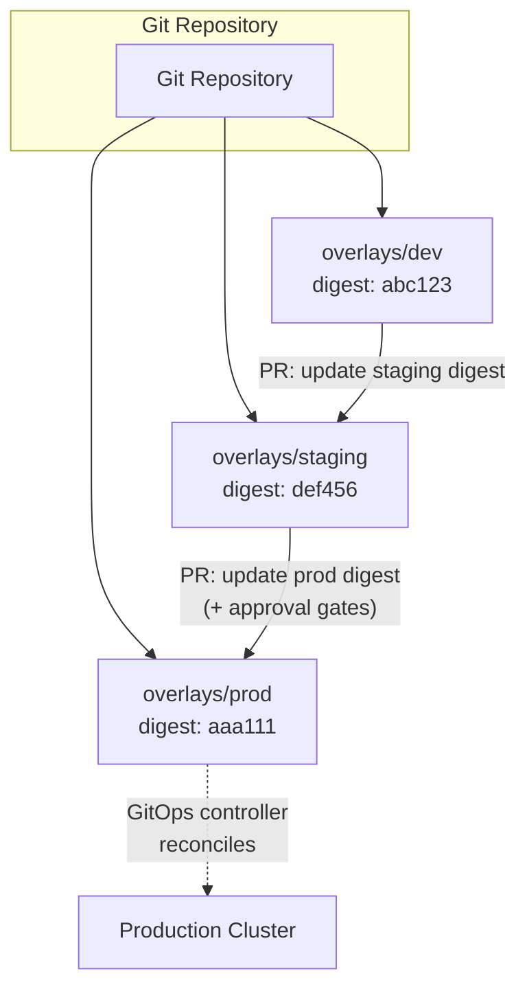
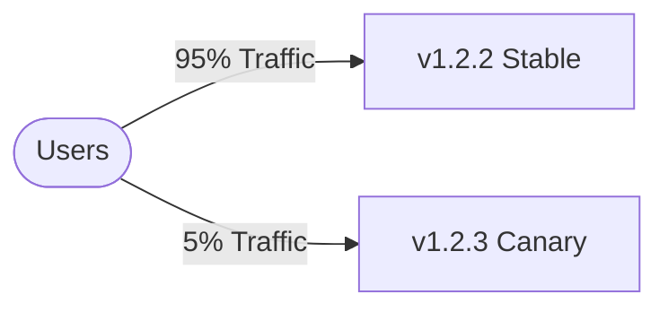
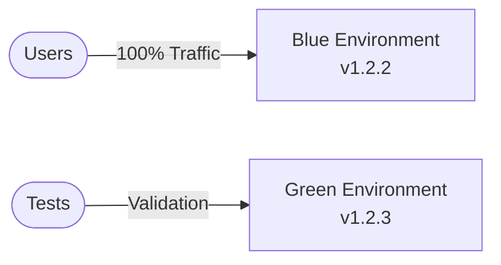
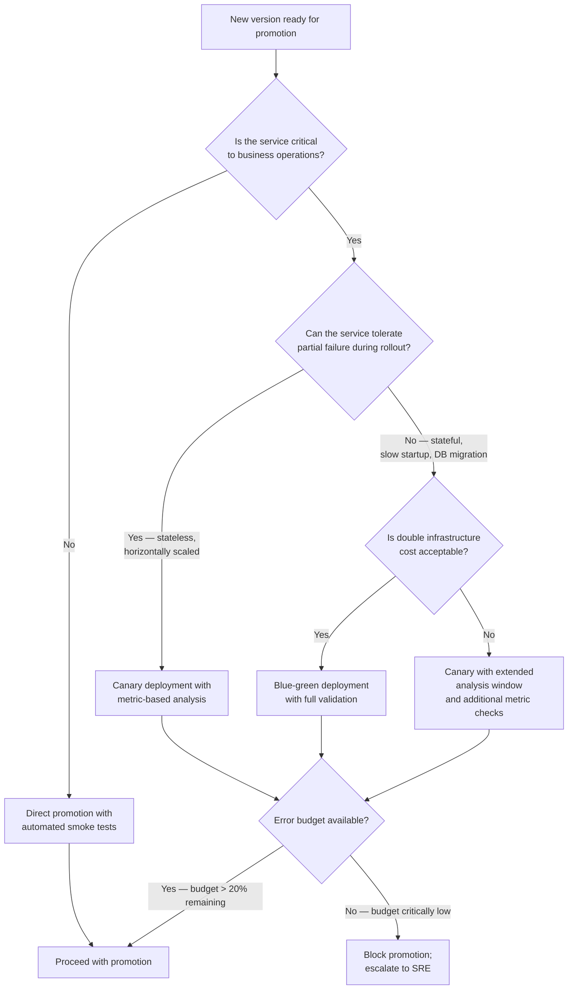

> **Discipline Module** | Complexity: `[MEDIUM]` | Time: 45-55 min

## Prerequisites

Before starting this module, you should understand how Git repositories are structured for multi-environment deployments — the directory-per-environment pattern and Kustomize overlay inheritance model covered in [Module 3.2: Repository Strategies](../module-3.2-repository-strategies/). You also need the foundational GitOps concepts from [Module 3.1: What is GitOps?](../module-3.1-what-is-gitops/), particularly the reconciliation loop and the principle that Git is the single source of truth for cluster state. Experience with multi-environment deployments in any form — even traditional CI/CD promotion — will help you recognize the contrasts that make GitOps promotion different, though it is not strictly required.

---

## What You'll Be Able to Do

After completing this module, you will be able to:

- **Design environment promotion pipelines that move changes safely from dev through staging to production** using Git operations rather than imperative deployment commands, with each environment transition encoded as a reviewable Git commit
- **Implement automated promotion gates with testing, approval, and rollback capabilities** by combining CI-based test suites, policy admission checks, SLO-based analysis, and Git-revert rollback within the GitOps reconciliation loop
- **Build promotion strategies that handle dependencies between microservices during coordinated releases** across multiple repositories, clusters, and regions, using staged rollout patterns and per-cluster promotion sequencing
- **Evaluate promotion patterns — image tag updates, Kustomize overlays, Helm value overrides — for your specific operational context** by understanding the tradeoffs in auditability, automation surface, and configuration complexity that each pattern brings

---

## Why This Module Matters

Your new feature works in dev. Now what? The journey from dev to production is where most deployment problems occur. A change that passes every test in a development environment can fail catastrophically in production because the runtime context differs: different database configurations, different network policies, different resource limits, different secrets. Each environment boundary is a place where assumptions embedded in the code meet the reality of operations, and without a disciplined promotion strategy these collisions are discovered by users rather than by automated verification.

The visibility problem compounds the reliability problem. When a broken release reaches production, the first question any responder asks is "what changed?" In organizations without structured promotion, answering that question means tracing through CI pipeline logs, checking image registries for ambiguous tags, and hoping someone remembers which commit was actually live. A properly designed GitOps promotion pipeline answers the question before it is even asked: every state change is a Git commit, every commit has an author and a timestamp, and every commit is linked to the exact artifact it promoted.

**Good promotion strategy delivers three guarantees that traditional CI/CD promotion cannot.** First, it guarantees that what was tested is what ships. When you promote an immutable artifact reference rather than rebuilding per environment, you eliminate the class of failures caused by different build outputs, different dependency resolutions, or different compilation flags between environments. The artifact that passed integration tests is bit-for-bit identical to the artifact that lands in production.

Second, it guarantees that every promotion is auditable and reversible. Because the promotion itself is a Git commit updating a declared configuration, rolling back is a matter of reverting that commit — and the audit trail is the Git history itself, not a separate deployment-tool log that may or may not be accessible during an incident.

Third, it guarantees that the path to production is consistent and enforceable. Rather than trusting individual engineers to remember the correct sequence of steps, you encode the promotion path as branch protection rules, required status checks, and automated verification gates that cannot be bypassed by human impatience.

> **Hypothetical scenario: The Promotion That Skipped Staging**
>
> A platform team manages a customer-facing ordering service. An urgent bug is causing incorrect totals for about 3% of transactions. A developer has a fix ready and the pressure to deploy directly to production is intense.
>
> **What happens if they skip staging:**
>
> The fix is merged directly to the production overlay and the GitOps controller syncs within seconds. The original bug is resolved. However, the hotfix image was developed against a newer version of the payment gateway client library that exists in the dev environment but was never deployed to staging — and therefore never tested with the authentication setup that production uses. The payment gateway connection fails on startup with a TLS handshake error. The service enters a crash loop. Instead of a partial-impact pricing bug affecting a small percentage of transactions, the entire ordering system is now down.
>
> **The better path:**
>
> Even under emergency pressure, promotion through staging takes about 12 minutes: 5 minutes for the GitOps controller to sync the staging overlay, 5 minutes for automated smoke tests, and 2 minutes for a reviewer to approve the promotion PR to production. The TLS mismatch is caught in staging smoke tests before a single production request is affected. The fix is rebuilt with the correct library version and promoted cleanly through both environments in 25 minutes total — slower than the direct push, but with zero production impact.
>
> The lesson is not that emergencies justify skipping environments. The lesson is that emergencies justify faster promotion through environments, not circumvention of the promotion path itself.

---

## What Promotion Means in GitOps

In a traditional CI/CD pipeline, promotion means running a deployment job that pushes artifacts to the next environment. The CI/CD server is the actor: it authenticates to the target cluster, invokes an API, and waits for a result. This model works but carries structural problems. The CI/CD server must hold credentials for every target cluster. If the deployment job fails partway through, the state of the cluster is uncertain — some resources may have been applied while others were not. And there is no declarative source of truth: to know what is deployed, you must query the cluster, and the cluster is always one `kubectl apply` away from being out of sync with what anyone documented.

**GitOps inverts the promotion model.** In GitOps, promotion is a change to the declared desired state in a Git repository. The CI/CD pipeline does not push to the cluster. Instead, it writes a change to a file — updating an image digest, a Helm value, or a Kustomize overlay — and commits that change. A GitOps controller running inside or adjacent to the cluster detects the commit and reconciles the cluster to match. The controller is the deployer; the pipeline is merely a proposal writer.

This inversion confers specific, durable advantages that define the GitOps approach to promotion. **Auditability is a first-class property, not an afterthought.** Every promotion is a Git commit. The commit carries an author, a timestamp, a diff, and — when coupled with a pull request workflow — a review record. During an incident, answering "what version is running?" does not require SSH access to a cluster or access to a deployment tool's audit log. It requires reading the current state of a file in Git, which any team member can do from a browser. Answering "who changed it and when?" is a `git log` invocation.

**Atomicity is guaranteed by the reconciliation loop.** A GitOps controller like Argo CD or Flux applies an entire manifest set as a reconciliation unit. If resource A depends on resource B and resource B fails to apply, the controller can be configured with sync waves, health checks, and retry policies that define the correct ordering and failure behavior. The deployment is not a script that may terminate at an arbitrary intermediate step; it is a convergence toward a fully specified desired state.

**Rollback is a Git operation.** When a promotion introduces a problem, reverting the promotion commit and pushing triggers a reconciliation back to the previous known-good state. This is fundamentally more reliable than imperative rollback because the rollback target is defined declaratively — it is the state of the repository before the promotion commit — rather than being reconstructed from a deployment tool's internal history. There is no ambiguity about which resources to roll back or in which order; the entire manifest set returns to its previous SHA.

**Secrets and credentials stay out of the CI/CD pipeline.** Because the pipeline only writes to Git (not directly to clusters), it does not need cluster credentials. The GitOps controller holds those credentials, and the controller runs in a more constrained, auditable environment than a CI/CD runner that may execute arbitrary build steps from a pull request.

These advantages compound with scale. A single GitOps controller can manage dozens of clusters and hundreds of applications. Adding a new environment means pointing a controller at the same repository with a namespace or cluster-scoped filter, not provisioning a new set of deployment credentials into CI/CD.

---

## Promote the Artifact, Not the Build

The most consequential design decision in a promotion pipeline is whether you rebuild your artifact in each environment or build once and promote the same artifact. The choice determines whether "tested" implies "shipped."

**Rebuilding per environment breaks the equivalence guarantee.** A common anti-pattern in older CI/CD setups runs the full build pipeline separately for dev, staging, and production, often with environment-specific build arguments or dependency versions injected at compile time. The image that runs in production was literally never tested — only a different image built from the same source code at a different time, potentially with a different toolchain version, a different set of cached dependency layers, and different environment variables baked into the final artifact. When issues appear in production that were not caught in staging, the team wastes cycles investigating configuration differences when the root cause is that the artifact itself is different.

**Build once, promote the digest.** The correct GitOps pattern builds the container image and any other deployable artifacts exactly once — typically from the application's source repository on merge to its main branch. The build produces an immutable reference: a container image pinned by SHA256 digest, not by mutable tag. This digest is the artifact. Promoting to staging means writing that digest into the staging overlay's image field. Promoting to production means writing the exact same digest into the production overlay. The bytes that run in production are the same bytes that passed integration tests and staging smoke tests.

The mechanism of pinning by digest deserves emphasis. An image tag like `my-service:v1.2.3` is a mutable pointer — it can be retagged to point to a different digest at any time. A digest like `my-service@sha256:e3b0c44298fc1c149afbf4c8996fb92427ae41e4649b934ca495991b7852b855` is cryptographically bound to the exact content. Most container registries support both forms, and the GitOps promotion workflow should always resolve the tag to its digest at build time and write the digest into the Git repository. This eliminates the class of failures where a retag between promotion and deployment silently changes the running artifact.

**Environment-specific configuration is overlaid, not baked in.** The objection to build-once is usually that environments legitimately differ: staging uses a smaller database instance pool, production has higher replica counts, dev runs with debug logging enabled. These differences are real and necessary, but they belong in the deployment configuration layer — the Kustomize overlay, the Helm values file, the environment-specific ConfigMap — not in the container image itself. The image should be environment-agnostic; the overlay makes it environment-specific. This separation ensures that when you test the staging overlay and then promote to production, the only thing that changed is the overlay, not the artifact.

**The "tested == shipped" guarantee is what makes canary and blue-green progressive delivery safe.** If you cannot trust that the artifact running in the canary is identical to the artifact you validated in staging, then canary metrics are measuring a different thing than what you validated, and automated promotion/rollback based on those metrics is making decisions about an unvalidated artifact. The entire progressive delivery model rests on the build-once invariant.

---

## Promotion Mechanics

The mechanics of promotion in GitOps reduce to a small set of operations that recur across tools and repository layouts. Understanding the primitives — rather than memorizing one tool's CLI — gives you the ability to design promotion workflows that fit your specific constraints.

### Directory and Overlay Per Environment

The foundational pattern, covered in Module 3.2, uses a directory-per-environment structure backed by Kustomize overlays. Each environment directory declares which version of each service should run there. Promotion is an update to the version field in the target environment's overlay.

```
my-service/
├── base/
│   ├── deployment.yaml
│   ├── service.yaml
│   └── kustomization.yaml
└── overlays/
    ├── dev/
    │   └── kustomization.yaml     # image: my-service@sha256:abc123...
    ├── staging/
    │   └── kustomization.yaml     # image: my-service@sha256:def456...
    └── prod/
        └── kustomization.yaml     # image: my-service@sha256:aaa111...
```

The promotion flow itself follows a consistent sequence. A developer or automated pipeline opens a pull request that modifies the staging overlay to reference the new digest. When the PR is reviewed and merged, the GitOps controller watching the staging cluster detects the change and reconciles. After validation in staging — either manual verification or automated smoke tests — a second PR is opened targeting the production overlay with the same digest. That PR may require additional approvals, may only be mergeable during a defined deployment window, and may trigger a canary or blue-green rollout within production rather than an instantaneous full cutover.



### PR-Based Promotion vs Automated Promotion

The choice between requiring a human pull request for each promotion step and fully automating promotion through pre-production environments defines the tempo and risk profile of your pipeline.

**PR-based promotion** requires a human to open or at least approve a pull request for each environment transition. This provides a natural gating point: the PR itself is the approval mechanism, and branch protection rules can enforce required reviewers, required status checks, and required conversations to be resolved. The tradeoff is latency. A change approved at 2 AM sits in a PR until someone wakes up and clicks merge — which, for non-critical services in low-risk environments, is often the right tradeoff. PR-based promotion is the default choice for production and for any environment where compliance or change-management policy requires human attestation.

**Automated promotion** uses a CI pipeline or a dedicated promotion controller to open and merge PRs when preconditions are met. The most common trigger is a successful test suite completion in the source environment. A change that passes dev integration tests automatically gets a promotion PR to staging. A change that passes staging smoke tests and SLO validation automatically gets a promotion PR to production — though production automation typically requires a human to approve the PR rather than auto-merge it closed. The Flux image automation controllers (`ImageRepository`, `ImagePolicy`, `ImageUpdateAutomation`) implement this pattern natively by watching a container registry for new images matching a policy (semver range, tag pattern) and automatically committing updates to the Git repository when a new image is found.

**The hybrid model** — automated promotion to staging, PR-gated promotion to production — is the most common pattern in practice because it balances velocity with safety. Changes reach a production-like environment quickly and automatically, giving fast feedback, while the final step to users still carries a human decision.

```yaml
# GitHub Action skeleton for automated staging promotion
name: Promote to Staging

on:
  workflow_dispatch:
    inputs:
      version:
        description: 'Version to promote'
        required: true

jobs:
  promote:
    runs-on: ubuntu-latest
    steps:
      - uses: actions/checkout@v4

      - name: Update staging image tag
        run: |
          yq eval '.images[0].newTag = "${{ inputs.version }}"' \
            -i overlays/staging/kustomization.yaml

      - name: Create PR
        uses: peter-evans/create-pull-request@v5
        with:
          title: "Promote my-service ${{ inputs.version }} to staging"
          branch: promote-staging-${{ inputs.version }}
          body: |
            Promoting my-service to staging.

            **Version**: ${{ inputs.version }}
            **Source**: dev environment

            Please review and merge to complete promotion.
```

### Environment-Specific Overlays That Legitimately Differ

Not everything should be identical across environments. The principle of promoting the same artifact does not mean every Kubernetes resource is a carbon copy. The following differences are legitimate and expected in environment-specific overlays:

- **Replica counts**: dev runs 1 replica to save resources; staging runs 2 to test leader election and failover; production runs 5 for load and availability.
- **Resource limits and requests**: dev and staging can use conservative limits; production limits should be calibrated against observed usage from staging load tests.
- **Ingress and DNS configuration**: each environment has its own hostname and TLS certificate.
- **Database connection strings and credentials**: these reference different database instances. The credentials themselves should be managed through an external secrets system (Sealed Secrets, External Secrets Operator, Vault) rather than hardcoded in the overlay, but the *reference* to which credential to use is environment-specific.
- **Observability configuration**: production may ship traces to a different collector with a higher sampling rate than staging.

What should NOT differ across environments is the application image, the application configuration that affects behavior (feature flags may legitimately differ, but algorithm parameters and business logic config should not), and any security policy that affects the application's access to resources.

### Helm Value Overrides as Promotion

The overlay pattern is not the only mechanism. When using Helm charts, promotion means updating the values file for the target environment. The same invariants apply: the chart version and the image digest in the values file are the promoted artifacts, and they should be the exact same references that were validated in the previous environment.

```yaml
# values-staging.yaml
image:
  repository: my-service
  digest: sha256:def456...
  tag: v1.2.3  # informational only; digest is authoritative

# Promotion to prod means updating values-prod.yaml
# to reference the same digest: sha256:def456...
```

The risk with Helm-based promotion is that the chart itself can change between environments, introducing additional variables beyond the image reference. A disciplined practice pins the chart version explicitly and promotes that version alongside the image digest, ensuring that the exact combination of chart logic and container image is preserved through the pipeline.

---

## Progressive Delivery

Promotion across environments answers the question "which version should run in this environment?" Progressive delivery answers the question "how should traffic reach that version?" The two concepts operate at different granularities — promotion changes the declared state in Git; progressive delivery controls the rollout of that declared state within a single environment — but they compose to form the complete safe-delivery pipeline.

### Canary Deployments

A canary deployment runs the new version alongside the existing stable version, routing a small percentage of traffic to the canary and monitoring its behavior before increasing the traffic share. If the canary performs within acceptable thresholds, the rollout continues incrementally — typically stepping from 5% to 25% to 50% to 100%. If the canary violates a metric threshold (error rate, latency, throughput), traffic is shifted back to the stable version and the canary is torn down.



The power of canary deployments in a GitOps context is that the canary configuration itself is declared in Git. When the production overlay is updated with a new image digest, the progressive delivery controller (Argo Rollouts or Flagger) reads the declared desired state and executes the canary steps — not because a pipeline script told it to, but because it reconciled the desired state and its own rollout strategy is defined in the Rollout or Canary custom resource.

**Analysis templates are the automation engine.** Both Argo Rollouts and Flagger support metric-driven analysis that runs during the canary. An analysis template defines which metrics to query (from Prometheus, Datadog, New Relic, CloudWatch, and others), what thresholds constitute a pass or failure, how long to run the analysis at each step, and what action to take on failure (pause the rollout, roll back, or alert). This closes the loop: a Git commit changes the desired state, the controller begins the progressive rollout, the analysis validates real production traffic against the new version, and the rollout completes or aborts automatically based on measurement, not on a human watching a dashboard.

```yaml
apiVersion: flagger.app/v1beta1
kind: Canary
metadata:
  name: my-service
spec:
  targetRef:
    apiVersion: apps/v1
    kind: Deployment
    name: my-service
  progressDeadlineSeconds: 60
  service:
    port: 80
  analysis:
    interval: 30s
    threshold: 5
    maxWeight: 50
    stepWeight: 10
    metrics:
      - name: request-success-rate
        thresholdRange:
          min: 99
        interval: 1m
      - name: request-duration
        thresholdRange:
          max: 500
        interval: 30s
```

### Blue-Green Deployments

A blue-green deployment provisions an entirely separate environment running the new version — the "green" environment — alongside the existing "blue" environment that continues serving all production traffic. Once the green environment is fully deployed, warmed up, and validated through automated tests, traffic is switched from blue to green in a single operation at the load balancer or ingress layer.



```yaml
apiVersion: argoproj.io/v1alpha1
kind: Rollout
metadata:
  name: my-service
spec:
  replicas: 5
  strategy:
    blueGreen:
      activeService: my-service
      previewService: my-service-preview
      autoPromotionEnabled: false  # Manual promotion
  template:
    spec:
      containers:
        - name: my-service
          image: my-service:v1.2.3
```

Blue-green trades infrastructure cost for operational simplicity. Because the green environment is a complete, isolated copy of the production stack, you can run full integration tests against it without affecting a single user. The cutover is instantaneous — a single routing rule change — and the rollback is equally instantaneous: switch traffic back to blue. The cost is that during the blue-green window you are running twice the infrastructure, which for large deployments can be significant.

### Choosing Between Canary, Blue-Green, and Direct Promotion

The decision depends on your failure domain, your traffic volume, and the speed at which your monitoring can detect anomalies.

| Scenario | Strategy | Reasoning |
|----------|----------|-----------|
| Low risk, fast feedback | Direct promotion | Overhead of progressive delivery exceeds risk of direct cutover |
| Medium risk, needs traffic validation | Canary (gradual) | Real-user traffic validates behavior incrementally; partial blast radius |
| High risk, needs comprehensive testing | Blue-green (parallel) | Full environment validation before any user traffic touches new version |
| Critical service with SLO | Canary with automated rollback | Metric-driven gates prevent SLO breach; rollback is automatic |

> **Landscape snapshot — as of 2026-06. This changes fast; verify against vendor docs before relying on specifics.**

| Capability | Argo Rollouts | Flagger | Argo CD (native) |
|---|---|---|---|
| Canary deployment | Yes, with step-based weight and pause | Yes, with weight and A/B testing | No |
| Blue-green deployment | Yes, with preview service | No (canary-focused) | No |
| Analysis (metric-based promotion/rollback) | Yes (AnalysisTemplate CRD) | Yes (metric templates, webhooks) | No |
| Supported metric providers | Prometheus, Datadog, New Relic, Wavefront, CloudWatch, Graphite, InfluxDB, SkyWalking, Web | Prometheus, Datadog, CloudWatch, Graphite, InfluxDB, Stackdriver, webhooks | N/A |
| Traffic routing integration | Service Mesh (Istio, Linkerd), Ingress (NGINX, ALB), SMI | Service Mesh (Istio, Linkerd, App Mesh), Ingress (NGINX, Contour, Gloo, Skipper) | N/A |
| CNCF status | Graduated | Not in CNCF (Flux project sub-component) | Graduated |
| GitOps native | Declarative Rollout CR in Git | Declarative Canary CR in Git | Does not do progressive delivery |

### Progressive Delivery Within an Environment vs Promotion Across Environments

These two concepts are often conflated but serve different purposes. Progressive delivery answers "how does traffic shift to the new version safely within one environment?" Promotion answers "which version is the desired state for this environment?" They compose: the production overlay declares the desired version, and the progressive delivery controller decides how to route traffic to it. A canary in production is not a separate environment — it is a controlled rollout within the production environment itself, governed by the same GitOps loop that reconciled the overlay change in the first place.

---

## Gates and Verification

Promotion without verification is deployment without testing. The verification layer determines whether a version that has reached an environment is healthy enough to be promoted further or to be rolled back. GitOps provides natural gating points at the Git level — pull requests — and at the runtime level — analysis templates and policy admission.

### Automated Verification Gates

Automated gates run without human intervention and produce a binary pass/fail result. They are the first line of defense and should be configured to run on every promotion PR before a human is even asked to review.

**Test suites** are the most fundamental gate. A promotion PR to staging should trigger integration tests that run against the staging environment with the proposed version deployed. If the tests fail, the PR cannot be merged. The test suite should verify not only that the application starts and responds to health checks but that its interactions with its dependencies — databases, message queues, other services — produce correct results under the new version.

**Policy admission** checks whether the proposed change violates organizational constraints. Tools like OPA Gatekeeper and Kyverno can be applied to the promotion PR itself through policy-as-code checks in CI. A policy might require that any image promoted to production has been scanned by a vulnerability scanner within the last 24 hours and has no critical CVEs. Another policy might enforce that the image was built from a signed commit by a recognized team member. These policies are declarative, version-controlled in the same Git repository, and cannot be bypassed by individual discretion.

**SLO-based analysis** extends verification beyond binary tests to continuous measurement. A canary or blue-green progressive delivery controller queries the monitoring system for SLO-relevant metrics — request latency, error rate, throughput — and compares the new version's performance to the established baseline. If the canary exceeds the error budget for the canary window, the rollout is aborted automatically. This is the practical intersection of SRE error budgets and GitOps promotion: the error budget is not just a policy document but a runtime enforcement mechanism that blocks promotions that would consume too much of the remaining budget.

### Manual Approval Gates

Manual gates insert human judgment at defined points in the promotion path. The most common manual gate is the pull request review requirement: a promotion PR to production requires approval from a designated set of reviewers, enforced by branch protection rules in the Git hosting platform.

**Argo CD sync windows** provide an additional layer of manual gating at the controller level. A sync window defines time ranges during which automated sync is allowed or denied for specific applications or namespaces. A production application might be configured to sync only during weekday business hours, preventing a promotion merged at 2 AM from taking effect until the window opens and someone is available to respond if something goes wrong.

```yaml
apiVersion: argoproj.io/v1alpha1
kind: AppProject
metadata:
  name: production
spec:
  syncWindows:
    - kind: allow
      schedule: '0 10-16 * * 1-5'  # Weekdays 10am-4pm
      duration: 6h
      applications:
        - '*'
    - kind: deny
      schedule: '0 0 * * 0'  # No Sunday deploys
      duration: 24h
```

**Flux notifications and alerts** keep humans informed without requiring them to watch dashboards. A Flux Alert can be configured to send a Slack message, a PagerDuty page, or a webhook when a promotion is applied to specific paths in the repository, giving teams visibility into what changed and when.

```yaml
apiVersion: notification.toolkit.fluxcd.io/v1beta2
kind: Alert
metadata:
  name: production-promotions
spec:
  providerRef:
    name: slack
  eventSeverity: info
  eventSources:
    - kind: Kustomization
      name: '*'
      namespace: flux-system
  inclusionList:
    - ".*overlays/prod.*"
```

### The Error Budget as a Promotion Governor

SRE practices define error budgets as the acceptable amount of unreliability over a defined window — typically the complement of the SLO over a rolling 28-day period. When applied to promotion, the error budget becomes a governor: as the remaining error budget shrinks, promotion cadence should slow or halt entirely. If the service is already consuming its error budget faster than planned, introducing a new version — which inherently carries risk — is irresponsible.

In practice, this means the promotion pipeline should query the error budget status before allowing a production promotion to proceed. If the budget is below a threshold (e.g., fewer than 15 minutes of remaining downtime in the window), automated promotion is disabled and any human-driven promotion requires explicit acknowledgment of the budget state. This coupling ensures that the decision to promote is informed by the current reliability posture, not just by the passage of tests.

---

## Rollback: Why Declarative Beats Imperative

Rollback is the promotion pipeline's most important capability because it is the one you will use under pressure, at inconvenient hours, when judgment is impaired by stress and urgency. The design of the rollback mechanism must account for the conditions under which it will be invoked.

**Git revert is the canonical GitOps rollback.** When a promotion commit is identified as problematic, reverting that commit and pushing returns the repository to its previous state. The GitOps controller detects the change and reconciles the cluster back. The rollback itself is a Git commit, carrying the same audit trail properties as any other change: author, timestamp, diff, and review record. A responder investigating the incident can see not only what was rolled back but who initiated the rollback and when.

**Why imperative rollback fails under GitOps.** A `kubectl rollout undo` or an Argo CD UI-driven "rollback" button modifies the cluster state directly. The cluster now diverges from the declared state in Git. The GitOps controller, whose job is to eliminate drift by reconciling the cluster to Git, will detect this divergence and — depending on the sync policy — either overwrite the rollback with the broken version still declared in Git or flag the application as out of sync and refuse to proceed. In either case, the team is fighting the controller. The correct fix is to change Git, not the cluster.

**Sync waves and health checks govern rollback ordering.** When an application consists of multiple Kubernetes resources with dependencies — a Deployment that references a ConfigMap, a Service that targets the Deployment, an Ingress that routes to the Service — the order in which resources are rolled back matters. Argo CD sync waves assign resources to numbered phases (negative waves run first, then zero, then positive), and a rollback commit that reverts all resources simultaneously will be reconciled in the correct order by the controller. Health checks ensure that each wave is healthy before the next wave begins, preventing a partial rollback from leaving the application in a broken intermediate state.

Rollback in GitOps is not an emergency procedure layered on top of the deployment model. It is the deployment model running in reverse, with the same guarantees of atomicity, order, and auditability that forward promotion provides. The promotion and the rollback are the same operation applied to different Git commits — and that symmetry is what makes the system reliable under stress.

---

## Multi-Cluster and Multi-Region Promotion

As deployment footprints grow to span multiple clusters — for geographic distribution, blast-radius isolation, or capacity scaling — promotion must extend from a single-cluster model to a staged multi-cluster rollout.

**The staged rollout pattern** promotes to one cluster or region at a time, validates, and proceeds. A new version is first promoted to a canary cluster (often a low-traffic region or an internal-facing cluster), validated with production traffic for a defined period, and then promoted to subsequent clusters in sequence. Each promotion is a separate Git commit targeting the per-cluster overlay or the per-cluster ApplicationSet parameter. If a rollout fails in one region, only that region is affected; the remaining regions continue running the previous stable version.

**Argo CD ApplicationSets** implement multi-cluster promotion declaratively. An ApplicationSet generator — typically a cluster generator or a list generator — produces an Application resource for each target cluster from a single template. The template references a per-cluster overlay directory or a Helm values file keyed by cluster name. Updating the image digest in the template updates all Applications simultaneously, but progressive sync can be configured with per-cluster sync windows or manual sync policies that stagger the rollout.

**Flux multi-cluster promotion** follows a similar pattern through GitRepository and Kustomization resources per cluster, with the additional capability of image automation controllers that can update per-cluster image references independently. A Flux `ImageUpdateAutomation` can be scoped to a specific cluster's directory, enabling per-cluster promotion automation with cluster-specific validation gates.

**Regional staged rollout** applies the same concept at geographic scale. A change is promoted to `us-east-2` (low traffic), validated for 30 minutes against production traffic and SLO metrics, promoted to `us-west-2`, validated for 15 minutes, and then promoted to the remaining regions. Each stage is a Git commit; each committed digest is the same immutable artifact; and the only difference between regions is the timing of the promotion commit.

---

## Patterns and Anti-Patterns

Recognizing which promotion designs work and which fail under real operational pressure is more valuable than memorizing CLI flags.

### Patterns

**Promote the digest, never the tag.** Resolve mutable image tags to SHA256 digests at build time and write the digest into the Git repository. This eliminates an entire class of "it changed between promotion and deployment" incidents and makes the Git state cryptographically precise about what is running.

**Promotion as pull request.** Every environment transition is a pull request. This makes every promotion reviewable, commentable, and attributable — even if the PR is created and merged automatically by a bot. The PR record is the audit log.

**Immutable promotion path.** The sequence of environments through which a change must pass is encoded in branch protection rules and CI checks, not in documentation. A change cannot reach production without having passed through staging because the CI check on the production PR verifies that the same digest exists in the staging overlay at the time of the production PR.

**Declarative rollback through Git revert.** When something breaks, `git revert` the promotion commit. Do not touch the cluster. Let the controller reconcile.

**Progressive delivery as a promotion step, not an environment.** Treat canary and blue-green as rollout strategies within a single environment rather than as additional environments in the promotion path. This keeps the promotion path (dev → staging → prod) simple while adding progressive-delivery safety inside production.

### Anti-Patterns

**Rebuilding per environment.** Running a separate CI build for each environment produces artifacts that were never tested as the exact bytes that will run. The staging build's compiler flags, dependency versions, and cached layers differ from the production build's. The resulting bugs are irreproducible in staging and impossible to root-cause during an incident.

**Mutable tags in Git.** Writing `my-service:latest` or `my-service:staging` into the repository means the Git state does not specify what is running. Two people reading the same file at different times will see different cluster states. This is the opposite of declarative.

**Skipping environments for emergencies.** The pressure to skip staging during an incident is real, but the risk compounds: the emergency fix was tested in zero environments resembling production, and if it introduces a new failure, the incident is now two problems layered on top of each other. The correct emergency path is accelerated promotion through all environments — staging sync + smoke test + production promotion in a tight automated sequence — not environment bypass.

**Manual cluster edits as rollback.** Using `kubectl apply -f previous-version.yaml` or a controller UI to revert a deployment creates drift between the cluster and Git. The GitOps controller will reconcile the drift away or, worse, flag the application as degraded and refuse further automated sync. The fix must land in Git first.

**Promotion monorepo with shared overlays.** When multiple teams share a single promotion repository and a single overlay directory, a promotion for service A can accidentally carry an unintended change for service B if the PR author is not careful about what is staged. Per-team or per-service overlay directories with CODEOWNERS files prevent this collision.

**No automated smoke tests in staging.** If staging promotion requires a human to manually verify that the new version works, promotions will queue during off-hours and overnight, creating release pressure — multiple changes stacked behind the unverified one — that drives risky behavior. Automated smoke tests that run on the staging cluster and report a go/no-go status to the production promotion PR eliminate this bottleneck.

**Promoting on Friday.** Deploying changes when the team is about to be away for two days maximizes the window during which an undetected problem can accumulate impact. If a Friday promotion is unavoidable, it should be coupled with increased alerting sensitivity and an explicit on-call escalation path for the weekend.

### Decision Framework

Use the following decision flow to select the right promotion strategy for a given service and risk profile.



---

## Did You Know?

1. **Facebook deploys code to 2% of its users first** and then gradually expands the rollout. This internal system, called "Gatekeeper," has operated for over a decade and uses real-user metrics — not pre-production testing — as the primary promotion gate. The logic is straightforward: no staging environment captures real user behavior, so the first real users ARE the final verification.

2. **GitOps promotion is fundamentally different from CI/CD promotion.** In a CI/CD pipeline, the pipeline pushes changes to the target environment. In GitOps, the pipeline writes a change to Git, and a controller running in the cluster pulls and reconciles. The direction of the control flow — push vs. pull — changes the failure modes, the credential model, and the audit trail. A failed push leaves the cluster in an ambiguous state. A failed pull reconciliation leaves a clear record: the desired state in Git, the actual state in the cluster, and a controller status explaining the gap.

3. **Some organizations use promotion bots that auto-promote to staging without human review** but require human approval only for production. The staging environment is treated as a fast-feedback loop where automated test results are the gate, while production adds a human decision to the chain. This balances deployment velocity (staging promotions happen within seconds of test completion) with safety (production promotions require a reviewer to click merge).

4. **LinkedIn's deployment system promotes changes through five distinct stages** before reaching all users: canary, early adopters, first tier, second tier, and full rollout. Each stage has independent automated health checks that measure real-user metrics — latency, error rate, session completion — and automatically halt promotion if any metric deviates from baseline. The system demonstrates that "promotion" is not a binary dev-to-prod event but a graduated process where confidence accumulates through measured exposure to increasingly representative user populations.

---

## Common Mistakes

| Mistake | Problem | Solution |
|---------|---------|----------|
| Using mutable tags in Git | Git state does not specify what is running; two reads at different times see different cluster states | Pin by SHA256 digest; resolve mutable tags at build time |
| Skipping environments in emergencies | Untested emergency fix introduces new failures, compounding the original incident | Accelerate the promotion path, never bypass it — staging smoke test in a tight automated sequence |
| Rebuilding per environment | Each environment runs a different artifact; staging tests do not validate production | Build once, promote the same digest; environment differences go in overlays, not the image |
| Manual cluster edits as rollback | Creates drift between cluster and Git; controller reconciles the edit away | `git revert` the promotion commit; let the controller reconcile |
| No automated smoke tests in staging | Promotions queue behind unverified changes; release pressure drives risky shortcuts | Automated smoke tests that report go/no-go status to the production PR |
| Promoting without error budget awareness | Introducing a new version during a reliability incident compounds risk | Query error budget status before production promotion; block if budget is critically low |
| Friday or end-of-day promotions | Maximum unremediated impact window if something breaks; minimal team availability | Deploy during business hours with on-call coverage; if unavoidable, increase alert sensitivity |
| Monorepo with unguarded shared overlays | A promotion for service A accidentally changes service B's configuration | Per-service overlay directories with CODEOWNERS and required reviews per path |

---

## Quiz: Check Your Understanding

### Question 1

**Scenario:** Your team is moving to GitOps and a developer suggests using the `latest` tag for the production image so that the cluster always pulls the most recent build automatically. What is the critical flaw in this approach for a GitOps workflow?

<details>
<summary>Show Answer</summary>

Using the `latest` tag breaks the core GitOps guarantee that the Git repository is the single source of truth for cluster state. Because `latest` is a mutable pointer — it resolves to different image digests at different times — two people reading the same Git file at different moments would see different cluster states, even though the file itself did not change. Furthermore, if a deployment fails, there is no declarative record of which exact bytes were running before the failure, making rollback ambiguous. The fix is to promote by SHA256 digest, cryptographically bound to the exact artifact content, so the Git state is precise and reproducible at all times.

</details>

### Question 2

**Scenario:** A newly promoted version of the `checkout-service` (v2.1.0) is crashing in the production environment. Your GitOps controller (Argo CD) is actively syncing the `prod` overlay from your Git repository. What is the safest and most idiomatic GitOps way to restore the service, and why does using `kubectl rollout undo` create a new problem?

<details>
<summary>Show Answer</summary>

The safest approach is to `git revert` the promotion commit that introduced v2.1.0, push the revert commit, and let the GitOps controller reconcile the production cluster back to the previous known-good state. This preserves the audit trail (the revert is a commit with an author and timestamp), keeps the cluster and Git in agreement, and works identically regardless of which GitOps controller you use.

`kubectl rollout undo` modifies the cluster state directly without changing Git. The controller will detect the drift — the cluster is now running a different version than the Git repository declares — and, depending on the sync policy, either overwrite your rollback with v2.1.0 again or flag the application as degraded and refuse to sync. You are now fighting the controller while trying to fix an incident, which is the worst possible time for a tooling conflict.

</details>

### Question 3

**Scenario:** Your organization has suffered multiple production outages because developers are merging hotfix PRs directly into the `prod` overlay without the change ever reaching the `staging` overlay. You need to implement an automated mechanism that physically prevents this bypass. What checks would you add to the production promotion PR to enforce the staging-first rule?

<details>
<summary>Show Answer</summary>

Add a CI status check on every production promotion PR that queries the staging overlay and verifies that the exact same image digest being proposed for production already exists in the staging overlay's current state. If the staging overlay does not reference this digest, the check fails and the PR cannot be merged. Additionally, enforce a CODEOWNERS rule on the `overlays/prod/` path requiring approval from a designated release manager, and configure Argo CD sync windows so that production sync only occurs during defined business hours. These three layers — programmatic digest verification, human approval, and temporal gating — collectively prevent the staging bypass without relying on anyone remembering the policy during an incident.

</details>

### Question 4

**Scenario:** You are deploying a major architectural change to a legacy monolithic application. The application takes approximately 5 minutes to start up, performs a database migration during initialization, and any failure at startup will make the application completely unavailable to all users. Which progressive delivery strategy is appropriate, and what are the tradeoffs?

<details>
<summary>Show Answer</summary>

A blue-green deployment is the correct choice because it provisions a completely separate "green" environment that can be fully tested before any user traffic is routed to it. The 5-minute startup and database migration can complete without affecting the "blue" environment still serving users. Once the green environment is validated — health checks pass, database migration completed, integration tests against real dependencies succeed — traffic is switched in a single operation. If post-switch issues appear, rollback is equally instantaneous: switch traffic back to blue.

The tradeoff is cost: during the blue-green window, you are running approximately twice the production infrastructure. For a monolith with substantial resource requirements, this can be expensive. The alternative — a canary deployment — is risky here because a monolith that experiences startup failure takes the entire canary slice down, not just a fraction of traffic, and the slow startup makes the canary analysis window impractically long.

</details>

### Question 5

**Scenario:** A developer asks why the team must specify image references by SHA256 digest (`sha256:e3b0...`) in the Git repository instead of by semantic version tag (`v1.2.3`). They argue that tags are more readable and that the CI pipeline only ever pushes a given tag once. What specific failure mode does digest pinning prevent that single-push tag discipline does not?

<details>
<summary>Show Answer</summary>

Even with a discipline of never retagging, the semantic version tag does not prove that the image in the registry at deployment time is the same image that was tested in staging. Between the time staging was validated and production deployment occurs, a registry compromise, an administrative error, a cache invalidation, or a replication delay could cause the tag to resolve to a different manifest. A digest is a cryptographic hash of the image content and manifest — if the digest matches, the bytes are proven identical. The tag is a human-readable pointer; the digest is a mathematical proof. In a GitOps workflow where the Git repository is supposed to be the single source of truth about what is running, an unverifiable pointer is insufficient.

</details>

### Question 6

**Scenario:** Your team runs a production service with a 99.9% availability SLO (approximately 43 minutes of allowed downtime per 30-day window). The service has already consumed 30 minutes of its error budget this month due to an unrelated incident last week. A new feature version is ready for promotion to production. Should it be promoted, and what additional steps should accompany the promotion if it proceeds?

<details>
<summary>Show Answer</summary>

With only 13 minutes of remaining error budget for the rest of the window, promoting a new version carries disproportionate risk — any failure from the new version would likely exhaust the remaining budget entirely, violating the SLO. The promotion should be deferred unless there is a compelling business justification that outweighs the reliability risk, and even then, additional safeguards are required: the promotion should go through staging with extended smoke tests, should use a canary deployment with the most aggressive metric thresholds available (tight error rate and latency bounds), should have the analysis window extended beyond normal duration, and the on-call responder should be actively monitoring the rollout with a pre-authorized rollback prepared. If any analysis metric deviates even slightly from baseline during the canary, the rollout must abort immediately, not pause — because the remaining budget does not allow for investigation during the rollout.

</details>

### Question 7

**Scenario:** An organization deploys to three Kubernetes clusters in three AWS regions: `us-east-2` (low-traffic canary region), `eu-west-1`, and `ap-southeast-1`. A new version is promoted to `us-east-2` and runs successfully for 4 hours. The team then promotes to `eu-west-1`, where the same version begins returning elevated error rates within minutes. Why might an identical artifact behave correctly in one region and fail in another, and what does this tell you about multi-region promotion design?

<details>
<summary>Show Answer</summary>

An identical artifact can behave differently across regions because the artifact is only one component of the runtime environment. Regional differences that affect behavior include: different database replication lag profiles (the `eu-west-1` database replica may be further behind its primary than the `us-east-2` replica), different CDN cache states, different network latency to upstream dependencies, different volumes or patterns of user traffic, and region-specific compliance configurations that modify request paths. The fact that `us-east-2` succeeded for 4 hours is validation of the artifact, not of the full deployment in every region. Multi-region promotion must treat each region as a separate promotion step with its own validation window, rather than assuming that success in one region implies success in all others. The staged rollout pattern — promote, validate, proceed — minimizes the blast radius when a region-specific failure occurs.

</details>

---

## Hands-On Exercise: Design a Promotion Pipeline

Design a complete promotion pipeline for the `order-service` from first build to multi-region production rollout.

### Scenario

- **Service**: `order-service` (stateless, horizontally scaled, 4 replicas in production)
- **Environments**: dev, staging, prod (two regions: `us-east-2` as canary, `eu-west-1` as main)
- **Requirements**:
  - Auto-deploy to dev on merge to main in the application repository
  - Automated promotion to staging with smoke tests
  - Approval-required promotion to production
  - Progressive canary rollout within production
  - Ability to roll back any environment with a single Git operation
  - Multi-region staged rollout: canary region first, main region after validation

### Part 1: Repository Layout

Design the directory structure for both the application repository and the configuration repository. Show where the Kustomize base, overlays, and per-region production overlays live.

### Part 2: Promotion Sequence

Define the exact sequence of events from code merge to full production rollout, including which steps are automated and which require human approval.

### Part 3: Rollback Procedure

Write the exact commands — as you would type them during an incident — to identify the broken version, find the previous good version, and roll back production to that version.

### Part 4: Error Budget Integration

Define the error budget threshold that would block a production promotion, how the pipeline checks it, and what the promotion PR should display when the budget is too low.

### Success Criteria

- [ ] Repository layout separates application source from environment configuration and uses per-region production overlays
- [ ] Promotion sequence document covers every transition from code merge to full multi-region rollout, marking automated vs. manual steps
- [ ] Rollback procedure uses `git revert` and lists the exact shell commands a responder should run during an incident
- [ ] Error budget check is included in the production promotion gate with a defined threshold and a PR status check that blocks promotion when budget is low

---

## Sources

1. [Argo CD — Sync Waves](https://argo-cd.readthedocs.io/en/stable/user-guide/sync-waves/) — Official documentation on phased sync ordering and health checks
2. [Argo Rollouts — Progressive Delivery](https://argoproj.github.io/argo-rollouts/) — Canary, blue-green, and analysis-driven promotion
3. [Argo Rollouts — Analysis Templates](https://argoproj.github.io/argo-rollouts/features/analysis/) — Metric-based promotion and automated rollback
4. [Flagger — Progressive Delivery for Kubernetes](https://docs.flagger.app/) — Canary deployment with metric analysis and traffic routing
5. [Flagger — Metrics Analysis](https://docs.flagger.app/usage/metrics) — Supported metric providers and threshold configuration
6. [Flux — Image Update Automation](https://fluxcd.io/flux/guides/image-update/) — Automated image promotion through Git commits
7. [Flux — Image Automation Controllers](https://fluxcd.io/flux/components/image/) — ImageRepository, ImagePolicy, ImageUpdateAutomation APIs
8. [OpenGitOps — Principles](https://opengitops.dev/) — Foundational principles of declarative, version-controlled, pull-based operations
9. [Kustomize — Overlays](https://kustomize.io/) — Base and overlay pattern for multi-environment configuration
10. [OPA Gatekeeper — Policy Admission](https://open-policy-agent.github.io/gatekeeper/website/docs/) — Kubernetes-native policy enforcement through CRD-based constraints
11. [Kyverno — Kubernetes Policy Management](https://kyverno.io/docs/) — Policy-as-code for validation, mutation, and generation
12. [Kubernetes — Deployments](https://kubernetes.io/docs/concepts/workloads/controllers/deployment/) — Core Kubernetes deployment primitive and rollout management
13. [Helm — Values Files](https://helm.sh/docs/chart_template_guide/values_files/) — Environment-specific configuration overrides for Helm-based promotion
14. [CNCF Cloud Native Landscape](https://landscape.cncf.io/) — Maturity classification (graduated/incubating/sandbox) for CNCF projects

---

## Next Module

Continue to [Module 3.4: Drift Detection and Remediation](../module-3.4-drift-detection/) to learn how to detect and handle when cluster state doesn't match Git.
