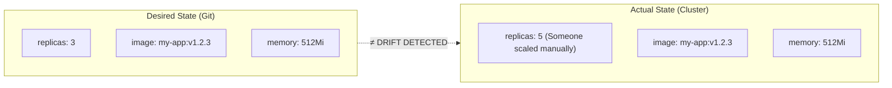
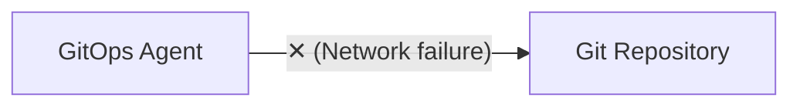
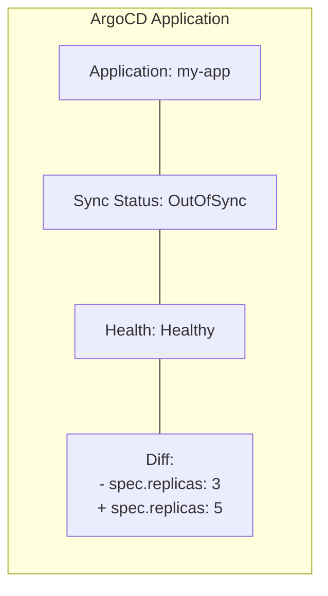
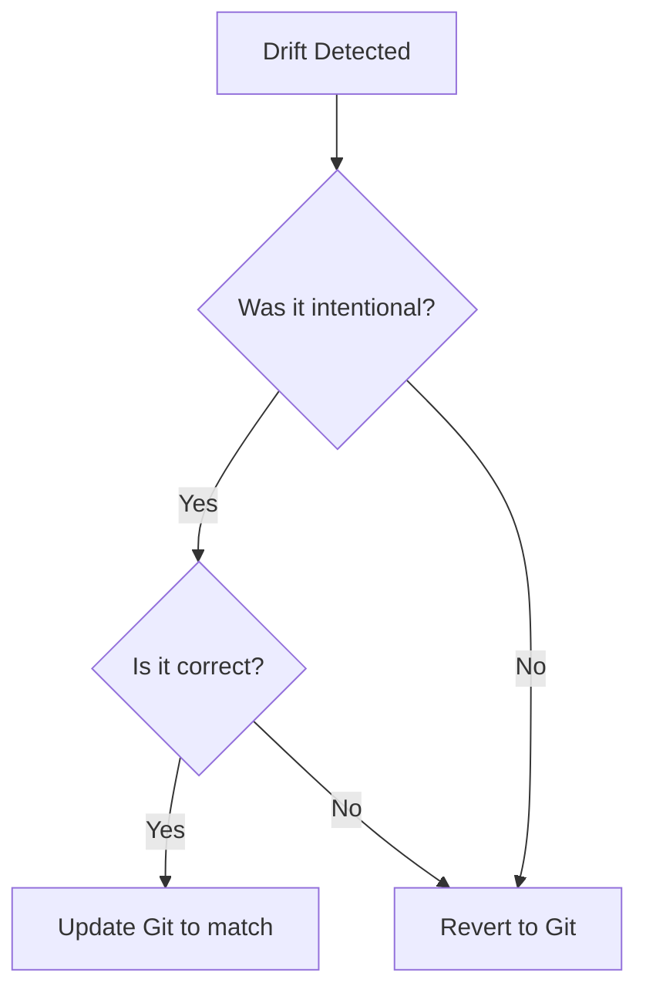

> **Discipline Module** | Complexity: `[MEDIUM]` | Time: 30-35 min

## Prerequisites

Before starting this module:
- **Required**: [Module 3.1: What is GitOps?](../module-3.1-what-is-gitops/) — GitOps fundamentals
- **Required**: [Module 3.3: Environment Promotion](../module-3.3-environment-promotion/) — Environment management
- **Recommended**: Experience with Kubernetes kubectl debugging

---

## What You'll Be Able to Do

After completing this module, you will be able to:

- **Implement drift detection that identifies when cluster state diverges from Git-declared configuration**
- **Design alerting policies that distinguish critical drift requiring immediate attention from benign changes**
- **Build automated remediation workflows that reconcile drift without manual intervention**
- **Analyze drift patterns to identify systemic causes — manual kubectl edits, mutating webhooks, operator conflicts**

## Why This Module Matters

GitOps principle #4: "Continuously reconciled."

> **Stop and think**: If Git is the single source of truth, what happens if a cluster admin runs `kubectl edit deployment` during a critical production incident? Which state should ultimately win?

But what happens when someone runs `kubectl edit` directly? Or when a Kubernetes controller modifies a resource? Or when network issues prevent syncing?

**Drift** occurs when the cluster state doesn't match Git.

Without drift detection:
- You don't know your Git repo lies
- Manual changes go unnoticed
- Troubleshooting becomes "is it Git or is it the cluster?"
- GitOps becomes "Git-sometimes-Ops"

This module teaches you to detect drift, understand why it happens, and decide whether to remediate or accept it.

---

## What Is Drift?

Drift is the difference between desired state (Git) and actual state (cluster).



### Types of Drift

**Configuration Drift:**
- Manual `kubectl` changes
- Helm release modifications outside GitOps
- Direct API changes

**Operational Drift:**
- HPA scaling pods (expected)
- VPA adjusting resources
- Cluster autoscaler adding nodes

**Structural Drift:**
- Resources deleted from Git but still in cluster
- Resources in cluster that were never in Git
- Namespace changes

---

## What Causes Drift?

### 1. Manual Changes (The Usual Suspect)

```bash
# The classic drift-causer
kubectl scale deployment my-app --replicas=10
kubectl set image deployment/my-app app=my-app:hotfix
kubectl edit configmap my-config
```

**Why it happens:**
- Debugging production issues
- Emergency fixes
- "Just this once"
- Forgetting GitOps exists

### 2. Controllers and Operators

```yaml
# Git says:
spec:
  replicas: 3

# HPA says:
# "Traffic is high, I'm scaling to 10"
# Cluster now has 10 replicas

# Is this drift? Depends on how you define it.
```

**Why it happens:**
- HPA, VPA, Cluster Autoscaler
- Custom operators
- Admission webhooks modifying resources

### 3. Kubernetes Internal Changes

```yaml
# Git says:
metadata:
  name: my-app

# Cluster has:
metadata:
  name: my-app
  uid: abc-123-def
  resourceVersion: "12345"
  creationTimestamp: "2024-01-15T10:00:00Z"
  generation: 3
```

**Why it happens:**
- Kubernetes adds metadata
- Status fields updated
- Annotations added by controllers

### 4. Network/Sync Issues



**Why it happens:**
- Git authentication issues
- Network partitions
- Agent crashes/restarts

---

## Try This: Detect Drift Manually

Check for drift in your cluster:

```bash
# Export what's in Git
kustomize build overlays/prod > /tmp/desired.yaml

# Export what's in cluster
kubectl get deployment my-app -o yaml > /tmp/actual.yaml

# Compare (ignore metadata/status)
diff <(yq 'del(.metadata.uid, .metadata.resourceVersion,
       .metadata.creationTimestamp, .metadata.generation,
       .metadata.managedFields, .status)' /tmp/desired.yaml) \
     <(yq 'del(.metadata.uid, .metadata.resourceVersion,
       .metadata.creationTimestamp, .metadata.generation,
       .metadata.managedFields, .status)' /tmp/actual.yaml)
```

---

## GitOps Tool Drift Detection

### ArgoCD Sync Status

ArgoCD shows drift as "OutOfSync":



**ArgoCD CLI:**
```bash
# Check sync status
argocd app get my-app

# Show diff
argocd app diff my-app

# List all out-of-sync apps
argocd app list --sync-status OutOfSync
```

### Flux Kustomization Status

Flux shows drift in conditions:

```bash
# Check kustomization status
flux get kustomizations

# Detailed status
kubectl get kustomization my-app -n flux-system -o yaml
```

```yaml
status:
  conditions:
    - type: Ready
      status: "True"
      reason: ReconciliationSucceeded
    - type: Reconciling
      status: "False"
      reason: ReconciliationSucceeded
  lastAppliedRevision: main/abc123
  lastAttemptedRevision: main/abc123
```

### Custom Drift Detection

For advanced needs, build custom detection:

```yaml
# Prometheus alert for drift
groups:
  - name: gitops
    rules:
      - alert: GitOpsDrift
        expr: |
          argocd_app_info{sync_status="OutOfSync"} == 1
        for: 10m
        labels:
          severity: warning
        annotations:
          summary: "GitOps drift detected"
          description: "{{ $labels.name }} is out of sync for 10+ minutes"
```

---

## Did You Know?

1. **Netflix's approach**: They run continuous "drift detectors" that compare running services to their source of truth, alerting when differences are found.

2. **Google SRE coined "Configuration Drift"** as one of the major causes of outages. Their solution: continuous reconciliation (what became GitOps).

3. **Some drift is intentional and acceptable**. The key is knowing which drift matters and which doesn't. HPA scaling isn't a problem; manual hotfixes are.

4. **AWS Config** was created specifically to address drift detection at cloud infrastructure level. The concept of "desired state vs actual state" reconciliation exists at every layer of the stack, from cloud resources to Kubernetes to application config.

---

## War Story: The Drift That Hid a Bug

A team I worked with had a puzzling situation:

**The Problem:**
- Users reported intermittent 500 errors
- Logs showed database connection timeouts
- Dev said "but it works in staging!"

**Investigation:**

```bash
# Git says:
resources:
  limits:
    memory: 512Mi

# Cluster had:
resources:
  limits:
    memory: 2Gi
```

**What Happened:**

Months ago, an engineer saw OOM kills and ran:
```bash
kubectl set resources deployment/api --limits=memory=2Gi
```

The fix worked. They forgot to commit it to Git. The GitOps agent was in "manual" sync mode (sync only on changes), so it never reverted.

Fast forward: staging was deployed fresh from Git (512Mi). Production had the manual change (2Gi). The bug appeared in staging but not production.

**The Reveal:**

When they finally noticed the ArgoCD "OutOfSync" status:
- Production had been drifted for 3 months
- 35 resources were out of sync
- Nobody knew what the "real" config was

**The Fix:**

1. Audit all drift (exported actual state)
2. Decided which to keep (2Gi was correct)
3. Updated Git to match desired actual state
4. Enabled auto-sync to prevent future drift

**Lesson:** Drift detection isn't just about fixing things — it's about knowing the truth.

---

## Auto-Heal vs Alert

When drift is detected, you have two choices:

> **Pause and predict**: If you enable strict auto-healing on a deployment managed by an HPA, and you don't configure any ignore rules, what will happen during a sudden traffic spike?

### Option 1: Auto-Heal (Self-Healing)

Automatically revert drift to match Git.

```yaml
# ArgoCD auto-sync
apiVersion: argoproj.io/v1alpha1
kind: Application
metadata:
  name: my-app
spec:
  syncPolicy:
    automated:
      prune: true      # Delete resources not in Git
      selfHeal: true   # Revert manual changes
      allowEmpty: false
```

```yaml
# Flux auto-remediation
apiVersion: kustomize.toolkit.fluxcd.io/v1
kind: Kustomization
metadata:
  name: my-app
spec:
  interval: 5m
  force: true  # Override manual changes
  prune: true  # Delete orphaned resources
```

**Pros:**
- Git is always truth
- No manual intervention
- Consistent state

**Cons:**
- Can revert intentional changes
- May cause issues if Git is wrong
- Less flexibility

### Option 2: Alert Only

Detect drift, notify humans, don't auto-fix.

```yaml
# ArgoCD manual sync
apiVersion: argoproj.io/v1alpha1
kind: Application
metadata:
  name: my-app
spec:
  syncPolicy:
    automated: null  # No auto-sync
    # Or:
    automated:
      selfHeal: false  # Don't auto-fix drift
```

**Pros:**
- Human review before changes
- Can investigate drift cause
- Safer for critical systems

**Cons:**
- Drift persists until human acts
- Requires monitoring
- Can be forgotten

### The Middle Ground

Many teams use a hybrid:

```yaml
# Auto-sync during business hours, alert-only at night
syncPolicy:
  automated:
    selfHeal: true
  syncWindows:
    - kind: allow
      schedule: '0 9-17 * * 1-5'  # Weekdays 9am-5pm
      duration: 8h
      manualSync: true
    - kind: deny
      schedule: '0 17 * * *'  # After 5pm
      duration: 16h
```

---

## Handling Legitimate Drift

Not all drift should be reverted. Some is expected.

### Ignoring Specific Fields

```yaml
# ArgoCD ignore differences
apiVersion: argoproj.io/v1alpha1
kind: Application
metadata:
  name: my-app
spec:
  ignoreDifferences:
    - group: apps
      kind: Deployment
      jsonPointers:
        - /spec/replicas  # Ignore HPA-managed replicas
    - group: autoscaling
      kind: HorizontalPodAutoscaler
      jqPathExpressions:
        - .status  # Ignore all status fields
```

### Common Fields to Ignore

| Resource | Field | Why |
|----------|-------|-----|
| Deployment | `/spec/replicas` | HPA manages this |
| Service | `/spec/clusterIP` | Kubernetes assigns |
| PVC | `/spec/volumeName` | Dynamic provisioning |
| All | `/metadata/annotations/kubectl.kubernetes.io/*` | kubectl artifacts |
| All | `/status` | Runtime status |

### Flux Field Exclusions

```yaml
apiVersion: kustomize.toolkit.fluxcd.io/v1
kind: Kustomization
metadata:
  name: my-app
spec:
  patches:
    - patch: |
        - op: remove
          path: /spec/replicas
      target:
        kind: Deployment
```

---

## Drift Remediation Strategies

### Strategy 1: Revert to Git (Most Common)

Cluster is wrong, Git is right.

```bash
# ArgoCD
argocd app sync my-app --force

# Flux
flux reconcile kustomization my-app --with-source
```

### Strategy 2: Update Git to Match Cluster

Cluster is right, Git needs updating.

```bash
# Export actual state
kubectl get deployment my-app -o yaml > deployment.yaml

# Clean up (remove runtime fields)
yq 'del(.metadata.uid, .metadata.resourceVersion, ...)' deployment.yaml

# Commit to Git
cp deployment.yaml overlays/prod/deployment.yaml
git add . && git commit -m "Update deployment to match production"
git push
```

### Strategy 3: Investigate and Decide

Not sure what's right — investigate first.

```bash
# See the diff
argocd app diff my-app

# Check who/what changed it
kubectl describe deployment my-app | grep -A 10 "Events"

# Check audit logs (if enabled)
kubectl get events --field-selector involvedObject.name=my-app
```

### Decision Framework



---

## Common Mistakes

| Mistake | Problem | Solution |
|---------|---------|----------|
| Ignoring drift alerts | Cluster diverges from Git | Act on alerts, automate where safe |
| Auto-healing everything | Reverts intentional changes | Use ignore rules for expected drift |
| Never auto-healing | Drift accumulates | Auto-heal non-critical resources |
| Not auditing drift causes | Same drift keeps happening | Investigate and fix root cause |
| Manual changes "just this once" | Becomes habit | Enforce GitOps discipline |
| No alerts on drift | Don't know when it happens | Set up monitoring |

---

## Quiz: Check Your Understanding

### Question 1
You are investigating a pager alert for high traffic on the `payment-processing` service. When you check the cluster, the deployment is running 12 replicas, but the Git repository strictly defines `replicas: 3`. You also notice an active HorizontalPodAutoscaler (HPA) configured for this deployment with a minimum of 3 and a maximum of 20 replicas. Is this considered a drift violation that requires immediate remediation?

<details>
<summary>Show Answer</summary>

**No, this is not a problematic drift violation that requires remediation.** 

The HPA is actively managing the replica count based on the current load metrics, which is its exact designed behavior in Kubernetes. GitOps tools like ArgoCD or Flux should be configured to ignore the `spec.replicas` field for this specific deployment to prevent false positive sync errors. If the GitOps agent forcefully reverted the replicas back to 3 during high traffic, it would cause an immediate outage by overriding the autoscaler.

```yaml
# ArgoCD ignore example
ignoreDifferences:
  - group: apps
    kind: Deployment
    jsonPointers:
      - /spec/replicas
```

If the HPA didn't exist, then yes, this would be drift to investigate immediately.

</details>

### Question 2
During a routine audit, you discover that the resource requests and limits for your core `inventory-api` have been out of sync for over two months. The cluster is running with 4Gi of memory limits, while Git still specifies 1Gi. The service has been stable this entire time. A junior engineer suggests clicking the "Sync" button in ArgoCD to enforce the Git state. How should you proceed?

<details>
<summary>Show Answer</summary>

**You should absolutely not blindly sync to the Git state without investigating first, as doing so might cause an immediate production outage.**

Since the cluster has been running stably with 4Gi for two months, it is highly likely this was an emergency manual fix for an Out Of Memory (OOM) issue that was never backported to Git. Reverting to 1Gi would likely trigger OOM kills and bring down the `inventory-api`. Instead, you should verify the historical performance, test the 1Gi limit in a staging environment to confirm if it crashes, and if the 4Gi limit is actually required, you must update the Git repository to match the cluster's reality. Documenting this decision is crucial so your team understands why Git was updated.

</details>

### Question 3
Your organization recently adopted GitOps, but developers are still routinely using `kubectl edit` and `kubectl scale` against the production cluster to bypass the CI/CD pipeline when they are in a hurry. This is causing constant drift alerts and making the Git repository untrustworthy. What technical and procedural steps should you implement to enforce the GitOps workflow?

<details>
<summary>Show Answer</summary>

**To stop this behavior, you must implement strict technical controls coupled with process improvements.**

First, you should update Role-Based Access Control (RBAC) to strip write permissions from developer accounts in the production environment, granting only `get`, `list`, and `watch` verbs. Second, you can configure your GitOps agent (like ArgoCD or Flux) to use aggressive auto-healing, which will immediately revert any manual changes back to the Git state, rendering `kubectl edit` useless. Finally, you need to establish a clear procedural runbook for emergency changes through Git, ensuring developers have a fast, approved path for hotfixes so they don't feel forced to bypass the system.

</details>

### Question 4
You deploy a new instance of a third-party operator via ArgoCD. Immediately after the initial sync, ArgoCD reports the application as "OutOfSync". When you inspect the diff, the only differences are several `metadata.annotations` that the operator's admission webhook injected into the resources during creation, and some `status` fields. How do you resolve this continuous out-of-sync state?

<details>
<summary>Show Answer</summary>

**You need to configure your GitOps tool to intentionally ignore these specific metadata and status fields during its state comparison.**

Admission webhooks, controllers, and Kubernetes itself frequently inject runtime data, annotations (like `kubectl.kubernetes.io/last-applied-configuration`), or default values into resources, which will inherently never exist in your static Git manifests. By explicitly defining `ignoreDifferences` rules for these paths, you instruct the GitOps agent that this variance is expected operational behavior. If you do not ignore them, the agent will enter an endless loop of attempting to strip the annotations, only for the webhook to immediately re-apply them.

```yaml
ignoreDifferences:
  - group: "*"
    kind: "*"
    jqPathExpressions:
      - .metadata.annotations | select(. != null) | with_entries(select(.key | startswith("kubectl")))
```

</details>

---

## Hands-On Exercise: Drift Detection Setup

Configure comprehensive drift detection for a GitOps deployment.

### Part 1: Identify Expected Drift

List resources where drift is expected:

```markdown
## Expected Drift Inventory

| Resource | Field | Why Drift Expected | Action |
|----------|-------|-------------------|--------|
| Deployment | /spec/replicas | HPA manages | Ignore |
| Service | /spec/clusterIP | K8s assigns | Ignore |
| | | | |
| | | | |
```

### Part 2: Configure Ignore Rules

Write the ignore configuration:

```yaml
# For ArgoCD
apiVersion: argoproj.io/v1alpha1
kind: Application
metadata:
  name: my-app
spec:
  ignoreDifferences:
    # Add your rules:
    - group: ___
      kind: ___
      jsonPointers:
        - ___
```

```yaml
# For Flux (if applicable)
apiVersion: kustomize.toolkit.fluxcd.io/v1
kind: Kustomization
metadata:
  name: my-app
spec:
  # Add patches to handle expected drift
  patches:
    - ___
```

### Part 3: Configure Alerts

Set up drift alerting:

```yaml
## Prometheus Alert
groups:
  - name: gitops-drift
    rules:
      - alert: ___
        expr: ___
        for: ___
        labels:
          severity: ___
        annotations:
          summary: ___
          description: ___
```

### Part 4: Remediation Runbook

Document the drift response process:

```markdown
## Drift Remediation Runbook

### Step 1: Acknowledge Alert
- [ ] Check which resource is out of sync
- [ ] Command: _______________

### Step 2: Understand the Drift
- [ ] View the diff
- [ ] Command: _______________
- [ ] Check if drift is expected (see ignore list)

### Step 3: Investigate Cause
- [ ] Check recent kubectl activity
- [ ] Check controller logs
- [ ] Command: _______________

### Step 4: Decide Action
- [ ] If cluster is wrong: Sync to Git
      Command: _______________
- [ ] If Git is wrong: Update Git
      Steps: _______________
- [ ] If unclear: Escalate to _______________

### Step 5: Prevent Recurrence
- [ ] Add ignore rule if expected drift
- [ ] Improve RBAC if manual change
- [ ] Fix tooling if sync issue
```

### Success Criteria

- [ ] Identified at least 3 expected drift scenarios
- [ ] Created appropriate ignore rules
- [ ] Configured at least one drift alert
- [ ] Documented remediation runbook

---

## Key Takeaways

1. **Drift = cluster != Git**: The core GitOps promise is broken when drift exists
2. **Not all drift is bad**: HPA, VPA, and some controllers cause expected drift
3. **Ignore expected drift**: Configure rules to avoid alert fatigue
4. **Choose your response**: Auto-heal for safety, alert-only for critical systems
5. **Investigate root causes**: Repeated drift indicates a process problem

---

## Related Modules

> **IaC Drift**: For IaC-specific drift remediation (Terraform state, CloudFormation drift), see [IaC Drift Remediation](/platform/disciplines/delivery-automation/iac/module-6.5-drift-remediation/).

---

## Further Reading

**Documentation**:
- **ArgoCD Sync Options** — Drift detection and handling
- **Flux Reconciliation** — How Flux handles drift
- **Kubernetes API Conventions** — Why fields get added

**Articles**:
- **"Configuration Drift"** — Google SRE
- **"Managing Kubernetes Drift"** — Various tech blogs

**Tools**:
- **kubediff**: Compare cluster to manifests
- **pluto**: Detect deprecated APIs (another form of drift)

---

## Summary

Drift is the enemy of GitOps. When the cluster doesn't match Git:
- You don't know what's actually running
- Troubleshooting becomes guesswork
- Git history becomes unreliable

To manage drift effectively:
1. **Detect it**: Use GitOps tools, alerts, monitoring
2. **Classify it**: Expected (HPA scaling) vs unexpected (manual changes)
3. **Ignore expected drift**: Configure rules to avoid noise
4. **Remediate unexpected drift**: Auto-heal or alert based on criticality
5. **Prevent recurrence**: RBAC, policies, culture

The goal isn't zero drift — it's knowing what drift exists and why.

---

## Next Module

Continue to [Module 3.5: Secrets in GitOps](../module-3.5-secrets/) to learn how to handle sensitive data in a GitOps workflow.

---

*"If the cluster and Git disagree, one of them is wrong. Find out which."* — GitOps Wisdom