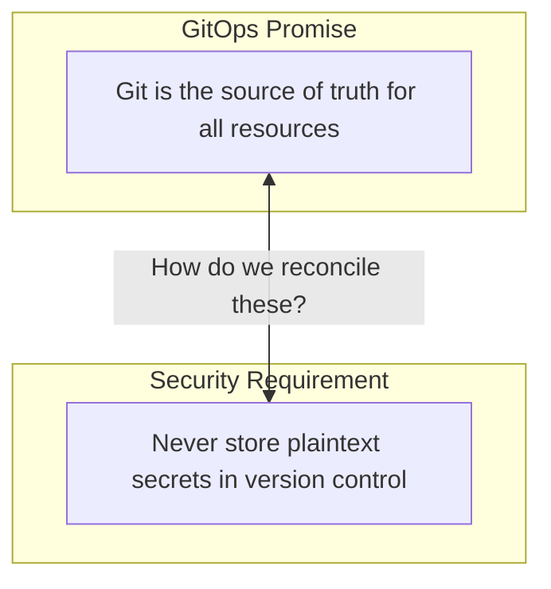
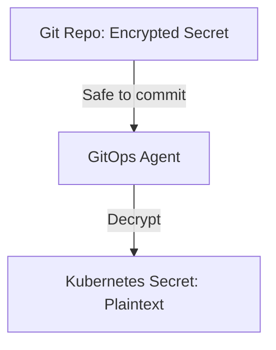
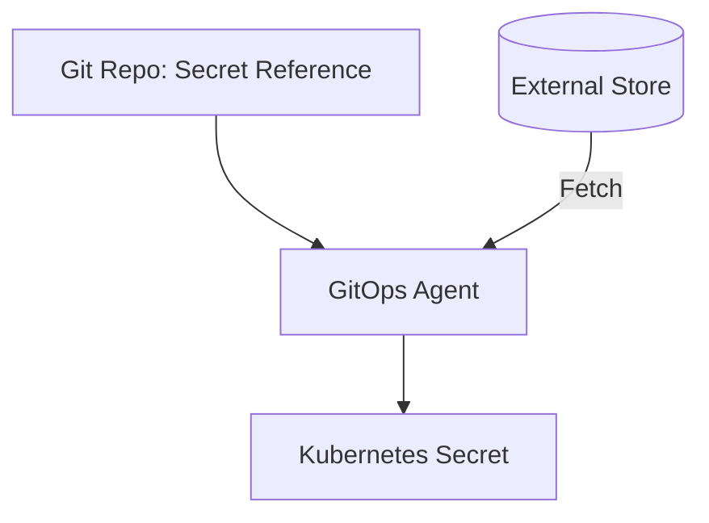
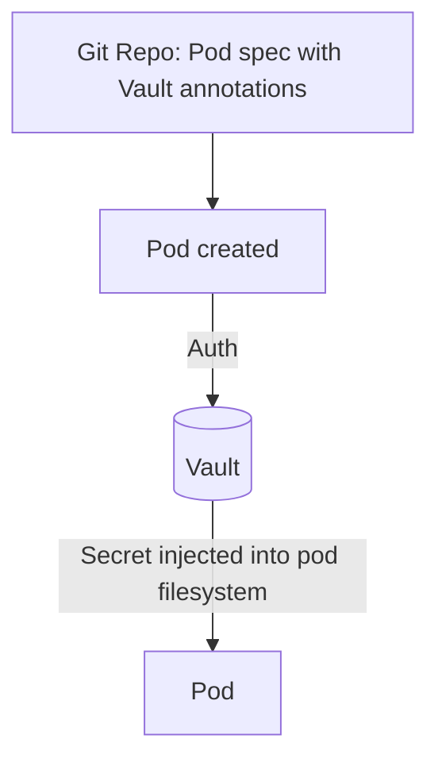
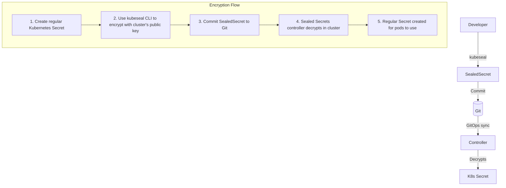
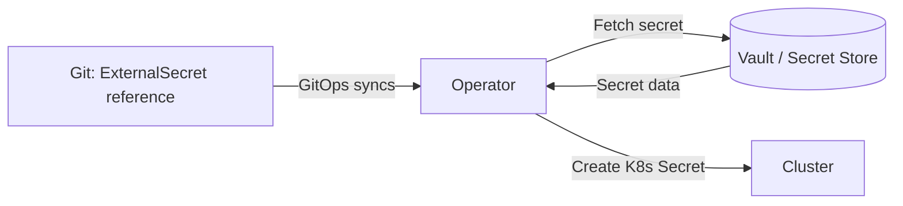

> **Discipline Module** | Complexity: `[COMPLEX]` | Time: 35-40 min

## Prerequisites

Before starting this module:
- **Required**: [Module 3.1: What is GitOps?](../module-3.1-what-is-gitops/) — GitOps fundamentals
- **Required**: [Security Principles Track](/platform/foundations/security-principles/) — Security fundamentals
- **Recommended**: Understanding of Kubernetes Secrets
- **Helpful**: Basic cryptography concepts (encryption, keys)

> **Stop and think**: How are you currently managing secrets in your non-GitOps deployments? Do developers have direct access to production credentials?

---

## What You'll Be Able to Do

After completing this module, you will be able to:

- **Design a secrets management strategy that keeps sensitive data out of Git while maintaining GitOps workflows**
- **Implement Sealed Secrets, SOPS, or External Secrets Operator for encrypted secret storage in Git**
- **Evaluate secrets management tools against security requirements — rotation, auditing, access control**
- **Build secret rotation workflows that update credentials without service disruption**

## Why This Module Matters

GitOps says: "Everything in Git."

Security says: "Never commit secrets."

**This is the GitOps secrets problem.**

If you can't put secrets in Git, how do you manage them with GitOps? This isn't a minor inconvenience — it's a fundamental challenge that every GitOps adoption must solve.

Get it wrong:
- Secrets in Git history (forever)
- Security breaches
- Compliance violations
- Lost credentials

Get it right:
- Secrets managed declaratively
- Full GitOps workflow preserved
- Audit trail maintained
- Security enhanced

This module shows you the patterns and tools for handling secrets in GitOps.

---

## The Secrets Problem

### Why You Can't Just Commit Secrets

```yaml
# DON'T DO THIS - Ever
apiVersion: v1
kind: Secret
metadata:
  name: database-credentials
type: Opaque
data:
  username: YWRtaW4=      # base64 of "admin"
  password: cGFzc3dvcmQ=  # base64 of "password123"
```

**Problems:**

1. **Git history is forever**: Even if you delete, it's in history
2. **Base64 is not encryption**: Anyone can decode it
3. **Repository access = secret access**: Everyone with repo access sees secrets
4. **Leaked to forks**: Forks get the secrets too
5. **Compliance violations**: Many regulations forbid this

### The GitOps Secret Dilemma



---

## Solution Categories

Three main approaches to GitOps secrets:

### 1. Encrypt Secrets in Git

Store encrypted secrets in Git. Decrypt at deploy time.

**Tools**: Sealed Secrets, SOPS, git-crypt



### 2. Reference External Secrets

Store secrets in external manager. Reference them in Git.

**Tools**: External Secrets Operator, Secrets Store CSI Driver



### 3. Inject at Runtime

Don't put secrets in Kubernetes at all. Inject directly to pods.

**Tools**: Vault Agent, Secrets Store CSI Driver (mounted)



> **Pause and predict**: Based on these three approaches, which one introduces the tightest coupling between your Kubernetes cluster and your cloud provider's IAM?

---

## Pattern 1: Sealed Secrets

The most GitOps-native solution. Secrets encrypted before Git, decrypted in cluster.

### How It Works



### Installing Sealed Secrets

```bash
# Add controller to cluster (Ensure compatibility with Kubernetes v1.35+)
kubectl apply -f https://github.com/bitnami-labs/sealed-secrets/releases/download/v0.27.3/controller.yaml

# Install kubeseal CLI
brew install kubeseal  # macOS
# or download from GitHub releases
```

### Creating a Sealed Secret

```bash
# 1. Create regular secret (don't commit this!)
kubectl create secret generic db-creds \
  --from-literal=username=admin \
  --from-literal=password=supersecret \
  --dry-run=client -o yaml > secret.yaml

# 2. Seal it
kubeseal --format yaml < secret.yaml > sealed-secret.yaml

# 3. Delete plaintext
rm secret.yaml

# 4. Commit sealed secret
cat sealed-secret.yaml
```

### Sealed Secret YAML

```yaml
apiVersion: bitnami.com/v1alpha1
kind: SealedSecret
metadata:
  name: db-creds
  namespace: default
spec:
  encryptedData:
    # These are encrypted - safe to commit
    username: AgBy8hC7...long encrypted string...
    password: AgCtr4Hx...long encrypted string...
  template:
    metadata:
      name: db-creds
    type: Opaque
```

### Pros and Cons

**Pros:**
- True GitOps: encrypted secrets in Git
- Simple workflow
- Controller handles decryption
- Works with any GitOps tool

**Cons:**
- Cluster-specific encryption (can't share between clusters)
- Key management (backup the sealing key!)
- Rotation requires re-sealing

---

## Pattern 2: SOPS (Secrets OPerationS)

Encrypt specific values within YAML files, not entire files.

### How It Works

```yaml
# Original file (secret-values.yaml)
database:
  username: admin
  password: supersecret  # This needs encryption

# After SOPS encryption
database:
  username: admin
  password: ENC[AES256_GCM,data:...,type:str]

sops:
  kms:
    - arn: arn:aws:kms:...
      created_at: "2024-01-15T10:00:00Z"
      enc: ...
```

### Using SOPS

```bash
# Install
brew install sops

# Configure with AWS KMS (or GCP KMS, Azure Key Vault, PGP)
export SOPS_KMS_ARN="arn:aws:kms:us-east-1:123456789:key/abc-123"

# Encrypt a file
sops -e secrets.yaml > secrets.enc.yaml

# Decrypt (for viewing/editing)
sops -d secrets.enc.yaml

# Edit in place (decrypts, opens editor, re-encrypts)
sops secrets.enc.yaml
```

### SOPS with GitOps

**Flux native SOPS support:**

```yaml
# Kustomization with SOPS decryption
apiVersion: kustomize.toolkit.fluxcd.io/v1
kind: Kustomization
metadata:
  name: my-app
spec:
  decryption:
    provider: sops
    secretRef:
      name: sops-age  # Age key for decryption
```

**ArgoCD with SOPS plugin:**

```yaml
# argocd-cm ConfigMap
data:
  configManagementPlugins: |
    - name: kustomize-sops
      generate:
        command: ["sh", "-c"]
        args: ["kustomize build . | sops -d /dev/stdin"]
```

### Pros and Cons

**Pros:**
- Partial encryption (see structure, hide values)
- Multi-cloud KMS support
- Can work across clusters
- Mature, widely used

**Cons:**
- Requires KMS access from cluster
- More complex setup
- GitOps tool integration needed

---

## Pattern 3: External Secrets Operator

Don't store secrets in Git at all. Reference them.

### How It Works

```yaml
# This goes in Git - just a reference
apiVersion: external-secrets.io/v1beta1
kind: ExternalSecret
metadata:
  name: db-creds
spec:
  refreshInterval: 1h
  secretStoreRef:
    kind: ClusterSecretStore
    name: vault-backend
  target:
    name: db-creds  # K8s Secret to create
  data:
    - secretKey: username
      remoteRef:
        key: database/creds
        property: username
    - secretKey: password
      remoteRef:
        key: database/creds
        property: password
```



### Supported Backends

External Secrets Operator supports:
- AWS Secrets Manager
- Azure Key Vault
- Google Secret Manager
- HashiCorp Vault
- 1Password
- And many more

### Setting Up ESO

```bash
# Install ESO
helm repo add external-secrets https://charts.external-secrets.io
helm install external-secrets external-secrets/external-secrets

# Create SecretStore (example: AWS Secrets Manager)
kubectl apply -f - <<EOF
apiVersion: external-secrets.io/v1beta1
kind: ClusterSecretStore
metadata:
  name: aws-secrets-manager
spec:
  provider:
    aws:
      service: SecretsManager
      region: us-east-1
      auth:
        jwt:
          serviceAccountRef:
            name: external-secrets
            namespace: external-secrets
EOF
```

### Pros and Cons

**Pros:**
- No secrets in Git at all
- Central secret management
- Automatic rotation
- Multi-cluster friendly

**Cons:**
- Dependency on external system
- More moving parts
- Requires secret store setup

---

## Try This: Choose Your Approach

Answer these questions to help choose:

```
1. Do you already have a secrets manager (Vault, AWS SM, etc.)?
   [ ] Yes -> Consider External Secrets Operator
   [ ] No -> Sealed Secrets or SOPS

2. How many clusters do you have?
   [ ] One -> Sealed Secrets is simple
   [ ] Many -> SOPS or External Secrets (shareable)

3. Who manages secrets?
   [ ] Same team as infrastructure -> Any approach
   [ ] Security team separately -> External Secrets (separation)

4. Do you need secrets in Git history for audit?
   [ ] Yes -> Sealed Secrets or SOPS
   [ ] No -> External Secrets

5. Cloud provider preference?
   [ ] AWS/GCP/Azure -> Use their KMS with SOPS
   [ ] Multi-cloud -> Vault + External Secrets
   [ ] On-prem -> Sealed Secrets or Vault
```

---

## Did You Know?

1. **GitHub scans for secrets** in commits and will alert you (and potentially revoke them if from known providers). This is a last-resort safety net, not a security strategy.

2. **The Sealed Secrets controller key is the crown jewel**. If you lose it, you lose all secrets. If it's leaked, all encrypted secrets are compromised. Back it up securely.

3. **SOPS was created by Mozilla** for their internal infrastructure. It's designed for GitOps-style workflows from the start.

4. **GitGuardian's 2023 report** found over 10 million secrets exposed in public GitHub commits that year alone. The most common: API keys, database credentials, and cloud provider secrets. Prevention beats detection every time.

---

## War Story: The Secret That Lived in Git Forever

A team I worked with made a common mistake:

**The Incident:**

Day 1: New developer commits a Secret with database credentials
Day 2: Reviewer catches it, asks to remove
Day 3: Developer deletes the file and commits
Day 30: Security audit finds the secret in git history

```bash
# The secret is still there!
git log --all --full-history -- secrets/database.yaml
git show abc123:secrets/database.yaml  # There it is
```

**The Damage:**

- Credentials had to be rotated immediately
- Database briefly inaccessible during rotation
- Git history couldn't be easily cleaned (forks, clones, backups)
- Compliance audit failed

**The Fix (Painful):**

1. Rotate all exposed credentials
2. BFG Repo Cleaner to rewrite history
3. Force push (broke everyone's clones)
4. Notify all fork owners
5. Invalidate CI caches

**Prevention:**

```yaml
# Pre-commit hook (.pre-commit-config.yaml)
repos:
  - repo: https://github.com/Yelp/detect-secrets
    rev: v1.4.0
    hooks:
      - id: detect-secrets

# GitHub secret scanning
# (enabled by default on public repos)

# Sealed Secrets for all K8s secrets
# (never commit plain Secrets)
```

**Lesson:** The only safe approach is preventing secrets from ever entering Git. All other solutions are damage control.

---

## Secret Rotation

Managing secrets isn't just about storage — rotation is critical.

### Why Rotate?

- Credentials may be compromised
- Compliance requirements
- Employee departures
- Limiting exposure time

### Rotation with Sealed Secrets

```bash
# Manual rotation process
# 1. Create new secret
kubectl create secret generic db-creds \
  --from-literal=username=admin \
  --from-literal=password=NEW_PASSWORD \
  --dry-run=client -o yaml > secret.yaml

# 2. Seal it
kubeseal --format yaml < secret.yaml > sealed-secret.yaml

# 3. Commit and push
git add sealed-secret.yaml
git commit -m "Rotate database credentials"
git push

# 4. GitOps syncs, pods get new secret
# (may need pod restart depending on how secrets are consumed)
```

### Rotation with External Secrets

```yaml
apiVersion: external-secrets.io/v1beta1
kind: ExternalSecret
metadata:
  name: db-creds
spec:
  refreshInterval: 1h  # Automatically fetches new values
  # ... rest of spec
```

Rotation happens in the external store. ESO picks up changes automatically.

### Rotation Patterns

| Pattern | Pros | Cons |
|---------|------|------|
| **Manual rotation** | Full control | Human effort, error-prone |
| **Scheduled rotation** | Regular, predictable | May rotate unnecessarily |
| **Event-driven** | Rotate when needed | Needs triggering mechanism |
| **Automatic (ESO)** | Hands-off | Depends on external store |

---

## Common Mistakes

| Mistake | Problem | Solution |
|---------|---------|----------|
| Committing plain secrets | In history forever | Use Sealed Secrets, SOPS, or ESO |
| Base64 = encryption | False security | Base64 is encoding, not encryption |
| Not backing up sealing key | Lose all secrets if lost | Secure backup of controller key |
| Same secrets all environments | One compromise = all compromised | Different secrets per environment |
| No rotation process | Stale, potentially leaked secrets | Implement rotation |
| Secrets in ConfigMaps | "It's not really a secret" | If sensitive, use Secrets |

---

## Quiz: Check Your Understanding

### Question 1
Your junior developer just committed a Kubernetes Secret to the repository. They assure you it is secure because the database password is "encrypted" using base64. How do you explain to them that this represents a critical security vulnerability?

<details>
<summary>Show Answer</summary>

Base64 is a data encoding scheme, not an encryption algorithm. Its purpose is to safely transport binary data across text-based protocols, meaning anyone with access to the repository can instantly decode the string using standard command-line tools without needing a decryption key. True encryption requires a cryptographic key to both scramble and unscramble the data, making it computationally infeasible to read without authorization. Because Git history is permanent, that base64-encoded secret is now compromised forever, even if you delete the file in a subsequent commit. You must immediately rotate the database password and implement a proper secrets management solution.

</details>

### Question 2
You are architecting a multi-region deployment across 5 Kubernetes v1.35 clusters. You have a single configuration repository and want to reuse the exact same encrypted database credentials across all environments without having to encrypt the file 5 separate times. Which secrets management strategy should you implement, and why?

<details>
<summary>Show Answer</summary>

For a multi-cluster setup sharing the exact same secret, SOPS or the External Secrets Operator are the optimal choices. Sealed Secrets uses a unique asymmetric key pair generated per cluster, meaning a secret sealed for the US-East cluster cannot be decrypted by the EU-West cluster unless you manually synchronize their sealing keys (which is a security risk). SOPS solves this by encrypting the secret against a centralized Key Management Service (KMS), allowing any cluster with the correct IAM role to decrypt the single file. Alternatively, the External Secrets Operator allows you to store the secret once in a central vault and simply commit references to it, enabling all 5 clusters to fetch the credential dynamically.

</details>

### Question 3
A database administrator rotates a compromised password in AWS Secrets Manager. The External Secrets Operator in your cluster successfully detects this change and updates the underlying Kubernetes Secret. However, five minutes later, your application begins throwing authentication errors. What is causing this failure, and how can you fix it?

<details>
<summary>Show Answer</summary>

The failure occurs because standard Kubernetes Pods do not automatically reload environment variables or files when the underlying Secret resource changes. The External Secrets Operator did its job by updating the Kubernetes Secret, but the application is still holding the old password in memory from when it first started. To resolve this without manual intervention, you must implement a mechanism to restart the pods or notify the application of the change. Common solutions include using a tool like Reloader to automatically restart deployments when their Secrets change, or refactoring the application to dynamically watch its mounted secret files for modifications.

</details>

### Question 4
A cluster node failure leads to the loss of your Sealed Secrets controller's private key. You have 50 SealedSecrets committed to your Git repository, but you did not configure a backup for the controller's key. The infrastructure team asks how long it will take to recover the secrets. What must you tell them, and what steps are required to restore service?

<details>
<summary>Show Answer</summary>

You must tell the infrastructure team that the existing encrypted secrets are permanently lost and cannot be recovered under any circumstances. Sealed Secrets relies on standard asymmetric cryptography; without the private key, the ciphertexts in your Git repository are mathematically impossible to decrypt. To restore service, you will need to manually regenerate or retrieve every single plaintext password, API key, and certificate from their original sources (like password managers or database consoles). Once gathered, you must seal them again using the new controller's public key, commit the new SealedSecrets to Git, and implement a secure backup process for the new controller key to prevent this from happening again.

</details>

---

## Hands-On Exercise: Implement GitOps Secrets

Set up secrets management for a GitOps workflow.

### Scenario

You have a Kubernetes application that needs:
- Database credentials (username, password)
- API key for external service
- TLS certificate

### Part 1: Choose Your Approach

Based on your environment:

```markdown
## My Environment

- Number of clusters: ___
- Existing secret manager: [ ] None [ ] Vault [ ] AWS SM [ ] Other: ___
- Team managing secrets: [ ] Same as infra [ ] Security team

## Chosen Approach

[ ] Sealed Secrets
[ ] SOPS with ___ (KMS provider)
[ ] External Secrets with ___ (backend)

Rationale:
_______________________________________________
```

### Part 2: Implementation

For Sealed Secrets:

```bash
# Install controller
kubectl apply -f ___

# Create and seal database secret
kubectl create secret generic db-creds \
  --from-literal=username=___ \
  --from-literal=password=___ \
  --dry-run=client -o yaml | kubeseal --format yaml > ___

# Create and seal API key
___

# Create and seal TLS cert
___
```

For External Secrets:

```yaml
# ClusterSecretStore (configure your backend)
apiVersion: external-secrets.io/v1beta1
kind: ClusterSecretStore
metadata:
  name: ___
spec:
  provider:
    ___: # Your provider config

---
# ExternalSecret for database
apiVersion: external-secrets.io/v1beta1
kind: ExternalSecret
metadata:
  name: db-creds
spec:
  secretStoreRef:
    name: ___
    kind: ClusterSecretStore
  target:
    name: db-creds
  data:
    - secretKey: ___
      remoteRef:
        key: ___
```

### Part 3: Verification

```bash
# Verify secrets are created in cluster
kubectl get secrets

# Verify application can access secrets
kubectl exec -it deploy/my-app -- env | grep DB_
```

### Part 4: Document Rotation Process

```markdown
## Secret Rotation Runbook

### When to Rotate
- [ ] Scheduled: Every ___ days
- [ ] On employee departure
- [ ] On suspected compromise

### Rotation Steps

1. Generate new credential
   ```bash
   ___
   ```

2. Update in secrets management
   ```bash
   ___
   ```

3. Verify propagation
   ```bash
   ___
   ```

4. Restart affected workloads (if needed)
   ```bash
   ___
   ```

5. Verify application works
   ```bash
   ___
   ```
```

### Success Criteria

- [ ] Chose approach with documented rationale
- [ ] Implemented at least one secret (database or API key)
- [ ] Verified secret is accessible in cluster
- [ ] Documented rotation process

---

## Key Takeaways

1. **Never commit plaintext secrets**: Git history is forever
2. **Three main patterns**: Encrypt in Git, reference external, inject at runtime
3. **Sealed Secrets**: Simple, cluster-specific, good for single-cluster
4. **SOPS**: Flexible, multi-cluster, needs KMS setup
5. **External Secrets Operator**: Central management, best for existing secret stores
6. **Always have rotation process**: Secrets are not set-and-forget

---

## Further Reading

**Documentation**:
- **Sealed Secrets** — github.com/bitnami-labs/sealed-secrets
- **SOPS** — github.com/getsops/sops
- **External Secrets Operator** — external-secrets.io

**Articles**:
- **"Managing Kubernetes Secrets"** — Various tech blogs
- **"GitOps Secret Management"** — Weaveworks

**Tools**:
- **detect-secrets**: Secret detection for pre-commit
- **gitleaks**: Audit git repos for secrets
- **truffleHog**: Find secrets in git history

---

## Summary

Secrets in GitOps is a solved problem — but you must explicitly solve it.

Choose based on your needs:
- **Sealed Secrets**: Simple, GitOps-native, single cluster
- **SOPS**: Flexible, multi-cluster, uses existing KMS
- **External Secrets**: Central management, existing secret stores

All approaches share the goal: keep plaintext secrets out of Git while maintaining GitOps workflows.

---

## Next Module

Continue to [Module 3.6: Multi-Cluster GitOps](../module-3.6-multi-cluster/) to learn how to manage multiple clusters with GitOps.

---

*"The best secret management is when developers never touch secrets directly."* — Security Wisdom