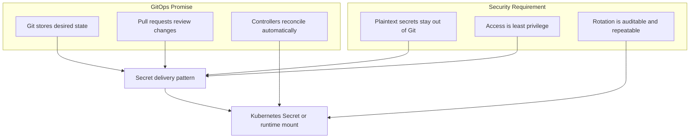
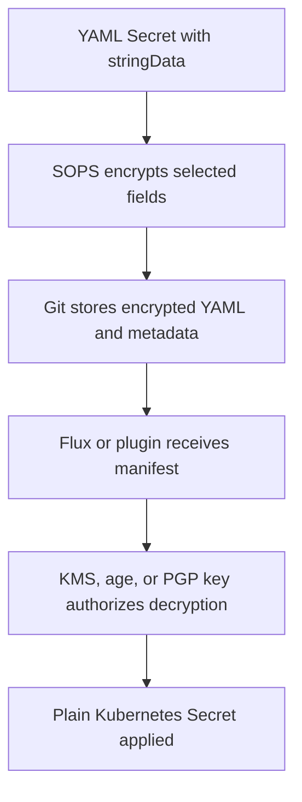
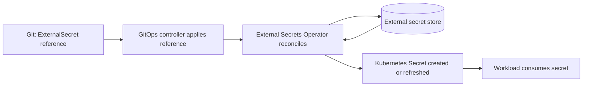
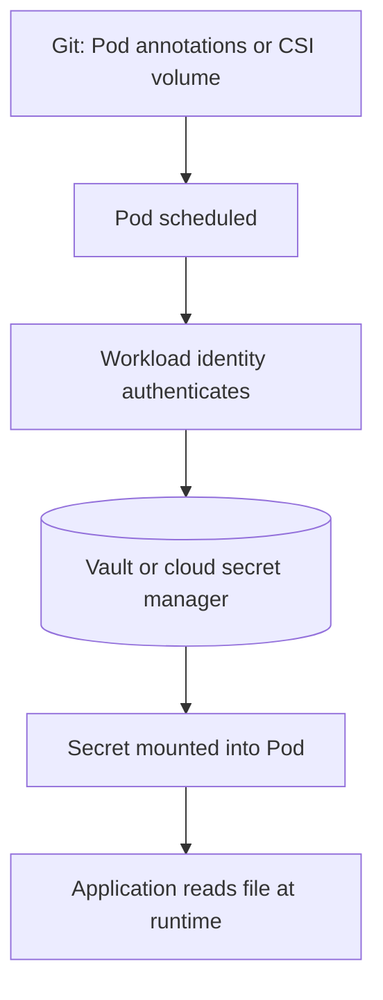
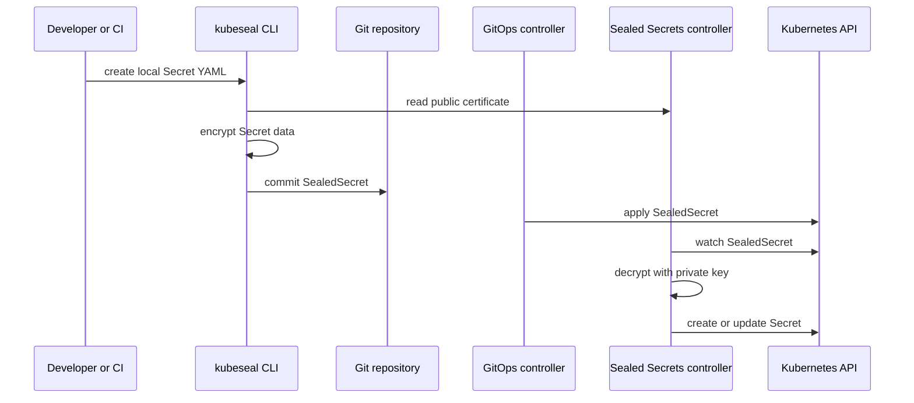
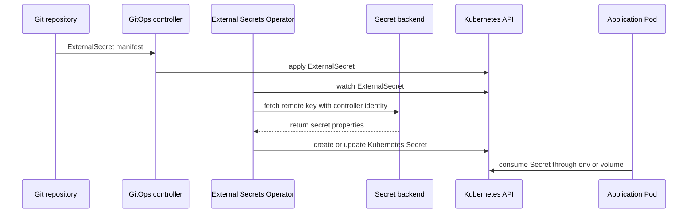
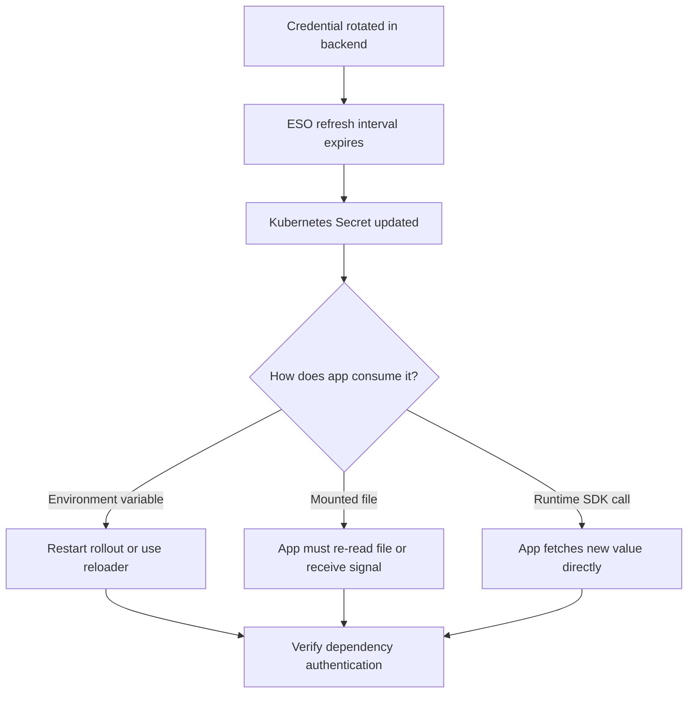

> **Discipline Module** | Complexity: `[COMPLEX]` | Time: 55-70 min

## Prerequisites

Before starting this module, you should be comfortable with the GitOps reconciliation model from
[Module 3.1: What is GitOps?](../module-3.1-what-is-gitops/) and the basic Kubernetes `Secret`
resource. You do not need to be a cryptography specialist, but you should know the difference between
encoding, encryption, identity, and authorization because GitOps secret workflows combine all four.

You will also get more from this module if you have seen a GitOps controller such as Flux or Argo CD
apply manifests from a repository. The examples use `kubectl` once, then use `k` as the shorter alias
for the rest of the module. In your own shell, run `alias k=kubectl` before copying the later commands.

```bash
alias k=kubectl
```

The practical examples assume Kubernetes v1.35 or newer, a working cluster, and local CLIs for the
tools you choose to test. When a command creates sample credentials, the values are deliberately fake
and should never be reused outside a disposable learning environment.

---

## Learning Outcomes

After completing this module, you will be able to:

- **Design** a GitOps secret management strategy that keeps plaintext values out of Git while preserving
  reviewable, declarative delivery workflows.
- **Compare** Sealed Secrets, SOPS, and External Secrets Operator against multi-cluster, audit, rotation,
  and team ownership requirements.
- **Implement** end-to-end workflows for Sealed Secrets, SOPS, and External Secrets Operator, including
  installation, manifest authoring, Git safety checks, reconciliation, and verification.
- **Debug** failed secret delivery by tracing where responsibility moves between Git, the GitOps controller,
  the secret controller, the external store, and the workload.
- **Evaluate** rotation procedures for operational risk, including application reload behavior, key backup,
  least-privilege access, and incident response.

---

## Why This Module Matters

At 02:10 on a release night, a platform engineer watches a payment service fail its rollout because the
new Pods cannot authenticate to the database. The deployment manifest came from Git, the image passed
all tests, and the GitOps controller reports that synchronization completed. The problem sits in the gap
between two policies that both sound reasonable: every runtime dependency should be declared in Git, and
no secret should ever be committed to Git.

That gap is not a documentation problem; it is an architecture problem. If the team solves it casually,
repository access becomes production credential access, forks and caches inherit sensitive values, and
incident response becomes a painful search through history that cannot be completely erased. If the team
solves it carefully, Git still carries the desired state, reviewers can reason about what changed, security
teams can retain ownership of sensitive material, and applications receive credentials through repeatable
automation instead of private messages and manual commands.

This module teaches the decision process behind GitOps secrets rather than treating tools as magic. You
will first learn the boundary that must never be crossed, then compare the three dominant patterns, then
walk through complete procedures for Sealed Secrets, SOPS, and External Secrets Operator. By the end, you
should be able to choose a tool for a real organization and explain what breaks when one layer is misconfigured.

---

## 1. The GitOps Secret Boundary

GitOps works because Git stores desired state, controllers continuously compare that desired state with
cluster state, and drift is corrected by automation. Secrets create tension because the same repository
that makes configuration reviewable can also make sensitive values widely readable. The goal is not to
hide the existence of a secret; the goal is to make the secret delivery mechanism explicit while keeping
the plaintext value outside the repository.

A Kubernetes `Secret` object is not automatically safe to commit. The `data` field is base64 encoded so
binary values can fit into YAML, but base64 is reversible without any key. Anyone who can read the commit
can decode the value, and anyone who can read old commits can decode values that were later removed. In
GitOps, the damage can spread further because mirrored repositories, local clones, CI logs, pull request
patches, and artifact caches may all retain the original content.

```yaml
apiVersion: v1
kind: Secret
metadata:
  name: database-credentials
  namespace: payments
type: Opaque
data:
  username: YXBw
  password: ZG8tbm90LXVzZS10aGlzLXBhc3N3b3Jk
```

This object looks official because it is valid Kubernetes YAML, but it is still a plaintext secret for
security purposes. The password can be decoded with a standard tool, and no cryptographic authorization
decision happens during that decoding. The correct review comment on a pull request containing this file
is not "please encrypt this later"; it is "treat this value as compromised, rotate it, and prevent the
same mistake from recurring."

```bash
printf '%s' 'ZG8tbm90LXVzZS10aGlzLXBhc3N3b3Jk' | base64 --decode
```

The boundary can be summarized as a responsibility split. Git may contain secret metadata, encrypted
ciphertext, references to external secret records, and controller configuration. Git must not contain
plaintext passwords, private keys, service tokens, or credentials that can be used directly against a
production dependency.



The secret boundary is easier to reason about when you separate "what the application needs" from "where
the sensitive bytes live." An application may need a database password named `DB_PASSWORD`. The plaintext
bytes may live in a cloud secret manager, in an encrypted SOPS document, or behind a Sealed Secrets private
key. The GitOps repository should show enough structure for reviewers to understand the dependency without
revealing the sensitive value itself.

```ascii
+-------------------------+        +--------------------------+        +-------------------------+
| Git repository          |        | Secret delivery control  |        | Runtime consumer        |
|-------------------------|        |--------------------------|        |-------------------------|
| Name: db-creds          | -----> | decrypts or fetches      | -----> | Pod reads DB_PASSWORD   |
| Namespace: payments     |        | writes Kubernetes Secret |        | app connects to DB      |
| Ciphertext or reference |        | enforces identity checks |        | restarts when required  |
+-------------------------+        +--------------------------+        +-------------------------+
```

> **Pause and decide:** If a developer can review application manifests but should not know production
> database passwords, which part of the diagram should they be allowed to read, and which part should
> require a separate authorization path?

A mature platform treats secret delivery as a first-class deployment concern. The workflow must answer
who can create secrets, who can approve references, which controller has decryption or fetch permissions,
how changes are audited, and how workloads respond when values rotate. Tool selection matters, but the
operating model around the tool matters just as much.

---

## 2. Choosing Among the Three GitOps Secret Patterns

Most GitOps secret designs fall into three patterns. You can encrypt a Kubernetes Secret before committing
it, encrypt selected values in a YAML file with a key management system, or commit only a reference to a
record stored in an external secret manager. Each pattern can be secure, but each pattern gives ownership
and failure modes to different teams.

The first pattern is encrypted secrets in Git. The repository contains ciphertext, the GitOps controller
applies that ciphertext, and an in-cluster controller turns it into a normal Kubernetes Secret. Sealed
Secrets is the common example. This pattern feels very GitOps-native because the secret object itself is
represented in the repository, but it often binds ciphertext to a specific cluster key.


The second pattern is encrypted values in Git. SOPS encrypts fields inside YAML, JSON, dotenv, or other
structured files while preserving enough document shape for humans to review. The decryption key is held
by a KMS, an age key, or PGP, and the GitOps controller or a plugin decrypts just before applying the
manifest. This pattern is strong for multi-cluster repositories because encryption can be tied to an
organization-level key rather than a single cluster controller key.



The third pattern is external references. The repository contains an `ExternalSecret` object or similar
reference, and a controller fetches the real value from AWS Secrets Manager, Azure Key Vault, Google Secret
Manager, HashiCorp Vault, 1Password, or another backend. This pattern often fits organizations where a
security team already owns a central secret platform and application teams should only declare which
runtime secret they need.



There is also a runtime injection pattern, where the application does not receive a Kubernetes Secret at
all. A sidecar, CSI driver, or agent authenticates to a secret store and mounts values directly into the
Pod filesystem. This can reduce Kubernetes Secret exposure, but it also increases coupling between workload
identity, node behavior, and the external secret system. It is useful, but it is not the first pattern to
teach because it moves more operational complexity into runtime.



| Requirement | Sealed Secrets | SOPS | External Secrets Operator |
|---|---|---|---|
| Single cluster with small platform team | Strong fit because setup is simple and Git contains encrypted Kubernetes-native objects | Usable, but key setup may be more than the team needs | Usable if a secret store already exists |
| Many clusters sharing one repository | Requires key coordination or re-sealing per cluster | Strong fit when clusters can decrypt through the same KMS or age policy | Strong fit when all clusters can reach the same backend |
| Security team owns secret values | Weaker fit because app or platform teams often seal values before commit | Medium fit if security owns KMS policy and review process | Strong fit because Git contains references while security owns backend records |
| Need to review object shape in pull requests | Good because the target Secret template is visible | Good because SOPS can leave non-sensitive structure visible | Good for references, weaker for reviewing exact generated Secret contents |
| Automatic rotation from central store | Manual or pipeline-driven re-sealing is required | Manual or pipeline-driven re-encryption is typical | Strong fit because the operator refreshes from backend changes |
| Disaster recovery key concern | Controller private key backup is critical | KMS or age key backup is critical | Backend recovery and controller identity are critical |

A senior decision is rarely "which tool is best." It is usually "which failure mode is acceptable for this
organization." Sealed Secrets fails hard if the controller private key is lost. SOPS fails if decryption
identity is unavailable or too broadly granted. External Secrets Operator fails if the external backend,
network path, or workload identity is misconfigured. The right pattern is the one your team can operate
during a normal rotation and during an incident.

> **Predict before reading on:** In a company with one production cluster, no cloud KMS, and a small team
> that already reviews every manifest in Git, which pattern probably has the lowest operational burden?
> Now change the scenario to ten clusters and a central security team; what changes in your answer?

The rest of the module demonstrates all three primary patterns end to end. The goal is not to memorize
commands. The goal is to learn the handoff points: where plaintext exists briefly, where ciphertext is
committed, where identity is checked, where Kubernetes Secret objects appear, and where your application
might still need a restart.

---

## 3. Worked Example: Sealed Secrets from Plain Secret to Reconciled Secret

Sealed Secrets uses asymmetric encryption. The controller in the cluster owns a private key and exposes a
public key. A developer or pipeline uses the public key to encrypt a normal Kubernetes Secret into a
`SealedSecret` custom resource. Only the controller with the matching private key can decrypt it, so the
resulting YAML can be committed safely as ciphertext.

This workflow is approachable because it maps directly to the Kubernetes Secret object the application
will eventually consume. It also has a sharp operational edge: ciphertext sealed for one controller key
does not automatically work in another cluster. For one cluster, that isolation is often desirable. For
many clusters, it can become repeated work unless you intentionally manage keys and environments.



Start by installing the controller. The Helm installation below gives the controller a stable name so the
`kubeseal` command can find it consistently. In production, pin chart versions through your dependency
management process and document how the controller key is backed up.

```bash
helm repo add sealed-secrets https://bitnami-labs.github.io/sealed-secrets
helm repo update

helm upgrade --install sealed-secrets sealed-secrets/sealed-secrets \
  --namespace kube-system \
  --set-string fullnameOverride=sealed-secrets-controller
```

Verify that the controller is running before sealing anything. If this check fails, sealing may still work
with a cached certificate, but reconciliation will not produce the Kubernetes Secret your workload needs.

```bash
k -n kube-system rollout status deploy/sealed-secrets-controller
k -n kube-system get pods -l app.kubernetes.io/name=sealed-secrets
```

Create a namespace and a disposable working directory. The namespace matters because Sealed Secrets can be
scoped to a name and namespace; changing either later can make the ciphertext invalid depending on the
sealing scope you choose.

```bash
mkdir -p gitops-secrets-demo/sealed-secrets

k create namespace payments --dry-run=client -o yaml | k apply -f -
```

Now create a normal Secret locally, but do not commit it. This step is the dangerous moment in the workflow
because plaintext exists on disk. A careful pipeline writes it to a temporary location, seals it immediately,
and removes the plaintext file before any `git add` command can include it.

```bash
k -n payments create secret generic db-creds \
  --from-literal=username=app \
  --from-literal=password=sealed-demo-password \
  --dry-run=client -o yaml > /tmp/db-creds.yaml
```

Inspecting the local file is useful for learning, but it should also make you uncomfortable. The shape is
a valid Kubernetes Secret, and the sensitive value is only base64 encoded. The repository must never receive
this file.

```bash
sed -n '1,40p' /tmp/db-creds.yaml
```

Seal the Secret with the cluster controller's public key. The command reads the local plaintext Secret and
writes a `SealedSecret` manifest into the demo directory that represents what would go into Git.

```bash
kubeseal \
  --controller-name sealed-secrets-controller \
  --controller-namespace kube-system \
  --format yaml < /tmp/db-creds.yaml > gitops-secrets-demo/sealed-secrets/db-creds-sealed.yaml
```

Remove the plaintext file immediately. On some systems `shred` is not available or may not guarantee secure
deletion on modern filesystems, so the fallback removal is still included. The stronger control is process
discipline: plaintext should be short-lived, ignored by Git, and preferably generated in CI rather than
saved by hand.

```bash
shred -u /tmp/db-creds.yaml 2>/dev/null || rm -f /tmp/db-creds.yaml
```

Review the sealed manifest before applying it. You should see `kind: SealedSecret`, the target metadata,
and encrypted data values. You should not see the sample password or any directly usable credential.

```bash
sed -n '1,80p' gitops-secrets-demo/sealed-secrets/db-creds-sealed.yaml
grep -R "sealed-demo-password" gitops-secrets-demo/sealed-secrets || true
```

Apply the `SealedSecret` as a GitOps controller would. In a real repository, this step would be performed
by Flux, Argo CD, or another reconciler after a pull request is merged. For the worked example, applying
directly lets you isolate the secret controller behavior.

```bash
k apply -f gitops-secrets-demo/sealed-secrets/db-creds-sealed.yaml
```

Watch the controller create the normal Kubernetes Secret. The important debugging distinction is that the
GitOps controller applies the `SealedSecret`, but the Sealed Secrets controller creates the `Secret`. If
the first object exists and the second does not, inspect the Sealed Secrets controller logs and events.

```bash
k -n payments get sealedsecret db-creds
k -n payments get secret db-creds
k -n payments describe sealedsecret db-creds
```

Decode the generated Secret only in the disposable environment to prove the flow worked. In production,
you should avoid commands that print sensitive values to terminals, logs, or shell history unless you are
inside a controlled break-glass procedure.

```bash
k -n payments get secret db-creds \
  -o jsonpath='{.data.password}' | base64 --decode

printf '\n'
```

A workload can now consume the Secret like any other Kubernetes Secret. The application does not know
that Sealed Secrets was involved; it only sees a normal `Secret` named `db-creds` in its namespace.

```yaml
apiVersion: apps/v1
kind: Deployment
metadata:
  name: payments-api
  namespace: payments
spec:
  replicas: 2
  selector:
    matchLabels:
      app: payments-api
  template:
    metadata:
      labels:
        app: payments-api
    spec:
      containers:
        - name: app
          image: nginx:1.27
          env:
            - name: DB_USERNAME
              valueFrom:
                secretKeyRef:
                  name: db-creds
                  key: username
            - name: DB_PASSWORD
              valueFrom:
                secretKeyRef:
                  name: db-creds
                  key: password
```

The production review checklist for Sealed Secrets should focus on controller key custody. If the private
key is lost, existing sealed manifests cannot be decrypted. If the private key is leaked, ciphertext in
Git can be decrypted by the attacker. That means backup, restore testing, access control, and key rotation
are not optional operational tasks.

```bash
k -n kube-system get secret -l sealedsecrets.bitnami.com/sealed-secrets-key
```

> **Active learning prompt:** Your team copied a `SealedSecret` from `dev` into the `prod` overlay and the
> `Secret` never appears. Before blaming the GitOps controller, what three facts would you check about the
> target name, namespace, and controller key?

A common Sealed Secrets rotation flow is manual but explicit. Generate a new credential, seal it with the
same name and namespace, merge the changed ciphertext, verify the controller updates the `Secret`, then
restart workloads if they read the value from environment variables. The secret object may update quickly,
but the application process may not re-read it.

```bash
k -n payments create secret generic db-creds \
  --from-literal=username=app \
  --from-literal=password=sealed-rotated-password \
  --dry-run=client -o yaml > /tmp/db-creds-rotated.yaml

kubeseal \
  --controller-name sealed-secrets-controller \
  --controller-namespace kube-system \
  --format yaml < /tmp/db-creds-rotated.yaml > gitops-secrets-demo/sealed-secrets/db-creds-sealed.yaml

shred -u /tmp/db-creds-rotated.yaml 2>/dev/null || rm -f /tmp/db-creds-rotated.yaml
k apply -f gitops-secrets-demo/sealed-secrets/db-creds-sealed.yaml
k -n payments rollout restart deploy/payments-api
```

Sealed Secrets is a strong default when you need a straightforward Git-native workflow for one cluster or
a small number of independently managed clusters. It becomes less attractive when the same secret must be
shared across many clusters, when security teams require central secret ownership, or when automatic
rotation from an external source is a hard requirement.

---

## 4. Worked Example: SOPS with Age and GitOps Decryption

SOPS encrypts values inside structured files instead of wrapping the entire Kubernetes object in a custom
resource. That distinction matters for review. A pull request can still show `kind: Secret`, `metadata.name`,
labels, annotations, and non-sensitive structure while hiding the `data` or `stringData` values. Reviewers
can reason about where the secret will land without seeing the secret itself.

SOPS can use cloud KMS systems, PGP, or age keys. Cloud KMS is common in production because authorization
can be tied to IAM and audit logs. Age is excellent for local learning and smaller environments because it
is simpler to demonstrate. The workflow below uses age so the procedure is runnable without a cloud account,
then shows how Flux would receive the decryption key.

```ascii
+-----------------------------+
| SOPS file in Git            |
|-----------------------------|
| apiVersion: v1              |
| kind: Secret                |
| metadata.name: db-creds     |
| stringData.password: ENC[]  |
| sops metadata: recipients   |
+--------------+--------------+
               |
               v
+-----------------------------+
| GitOps decryption step      |
|-----------------------------|
| proves access to age/KMS key|
| produces normal Secret YAML |
+--------------+--------------+
               |
               v
+-----------------------------+
| Kubernetes API              |
|-----------------------------|
| stores Secret for workloads |
+-----------------------------+
```

Begin by installing the local tools. The package manager commands are examples for macOS, but the workflow
is the same on Linux when you install `sops` and `age` from your distribution or release binaries.

```bash
brew install sops age
```

Create an age key pair for the demo. The private key stays out of Git; the public recipient is safe to
place in SOPS configuration because it can encrypt but not decrypt. Treat the private key like any other
production secret.

```bash
age-keygen -o age.agekey
AGE_PUBLIC_KEY="$(grep '^# public key:' age.agekey | awk '{print $4}')"
printf '%s\n' "$AGE_PUBLIC_KEY"
```

Create a demo directory and a SOPS creation rule. This rule says that files ending in `.enc.yaml` should
encrypt the `data` and `stringData` fields using the age recipient you just generated. In production, the
same file often lists cloud KMS keys for separate environments or teams.

```bash
mkdir -p gitops-secrets-demo/sops

cat > gitops-secrets-demo/sops/.sops.yaml <<EOF
creation_rules:
  - path_regex: .*\\.enc\\.yaml$
    encrypted_regex: '^(data|stringData)$'
    age: ${AGE_PUBLIC_KEY}
EOF
```

Create a normal Kubernetes Secret manifest using `stringData`. This is readable and convenient before
encryption because Kubernetes accepts clear strings in `stringData` and converts them into `data` during
storage. Again, the plaintext file is a temporary input, not a file to commit.

```bash
cat > gitops-secrets-demo/sops/db-secret.yaml <<'EOF'
apiVersion: v1
kind: Secret
metadata:
  name: db-creds
  namespace: payments
type: Opaque
stringData:
  username: app
  password: sops-demo-password
EOF
```

Encrypt the file and remove the plaintext input. The resulting encrypted file is the artifact you would
commit to Git. Notice that the Kubernetes object shape remains visible while the selected secret fields
become encrypted `ENC[...]` values.

```bash
cd gitops-secrets-demo/sops

sops --encrypt --output db-secret.enc.yaml db-secret.yaml
rm -f db-secret.yaml

sed -n '1,120p' db-secret.enc.yaml
grep -R "sops-demo-password" . || true
```

Decrypt locally only to verify the learning flow. In a real GitOps system, the decryption should happen
inside a controlled controller process or plugin with narrowly scoped key access. Broadly distributing the
age private key to every developer would turn SOPS into weak process theater.

```bash
SOPS_AGE_KEY_FILE=../../age.agekey sops --decrypt db-secret.enc.yaml
```

Apply the decrypted manifest manually to prove that the encrypted file contains a valid Kubernetes Secret.
This simulates what a GitOps controller with decryption support does during reconciliation.

```bash
SOPS_AGE_KEY_FILE=../../age.agekey sops --decrypt db-secret.enc.yaml | k apply -f -

k -n payments get secret db-creds
```

Flux has native SOPS integration through the `Kustomization` resource. The controller needs the private
age key in a Kubernetes Secret, usually in the `flux-system` namespace. The Git repository still contains
only encrypted files; the controller receives decryption authority through cluster configuration.

```bash
k create namespace flux-system --dry-run=client -o yaml | k apply -f -

k -n flux-system create secret generic sops-age \
  --from-file=age.agekey=../../age.agekey \
  --dry-run=client -o yaml | k apply -f -
```

A Flux `Kustomization` can then declare SOPS decryption. The exact repository source is normally defined
elsewhere, so the important fields here are `decryption.provider: sops` and `secretRef.name: sops-age`.
Those fields tell Flux which mechanism and key material to use before applying the manifests.

```yaml
apiVersion: kustomize.toolkit.fluxcd.io/v1
kind: Kustomization
metadata:
  name: payments-secrets
  namespace: flux-system
spec:
  interval: 5m
  path: ./clusters/prod/payments
  prune: true
  sourceRef:
    kind: GitRepository
    name: platform-config
  decryption:
    provider: sops
    secretRef:
      name: sops-age
```

Argo CD can also use SOPS, usually through a config management plugin, an Argo CD Vault Plugin workflow,
or a sidecar that runs decryption before manifest generation. That integration must be designed carefully
because plugin execution becomes part of the trusted deployment path. The controller identity should decrypt
only the repositories and paths it is responsible for.

```yaml
apiVersion: v1
kind: ConfigMap
metadata:
  name: argocd-cm
  namespace: argocd
data:
  configManagementPlugins: |
    - name: kustomize-sops
      generate:
        command: ["sh", "-c"]
        args:
          - SOPS_AGE_KEY_FILE=/sops-age/age.agekey sops --decrypt secret.enc.yaml | kustomize build -
```

SOPS supports multi-recipient encryption. That is useful when one file should be decryptable by a production
KMS role and by a break-glass recovery key, or when separate clusters need different identities. Do not add
recipients casually, because every recipient is another path to plaintext. The recipient list should match
an explicit operational need.

```yaml
creation_rules:
  - path_regex: clusters/prod/.*\.enc\.yaml$
    encrypted_regex: '^(data|stringData)$'
    age: age1exampleprodrecipient000000000000000000000000000000
  - path_regex: clusters/stage/.*\.enc\.yaml$
    encrypted_regex: '^(data|stringData)$'
    age: age1examplestagerecipient000000000000000000000000000
```

> **Active learning prompt:** Suppose a pull request changes only the SOPS metadata block but not the
> Kubernetes `metadata.name` or encrypted value fields. What operational event might explain that change,
> and who should be required to review it?

Debugging SOPS failures requires locating the failure boundary. If the GitOps controller cannot decrypt,
you inspect key availability and IAM or age secret mounting. If decryption succeeds but apply fails, you
inspect the resulting Kubernetes YAML and admission errors. If apply succeeds but Pods fail, you inspect
application consumption and restart behavior.

```bash
SOPS_AGE_KEY_FILE=../../age.agekey sops --decrypt db-secret.enc.yaml >/tmp/db-secret.dec.yaml
k apply --dry-run=server -f /tmp/db-secret.dec.yaml
rm -f /tmp/db-secret.dec.yaml
```

SOPS is a strong fit when you need encrypted files that work across multiple clusters, when you already
have KMS-based access control, or when reviewers must see object structure in Git. Its biggest risk is
over-broad decryption access. If every engineer and every controller can decrypt every environment, the
ciphertext may be technically strong while the operating model remains weak.

---

## 5. Worked Example: External Secrets Operator with a Referenced Backend

External Secrets Operator changes the shape of the problem. Instead of committing ciphertext, you commit
a reference that says which external record should become which Kubernetes Secret. The sensitive value
lives in a backend such as Vault or a cloud secret manager, and the operator periodically refreshes the
cluster Secret from that backend.

This pattern is especially useful when security teams already own a central secret store. Application teams
can propose an `ExternalSecret` that names the runtime dependency, platform teams can review namespace and
workload behavior, and security teams can manage the actual credential lifecycle in the backend. The Git
repository shows intent without becoming the place where secret values are encrypted, rotated, or recovered.



Install the operator with Helm. In production, you should pin chart versions, configure metrics, and set
controller resource limits through your platform baseline. For the learning workflow, the default install
is enough to demonstrate reconciliation.

```bash
helm repo add external-secrets https://charts.external-secrets.io
helm repo update

helm upgrade --install external-secrets external-secrets/external-secrets \
  --namespace external-secrets \
  --create-namespace
```

Wait for the controller to become available. If the deployment is not healthy, applying `ExternalSecret`
objects will create custom resources but no Kubernetes Secrets will be written.

```bash
k -n external-secrets rollout status deploy/external-secrets
k get crd | grep external-secrets.io
```

Create the application namespace if you did not already create it during the Sealed Secrets example. The
`SecretStore` below is namespaced, which means only `ExternalSecret` objects in `payments` can reference it.
That scope is useful when each team has a separate backend identity or policy boundary.

```bash
k create namespace payments --dry-run=client -o yaml | k apply -f -
mkdir -p gitops-secrets-demo/eso
```

For a runnable local example, use the operator's fake provider. This provider is not a production backend;
it exists so you can learn the reconciliation shape without creating a cloud account or Vault server. In
production, replace the provider block with AWS Secrets Manager, Azure Key Vault, Google Secret Manager,
Vault, or another supported backend.

```yaml
apiVersion: external-secrets.io/v1beta1
kind: SecretStore
metadata:
  name: demo-fake-store
  namespace: payments
spec:
  provider:
    fake:
      data:
        - key: /payments/database
          value: '{"username":"app","password":"eso-demo-password"}'
          version: v1
```

Apply that `SecretStore` from a file. In a real GitOps repository, this store configuration might live in
a platform-owned path while application-owned `ExternalSecret` objects live closer to the service overlay.
That split lets different teams review the parts they own.

```bash
cat > gitops-secrets-demo/eso/secretstore.yaml <<'EOF'
apiVersion: external-secrets.io/v1beta1
kind: SecretStore
metadata:
  name: demo-fake-store
  namespace: payments
spec:
  provider:
    fake:
      data:
        - key: /payments/database
          value: '{"username":"app","password":"eso-demo-password"}'
          version: v1
EOF

k apply -f gitops-secrets-demo/eso/secretstore.yaml
```

Now create the `ExternalSecret`. This object says that the remote record `/payments/database` contains
properties named `username` and `password`, and those properties should become keys in a Kubernetes Secret
named `db-creds`. The `refreshInterval` controls how often the operator checks for changes.

```bash
cat > gitops-secrets-demo/eso/db-creds-externalsecret.yaml <<'EOF'
apiVersion: external-secrets.io/v1beta1
kind: ExternalSecret
metadata:
  name: db-creds
  namespace: payments
spec:
  refreshInterval: 1h
  secretStoreRef:
    name: demo-fake-store
    kind: SecretStore
  target:
    name: db-creds
    creationPolicy: Owner
  data:
    - secretKey: username
      remoteRef:
        key: /payments/database
        property: username
    - secretKey: password
      remoteRef:
        key: /payments/database
        property: password
EOF

k apply -f gitops-secrets-demo/eso/db-creds-externalsecret.yaml
```

Verify both the reference object and the generated Kubernetes Secret. If the `ExternalSecret` exists but
the target Secret does not, describe the `ExternalSecret` and check controller logs. The usual causes are
backend authentication failure, wrong remote key, wrong property name, or a controller that cannot reach
the backend.

```bash
k -n payments get secretstore demo-fake-store
k -n payments get externalsecret db-creds
k -n payments describe externalsecret db-creds
k -n payments get secret db-creds
```

Decode the value in the disposable environment to prove the path worked. In production, you would normally
verify through application health checks or controlled debugging instead of printing a password.

```bash
k -n payments get secret db-creds \
  -o jsonpath='{.data.password}' | base64 --decode

printf '\n'
```

External Secrets Operator makes rotation clean when the backend owns the credential. A database administrator
or automated rotation service updates the external record, ESO notices on its next refresh, and the Kubernetes
Secret changes. That does not guarantee the application process reloaded the value, so the platform still
needs an application reload strategy.



A production `SecretStore` for AWS Secrets Manager might look like the following. The manifest is still
safe for Git because it grants a controller identity permission to fetch named records; it does not contain
the secret value. You must still review the IAM role, trust policy, namespace scope, and allowed remote keys.

```yaml
apiVersion: external-secrets.io/v1beta1
kind: ClusterSecretStore
metadata:
  name: aws-secrets-manager
spec:
  provider:
    aws:
      service: SecretsManager
      region: us-east-1
      auth:
        jwt:
          serviceAccountRef:
            name: external-secrets
            namespace: external-secrets
```

A production `ExternalSecret` for that store would reference the backend record. This is the kind of manifest
an application team can own safely if policy controls restrict which remote paths are allowed. Without that
policy, a developer could accidentally or intentionally reference a secret belonging to another service.

```yaml
apiVersion: external-secrets.io/v1beta1
kind: ExternalSecret
metadata:
  name: db-creds
  namespace: payments
spec:
  refreshInterval: 30m
  secretStoreRef:
    kind: ClusterSecretStore
    name: aws-secrets-manager
  target:
    name: db-creds
    creationPolicy: Owner
  data:
    - secretKey: username
      remoteRef:
        key: prod/payments/database
        property: username
    - secretKey: password
      remoteRef:
        key: prod/payments/database
        property: password
```

> **Pause and troubleshoot:** ESO reports `SecretSynced=False`, but the GitOps controller says the
> application is synchronized. Which controller is healthy, which controller is failing, and where would
> you look first for evidence?

External Secrets Operator is the strongest fit when your organization already has a trusted secret backend,
separate security ownership, and a need for rotation that should not require Git commits. It is less attractive
when clusters cannot reliably reach the backend, when teams lack IAM discipline, or when the external secret
platform is less available than the applications depending on it.

---

## 6. Rotation, Reloading, and Operational Controls

Secret storage is only the first half of the problem. A credential that never rotates becomes a permanent
blast radius, but a credential that rotates without workload coordination causes outages. A GitOps secret
strategy must define how new values are introduced, how old values are retired, how applications reload,
and how the team proves that the new value is actually in use.

The most important operational distinction is the difference between updating a Kubernetes Secret object
and updating the application process. When a Pod reads a Secret as environment variables, those values are
captured when the container starts. Updating the Secret later does not change the running process. When a
Pod reads a Secret as a mounted volume, kubelet eventually updates the files, but the application still
must re-read them or receive a signal. Some applications support dynamic reload; many do not.

```ascii
+--------------------------+-----------------------------+-------------------------------+
| Consumption method       | Secret object update effect | Usual rotation action         |
+--------------------------+-----------------------------+-------------------------------+
| env.valueFrom            | Running process unchanged   | Restart Pods after update     |
| mounted Secret volume    | Files update eventually     | App re-reads or gets signaled |
| external SDK at runtime  | App controls fetch timing   | Refresh cache and retry auth  |
+--------------------------+-----------------------------+-------------------------------+
```

| Rotation Pattern | Best Fit | Operational Risk | Control to Add |
|---|---|---|---|
| Manual re-seal or re-encrypt | Small teams and low-frequency credentials | Human error and forgotten restarts | Pull request checklist and post-merge verification |
| Scheduled pipeline rotation | Compliance-driven intervals | Rotation may happen during fragile periods | Maintenance windows and automated rollback notes |
| Backend-driven rotation with ESO | Central secret manager ownership | Application may keep old env values | Reloader, rollout automation, or dynamic reload support |
| Dual credential rotation | Databases and APIs supporting two active keys | More complex sequencing | Explicit cutover and retirement steps |
| Emergency compromise rotation | Suspected leak or confirmed incident | Pressure causes skipped validation | Break-glass runbook and pre-approved commands |

A safe rotation often uses a two-phase or dual-credential approach. First add the new credential while the
old credential still works, roll applications to use the new value, verify successful authentication, and
only then revoke the old credential. Not every dependency supports this, but when it does, it reduces the
risk of a single bad commit or backend update taking the service down.

The GitOps repository should include the automation and documentation needed for rotation, not the secret
value itself. For Sealed Secrets, that may be a documented sealing command and a controller key backup
procedure. For SOPS, it may be a KMS key policy and a command for re-encrypting files after recipient
changes. For ESO, it may be a backend path convention, IAM policy, refresh interval, and workload restart
policy.

```bash
k -n payments rollout restart deploy/payments-api
k -n payments rollout status deploy/payments-api
k -n payments get events --sort-by='.lastTimestamp' | tail -20
```

Operational controls should also include repository prevention. Secret scanning and pre-commit hooks do not
replace proper secret management, but they catch mistakes before they become incidents. They are guardrails,
not the bridge itself. A mature platform uses both: a correct delivery mechanism and detection for accidental
plaintext commits.

```yaml
repos:
  - repo: https://github.com/Yelp/detect-secrets
    rev: v1.5.0
    hooks:
      - id: detect-secrets
        args:
          - --baseline
          - .secrets.baseline
```

If a plaintext secret does reach Git, do not treat deletion as remediation. You must rotate the credential,
assess where the commit propagated, clean history only when appropriate, invalidate caches if needed, and
document the incident. History rewriting can reduce exposure, but it cannot prove that every clone, fork,
log, and backup forgot the value. Rotation is the real containment action.

A practical production readiness review asks concrete questions. Can the team restore the Sealed Secrets
private key into a replacement cluster? Can Flux decrypt SOPS files after a controller restart? Can ESO
continue fetching secrets during a backend regional outage? Can the application survive credential rotation
without manual shell access? If the answer to any of these is unclear, the design is not finished.

---

## Did You Know?

1. **Kubernetes Secrets are API objects, not complete secret management systems.** They can be protected
   with RBAC and encryption at rest, but the delivery process still needs identity, audit, rotation, and
   application reload controls.

2. **Sealed Secrets ciphertext is tied to cryptographic scope.** Name, namespace, and controller key choices
   can determine where a sealed value is valid, which is helpful for isolation and painful when copied blindly.

3. **SOPS can encrypt only selected fields.** That lets reviewers inspect safe structure such as object names,
   labels, and namespaces while sensitive values remain encrypted in the same document.

4. **External secret refresh does not equal application reload.** Operators can update Kubernetes Secret
   objects automatically, but applications that read values at startup still need a restart or dynamic reload path.

---

## Common Mistakes

| Mistake | Problem | Better Practice |
|---|---|---|
| Committing a normal Kubernetes Secret because values are base64 encoded | Base64 is reversible without a key, and Git history makes the exposure durable | Treat the value as compromised, rotate it, and require Sealed Secrets, SOPS, or ESO for future changes |
| Letting every developer decrypt every environment | Encryption exists, but access control no longer matches production responsibility | Scope KMS, age keys, or backend roles by environment and team ownership |
| Forgetting to back up the Sealed Secrets private key | A replacement controller cannot decrypt existing sealed manifests after key loss | Store encrypted backups, test restore, and document key custody as part of platform operations |
| Using one shared secret across dev, stage, and prod | A lower-environment leak becomes a production incident | Use environment-specific credentials and separate backend paths or encryption recipients |
| Assuming ESO rotation restarts applications | The Kubernetes Secret changes, but env-based workloads keep old values until restart | Add rollout automation, a reloader controller, or application-level dynamic reload |
| Reusing production secret stores in pull request preview clusters | Short-lived environments gain access to long-lived production credentials | Create scoped preview credentials or deny secret references outside approved namespaces |
| Reviewing only the tool manifest and not the identity behind it | A correct YAML file can still grant a controller too much backend access | Review IAM roles, trust policies, service accounts, and allowed secret paths together |
| Printing decoded secrets during routine troubleshooting | Terminal history, logs, and screenshots become new leak paths | Prefer health checks, metadata, events, and controlled break-glass procedures for sensitive inspection |

---

## Quiz: Check Your Understanding

### Question 1

Your team opens a pull request that adds a Kubernetes `Secret` for a payment service. The author says the
password is safe because the value is in the `data` field and looks unreadable. What should your review
response require before the pull request can merge?

<details>
<summary>Show Answer</summary>

You should block the pull request, treat the exposed value as compromised, and require credential rotation.
The `data` field is base64 encoded, not encrypted, so anyone with repository access can decode it without
a key. The replacement change should use an approved GitOps secret pattern such as Sealed Secrets, SOPS, or
External Secrets Operator. You should also ask how the team will prevent recurrence, such as a pre-commit
scanner, repository secret scanning, and a documented pull request checklist.

</details>

### Question 2

A platform team manages one production cluster for an internal application suite. They do not have a cloud
KMS or Vault yet, and they want application teams to review encrypted Secret manifests in Git. Which pattern
would you recommend first, and what operational requirement must be documented before launch?

<details>
<summary>Show Answer</summary>

Sealed Secrets is a reasonable first recommendation because it is simple, Kubernetes-native, and keeps
encrypted secret objects in Git without requiring a separate secret backend. The key operational requirement
is controller private key backup and restore. If the private key is lost, existing sealed manifests cannot
be decrypted; if it is leaked, encrypted values in Git may be compromised. The launch checklist should include
key backup location, restore testing, access controls, and a rotation procedure for sealed values.

</details>

### Question 3

Your organization runs ten clusters from one configuration repository. A shared service needs the same
third-party API token in several regions, and the security team already controls a central KMS. Developers
should review object names and namespaces but should not decrypt production values. Which pattern fits best,
and why?

<details>
<summary>Show Answer</summary>

SOPS is a strong fit because it can encrypt selected fields while leaving safe Kubernetes structure visible
for review. The same encrypted file can be decryptable by approved cluster or controller identities through
the central KMS, avoiding repeated cluster-specific sealing. The security team can control KMS authorization,
audit decryption permissions, and separate production access from developer review access. External Secrets
Operator could also fit if the token should live entirely in a central secret manager, but the scenario's
emphasis on encrypted files and visible object structure points strongly toward SOPS.

</details>

### Question 4

An `ExternalSecret` has been merged and the GitOps controller reports that the application path is synchronized.
The application still fails because the Kubernetes Secret named in the Deployment does not exist. What should
you inspect, and why is the GitOps controller status not enough?

<details>
<summary>Show Answer</summary>

You should inspect the `ExternalSecret`, its `SecretStore` or `ClusterSecretStore`, ESO controller logs,
events in the namespace, backend authentication, and the remote key or property names. The GitOps controller
only confirms that it applied the `ExternalSecret` manifest; it does not prove that ESO successfully fetched
data from the external backend and created the target Kubernetes Secret. The failure is likely in the second
reconciliation loop, where ESO translates a reference into a real Secret.

</details>

### Question 5

A database password is rotated in AWS Secrets Manager, and ESO updates the Kubernetes Secret within the
expected refresh interval. The Deployment uses the password through environment variables, and the Pods
continue failing authentication with the old value. What design gap caused the outage?

<details>
<summary>Show Answer</summary>

The design updated the Secret object but did not update the running application processes. Environment
variables from Secrets are captured when a container starts, so a Secret update does not change values
inside existing Pods. The rotation design needs a workload reload mechanism, such as a controlled rollout
restart, a reloader controller that watches Secret changes, or an application design that reads mounted
files dynamically and reconnects safely.

</details>

### Question 6

A team copies a `SealedSecret` from the `dev` overlay into the `prod` overlay. The GitOps controller applies
it successfully, but no `Secret` appears in `prod`. What are the most likely causes, and how would you
debug without exposing the plaintext?

<details>
<summary>Show Answer</summary>

The likely causes are that the sealed value was scoped to the original namespace or name, or that the `prod`
cluster uses a different Sealed Secrets controller key. You would describe the `SealedSecret`, inspect its
events, verify the target namespace and name, check the controller logs, and confirm which public certificate
was used during sealing. You do not need to decrypt or print the plaintext to debug these conditions because
the failure is about cryptographic scope and controller reconciliation.

</details>

### Question 7

During an incident review, security asks whether deleting a mistakenly committed Secret file from the next
commit is enough remediation. The service owner argues that the repository is private and the file is gone.
How do you evaluate that claim and what actions should follow?

<details>
<summary>Show Answer</summary>

Deleting the file is not enough because the value remains in Git history and may also exist in clones, forks,
CI logs, caches, and pull request artifacts. A private repository reduces exposure but does not restore the
credential's confidentiality. The team should rotate the credential, assess where the value may have propagated,
consider history cleanup based on repository policy, invalidate related caches if needed, and add prevention
controls such as scanners and an approved GitOps secret workflow.

</details>

---

## Hands-On Exercise: Design and Prove a GitOps Secret Workflow

In this exercise you will design a secret workflow for a realistic service, implement one path in a cluster,
and write the rotation notes that would let another engineer operate it later. The exercise is intentionally
not only a command copy. The important work is explaining why your chosen pattern matches the organization
and proving that the resulting Secret reaches the workload without committing plaintext.

### Scenario

You are supporting a `payments-api` service in the `payments` namespace. The service needs a database
username, a database password, and an external provider API token. The organization is moving toward GitOps,
but the security team will reject any pull request that contains plaintext credentials or base64-only
Kubernetes Secret manifests.

The platform has these constraints:

- There is one production cluster today, but a second region is planned.
- Developers can review application manifests, but they should not decrypt production secrets.
- Security wants a clear rotation procedure and evidence that applications reload after rotation.
- The first implementation must be understandable enough for an on-call engineer to debug at night.

### Part 1: Choose and Justify the Pattern

Create a short design note named `secret-design.md` in your working directory. Use the questions below to
force an architectural decision instead of choosing a tool by habit.

```markdown
# payments-api GitOps secret design

## Environment

- Current clusters:
- Planned clusters:
- Existing secret backend:
- Team that owns credential values:
- Team that owns Kubernetes manifests:
- Application reload behavior:

## Decision

Chosen pattern:

## Rationale

Explain why this pattern fits the environment better than the other two primary options.

## Main failure mode

Explain what is most likely to break and where the on-call engineer should inspect first.

## Rotation approach

Explain how a new password reaches the application and how old credentials are retired.
```

Success criteria for this part:

- [ ] The decision names one primary pattern: Sealed Secrets, SOPS, or External Secrets Operator.
- [ ] The rationale compares the chosen pattern against at least one rejected pattern.
- [ ] The failure mode identifies a specific controller, key, backend, or application reload risk.
- [ ] The rotation approach says whether Pods must restart or whether the application reloads dynamically.

### Part 2: Implement One Runnable Path

Pick one of the following implementation tracks. You may use the worked examples above, but you must adapt
the names to `payments-api`, `payments`, and the required keys.

For the Sealed Secrets track, create and seal a Secret that contains `username`, `password`, and `apiToken`.
The plaintext input must be removed before you would stage files for Git.

```bash
mkdir -p exercise/sealed-secrets

k create namespace payments --dry-run=client -o yaml | k apply -f -

k -n payments create secret generic payments-api-secrets \
  --from-literal=username=app \
  --from-literal=password=exercise-db-password \
  --from-literal=apiToken=exercise-api-token \
  --dry-run=client -o yaml > /tmp/payments-api-secrets.yaml

kubeseal \
  --controller-name sealed-secrets-controller \
  --controller-namespace kube-system \
  --format yaml < /tmp/payments-api-secrets.yaml > exercise/sealed-secrets/payments-api-secrets.yaml

shred -u /tmp/payments-api-secrets.yaml 2>/dev/null || rm -f /tmp/payments-api-secrets.yaml
grep -R "exercise-db-password\|exercise-api-token" exercise/sealed-secrets || true
```

For the SOPS track, encrypt the Secret fields and keep the encrypted file as the Git artifact. The private
age key must stay outside the directory that represents Git.

```bash
mkdir -p exercise/sops
age-keygen -o /tmp/payments-api.agekey
AGE_PUBLIC_KEY="$(grep '^# public key:' /tmp/payments-api.agekey | awk '{print $4}')"

cat > exercise/sops/.sops.yaml <<EOF
creation_rules:
  - path_regex: .*\\.enc\\.yaml$
    encrypted_regex: '^(data|stringData)$'
    age: ${AGE_PUBLIC_KEY}
EOF

cat > exercise/sops/payments-api-secrets.yaml <<'EOF'
apiVersion: v1
kind: Secret
metadata:
  name: payments-api-secrets
  namespace: payments
type: Opaque
stringData:
  username: app
  password: exercise-db-password
  apiToken: exercise-api-token
EOF

cd exercise/sops
sops --encrypt --output payments-api-secrets.enc.yaml payments-api-secrets.yaml
rm -f payments-api-secrets.yaml
grep -R "exercise-db-password\|exercise-api-token" . || true
SOPS_AGE_KEY_FILE=/tmp/payments-api.agekey sops --decrypt payments-api-secrets.enc.yaml | k apply -f -
```

For the External Secrets Operator track, create an `ExternalSecret` that maps backend properties into a
Kubernetes Secret named `payments-api-secrets`. Use the fake provider for learning or replace the store
with your real backend if your lab environment already has one.

```bash
mkdir -p exercise/eso

cat > exercise/eso/store.yaml <<'EOF'
apiVersion: external-secrets.io/v1beta1
kind: SecretStore
metadata:
  name: payments-demo-store
  namespace: payments
spec:
  provider:
    fake:
      data:
        - key: /payments/api
          value: '{"username":"app","password":"exercise-db-password","apiToken":"exercise-api-token"}'
          version: v1
EOF

cat > exercise/eso/external-secret.yaml <<'EOF'
apiVersion: external-secrets.io/v1beta1
kind: ExternalSecret
metadata:
  name: payments-api-secrets
  namespace: payments
spec:
  refreshInterval: 30m
  secretStoreRef:
    name: payments-demo-store
    kind: SecretStore
  target:
    name: payments-api-secrets
    creationPolicy: Owner
  data:
    - secretKey: username
      remoteRef:
        key: /payments/api
        property: username
    - secretKey: password
      remoteRef:
        key: /payments/api
        property: password
    - secretKey: apiToken
      remoteRef:
        key: /payments/api
        property: apiToken
EOF

k create namespace payments --dry-run=client -o yaml | k apply -f -
k apply -f exercise/eso/store.yaml
k apply -f exercise/eso/external-secret.yaml
```

Success criteria for this part:

- [ ] The Git artifact contains no plaintext `exercise-db-password` or `exercise-api-token` values.
- [ ] A Kubernetes Secret named `payments-api-secrets` exists in the `payments` namespace.
- [ ] The implementation path can be explained as a controller handoff, not just a command sequence.
- [ ] The design note says which command or controller log you would inspect if the Secret did not appear.

### Part 3: Attach the Secret to a Workload

Create a small Deployment that consumes the Secret through environment variables. This intentionally creates
a reload requirement during rotation, which you must account for in the runbook.

```bash
cat > exercise/payments-api-deployment.yaml <<'EOF'
apiVersion: apps/v1
kind: Deployment
metadata:
  name: payments-api
  namespace: payments
spec:
  replicas: 2
  selector:
    matchLabels:
      app: payments-api
  template:
    metadata:
      labels:
        app: payments-api
    spec:
      containers:
        - name: app
          image: nginx:1.27
          env:
            - name: DB_USERNAME
              valueFrom:
                secretKeyRef:
                  name: payments-api-secrets
                  key: username
            - name: DB_PASSWORD
              valueFrom:
                secretKeyRef:
                  name: payments-api-secrets
                  key: password
            - name: PROVIDER_API_TOKEN
              valueFrom:
                secretKeyRef:
                  name: payments-api-secrets
                  key: apiToken
EOF

k apply -f exercise/payments-api-deployment.yaml
k -n payments rollout status deploy/payments-api
```

Verify that the workload starts and references the expected Secret. Avoid printing the sensitive values
unless you are in a disposable lab and deliberately proving the flow. Metadata and rollout status are usually
enough for a production check.

```bash
k -n payments get deploy payments-api
k -n payments describe deploy payments-api | grep -A8 "Environment"
k -n payments get secret payments-api-secrets
```

Success criteria for this part:

- [ ] The Deployment reaches the available state.
- [ ] The Deployment references `payments-api-secrets` for all three required values.
- [ ] The verification avoids unnecessary disclosure of secret values.
- [ ] The reload implication of environment variables is documented in your design note.

### Part 4: Write the Rotation Runbook

Add a rotation section to `secret-design.md`. The runbook should be specific enough that another engineer
can follow it during a scheduled rotation or a suspected leak.

```markdown
## Rotation runbook

### Triggers

- Scheduled rotation:
- Employee or contractor departure:
- Suspected compromise:
- Backend or controller key incident:

### Steps

1. Generate or obtain the replacement credential from the system of record.
2. Update the chosen GitOps secret mechanism without committing plaintext.
3. Merge the reviewed change or update the external backend according to ownership.
4. Verify that the Kubernetes Secret object changed or refreshed.
5. Restart `payments-api` because it reads secrets through environment variables.
6. Verify rollout health and dependency authentication.
7. Retire the old credential only after the new one is confirmed in use.

### Verification commands

```bash
k -n payments get secret payments-api-secrets
k -n payments rollout restart deploy/payments-api
k -n payments rollout status deploy/payments-api
k -n payments get events --sort-by='.lastTimestamp' | tail -20
```
```

Success criteria for this part:

- [ ] The runbook names who owns the secret value and who owns the manifest change.
- [ ] The runbook includes a workload restart or another explicit reload mechanism.
- [ ] The runbook separates scheduled rotation from suspected compromise.
- [ ] The runbook includes verification commands that do not print sensitive values by default.

### Part 5: Final Review Questions

Before considering the exercise complete, answer these questions in your own notes. They are the same kinds
of questions a senior reviewer should ask before approving a production GitOps secret design.

- [ ] Where does plaintext exist, even briefly, during the workflow?
- [ ] Which identity can decrypt or fetch the secret, and how is that identity scoped?
- [ ] What happens if the controller is rebuilt or the cluster is restored from backup?
- [ ] What happens if the secret backend is temporarily unavailable?
- [ ] How does the application receive a rotated value if it reads secrets at startup?
- [ ] What evidence proves that the repository does not contain plaintext values?
- [ ] What alert or dashboard would show that secret reconciliation has stopped?

Completion criteria for the whole exercise:

- [ ] You produced a written design rationale, not only manifests.
- [ ] You implemented one complete GitOps secret delivery path.
- [ ] You verified the target Kubernetes Secret and workload reference.
- [ ] You documented rotation and reload behavior.
- [ ] You identified at least one realistic failure mode and where to debug it.

---

## Next Module

Continue to [Module 3.6: Multi-Cluster GitOps](../module-3.6-multi-cluster/) to learn how secret patterns,
environment overlays, and reconciliation boundaries change when one repository manages many clusters.
