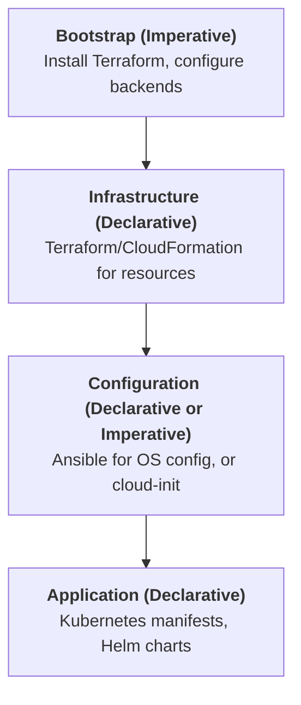
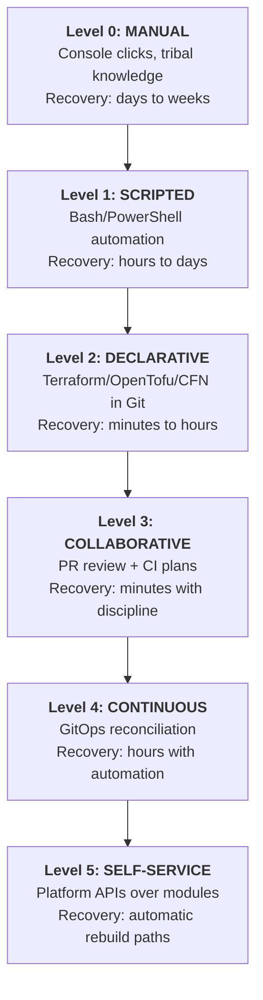
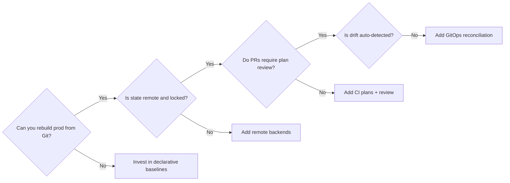

> **Complexity**: `[MEDIUM]`
>
> **Time to Complete**: 35-40 minutes
>
> **Prerequisites**: [Module 1: Infrastructure as Code](/prerequisites/modern-devops/module-1.1-infrastructure-as-code/)
>
> **Track**: Platform Engineering - IaC Discipline

---

## What You'll Be Able to Do

After completing this module, you will be able to apply the practices below to real platform engineering work—not merely recognize the vocabulary in a slide deck.

- **Design Infrastructure as Code workflows that treat infrastructure definitions as versioned, tested software**
- **Implement Terraform or Pulumi projects with proper state management and backend configuration**
- **Evaluate IaC tool choices — Terraform, Pulumi, Crossplane, CDK — against your team's skills and requirements**
- **Build modular IaC repositories with reusable components and clear dependency management**

## Why This Module Matters

**Hypothetical scenario:** A platform team at a mid-sized company begins a cloud migration and discovers that roughly two-fifths of production servers have no authoritative documentation. When they ask who configured a load balancer or a database subnet, the answers sound like archaeology: a former engineer set it up years ago, a wiki page contradicts the live console, and a shell script on someone's laptop might be the only record of a critical security group rule. Rebuilding that environment from scratch would take weeks of manual discovery because the organization never treated infrastructure definitions as durable, reviewable artifacts.

Infrastructure as Code is the practice of closing that gap. Instead of clicking through cloud consoles and hoping human memory survives turnover, you express networks, compute, storage, identity, and policy as files that live in version control beside application code. Those files become the contract for what should exist, which means every change can be diffed, debated in a pull request, tested in a pipeline, and replayed during disaster recovery. The benefit is not merely speed on day one; it is survivability on day five hundred when the original author has left and an incident demands that you recreate production from first principles.

Understanding IaC fundamentals helps you design infrastructure that is reproducible and auditable, choose tools that match your team's skills rather than chasing novelty, build repository patterns that scale from a single platform squad to dozens of product teams, and avoid the snowflake-server antipattern that quietly kills agility. The sections that follow teach the durable spine—declarative desired state, state tracking, the plan/apply loop, modules, and GitOps-style workflows—so you can evaluate any specific vendor release against principles that outlast quarterly feature churn.

> **The Blueprint Analogy**
>
> Before steel and concrete arrive at a construction site, architects produce blueprints that describe the finished building. Workers do not improvise wall placement each morning; they reconcile physical progress against the drawing. IaC does the same for infrastructure: your configuration files are the blueprint, the cloud control plane is the construction site, and the provisioning tool continuously compares the two.

---

## What Infrastructure as Code Actually Is

Infrastructure as Code means describing the resources your systems depend on—virtual machines, Kubernetes clusters, DNS records, IAM roles, databases, firewalls—in machine-readable files rather than tribal knowledge. Those files are executed by automation that calls cloud and platform APIs, which replaces the fragile pattern of logging into a console, clicking through wizards, and hoping someone remembers to screenshot the settings. When infrastructure is code, the same artifact that created an environment can recreate it after a region failure, clone it for a new team, or tear it down when a experiment ends.

The WHY behind each benefit matters as much as the checklist. Repeatability exists because a declarative file encodes intent once; every subsequent run converges toward that intent instead of re-deriving steps from memory. Auditability exists because version control stores who changed what, when, and why—capabilities that console clicks rarely preserve with the same fidelity. Code review exists because peers can challenge a security group rule or instance sizing decision before it touches production, which is how software teams already prevent defects and infrastructure deserves the same gate. Disaster recovery improves because rebuilding is an automated apply operation rather than a multi-week scavenger hunt through tickets and screenshots. Self-documentation emerges naturally: the repository becomes the living textbook of your platform, which onboarding engineers can read instead of interrupting ten senior colleagues.

IaC is also a cultural shift. Tools like Terraform or Pulumi are learnable in a week; convincing every team to stop making manual production changes is the multi-quarter journey. Mature organizations pair the tooling with policy: break-glass console access is logged, drift is detected, and the default path for change runs through Git. That pairing is what separates teams who "have some Terraform repos" from teams who genuinely operate infrastructure as software.

A useful sanity check is the empty-region test: if your primary cloud region vanished tonight, could you recreate networking, identity, data stores, and compute from repositories without opening a single console screenshot archive? Teams that answer yes typically invested early in module boundaries, remote state, and CI plans; teams that answer no often discover that critical knowledge lives in runbooks, private chats, and the muscle memory of a few senior engineers. Closing that gap is the practical definition of IaC maturity, not the number of `.tf` files in a monorepo.

Finally, treat IaC artifacts as contracts between platform and product teams. When a module exposes inputs and outputs, it is promising stable behavior; when consumers bypass modules and paste raw resources, they opt out of that contract and reintroduce snowflakes. Governance should make the blessed path easy—golden paths, documented examples, and self-service wrappers—while making undisciplined paths visible through audit logs and cost allocation tags.

---

## Design IaC Workflows as Versioned Software

Designing an IaC workflow begins with a simple decision: infrastructure definitions are source code, not attachments. That means they live in Git (or an equivalent version control system), branch for experiments, merge through pull requests, and trigger automated validation on every commit. A minimal collaborative workflow looks like this: an engineer edits a module, opens a pull request, CI runs formatting and static analysis, a peer reviewer reads both the HCL diff and the speculative plan output, and only then does an automated or gated apply step touch a shared environment.

The workflow earns its keep when something goes wrong. Because every production change has a commit hash, you can identify the exact revision that introduced a misconfigured subnet or an overly permissive IAM policy, revert it, and re-apply the last known good state. Because plans are captured in CI logs, incident responders can compare what the automation intended to change against what actually changed in the API, which accelerates root-cause analysis when a deployment coincides with an outage. Because environments share modules, a security fix propagated through a shared VPC module can reach dev, staging, and production through the same reviewed change rather than three inconsistent console edits.

Testing belongs in the workflow even before you reach the dedicated testing module later in this track. At minimum, run `terraform validate`, policy checks, and speculative plans on every pull request; block merges that widen attack surface or violate tagging standards. Treat plan output as a contract review: reviewers should read resource creations and destructions, not rubber-stamp green checks. Advanced teams add cost estimation and integration tests, but the non-negotiable foundation is version control plus review plus automated plan visibility.

Promotion between environments should be explicit. Whether you use directory-per-environment layouts, branch-per-environment triggers, or GitOps overlays, the workflow must answer two questions on every change: which environment receives this revision next, and what evidence proves it is safe to promote? When those questions have clear, automated answers, infrastructure changes feel like software releases instead of ceremonial weekend maintenance.

---

## Declarative Versus Imperative Infrastructure

Two paradigms compete for your attention, and choosing between them is one of the first architectural decisions an IaC practice makes. Imperative automation specifies the steps to reach a target: run this CLI command, wait for the instance, attach this tag. Declarative automation specifies the target itself—three application servers behind a load balancer with these labels—and trusts a reconciler to close the gap between desired and actual state.

Consider a bash script that calls `aws ec2 run-instances` each time it executes. The script encodes HOW to create capacity. If an operator runs it twice during a frantic incident, you may get duplicate instances because nothing in the script compares current reality against intent. A declarative Terraform resource describing the same instance encodes WHAT should exist. On the first apply the provider creates the instance; on the second apply the tool reads state, compares attributes, and concludes that no changes are required. That property—idempotency—is why declarative tools dominate long-lived infrastructure even though imperative scripts remain valuable for one-off migrations or bootstrap tasks.

Declarative systems also enable convergence. When someone changes an instance type manually in the console, the next plan surfaces drift: desired `t3.medium`, actual `t3.large`. Teams at higher maturity levels wire that detection into CI or a GitOps reconciler so manual edits are either blocked or automatically reverted. Imperative scripts rarely offer that feedback loop unless you invest heavily in custom auditing.

The comparison is not a purity contest. Ansible playbooks can be written imperatively or with declarative idempotency markers; Kubernetes manifests are declarative; CloudFormation and Bicep templates are declarative; Pulumi programs can be imperative in a general-purpose language while still tracking desired state. Hybrid architectures are normal: imperative bootstrap installs the Terraform binary and configures remote state, declarative Terraform provisions the cluster, configuration management tunes the operating system, and declarative Kubernetes manifests schedule workloads.



Configuration as Code (CaC) overlaps IaC but answers a different question. IaC provisions the platform—clusters, networks, databases. CaC tunes runtime behavior—feature flags, log levels, connection pool sizes. A Kubernetes ConfigMap is CaC; the cluster API object that represents it is still infrastructure. Both belong in version control, but confusing the layers leads to teams storing secrets in Terraform when a secret manager is appropriate, or attempting to provision VPCs with application config tools that lack cloud resource providers.

| Feature | Imperative | Declarative |
|---------|------------|-------------|
| **Idempotent by default?** | Usually no | Yes, when used as intended |
| **Drift detection** | Manual | Built into plan/compare cycle |
| **Rollback story** | Re-run older script carefully | Re-apply known-good revision |
| **Best fit** | Migrations, bootstraps, emergencies | Long-lived cloud resources |

Use declarative tooling when multiple engineers share environments, when audit trails matter, and when you need predictable recovery. Reserve imperative scripts for bounded tasks with clear start and end states, and document them with the same rigor you would apply to production Terraform modules.

---

## Implement Terraform State Management and Backend Configuration

Declarative IaC tools must answer a deceptively simple question: did I create this resource, or did someone else? Cloud APIs identify objects by provider-specific IDs that your configuration files do not inherently remember. State bridges that gap. It records the mapping between logical resource addresses in your code—`aws_instance.web`—and physical IDs in the API—`i-0abc123`. Without state, a tool seeing three running servers and code that says "three servers" cannot tell whether to create three more or celebrate success.

State is therefore not a cache you can casually delete; it is part of the tool's correctness model. Losing state does not automatically destroy cloud resources, which is the scary part: orphaned resources continue billing while the tool loses the ability to manage them safely. Teams learn this lesson the first time a laptop with the only copy of `terraform.tfstate` disappears. The fix is adopting a remote backend before collaboration begins, not after the first conflict.

Remote backends store state in shared systems—S3 with DynamoDB locking on AWS, GCS with native locking on Google Cloud, Azure Blob storage, Terraform Cloud, or OpenTofu's compatible backends. They provide three essentials: durability, concurrency control, and optional encryption/versioning. Durability means state survives workstation failures. Concurrency control means two engineers cannot apply conflicting changes simultaneously. Encryption and versioning mean you can detect tampering and roll back a corrupted state file when necessary.

State locking deserves a concrete picture because it is the difference between orderly change and silent corruption. Imagine Alice and Bob both run `terraform apply` against production at the same moment without locking. Both read the same state snapshot showing two servers. Alice's apply adds a third server and writes state with three entries. Bob's apply also adds a server—creating a fourth physical instance—but writes state that still references only the three he knows about. Server four is now orphaned: it bills, it runs, but Terraform will never update or destroy it through normal workflows. Locking forces Bob to wait until Alice finishes, so his plan begins from the updated world where three servers already exist.

```hcl
terraform {
  backend "s3" {
    bucket         = "company-terraform-state"
    key            = "platform/networking/terraform.tfstate"
    region         = "us-east-1"
    dynamodb_table = "terraform-locks"
    encrypt        = true
  }
}
```

The snippet above is illustrative of the pattern, not a copy-paste production configuration. Real backends also require IAM policies, bucket versioning, and often a separate bootstrap stack that creates the state bucket before the main stack can reference it. Pulumi uses a service-backed checkpoint model by default with similar goals; Crossplane stores desired state as Kubernetes API objects reconciled by controllers. Different tools, same principle: centralized, locked, durable state for any environment that matters.

State drift happens when reality diverges from both code and state—usually because someone edited resources manually. Good practice combines periodic `terraform plan` in CI (which should report no changes on main) with guardrails that discourage console edits. When drift appears, decide explicitly whether to update code to match reality or revert reality to match code; letting drift linger turns your repository into fiction.

---

## The Plan-Apply Loop and Idempotency

The operational heartbeat of Terraform-style IaC is a two-phase loop: plan, then apply. During plan, the tool loads state, refreshes current attributes from APIs, compares them to your configuration, and prints a human-readable diff of creates, updates, replaces, and destroys. During apply, it executes that diff and writes an updated state file. Separating the phases is a safety feature: reviewers approve plans, not vague intentions, and automation can block applies that contain unexpected deletions.

Idempotency means repeating the same operation does not accumulate side effects. Apply the same unchanged module twice; the second run should report zero changes. This is only possible because declarative tools track desired state externally rather than blindly re-executing commands. Imperative scripts achieve idempotency only when authors painstakingly code guard clauses—check if bucket exists before creating—which duplicates logic the declarative tool provides for free.

Lifecycle nuances matter for operations teams. Updates change attributes in place when APIs allow. Replacements destroy and recreate resources when an attribute is immutable—changing an RDS instance identifier, for example. Destroys remove resources from the API and state. Mature teams read replace warnings carefully because a brief recreation window can drop connections or wipe local disks. `-target` flags exist for emergencies but encourage dependency inconsistency; document any targeted apply as technical debt to unwind.

Immutability versus in-place mutation is a design choice with tradeoffs. Immutable infrastructure rebuilds servers from golden images instead of patching them endlessly, which reduces configuration drift on hosts. In-place updates are faster and preserve ephemeral data on disks when that matters. IaC supports both: you might use immutable AMIs for stateless web tiers while allowing in-place scaling for databases during maintenance windows. The plan output tells you which path a given change will take—treat "forces replacement" messages as production incidents waiting to happen unless you intended them.

OpenTofu and Terraform share this plan/apply model because both descend from the same lineage after HashiCorp relicensed Terraform to the Business Source License in 2023 and the community forked OpenTofu under the Linux Foundation. The loop is bigger than any single vendor binary: it is how organizations make infrastructure changes legible.

Operations teams should build runbooks around plan output, not around heroic intuition. Teach reviewers to scan for unexpected `destroy` lines, for resources marked `forces replacement`, and for dependency chains that will restart nodes during business hours. When automation posts plans as pull-request comments, store those artifacts as long as the infrastructure exists so post-incident reviews can answer whether the change was reviewed or merely rubber-stamped. The plan/apply loop is also where policy engines attach: Open Policy Agent, Sentinel, or cloud-native guardrails can deny plans that open `0.0.0.0/0` administration ports even when a human approver clicked too quickly.

Immutability deserves an explicit operations story because newcomers confuse "declarative" with "never restart anything." Declarative tools happily replace resources when APIs require recreation; the difference is that the replacement appears in plan output before it happens. For stateful systems, combine IaC with backup verification and maintenance windows rather than pretending replacements are free. For stateless tiers, lean into replacements as hygiene: new AMI, new launch template version, new node pool—each applied through the same loop so history stays coherent.

---

## Providers, Resources, Modules, and Data Sources

Providers are plugins that teach the tool how to speak each cloud or SaaS API. A Terraform AWS provider translates HCL resources into EC2, S3, and IAM calls. Without providers, your configuration is inert text. Provider versions are pinned in `required_providers` blocks so upgrades are deliberate; a sudden major version bump can rename attributes or change defaults, which is why CI should run plans on provider bumps before merge.

Resources are the primary objects you manage—`aws_s3_bucket`, `google_compute_network`, `azurerm_kubernetes_cluster`. The tool builds a dependency graph from references between resources. If an instance references a subnet ID, the subnet must be created first. Understanding implicit dependencies prevents race conditions that manifest as flaky applies. Explicit `depends_on` is an escape hatch when references are not visible to the graph.

Modules bundle reusable configurations. Instead of copying the same VPC definition into twelve repositories, you publish a `vpc` module that accepts CIDR blocks and availability zones as inputs and exposes subnet IDs as outputs. Consumers call the module; platform engineers fix a routing bug once. Module sources can be local paths, Git tags, or registry versions. Semantic versioning for modules matters because a breaking change propagated silently can open network paths you thought were closed.

Data sources read existing infrastructure without managing lifecycle—looking up the latest Amazon Linux AMI, fetching a certificate ARN, or importing an organization-wide DNS zone. They are how you compose new resources around assets owned elsewhere. Misusing data sources—for example, referencing production IDs from dev code—creates hidden coupling that breaks environment parity.

Outputs expose values to humans and downstream stacks. A networking module might output private subnet IDs that a Kubernetes module consumes through remote state or stack outputs. Clear output contracts are the API surface of your platform modules; treat breaking output renames like breaking REST API changes.

Resource addressing is how engineers navigate large repos: `module.vpc.aws_subnet.private[2]` is both a filesystem path concept and an operations handle for targeted debugging. When incidents strike, you may use `terraform state mv` to refactor addresses without destroying cloud objects, but such moves are surgery—practice in staging, snapshot state first, and communicate because CI systems and dependent stacks may cache old addresses. Import workflows (`terraform import`) let you bring pre-existing resources under management without recreation, which is essential during brownfield migrations where deleting legacy assets is unacceptable.

Provider maintenance is an underappreciated slice of platform work. Cloud vendors ship new resource types, deprecate APIs, and rename attributes; provider releases follow on their own cadence. Pin versions, read changelogs during upgrades, and keep a sandbox project that runs plans against upgraded providers before production roots adopt them. This is the same compatibility discipline application teams apply to language runtimes—just applied to the plugins that translate your intent into HTTP calls.

---

## Evaluate IaC Tool Choices

Choosing an IaC tool is less about finding a single winner and more about mapping organizational constraints to capability axes. Ask about team skills (declarative HCL versus general-purpose languages), target platforms (single cloud versus multi-cloud versus Kubernetes-native control planes), desired workflow (CLI plan/apply versus continuous reconciliation), and compliance needs (policy-as-code integration, audit trails, air-gapped execution). A tool that excels for a centralized platform squad may frustrate product teams who want self-service abstractions.

> **Landscape snapshot — as of 2026-06. This changes fast; verify against vendor docs before relying on specifics.**
>
> | Axis | Representative tools | Notes |
> |------|---------------------|-------|
> | Declarative provisioning (HCL/YAML) | Terraform, OpenTofu, AWS CloudFormation, Azure Bicep | OpenTofu is the Linux Foundation fork maintained after HashiCorp's 2023 BSL license change |
> | General-purpose language IaC | Pulumi (TypeScript, Python, Go, ...) | Programs compile to the same plan/apply concepts with richer logic |
> | Kubernetes-native control planes | Crossplane, Cluster API | Crossplane graduated CNCF in October 2025; composes XRDs and providers inside the cluster |
> | Config management | Ansible, Chef, Puppet | Often paired with provisioning tools for OS-level convergence |
> | Policy / guardrails | OPA, Sentinel, `terraform validate` + CI scanners | Usually adjacent to the provisioner rather than replacing it |

The following **IaC capability Rosetta** compares the same durable axes across tools without ranking them; use it to translate concepts you already know into unfamiliar interfaces when evaluating a pilot project.

| Capability | Terraform / OpenTofu | Pulumi | Crossplane | CloudFormation | Ansible |
|------------|---------------------|--------|------------|----------------|---------|
| Declarative desired state | Yes (HCL) | Yes (language SDKs) | Yes (K8s API + compositions) | Yes (YAML/JSON) | Partial (tasks + idempotent modules) |
| Remote state / locking | Native backends | Service or self-managed | etcd via Kubernetes | Stack-managed | N/A (facts inventory) |
| Plan before apply | `terraform plan` | `pulumi preview` | Managed resource status + dry-run patterns | Change sets | `--check` / diff modes |
| Multi-cloud posture | Broad provider ecosystem | Broad provider ecosystem | Provider pods per cloud | AWS only | Agent-based, hybrid |
| GitOps pairing | Via Atlantis, Flux TF Controller, CI | Via CI / Pulumi Deployments | Native reconcile loop in cluster | Stack sets + pipelines | Via AWX / CI |

The Terraform→OpenTofu fork is a durable governance story worth understanding on its own. HashiCorp announced the Business Source License for Terraform in August 2023, which imposed usage restrictions for competitive offerings. In response, community maintainers created OpenTofu under the Linux Foundation with a Mozilla Public License, preserving an open-source path for the HCL ecosystem many enterprises already standardized on. Practically, modules and provider pins often transfer with migration tooling, but teams should still run plans in non-production before cutover and verify backend compatibility. Neither choice removes the need for sound state management or code review.

Crossplane shifts the control plane into Kubernetes: composite resource definitions expose opinionated APIs ("claim a PostgreSQL instance") while controllers reconcile cloud resources behind the scenes. That model shines when platform teams already operate clusters and want application developers to consume infrastructure via namespaced claims rather than raw Terraform roots. Cluster API solves a narrower but related problem—declarative cluster lifecycle—rather than general multi-cloud resource graphs.

AWS CDK and CloudFormation appeal when AWS is the primary venue and developers prefer expressing infrastructure in TypeScript, Python, or other languages that compile to CloudFormation templates. Pulumi occupies similar language territory with multi-cloud reach. Ansible remains indispensable for configuring machines after they exist, though it is a poor primary tool for complex cloud graphs compared to dedicated provisioners.

Evaluate tools against skills and requirements, not slogans. If your organization already invested in HCL modules and remote state, OpenTofu or Terraform with robust CI may be the lowest-risk path. If platform engineers live in Go and want typed abstractions, Pulumi may reduce friction. If everything new ships on Kubernetes and developers already think in CRDs, Crossplane merits a pilot. Document the decision, including rejected alternatives, so future engineers understand the trade space rather than inheriting a tool as folklore.

---

## Build Modular IaC Repositories

Repository structure is where IaC practices succeed or collapse under their own weight. A monorepo stores environments, shared modules, and global primitives in one Git project. Platform engineers see every change, module reuse is trivial, and refactors can update all environments in a single pull request. The cost is blast radius: a typo in a shared module coupled with overly permissive CI can touch every environment before someone notices. CI also grows heavier because unrelated teams share pipelines.

A polyrepo assigns each component or team its own repository. Ownership boundaries are crisp, pipelines stay smaller, and teams release on independent cadences. The downside is composition friction: shared modules become versioned dependencies that consumers must bump deliberately, and cross-cutting security fixes require orchestration across many pull requests. Organizations with five product teams and a central platform group often adopt a hybrid: platform maintains a monorepo of blessed modules and reference architectures, while product teams consume those modules from polyrepos scoped to their services.

```text
platform-infrastructure/          # platform monorepo
├── modules/
│   ├── vpc/
│   ├── eks/
│   └── rds/
└── examples/

team-alpha-infra/                 # team polyrepo
├── environments/
│   ├── dev/
│   └── prod/
└── main.tf                       # calls platform modules via registry tags
```

Dependency management discipline separates mature modular repos from copy-paste graveyards. Pin module versions to Git refs or registry numbers; document upgrade playbooks; test bumps in dev before prod. Within a repo, separate environment-specific values (`tfvars`, overlays) from structural modules so parity is preserved—architectures match, only scale and secrets differ. Remote state partitioning also matters: networking, security, and application stacks often use separate state files to shrink plan times and limit blast radius, coupled via remote state data sources or stack outputs.

Clear interfaces turn modules into platform products. Inputs should be validated with type constraints and descriptions; outputs should expose only what consumers need. Internal implementation details stay private. When a module grows past a few hundred lines or performs unrelated tasks—VPC plus databases plus monitoring—it is time to split along bounded contexts. Monster modules are difficult to test, frightening to plan, and demoralizing to review.

---

## GitOps for Infrastructure

GitOps extends IaC by making Git the authoritative desired state for both applications and the infrastructure they ride on. Instead of a human running `terraform apply` from a laptop after merge, an automated reconciler watches the repository and applies approved revisions, continuously comparing live APIs against declared configuration. The [OpenGitOps](https://opengitops.dev/) principles—declarative, versioned, automatically reconciled, continuously reconciled—apply whether the reconciler is Flux's Terraform Controller, Atlantis, Spacelift, or a custom pipeline with tightly scoped credentials.

Pairing IaC with GitOps reduces credential sprawl because the reconciler holds cloud permissions, not every engineer's workstation. It also strengthens drift detection: if someone edits a security group in the console, the next reconciliation pass either opens an alert or reverts the change, depending on policy. GitOps does not remove the need for quality modules or state backends; it hardens the last mile between merged code and live infrastructure.

In practice, GitOps for infrastructure often means a controller or bot watches a repository path, runs `terraform plan` or `pulumi preview` on changes, and applies approved merges using short-lived credentials. Human applies from laptops do not disappear overnight in every organization, but the direction of travel is clear: execution moves from interactive shells to audited automation with identical behavior every time. When application teams already use Flux or Argo CD for Kubernetes manifests, extending the same mental model to Terraform roots feels natural—they already believe Git should match cluster state; IaC simply widens the boundary to VPCs, databases, and IAM roles.

This discipline connects directly to the GitOps modules in this track—[Module 3.1: What is GitOps?](../gitops/module-3.1-what-is-gitops/), [Module 3.2: Repository Strategies](../gitops/module-3.2-repository-strategies/), and [Module 3.4: Drift Detection](../gitops/module-3.4-drift-detection/)—which explore reconciler patterns, promotion, and drift remediation in greater depth. Read them as the operational layer above the fundamentals here.

---

## The IaC Maturity Model

Organizations rarely jump from console clicks to self-service platform APIs in one quarter. A maturity model helps you identify the next sensible investment instead of buying enterprise tooling your teams cannot yet operate. Level 0 is manual: changes happen in UIs, documentation rots, recovery is measured in weeks. Level 1 adds scripts—helpful, but often non-idempotent and loosely governed. Level 2 adopts declarative tools with version control, though applies may still be heroic manual events. Level 3 introduces collaborative pull requests, mandatory review, and CI validation. Level 4 continuous maturity adds automated reconciliation and self-healing drift correction. Level 5 self-service exposes curated APIs or portals backed by the same modules, letting product teams request databases or namespaces within guardrails.



Honest assessment beats aspiration. If you cannot recreate production from Git today, Level 4 tooling will not rescue you until Level 2 fundamentals—declarative code, remote state, modules—are stable. Progress deliberately: remote state and one service migrated to IaC beat a half-configured enterprise suite. Each level buys specific capabilities: reproducibility at Level 2, collaboration at Level 3, drift resistance at Level 4, and developer autonomy at Level 5.

---

## Environment Parity and Promotion

Environment parity means dev, staging, and production share architecture and differ only in controlled dimensions like scale, redundancy, and data sensitivity. Parity is how you avoid the classic failure mode where code passes in a tiny dev cluster but fails in production because networking, IAM, or API versions diverged silently. IaC makes parity achievable because the same modules instantiate each environment with different input variables rather than different forks of copy-pasted code.

What should stay aligned: service topology, software versions, configuration keys, security control patterns, and observability instrumentation. What may differ: instance counts, hardware sizes, multi-AZ redundancy, synthetic versus real data, and secret values. Encode allowed differences in `tfvars` or overlays; never hardcode production sizes inside shared modules unless every environment truly needs them.

Promotion workflows should make differences visible. Directory-per-environment repos promote by copying reviewed changes from `dev/` to `staging/` to `prod/` paths in sequenced pull requests. Branch-per-environment repos promote by merging upward through protected branches. GitOps overlays promote by changing kustomize patches or Helm values while keeping base manifests stable. Whichever pattern you choose, automate speculative plans per environment on the same commit so reviewers see whether prod will destroy unexpected resources.

```hcl
# Shared module call — structure identical everywhere
module "app_stack" {
  source         = "../modules/app-stack"
  environment    = var.environment
  instance_count = var.instance_count
  instance_type  = var.instance_type
}
```

Parity is not sameness. Trying to run production traffic volumes in dev wastes money; pretending dev's single-AZ shortcut will surface every resilience bug wastes incidents. The goal is structural equivalence so surprises are logical, not environmental.

Promotion cadence is a policy choice as much as a technical one. Fast promotion reduces batch size and makes rollbacks comprehensible; slow promotion adds staging gates that catch integration issues but increases merge debt when many teams touch the same module. IaC makes either policy workable because promotion is "apply revision N to environment E," not a bespoke checklist. Document which variables must differ per environment—CIDR overlap rules, instance sizes, backup retention—and encode them in `tfvars` files reviewed like code so auditors can see parity constraints explicitly rather than inferring them from tribal lore.

---

## Patterns and Anti-Patterns

**Pattern 1: Remote state before collaboration.** Configure S3/GCS/Azure backends with locking on the first shared stack. This pattern prevents state fork disasters and establishes the habit of shared truth before team size forces it under pressure.

**Pattern 2: Thin roots, fat modules.** Keep environment roots small—backend configuration, provider pins, module calls, and variables—while placing logic in versioned modules with tests. Roots become orchestration; modules become products.

**Pattern 3: Plan-in-CI, apply-with-gates.** Every pull request publishes a speculative plan artifact; applies to staging and production require approval and optionally separate credentials. Reviewers judge real infrastructure diffs, not hope.

**Anti-Pattern 1: Snowflake servers.** Manual tweaks accumulate until rebuild is scarier than limping along. Replace with immutable rebuilds from IaC and restrict break-glass access.

**Anti-Pattern 2: Console hotfixes without reconciliation.** Emergency console edits save minutes and cost weeks when the next apply reverts or conflicts unpredictably. Either backport changes into Git immediately or block console access except through audited roles.

**Anti-Pattern 3: Mega-stacks with one state file.** Combining networking, data, and applications in a single root makes plans slow and failures catastrophic. Split state along blast-radius boundaries and compose with remote state.

When leadership asks "what should we fund this quarter," use this **decision framework** to connect observable pain to the next maturity investment rather than jumping straight to self-service portals before remote state exists.

| Current pain | Likely level gap | Next investment | Success signal |
|------------|------------------|-----------------|----------------|
| Cannot rebuild prod | 0→2 | Declarative code + remote state | `apply` recreates staging from Git |
| Frequent state conflicts | 2→3 | Locking + PR workflow | No overlapping apply errors for a quarter |
| Undetected console edits | 3→4 | GitOps reconciler or scheduled plans | Drift alerts within minutes |
| Platform team is bottleneck | 4→5 | Self-service modules/APIs | Product teams provision standard resources without tickets |



---

## Did You Know?

- **The term "Infrastructure as Code"** gained traction in the late 2000s as DevOps practices spread; practitioners Andrew Clay Shafer and Patrick Debois helped popularize both "DevOps" and the idea that operations work deserved the same version-control rigor as application code.

- **Terraform's state concept** predates many competing tools and influenced how later provisioners model dependency graphs; OpenTofu preserved that model when the community forked after the 2023 license change.

- **The U.S. Department of Defense Cloud Computing Security Requirements Guide** expects machine-readable infrastructure configuration under configuration management controls—an early enterprise mandate aligning security compliance with IaC practices.

- **GitOps principles** were codified by the OpenGitOps project under the CNCF, extending IaC workflows with continuous reconciliation rather than one-shot applies.

---

## Common Mistakes

| Mistake | Problem | Solution |
|---------|---------|----------|
| Starting with complex tooling | Teams drown in features before fundamentals stick | Begin with one stack, remote state, and CI plans |
| Local state on laptops | Single loss orphans resources or corrupts truth | Remote backend with locking from day one |
| Manual console "quick fixes" | Undocumented drift breaks the next plan/apply | Backport to Git immediately or auto-revert drift |
| Skipping plan review in CI | Destructive changes merge unnoticed | Publish plan artifacts; block risky deletes |
| Hardcoded environment values | Modules cannot be reused across envs | Parameterize with `tfvars` or overlays |
| Giant monolithic roots | Slow plans, terrifying blast radius | Split state; compose modules with clear APIs |
| Unpinned provider versions | Surprise breaking changes on fresh clones | Pin `required_providers` and test upgrades |
| Secrets in plain Git | Credential leaks in history | Integrate Vault or cloud secret managers |

---

## Quiz

1. **Your team stores Terraform in Git with pull requests, but applies still require a senior engineer to run `terraform apply` manually after merge. Which maturity level describes this setup, and what capabilities must you add to reach continuous reconciliation?**
   <details>
   <summary>Answer</summary>

   This describes Level 3 collaborative maturity: infrastructure definitions are versioned and reviewed, yet deployment remains a deliberate human-triggered event. To approach Level 4 continuous maturity, introduce an automated reconciler or CI apply step with tightly scoped credentials, continuous speculative plans against main, and drift detection that compares live APIs to the merged revision. Design Infrastructure as Code workflows so that Git remains authoritative without depending on a specific engineer's laptop as the execution plane.
   </details>

2. **A colleague proposes managing all infrastructure with bash scripts because "the team already knows shell." What conceptual advantages does a declarative Terraform or Pulumi workflow offer for shared production environments?**
   <details>
   <summary>Answer</summary>

   Declarative workflows encode desired end state and rely on plan/apply idempotency, which prevents duplicate resources when scripts rerun during incidents. They maintain remote state that maps logical addresses to cloud IDs, enabling safe updates and destroys. Implement Terraform or Pulumi projects with proper state management so multiple engineers share truth instead of improvising sequential CLI commands that lack a global view of dependencies.
   </details>

3. **Platform leadership asks you to compare Terraform/OpenTofu, Pulumi, Crossplane, and AWS CDK for a Kubernetes-centric organization that also provisions managed databases in two clouds. How do you structure the evaluation without defaulting to hype?**
   <details>
   <summary>Answer</summary>

   Evaluate IaC tool choices against capability axes: language preference (HCL versus TypeScript/Python), control-plane location (CLI versus in-cluster operators), state model, and existing skills. Crossplane fits teams wanting Kubernetes-native abstractions; OpenTofu or Terraform fit broad multi-cloud graphs; Pulumi fits teams preferring general-purpose languages; CDK fits AWS-heavy footprints. Score each option on maintainability, policy integration, and migration cost rather than marketing claims, then run a time-boxed pilot on a non-production stack.
   </details>

4. **Two engineers apply Terraform concurrently without state locking and later notice orphaned resources billing silently. Explain the failure mode and the backend feature that prevents it.**
   <details>
   <summary>Answer</summary>

   Without locking, both engineers read the same state snapshot, create overlapping resources, and whichever state write lands last drops references to the other's creations—orphaning live infrastructure. Remote backends with state locking serialize writers so the second plan begins from refreshed state. Implement Terraform state management and backend configuration with DynamoDB, native GCS locking, or an equivalent mutex before allowing team-wide applies.
   </details>

5. **Your monorepo Terraform root has grown to thousands of lines and terrifies reviewers. How do you refactor toward modular IaC repositories without stopping feature delivery?**
   <details>
   <summary>Answer</summary>

   Extract bounded contexts into versioned modules with explicit inputs and outputs, leaving thin environment roots that only wire backends, providers, and module calls. Build modular IaC repositories incrementally: carve out networking first, publish it as a module, point dev at the module while prod remains on the legacy root, then migrate prod after plans match. Split state files along blast-radius lines so plans stay fast and reviews stay human-sized.
   </details>

6. **A developer manually changes a production security group at night to unblock traffic. Your organization aspires to GitOps-style IaC. What should happen before the next deployment, and why?**
   <details>
   <summary>Answer</summary>

   The console edit must either be backported into Git the same night or automatically reverted by a reconciler; otherwise the next plan may undo the fix or apply an unexpected delta that drops legitimate traffic. Continuous reconciliation treats manual changes as drift against declared desired state. Design IaC workflows where emergency edits flow through expedited pull requests with post-incident review, preserving auditability without pretending consoles are forbidden forever.
   </details>

7. **Why is environment parity easier when the same modules consume different variable files than when each environment maintains forked copies of infrastructure code?**
   <details>
   <summary>Answer</summary>

   Shared modules guarantee architectural identity while variables isolate scale and secrets, so drift appears as diffs in inputs rather than undetected fork divergence. When teams copy code, they inevitably delay merges of security fixes to production. Build modular repositories where promotion is raising variable values or overlay patches, not reconciling three unrelated Terraform trees before every release.
   </details>

8. **An enterprise standardizes on OpenTofu after HashiCorp's license change. Which durable principles from Terraform still apply unchanged, and what should the migration plan validate explicitly?**
   <details>
   <summary>Answer</summary>

   Plan/apply, provider plugins, module composition, and remote state semantics remain conceptually identical because OpenTofu forked the open-source lineage. Migration plans must validate backend compatibility, provider version pins, CI runner authentication, and state file integrity in a sandbox before cutting production applies over. Evaluate tool choices on governance and community support dimensions, not only syntax, because operational workflows—not logos—determine success.
   </details>

---

## Hands-On

This exercise walks through three connected activities—local state practice, a written maturity assessment, and a modular repository sketch—so you connect the plan/apply loop to how your organization should evolve next. Budget roughly forty minutes total if you run every command; skip the Terraform commands if you lack a local install and focus on the assessment and repository design portions instead.

Begin with fifteen minutes on your workstation exploring Terraform state using the `local_file` resource, which requires no cloud credentials yet still demonstrates init/plan/apply/destroy and `terraform state show` against real state entries.

```bash
mkdir -p iac-practice && cd iac-practice

cat > main.tf << 'EOF'
terraform {
  required_version = ">= 1.0"
}

resource "local_file" "example" {
  content  = "Hello, IaC!"
  filename = "${path.module}/hello.txt"
}
EOF

terraform init
terraform plan
terraform apply -auto-approve

terraform state list
terraform state show local_file.example

# Portable in-place edit (works on Linux and macOS):
perl -pi -e 's/Hello, IaC!/Hello, Infrastructure as Code!/' main.tf
terraform plan
terraform apply -auto-approve

terraform destroy -auto-approve
```

Spend the next ten minutes writing `iac-assessment.md` for your current organization or a realistic fictional one. Answer whether production could be rebuilt from Git alone, how infrastructure changes are reviewed today, whether state is remote and locked, and where drift is detected. Assign a maturity level from this module's model and justify it with evidence rather than aspiration.

Finish with fifteen minutes sketching a hybrid monorepo/polyrepo layout: which modules a platform team would own centrally, which repositories product teams would use, and one concrete module you would extract this month with documented inputs, outputs, and first consumer environments.

Track completion with the criteria below:

- [ ] Ran plan/apply/destroy locally and inspected state with `terraform state show`
- [ ] Documented current maturity level with evidence, not aspiration
- [ ] Drafted a module boundary with explicit variables and outputs for reuse

---

## Sources

- [Terraform Introduction](https://developer.hashicorp.com/terraform/intro)
- [Terraform State Documentation](https://developer.hashicorp.com/terraform/language/state)
- [Terraform Plan Command](https://developer.hashicorp.com/terraform/cli/commands/plan)
- [OpenTofu Documentation](https://opentofu.org/docs/intro/)
- [OpenTofu Migration Guide](https://opentofu.org/docs/intro/migration/)
- [Linux Foundation OpenTofu Announcement](https://www.linuxfoundation.org/press/announcing-opentofu)
- [Pulumi Infrastructure as Code Docs](https://www.pulumi.com/docs/iac/)
- [Crossplane Documentation](https://docs.crossplane.io/latest/)
- [Crossplane CNCF Project Page](https://www.cncf.io/projects/crossplane/)
- [Ansible Getting Started](https://docs.ansible.com/ansible/latest/getting_started/index.html)
- [AWS CloudFormation User Guide](https://docs.aws.amazon.com/AWSCloudFormation/latest/UserGuide/Welcome.html)
- [OpenGitOps Principles](https://opengitops.dev/)

---

## Next Module

Continue to [Module 6.2: IaC Testing](../module-6.2-iac-testing/) to learn how static analysis, policy checks, and integration tests catch misconfigurations before they reach production environments.
