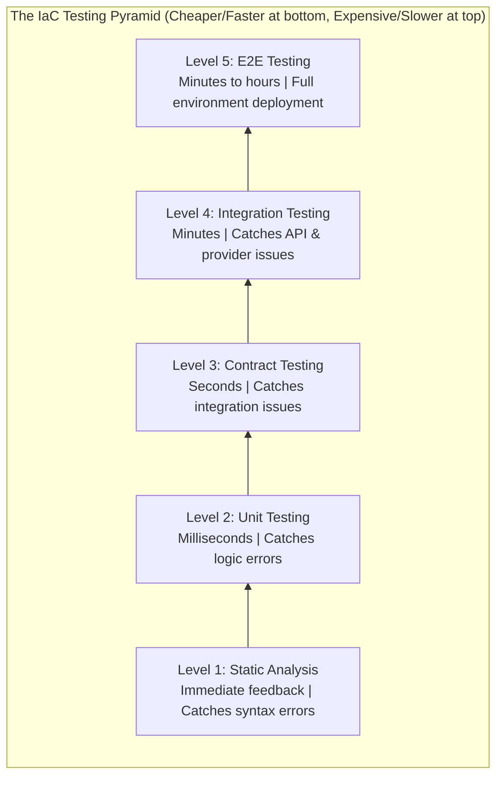

## Complexity: [COMPLEX]
## Time to Complete: 55 minutes

---

## Prerequisites

Before starting this module, you should have completed:
- [Module 6.1: IaC Fundamentals](../module-6.1-iac-fundamentals/) - Core IaC concepts
- [Module 4.1: Security Mindset](/platform/foundations/security-principles/module-4.1-security-mindset/) - Security principles
- Basic understanding of unit testing concepts

---

## What You'll Be Able to Do

After completing this module, you will be able to:

- **Design IaC testing strategies spanning unit tests, integration tests, and compliance validation**
- **Implement automated plan-time validation using tools like Terratest, Checkov, and OPA**
- **Build CI pipelines that catch infrastructure misconfigurations before they reach production**
- **Evaluate test coverage for IaC modules to ensure critical infrastructure paths are validated**

## Why This Module Matters

**The $4.2 Million Test Gap**

The senior infrastructure engineer stared at the Slack channel in disbelief. Their "simple" Terraform change to modify a security group rule had just taken down the entire production database cluster. The change had passed code review—three experienced engineers had approved it. It had worked perfectly in the dev environment. But nobody had noticed that production used a different naming convention for subnets, and the wildcard in the security group rule matched far more resources than intended.

The postmortem revealed a sobering truth: the team had 94% test coverage for their application code, but zero automated tests for their infrastructure code. The Terraform that provisioned their $50M annual infrastructure? It was tested by "applying it and seeing what happens."

This module teaches you how to test infrastructure code with the same rigor as application code—because infrastructure bugs don't throw exceptions, they cause outages.

---

## The IaC Testing Pyramid

Just like application testing, infrastructure testing follows a pyramid structure where faster, cheaper tests form the base.



---

## Level 1: Static Analysis

Static analysis catches errors without executing any code. These tests run in milliseconds and should be part of every commit.

> **Pause and predict**: If static analysis catches formatting and syntax errors without executing code, what kinds of security vulnerabilities could it potentially detect before they ever reach a cloud environment?

### Formatting and Linting

```bash
# Terraform formatting check
terraform fmt -check -recursive

# Terraform validation (syntax and internal consistency)
terraform validate

# TFLint - catches provider-specific issues
tflint --recursive

# Example .tflint.hcl configuration
cat > .tflint.hcl << 'EOF'
plugin "aws" {
  enabled = true
  version = "0.27.0"
  source  = "github.com/terraform-linters/tflint-ruleset-aws"
}

rule "terraform_naming_convention" {
  enabled = true
  format  = "snake_case"
}

rule "terraform_documented_variables" {
  enabled = true
}

rule "terraform_documented_outputs" {
  enabled = true
}

rule "aws_instance_invalid_type" {
  enabled = true
}

rule "aws_instance_previous_type" {
  enabled = true
}
EOF
```

### Security Scanning

Security scanners catch misconfigurations before they reach production:

```bash
# Checkov - comprehensive policy scanning
checkov -d . --framework terraform

# tfsec - Terraform-specific security scanner
tfsec .

# Trivy - vulnerability and misconfiguration scanner
trivy config .

# Example: Creating custom Checkov policy
cat > custom_policies/require_encryption.py << 'EOF'
from checkov.terraform.checks.resource.base_resource_check import BaseResourceCheck
from checkov.common.models.enums import CheckResult, CheckCategories

class S3BucketEncryption(BaseResourceCheck):
    def __init__(self):
        name = "Ensure S3 bucket has encryption enabled"
        id = "CUSTOM_S3_1"
        supported_resources = ['aws_s3_bucket']
        categories = [CheckCategories.ENCRYPTION]
        super().__init__(name=name, id=id,
                        categories=categories,
                        supported_resources=supported_resources)

    def scan_resource_conf(self, conf):
        # Check for server_side_encryption_configuration
        if 'server_side_encryption_configuration' in conf:
            return CheckResult.PASSED
        return CheckResult.FAILED

check = S3BucketEncryption()
EOF
```

### Pre-commit Hooks

Automate static analysis on every commit:

```yaml
# .pre-commit-config.yaml
repos:
  - repo: https://github.com/antonbabenko/pre-commit-terraform
    rev: v1.83.5
    hooks:
      - id: terraform_fmt
      - id: terraform_validate
      - id: terraform_tflint
        args:
          - --args=--config=__GIT_WORKING_DIR__/.tflint.hcl
      - id: terraform_checkov
        args:
          - --args=--quiet
          - --args=--skip-check CKV_AWS_18,CKV_AWS_21
      - id: terraform_docs
        args:
          - --args=--config=.terraform-docs.yml

  - repo: https://github.com/pre-commit/pre-commit-hooks
    rev: v4.5.0
    hooks:
      - id: check-merge-conflict
      - id: detect-aws-credentials
      - id: detect-private-key
```

---

## Level 2: Unit Testing

Unit tests verify individual resources and modules work correctly in isolation. They don't create real infrastructure.

> **Stop and think**: How does testing infrastructure logic differ from testing application logic, especially when infrastructure often depends on cloud provider APIs to determine state?

### Terraform Testing Framework (Built-in)

Terraform 1.6+ includes a native testing framework:

```hcl
# tests/vpc_test.tftest.hcl

# Test variables
variables {
  environment = "test"
  vpc_cidr    = "10.0.0.0/16"
}

# Test: VPC CIDR block is correctly set
run "vpc_cidr_validation" {
  command = plan

  assert {
    condition     = aws_vpc.main.cidr_block == "10.0.0.0/16"
    error_message = "VPC CIDR block does not match expected value"
  }
}

# Test: VPC has correct tags
run "vpc_tags_validation" {
  command = plan

  assert {
    condition     = aws_vpc.main.tags["Environment"] == "test"
    error_message = "VPC Environment tag is incorrect"
  }

  assert {
    condition     = can(aws_vpc.main.tags["ManagedBy"])
    error_message = "VPC must have ManagedBy tag"
  }
}

# Test: Subnet CIDR calculation
run "subnet