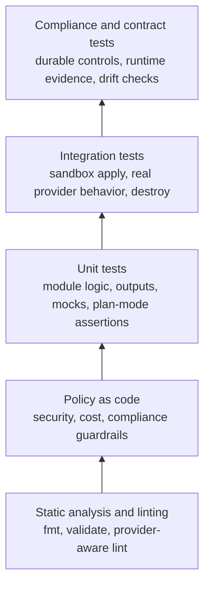

> **Complexity**: `[COMPLEX]` | **Time to Complete**: 75-90 minutes | **Prerequisites**: [Module 6.1: IaC Fundamentals](../module-6.1-iac-fundamentals/), [Module 4.1: Security Mindset](/platform/foundations/security-principles/module-4.1-security-mindset/), and basic unit testing concepts | **Track**: Platform Engineering - Delivery Automation / IaC Discipline

## What You'll Be Able to Do

After completing this module, you will be able to:

- **Design IaC testing strategies spanning unit tests, integration tests, and compliance validation** by matching each infrastructure risk to the cheapest reliable test that can catch it before apply.
- **Implement automated plan-time validation using tools like Terratest, Checkov, and OPA** by turning a proposed infrastructure diff into assertions that reviewers and CI can evaluate consistently.
- **Build CI pipelines that catch infrastructure misconfigurations before they reach production** by ordering fast static checks, policy checks, plans, sandbox applies, and cleanup into a dependable promotion path.
- **Evaluate test coverage for IaC modules to ensure critical infrastructure paths are validated** by reasoning about blast radius, control ownership, flake, and sandbox cost instead of chasing a single coverage percentage.

## Why This Module Matters

Hypothetical scenario: A platform team maintains a reusable network module used by ten application teams and two production regions. A developer changes a default security group rule so a staging database migration can connect from a temporary runner, the pull request receives a quick approval because the HCL looks small, and the next production apply expands an ingress rule in a way nobody intended. No exception is thrown, no unit test crashes, and no compiler warns the reviewer that the change moved from "one private subnet" to "any address matching this broad range." The infrastructure platform simply accepts the new desired state and asks the cloud provider to make it true.

That is the uncomfortable difference between testing application code and testing infrastructure code. A bad application change usually fails inside a process boundary first; a bad infrastructure change may create public network paths, delete data retention settings, undercut identity boundaries, or provision expensive capacity before anyone notices. Infrastructure as Code gives you reviewable, versioned, repeatable infrastructure, but it does not automatically tell you whether the versioned desired state is safe. Testing is the discipline that turns "we can reproduce this" into "we have evidence that this change preserves the properties we care about."

The useful mental model is a building inspection, not a classroom exam. You do not inspect every bolt with the same method, and you do not wait until people move in before checking whether the fire exits exist. You use cheap inspections for cheap signals, specialized inspections for specialized risks, and selective live inspections where reality matters more than theory. IaC testing works the same way: format checks and schema validation catch basic defects, policy tests catch classes of unsafe designs, plan assertions catch unintended diffs, unit tests catch module logic, integration tests prove that providers and cloud APIs behave as expected, and compliance tests create durable evidence for controls that must remain true over time.

The practice also changes how teams talk about infrastructure risk. Without tests, review conversations tend to orbit personal confidence: "I have deployed this pattern before," "the provider docs look right," or "the staging apply worked last time." With tests, the conversation becomes more concrete: "this module cannot expose SSH from the internet," "this database path always enables encryption," "this plan creates only tagged resources," and "this sandbox apply proves the load balancer responds through the expected path." The goal is not to eliminate judgment; the goal is to give reviewers and operators evidence that scales beyond memory.

## Design IaC Testing Strategies: The Durable Test Pyramid

An IaC testing strategy starts with the same economic idea as an application testing strategy: run the cheapest meaningful checks most often, and reserve expensive checks for changes that need the extra confidence. The pyramid is not a law of nature, but it is a useful budget. Static analysis and linting form the base because they run quickly and do not need credentials. Policy-as-code sits near the base because a small number of reusable rules can reject entire classes of unsafe configuration. Unit tests sit in the middle because they validate module logic without always provisioning live resources. Integration tests sit higher because they create real infrastructure, wait for provider APIs, and must clean up carefully. Compliance and contract tests cut across the pyramid because some controls must be checked before apply, after apply, and periodically after delivery.


```mermaid
flowchart BT
    Static["Static analysis and linting<br/>fmt, validate, provider-aware lint"]
    Policy["Policy as code<br/>security, cost, compliance guardrails"]
    Unit["Unit tests<br/>module logic, outputs, mocks, plan-mode assertions"]
    Integration["Integration tests<br/>sandbox apply, real provider behavior, destroy"]
    Contract["Compliance and contract tests<br/>durable controls, runtime evidence, drift checks"]

    Static --> Policy
    Policy --> Unit
    Unit --> Integration
    Integration --> Contract
```

The base of the pyramid should be boring by design. `terraform fmt -check -recursive` should not require an architecture meeting; it ensures configuration follows Terraform's canonical formatting rules so diffs stay readable. `terraform validate` checks whether a configuration is syntactically valid and internally consistent, but it does not validate remote provider APIs or remote state behavior. A linter such as TFLint adds provider-aware checks, such as deprecated syntax, unused declarations, naming conventions, or cloud-specific arguments that are likely to fail later. These checks are not glamorous, but they protect the attention of reviewers by clearing basic noise before people reason about risk.

Policy-as-code is often the highest return layer because it encodes organizational guardrails as reusable tests rather than relying on every reviewer to remember every rule. A policy can reject public ingress on sensitive ports, missing encryption settings, untagged resources, unsupported regions, overly broad IAM actions, or provider versions that fall outside the platform's supported range. The important point is that policy tests a class of mistakes, not a single module. When the rule is well written, every repository benefits from the same institutional memory, and every future pull request receives the same answer regardless of who is reviewing at midnight.

Unit testing for IaC means checking the logic of a module in isolation. In Terraform, native `.tftest.hcl` files can run `plan` or `apply` operations and use assertions against variables, resources, and outputs. In Pulumi, unit tests often use mocks so the program can execute without calling real cloud APIs. These tests are useful when a module performs nontrivial naming, tagging, subnet calculation, conditional resource creation, or output construction. They should not pretend to prove cloud behavior, because a mock or a plan cannot tell you whether a real load balancer becomes healthy under provider eventual consistency.

Integration testing is where infrastructure testing becomes expensive and valuable. A Terratest or Kitchen-Terraform suite may create a sandbox VPC, deploy the module, query cloud APIs, make an HTTP request, verify a DNS record, inspect a Kubernetes object, and then destroy everything. This is the layer that catches provider behavior, missing permissions, eventual consistency, service quota surprises, and assumptions that only fail in a real control plane. Because integration tests cost time and money, mature teams use them selectively: on reusable modules, on high-blast-radius changes, before releases, and on schedules that match risk.

Compliance and contract tests ask a slightly different question: "What must remain true even if the implementation changes?" A platform contract might say that every storage bucket created through the platform has encryption enabled, ownership controls configured, a retention policy when required, and a tagging shape that cost allocation can consume. The implementation could be Terraform, Pulumi, Crossplane, or a provider-specific service catalog; the contract remains the same. Compliance testing turns these properties into evidence that can be checked in pull requests, after sandbox apply, and during drift detection in production.

## Static Analysis and Linting: Fast Feedback Before Design Debate

Static checks are easy to underestimate because they find mistakes that feel small. The platform value is not the individual formatting error; it is the habit that every infrastructure change receives immediate automated feedback before reviewers spend human attention. A pull request that fails formatting, schema validation, or provider-aware linting is not ready for architectural review. This is the same discipline as failing an application build before code review: protect the review process from avoidable friction, and make the path to correction mechanical.

The boundaries of static analysis matter. `terraform validate` can tell you that your configuration is structurally valid, that required arguments are present, and that references are internally consistent. It cannot tell you that a cloud account has a service quota available, that an IAM principal has permission to create the resource, that a managed database will become reachable, or that a private endpoint policy has the runtime behavior you expect. Treat validation as a strong syntax and configuration consistency check, not as proof that the infrastructure will work after apply.

Provider-aware linting fills part of that gap without needing a real apply. TFLint is a pluggable linter, and provider rulesets can warn about cloud-specific mistakes that generic HCL validation cannot understand. A linter can notice a deprecated argument, a likely invalid instance type, or a naming pattern your platform wants to enforce. This layer is especially helpful for shared modules because module authors can receive fast feedback before a change flows into dozens of downstream stacks.

```bash
terraform fmt -check -recursive
terraform init -backend=false
terraform validate
tflint --init
tflint --recursive
```

The `-backend=false` initialization pattern is useful in local and pull request checks because it initializes providers and modules without connecting to the remote state backend. That keeps early validation from requiring state credentials, which reduces risk and makes the check easier to run for contributors. It does not replace a real plan against the correct backend, because plan-time checks need the current state and provider context. The point is sequencing: fail the cheap local check first, then spend credentials and remote API calls only when the configuration deserves them.

## Policy-as-Code: Guardrails That Catch Classes of Mistakes

Policy-as-code is where IaC testing becomes a platform capability rather than a repository habit. A reusable module test proves that one module behaves a certain way today. A policy rule proves that no module may violate a property the organization considers nonnegotiable. That distinction is why policy can produce high leverage: a single well-reviewed rule can protect many repositories, environments, and teams from a repeated pattern of failure.

The first design decision is whether a policy is preventive, detective, or both. A preventive policy blocks a pull request, a plan, or an admission request before unsafe infrastructure is created. A detective policy reports existing violations after the fact, often through scheduled scans, drift checks, cloud inventory, or compliance evidence collection. Preventive policies are powerful, but they must be precise enough that teams trust them. Detective policies are useful for discovery and gradual rollout because they show the shape of the problem before the platform starts blocking delivery.

Plan-time policy is especially valuable because a plan contains intent. Source-code scanning sees what the configuration declares, while plan scanning can include resolved modules, variable values, provider defaults, count and for_each expansion, and the resource actions Terraform intends to take. Tools such as Checkov can scan Terraform source and Terraform plan JSON. OPA and Conftest can evaluate structured configuration or plan JSON with Rego policies. Sentinel and OPA can also be used in managed Terraform workflows. The durable idea is not the brand of tool; it is that the proposed change becomes machine-readable input to a rule set.

The following policy is intentionally small, but it demonstrates the shape of a plan-time guardrail. It reads Terraform plan JSON and rejects an AWS security group rule that would allow SSH from the public internet. A real platform would need additional rules for IPv6, prefix lists, nested module addresses, exception metadata, and resource variants, but the core pattern stays the same: inspect the proposed diff, identify an unsafe property, and return a clear message the author can act on.

```rego
package terraform.guardrails

import rego.v1

deny contains msg if {
  some i
  change := input.resource_changes[i]
  change.type == "aws_security_group_rule"
  change.change.actions[_] == "create"
  after := change.change.after
  after.type == "ingress"
  after.from_port == 22
  after.to_port == 22
  after.cidr_blocks[_] == "0.0.0.0/0"
  msg := sprintf("SSH from the public internet is not allowed: %s", [change.address])
}
```

```bash
terraform plan -out=tfplan -input=false
terraform show -json tfplan > tfplan.json
conftest test tfplan.json --policy policy
```

Good policy design depends on exception design. A policy without an exception path becomes a political fight when a legitimate edge case appears. A policy with unreviewed inline ignores becomes theater. A better pattern is to require structured exception metadata, expiration, ownership, and a reason that can be audited later. That way the platform can distinguish "this violates the default and has an approved temporary exception" from "this violates the default and nobody noticed." The test still teaches; it just teaches through a controlled waiver instead of a silent bypass.

For Kubernetes-facing infrastructure, policy may also run at admission time. Crossplane, for example, exposes infrastructure abstractions as Kubernetes APIs, so a platform team can combine schema design, composition tests, and admission policies. Kyverno and OPA-based admission patterns can validate resources before they enter the cluster, while CI policies validate the IaC change before it reaches the platform control plane. These layers answer different timing questions: CI asks whether the proposed code is acceptable, and admission asks whether the submitted object is acceptable at runtime.

## Unit Tests: Proving Module Logic Without Pretending to Prove Reality

Unit tests are useful when infrastructure modules contain logic. A module that always creates one resource with fixed arguments may not need many unit tests. A module that calculates subnet CIDRs, derives names, toggles resources based on environment, merges labels, creates optional replicas, or emits outputs consumed by other stacks is software, and software logic deserves tests. The most common mistake is testing the provider instead of the module. A unit test should focus on decisions the module makes, not on whether a cloud service honors its documented behavior.

Terraform's native test framework gives module authors a direct way to express assertions in HCL. A `run` block can use `command = plan` when you want fast validation without provisioning, or it can use the default apply behavior when the test needs real resources. The framework discovers `.tftest.hcl` and `.tftest.json` files, supports variables and provider configuration inside tests, and can assert against named values. This lets module authors keep simple module tests near the module instead of wiring every assertion through an external harness.

```hcl
# tests/module_contract.tftest.hcl
variables {
  environment = "sandbox"
  owner       = "platform"
}

run "standard_tags_are_present" {
  command = plan

  assert {
    condition     = var.environment == "sandbox"
    error_message = "The test environment should be sandbox."
  }

  assert {
    condition     = var.owner == "platform"
    error_message = "The owner variable should match the platform contract."
  }
}
```

Pulumi changes the unit testing conversation because infrastructure definitions are written in general-purpose languages. That means teams can use language-native test frameworks and Pulumi mocks to verify properties without calling provider APIs. The power is real, but so is the boundary: mock-based tests do not execute the full deployment engine, and they cannot prove runtime behavior. Use mocks to test program decisions, resource arguments, naming, and outputs; use integration tests when the provider control plane must be part of the evidence.

Unit tests should be written against stable contracts, not incidental implementation details. If a module promises that every resource receives ownership and environment tags, test that promise. If the module promises that production databases enable backup retention and deletion protection, test those properties. Avoid tests that lock down every generated name or every intermediate local unless those details are part of the module contract. Overly brittle tests punish refactoring and teach teams to delete tests when they become inconvenient.

## Plan-Time vs Apply-Time Testing

Plan-time testing asks, "Given this configuration, variables, state, and provider schema, what would the tool attempt to change?" Apply-time testing asks, "When we ask the provider to make that change, does the real system reach the behavior we expected?" Both are necessary because they catch different defects. A plan can reveal that a change will replace a database, open a network path, remove a retention policy, create resources in the wrong region, or update many objects instead of one. A plan cannot prove that a managed load balancer becomes healthy, that DNS propagation works quickly enough, or that a Kubernetes controller reconciles a Crossplane claim into working cloud resources.

Plan-time tests are cheaper and safer, so they belong in every pull request for meaningful infrastructure changes. They are also excellent for review because they translate HCL into intended actions. Reviewers should not have to infer blast radius from source code alone when a structured plan can show create, update, delete, and replace actions. The plan should be generated with the same variable set and backend context that the environment will use, and the JSON plan should be treated as sensitive because provider values and injected variables can appear in it.

Apply-time tests buy confidence with real cost. They create resources, wait for provider control planes, and sometimes contend with eventual consistency. A strong integration test includes cleanup as a first-class concern, usually with `defer terraform.Destroy(...)` in Terratest, a final destroy step in the CI job, or a time-to-live cleanup process that handles interrupted jobs. If cleanup is an afterthought, the test suite becomes a source of drift, cost, and quota pressure.

Ephemeral environments make apply-time testing practical. A good sandbox is isolated by account, project, subscription, namespace, or cluster; it has restrictive credentials; it has budgets or quotas; and it is easy to identify by tags. The sandbox should be similar enough to production to catch provider and network behavior, but not so privileged that a failed test can damage shared systems. When exact parity is too expensive, document the difference and decide which production risks still require another control.

Terratest illustrates the integration pattern well because it lets Go tests call Terraform, inspect outputs, query provider APIs, and run ordinary assertions. A test can deploy a module into a sandbox, read the load balancer URL from Terraform output, perform an HTTP request, verify response behavior, and destroy the module. Kitchen-Terraform follows a different ecosystem path by combining Test Kitchen, Terraform convergence, and InSpec-style verification. The durable lesson is not that every team must choose one harness; the lesson is that real infrastructure tests need lifecycle control, assertions, and reliable cleanup.

## Implement Automated Plan-Time Validation

Automated plan-time validation is the bridge between static code review and live provisioning. It gives reviewers a structured view of intended changes, gives policy engines an input richer than raw source files, and gives CI a way to reject unsafe infrastructure before resources are touched. A platform team should treat the plan as an artifact with a lifecycle: create it from trusted code and variables, store it only as long as needed, protect it from broad access, evaluate it with policies, and discard it when the review is complete.

The first validation layer is blast-radius analysis. A plan that creates a new tag on one noncritical resource deserves a different review path than a plan that replaces a database, deletes a bucket, or changes a network route table. You can start with simple rules: fail if any production database has a delete action, require additional approval for replacements, reject public ingress to sensitive ports, require tags on all creates, and flag resource counts above an expected threshold. These rules do not need to know every business context to be useful; they need to make risky changes visible early.

The second layer is contract validation. If a reusable module publishes outputs consumed by other stacks, plan-time tests can assert that those outputs exist and have the expected shape. If a platform standard says all resources need `owner`, `environment`, and `cost_center` tags, plan-time policy can inspect every planned resource and reject missing metadata. If a security baseline says storage must be encrypted, the plan can be scanned for resources that would be created without encryption fields. These checks align with the outcome to **Implement automated plan-time validation using tools like Terratest, Checkov, and OPA** because they convert review expectations into executable assertions.

Plan assertions should be careful with unknown values. Infrastructure plans often contain values that are only known after apply, especially provider-generated identifiers, IP addresses, generated passwords, or controller-populated status fields. A robust test checks properties that are knowable at plan time and defers runtime behavior to apply-time tests. When teams ignore this boundary, they either write flaky tests that fail on legitimate unknowns or they write weak tests that pass without checking the property that matters.

Security teams often ask whether source scanning is enough if plan scanning is available. The practical answer is that both have a place. Source scanning is fast, easy to run before provider initialization, and useful for finding obvious bad patterns in files. Plan scanning sees resolved variables, module expansion, and proposed actions, which can be more faithful to what will happen. Use source scanning as a cheap early signal and plan scanning as a stronger gate before apply.

## Build CI Pipelines for Infrastructure Changes

An IaC CI pipeline should be ordered by cost, privilege, and confidence. Start with checks that need no cloud credentials: formatting, validation with backend disabled, linting, and source policy scans. Move next to checks that need read or plan permissions: provider initialization, remote-state access, plan generation, plan JSON export, and plan policy. Reserve apply permissions for isolated sandbox jobs, scheduled module certification, or changes that meet a risk threshold. This ordering reduces credential exposure and gives authors quick feedback before the pipeline spends real resources.

```bash
set -euo pipefail

terraform fmt -check -recursive
terraform init -backend=false
terraform validate
tflint --init
tflint --recursive
checkov -d . --framework terraform
trivy config .

terraform init
terraform plan -out=tfplan -input=false
terraform show -json tfplan > tfplan.json
conftest test tfplan.json --policy policy
```

The pull request gate should produce evidence reviewers can read. A plan summary is more useful when it names creates, updates, deletes, and replacements rather than dumping a thousand-line console log. A policy failure is more useful when it names the resource address, the rule, and the remediation path. A linter result is more useful when it points to the file and line. The pipeline is not only enforcing standards; it is teaching authors how to correct infrastructure safely.

Sandbox apply jobs need stricter discipline than plan jobs. They should use short-lived credentials where the platform supports them, minimal permissions, isolated state, explicit tags, concurrency controls, and guaranteed cleanup. The job should not use production state or production credentials simply because that is the easiest way to get a provider token. A sandbox failure should leave enough logs for debugging, but it should not leak secrets, plan files, provider credentials, or full state snapshots into public artifacts.

Drift checks belong near this conversation because IaC tests are only proof about a moment in time. A pull request can pass every check and production can still drift later through emergency changes, provider-side defaults, console edits, or controller behavior. Scheduled plans, read-only inventory scans, policy scans against deployed resources, and drift remediation workflows close that gap. You will cover drift more deeply in [Module 6.5: Drift Detection & Remediation](../module-6.5-drift-remediation/), but the testing mindset starts here: a control that matters once probably matters again after deployment.

Secrets handling is one of the easiest places to make a good pipeline unsafe. Plan files and state files may contain sensitive values or metadata, even when providers attempt to mark values as sensitive. CI should avoid printing raw plans when possible, should store artifacts with tight retention and access controls, and should prefer identity federation or short-lived credentials over long-lived static secrets. A test that prevents misconfiguration is not worth much if the test pipeline becomes a new credential leak path.

## Evaluate Test Coverage and Test Economics

IaC coverage is not the same as application line coverage. Counting the number of HCL lines touched by tests is a weak proxy because infrastructure risk is unevenly distributed. A small IAM statement can matter more than a large set of harmless tags. A single subnet route can affect every workload in a region. A database deletion protection flag can carry more operational weight than many lines of module plumbing. The useful coverage question is: "Which critical infrastructure promises have evidence, and at what stage is that evidence collected?"

Start with a risk inventory for the module. Identify the resources with high blast radius, sensitive data, external exposure, persistent state, privileged identity, expensive capacity, and cross-team dependencies. For each risk, decide whether the cheapest reliable evidence is static analysis, policy, a unit test, a plan assertion, an integration test, or a runtime compliance check. This creates a coverage map based on properties rather than lines. It also makes gaps visible: if no test can prove that a critical path works after apply, that is a real coverage gap even if the repository has many static checks.

The coverage map should be written in language that product teams, security teams, and operators can all understand. Instead of "resource block has test coverage," write "production databases cannot be destroyed by an ordinary pull request," "public network exposure requires an approved exception," or "every resource created by this module carries cost allocation metadata." These statements are closer to the promises the platform is making. Once the promises are clear, the test choice becomes easier: destruction rules belong in plan policy, network exposure belongs in policy and sometimes sandbox reachability tests, and metadata contracts belong in source or plan checks.

This approach also prevents a common mismatch between module authors and platform consumers. Module authors often think in terms of variables, locals, dynamic blocks, provider resources, and outputs. Consumers think in terms of capabilities: "give me a private database," "give me a queue with dead-letter handling," or "give me a cluster namespace with guardrails." A useful test suite connects those two views. It checks the module's internal logic where that logic is complex, but it reports outcomes in terms of the consumer promise. That makes failures easier to interpret and makes the tests more durable when the implementation changes.

Coverage should be reviewed when risk changes, not only when tests fail. A module that starts as a sandbox helper may later become the standard production path. A storage module that originally managed logs may later manage regulated data. A network module that originally served one team may become a shared ingress pattern. Each of those changes raises the expected evidence level. The tests that were reasonable yesterday may still pass tomorrow while being insufficient for the new blast radius, so coverage review belongs in release planning for shared modules and in architectural review for higher-risk usage.

The most mature teams make coverage gaps explicit rather than pretending every risk is solved. A module README or release note can say which properties are checked statically, which are checked at plan time, which are certified through sandbox apply, and which remain the responsibility of the consuming environment. That honesty is useful. It helps consumers decide whether the module is safe for their use case, helps security teams focus review on real gaps, and keeps platform teams from overpromising confidence that the evidence does not support.

Mocking is an economic choice, not a moral category. A Pulumi mock or Terraform plan-mode test is excellent when you need to validate code decisions quickly and repeatedly. It is insufficient when the risk lives in provider behavior, service availability, permissions, or controller reconciliation. Real provisioning is expensive, but it is sometimes the only honest evidence. A mature test suite mixes both: fast mock or plan tests for module logic, selective sandbox applies for runtime behavior, and periodic checks for controls that must remain true over time.

Flake is part of test economics because unreliable tests teach teams to ignore the pipeline. Infrastructure tests are especially prone to flake because cloud control planes are eventually consistent, quotas are shared, DNS and certificates take time, and cleanup can race with delayed deletion. The answer is not to avoid integration testing; the answer is to design for reality. Use explicit waits, query the condition you care about, isolate resources, control concurrency, give tests enough timeout to be fair, and track repeated failures as a platform reliability problem.

Cost should be visible in the test design. If a sandbox apply creates a cluster, database, and load balancer for every pull request, the organization will eventually ration tests by frustration. If that same module has cheap plan policies for most changes, a nightly integration test for the full stack, and a required sandbox apply only when high-risk files change, the economics may become sustainable. The goal is not "test everything live"; the goal is "buy enough confidence at the right layer."

## Landscape Snapshot - as of 2026-06. This changes fast; verify against vendor docs before relying on specifics.

Terraform's native test framework is documented for Terraform v1.6.0 and later, with plan and apply run modes, assertions, provider configuration inside test files, and provider mocking documented from v1.7.0. Check the current Terraform language documentation before relying on exact syntax or version behavior. Pulumi documents unit tests with mocks, property tests, and integration tests, but the mocking boundary is explicit: mock-based tests do not execute the full engine. Terratest is documented as a Go library for testing infrastructure code, while Kitchen-Terraform documents a Test Kitchen based approach for converging Terraform and verifying the resulting systems.

For policy tools, OPA and Conftest remain useful for generic structured configuration and plan JSON checks, and HashiCorp documents both Sentinel concepts and OPA policy enforcement paths for Terraform workflows. CNCF project pages list Open Policy Agent and Kyverno as Graduated projects as of this snapshot, with Kyverno's project page showing its move to Graduated maturity in 2026. Aqua's tfsec repository and docs state that tfsec is now part of Trivy and encourage the community to transition to Trivy, while Trivy documents Terraform misconfiguration scanning through `trivy config`. Checkov documents source and plan scanning for Terraform, including the caution that Terraform plan files can include dynamically injected arguments and should be handled in a secure CI setting.

| Durable capability | Terraform-native path | Policy/security path | Integration path | Kubernetes-facing path |
|---|---|---|---|---|
| Formatting and schema feedback | `terraform fmt`, `terraform validate` | TFLint rules and source scans | Usually not needed | Kubernetes schema validation for rendered objects |
| Policy before apply | Plan JSON plus assertions | OPA/Conftest, Checkov, Trivy, Sentinel | Optional preflight checks | Kyverno or OPA admission for submitted objects |
| Unit or module logic | `.tftest.hcl` with `command = plan` or mocks | Policy unit tests for rule behavior | Pulumi mocks or language tests | Schema and composition tests for APIs |
| Real behavior | `terraform test` with apply mode where appropriate | Runtime compliance scans | Terratest or Kitchen-Terraform sandbox apply | Admission plus controller reconciliation checks |

## Patterns & Anti-Patterns

### Patterns

**Test the property, not the implementation accident.** A reusable infrastructure module should have clear promises: required tags exist, public ingress is constrained, deletion protection is enabled for persistent data, outputs have a stable shape, and production settings differ from sandbox settings in intentional ways. Tests should assert those promises. When tests lock down incidental local variable names, exact generated strings that are not part of the contract, or every resource attribute copied from the current implementation, they make refactoring harder without adding much safety.

**Move from advisory to blocking policy in stages.** New policy rules are easiest to adopt when teams can see violations before they are blocked. A useful rollout starts with reporting, adds ownership and exception metadata, then blocks new violations once the rule is accurate and the remediation path is clear. This pattern keeps policy from becoming a surprise tax on delivery while still moving the organization toward preventive guardrails.

**Use sandbox applies to certify shared modules.** The more teams depend on a module, the more valuable a real integration test becomes. A module release that has been applied in a sandbox, queried through provider APIs, and destroyed cleanly gives downstream teams stronger evidence than a passing syntax check alone. The sandbox does not need to mirror every production detail, but it should exercise the provider behavior, permissions, and runtime path that make the module risky.

**Treat cleanup as part of the test, not housekeeping.** Every integration test should be designed around cleanup from the first line of code. That means tags that identify test resources, isolated state, destroy steps that run even when assertions fail, and scheduled cleanup for interrupted jobs. A test suite that leaves resources behind creates drift and cost, which eventually causes teams to distrust the testing program itself.

### Anti-Patterns

**Applying first and calling it testing later** is the infrastructure version of testing in production. A successful apply proves only that the provider accepted the request and reached some state. It does not prove that the state was safe, compliant, reachable, cost-aware, or aligned with the module contract. Without assertions, an apply is an action, not a test.

**Relying on human review for repeated policy decisions** wastes expert attention and produces inconsistent results. Reviewers are good at tradeoffs, architecture, and context. They are not reliable machines for remembering every encryption flag, tag shape, region rule, and ingress exception across many repositories. Put repeated decisions into policy, and let reviewers focus on exceptions and design.

**Running live tests with production credentials** creates a risk that is larger than the test itself. A sandbox apply should not be able to mutate production state, delete production resources, or read secrets outside its scope. If the only way to run a test is to borrow production credentials, the platform needs a credential design fix before it needs more tests.

**Counting tools instead of evidence** leads to noisy pipelines. A repository can run five scanners and still miss the one property that matters, or it can run a small number of focused checks and have excellent evidence for its risks. The question is not "Do we use enough tools?" The question is "Which important promises are checked, where are they checked, and what happens when they fail?"

### Decision Framework

| Change or risk | Cheapest useful check | Stronger evidence | When to require live apply |
|---|---|---|---|
| Formatting, syntax, references, provider-aware lint | `fmt`, `validate`, TFLint | Pull request required status checks | Almost never |
| Tags, encryption flags, public ingress, approved regions | Source scan or plan policy | OPA/Conftest, Checkov, Trivy, Sentinel on plan JSON | When provider defaults or controller behavior are uncertain |
| Module naming, conditional resources, output shape | Terraform test plan mode or Pulumi mocks | Contract tests against plan output | When outputs depend on real provider data |
| Network reachability, DNS, load balancer health, controller reconciliation | Not reliably proven statically | Terratest or Kitchen-Terraform sandbox apply | Usually, for reusable or high-blast-radius modules |
| Persistent data controls, identity boundaries, compliance evidence | Policy and plan assertions | Runtime scans and scheduled drift checks | For release certification and periodic assurance |

## Did You Know?

- **Terraform plan files should be treated as sensitive artifacts** because JSON plan output can include resolved variables, provider-derived values, and dynamically injected arguments that may be inappropriate for broad CI artifact access.
- **Policy-as-code can be preventive and detective at the same time** when the same control is used to block new unsafe changes in CI and report existing drift or legacy exceptions after deployment.
- **A mock-based infrastructure unit test is still valuable** when it verifies module decisions, but it should not be presented as proof that a real provider, controller, DNS record, or load balancer behaves correctly.
- **CNCF project maturity is a moving fact, not a permanent shortcut** because project status can change over time, so training material should cite dated project pages instead of making vague maturity claims.

## Common Mistakes

| Mistake | Problem | Solution |
|---|---|---|
| Treating `terraform validate` as proof of deployability | Validation checks configuration consistency but does not prove provider permissions, quotas, runtime readiness, or service behavior. | Keep validation in the base layer, then add plan policies and selective sandbox applies for risks validation cannot see. |
| Scanning source only and ignoring plan output | Source scans can miss resolved variables, expanded modules, provider defaults, and the exact resource actions Terraform intends to take. | Generate plan JSON in trusted CI and evaluate it with policy tools before apply. |
| Writing policies with no exception workflow | Teams will bypass or resent policies that cannot handle legitimate edge cases or temporary migrations. | Require structured exception metadata, owner, reason, expiration, and review path. |
| Running integration tests without reliable cleanup | Failed jobs leave resources behind, creating cost, drift, quota pressure, and confusing future test results. | Use isolated state, cleanup hooks, test tags, destroy-on-failure behavior, and scheduled cleanup for interrupted runs. |
| Using production credentials in test jobs | A test failure or compromised pipeline can mutate production or leak sensitive state. | Use least-privilege sandbox credentials, short-lived identity where possible, and separate state backends. |
| Testing incidental implementation details | Brittle tests fail during harmless refactors and encourage teams to delete the suite. | Test stable module contracts such as tags, outputs, security properties, and environment-specific behavior. |
| Measuring coverage by file count or tool count | Many checks can still miss high-blast-radius controls while creating noise. | Build a property coverage map tied to data, network, identity, cost, and persistence risks. |

## Quiz

1. **Scenario: A pull request changes a Terraform module that manages database subnet groups and security groups. The author says `terraform validate` passed, so the change is safe to apply. What is wrong with that reasoning?**

   <details>
   <summary>Answer</summary>
   `terraform validate` is useful, but it checks configuration validity and internal consistency rather than runtime safety. It does not prove that the plan keeps the database private, avoids replacement, preserves tags, or has provider permissions. A stronger workflow would add plan-time validation and policy checks before apply. This supports the outcome to **Design IaC testing strategies spanning unit tests, integration tests, and compliance validation** because you choose checks based on the risk each layer can actually see.
   </details>

2. **Scenario: A security team wants every storage resource to use encryption and ownership tags. Should this be a reviewer checklist item, a policy-as-code rule, or an integration test?**

   <details>
   <summary>Answer</summary>
   It should usually start as a policy-as-code rule because it is a repeated organizational control that can be checked before apply. Reviewers should handle context and exceptions, not remember the same field-level rule in every pull request. Integration tests may still be useful if the provider or platform fills defaults only after apply. This is a concrete example of how to **Implement automated plan-time validation using tools like Terratest, Checkov, and OPA** by checking a proposed plan against a durable contract.
   </details>

3. **Scenario: A reusable load balancer module passes formatting, validation, linting, and plan policy. Users still report that the health check fails after deployment. Which testing layer is missing?**

   <details>
   <summary>Answer</summary>
   The missing layer is an apply-time integration test in a sandbox environment. Static checks and plan policies can verify intended configuration, but they cannot prove that the load balancer, target group, network path, and health check become healthy in a real provider control plane. A Terratest or similar suite could deploy the module, query outputs, make a request, assert behavior, and destroy the resources. That test complements the outcome to **Evaluate test coverage for IaC modules to ensure critical infrastructure paths are validated** because runtime reachability is a critical path.
   </details>

4. **Scenario: A team wants to run sandbox applies on every pull request, but each run creates expensive resources and sometimes flakes because cloud APIs take longer than expected. How should the platform team respond?**

   <details>
   <summary>Answer</summary>
   The platform should redesign the economics rather than abandon integration testing. Keep cheap static, policy, and plan checks on every pull request, then run live applies for high-risk changes, reusable module releases, scheduled certification, or paths where runtime behavior matters. The team should also add explicit waits, isolated state, cleanup, quotas, and flake tracking. This helps **Build CI pipelines that catch infrastructure misconfigurations before they reach production** without turning the pipeline into an unreliable cost center.
   </details>

5. **Scenario: A developer adds `#checkov:skip` comments to several resources because a scanner blocks the pull request, but the comments have no owner, reason, or expiration. What should the platform do?**

   <details>
   <summary>Answer</summary>
   The platform should treat unstructured skips as a policy weakness, not as normal review evidence. Legitimate exceptions need an owner, reason, expiration, and review path so future auditors and maintainers can tell temporary risk acceptance from accidental bypass. The policy can allow structured exceptions while rejecting anonymous ignores. This keeps plan-time validation useful and preserves trust in the guardrail.
   </details>

6. **Scenario: A Pulumi program has mock-based unit tests proving that resource names and tags are generated correctly. Does that remove the need for integration tests?**

   <details>
   <summary>Answer</summary>
   No, because mock-based tests prove program logic, not real provider behavior. They are excellent for fast feedback on naming, tagging, outputs, and conditional resource creation, but they cannot prove service readiness, permissions, quota behavior, DNS, or controller reconciliation. Use mocks for cheap module evidence and sandbox applies for risks that only appear in real infrastructure. That distinction is central when you **Evaluate test coverage for IaC modules to ensure critical infrastructure paths are validated**.
   </details>

7. **Scenario: Your IaC CI job needs a Terraform plan for policy checks. What precautions should you take with credentials and artifacts?**

   <details>
   <summary>Answer</summary>
   Use the least privilege needed for planning, prefer short-lived credentials or identity federation where available, and avoid production apply permissions in pull request jobs. Treat plan JSON as sensitive because it can contain resolved values and dynamically injected arguments, then restrict artifact access and retention. Generate the plan in trusted CI, scan it, summarize results for reviewers, and discard it when no longer needed. These practices help **Build CI pipelines that catch infrastructure misconfigurations before they reach production** without creating a new secret exposure path.
   </details>

## Hands-On

In this exercise, you will create a small local Terraform module contract, add plan-mode tests for module behavior, and evaluate the same workflow shape you would use before adding cloud-provider credentials. Use a scratch directory outside production infrastructure, and do not point these commands at a production backend or workspace.

```bash
mkdir -p iac-testing-lab/tests
cd iac-testing-lab

cat > main.tf <<'EOF'
terraform {
  required_version = ">= 1.6.0"
}

variable "environment" {
  type = string

  validation {
    condition     = contains(["sandbox", "production"], var.environment)
    error_message = "environment must be sandbox or production."
  }
}

variable "owner" {
  type = string
}

locals {
  standard_tags = {
    environment = var.environment
    owner       = var.owner
    managed_by  = "terraform"
  }
}

output "standard_tags" {
  value = local.standard_tags
}
EOF

cat > tests/contract.tftest.hcl <<'EOF'
variables {
  environment = "sandbox"
  owner       = "platform"
}

run "standard_tags_contract" {
  command = plan

  assert {
    condition     = output.standard_tags.environment == "sandbox"
    error_message = "standard_tags must include the environment."
  }

  assert {
    condition     = output.standard_tags.owner == "platform"
    error_message = "standard_tags must include the owner."
  }

  assert {
    condition     = output.standard_tags.managed_by == "terraform"
    error_message = "standard_tags must identify Terraform as the manager."
  }
}
EOF

terraform fmt -check -recursive
terraform init -backend=false
terraform validate
terraform test
```

Success criteria:

- [ ] The local module has a `tests/contract.tftest.hcl` file that uses `command = plan` and asserts at least three properties of the module contract.
- [ ] `terraform fmt -check -recursive`, `terraform init -backend=false`, `terraform validate`, and `terraform test` complete successfully in the scratch directory.
- [ ] You can explain which risks this test does not cover, including provider permissions, runtime service behavior, drift after deployment, and real cleanup of provisioned resources.
- [ ] You can identify one policy-as-code rule that would be better checked against plan JSON than as a reviewer checklist.

## Sources

- [Terraform tests language documentation](https://developer.hashicorp.com/terraform/language/tests)
- [Terraform test command reference](https://developer.hashicorp.com/terraform/cli/commands/test)
- [Terraform validate command reference](https://developer.hashicorp.com/terraform/cli/commands/validate)
- [Terraform plan command reference](https://developer.hashicorp.com/terraform/cli/commands/plan)
- [Terraform show command reference](https://developer.hashicorp.com/terraform/cli/commands/show)
- [Terraform JSON output format](https://developer.hashicorp.com/terraform/internals/json-format)
- [Terratest documentation](https://terratest.gruntwork.io/)
- [Kitchen-Terraform documentation](https://newcontext-oss.github.io/kitchen-terraform/)
- [Pulumi testing guide](https://www.pulumi.com/docs/iac/guides/testing/)
- [Pulumi unit testing guide](https://www.pulumi.com/docs/iac/guides/testing/unit/)
- [TFLint repository documentation](https://github.com/terraform-linters/tflint)
- [TFLint AWS ruleset documentation](https://github.com/terraform-linters/tflint-ruleset-aws)
- [Checkov overview](https://www.checkov.io/1.Welcome/What%20is%20Checkov.html)
- [Checkov Terraform plan scanning](https://www.checkov.io/7.Scan%20Examples/Terraform%20Plan%20Scanning.html)
- [Trivy Terraform scanning documentation](https://trivy.dev/docs/v0.59/tutorials/misconfiguration/terraform/)
- [tfsec is now part of Trivy](https://github.com/aquasecurity/tfsec)
- [OPA Terraform documentation](https://www.openpolicyagent.org/docs/terraform)
- [Conftest entry in the OPA ecosystem](https://www.openpolicyagent.org/ecosystem/entry/conftest)
- [CNCF Open Policy Agent project page](https://www.cncf.io/projects/open-policy-agent-opa/)
- [CNCF Kyverno project page](https://www.cncf.io/projects/kyverno/)
- [HashiCorp Sentinel policy-as-code concepts](https://developer.hashicorp.com/sentinel/docs/concepts/policy-as-code)
- [HashiCorp OPA policy enforcement for HCP Terraform](https://developer.hashicorp.com/terraform/cloud-docs/workspaces/policy-enforcement/define-policies/opa)
- [Kyverno ValidatingPolicy documentation](https://kyverno.io/docs/policy-types/validating-policy/)
- [Crossplane composite resource definition documentation](https://docs.crossplane.io/latest/composition/composite-resource-definitions/)

## Next Module

Next: [Module 6.3: IaC Security](../module-6.3-iac-security/)
