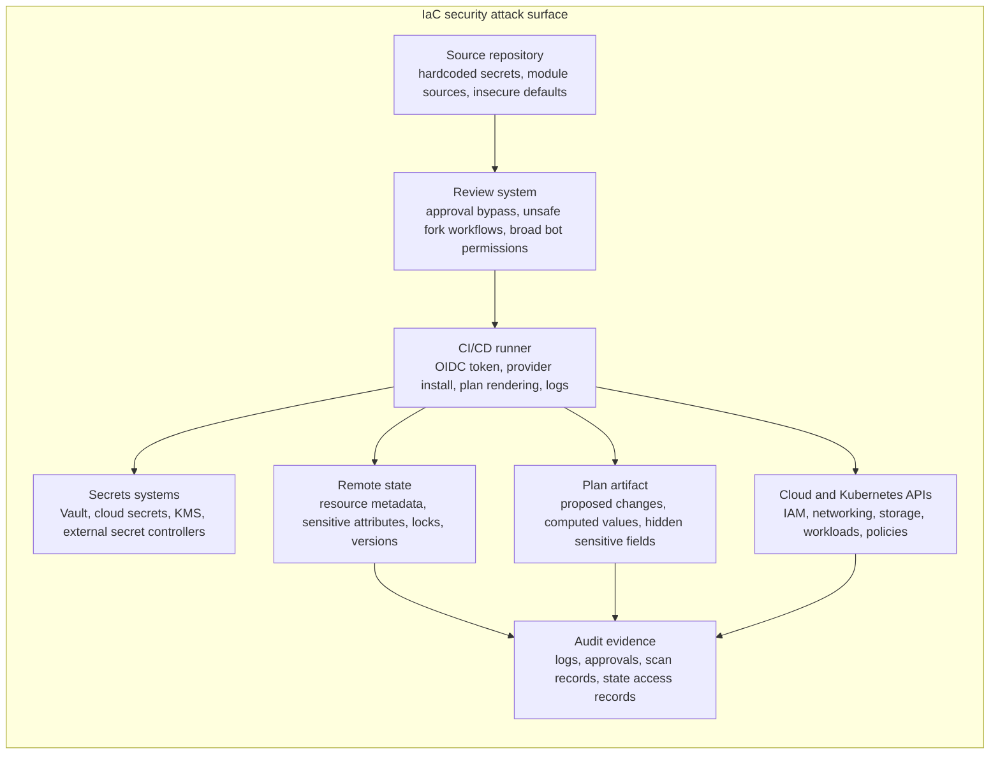

## Complexity: [COMPLEX]
## Time to Complete: 70 minutes

## Prerequisites

Before starting this module, you should have completed [Module 6.1: IaC Fundamentals](../module-6.1-iac-fundamentals/) because this lesson assumes you already know why declarative infrastructure uses state, providers, plans, and modules. You should also have completed [Module 6.2: IaC Testing](../module-6.2-iac-testing/) because security controls are most useful when they are built into the same test-and-review path as correctness checks.

You should be comfortable reading Terraform-style HCL, basic YAML, cloud IAM policies, CI pipeline definitions, and Kubernetes object manifests. The examples use Terraform and AWS because they make the attack paths concrete, but the reasoning applies equally to OpenTofu, Pulumi, CloudFormation, Bicep, Crossplane, and GitOps-managed Kubernetes resources.

You should also have a working mental model of defense in depth from [Module 4.2: Defense in Depth](/platform/foundations/security-principles/module-4.2-defense-in-depth/). IaC security is not one scanner, one encrypted bucket, or one secret manager; it is a chain of controls that keep a single mistake from becoming a production incident.

## Learning Outcomes

After completing this module, you will be able to:

- **Analyze** an IaC delivery path and identify where secrets, state files, plans, provider credentials, modules, and review permissions can be abused by an attacker.
- **Design** a policy-as-code gate that combines secret scanning, static IaC scanning, plan scanning, and human approval without blocking normal developer flow.
- **Debug** insecure Terraform configurations by interpreting scanner findings, fixing the infrastructure definition, and validating that the fix addresses the actual risk.
- **Evaluate** secret handling patterns for IaC and choose whether a value belongs in code, variables, state, a secret manager, a runtime controller, or a separately rotated credential system.
- **Justify** least-privilege CI and cloud IAM decisions using blast-radius reasoning, trust boundaries, and evidence that an auditor can inspect later.

## Why This Module Matters

A platform team at a regional payments company believed their Terraform was already secure because nobody committed `.tfvars` files and the state bucket had server-side encryption enabled. Their deployment pipeline used a cloud role, their pull requests required review, and their storage bucket was private. From a distance, the system looked mature enough that security review became a formality instead of a real inspection.

The incident began when an engineer opened a pull request from a fork that changed a Terraform module source to a similarly named public repository. The pipeline ran `terraform init` and `terraform plan` automatically because the team wanted fast preview comments on every change. That plan step executed with enough cloud permissions to read remote state, resolve data sources, and render a plan artifact that contained sensitive values marked as "sensitive" in the console but still present in the binary plan file.

The attacker did not need to break encryption on the state bucket. They abused the workflow that already had permission to decrypt it. They downloaded the plan artifact, extracted database connection strings and internal resource names, then used those clues to target a misconfigured staging service that had network access to production. The first visible symptom was not a failed scan; it was an unusual database login from a build runner address that nobody had included in the incident runbook.

This module teaches IaC security as an operating discipline, not as a list of tools. You will learn how to reason about what each control protects, what it does not protect, and how controls combine across source code, state, secrets, CI/CD, cloud IAM, Kubernetes, and audit evidence. The goal is not to make Terraform "safe" in the abstract; the goal is to make infrastructure change paths secure enough that a bad commit, leaked token, or compromised runner cannot silently become a production breach.

> **Active learning prompt:** If a state bucket is private and encrypted at rest, which actor still needs legitimate decrypt access for normal deployments, and what happens if that actor is compromised?

## 1. Map the IaC Security Attack Surface Before Choosing Tools

IaC security starts with a map because attackers do not care which team owns a boundary. A Terraform repository might belong to platform engineering, a GitHub Actions workflow might belong to developer experience, a state bucket might belong to cloud operations, and a secret manager might belong to security. During an incident, however, all of those components form one attack path, and a weak decision in any one layer can expose everything downstream.

A beginner mistake is to treat IaC files as "just configuration" and scan only for obvious cloud misconfigurations, such as public buckets or open security groups. A senior operator asks a broader question: what can this code cause a trusted automation identity to read, write, print, cache, upload, or destroy? That question changes the review from syntax checking into system design.



The map shows why "we use encryption" is not a complete answer. Encryption protects data from someone who steals the storage medium or gains raw object access without decrypt permission. It does not protect data from the deployment role, the pipeline step that renders a plan, the person who can download artifacts, or the module code that can cause Terraform to read sensitive data sources.

```ascii
+----------------------+        +----------------------+        +----------------------+
| Source repository    |        | CI/CD runner         |        | Cloud control plane  |
| - HCL and modules    | -----> | - provider plugins   | -----> | - IAM and resources  |
| - review comments    |        | - plan and apply     |        | - audit events       |
| - policy exceptions  |        | - temporary creds    |        | - runtime drift      |
+----------+-----------+        +----------+-----------+        +----------+-----------+
           |                               |                               |
           v                               v                               v
+----------------------+        +----------------------+        +----------------------+
| Secret manager       |        | Remote state backend |        | Evidence store       |
| - values and leases  | <----> | - resource metadata  | -----> | - logs and reports   |
| - rotation history   |        | - sensitive fields   |        | - approvals          |
| - access policies    |        | - object versions    |        | - scan results       |
+----------------------+        +----------------------+        +----------------------+
```

Use this diagram as a threat-model checklist. If you cannot explain who can read each box, who can write each box, and what evidence proves those permissions are appropriate, the system is not ready for production. The strongest IaC programs keep this map current as pipelines evolve, providers change, and teams adopt new module registries or secret controllers.

| Surface | What can go wrong | Strong control | Evidence to keep |
|---|---|---|---|
| Source repository | Secrets, unsafe module sources, insecure defaults, and unreviewed exceptions enter the change path. | Branch protection, secret scanning, signed commits where appropriate, CODEOWNERS, and policy checks before merge. | Pull request approvals, scanner results, exception records, and module provenance records. |
| CI/CD runner | Trusted automation executes untrusted code or exposes credentials through logs, artifacts, and plugins. | OIDC, minimal job permissions, protected environments, pinned actions, isolated runners, and artifact encryption. | Workflow logs, OIDC trust policy, environment approval history, and artifact retention settings. |
| State backend | Sensitive resource attributes and topology become readable to too many humans or machines. | Remote backend, SSE-KMS, narrow IAM, versioning, access logging, lock table, and state separation by environment. | Bucket policy, KMS policy, object access logs, state lock records, and restore tests. |
| Secret system | Terraform pulls secrets into state or creates secrets that cannot be rotated without downtime. | Runtime secret injection, dynamic credentials, lifecycle boundaries, and rotation runbooks. | Secret access logs, rotation history, lease records, and dependency maps. |
| Cloud API | Terraform role can create privilege escalation paths or modify resources outside its ownership. | Permission boundaries, scoped roles, tag conditions, service control policies, and separate plan/apply roles. | IAM policy review, access analyzer findings, CloudTrail events, and denied-action tests. |
| Audit path | Security cannot reconstruct who changed what, which controls passed, or why an exception existed. | Immutable logs, PR-linked runs, policy decision logs, and release records tied to state versions. | CloudTrail, CI run IDs, SARIF uploads, change tickets, and approved exception expiration dates. |

A practical way to apply the map is to classify every IaC value by consequence. Public metadata such as a bucket name has low confidentiality but might still reveal naming conventions. A database password has high confidentiality and operational impact. A provider token has high privilege and might let an attacker mint additional access. A Terraform plan can include all three, so treating plans as harmless review artifacts is a design error.

> **Active learning prompt:** Your team wants every pull request to receive an automatic Terraform plan comment. Before approving that workflow, list three things the plan job can read that a random pull-request author should not be able to read.

The safest teams make trust boundaries explicit in repository documentation. They state which branches can request cloud credentials, which events can run plans, which identities can apply changes, which state files each identity can read, and where exceptions are recorded. That documentation is not bureaucracy; it is the operating manual for debugging security failures when a pipeline behaves differently than expected.

The first design principle is separation of duties. Planning and applying are different actions, and they do not always need the same privileges. A pull request plan might run with read-only cloud access against non-sensitive data sources, while an approved main-branch apply uses a stronger role after human approval. If the plan needs production secrets to render, that is a signal that the module design may be coupling review too tightly to runtime credentials.

The second design principle is fail closed with useful feedback. A scanner that fails silently, a policy exception that never expires, or a workflow that marks security jobs as informational in production is just decoration. Good controls block dangerous changes, explain the reason, and show the developer the smallest safe change that would satisfy the policy.

The third design principle is evidence by default. Auditors and incident responders need more than "the scan passed when we merged." They need a durable record of which code was scanned, which policy bundle was used, who approved the exception, which cloud identity applied the change, and which state version resulted from that run. IaC is uniquely good at creating this evidence because every change already flows through version control and automation.

## 2. Build Policy-as-Code Gates That Teach and Block

Policy-as-code turns security decisions into executable review rules. The value is not only that a scanner can catch public S3 buckets; the value is that every pull request receives the same explanation, the same severity model, and the same escalation path. That consistency lets platform teams move security review earlier without asking every application team to become cloud security specialists.

Static scanning and plan scanning answer different questions. Static scanning reads the source configuration before provider defaults, variables, and data sources are fully resolved. Plan scanning reads the proposed change after Terraform has evaluated expressions and provider behavior. Static scanning is faster and safer for untrusted pull requests, while plan scanning is more accurate but may require stronger credentials and careful artifact handling.

```ascii
+--------------------+     +--------------------+     +--------------------+     +--------------------+
| Commit arrives     | --> | Static source scan | --> | Terraform plan     | --> | Plan policy scan   |
| - HCL, YAML, JSON  |     | - fast feedback    |     | - resolved graph   |     | - accurate values  |
| - module sources   |     | - no cloud access  |     | - cloud reads      |     | - sensitive output |
+--------------------+     +--------------------+     +--------------------+     +--------------------+
          |                          |                          |                          |
          v                          v                          v                          v
+--------------------+     +--------------------+     +--------------------+     +--------------------+
| Secret scan        |     | Developer fixes    |     | Protected approval |     | Apply or reject    |
| - tokens in repo   |     | - local command    |     | - environment gate |     | - evidence stored  |
+--------------------+     +--------------------+     +--------------------+     +--------------------+
```

A good gate has a severity model that matches business risk. Critical findings should block immediately when they expose credentials, public databases, unauthenticated administrative access, or privilege escalation. Medium findings might block in production but warn in a sandbox. Low findings can be tracked as hygiene when they do not create a realistic attack path, but they still need an owner and an expiration date if they become exceptions.

Tool choice matters less than rule coverage and workflow design. Checkov is useful when one pipeline must scan Terraform, Kubernetes manifests, Helm charts, CloudFormation, and other IaC formats. Trivy is useful when the same team wants one scanner for configuration, container images, and filesystem secrets. OPA and Conftest are useful when you need organization-specific policies written in Rego. Terraform Cloud and Enterprise Sentinel policies are useful when your plan and apply workflow already lives there.

| Tool pattern | Best fit | Strength | Watch out |
|---|---|---|---|
| Static IaC scanner | Pull-request feedback before cloud credentials are issued. | Fast, cheap, and easy to run on forks or local workstations. | Can miss computed values, provider defaults, and runtime data source results. |
| Plan scanner | Production change review after variables and modules are resolved. | More accurate because the proposed resource graph is known. | Plan files can contain sensitive values and must be protected like state. |
| General policy engine | Custom organizational rules that span teams and platforms. | Flexible enough to encode naming, ownership, network, and compliance rules. | Requires rule engineering discipline, tests, versioning, and exception lifecycle. |
| Managed policy platform | Teams that want built-in dashboards, baselines, and compliance mapping. | Easier reporting and central visibility across repositories. | Can become shelfware if developers cannot reproduce findings locally. |

The worked example below starts with a deliberately unsafe Terraform file. The goal is not to deploy it; the goal is to learn how to interpret findings and convert them into concrete code changes. The commands use `.venv/bin/python` because this repository standard requires the virtual environment explicitly when Python tooling is used.

```bash
mkdir -p iac-security-lab/terraform
cd iac-security-lab
.venv/bin/python -m pip install checkov
cat > terraform/main.tf <<'EOF'
terraform {
  required_version = ">= 1.6.0"
  required_providers {
    aws = {
      source  = "hashicorp/aws"
      version = "~> 5.0"
    }
  }
}

variable "db_password" {
  default = "ChangeMeNow123!"
}

resource "aws_s3_bucket" "uploads" {
  bucket = "example-prod-uploads-insecure"
}

resource "aws_security_group" "admin" {
  name        = "admin-open-ssh"
  description = "Administrative access"

  ingress {
    description = "SSH from the internet"
    from_port   = 22
    to_port     = 22
    protocol    = "tcp"
    cidr_blocks = ["0.0.0.0/0"]
  }
}

resource "aws_db_instance" "orders" {
  identifier           = "orders-prod"
  engine               = "postgres"
  instance_class       = "db.t3.micro"
  allocated_storage    = 20
  username             = "orders_admin"
  password             = var.db_password
  publicly_accessible  = true
  storage_encrypted    = false
  skip_final_snapshot  = true
}
EOF
checkov -d terraform --framework terraform
```

When you read scanner output, do not treat it as a pass/fail oracle. Treat each finding as a question about an attack path. "S3 bucket has no encryption" asks what data could land in the bucket and who could read raw objects. "Security group allows SSH from everywhere" asks whether a management port is reachable by the internet. "RDS is public and unencrypted" asks whether network exposure and data-at-rest exposure combine into a more severe incident.

A strong remediation changes architecture, not only syntax. For the S3 bucket, adding encryption is necessary but incomplete without public access blocks and ownership controls. For SSH, replacing `0.0.0.0/0` with a corporate CIDR might be acceptable in a legacy environment, but a better platform pattern is to remove direct SSH and use session manager access with audit logs. For the database, private subnets, security groups, encryption, final snapshots, and password rotation all matter.

```hcl
terraform {
  required_version = ">= 1.6.0"
  required_providers {
    aws = {
      source  = "hashicorp/aws"
      version = "~> 5.0"
    }
    random = {
      source  = "hashicorp/random"
      version = "~> 3.6"
    }
  }
}

variable "environment" {
  description = "Deployment environment name used for ownership tags."
  type        = string
  default     = "production"
}

resource "random_id" "suffix" {
  byte_length = 4
}

resource "aws_s3_bucket" "uploads" {
  bucket = "example-${var.environment}-uploads-${random_id.suffix.hex}"

  tags = {
    Environment        = var.environment
    ManagedBy          = "terraform"
    DataClassification = "internal"
  }
}

resource "aws_s3_bucket_public_access_block" "uploads" {
  bucket = aws_s3_bucket.uploads.id

  block_public_acls       = true
  block_public_policy     = true
  ignore_public_acls      = true
  restrict_public_buckets = true
}

resource "aws_s3_bucket_versioning" "uploads" {
  bucket = aws_s3_bucket.uploads.id

  versioning_configuration {
    status = "Enabled"
  }
}

resource "aws_s3_bucket_server_side_encryption_configuration" "uploads" {
  bucket = aws_s3_bucket.uploads.id

  rule {
    apply_server_side_encryption_by_default {
      sse_algorithm = "aws:kms"
    }
    bucket_key_enabled = true
  }
}

resource "aws_security_group" "web" {
  name        = "web-https-only"
  description = "Public HTTPS ingress only"

  ingress {
    description = "HTTPS from clients"
    from_port   = 443
    to_port     = 443
    protocol    = "tcp"
    cidr_blocks = ["0.0.0.0/0"]
  }

  egress {
    description = "Allow outbound application traffic"
    from_port   = 0
    to_port     = 0
    protocol    = "-1"
    cidr_blocks = ["0.0.0.0/0"]
  }

  tags = {
    Environment = var.environment
    ManagedBy   = "terraform"
  }
}
```

Notice what the remediation does not do. It does not create a password in a variable default, it does not publish a plan artifact, and it does not grant the Terraform role administrator access so the example is easier to apply. Secure IaC often feels slower at first because every convenience is inspected for what it exposes to the next actor in the chain.

> **Active learning prompt:** The secure S3 example enables encryption, versioning, and public access blocks. Which of those controls protects confidentiality, which protects recoverability, and which protects exposure prevention?

Custom policies become useful when built-in checks cannot express your organization’s actual standard. For example, a healthcare platform might require every storage bucket with patient data to use a customer-managed KMS key, a data classification tag, and access logging to a central account. A generic scanner can catch missing encryption, but it cannot know your internal retention owner unless you teach it.

The following Rego policy is runnable with Conftest against Terraform plan JSON or simplified JSON input. In production you would write tests for the policy itself, version the policy bundle, and publish examples that developers can run locally before opening a pull request. The point is to make the rule executable, not merely documented in a wiki.

```rego
package terraform.security

deny[msg] {
  resource := input.resource_changes[_]
  resource.type == "aws_s3_bucket"
  not resource.change.after.tags.DataClassification
  msg := sprintf("bucket %s must include a DataClassification tag", [resource.address])
}

deny[msg] {
  resource := input.resource_changes[_]
  resource.type == "aws_security_group"
  ingress := resource.change.after.ingress[_]
  ingress.from_port == 22
  ingress.cidr_blocks[_] == "0.0.0.0/0"
  msg := sprintf("security group %s must not expose SSH to the internet", [resource.address])
}

deny[msg] {
  resource := input.resource_changes[_]
  resource.type == "aws_db_instance"
  resource.change.after.publicly_accessible == true
  msg := sprintf("database %s must not be publicly accessible", [resource.address])
}
```

Policy exceptions need the same rigor as policy rules. An exception should name the owner, resource, reason, compensating control, review date, and expiration date. Permanent exceptions are usually design debt disguised as governance. If a team really needs an internet-facing database for a migration window, the exception should expire automatically and alert both the owning team and the platform team before it becomes stale.

A useful gate also teaches developers how to fix findings. A scanner message that says "CKV_AWS_X failed" is weak feedback. A platform-owned policy should explain the risk, link to a secure module, and show the smallest acceptable change. Developers are more likely to adopt security standards when the paved road is faster than arguing with the gate.

## 3. Keep Secrets Out of Code, Plans, and State Whenever Possible

Secrets in IaC are dangerous because Terraform and similar tools are designed to remember the world. State exists so the tool can compare desired infrastructure to real infrastructure, but that same memory can retain generated passwords, access keys, database connection strings, certificate material, and provider-returned attributes. Marking a value as sensitive hides it in some CLI output; it does not guarantee the value is absent from state or plan files.

The first rule is simple: do not put long-lived secrets in source code. A committed secret is still compromised even if the next commit deletes it, because Git history, forks, CI logs, package mirrors, and external scanners may already have a copy. The correct incident response is rotation and investigation, not editing the file and hoping nobody noticed.

```hcl
variable "db_password" {
  description = "Database password supplied outside source control."
  type        = string
  sensitive   = true
}

output "db_endpoint" {
  description = "Database endpoint without credentials."
  value       = aws_db_instance.orders.endpoint
}

output "db_connection_string" {
  description = "Connection string that includes a sensitive password."
  value       = "postgres://${var.db_username}:${var.db_password}@${aws_db_instance.orders.endpoint}/orders"
  sensitive   = true
}
```

The `sensitive = true` attribute is useful but often misunderstood. It reduces accidental display in plans, logs, and outputs, which is valuable for human review and CI output. It does not transform Terraform into a secret manager, and it does not remove all sensitive values from state when a provider schema stores those values as resource attributes.

```ascii
+---------------------------+        +---------------------------+
| Terraform input variable  |        | Terraform state backend   |
| sensitive = true          | -----> | may still store value     |
| hidden in CLI output      |        | access must be restricted |
+---------------------------+        +---------------------------+
                 |
                 v
+---------------------------+        +---------------------------+
| Provider API request      | -----> | Cloud resource attribute  |
| needs real secret value   |        | may return or retain data |
+---------------------------+        +---------------------------+
```

A better pattern is to let Terraform create the secret container and permissions, while runtime systems create, rotate, or inject the secret value. For example, Terraform can create an AWS Secrets Manager secret, a KMS key, an IAM role that may read a specific path, and a Kubernetes ExternalSecret object. The application then receives the secret at runtime, and the infrastructure state does not need to contain the actual password.

```hcl
resource "aws_secretsmanager_secret" "orders_db" {
  name                    = "production/orders/database"
  recovery_window_in_days = 7

  tags = {
    Environment = "production"
    ManagedBy   = "terraform"
    Owner       = "orders-team"
  }
}

resource "aws_iam_policy" "orders_secret_read" {
  name = "orders-secret-read"

  policy = jsonencode({
    Version = "2012-10-17"
    Statement = [{
      Effect = "Allow"
      Action = [
        "secretsmanager:DescribeSecret",
        "secretsmanager:GetSecretValue"
      ]
      Resource = aws_secretsmanager_secret.orders_db.arn
    }]
  })
}
```

The previous example stores no secret value. A separate rotation workflow, break-glass procedure, or database bootstrap job can set the value. That separation improves security because the Terraform role no longer needs to know the password, and state no longer becomes the easiest place to steal it.

When Kubernetes is part of the platform, External Secrets Operator or a similar controller can bridge cloud secret stores into cluster-native Secrets. Terraform installs the controller and IAM relationship, while the controller reconciles specific secret values at runtime. In Kubernetes examples, this course uses `kubectl`; many operators shorten it to `k` after configuring an alias such as `alias k=kubectl`, but the examples here use full commands for clarity.

```yaml
apiVersion: external-secrets.io/v1
kind: ExternalSecret
metadata:
  name: orders-database
  namespace: production
spec:
  refreshInterval: 1h
  secretStoreRef:
    kind: ClusterSecretStore
    name: aws-secrets-manager
  target:
    name: orders-database
    creationPolicy: Owner
  data:
    - secretKey: username
      remoteRef:
        key: production/orders/database
        property: username
    - secretKey: password
      remoteRef:
        key: production/orders/database
        property: password
```

This pattern still has risks. A Kubernetes Secret is base64-encoded, not magically encrypted from every cluster reader. You still need Kubernetes RBAC, encryption at rest for the Kubernetes API server, namespace isolation, controller permissions scoped to exact secret paths, and audit logging for reads. The advantage is that the IaC state manages the wiring while the secret value lives in a system built for rotation and access control.

Some teams use SOPS to encrypt secret files that live beside IaC code. This can be a reasonable GitOps pattern when the encrypted file is the deployable artifact and the decryption key is tightly controlled. It becomes risky when pipelines decrypt the file too early, print it during templating, or feed it into Terraform resources that store the plaintext in state anyway.

```bash
mkdir -p secrets-demo
cd secrets-demo
cat > .sops.yaml <<'EOF'
creation_rules:
  - path_regex: production\.enc\.yaml$
    age: age1exampleexampleexampleexampleexampleexampleexampleexampleexample
EOF
cat > production.yaml <<'EOF'
database:
  username: orders_admin
  password: replace-me-before-use
EOF
sops --encrypt production.yaml > production.enc.yaml
rm production.yaml
```

The command block is runnable only when SOPS and a real key are installed; the placeholder key must be replaced with a valid recipient. In a real platform, that key management decision matters more than the file format. If every developer can decrypt production secrets locally, the repository is encrypted but the access model may still be too broad.

| Pattern | Secret value in Git | Secret value in Terraform state | Operational fit | Main risk |
|---|---|---|---|---|
| Plain variable default | Yes | Often yes | Never acceptable for real credentials. | Git history and state both become breach material. |
| Sensitive variable from CI | No | Often yes | Emergency bridge for legacy modules. | CI logs, plan files, and state access still matter. |
| Terraform creates secret value | No | Often yes | Useful for generated bootstrap values with careful state controls. | Rotation and state exposure must be designed deliberately. |
| Terraform creates secret container only | No | No, if value is managed elsewhere | Strong default for mature platforms. | Requires a separate workflow for initial value and rotation. |
| Runtime secret controller | No | No, if Terraform manages only references | Strong Kubernetes and GitOps pattern. | Cluster RBAC and controller identity become critical. |
| SOPS-encrypted file | Encrypted artifact only | Depends on how consumed | Useful for GitOps and declarative deployments. | Decryption scope and downstream state leakage are easy to miss. |

> **Active learning prompt:** A team says, "We use SOPS, so secrets are safe in Git." What extra question would you ask to determine whether those secrets later appear in Terraform state or CI logs?

Senior practitioners treat secret flow as a data-flow diagram. They draw where the value is created, who can decrypt it, where it is cached, which logs might include it, which state files might retain it, how rotation works, and which services break if it changes. If that diagram is missing, the team is usually relying on hope rather than engineering.

## 4. Protect State, Plan Files, and Provider Credentials Like Production Systems

State files are high-value assets because they combine secrets, resource identifiers, dependencies, and infrastructure topology. Even when a state file contains no obvious passwords, it can reveal account IDs, database endpoints, subnet layouts, IAM role names, private DNS names, storage bucket names, and module structure. That information helps attackers move faster once they have any foothold.

Remote state is safer than local state only when the backend is designed as a sensitive system. A local state file on a laptop can be backed up to consumer cloud storage, copied into support tickets, or committed accidentally. A remote backend can enforce encryption, access control, locking, versioning, and logging. The word "can" matters because an unlogged bucket with broad read access is simply a centralized breach target.

```hcl
terraform {
  backend "s3" {
    bucket         = "company-terraform-state-prod"
    key            = "payments/production/terraform.tfstate"
    region         = "us-east-1"
    encrypt        = true
    kms_key_id     = "arn:aws:kms:us-east-1:123456789012:key/example-key-id"
    dynamodb_table = "terraform-state-locks"
    role_arn       = "arn:aws:iam::123456789012:role/TerraformStateAccess"
  }
}
```

A secure backend has more than a backend block. The bucket needs public access blocks, versioning, restricted principals, server-side encryption with a key whose policy is not overly broad, access logs or CloudTrail data events, lifecycle rules that preserve forensic evidence long enough, and a tested restore path. The lock table needs point-in-time recovery because losing lock metadata during an outage can lead teams into unsafe manual fixes.

```hcl
resource "aws_s3_bucket" "terraform_state" {
  bucket = "company-terraform-state-prod"

  lifecycle {
    prevent_destroy = true
  }

  tags = {
    Purpose            = "terraform-state"
    DataClassification = "restricted"
    ManagedBy          = "terraform"
  }
}

resource "aws_s3_bucket_public_access_block" "terraform_state" {
  bucket = aws_s3_bucket.terraform_state.id

  block_public_acls       = true
  block_public_policy     = true
  ignore_public_acls      = true
  restrict_public_buckets = true
}

resource "aws_s3_bucket_versioning" "terraform_state" {
  bucket = aws_s3_bucket.terraform_state.id

  versioning_configuration {
    status = "Enabled"
  }
}

resource "aws_s3_bucket_server_side_encryption_configuration" "terraform_state" {
  bucket = aws_s3_bucket.terraform_state.id

  rule {
    apply_server_side_encryption_by_default {
      sse_algorithm     = "aws:kms"
      kms_master_key_id = aws_kms_key.terraform_state.arn
    }
    bucket_key_enabled = true
  }
}

resource "aws_dynamodb_table" "terraform_state_locks" {
  name         = "terraform-state-locks"
  billing_mode = "PAY_PER_REQUEST"
  hash_key     = "LockID"

  attribute {
    name = "LockID"
    type = "S"
  }

  point_in_time_recovery {
    enabled = true
  }
}
```

Backend IAM should be narrow and boring. The deployment role for one environment should read and write only that environment’s state prefix. Humans should not have routine read access to production state unless their job requires it, and emergency access should be logged through break-glass controls. Cross-environment state reads should be minimized because they silently couple blast radius between teams.

```hcl
resource "aws_iam_policy" "production_state_access" {
  name = "production-terraform-state-access"

  policy = jsonencode({
    Version = "2012-10-17"
    Statement = [
      {
        Sid    = "StateObjectAccess"
        Effect = "Allow"
        Action = [
          "s3:GetObject",
          "s3:PutObject",
          "s3:DeleteObject"
        ]
        Resource = "arn:aws:s3:::company-terraform-state-prod/payments/production/*"
      },
      {
        Sid    = "StateBucketListPrefix"
        Effect = "Allow"
        Action = "s3:ListBucket"
        Resource = "arn:aws:s3:::company-terraform-state-prod"
        Condition = {
          StringLike = {
            "s3:prefix" = "payments/production/*"
          }
        }
      },
      {
        Sid    = "StateLockAccess"
        Effect = "Allow"
        Action = [
          "dynamodb:GetItem",
          "dynamodb:PutItem",
          "dynamodb:DeleteItem",
          "dynamodb:DescribeTable"
        ]
        Resource = "arn:aws:dynamodb:us-east-1:123456789012:table/terraform-state-locks"
      }
    ]
  })
}
```

Plan files deserve the same classification as state files. Terraform’s human-readable plan output hides sensitive values in many places, but the binary plan and JSON-rendered plan can still contain enough detail to be sensitive. Uploading raw plans as public or broadly readable CI artifacts is a common way to bypass an otherwise careful state backend.

A safer plan workflow keeps plan artifacts short-lived, encrypted, and scoped to the apply job that needs them. It also avoids running privileged plan jobs on untrusted fork events. When a pull request needs feedback from a fork, run static scanning and formatting checks first. Save credentialed plan generation for trusted branches, protected environments, or workflows that require approval before secrets and cloud roles are issued.

```yaml
name: terraform-security

on:
  pull_request:
    paths:
      - "terraform/**"
  push:
    branches:
      - main
    paths:
      - "terraform/**"

permissions:
  contents: read
  pull-requests: write
  id-token: write
  security-events: write

jobs:
  static-scan:
    runs-on: ubuntu-latest
    steps:
      - uses: actions/checkout@v4
      - name: Run Checkov without cloud credentials
        uses: bridgecrewio/checkov-action@v12
        with:
          directory: terraform
          framework: terraform
          soft_fail: false

  plan:
    runs-on: ubuntu-latest
    needs: static-scan
    if: github.event_name == 'push' && github.ref == 'refs/heads/main'
    environment: production-plan
    steps:
      - uses: actions/checkout@v4
      - uses: hashicorp/setup-terraform@v3
        with:
          terraform_version: "1.6.6"
      - name: Configure cloud credentials through OIDC
        uses: aws-actions/configure-aws-credentials@v4
        with:
          role-to-assume: arn:aws:iam::123456789012:role/GitHubActionsTerraformPlan
          aws-region: us-east-1
      - name: Create encrypted plan artifact
        run: |
          cd terraform/environments/production
          terraform init
          terraform plan -out=tfplan
          gpg --symmetric --cipher-algo AES256 --batch --passphrase "${{ secrets.PLAN_ARTIFACT_KEY }}" tfplan
          rm tfplan
      - uses: actions/upload-artifact@v4
        with:
          name: production-tfplan
          path: terraform/environments/production/tfplan.gpg
          retention-days: 1
```

Provider credentials are another state-adjacent risk because they are powerful and often under-reviewed. Static cloud access keys in CI secrets are long-lived bearer tokens; if they leak, an attacker can use them outside the pipeline. OIDC federation is safer because the CI provider exchanges a short-lived signed identity token for temporary cloud credentials, and the trust policy can bind that exchange to a specific repository, branch, workflow, or environment.

```hcl
resource "aws_iam_openid_connect_provider" "github" {
  url = "https://token.actions.githubusercontent.com"

  client_id_list = ["sts.amazonaws.com"]

  thumbprint_list = [
    "6938fd4d98bab03faadb97b34396831e3780aea1"
  ]
}

resource "aws_iam_role" "github_actions_terraform_plan" {
  name = "GitHubActionsTerraformPlan"

  assume_role_policy = jsonencode({
    Version = "2012-10-17"
    Statement = [{
      Effect = "Allow"
      Principal = {
        Federated = aws_iam_openid_connect_provider.github.arn
      }
      Action = "sts:AssumeRoleWithWebIdentity"
      Condition = {
        StringEquals = {
          "token.actions.githubusercontent.com:aud" = "sts.amazonaws.com"
        }
        StringLike = {
          "token.actions.githubusercontent.com:sub" = "repo:company/infrastructure:ref:refs/heads/main"
        }
      }
    }]
  })
}
```

> **Active learning prompt:** A workflow uses OIDC but allows any branch in the repository to assume the production apply role. Is that materially better than a static key, and what condition would you add first?

State separation is a design decision, not a naming convention. Separate state by environment, ownership boundary, and blast radius. A shared global state file for networking, databases, clusters, and application resources makes dependency management convenient, but it also means every apply needs access to everything. Smaller state boundaries reduce exposure and make incident response more precise.

The trade-off is coordination. Too many tiny state files create dependency sprawl, remote-state coupling, and slow changes because every team must know where outputs live. The senior move is not "one state per resource" or "one state for everything." The senior move is to draw ownership boundaries that match teams, failure domains, and permissions, then automate the dependency handoff through approved outputs or a service catalog.

## 5. Design Least-Privilege IaC Identities and Secure CI/CD Workflows

Least privilege for IaC is harder than least privilege for an application service because IaC identities create and modify the platform itself. A web service may need to read one database and write one queue. A Terraform role might need to create databases, attach policies, update security groups, and rotate keys. The answer is not administrator access; the answer is staged privilege, permission boundaries, and explicit ownership.

Begin with separate identities for separate actions. A static scanner needs no cloud credentials. A pull-request plan role may need read access to selected data sources but should not create resources. An apply role needs write access but should be protected by environment approvals and limited to the environment it manages. A break-glass role may exist for emergencies, but it should not be the normal pipeline identity.

```ascii
+----------------------+      +----------------------+      +----------------------+
| Static scan job      |      | Plan job             |      | Apply job            |
| No cloud role        | ---> | Read-focused role    | ---> | Write-focused role   |
| Runs on pull request |      | Protected approval   |      | Main branch only     |
+----------------------+      +----------------------+      +----------------------+
          |                             |                             |
          v                             v                             v
+----------------------+      +----------------------+      +----------------------+
| Finds code issues    |      | Finds drift/changes  |      | Changes production   |
| Safe for forks       |      | Sensitive outputs    |      | Strong audit needed  |
+----------------------+      +----------------------+      +----------------------+
```

IAM policies for Terraform should be generated from ownership, not copied from a blog post. If a team owns only resources tagged `Environment=production` and `Service=orders`, use tag conditions where the cloud service supports them. If Terraform may create IAM roles for workloads, require a permission boundary on every created role. If Terraform manages KMS keys, decide which actions it can perform without allowing key policy changes that lock out security administrators.

```hcl
resource "aws_iam_policy" "terraform_orders_apply" {
  name = "terraform-orders-production-apply"

  policy = jsonencode({
    Version = "2012-10-17"
    Statement = [
      {
        Sid    = "ManageTaggedS3Buckets"
        Effect = "Allow"
        Action = [
          "s3:CreateBucket",
          "s3:DeleteBucket",
          "s3:GetBucketLocation",
          "s3:GetBucketPolicy",
          "s3:PutBucketPolicy",
          "s3:PutBucketTagging",
          "s3:GetBucketTagging"
        ]
        Resource = "*"
        Condition = {
          StringEquals = {
            "aws:RequestTag/Environment" = "production",
            "aws:RequestTag/Service"     = "orders"
          }
        }
      },
      {
        Sid    = "DenyPrivilegeEscalation"
        Effect = "Deny"
        Action = [
          "iam:CreateAccessKey",
          "iam:CreateUser",
          "iam:AttachUserPolicy",
          "iam:PutUserPolicy",
          "iam:UpdateAssumeRolePolicy",
          "iam:DeleteRolePermissionsBoundary"
        ]
        Resource = "*"
      }
    ]
  })
}
```

Permission boundaries are especially important when Terraform creates IAM roles. A permission boundary does not grant access by itself; it limits the maximum access an identity can have. That makes it useful when you want application teams to define their own workload roles but prevent those roles from gaining administrator permissions, disabling logging, or modifying organization-wide controls.

```hcl
resource "aws_iam_policy" "workload_boundary" {
  name = "workload-permission-boundary"

  policy = jsonencode({
    Version = "2012-10-17"
    Statement = [
      {
        Sid    = "AllowExpectedWorkloadServices"
        Effect = "Allow"
        Action = [
          "s3:GetObject",
          "s3:PutObject",
          "sqs:SendMessage",
          "sqs:ReceiveMessage",
          "secretsmanager:GetSecretValue",
          "kms:Decrypt"
        ]
        Resource = "*"
      },
      {
        Sid    = "DenyAdministrativeSurfaces"
        Effect = "Deny"
        Action = [
          "iam:*",
          "organizations:*",
          "account:*",
          "cloudtrail:StopLogging",
          "cloudtrail:DeleteTrail",
          "kms:ScheduleKeyDeletion"
        ]
        Resource = "*"
      }
    ]
  })
}

resource "aws_iam_role" "orders_workload" {
  name                 = "orders-workload"
  permissions_boundary = aws_iam_policy.workload_boundary.arn

  assume_role_policy = jsonencode({
    Version = "2012-10-17"
    Statement = [{
      Effect = "Allow"
      Principal = {
        Service = "ecs-tasks.amazonaws.com"
      }
      Action = "sts:AssumeRole"
    }]
  })
}
```

Pull-request workflows need special scrutiny because they mix collaboration with execution. A malicious change can alter module sources, provider versions, local-exec provisioners, test scripts, generated files, or pipeline configuration. If the workflow runs automatically on untrusted code with secrets available, the attacker can try to exfiltrate credentials before any human reads the diff.

The first mitigation is event design. Avoid running privileged workflows on `pull_request_target` unless you fully understand the trust model, because it can run with base-repository permissions while processing attacker-controlled changes. Prefer unprivileged checks for forked pull requests, and require approval before any job receives cloud credentials or repository secrets.

The second mitigation is dependency pinning. GitHub Actions should be pinned to trusted versions, providers should have version constraints and lock files, and Terraform modules should come from trusted registries or pinned commits. A module source that tracks a branch is a supply-chain dependency with moving behavior. A module source pinned to an immutable reference is reviewable.

The third mitigation is output hygiene. Logs should not print environment variables, rendered templates, raw plans, provider debug output, or decrypted secret files. Artifacts should have short retention, encryption where needed, and access limited to the jobs and people who require them. Plan comments on pull requests should be summarized and sanitized, not dumped wholesale.

| Workflow decision | Safer default | Why it matters | Senior-level exception handling |
|---|---|---|---|
| Forked pull requests | Run format, validation, and static scans without secrets. | External contributors should not receive cloud credentials through automation. | Maintainers can trigger a protected plan after reviewing code that affects execution. |
| Plan artifacts | Encrypt, retain briefly, and scope access to apply jobs. | Raw plans may expose values that human CLI output hides. | Store only summaries when apply does not need the exact binary plan. |
| Provider installation | Use lock files and trusted registries. | Provider binaries execute as part of the deployment toolchain. | Mirror providers internally for regulated or isolated environments. |
| Module sources | Pin versions or immutable commits. | Moving branches can change infrastructure behavior after review. | Allow local development branches only in non-production experiments. |
| Apply approval | Require protected environments for production. | A merged commit should not always mean immediate production mutation. | Automate low-risk environments while preserving production approval and audit. |

> **Active learning prompt:** A developer proposes one all-powerful Terraform role because "the scanner will catch bad code." What failure mode does that argument ignore, and which control limits damage if the scanner misses something?

Senior teams also test their denies. A permission boundary that nobody has tried to violate is an assumption. Create a small negative test that attempts a forbidden IAM change in a non-production account and confirm the pipeline fails for the reason you expect. This kind of test catches policy drift, cloud behavior changes, and accidental broadening before an attacker or misconfigured module finds it.

## 6. Produce Audit Evidence and Respond to IaC Security Incidents

Security controls are incomplete if nobody can prove they were active at the time of a change. IaC gives you a natural evidence chain: commit, review, scan, plan, approval, apply, state version, cloud audit event, and runtime verification. A strong platform connects those pieces so an auditor or incident commander can reconstruct what happened without relying on memory.

Evidence should be collected automatically because manual screenshots rot. Scan results can be uploaded as SARIF or stored with the CI run. Policy decisions can be logged with policy bundle versions. Environment approvals can be tied to the workflow run. CloudTrail or equivalent audit logs can show which assumed role changed which resource. State object versions can show when the state changed and which run produced that version.

```ascii
+------------+   +------------+   +------------+   +------------+   +------------+
| Commit SHA |-->| PR review  |-->| Scan record|-->| Plan run   |-->| Approval   |
+------------+   +------------+   +------------+   +------------+   +------------+
       |                                                    |              |
       v                                                    v              v
+------------+   +------------+   +------------+   +------------+   +------------+
| Apply run  |-->| State ver. |-->| CloudTrail |-->| Drift scan |-->| Audit pack |
+------------+   +------------+   +------------+   +------------+   +------------+
```

Compliance modules should encode requirements rather than describe them. If a product team needs a compliant storage bucket, they should consume a module that creates encryption, public access blocks, logging, versioning, lifecycle, tags, and monitoring by default. The platform team can then scan for direct use of low-level resources in production paths and require teams to use the compliant module unless an exception is approved.

```hcl
module "orders_archive_bucket" {
  source = "git::https://github.com/company/platform-modules.git//aws/compliant-s3?ref=v2.3.0"

  bucket_name         = "orders-production-archive"
  environment         = "production"
  owner               = "orders-team"
  data_classification = "restricted"
  retention_days      = 2555
  kms_key_id          = aws_kms_key.orders_archive.arn
  logging_bucket      = "central-s3-access-logs"
}
```

The module interface is part of the control. Notice that the caller supplies classification, owner, retention, and KMS information as normal inputs, not as a separate compliance spreadsheet. That means policy checks can inspect the code, the platform can inventory ownership, and auditors can connect the deployed resource back to a reviewed module version.

Incident response for IaC security should be rehearsed before an incident. If a state file is downloaded by an unexpected principal, assume every secret and credential contained in that state is compromised until proven otherwise. The response is not only "make the bucket private." You must rotate exposed secrets, invalidate sessions, review cloud activity from the exposure window, preserve evidence, and harden the path that allowed access.

| Incident signal | First technical response | Follow-up investigation | Long-term fix |
|---|---|---|---|
| Secret committed to repository | Revoke and rotate the secret immediately, then remove the value from reachable history where feasible. | Identify forks, CI logs, package mirrors, and external systems that may have copied it. | Add pre-commit scanning, server-side secret scanning, and rotation playbooks. |
| Unexpected state file read | Lock down state access and rotate credentials present in affected state. | Review object access logs, CloudTrail events, and state versions for the exposure period. | Narrow backend IAM, separate state files, and alert on unusual state access. |
| Raw plan artifact exposed | Delete the artifact, rotate any included secrets, and audit who downloaded it. | Determine which jobs produced the artifact and whether forks or broad readers could access it. | Encrypt plans, reduce retention, and publish sanitized summaries only. |
| Terraform role used outside pipeline | Disable the role session path if possible and review all actions from that principal. | Check OIDC trust conditions, static keys, runner compromise, and assumed-role history. | Remove static credentials, tighten trust policy, and separate plan/apply identities. |
| Scanner bypass discovered | Stop promotion for affected paths until compensating review is complete. | Identify when the bypass entered, which changes skipped policy, and whether exceptions were abused. | Make policy jobs required, test policy enforcement, and expire exceptions automatically. |

A common senior-level question is whether to remove secrets from old state versions. The answer is usually yes where feasible, but do not start by deleting evidence during an active investigation. Preserve forensic copies under restricted access, rotate exposed values, then follow a deliberate state sanitation process. In Terraform, that may include state replacement, state moves, resource recreation, or backend object lifecycle adjustments after legal and incident-response requirements are understood.

Drift detection also belongs in IaC security. A resource can be secure when Terraform creates it and insecure after someone changes it manually in the console. Periodic drift scans compare real infrastructure to desired state, but they should be designed carefully because a drift tool with read access to everything is itself sensitive. The output should create actionable tickets, not noisy reports that teams learn to ignore.

```bash
cd terraform/environments/production
terraform init -backend=true
terraform plan -detailed-exitcode -refresh-only -out=drift.tfplan
terraform show -json drift.tfplan > drift.json
checkov -f drift.json --framework terraform_plan
```

The command sequence demonstrates a refresh-only plan that can support drift review, but production use requires careful credential and artifact handling. The `drift.tfplan` and `drift.json` files may contain sensitive metadata, so they should not be uploaded casually. Treat drift evidence as sensitive operational data and apply the same retention and access rules you use for normal plans.

The final layer is culture. Teams need to know that IaC security gates are not a punishment for writing infrastructure code. They are the mechanism that lets more teams safely own infrastructure changes without waiting for a central operations group. When the platform provides secure modules, local scanning commands, clear exceptions, and fast feedback, security becomes part of the delivery system rather than a separate approval queue.

## Did You Know?

1. **Terraform state can retain sensitive values even when CLI output hides them.** The `sensitive` flag is an output and display control, not a guarantee that the backend contains no sensitive material.
2. **An encrypted state bucket can still leak through a trusted automation identity.** Encryption protects against some storage exposures, but a compromised runner with decrypt permission can read the same data Terraform reads.
3. **OIDC reduces secret storage but does not remove the need for authorization design.** A broad trust policy can still let the wrong branch, workflow, or repository assume a powerful role.
4. **Policy exceptions are security decisions, not comments.** A useful exception has an owner, reason, compensating control, approval trail, and expiration date.

## Common Mistakes

| Mistake | Why it fails in practice | Better approach |
|---|---|---|
| Treating `sensitive = true` as secret storage | The value may still be present in state or plan files even when hidden from terminal output. | Use secret managers or runtime injection, and restrict state as a sensitive asset. |
| Running privileged plans on untrusted pull requests | Attacker-controlled code can influence providers, modules, scripts, logs, and artifacts before review. | Run static checks first, then require approval before credentialed plan jobs. |
| Uploading raw plan files as broad CI artifacts | Binary and JSON plans can contain sensitive values and detailed topology. | Encrypt plan artifacts, retain them briefly, and publish sanitized summaries. |
| Giving Terraform administrator access permanently | A missed scan, malicious module, or compromised runner can mutate the entire account. | Use scoped roles, permission boundaries, tag conditions, and separate plan/apply identities. |
| Using one state file for unrelated teams and environments | Every user or job that needs one output can gain visibility into unrelated sensitive resources. | Split state along ownership and blast-radius boundaries, then publish approved outputs. |
| Writing policy rules without developer guidance | Developers see failures as arbitrary blockers and create informal bypass paths. | Include risk explanations, secure module links, local reproduction commands, and exception workflows. |
| Keeping permanent policy exceptions | The exception becomes undocumented architecture and survives after the original reason disappears. | Require owner, expiration date, compensating control, and scheduled review. |

## Quiz

<details>
<summary>1. Your team stores Terraform state in an encrypted private S3 bucket, but the CI role can read every state prefix in the account. A compromised build runner downloads state for unrelated teams. What design mistake allowed the incident, and how would you reduce the blast radius?</summary>

The mistake is treating backend encryption as a substitute for authorization boundaries. The runner had legitimate decrypt and read access, so encryption did not stop it from reading state. Reduce the blast radius by separating state by environment and ownership, narrowing the CI role to only the required prefixes, using separate roles for separate workspaces, logging state object access, and alerting on unusual reads. Rotation is also required for any secrets exposed in the downloaded state.
</details>

<details>
<summary>2. A developer opens a pull request that changes a Terraform module source from a pinned release tag to a branch in a personal repository. The pipeline automatically runs `terraform init` and `terraform plan` with production read credentials. What should you check before allowing that workflow to continue?</summary>

You should check whether untrusted code can cause provider or module execution inside a credentialed job. The workflow should not run privileged plans automatically for changes that alter module sources, provider configuration, scripts, or pipeline behavior. Require static scanning without credentials first, verify the module source is trusted and pinned to an immutable reference, and require maintainer approval before any production role is assumed. The plan job should also avoid exposing raw artifacts or secrets in comments.
</details>

<details>
<summary>3. A scanner reports that an RDS instance is public, unencrypted, and uses a password supplied through a sensitive Terraform variable. The application team says the password is hidden in plan output, so the finding is low risk. How do you evaluate that claim?</summary>

The claim is incomplete because hiding the password in CLI output does not remove the public network exposure, the missing storage encryption, or the possibility that the password exists in state or plan artifacts. You should classify the combined risk as high because network reachability and credential exposure reinforce each other. The remediation should make the database private, enable encryption, restrict security groups, move password handling to a secret-management pattern where possible, and protect or rotate any value that may already be in state.
</details>

<details>
<summary>4. Your platform team wants to let application teams create IAM roles through Terraform, but security is worried that a team could grant itself administrator permissions. Which control would you design, and how would you prove it works?</summary>

Use permission boundaries on roles that Terraform creates, combined with denies for administrative surfaces such as IAM escalation, organization management, logging deletion, and key destruction. The boundary limits the maximum effective permissions even if a workload policy is overly broad. To prove it works, add a negative test in a non-production account that attempts to create or update a role beyond the boundary and confirm the pipeline fails with an authorization denial. Keep the test result and boundary policy as audit evidence.
</details>

<details>
<summary>5. A team uses SOPS-encrypted YAML files in Git and decrypts them inside a CI job before passing values into Terraform resources. The security review still rejects the design. What is the likely reason, and what safer pattern could replace it?</summary>

The likely reason is that decryption inside CI and passing values into Terraform can still place plaintext in logs, plan files, or state, depending on the resources and provider schemas. SOPS protects the Git artifact, but it does not automatically protect every downstream system that receives the decrypted value. A safer pattern is for Terraform to create the secret container, IAM access, and runtime reference while a dedicated secret workflow or controller manages the actual value. For Kubernetes, an external secret controller can inject values at runtime without Terraform storing them.
</details>

<details>
<summary>6. During an audit, you are asked to prove that a production bucket was created with encryption, public access blocks, and logging from its first deployment. What evidence would you assemble from the IaC delivery path?</summary>

Assemble the commit that introduced the bucket, the pull request review, scanner or policy results for that commit, the plan or sanitized plan summary, the approval record, the apply workflow run, the state version created by the apply, and cloud audit events showing the bucket configuration calls. If the bucket came from a compliant module, include the module version and its policy tests. The strongest answer connects source code, automation evidence, and cloud-side audit logs rather than relying on the bucket’s current settings alone.
</details>

<details>
<summary>7. A production pipeline comments full Terraform plan output on pull requests so reviewers do not need to open CI logs. Reviewers like the convenience, but security flags it. How would you redesign the feedback while preserving useful review context?</summary>

Replace full plan dumping with a sanitized summary that lists resource actions, high-risk changes, and links to protected CI artifacts when needed. Do not include raw binary plans, JSON plans, provider debug logs, or rendered secrets in comments. Run static checks on pull requests, generate credentialed plans only in protected contexts, encrypt any required plan artifact, and retain it briefly. This preserves reviewer context while respecting that plans can contain sensitive values and topology.
</details>

## Hands-On Exercise

**Objective:** Build a local IaC security review workflow that finds insecure Terraform, fixes the design, and documents which controls protect source, state, secrets, and CI/CD. This lab does not deploy cloud resources; it uses scanners and review artifacts so you can practice the security reasoning without needing a cloud account.

### Part 1: Create an intentionally insecure Terraform configuration

Start by creating a small lab repository with a Terraform file that contains several realistic security problems. The point is not to memorize scanner IDs. The point is to practice reading the finding, naming the attack path, and deciding whether the fix should be a small attribute change or a different secret and access pattern.

```bash
mkdir -p iac-security-lab/terraform
cd iac-security-lab
.venv/bin/python -m pip install checkov
cat > terraform/main.tf <<'EOF'
terraform {
  required_version = ">= 1.6.0"
  required_providers {
    aws = {
      source  = "hashicorp/aws"
      version = "~> 5.0"
    }
  }
}

variable "db_password" {
  default = "Password123!"
}

resource "aws_s3_bucket" "data" {
  bucket = "example-prod-data-insecure"
}

resource "aws_security_group" "admin" {
  name        = "admin-open"
  description = "Administrative access from anywhere"

  ingress {
    description = "SSH from the internet"
    from_port   = 22
    to_port     = 22
    protocol    = "tcp"
    cidr_blocks = ["0.0.0.0/0"]
  }
}

resource "aws_db_instance" "orders" {
  identifier           = "orders-prod"
  engine               = "postgres"
  instance_class       = "db.t3.micro"
  allocated_storage    = 20
  username             = "orders_admin"
  password             = var.db_password
  publicly_accessible  = true
  storage_encrypted    = false
  skip_final_snapshot  = true
}
EOF
checkov -d terraform --framework terraform
```

- [ ] You created a lab directory with a Terraform file that includes a hardcoded password, an unprotected bucket, public SSH, and an exposed unencrypted database.
- [ ] You ran Checkov locally using `.venv/bin/python` to install the tool instead of relying on a system Python.
- [ ] You recorded at least four findings and wrote one sentence for each finding that explains the attack path, not just the scanner label.

### Part 2: Replace unsafe resource definitions with secure defaults

Now create a safer file beside the original. Keeping the insecure file is useful for comparison, but in a real pull request you would remove or replace the unsafe resources rather than shipping both versions. Focus on controls that change the risk: public access blocks, encryption, versioning, private networking assumptions, and no password default.

```bash
cat > terraform/main_secure.tf <<'EOF'
terraform {
  required_version = ">= 1.6.0"
  required_providers {
    aws = {
      source  = "hashicorp/aws"
      version = "~> 5.0"
    }
    random = {
      source  = "hashicorp/random"
      version = "~> 3.6"
    }
  }
}

variable "environment" {
  description = "Deployment environment."
  type        = string
  default     = "production"
}

variable "db_password" {
  description = "Database password supplied from an approved secret workflow."
  type        = string
  sensitive   = true
}

resource "random_id" "suffix" {
  byte_length = 4
}

resource "aws_s3_bucket" "data" {
  bucket = "example-${var.environment}-data-${random_id.suffix.hex}"

  tags = {
    Environment        = var.environment
    ManagedBy          = "terraform"
    DataClassification = "internal"
  }
}

resource "aws_s3_bucket_public_access_block" "data" {
  bucket = aws_s3_bucket.data.id

  block_public_acls       = true
  block_public_policy     = true
  ignore_public_acls      = true
  restrict_public_buckets = true
}

resource "aws_s3_bucket_versioning" "data" {
  bucket = aws_s3_bucket.data.id

  versioning_configuration {
    status = "Enabled"
  }
}

resource "aws_s3_bucket_server_side_encryption_configuration" "data" {
  bucket = aws_s3_bucket.data.id

  rule {
    apply_server_side_encryption_by_default {
      sse_algorithm = "aws:kms"
    }
    bucket_key_enabled = true
  }
}

resource "aws_security_group" "web" {
  name        = "web-https-only"
  description = "HTTPS ingress for application traffic"

  ingress {
    description = "HTTPS from clients"
    from_port   = 443
    to_port     = 443
    protocol    = "tcp"
    cidr_blocks = ["0.0.0.0/0"]
  }

  egress {
    description = "Outbound application traffic"
    from_port   = 0
    to_port     = 0
    protocol    = "-1"
    cidr_blocks = ["0.0.0.0/0"]
  }

  tags = {
    Environment = var.environment
    ManagedBy   = "terraform"
  }
}
EOF
checkov -f terraform/main_secure.tf --framework terraform
```

- [ ] The secure file has no password default and marks the password variable sensitive.
- [ ] The secure bucket has public access blocks, versioning, encryption, ownership tags, and classification tags.
- [ ] The secure security group removes SSH exposure and allows only the expected public application port.
- [ ] You can explain which findings disappeared and which remaining findings would require additional surrounding infrastructure to satisfy fully.

### Part 3: Add a secret-container pattern instead of storing a secret value

Add a file that shows the safer boundary: Terraform creates the secret object and read permissions, while a separate process supplies or rotates the value. This pattern is intentionally less convenient than placing a generated password directly into a database resource, but it reduces the chance that Terraform state becomes the easiest secret dump.

```bash
cat > terraform/secrets.tf <<'EOF'
resource "aws_secretsmanager_secret" "orders_database" {
  name                    = "production/orders/database"
  recovery_window_in_days = 7

  tags = {
    Environment        = "production"
    ManagedBy          = "terraform"
    Owner              = "orders-team"
    DataClassification = "restricted"
  }
}

resource "aws_iam_policy" "orders_database_secret_read" {
  name = "orders-database-secret-read"

  policy = jsonencode({
    Version = "2012-10-17"
    Statement = [{
      Effect = "Allow"
      Action = [
        "secretsmanager:DescribeSecret",
        "secretsmanager:GetSecretValue"
      ]
      Resource = aws_secretsmanager_secret.orders_database.arn
    }]
  })
}
EOF
checkov -f terraform/secrets.tf --framework terraform
```

- [ ] Terraform creates the secret container but does not place a plaintext password in the file.
- [ ] The IAM policy allows only read actions for one secret ARN rather than wildcard access to every secret.
- [ ] You wrote down how the initial secret value would be created, who can rotate it, and where rotation evidence would live.

### Part 4: Write a CI/CD security decision record

Create a short decision record that explains how this repository should run IaC checks. The record should be specific enough that another engineer could implement the workflow without asking whether forked pull requests get credentials or whether plan artifacts are safe to upload.

```bash
cat > iac-security-decision.md <<'EOF'
# IaC Security Decision Record

## Trust boundaries

Untrusted pull requests run formatting, validation, secret scanning, and static IaC scanning without cloud credentials. Credentialed Terraform plans run only after maintainer approval or on protected branches. Production applies run only from the main branch through a protected environment.

## State and plan handling

Terraform state is stored in a remote backend with encryption, versioning, access logging, and prefix-scoped IAM. Raw plan artifacts are treated as sensitive because they may contain values hidden from human CLI output. Any plan artifact needed by an apply job is encrypted, retained briefly, and never posted directly into a pull request comment.

## Secret handling

Terraform may create secret containers, IAM permissions, and runtime references. Terraform should not store long-lived plaintext secret values unless an exception documents why state exposure is acceptable and how rotation works. Runtime secret injection is preferred for application credentials.

## Policy gates

Static scanning blocks critical findings in all environments. Production changes require plan review, policy scan results, and protected approval. Exceptions must include an owner, reason, compensating control, and expiration date.
EOF
```

- [ ] The decision record defines what runs for untrusted pull requests and what requires approval.
- [ ] The decision record classifies state and plan artifacts as sensitive operational data.
- [ ] The decision record explains how secrets should flow without making Terraform the default secret store.
- [ ] The decision record includes an exception model with owner, reason, compensating control, and expiration date.

### Part 5: Review the lab as if it were a pull request

Finish by reviewing your own work from the perspective of a platform security reviewer. Do not simply ask whether the scanner is green. Ask whether the design would still be understandable during an incident, whether the trust boundaries are explicit, and whether the next team could follow the pattern without copying an insecure shortcut.

- [ ] You can identify one control that protects source code, one that protects CI/CD, one that protects state, and one that protects runtime secrets.
- [ ] You can explain why an encrypted backend does not protect against a compromised runner with legitimate decrypt permission.
- [ ] You can explain why a plan artifact should not be posted raw into a pull request comment.
- [ ] You can explain how permission boundaries reduce blast radius when Terraform is allowed to create IAM roles.
- [ ] You can explain what evidence an auditor would inspect to prove that a secure bucket was deployed through the approved path.
- [ ] You can name at least one remaining risk in the lab and describe the next control you would add in a production platform.

## Next Module

Continue to [Module 6.4: IaC at Scale](../module-6.4-iac-at-scale/) to learn how teams manage infrastructure as code across many environments, repositories, ownership boundaries, and platform standards.
