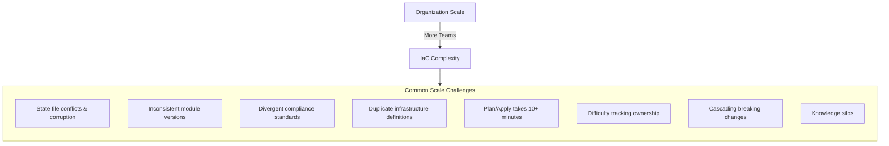
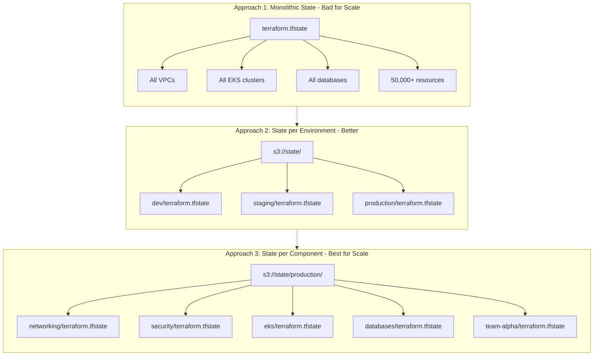
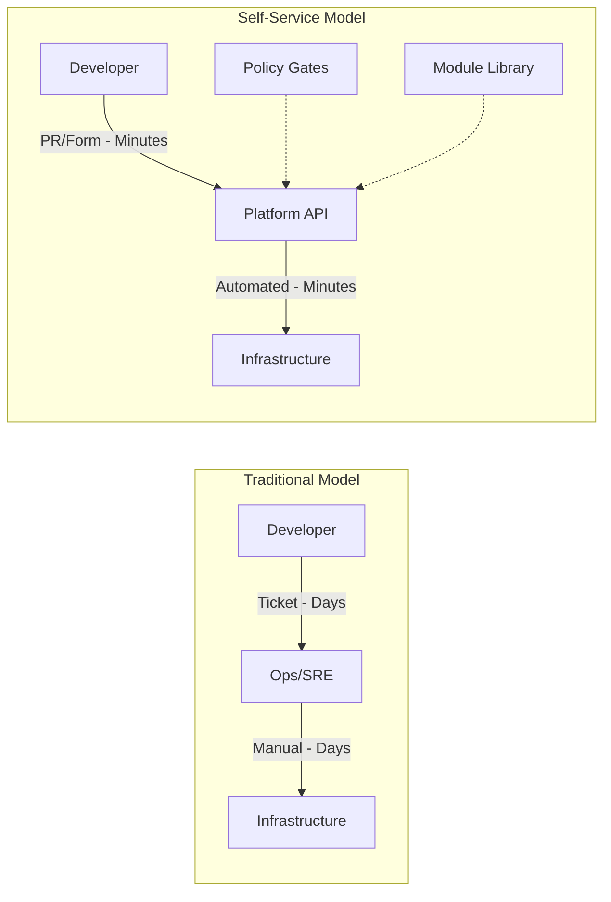
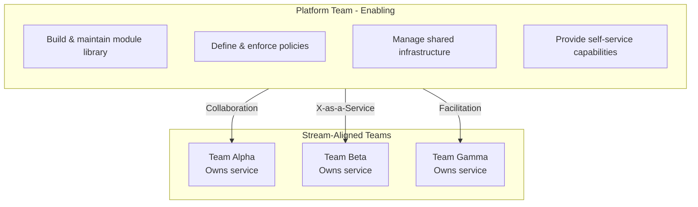

## Complexity: [COMPLEX]
## Time to Complete: 55 minutes

---

## Prerequisites

Before starting this module, you should have completed:
- [Module 6.1: IaC Fundamentals](../module-6.1-iac-fundamentals/) - Core concepts
- [Module 6.2: IaC Testing](../module-6.2-iac-testing/) - Testing strategies
- [Module 6.3: IaC Security](../module-6.3-iac-security/) - Security practices
- Basic understanding of organizational structures

---

## What You'll Be Able to Do

After completing this module, you will be able to:

- **Design IaC module registries and versioning strategies that support hundreds of consuming teams**
- **Implement state management patterns — workspaces, accounts, backends — for large multi-team environments**
- **Build dependency management workflows that prevent breaking changes across shared IaC modules**
- **Evaluate monorepo versus multi-repo strategies for IaC at organizational scale**

## Why This Module Matters

**The Great Terraform Migration Crisis**

The platform team at a rapidly growing fintech company had what seemed like a great problem: they'd grown from 3 to 50 engineering teams in two years. Each team had been given autonomy to manage their own infrastructure, and they'd all chosen Terraform. The company now had over 2,500 Terraform configurations spread across 200 repositories.

Then came the compliance audit.

The auditors needed to verify that all databases were encrypted, all S3 buckets had versioning enabled, and all security groups followed the corporate baseline. The platform team spent three weeks writing scripts to scan the configurations. They found that 23% of databases weren't encrypted, 41% of S3 buckets lacked versioning, and security group configurations ranged from locked-down to completely open.

Fixing these issues took 4 months. During that time, teams couldn't ship new features because every infrastructure change required security review. The total cost in delayed features, overtime, and audit fees: $8.5 million.

This module teaches you how to scale infrastructure as code without losing control—because managing IaC for 3 teams is fundamentally different from managing it for 300.

---

## The Scale Challenge

As organizations grow, IaC complexity increases exponentially.



---

## Repository Strategies

> **Pause and predict**: If you put all your company's infrastructure in a single Terraform repository, what will be the biggest bottleneck after you reach 50 engineers?

### Monorepo: Single Repository for All Infrastructure

```
infrastructure/
├── modules/                    # Shared, versioned modules
│   ├── vpc/
│   │   ├── v1.0.0/
│   │   ├── v1.1.0/
│   │   └── v2.0.0/
│   ├── eks/
│   ├── rds/
│   └── s3/
├── environments/               # Environment-specific configs
│   ├── shared/                # Cross-environment resources
│   │   ├── networking/
│   │   └── security/
│   ├── dev/
│   │   ├── team-alpha/
│   │   ├── team-beta/
│   │   └── team-gamma/
│   ├── staging/
│   │   └── ...
│   └── production/
│       ├── us-east-1/
│       ├── us-west-2/
│       └── eu-west-1/
├── policies/                   # OPA/Sentinel policies
├── tests/                      # Integration tests
├── .github/
│   └── workflows/
│       ├── module-release.yml
│       ├── policy-check.yml
│       └── deploy.yml
└── CODEOWNERS                  # Per-directory ownership
```

**Advantages**:
- Single source of truth
- Easy cross-team collaboration
- Consistent tooling and CI/CD
- Atomic changes across environments

**Disadvantages**:
- Requires strong access controls (CODEOWNERS)
- Large repository size over time
- All teams affected by CI/CD issues
- Permission boundaries harder to enforce

### Polyrepo: Separate Repository per Team/Project

```
org-infrastructure/
├── terraform-modules/          # Central modules repo
├── platform-core/              # Platform team's infra
├── team-alpha-infra/           # Each team owns their repo
├── team-beta-infra/
├── team-gamma-infra/
└── compliance-policies/        # Central policy repo
```

**Advantages**:
- Clear ownership boundaries
- Independent release cycles
- Simpler permissions (repo-level)
- Smaller, focused repositories

**Disadvantages**:
- Module version fragmentation
- Inconsistent practices
- Harder to enforce standards
- Duplication of common patterns

### Hybrid: Best of Both Worlds

```
# Centralized
platform-infrastructure/
├── modules/                    # Blessed modules
├── global/                     # Org-wide resources
└── policies/                   # Mandatory policies

# Team-owned (using central modules)
team-alpha-infrastructure/
└── environments/
    ├── dev/
    │   └── main.tf            # Uses central modules
    └── production/
        └── main.tf

# Example team configuration
module "vpc" {
  source  = "git::https://github.com/org/platform-infrastructure//modules/vpc?ref=v2.1.0"
  # ...
}
```

---

## Module Registry and Versioning

### Private Module Registry

Terraform Cloud/Enterprise or self-hosted registry for internal modules:

```hcl
# terraform.tf - Using private registry
terraform {
  required_providers {
    aws = {
      source  = "hashicorp/aws"
      version = "~> 5.0"
    }
  }
}

# Using module from private registry
module "vpc" {
  source  = "app.terraform.io/company/vpc/aws"
  version = "2.1.0"

  environment = var.environment
  cidr_block  = "10.0.0.0/16"
}

module "eks" {
  source  = "app.terraform.io/company/eks/aws"
  version = "~> 3.0"  # Allow minor/patch updates

  vpc_id     = module.vpc.vpc_id
  subnet_ids = module.vpc.private_subnet_ids
}
```

### Semantic Versioning for Modules

```
version = "MAJOR.MINOR.PATCH"

MAJOR: Breaking changes (interface changes, removed features)
MINOR: New features (backward compatible)
PATCH: Bug fixes (backward compatible)
```

```hcl
# modules/vpc/CHANGELOG.md
# Changelog

## [3.0.0] - 2024-01-15
### Breaking Changes
- Removed `enable_nat_gateway` variable, NAT is now always enabled
- Changed output `subnet_ids` to `private_subnet_ids` and `public_subnet_ids`
- Minimum Terraform version now 1.5.0

### Added
- Support for IPv6
- Transit gateway attachment option

## [2.3.0] - 2024-01-01
### Added
- VPC flow logs enabled by default
- New `log_retention_days` variable

## [2.2.1] - 2023-12-15
### Fixed
- Subnet CIDR calculation for large VPCs
```

### Version Constraints

```hcl
# Exact version - most predictable
version = "2.1.0"

# Pessimistic constraint - allow patches
version = "~> 2.1.0"  # Allows 2.1.x, not 2.2.0

# Allow minor updates
version = "~> 2.1"    # Allows 2.x.x, not 3.0.0

# Range constraint
version = ">= 2.0.0, < 3.0.0"

# Best practice: Use pessimistic for stability
module "vpc" {
  source  = "app.terraform.io/company/vpc/aws"
  version = "~> 2.1.0"  # Get patches, avoid breaking changes
}
```

---

## State Management at Scale

> **Stop and think**: What happens if two teams try to apply changes to the same monolithic state file at exactly the same time?

### State File Organization



### Workspaces vs. Directories

```hcl
# Approach A: Terraform Workspaces
# Same code, different state per workspace

# Select workspace
terraform workspace select production

# Backend uses workspace name
terraform {
  backend "s3" {
    bucket = "terraform-state"
    key    = "infrastructure/terraform.tfstate"
    region = "us-east-1"
    # State file: terraform-state/env:/production/infrastructure/terraform.tfstate
  }
}

# Reference workspace in code
locals {
  environment = terraform.workspace

  instance_type = {
    dev        = "t3.small"
    staging    = "t3.medium"
    production = "t3.large"
  }[terraform.workspace]
}
```

```bash
# Approach B: Directory Structure (Recommended for Scale)
environments/
├── dev/
│   ├── backend.tf          # Points to dev state
│   ├── main.tf
│   └── terraform.tfvars    # Dev-specific values
├── staging/
│   ├── backend.tf          # Points to staging state
│   ├── main.tf
│   └── terraform.tfvars
└── production/
    ├── backend.tf          # Points to production state
    ├── main.tf
    └── terraform.tfvars
```

Directory approach advantages:
- Clear separation of environments
- Different providers/versions per environment
- Easier to understand state location
- No workspace switching mistakes

### Cross-State References

```hcl
# networking/outputs.tf
output "vpc_id" {
  value = aws_vpc.main.id
}

output "private_subnet_ids" {
  value = aws_subnet.private[*].id
}

# eks/main.tf - Reference networking state
data "terraform_remote_state" "networking" {
  backend = "s3"
  config = {
    bucket = "terraform-state"
    key    = "production/networking/terraform.tfstate"
    region = "us-east-1"
  }
}

module "eks" {
  source = "../modules/eks"

  vpc_id     = data.terraform_remote_state.networking.outputs.vpc_id
  subnet_ids = data.terraform_remote_state.networking.outputs.private_subnet_ids
}
```

### Terragrunt for DRY Configuration

```hcl
# terragrunt.hcl (root)
remote_state {
  backend = "s3"
  generate = {
    path      = "backend.tf"
    if_exists = "overwrite_terragrunt"
  }
  config = {
    bucket         = "company-terraform-state"
    key            = "${path_relative_to_include()}/terraform.tfstate"
    region         = "us-east-1"
    encrypt        = true
    dynamodb_table = "terraform-locks"
  }
}

generate "provider" {
  path      = "provider.tf"
  if_exists = "overwrite_terragrunt"
  contents  = <<EOF
provider "aws" {
  region = var.aws_region
  default_tags {
    tags = {
      ManagedBy   = "terraform"
      Environment = var.environment
    }
  }
}
EOF
}
```

```hcl
# production/eks/terragrunt.hcl
include "root" {
  path = find_in_parent_folders()
}

terraform {
  source = "../../../modules/eks"
}

dependency "vpc" {
  config_path = "../networking"
}

inputs = {
  environment = "production"
  vpc_id      = dependency.vpc.outputs.vpc_id
  subnet_ids  = dependency.vpc.outputs.private_subnet_ids
}
```

---

## Policy as Code at Scale

### OPA/Gatekeeper for Kubernetes

```yaml
# Constraint Template
apiVersion: templates.gatekeeper.sh/v1
kind: ConstraintTemplate
metadata:
  name: k8srequiredlabels
spec:
  crd:
    spec:
      names:
        kind: K8sRequiredLabels
      validation:
        openAPIV3Schema:
          properties:
            labels:
              type: array
              items:
                type: string
  targets:
    - target: admission.k8s.gatekeeper.sh
      rego: |
        package k8srequiredlabels

        violation[{"msg": msg}] {
          provided := {label | input.review.object.metadata.labels[label]}
          required := {label | label := input.parameters.labels[_]}
          missing := required - provided
          count(missing) > 0
          msg := sprintf("Missing required labels: %v", [missing])
        }
```

```yaml
# Constraint
apiVersion: constraints.gatekeeper.sh/v1beta1
kind: K8sRequiredLabels
metadata:
  name: require-team-labels
spec:
  match:
    kinds:
      - apiGroups: [""]
        kinds: ["Namespace", "Pod"]
  parameters:
    labels:
      - "team"
      - "environment"
      - "cost-center"
```

### Sentinel for Terraform Enterprise

```python
# policy/require-encryption.sentinel
import "tfplan/v2" as tfplan

# Get all S3 buckets
s3_buckets = filter tfplan.resource_changes as _, rc {
    rc.type is "aws_s3_bucket" and
    rc.mode is "managed" and
    (rc.change.actions contains "create" or
     rc.change.actions contains "update")
}

# Check encryption configuration exists
require_encryption = rule {
    all s3_buckets as _, bucket {
        bucket.change.after.server_side_encryption_configuration is not null
    }
}

# Main rule
main = rule {
    require_encryption
}
```

### Conftest for CI/CD

```rego
# policy/terraform/required_tags.rego
package terraform.required_tags

import future.keywords.in

required_tags := ["Environment", "Team", "CostCenter"]

deny[msg] {
    resource := input.resource_changes[_]
    resource.change.actions[_] in ["create", "update"]

    # Resources that should have tags
    taggable := ["aws_instance", "aws_s3_bucket", "aws_rds_cluster", "aws_vpc"]
    resource.type in taggable

    tags := object.get(resource.change.after, "tags", {})

    missing := [tag |
        tag := required_tags[_]
        not tags[tag]
    ]

    count(missing) > 0
    msg := sprintf("%s is missing required tags: %v", [resource.address, missing])
}
```

```yaml
# .github/workflows/policy-check.yml
name: Policy Check

on:
  pull_request:
    paths: ['terraform/**']

jobs:
  policy:
    runs-on: ubuntu-latest
    steps:
      - uses: actions/checkout @v4

      - name: Setup Terraform
        uses: hashicorp/setup-terraform @v3

      - name: Generate Plan
        run: |
          cd terraform/environments/production
          terraform init -backend=false
          terraform plan -out=tfplan
          terraform show -json tfplan > tfplan.json

      - name: Install Conftest
        run: |
          wget -q https://github.com/open-policy-agent/conftest/releases/download/v0.45.0/conftest_0.45.0_Linux_x86_64.tar.gz
          tar xzf conftest_0.45.0_Linux_x86_64.tar.gz
          sudo mv conftest /usr/local/bin/

      - name: Run Policy Tests
        run: |
          conftest test terraform/environments/production/tfplan.json \
            --policy policy/terraform/ \
            --output table
```

---

## Self-Service Infrastructure

> **Stop and think**: Why is giving developers direct access to write raw Terraform files often less effective than providing a self-service portal or template?

### Platform Engineering Approach



### Service Catalog with Backstage

```yaml
# catalog-info.yaml - Backstage template
apiVersion: scaffolder.backstage.io/v1beta3
kind: Template
metadata:
  name: kubernetes-microservice
  title: Kubernetes Microservice
  description: Create a new microservice with EKS deployment
  tags:
    - kubernetes
    - microservice
    - recommended
spec:
  owner: platform-team
  type: service

  parameters:
    - title: Service Information
      required:
        - name
        - team
      properties:
        name:
          title: Service Name
          type: string
          pattern: '^[a-z][a-z0-9-]*$'
        team:
          title: Owning Team
          type: string
          ui:field: OwnerPicker
        description:
          title: Description
          type: string

    - title: Infrastructure Options
      properties:
        environment:
          title: Environment
          type: string
          enum: ['dev', 'staging', 'production']
          default: 'dev'
        instanceSize:
          title: Instance Size
          type: string
          enum: ['small', 'medium', 'large']
          default: 'small'
          description: |
            small: 0.5 CPU, 512MB RAM
            medium: 1 CPU, 1GB RAM
            large: 2 CPU, 2GB RAM
        needsDatabase:
          title: Needs Database?
          type: boolean
          default: false
        databaseType:
          title: Database Type
          type: string
          enum: ['postgresql', 'mysql']
          ui:disabled: '{{ not parameters.needsDatabase }}'

  steps:
    - id: fetch-template
      name: Fetch Template
      action: fetch:template
      input:
        url: ./skeleton
        values:
          name: ${{ parameters.name }}
          team: ${{ parameters.team }}
          environment: ${{ parameters.environment }}

    - id: create-terraform
      name: Create Infrastructure
      action: terraform:apply
      input:
        workspace: ${{ parameters.environment }}
        variables:
          service_name: ${{ parameters.name }}
          instance_size: ${{ parameters.instanceSize }}
          enable_database: ${{ parameters.needsDatabase }}
          database_type: ${{ parameters.databaseType }}

    - id: create-repo
      name: Create Repository
      action: publish:github
      input:
        repoUrl: github.com?owner=company&repo=${{ parameters.name }}
        defaultBranch: main

  output:
    links:
      - title: Repository
        url: ${{ steps.create-repo.output.remoteUrl }}
      - title: Infrastructure
        url: https://terraform.company.com/workspaces/${{ parameters.name }}
```

### Terraform Module as Service

```hcl
# modules/microservice/main.tf
# Complete microservice infrastructure in one module

variable "service_name" {
  description = "Name of the microservice"
  type        = string
}

variable "team" {
  description = "Owning team"
  type        = string
}

variable "environment" {
  description = "Deployment environment"
  type        = string
}

variable "instance_size" {
  description = "Resource allocation tier"
  type        = string
  default     = "small"

  validation {
    condition     = contains(["small", "medium", "large"], var.instance_size)
    error_message = "Instance size must be small, medium, or large"
  }
}

variable "enable_database" {
  description = "Create associated database"
  type        = bool
  default     = false
}

locals {
  # Size mappings
  sizes = {
    small = {
      cpu    = "500m"
      memory = "512Mi"
      replicas = 2
    }
    medium = {
      cpu    = "1000m"
      memory = "1Gi"
      replicas = 3
    }
    large = {
      cpu    = "2000m"
      memory = "2Gi"
      replicas = 5
    }
  }

  common_tags = {
    Service     = var.service_name
    Team        = var.team
    Environment = var.environment
    ManagedBy   = "terraform"
  }
}

# ECR repository for container images
resource "aws_ecr_repository" "service" {
  name                 = var.service_name
  image_tag_mutability = "IMMUTABLE"

  image_scanning_configuration {
    scan_on_push = true
  }

  tags = local.common_tags
}

# Kubernetes namespace
resource "kubernetes_namespace" "service" {
  metadata {
    name = var.service_name
    labels = {
      "team"        = var.team
      "environment" = var.environment
    }
  }
}

# Resource quota for namespace
resource "kubernetes_resource_quota" "service" {
  metadata {
    name      = "${var.service_name}-quota"
    namespace = kubernetes_namespace.service.metadata[0].name
  }

  spec {
    hard = {
      "requests.cpu"    = "${local.sizes[var.instance_size].cpu * local.sizes[var.instance_size].replicas * 2}"
      "requests.memory" = "${local.sizes[var.instance_size].memory * local.sizes[var.instance_size].replicas * 2}"
      "limits.cpu"      = "${local.sizes[var.instance_size].cpu * local.sizes[var.instance_size].replicas * 4}"
      "limits.memory"   = "${local.sizes[var.instance_size].memory * local.sizes[var.instance_size].replicas * 4}"
      "pods"            = "${local.sizes[var.instance_size].replicas * 4}"
    }
  }
}

# Network policy
resource "kubernetes_network_policy" "service" {
  metadata {
    name      = "${var.service_name}-policy"
    namespace = kubernetes_namespace.service.metadata[0].name
  }

  spec {
    pod_selector {}

    ingress {
      from {
        namespace_selector {
          match_labels = {
            "name" = "ingress-nginx"
          }
        }
      }
    }

    egress {
      to {
        namespace_selector {
          match_labels = {
            "environment" = var.environment
          }
        }
      }
    }

    policy_types = ["Ingress", "Egress"]
  }
}

# Optional database
resource "aws_db_instance" "service" {
  count = var.enable_database ? 1 : 0

  identifier     = "${var.service_name}-${var.environment}"
  engine         = "postgres"
  engine_version = "15"
  instance_class = var.environment == "production" ? "db.t3.medium" : "db.t3.micro"

  allocated_storage     = 20
  max_allocated_storage = var.environment == "production" ? 100 : 50
  storage_encrypted     = true

  db_name  = replace(var.service_name, "-", "_")
  username = "app"
  password = random_password.db[0].result

  vpc_security_group_ids = [aws_security_group.db[0].id]
  db_subnet_group_name   = data.aws_db_subnet_group.main.name

  backup_retention_period = var.environment == "production" ? 30 : 7
  skip_final_snapshot     = var.environment != "production"

  tags = local.common_tags
}

# Outputs for team consumption
output "ecr_repository_url" {
  description = "ECR repository URL for pushing images"
  value       = aws_ecr_repository.service.repository_url
}

output "namespace" {
  description = "Kubernetes namespace"
  value       = kubernetes_namespace.service.metadata[0].name
}

output "database_endpoint" {
  description = "Database endpoint (if enabled)"
  value       = var.enable_database ? aws_db_instance.service[0].endpoint : null
}
```

---

## Organizational Patterns

### Team Topologies for IaC



### Ownership Model

```yaml
# CODEOWNERS - Define ownership at scale
# Platform team owns shared infrastructure
/modules/                     @src/content/docs/platform/disciplines/core-platform/leadership/module-1.1-platform-team-building.md
/environments/*/networking/   @src/content/docs/platform/disciplines/core-platform/leadership/module-1.1-platform-team-building.md
/environments/*/security/     @src/content/docs/platform/disciplines/core-platform/leadership/module-1.1-platform-team-building.md
/policies/                    @src/content/docs/platform/disciplines/core-platform/leadership/module-1.1-platform-team-building.md @security-team

# Teams own their own infrastructure
/environments/*/team-alpha/   @team-alpha
/environments/*/team-beta/    @team-beta
/environments/*/team-gamma/   @team-gamma

# Security review required for production
/environments/production/     @src/content/docs/platform/disciplines/core-platform/leadership/module-1.1-platform-team-building.md @security-team
```

```hcl
# Enforce ownership via tags
variable "team" {
  description = "Team that owns this infrastructure"
  type        = string

  validation {
    condition = contains([
      "platform",
      "team-alpha",
      "team-beta",
      "team-gamma"
    ], var.team)
    error_message = "Team must be a valid team identifier"
  }
}

resource "aws_instance" "app" {
  # ...

  tags = {
    Team        = var.team
    ManagedBy   = "terraform"
    Repository  = "github.com/company/infrastructure"
    CostCenter  = local.team_cost_centers[var.team]
  }
}
```

---

## War Story: The 50-Team Consolidation

**Company**: Fast-growing fintech
**Challenge**: 50 teams, 200 repositories, 2,500 Terraform configurations

**The Problem**:
```
Before Consolidation:
├── 200 repositories with Terraform
├── 50 different VPC designs
├── 23 different RDS configurations
├── 12 different EKS setups
├── 0 standardization
├── 41% of S3 buckets without versioning
├── 23% of databases unencrypted
└── 4-month compliance remediation
```

**The Solution**:

Phase 1: Assessment (2 weeks)
```bash
# Inventory script across all repos
for repo in $(gh repo list company --json name -q '.[].name'); do
  gh repo clone company/$repo temp-repo
  find temp-repo -name "*.tf" -exec cat {} \; | \
    grep -E "^resource|^module" >> inventory.txt
  rm -rf temp-repo
done

# Result: 2,500 configurations, 847 unique resource types
```

Phase 2: Module Library (6 weeks)
```
Consolidated to 15 blessed modules:
├── vpc (replaced 50 variants)
├── eks (replaced 12 variants)
├── rds-postgresql
├── rds-mysql
├── s3-bucket
├── lambda-function
├── api-gateway
├── cloudfront
├── elasticache
├── sns-sqs
├── ecr
├── iam-role
├── security-group
├── route53
└── acm-certificate
```

Phase 3: Migration (12 weeks)
```hcl
# Migration pattern: Import existing, switch to module
# Step 1: Document existing
terraform state list > existing-resources.txt

# Step 2: Create new config with module
module "vpc" {
  source  = "app.terraform.io/company/vpc/aws"
  version = "1.0.0"
  # Match existing settings
}

# Step 3: Import existing resources
terraform import module.vpc.aws_vpc.main vpc-12345

# Step 4: Plan and verify no changes
terraform plan  # Should show no changes

# Step 5: Remove old config, keep module
```

Phase 4: Policy Enforcement (4 weeks)
```python
# Sentinel policy requiring module usage
import "tfplan/v2" as tfplan

# Modules that must come from registry
required_modules = [
    "vpc",
    "eks",
    "rds-postgresql",
    "rds-mysql",
    "s3-bucket"
]

# Check module sources
module_sources = rule {
    all tfplan.module_calls as _, mc {
        mc.source_type is "registry" or
        mc.source_type is "remote"
    }
}

main = rule {
    module_sources
}
```

**Results After 6 Months**:
```
After Consolidation:
├── 15 blessed modules (from 847 variants)
├── 100% compliance with security baseline
├── 90% reduction in infrastructure tickets
├── Plan time: 45 seconds (from 8+ minutes)
├── Mean time to provision: 15 minutes (from 3 days)
├── $2.1M/year saved in duplicate infrastructure
└── 0 compliance findings in next audit
```

---

## Common Mistakes

| Mistake | Problem | Solution |
|---------|---------|----------|
| Monolithic state files | Slow plans, broad blast radius | Split by component/team |
| No module versioning | Breaking changes affect everyone | Semantic versioning, registry |
| Copy-paste modules | Drift, inconsistency | Central module library |
| No policy enforcement | Security/compliance issues | OPA/Sentinel in CI/CD |
| Teams reinvent wheels | Wasted effort, inconsistency | Self-service with golden paths |
| No ownership model | Nobody responsible, nobody fixes | CODEOWNERS, team tags |
| All-or-nothing permissions | Too broad or too restrictive | Environment-scoped IAM |
| Manual state management | Corruption, lost state | Remote backend with locking |

---

## Quiz

<details>
<summary>1. Your organization has just acquired two startups. You now have three separate engineering departments with different release cadences and strict isolation requirements for their product infrastructure. However, you want them all to use your central platform team's hardened Kubernetes and Database Terraform modules. Which repository strategy should you choose and how would it be structured?</summary>

**Answer**: You should adopt a Hybrid repository strategy. In this scenario, a pure monorepo would cause friction due to the different release cadences and strict isolation requirements, while a pure polyrepo would fail to enforce the central platform team's hardened modules. By using a Hybrid approach, the central platform team maintains the hardened modules in a centralized repository (or private registry), while each independent engineering department maintains their own repositories for their specific environments. This allows the independent teams to iterate at their own pace and maintain isolation while still consuming the required organizational standards. The monorepo creates too much friction for newly acquired entities, and polyrepo offers no control, making hybrid the optimal path for scaling governance.
</details>

<details>
<summary>2. A large e-commerce platform uses a single Terraform state file for their entire production environment. During Black Friday preparations, the networking team is updating VPC routing while the checkout team is trying to add more application replicas. The checkout team's CI/CD pipeline fails repeatedly with "state lock" errors, and when it finally runs, the plan step takes 14 minutes. What is the architectural root cause and how would you resolve it?</summary>

**Answer**: The root cause is the use of a monolithic state file, which creates a massive concurrency bottleneck and bloated execution times. When multiple teams attempt to modify infrastructure simultaneously, the state lock prevents parallel changes, forcing teams to wait for each other. Furthermore, a single state file containing every resource in production means Terraform must refresh the status of thousands of irrelevant resources (like databases and VPCs) just to add application replicas. To resolve this, the organization must split the state file by component or team (e.g., separate states for networking, shared services, and individual application teams) so changes can be planned quickly and applied concurrently without stepping on each other's locks. Splitting the state also drastically reduces the blast radius if state corruption were to occur.
</details>

<details>
<summary>3. The platform team updates the shared RDS Terraform module to enforce storage encryption by default, but to do so, they had to change the `subnet_group_name` variable to `db_subnet_ids`. The next morning, 15 different application teams have broken CI/CD pipelines because their infrastructure code is still passing the old variable. What versioning practice failed here, and how should consumers reference the module to prevent this?</summary>

**Answer**: The platform team failed to properly use semantic versioning and module consumers were likely pointing to the `main` branch or a mutable tag rather than a pinned version constraint. Changing a variable name is a breaking interface change, meaning the module version should have been incremented by a MAJOR version (e.g., from v2.4.0 to v3.0.0) according to semantic versioning rules. Consumers should reference modules using pessimistic version constraints (e.g., `version = "~> 2.4.0"`) so they automatically receive backward-compatible patch and minor updates, but are protected from breaking major updates until they are ready to refactor their code. By relying on mutable tags or failing to pin versions, the application teams exposed themselves to immediate breakage from upstream changes without a review period.
</details>

<details>
<summary>4. A financial services company has 50 stream-aligned teams. Currently, when a team needs a new database, they file a Jira ticket to the Ops team, wait 3 days for approval, and the Ops engineer spends 2 hours manually writing and applying the Terraform. If the platform team implements a Backstage self-service portal that completely automates this process to 15 minutes of developer time (and 0 Ops time), and each team requests one database per week, what is the impact on organizational efficiency?</summary>

**Answer**: The impact is a massive reduction in toil and lead time, saving the organization 100 hours of Ops engineering time per week (50 teams × 2 hours). Additionally, it eliminates 150 days of aggregate wait time (50 teams × 3 days), allowing product teams to deliver value much faster. By shifting the interaction model from a manual ticket queue to automated self-service, the Ops team is freed to work on high-leverage platform capabilities rather than repetitive provisioning tasks. The Backstage template ensures that every provisioned database still adheres to organizational standards, meaning this efficiency is gained without sacrificing compliance or security. This cultural shift translates directly into faster time-to-market for the business.
</details>

<details>
<summary>5. A newly hired Director of Infrastructure notices that her 12 "platform engineers" spend their entire day fulfilling Jira requests to create S3 buckets, update IAM roles, and provision EKS clusters for the company's 50 product teams. Developer satisfaction is low due to slow turnaround times, and the platform engineers are burned out. According to Team Topologies, what team type are they accidentally functioning as, and what should their actual role be?</summary>

**Answer**: The team is accidentally functioning as a traditional IT Service Bureau or an overwhelmed Complicated Subsystem team, rather than a true Platform team. In an IaC-at-scale model, a true Platform team's role is to operate as an enabling force that builds self-service capabilities, defines golden paths, and curates a library of hardened modules. They should be building the tooling and abstractions (like a developer portal or secure Terraform modules) that allow the 50 product teams to provision their own S3 buckets and IAM roles safely and independently. By shifting from fulfilling tickets to building self-service products, the platform team reduces their own operational toil and dramatically decreases lead times for developers. This transition from a service bureau to an enabling team is critical for organizational scaling.
</details>

<details>
<summary>6. Your infrastructure repository contains 50 identical `backend.tf` and `provider.tf` files across different environment directories (dev, staging, prod) and components. When the company decides to migrate the Terraform state bucket to a new AWS account, your team has to manually update and test 50 separate files. What tool could have prevented this duplication, and how does it solve the problem?</summary>

**Answer**: Terragrunt is the tool that could have prevented this massive duplication of configuration. It acts as a thin wrapper for Terraform that allows you to define your remote state, backend configurations, and provider setups once in a root configuration file. The child directories then simply `include` this root configuration, keeping your codebase DRY (Don't Repeat Yourself). When a centralized change is needed—like migrating the state bucket to a new account—you only need to update the root `terragrunt.hcl` file, and the change automatically cascades to all 50 environments. This dramatically reduces maintenance overhead, ensures consistency across environments, and eliminates the risk of human error when performing repetitive updates.
</details>

<details>
<summary>7. In a monorepo containing all of the company's infrastructure, a junior developer on the frontend team accidentally submits a pull request that modifies the global `iam_admin_roles` Terraform module while trying to add permissions for their specific app. The PR is merged by another frontend developer who didn't understand the impact, inadvertently granting broad admin access to a third-party service. How could a `CODEOWNERS` file have prevented this security incident?</summary>

**Answer**: A `CODEOWNERS` file maps directory paths to responsible teams, enforcing automatic review assignments and approval requirements before a merge can occur. In this scenario, the `/modules/iam_admin_roles/` path should have been explicitly assigned to the `@security-team` or `@platform-team`. With this governance in place, the version control system would have automatically blocked the PR from being merged until a designated member of the security or platform team reviewed and approved the change. This allows organizations to safely use a monorepo by enforcing strict ownership boundaries and ensuring sensitive infrastructure modifications are vetted by the correct subject matter experts.
</details>

<details>
<summary>8. A rapidly scaling healthcare startup performs an audit and discovers they have 200 distinct Terraform repositories across their organization, resulting in 50 different variations of a VPC configuration and 23 different ways to deploy an RDS database. They want to standardize, but the security team suggests creating a single, massive Terraform module that can deploy an entire application stack (VPC, EKS, RDS, S3, and IAM) at once to ensure everything is compliant. Why is this a bad approach, and what module strategy should they use instead?</summary>

**Answer**: Creating a single, massive "mega-module" is an anti-pattern because it becomes too rigid, overly complex, and impossible to maintain, forcing teams to adopt a one-size-fits-all architecture that stifles innovation. Every time a new parameter or slight variation is needed for one service, the mega-module must be updated, increasing the blast radius of changes and causing versioning bottlenecks. Instead, the startup should build a curated library of small, composable, and single-purpose "blessed modules" (e.g., one module for VPCs, one for RDS, one for EKS). This allows stream-aligned teams to mix and match compliant building blocks to suit their specific application needs while still ensuring that each individual component adheres to the organization's security baseline.
</details>

---

## Hands-On Exercise

**Objective**: Design and implement a scalable IaC structure for a multi-team organization.

### Part 1: Repository Structure

```bash
# Create scalable directory structure
mkdir -p iac-at-scale/{modules,environments,policies,tests}

# Create module structure
for module in vpc eks rds s3; do
  mkdir -p iac-at-scale/modules/$module/{v1.0.0,tests}
done

# Create environment structure
for env in dev staging production; do
  for team in platform alpha beta; do
    mkdir -p iac-at-scale/environments/$env/$team
  done
done

# Create CODEOWNERS
cat > iac-at-scale/CODEOWNERS << 'EOF'
# Platform team owns shared infrastructure
/modules/                           @src/content/docs/platform/disciplines/core-platform/leadership/module-1.1-platform-team-building.md
/environments/*/platform/           @src/content/docs/platform/disciplines/core-platform/leadership/module-1.1-platform-team-building.md
/policies/                          @src/content/docs/platform/disciplines/core-platform/leadership/module-1.1-platform-team-building.md @security-team

# Production requires security review
/environments/production/           @src/content/docs/platform/disciplines/core-platform/leadership/module-1.1-platform-team-building.md @security-team

# Teams own their directories
/environments/*/alpha/              @team-alpha
/environments/*/beta/               @team-beta
EOF

# View structure
find iac-at-scale -type d | head -30
```

### Part 2: Create Base Module

```bash
# Create VPC module
cat > iac-at-scale/modules/vpc/v1.0.0/main.tf << 'EOF'
variable "environment" {
  type = string
}

variable "team" {
  type = string
}

variable "vpc_cidr" {
  type    = string
  default = "10.0.0.0/16"
}

locals {
  tags = {
    Environment = var.environment
    Team        = var.team
    ManagedBy   = "terraform"
    Module      = "vpc/v1.0.0"
  }
}

resource "aws_vpc" "main" {
  cidr_block           = var.vpc_cidr
  enable_dns_hostnames = true
  enable_dns_support   = true
  tags                 = merge(local.tags, { Name = "${var.environment}-${var.team}-vpc" })
}

output "vpc_id" {
  value = aws_vpc.main.id
}
EOF
```

### Part 3: Create Team Configuration

```bash
# Create team configuration using module
cat > iac-at-scale/environments/dev/alpha/main.tf << 'EOF'
terraform {
  backend "s3" {
    bucket         = "company-terraform-state"
    key            = "dev/alpha/terraform.tfstate"
    region         = "us-east-1"
    encrypt        = true
    dynamodb_table = "terraform-locks"
  }
}

module "vpc" {
  source = "../../../modules/vpc/v1.0.0"

  environment = "dev"
  team        = "alpha"
  vpc_cidr    = "10.1.0.0/16"
}
EOF
```

### Part 4: Create Policy

```bash
# Create OPA policy for required tags
cat > iac-at-scale/policies/required_tags.rego << 'EOF'
package terraform.tags

required_tags := ["Environment", "Team", "ManagedBy"]

deny[msg] {
  resource := input.resource_changes[_]
  resource.change.actions[_] == "create"

  tags := object.get(resource.change.after, "tags", {})

  missing := [tag |
    tag := required_tags[_]
    not tags[tag]
  ]

  count(missing) > 0
  msg := sprintf("%s missing tags: %v", [resource.address, missing])
}
EOF
```

### Success Criteria

- [ ] Directory structure supports multiple teams and environments
- [ ] CODEOWNERS defines clear ownership boundaries
- [ ] Modules are versioned and reusable
- [ ] Teams can independently manage their infrastructure
- [ ] Policies enforce organizational standards

---

## Key Takeaways

- [ ] **Choose repository strategy wisely** - Monorepo, polyrepo, or hybrid based on organization size
- [ ] **Split state files** - By component/team for speed and reduced blast radius
- [ ] **Version your modules** - Semantic versioning enables safe updates
- [ ] **Use a module registry** - Central source of truth for blessed modules
- [ ] **Policy as code** - Enforce standards automatically in CI/CD
- [ ] **Enable self-service** - Platform team builds, stream teams consume
- [ ] **Define ownership clearly** - CODEOWNERS and tags for accountability
- [ ] **Standardize gradually** - Consolidate over time, don't big-bang
- [ ] **Measure and iterate** - Track time-to-provision, compliance, satisfaction
- [ ] **Document everything** - Golden paths need clear documentation

---

## Did You Know?

> **Module Reuse Statistics**: Organizations with mature IaC practices reuse modules an average of 50 times each, compared to 3 times for organizations without a module strategy.

> **State File Growth**: A typical enterprise Terraform state file grows by approximately 1,000 resources per year. Without splitting, plan times can exceed 30 minutes after 5 years.

> **Team Topology Origins**: The Platform Team model comes from the book "Team Topologies" (2019), which identified four fundamental team types including the "Platform Team" that provides internal services to other teams.

> **Cost of Inconsistency**: A 2023 study found that organizations with standardized IaC modules spent 67% less time on infrastructure incidents compared to those with ad-hoc configurations.

---

## Next Module

Continue to [Module 6.5: Drift Detection and Remediation](../module-6.5-drift-remediation/) to learn how to detect, prevent, and automatically fix infrastructure drift from your desired state.