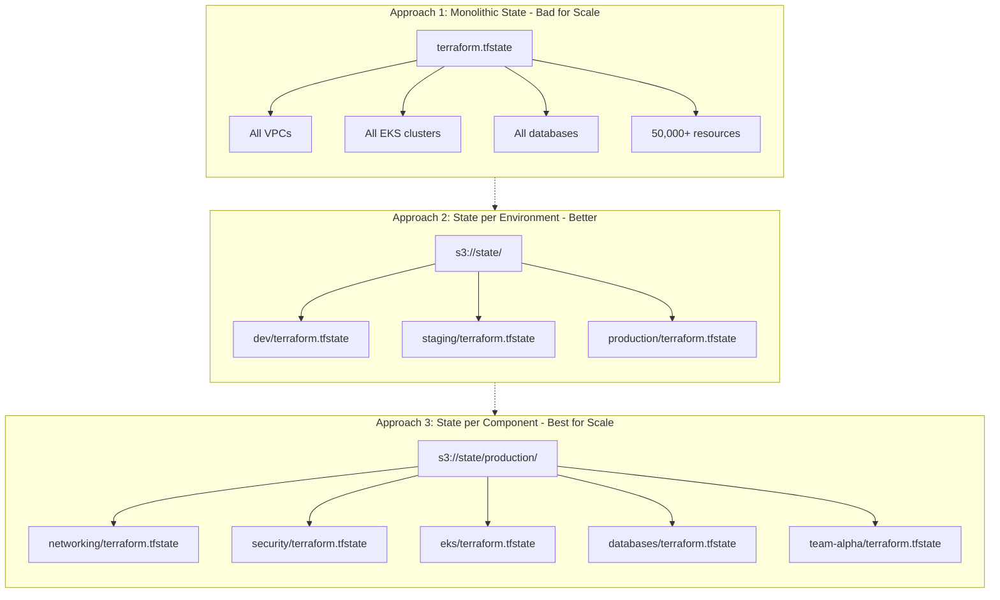
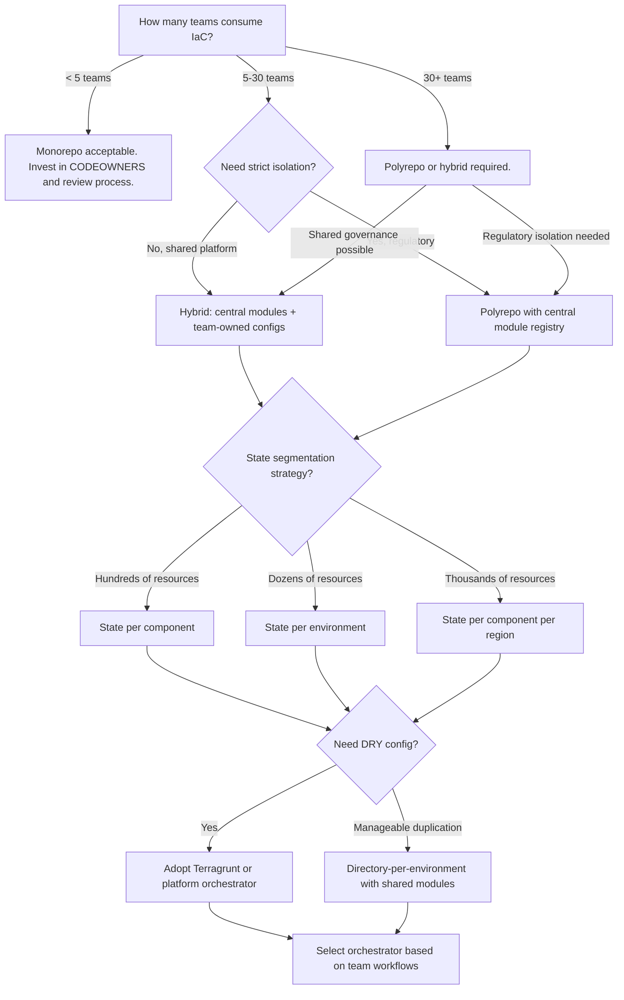

> **Complexity**: `[COMPLEX]`
>
> **Time to Complete**: 55 minutes
>
> **Prerequisites**: [Module 6.1: IaC Fundamentals](../module-6.1-iac-fundamentals/), [Module 6.2: IaC Testing](../module-6.2-iac-testing/), [Module 6.3: IaC Security](../module-6.3-iac-security/)

---

## What You'll Be Able to Do

After completing this module, you will be able to:

- **Design IaC module registries and versioning strategies that support hundreds of consuming teams**
- **Implement state management patterns — workspaces, accounts, backends — for large multi-team environments**
- **Build dependency management workflows that prevent breaking changes across shared IaC modules**
- **Evaluate monorepo versus multi-repo strategies for IaC at organizational scale**
- **Apply decomposition patterns that balance blast-radius containment against orchestration overhead**

---

## Why This Module Matters

IaC that works beautifully for three engineers turns treacherous at thirty, and genuinely dangerous at three hundred. The failure mode is not gradual — it is a phase transition where things that were mildly inconvenient suddenly become blocking. A state file that took forty seconds to plan now takes eight minutes. A module change that one team could coordinate over Slack now breaks fifteen downstream consumers who never saw the announcement. A security baseline that was enforced by code review now has gaping holes because nobody reviews the repos they do not know exist.

**Hypothetical scenario:** Consider an organization that grew from five engineering teams to fifty over three years. Each team was empowered to manage its own infrastructure, and each chose the same IaC tool. By the time anyone inventoried the landscape, there were hundreds of configurations spread across dozens of repositories, with no two VPC designs alike and no central record of who owned what. When a compliance audit arrived, the platform team spent weeks writing scanner scripts. They discovered that roughly one in four databases lacked encryption, two in five object storage buckets had no versioning, and security group rules ranged from fully locked down to effectively wide open. Remediation took months, during which product teams could not ship new features because every infrastructure change required exhaustive security review. The organizational cost — in delayed features, engineering overtime, and audit overhead — was substantial and entirely avoidable.

This scenario is not theoretical. It plays out in organizations that treat IaC as a per-team convenience rather than an organizational capability. The gap is not the tool. The gap is the absence of conventions, guardrails, and shared infrastructure that make scale safe. At small scale, raw Terraform or OpenTofu works fine. A single engineer can hold the entire dependency graph in their head. At large scale, you need explicit contracts between teams, automated policy enforcement, and deliberate decisions about what lives together in one state file and what does not.

This module teaches the durable patterns that let you grow IaC from a handful of configurations to an organizational platform. The tools change — Terragrunt, Atlantis, Spacelift, HCP Terraform, Env0 all evolve rapidly — but the design principles do not. We focus on those principles: decomposition, contract design, DRY configuration, and governance automation. Once you understand them, you can evaluate any orchestrator or registry on your own terms.

---

## What Breaks at Scale

Before we discuss solutions, it is worth understanding exactly what breaks when IaC goes from single-team to organizational scale. The problems cluster around three themes: state, consistency, and coordination.

### The Monolithic State File Problem

State is Terraform's and OpenTofu's record of what resources exist and what they map to in your configuration. When everything lives in one state file, several things degrade predictably. Plan times grow roughly linearly with resource count because the provider must refresh every resource on every run, even if you only changed one line of configuration. A state file tracking a thousand resources is manageable; one tracking fifty thousand is not. The blast radius also expands: if state becomes corrupted or locked by a stuck process, every team's pipeline blocks until the lock clears. Worse, if someone accidentally destroys the state file or applies a destructive change, the entire production environment is at risk — not just one component.

Lock contention is the other dimension of this problem. Remote backends protect state with locks so two processes cannot apply conflicting changes simultaneously. When many teams share one state file, they effectively serialize all infrastructure changes. One team's routine update to an S3 bucket policy stalls another team's urgent scaling of an EKS node group. The lock is correct behavior — the problem is that the state boundary is far too coarse.

### Configuration Drift Through Copy-Paste

The second failure mode is drift created by well-intentioned copy-paste. A team needs a VPC module, so they copy the directory from another team's repository and tweak a few values. Six months later, the original module has been patched for a security vulnerability, but the copy has not. The organization now runs multiple subtly different variants of what was supposed to be the same thing, and no one can confidently say which environments are affected by which issues. This pattern compounds rapidly: fifty teams making fifty copies of a dozen resource types produces hundreds of divergent configurations.

### The Coordination Tax

The third theme is the human cost of uncoordinated IaC. When teams publish modules without versioning, downstream consumers pin to `main` or a mutable tag. A breaking change lands on a Tuesday afternoon, and by Wednesday morning half the organization's CI pipelines are red because their Terraform plans now fail on a renamed variable. The platform team that made the change did not intend to break anything. They simply had no mechanism to communicate breaking changes to consumers, and consumers had no mechanism to opt into those changes on their own schedule.

These three themes — bloated state, drifted copies, and broken coordination — are the core problems that every scale pattern in this module addresses. They are not separate; they interact. A monorepo without versioning amplifies the coordination tax. Copy-paste without a module registry amplifies drift. A monolithic state file without an orchestration layer amplifies both.

---

## Repository Strategies

Choosing how to organize IaC across repositories is the most consequential structural decision you will make. It determines who can change what, how changes propagate, and how easily you can enforce standards. The three canonical approaches — monorepo, polyrepo, and hybrid — each optimize for different organizational shapes.

> **Pause and predict**: If you put all your company's infrastructure in a single Terraform repository, what will be the biggest bottleneck after you reach fifty engineers?

### Monorepo: One Repository, Unified Governance

In a monorepo strategy, all infrastructure configurations and shared modules live in a single version-controlled repository. The directory tree typically separates modules, environment-specific root modules, policies, and CI/CD definitions into well-defined subdirectories.

```
infrastructure/
├── modules/                    # Shared, versioned modules
│   ├── vpc/
│   │   ├── v1.0.0/
│   │   ├── v1.1.0/
│   │   └── v2.0.0/
│   ├── eks/
│   ├── rds/
│   └── s3/
├── environments/               # Environment-specific configs
│   ├── shared/                # Cross-environment resources
│   │   ├── networking/
│   │   └── security/
│   ├── dev/
│   │   ├── team-alpha/
│   │   ├── team-beta/
│   │   └── team-gamma/
│   ├── staging/
│   │   └── ...
│   └── production/
│       ├── us-east-1/
│       ├── us-west-2/
│       └── eu-west-1/
├── policies/                   # OPA/Sentinel policies
├── tests/                      # Integration tests
├── .github/
│   └── workflows/
│       ├── module-release.yml
│       ├── policy-check.yml
│       └── deploy.yml
└── CODEOWNERS                  # Per-directory ownership
```

The monorepo's core advantage is a single source of truth. Every configuration is visible to every engineer, which makes cross-team discovery straightforward. A security engineer can grep for every S3 bucket definition in the organization with one command. Refactoring that spans components — renaming a tag convention, upgrading a provider version — can be done atomically in one pull request.

The tradeoffs are genuine and severe at scale. A monorepo demands strong access controls. Without `CODEOWNERS` files and branch-protection rules, any engineer can accidentally modify infrastructure they do not understand. Repository size grows monotonically, and CI/CD pipelines must be carefully designed so that a change to the `dev/team-alpha` directory does not trigger a full plan of the production environment. Permission boundaries are harder to enforce at the file level than at the repository level. For organizations with strict compliance isolation between business units, a pure monorepo can become a regulatory obstacle.

### Polyrepo: One Repository Per Team

In a polyrepo strategy, each team owns one or more repositories for their infrastructure, and shared modules live in a separate, central repository. The platform team curates the module repository with a well-defined contribution process. Team repositories consume modules as remote sources, pinned to specific versions.

```
org-infrastructure/
├── terraform-modules/          # Central modules repo
├── platform-core/              # Platform team's infra
├── team-alpha-infra/           # Each team owns their repo
├── team-beta-infra/
├── team-gamma-infra/
└── compliance-policies/        # Central policy repo
```

The polyrepo approach provides clear ownership boundaries. A team's repository is their sovereign territory — they control their release cadence, their review process, and their configuration layout. Repository-level permissions are simple to reason about: team alpha cannot push to team beta's repository. Independent release cycles mean a team can upgrade a module version on their own schedule without coordinating with the rest of the organization.

The downside is fragmentation of standards. The platform team can publish blessed modules and policies, but enforcement becomes a monitoring problem rather than a structural one. Teams may lag behind on module versions, skip policy checks, or develop their own local modules that duplicate functionality from the central library. Over time, the consistency that IaC promises erodes unless the organization invests in continuous compliance scanning across repositories. This scanning must itself be automated; at thirty or more repositories, manual audits become infeasible and the organization loses its ability to answer basic questions like "are any teams running a module version with a known vulnerability?"

### Hybrid: Central Modules, Federated Environments

The hybrid approach keeps shared artifacts — modules, policies, provider configurations, golden version files — in a central repository, while team-specific environment configurations live in team-owned repositories. This is the pattern most large organizations converge toward because it balances governance with autonomy.

```
# Centralized
platform-infrastructure/
├── modules/                    # Blessed modules
├── global/                     # Org-wide resources
└── policies/                   # Mandatory policies

# Team-owned (using central modules)
team-alpha-infrastructure/
└── environments/
    ├── dev/
    │   └── main.tf            # Uses central modules
    └── production/
        └── main.tf

# Example team configuration
module "vpc" {
  source  = "git::https://github.com/org/platform-infrastructure//modules/vpc?ref=v2.1.0"
  # ...
}
```

In this model, the platform team owns the module library, the policy definitions, and any shared global infrastructure like transit gateways or DNS zones. Stream-aligned teams own their environment configurations, which are thin wrappers that instantiate the blessed modules with team-specific parameters. The central modules are versioned and published through a registry. Teams can consume new versions on their own schedule, while the platform team can audit who is on which version and nudge or enforce upgrades when a security issue demands it.

The hybrid model introduces a dependency management challenge: how do teams discover new module versions, deprecations, and breaking changes? This is where a module registry with automated changelog generation becomes essential, which we cover in the next section.

---

## Module Registry and Versioning

A module library without a registry is a library without a catalog. Teams cannot discover what exists, cannot see what versions are available, and cannot understand the upgrade path. At organizational scale, a private module registry serves the same role that the public Terraform Registry serves for the broader community: it is the single place where teams find, consume, and trust infrastructure building blocks.

### The Role of a Private Registry

A private registry provides several capabilities that become essential at scale. It hosts versioned module artifacts so consumers can pin to specific releases rather than mutable Git references. It surfaces documentation — inputs, outputs, usage examples — so teams can evaluate a module without reading its source code. It enforces access control so sensitive modules are only visible to authorized teams. And it can integrate with policy engines to validate that every published module meets organizational standards before it becomes available for consumption.

```hcl
# terraform.tf - Using private registry
terraform {
  required_providers {
    aws = {
      source  = "hashicorp/aws"
      version = "~> 5.0"
    }
  }
}

# Using module from private registry
module "vpc" {
  source  = "app.terraform.io/company/vpc/aws"
  version = "2.1.0"

  environment = var.environment
  cidr_block  = "10.0.0.0/16"
}

module "eks" {
  source  = "app.terraform.io/company/eks/aws"
  version = "~> 3.0"  # Allow minor/patch updates

  vpc_id     = module.vpc.vpc_id
  subnet_ids = module.vpc.private_subnet_ids
}
```

When a team pins to a module version like `2.1.0`, they get a known, tested artifact. When the platform team releases `2.1.1` with a bug fix, teams using `~> 2.1.0` receive it automatically on their next plan. When version `3.0.0` ships with breaking changes, those same teams are protected — the pessimistic constraint `~> 2.1.0` excludes major version bumps, so they continue using the `2.x` line until they deliberately upgrade. This is the contract that makes scale possible: producers can release safely because consumers are insulated from surprises.

### Semantic Versioning as a Contract

Semantic versioning encodes the producer's intent into the version number itself. Every module version follows the `MAJOR.MINOR.PATCH` structure, and each segment carries a specific promise to consumers.

```
version = "MAJOR.MINOR.PATCH"

MAJOR: Breaking changes (interface changes, removed features)
MINOR: New features (backward compatible)
PATCH: Bug fixes (backward compatible)
```

A major version bump signals that the module's interface has changed in a way that may break existing callers. Variable renames, removed outputs, changed default behaviors, and new required inputs are all breaking changes. A minor version bump adds functionality — a new optional variable, a new output, support for an additional provider feature — without altering any existing behavior. A patch bump fixes bugs without changing the interface at all.

This contract requires discipline from the producer. Every merged change must be classified correctly, and the changelog must make the classification transparent:

```hcl
# modules/vpc/CHANGELOG.md
# Changelog

## [3.0.0] - 2024-01-15
### Breaking Changes
- Removed `enable_nat_gateway` variable, NAT is now always enabled
- Changed output `subnet_ids` to `private_subnet_ids` and `public_subnet_ids`
- Minimum Terraform version now 1.5.0

### Added
- Support for IPv6
- Transit gateway attachment option

## [2.3.0] - 2024-01-01
### Added
- VPC flow logs enabled by default
- New `log_retention_days` variable

## [2.2.1] - 2023-12-15
### Fixed
- Subnet CIDR calculation for large VPCs
```

Consumers use version constraints to express their risk tolerance. An exact pin like `version = "2.1.0"` provides maximum predictability — you know exactly what code runs — but requires manual intervention to receive any update, including security patches. A pessimistic constraint like `version = "~> 2.1.0"` accepts patch-level updates automatically while blocking minor and major bumps. A broader constraint like `version = "~> 2.1"` accepts both patch and minor updates. The right choice depends on the module's role: a security-critical IAM module might warrant exact pinning with aggressive monitoring for new releases; a utility module like a naming convention helper might safely accept minor updates automatically.

```hcl
# Exact version - most predictable
version = "2.1.0"

# Pessimistic constraint - allow patches
version = "~> 2.1.0"  # Allows 2.1.x, not 2.2.0

# Allow minor updates
version = "~> 2.1"    # Allows 2.x.x, not 3.0.0

# Range constraint
version = ">= 2.0.0, < 3.0.0"

# Best practice: Use pessimistic for stability
module "vpc" {
  source  = "app.terraform.io/company/vpc/aws"
  version = "~> 2.1.0"  # Get patches, avoid breaking changes
}
```

Version constraints alone do not solve the coordination problem. Some organizations add a further layer: a "golden version" file maintained by the platform team that consumers reference rather than hard-coding versions. When the platform team certifies a new RDS module version as production-safe, they update the golden file, and all teams that reference it receive the update on their next run. This pattern trades some team autonomy for stronger centralized assurance.

---

## State Management at Scale

State segmentation is the single highest-leverage decision in scaling IaC. Get it right, and teams operate independently with fast plan times and contained blast radii. Get it wrong, and the entire organization shares a single bottleneck.

> **Stop and think**: What happens if two teams try to apply changes to the same monolithic state file at exactly the same time?

### How State Boundaries Shape Everything

A state file is a resource graph stored alongside a lock. When you run `terraform plan`, the tool refreshes every resource in the state, compares it against your configuration, and produces a diff. The refresh step is the dominant cost. If your state tracks ten thousand resources, every plan refreshes all ten thousand, regardless of how few you actually changed. You pay the refresh cost of your largest state on every run.

The lock serializes writes. Only one process can hold the lock at a time, which means only one team can apply changes to a given state file at a time. When a state boundary spans multiple teams, one team's routine change blocks another team's urgent change. The lock is not a bug — it prevents concurrent modifications from corrupting state — but the state boundary that forces unrelated teams to share a lock is a design choice, and it is a choice you should make deliberately.


```mermaid
graph TD
    subgraph A1[Approach 1: Monolithic State - Bad for Scale]
        direction TB
        MS[terraform.tfstate] --> MS1[All VPCs]
        MS --> MS2[All EKS clusters]
        MS --> MS3[All databases]
        MS --> MS4[50,000+ resources]
    end

    subgraph A2[Approach 2: State per Environment - Better]
        direction TB
        S3A[s3://state/] --> EnvDev[dev/terraform.tfstate]
        S3A --> EnvStg[staging/terraform.tfstate]
        S3A --> EnvProd[production/terraform.tfstate]
    end

    subgraph A3[Approach 3: State per Component - Best for Scale]
        direction TB
        S3B[s3://state/production/] --> CompNet[networking/terraform.tfstate]
        S3B --> CompSec[security/terraform.tfstate]
        S3B --> CompEks[eks/terraform.tfstate]
        S3B --> CompDB[databases/terraform.tfstate]
        S3B --> CompTeamA[team-alpha/terraform.tfstate]
    end

    A1 -.-> A2
    A2 -.-> A3
```

The progression from monolithic to per-environment to per-component state is a journey most organizations travel. Per-environment segmentation — one state for dev, one for staging, one for production — is a natural first step. It isolates blast radius across environments and allows different teams to work on dev and production concurrently. But when a production environment contains hundreds of resources across networking, compute, storage, and security, the state file remains a bottleneck within that environment.

Per-component segmentation goes further. Each state file tracks a bounded set of related resources: a VPC and its subnets, an EKS cluster and its node groups, a set of RDS instances. A change to the EKS node group does not refresh the RDS instances. A database team and a networking team can apply changes simultaneously because their states are independent. If state corruption occurs — a rare but real possibility — only one component is affected, not the entire production environment.

The tradeoff is orchestration complexity. When state files are independent, you need a way to pass outputs between them. The networking state produces a VPC ID and subnet IDs; the EKS state needs to consume them. This is where cross-state references and DRY configuration layers enter the picture.

### Cross-State References and Output Contracts

When you split state by component, you create dependencies between those components. An EKS cluster depends on a VPC. A database depends on security groups. Terraform provides `terraform_remote_state` data sources to read outputs from another state file, creating an explicit contract between stacks.

```hcl
# networking/outputs.tf
output "vpc_id" {
  value = aws_vpc.main.id
}

output "private_subnet_ids" {
  value = aws_subnet.private[*].id
}

# eks/main.tf - Reference networking state
data "terraform_remote_state" "networking" {
  backend = "s3"
  config = {
    bucket = "terraform-state"
    key    = "production/networking/terraform.tfstate"
    region = "us-east-1"
  }
}

module "eks" {
  source = "../modules/eks"

  vpc_id     = data.terraform_remote_state.networking.outputs.vpc_id
  subnet_ids = data.terraform_remote_state.networking.outputs.private_subnet_ids
}
```

This pattern creates an output contract: the networking stack promises to export certain outputs, and the EKS stack declares its dependency on those outputs. The contract is implicit — nothing in Terraform enforces that the networking outputs exist before the EKS stack tries to read them — so orchestration tools and CI/CD pipelines must sequence stack execution correctly. We cover orchestration patterns later in this module.

A stronger alternative to `terraform_remote_state` is to publish outputs to a dedicated data store like AWS Systems Manager Parameter Store or HashiCorp Consul, then use `data` sources to read them. This decouples the consumer from the producer's state file entirely: the EKS stack does not need read access to the networking state bucket, only to the parameter store entry. This is a better security posture, especially when the producer and consumer are managed by different teams.

### Workspaces vs. Directories: Two Models for Environment Separation

Terraform workspaces let you use the same configuration with different state files selected by a workspace name. You write one set of `.tf` files and switch between workspaces to target different environments. The state backend stores each workspace's state in a separate key.

```hcl
# Approach A: Terraform Workspaces
# Same code, different state per workspace

# Select workspace
terraform workspace select production

# Backend uses workspace name
terraform {
  backend "s3" {
    bucket = "terraform-state"
    key    = "infrastructure/terraform.tfstate"
    region = "us-east-1"
    # State file: terraform-state/env:/production/infrastructure/terraform.tfstate
  }
}

# Reference workspace in code
locals {
  environment = terraform.workspace

  instance_type = {
    dev        = "t3.small"
    staging    = "t3.medium"
    production = "t3.large"
  }[terraform.workspace]
}
```

Workspaces work well for simple environment variations — the same infrastructure shape with different sizing — because the configuration is genuinely identical and only the variables differ. But they impose subtle constraints. You cannot use different provider versions per workspace since the provider block is shared. You cannot have environment-specific backend configurations for the same reason. And the human risk is real: forgetting which workspace is selected is a classic cause of applying development changes to production.

The directory-per-environment approach avoids these problems by giving each environment its own set of configuration files.

```bash
# Approach B: Directory Structure (Recommended for Scale)
environments/
├── dev/
│   ├── backend.tf          # Points to dev state
│   ├── main.tf
│   └── terraform.tfvars    # Dev-specific values
├── staging/
│   ├── backend.tf          # Points to staging state
│   ├── main.tf
│   └── terraform.tfvars
└── production/
    ├── backend.tf          # Points to production state
    ├── main.tf
    └── terraform.tfvars
```

Each directory is a self-contained root module with its own state configuration, provider versions, and variable files. There is no workspace to forget. The cost is some duplication of `backend.tf` and `provider.tf` across environments, but this is exactly the kind of duplication that DRY configuration tools like Terragrunt are designed to eliminate without sacrificing the isolation benefits.

At scale, most organizations converge on the directory-per-environment model. It provides clearer isolation, simpler mental models, and better compatibility with CI/CD pipelines where each environment's plan and apply run as separate pipeline stages with their own configuration.

---

## DRY Configuration at Scale

When you have fifty root modules across five environments and ten teams, the boilerplate becomes overwhelming. Every root module needs a backend configuration pointing to the right state bucket and lock table. Every root module needs provider blocks with consistent version constraints and default tags. Every root module needs variable definitions for environment, team, and region. Copying these fifty times is not just tedious — it is dangerous, because a change to the state bucket or provider version must be replicated across every copy, and a missed copy means a silently divergent environment.

### Terragrunt: DRY Wrapping for Terraform

Terragrunt addresses this by acting as a thin wrapper that generates backend and provider configurations from a shared root definition. Instead of copying `backend.tf` into every directory, you define it once in a root `terragrunt.hcl` file and every child directory inherits it.

```hcl
# terragrunt.hcl (root)
remote_state {
  backend = "s3"
  generate = {
    path      = "backend.tf"
    if_exists = "overwrite_terragrunt"
  }
  config = {
    bucket         = "company-terraform-state"
    key            = "${path_relative_to_include()}/terraform.tfstate"
    region         = "us-east-1"
    encrypt        = true
    dynamodb_table = "terraform-locks"
  }
}

generate "provider" {
  path      = "provider.tf"
  if_exists = "overwrite_terragrunt"
  contents  = <<EOF
provider "aws" {
  region = var.aws_region
  default_tags {
    tags = {
      ManagedBy   = "terraform"
      Environment = var.environment
    }
  }
}
EOF
}
```

The `path_relative_to_include()` function is the key mechanism: it derives the state file key from the directory structure, so `production/eks/` automatically maps to `production/eks/terraform.tfstate` without anyone writing that path by hand. When the organization decides to migrate state buckets or add a new default tag, the platform team changes the root file once and the change cascades to every environment on the next run.

Terragrunt also provides a dependency system that addresses the orchestration problem we discussed with state segmentation. A child configuration can declare dependencies on sibling directories, and Terragrunt will resolve the output contract automatically.

```hcl
# production/eks/terragrunt.hcl
include "root" {
  path = find_in_parent_folders()
}

terraform {
  source = "../../../modules/eks"
}

dependency "vpc" {
  config_path = "../networking"
}

inputs = {
  environment = "production"
  vpc_id      = dependency.vpc.outputs.vpc_id
  subnet_ids  = dependency.vpc.outputs.private_subnet_ids
}
```

The `dependency` block reads the outputs of the VPC stack and passes them as inputs to the EKS stack. Terragrunt handles the sequencing: if you run `terragrunt run-all apply` from the root, it builds a dependency graph across all child configurations and processes them in the correct order. This solves the orchestration problem for organizations that have not yet adopted a dedicated infrastructure CI/CD platform.

**Landscape snapshot — as of 2026-06. This changes fast; verify against vendor docs before relying on specifics.**

| Capability | Terragrunt | Atlantis | Spacelift | HCP Terraform | Env0 | OpenTofu (native) |
|---|---|---|---|---|---|---|
| DRY config | Root `terragrunt.hcl` with `path_relative_to_include()` | Not applicable (focuses on PR automation) | Contexts and policies | Workspaces with variable sets | Environment variables + templates | Not applicable (same config model as Terraform) |
| State isolation | Per-directory state derivation | Relies on Terraform backend config | Per-stack state | Per-workspace state | Per-environment state | Per-backend configuration |
| Orchestration (DAG) | `run-all` with automatic dependency graph | PR-level plan ordering (no cross-repo DAG) | Stack dependencies with triggers | Run triggers between workspaces | Environment dependencies + drift detection | `tofu apply` per root module; no built-in multi-stack |
| Policy & registry | OPA integration, no built-in registry | Policy checks via Conftest/OPA in workflows | OPA-based policies, private registry | Sentinel/OPA policies, private registry | OPA/Open Policy Agent, custom policies | No built-in policy engine; relies on external checks |

None of these tools is universally "best." Each optimizes for a different organizational starting point. Terragrunt integrates with existing Terraform workflows and requires no SaaS dependency. Atlantis provides a familiar GitOps review loop for teams comfortable with pull-request-driven workflows. Spacelift and HCP Terraform offer managed platforms with richer policy engines and built-in registries. The durable skill is understanding what capabilities you need — DRY configuration, state isolation, orchestration, policy enforcement — and mapping them to the tool that fits your operating model.

---

## Orchestration at Scale

When you have dozens of independent state files with dependencies between them, you need a way to run them in the right order. This is the orchestration problem. The naive approach — running `terraform apply` in every directory sequentially — scales poorly because it is slow, opaque, and fragile to partial failures.

### The Dependency DAG

Each root module has dependencies on other root modules through `terraform_remote_state`, Terragrunt `dependency` blocks, or external data stores. Together, these dependencies form a directed acyclic graph (DAG). When networking changes, every component that references the VPC outputs should be re-planned to detect any impact. When a component's dependencies have not changed, it can be skipped entirely.

A proper orchestrator constructs this DAG and processes it efficiently. It runs independent stacks in parallel — networking and IAM roles can be applied simultaneously because they share no dependencies. It skips stacks with no changes and no dependency updates. It stops propagation when a dependency fails, preventing cascading failures from corrupting dependent state. And it provides visibility into what ran, what failed, and what was skipped, so operators can triage partial failures without guessing.

### CI/CD Integration Patterns

Orchestration at scale typically follows one of two patterns: push-based (triggered by code changes) or pull-based (continuously reconciling desired state with actual state).

In a push-based model, a CI/CD pipeline triggers on pull requests and merges. A module change in the platform repository triggers plans across all consuming root modules. A team-specific configuration change triggers plans only for that team's stacks. Atlantis implements this pattern directly: it listens for PR comments containing `atlantis plan` or `atlantis apply`, generates plans for the affected directories, posts them as PR comments for review, and applies on approval.

The push model excels at review workflows. Every infrastructure change is proposed, planned, reviewed, and applied through the same process as application code. The limitation is that push pipelines only run when code changes. They do not detect drift — resources that have changed outside of Terraform — unless someone manually triggers an out-of-band plan.

A pull-based model continuously reconciles. The orchestrator periodically plans every stack, detects differences between desired and actual state, and either alerts or auto-remediates. HCP Terraform's "speculative plans" and drift detection features implement this pattern, as do Spacelift's scheduled runs. The pull model catches configuration drift, but it requires careful throttling to avoid overwhelming provider APIs with continuous refreshing.

Most organizations use both patterns: push-based pipelines for deliberate changes, supplemented by scheduled drift detection runs at a lower frequency.

---

## Multi-Account, Multi-Region, and Multi-Team Scaling

The patterns we have discussed so far address scaling within a single cloud account and a single region. Real organizations operate across many accounts and regions, and the IaC architecture must accommodate this without exponential growth in configuration complexity.

### Provider Aliasing and Account Vending

When you manage resources in multiple AWS accounts or Azure subscriptions, you need your IaC to authenticate to the correct target for each resource. Terraform and OpenTofu support provider aliases — multiple configurations of the same provider with different credentials, regions, or assume-role parameters.

```hcl
provider "aws" {
  alias  = "networking"
  region = "us-east-1"
  assume_role {
    role_arn = "arn:aws:iam::111111111111:role/terraform"
  }
}

provider "aws" {
  alias  = "application"
  region = "us-east-1"
  assume_role {
    role_arn = "arn:aws:iam::222222222222:role/terraform"
  }
}

resource "aws_vpc" "main" {
  provider = aws.networking
  # ...
}

resource "aws_eks_cluster" "app" {
  provider = aws.application
  # ...
}
```

Provider aliasing works for a handful of accounts but becomes unwieldy at scale. The preferred pattern is account-per-environment: each root module targets exactly one account through its provider configuration, and the account identity is derived from the directory structure or workspace name rather than hard-coded in the configuration. AWS Organizations and Control Tower provide the account vending machinery — creating, structuring, and governing accounts — while the IaC layer consumes those accounts through assume-role patterns that map team and environment to account IDs.

### Team Ownership and Golden Modules

When dozens of teams consume shared modules, the platform team must decide how much customization to permit. The "golden module" pattern provides curated modules with opinionated defaults that encode organizational standards. Teams can override specific inputs — CIDR ranges, instance types, replica counts — but cannot bypass security controls like encryption or logging. The module itself enforces the floor.

The platform team owns the module lifecycle: development, testing, versioning, and publishing. Stream-aligned teams consume modules through version constraints and contribute improvements through pull requests to the module repository. This creates a virtuous cycle: teams that need a new capability contribute it once to the shared module, and every other team benefits.

The anti-pattern is a module that tries to serve every possible use case. A VPC module with fifty optional variables is impossible to test, hard to document, and fragile to change. Good modules are opinionated. They make the common case simple and require the uncommon case to justify itself through a contribution to the module or a documented exception.

### Scaling Across Regions

Multi-region deployment introduces a category of complexity that multi-account deployment does not. Some resources are global — IAM roles, Route53 zones, CloudFront distributions — and should be managed in a single root module, typically in a designated "global" or "shared" directory. Other resources are regional — VPCs, EKS clusters, RDS instances — and should be instantiated per region.

The DRY configuration layer becomes especially valuable here. A Terragrunt root configuration can use a `regions` variable to iterate over multiple target regions, generating per-region backend configurations and provider blocks automatically. Without this, each region requires a separate directory with nearly identical content, and any configuration change must be replicated across every region directory.

---

## Performance and Safety at Scale

Large-scale IaC introduces performance concerns that small-scale deployments never encounter, and the safety mechanisms that work for small teams — code review, manual verification — break down when the volume of changes exceeds what humans can review thoughtfully.

### Plan Performance

Plan time is dominated by the refresh step: the provider queries the cloud API for the current state of every resource in the state file. The most effective performance optimization is reducing the number of resources in each state file through decomposition, as we covered earlier. Beyond that, several techniques help:

Targeted plans scope the operation to a subset of resources. When you know you only changed the RDS module, you can run `terraform plan -target=module.rds` to skip refreshing every other resource. Targeted plans are a tactical tool, not a strategic solution — they should not replace proper state segmentation — but they are useful during migrations and emergencies.

Parallelism controls how many resources Terraform refreshes or applies concurrently. The default parallelism of 10 is reasonable for most configurations, but large state files with thousands of independent resources can benefit from higher values. The limit is typically the cloud provider API rate limit, not Terraform itself.

Provider caching reduces the number of API calls by caching responses that change infrequently. The AWS provider supports caching for certain read operations, though this is provider-specific and not universally available.

### Refactoring with Moved Blocks

When you split a monolithic state file into per-component states, you need to move resources between state files without destroying and recreating them. Terraform's `moved` blocks, introduced in version 1.1, provide a declarative way to record that a resource has been renamed or relocated.

```hcl
moved {
  from = aws_instance.web
  to   = module.compute.aws_instance.web
}

moved {
  from = module.old_vpc
  to   = module.vpc
}
```

The `moved` block tells Terraform that the resource has not changed — it has only moved within the configuration. When you run `terraform plan`, Terraform detects the moved resource and updates the state to reflect the new address without making any API calls. This is essential for safe refactoring at scale, where a monolithic state split might involve relocating hundreds of resources across multiple new root modules.

The companion command `terraform state mv` provides the same capability imperatively for one-off moves, but `moved` blocks are preferred for refactoring because they are declarative, reviewable in pull requests, and can be applied consistently across environments. Crucially, `moved` blocks can remain in the configuration after the move is complete. This serves as living documentation of the resource's history and prevents another engineer from accidentally recreating the resource under its old address. Over time, a well-maintained codebase accumulates `moved` blocks that trace the evolution of the infrastructure topology, much like database migration files trace schema changes.

### Drift Detection at Scale

Configuration drift — when the actual state of a resource diverges from the desired state in your IaC — is inevitable at scale. Out-of-band changes, emergency fixes, and provider bugs all cause drift. The question is not whether drift occurs, but how quickly you detect and remediate it.

Scheduled drift detection runs every root module on a regular cadence — nightly, weekly, or continuous, depending on your risk tolerance and API rate limits. When drift is detected, the response can be automatic (re-apply the desired configuration), manual (alert the owning team), or gated (auto-remediate for non-production environments, alert for production). We cover drift detection and remediation in detail in Module 6.5.

---

## Patterns and Anti-Patterns

The following patterns have emerged from organizations that successfully scaled IaC. The anti-patterns are equally instructive — they represent the most common failure modes we have observed.

### Patterns

**1. Blessed Module Library.** Maintain a curated set of modules that encode organizational standards. Every module has a clear owner, a versioned release process, and documented inputs and outputs. Teams consume blessed modules through version constraints. New module requests follow a contribution workflow: the requesting team opens an issue or PR, the platform team reviews and either approves the addition to the library or guides the team to an existing solution.

**2. State per Component.** Each state file tracks a bounded set of related resources — typically a single "service" or "component" like a VPC, an EKS cluster, or a database fleet. State boundaries align with team ownership boundaries where practical. A team owns the root module that manages their infrastructure, and no other team's root module writes to the same state.

**3. Output Contracts.** When stacks depend on each other, the dependency is explicit and versioned. A producing stack publishes its outputs to a well-known location — either through `terraform_remote_state`, a parameter store, or a registry. A consuming stack declares its dependency and pins to a specific version or latest stable release.

**4. Policy as Code in CI/CD.** Every infrastructure change is validated against organizational policies before it reaches production. Policies check for required tags, encryption settings, allowed instance types, and module source origins. Policy violations block the pipeline. The policy definitions themselves are version-controlled and reviewed.

**5. Gradual Standardization.** When consolidating brownfield IaC, standardize incrementally. Start with new infrastructure: all new services must use blessed modules. Then tackle high-risk existing infrastructure: remediation priorities are driven by security and compliance gaps rather than aesthetic consistency. Complete standardization of all existing infrastructure is often unnecessary — focus on the configurations that matter.

### Anti-Patterns

| Anti-Pattern | Why It Is Harmful | Better Approach |
|---|---|---|
| Monolithic mega-module that deploys an entire application stack (VPC, EKS, RDS, S3, IAM) in one call | Rigid, impossible to version independently, forces one-size-fits-all architecture | Small, composable, single-purpose modules that teams mix and match |
| All infrastructure in one state file | Slow plans, broad blast radius, lock contention across all teams | State segmentation by component, aligned with team ownership |
| Teams copying modules between repos instead of consuming from a registry | Drift, missing security patches, no visibility into who uses what | Private module registry with versioned releases |
| No version constraints (pinning to `main` branch or mutable tags) | Breaking changes propagate instantly to all consumers without warning | Semantic versioning with pessimistic constraints (`~> X.Y`) |
| Platform team as manual provisioning gate (Jira ticket → manual Terraform) | Bottleneck scalability, burns out platform engineers, slow time-to-provision | Self-service golden paths: platform team builds templates, developers self-serve |
| "Everyone is an admin" on cloud provider IAM | Blast radius unlimited; one mistake can destroy production | Least-privilege per-state credentials, separate roles per environment |
| Zero monitoring of which teams are on which module versions | Cannot assess security posture or plan upgrades | Module version dashboard, automated notifications for stale consumers |
| Big-bang migration of all infrastructure to new standards | High risk, long feedback cycle, teams blocked during migration | Incremental migration: new infra first, high-risk existing infra next, triage the rest |

---

## Decision Framework

When faced with organizing IaC at scale, work through these questions in order. Each decision constrains the next.


```mermaid
graph TD
    A[How many teams consume IaC?] -->|< 5 teams| B[Monorepo acceptable. Invest in CODEOWNERS and review process.]
    A -->|5-30 teams| C{Need strict isolation?}
    A -->|30+ teams| D[Polyrepo or hybrid required.]
    C -->|Yes, regulatory| E[Polyrepo with central module registry]
    C -->|No, shared platform| F[Hybrid: central modules + team-owned configs]
    D -->|Regulatory isolation needed| E
    D -->|Shared governance possible| F

    F --> G{State segmentation strategy?}
    E --> G
    G -->|Hundreds of resources| H[State per component]
    G -->|Dozens of resources| I[State per environment]
    G -->|Thousands of resources| J[State per component per region]

    H --> K{Need DRY config?}
    I --> K
    J --> K
    K -->|Yes| L[Adopt Terragrunt or platform orchestrator]
    K -->|Manageable duplication| M[Directory-per-environment with shared modules]

    L --> N[Select orchestrator based on team workflows]
    M --> N
```

The framework is deliberately tool-agnostic. Repository strategy, state segmentation, and DRY configuration are design decisions you make before choosing specific tooling. Once you know your pattern, selecting the right orchestrator becomes a product evaluation rather than an architectural debate.

---

## Did You Know?

- **Module Reuse Compounds Value:** Organizations with mature IaC practices reuse modules across many consuming configurations. Each reuse represents an avoided copy-paste cycle, a guaranteed security baseline, and a single place to fix bugs. The value grows non-linearly: the first team to adopt a module gets a convenience, the hundredth team gets a guarantee.

- **State File Growth Is Inevitable:** A typical cloud-native organization adds resources to its state files every year — new services, new regions, new environments. Without segmentation, plan times that start at thirty seconds can exceed ten minutes within a few years. State segmentation is not a one-time project; it is an ongoing practice that should be re-evaluated as the organization grows.

- **Team Topologies Informs IaC Design:** The "Platform Team" model comes from the book *Team Topologies* (2019) by Matthew Skelton and Manuel Pais. The core insight — that a platform team should be an enabling function, not a gatekeeping function — directly shapes how organizations structure module ownership, self-service tooling, and policy enforcement.

- **Policy as Code Prevents Social Vulnerabilities:** The most dangerous IaC failure is not a misconfigured resource but the absence of a review. When a junior engineer on one team submits a change to a shared security module and a peer who does not understand the domain approves it, the organization's security baseline degrades. Automated policy enforcement closes this gap by making standards machine-verifiable, removing the burden of expert review from every pull request.

---

## Common Mistakes

| Mistake | Problem | Solution |
|---|---|---|
| Monolithic state files | Slow plans, broad blast radius | Split by component/team |
| No module versioning | Breaking changes affect everyone | Semantic versioning, registry |
| Copy-paste modules | Drift, inconsistency | Central module library |
| No policy enforcement | Security/compliance issues | OPA/Sentinel in CI/CD |
| Teams reinvent wheels | Wasted effort, inconsistency | Self-service with golden paths |
| No ownership model | Nobody responsible, nobody fixes | CODEOWNERS, team tags |
| All-or-nothing permissions | Too broad or too restrictive | Environment-scoped IAM |
| Manual state management | Corruption, lost state | Remote backend with locking |

---

## Quiz

<details>
<summary>1. Your organization has just acquired two startups. You now have three separate engineering departments with different release cadences and strict isolation requirements for their product infrastructure. However, you want them all to use your central platform team's hardened Kubernetes and Database Terraform modules. Which repository strategy should you choose and how would it be structured?</summary>

**Answer**: You should adopt a Hybrid repository strategy. In this scenario, a pure monorepo would cause friction due to the different release cadences and strict isolation requirements, while a pure polyrepo would fail to enforce the central platform team's hardened modules. By using a Hybrid approach, the central platform team maintains the hardened modules in a centralized repository (or private registry), while each independent engineering department maintains their own repositories for their specific environments. This allows the independent teams to iterate at their own pace and maintain isolation while still consuming the required organizational standards. The monorepo creates too much friction for newly acquired entities, and polyrepo offers no control, making hybrid the optimal path for scaling governance.
</details>

<details>
<summary>2. A large e-commerce platform uses a single Terraform state file for their entire production environment. During Black Friday preparations, the networking team is updating VPC routing while the checkout team is trying to add more application replicas. The checkout team's CI/CD pipeline fails repeatedly with "state lock" errors, and when it finally runs, the plan step takes 14 minutes. What is the architectural root cause and how would you resolve it?</summary>

**Answer**: The root cause is the use of a monolithic state file, which creates a massive concurrency bottleneck and bloated execution times. When multiple teams attempt to modify infrastructure simultaneously, the state lock prevents parallel changes, forcing teams to wait for each other. Furthermore, a single state file containing every resource in production means Terraform must refresh the status of thousands of irrelevant resources just to add application replicas. To resolve this, the organization must apply decomposition patterns: split the state file by component or team (e.g., separate states for networking, shared services, and individual application teams) so changes can be planned quickly and applied concurrently without stepping on each other's locks. This decomposition is a deliberate tradeoff — splitting too coarsely leaves large blast radii and lock contention intact, while splitting too finely creates excessive orchestration overhead from managing cross-stack dependencies. The right boundary aligns with team ownership and natural dependency clusters. Splitting the state also drastically reduces the blast radius if state corruption were to occur.
</details>

<details>
<summary>3. The platform team updates the shared RDS Terraform module to enforce storage encryption by default, but to do so, they had to change the `subnet_group_name` variable to `db_subnet_ids`. The next morning, 15 different application teams have broken CI/CD pipelines because their infrastructure code is still passing the old variable. What versioning practice failed here, and how should consumers reference the module to prevent this?</summary>

**Answer**: The platform team failed to properly use semantic versioning and module consumers were likely pointing to the `main` branch or a mutable tag rather than a pinned version constraint. Changing a variable name is a breaking interface change, meaning the module version should have been incremented by a MAJOR version (e.g., from v2.4.0 to v3.0.0) according to semantic versioning rules. Consumers should reference modules using pessimistic version constraints (e.g., `version = "~> 2.4.0"`) so they automatically receive backward-compatible patch and minor updates, but are protected from breaking major updates until they are ready to refactor their code. By relying on mutable tags or failing to pin versions, the application teams exposed themselves to immediate breakage from upstream changes without a review period.
</details>

<details>
<summary>4. A financial services company has 50 stream-aligned teams. Currently, when a team needs a new database, they file a Jira ticket to the Ops team, wait 3 days for approval, and the Ops engineer spends 2 hours manually writing and applying the Terraform. The platform team implements a Backstage self-service portal that automates this process, reducing it to 15 minutes of developer time with zero Ops involvement. Each team requests roughly one database per week. What is the impact on organizational efficiency?</summary>

**Answer**: The impact is a massive reduction in toil and lead time, saving the organization approximately 100 hours of Ops engineering time per week (50 teams multiplied by 2 hours). Additionally, it eliminates roughly 150 days of aggregate wait time (50 teams multiplied by 3 days), allowing product teams to deliver value much faster. By shifting the interaction model from a manual ticket queue to automated self-service, the Ops team is freed to work on high-leverage platform capabilities rather than repetitive provisioning tasks. The Backstage template ensures that every provisioned database still adheres to organizational standards, meaning this efficiency is gained without sacrificing compliance or security. This cultural shift translates directly into faster time-to-market for the business.
</details>

<details>
<summary>5. A newly hired Director of Infrastructure notices that her 12 "platform engineers" spend their entire day fulfilling Jira requests to create S3 buckets, update IAM roles, and provision EKS clusters for the company's 50 product teams. Developer satisfaction is low due to slow turnaround times, and the platform engineers are burned out. According to Team Topologies, what team type are they accidentally functioning as, and what should their actual role be?</summary>

**Answer**: The team is accidentally functioning as a traditional IT Service Bureau or an overwhelmed Complicated Subsystem team, rather than a true Platform team. In an IaC-at-scale model, a true Platform team's role is to operate as an enabling force that builds self-service capabilities, defines golden paths, and curates a library of hardened modules. They should be building the tooling and abstractions (like a developer portal or secure Terraform modules) that allow the 50 product teams to provision their own S3 buckets and IAM roles safely and independently. By shifting from fulfilling tickets to building self-service products, the platform team reduces their own operational toil and dramatically decreases lead times for developers. This transition from a service bureau to an enabling team is critical for organizational scaling.
</details>

<details>
<summary>6. Your infrastructure repository contains 50 nearly identical `backend.tf` and `provider.tf` files across different environment directories (dev, staging, prod) and components. When the company decides to migrate the Terraform state bucket to a new AWS account, your team has to manually update and test 50 separate files. What tool could have prevented this duplication, and how does it solve the problem?</summary>

**Answer**: Terragrunt is the tool that could have prevented this massive duplication of configuration. It acts as a thin wrapper for Terraform that allows you to define your remote state, backend configurations, and provider setups once in a root configuration file. The child directories then simply `include` this root configuration, keeping your codebase DRY (Don't Repeat Yourself). When a centralized change is needed — like migrating the state bucket to a new account — you only need to update the root `terragrunt.hcl` file, and the change automatically cascades to all 50 environments. This dramatically reduces maintenance overhead, ensures consistency across environments, and eliminates the risk of human error when performing repetitive updates.
</details>

<details>
<summary>7. In a monorepo containing all of the company's infrastructure, a junior developer on the frontend team accidentally submits a pull request that modifies the global `iam_admin_roles` Terraform module while trying to add permissions for their specific app. The PR is merged by another frontend developer who didn't understand the impact, inadvertently granting broad admin access to a third-party service. How could a `CODEOWNERS` file have prevented this security incident?</summary>

**Answer**: A `CODEOWNERS` file maps directory paths to responsible teams, enforcing automatic review assignments and approval requirements before a merge can occur. In this scenario, the `/modules/iam_admin_roles/` path should have been explicitly assigned to the `@security-team` or `@platform-team`. With this governance in place, the version control system would have automatically blocked the PR from being merged until a designated member of the security or platform team reviewed and approved the change. This allows organizations to safely use a monorepo by enforcing strict ownership boundaries and ensuring sensitive infrastructure modifications are vetted by the correct subject matter experts.
</details>

<details>
<summary>8. A rapidly scaling healthcare startup performs an audit and discovers they have 200 distinct Terraform repositories across their organization, resulting in 50 different variations of a VPC configuration and 23 different ways to deploy an RDS database. They want to standardize, but the security team suggests creating a single, massive Terraform module that can deploy an entire application stack (VPC, EKS, RDS, S3, and IAM) at once to ensure everything is compliant. Why is this a bad approach, and what module strategy should they use instead?</summary>

**Answer**: Creating a single, massive "mega-module" is an anti-pattern because it becomes too rigid, overly complex, and impossible to maintain, forcing teams to adopt a one-size-fits-all architecture that stifles innovation. Every time a new parameter or slight variation is needed for one service, the mega-module must be updated, increasing the blast radius of changes and causing versioning bottlenecks. Instead, the startup should build a curated library of small, composable, and single-purpose "blessed modules" (e.g., one module for VPCs, one for RDS, one for EKS). This allows stream-aligned teams to mix and match compliant building blocks to suit their specific application needs while still ensuring that each individual component adheres to the organization's security baseline.
</details>

---

## Hands-On Exercise

**Objective**: Design and implement a scalable IaC structure for a multi-team organization.

### Part 1: Repository Structure

```bash
# Create scalable directory structure
mkdir -p iac-at-scale/{modules,environments,policies,tests}

# Create module structure
for module in vpc eks rds s3; do
  mkdir -p iac-at-scale/modules/$module/{v1.0.0,tests}
done

# Create environment structure
for env in dev staging production; do
  for team in platform alpha beta; do
    mkdir -p iac-at-scale/environments/$env/$team
  done
done

# Create CODEOWNERS
cat > iac-at-scale/CODEOWNERS << 'EOF'
# Platform team owns shared infrastructure
/modules/                           @platform-team
/environments/*/platform/           @platform-team
/policies/                          @platform-team @security-team

# Production requires security review
/environments/production/           @platform-team @security-team

# Teams own their directories
/environments/*/alpha/              @team-alpha
/environments/*/beta/               @team-beta
EOF

# View structure
find iac-at-scale -type d | head -30
```

### Part 2: Create Base Module

```bash
# Create VPC module
cat > iac-at-scale/modules/vpc/v1.0.0/main.tf << 'EOF'
variable "environment" {
  type = string
}

variable "team" {
  type = string
}

variable "vpc_cidr" {
  type    = string
  default = "10.0.0.0/16"
}

locals {
  tags = {
    Environment = var.environment
    Team        = var.team
    ManagedBy   = "terraform"
    Module      = "vpc/v1.0.0"
  }
}

resource "aws_vpc" "main" {
  cidr_block           = var.vpc_cidr
  enable_dns_hostnames = true
  enable_dns_support   = true
  tags                 = merge(local.tags, { Name = "${var.environment}-${var.team}-vpc" })
}

output "vpc_id" {
  value = aws_vpc.main.id
}
EOF
```

### Part 3: Create Team Configuration

```bash
# Create team configuration using module
cat > iac-at-scale/environments/dev/alpha/main.tf << 'EOF'
terraform {
  backend "s3" {
    bucket         = "company-terraform-state"
    key            = "dev/alpha/terraform.tfstate"
    region         = "us-east-1"
    encrypt        = true
    dynamodb_table = "terraform-locks"
  }
}

module "vpc" {
  source = "../../../modules/vpc/v1.0.0"

  environment = "dev"
  team        = "alpha"
  vpc_cidr    = "10.1.0.0/16"
}
EOF
```

### Part 4: Create Policy

```bash
# Create OPA policy for required tags
cat > iac-at-scale/policies/required_tags.rego << 'EOF'
package terraform.tags

required_tags := ["Environment", "Team", "ManagedBy"]

deny[msg] {
  resource := input.resource_changes[_]
  resource.change.actions[_] == "create"

  tags := object.get(resource.change.after, "tags", {})

  missing := [tag |
    tag := required_tags[_]
    not tags[tag]
  ]

  count(missing) > 0
  msg := sprintf("%s missing tags: %v", [resource.address, missing])
}
EOF
```

### Success Criteria

- [ ] Directory structure supports multiple teams and environments
- [ ] CODEOWNERS defines clear ownership boundaries
- [ ] Modules are versioned and reusable
- [ ] Teams can independently manage their infrastructure
- [ ] Policies enforce organizational standards

---

## Sources

- [Terraform Modules — Overview](https://developer.hashicorp.com/terraform/language/modules) — Official HashiCorp documentation on module structure, sources, and versioning.
- [Terraform Backend Configuration](https://developer.hashicorp.com/terraform/language/settings/backends/configuration) — Reference for remote state backends including S3, locking, and encryption.
- [Terraform Workspaces](https://developer.hashicorp.com/terraform/language/state/workspaces) — Documentation on workspace-based state isolation, including limitations and use cases.
- [Terraform Remote State Data Source](https://developer.hashicorp.com/terraform/language/state/remote-state-data) — Reference for `terraform_remote_state` and cross-stack output sharing.
- [Terraform Moved Blocks](https://developer.hashicorp.com/terraform/language/moved) — Declarative resource relocation for safe refactoring of state.
- [Terraform Module Structure](https://developer.hashicorp.com/terraform/language/modules/develop/structure) — Guidance on standard module layout and best practices.
- [Terragrunt Documentation](https://terragrunt.gruntwork.io/docs) — DRY configuration wrapper for Terraform; covers `remote_state`, `dependency`, and `run-all`.
- [Atlantis Documentation](https://runatlantis.io/docs) — Pull-request-driven Terraform automation with plan/apply workflows.
- [Spacelift Documentation](https://docs.spacelift.io) — Managed IaC platform with policy-as-code, drift detection, and private registry.
- [HCP Terraform Documentation](https://developer.hashicorp.com/terraform/cloud-docs) — HashiCorp's managed platform with workspaces, run triggers, Sentinel policies, and private registry.
- [Open Policy Agent Documentation](https://www.openpolicyagent.org/docs) — General-purpose policy engine with Rego language reference.
- [OPA Gatekeeper Documentation](https://open-policy-agent.github.io/gatekeeper/website/docs) — Kubernetes-native policy controller built on OPA.
- [Team Topologies](https://teamtopologies.com) — Book and framework defining the four fundamental team types (including Platform Team) for modern organizations.
- [AWS Control Tower](https://docs.aws.amazon.com/controltower/latest/userguide/what-is-control-tower.html) — AWS service for multi-account governance, landing zones, and account vending.
- [AWS Organizations](https://docs.aws.amazon.com/organizations/latest/userguide/orgs_manage_accounts.html) — AWS account management and policy-based governance for multi-account architectures.

---

## Next Module

Continue to [Module 6.5: Drift Detection and Remediation](../module-6.5-drift-remediation/) to learn how to detect, prevent, and automatically fix infrastructure drift from your desired state.
