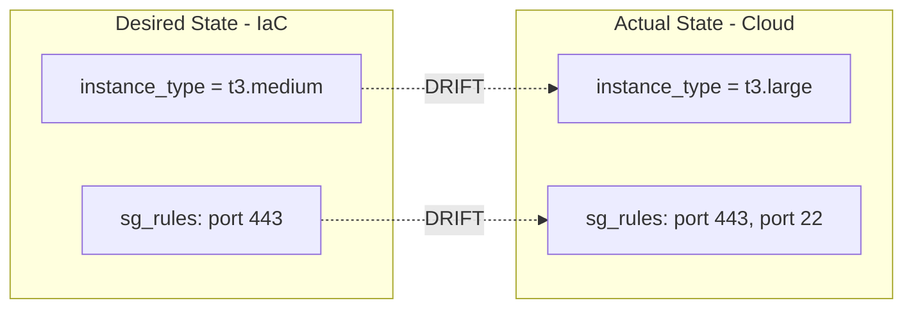
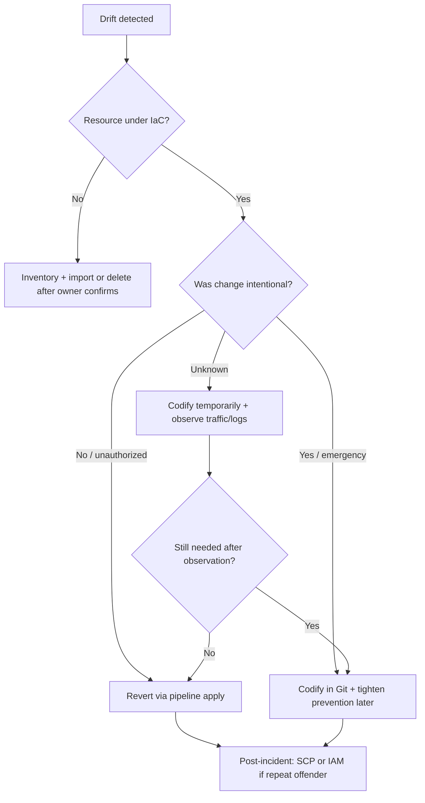

## Complexity: [MEDIUM]
## Time to Complete: 45 minutes

---

## Prerequisites

Before starting this module, you should have completed:
- [Module 6.1: IaC Fundamentals](../module-6.1-iac-fundamentals/) - Core IaC concepts
- [Module 6.4: IaC at Scale](../module-6.4-iac-at-scale/) - Scale challenges
- Basic understanding of desired state versus actual state

---

## What You'll Be Able to Do

After completing this module, you will be able to:

- **Implement drift detection pipelines that identify when infrastructure state diverges from IaC definitions**
- **Design automated remediation workflows that reconcile drift without manual intervention**
- **Build alerting and escalation procedures for drift that cannot be automatically resolved**
- **Analyze drift root causes — manual changes, incomplete IaC coverage, provider bugs — to prevent recurrence**

## Why This Module Matters

Hypothetical scenario: the following situation is invented to show operational stakes clearly; it is not a claim about a specific company or public incident.

During a late-night incident, an on-call engineer adds a temporary database security group rule so a vendor can connect for emergency debugging. The incident resolves quickly, everyone goes back to sleep, and the rule remains in the cloud for weeks because nobody opened a follow-up task. Compliance scanning eventually flags an ingress path that does not appear anywhere in Terraform, and the team spends days proving whether the exposure was ever exploited.

That kind of gap is dangerous because audits, disaster recovery, and incident response all assume the repository still describes production. When drift accumulates, every runbook step that starts with read the Terraform module becomes a guess.

Drift detection is how you restore the contract between code and cloud. It is not a single tool feature; it is a set of practices that compare desired state, stored state, and observed reality on a schedule your risk model can tolerate.

Remediation is the harder half of the problem because not every difference should be reverted automatically. Some manual changes were legitimate emergencies. Some differences come from autoscalers you intentionally delegated. The skill is choosing revert, codify, or tolerate.


---

## What Configuration Drift Is and Why It Erodes IaC Guarantees

At its core, configuration drift means the infrastructure a user or auditor sees no longer matches the infrastructure your pipeline would recreate from the current default branch. The mismatch can be subtle, such as one security group rule, or obvious, such as an instance type change.

IaC tools promise reproducibility: given the same code and credentials, apply should converge the environment. Drift breaks that promise silently because the cloud API happily accepts out-of-band edits and Terraform state only tracks resources you already manage.

Think of drift as debt. Each undocumented change makes the next plan harder to interpret, the next apply riskier, and the next handoff more expensive because newcomers cannot trust the diagram on the wiki or the module in Git.

Drift also erodes auditability. If compliance asks who approved a firewall change and the answer is nobody because it happened in a console session, you have both a security gap and a governance gap even when no attacker was involved.

Disaster recovery depends on the same contract. If your runbook says recreate the VPC from module networking/vpc but production has manual peering routes nobody codified, failover will fail in ways that stress tests never surfaced.

Reproducibility is not vanity; it is how teams move faster. When drift is normalized, engineers stop using the pipeline for fixes and start using click-ops, which increases variance and makes automation look slow even when it is safer.

## Why Drift Happens in Real Organizations

Emergency click-ops is the most common human source of drift. During an outage, speed beats process, and the cloud console is one click away. The fix works, pages stop, and the temporary rule or larger instance size persists because fatigue wins over follow-up.

Over-broad IAM permissions make that behavior easy. If every engineer can modify production security groups, drift becomes a matter of when, not if. Least privilege is both a security control and a drift-prevention control because it forces changes through reviewed paths.

Multiple tools owning overlapping resources create mechanical drift. Terraform may manage an autoscaling group while a Lambda function adjusts desired capacity, while a separate script tags volumes, while the cloud provider applies default encryption policies.

Auto-scaling and auto-healing are legitimate drift sources when ownership is unclear. A cluster autoscaler or AWS Auto Scaling policy changes replica counts to match load; that is correct behavior unless your IaC also claims sole ownership of the same field.

Cloud provider defaults and automatic updates introduce drift without malice. A new default encryption setting, an automatic minor version upgrade, or a service-linked role created on first use can diverge from a module written two years ago.

Debugging sessions leave drift behind when engineers tweak live settings to isolate a problem. A increased timeout, a relaxed health check, or an opened port for packet capture is reasonable during triage and dangerous when the session ends without a commit.

Incomplete IaC coverage guarantees shadow resources. Teams often manage compute with Terraform while forgetting IAM policies, DNS records, or monitoring alarms created ad hoc. Those resources are invisible to plan until something scans the whole account.

Provider bugs and state corruption are rare but real drift sources. A failed apply halfway through, a partial state write, or a provider regression can desynchronize state from reality even when nobody touched the console.

## Types of Drift: Configuration, State, Infrastructure, and Code

Configuration drift is the classic case: a managed resource exists in state, but one or more attributes in the cloud differ from the HCL definition. Plans show update in place and the diff names the changed arguments.

Infrastructure drift, sometimes called shadow IT, means resources exist in the cloud but not in IaC at all. Standard terraform plan will not mention them because Terraform only diffs resources it tracks; discovery requires inventory scans or tools like driftctl.

State drift means your state file no longer reflects either code or reality. Examples include manual state edits, applying from the wrong branch, or refresh failures that leave stale attributes in state while the cloud moved on.

Code drift is the opposite direction: engineers changed HCL locally or in a branch but never applied, so state and cloud match each other while code diverges. The next apply from main can surprise everyone with destructive changes.

Operational teams need vocabulary to avoid talking past each other. Saying production drifted is imprecise; saying an unmanaged security group rule appeared is actionable and routes to the right detection tool and remediation owner.

State drift versus infrastructure drift matters for tooling. Plan catches configuration drift for managed resources; refresh-only updates state without changing cloud; inventory scanners find resources Terraform never knew about.

## Detecting Drift: Plans, Schedules, Inventory, and Cloud Rules

Detection strategy starts with a simple question: how long can this environment lie to Git before the lie becomes an incident? Production might tolerate hours with paging; development might tolerate days with a weekly report; regulated data stores might require continuous scanning.

The baseline detector for Terraform-shaped workflows is terraform plan with detailed exit codes. Exit code zero means empty diff, one signals error, and two means changes would occur, which is your drift alarm for managed resources.

```bash
terraform plan -detailed-exitcode -out=tfplan
echo "exit code: $?"

# 0 = no changes
# 1 = error
# 2 = changes pending (drift or unapplied code)
```

Scheduled detection beats ad hoc checks because drift is time-dependent. A rule added Friday night and removed Monday morning might never appear in a manual plan run, but a cron job every six hours creates evidence and trend lines.

Pair plan with refresh-only when you need to update state without applying. Refresh-only shows what would change in state if Terraform re-read the cloud, which helps separate stale state from true configuration divergence.

```bash
terraform plan -refresh-only
```

Cloud-native config services complement IaC scans by evaluating resources against organizational rules even when those resources are unmanaged. AWS Config, Azure Policy, and Google Cloud Asset Inventory each expose different angles on compliance drift.

Alert design should classify drift, not merely detect it. A tag change and an public exposure change both produce diffs, but only one should wake someone up. Severity tables and ownership tags turn noisy plans into routed work.

Metrics make drift a managed process instead of a recurring surprise. Track detections per environment, time to remediate, repeat offenders, and sources such as console, API user, or automation role to guide policy investments.

Terraform plan compares desired configuration from code plus state with the provider's view of reality. It is pull-on-demand: until plan runs, you do not know drift exists. That is acceptable when schedules are reliable and production changes are rare outside pipelines.

CI pipelines often wrap plan with -detailed-exitcode and fail or notify on code two without applying. This pattern gives developers fast feedback in lower environments and gives operators audit trails in production without auto-changing live systems.

Refresh-only mode aligns state to reality without changing resources, which is useful when you suspect state staleness or when integrating manual changes you intend to codify next. It is the supported replacement for the deprecated standalone refresh command.

Atlantis and similar pull-request automation tools excel at plan-on-change but still benefit from scheduled drift jobs because production changes do not always flow through the same repository events. Scheduled plans close the loop when humans bypass Git.

HCP Terraform can run drift detection on a schedule for connected workspaces, comparing real infrastructure to the last applied run. That model centralizes history and integrates with approval workflows, at the cost of tying detection to the vendor control plane.

Spacelift stack drift detection executes proposed runs on a cron and optionally triggers reconciliation runs when diffs appear. Policy hooks can treat drift runs differently, for example requiring manual approval before any production apply triggered by detection.

driftctl scans cloud APIs and compares discovered resources to Terraform state, highlighting coverage gaps and unmanaged assets. It answers questions plan cannot, such as how much of this account is actually under IaC and which resource types leak most often.

```bash
driftctl scan
driftctl scan --output json://drift-report.json
```

Inventory coverage reports should feed back into module design. If driftctl repeatedly finds orphaned security groups or DNS records, the fix is often expanding modules and onboarding templates, not endlessly ignoring findings.

.driftignore files document accepted exceptions, similar to .gitignore, but each ignored resource should carry a ticket or owner because silent ignores recreate the original visibility problem with extra steps.

CloudTrail and audit logs provide attribution once drift is known. They do not replace detection, yet who changed this field is essential when deciding revert versus codify, especially in shared accounts with break-glass roles.

Remediation begins only after classification. Revert-to-code, absorb-into-code, and prevent-at-source are the three durable strategies; choosing wrong wastes time and can cause outages when legitimate emergency changes are auto-reverted during incidents.

Reconcile to code means apply the declared configuration and let the cloud snap back. This is the GitOps reflex for Terraform: make reality match reviewed HCL. It is appropriate when manual changes were mistakes or unauthorized.

Absorb into code means import or copy live settings into modules, then plan should show no diff. Use this when the manual change was correct but late, such as a vendor IP allowlist that must persist under change control going forward.

## Remediation Strategies: Reconcile, Absorb, and Prevent

Prevent at source uses IAM, service control policies, and admission rules to block direct mutation of tagged resources except for pipeline roles. Prevention reduces detection load but requires break-glass paths so incidents remain solvable.

Auto-apply remediation belongs primarily in non-production environments where reverting experimental drift is low risk. Production auto-apply can fight incident responders and destroy legitimate temporary capacity unless tightly scoped.

Every remediation should leave an audit artifact: ticket link, pull request, or run URL. If you cannot explain why the drift happened and why the chosen fix is safe, pause before apply even when plan looks clean.

Import workflows bring existing cloud objects under management without recreating them. terraform import maps an address to an ID; import blocks in configuration generation help scale the pattern when bulk onboarding legacy resources.

```bash
terraform import aws_security_group.imported sg-0123456789abcdef0
terraform plan  # should show no changes once HCL matches reality
```

After import, plan must be clean aside from intentional follow-ups. If plan still wants to change tags or rules, your HCL does not yet match reality and apply would modify live systems unexpectedly.

lifecycle ignore_changes tells Terraform to stop managing specific attributes after creation. Use it narrowly for fields delegated to autoscalers, external secret rotators, or operators, not as a blanket mute button on drift alerts.

```hcl
resource "aws_eks_node_group" "workers" {
  # ...
  scaling_config {
    desired_size = 3
  }

  lifecycle {
    ignore_changes = [scaling_config[0].desired_size]
  }
}
```

ignore_changes that is too broad hides real problems. Ignoring entire security group resources because rules are annoying means Terraform will never repair accidental exposure; ignore only the delegated field when ownership is documented.

Break-glass access should be time-bound and audited. Patterns include temporary IAM role assumption with mandatory ticket ID, automatic expiration, and a follow-up bot that opens a codify-or-revert task before the next detection window.

Service control policies can deny console mutations on resources tagged ManagedBy=terraform while allowing the pipeline role. Exceptions must exist for disaster scenarios, and those exceptions must be louder in logging than normal applies.

Continuous reconciliation is the controller model: a loop repeatedly compares desired and observed state, then acts without waiting for a human to run plan. Kubernetes controllers, Crossplane providers, and GitOps agents all embody variants of this loop.

Terraform's default posture is pull-on-demand reconciliation when you run apply. That is simpler operationally but means drift persists between runs unless detection schedules close the gap.

Crossplane managed resources reconcile on events and polls, correcting external cloud drift toward the Kubernetes spec. Pausing annotations and reconcile requests give operators escape hatches when automatic correction would be dangerous.

## Continuous Reconciliation and Controller Loops

GitOps controllers such as Flux and Argo CD reconcile cluster state from Git continuously; see the GitOps drift module for Kubernetes-specific comparison rules. The IaC lesson transfers: ownership maps and ignore rules still decide what is drift versus delegation.

Cluster API and other declarative provisioning systems apply the same lesson at the infrastructure layer: declared spec is authoritative, controllers repair divergence, and humans need break-glass when controllers fight each other.

Auto-revert can collide with emergency scale-out or manual mitigation. Policy should define which fields controllers own, which fields humans may touch with approval, and what happens when two controllers disagree on the same field.

Continuous reconciliation trades latency for consistency. Drift might exist for seconds instead of days, but misconfigured self-heal can amplify outages if it undoes a valid hotfix faster than humans can notice.

Bulk import is an onboarding project, not a one-liner. Discovery, ownership confirmation, module refactoring, and staged imports reduce the risk of importing the wrong object or freezing bad configurations into code.

Generated import blocks help teams scaffold HCL from discovered IDs, but generated code still needs review for secrets, naming, and dependency ordering before merge.

Refactoring while fighting drift is painful. Stabilize detection first so new modules do not inherit silent variance, then move resources with moved blocks or targeted imports rather than big-bang replacements.

## Import, Refactor, and Bulk Onboarding

Tagging strategy underpins import at scale. If ManagedBy and Environment tags are reliable, scanners and policies route drift tickets to the right team instead of a central queue that becomes a bottleneck.

Drift dashboards aggregate detection results by account, environment, and resource type. Leadership cares about trend down and mean time to remediate, not individual diffs, yet engineers need drill-down to the plan output.

SLAs on remediation translate risk into operations. Critical security drift might require action within hours; cosmetic tag drift might wait for the next sprint. Without SLAs, alerts compete with feature work and lose.

Root cause analysis closes the loop. If the same security group drifts every month, the fix is process, training, or SCP, not a fifteenth manual revert. Track sources: console user, break-glass role, external automation.

## Governance: Dashboards, SLAs, and Root Cause Analysis

Admission policies in Kubernetes and cloud policy engines can reject mutations that violate tags or CIDR baselines before drift appears. Prevention plus detection is stronger than detection alone, especially for regulated environments.

On-call runbooks should list drift response steps: classify severity, identify owner, choose revert or codify, execute via pipeline, verify plan clean, document incident. Runbooks fail when they assume everyone remembers import syntax under pressure.

Effective drift programs combine scheduled plan, inventory scanning for coverage, cloud config rules for baselines, and human review gates in production. Each layer catches gaps the others miss, which is why mature platforms overlap tools intentionally.

A pattern that works well is detect everywhere, auto-remediate in dev, ticket in staging, and page plus human apply in production. The pattern respects blast radius while still giving developers fast feedback loops.

Another pattern is codify-first for unknown drift: import, open pull request, monitor traffic, then tighten SCP once Git owns the resource. Revert-first is faster but riskier when the purpose of a manual rule is unknown.

## Implement Drift Detection Pipelines

Implement drift detection pipelines by chaining checkout, init, plan with detailed exit codes, artifact upload, and notification steps on a cron schedule per environment. Treat the pipeline itself as code reviewed like any module change.

## Design Automated Remediation Workflows

Design automated remediation workflows with explicit gates: auto-apply only where blast radius is bounded, require human approval tokens in production, and wire rollback paths when apply after drift makes metrics worse instead of better.

## Build Alerting and Escalation Procedures

Build alerting and escalation procedures that route security-related diffs to immediate pages, capacity-related diffs to platform office hours, and coverage gaps to backlog grooming with account owners tagged automatically from resource metadata.

## Analyze Drift Root Causes to Prevent Recurrence

Analyze drift root causes by correlating CloudTrail events, break-glass ticket IDs, deployment timelines, and repeat resource addresses. Patterns in root causes tell you whether to invest in SCP, training, module coverage, or controller ownership maps.



Break-glass with mandatory backfill is a pattern, not a failure admission. Incidents require speed; the platform obligation is to make temporary changes visible quickly and convert them into reviewed code or deliberate reverts within agreed time.

Rosetta-style thinking helps teams compare capabilities without betting on a single vendor. Scheduled plan, hosted workspace drift jobs, and inventory scanners all detect divergence; they differ in coverage, credentials, and reconciliation hooks.

Treating every plan diff as an emergency creates alert fatigue until engineers ignore real security findings mixed with noise from autoscaling and defaulting behavior.

Auto-applying production drift without reading the diff reintroduces outages when the manual change was compensating for a bad deploy or upstream dependency failure.

Using ignore_changes to silence alerts instead of documenting delegation hides exposure changes behind a lifecycle block that future reviewers may not notice during routine module upgrades.

Relying solely on terraform plan while never scanning for unmanaged resources leaves shadow IT growing until compliance or cost audits surface resources nobody can explain.

Drift detection without attribution logs forces debates instead of fixes because teams cannot tell whether a change came from a pipeline bug, a vendor, or a human console session.

Skipping post-incident codify steps guarantees repeat drift because the same on-call shortcuts remain the fastest path the next time pages fire.

The revert-versus-codify decision should consider blast radius, ownership, and evidence of use. Unknown manual network rules with high exposure bias toward temporary codify plus traffic observation before removal, while mistaken tag edits often revert immediately.

When autoscalers own a field, remediation is configuration, not apply: update ignore rules or module inputs so plan stops fighting legitimate scaling instead of repeatedly applying desired capacity that collapses under load.

When drift indicates missing coverage, remediation is onboarding: import, module expansion, and template updates rather than delete in cloud, which might destroy data someone relies on even though Terraform never tracked it.

Prevention investments make sense when drift repeats predictably from the same roles or tools. One-off emergencies need process and backfill more than new SCP complexity that slows every future incident response.

The hands-on lab uses the local Terraform provider so you can simulate drift without cloud credentials. The mechanics mirror production: change reality, detect with plan, then choose revert or codify paths deliberately.

Running the detection script trains muscle memory for exit codes and log capture, which is what you will wire into CI notifications and metrics publishers in real pipelines.

Detection pipelines should store plan artifacts, not only boolean drift flags. Stored plans enable diff review, compliance evidence, and training for engineers learning to read provider output without fear during incidents.

Separate detection credentials from apply credentials when possible. Read-only roles that can plan but not apply reduce risk if CI secrets leak while still giving faithful drift signal for managed stacks.

Workspace or stack boundaries affect blast radius of both drift and remediation. Monolithic state means one drift detection job touches everything; sharded states localize diffs but require orchestration to see account-wide coverage.

Module versioning interacts with drift when production applies lag behind registry releases. A plan against latest modules may show changes unrelated to cloud drift; pin versions in detection jobs to match what is actually deployed.

Remote state backends must be consistent with detection runners. If CI plans against stale state locks or wrong workspace prefixes, you will chase phantom drift or miss real divergence until apply locks clear.

Provider upgrades can surface latent drift by changing schemas or defaults. After upgrading providers, run refresh-only and plan in lower environments before interpreting production diffs as human mistakes.

Policy-as-code hooks on plan output, such as Sentinel or OPA, can classify diffs by resource type and severity before alerting. This keeps SSH exposure changes from sharing the same Slack channel as tag typos.

Drift remediation pull requests should include both the HCL change and a short narrative of why the drift occurred. Future reviewers learn process gaps faster when commits explain human context plans cannot show.

Testing detection itself prevents false confidence. Inject known drift in sandbox accounts quarterly and verify alerts, tickets, and dashboards fire within expected SLAs before real incidents test the system for you.

FinOps ties to drift when manual upsizing persists without code updates. Cost anomalies sometimes surface drift before security tools do, especially for instance sizes, storage tiers, and orphaned volumes nobody tracks in modules.

Multi-cloud estates multiply detection surfaces. Standardize on a small set of patterns per cloud rather than entirely different drift programs per provider, so platform engineers can rotate and audit practices.

Documentation debt accelerates drift because engineers who fear breaking undocumented manual tweaks avoid the pipeline. Investing in accurate module docs and runbooks reduces the temptation to fix things in the console.

Lease and lock mechanisms in automation servers prevent concurrent apply and detection from stepping on each other. Running plan during an active apply can yield confusing partial diffs that look like drift but are transient.

Immutable infrastructure patterns reduce some drift classes because replacement is preferred over in-place mutation, yet DNS, firewall, and data store rules still drift unless detection covers them explicitly.

Kubernetes nodes and add-ons managed outside Terraform still affect applications Terraform deploys. Platform teams should agree boundary lines: which layers each tool owns, and which shared fields require coordinated ignore rules.

Training matters as much as tooling. Engineers who understand why drift erodes IaC guarantees are more likely to open the follow-up pull request after a break-glass session instead of assuming operations will notice.

Executive reporting on drift trends justifies investment in prevention. A chart showing detected console mutations trending down after SCP deployment tells a clearer story than post-incident regret slides after an audit finding.

Seasoned teams store exemplar plan outputs in internal wikis annotated with decisions taken. These examples accelerate onboarding and reduce panicked revert clicks when newcomers see their first scary production diff.

Finally, drift management is never finished. Cloud services evolve, teams reorganize, and emergencies still happen. The goal is not zero diff forever but visible, classified, and remediated divergence within bounds your organization chooses deliberately.

Network drift is especially dangerous because exposure changes can be invisible to application teams until scanners or customers report problems. Security groups, route tables, and load balancer listeners deserve higher detection priority than cosmetic metadata.

Data store drift spans storage class, backup retention, and public access blocks. These attributes rarely show up in application logs until restore fails or data leaves the expected region, which is why plans including data modules need tight review gates.

Identity drift includes roles, trust policies, and permission boundaries created outside modules. IAM is often the last thing teams import, yet over-privileged roles undermine every SCP you deploy elsewhere in the account.

DNS and certificate drift breaks clients silently. A manual CNAME or expired cert rotation outside Terraform can pass application health checks while external users fail, so detection should cover edge resources not only compute.

Observability resource drift, such as alarms deleted in console or thresholds tweaked during incidents, causes blind spots during the next outage. Treat monitoring objects as first-class IaC citizens with the same detection schedules as production services.

Kubernetes cluster add-ons managed separately from cloud IaC still produce hybrid drift stories. Align expectations about which repository owns ingress controllers, CSI drivers, and node AMIs so plans in one stack are not fighting controllers in another.

Blue-green and canary deployments sometimes mutate traffic weights outside Terraform when runbooks call vendor APIs directly. Document those flows or absorb them into modules; otherwise production traffic shape diverges while compute plans look clean.

Feature flags and runtime configuration stored outside IaC are not Terraform drift strictly speaking, yet they produce the same user-visible inconsistency between documented architecture and live behavior during audits and handoffs.

Third-party integrations that mutate tags or backups through SaaS connectors can drift policies without a human login. Audit those integration roles with the same rigor as employee IAM and include them in attribution dashboards.

Regulatory environments often require evidence that drift was detected within defined intervals. Store timestamped plan artifacts in immutable storage so auditors can verify process, not just current compliance snapshots.

Game days should include injected drift scenarios alongside failure injection. Teams that practice reading plans under time pressure revert mistaken applies less often during real incidents when adrenaline is high.

Vendor maintenance windows may change cloud defaults globally. Subscribe to provider notifications and run detection after announced maintenance because benign platform updates can surface as widespread low-severity diffs simultaneously.

Terraform Cloud and other remote runners centralize secrets and history, which helps drift investigations trace which commit last matched production. Decentralized laptops running ad hoc plans lose that audit chain unless logs are deliberately centralized.

Partial applies leave painful drift shapes: resources created in cloud but missing from state, or state entries for deleted objects. Recovery requires targeted refresh, import, or state surgery with change windows because plans may propose large destructive actions.

Moved blocks and refactors can mimic drift in plans even when cloud configuration never changed. Communicate refactor windows to detection owners so they do not open duplicate incidents against expected address changes.

Environment promotion drift happens when staging code advances but production apply lags during change freezes. Detection comparing Git main to production state may show drift that is really a pending promotion decision, not unauthorized mutation.

Self-service portals that wrap Terraform still produce drift if they allow parameter tweaks not reflected in underlying modules. The portal becomes a second source of truth unless every knob maps cleanly to versioned HCL inputs.

Cost optimization scripts that downsize idle resources outside pipelines create FinOps-positive but audit-negative drift unless codified. Pair optimization automation with automatic pull requests or detection tickets rather than silent savings.

Backup and disaster recovery copies of state must not become alternate apply paths. Teams restoring old state during panic can reintroduce deleted resources or remove new ones, which looks like catastrophic drift until reconciled carefully.

Hybrid cloud estates need consistent drift vocabulary across on-prem virtual machines, bare metal, and public cloud modules. Without shared severity tables, one team's acceptable variance becomes another team's emergency.

Education beats blame when introducing drift programs. Engineers who fear punishment for past console fixes will hide changes; engineers who see detection as safety net report drift early and help improve modules.

Platform metrics should include percentage of resources under IaC coverage, not only count of diffs. Coverage trending up shows onboarding progress; diff count alone can rise temporarily while shadow IT is being absorbed responsibly.

Synthetic checks can complement IaC detection by probing endpoints and TLS configurations independent of Terraform. They catch user-visible misconfigurations even when plans are empty because DNS or CDN layers sit outside current modules.

Long-lived sandboxes accumulate drift that skews module testing. Refresh or rebuild sandboxes on schedules so experiments do not teach wrong assumptions about which defaults production actually enforces today.

Writing modules defensively reduces drift frequency: sensible defaults, validation blocks, and documented extension points give engineers approved places to customize instead of opening consoles when requirements change slightly.

Peer review of detection changes matters because a overly sensitive cron can drown teams while a overly relaxed schedule misses exposures. Treat detection pipelines as production services with their own SLAs and reviewers.

Cross-team service catalogs linking resources to modules accelerate drift triage. When a plan names an address, catalog metadata should instantly identify service owner chat and expected change window policies.

Immutable tags such as last-applied commit on resources help forensic timelines even when drift occurs. They do not prevent drift but shorten debates about which pipeline version last aligned with reality.

Automation debt accrues when detection scripts sprawl as copy-pasted CI jobs. Consolidate into reusable workflows with parameterized environments so improvements to notification and artifact storage propagate everywhere at once.

Drift toward more secure configurations is still drift if undocumented. Do not waive detection because a manual change improved security; codify the improvement so it survives the next apply from an older module version.

Closing the loop with module fixes prevents recurrence when drift reveals missing inputs. If engineers repeatedly tweak the same variable in console, add a module input with validation instead of fighting symptoms forever.

Executive sponsorship helps when drift remediation competes with feature roadmaps. Framing drift as risk and audit debt translates technical diffs into language leadership already funds without requiring everyone to read plan output daily.

Change advisory boards can use drift metrics as evidence for investing in module coverage or tightening break-glass policy when the same accounts appear repeatedly in weekly detection reports.

Temporary waivers for known drift during migrations should carry expiry dates and owners; otherwise waivers become permanent exceptions that undermine the credibility of detection dashboards.

Aligning detection frequency with deployment frequency reduces false comfort: if production deploys hourly but drift scans run weekly, many manual fixes can land and leave before the next scan executes.

Recording drift decisions in the same system that tracks deployments builds organizational memory: the next engineer sees not only what changed but why revert was rejected in favor of codifying a manual hotfix.

Small wording differences in module descriptions during audits often trace back to drift that was never codified; keeping Git aligned with reality makes compliance narratives truthful instead of aspirational.


> **Landscape snapshot — as of 2026-06. This changes fast; verify against vendor docs before relying on specifics.**

| Capability | Terraform CLI / OSS | HCP Terraform | Spacelift | driftctl | Crossplane |
|------------|---------------------|---------------|-----------|----------|------------|
| Scheduled drift detection | CI cron + plan | Workspace drift detection runs | Stack drift schedules on private workers | CLI/API scan schedules | Controller poll + watch loop |
| Unmanaged resource discovery | Limited (plan scope) | Workspace inventory features vary | Proposed runs show diffs | Strong coverage reporting | Tracks only managed CRs |
| Auto-reconciliation | apply in automation | Optional apply after detection | Optional tracked run after drift | Report-focused; remediate via IaC | Continuous reconcile by default |
| Ignore / delegate fields | lifecycle ignore_changes | Same HCL patterns | Policy on drift runs | .driftignore exceptions | crossplane.io/paused annotation |

> Maturity note (as of 2026-06): driftctl is open-source and functional but low-velocity — its last tagged release was v0.40.0 (Dec 2023) and the repository is not archived but sees little feature work. The drift-detection *concepts* here are durable; verify driftctl's maintenance status (and consider Terraform's own plan/`-detailed-exitcode`, cloud-native inventory, or your orchestrator's drift features) before standardizing on any single scanner.

## Patterns and Anti-Patterns

### Patterns

| Pattern | When to use | Why it works |
|---------|-------------|--------------|
| Scheduled plan with detailed exit codes | All Terraform-managed environments | Surfaces managed-resource drift on a predictable cadence with machine-readable signals |
| Inventory scan plus IaC coverage report | Accounts with historical manual resources | Finds shadow IT that plan alone cannot see |
| Detect in dev, ticket in staging, human gate in prod | Mixed blast-radius estates | Matches remediation aggressiveness to risk |
| Break-glass with mandatory codify window | Incident-heavy teams | Preserves speed while forcing visibility before drift becomes invisible debt |
| Field ownership map with targeted ignore | Platforms with autoscalers and operators | Stops alert storms without muting real configuration drift |

### Anti-Patterns

| Anti-Pattern | Why it fails | Better approach |
|--------------|--------------|-----------------|
| Alert on every plan diff without severity | Fatigue leads to ignored security findings | Classify diffs; route by resource type and exposure |
| Production auto-apply on any drift | Can revert legitimate emergency mitigations | Human review or policy-gated apply in production |
| Broad lifecycle ignore_changes | Hides exposure and misconfiguration | Ignore only delegated fields with documented owners |
| Plan-only detection forever | Misses unmanaged resources entirely | Add inventory scanning and onboarding workflows |
| Drift runbooks without attribution steps | Teams argue instead of fixing | Pair detection with audit logs and ticket IDs |

### Decision Framework: Revert, Codify, or Prevent



## Did You Know?

- **Plan exit codes are standardized**: [Terraform documents](https://developer.hashicorp.com/terraform/cli/commands/plan#detailed-exitcode) exit code 2 as success with a non-empty diff, which is why CI systems can treat drift as a signal without parsing text.
- **Refresh-only replaced standalone refresh**: HashiCorp deprecated bare `terraform refresh` in favor of [plan with -refresh-only](https://developer.hashicorp.com/terraform/cli/commands/plan) so operators can see state updates before applying them.
- **driftctl was built for coverage gaps**: The [driftctl project](https://github.com/snyk/driftctl) explicitly targets unmanaged and missing resources, not just attribute diffs on tracked objects.
- **Crossplane can pause reconciliation**: The [`crossplane.io/paused` annotation](https://docs.crossplane.io/latest/managed-resources/managed-resources/) stops a provider from correcting external drift when automatic repair would be dangerous.

## Common Mistakes

| Mistake | Problem | Solution |
|---------|---------|----------|
| No scheduled drift detection | Silent divergence accumulates between merges | Cron plan jobs per environment with stored artifacts |
| Ignoring drift alerts | Real exposures hide in noise | Severity routing and ownership tags on resources |
| Unlimited console write access | Click-ops becomes the fastest path | SCP or IAM deny on tagged managed resources |
| No break-glass procedure | Emergencies bypass IaC entirely | Time-bound role with mandatory follow-up ticket |
| Over-broad ignore_changes | Security drift never surfaces in plan | Ignore only delegated fields documented in modules |
| No drift metrics | Leadership cannot see improvement | Publish detection counts and MTTR to dashboards |
| Auto-remediation in production | Can undo valid incident fixes | Human or policy approval before production apply |
| Skipping root cause analysis | Same drift repeats monthly | Correlate audit logs with repeat resource addresses |

## Quiz

<details>
<summary>1. A junior engineer resizes a database from the console during a load spike, while another engineer has unapplied Terraform changes to a security group in the same stack. What drift types are present?</summary>

**Answer**: Configuration drift exists because the live database size no longer matches the declared Terraform attributes for that managed resource. Code drift also exists because the security group change sits in HCL or local state without a successful apply, so code, state, and cloud disagree on that object. Implement drift detection pipelines should catch the database divergence on the next plan, while process fixes address the unapplied branch before it merges unexpectedly.
</details>

<details>
<summary>2. Your nightly job runs `terraform plan -detailed-exitcode` and exits with code 2. What does that mean, and how should the pipeline respond?</summary>

**Answer**: Exit code 2 means Terraform completed planning successfully but found a non-empty diff, indicating drift or pending changes for managed resources. The pipeline should upload the plan artifact, notify owners, and open a ticket rather than treating the job as a generic failure. Build alerting and escalation procedures that distinguish code 2 from code 1 errors so on-call is not paged for syntax problems disguised as drift.
</details>

<details>
<summary>3. A Lambda function rotates Secrets Manager values every thirty days, but daily Terraform plans keep trying to reset the secret string. What is the durable fix?</summary>

**Answer**: Add a targeted `lifecycle { ignore_changes = [secret_string] }` block on the secret version resource so Terraform stops managing that attribute after initial creation. Document that the rotation Lambda owns the field, and monitor the Lambda separately. Analyze drift root causes here as delegation design: the fix is ownership clarity, not disabling detection entirely.
</details>

<details>
<summary>4. Hypothetical scenario: `terraform plan` shows no changes, yet inventory scanning reports a new unapproved object storage bucket. Why did plan miss it, and what should you do next?</summary>

**Answer**: Plan only evaluates resources already in state; an entirely unmanaged bucket is infrastructure drift outside Terraform's scope until imported. Run an inventory-oriented scanner such as driftctl, confirm ownership and data sensitivity, then either import under a module or delete after explicit owner approval. Design automated remediation workflows only after the bucket is under management or formally exempted with recorded rationale.
</details>

<details>
<summary>5. Leadership wants zero manual console changes on tagged production resources without blocking incident response. What control pattern fits both goals?</summary>

**Answer**: Apply organization-level deny policies on mutation APIs for resources tagged as pipeline-managed, with an exception for a audited break-glass role that requires ticket metadata. Pair the SCP with detections on that role's activity and a mandatory codify-or-revert SLA. Implement drift detection pipelines using both plan schedules and audit log alerts on the break-glass path so emergencies remain possible but visible.
</details>

<details>
<summary>6. An unknown ingress rule has sat on a production database security group since before the last engineer left. What is the safest remediation sequence?</summary>

**Answer**: Treat the rule as high-risk unknown exposure: capture evidence, notify security, and temporarily codify the rule into Terraform so it becomes visible in plan and review tools. Observe VPC flow logs or application metrics to see whether anything uses the path, then remove it via a reviewed apply if unused. Build alerting and escalation procedures so future manual rules trigger tickets before they age into mystery debt.
</details>

<details>
<summary>7. Auto-remediation with `terraform apply` worked well in development. Why hesitate before enabling it in production?</summary>

**Answer**: Production manual changes are often intentional incident mitigations; auto-apply can revert them immediately and recreate the outage while responders still believe their fix is active. Production also needs human judgment on blast radius for destructive diffs. Analyze drift root causes after each production detection instead of defaulting to apply, and reserve auto-remediation for lower environments with tight scope.
</details>

<details>
<summary>8. Crossplane keeps correcting a field your team manually changed in the cloud during testing. What knobs exist besides deleting the managed resource?</summary>

**Answer**: Pause reconciliation with the [`crossplane.io/paused`](https://docs.crossplane.io/latest/managed-resources/managed-resources/) annotation while you decide whether the cloud or Kubernetes spec should win, then either update the spec in Git or revert the cloud change. For delegated fields, document ownership and adjust spec rather than fighting the controller repeatedly. Continuous reconciliation models require the same revert-versus-codify decision discipline as Terraform, just on shorter intervals.
</details>

## Hands-On

**Objective**: Simulate drift with the local Terraform provider, detect it, and practice revert versus codify remediation.

### Part 1: Create driftable infrastructure

```bash
mkdir -p drift-lab && cd drift-lab

cat > main.tf << 'EOF'
terraform {
  required_providers {
    local = {
      source  = "hashicorp/local"
      version = "~> 2.0"
    }
  }
}

resource "local_file" "config" {
  filename = "${path.module}/config.json"
  content  = jsonencode({
    environment = "production"
    debug       = false
    timeout     = 30
    tags = {
      ManagedBy = "terraform"
    }
  })
}

output "config_path" {
  value = local_file.config.filename
}
EOF

terraform init
terraform apply -auto-approve
cat config.json
```

### Part 2: Introduce and detect drift

```bash
cat > config.json << 'EOF'
{
  "environment": "production",
  "debug": true,
  "timeout": 60,
  "tags": {
    "ManagedBy": "terraform",
    "TempFix": "ticket-12345"
  }
}
EOF

terraform plan -detailed-exitcode
echo "Exit code: $?"
terraform plan
```

### Part 3: Remediate deliberately

```bash
# Option A: revert to declared state
terraform apply -auto-approve

# Option B: codify — update main.tf to match intentional drift, then plan clean
```

### Success Criteria

- [ ] Initial `terraform apply` creates `config.json` with expected baseline values
- [ ] Manual edit produces `terraform plan -detailed-exitcode` exit code 2
- [ ] Plan output names the attributes that diverged from declared content
- [ ] At least one remediation path (revert or codify) returns plan to empty diff

## Sources

- [Terraform plan command](https://developer.hashicorp.com/terraform/cli/commands/plan) — drift detection via plan, detailed exit codes, and refresh-only mode
- [Terraform import command](https://developer.hashicorp.com/terraform/cli/commands/import) — bringing existing resources under management
- [Generating configuration during import](https://developer.hashicorp.com/terraform/language/import/generating-configuration) — import blocks and generated HCL
- [Terraform lifecycle meta-argument](https://developer.hashicorp.com/terraform/language/meta-arguments/lifecycle) — ignore_changes and delegation patterns
- [HCP Terraform drift detection tutorial](https://developer.hashicorp.com/terraform/tutorials/cloud/drift-detection) — scheduled workspace drift runs
- [driftctl documentation](https://docs.driftctl.com/) — inventory scanning and coverage reports
- [driftctl on GitHub](https://github.com/snyk/driftctl) — project scope and unmanaged resource detection
- [Spacelift stack drift detection](https://docs.spacelift.io/concepts/stack/drift-detection) — scheduled proposed runs and optional reconciliation
- [Atlantis documentation](https://www.runatlantis.io/docs/autoplanning.html) — pull-request plan automation complementing scheduled checks
- [Crossplane managed resources](https://docs.crossplane.io/latest/managed-resources/managed-resources/) — reconciliation, pause, and reconcile-request annotations
- [OpenGitOps principles](https://opengitops.dev/) — Git as source of truth and declarative reconciliation
- [Kubernetes controllers](https://kubernetes.io/docs/concepts/architecture/controller/) — control loop model shared with continuous reconciliation systems
- [Kubernetes object management](https://kubernetes.io/docs/concepts/overview/working-with-objects/) — fields owned by the API versus desired spec
- [AWS Config overview](https://docs.aws.amazon.com/config/latest/developerguide/WhatIsConfig.html) — cloud-side configuration evaluation and compliance rules
- [Flux concepts](https://fluxcd.io/flux/concepts/) — continuous GitOps reconciliation compared to pull-on-demand Terraform

## Next Module

Continue to [Module 6.6: IaC Cost Management](../module-6.6-iac-cost-management/) to learn how to estimate, track, and optimize infrastructure costs directly in your Terraform workflow.
