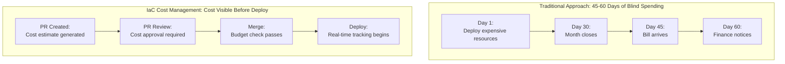

## Complexity: [MEDIUM]
## Time to Complete: 45 minutes

---

## Prerequisites

Before starting this module, you should have completed:
- [Module 6.1: IaC Fundamentals](../module-6.1-iac-fundamentals/) - Core IaC concepts
- [Module 6.4: IaC at Scale](../module-6.4-iac-at-scale/) - Scale challenges
- Basic understanding of cloud billing concepts

---

## What You'll Be Able to Do

After completing this module, you will be able to:

- **Implement cost estimation in IaC pipelines using Infracost or cloud-native pricing APIs**
- **Design cost governance policies that flag expensive infrastructure changes before approval**
- **Build cost tagging strategies that attribute IaC-provisioned resources to teams and projects**
- **Optimize IaC templates to use cost-effective resource configurations by default**

## Why This Module Matters

**A Costly Friday Afternoon Deploy**

An infrastructure team can discover a major cloud-billing spike only after finance reviews the monthly bill.

One common failure mode is leaving an expensive test configuration in a large Terraform diff, where reviewers miss a costly instance type or replica count before merge.

If oversized resources run unnoticed for weeks, the resulting waste can materially affect a startup's budget and planning.

This module teaches you how to integrate cost awareness into your IaC workflow—because the most expensive infrastructure is the infrastructure you didn't know you were paying for.

---

## The Cost Visibility Problem

Cloud costs are often invisible until the bill arrives. 



> **Stop and think**: Look at the traditional timeline. If a misconfigured auto-scaling group spins up 50 instances on Day 2, how much money will the company have wasted by the time Finance notices on Day 60? How does the IaC Cost Management approach structurally prevent this?

---

## Infracost: Cost Estimation in CI/CD

[Infracost provides cost estimates for Terraform changes before they're applied](https://github.com/infracost/infracost).

### Setup

```bash
# Install Infracost
brew install infracost

# Authenticate (free for open source, free tier for private)
infracost auth login

# Initialize in your repo
infracost configure
```

### Basic Usage

```bash
# Estimate costs for Terraform directory
infracost breakdown --path .

# Example output:
#  Name                                     Monthly Qty  Unit   Monthly Cost
#
#  aws_instance.web
#  ├─ Instance usage (Linux/UNIX, on-demand, t3.medium)
#  │                                               730  hours        $30.37
#  └─ root_block_device
#     └─ Storage (general purpose SSD, gp3)        50  GB             $4.00
#
#  aws_db_instance.main
#  ├─ Database instance (on-demand, db.r5.large)  730  hours       $175.20
#  └─ Storage (general purpose SSD, gp2)          100  GB            $11.50
#
#  OVERALL TOTAL                                                   $221.07
```

### Comparing Changes

```bash
# Generate baseline from main branch
git checkout main
infracost breakdown --path . --format json > infracost-base.json

# Generate estimate for feature branch
git checkout feature/new-database
infracost diff --path . --compare-to infracost-base.json

# Example diff output:
#
# + aws_db_instance.analytics
#   + Database instance (on-demand, db.r5.2xlarge)
#                                              730  hours      $700.80
#
# ~ aws_instance.web
#   ~ Instance usage (Linux/UNIX, on-demand, t3.medium → t3.large)
#                                              730  hours  $30.37 → $60.74
#
# Monthly cost will increase by $731.17
#
# ──────────────────────────────────
# Project total:     $952.24 (was $221.07)
```

### [GitHub Actions Integration](https://github.com/infracost/infracost)

```yaml
# .github/workflows/infracost.yml
name: Infracost

on:
  pull_request:
    paths:
      - 'terraform/**'
      - '.github/workflows/infracost.yml'

jobs:
  infracost:
    runs-on: ubuntu-latest
    permissions:
      contents: read
      pull-requests: write

    steps:
      - uses: actions/checkout@v4

      - name: Setup Infracost
        uses: infracost/actions/setup@v3
        with:
          api-key: ${{ secrets.INFRACOST_API_KEY }}

      - name: Checkout base branch
        uses: actions/checkout@v4
        with:
          ref: ${{ github.event.pull_request.base.ref }}
          path: base

      - name: Generate base cost
        run: |
          infracost breakdown --path base/terraform \
            --format json \
            --out-file /tmp/infracost-base.json

      - name: Checkout PR branch
        uses: actions/checkout@v4
        with:
          path: pr

      - name: Generate diff
        run: |
          infracost diff --path pr/terraform \
            --compare-to /tmp/infracost-base.json \
            --format json \
            --out-file /tmp/infracost-diff.json

      - name: Post comment
        uses: infracost/actions/comment@v1
        with:
          path: /tmp/infracost-diff.json
          behavior: update

      - name: Check cost threshold
        run: |
          COST_CHANGE=$(jq '.diffTotalMonthlyCost' /tmp/infracost-diff.json)

          # Fail if monthly cost increase exceeds $500
          if (( $(echo "$COST_CHANGE > 500" | bc -l) )); then
            echo "Cost increase exceeds $500/month threshold"
            echo "Please get approval from @finance-team"
            exit 1
          fi
```

### PR Comment Example

```markdown
## Infracost Report

**Monthly cost will increase by $731.17**

| Project | Previous | New | Diff |
|---------|----------|-----|------|
| terraform/production | $221.07 | $952.24 | +$731.17 |

<details markdown="1">
<summary>Cost breakdown</summary>

### terraform/production

| Resource | Cost |
|----------|------|
| aws_db_instance.analytics (new) | +$700.80 |
| aws_instance.web | +$30.37 |

</details>

---
**Approval required**: Changes exceed $500/month threshold
cc: @finance-team @platform-team
```

---

## Cost Policies and Guardrails

### Policy as Code for Costs

```python
# policy/cost_limits.sentinel (Terraform Cloud/Enterprise)

import "tfrun"
import "decimal"

# Maximum allowed monthly cost increase
max_monthly_increase = decimal.new(1000)

# Get cost estimate from run
cost_estimate = tfrun.cost_estimate

# Calculate increase
monthly_increase = decimal.new(cost_estimate.delta_monthly_cost)

# Main rule
main = rule {
    monthly_increase.less_than_or_equals(max_monthly_increase)
}

# Soft policy - warn but allow override
# Hard policy - block without exception
```

```rego
# policy/cost_limits.rego (OPA/Conftest)

package terraform.cost

import future.keywords.in

# Deny expensive instance types without approval
deny[msg] {
    resource := input.resource_changes[_]
    resource.type == "aws_instance"

    expensive_types := ["r5.24xlarge", "r5.12xlarge", "r5.8xlarge",
                        "c5.24xlarge", "c5.18xlarge", "m5.24xlarge"]

    resource.change.after.instance_type in expensive_types

    msg := sprintf(
        "Instance %s uses expensive type %s. Requires finance approval.",
        [resource.address, resource.change.after.instance_type]
    )
}

# Deny high replica counts
deny[msg] {
    resource := input.resource_changes[_]
    resource.type == "aws_db_instance"

    resource.change.after.multi_az == true

    # Check if this is a non-production environment
    tags := object.get(resource.change.after, "tags", {})
    env := object.get(tags, "Environment", "unknown")
    env != "production"

    msg := sprintf(
        "RDS instance %s has Multi-AZ enabled in %s environment. Only allowed in production.",
        [resource.address, env]
    )
}

# Warn on resources without cost tags
warn[msg] {
    resource := input.resource_changes[_]
    resource.change.actions[_] == "create"

    # Taggable resource types
    taggable := ["aws_instance", "aws_db_instance", "aws_s3_bucket",
                 "aws_eks_cluster", "aws_lambda_function"]
    resource.type in taggable

    tags := object.get(resource.change.after, "tags", {})
    not tags["CostCenter"]

    msg := sprintf(
        "Resource %s is missing CostCenter tag for cost allocation",
        [resource.address]
    )
}
```

> **Pause and predict**: If a developer creates a new `aws_eks_cluster` resource but forgets to add the `CostCenter` tag, which of the Rego rules above will trigger, and what will the output message be?

### Terraform Validation Rules

```hcl
# variables.tf - Built-in cost guardrails

variable "instance_type" {
  description = "EC2 instance type"
  type        = string

  validation {
    condition = !contains([
      "r5.24xlarge", "r5.12xlarge",
      "c5.24xlarge", "c5.18xlarge",
      "m5.24xlarge", "m5.16xlarge"
    ], var.instance_type)
    error_message = "Extra-large instance types require finance approval. Use smaller instances or request exception."
  }
}

variable "environment" {
  description = "Deployment environment"
  type        = string

  validation {
    condition     = contains(["dev", "staging", "production"], var.environment)
    error_message = "Environment must be dev, staging, or production."
  }
}

# modules/database/variables.tf

variable "instance_class" {
  description = "RDS instance class"
  type        = string

  validation {
    # Dev/staging limited to smaller instances
    condition = var.environment == "production" || contains([
      "db.t3.micro", "db.t3.small", "db.t3.medium"
    ], var.instance_class)
    error_message = "Non-production databases limited to t3.micro, t3.small, or t3.medium."
  }
}

variable "storage_size" {
  description = "Storage size in GB"
  type        = number

  validation {
    condition     = var.storage_size <= 1000
    error_message = "Storage over 1TB requires architecture review."
  }
}
```

---

## Cost Allocation and Tagging

### Comprehensive Tagging Strategy

```hcl
# modules/tagging/main.tf

variable "required_tags" {
  description = "Tags required on all resources"
  type = object({
    Environment = string
    Team        = string
    CostCenter  = string
    Project     = string
  })

  validation {
    condition     = contains(["dev", "staging", "production"], var.required_tags.Environment)
    error_message = "Environment must be dev, staging, or production."
  }

  validation {
    condition     = can(regex("^CC-[0-9]{4}$", var.required_tags.CostCenter))
    error_message = "CostCenter must match format CC-XXXX."
  }
}

variable "optional_tags" {
  description = "Optional additional tags"
  type        = map(string)
  default     = {}
}

locals {
  common_tags = merge(
    var.required_tags,
    var.optional_tags,
    {
      ManagedBy    = "terraform"
      LastModified = timestamp()
    }
  )
}

output "tags" {
  description = "Complete tag set for resources"
  value       = local.common_tags
}
```

```hcl
# environments/production/main.tf

module "tags" {
  source = "../../modules/tagging"

  required_tags = {
    Environment = "production"
    Team        = "platform"
    CostCenter  = "CC-1234"
    Project     = "customer-api"
  }

  optional_tags = {
    Compliance = "SOC2"
    DataClass  = "confidential"
  }
}

resource "aws_instance" "app" {
  ami           = data.aws_ami.amazon_linux.id
  instance_type = "t3.medium"

  tags = merge(module.tags.tags, {
    Name = "customer-api-app"
    Role = "application-server"
  })
}
```

### AWS Cost Allocation Tags

```hcl
# Enable cost allocation tags in AWS
resource "aws_ce_cost_allocation_tag" "tags" {
  for_each = toset([
    "Environment",
    "Team",
    "CostCenter",
    "Project"
  ])

  tag_key = each.value
  status  = "Active"
}

# Budget per cost center
resource "aws_budgets_budget" "cost_center" {
  for_each = {
    "CC-1234" = 50000  # Platform team
    "CC-2345" = 30000  # Mobile team
    "CC-3456" = 20000  # Data team
  }

  name         = "Budget-${each.key}"
  budget_type  = "COST"
  limit_amount = each.value
  limit_unit   = "USD"
  time_unit    = "MONTHLY"

  cost_filter {
    name   = "TagKeyValue"
    values = ["user:CostCenter$${each.key}"]
  }

  notification {
    comparison_operator        = "GREATER_THAN"
    threshold                  = 80
    threshold_type             = "PERCENTAGE"
    notification_type          = "FORECASTED"
    subscriber_email_addresses = ["${each.key}@company.com"]
  }

  notification {
    comparison_operator        = "GREATER_THAN"
    threshold                  = 100
    threshold_type             = "PERCENTAGE"
    notification_type          = "ACTUAL"
    subscriber_email_addresses = ["finance@company.com", "${each.key}@company.com"]
  }
}
```

---

## Cost Optimization in IaC

### Right-Sizing Resources

```hcl
# modules/ec2-rightsized/main.tf

variable "workload_type" {
  description = "Type of workload"
  type        = string

  validation {
    condition     = contains(["web", "api", "worker", "database"], var.workload_type)
    error_message = "Workload type must be web, api, worker, or database."
  }
}

variable "expected_load" {
  description = "Expected load level"
  type        = string
  default     = "medium"

  validation {
    condition     = contains(["low", "medium", "high"], var.expected_load)
    error_message = "Expected load must be low, medium, or high."
  }
}

locals {
  # Instance type matrix based on workload and load
  instance_types = {
    web = {
      low    = "t3.micro"
      medium = "t3.small"
      high   = "t3.medium"
    }
    api = {
      low    = "t3.small"
      medium = "t3.medium"
      high   = "t3.large"
    }
    worker = {
      low    = "c6i.large"
      medium = "c6i.xlarge"
      high   = "c6i.2xlarge"
    }
    database = {
      low    = "r6i.large"
      medium = "r6i.xlarge"
      high   = "r6i.2xlarge"
    }
  }

  selected_instance_type = local.instance_types[var.workload_type][var.expected_load]
}

resource "aws_instance" "this" {
  ami           = var.ami_id
  instance_type = local.selected_instance_type

  # ... other configuration
}
```

### Spot Instances for Non-Critical Workloads

```hcl
# modules/spot-fleet/main.tf

variable "use_spot" {
  description = "Use Spot instances for cost savings"
  type        = bool
  default     = true
}

variable "spot_price_buffer" {
  description = "Percentage above on-demand price to bid"
  type        = number
  default     = 0.9  # 90% of on-demand = 10% minimum savings
}

resource "aws_launch_template" "this" {
  name_prefix   = "${var.name}-"
  image_id      = var.ami_id
  instance_type = var.instance_type

  dynamic "instance_market_options" {
    for_each = var.use_spot ? [1] : []
    content {
      market_type = "spot"
      spot_options {
        max_price          = var.spot_max_price
        spot_instance_type = "one-time"
      }
    }
  }

  tag_specifications {
    resource_type = "instance"
    tags = merge(var.tags, {
      SpotInstance = var.use_spot ? "true" : "false"
    })
  }
}

# Auto Scaling with mixed instances
resource "aws_autoscaling_group" "this" {
  name                = var.name
  vpc_zone_identifier = var.subnet_ids
  min_size            = var.min_size
  max_size            = var.max_size
  desired_capacity    = var.desired_capacity

  mixed_instances_policy {
    launch_template {
      launch_template_specification {
        launch_template_id = aws_launch_template.this.id
        version            = "$Latest"
      }
    }

    instances_distribution {
      on_demand_base_capacity                  = var.environment == "production" ? 2 : 0
      on_demand_percentage_above_base_capacity = var.environment == "production" ? 50 : 0
      spot_allocation_strategy                 = "capacity-optimized"
    }
  }
}
```

### Reserved Instances and Savings Plans

```hcl
# Track reserved capacity usage
resource "aws_ce_anomaly_monitor" "ri_coverage" {
  name              = "ri-coverage-monitor"
  monitor_type      = "DIMENSIONAL"
  monitor_dimension = "SERVICE"
}

resource "aws_ce_anomaly_subscription" "ri_alerts" {
  name = "ri-coverage-alerts"

  monitor_arn_list = [aws_ce_anomaly_monitor.ri_coverage.arn]

  subscriber {
    type    = "EMAIL"
    address = "finops@company.com"
  }

  threshold_expression {
    dimension {
      key           = "ANOMALY_TOTAL_IMPACT_PERCENTAGE"
      values        = ["10"]
      match_options = ["GREATER_THAN_OR_EQUAL"]
    }
  }
}

# Document expected RI coverage in Terraform
locals {
  reserved_capacity = {
    "us-east-1" = {
      "r5.2xlarge" = 10  # 10 reserved
      "r5.xlarge"  = 20  # 20 reserved
      "c5.xlarge"  = 15  # 15 reserved
    }
    "us-west-2" = {
      "r5.xlarge" = 5
      "c5.xlarge" = 8
    }
  }

  # Warn if provisioned exceeds reserved
  ri_warnings = [
    for region, instances in local.reserved_capacity : [
      for type, count in instances :
      "Warning: ${type} in ${region} has ${count} reserved but ${local.actual_counts[region][type]} provisioned"
      if local.actual_counts[region][type] > count
    ]
  ]
}
```

---

## Cost Dashboards and Reporting

### Terraform-Based Cost Dashboard

```hcl
# CloudWatch dashboard for cost visibility
resource "aws_cloudwatch_dashboard" "cost_dashboard" {
  dashboard_name = "InfrastructureCosts"

  dashboard_body = jsonencode({
    widgets = [
      {
        type   = "metric"
        x      = 0
        y      = 0
        width  = 12
        height = 6
        properties = {
          title  = "Daily Costs by Service"
          region = "us-east-1"
          metrics = [
            ["AWS/Billing", "EstimatedCharges", "ServiceName", "AmazonEC2", "Currency", "USD"],
            ["...", "AmazonRDS", ".", "."],
            ["...", "AmazonS3", ".", "."],
            ["...", "AmazonEKS", ".", "."]
          ]
          period = 86400
          stat   = "Maximum"
        }
      },
      {
        type   = "metric"
        x      = 12
        y      = 0
        width  = 12
        height = 6
        properties = {
          title  = "Total Monthly Cost"
          region = "us-east-1"
          metrics = [
            ["AWS/Billing", "EstimatedCharges", "Currency", "USD", { stat = "Maximum" }]
          ]
          period = 86400
        }
      },
      {
        type   = "text"
        x      = 0
        y      = 6
        width  = 24
        height = 3
        properties = {
          markdown = <<-EOF
            ## Cost Management Links

            | Resource | Link |
            |----------|------|
            | Cost Explorer | [Open](https://console.aws.amazon.com/cost-management/home#/cost-explorer) |
            | Budgets | [Open](https://console.aws.amazon.com/billing/home#/budgets) |
            | Reserved Instances | [Open](https://console.aws.amazon.com/ec2/v2/home#ReservedInstances:) |
            | Savings Plans | [Open](https://console.aws.amazon.com/cost-management/home#/savings-plans) |
          EOF
        }
      }
    ]
  })
}
```

### Weekly Cost Report

```python
# Lambda function for weekly cost reports
import boto3
import json
from datetime import datetime, timedelta

ce = boto3.client('ce')
sns = boto3.client('sns')

def lambda_handler(event, context):
    # Get costs for the past week
    end_date = datetime.now().strftime('%Y-%m-%d')
    start_date = (datetime.now() - timedelta(days=7)).strftime('%Y-%m-%d')

    # Get costs by service
    response = ce.get_cost_and_usage(
        TimePeriod={'Start': start_date, 'End': end_date},
        Granularity='DAILY',
        Metrics=['UnblendedCost'],
        GroupBy=[
            {'Type': 'DIMENSION', 'Key': 'SERVICE'},
            {'Type': 'TAG', 'Key': 'Team'}
        ]
    )

    # Format report
    report = format_cost_report(response)

    # Send to SNS
    sns.publish(
        TopicArn='arn:aws:sns:us-east-1:123456789012:cost-reports',
        Subject=f'Weekly Infrastructure Cost Report - {end_date}',
        Message=report
    )

    return {'statusCode': 200}

def format_cost_report(response):
    total = 0
    by_service = {}
    by_team = {}

    for result in response['ResultsByTime']:
        for group in result['Groups']:
            cost = float(group['Metrics']['UnblendedCost']['Amount'])
            service = group['Keys'][0]
            team = group['Keys'][1] if len(group['Keys']) > 1 else 'Untagged'

            by_service[service] = by_service.get(service, 0) + cost
            by_team[team] = by_team.get(team, 0) + cost
            total += cost

    report = f"""
# Weekly Cost Report

**Period**: {response['ResultsByTime'][0]['TimePeriod']['Start']} to {response['ResultsByTime'][-1]['TimePeriod']['End']}
**Total Cost**: ${total:,.2f}

## By Service (Top 10)

| Service | Cost |
|---------|------|
"""

    for service, cost in sorted(by_service.items(), key=lambda x: -x[1])[:10]:
        report += f"| {service} | ${cost:,.2f} |\n"

    report += "\n## By Team\n| Team | Cost |\n|------|------|\n"

    for team, cost in sorted(by_team.items(), key=lambda x: -x[1]):
        report += f"| {team} | ${cost:,.2f} |\n"

    return report
```

---

## Example Scenario: Catching an Expensive Copy-Paste

**Scenario**: A growing team is managing Terraform for a data-processing change.
**Risk**: Expensive test instances run longer than intended because nobody notices the cost impact quickly.

**The Code That Caused It**:

```hcl
# What was intended (testing config):
resource "aws_instance" "data_processor" {
  ami           = data.aws_ami.amazon_linux.id
  instance_type = "r5.24xlarge"  # For performance testing
  count         = 1              # Single test instance
}

# What was actually deployed (copy-paste error):
resource "aws_instance" "data_processor" {
  ami           = data.aws_ami.amazon_linux.id
  instance_type = "r5.24xlarge"  # Forgot to change!
  count         = 10             # From previous multi-instance test
}
```

**Timeline**:
- A developer opens a PR for a data pipeline change.
- A reviewer approves a large diff without noticing an expensive instance type.
- The change is merged and deployed.
- Multiple large instances launch, creating a steep hourly cost.
- The instances run mostly idle for an extended period without attracting attention.
- Finance eventually notices an unusually large monthly bill.
- The team scrambles to investigate the spike.
- The team identifies the root cause and terminates the resources.
- **Total unexpected cost**: A large unplanned spend increase.

**What Would Have Prevented This**:

```yaml
# 1. Infracost in CI would have shown:
# "Monthly cost will increase by $34,560" (10 × $4.80 × 720 hours)
# Exceeds $500 threshold - requires approval

# 2. Policy as code would have blocked:
deny[msg] {
    resource := input.resource_changes[_]
    resource.type == "aws_instance"
    resource.change.after.instance_type == "r5.24xlarge"
    msg := "r5.24xlarge requires finance approval"
}

# 3. Budget alert would have fired:
# Day 3: "Forecasted to exceed $200,000 budget by 380%"
```

**Aftermath - Controls Implemented**:

1. **Infracost required on all PRs** - Cost estimate in every review
2. **Policy blocking large instances** - Require explicit approval
3. **Daily budget alerts** - A daily spend threshold aligned to your budget should trigger investigation
4. **Instance type allowlist** - Only approved types can deploy
5. **Weekly cost review** - Engineering and finance meet every Monday

---

## Common Mistakes

| Mistake | Problem | Solution |
|---------|---------|----------|
| No cost visibility in PRs | Costs discovered after deployment | Infracost in CI/CD |
| Missing cost tags | Can't attribute costs to teams | Enforce required tags via policy |
| Production-sized dev/staging | Paying 3x for non-production | Size environments appropriately |
| No budget alerts | Surprises at month end | Budgets with forecasted alerts |
| Only on-demand usage | Missing substantial savings opportunities from commitment or spare-capacity pricing | Evaluate reserved/spot options |
| Zombie resources | Forgotten resources run forever | Automated cleanup policies |
| No cost approval process | Anyone can deploy $100K | Thresholds requiring approval |
| Cost as afterthought | Built-in inefficiency | Cost as first-class metric |

---

## Quiz

<details markdown="1">
<summary>1. Your team is tired of discovering expensive infrastructure changes only after the monthly cloud bill arrives. You propose implementing Infracost in your CI/CD pipeline. How exactly does this tool solve the delayed visibility problem, and at what stage does it intervene?</summary>

**Answer**: Infracost solves the delayed visibility problem by shifting cost estimation to the left, specifically during the pull request phase. It parses your Terraform code and generates a breakdown of expected monthly costs before any infrastructure is actually provisioned. By posting these estimates directly as comments on the PR, developers and reviewers can immediately see the financial impact of their code changes. This allows teams to set automated budget guardrails and require finance approval for expensive modifications, effectively eliminating end-of-month billing surprises.
</details>

<details markdown="1">
<summary>2. You are auditing your team's AWS environments and notice that 10 `t3.medium` instances are running on-demand 24/7 for a stable, long-term backend service. You decide to switch them to 3-year, no-upfront Reserved Instances. Given that on-demand is $0.0416/hour and RI is $0.0243/hour, what are the percentage savings, and why is this purchasing model appropriate for this specific workload?</summary>

**Answer**: The switch to Reserved Instances will yield approximately 41.6% in savings compared to the on-demand pricing. This purchasing model is highly appropriate because the workload is described as a stable, long-term backend service running 24/7. Reserved Instances require a commitment to a specific capacity over a 1-year or 3-year term, which offers significant discounts in exchange for that guaranteed usage. Since the baseline capacity for this service is predictable and unlikely to decrease, committing to an RI eliminates the premium paid for the flexibility of on-demand instances that the team does not actually need.
</details>

<details markdown="1">
<summary>3. Your company has three different engineering teams deploying resources to a shared AWS account using Terraform. Finance is struggling to figure out which team is responsible for the recent spike in database costs. Which core cost allocation tags should you enforce in your IaC templates to solve this attribution problem, and how do they function together?</summary>

**Answer**: To properly attribute costs, you should enforce tags for Environment, Team, CostCenter, and Project on every resource. The Environment tag separates production spend from development and staging, helping to identify environments that might be over-provisioned. The Team and CostCenter tags are crucial for finance, as they allow cloud providers to group billing line items by specific departments or operational budgets. Together, these tags create a multi-dimensional matrix in the cloud provider's billing dashboard, enabling granular reporting and automated chargebacks for the exact resources each engineering group provisions.
</details>

<details markdown="1">
<summary>4. A junior engineer submits a PR that provisions a staging environment using the exact same `db.r5.2xlarge` database instances as production, arguing that staging must perfectly mirror production to catch bugs. Why should you reject this configuration from a cost management perspective, and how should you address the engineer's concerns?</summary>

**Answer**: You should reject this configuration because provisioning production-sized resources for non-production environments often leads to massive, unnecessary cloud waste, sometimes paying up to three times more than required. Staging environments typically serve a fraction of the traffic volume that production handles, making high-capacity instances severely underutilized. While it is true that environments should mirror production functionally and architecturally, they do not need to mirror it in raw compute scale unless conducting a specific load test. You can address the engineer's concerns by using Terraform variables to dynamically size down the instance class (e.g., `db.t3.medium`) based on the environment name, while temporarily scaling up only when dedicated performance testing is scheduled.
</details>

<details markdown="1">
<summary>5. A developer accidentally copies a Terraform configuration intended for a massive data processing job and tries to deploy a fleet of `p4d.24xlarge` GPU instances for a simple web application. How can Terraform validation rules automatically intercept and block this costly mistake before it reaches the apply phase?</summary>

**Answer**: Terraform validation rules can intercept this mistake by enforcing strict constraints on input variables directly within the module code. You can define a validation block on the `instance_type` variable that checks whether the provided string falls within an approved list of cost-effective instance families. If the developer attempts to pass an unapproved, expensive type like `p4d.24xlarge`, Terraform will fail during the `plan` phase and output a custom error message. This mechanism acts as a hard guardrail, ensuring that prohibitively expensive resources cannot even be evaluated for deployment without an explicit override or an update to the approved variable list.
</details>

<details markdown="1">
<summary>6. It is the 25th of the month, and your team receives an alert that the AWS budget has reached its 100% threshold. You scramble to shut down resources, but the final bill still comes in 20% over budget. When configuring budget alerts in Terraform, how does leveraging forecasted spend differ from actual spend, and how would it have prevented this scenario?</summary>

**Answer**: Actual spend alerts are reactive triggers that only fire after the money has already been spent, leaving you very little time to remediate if the threshold is crossed late in the billing cycle. Forecasted spend alerts, conversely, use historical usage trends and current run rates to predict what your total bill will be at the end of the month. If a forecasted alert was configured to trigger when the projection exceeded 100% of the budget, it likely would have fired earlier, potentially days or even weeks sooner, once the spending rate spiked. This proactive early warning provides the necessary lead time to investigate anomalous infrastructure changes and terminate expensive resources before the actual budget is exhausted.
</details>

<details markdown="1">
<summary>7. A developer submits a pull request adding five new `c5.xlarge` instances to the production cluster. The automated Infracost CI/CD comment shows an estimated increase of $547 per month. Assuming the organization's automated threshold for financial review is $500, what specific questions should the manual review process address before approving this infrastructure change?</summary>

**Answer**: Because the estimated cost exceeds the automated approval threshold, the PR must undergo a manual review involving both technical leadership and FinOps or finance representatives. The review must first address the technical justification, asking whether five `c5.xlarge` instances are truly the right size and type for the anticipated workload, or if a more cost-effective instance family could suffice. It should also evaluate if these instances need to be on-demand, or if spot instances or existing reserved capacity could be leveraged instead. Finally, the review must validate the business case, ensuring that the permanent $547 monthly increase aligns with current departmental budgets and project priorities before merging.
</details>

<details markdown="1">
<summary>8. Your organization is transitioning from a centralized IT budget to a decentralized model where each of the five product teams must pay for their own cloud infrastructure. Using Infrastructure as Code, outline the technical implementation required to successfully track and enforce these team-specific chargebacks.</summary>

**Answer**: To implement accurate chargebacks using IaC, you must first enforce a mandatory tagging policy across all Terraform modules, ensuring every resource is tagged with a specific `Team` or `CostCenter` identifier. Next, these specific tags must be activated as cost allocation tags within the cloud provider's billing console so they appear in financial reporting. You then use IaC to provision individual budget resources for each team, utilizing tag-based cost filters to monitor their specific subset of the overall spend. Finally, you can deploy automated reporting mechanisms, such as a scheduled Lambda function, that aggregates the costs by the `Team` tag and emails customized weekly usage dashboards to the respective team leads for full financial accountability.
</details>

---

## Hands-On Exercise

**Objective**: Implement cost estimation and guardrails for a Terraform project.

### Part 1: Install and Configure Infracost

```bash
# Install Infracost
brew install infracost

# Create account and authenticate
infracost auth login

# Verify installation
infracost --version
```

### Part 2: Create Cost-Aware Infrastructure

```bash
mkdir -p cost-lab
cd cost-lab

# Create main.tf with varying costs
cat > main.tf << 'EOF'
terraform {
  required_providers {
    aws = {
      source  = "hashicorp/aws"
      version = "~> 5.0"
    }
  }
}

provider "aws" {
  region = "us-east-1"
}

variable "environment" {
  description = "Deployment environment"
  type        = string
  default     = "dev"

  validation {
    condition     = contains(["dev", "staging", "production"], var.environment)
    error_message = "Must be dev, staging, or production."
  }
}

variable "instance_type" {
  description = "EC2 instance type"
  type        = string
  default     = "t3.micro"

  validation {
    condition = !contains([
      "r5.24xlarge", "r5.12xlarge", "c5.24xlarge", "m5.24xlarge"
    ], var.instance_type)
    error_message = "Extra-large instances require finance approval."
  }
}

locals {
  # Right-size based on environment
  db_instance_class = {
    dev        = "db.t3.micro"
    staging    = "db.t3.small"
    production = "db.r5.large"
  }[var.environment]

  instance_count = {
    dev        = 1
    staging    = 2
    production = 3
  }[var.environment]

  common_tags = {
    Environment = var.environment
    ManagedBy   = "terraform"
    CostCenter  = "CC-1234"
    Project     = "cost-lab"
  }
}

resource "aws_instance" "app" {
  count         = local.instance_count
  ami           = "ami-0c55b159cbfafe1f0"
  instance_type = var.instance_type

  tags = merge(local.common_tags, {
    Name = "app-${var.environment}-${count.index + 1}"
  })
}

resource "aws_db_instance" "main" {
  identifier     = "db-${var.environment}"
  engine         = "postgres"
  engine_version = "15"
  instance_class = local.db_instance_class

  allocated_storage = var.environment == "production" ? 100 : 20
  storage_encrypted = true

  username = "admin"
  password = "temporary-password-change-me"

  skip_final_snapshot = var.environment != "production"

  tags = local.common_tags
}

resource "aws_s3_bucket" "data" {
  bucket = "cost-lab-data-${var.environment}"

  tags = local.common_tags
}
EOF
```

### Part 3: Generate Cost Estimates

```bash
# Initialize Terraform
terraform init

# Estimate dev costs
infracost breakdown --path . --terraform-var "environment=dev"

# Estimate production costs
infracost breakdown --path . --terraform-var "environment=production"

# Compare environments
infracost breakdown --path . --terraform-var "environment=dev" --format json > dev.json
infracost breakdown --path . --terraform-var "environment=production" --format json > prod.json
infracost diff --path . --terraform-var "environment=production" --compare-to dev.json
```

### Part 4: Simulate Expensive Change

```bash
# Create "expensive" branch
cat > expensive.tf << 'EOF'
# Accidentally expensive configuration
resource "aws_instance" "data_processor" {
  count         = 10
  ami           = "ami-0c55b159cbfafe1f0"
  instance_type = "r5.4xlarge"  # $1.01/hour each!

  root_block_device {
    volume_size = 500
  }

  tags = {
    Name = "data-processor-${count.index + 1}"
  }
}
EOF

# See the cost impact
infracost breakdown --path . --terraform-var "environment=dev"

# The data_processor should show ~$7,300/month!
```

### Success Criteria

- [ ] Infracost installed and authenticated
- [ ] Base infrastructure cost estimated
- [ ] Environment-based sizing working (dev < staging < production)
- [ ] Expensive instance blocked by validation rule
- [ ] Cost diff shows impact of adding expensive resources
- [ ] All resources have required cost allocation tags

---

## Key Takeaways

- [ ] **Shift-left cost awareness** - Know costs before deploying, not after billing
- [ ] **Infracost in every PR** - Make cost a visible part of code review
- [ ] **Tag everything** - Can't allocate costs without proper tagging
- [ ] **Environment-appropriate sizing** - Dev doesn't need production capacity
- [ ] **Policy enforcement** - Block expensive resources without approval
- [ ] **Budget alerts** - Forecasted alerts catch issues early
- [ ] **Weekly reviews** - Regular cost reviews prevent drift
- [ ] **Reserved capacity planning** - Commitment pricing can significantly reduce steady-state compute costs
- [ ] **Spot for non-critical** - Additional savings for fault-tolerant workloads
- [ ] **Cost as engineering metric** - Treat cost efficiency like performance

---

## Did You Know?

> **Cost Waste Statistics**: Industry reports consistently find that idle or underutilized resources account for a meaningful share of cloud waste.

> **Infracost Origins**: Infracost emerged to bring cloud cost visibility earlier into infrastructure workflows.

> **Tagging Impact**: Comprehensive tagging improves cost visibility, allocation, and accountability across teams.

> **Shift-Left Savings**: Cost estimation in CI/CD helps teams catch expensive changes earlier than end-of-month bill review.

---

## Next Module

Continue to [Module 7.1: Terraform Deep Dive](/platform/toolkits/infrastructure-networking/iac-tools/module-7.1-terraform/) to learn advanced Terraform patterns, state management, and real-world best practices.

## Sources

- [Infracost README](https://github.com/infracost/infracost) — Primary product documentation for Terraform cost estimation and pull-request integrations.
- [Organizing and Tracking Costs Using AWS Cost Allocation Tags](https://docs.aws.amazon.com/awsaccountbilling/latest/aboutv2/cost-alloc-tags.html) — Authoritative AWS guidance on tagging, activation, and cost-allocation behavior.
- [Managing Your Costs with AWS Budgets](https://docs.aws.amazon.com/cost-management/latest/userguide/budgets-managing-costs.html) — Explains AWS Budgets, including actual and forecasted alerts used in cost-governance workflows.
- [Amazon EC2 Pricing](https://aws.amazon.com/ec2/pricing/) — AWS pricing reference for on-demand, Spot, and other purchasing options discussed in cost-optimization examples.
- [Amazon EC2 Reserved Instance Pricing](https://aws.amazon.com/ec2/pricing/reserved-instances/pricing/) — AWS pricing reference for reserved-capacity discount models and commitment tradeoffs.
