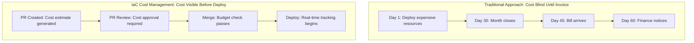

## Complexity: [MEDIUM]
## Time to Complete: 45 minutes

---

## Prerequisites

Before starting this module, you should have completed:
- [Module 6.1: IaC Fundamentals](../module-6.1-iac-fundamentals/) - Core IaC concepts
- [Module 6.4: IaC at Scale](../module-6.4-iac-at-scale/) - Scale challenges
- Basic understanding of cloud billing concepts

---

## What You'll Be Able to Do

After completing this module, you will be able to:

- **Implement cost estimation in IaC pipelines using Infracost or cloud-native pricing APIs**
- **Design cost governance policies that flag expensive infrastructure changes before approval**
- **Build cost tagging strategies that attribute IaC-provisioned resources to teams and projects**
- **Optimize IaC templates to use cost-effective resource configurations by default**

## Why This Module Matters

Infrastructure cost is decided at the moment of provisioning. The instance type you declare in a Terraform resource block, the number of replicas you set, the storage class you attach — each of these choices locks in a recurring hourly or monthly charge that begins the instant `terraform apply` completes. If those choices are wrong, the meter starts running before anyone notices, and it does not stop until someone intervenes. The most expensive infrastructure you will ever pay for is the infrastructure you did not know you were paying for.

The traditional cost-control workflow is reactive by design. An engineer authors infrastructure code, a reviewer approves it, the pipeline deploys it, and thirty to sixty days later a finance team member opens the cloud invoice and discovers the damage. By then the money is spent, the budget is blown, and the post-mortem is an exercise in documenting what cannot be recovered. This is not a failure of individual diligence — it is a structural failure of the workflow. When cost information lives in a separate system from the code that creates cost, the gap between action and awareness is measured in billing cycles.

Shifting cost awareness left into the IaC workflow collapses that gap. When a pull request that adds a new database cluster also posts an estimate of what that cluster will cost per month, the reviewer can make an informed decision at the same moment they evaluate the architecture. When a policy-as-code rule blocks an instance type that exceeds the team's cost ceiling, the guardrail fires at plan time, not on the invoice. When every resource carries a cost-center tag enforced by the same pipeline that runs `terraform validate`, cost allocation becomes automatic rather than forensic. This module teaches you how to build that workflow — how to make cost a first-class signal in your infrastructure delivery pipeline, visible and reviewable at the same stage as security, compliance, and correctness.

> **Hypothetical scenario:** A four-person platform team manages a Terraform monorepo serving twelve product teams. On a Friday afternoon, a developer opens a pull request that adds a new `aws_db_instance` resource for an analytics workload and sets the instance class to `db.r5.8xlarge` — a choice copied from a production template without adjustment. The reviewer, focused on the application logic changes, approves the diff. The pipeline deploys the change. The database runs at approximately 3% CPU utilization for three weeks. No alert fires because the database is healthy — just oversized. When the monthly invoice arrives, the analytics database has added roughly $3,500 to the bill for a workload that would have run comfortably on a `db.r5.large` at roughly one-eighth the cost. The team identifies the root cause in under an hour, but the $3,200 difference is already spent and unrecoverable. The post-incident action item — "add cost estimation to CI" — should have been the pre-incident default.

---

## The Cost Visibility Problem

Cloud costs are invisible by default. A developer can provision a Kubernetes cluster, attach a dozen persistent volumes, deploy a load balancer, and configure cross-zone replication — all with a single `terraform apply` — and see none of the cost implications until the cloud provider's billing system catches up, which can take days for some services. This information asymmetry between the act of provisioning and the act of billing is the root cause of most IaC-driven cost surprises.

The solution is not tighter budgeting meetings or more frequent invoice reviews. Those are detective controls that operate on the output of the system. The solution is to embed cost estimation directly into the provisioning workflow so that the cost signal arrives at the same time as the change signal. When a developer opens a pull request that modifies infrastructure, a cost estimate should appear alongside the code diff, the test results, and the policy compliance checks — not as a separate report generated after the fact by a different team using a different tool.


```mermaid
flowchart TD
    subgraph Traditional["Traditional Approach: Cost Blind Until Invoice"]
        direction LR
        T1["Day 1: Deploy expensive resources"] --> T2["Day 30: Month closes"]
        T2 --> T3["Day 45: Bill arrives"]
        T3 --> T4["Day 60: Finance notices"]
    end

    subgraph Modern["IaC Cost Management: Cost Visible Before Deploy"]
        direction LR
        M1["PR Created: Cost estimate generated"] --> M2["PR Review: Cost approval required"]
        M2 --> M3["Merge: Budget check passes"]
        M3 --> M4["Deploy: Real-time tracking begins"]
    end
```

Sitting between those two diagrams is the difference between discovering a cost problem forty-five days too late and catching it before the code reaches the default branch. The traditional timeline means that every infrastructure change carries a blind-risk window of at least one full billing cycle. During that window, oversized instances keep running, forgotten test environments keep accruing, and nobody knows because nobody can see. In the modern timeline, the cost estimate is generated by the same CI pipeline that runs the tests and linting — it is just another check that must pass before the change can merge.

The structural shift here is from cost as an accounting function to cost as an engineering metric. When cost is an accounting function, it lives in spreadsheets and quarterly reviews, disconnected from the daily decisions engineers make in their Terraform modules. When cost is an engineering metric, it appears in the same pull-request status checks as test coverage and build success, and engineers internalize it as part of their design judgment. You do not need to turn every engineer into a procurement specialist — you need to give them the signal at the right time, in the right place, in a format they can act on.

---

## The FinOps Loop: Inform, Optimize, Operate

Before diving into specific tools and techniques, it is worth grounding this module in the FinOps Foundation's operational framework, because it provides the durable mental model that outlasts any individual cost-estimation product. The FinOps lifecycle describes a continuous three-phase loop that applies directly to IaC-driven infrastructure.

The **Inform** phase is about visibility. Before you can optimize anything, you need to know what you are spending and why. In an IaC context, this means generating cost estimates from Terraform plans, tagging resources so cloud bills can be sliced by team and environment, building dashboards that show spend trends, and setting up anomaly alerts that fire when a particular service's cost deviates from its baseline. The inform phase is not about cutting costs — it is about eliminating cost blindness. An organization that does not know its monthly EC2 spend by team cannot make intelligent decisions about reservations or right-sizing, because it does not know where the money goes.

The **Optimize** phase is about action. Once you can see your costs, you can reduce them. For IaC, optimization takes several concrete forms: right-sizing instance families based on actual utilization data rather than guesswork, purchasing reserved capacity or savings plans for predictable baseline workloads, using spot or preemptible instances for fault-tolerant batch jobs, terminating idle resources automatically through lifecycle policies, and encoding these choices as defaults in shared Terraform modules so that every new service inherits cost-conscious configuration without its author needing to think about it. The optimize phase is where the engineering and finance perspectives converge — the engineer wants the workload to perform, finance wants it to perform at the lowest viable cost, and the shared IaC module is the place where those constraints meet.

The **Operate** phase is about sustaining gains. Cost optimization is not a one-time project. Teams grow, workloads change, cloud providers adjust their pricing, and yesterday's right-sized instance becomes tomorrow's bottleneck or waste. The operate phase closes the loop by feeding utilization metrics and spending anomalies back into the inform phase, creating a continuous cycle where every deployment updates the cost baseline and every anomaly triggers a review. In IaC terms, this means that your pipeline should not only estimate costs before deployment but also track actual costs after deployment and surface divergences between the estimate and the reality. A cost estimate is only as useful as its feedback loop — without post-deploy validation, you never learn whether your estimation model is accurate or whether your teams consistently underestimate the storage and network costs that estimation tools miss.

The FinOps Foundation's framework matters for this module because it provides the "why" behind every technique we will cover. Cost estimation in CI (the Infracost workflow) maps to the Inform phase. Policy-as-code guardrails on instance types maps to the Optimize phase. Anomaly alerts and post-deploy cost tracking map to the Operate phase. When you understand the loop, you can evaluate any new cost tool or technique by asking which phase it serves and whether your organization is strong or weak in that phase. Most teams over-invest in Inform tooling and under-invest in the Operate feedback loop that makes the earlier phases worth doing.

Many organizations discover, after implementing Infracost and tagging, that their FinOps maturity stalls at the Inform phase. They can see their costs, slice them by team, and generate beautiful dashboards, but the dashboards do not change behavior. The missing piece is the Operate feedback loop: when a cost anomaly fires, who responds? When an environment exceeds its budget, is there a defined escalation path? When the Infracost estimate on a PR diverges from the actual cost after deployment, does anyone investigate why? Closing the loop means connecting the signals generated in the Inform phase to concrete actions in the Optimize phase, and then measuring whether those actions produced the expected result. Without that connection, cost visibility is data without leverage — interesting, but not actionable.

---

## Cost Estimation in CI: Making Infrastructure Cost Visible at Review Time

The core technical pattern for shift-left cost management is running a cost estimation tool as part of your continuous integration pipeline, triggered on every pull request that touches infrastructure code, and posting the resulting estimate as a comment on the PR. This section uses Infracost as the worked example because it is a widely-used, purpose-built open-source tool for this workflow — but the durable idea is the cost gate itself, not any particular implementation of it. The equivalent in other tools (and in HCP Terraform's native cost estimation) serves the same Inform-phase purpose.

Infracost works by parsing your Terraform plan or HCL code, matching each resource against a pricing database that maps cloud resource configurations to their per-unit costs, and producing a monthly cost breakdown. The tool can run in two modes: a static `breakdown` that estimates the total cost of all resources in a directory, and a comparative `diff` that estimates the cost delta between a baseline (typically the main branch) and the current change. The diff mode is the one that matters for pull-request workflows, because it answers the question every reviewer should be asking: "How much will this change cost?"

> **Landscape snapshot — as of 2026-06. This changes fast; verify against vendor docs before relying on specifics.**
>
> | Capability | Infracost | OpenCost | AWS Cost Explorer API | Terraform Cloud Cost Estimation |
> |---|---|---|---|---|
> | PR-level cost diff commenting | Native (GitHub/GitLab/Bitbucket) | Not applicable (Kubernetes focus) | Requires custom integration | Built into TFC workflow |
> | IaC source | Terraform (plan/HCL), Terragrunt, Pulumi | Kubernetes clusters (allocation by namespace/label) | Cloud bill data (retrospective) | Terraform Cloud runs |
> | Real-time vs. retrospective | Pre-deployment estimate | Post-deployment allocation | Post-billing analysis | Pre-deployment estimate |
> | Cost policy gate (fail PR on threshold) | Configurable threshold + Sentnel/OPA integration | Not applicable | Budget alerts only | Sentinel policy integration |
> | Multi-cloud | AWS, GCP, Azure | Kubernetes (any cloud or on-prem) | AWS only | Depends on providers in run |
> | Pricing freshness | Cloud Pricing API (daily updates) | N/A (allocation, not pricing) | AWS bill data (retrospective) | Cloud Pricing API |

The setup workflow for Infracost is straightforward. You install the CLI, authenticate with an API key (free for open-source usage, with a free tier for private repositories), and add a GitHub Actions workflow — or the equivalent for your CI system — that runs on pull requests touching your Terraform directories. The workflow checks out both the PR branch and the base branch, generates cost estimates for each, computes the diff, posts it as a PR comment, and optionally fails the check if the monthly cost increase exceeds a configured threshold.

```bash
# Install Infracost
brew install infracost

# Authenticate (free for open source, free tier for private)
infracost auth login

# Initialize in your repo
infracost configure
```

### Basic Usage

The `breakdown` command gives you a per-resource cost estimate that you can inspect locally before even opening a pull request. This is the "shift-left" moment at the individual developer level — you can check the cost impact of your own changes before anyone else sees them.

```bash
# Estimate costs for Terraform directory
infracost breakdown --path .

# Example output:
#  Name                                     Monthly Qty  Unit   Monthly Cost
#
#  aws_instance.web
#  ├─ Instance usage (Linux/UNIX, on-demand, t3.medium)
#  │                                               730  hours        $30.37
#  └─ root_block_device
#     └─ Storage (general purpose SSD, gp3)        50  GB             $4.00
#
#  aws_db_instance.main
#  ├─ Database instance (on-demand, db.r5.large)  730  hours       $175.20
#  └─ Storage (general purpose SSD, gp2)          100  GB            $11.50
#
#  OVERALL TOTAL                                                   $221.07
```

The `diff` command is the one that powers the PR workflow. It compares two cost estimates — typically the current branch against the main branch — and shows you exactly which resources are new, which are modified, and what the net monthly cost impact is. This output is what gets posted as a PR comment and what reviewers use to decide whether the cost change is acceptable.

```bash
# Generate baseline from main branch
git checkout main
infracost breakdown --path . --format json > infracost-base.json

# Generate estimate for feature branch
git checkout feature/new-database
infracost diff --path . --compare-to infracost-base.json

# Example diff output:
#
# + aws_db_instance.analytics
#   + Database instance (on-demand, db.r5.2xlarge)
#                                              730  hours      $700.80
#
# ~ aws_instance.web
#   ~ Instance usage (Linux/UNIX, on-demand, t3.medium → t3.large)
#                                              730  hours  $30.37 → $60.74
#
# Monthly cost will increase by $731.17
#
# ──────────────────────────────────
# Project total:     $952.24 (was $221.07)
```

The cost threshold is where the cost gate becomes a policy gate rather than a purely informational signal. A team might decide, for instance, that any pull request increasing monthly costs by more than $500 requires explicit approval from a platform or finance lead before it can merge. Below that threshold, the cost comment is informational — the reviewer can see the impact and make a judgment call. Above that threshold, the CI check fails and the merge button is blocked until the cost is reviewed. This turns cost from a best-effort suggestion into an enforceable policy, with the same structural weight as a failing test or a linter violation.

### GitHub Actions Integration

```yaml
# .github/workflows/infracost.yml
name: Infracost

on:
  pull_request:
    paths:
      - 'terraform/**'
      - '.github/workflows/infracost.yml'

jobs:
  infracost:
    runs-on: ubuntu-latest
    permissions:
      contents: read
      pull-requests: write

    steps:
      - uses: actions/checkout@v4

      - name: Setup Infracost
        uses: infracost/actions/setup@v3
        with:
          api-key: ${{ secrets.INFRACOST_API_KEY }}

      - name: Checkout base branch
        uses: actions/checkout@v4
        with:
          ref: ${{ github.event.pull_request.base.ref }}
          path: base

      - name: Generate base cost
        run: |
          infracost breakdown --path base/terraform \
            --format json \
            --out-file /tmp/infracost-base.json

      - name: Checkout PR branch
        uses: actions/checkout@v4
        with:
          path: pr

      - name: Generate diff
        run: |
          infracost diff --path pr/terraform \
            --compare-to /tmp/infracost-base.json \
            --format json \
            --out-file /tmp/infracost-diff.json

      - name: Post comment
        uses: infracost/actions/comment@v1
        with:
          path: /tmp/infracost-diff.json
          behavior: update

      - name: Check cost threshold
        run: |
          COST_CHANGE=$(jq '.diffTotalMonthlyCost' /tmp/infracost-diff.json)

          # Fail if monthly cost increase exceeds $500
          if (( $(echo "$COST_CHANGE > 500" | bc -l) )); then
            echo "Cost increase exceeds $500/month threshold"
            echo "Please get approval from @finance-team"
            exit 1
          fi
```

### PR Comment Example

```markdown
## Infracost Report

**Monthly cost will increase by $731.17**

| Project | Previous | New | Diff |
|---------|----------|-----|------|
| terraform/production | $221.07 | $952.24 | +$731.17 |

<details markdown="1">
<summary>Cost breakdown</summary>

### terraform/production

| Resource | Cost |
|----------|------|
| aws_db_instance.analytics (new) | +$700.80 |
| aws_instance.web | +$30.37 |

</details>

---
**Approval required**: Changes exceed $500/month threshold
cc: @finance-team @platform-team
```

The power of this pattern is not in any single PR comment but in the cumulative effect of making cost visible at the point of decision. Over time, engineers internalize the cost implications of their choices because they see the numbers in every pull request. A developer who adds a NAT gateway and sees a $32 monthly line item appear in their PR comment internalizes that cost faster than one who reads about NAT gateway pricing in a wiki page. The learning is experiential, not instructional, and it scales across the organization without requiring everyone to attend a FinOps training session.

---

## Cost Drivers Hidden in IaC Templates

Cost estimation tools answer the question "how much will this cost?" but they do not answer the deeper question: "what patterns in my IaC templates are driving costs unnecessarily?" Understanding the common cost drivers embedded in infrastructure code is essential, because the most effective cost reduction is the one that prevents expensive resources from being declared in the first place.

The most pervasive cost driver in IaC is **over-provisioning**: selecting instance sizes, storage tiers, or database classes that exceed the workload's actual requirements. This happens for understandable reasons. An engineer writing a Terraform module for a new service does not yet have utilization data because the service does not yet exist. Faced with uncertainty, the safe choice is to err on the side of too much capacity rather than too little — a degraded service is a visible failure, while an oversized instance is an invisible cost. The countermeasure is to encode conservative defaults in shared modules and require explicit justification for upgrades. A `db.t3.medium` should be the default for non-production databases, not `db.r5.xlarge`, and deviating from that default should require a comment explaining why.

**Unattached and idle resources** are the second major cost driver. Elastic IP addresses that are allocated but not associated with any instance, load balancers with no healthy targets, provisioned IOPS volumes that were detached but not deleted, test Kubernetes clusters that were spun up for a three-day experiment and then forgotten — every one of these represents a recurring charge that persists until someone actively removes it. The antidote is automated lifecycle management: TTL tags that trigger cleanup after a set number of days, scheduled jobs that scan for unattached resources and delete them, and shared modules that create resources with explicit `prevent_destroy = false` for non-production environments so that `terraform destroy` actually works when the environment is no longer needed.

**Missing autoscaling** is a subtler driver. A workload that needs ten instances at peak but two at night is straightforward to implement with an autoscaling group — but many Terraform modules still declare a fixed `desired_capacity` because it is simpler to configure and reason about. The cost difference between a fixed fleet of ten instances running 24/7 and an autoscaled fleet that averages five instances over a 24-hour cycle is roughly half the compute spend, every month, indefinitely. Encoding autoscaling defaults in shared modules — with a minimum count, a maximum count, and CPU or memory-based scaling policies — eliminates the cognitive overhead that leads teams to choose the simpler fixed-size deployment.

**Expensive defaults** are a per-service category of cost driver that rewards familiarity with your cloud provider's pricing model. NAT gateways in AWS cost roughly $32 per month per gateway plus per-GB data processing charges, and a common Terraform module pattern is to provision one NAT gateway per availability zone for high availability — resulting in a baseline cost of roughly $96 per month before any data flows through them. In development environments, a single NAT instance or a VPC endpoint for the specific services needed can reduce that baseline to near zero, but only if the module author knows to make that choice. Similarly, provisioned IOPS on development database volumes, cross-AZ data transfer that is free within a single AZ but charged between AZs, and CloudWatch logs with no retention policy that grow indefinitely — all of these are defaults that cost money quietly and persistently.

**Forgotten ephemeral environments** are the final common cost driver worth naming explicitly. A team that provisions a full staging environment for every feature branch — complete with its own RDS instance, Elasticache cluster, and EKS node group — and leaves those environments running after the feature merges is paying for infrastructure that serves no purpose. The fix is a combination of TTL enforcement (every ephemeral environment gets a tag with an expiry date and a cleanup job that destroys it after that date) and a culture of explicit environment lifecycle: if you provision it, you are responsible for deprovisioning it unless you actively renew it.

---

## Tagging and Cost Allocation: The Backbone of Showback and Chargeback

Cost estimation tells you how much a change will cost before it deploys. Cost allocation tells you who is responsible for the cost after the invoice arrives. Without allocation, you know the total but you do not know who spent it, and without that attribution you cannot hold teams accountable for their infrastructure decisions. Tagging is the mechanism that enables allocation, and enforcing tags through IaC policy is how you prevent untagged resources from slipping through.

A well-designed tagging strategy answers several questions simultaneously. An `Environment` tag (with values like `dev`, `staging`, `production`) lets you separate production spend — which should trend with business growth — from development spend, which should be scrutinized for waste. A `Team` or `CostCenter` tag maps resources to the organizational unit that owns them, enabling showback (making teams aware of their spend without necessarily charging them) or chargeback (actually billing each team for the resources they consume). A `Project` tag groups resources that belong to the same application or initiative, so you can calculate the total cost of running a particular service. An optional `TTL` tag carries an expiry date that automated cleanup jobs can read to terminate ephemeral resources.

The most effective way to enforce tagging is not through documentation or team norms but through policy-as-code rules that reject any resource missing the required tags. If a developer provisions an `aws_instance` without a `CostCenter` tag, the pipeline should fail — with the same certainty that a syntax error in the HCL would fail. This makes tagging a structural property of the infrastructure rather than a discretionary practice, and it prevents the slow erosion of tag coverage that happens when enforcement is manual.

### Policy as Code for Tag Enforcement

```rego
# policy/cost_limits.rego (OPA/Conftest)

package terraform.cost

import future.keywords.in

# Deny expensive instance types without approval
deny[msg] {
    resource := input.resource_changes[_]
    resource.type == "aws_instance"

    expensive_types := ["r5.24xlarge", "r5.12xlarge", "r5.8xlarge",
                        "c5.24xlarge", "c5.18xlarge", "m5.24xlarge"]

    resource.change.after.instance_type in expensive_types

    msg := sprintf(
        "Instance %s uses expensive type %s. Requires finance approval.",
        [resource.address, resource.change.after.instance_type]
    )
}

# Deny high replica counts
deny[msg] {
    resource := input.resource_changes[_]
    resource.type == "aws_db_instance"

    resource.change.after.multi_az == true

    # Check if this is a non-production environment
    tags := object.get(resource.change.after, "tags", {})
    env := object.get(tags, "Environment", "unknown")
    env != "production"

    msg := sprintf(
        "RDS instance %s has Multi-AZ enabled in %s environment. Only allowed in production.",
        [resource.address, env]
    )
}

# Warn on resources without cost tags
warn[msg] {
    resource := input.resource_changes[_]
    resource.change.actions[_] == "create"

    # Taggable resource types
    taggable := ["aws_instance", "aws_db_instance", "aws_s3_bucket",
                 "aws_eks_cluster", "aws_lambda_function"]
    resource.type in taggable

    tags := object.get(resource.change.after, "tags", {})
    not tags["CostCenter"]

    msg := sprintf(
        "Resource %s is missing CostCenter tag for cost allocation",
        [resource.address]
    )
}
```

The Terraform module below demonstrates how required tags can be defined once in a shared module and then consumed by every resource in every environment. The `required_tags` variable defines the mandatory tag keys with validation rules — for instance, the `CostCenter` tag must match the pattern `CC-0000` — and the `common_tags` local merges required tags with optional tags and automatically injected metadata like the `ManagedBy` key. Every resource in your infrastructure stack then references `module.tags.tags` and gets the full tag set without any duplication.

```hcl
# modules/tagging/main.tf

variable "required_tags" {
  description = "Tags required on all resources"
  type = object({
    Environment = string
    Team        = string
    CostCenter  = string
    Project     = string
  })

  validation {
    condition     = contains(["dev", "staging", "production"], var.required_tags.Environment)
    error_message = "Environment must be dev, staging, or production."
  }

  validation {
    condition     = can(regex("^CC-[0-9]{4}$", var.required_tags.CostCenter))
    error_message = "CostCenter must match format CC followed by a hyphen and 4 digits, e.g. CC-1234."
  }
}

variable "optional_tags" {
  description = "Optional additional tags"
  type        = map(string)
  default     = {}
}

locals {
  common_tags = merge(
    var.required_tags,
    var.optional_tags,
    {
      ManagedBy    = "terraform"
      LastModified = timestamp()
    }
  )
}

output "tags" {
  description = "Complete tag set for resources"
  value       = local.common_tags
}
```

```hcl
# environments/production/main.tf

module "tags" {
  source = "../../modules/tagging"

  required_tags = {
    Environment = "production"
    Team        = "platform"
    CostCenter  = "CC-1234"
    Project     = "customer-api"
  }

  optional_tags = {
    Compliance = "SOC2"
    DataClass  = "confidential"
  }
}

resource "aws_instance" "app" {
  ami           = data.aws_ami.amazon_linux.id
  instance_type = "t3.medium"

  tags = merge(module.tags.tags, {
    Name = "customer-api-app"
    Role = "application-server"
  })
}
```

Tags only work for cost allocation if the cloud provider's billing system knows to use them. In AWS, cost allocation tags must be explicitly activated in the Billing and Cost Management console before they appear in Cost Explorer reports and billing CSV exports. The Terraform resource below handles this activation programmatically, ensuring that the tags you enforce in your IaC are also the tags your finance team can slice by in their reports.

```hcl
# Enable cost allocation tags in AWS
resource "aws_ce_cost_allocation_tag" "tags" {
  for_each = toset([
    "Environment",
    "Team",
    "CostCenter",
    "Project"
  ])

  tag_key = each.value
  status  = "Active"
}

# Budget per cost center
resource "aws_budgets_budget" "cost_center" {
  for_each = {
    "CC-1234" = 50000  # Platform team
    "CC-2345" = 30000  # Mobile team
    "CC-3456" = 20000  # Data team
  }

  name         = "Budget-${each.key}"
  budget_type  = "COST"
  limit_amount = each.value
  limit_unit   = "USD"
  time_unit    = "MONTHLY"

  cost_filter {
    name   = "TagKeyValue"
    values = ["user:CostCenter$${each.key}"]
  }

  notification {
    comparison_operator        = "GREATER_THAN"
    threshold                  = 80
    threshold_type             = "PERCENTAGE"
    notification_type          = "FORECASTED"
    subscriber_email_addresses = ["${each.key}@company.com"]
  }

  notification {
    comparison_operator        = "GREATER_THAN"
    threshold                  = 100
    threshold_type             = "PERCENTAGE"
    notification_type          = "ACTUAL"
    subscriber_email_addresses = ["finance@company.com", "${each.key}@company.com"]
  }
}
```

Notice that each budget carries two notifications: a forecasted alert at 80% of the budget, and an actual alert at 100%. The forecasted alert is the proactive signal — it fires when the projected month-end spend, based on the current run rate, exceeds 80% of the budget. This gives the team time to investigate and correct course before the budget is exhausted. The actual alert is the reactive signal — it fires when the budget is actually breached, which is useful for post-mortem attribution but does not prevent the overspend from happening. The distinction between forecasted and actual alerts is one of the most operationally important details in cost governance, because a forecasted alert at 80% gives you days or weeks to respond, while an actual alert at 100% tells you what already happened.

---

## Right-Sizing and Optimization Encoded in Infrastructure Templates

Cost estimation and allocation tell you what you are spending and who is spending it. Optimization is the phase where you reduce the spend without reducing the value. The most powerful form of optimization in an IaC workflow is encoding cost-conscious defaults directly into the shared modules that every team consumes, so that optimization is not a separate activity performed by a dedicated FinOps engineer but a property of the infrastructure code itself.

The simplest and highest-impact optimization technique is **right-sizing**: mapping instance types to workload characteristics so that compute resources match actual demand. A shared module that takes a `workload_type` parameter (web, api, worker, database) and an `expected_load` parameter (low, medium, high) and selects the appropriate instance family and size is doing right-sizing at the platform layer. Every team that uses the module inherits the cost-conscious defaults without needing to know the instance-type taxonomy or the relative cost of a `c6i.xlarge` versus an `m6i.xlarge`. When the default is conservative and the upgrade path requires an explicit parameter change with a pull-request review, the platform absorbs the optimization knowledge and the application teams absorb the optimized default.

```hcl
# modules/ec2-rightsized/main.tf

variable "workload_type" {
  description = "Type of workload"
  type        = string

  validation {
    condition     = contains(["web", "api", "worker", "database"], var.workload_type)
    error_message = "Workload type must be web, api, worker, or database."
  }
}

variable "expected_load" {
  description = "Expected load level"
  type        = string
  default     = "medium"

  validation {
    condition     = contains(["low", "medium", "high"], var.expected_load)
    error_message = "Expected load must be low, medium, or high."
  }
}

locals {
  # Instance type matrix based on workload and load
  instance_types = {
    web = {
      low    = "t3.micro"
      medium = "t3.small"
      high   = "t3.medium"
    }
    api = {
      low    = "t3.small"
      medium = "t3.medium"
      high   = "t3.large"
    }
    worker = {
      low    = "c6i.large"
      medium = "c6i.xlarge"
      high   = "c6i.2xlarge"
    }
    database = {
      low    = "r6i.large"
      medium = "r6i.xlarge"
      high   = "r6i.2xlarge"
    }
  }

  selected_instance_type = local.instance_types[var.workload_type][var.expected_load]
}

resource "aws_instance" "this" {
  ami           = var.ami_id
  instance_type = local.selected_instance_type

  # ... other configuration
}
```

**Spot and preemptible instances** are the second major optimization lever, particularly for workloads that are fault-tolerant, stateless, or bursty. Spot instances in AWS and preemptible VMs in GCP offer substantial discounts — often 60-90% — in exchange for the provider's right to reclaim the capacity with short notice (typically a two-minute warning). This makes them unsuitable for stateful databases or latency-sensitive user-facing services, but ideal for batch processing, CI/CD runners, data transformation pipelines, and non-critical development environments. A shared autoscaling group module that configures a mix of on-demand and spot instances — with enough on-demand capacity to maintain baseline availability and spot capacity to absorb spikes — lets teams benefit from spot pricing without each team rediscovering the configuration details.

The key design decision when adopting spot instances is where to place the boundary between on-demand and spot capacity. A common starting point is to run the minimum number of instances needed for baseline availability on-demand — the instances that must survive a spot interruption without degrading the service — and to allocate all burst capacity and non-critical workloads to spot. For a stateless web tier that needs at least three instances to handle minimum traffic, those three run on-demand and the remaining instances in the autoscaling group (up to the configured maximum) use spot. This pattern captures most of the spot savings while protecting against the operational risk of losing too many instances simultaneously. The module below demonstrates this mixed-instances pattern, including the `capacity-optimized` allocation strategy, which selects the spot instance pools least likely to be interrupted based on real-time capacity data.

```hcl
# modules/spot-fleet/main.tf

variable "use_spot" {
  description = "Use Spot instances for cost savings"
  type        = bool
  default     = true
}

variable "spot_price_buffer" {
  description = "Percentage above on-demand price to bid"
  type        = number
  default     = 0.9  # 90% of on-demand = 10% minimum savings
}

resource "aws_launch_template" "this" {
  name_prefix   = "${var.name}-"
  image_id      = var.ami_id
  instance_type = var.instance_type

  dynamic "instance_market_options" {
    for_each = var.use_spot ? [1] : []
    content {
      market_type = "spot"
      spot_options {
        max_price          = var.spot_max_price
        spot_instance_type = "one-time"
      }
    }
  }

  tag_specifications {
    resource_type = "instance"
    tags = merge(var.tags, {
      SpotInstance = var.use_spot ? "true" : "false"
    })
  }
}

# Auto Scaling with mixed instances
resource "aws_autoscaling_group" "this" {
  name                = var.name
  vpc_zone_identifier = var.subnet_ids
  min_size            = var.min_size
  max_size            = var.max_size
  desired_capacity    = var.desired_capacity

  mixed_instances_policy {
    launch_template {
      launch_template_specification {
        launch_template_id = aws_launch_template.this.id
        version            = "$Latest"
      }
    }

    instances_distribution {
      on_demand_base_capacity                  = var.environment == "production" ? 2 : 0
      on_demand_percentage_above_base_capacity = var.environment == "production" ? 50 : 0
      spot_allocation_strategy                 = "capacity-optimized"
    }
  }
}
```

**Reserved capacity and savings plans** address the steady-state portion of your infrastructure. If you know that your production web tier will run at least twenty `t3.medium` instances continuously for the next year, purchasing reserved capacity for those twenty instances converts an on-demand hourly rate into a committed rate that is typically 30-60% lower. The tradeoff is commitment: you pay for the capacity whether you use it or not, so reserved instances make sense only for predictable baseline workloads. The Terraform pattern below documents expected reserved capacity alongside the provisioned capacity, so that the module can warn when the number of provisioned instances exceeds the number of reserved instances — a signal that you are paying on-demand rates for capacity you could have reserved.

```hcl
# Track reserved capacity usage
resource "aws_ce_anomaly_monitor" "ri_coverage" {
  name              = "ri-coverage-monitor"
  monitor_type      = "DIMENSIONAL"
  monitor_dimension = "SERVICE"
}

resource "aws_ce_anomaly_subscription" "ri_alerts" {
  name = "ri-coverage-alerts"

  monitor_arn_list = [aws_ce_anomaly_monitor.ri_coverage.arn]

  subscriber {
    type    = "EMAIL"
    address = "finops@company.com"
  }

  threshold_expression {
    dimension {
      key           = "ANOMALY_TOTAL_IMPACT_PERCENTAGE"
      values        = ["10"]
      match_options = ["GREATER_THAN_OR_EQUAL"]
    }
  }
}

# Document expected RI coverage in Terraform
locals {
  reserved_capacity = {
    "us-east-1" = {
      "r5.2xlarge" = 10  # 10 reserved
      "r5.xlarge"  = 20  # 20 reserved
      "c5.xlarge"  = 15  # 15 reserved
    }
    "us-west-2" = {
      "r5.xlarge" = 5
      "c5.xlarge" = 8
    }
  }

  # Warn if provisioned exceeds reserved
  ri_warnings = [
    for region, instances in local.reserved_capacity : [
      for type, count in instances :
      "Warning: ${type} in ${region} has ${count} reserved but ${local.actual_counts[region][type]} provisioned"
      if local.actual_counts[region][type] > count
    ]
  ]
}
```

---

## Terraform-Level Cost Guardrails

Before cost estimation runs in CI and before policy-as-code evaluates the plan, Terraform itself can enforce cost constraints through input variable validation. This is the earliest possible intervention point — it fires during `terraform plan` when a developer passes an invalid value, before any code is committed or pushed. A validation rule on an `instance_type` variable that rejects known-expensive instance families is a cheap, zero-dependency guardrail that prevents the most egregious mistakes at the authoring stage.

```hcl
# variables.tf - Built-in cost guardrails

variable "instance_type" {
  description = "EC2 instance type"
  type        = string

  validation {
    condition = !contains([
      "r5.24xlarge", "r5.12xlarge",
      "c5.24xlarge", "c5.18xlarge",
      "m5.24xlarge", "m5.16xlarge"
    ], var.instance_type)
    error_message = "Extra-large instance types require finance approval. Use smaller instances or request exception."
  }
}

variable "environment" {
  description = "Deployment environment"
  type        = string

  validation {
    condition     = contains(["dev", "staging", "production"], var.environment)
    error_message = "Environment must be dev, staging, or production."
  }
}

# modules/database/variables.tf

variable "instance_class" {
  description = "RDS instance class"
  type        = string

  validation {
    # Dev/staging limited to smaller instances
    condition = var.environment == "production" || contains([
      "db.t3.micro", "db.t3.small", "db.t3.medium"
    ], var.instance_class)
    error_message = "Non-production databases limited to t3.micro, t3.small, or t3.medium."
  }
}

variable "storage_size" {
  description = "Storage size in GB"
  type        = number

  validation {
    condition     = var.storage_size <= 1000
    error_message = "Storage over 1TB requires architecture review."
  }
}
```

These validation rules are deliberately simple because their purpose is not to replace the more sophisticated cost estimation and policy engines that run later in the pipeline — it is to catch the most obviously expensive mistakes as early as possible, with zero infrastructure required beyond the Terraform binary itself. A developer who accidentally types `r5.24xlarge` instead of `t3.medium` gets an immediate error message during `terraform plan`, corrects the typo, and moves on without ever opening a pull request that would trigger the full CI cost-estimation pipeline. The classes of guardrail — Terraform validation, OPA/Sentinel policy, CI cost estimation — are complementary layers, each catching different categories of mistake at different stages of the workflow.

---

## Cost Policies and Guardrails

### Policy as Code for Costs

```python
# policy/cost_limits.sentinel (Terraform Cloud/Enterprise)

import "tfrun"
import "decimal"

# Maximum allowed monthly cost increase
max_monthly_increase = decimal.new(1000)

# Get cost estimate from run
cost_estimate = tfrun.cost_estimate

# Calculate increase
monthly_increase = decimal.new(cost_estimate.delta_monthly_cost)

# Main rule
main = rule {
    monthly_increase.less_than_or_equals(max_monthly_increase)
}

# Soft policy - warn but allow override
# Hard policy - block without exception
```

The Sentinel policy above demonstrates a Terraform Cloud-native approach to cost policy. It integrates directly with Terraform Cloud's built-in cost estimation feature, extracting the delta monthly cost from the run metadata and comparing it against a hard threshold. The `main` rule is the enforceable gate — if the estimated monthly cost increase exceeds the threshold, the policy fails and the run is blocked. Sentinel supports both hard-mandatory policies (no override possible) and soft-mandatory policies (override allowed with justification and an audit trail), which maps naturally to cost governance: a $500 threshold might be a soft policy that requires a team lead's approval, while a $5,000 threshold might be a hard policy that requires a director-level exception.

The cost policy layer sits between the developer's intent (expressed in Terraform code) and the cloud provider's billing system (which charges for provisioned resources). It does not replace Infracost's PR-level cost comment — that comment is the informational signal that helps reviewers make decisions. The policy is the enforcement mechanism that makes certain decisions unavailable without explicit approval. Together, they create a system where most cost decisions are made by informed judgment (the PR comment) and the most costly decisions are escalated for review (the policy gate).

---

## Unit Economics: Connecting Infrastructure Cost to Business Value

The techniques covered so far — cost estimation, tagging, right-sizing, spot instances — all operate on the infrastructure itself. They answer the question "how much does this resource cost?" but not the more strategic question: "is this resource worth what it costs?" Unit economics bridges that gap by connecting infrastructure spend to a unit of business value.

The unit of value depends on the business. For a SaaS product, it might be cost per tenant or cost per monthly active user. For an API platform, it might be cost per thousand API requests. For a data pipeline, it might be cost per gigabyte processed. The specific unit matters less than the practice of choosing one and tracking it — because when you can express infrastructure cost in terms of the business metric it supports, cost optimization becomes a product conversation rather than an operations mandate.

In an IaC context, unit economics works by tagging resources with the business context they serve and then cross-referencing infrastructure cost data with application metrics. If your platform team knows that the "customer-api" service costs $12,000 per month to run and serves 3 million requests per day, the unit cost is $0.13 per thousand requests. When a proposed infrastructure change would add $500 per month to that service, the conversation shifts from "is this Terraform change valid?" to "will this change generate enough additional value to justify increasing the cost per thousand requests by 4%?" That is a fundamentally different — and more useful — conversation.

Unit economics also makes cost anomalies legible. If the cost per tenant suddenly doubles without a corresponding increase in tenant count, something is wrong: either an infrastructure change introduced inefficiency, or the tagging is broken and costs from another service are being misattributed. Either way, the unit-cost signal triggers an investigation that a raw dollar-amount alert might miss, because a $500 increase in total spend might be within normal monthly variance while a sudden doubling of unit cost almost never is.

---

## Cost Dashboards and Reporting

Cost visibility does not end at the PR merge. After infrastructure is deployed, you need ongoing visibility into actual costs to validate that your pre-deployment estimates were accurate and to detect drift. A CloudWatch dashboard provisioned through Terraform — using the same IaC discipline as the infrastructure it monitors — ensures that cost visibility is itself infrastructure-as-code, versioned and reviewable.

```hcl
# CloudWatch dashboard for cost visibility
resource "aws_cloudwatch_dashboard" "cost_dashboard" {
  dashboard_name = "InfrastructureCosts"

  dashboard_body = jsonencode({
    widgets = [
      {
        type   = "metric"
        x      = 0
        y      = 0
        width  = 12
        height = 6
        properties = {
          title  = "Daily Costs by Service"
          region = "us-east-1"
          metrics = [
            ["AWS/Billing", "EstimatedCharges", "ServiceName", "AmazonEC2", "Currency", "USD"],
            ["...", "AmazonRDS", ".", "."],
            ["...", "AmazonS3", ".", "."],
            ["...", "AmazonEKS", ".", "."]
          ]
          period = 86400
          stat   = "Maximum"
        }
      },
      {
        type   = "metric"
        x      = 12
        y      = 0
        width  = 12
        height = 6
        properties = {
          title  = "Total Monthly Cost"
          region = "us-east-1"
          metrics = [
            ["AWS/Billing", "EstimatedCharges", "Currency", "USD", { stat = "Maximum" }]
          ]
          period = 86400
        }
      },
      {
        type   = "text"
        x      = 0
        y      = 6
        width  = 24
        height = 3
        properties = {
          markdown = <<-EOF
            ## Cost Management Links

            | Resource | Link |
            |----------|------|
            | Cost Explorer | [Open](https://console.aws.amazon.com/cost-management/home#/cost-explorer) |
            | Budgets | [Open](https://console.aws.amazon.com/billing/home#/budgets) |
            | Reserved Instances | [Open](https://console.aws.amazon.com/ec2/v2/home#ReservedInstances:) |
            | Savings Plans | [Open](https://console.aws.amazon.com/cost-management/home#/savings-plans) |
          EOF
        }
      }
    ]
  })
}
```

A dashboard that shows daily costs by service and a running monthly total is the minimum viable cost observability surface. It gives the platform team a shared reference point for cost conversations and makes it obvious when a particular service is trending above its expected range. The dashboard itself is provisioned through Terraform, which means it is version-controlled, reviewable in pull requests, and deployed through the same pipeline as the infrastructure it monitors — closing the loop between the code that creates cost and the dashboard that reports it.

---

## Patterns and Anti-Patterns

### Patterns (What Good Looks Like)

1. **Cost gate in CI.** Every pull request that touches infrastructure code posts a cost estimate comment and fails if the monthly delta exceeds a configured threshold. The cost check has the same structural weight as a test failure — the merge button is blocked until the cost is reviewed and approved.

2. **Cost-optimized module defaults.** Shared Terraform modules encode conservative instance sizes, enable autoscaling by default, and use the cheapest viable storage class. Teams that need more capacity override the defaults explicitly, with a PR review that considers the cost impact.

3. **Mandatory tag enforcement.** Every resource carries `Environment`, `Team`, `CostCenter`, and `Project` tags enforced by policy-as-code. Tags are activated as cost allocation tags in the cloud provider's billing console, enabling per-team showback or chargeback.

4. **TTL on ephemeral environments.** Every non-production environment carries a `TTL` tag with an expiry timestamp, and a scheduled Lambda or cron job terminates resources whose TTL has passed. This prevents the accumulation of forgotten test infrastructure.

5. **Forecasted budget alerts.** Every team's budget carries a forecasted alert at 80% of the monthly limit, giving teams time to investigate before the budget is exhausted. Actual-spend alerts at 100% serve as a backstop, not the primary signal.

### Anti-Patterns (What to Avoid)

1. **Cost as an afterthought.** Running cost estimation as a monthly manual exercise after the invoice arrives, rather than embedding it in the CI pipeline. By the time the analysis is done, the money is spent.

2. **Production-sized non-production environments.** Provisioning development and staging environments with the same instance types, replica counts, and storage tiers as production. Non-production environments typically serve a fraction of the traffic and should be sized accordingly.

3. **Untagged resources.** Allowing resources to be provisioned without cost allocation tags, making it impossible to attribute spend to teams or projects. Every untagged resource is a line item on the invoice that nobody owns.

4. **No cost approval threshold.** Allowing any infrastructure change to merge regardless of its cost impact, so that a developer can provision a $10,000-per-month GPU cluster with the same approval process as a $30-per-month microservice.

5. **Fixed-size deployments without autoscaling.** Declaring a static `desired_capacity` for every workload instead of configuring autoscaling policies, resulting in fleets of instances running at low utilization during off-peak hours.

### Decision Framework

When evaluating whether a cost governance control is appropriate for your organization, consider these three factors together:

| Factor | Lightweight (start here) | Comprehensive (grow into) |
|---|---|---|
| **Cost estimation** | Infracost CLI run locally before opening PR | Automated CI gate with threshold enforcement |
| **Tag enforcement** | Team convention documented in README | OPA/Conftest policy rejecting untagged resources at plan time |
| **Budget alerts** | Single account-level budget with 100% actual alert | Per-team budgets with 80% forecasted + 100% actual alerts |
| **Instance type guardrails** | Terraform variable validation blocking the most expensive types | Full policy-as-code with allowed-instance-type catalog |
| **Ephemeral cleanup** | Manual quarterly review of running resources | Automated TTL-based cleanup with scheduled execution |

The lightweight column is where most teams should start — it requires minimal tooling investment and catches the most expensive mistakes. The comprehensive column is where teams should grow as their infrastructure scale and organizational complexity increase. Moving from left to right is a function of how much money is at stake and how many people are provisioning infrastructure. A two-person startup can operate effectively in the lightweight column indefinitely; a hundred-person engineering organization with a seven-figure monthly cloud bill needs the comprehensive column.

---

## Did You Know?

- **The FinOps Foundation was established in 2019** as a Linux Foundation project to develop a standardized framework for cloud financial management. Its core lifecycle — Inform, Optimize, Operate — is widely adopted as a vendor-neutral model for connecting engineering decisions to financial outcomes. The Foundation maintains a certification program and a library of vendor-neutral best practices.

- **Infracost's founders are long-time cloud-cost practitioners.** Infracost was open-sourced in 2020 by founders (Hassan Khajeh-Hosseini, Ali Khajeh-Hosseini, and Alistair Scott) who had built cloud cost-management products since 2012 — work that later became part of RightScale and then Flexera — and who serve on the FinOps Foundation board. The tool's core move is posting a cost-delta estimate as a pull-request comment so cost becomes a review-time signal rather than an end-of-month surprise.

- **A single forgotten NAT gateway can cost more than a reserved instance.** In AWS, a NAT gateway costs approximately $32 per month in hourly charges plus $0.045 per GB of data processed. If a development environment provisions one NAT gateway per availability zone for high availability — a common pattern — the baseline cost is roughly $96 per month before any traffic flows, which is more than the on-demand cost of a `t3.medium` instance.

- **Cloud providers offer commitment discounts of 30-72% off on-demand pricing** through reserved instances (AWS), committed use discounts (GCP), and reserved capacity (Azure), but utilization studies consistently find that a significant portion of provisioned on-demand capacity could be covered by commitments if teams tracked their steady-state usage. The gap is not technical — it is organizational: the people who provision resources and the people who purchase commitments are often in different teams using different tools.

---

## Common Mistakes

| Mistake | Problem | Solution |
|---------|---------|----------|
| No cost visibility in PRs | Costs discovered after deployment, typically at month-end when the invoice arrives | Integrate Infracost or equivalent cost estimation into CI/CD with a PR comment |
| Missing cost allocation tags | Cloud bills cannot be attributed to teams, projects, or environments | Enforce required tags via OPA/Conftest policy and activate them as cost allocation tags |
| Production-sized dev/staging | Non-production environments running on instance types designed for production traffic, paying production prices for minimal utilization | Size environments proportionally to traffic; use Terraform variables to map environment names to instance classes |
| No budget alerts until 100% | Teams discover budget overruns only after the money is spent, with no time to remediate | Configure forecasted alerts at 80% of budget to provide early warning based on run-rate projections |
| On-demand for steady-state workloads | Paying on-demand premiums for predictable baseline capacity that could be covered by reserved instances or savings plans | Analyze utilization patterns; purchase commitments for the stable portion of compute and database spend |
| Zombie resources | Forgotten test environments, unattached volumes, and idle load balancers accumulate recurring charges indefinitely | Implement TTL tags and automated cleanup jobs; schedule regular resource audits |
| No cost approval threshold | Any infrastructure change merges regardless of cost impact, from $5 to $50,000 | Set a cost-increase threshold that triggers mandatory finance/platform review before merge |
| Cost treated as a separate concern | Cost optimization is a quarterly finance exercise rather than a daily engineering practice | Embed cost signals in the same pipeline as tests and security checks; make cost a first-class engineering metric |

---

## Quiz

<details markdown="1">
<summary>1. Your team discovers expensive infrastructure changes only after the monthly cloud bill arrives, typically 30-45 days after deployment. You propose implementing Infracost in your CI/CD pipeline. At what exact stage in the workflow does the cost signal appear, and how does the timing difference between this approach and the monthly-bill approach change the remediation window?</summary>

**Answer**: Infracost generates a cost estimate at the pull-request stage, before the infrastructure change is merged or applied. It parses the Terraform plan or HCL code, computes the monthly cost delta against the base branch, and posts the estimate as a PR comment that reviewers see alongside the code diff and test results. In the traditional workflow, the cost signal arrives 30-45 days after deployment — by which time the money is spent and unrecoverable. In the CI-integrated workflow, the cost signal arrives before deployment, giving reviewers a remediation window measured in minutes or hours rather than weeks. If a PR would add $700 per month to the infrastructure bill, the reviewer can reject or adjust it before a single cent is charged.
</details>

<details markdown="1">
<summary>2. You are auditing your team's AWS infrastructure and find that a stable, long-running backend service uses ten on-demand `t3.medium` instances 24/7. You propose switching to 3-year, no-upfront Reserved Instances. Given that on-demand pricing for `t3.medium` in us-east-1 is approximately $0.0416 per hour and the 3-year Standard RI rate is approximately $0.0243 per hour, what are the approximate percentage savings, and why is the Reserved Instance purchasing model appropriate for this specific workload?</summary>

**Answer**: The switch yields approximately 41-42% savings compared to on-demand — from about $303 per month (10 instances × $0.0416 × 730 hours) to about $177 per month (10 × $0.0243 × 730). Reserved Instances are appropriate for this workload because it is described as stable, long-running, and operating 24/7. RI pricing rewards commitment: you agree to pay for a specific instance type and quantity over a 1-year or 3-year term, and in exchange the cloud provider discounts the hourly rate substantially. The workload's predictability means there is minimal risk of paying for unused capacity, making the commitment a financially sound decision. If the workload were seasonal or bursty, on-demand or a mix of on-demand and spot instances would be more appropriate.
</details>

<details markdown="1">
<summary>3. Three engineering teams deploy resources to a shared AWS account using Terraform, and your finance team cannot determine which team is responsible for a recent spike in database costs. Which core tags should your IaC templates enforce to solve this attribution problem, and what is the operational difference between showback and chargeback once tagging is in place?</summary>

**Answer**: The core tags are `Environment` (to separate production spend from development and staging), `Team` or `CostCenter` (to identify the owning organizational unit), and `Project` (to group resources by application or initiative). These tags must be: (a) enforced by policy-as-code on every resource at plan time, (b) activated as cost allocation tags in the cloud provider's billing console so they appear in Cost Explorer and billing exports, and (c) used as filters in per-team budget resources. Showback means making each team aware of their spend through dashboards and reports without actually charging them — it creates accountability through visibility. Chargeback means allocating actual billing costs to each team's departmental budget, creating a direct financial incentive to optimize. Most organizations start with showback to build trust in the tagging data before moving to chargeback.
</details>

<details markdown="1">
<summary>4. A colleague submits a PR that provisions a staging environment using `db.r5.2xlarge` database instances, arguing that staging must perfectly mirror production to catch performance regressions. From a cost management perspective, what is the problem with this configuration, and how can you address the legitimate testing concern without paying production prices for staging?</summary>

**Answer**: Provisioning production-sized instances for staging environments typically wastes significant money because staging serves a fraction of the traffic volume — sometimes zero traffic except during manual testing. A `db.r5.2xlarge` instance costs substantially more per month than a `db.t3.medium` while providing capacity that sits idle most of the time. The legitimate concern about catching performance regressions is addressed by environment-specific right-sizing: the staging database uses a smaller instance class for day-to-day testing, and the Terraform module supports a parameter override that temporarily scales up to a production-equivalent instance class during dedicated load-testing windows. This approach preserves functional and architectural parity between environments while right-sizing the compute resources to the actual demand. The scaling decision is encoded in the IaC itself, so it is reproducible and auditable rather than a manual configuration change.
</details>

<details markdown="1">
<summary>5. A developer accidentally copies a Terraform module configured for a GPU-intensive data processing pipeline and tries to use it for a lightweight web application, specifying `p4d.24xlarge` instances. How do Terraform variable validation, OPA policy, and CI cost estimation each contribute to catching this mistake, and at what stage of the workflow does each fire?</summary>

**Answer**: The three layers catch the mistake at progressively later stages of the workflow. Terraform variable validation fires first — a `validation` block on the `instance_type` variable that rejects known-expensive instance families prevents `terraform plan` from succeeding on the developer's local machine, so the mistake is caught before any code is committed. If the developer bypasses the variable validation by hardcoding the instance type in the resource block (bypassing the variable), the OPA/Conftest policy fires at the CI stage when the Terraform plan is evaluated — the policy rule that denies instance types in an `expensive_types` list catches the violation and fails the CI check. Finally, the Infracost CI step generates a cost estimate that shows the monthly impact of the `p4d.24xlarge` instance, which would be dramatically higher than expected for a web application, providing a financial signal that makes the mistake obvious even if the policy layer happened not to have that specific instance type on its blocklist. The three layers are complementary, not redundant.
</details>

<details markdown="1">
<summary>6. It is the 25th of the month and your team receives an alert that the AWS budget has reached 100% of its monthly limit. You scramble to shut down resources, but the final bill still comes in over budget because the spending that breached the limit happened earlier in the cycle. How would configuring a forecasted spend alert at 80% of the budget have changed this outcome?</summary>

**Answer**: Actual spend alerts fire after money is already spent — by the time a 100% actual-spend alert triggers on the 25th, the overage that occurred in the first three weeks of the month is baked into the bill and cannot be unwound. A forecasted spend alert, in contrast, uses the current run rate and historical usage patterns to project what the total month-end bill will be. If spending spiked in the second week — for instance, because a new test cluster was provisioned and left running — a forecasted alert configured at 80% of the budget would have fired when the projection exceeded that threshold, potentially days or even weeks before the actual spend reached 100%. This early warning would have given the team time to identify the anomalous resource, terminate it, and bring the projected spend back under the budget before the invoice closed. The operational difference is the length of the remediation window: forecasted alerts give you lead time; actual alerts give you a post-mortem.
</details>

<details markdown="1">
<summary>7. A developer opens a PR that provisions five new `c5.xlarge` instances in the production cluster, and the Infracost comment estimates a monthly increase of $547. The organization's cost-approval threshold is $500. What questions should the reviewer ask during the manual approval process, and how do those questions differ from the automated checks that already ran in CI?</summary>

**Answer**: The automated CI checks confirmed that the change is syntactically valid, passes policy rules, and has a known cost impact — but they cannot evaluate whether the cost is justified. The manual reviewer should ask: (1) Is `c5.xlarge` the right instance family for this workload, or would `c6i.xlarge` or `m6i.xlarge` be more cost-effective for the same performance envelope? (2) Does the workload genuinely need five instances, or would three with autoscaling to five under load achieve the same availability at lower baseline cost? (3) Can any of these instances be covered by existing reserved capacity or savings plans, reducing the effective monthly increase? (4) Does the team's budget accommodate a recurring $547 monthly increase, or does this require reallocation from another project? The automated checks answer "is this change valid?" The manual review answers "is this change worth it?" — a question that requires business context no automated tool can provide.
</details>

<details markdown="1">
<summary>8. Your organization is transitioning from a centralized IT budget to a decentralized model where five product teams each pay for their own cloud infrastructure. Describe the end-to-end technical implementation required to achieve accurate chargeback using IaC, from resource provisioning through to the monthly billing report.</summary>

**Answer**: The implementation has five layers, each encoded in IaC. First, a mandatory tagging module enforces `Team` and `CostCenter` tags on every resource through Terraform variable validation and OPA/Conftest policy, rejecting any resource that lacks them at plan time. Second, the tag keys are activated as cost allocation tags in the cloud provider's billing console via Terraform's `aws_ce_cost_allocation_tag` resource, ensuring they appear in billing data. Third, per-team budgets are provisioned as `aws_budgets_budget` resources with tag-based cost filters, each carrying forecasted alerts at 80% and actual alerts at 100%. Fourth, a cost dashboard provisioned as a CloudWatch dashboard (itself managed through Terraform) displays daily costs segmented by the `Team` tag, giving each team real-time visibility into their spend. Fifth, a scheduled Lambda function — deployed via Terraform — queries the Cost Explorer API, aggregates costs by team tag, formats a weekly report, and publishes it to each team's communication channel. Every layer is infrastructure-as-code, so the chargeback system is as version-controlled and reviewable as the infrastructure it monitors.
</details>

---

## Hands-On Exercise

**Objective**: Implement cost estimation and guardrails for a Terraform project, from local estimation through CI integration.

The exercise below walks you through the complete workflow: provisioning a multi-resource Terraform configuration, generating cost estimates for different environments, simulating an expensive mistake, and observing how each layer of guardrail would catch it. You will need an AWS account (the free tier is sufficient — you do not need to actually apply any resources), Terraform installed, and an Infracost account (free tier is sufficient).

### Part 1: Install and Configure Infracost

```bash
# Install Infracost
brew install infracost

# Create account and authenticate
infracost auth login

# Verify installation
infracost --version
```

### Part 2: Create Cost-Aware Infrastructure

```bash
mkdir -p cost-lab
cd cost-lab

# Create main.tf with varying costs
cat > main.tf << 'EOF'
terraform {
  required_providers {
    aws = {
      source  = "hashicorp/aws"
      version = "~> 5.0"
    }
  }
}

provider "aws" {
  region = "us-east-1"
}

variable "environment" {
  description = "Deployment environment"
  type        = string
  default     = "dev"

  validation {
    condition     = contains(["dev", "staging", "production"], var.environment)
    error_message = "Must be dev, staging, or production."
  }
}

variable "instance_type" {
  description = "EC2 instance type"
  type        = string
  default     = "t3.micro"

  validation {
    condition = !contains([
      "r5.24xlarge", "r5.12xlarge", "c5.24xlarge", "m5.24xlarge"
    ], var.instance_type)
    error_message = "Extra-large instances require finance approval."
  }
}

locals {
  # Right-size based on environment
  db_instance_class = {
    dev        = "db.t3.micro"
    staging    = "db.t3.small"
    production = "db.r5.large"
  }[var.environment]

  instance_count = {
    dev        = 1
    staging    = 2
    production = 3
  }[var.environment]

  common_tags = {
    Environment = var.environment
    ManagedBy   = "terraform"
    CostCenter  = "CC-1234"
    Project     = "cost-lab"
  }
}

resource "aws_instance" "app" {
  count         = local.instance_count
  ami           = "ami-0c55b159cbfafe1f0"
  instance_type = var.instance_type

  tags = merge(local.common_tags, {
    Name = "app-${var.environment}-${count.index + 1}"
  })
}

resource "aws_db_instance" "main" {
  identifier     = "db-${var.environment}"
  engine         = "postgres"
  engine_version = "15"
  instance_class = local.db_instance_class

  allocated_storage = var.environment == "production" ? 100 : 20
  storage_encrypted = true

  username = "admin"
  password = "temporary-password-change-me"

  skip_final_snapshot = var.environment != "production"

  tags = local.common_tags
}

resource "aws_s3_bucket" "data" {
  bucket = "cost-lab-data-${var.environment}"

  tags = local.common_tags
}
EOF
```

### Part 3: Generate Cost Estimates

```bash
# Initialize Terraform
terraform init

# Estimate dev costs
infracost breakdown --path . --terraform-var "environment=dev"

# Estimate production costs
infracost breakdown --path . --terraform-var "environment=production"

# Compare environments
infracost breakdown --path . --terraform-var "environment=dev" --format json > dev.json
infracost breakdown --path . --terraform-var "environment=production" --format json > prod.json
infracost diff --path . --terraform-var "environment=production" --compare-to dev.json
```

### Part 4: Simulate Expensive Change

```bash
# Create "expensive" branch
cat > expensive.tf << 'EOF'
# Accidentally expensive configuration
resource "aws_instance" "data_processor" {
  count         = 10
  ami           = "ami-0c55b159cbfafe1f0"
  instance_type = "r5.4xlarge"  # ~$1.01/hour each

  root_block_device {
    volume_size = 500
  }

  tags = {
    Name = "data-processor-${count.index + 1}"
  }
}
EOF

# See the cost impact
infracost breakdown --path . --terraform-var "environment=dev"

# The data_processor should show a significant monthly cost — approximately 10 instances
# × ~$730/month each = ~$7,300/month — demonstrating why cost estimation before deployment
# is essential.
```

### Success Criteria

- [ ] Infracost installed and authenticated successfully with a working API key
- [ ] Base infrastructure cost estimated for both dev and production environments, and the production estimate is higher than dev due to larger instance classes and higher instance counts
- [ ] Environment-based sizing works correctly: dev uses the smallest instance classes, staging uses medium, and production uses the largest
- [ ] Terraform variable validation blocks the expensive instance type immediately during `terraform plan`, with a clear error message
- [ ] The simulated expensive change shows a dramatic cost increase in the Infracost output, demonstrating the value of reviewing cost estimates before deployment
- [ ] All resources in the Terraform configuration carry the required cost allocation tags (`Environment`, `CostCenter`, `Project`, `ManagedBy`)

---

## Sources

- [Infracost README](https://github.com/infracost/infracost) — Primary product documentation for Terraform cost estimation and pull-request integrations.
- [Infracost Documentation](https://www.infracost.io/docs/) — Official usage guides covering CLI commands, CI/CD integrations, and cost policy configuration.
- [FinOps Framework](https://www.finops.org/framework/) — The FinOps Foundation's vendor-neutral framework defining the Inform-Optimize-Operate lifecycle and core capabilities.
- [FinOps Capabilities](https://www.finops.org/framework/capabilities/) — Detailed breakdown of FinOps domains including cost allocation, budgeting, and anomaly detection.
- [Terraform Cloud Cost Estimation](https://developer.hashicorp.com/terraform/tutorials/cloud-get-started/cost-estimation) — HashiCorp's official tutorial on integrating cost estimation into Terraform Cloud runs.
- [Sentinel Policy Enforcement for Terraform Cloud](https://developer.hashicorp.com/terraform/cloud-docs/policy-enforcement/sentinel) — Official documentation on writing Sentinel policies, including cost-based policies that gate Terraform runs.
- [Organizing and Tracking Costs Using AWS Cost Allocation Tags](https://docs.aws.amazon.com/awsaccountbilling/latest/aboutv2/cost-alloc-tags.html) — Authoritative AWS guidance on tagging, activation, and cost-allocation behavior.
- [Managing Your Costs with AWS Budgets](https://docs.aws.amazon.com/cost-management/latest/userguide/budgets-managing-costs.html) — Explains AWS Budgets, including actual and forecasted alerts used in cost-governance workflows.
- [AWS Cost Optimization: Right Sizing](https://docs.aws.amazon.com/whitepapers/latest/cost-optimization-right-sizing/right-sizing.html) — AWS whitepaper covering right-sizing strategies for EC2 instances, RDS databases, and other cost-driver services.
- [OpenCost Documentation](https://www.opencost.io/docs/) — Official documentation for OpenCost, the CNCF Sandbox project for Kubernetes cost monitoring and allocation.
- [OpenCost Repository](https://github.com/opencost/opencost) — Source repository with deployment guides, API documentation, and Kubernetes cost-allocation models.
- [Amazon EC2 Pricing](https://aws.amazon.com/ec2/pricing/) — AWS pricing reference for on-demand, Spot, and other purchasing options discussed in cost-optimization examples.
- [Amazon EC2 Reserved Instance Pricing](https://aws.amazon.com/ec2/pricing/reserved-instances/pricing/) — AWS pricing reference for reserved-capacity discount models and commitment tradeoffs.
- [OPA Terraform Support](https://www.openpolicyagent.org/docs/latest/terraform/) — Open Policy Agent documentation covering Terraform plan evaluation for cost and compliance policy enforcement.
- [Kyverno Policies](https://kyverno.io/policies/) — Kyverno policy library including resource-validation policies applicable to cloud infrastructure governance patterns.

---

## Next Module

Continue to [Module 7.1: Terraform Deep Dive](/platform/toolkits/infrastructure-networking/iac-tools/module-7.1-terraform/) to learn advanced Terraform patterns, state management, and real-world best practices.
