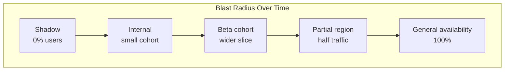
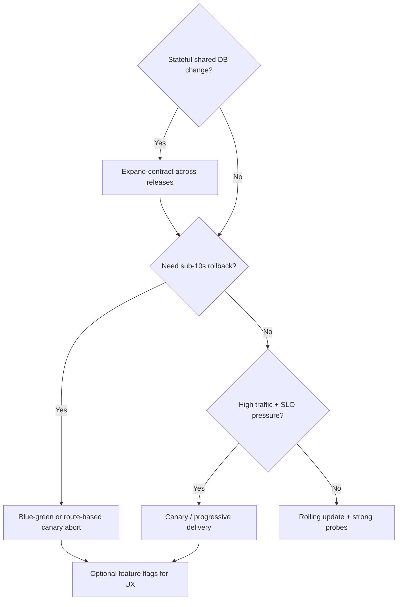

> **Discipline Module** | Complexity: `[MEDIUM]` | Time: 2 hours

## Prerequisites

Before starting this module:
- **Required**: CI/CD Fundamentals — Understanding build pipelines, artifact promotion, and deployment automation
- **Required**: [Kubernetes Deployments](/k8s/ckad/) — Working knowledge of Deployments, Services, and label selectors
- **Recommended**: Basic understanding of load balancers and HTTP routing
- **Recommended**: Familiarity with monitoring/observability concepts

---

## What You'll Be Able to Do

After completing this module, you will be able to:

- **Evaluate deployment strategies — rolling, blue-green, canary, A/B — against your risk tolerance and infrastructure**
- **Design a release strategy matrix that matches deployment patterns to service criticality levels**
- **Implement progressive delivery workflows that gradually shift traffic with automated rollback triggers**
- **Analyze release failure modes to build deployment pipelines that detect problems before full rollout**

## Why This Module Matters

**Hypothetical scenario:** A payments team ships a billing change on Friday afternoon. By Saturday morning, roughly twelve thousand invoices show wrong tax lines. Rollback takes forty minutes because the pipeline must rebuild an old image and nobody rehearsed reversing the cutover. Leadership schedules an emergency review Monday morning while engineers manually correct rows in the database.

That painful weekend is rarely caused by a single bad line of code alone. It is caused by treating **release** as a single irreversible flip: all users, all traffic, all schema changes, all at once, with no practiced escape hatch. Release engineering is the discipline of moving change from integration to production **safely, repeatedly, and reversibly**. The strategies in this module are how practitioners shrink blast radius, separate risky steps, and make recovery a rehearsed muscle instead of a improvisation under sleep deprivation.

In this module you will learn why **deploying** code and **releasing** it to users are different events, how rolling, blue-green, canary, shadow, and A/B patterns trade risk against cost and rollback speed, and how progressive delivery layers automation on top of gradual exposure. You will also see why database migrations and immutable artifacts determine whether rollback is real or merely wishful thinking. By the end, you should think of production change as turning a dial rather than flipping a switch.

---

## Deploy vs Release: The Durable Distinction

The most important idea in modern release engineering is that **deployment** and **release** are not synonyms. Deployment means placing a specific artifact build onto runtime infrastructure so it can execute: new pods, new containers, new configuration packages. Release means exposing that behavior to users or downstream callers who depend on correct, stable outcomes. You can deploy on Tuesday and release on Thursday when marketing is ready, or deploy globally while only employees see the feature, or deploy a dark variant that never answers clients.

Decoupling the two events is what makes frequent delivery compatible with conservative risk appetite. Feature flags, traffic shifting, and internal-only routing let teams integrate continuously while controlling exposure. When release is decoupled from deploy, rollback of user impact can be a configuration change instead of a rebuild. When they are fused, every production incident in a new feature becomes a redeploy emergency, which is slow and stressful precisely when speed matters most.

Kubernetes makes this distinction concrete. A `Deployment` rolling update replaces pod templates; that is deployment mechanics. Whether customers see new UI or a new API contract is a separate decision implemented with Service selectors, Ingress weights, mesh routes, or application-level toggles. Teams that master both layers can keep old binaries warm for instant traffic reversal while also hiding incomplete product behavior behind flags. Teams that conflate the layers discover too late that pods rolled forward while users were never meant to see the change yet—or that traffic switched while schema migrations were not backward compatible.

This module teaches the deployment strategies first because they define infrastructure blast radius, then connects them to release controls that shrink user blast radius even further. Module 1.3 goes deeper on flag platforms and lifecycle; Module 1.2 automates canary promotion with controllers such as Argo Rollouts. Here you build the mental model those tools assume.

---

## Blast Radius and the Failure of Big-Bang Change

Traditional release trains often look like a straight line: commit, build, deploy everywhere, hope dashboards stay green. That **big-bang** pattern maximizes blast radius because every user and every dependency experiences the change simultaneously. If the defect is subtle—wrong rounding, elevated latency, a race under concurrency—detection may lag until business metrics move, by which time rollback itself becomes risky because data and schema may have diverged.

**Blast radius** measures how much of the system or user population is affected when a change misbehaves. Release strategies are blast-radius controls. Shadow traffic keeps user blast radius at zero while still exercising new code. Canary routing caps user blast radius at a few percent until metrics prove health. Blue-green keeps a full previous environment ready so blast radius can return to zero quickly via routing, not rebuild. Even rolling updates spread replacement over time, which reduces the fraction of concurrent mixed-version traffic compared to simultaneous replacement, though they do not offer fine-grained percentage control without extra routing layers.

Progressive exposure follows a familiar validation ladder: mirror or dark traffic, then internal staff, then a sliver of production users, then wider regions or cohorts, then general availability. Each step is a hypothesis test. Failing fast at a small step is cheap; failing after full cutover is expensive. The ladder is not vanity process—it is how you buy statistical confidence under real load shapes that staging rarely reproduces.



---

## Release Strategies: Purposes, Tradeoffs, and Fit

Understanding strategies starts with **recreate**: tear down old replicas, then start new ones. Recreate is simple and avoids mixed-version execution, which helps when applications cannot tolerate two versions concurrently. The tradeoff is downtime during the gap and no instant rollback environment unless you keep artifacts ready to redeploy. Recreate still appears for jobs, some stateful maintenance, and dev clusters, but user-facing services usually prefer strategies that preserve availability.

### Rolling Updates — Kubernetes Default Mechanics

A **rolling update** replaces pods incrementally according to `maxSurge` and `maxUnavailable` on a Deployment. Surge allows extra pods above desired count while new revision pods start; unavailable caps how many old pods may be down simultaneously. Setting `maxUnavailable: 0` with a positive surge is a common pattern for keeping capacity while new pods pass readiness checks before old pods terminate.

Rolling updates are attractive because they need no extra controllers. Kubernetes already knows how to create a new ReplicaSet, scale it up, and scale the old one down. The limitation is that **traffic proportion follows pod counts**, not an arbitrary percentage. If you run six stable and one canary pod behind one Service, you do not get a clean five-percent canary—you get roughly one-seventh of connections to the new version, modulo kube-proxy or dataplane behavior, session stickiness, and connection pooling.

During rolling updates, **old and new code run together**. That simultaneous execution is the root of most rolling-update outages: incompatible schema assumptions, changed serialization, different cache keys, or feature logic that assumes uniform cluster behavior. Rolling updates therefore demand backward-compatible migrations and tolerant RPC contracts, the same expand-contract discipline required for canary and blue-green. Rollback is another rolling update to the previous revision, not an instantaneous route flip, so bad releases can continue to harm traffic until the reverse roll completes and probes stabilize.

```yaml
apiVersion: apps/v1
kind: Deployment
metadata:
  name: checkout-api
spec:
  replicas: 6
  strategy:
    type: RollingUpdate
    rollingUpdate:
      maxSurge: 2
      maxUnavailable: 0
  template:
    metadata:
      labels:
        app: checkout-api
        version: v2
    spec:
      containers:
        - name: api
          image: registry.example/checkout-api:v2.3.1@sha256:abc…
          readinessProbe:
            httpGet:
              path: /readyz
              port: 8080
            periodSeconds: 5
```

Readiness probes gate whether a pod receives Service endpoints. Liveness probes restart unhealthy containers. Used together, they prevent obviously broken pods from serving, but they **cannot detect logical bugs** that still return HTTP 200. That gap is why metrics-aware progressive delivery exists: error rate and latency SLOs catch correctness failures probes miss.

### Blue-Green — Two Revisions, One Routing Decision

**Blue-green** maintains two full capacity footprints (or two clearly separated ReplicaSets) representing current and candidate versions. Production traffic hits one color while the other warms with health checks and synthetic tests. Cutover is a routing change—Service selector patch, Ingress backend swap, Gateway API rule update, or mesh route weight—to move user traffic wholesale. Rollback is the same routing change in reverse while the previously live environment still runs.

Strengths include fast reversal without rebuilding images and the chance to run black-box acceptance against the idle environment before exposure. Costs include temporarily doubled compute for stateless tiers and operational complexity for stateful dependencies. Database coupling is the classic pain: if green requires a breaking schema, blue cannot roll back unless schema changes were expand-contract and both versions remain compatible. Blue-green is therefore excellent for stateless APIs with disciplined migrations and painful for monoliths that couple schema and code tightly in one release artifact.

In Kubernetes, blue-green is often implemented with label selectors on a Service, separate Deployments per color, and optional preview Services for pre-cutover verification. The cutover command is small; the discipline is keeping blue alive after green takes traffic, tagging artifacts immutably, and automating health gates so humans do not skip validation under schedule pressure.

```yaml
apiVersion: v1
kind: Service
metadata:
  name: checkout-api
spec:
  selector:
    app: checkout-api
    color: blue   # patch to green at cutover
  ports:
    - port: 80
      targetPort: 8080
```

### Canary — Gradual Traffic Shift With Observation

**Canary** releases route a small share of production traffic to the candidate version while the majority stays on stable. Operators—or automation—watch golden signals: error ratio, latency percentiles, saturation, business KPIs where available. If canary metrics stay within tolerance, weight increases through steps; if not, weight returns to stable without exposing most users. The name evokes sentinel birds in mines: a small early victim surfaces danger before the whole workforce is affected.

Canaries excel for high-traffic paths where even brief widespread failure is costly and where production traffic shape reveals issues staging misses. They require **traffic splitting** beyond default Services—Ingress or Gateway API weights, service mesh routes, or progressive delivery controllers. They also require clear promotion criteria defined before the rollout starts; otherwise teams debate graphs while users suffer.

Session affinity complicates canaries. If sticky sessions bind users to stable pods, canary pods see a distorted sample. Connection pools and long-lived gRPC channels produce similar skew. Designing canaries demands thinking about how clients reconnect and whether your metrics window matches the traffic mix you intend.

### Shadow, Dark Launches, and A/B Experiments

**Shadow** (or **dark launch**) sends duplicate requests to the candidate stack while user responses still come only from stable. Shadowing validates performance and correctness under real query shapes with **zero user blast radius** for response content. It is powerful for read-heavy paths and dangerous for writes unless you carefully isolate side effects. Double writes, duplicate messages, or unintended external API calls from shadow paths are classic incident sources.

**A/B testing** compares variants to measure product outcomes—conversion, engagement—not only system health. A/B is a release strategy tied to experimentation ethics and statistics: cohort assignment, stickiness, and stopping rules. Infrastructure may reuse canary machinery, but the decision metric is product success, not only error rate. **Dark launches** often combine shadow validation with feature flags so code is deployed broadly but not user-visible until confidence accumulates.

---

## Progressive Delivery: From Manual Canary to Automated Promotion

**Progressive delivery** is the practice of automating progressive exposure with guardrails: stepped traffic weights, metric analysis windows, automatic rollback on SLO breach, and audit trails of who promoted what when. It extends canary from a manual dashboard ritual into policy. The durable idea is **metrics-driven promotion**—machines watch signals continuously and act faster than humans during overnight incidents.

At 3 AM, humans misread graphs, hesitate to roll back, or lack context on which deploy caused regression. Automated analysis templates encode thresholds: five-minute error rate compared to baseline, p99 latency regression bounds, custom business counters. Failure triggers rollback or pause; success advances the step table. This is the bridge to Module 1.2, where Argo Rollouts implements steps and AnalysisRuns against Prometheus or other providers.

Progressive delivery still requires engineering judgment in step design. Steps that are too large recreate big-bang risk; steps that are too small prolong mixed-version windows where schema compatibility matters. Pause durations must exceed metric stabilization time. Feature flags from Module 1.3 can gate user-visible behavior inside a canary pod so infrastructure exposure and product exposure diverge intentionally.

Combining patterns is normal in mature platforms: shadow first, then automated canary percentages, then blue-green for final cutover with instant revert, with flags controlling UX rollout inside each phase. The layering is the strategy—no single Kubernetes object replaces thinking about risk, state, and observability together.

---

## Kubernetes Traffic Splitting and Safety Gates

Default ClusterIP Services distribute traffic across ready endpoints without percentage weights. For weighted canary or blue-green at the edge, teams use **Ingress** controllers that support weight annotations, **Gateway API** HTTPRoute rules with backend weights, or **service mesh** virtual services. Each approach shifts complexity to the dataplane you already operate.

> **Landscape snapshot — as of 2026-06. This changes fast; verify against vendor docs before relying on specifics.**

| Durable capability | Kubernetes Service + Deployment | Gateway API HTTPRoute | Service mesh (e.g. Istio, Linkerd) | Progressive-delivery controller |
|--------------------|--------------------------------|------------------------|--------------------------------------|----------------------------------|
| Replace pods gradually | Yes (rolling update) | Indirect (backend refs) | Indirect | Yes (Rollout steps) |
| Arbitrary traffic weights | No | Yes (rule weights) | Yes (route weights) | Yes (delegates to mesh/gateway) |
| Automated metric gates | No | No | Partial (ecosystem) | Yes (analysis templates) |
| Instant route rollback | No (roll Deployment) | Yes (patch routes) | Yes (patch routes) | Yes (abort rollout) |

Gateway API is a Kubernetes SIG project defining role-oriented APIs for L4/L7 routing; maturity varies by implementation and release channel—confirm GA features for your chosen gateway controller before designing production canaries on new fields. Meshes add east-west control and mutual TLS, which helps multi-service canaries but adds operational surface. Controllers such as Argo Rollouts and Flagger orchestrate steps and integrate with these dataplanes rather than replacing kube-apiserver concepts.

**PodDisruptionBudgets** limit voluntary evictions during node drains and coordinated rollouts so maintenance does not take down too many replicas at once. PDBs interact with `maxUnavailable` during rolling updates: a too-strict PDB can block node upgrades; a missing PDB can allow drains that violate availability targets. Treat PDBs as part of release safety, not only cluster hygiene.

Immutable workload identity matters for rollback. Pinning `image: tag` without digest allows registry tag mutation to break the assumption that "rollback to v1.2" means the same bits. GitOps flows that record desired state in git and sync via controllers make rollback a revert commit, but only if artifacts are immutable and migration strategy allows reversal. Digest pinning and single-direction schema changes turn rollback from folklore into procedure.

---

## Feature Flags and Release Toggles (Cross-Reference)

Feature flags implement **release** control inside binaries already **deployed**. A release toggle gates incomplete functionality; an ops toggle acts as kill switch; experiment toggles support A/B measurement. The kill switch pattern matters for integrations with fragile third parties: disabling a path via configuration beats waiting for CI when timeouts cascade through checkout.

Flags do not remove the need for deployment strategies. You still need healthy rollouts, PDBs, and traffic management. Flags add a finer dial on user experience and let you decouple deploy cadence from marketing calendars. They also introduce **flag debt** if teams never remove temporary toggles—treat flag removal as part of definition of done, as Module 1.3 details.

```python
if flags.is_enabled("new-tax-engine", user=current_user):
    return compute_tax_v2(cart)
return compute_tax_v1(cart)
```

---

## Database Migrations and the Expand-Contract Pattern

Stateful data breaks naive zero-downtime stories. During any strategy that runs two application versions concurrently, **both must read and write safely against shared schema**. Breaking changes—drops, renames, type changes that reject old values—must never ship in the same release that introduces code depending on them.

**Expand-contract** (parallel change) spans multiple releases. Expand adds new columns or tables while old code ignores them. Migrate backfills and dual-writes so new code can depend on new fields. Contract removes obsolete columns once no binary reads them. Each phase is deployable and reversible within the compatibility window you define.

Rolling deployments with rename migrations fail loudly: new pods query `status` while old pods still query `account_status`, producing error storms mid-rollout. The fix is additive schema first, dual-read/dual-write middleware, then cleanup later—often three or more releases for large tables. Long-running migrations should batch to avoid table locks that themselves cause outages.

---

## Rollback Philosophy: MTTR Over MTBF

Reliability culture often debates **MTBF** (maximize time between failures) versus **MTTR** (minimize time to recover). Change advisory boards and infrequent releases optimize MTBF superficially, but rare deploys mean unpracticed rollbacks and large diffs that are hard to diagnose. High-performing delivery organizations per [DORA research](https://dora.dev/research/) correlate frequent small changes with better stability outcomes when automation and observability are strong—not because failure is desired, but because recovery is rehearsed.

Release strategies are MTTR tools. Blue-green and route rollback shrink time to restore service. Canary and progressive delivery shrink users affected before recovery is needed. Shadow and automated analysis shrink probability of user-visible failure altogether. Feature flags shrink time to mitigate product risk without infra churn. Choosing strategy is choosing which failure modes you can afford and how fast you must recover when they appear.

---

## Observability Signals That Drive Promotion and Abort

Progressive delivery is only as good as the signals you trust during each step. Infrastructure health checks—pod Ready, process up, JVM heap within bounds—are necessary but insufficient because logical defects often surface as elevated 500 rates, silent data corruption, or latency tail growth while probes remain green. Golden signals per the Google SRE framing—latency, traffic, errors, saturation—should be tied to **release-specific dashboards** that compare canary versus stable cohorts rather than only global cluster graphs.

Error rate alone misleads when traffic is tiny: a handful of failures can look like one hundred percent errors on a canary with twelve requests per minute. Prefer rate comparisons against stable baseline windows, confidence bounds, or minimum sample thresholds before auto-abort fires. Latency requires aligned histograms: p50 shifts may be noise while p99 doubling on checkout paths is user-visible pain. Saturation signals—CPU throttling, thread pool queue depth, connection pool wait—often precede hard failures and are excellent early abort triggers during canary steps.

Business metrics lag infrastructure metrics but matter for product-facing releases: conversion, payment success, search click-through. Use them as secondary gates with longer observation windows, not as the only fast abort lever, because product metrics are noisier and slower. Synthetic checks complement production traffic by hitting critical paths every minute from outside the cluster, yet synthetics rarely capture full cardinality of user inputs or cache states; treat them as guardrails alongside real traffic analysis.

Define **analysis windows** explicitly: too short windows react to noise; too long windows let damage accumulate. Align window length with step size—large traffic steps need shorter decisive windows; tiny early steps need longer windows to gather samples. Document whether abort rolls weight to zero or pauses for human judgment. Pauses protect against flapping but extend mixed-version exposure; automatic full revert protects users but may discard benign slow starts. Your SLO culture should pick defaults before incidents, not during them.

---

## Connection Draining, Sessions, and Mixed-Version Semantics

Mixed-version execution is not an edge case; it is the default for rolling updates, partial canaries, and every step before one hundred percent promotion. Clients maintain HTTP keep-alive connections, gRPC channels, and WebSocket sessions that stick to specific pods until reconnect. When Service selectors flip in blue-green, new connections hit the new color immediately while old connections may finish on prior pods until idle timeout—usually acceptable if both versions are compatible.

Session affinity amplifies skew. If Ingress or Service sessionAffinity hashes client IP to a pod, canary pods may see a biased subset or nearly zero traffic depending on hash luck. For representative canaries, either disable stickiness during rollout, use header-based routing that forces canary cohorts explicitly, or allocate enough canary weight that hash distribution stabilizes. Document how mobile apps reuse connections; long-lived mobile sessions are a frequent hidden reason canary metrics look healthy while new mobile installs suffer.

Graceful shutdown hooks should drain in-flight work before SIGKILL. PreStop sleeps paired with readiness failure instruct endpoints to remove a pod before termination, reducing mid-request failures during rollouts. Without draining, rolling updates cause user-visible 502/503 blips that are not bugs in new code but artifacts of abrupt termination. Blue-green cutover shares the same requirement: idle color must keep serving until connections drain unless clients retry aggressively.

Serialization compatibility belongs in the same conversation. If v2 emits JSON field names v1 clients cannot parse, or protobuf enums shift, mixed versions break even when databases are fine. Contract tests between services and consumer-driven fixtures reduce these failures. Treat API versioning—URL prefixes, media types, feature negotiation headers—as part of release strategy, not as an afterthought bolted on after the first cross-version outage.

---

## Regional, Cohort, and Time-Window Rollouts

Not all blast-radius controls are percentage-based. **Geographic rollout** exposes change to a single region or cluster first when data residency, latency profiles, or operator staffing differ by locale. A defect confined to EU traffic during US night may limit customer impact and give engineers in European business hours time to respond. Regional rollouts require traffic management at DNS, global load balancer, or Gateway API layers with geo rules, plus observability segmented by region labels on metrics.

**Cohort rollouts** target internal employees, beta program users, or customers who opted into early access. Cohorts combine naturally with feature flags: the flag defines membership, while deployment strategy ensures infrastructure can carry extra load from experimental paths. Cohort releases reduce reputational risk because external social media blast radius stays small even if technical blast radius across employees is one hundred percent of staff users.

**Time-window releases** schedule promotion steps during business hours when incident responders are available and downstream partners—payment processors, ad networks—staff their desks. Time windows do not replace automation; they constrain when automatic promotion may proceed. Many organizations allow deploy anytime but gate **automatic full promotion** to weekdays, while still permitting instant abort 24/7.

Combining dimensions—region plus percentage plus cohort—produces a multi-axis exposure model that big-bang cannot approximate. The operational cost is clarity: runbooks must state which axis moves at each step so on-call engineers know whether to revert routing, flip flags, or roll back a Deployment revision.

---

## GitOps, Immutable Artifacts, and Reversible Promotion

GitOps declares desired cluster state in git and lets controllers reconcile drift. For releases, the durable practice is promoting **immutable artifact references**—image digests, signed bundles, Helm chart versions pinned to digests—not floating tags that can be overwritten in a registry. When rollback means reverting a git commit that points to `sha256:…` of the last known good build, recovery is deterministic. When rollback means "redeploy tag v1.2" and v1.2 was rebuilt with a different digest last month, recovery is a lottery.

Promotion pipelines should separate **build** from **deploy** from **expose**. CI produces an artifact and records digest in an artifact store; staging sync applies digest; production sync requires approval or policy gate; traffic shift or flag flip constitutes release. Each stage leaves an audit trail correlating git SHA, image digest, and deployment revision. Incident investigators can answer which bits ran without reconstructing from memory.

Config changes are releases too. A bad ConfigMap or Helm value can break production without a new image. Progressive delivery controllers can watch both workload and config revisions; feature flags live in configuration services with their own audit APIs. Rollback strategy must include config revert paths, not only image revert paths, especially when autoscaling or HPA settings change during performance tuning alongside code.

Rehearsal transforms rollback from theory into capability. Game days should execute abort on a canary, blue-green revert, and flag kill switch in production-like environments quarterly. Teams measure wall-clock time to restored SLO and update runbooks when steps fail. A rollback that never practiced is inventory, not insurance.

---

## A/B Experiments Versus Canary Health Gates

**Canary health gates** ask whether the new version is **safe enough** to continue: errors down, latency within bounds, saturation stable. **A/B experiments** ask whether the new version is **better** for a product hypothesis: conversion up, retention improved, task completion faster. The statistical machinery differs. Health gates use operational thresholds and fast abort; experiments need power analysis, pre-registered success metrics, and ethical review when user experience varies intentionally.

Infrastructure overlap is common—both may route percentage traffic—but conflating the goals causes harm. Shipping a variant that wins on click-through but raises error rate should fail health gates even if product metrics glow. Conversely, a healthy canary that is product-neutral should promote even without A/B uplift. Separate dashboards and approval roles: SRE-owned health templates versus product-owned experiment analysis.

Experiment toggles should have end dates and removal plans per Fowler's feature toggle taxonomy. Canary machinery without experiment discipline becomes permanent parallel code paths. When an experiment ends, merge the winning path, delete losing paths, and remove routing weights so the dataplane returns to simple stable-plus-deployment defaults.

Dark launches and shadow traffic often precede A/B tests for backend changes: validate safety and performance before any user sees UX differences. The sequencing shadow → health canary → experiment canary → full release respects both MTTR and product learning without skipping safety layers for speed.

---

## Recreate Deployments and When Simplicity Wins

The `Recreate` deployment strategy stops old pods before starting new ones, producing a brief capacity gap. For single-replica dev services or batch workers that tolerate restart, Recreate avoids mixed-version bugs entirely because only one version runs at any instant. Production user-facing tiers rarely accept the downtime, yet Recreate remains relevant for Jobs, CronJobs, controllers that rebuild state on start, and maintenance windows where operators intentionally scale to zero.

Choosing Recreate because rolling update math is confusing is a mistake; choosing it because the workload cannot safely run two versions concurrently is valid. StatefulSets with ReadWriteOnce volumes often behave like Recreate at the pod level when volume attachment prevents multi-pod old/new overlap on the same node strategy. Understand your storage and identity constraints before assuming Deployment defaults fit every workload.

When you use Recreate in production, rollback still means deploying the previous artifact revision—there is no warm standby pod pool unless you keep a scaled-to-zero Deployment or paused ReplicaSet ready. Document expected outage seconds and communicate to stakeholders. Pair with fast health checks and external maintenance pages if user-visible downtime is unavoidable.

---

## Ingress Controllers Versus Gateway API at the Edge

Classic **Ingress** resources map HTTP routes to Services through controller-specific annotations for weights, canary headers, and rewrite rules. Capabilities vary widely by controller implementation—NGINX, HAProxy, Traefik, cloud LBs—so a canary annotation that works in one cluster may not port to another. Teams standardize on one controller per platform and codify supported patterns in internal docs rather than assuming generic Ingress semantics.

**Gateway API** expresses routing with role-oriented objects—GatewayClass, Gateway, HTTPRoute—and aims for consistent implementation across vendors. Backend weights and filters enable canary-style splits without patching Service selectors alone. Maturity is implementation-dependent: verify which HTTPRoute fields your chosen gateway marks stable or experimental before baking them into tier-one payment paths.

Mesh traffic splitting excels inside the cluster east-west graph where mTLS, retries, and per-route policies matter. Edge gateways excel at north-south entry with TLS termination and WAF integration. Progressive delivery controllers often orchestrate both layers: Gateway API or Ingress for external percentage weights, mesh routes for internal service-to-service canaries during microservice decomposition projects.

The durable lesson is separation of concerns: Kubernetes workload controllers manage pod lifecycle; edge and mesh dataplanes manage **who receives bytes**; progressive delivery controllers manage **when weights change** based on analysis. Confusing those layers leads to teams patching Deployments when they should patch routes, or patching routes when schema compatibility was the actual blocker.

---

## Release Runbooks: What On-Call Needs Before Promotion

A release runbook is not a novel; it is a checklist tied to observable signals and owned actions. Minimum contents: artifact digest being promoted, previous digest for revert, feature flags touched, database migration phase (expand/migrate/contract), traffic layer affected (Deployment only, Service selector, Ingress/Gateway, mesh, flag), metric dashboards with canary versus stable comparison links, abort commands with expected time-to-effect, and communication template for status page updates.

Runbooks should specify **rollback versus roll-forward** decision criteria. Rollback restores prior bits quickly when defects are clearly tied to new code. Roll-forward fixes forward when schema migrations are irreversible within the window or when reverting would drop data written only by new code. Mixed-version database discipline makes rollback feasible; skipping expand-contract forces roll-forward pressure during incidents.

Ownership clarifies who may promote each step: release captain, SRE observer, product approver for experiment cohorts. Automated promotion should still leave audit logs and optional human veto windows on final full cutover. Humans approve risk acceptance; machines execute repetitive weight shifts and metric polling.

Post-release verification extends beyond green dashboards: sample business transactions, reconciliation jobs, error budget burn rate over the next hour, and comparison to same-day-last-week seasonality. Many defects appear only under peak shape thirty minutes after promotion when caches warm or batch jobs collide. Schedule verification tasks in the runbook, not improvised after closing the change ticket.

---

## Coordinating Release Strategy With Service Criticality Tiers

Platform teams often label services **tier-1** (revenue or safety critical), **tier-2** (important but degradable), and **tier-3** (internal or best-effort). The tier should dictate minimum release machinery, not vice versa. Tier-1 paths warrant digest-pinned artifacts, automated canary analysis, rehearsed abort, expand-contract migrations, and kill switches on external dependencies. Tier-3 tools may use rolling updates with strong probes and weekday promotion windows because user impact and revenue linkage are lower.

Criticality also maps to **dependency depth**. A tier-1 edge API that calls twenty downstream services inherits failure modes from each dependency's release posture. A canary on the edge without compatible canary behavior downstream measures only the edge binary, not end-to-end checkout success. Release strategy documents should list upstream and downstream blast radius for chained calls and whether timeouts and fallbacks keep partial outages localized.

Cost approval follows the same tiering. Blue-green and shadow double read capacity temporarily; finance and capacity planners should expect periodic 2× footprint during cutover windows. Canary adds smaller overhead but needs metric storage and controller operations. Rolling update is cheapest operationally yet may be expensive incident-wise for tier-1 if rollback is slow—total cost of ownership includes outage minutes, not only extra pods.

Finally, regulatory and audit constraints may require **who flipped traffic when** evidence. Progressive delivery controllers, GitOps audit logs, and feature-flag admin APIs supply that trail; ad-hoc kubectl patches without change records fail audits even if technically fast. Designing strategy without audit hooks creates friction later when compliance asks for proof that production exposure was intentional and reversible. Treat auditability as a non-functional requirement alongside latency and availability when you choose rollout machinery. The extra logging and policy work up front is cheaper than reconstructing intent from shell history during an audit or postmortem.

---

## Patterns & Anti-Patterns

### Patterns That Scale Safe Releases

**Pattern: Deploy ≠ release.** Ship artifacts continuously; expose behavior via flags and traffic weights when product and compliance are ready. This pattern reduces weekend firefights caused by code sitting live but invisible until an external event triggers partial exposure.

**Pattern: Hypothesis-driven steps.** Each canary step states measurable success criteria before traffic moves. Teams document thresholds, observation windows, and owners. Promotion becomes a policy decision, not a meeting about ambiguous graphs.

**Pattern: Immutable artifacts with rehearsed rollback.** Build once, promote digest-pinned images through environments, keep previous revision running during blue-green, and practice abort paths in game days. Rollback time dominates incident cost more often than bug fix time.

**Pattern: Expand-contract for shared schema.** Treat databases as slower-moving peers in the rollout. No single release should assume exclusive access to a new schema shape while old pods still run.

### Anti-Patterns That Convert Deploys Into Incidents

**Anti-pattern: Big-bang cutover without idle standby.** Replacing the only running version means rollback equals rebuild, destroying the main benefit of blue-green and turning routing strategies into branding only.

**Anti-pattern: Canary without metrics or SLO gates.** Routing five percent of traffic but measuring nothing is random sampling without a decision rule—users suffer while operators guess.

**Anti-pattern: Shadow writes on production data.** Mirroring traffic to a candidate that performs creates, charges, or sends email duplicates side effects and can cause financial or compliance incidents despite zero user-visible responses.

**Anti-pattern: Permanent "temporary" flags.** Release toggles that linger accumulate branches, dead configuration, and unpredictable behavior when stale defaults flip unexpectedly during unrelated deploys.

### Decision Framework: Choosing a Strategy

Use this matrix as a starting point—not a ranking of winners. Match pattern to criticality, statefulness, traffic tooling, and rollback SLA.

| Factor | Rolling update | Blue-green | Canary / progressive | Shadow / dark |
|--------|----------------|------------|----------------------|---------------|
| Operational complexity | Low | Medium | Medium–high | High |
| User blast radius on failure | Mixed-version window | All users after cutover | Configurable slice | None for responses |
| Rollback speed | Moderate (roll back Deployment) | Fast (route flip) | Fast (weight revert) | Disable mirror |
| Infra cost | Near baseline | ~2× during overlap | Small extra capacity | ~2× read path |
| Needs traffic splitting | No | For clean cutover | Yes | Mirror plumbing |
| DB compatibility | Both versions concurrent | Both versions concurrent | Both versions concurrent | Reads safer than writes |
| Fits critical stateless API | Yes | Strong | Strong | Validation phase |



---

## Did You Know?

- **Canary deployments borrow a coal-mining metaphor**: miners carried sensitive birds into tunnels; if air quality dropped, the bird showed distress before humans—software canaries expose defects on a small traffic slice before full promotion ([Martin Fowler — CanaryRelease](https://martinfowler.com/bliki/CanaryRelease.html)).

- **Blue-green deployment as a named pattern** was popularized in the continuous delivery literature and Fowler's bliki as a way to reduce downtime by keeping two production-capable environments and switching router configuration rather than mutating in place ([Martin Fowler — BlueGreenDeployment](https://martinfowler.com/bliki/BlueGreenDeployment.html)).

- **Kubernetes Deployments default to RollingUpdate**, replacing pods incrementally with controls for surge and unavailable budgets; Recreate is the alternative when brief downtime is acceptable ([Kubernetes Deployment docs](https://kubernetes.io/docs/concepts/workloads/controllers/deployment/)).

- **DORA's research program** links software delivery capabilities—including deployment frequency and recovery practices—to organizational performance, reinforcing that small, reversible changes with strong feedback loops outperform rare heroic releases ([DORA research overview](https://dora.dev/research/)).

---

## Common Mistakes

| Mistake | Problem | Solution |
|---------|---------|----------|
| No rollback plan | Recovery becomes improvised under pressure | Automate and rehearse rollback/abort before each production promotion |
| Canary without metrics | Traffic shifts without decision criteria | Define SLO thresholds and analysis windows before changing weights |
| Blue-green without standby | "Rollback" rebuilds images slowly | Keep previous color running; rollback = routing change |
| Breaking schema in one release | Mixed-version pods crash on schema mismatch | Expand-contract across multiple releases with dual compatibility |
| Shadow path with writes | Duplicate charges, messages, or rows | Mirror reads only or isolate shadow data paths |
| Feature flags without expiry | Dead branches and config drift accumulate | Track lifecycle; remove release toggles after GA |
| Ignoring session stickiness | Canary sees unrepresentative traffic | Align stickiness, pool settings, and metric windows |
| Skipping PDB alignment | Drains or rollouts violate availability | Set PDBs consistent with replica count and surge settings |

---

## Quiz

1. **Scenario:** Your team deployed new checkout code to all production pods on Wednesday, but marketing wants the UX hidden until a Monday campaign. Users still see the old checkout. Which concepts explain this state, and why is the separation strategically valuable?

<details>
<summary>Answer</summary>
The new code is **deployed** (running in production infrastructure) but not **released** (not yet exposed as the default user experience). Feature flags, routing rules, or server-side gating decouple putting bits on servers from business decisions about visibility. This lets engineering integrate continuously without premature exposure, reduces blast radius of unfinished work, and turns many release events into configuration changes rather than emergency redeploys. It is foundational to progressive delivery because infrastructure rollout and product exposure can move at different speeds safely.
</details>

2. **Scenario:** You must validate a rewritten query engine that should return identical results to users. Your manager proposes a five-percent canary. Evaluate that proposal against an alternative and recommend the safer approach for this backend-only change.

<details>
<summary>Answer</summary>
A **shadow deployment** is usually safer than a five-percent canary when user-visible output must remain on the stable path. Shadowing mirrors production read traffic to the candidate while only stable responses reach clients, giving full-load performance and correctness signals with zero user blast radius for response content. A canary unnecessarily exposes a slice of users to latency or correctness risk if the engine misbehaves. Pair shadow comparison (diff metrics, resource usage) with later canary or blue-green once shadow evidence passes thresholds.
</details>

3. **Scenario:** During a rolling update, errors spike after a migration renamed `account_status` to `status`. Half the pods are old binaries. Diagnose the failure mode and the prevention pattern.

<details>
<summary>Answer</summary>
Rolling updates run old and new versions concurrently; old pods still query `account_status` while new pods query `status`, causing query failures and elevated errors mid-rollout. Renaming in the same release is a breaking schema change under mixed versions. Prevention is **expand-contract**: add `status` alongside `account_status`, dual-write or backfill, deploy code that reads both, then later drop the old column once no pod depends on it. Never ship destructive schema changes in the same release that introduces code requiring them.
</details>

4. **Scenario:** Company A deploys quarterly with long freezes; Company B deploys many times daily with automated abort paths. A severe defect appears in production. Company B recovers in minutes while Company A needs days. Which reliability philosophy explains the difference?

<details>
<summary>Answer</summary>
Company B optimizes **MTTR** (mean time to recovery) while Company A optimizes **MTBF** (mean time between failures) via change avoidance. Infrequent large releases create unpracticed rollbacks and huge diffs that slow diagnosis. Frequent small changes with automated rollback, canary aborts, and flags shrink blast radius and rehearse recovery. DORA research associates strong delivery capabilities with better stability when feedback loops and recovery automation accompany frequency—not because failures are desirable, but because recovery is fast and routine.
</details>

5. **Scenario:** A third-party payment gateway starts timing out during peak traffic. Engineers estimate twenty minutes to revert via CI. Which design pattern would have reduced user impact to seconds, and when should it be mandatory?

<details>
<summary>Answer</summary>
An **ops toggle / kill switch** (feature flag) around the new gateway integration allows instant disablement via configuration API without rebuilding images. Flipping the flag routes checkout back to the legacy processor immediately. Mandate kill switches for critical flows, external dependencies with variable latency, and any feature where outage cost dominates engineering cost. Pair toggles with metrics so automation can flip them when SLOs breach, not only human heroes during incidents.
</details>

6. **Scenario:** Infrastructure claims blue-green, but rollback re-runs the pipeline to an old Helm chart for thirty minutes. What was misunderstood about blue-green, and how should rollback work?

<details>
<summary>Answer</summary>
True blue-green keeps the previous **environment or revision running** after cutover; rollback is a **traffic routing** change back to the standby color, not a redeploy event. Rebuilding via CI destroys instant rollback benefits and couples recovery to build queue latency. Implement separate Deployments or ReplicaSets per color, health-check idle color before cutover, and patch Service, Ingress, Gateway API, or mesh weights to revert. Artifact immutability ensures the standby color still represents the known-good bits.
</details>

7. **Scenario:** You must choose a strategy for a high-traffic stateless API with strict p99 latency SLO and digest-pinned images in GitOps. Rolling update is default. Argue for or against adopting automated canary with metric gates.

<details>
<summary>Answer</summary>
Adopt **automated canary / progressive delivery** when p99 latency regressions must be caught before most users see new code and when you have traffic splitting plus Prometheus-style metrics. Rolling updates spread pod replacement but cannot shift arbitrary traffic percentages or auto-abort on SLO breach without extra tooling. Canary steps with analysis templates limit blast radius to each step and revert weights faster than rolling back an entire Deployment revision—especially valuable at high traffic where even short widespread latency breaches violate SLOs. Keep expand-contract discipline because mixed versions still coexist during steps.
</details>

8. **Scenario:** Design a release strategy matrix row for a tier-1 payments API versus an internal admin tool. Which patterns differ and why?

<details>
<summary>Answer</summary>
Tier-1 payments demand minimal blast radius, fast route-level rollback, immutable digest-pinned artifacts, expand-contract migrations, shadow validation for risky refactors, and progressive canary with automated abort on error-rate and latency SLOs; blue-green may backstop final cutover. Internal admin tools may tolerate rolling updates with strong probes and simpler flags because user impact and traffic cost are lower. The matrix maps **service criticality** to pattern choice: criticality raises requirements for traffic control, automation, rehearsal, and schema compatibility—not a single default strategy for all services.
</details>

---

## Hands-On

Deploy a manual blue-green cutover on a local cluster, practice instant rollback via Service selector changes, and confirm zero failed requests during switching.

### Setup

```bash
kind create cluster --name release-lab
```

### Step 1: Deploy Blue

```yaml
# blue-deployment.yaml
apiVersion: apps/v1
kind: Deployment
metadata:
  name: webapp-blue
  labels:
    app: webapp
    version: blue
spec:
  replicas: 3
  selector:
    matchLabels:
      app: webapp
      version: blue
  template:
    metadata:
      labels:
        app: webapp
        version: blue
    spec:
      containers:
        - name: webapp
          image: hashicorp/http-echo:0.2.3
          args:
            - "-text=Hello from BLUE (v1)"
            - "-listen=:8080"
          ports:
            - containerPort: 8080
          readinessProbe:
            httpGet:
              path: /
              port: 8080
            initialDelaySeconds: 2
            periodSeconds: 3
```

```yaml
# webapp-service.yaml
apiVersion: v1
kind: Service
metadata:
  name: webapp
spec:
  type: NodePort
  selector:
    app: webapp
    version: blue
  ports:
    - port: 80
      targetPort: 8080
      nodePort: 30080
```

```bash
kubectl apply -f blue-deployment.yaml
kubectl apply -f webapp-service.yaml
kubectl get pods -l version=blue
kubectl run curl-test --rm -it --restart=Never --image=curlimages/curl -- \
  curl -s webapp.default.svc:80
```

### Step 2: Deploy Green (no traffic yet)

```yaml
# green-deployment.yaml
apiVersion: apps/v1
kind: Deployment
metadata:
  name: webapp-green
  labels:
    app: webapp
    version: green
spec:
  replicas: 3
  selector:
    matchLabels:
      app: webapp
      version: green
  template:
    metadata:
      labels:
        app: webapp
        version: green
    spec:
      containers:
        - name: webapp
          image: hashicorp/http-echo:0.2.3
          args:
            - "-text=Hello from GREEN (v2)"
            - "-listen=:8080"
          ports:
            - containerPort: 8080
          readinessProbe:
            httpGet:
              path: /
              port: 8080
            initialDelaySeconds: 2
            periodSeconds: 3
```

```bash
kubectl apply -f green-deployment.yaml
kubectl get pods -l version=green
GREEN_POD=$(kubectl get pods -l version=green -o jsonpath='{.items[0].metadata.name}')
kubectl port-forward "$GREEN_POD" 8081:8080 &
curl -s http://localhost:8081
```

### Step 3: Cutover and rollback

```bash
kubectl patch service webapp -p '{"spec":{"selector":{"version":"green"}}}'
kubectl run curl-test2 --rm -it --restart=Never --image=curlimages/curl -- \
  curl -s webapp.default.svc:80
kubectl patch service webapp -p '{"spec":{"selector":{"version":"blue"}}}'
```

### Step 4: Traffic loop during switch

```bash
kubectl run traffic-loop --rm -it --restart=Never --image=curlimages/curl -- \
  sh -c 'while true; do
    RESPONSE=$(curl -s webapp.default.svc:80)
    echo "$(date +%H:%M:%S) - $RESPONSE"
    sleep 0.5
  done'
```

In another terminal:

```bash
kubectl patch service webapp -p '{"spec":{"selector":{"version":"green"}}}'
```

### Cleanup

```bash
kind delete cluster --name release-lab
```

### Success criteria

- [ ] Blue and Green each run three Ready pods before cutover
- [ ] Service selector alone moves production traffic between colors
- [ ] Rollback to Blue completes without rebuilding images or re-running CI

---

## Sources

- [Kubernetes Deployments](https://kubernetes.io/docs/concepts/workloads/controllers/deployment/) — Default rolling update strategy, `maxSurge`, `maxUnavailable`, and revision history behavior.
- [Rolling Update Deployment task](https://kubernetes.io/docs/concepts/workloads/controllers/deployment/#rolling-update-deployment) — Step-by-step rolling update semantics and rollout status.
- [Configure Pod Disruption Budgets](https://kubernetes.io/docs/tasks/run-application/configure-pdb/) — Limiting voluntary disruption during drains and rollouts.
- [Configure Liveness, Readiness, and Startup Probes](https://kubernetes.io/docs/tasks/configure-pod-container/configure-liveness-readiness-startup-probes/) — Probe gates that control endpoint inclusion during rollouts.
- [Pod Disruptions concept](https://kubernetes.io/docs/concepts/workloads/pods/disruptions/) — Voluntary versus involuntary disruption and availability budgets.
- [Martin Fowler — BlueGreenDeployment](https://martinfowler.com/bliki/BlueGreenDeployment.html) — Foundational blue-green pattern and routing-based cutover.
- [Martin Fowler — CanaryRelease](https://martinfowler.com/bliki/CanaryRelease.html) — Canary rationale and gradual exposure.
- [Feature Toggles (feature flags)](https://martinfowler.com/articles/feature-toggles.html) — Release toggles, ops toggles, and lifecycle considerations.
- [DORA Research Overview](https://dora.dev/research/) — Delivery capabilities, deployment frequency, and recovery practices.
- [Argo Rollouts documentation](https://argo-rollouts.readthedocs.io/) — Progressive delivery CRDs, canary steps, and analysis integration.
- [Flagger documentation](https://docs.flagger.app/) — Automated canary analysis with mesh/gateway providers.
- [Gateway API](https://gateway-api.sigs.k8s.io/) — Kubernetes SIG project for L4/L7 routing including weighted backends.

---

## Next Module

Continue to [Module 1.2: Advanced Canary Deployments with Argo Rollouts](../module-1.2-argo-rollouts/) to learn how to automate canary deployments with metrics-driven promotion and rollback.
