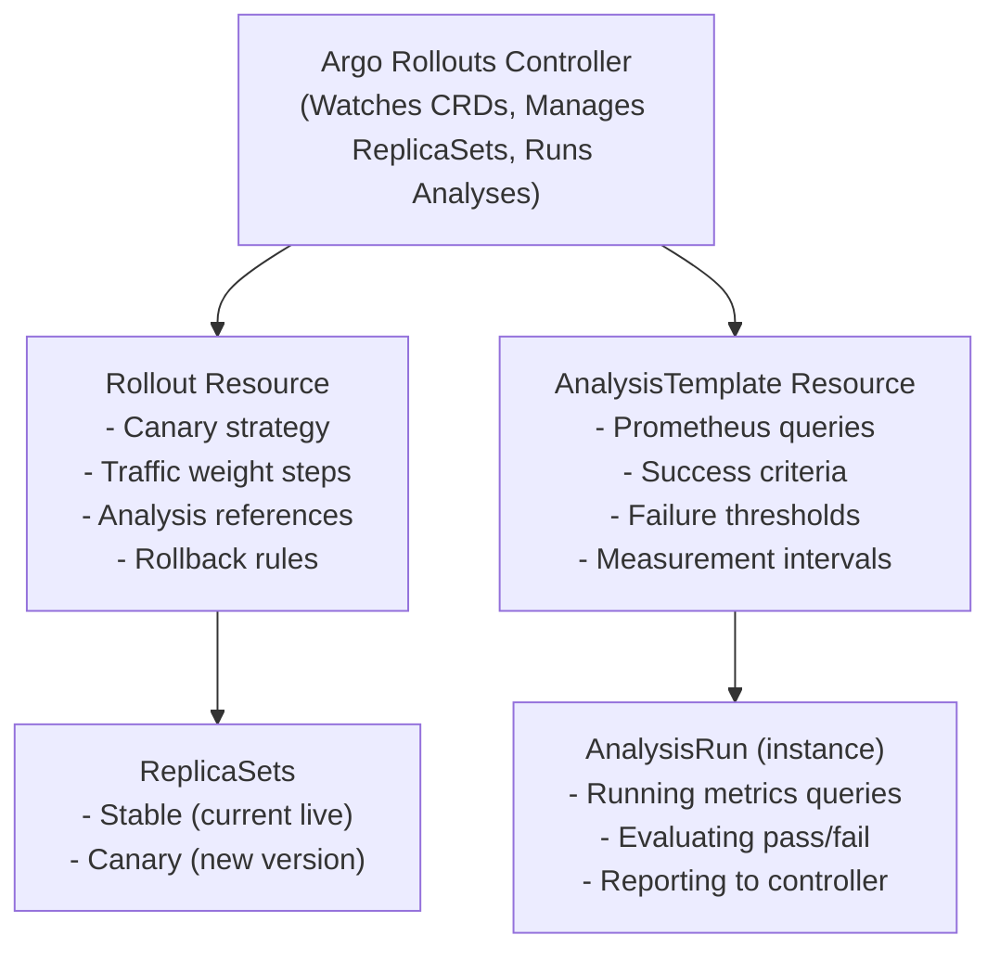
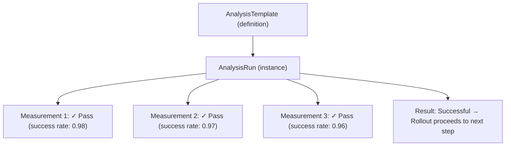
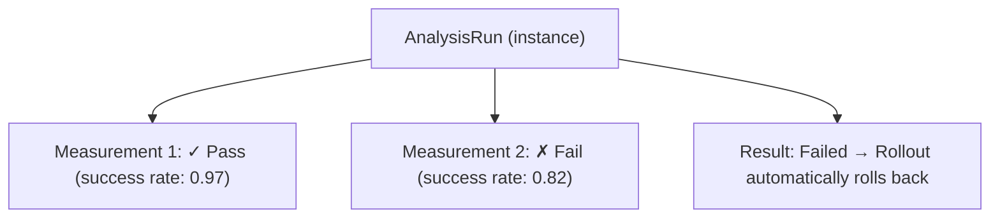
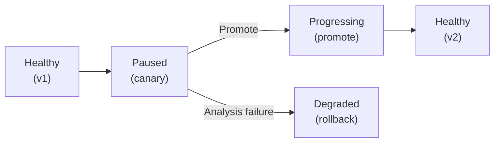

> **Discipline Module** | Complexity: `[COMPLEX]` | Time: 3 hours

## Prerequisites

Before starting this module:
- **Required**: [Module 1.1: Release Strategies](../module-1.1-release-strategies/) — Canary concepts, blast radius, progressive delivery
- **Required**: Prometheus basics — PromQL queries, metrics scraping, alerting fundamentals
- **Required**: Kubernetes Services and Ingress — Traffic routing, selectors, ingress controllers
- **Recommended**: Familiarity with Helm or Kustomize for templating
- **Recommended**: Understanding of HTTP status codes and latency percentiles

---

## What You'll Be Able to Do

After completing this module, you will be able to:

- **Implement Argo Rollouts for canary and blue-green deployments with automated analysis**
- **Configure analysis templates that evaluate metrics during progressive delivery rollouts**
- **Design rollback strategies that automatically revert failed deployments based on SLO violations**
- **Build promotion workflows that integrate Argo Rollouts with existing CI/CD pipelines**

## Why This Module Matters

In the previous module, you learned that canary deployments send a small percentage of traffic to a new version and gradually increase it. You did this manually — patching Services, eyeballing dashboards, making gut-feeling decisions about whether to proceed.

Now imagine doing that at 3 AM. Or for 50 services simultaneously. Or when the person who understands the metrics is on vacation.

Manual canary deployments do not scale. They depend on a human watching dashboards, interpreting graphs, and making timely decisions. Humans get tired. Humans get distracted. Humans have slow reaction times compared to automated systems that can detect a spike in 5xx errors within 30 seconds and roll back within 60.

**Argo Rollouts** transforms canary deployments from a manual art into an automated science. It watches your Prometheus metrics, evaluates them against thresholds you define, and makes promotion or rollback decisions faster and more reliably than any human operator.

After this module, you will have a fully automated canary pipeline that promotes good releases and kills bad ones — without you lifting a finger.

---

## What is Argo Rollouts?

> **Stop and think**: What happens to user traffic in a standard Kubernetes `Deployment` with the `RollingUpdate` strategy if the new pods start returning HTTP 500 errors but their readiness probes still pass?

### The Gap in Native Kubernetes

Kubernetes Deployments support two strategies: `RollingUpdate` and `Recreate`. Neither gives you:

- Fine-grained traffic percentage control (5%, then 10%, then 25%)
- Metrics-driven promotion decisions
- Automated rollback based on business metrics
- Pause-and-verify steps between traffic increases
- Integration with service meshes or ingress controllers for traffic splitting

Argo Rollouts fills this gap with a custom `Rollout` resource that replaces the standard `Deployment`.

### Architecture



### Core CRDs

Argo Rollouts introduces four Custom Resource Definitions:

| CRD | Purpose |
|-----|---------|
| **Rollout** | Replaces Deployment; defines the canary/blue-green strategy |
| **AnalysisTemplate** | Defines what metrics to check and their success criteria |
| **AnalysisRun** | A running instance of an AnalysisTemplate (created automatically) |
| **Experiment** | Runs temporary ReplicaSets for A/B testing (advanced use) |

---

## Rollout Resource Deep Dive

### From Deployment to Rollout

Converting a Deployment to a Rollout is straightforward. The key changes:

```yaml
# Before: Standard Deployment
apiVersion: apps/v1
kind: Deployment
metadata:
  name: my-app
spec:
  replicas: 5
  strategy:
    type: RollingUpdate
  selector:
    matchLabels:
      app: my-app
  template:
    # ... pod template ...
```

```yaml
# After: Argo Rollout
apiVersion: argoproj.io/v1alpha1      # ← Changed
kind: Rollout                          # ← Changed
metadata:
  name: my-app
spec:
  replicas: 5
  strategy:                            # ← Completely different
    canary:
      steps:
        - setWeight: 5
        - pause: { duration: 5m }
        - setWeight: 20
        - pause: { duration: 5m }
        - setWeight: 50
        - pause: { duration: 10m }
        - setWeight: 80
        - pause: { duration: 5m }
  selector:
    matchLabels:
      app: my-app
  template:
    # ... same pod template ...
```

### Canary Steps Explained

The `steps` array defines the rollout progression:

```yaml
steps:
  # Step 1: Send 5% of traffic to canary
  - setWeight: 5

  # Step 2: Wait 5 minutes (auto-proceed after duration)
  - pause: { duration: 5m }

  # Step 3: Run an analysis — metrics must pass to proceed
  - analysis:
      templates:
        - templateName: success-rate
      args:
        - name: service-name
          value: my-app

  # Step 4: If analysis passed, increase to 20%
  - setWeight: 20

  # Step 5: Indefinite pause — requires manual approval
  - pause: {}

  # Step 6: After manual approval, go to 50%
  - setWeight: 50

  # Step 7: Another analysis check at higher traffic
  - analysis:
      templates:
        - templateName: success-rate
        - templateName: latency-check

  # Step 8: Full rollout
  - setWeight: 100
```

### Step Types

| Step | Behavior |
|------|----------|
| `setWeight: N` | Route N% of traffic to canary |
| `pause: {duration: 5m}` | Wait, then auto-proceed |
| `pause: {}` | Wait indefinitely for manual promotion |
| `analysis:` | Run AnalysisTemplate; proceed on success, rollback on failure |
| `setCanaryScale:` | Set exact replica count for canary (instead of weight-based) |
| `setHeaderRoute:` | Route by HTTP header (A/B testing) |

---

## Traffic Routing

### How Traffic Splitting Works

Argo Rollouts supports multiple traffic routing mechanisms:

**1. Replica-based splitting (default, no extra infra):**

Traffic is split proportionally by pod count. If you have 10 replicas and set canary weight to 20%, Argo Rollouts runs 2 canary pods and 8 stable pods.

```text
Limitation: You can only achieve traffic splits that align with replica counts.
With 5 replicas, your options are 20%, 40%, 60%, 80% — not 5% or 10%.
```

**2. Ingress-controller-based splitting (recommended):**

Argo Rollouts integrates with NGINX Ingress, ALB, Istio, Traefik, and others to achieve precise traffic percentages regardless of replica count.

```yaml
apiVersion: argoproj.io/v1alpha1
kind: Rollout
metadata:
  name: my-app
spec:
  strategy:
    canary:
      canaryService: my-app-canary     # Service for canary pods
      stableService: my-app-stable     # Service for stable pods
      trafficRouting:
        nginx:
          stableIngress: my-app-ingress  # Your existing Ingress
          additionalIngressAnnotations:
            canary-by-header: X-Canary
            canary-weight: "5"
      steps:
        - setWeight: 5
        - pause: { duration: 5m }
        - setWeight: 25
        - pause: { duration: 5m }
        - setWeight: 50
        - pause: { duration: 10m }
```

This requires two Services:

```yaml
# Stable service (existing users)
apiVersion: v1
kind: Service
metadata:
  name: my-app-stable
spec:
  selector:
    app: my-app
  ports:
    - port: 80
      targetPort: 8080
---
# Canary service (canary traffic)
apiVersion: v1
kind: Service
metadata:
  name: my-app-canary
spec:
  selector:
    app: my-app
  ports:
    - port: 80
      targetPort: 8080
```

Argo Rollouts manages the selectors on these Services automatically, pointing the stable Service to the stable ReplicaSet and the canary Service to the canary ReplicaSet.

**3. Service Mesh integration (Istio):**

```yaml
trafficRouting:
  istio:
    virtualServices:
      - name: my-app-vsvc
        routes:
          - primary
    destinationRule:
      name: my-app-destrule
      canarySubsetName: canary
      stableSubsetName: stable
```

### Traffic Routing Comparison

| Method | Precision | Extra Infra | Best For |
|--------|-----------|-------------|----------|
| Replica-based | Low (limited to replica ratios) | None | Simple setups, development |
| NGINX Ingress | High (any percentage) | NGINX Ingress Controller | Most production use cases |
| Istio | Very High (percentage + headers + more) | Istio service mesh | Complex routing, header-based canaries |
| AWS ALB | High | AWS ALB Ingress | AWS-native environments |
| Traefik | High | Traefik | Traefik-based clusters |

---

## AnalysisTemplates: Metrics-Driven Decisions

> **Pause and predict**: If your AnalysisTemplate checks an error rate metric every 60 seconds and requires 5 successful measurements to pass, what is the absolute minimum time this step will take to complete?

### The Core Innovation

AnalysisTemplates are what make Argo Rollouts transformative. Instead of a human watching Grafana, you encode your promotion criteria as code:

```yaml
apiVersion: argoproj.io/v1alpha1
kind: AnalysisTemplate
metadata:
  name: success-rate
spec:
  args:
    - name: service-name
  metrics:
    - name: success-rate
      # Check every 60 seconds
      interval: 60s
      # Need at least 3 measurements before deciding
      count: 3
      # All 3 must pass
      successCondition: result[0] >= 0.95
      # If any single measurement is below 0.90, fail immediately
      failureCondition: result[0] < 0.90
      failureLimit: 0
      provider:
        prometheus:
          address: http://prometheus.monitoring:9090
          query: |
            sum(rate(
              http_requests_total{
                service="{{args.service-name}}",
                status!~"5.."
              }[5m]
            )) /
            sum(rate(
              http_requests_total{
                service="{{args.service-name}}"}[5m]
              ))
```

This template says: "Query Prometheus every 60 seconds. The success rate (non-5xx / total) must be at least 95%. If it ever drops below 90%, fail immediately."

### Multiple Metrics

Real-world analysis checks multiple signals:

```yaml
apiVersion: argoproj.io/v1alpha1
kind: AnalysisTemplate
metadata:
  name: canary-health
spec:
  args:
    - name: service-name
    - name: canary-hash
  metrics:
    # Metric 1: Error rate must stay below 5%
    - name: error-rate
      interval: 60s
      count: 5
      successCondition: result[0] < 0.05
      failureLimit: 1
      provider:
        prometheus:
          address: http://prometheus.monitoring:9090
          query: |
            sum(rate(
              http_requests_total{
                service="{{args.service-name}}",
                rollouts_pod_template_hash="{{args.canary-hash}}",
                status=~"5.."}[5m]
            )) /
            sum(rate(
              http_requests_total{
                service="{{args.service-name}}",
                rollouts_pod_template_hash="{{args.canary-hash}}"}[5m]
            ))

    # Metric 2: P99 latency must stay below 500ms
    - name: latency-p99
      interval: 60s
      count: 5
      successCondition: result[0] < 500
      failureLimit: 1
      provider:
        prometheus:
          address: http://prometheus.monitoring:9090
          query: |
            histogram_quantile(0.99,
              sum(rate(
                http_request_duration_milliseconds_bucket{
                  service="{{args.service-name}}",
                  rollouts_pod_template_hash="{{args.canary-hash}}"
                }[5m]
              )) by (le)
            )

    # Metric 3: No OOM kills
    - name: no-oom-kills
      interval: 120s
      count: 3
      successCondition: result[0] == 0
      failureLimit: 0
      provider:
        prometheus:
          address: http://prometheus.monitoring:9090
          query: |
            sum(increase(
              kube_pod_container_status_last_terminated_reason{
                reason="OOMKilled",
                pod=~"my-app-.*-{{args.canary-hash}}-.*"
              }[5m]
            )) or vector(0)
```

### AnalysisRun Lifecycle

When a Rollout step triggers an analysis, an AnalysisRun is created:



If a measurement fails:



### Supported Providers

| Provider | Use Case |
|----------|----------|
| **Prometheus** | Most common; query any Prometheus metric |
| **Datadog** | SaaS monitoring; native Datadog queries |
| **New Relic** | NRQL queries for application metrics |
| **Wavefront** | Wavefront ts() queries |
| **CloudWatch** | AWS-native metrics |
| **Kayenta** | Netflix's automated canary analysis |
| **Web** | Generic HTTP endpoint (any JSON API) |
| **Job** | Run a Kubernetes Job as the analysis |

---

## Automated Rollback

> **Stop and think**: Why does Argo Rollouts scale the canary ReplicaSet down to zero immediately after an AnalysisRun fails, rather than leaving the pods running for debugging?

### How Rollback Works

When an AnalysisRun fails, Argo Rollouts:

1. Immediately scales the canary ReplicaSet to zero
2. Sets the stable ReplicaSet to the desired replica count
3. Updates the traffic routing to send 100% to stable
4. Marks the Rollout as "Degraded"

```text
Before failure:
  Stable (v1): 8 pods, 80% traffic
  Canary (v2): 2 pods, 20% traffic

After AnalysisRun failure:
  Stable (v1): 10 pods, 100% traffic
  Canary (v2): 0 pods, 0% traffic
  Status: Degraded
```

### Rollback Timing

The speed of automated rollback depends on your analysis configuration:

```yaml
metrics:
  - name: error-rate
    interval: 30s        # Check every 30 seconds
    failureLimit: 0      # Fail immediately on first bad measurement
```

With this configuration, the worst-case detection time is 30 seconds (one interval). Total rollback time:

```text
Detection:  30 seconds (one interval)
Decision:    ~1 second (controller processes failure)
Scale down:  ~5 seconds (canary pods terminated)
Traffic:     ~1 second (routing updated)
─────────────────────────────────────
Total:      ~37 seconds
```

Compare this to a human operator who has to: notice the alert (minutes), open the dashboard (seconds), analyze the data (minutes), decide to rollback (seconds to minutes), execute the rollback (seconds). Total: 5-30 minutes.

### Abort vs Retry

```bash
# Manually abort a rollout (instant rollback)
kubectl argo rollouts abort my-app

# Retry a failed/aborted rollout
kubectl argo rollouts retry my-app

# Manually promote (skip remaining steps)
kubectl argo rollouts promote my-app

# Promote but only to the next step
kubectl argo rollouts promote my-app --step 1
```

---

## Anti-Affinity Between Canary and Stable

### Why It Matters

If canary and stable pods run on the same node and the new version has a memory leak that crashes the node, both versions go down. Use anti-affinity to separate them:

```yaml
apiVersion: argoproj.io/v1alpha1
kind: Rollout
metadata:
  name: my-app
spec:
  strategy:
    canary:
      antiAffinity:
        preferredDuringSchedulingIgnoredDuringExecution:
          weight: 100
```

This tells Kubernetes to prefer scheduling canary pods on different nodes than stable pods. A canary crashing its node will not take down the stable version.

---

## Rollout Lifecycle & Status

### Understanding Rollout Phases



### Monitoring Rollouts

```bash
# Watch rollout status in real-time
kubectl argo rollouts get rollout my-app --watch

# Output:
# Name:            my-app
# Namespace:       default
# Status:          ॥ Paused
# Message:         CanaryPauseStep
# Strategy:        Canary
#   Step:          2/8
#   SetWeight:     20
#   ActualWeight:  20
# Images:          my-app:v1 (stable)
#                  my-app:v2 (canary)
# Replicas:
#   Desired:       10
#   Current:       12
#   Updated:       2
#   Ready:         12
#   Available:     12

# List all AnalysisRuns
kubectl get analysisrun

# Check specific AnalysisRun results
kubectl describe analysisrun my-app-abc123-2
```

### The Argo Rollouts Dashboard

Argo Rollouts includes a web dashboard for visualization:

```bash
# Install the dashboard
kubectl argo rollouts dashboard

# Open in browser
# http://localhost:3100
```

The dashboard shows:
- Current rollout step and progress
- Traffic weight distribution
- AnalysisRun results with individual measurements
- Rollout history
- One-click promote/abort buttons

---

## Advanced Patterns

### Background Analysis

Run analysis continuously during the entire rollout, not just at specific steps:

```yaml
strategy:
  canary:
    analysis:
      templates:
        - templateName: continuous-success-rate
      startingStep: 1    # Start analysis after first weight change
      args:
        - name: service-name
          value: my-app
    steps:
      - setWeight: 5
      - pause: { duration: 5m }
      - setWeight: 25
      - pause: { duration: 10m }
      - setWeight: 50
      - pause: { duration: 10m }
```

The background analysis runs from step 1 until the rollout completes or fails. If the analysis fails at any point, the rollout rolls back regardless of which step it is on.

### Inline Analysis (One-Off Checks)

For step-specific checks that differ from the background analysis:

```yaml
steps:
  - setWeight: 5
  - pause: { duration: 2m }
  - analysis:
      templates:
        - templateName: smoke-test   # Quick health check
      args:
        - name: url
          value: http://my-app-canary/health
  - setWeight: 50
  - analysis:
      templates:
        - templateName: load-test    # Performance check at higher traffic
      args:
        - name: target-rps
          value: "1000"
```

### Header-Based Routing

Route specific users to the canary based on HTTP headers:

```yaml
strategy:
  canary:
    trafficRouting:
      nginx:
        stableIngress: my-app-ingress
        additionalIngressAnnotations:
          canary-by-header: X-Canary-Test
    steps:
      # First: Only internal testers (via header) see canary
      - setHeaderRoute:
          name: canary-header
          match:
            - headerName: X-Canary-Test
              headerValue:
                exact: "true"
      - pause: {}    # Manual verification by testers

      # Then: Percentage-based rollout to real users
      - setWeight: 5
      - analysis:
          templates:
            - templateName: success-rate
      - setWeight: 50
      - pause: { duration: 10m }
```

Internal testers add `X-Canary-Test: true` to their requests and see the canary. Everyone else sees stable. After testers approve, the percentage-based rollout begins.

---

## Did You Know?

1. **Argo Rollouts was created by Intuit (the TurboTax company)** in 2019 because they needed automated canary deployments for their tax season releases — when a bad deployment could affect millions of taxpayers filing at deadline. They open-sourced it as part of the Argo project, and it is now a CNCF graduated project used by thousands of organizations.

2. **Netflix's canary analysis system (Kayenta) compares statistical distributions, not just thresholds**. Instead of checking "is the error rate below 5%?", it asks "is the canary's error rate distribution statistically different from the baseline's?" This catches subtle performance degradations that simple threshold checks miss. Argo Rollouts can use Kayenta as an analysis provider.

3. **Google reportedly deploys changes to a single cluster first and waits 24 hours before propagating globally**. Their "bake time" concept means that even after a canary passes metrics checks, it soaks in production for a full day cycle to catch time-dependent bugs (like a midnight cron job interaction or a timezone-specific issue). You can replicate this with Argo Rollouts pause steps.

4. **The mean time to detect a bad canary with automated analysis is under 2 minutes in most implementations**, compared to 15-45 minutes for human-driven detection. In a 2023 survey by the CD Foundation, teams using automated canary analysis reported 73% fewer production incidents from deployments compared to teams using manual canary evaluation.

---

## War Story: The Canary That Should Have Died

A payment processing team deployed a new version with an edge-case bug: transactions over $10,000 would fail silently. Their canary analysis checked error rates — but the error rate looked fine because:

1. Only 0.1% of transactions exceeded $10,000
2. The 5xx error rate barely moved (from 0.3% to 0.35%)
3. The failure was silent — the service returned 200 OK but did not process the payment

The canary was promoted. The bug hit production at full scale. Hundreds of high-value transactions were lost over two hours.

**What they learned:**

1. **Check business metrics, not just HTTP metrics**. They added an analysis metric for `payment_completion_rate` (payments received vs. payments successfully processed).
2. **Test at the extremes**. They added synthetic canary tests that specifically triggered edge cases.
3. **Silent failures are the deadliest**. They changed the service to return 500 on processing failures instead of swallowing errors.

Their updated AnalysisTemplate included:

```yaml
metrics:
  - name: payment-completion-rate
    successCondition: result[0] >= 0.999
    provider:
      prometheus:
        query: |
          sum(rate(payments_completed_total{...}[5m])) /
          sum(rate(payments_received_total{...}[5m]))
```

**Lesson**: Your canary analysis is only as good as the metrics it watches. If you only check infrastructure metrics, you will miss business logic failures.

---

## Common Mistakes

| Mistake | Problem | Solution |
|---------|---------|----------|
| Using only error rate as the canary metric | Misses latency degradation, silent failures, resource issues | Check error rate AND p99 latency AND business metrics AND resource usage |
| Setting failureLimit too high | Bad canary runs for too long before rollback | Use `failureLimit: 0` or `1` for critical metrics; detect fast |
| Canary weight steps too large | Jumping from 5% to 50% loses the benefit of gradual rollout | Use increments: 5% → 10% → 25% → 50% → 75% → 100% |
| Not using background analysis | Only checking metrics at step boundaries misses degradation between steps | Add background analysis from `startingStep: 1` to catch issues anytime |
| Skipping anti-affinity | Canary crash takes down stable pods on the same node | Set `antiAffinity` in the Rollout spec |
| Using Rollouts without traffic routing integration | Traffic split is approximate, limited by replica count | Integrate with NGINX Ingress, Istio, or ALB for precise control |
| No bake time after metrics pass | Time-dependent bugs slip through | Add a long pause (1-24h) after final analysis before full promotion |
| Forgetting to test rollback | Rollback mechanism itself might fail | Regularly trigger deliberate rollbacks; test the unhappy path |

---

## Quiz: Check Your Understanding

### Question 1
Scenario: Your team wants to monitor the error rate of a new payment service during a canary deployment. You write the configuration to check Prometheus every 60 seconds and deploy it to the cluster, but nothing happens. The metrics aren't being checked until a rollout actually starts. Why does the evaluation only begin later, and what is the difference between what you created and what actually executes the checks?

<details>
<summary>Show Answer</summary>

You created an **AnalysisTemplate**, which is essentially a blueprint or definition of what metrics to check, how often, and the success criteria. It does not actively evaluate anything on its own, which is why nothing happened immediately after you deployed it. When the rollout reaches a step that references this template, the Argo Rollouts controller automatically instantiates an **AnalysisRun**. The AnalysisRun is the actual execution instance that performs the live queries against Prometheus and records the pass/fail measurements based on the template's rules. You can think of the template as a class definition, and the run as an instantiated object performing the work.

</details>

### Question 2
Scenario: A team manages a critical microservice that runs with 4 replicas in production. They want to implement a highly cautious canary rollout, exposing the new version to only 2% of live traffic initially before ramping up. However, without adding an ingress controller integration like NGINX or Istio, they find this configuration is impossible to achieve. Why does native Argo Rollouts without traffic routing integration fail to support this 2% requirement?

<details>
<summary>Show Answer</summary>

By default, Argo Rollouts uses replica-based traffic splitting, meaning user traffic is distributed proportionally based on the number of pods running. Because this team only has 4 replicas in their deployment, their minimum possible canary exposure is 1 pod, which equates to 25% of the total traffic (1 out of 4 pods). To achieve a 2% traffic split natively without external tools, they would need to run 50 total replicas (1 canary and 49 stable), which unnecessarily wastes compute resources. Integrating a service mesh or an advanced ingress controller solves this by separating the routing layer from the replica count, allowing exact percentage splits regardless of how many pods are running.

</details>

### Question 3
Scenario: During an automated rollout to a user-facing API, the canary version reaches 25% traffic weight. Suddenly, an `AnalysisRun` checking the P99 latency metric fails because the new database queries are unoptimized. Without any human intervention, the system automatically corrects itself within seconds. What exactly does the Argo Rollouts controller do behind the scenes to restore the service to a healthy state?

<details>
<summary>Show Answer</summary>

When an AnalysisRun fails, the Argo Rollouts controller immediately initiates an automated rollback sequence to protect the system. It quickly scales the canary ReplicaSet down to zero and ensures the stable ReplicaSet is scaled back up to the full desired replica count. Simultaneously, it updates the traffic routing configuration to instantly shift 100% of user traffic back to the known-good stable version. Finally, the controller marks the Rollout's status as "Degraded" and the AnalysisRun as "Failed," leaving a clear audit trail of the failing measurements for engineers to review. This entire sequence happens autonomously and typically completes in under a minute.

</details>

### Question 4
Scenario: You are designing a rollout strategy for a checkout service. You want to ensure the CPU usage remains stable throughout the entire 2-hour deployment process. You also want to run a specific synthetic load test immediately after the canary receives its first 5% of traffic, before letting real users onto the new version. How should you structure your Argo Rollouts analysis steps to accommodate both the continuous monitoring and the one-off test?

<details>
<summary>Show Answer</summary>

You must use a combination of **background analysis** and **inline analysis** to accommodate both requirements. The CPU usage check should be configured as a background analysis using the `startingStep` field in the Rollout strategy, ensuring it continuously monitors performance from that point until the rollout fully completes. Conversely, the synthetic load test should be configured as an inline analysis directly attached to the 5% weight step. The rollout will pause execution at that specific step, trigger the load test AnalysisRun, and strictly require it to pass before the controller allows the progression to higher traffic weights. This hybrid approach guarantees both point-in-time validation and continuous systemic health monitoring.

</details>

### Question 5
Scenario: An e-commerce team configures their Argo Rollouts AnalysisTemplate to strictly monitor HTTP 5xx error rates and P99 response latency. During a Black Friday deployment, the canary version is successfully promoted to 100% traffic because both metrics remained perfectly green. However, they soon discover that the new version had a bug causing shopping carts to empty silently—returning a `200 OK` response but failing to save the data. What critical category of metrics did their analysis strategy miss, and how should they fix it?

<details>
<summary>Show Answer</summary>

The team fundamentally missed monitoring **business metrics**, focusing entirely on infrastructure and HTTP-level health signals. Because the application gracefully handled the logic failure by returning a `200 OK` instead of throwing an exception, the HTTP error rate remained completely unaffected by the bug. To prevent this from recurring, their AnalysisTemplate must include domain-specific queries that validate actual business logic, such as the ratio of items added to carts versus successful checkouts. Canary analysis is only as effective as the metrics it evaluates, meaning a robust strategy must observe infrastructure, application, and core business KPIs simultaneously.

</details>

### Question 6
Scenario: A financial institution requires that any new transaction processing code runs in production for a full 24-hour cycle to catch issues related to end-of-day batch jobs. They want the new version to handle 100% of the traffic, but they want Argo Rollouts to automatically roll back to the previous version if any memory leaks or job failures occur during that 24-hour window. How can this "soak test" pattern be implemented using Argo Rollouts?

<details>
<summary>Show Answer</summary>

You can implement this soak test pattern by thoughtfully combining a 100% weight step, a long pause duration, and continuous background analysis. In the `steps` array, you would configure `- setWeight: 100` followed immediately by a step for `- pause: { duration: 24h }`. Crucially, you must also define a background analysis block with `startingStep: 1` that continuously evaluates metrics like memory consumption and batch job success rates. During the 24-hour pause, the new version handles all production traffic while the background analysis constantly monitors its health. If any critical metric breaches the failure threshold at any point—even at hour 23—the controller will instantly abort the rollout and shift 100% of traffic back to the older, stable ReplicaSet.

</details>

---

## Hands-On Exercise: Automated Canary with Prometheus-Based Rollback

### Objective

Deploy Argo Rollouts with Prometheus analysis that automatically promotes a healthy canary and rolls back a bad one.

### Setup

```bash
# Create cluster
kind create cluster --name argo-rollouts-lab

# Install Argo Rollouts
kubectl create namespace argo-rollouts
kubectl apply -n argo-rollouts -f https://github.com/argoproj/argo-rollouts/releases/latest/download/install.yaml

# Install the kubectl plugin
# macOS:
brew install argoproj/tap/kubectl-argo-rollouts
# Linux:
# curl -LO https://github.com/argoproj/argo-rollouts/releases/latest/download/kubectl-argo-rollouts-linux-amd64
# chmod +x kubectl-argo-rollouts-linux-amd64
# sudo mv kubectl-argo-rollouts-linux-amd64 /usr/local/bin/kubectl-argo-rollouts

# Install Prometheus (lightweight, for the lab)
kubectl create namespace monitoring
kubectl apply -f https://raw.githubusercontent.com/prometheus-operator/kube-prometheus/main/manifests/setup/0namespace-namespace.yaml 2>/dev/null || true

# For this lab, we'll use a minimal Prometheus deployment
cat <<'EOF' | kubectl apply -f -
apiVersion: apps/v1
kind: Deployment
metadata:
  name: prometheus
  namespace: monitoring
spec:
  replicas: 1
  selector:
    matchLabels:
      app: prometheus
  template:
    metadata:
      labels:
        app: prometheus
    spec:
      containers:
        - name: prometheus
          image: prom/prometheus:v2.53.0
          ports:
            - containerPort: 9090
          args:
            - "--config.file=/etc/prometheus/prometheus.yml"
            - "--storage.tsdb.retention.time=1h"
          volumeMounts:
            - name: config
              mountPath: /etc/prometheus
      volumes:
        - name: config
          configMap:
            name: prometheus-config
---
apiVersion: v1
kind: Service
metadata:
  name: prometheus
  namespace: monitoring
spec:
  selector:
    app: prometheus
  ports:
    - port: 9090
      targetPort: 9090
---
apiVersion: v1
kind: ConfigMap
metadata:
  name: prometheus-config
  namespace: monitoring
data:
  prometheus.yml: |
    global:
      scrape_interval: 10s
    scrape_configs:
      - job_name: 'apps'
        kubernetes_sd_configs:
          - role: pod
        relabel_configs:
          - source_labels: [__meta_kubernetes_pod_annotation_prometheus_io_scrape]
            action: keep
            regex: true
          - source_labels: [__address__, __meta_kubernetes_pod_annotation_prometheus_io_port]
            action: replace
            target_label: __address__
            regex: ([^:]+)(?::\d+)?;(\d+)
            replacement: ${1}:${2}
EOF
```

Wait for Argo Rollouts and Prometheus to be ready:

```bash
kubectl -n argo-rollouts rollout status deployment argo-rollouts
kubectl -n monitoring rollout status deployment prometheus
```

### Step 1: Create the AnalysisTemplate

```yaml
# analysis-template.yaml
apiVersion: argoproj.io/v1alpha1
kind: AnalysisTemplate
metadata:
  name: success-rate-check
spec:
  args:
    - name: service-name
  metrics:
    - name: success-rate
      interval: 30s
      count: 3
      successCondition: result[0] >= 0.95
      failureCondition: result[0] < 0.90
      failureLimit: 0
      provider:
        prometheus:
          address: http://prometheus.monitoring:9090
          query: |
            sum(rate(
              http_requests_total{
                app="{{args.service-name}}",
                status!~"5.."
              }[1m]
            )) /
            sum(rate(
              http_requests_total{
                app="{{args.service-name}}"
              }[1m]
            ))
```

```bash
kubectl apply -f analysis-template.yaml
```

### Step 2: Create the Rollout

```yaml
# rollout.yaml
apiVersion: argoproj.io/v1alpha1
kind: Rollout
metadata:
  name: demo-app
spec:
  replicas: 5
  strategy:
    canary:
      steps:
        - setWeight: 20
        - pause: { duration: 30s }
        - analysis:
            templates:
              - templateName: success-rate-check
            args:
              - name: service-name
                value: demo-app
        - setWeight: 50
        - pause: { duration: 30s }
        - setWeight: 80
        - pause: { duration: 30s }
  revisionHistoryLimit: 3
  selector:
    matchLabels:
      app: demo-app
  template:
    metadata:
      labels:
        app: demo-app
      annotations:
        prometheus.io/scrape: "true"
        prometheus.io/port: "8080"
    spec:
      containers:
        - name: demo-app
          image: hashicorp/http-echo:0.2.3
          args:
            - "-text=Version 1 - Healthy"
            - "-listen=:8080"
          ports:
            - containerPort: 8080
---
apiVersion: v1
kind: Service
metadata:
  name: demo-app
spec:
  selector:
    app: demo-app
  ports:
    - port: 80
      targetPort: 8080
```

```bash
kubectl apply -f rollout.yaml
kubectl argo rollouts get rollout demo-app --watch
```

Wait until the rollout is "Healthy" (all 5 pods running v1).

### Step 3: Deploy a "Good" Canary

Update the image to trigger a canary rollout:

```bash
kubectl argo rollouts set image demo-app demo-app=hashicorp/http-echo:0.2.3 \
  -- -text="Version 2 - Also Healthy" -listen=:8080

# Watch the rollout progress
kubectl argo rollouts get rollout demo-app --watch
```

You should see:
1. Weight set to 20%
2. Pause for 30 seconds
3. AnalysisRun created and (assuming metrics pass) succeeding
4. Weight progressing to 50%, 80%, then 100%
5. Rollout status changes to "Healthy"

### Step 4: Deploy a "Bad" Canary (Observe Rollback)

To simulate a bad deployment, deploy a version that will produce errors. Since we are using http-echo for simplicity, we will manually fail the AnalysisRun to demonstrate the rollback mechanism:

```bash
# Trigger a new rollout
kubectl argo rollouts set image demo-app demo-app=hashicorp/http-echo:0.2.3 \
  -- -text="Version 3 - Bad Version" -listen=:8080

# Watch in one terminal
kubectl argo rollouts get rollout demo-app --watch

# In another terminal, when the AnalysisRun appears, abort to simulate failure
# (In production, the Prometheus query would detect real errors)
kubectl argo rollouts abort demo-app
```

You should see:
1. Weight set to 20%
2. When aborted: canary pods immediately scale to zero
3. All traffic goes back to stable
4. Status shows "Degraded"

### Step 5: Explore the AnalysisRun

```bash
# List all AnalysisRuns
kubectl get analysisrun

# Describe the latest one
LATEST_AR=$(kubectl get analysisrun --sort-by=.metadata.creationTimestamp -o jsonpath='{.items[-1].metadata.name}')
kubectl describe analysisrun $LATEST_AR
```

### Step 6: Recover from Degraded State

```bash
# Retry with a fix
kubectl argo rollouts retry rollout demo-app

# Or deploy a new (fixed) version
kubectl argo rollouts set image demo-app demo-app=hashicorp/http-echo:0.2.3 \
  -- -text="Version 4 - Fixed" -listen=:8080
```

### Clean Up

```bash
kind delete cluster --name argo-rollouts-lab
```

### Success Criteria

You have completed this exercise when you can confirm:

- [ ] Argo Rollouts controller is running in the `argo-rollouts` namespace
- [ ] An AnalysisTemplate was created with Prometheus query configuration
- [ ] A Rollout resource replaced the standard Deployment
- [ ] A "good" canary progressed through all steps and was promoted
- [ ] A "bad" canary was aborted/rolled back, returning traffic to stable
- [ ] You inspected an AnalysisRun and understood its measurement results
- [ ] The rollout recovered from Degraded state with a new version
- [ ] You can explain the difference between background and inline analysis

---

## Key Takeaways

1. **Argo Rollouts replaces Deployment** with a `Rollout` CRD that supports fine-grained canary and blue-green strategies
2. **AnalysisTemplates encode promotion criteria as code** — no more human dashboard-watching at 3 AM
3. **Traffic routing integrations** (NGINX, Istio, ALB) enable precise traffic splitting independent of replica count
4. **Background analysis catches problems between steps** — not just at step boundaries
5. **Automated rollback is faster than any human** — detection to recovery in under 60 seconds
6. **Check multiple metric layers** — infrastructure, application, AND business metrics
7. **Anti-affinity protects stable from canary failures** — do not let a bad canary take down the working version

---

## Further Reading

**Documentation:**
- **Argo Rollouts Official Docs** — argoproj.github.io/argo-rollouts
- **Argo Rollouts Best Practices** — argoproj.github.io/argo-rollouts/best-practices/
- **Analysis and Progressive Delivery** — argoproj.github.io/argo-rollouts/features/analysis/

**Articles:**
- **"Progressive Delivery with Argo Rollouts"** — Intuit Engineering Blog
- **"Canary Deployments Made Easy"** — CNCF Blog
- **"Automated Canary Analysis at Netflix"** — Netflix Tech Blog (Kayenta)

**Talks:**
- **"Argo Rollouts: Scalable Progressive Delivery"** — KubeCon (YouTube)
- **"Lessons Learned from Argo Rollouts at Scale"** — ArgoCon (YouTube)

---

## Summary

Argo Rollouts transforms canary deployments from manual guesswork into automated, metrics-driven progressive delivery. By defining success criteria as AnalysisTemplates and integrating with Prometheus, your deployments promote themselves when healthy and roll back within seconds when they are not. Combined with traffic routing integration for precise control and background analysis for continuous monitoring, Argo Rollouts gives you confidence that bad code will never reach more users than necessary.

---

## Next Module

Continue to [Module 1.3: Feature Management at Scale](../module-1.3-feature-flags/) to learn how to decouple deployment from release using feature flags, enabling trunk-based development and instant kill switches.

---

*"The best rollback is the one that happens before your users notice."* — Argo Rollouts philosophy