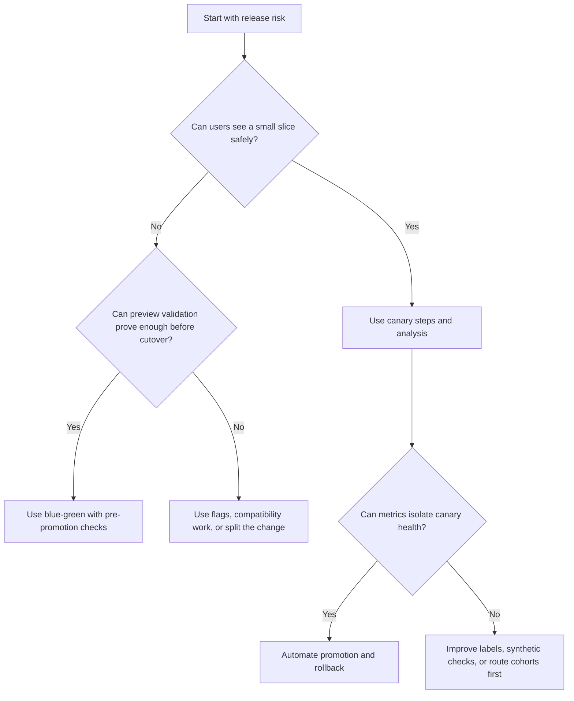

> **Discipline Module** | Complexity: `[COMPLEX]` | Time: 3 hours

## What You'll Be Able to Do

After completing this module, you will be able to:

- **Implement Argo Rollouts for canary and blue-green deployments with automated analysis**
- **Configure analysis templates that evaluate metrics during progressive delivery rollouts**
- **Design rollback strategies that automatically revert failed deployments based on SLO violations**
- **Build promotion workflows that integrate Argo Rollouts with existing CI/CD pipelines**

## Why This Module Matters

Hypothetical scenario: a checkout API runs ten replicas behind a Service, and a new version passes readiness probes because it can answer `/healthz` even though one payment path now returns slow, misleading success responses. A standard Kubernetes `Deployment` can replace old Pods gradually, but it does not know that one business operation is degraded, it does not ask Prometheus whether the canary is violating an SLO, and it does not pause at a small traffic slice until a human or controller approves the next step. The Deployment controller is excellent at converging ReplicaSets; it is not a progressive-delivery decision engine.

That distinction is the reason this module exists. Progressive delivery is not simply "roll out slowly"; it is a feedback control loop that changes production exposure only when evidence says the new version is healthy enough for the next blast-radius increase. The durable practice is older and broader than any one tool: define a safe exposure path, observe the right signals, decide before the blast radius grows, and make the rollback path faster than the incident path. Argo Rollouts is the worked example because its `Rollout`, `AnalysisTemplate`, and `AnalysisRun` resources make that loop visible inside Kubernetes objects.

This module assumes you already understand basic canary ideas from [Module 1.1: Release Strategies](../module-1.1-release-strategies/), Prometheus query basics, Kubernetes Services, and how an ingress controller or service mesh can split traffic. The focus here is the "why" behind the controller: when a rollout becomes a production risk decision, the platform needs more than a CI job that applies YAML. It needs a reconciler that can own rollout state, run analysis at the right time, preserve a stable version, and expose clear operations commands when people must intervene.

The important mental shift is that release automation should not ask, "Did the deployment command finish?" It should ask, "Is this version earning more exposure according to the reliability contract of this service?" When that contract is expressed as SLO-aligned metrics and tied to controller behavior, promotion becomes repeatable, rollback becomes rehearsable, and the release process stops depending on whoever happens to be watching a dashboard at the right moment.

## Why a Rollout Controller Exists

The stock Kubernetes Deployment controller solves a different problem from progressive delivery. A Deployment observes a desired Pod template, creates a new ReplicaSet when that template changes, and shifts replicas from the old ReplicaSet to the new one according to `RollingUpdate` or `Recreate` behavior. That is the right abstraction for many services because Kubernetes can make sure the desired number of Pods is available without forcing every team to manage ReplicaSets by hand. The controller's core job is convergence, not risk evaluation.

Progressive delivery adds decisions that do not fit naturally into a Deployment. You may want five percent of user traffic to reach the new version while the canary has only one Pod. You may want the rollout to pause indefinitely until an operator approves promotion after a database migration check. You may want Prometheus, Datadog, CloudWatch, a Kubernetes Job, or another provider to report whether error rate, latency, saturation, and business success metrics are still inside safe bounds. Those are not merely replica-count changes; they are policy decisions about production exposure.

Argo Rollouts introduces a `Rollout` custom resource that replaces a Deployment for services that need those decisions. The Rollout still manages ReplicaSets, selectors, Pod templates, and replica counts, so it remains familiar to Kubernetes operators. The difference is that its strategy can describe canary and blue-green behavior directly: pause steps, traffic weights, analysis runs, preview services, active services, and rollback behavior become part of the desired state. The controller then reconciles both workload state and rollout state.

Imagine the Rollout controller as a release airlock between "a new container image exists" and "all users depend on it." A Deployment opens the door as soon as readiness allows the next batch of Pods to become available. A progressive-delivery controller opens one chamber at a time, measures pressure before the next door unlocks, and returns everyone to the safe side if the pressure moves outside the expected range. The analogy is imperfect, but it captures the purpose: progressive delivery is controlled exposure, not slower deployment theater.

In Flagger, the equivalent idea appears through a different ownership model. Flagger usually watches an existing `Deployment` referenced by a `Canary` custom resource, then creates or adjusts routing objects and runs metric checks around that workload. Argo Rollouts usually makes the Rollout itself the workload controller. Both approaches can implement metric-gated progressive delivery, but the operational surface differs: Argo asks teams to replace a Deployment with a Rollout, while Flagger often lets teams keep Deployment as the primary workload object and attach progressive-delivery orchestration beside it.

> **Landscape snapshot — as of 2026-06. This changes fast; verify against vendor docs before relying on specifics.**
>
> Argo Rollouts is part of the Argo project family, and the CNCF project page lists Argo as Graduated. The Argo Rollouts documentation describes canary and blue-green strategies, analysis through multiple providers, and traffic routing through pluggable integrations such as ingress controllers, Gateway API implementations, service meshes, and SMI-compatible routing layers. Flagger documentation describes a `Canary` resource that orchestrates progressive delivery around workloads such as Deployments while integrating with service meshes, ingress controllers, Prometheus-style metrics, and other providers. Treat provider names, exact feature sets, and maturity statements as volatile; the durable point is that both controllers connect workload rollout state, traffic routing, and metric evaluation.

| Durable capability | Argo Rollouts worked example | Equivalent in Flagger |
|---|---|---|
| Workload ownership | `Rollout` replaces `Deployment` for the release-managed workload | `Canary` references a target workload such as a `Deployment` |
| Traffic progression | Canary steps use `setWeight`, pauses, and traffic-routing integrations | Canary analysis defines progression intervals, thresholds, and routing updates |
| Metric gate | `AnalysisTemplate` creates `AnalysisRun` instances during rollout | Metric templates and providers evaluate canary health during analysis |
| Blue-green release | `activeService`, `previewService`, promotion, and scale-down delay | Blue-green style behavior is modeled through provider-specific routing and promotion patterns |
| GitOps fit | The desired Rollout and templates live in Git; operators use CLI actions for promotion or abort | The desired workload, Canary, and provider resources live in Git; controller reconciles the delivery loop |

## Progressive Delivery as a Control Loop

A useful rollout design starts with the control loop, not the tool syntax. First, the platform constrains exposure by deciding how much production traffic the new version may receive at each stage. Second, the platform observes signals that represent user harm, service health, and resource pressure. Third, it compares those signals with explicit success and failure conditions. Finally, it either increases exposure, pauses for human judgment, or aborts and returns traffic to the stable version. Argo Rollouts implements that loop with Rollout steps and AnalysisRuns, but the loop itself is the durable practice.

The exposure path should match the service's risk profile. A stateless internal API with strong automated tests might move from a small canary slice to a medium slice and then to full traffic in minutes. A payment path, authentication service, control-plane component, or state-changing worker often needs smaller steps, longer pauses, and more conservative failure conditions. The point is not to copy one universal weight sequence. The point is to make each step large enough to produce meaningful signal and small enough that rollback remains a business event rather than an incident.

The observation layer should include more than the easiest HTTP metric. Error rate is necessary, but it is rarely sufficient. Latency percentiles, saturation, restarts, OOM kills, queue lag, dependency failures, and domain-specific success ratios can all reveal different failure modes. If the service has an SLO, the rollout analysis should connect to the same reasoning you learned in the SRE material on [SLOs](../../core-platform/sre/module-1.2-slos/) and [error budgets](../../core-platform/sre/module-1.3-error-budgets/). A canary gate that ignores the service's reliability promise is only a prettier health check.

The decision layer is where progressive delivery becomes concrete. A controller should know what "good enough to continue" means, what "bad enough to abort" means, and how much uncertainty is acceptable before it waits longer. That is why Argo AnalysisTemplates contain success conditions, failure conditions, intervals, counts, and failure limits. Those fields force the release engineer to turn vague dashboard-watching instincts into an executable policy. The quality of that policy determines whether automation protects users or merely automates false confidence.

The rollback layer needs the same design care as the promotion layer. A rollback that relies on a tired operator reading a runbook after an alert fires is still manual incident response. A controller-managed abort can scale down the canary ReplicaSet, route traffic back to the stable ReplicaSet, and mark the Rollout as degraded while the failure is still small. That fast mechanical action does not replace diagnosis; it buys time for diagnosis by removing the new version from the user path.

## Canary Rollouts with Explicit Steps

In Argo Rollouts, a canary strategy is written as a sequence of steps. `setWeight` changes the desired canary traffic weight, `pause` waits either for a duration or for manual promotion, and `analysis` runs an AnalysisTemplate before the controller proceeds. This turns release intent into state that the controller can reconcile. Instead of a CI pipeline sleeping for a fixed time and hoping nothing went wrong, the Rollout object declares the exposure plan and the conditions that govern movement through that plan.

The simplest canary uses replica-based splitting. If a Rollout has ten replicas and no traffic-routing integration, a twenty percent weight can be approximated by running two canary Pods and eight stable Pods behind the same Service. That is useful for development, internal systems, and low-risk services, but it has a precision limit: traffic share is tied to replica count and kube-proxy or load-balancer behavior. With a small replica count, one canary Pod can represent a large slice of traffic even when you ask for a cautious beginning.

Traffic routing separates exposure from replica math. When Argo Rollouts integrates with an ingress controller, Gateway API implementation, service mesh, or SMI-compatible routing layer, the controller can adjust routing objects so five percent of requests reach the canary even if the canary and stable ReplicaSets have different Pod counts. The exact fields differ by provider, which is why provider details belong in a dated snapshot. The durable idea is that progressive delivery needs a traffic control plane when replica counts are not precise enough.

Manual pauses and timed pauses serve different purposes. A timed pause gives the service enough time to produce measurements, warm caches, run through expected background jobs, or receive representative traffic. A manual pause creates a deliberate approval point for migrations, stakeholder checks, or risky releases where human judgment remains necessary. The anti-pattern is pretending that every pause is safety. A pause without the right signals merely delays risk; a pause connected to analysis and a clear promotion rule reduces risk.

Here is a minimal Rollout that demonstrates the step structure with an official demo image. It is intentionally small so the release mechanics are visible before you add provider-specific routing or production analysis. In a real service, you would add traffic routing when replica-based splitting is too coarse and you would attach analysis steps that query production-quality metrics.

```yaml
apiVersion: argoproj.io/v1alpha1
kind: Rollout
metadata:
  name: rollouts-demo
spec:
  replicas: 5
  revisionHistoryLimit: 3
  selector:
    matchLabels:
      app: rollouts-demo
  template:
    metadata:
      labels:
        app: rollouts-demo
    spec:
      containers:
        - name: rollouts-demo
          image: argoproj/rollouts-demo:blue
          ports:
            - name: http
              containerPort: 8080
  strategy:
    canary:
      steps:
        - setWeight: 20
        - pause:
            duration: 2m
        - setWeight: 50
        - pause: {}
        - setWeight: 100
---
apiVersion: v1
kind: Service
metadata:
  name: rollouts-demo
spec:
  selector:
    app: rollouts-demo
  ports:
    - name: http
      port: 80
      targetPort: 8080
```

Notice that this YAML does not ask CI to remember rollout state. The state lives in Kubernetes, where the controller can observe it, show it through status, and resume after temporary controller restarts. That is a major operational advantage over scripts that patch Deployments and sleep in a pipeline runner. A pipeline runner can be the trigger, but the cluster controller should own the long-running release state.

## Traffic Management and Blast Radius

Traffic management is the difference between "some new Pods exist" and "a controlled share of user requests reaches those Pods." Without a routing integration, Argo Rollouts can only influence traffic indirectly through how many stable and canary Pods are available behind a Service. With a routing integration, Argo can update the routing layer so a requested percentage, header match, or route rule sends traffic to the canary Service while the stable Service remains the default. This matters whenever the first safe canary slice is smaller than one Pod out of the total replica count.

The stable and canary Services are not two separate applications. They are routing handles that the Rollouts controller can point at different ReplicaSets by managing selectors. The stable Service represents the known-good version, and the canary Service represents the version under evaluation. Traffic providers then split requests between those Services or between provider-specific subsets. This keeps the exposure decision outside the application code and lets the platform enforce rollout policy consistently across teams.

Provider pluggability is useful, but it is also a source of fragile curriculum content. NGINX Ingress, ALB, Gateway API implementations, Istio, Traefik, SMI, and other integrations have different configuration surfaces, release cadences, and support details. Do not memorize a provider list as if it were the core skill. Learn the capability boundary: the Rollout controller decides the desired traffic weight, and the traffic provider applies that decision to real request routing. When provider support changes, that boundary remains the same.

Header-based routing is a special case worth understanding because it changes who receives the canary, not just how many requests do. A team might route internal testers, synthetic traffic, or a partner tenant to the canary before exposing a percentage of ordinary users. That pattern is helpful when correctness depends on workflows that public traffic may not exercise early. It is not a replacement for percentage canaries, because testers rarely represent the full shape of production load, but it can catch obvious problems before the broader canary begins.

Blast radius should be designed in user-impact terms, not only in percent terms. Five percent of global read traffic might be safe for a content service and risky for an endpoint that handles a small number of high-value transactions. A rollout serving one large enterprise tenant might create a larger business blast radius than a rollout serving many tiny anonymous requests. The controller can enforce weights, but release engineers must choose weights and route matches that reflect the real consequences of failure.

The equivalent in Flagger is conceptually similar: Flagger updates provider-specific routing resources as the canary progresses, while the `Canary` resource describes intervals, thresholds, and routing behavior around a target workload. The operational decision remains the same regardless of controller. Decide whether your platform wants the release controller to own the workload object directly, as Argo Rollouts does with `Rollout`, or orchestrate around existing workload objects, as Flagger commonly does with a referenced Deployment.

## AnalysisTemplates and Metric-Driven Promotion

AnalysisTemplates are the heart of progressive delivery in Argo Rollouts because they turn "watch the dashboard" into executable policy. A template defines metrics, providers, arguments, intervals, success conditions, failure conditions, and limits. When a Rollout reaches an analysis step, the controller creates an AnalysisRun from the template. The AnalysisRun is the live execution record: it queries the provider, stores measurements, evaluates conditions, and reports success, failure, inconclusive, or error states back to the Rollout.

That separation matters operationally. A template is reusable policy, while a run is evidence from one release attempt. If a canary fails, the AnalysisRun gives reviewers concrete measurement history instead of a vague memory that "latency looked bad." If a canary passes, the run documents what was checked and when. This makes progressive delivery auditable, and it also makes it easier to improve the gate after a near miss because the team can compare the failure mode with the exact metrics that were or were not evaluated.

Prometheus is a clear worked example because PromQL makes the metric decision visible in the manifest. The same mental model applies to other providers: query a signal, evaluate a condition, and decide whether the rollout can continue. The query must be tested in the observability system before it is trusted in a Rollout. A syntactically valid query that returns an empty vector, mixes units, hides missing data, or aggregates stable and canary traffic together can make a bad release look safe.

The example below uses `vector(1)` so the manifest is copy-runnable against any reachable Prometheus server for a smoke test of the analysis path. It is not a production health gate. Replace the query with a service-specific SLO signal only after you have verified that the query returns the expected shape and value in Prometheus for both stable and canary traffic.

```yaml
apiVersion: argoproj.io/v1alpha1
kind: AnalysisTemplate
metadata:
  name: prometheus-analysis-smoke-test
spec:
  metrics:
    - name: prometheus-reachable
      interval: 30s
      count: 3
      successCondition: result[0] == 1
      failureCondition: result[0] != 1
      failureLimit: 0
      provider:
        prometheus:
          address: http://prometheus.monitoring.svc.cluster.local:9090
          query: vector(1)
```

For a real service, the query should answer a release question, not merely a monitoring question. "Are Pods up?" is weaker than "Is the canary preserving the service's request success SLO?" "Is CPU below a limit?" is weaker than "Is saturation rising in a way that will exhaust the error budget if this version reaches full traffic?" A mature AnalysisTemplate usually combines application health, user-facing latency, resource saturation, and at least one business or workflow metric that detects silent success failures.

The exact success and failure conditions deserve careful thought. A success condition states when the controller has enough evidence to proceed. A failure condition states when the controller should stop waiting and protect users. `failureLimit` controls how many failed measurements are tolerated, while `count` and `interval` control how much time and evidence the analysis needs. Tight limits catch failures quickly but can abort on noisy metrics; loose limits reduce false aborts but increase the time users spend on a bad canary.

Metric windows should be longer than the shortest traffic bursts but short enough to react before the blast radius grows. A one-minute rate over a low-volume service may be mostly noise. A long window may hide a sudden regression because old stable traffic dilutes the new canary signal. For low-traffic services, synthetic checks, header-routed test traffic, or business workflow probes may provide better evidence than waiting for random users to exercise the canary. The analysis design should fit the traffic shape of the service.

Background analysis and inline analysis answer different needs. Background analysis runs across multiple rollout steps and can stop the rollout if health degrades between pauses. Inline analysis runs at a particular step and blocks the next step until it completes. A strong rollout often uses both: background analysis for continuous SLO protection and inline analysis for step-specific checks such as smoke tests, migration validation, or a synthetic workflow that should run after the canary first receives traffic.

## Designing Rollback Around SLOs

Rollback design should begin with the user promise. If a service has an SLO for successful requests, latency, freshness, or workflow completion, the rollout gate should be tied to that promise. Otherwise, the team can accidentally optimize for healthy infrastructure while violating the experience users actually rely on. A canary that returns `200 OK` while failing to persist a checkout, enqueue a job, or update a search index is still a failed release even if HTTP error rate is green.

Hypothetical scenario: a payment team releases a new validation path that silently rejects one rare transaction shape while returning success to the caller. The HTTP error-rate gate passes, latency stays inside bounds, and CPU usage looks normal. The canary promotes because the analysis only measures transport health. A better gate also measures the ratio of accepted payments to completed ledger writes, or a synthetic transaction that exercises the edge case before broad promotion. The lesson is not that payment systems are special; the lesson is that every domain has failure modes below HTTP.

Automatic rollback should be faster than human diagnosis because the controller is not trying to explain the bug. It is only trying to remove the new version from the user path when the evidence crosses a failure condition. After the abort, people can inspect the AnalysisRun, Rollout events, application logs, traces, and dashboards. Separating immediate protection from root-cause investigation reduces pressure on responders and prevents the common failure where a team spends too long debating whether the graph is "really bad enough" while the blast radius grows.

Not every breach should trigger the same action. A hard failure in a critical business metric may deserve `failureLimit: 0`, because one bad measurement is enough to stop the release. A noisy latency percentile might allow one failed measurement before aborting, especially if the service has bursty traffic. An inconclusive result may call for a longer pause rather than an immediate rollback. Good rollout policy encodes the difference between "unsafe," "uncertain," and "safe enough to continue."

Rollback also depends on traffic-provider correctness. If the Rollout controller believes it has returned traffic to stable but the ingress, service mesh, or gateway rule still points some users at canary, the rollback is incomplete. For that reason, production rollout readiness should include provider-specific smoke tests and observability that shows actual request distribution, not just the desired weight in the Rollout status. The controller's state is necessary evidence, but the real goal is traffic safety.

Stateful workloads need extra caution because rolling back Pods may not roll back data shape, external side effects, or messages already emitted by the canary. A schema migration, queue consumer, or controller that mutates shared resources can create irreversible effects before metrics fail. For those systems, progressive delivery must be paired with backward-compatible migrations, feature flags, dual-read or dual-write strategies, and explicit rollback rehearsals. Argo Rollouts can manage exposure, but it cannot make irreversible application behavior reversible by itself.

## Blue-Green Rollouts

Canary is not the only progressive-delivery pattern Argo Rollouts supports. Blue-green delivery keeps a stable version serving production traffic while a preview version is created and validated behind a separate Service. In Argo Rollouts, the `activeService` points to the production version, and the `previewService` points to the version being prepared. Promotion switches the active Service to the preview version when the release is ready. This pattern is attractive when a team wants production-like validation before user exposure, or when the traffic switch should be abrupt after a controlled preflight.

The strength of blue-green is its clean separation between preview and active traffic. You can run smoke tests, execute pre-promotion analysis, inspect the preview version, and keep users on the stable version until promotion. The weakness is that it can hide problems that require real production traffic shape. A preview service may pass synthetic tests and still fail under real concurrency, tenant mix, cache behavior, or dependency load. Blue-green reduces cutover uncertainty, but it does not eliminate the need for post-promotion observation.

Argo Rollouts adds fields that make blue-green operations explicit. `activeService` identifies the Service receiving production traffic, `previewService` identifies the Service for the new version, `autoPromotionEnabled` controls whether promotion happens automatically, `prePromotionAnalysis` can block promotion until metrics or jobs pass, and `scaleDownDelaySeconds` can keep the previous ReplicaSet available briefly after promotion. The delay is useful because traffic providers and clients may need time to converge after the Service selector changes.

Here is a compact blue-green Rollout using the same official demo image. The Services are separate because the controller updates their selectors as promotion state changes. The preview Service gives you a stable endpoint for checks before the active Service is moved.

```yaml
apiVersion: argoproj.io/v1alpha1
kind: Rollout
metadata:
  name: rollouts-demo-bluegreen
spec:
  replicas: 3
  revisionHistoryLimit: 3
  selector:
    matchLabels:
      app: rollouts-demo-bluegreen
  template:
    metadata:
      labels:
        app: rollouts-demo-bluegreen
    spec:
      containers:
        - name: rollouts-demo
          image: argoproj/rollouts-demo:blue
          ports:
            - name: http
              containerPort: 8080
  strategy:
    blueGreen:
      activeService: rollouts-demo-active
      previewService: rollouts-demo-preview
      autoPromotionEnabled: false
      scaleDownDelaySeconds: 30
---
apiVersion: v1
kind: Service
metadata:
  name: rollouts-demo-active
spec:
  selector:
    app: rollouts-demo-bluegreen
  ports:
    - name: http
      port: 80
      targetPort: 8080
---
apiVersion: v1
kind: Service
metadata:
  name: rollouts-demo-preview
spec:
  selector:
    app: rollouts-demo-bluegreen
  ports:
    - name: http
      port: 80
      targetPort: 8080
```

Blue-green and canary are not competing religions. They answer different release questions. Canary asks, "Can this version earn progressively larger real-user exposure?" Blue-green asks, "Can this version be prepared and validated before a deliberate traffic switch?" Some platforms use both: blue-green for services where a clean cutover is useful, canary for high-risk user-facing paths, and feature flags when deployment should be decoupled from release behavior inside the application.

## Argo Rollouts and Flagger

It is tempting to frame Argo Rollouts versus Flagger as a winner-take-all tool comparison, but that is the wrong lesson. Both exist because native workload controllers do not provide the full progressive-delivery loop by themselves. Both connect workload state, routing state, and metric analysis. The durable decision is not "which tool is best"; it is "which ownership model and operational surface fit this platform's existing GitOps, traffic, and observability architecture?"

Argo Rollouts is a strong fit when a platform team is comfortable making `Rollout` the workload primitive for release-managed services. That gives one object a clear view of Pod template changes, canary or blue-green strategy, analysis references, pause state, promotion, and abort behavior. The tradeoff is migration work: teams must convert Deployments to Rollouts, adjust health checks and GitOps behavior, and teach operators the Rollouts CLI and status model.

Flagger is a strong fit when a platform prefers to keep standard workload objects such as Deployments and attach progressive-delivery behavior around them. Its `Canary` resource references the target workload and provider configuration, then orchestrates traffic shifting and analysis. The tradeoff is that release state is split between the workload and the Canary orchestration object. That can be exactly what a platform wants when teams already have strong Deployment conventions and the platform layer owns delivery policy.

GitOps integration looks slightly different under each model. With Argo Rollouts and Argo CD, the Rollout manifest lives in Git like any other resource, while operational actions such as promote, abort, and retry may happen through the Rollouts CLI or UI when a rollout is paused or degraded. With Flagger and Flux-family workflows, the workload, Canary, and provider resources are reconciled through GitOps controllers while Flagger handles delivery progression. In either case, the desired delivery policy belongs in version control, and emergency operations should leave an auditable trail.

The practical selection questions are boring in the best way. Which traffic providers does your platform already operate well? Which observability provider holds the metrics you trust for SLO decisions? Do application teams accept a custom workload kind, or would they rather keep Deployment? How will on-call engineers see rollout state, abort a bad release, and recover from degraded state? Which controller's failure modes can your team explain during an incident? Those questions survive vendor churn better than feature checklists.

## Operations and GitOps Integration

The Rollouts CLI exists because rollout operations are stateful and time-sensitive. Operators need to watch a rollout, inspect pause state, abort a bad release, retry after a fix, promote a paused step, and view AnalysisRuns without reconstructing state from raw Kubernetes events. The plugin keeps those operations close to `kubectl`, which matters during incidents because responders should not have to remember a separate web console workflow before they can protect users.

The most important commands are simple. `kubectl argo rollouts get rollout NAME --watch` shows progress and current step. `kubectl argo rollouts promote NAME` moves a paused rollout forward. `kubectl argo rollouts promote NAME --full` skips remaining steps and promotes fully, which should be treated as a deliberate override. `kubectl argo rollouts abort NAME` stops the rollout and returns traffic to the stable version. `kubectl argo rollouts retry NAME` retries a failed or aborted rollout after the underlying problem has been fixed.

Those commands should be embedded in runbooks with decision criteria, not memorized as magic incantations. A runbook should say when promotion is allowed, which dashboards confirm actual traffic distribution, which AnalysisRun fields matter, how to verify the active image after abort, and what evidence must be captured before retry. Progressive delivery reduces repetitive manual judgment, but it does not remove accountability for the cases where people override the controller or recover from a degraded state.

Argo CD integration deserves a careful mental model. GitOps should declare the desired Rollout, AnalysisTemplate, Services, and provider resources. The Rollouts controller then manages child ReplicaSets, analysis runs, and rollout phase transitions. If a rollout pauses, Argo CD may show the resource as progressing rather than immediately healthy, depending on health customization and extension behavior. Platform teams should make that status understandable to application teams so a healthy intentional pause is not mistaken for a broken sync.

Promotion workflow design is where release engineering meets organizational design. Some services can auto-promote if analysis passes, because the metrics are trusted and the blast radius is low. Other services require a manual pause after a specific weight because the release crosses a regulatory, tenant, data, or operations boundary. The correct workflow may involve CI opening a pull request, Argo CD syncing the Rollout, Argo Rollouts pausing at a gate, and an on-call engineer promoting after reviewing AnalysisRun evidence. That workflow should be explicit, rehearsed, and visible.

Dashboards are helpful, but they should support the control loop rather than replace it. The Argo Rollouts dashboard can visualize rollout state and actions, while observability dashboards show service health and traffic distribution. A mature platform links these views so an operator can move from a degraded Rollout to the exact AnalysisRun, Prometheus query, trace sample, and stable-versus-canary comparison. The goal is not more screens; the goal is less ambiguity when deciding whether to continue, wait, or abort.

## Failure Modes and Design Guardrails

The first failure mode is bad thresholds. A threshold copied from a dashboard without understanding traffic volume, metric units, or historical variance can either abort every release or let regressions pass. For example, a latency gate based on a p99 metric may be unstable for a low-volume service if there are too few requests in the measurement window. A success-rate gate may divide by a tiny denominator during quiet periods. Guard against this by replaying queries against historical data and by designing low-traffic fallback checks.

The second failure mode is steps that move faster than evidence can accumulate. If a rollout changes weight every few seconds while the Prometheus query uses a multi-minute rate window, the analysis will be looking at a blended past while the controller is already increasing future exposure. The measurement window, interval, pause duration, and traffic volume must be aligned. Otherwise the release appears automated but the decision is effectively blind.

The third failure mode is traffic-provider misconfiguration. A Rollout status can say the desired canary weight is small while an ingress annotation, mesh route, Gateway rule, or Service selector sends a different amount of traffic. This happens when teams forget required Services, use the wrong route name, let another controller overwrite routing resources, or fail to validate provider-specific objects. The guardrail is to observe actual request distribution from logs or metrics and to include provider checks in release readiness.

The fourth failure mode is metric scope confusion. If a Prometheus query aggregates stable and canary traffic together, a small canary regression can be hidden by the stable version's healthy traffic. If labels do not distinguish ReplicaSets, versions, routes, or Pods, the analysis may answer a question about the whole service instead of the version under test. Rollout-aware metrics should preserve enough labels to compare stable and canary behavior or to isolate the canary's contribution.

The fifth failure mode is assuming rollback is harmless for stateful behavior. A canary that writes incompatible rows, emits irreversible events, or modifies shared external state can damage production even if the controller quickly routes traffic back. Guardrails include expand-and-contract database migrations, idempotent consumers, feature flags around dangerous paths, synthetic checks before exposure, and release plans that separate schema changes from behavior changes. Progressive delivery controls traffic; it does not erase side effects.

The sixth failure mode is manual override without evidence. Promotion commands are powerful because they can move a rollout past a pause or analysis gate. They are dangerous when used to silence pressure from a delayed release instead of responding to verified health. Mature teams require a reason, a ticket or incident reference, and post-release review for manual overrides. The controller can enforce mechanics, but only the organization can enforce judgment.

## Patterns & Anti-Patterns

One strong pattern is SLO-aligned analysis. The rollout gate should use the same reliability language the service uses after deployment: request success, latency, freshness, durability, queue drain time, or workflow completion. This alignment prevents the release system from passing a version that the SRE system would immediately treat as burning error budget. It also makes release conversations clearer because teams can discuss whether the release is spending acceptable risk, not whether one dashboard looked green enough.

Another strong pattern is staged evidence. Start with cheap checks before exposure, then use small real-traffic canaries, then longer pauses or background analysis as exposure grows. This avoids wasting production blast radius on errors a pre-promotion check would have caught, while still acknowledging that only production traffic reveals some failures. Staged evidence is especially useful for services with caches, scheduled jobs, tenant-specific behavior, or dependencies that are hard to reproduce in staging.

A third strong pattern is operator-visible state. Rollout status, AnalysisRuns, traffic weights, active images, and abort history should be easy for on-call engineers to inspect. If the platform hides release state behind a CI pipeline log, responders will lose time during the exact moments when time matters. Good release engineering makes the controller's reasoning inspectable, even when the controller is making fast automatic decisions.

A common anti-pattern is dashboard theater. The team adds an automated rollout tool but still relies on a person to stare at graphs and decide whether the canary is healthy. That may be better than nothing for rare releases, but it does not scale across services, time zones, or night shifts. If the release requires a human to interpret routine metrics every time, the policy has not yet been encoded.

A second anti-pattern is provider-driven design. The team starts with the ingress controller or mesh feature list and builds the rollout around whatever is easiest to configure. That reverses the decision order. The rollout should begin with blast radius, SLO risk, metric evidence, and rollback behavior; provider configuration should implement those decisions. Tool capabilities matter, but they should not decide the reliability policy by accident.

A third anti-pattern is skipping rollback rehearsals. Many teams test the happy path because it is visible in demos, then discover during an incident that abort permissions, provider updates, dashboards, or runbook steps are broken. Progressive delivery is only trustworthy if the failed canary path is tested deliberately. A safe platform regularly proves that it can abort, recover, and retry without improvisation.

| Decision question | Choose canary when... | Choose blue-green when... | Add feature flags when... |
|---|---|---|---|
| Exposure shape | You need gradual real-user evidence before full release | You need a prepared version and deliberate traffic switch | You need runtime control after deployment |
| Metric confidence | You can isolate canary signals and evaluate them over time | You can validate before promotion and observe after cutover | You need user, tenant, or cohort-level behavior control |
| Rollback complexity | Traffic rollback is enough for the main risk | Previous version can remain ready during cutover | Behavior rollback must happen without redeploying |
| Operational model | Operators can watch steps and AnalysisRuns | Operators can validate preview and promote intentionally | Product or operations teams need kill switches |


```mermaid
flowchart TD
    A["Start with release risk"] --> B{"Can users see a small slice safely?"}
    B -->|Yes| C["Use canary steps and analysis"]
    B -->|No| D{"Can preview validation prove enough before cutover?"}
    D -->|Yes| E["Use blue-green with pre-promotion checks"]
    D -->|No| F["Use flags, compatibility work, or split the change"]
    C --> G{"Can metrics isolate canary health?"}
    G -->|Yes| H["Automate promotion and rollback"]
    G -->|No| I["Improve labels, synthetic checks, or route cohorts first"]
```

## Did You Know?

1. **Argo Rollouts is part of the broader Argo project family**: CNCF tracks Argo as a Graduated project, while the Rollouts docs describe Rollouts as the controller for progressive delivery strategies inside that family.
2. **AnalysisTemplates are reusable definitions, not live checks by themselves**: the controller creates AnalysisRuns from templates when a Rollout reaches the relevant analysis step.
3. **Blue-green promotion can be manual**: a Rollout can hold a preview version behind a preview Service until an operator or workflow promotes it to the active Service.
4. **Flagger and Argo Rollouts can teach the same practice through different APIs**: one commonly orchestrates around Deployments with a Canary resource, while the other commonly makes Rollout the workload resource.

## Common Mistakes

| Mistake | Problem | Solution |
|---|---|---|
| Measuring only HTTP error rate | Silent business failures and latency regressions can pass the gate | Combine error rate, latency, saturation, and domain success metrics |
| Aggregating stable and canary metrics together | Stable traffic can hide a bad canary signal | Preserve labels that identify version, ReplicaSet, route, or canary traffic |
| Moving steps faster than metrics can react | The controller increases exposure before evidence is meaningful | Align pause duration, query window, interval, and traffic volume |
| Treating provider status as proof of safety | Desired weights may not match actual request distribution | Verify real traffic split through logs, metrics, or provider observability |
| Using manual pauses without decision criteria | Operators guess whether to promote and decisions vary by person | Write promotion criteria and required evidence into the runbook |
| Ignoring stateful side effects | Rollback cannot undo incompatible writes or emitted events | Use backward-compatible migrations, flags, idempotency, and staged changes |
| Letting CI own long-running rollout state | Pipeline sleeps and timeouts become release-control mechanisms | Let the Rollouts controller own rollout state inside Kubernetes |
| Never testing abort and retry | The failure path breaks during the first real incident | Rehearse abort, degraded-state inspection, retry, and full recovery |

## Quiz

### Question 1

Scenario: A team replaces a Deployment with a Rollout and configures canary steps at twenty percent, fifty percent, and full traffic. The rollout pauses after the first step even though all Pods are Ready. Why is this pause useful, and what controller behavior makes it safer than a CI script that sleeps for two minutes?

<details>
<summary>Answer</summary>

The pause is useful because progressive delivery needs time to collect evidence before increasing blast radius. Argo Rollouts stores that state in the Rollout object, so the controller can reconcile it, show it in status, and resume or abort based on the declared strategy rather than a pipeline runner's memory. This is part of how you **implement Argo Rollouts for canary and blue-green deployments with automated analysis**: the cluster controller owns the release state while CI only triggers the desired change. A sleep in CI can delay the next command, but it cannot by itself evaluate rollout state, create AnalysisRuns, or preserve a clear Kubernetes audit trail.

</details>

### Question 2

Scenario: Your service has four replicas, but the first safe canary slice is only five percent of user traffic. You configure `setWeight: 5` without any ingress, Gateway API, SMI, or service-mesh traffic provider. Why might actual exposure be much larger than the desired weight, and what should the platform add?

<details>
<summary>Answer</summary>

Without a traffic-routing integration, the controller can only approximate traffic by changing the number of stable and canary Pods behind a Service. With four replicas, one canary Pod can represent a large share of requests, so the actual exposure may not match a five percent intent. The platform should add a supported traffic provider that can split requests independently from replica count. The same reasoning applies if you use Flagger: the controller needs a routing layer capable of enforcing the desired blast radius.

</details>

### Question 3

Scenario: An AnalysisTemplate query checks that `vector(1)` returns one, and the rollout passes every time. The team wants to use this as the production promotion gate because it proves Prometheus is reachable. What is wrong with this analysis design?

<details>
<summary>Answer</summary>

The smoke query proves only that the analysis path can talk to Prometheus and evaluate a simple result. It does not measure user-facing health, latency, saturation, or business correctness for the canary version. To **configure analysis templates that evaluate metrics during progressive delivery rollouts**, the query must be replaced with service-specific SLO and domain signals that distinguish stable from canary behavior. A reachability check is useful during setup, but it is not a release safety gate.

</details>

### Question 4

Scenario: A canary starts returning successful HTTP responses while failing to write completed orders to the ledger. Error rate, CPU, and Pod readiness stay green, so the rollout promotes. Which category of metric was missing, and how should the next AnalysisTemplate change?

<details>
<summary>Answer</summary>

The missing category was a domain or business correctness metric. The gate measured transport and infrastructure health, but it did not measure whether the workflow completed the operation users depend on. The next AnalysisTemplate should include a ratio or synthetic check that compares accepted orders with durable ledger writes, or another service-specific signal that detects the silent failure. This keeps the rollout aligned with the service's SLO and business contract rather than only the container's health.

</details>

### Question 5

Scenario: A rollout's latency analysis fails at fifty percent traffic. The controller aborts, the stable version receives traffic again, and the Rollout status becomes degraded. What should operators inspect before retrying, and why is immediate retry risky?

<details>
<summary>Answer</summary>

Operators should inspect the failed AnalysisRun, the exact measurements, application logs, traces, and actual traffic distribution before retrying. Immediate retry is risky because it may reintroduce the same latency regression without changing the code, configuration, or threshold that caused the failure. A good rollback strategy is designed to **automatically revert failed deployments based on SLO violations**, but retry remains a human or workflow decision that needs evidence. The degraded state is a protective stop, not an inconvenience to clear as quickly as possible.

</details>

### Question 6

Scenario: A service needs a preview version to be reachable for synthetic checks before any user traffic moves, and promotion must be approved manually after those checks pass. Which Argo Rollouts strategy fits best, and which fields make the pattern work?

<details>
<summary>Answer</summary>

Blue-green fits this requirement because it separates the active production Service from the preview Service. In Argo Rollouts, `activeService` points at the version serving users, `previewService` points at the version under validation, and `autoPromotionEnabled: false` creates a manual promotion point. Pre-promotion analysis can run checks before the active Service switches. Canary could still be useful later, but blue-green directly models "prepare, validate, then promote."

</details>

### Question 7

Scenario: Your organization uses Argo CD for GitOps, and a Rollout pauses at a manual gate after syncing from Git. A teammate wants the CI pipeline to run `kubectl argo rollouts promote` automatically whenever the sync finishes. What workflow design question should you answer first?

<details>
<summary>Answer</summary>

You should first decide what evidence is required before promotion and who or what is authorized to make that decision. To **build promotion workflows that integrate Argo Rollouts with existing CI/CD pipelines**, CI should not blindly skip the same gate that was added to control risk. The workflow might allow auto-promotion when AnalysisRuns pass for low-risk services, but require human approval and dashboard evidence for sensitive systems. GitOps declares the desired rollout policy, while operational commands should respect the policy's intent.

</details>

## Hands-On

This exercise keeps the lab focused on controller behavior and manifest correctness. It uses the official `argoproj/rollouts-demo` image, installs the Rollouts controller, creates a canary Rollout, watches a pause, promotes it, and then validates a Prometheus AnalysisTemplate smoke check. For a production service, replace the smoke query with SLO-aligned queries that you have verified directly in Prometheus.

Create a local cluster and install the controller first, because every later command depends on the Rollouts CRDs and controller deployment being available:

```bash
kind create cluster --name argo-rollouts-lab
kubectl create namespace argo-rollouts
kubectl apply -n argo-rollouts -f https://github.com/argoproj/argo-rollouts/releases/latest/download/install.yaml
kubectl -n argo-rollouts rollout status deployment argo-rollouts
```

Install the kubectl plugin using the method from the Argo Rollouts documentation for your workstation. On macOS with Homebrew, the command is:

```bash
brew install argoproj/tap/kubectl-argo-rollouts
kubectl argo rollouts version
```

Save the canary Rollout and Service from the earlier canary example to `rollouts-demo.yaml`, then apply it and watch the initial stable state:

```bash
kubectl apply -f rollouts-demo.yaml
kubectl argo rollouts get rollout rollouts-demo --watch
```

Trigger a canary by changing the image from the blue demo version to the yellow demo version, then watch the controller enter the canary steps:

```bash
kubectl argo rollouts set image rollouts-demo rollouts-demo=argoproj/rollouts-demo:yellow
kubectl argo rollouts get rollout rollouts-demo --watch
```

When the rollout reaches the indefinite pause, promote it deliberately and then confirm the final healthy state before moving on to failure handling:

```bash
kubectl argo rollouts promote rollouts-demo
kubectl argo rollouts get rollout rollouts-demo
```

Save the Prometheus smoke AnalysisTemplate from the analysis section as `prometheus-analysis-smoke-test.yaml` only if your cluster has a Service named `prometheus` in the `monitoring` namespace. If your lab does not have Prometheus installed, keep this as a manifest validation exercise and do not attach it to the live Rollout.

```bash
kubectl apply -f prometheus-analysis-smoke-test.yaml
kubectl get analysistemplate prometheus-analysis-smoke-test
```

Practice the failure operation on the demo rollout by aborting a canary after triggering another image change, then inspect the degraded state:

```bash
kubectl argo rollouts set image rollouts-demo rollouts-demo=argoproj/rollouts-demo:red
kubectl argo rollouts abort rollouts-demo
kubectl argo rollouts get rollout rollouts-demo
```

Clean up the local cluster when you are finished so the Rollouts controller, demo workload, and temporary resources do not remain running:

```bash
kind delete cluster --name argo-rollouts-lab
```

Use these success criteria to confirm that you exercised the control loop rather than merely applying manifests to a test cluster:

- [ ] The Argo Rollouts controller reaches a ready state in the `argo-rollouts` namespace.
- [ ] The `rollouts-demo` Rollout progresses through at least one canary pause that you can explain.
- [ ] You manually promote a paused rollout and can identify the stable and canary images in status output.
- [ ] You apply or validate an AnalysisTemplate and can explain why `vector(1)` is only a smoke check.
- [ ] You abort a rollout, inspect degraded status, and explain what evidence you would review before retrying.
- [ ] You can state when this lab would need a traffic-routing provider instead of replica-based splitting.

## Sources

- [Argo Rollouts documentation](https://argoproj.github.io/argo-rollouts/)
- [Argo Rollouts canary strategy](https://argoproj.github.io/argo-rollouts/features/canary/)
- [Argo Rollouts blue-green strategy](https://argoproj.github.io/argo-rollouts/features/bluegreen/)
- [Argo Rollouts analysis feature](https://argoproj.github.io/argo-rollouts/features/analysis/)
- [Argo Rollouts traffic management](https://argoproj.github.io/argo-rollouts/features/traffic-management/)
- [Argo Rollouts NGINX traffic routing](https://argoproj.github.io/argo-rollouts/features/traffic-management/nginx/)
- [Argo Rollouts Prometheus analysis provider](https://argoproj.github.io/argo-rollouts/analysis/prometheus/)
- [Argo Rollouts kubectl plugin command reference](https://argoproj.github.io/argo-rollouts/generated/kubectl-argo-rollouts/kubectl-argo-rollouts/)
- [Argo Rollouts dashboard documentation](https://argoproj.github.io/argo-rollouts/dashboard/)
- [CNCF Argo project page](https://www.cncf.io/projects/argo/)
- [Flagger how it works](https://docs.flagger.app/usage/how-it-works)
- [Flagger progressive delivery concepts](https://docs.flagger.app/main/usage/deployment-strategies)
- [Prometheus querying basics](https://prometheus.io/docs/prometheus/latest/querying/basics/)
- [Kubernetes Gateway API](https://gateway-api.sigs.k8s.io/)
- [Istio VirtualService reference](https://istio.io/latest/docs/reference/config/networking/virtual-service/)
- [Argo CD resource health documentation](https://argo-cd.readthedocs.io/en/stable/operator-manual/health/)

## Next Module

Continue to [Module 1.3: Feature Management at Scale](../module-1.3-feature-flags/) to learn how to decouple deployment from release using feature flags, enabling trunk-based development and instant kill switches.
