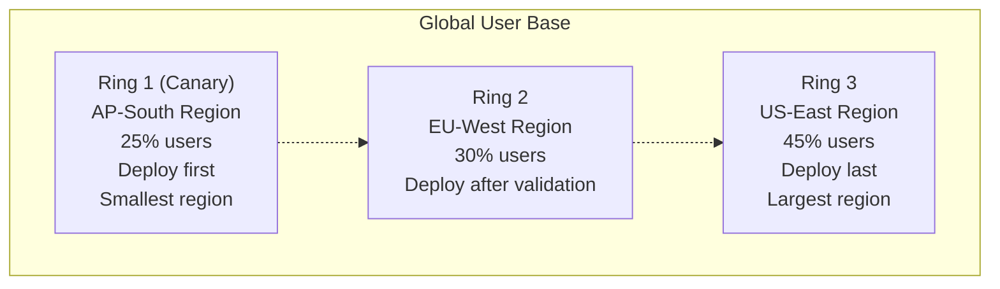
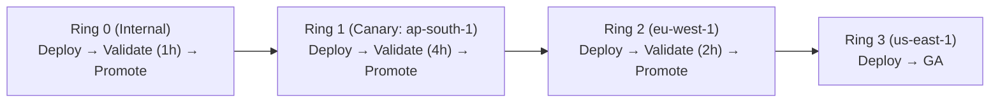
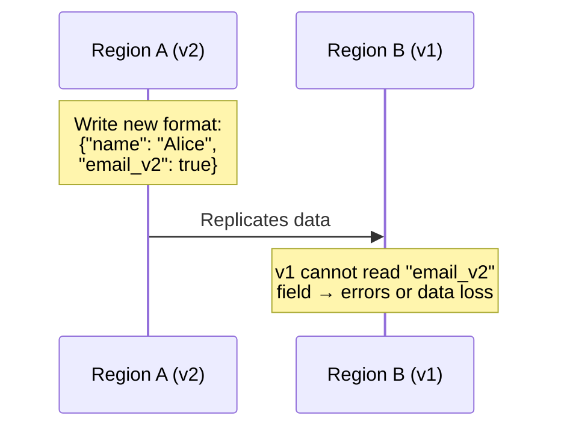
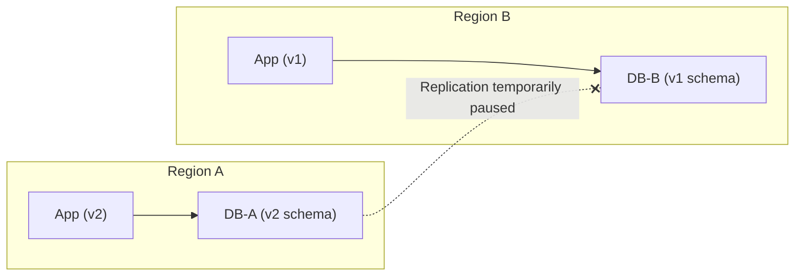
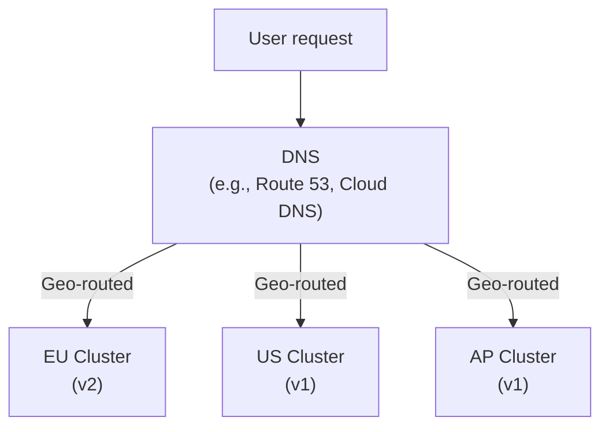
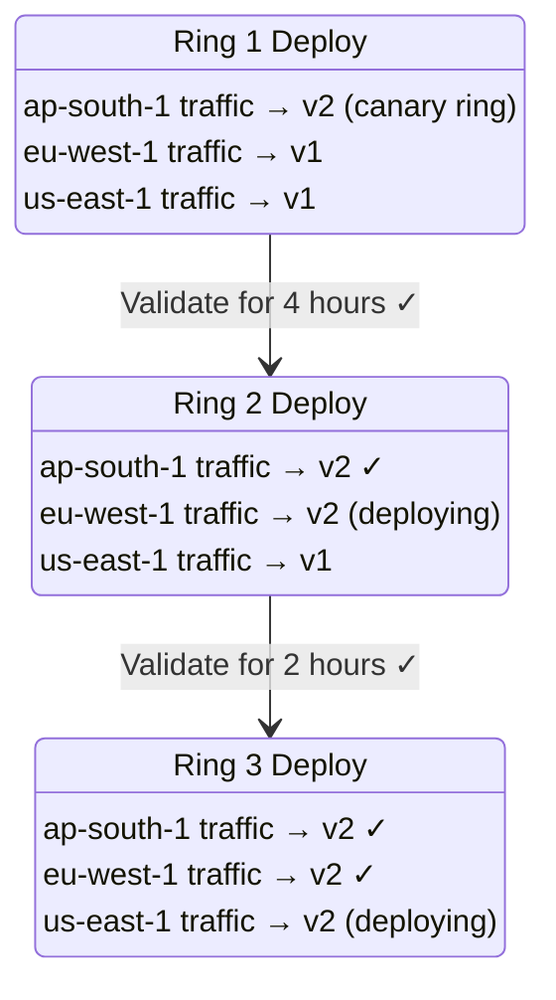
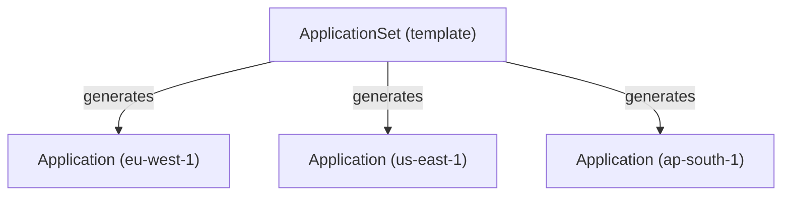

> **Discipline Module** | Complexity: `[COMPLEX]` | Time: 3 hours

## Prerequisites

Before starting this module:
- **Required**: [Module 1.2: Argo Rollouts](../module-1.2-argo-rollouts/) — Canary deployments, automated analysis, progressive delivery
- **Required**: Multi-cluster Kubernetes concepts — Understanding of running workloads across multiple clusters
- **Required**: ArgoCD basics — GitOps principles, Application CRD, sync workflows
- **Recommended**: DNS and global load balancing concepts
- **Recommended**: Understanding of data replication and eventual consistency

---

## What You'll Be Able to Do

After completing this module, you will be able to:

- **Design global release strategies that coordinate deployments across multiple regions and time zones**
- **Implement region-aware rollout policies that respect data locality and compliance requirements**
- **Build rollback procedures that handle cross-region dependencies during failed global deployments**
- **Analyze global release metrics to optimize deployment windows and minimize user impact worldwide**

## Why This Module Matters

On October 4, 2021, Facebook, Instagram, and WhatsApp went dark for six hours. The outage affected 3.5 billion users globally. The root cause was a configuration change to their backbone routers that cascaded across every region simultaneously. There was no containment. There was no staged rollout of the configuration change. One bad push propagated everywhere at once, and the blast radius was the entire planet.

This is the nightmare scenario of global releases: a change that should have been tested in one region before spreading to others instead hits everything simultaneously. And at global scale, "everything" means billions of users, hundreds of data centers, and revenue measured in millions per minute of downtime.

Multi-region release orchestration is the discipline of deploying changes across geographically distributed infrastructure in a controlled, staged manner. Instead of pushing to all clusters at once, you deploy to a canary region first, validate, then progressively roll out to additional regions. Each region acts as a blast radius boundary — if a change fails in EU-West, Asia-Pacific and US-East are unaffected.

This module teaches you how to design and implement ring deployments, manage data consistency during cross-region rollouts, orchestrate traffic shifting with global load balancers, and automate it all with ArgoCD ApplicationSets.

---

## The Geography of Failure

> **Stop and think**: In a multi-region architecture, if an in-cluster canary affects 5% of users globally across all clusters simultaneously, how is that different from affecting 100% of users in a single region that handles 5% of global traffic? Consider the underlying infrastructure, networking, and containment boundaries.

### Why Single-Region Deployments Are Not Enough

In a single cluster, a bad canary affects a percentage of your users. In a global deployment, a bad canary can affect an entire continent:

```
Single-cluster canary:
  5% of users affected if canary is bad
  Recovery: seconds (rollback canary)

Global simultaneous deploy:
  100% of users affected if release is bad
  Recovery: minutes to hours (rollback everywhere)

Ring deployment:
  ~10% of users affected (canary region only)
  Recovery: seconds (halt propagation, rollback one region)
```

### Regional Blast Radius

The core principle: **geography is a natural blast radius boundary**.



If Ring 1 fails, 70% of your users are untouched. If Ring 2 also fails, 25% of your users are still safe. Geography gives you natural isolation that no amount of in-cluster canary analysis can provide.

---

## Ring Deployment Architecture

### What Is a Ring Deployment?

A ring deployment divides your infrastructure into concentric rings, with each ring representing a larger blast radius:

```
Ring 0: Internal/Staging
  └─ Company employees, synthetic traffic
  └─ Zero user impact if it fails

Ring 1: Canary Region
  └─ Smallest production region
  └─ ~5-10% of real user traffic
  └─ Full production environment (not staging)

Ring 2: Secondary Regions
  └─ Medium-sized regions
  └─ ~30-40% of total traffic
  └─ Only deployed after Ring 1 bakes for hours

Ring 3: Primary Regions
  └─ Largest regions (US, EU)
  └─ ~50-60% of total traffic
  └─ Only deployed after Ring 2 is stable
```

### Ring Progression



### Choosing Your Canary Region

The canary region should be:

| Criterion | Why |
|-----------|-----|
| **Smallest production region** | Minimizes blast radius |
| **Representative traffic** | Must exercise the same code paths as larger regions |
| **Has monitoring** | Needs the same observability as other regions |
| **Timezone-appropriate** | Deploy during that region's business hours |
| **Recoverable** | Other regions can absorb its traffic during failover |

**Anti-patterns:**
- Choosing your busiest region as canary (defeats the purpose)
- Choosing a region with different traffic patterns (does not validate real behavior)
- Choosing a region without monitoring (blind canary)

---

## Data Replication During Rollouts

> **Pause and predict**: If you introduce a new required field to your database schema in the v2 release, what exactly will happen when the v1 application running in another region tries to write to or read from that replicated table?

### The Cross-Region Data Problem

When deploying across regions, data consistency becomes critical. If the new version writes data in a format the old version cannot read, and data replicates between regions, you have a problem:



### Safe Cross-Region Deployment Patterns

**Pattern 1: Schema-Compatible Versions Only**

Both v1 and v2 must read and write the same data format. Use the expand-contract pattern from Module 1.1:

```
Phase 1: v2 writes NEW format + OLD format (backward compatible)
Phase 2: All regions on v2 → stop writing OLD format
Phase 3: Clean up OLD format
```

**Pattern 2: Region-Isolated Data**

Each region has its own database. No cross-region replication during rollout:



After all regions are on v2, resume replication. This requires your application to tolerate temporary data divergence.

**Pattern 3: Feature-Flagged Data Paths**

The new data path is behind a feature flag that is only enabled after all regions have the new code:

```
1. Deploy v2 to all regions (new code present but flag OFF)
2. Verify all regions are on v2
3. Enable feature flag globally
4. New data path activates everywhere simultaneously
```

This is the safest approach but requires the feature flag infrastructure from Module 1.3.

### Data Migration Anti-Patterns in Multi-Region

| Anti-Pattern | Risk | Safe Alternative |
|-------------|------|-----------------|
| Running migrations in canary region only | Other regions cannot read new format | Run backward-compatible migrations everywhere first |
| Replicating during schema transition | v1 regions crash on v2 data | Pause replication or use dual-format writes |
| Assuming eventual consistency is immediate | Stale reads during rollout | Design for stale reads; use version headers |
| Different schema versions across regions for days | Operational complexity, hard to rollback | Minimize the time window; deploy schema separately from code |

---

## Global Load Balancing and Traffic Shifting

### DNS-Based Global Load Balancing

The simplest form of global traffic management uses DNS:



**Limitations of DNS-based shifting:**
- DNS TTLs mean changes take minutes to propagate
- No traffic percentage control (all-or-nothing per region)
- Client-side caching can override DNS decisions
- No health-check-driven failover at the request level

### Anycast and Global Load Balancers

Modern global load balancers (Cloudflare, AWS Global Accelerator, Google Cloud Load Balancing) use anycast and provide:

- **Per-request routing**: Every request is independently routed
- **Health-check failover**: Unhealthy regions are automatically drained
- **Traffic weights**: Send 10% to EU, 90% to US — per request, not per DNS TTL
- **Header injection**: Add region/version headers for observability

```yaml
# Example: AWS Global Accelerator traffic dial
# Shift 10% of EU traffic to test region during canary
listener:
  endpoint_groups:
    - region: eu-west-1
      weight: 90
      endpoints:
        - id: eu-west-1-prod
    - region: eu-west-2
      weight: 10
      endpoints:
        - id: eu-west-2-canary
```

### Traffic Shifting During Ring Deployment



### Emergency Regional Failover

If Ring 1 fails, shift its traffic to a healthy region:

```bash
# Before failover:
#   ap-south-1: serving AP users → v2 (BROKEN)
#   eu-west-1: serving EU users → v1 (healthy)

# Failover: drain ap-south-1, shift to eu-west-1
# (Global LB health checks can do this automatically)

# After failover:
#   ap-south-1: 0% traffic (draining)
#   eu-west-1: serving EU + AP users → v1 (healthy, higher load)
```

This is why regions should be provisioned with headroom — they need to absorb traffic from a failed region.

---

## ArgoCD ApplicationSets for Multi-Cluster Deployments

### Why ApplicationSets?

ArgoCD manages deployments to Kubernetes clusters via `Application` CRDs. For a single cluster, you create one Application. For 10 clusters, you would need 10 nearly identical Applications — tedious and error-prone.

**ApplicationSets** are a template that generates Applications dynamically:



### Basic ApplicationSet

```yaml
apiVersion: argoproj.io/v1alpha1
kind: ApplicationSet
metadata:
  name: webapp
  namespace: argocd
spec:
  generators:
    - list:
        elements:
          - cluster: eu-west-1
            url: https://eu-west-1.k8s.example.com
            ring: "1"
          - cluster: us-east-1
            url: https://us-east-1.k8s.example.com
            ring: "3"
          - cluster: ap-south-1
            url: https://ap-south-1.k8s.example.com
            ring: "2"
  template:
    metadata:
      name: 'webapp-{{cluster}}'
    spec:
      project: default
      source:
        repoURL: https://github.com/myorg/webapp
        targetRevision: HEAD
        path: 'deploy/overlays/{{cluster}}'
      destination:
        server: '{{url}}'
        namespace: webapp
      syncPolicy:
        automated:
          prune: true
          selfHeal: true
```

This generates three ArgoCD Applications — one per cluster — each deploying from a cluster-specific overlay.

### Ring Deployment with ApplicationSets

The key to ring deployments with ApplicationSets is controlling **which clusters get the new version and when**. There are several approaches:

**Approach 1: Branch/Tag per Ring**

```yaml
# Ring 1 clusters point to the release branch
# Ring 2-3 clusters point to the current stable tag
spec:
  generators:
    - list:
        elements:
          - cluster: ap-south-1
            url: https://ap-south-1.k8s.example.com
            revision: release/v2.1.0     # ← New version
          - cluster: eu-west-1
            url: https://eu-west-1.k8s.example.com
            revision: v2.0.0             # ← Current stable
          - cluster: us-east-1
            url: https://us-east-1.k8s.example.com
            revision: v2.0.0             # ← Current stable
  template:
    spec:
      source:
        targetRevision: '{{revision}}'
```

Promote Ring 2 by changing `eu-west-1`'s revision to `release/v2.1.0`. This is a Git commit — auditable, reviewable, reversible.

**Approach 2: Directory-per-Ring with Kustomize**

```
deploy/
├── base/                    # Common configuration
│   ├── deployment.yaml
│   ├── service.yaml
│   └── kustomization.yaml
├── overlays/
│   ├── ring-1/             # Canary ring
│   │   └── kustomization.yaml  (image: v2.1.0)
│   ├── ring-2/             # Secondary ring
│   │   └── kustomization.yaml  (image: v2.0.0)
│   └── ring-3/             # Primary ring
│       └── kustomization.yaml  (image: v2.0.0)
```

```yaml
spec:
  generators:
    - list:
        elements:
          - cluster: ap-south-1
            url: https://ap-south-1.k8s.example.com
            ring: ring-1
          - cluster: eu-west-1
            url: https://eu-west-1.k8s.example.com
            ring: ring-2
          - cluster: us-east-1
            url: https://us-east-1.k8s.example.com
            ring: ring-3
  template:
    spec:
      source:
        path: 'deploy/overlays/{{ring}}'
```

Promote by updating the image in `ring-2/kustomization.yaml`. Git diff shows exactly what changed.

**Approach 3: Progressive Sync with Waves**

Use ArgoCD sync waves to control deployment ordering:

```yaml
# In the Application template, add annotations
template:
  metadata:
    name: 'webapp-{{cluster}}'
    annotations:
      argocd.argoproj.io/sync-wave: '{{ring}}'
```

Sync waves execute in order: wave 1 first, then wave 2, then wave 3. Combined with manual sync gates, this creates a natural ring progression.

### Rollback with ApplicationSets

Rolling back a ring is a Git revert:

```bash
# Ring 1 failed — revert the commit that promoted it
git revert HEAD
git push

# ArgoCD detects the change and syncs Ring 1 back to v2.0.0
# Rings 2 and 3 were never promoted — no action needed
```

This is the power of GitOps: your rollback is a version-controlled, auditable operation.

---

## Observability Across Regions

### Cross-Region Metrics Comparison

During a ring deployment, you need to compare metrics between regions running different versions:

```
Dashboard: Release v2.1.0 Ring Deployment

                Ring 1 (v2.1.0)    Ring 2 (v2.0.0)    Ring 3 (v2.0.0)
                ap-south-1         eu-west-1           us-east-1
─────────────────────────────────────────────────────────────────────
Error Rate      0.3%               0.2%                0.2%
P99 Latency     145ms              120ms               130ms
CPU Usage       42%                38%                 40%
Memory          68%                65%                 64%
QPS             12,400             45,200              52,100
─────────────────────────────────────────────────────────────────────
Status          ⚠ Watch            ✓ Baseline          ✓ Baseline
```

Key metrics to compare:
- **Error rate delta**: Ring 1 vs Ring 2+3 baseline
- **Latency percentiles**: P50, P95, P99 comparison
- **Resource consumption**: Memory/CPU trends (catching leaks early)
- **Business metrics**: Conversion rate, transaction success rate per region

### Automated Ring Promotion Gates

Combine ArgoCD ApplicationSets with automated validation:

```yaml
# promotion-gate.yaml (pseudo-code for automation)
rings:
  ring-1:
    clusters: [ap-south-1]
    validation:
      - type: prometheus
        query: "error_rate{region='ap-south-1'} < 0.01"
        duration: 4h
      - type: prometheus
        query: "p99_latency{region='ap-south-1'} < 200"
        duration: 4h
    on_success: promote ring-2
    on_failure: rollback ring-1

  ring-2:
    clusters: [eu-west-1]
    validation:
      - type: prometheus
        query: "error_rate{region='eu-west-1'} < 0.01"
        duration: 2h
    on_success: promote ring-3
    on_failure: rollback ring-1, ring-2

  ring-3:
    clusters: [us-east-1]
    validation:
      - type: manual_approval
        approvers: [release-team]
```

---

## Multi-Cluster Deployment Strategies Comparison

| Strategy | Complexity | Blast Radius Control | Rollback Speed | Best For |
|----------|-----------|---------------------|----------------|----------|
| **Simultaneous** | Low | None (all at once) | Slow (rollback everywhere) | Non-critical services |
| **Sequential** | Medium | Per-region | Fast (stop propagation) | Most services |
| **Ring deployment** | High | Per-ring (grouped regions) | Fast (rollback ring) | Critical services |
| **Canary region + blast** | Medium | One region first, then all | Medium | Moderate-risk services |

---

## Did You Know?

1. **Google deploys to a single "canary cell" and waits 24 hours before any wider rollout**. Their deployment system, called Borg (the predecessor to Kubernetes), uses a concept of "cells" — isolated clusters in different geographies. A new version is deployed to the smallest cell first, bakes for a full day/night cycle to catch time-dependent bugs, and only then propagates to larger cells. Most Google service deployments take 3-5 days from first deployment to full global rollout.

2. **Microsoft Azure uses five rings for all Azure service deployments**: Ring 0 is internal dogfooding (Microsoft employees), Ring 1 is a single scale unit, Ring 2 is a full region, Ring 3 is a set of regions, and Ring 4 is global. A typical Azure deployment takes 5-7 days to reach Ring 4. This is why Azure outages are rarely global — a bad change is caught before it reaches all regions.

3. **The 2021 Facebook outage propagated globally in under 3 minutes** because their backbone configuration change was not deployed in rings. A single BGP configuration update was pushed to all routers simultaneously, withdrawing Facebook's IP address announcements from the entire internet. Had they used ring deployment for infrastructure changes — not just application code — the blast radius would have been one region instead of the entire planet.

4. **Spotify runs over 200 Kubernetes clusters across multiple regions** and uses a custom deployment orchestrator called "Backstage Deploy" that manages ring deployments across their fleet. Each microservice owner defines their own ring topology, and the orchestrator handles sequencing, validation gates, and automated rollback. The average deployment takes 4-6 hours from first ring to full rollout.

---

## War Story: The Time Zone Bug

A global fintech company deployed a new transaction processing service using ring deployments. Ring 1 (Singapore) deployed at 10 AM SGT and looked perfect for 8 hours. All metrics green. Error rate below 0.1%. The team promoted to Ring 2 (London) at 6 PM SGT / 10 AM GMT.

At 11:55 PM GMT, London's error rate spiked to 15%.

The bug: the new version had a date parsing issue with midnight rollover in UTC. Singapore's Ring 1 deployment happened at 10 AM SGT (2 AM UTC), and by the time midnight UTC came around, it had been running for 22 hours. But the Singapore metrics were aggregated over the full 22 hours, diluting the brief midnight spike to invisibility — a 15-minute spike of errors averaged over 22 hours barely registered.

London deployed at 10 AM GMT — midnight UTC was only 14 hours away, and the spike was more pronounced in the shorter metrics window.

**What they learned:**

1. **Ring 1 must bake through a full 24-hour cycle** — not just "8 hours of green." Time-dependent bugs need a full day/night cycle to surface.

2. **Monitor per-hour metrics, not just rolling averages** — the midnight spike was there in Singapore but invisible in the 22-hour average.

3. **Test across timezone boundaries explicitly** — their pre-deploy test suite ran at a single point in time and never tested the midnight rollover.

Their updated ring policy:

```
Ring 1: Deploy → Wait 24 hours minimum (full day/night cycle)
Ring 2: Deploy → Wait 12 hours minimum
Ring 3: Deploy → Wait 6 hours minimum
```

**Lesson**: Ring deployments protect you from bugs you can find in hours. For time-dependent bugs, you need bake time measured in days.

---

## Common Mistakes

| Mistake | Problem | Solution |
|---------|---------|----------|
| Deploying to all regions simultaneously | No blast radius isolation; global outage risk | Use ring deployments with region-based progression |
| Choosing the busiest region as canary | Maximizes blast radius if canary fails | Choose the smallest production region with representative traffic |
| Ring 1 bake time under 24 hours | Time-dependent bugs slip through | Minimum 24-hour bake for Ring 1 to cover full day/night cycle |
| No automated rollback per ring | Failed ring requires manual intervention at 3 AM | Automated promotion gates with metrics-driven rollback |
| Replicating data during schema transitions | v1 regions cannot read v2 data format | Pause replication or use backward-compatible schemas |
| No regional failover capacity | Failed region cannot shed traffic to healthy regions | Provision 130-150% capacity per region for failover headroom |
| Deploying infrastructure and app changes together | Doubles the blast radius per ring | Separate infrastructure changes from application changes |
| Identical ring timing regardless of service criticality | Over-cautious for low-risk services, under-cautious for high-risk | Tier your services: Tier 1 gets 5-day rollout, Tier 3 gets 1-day |

---

## Quiz: Check Your Understanding

### Question 1
Your team is debating whether to use in-cluster canary deployments or geographic ring deployments for a new critical payment service. A senior engineer argues that doing a 5% canary in every cluster simultaneously is identical to doing a 100% deployment in a region that handles 5% of your global traffic. Why is the senior engineer incorrect, and why does the geographic ring deployment offer a superior blast radius boundary?

<details>
<summary>Show Answer</summary>

The senior engineer is incorrect because a simultaneous 5% canary across all clusters exposes every geographical region to the new code at the same time. If the new release contains a catastrophic configuration error—such as a malformed BGP route or a broken external dependency integration—it could instantly degrade the service globally, even if only for 5% of requests. Geographic ring deployments provide natural isolation because each region operates with independent infrastructure, databases, and networking stacks. A failure in the canary region (like ap-south-1) is completely contained to that specific geography, leaving the rest of the world entirely unaffected. Furthermore, healthy regions can often absorb the traffic from the failed region via global load balancing, providing graceful degradation rather than a widespread partial outage.

</details>

### Question 2
You are planning a global rollout for a feature that introduces a heavily modified user profile schema. The application relies on active-active cross-region database replication to ensure users can log in anywhere. Because the rollout will take several days to reach all regions, you must ensure that users interacting with v1 and v2 simultaneously do not experience data corruption. What are three distinct architectural approaches you can use to safely handle this cross-region data consistency challenge?

<details>
<summary>Show Answer</summary>

To safely handle cross-region data consistency during a prolonged rollout, you must prevent schema incompatibilities from crashing the application. The first approach is using schema-compatible versions via the expand-contract pattern, where the v2 application writes to both the old and new schema formats, ensuring that v1 regions can still read the replicated data. The second approach is region-isolated data, which involves temporarily pausing cross-region replication so that each region operates independently on its local database schema until the rollout completes. The third and safest approach relies on feature-flagged data paths, where the v2 code is fully deployed to all regions globally with the new data logic disabled; once every region is confirmed to be running v2, the feature flag is flipped to enable the new data path everywhere simultaneously.

</details>

### Question 3
Your organization operates 15 Kubernetes clusters globally and currently manages deployments by manually updating 15 separate ArgoCD Application manifests. The release team wants to implement a ring deployment strategy (Canary -> EU -> US) but is worried about the operational overhead of coordinating manual updates across so many clusters. How can ArgoCD ApplicationSets solve this problem and enforce a structured ring deployment?

<details>
<summary>Show Answer</summary>

ArgoCD ApplicationSets solve this overhead by acting as a dynamic template that automatically generates and manages individual Application CRDs for all 15 clusters from a single source of truth. To enforce a ring deployment, you can map specific clusters to different rings using Git revisions, directory overlays, or ArgoCD sync waves. For example, you can configure the ApplicationSet so that clusters in Ring 1 point to a `release/v2.1.0` branch or overlay, while clusters in Rings 2 and 3 remain pinned to the stable `v2.0.0` version. Promotion is then executed via a simple, auditable Git commit that updates the target revision or overlay for the next ring's clusters, effectively eliminating the need to manually edit 15 separate files while maintaining strict version control.

</details>

### Question 4
A development team just deployed a minor update to the core transaction engine in the Singapore (Ring 1) region. After monitoring the deployment for 6 hours during local peak business hours, all metrics—latency, error rates, and CPU usage—look perfectly healthy. The team lead wants to immediately promote the release to the London (Ring 2) region to accelerate the delivery schedule. Why should you block this early promotion and insist on a full 24-hour bake time for Ring 1?

<details>
<summary>Show Answer</summary>

You must block the early promotion because a 6-hour window, even during peak traffic, completely misses time-dependent code paths that only execute during specific parts of the day. Modern applications rely heavily on daily cycles, such as midnight UTC rollovers, overnight batch processing jobs, cron-based database maintenance, or 24-hour cache expiry windows. If the new release contains a bug related to date parsing or a memory leak that slowly compounds over time, it will not manifest during the initial 6-hour observation period. Insisting on a minimum 24-hour bake time for the canary ring ensures the new code is exposed to a complete day and night cycle, catching these latent time-dependent bugs before they are promoted to larger regions.

</details>

### Question 5
During a three-ring global deployment, the Ring 1 rollout to the APAC region succeeded and ran flawlessly for 24 hours. The team then promoted the release to Ring 2 (EU regions). Two hours into the Ring 2 deployment, alerting systems fire as error rates spike to 10%, indicating a clear failure in the EU clusters. Describe the immediate operational steps you must take to contain the failure and explain how you should handle the stable Ring 1 deployment.

<details>
<summary>Show Answer</summary>

The absolute first step is to halt the propagation of the release to ensure that Ring 3 (US regions) is entirely blocked from receiving the faulty update. Once propagation is stopped, you must immediately roll back Ring 2 to the previous stable version, which is typically executed by reverting the Git commit that triggered the ApplicationSet promotion for that ring. After stabilizing Ring 2, you must critically evaluate the currently "stable" Ring 1 deployment. Because the failure in Ring 2 might be related to scale, regional data variations, or a delayed time-dependent issue, the safest course of action is to roll back Ring 1 as well until the root cause is fully diagnosed. Once the bug is identified and fixed, the entire ring deployment process must be restarted from the beginning with the corrected version.

</details>

### Question 6
You are tasked with deploying a new feature that requires adding a non-nullable `tax_id` column to the `users` table. Your global application is deployed across three geographic rings, and the database relies on active cross-region replication. If you deploy the new code and the schema migration simultaneously in Ring 1, the replicated data will immediately break the stable application instances running in Rings 2 and 3. How do you sequence this deployment to prevent widespread application crashes?

<details>
<summary>Show Answer</summary>

To prevent application crashes across regions, you must decouple the schema migration from the application code deployment by using the expand-contract pattern. In the first phase, you must deploy the database schema change globally to all regions, adding the `tax_id` column with a temporary default or nullable value so that the existing v1 application safely ignores it. Once the schema change has fully propagated and replicated across all databases, you begin the ring deployment of the v2 application, which is configured to write to the new column. After the v2 application is successfully deployed to all global rings, you can safely execute a final cleanup phase to backfill missing data and enforce the non-nullable constraint on the column.

</details>

---

## Hands-On Exercise: Ring Deployment Simulation with ApplicationSets

### Objective

Simulate a ring deployment across three "regions" using namespaces on a local kind cluster, deploying different versions to different rings and practicing manual promotion and rollback. This exercise demonstrates the ring deployment pattern; in production, you would automate this with ArgoCD ApplicationSets as described earlier in this module.

### Setup

```bash
# Create a multi-context kind cluster (simulating multiple regions)
# Requires Kubernetes v1.35+ compatibility in kind
cat <<'EOF' > /tmp/kind-config.yaml
kind: Cluster
apiVersion: kind.x-k8s.io/v1alpha4
nodes:
  - role: control-plane
  - role: worker
    labels:
      region: ap-south-1
      ring: "1"
  - role: worker
    labels:
      region: eu-west-1
      ring: "2"
  - role: worker
    labels:
      region: us-east-1
      ring: "3"
EOF

kind create cluster --name global-release-lab --config /tmp/kind-config.yaml
```

### Step 1: Create Namespaces for Each Ring

```bash
# Simulate regions with namespaces
kubectl create namespace ring-1-ap-south
kubectl create namespace ring-2-eu-west
kubectl create namespace ring-3-us-east
```

### Step 2: Deploy Ring 1 (Canary) with v2

Create the manifest file:

```bash
cat <<'EOF' > ring-1-deployment.yaml
apiVersion: apps/v1
kind: Deployment
metadata:
  name: webapp
  namespace: ring-1-ap-south
  labels:
    app: webapp
    ring: "1"
    region: ap-south-1
spec:
  replicas: 2
  selector:
    matchLabels:
      app: webapp
  template:
    metadata:
      labels:
        app: webapp
        version: v2
    spec:
      containers:
        - name: webapp
          image: hashicorp/http-echo:0.2.3
          args:
            - "-text=v2.1.0 - Ring 1 (ap-south-1) - NEW VERSION"
            - "-listen=:8080"
          ports:
            - containerPort: 8080
---
apiVersion: v1
kind: Service
metadata:
  name: webapp
  namespace: ring-1-ap-south
spec:
  selector:
    app: webapp
  ports:
    - port: 80
      targetPort: 8080
EOF
```

### Step 3: Deploy Rings 2 and 3 with v1 (Stable)

```bash
cat <<'EOF' > ring-2-deployment.yaml
apiVersion: apps/v1
kind: Deployment
metadata:
  name: webapp
  namespace: ring-2-eu-west
  labels:
    app: webapp
    ring: "2"
    region: eu-west-1
spec:
  replicas: 3
  selector:
    matchLabels:
      app: webapp
  template:
    metadata:
      labels:
        app: webapp
        version: v1
    spec:
      containers:
        - name: webapp
          image: hashicorp/http-echo:0.2.3
          args:
            - "-text=v2.0.0 - Ring 2 (eu-west-1) - STABLE"
            - "-listen=:8080"
          ports:
            - containerPort: 8080
---
apiVersion: v1
kind: Service
metadata:
  name: webapp
  namespace: ring-2-eu-west
spec:
  selector:
    app: webapp
  ports:
    - port: 80
      targetPort: 8080
EOF
```

```bash
cat <<'EOF' > ring-3-deployment.yaml
apiVersion: apps/v1
kind: Deployment
metadata:
  name: webapp
  namespace: ring-3-us-east
  labels:
    app: webapp
    ring: "3"
    region: us-east-1
spec:
  replicas: 4
  selector:
    matchLabels:
      app: webapp
  template:
    metadata:
      labels:
        app: webapp
        version: v1
    spec:
      containers:
        - name: webapp
          image: hashicorp/http-echo:0.2.3
          args:
            - "-text=v2.0.0 - Ring 3 (us-east-1) - STABLE"
            - "-listen=:8080"
          ports:
            - containerPort: 8080
---
apiVersion: v1
kind: Service
metadata:
  name: webapp
  namespace: ring-3-us-east
spec:
  selector:
    app: webapp
  ports:
    - port: 80
      targetPort: 8080
EOF
```

```bash
kubectl apply -f ring-1-deployment.yaml
kubectl apply -f ring-2-deployment.yaml
kubectl apply -f ring-3-deployment.yaml
```

### Step 4: Verify Ring State

```bash
# Check all rings
echo "=== Ring 1 (Canary - ap-south-1) ==="
kubectl -n ring-1-ap-south get pods -o wide --show-labels
kubectl run curl-r1 --rm -it --restart=Never --image=curlimages/curl -- \
  curl -s webapp.ring-1-ap-south.svc:80

echo ""
echo "=== Ring 2 (eu-west-1) ==="
kubectl -n ring-2-eu-west get pods -o wide --show-labels
kubectl run curl-r2 --rm -it --restart=Never --image=curlimages/curl -- \
  curl -s webapp.ring-2-eu-west.svc:80

echo ""
echo "=== Ring 3 (us-east-1) ==="
kubectl -n ring-3-us-east get pods -o wide --show-labels
kubectl run curl-r3 --rm -it --restart=Never --image=curlimages/curl -- \
  curl -s webapp.ring-3-us-east.svc:80
```

Expected output:
```
Ring 1: v2.1.0 - Ring 1 (ap-south-1) - NEW VERSION
Ring 2: v2.0.0 - Ring 2 (eu-west-1) - STABLE
Ring 3: v2.0.0 - Ring 3 (us-east-1) - STABLE
```

### Step 5: Simulate Ring Promotion (Promote Ring 2)

After validating Ring 1 is healthy, promote Ring 2:

```bash
# Update Ring 2 to v2
kubectl -n ring-2-eu-west patch deployment webapp --type='json' -p='[
  {"op":"replace","path":"/spec/template/spec/containers/0/args","value":["-text=v2.1.0 - Ring 2 (eu-west-1) - NEW VERSION","-listen=:8080"]}
]'

# Wait for rollout
kubectl -n ring-2-eu-west rollout status deployment webapp

# Verify
kubectl run curl-r2v2 --rm -it --restart=Never --image=curlimages/curl -- \
  curl -s webapp.ring-2-eu-west.svc:80
# Output: v2.1.0 - Ring 2 (eu-west-1) - NEW VERSION
```

### Step 6: Simulate Ring 2 Failure and Rollback

```bash
# Simulate failure — roll back Ring 2 to stable
kubectl -n ring-2-eu-west patch deployment webapp --type='json' -p='[
  {"op":"replace","path":"/spec/template/spec/containers/0/args","value":["-text=v2.0.0 - Ring 2 (eu-west-1) - STABLE (ROLLED BACK)","-listen=:8080"]}
]'

kubectl -n ring-2-eu-west rollout status deployment webapp

# Verify rollback
kubectl run curl-rb2 --rm -it --restart=Never --image=curlimages/curl -- \
  curl -s webapp.ring-2-eu-west.svc:80
# Output: v2.0.0 - Ring 2 (eu-west-1) - STABLE (ROLLED BACK)

# Ring 3 was never promoted — still on stable
kubectl run curl-rb3 --rm -it --restart=Never --image=curlimages/curl -- \
  curl -s webapp.ring-3-us-east.svc:80
# Output: v2.0.0 - Ring 3 (us-east-1) - STABLE
```

### Step 7: Verify Isolation

```bash
echo "=== Global Release State ==="
echo "Ring 1 (canary):"
kubectl run curl-iso1 --rm -it --restart=Never --image=curlimages/curl -- \
  curl -s webapp.ring-1-ap-south.svc:80
echo "Ring 2 (rolled back):"
kubectl run curl-iso2 --rm -it --restart=Never --image=curlimages/curl -- \
  curl -s webapp.ring-2-eu-west.svc:80
echo "Ring 3 (untouched):"
kubectl run curl-iso3 --rm -it --restart=Never --image=curlimages/curl -- \
  curl -s webapp.ring-3-us-east.svc:80
```

### Clean Up

```bash
kind delete cluster --name global-release-lab
```

### Success Criteria

You have completed this exercise when you can confirm:

- [ ] Three "regions" (namespaces) were running with different versions
- [ ] Ring 1 had the new version while Rings 2 and 3 had the stable version
- [ ] Promoting Ring 2 updated only that ring, not Ring 3
- [ ] Rolling back Ring 2 left Ring 3 completely untouched
- [ ] You can explain why ring deployments provide better blast radius control than single-cluster canaries
- [ ] You understand how ApplicationSets would automate this with Git-based promotion

---

## Key Takeaways

1. **Geography is a natural blast radius boundary** — region-based ring deployments limit the impact of bad releases to a fraction of your users
2. **Ring 1 must bake for 24+ hours** — time-dependent bugs need a full day/night cycle to surface
3. **Data replication during rollouts is the hardest problem** — use expand-contract, region isolation, or feature-flagged data paths
4. **ArgoCD ApplicationSets automate multi-cluster deployment** — Git commits drive ring promotion, providing full auditability
5. **Global load balancers enable instant regional failover** — drain a bad region and shift traffic to healthy ones in seconds
6. **Ring failures block all downstream rings** — never promote Ring 3 if Ring 2 is unstable
7. **Provision headroom for failover** — healthy regions must absorb traffic from failed regions

---

## Further Reading

**Documentation:**
- **ArgoCD ApplicationSets** — argo-cd.readthedocs.io/en/stable/operator-manual/applicationset/
- **AWS Global Accelerator** — docs.aws.amazon.com/global-accelerator/
- **Google Cloud Global Load Balancing** — cloud.google.com/load-balancing/docs

**Articles:**
- **"Safe Deployments at Scale"** — Azure DevOps Blog (ring deployment at Microsoft)
- **"Deployment at Scale"** — Google SRE Workbook, Chapter 8
- **"Understanding the Facebook Outage"** — Cloudflare Blog (2021 BGP analysis) <!-- incident-xref: cloudflare-2020-bgp --> — for the Cloudflare 2020 BGP canonical, see [BGP & Core Routing](../../../foundations/advanced-networking/module-1.4-bgp-routing/).

**Talks:**
- **"Multi-Cluster Management with ArgoCD"** — KubeCon (YouTube)
- **"Progressive Delivery Across Clusters"** — ArgoCon (YouTube)

---

## Summary

Multi-region release orchestration elevates blast radius control from "percentage of users in one cluster" to "percentage of users on the planet." Ring deployments use geography as a natural isolation boundary, deploying to canary regions first and progressively expanding to larger regions only after validation. Combined with ArgoCD ApplicationSets for Git-driven promotion, global load balancers for traffic management, and careful data replication strategies, ring deployments let you ship changes globally with confidence that a bad release will never become a global outage.

---

## Next Module

Continue to [Module 1.5: Release Engineering Metrics & Observability](../module-1.5-release-metrics/) to learn how to measure release performance with DORA metrics, build deployment-aware dashboards, and correlate releases with production health.

---

*"The best global deployment is one where each region gets a chance to say 'no' before the next one says 'yes'."* — Multi-region deployment wisdom