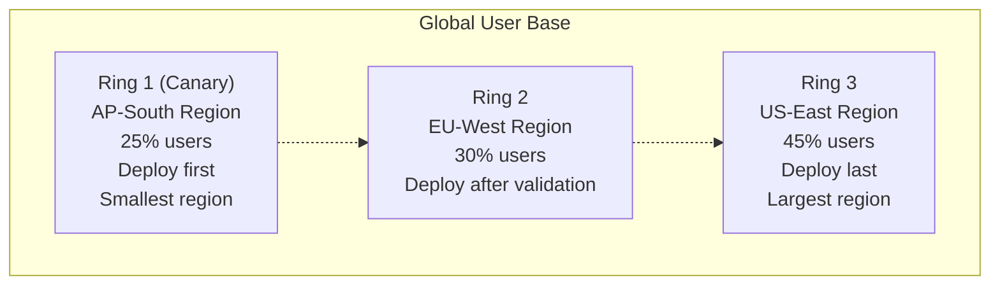
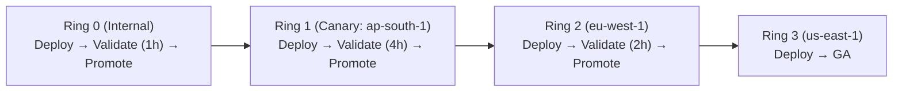
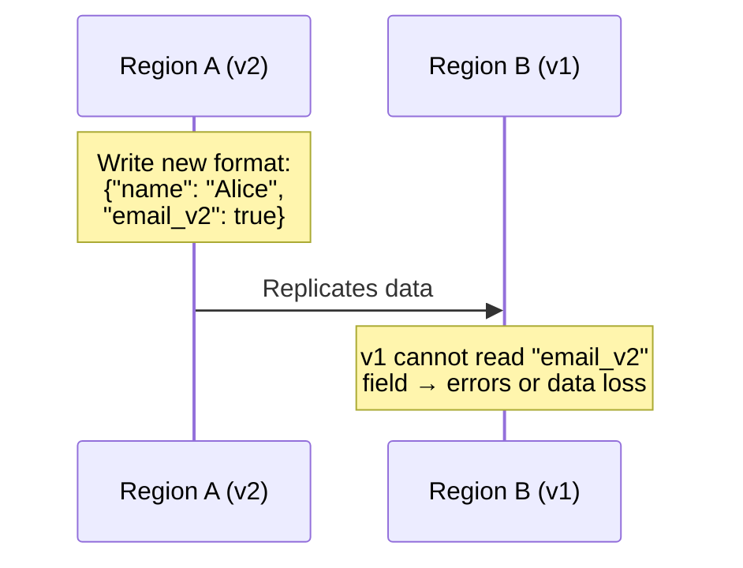
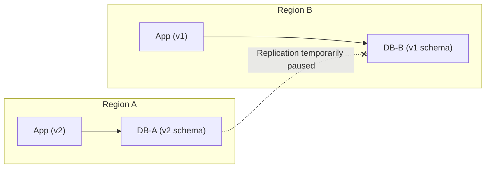
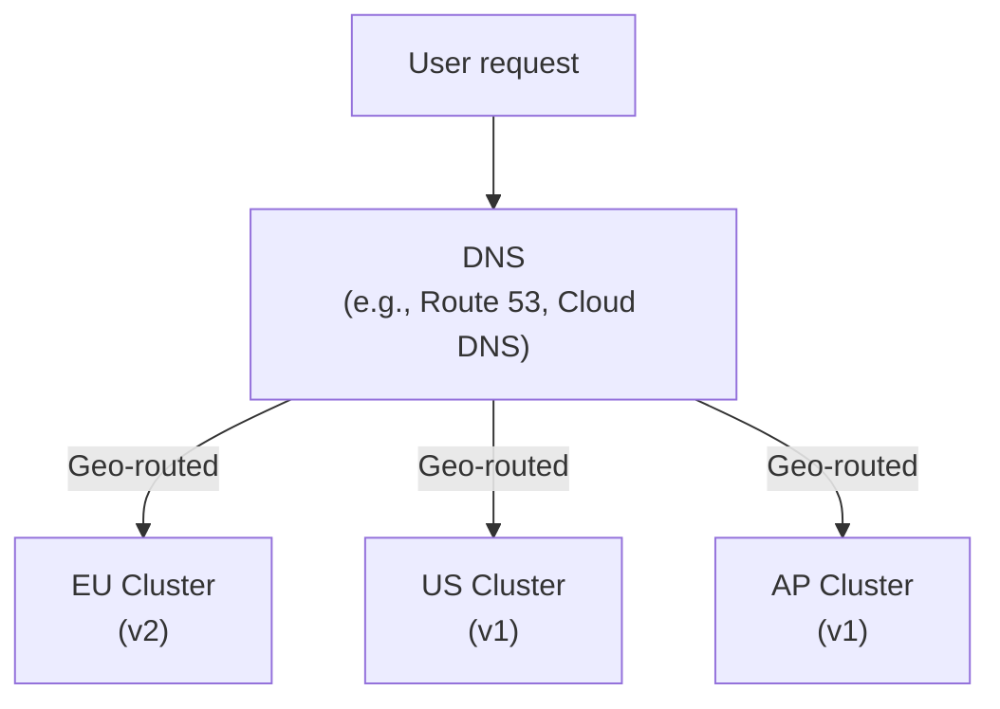
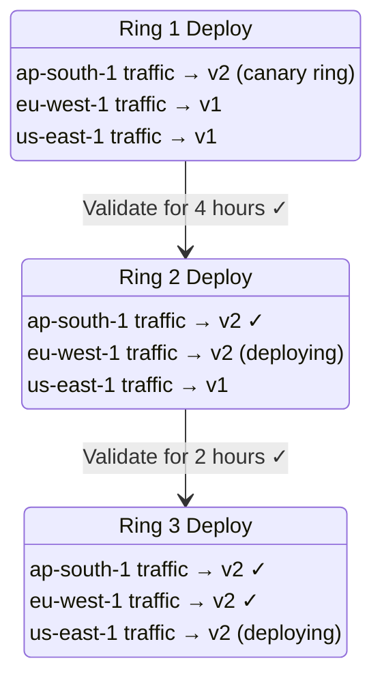
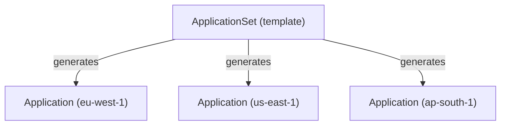
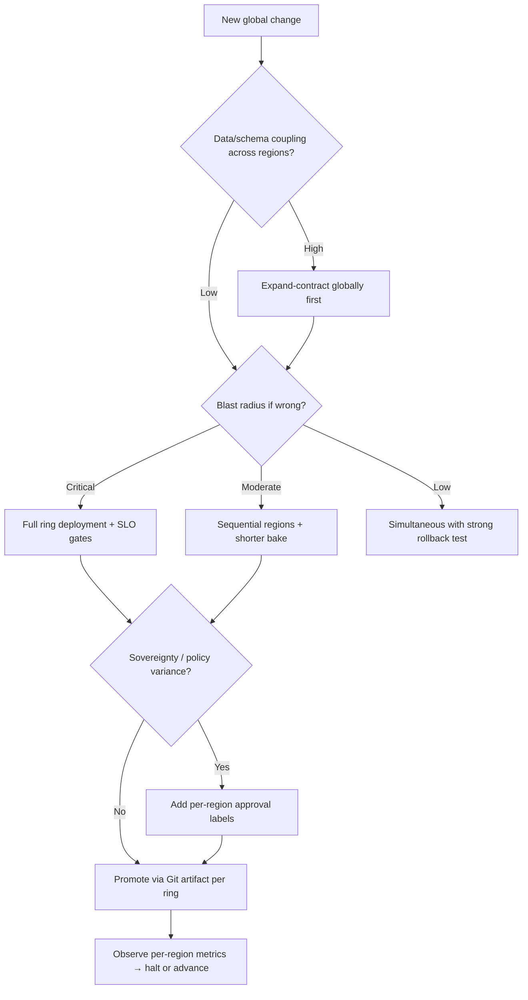

> **Discipline Module** | Complexity: `[COMPLEX]` | Time: 3 hours

## Prerequisites

Before starting this module, complete [Module 1.2: Argo Rollouts](../module-1.2-argo-rollouts/) for canary deployments and progressive delivery, and ensure you understand multi-cluster Kubernetes access patterns plus basic Argo CD Application sync workflows. DNS, global load balancing, and data replication concepts are strongly recommended because global releases fail at traffic and data boundaries more often than at container image tags alone.

---

## What You'll Be Able to Do

After completing this module, you will be able to apply the following capabilities in production multi-cluster fleets and explain the underlying trade-offs to platform stakeholders:

- **Design global release strategies that coordinate deployments across multiple regions and time zones**
- **Implement region-aware rollout policies that respect data locality and compliance requirements**
- **Build rollback procedures that handle cross-region dependencies during failed global deployments**
- **Analyze global release metrics to optimize deployment windows and minimize user impact worldwide**

## Why This Module Matters

**Hypothetical scenario:** A platform team ships a configuration change to every production region at once. Within minutes, authentication fails in three continents, support queues spike, and rollback requires coordinated action across twelve clusters while replication lag makes database state ambiguous. The change was tested in staging, but staging never exercised the interaction between regional DNS, cross-region replication, and a new default timeout. Geography did not contain the failure because geography was never used as a rollout boundary.

That pattern is what global release orchestration exists to prevent. Multi-region release orchestration is the discipline of deploying changes across geographically distributed infrastructure in a controlled, staged, and observable manner. Instead of pushing to all clusters at once, you deploy to a canary region first, validate against regional SLOs, then progressively expand to additional regions only when promotion gates pass. Each region acts as a blast radius boundary: if a change fails in `eu-west-1`, clusters in `us-east-1` and `ap-south-1` can remain on the last known good version while operators diagnose the regression.

Real incidents reinforce why the discipline matters. Meta's engineering team documented a October 2021 outage in which a backbone configuration change withdrew BGP routes broadly, disconnecting their data centers from the internet and from each other. The postmortem describes a global propagation failure mode, not a single-region application bug — a reminder that infrastructure changes deserve the same staged rollout discipline as application releases. The durable lesson is not vendor-specific: **a bad release must not hit every region at once**.

This module teaches the durable spine — ring-based geographic rollout, per-region bake time, multi-cluster GitOps mechanics, traffic and data constraints, observability gates, and compliance-aware sequencing — using GitOps tooling as worked examples rather than product endorsements.

---

## Why Global Rollout Differs From Single-Cluster Delivery

Progressive delivery inside one Kubernetes cluster — canary ReplicaSets, Argo Rollouts analysis, or traffic-splitting Ingress rules — controls what percentage of **local** requests see a new version. That is valuable, but it is not the same problem as coordinating **geographic** exposure. When fifteen clusters on three continents all receive a canary at the same time, you have fifteen independent experiments running in parallel, each touching real users, shared control planes, replicated data paths, and region-specific compliance rules. A bug that only appears under EU data-residency routing or APAC peak-hour load can still surface globally because every geography is in the experiment simultaneously.

The difference is containment. In-cluster canary analysis assumes homogeneous infrastructure: one etcd, one CNI policy bundle, one regional database replica set. Multi-region rollout assumes **heterogeneous failure domains**: different cloud availability zones, different replication lag profiles, different legal jurisdictions, and different operator on-call windows. Geography is a natural blast radius boundary because regions fail independently far more often than pods fail independently within a healthy region. Network partitions, provider incidents, certificate expiry in a single trust store, and misconfigured global DNS all demonstrate that regional isolation is a first-class reliability primitive, not an optimization.

> **Stop and think**: In a multi-region architecture, if an in-cluster canary affects 5% of users globally across all clusters simultaneously, how is that different from affecting 100% of users in a single region that handles 5% of global traffic? Consider the underlying infrastructure, networking, data replication, and containment boundaries.

Single-cluster canary math is seductive because the percentage looks small on a dashboard. Five percent of global traffic sounds safe until you realize that five percent is sprinkled across every geography, which means every regional on-call rotation, every support language, and every downstream integration partner sees the new code at once. A geographic ring deployment inverts the guarantee: the first ring might expose five percent of **global** users, but those users share one region's networking stack, one regional database primary, and one set of regional feature flags. When that ring fails, you halt promotion, roll back one overlay, and the other ninety-five percent of users never left the stable version.

The operational contract for global releases therefore has four durable properties that single-cluster progressive delivery does not guarantee on its own: **staged** expansion across regions, **observable** per-region health gates, **reversible** promotion via version control, and **respect for data and sovereignty constraints** that vary by geography. The sections that follow unpack each property with mechanics you can implement this quarter, not a catalog of tools that will rename themselves next year.

## The Geography of Failure

### Why Single-Region Deployments Are Not Enough

In a single cluster, a bad canary affects a bounded slice of local traffic and rollback is usually a Deployment revision or Rollout abort away. In a global simultaneous deploy, a bad release affects every geography at once, and rollback becomes a fleet operation: Git reverts, multi-cluster sync latency, cache invalidation, schema compatibility checks, and traffic drain coordination. Recovery time moves from seconds to minutes or hours not because Kubernetes is slow, but because **coordination surface area** scales with region count.

The comparison is not about pessimism; it is about choosing the right control knob. In-cluster progressive delivery optimizes **request-level** exposure inside a region that already decided to run the candidate version. Geographic ring deployment optimizes **region-level** exposure so that most of the planet remains on a known-good artifact while one region proves the release. Teams that conflate the two often discover the gap during the first cross-region schema migration or the first global ConfigMap change that assumes uniform DNS TTL behavior.

### Regional Blast Radius

The core principle remains unchanged across every vendor and every year: **geography is a natural blast radius boundary**. Rings group regions by risk appetite — internal, canary, secondary, primary — and promotion is a deliberate act, not an emergent side effect of a single pipeline stage. When Ring 1 fails, downstream rings never receive the change; when Ring 2 fails, Ring 3 stays pinned; when traffic shifting is wired correctly, users in failed regions can be steered toward healthy ones without waiting for a global revert to complete everywhere.


```mermaid
flowchart LR
    subgraph Global User Base
        direction LR
        R1["Ring 1 (Canary)<br/>AP-South Region<br/>25% users<br/>Deploy first<br/>Smallest region"]
        R2["Ring 2<br/>EU-West Region<br/>30% users<br/>Deploy after validation"]
        R3["Ring 3<br/>US-East Region<br/>45% users<br/>Deploy last<br/>Largest region"]
        
        R1 -.-> R2 -.-> R3
    end
```

If Ring 1 fails, 70% of your users are untouched. If Ring 2 also fails, 25% of your users are still safe. Geography gives you natural isolation that no amount of in-cluster canary analysis can provide.

---

## Ring Deployment Architecture

### What Is a Ring Deployment?

A ring deployment divides production infrastructure into concentric exposure rings, where each ring represents a larger fraction of real users and operational risk. Ring 0 is internal or synthetic traffic with zero customer impact. Ring 1 is a full production region with the smallest real-user share. Ring 2 groups medium regions that inherit confidence from Ring 1 bake time. Ring 3 contains the largest regions that should move only after smaller geographies prove stability. The naming is arbitrary — some organizations say "wave" or "stage" — but the invariant is **monotonic expansion**: you never skip a ring because a calendar deadline says so.

Rings are not merely labels on clusters. Each ring needs an explicit promotion artifact in Git — a branch, tag, overlay directory, or generator field — so that "promote Ring 2" means a reviewable change with diff, approvers, and revert path. Without that artifact, rings devolve into Slack messages ("EU is good, ship US") that audit logs cannot reconstruct. GitOps multi-cluster tooling makes the artifact natural: promotion is a commit, rollback is a revert, and fleet state is observable per Application or Kustomization.

### Ring Progression and Bake Time

Bake time is the interval a version must remain healthy in a ring before the next ring may advance. Bake time is where global rollout differs most sharply from single-cluster canaries. Request-level canaries can reach statistical confidence in minutes when error budgets are large. Regional rings must often survive **daily cycles** — midnight UTC rollovers, batch windows, regional peak hours, certificate rotation jobs — that only execute once per day. Google's Site Reliability Engineering workbook describes gradual rollout and canarying as risk reduction techniques; the practical implication for platform teams is that Ring 1 frequently needs a full diurnal cycle, not merely "green dashboards during business hours."

Promotion gates should be expressed as measurable predicates tied to regional SLOs: error rate below budget, latency regression below threshold, saturation within headroom, and business metrics stable versus a same-region baseline on the previous version. Manual approval remains appropriate for the final ring on tier-one services, but manual approval should not replace automated halt-on-regression for earlier rings — humans miss slow leaks that Prometheus catches reliably at 2 AM.

### Choosing Your Canary Region

The canary region should minimize blast radius while still representing production reality. Smallest production region is the default choice because it limits user impact, but representativeness matters equally: if the canary region lacks a payment rail, a GPU pool, or a regulatory data path that larger regions use, you are not validating the release — you are validating a subset costume. Monitoring parity is non-negotiable; a blind canary region is theater. Timezone alignment is operational kindness: deploying during local business hours puts engineers awake in the same window as user impact, which shortens mean time to detect without encouraging reckless speed.

Recoverability completes the checklist. The canary region must be drainable — global load balancing or GeoDNS must be able to steer its traffic to a healthy neighbor without manual DNS edits under fire. That requirement implies per-region headroom, which is a capacity planning outcome, not a release-engineering afterthought.


```mermaid
flowchart LR
    R0["Ring 0 (Internal)<br/>Deploy → Validate (1h) → Promote"]
    R1["Ring 1 (Canary: ap-south-1)<br/>Deploy → Validate (4h) → Promote"]
    R2["Ring 2 (eu-west-1)<br/>Deploy → Validate (2h) → Promote"]
    R3["Ring 3 (us-east-1)<br/>Deploy → GA"]
    
    R0 --> R1 --> R2 --> R3
```

---

## Staged Geographic Rollout and Follow-the-Sun Timing

Follow-the-sun rollout aligns promotion windows with human attention and regional traffic shape. The durable idea is simple: deploy when the people who can halt promotion are awake, and bake through the riskiest clock boundaries before larger regions move. A European primary region should not receive a risky change Friday evening UTC if the owning team will not have staffed incident response until Monday. Conversely, deploying to a small APAC canary during local business hours gives engineers same-day signal without forcing a US team to debug at 3 AM unless the service tier truly demands it.

Calendar awareness also includes **change freezes** — retail peak seasons, tax filing windows, election periods, or regulated maintenance blackouts. Global releases need a per-region freeze map, not a single corporate holiday schedule. A US Thanksgiving freeze does not protect EU Cyber Monday traffic unless your policy says so explicitly. Platform teams often encode freezes as generator metadata or pipeline predicates so ApplicationSets and CI are blocked from promoting into frozen rings.

Business-hours-aware rollout does not mean "only deploy Tuesdays." It means each ring has a defined observation window that intersects real usage patterns for that geography. Batch-heavy regions need bake time across batch start and end. API-heavy regions need bake time across peak QPS. Stateful regions need bake time across replication catch-up after maintenance. The failure mode to avoid is **velocity cosplay**: rings exist on paper, but promotion auto-advances on a timer without checking regional predicates.

Internal → early adopter → broad is another ring taxonomy that pairs well with geography. Ring 0 might be employee-only endpoints or synthetic probes. Ring 1 might be a "labs" region or a single scale unit. Ring 2 expands to a full region. Ring 3 expands to a continent cluster set. Microsoft Azure's architecture guidance on release engineering rollback stresses reversible steps; geographically staged rings are how reversibility stays small — you revert one ring's Git pointer, not an entire planet's fleet state.

---

## Data Replication During Rollouts

> **Pause and predict**: If you introduce a new required field to your database schema in the v2 release, what exactly will happen when the v1 application running in another region tries to write to or read from that replicated table?

### The Cross-Region Data Problem

When deploying across regions, data consistency becomes the constraint that turns a smooth application rollout into a multi-day migration program. Active-active replication assumes records written in one geography become visible elsewhere; if v2 introduces a required field, a new enum value, or a tighter validation rule, v1 instances in not-yet-promoted regions may reject replicated rows or crash on read paths that used to be boring. Replication lag amplifies the hazard: Ring 1 may run v2 for hours while Ring 3 still serves v1, which means the fleet is **intentionally multi-version** for a window you must design for rather than hope away.

The durable response is to treat schema and code as coupled releases with their own ring logic. Expand-contract remains the workhorse: expand schema compatibly everywhere, deploy code that can read both shapes, backfill, then contract after all regions and all replicas converge. Feature-flagged data paths add a safety valve when you must land code globally before enabling a new write path. Region-isolated data — pausing replication or accepting temporary divergence — is expensive operationally but sometimes cheaper than corrupting shared rows. None of these patterns is clever; they are **boring on purpose**, because exciting data migrations at global scale become executive-visible incidents.

### Safe Cross-Region Deployment Patterns


```mermaid
sequenceDiagram
    participant RA as Region A (v2)
    participant RB as Region B (v1)
    
    Note over RA: Write new format:<br/>{"name": "Alice",<br/>"email_v2": true}
    RA->>RB: Replicates data
    Note over RB: v1 cannot read "email_v2"<br/>field → errors or data loss
```

### Safe Cross-Region Deployment Patterns

**Pattern 1: Schema-Compatible Versions Only** requires both v1 and v2 to read and write the same data format during the overlap window. Use the expand-contract pattern from Module 1.1: first deploy v2 so it writes new and old shapes, then migrate all regions to v2, then stop writing the old shape, then drop legacy columns after replication quiesces.

**Pattern 2: Region-Isolated Data** gives each geography its own database with replication temporarily paused during rollout, so schema differences cannot cross-pollinate. After every region runs v2, resume replication knowing each primary already matches the target schema. The trade-off is temporary divergence and operational complexity — acceptable when expand-contract cannot meet a deadline.

**Pattern 3: Feature-Flagged Data Paths** lands v2 binaries everywhere with the new write path disabled, proves fleet version uniformity, then flips the flag globally so the new path activates in a controlled instant. This is often the safest approach when feature-flag infrastructure from Module 1.3 is mature and audit requirements demand a single activation event.


```mermaid
flowchart LR
    subgraph Region A
        AppV2["App (v2)"] --> DBA["DB-A (v2 schema)"]
    end
    subgraph Region B
        AppV1["App (v1)"] --> DBB["DB-B (v1 schema)"]
    end
    DBA -. "Replication temporarily paused" .-x DBB
```

### Data Migration Anti-Patterns in Multi-Region

| Anti-Pattern | Risk | Safe Alternative |
|-------------|------|-----------------|
| Running migrations in canary region only | Other regions cannot read new format | Run backward-compatible migrations everywhere first |
| Replicating during schema transition | v1 regions crash on v2 data | Pause replication or use dual-format writes |
| Assuming eventual consistency is immediate | Stale reads during rollout | Design for stale reads; use version headers |
| Different schema versions across regions for days | Operational complexity, hard to rollback | Minimize the time window; deploy schema separately from code |

---

## Global Load Balancing and Traffic Shifting

Global traffic management sits at the boundary between **where users enter** and **which regional fleet serves them**. During ring deployment, that boundary is a control plane: you want most users to stay on stable regions while one geography proves the candidate, and you want the ability to drain a failing region without re-architecting DNS under incident stress. The durable capabilities are geo-routing, health-checked failover, weighted steering, and request-level observability headers — independent of which cloud console you click. **Landscape snapshot — as of 2026-06. This changes fast; verify against vendor docs before relying on specifics.**

| Capability | AWS (illustrative) | Google Cloud (illustrative) | Cloudflare / CDN edge (illustrative) |
|------------|-------------------|----------------------------|--------------------------------------|
| Geo-oriented DNS routing | Route 53 routing policies (latency, geolocation, weighted) | Cloud DNS + external HTTP(S) load balancing | Geo steering / load balancing products |
| Anycast / global entry | Global Accelerator | External Application Load Balancer | Anycast proxy network |
| Per-endpoint health drain | Target health checks + weighted record sets | Backend service health checks | Pool health + traffic steering |
| Fine-grained traffic dial | Weighted routing combinations | Backend weighting / URL maps | Load balancing rules |

DNS-based geo routing is the historical default because it is simple and vendor-agnostic at the concept layer. The limitation is also well documented: DNS TTL and client caching mean changes propagate gradually and coarsely — often region-level all-or-nothing rather than smooth percentage shifts. Modern global load balancers add **per-request** steering and faster drain semantics, which matter when Ring 1 must shed traffic to Ring 2's stable fleet during a rollback. Teach the capability, pick one stack as a worked example, and cross-reference the Rosetta row when your organization uses a different provider.

During ring progression, traffic and artifact version are related but not identical. A region may run v2 binaries while still receiving only canary-weight traffic from the global entry — useful when you want code present for soak but not fully exposed. Conversely, a region may serve 100% local traffic on v2 while other regions remain on v1; global DNS must not accidentally steer foreign users into a canary geography that assumed local-only traffic shapes. Document **assumptions per ring** in the release runbook: who should hit this region, what percentage, and what observability tags prove the steering is correct.

Emergency regional failover is the payoff for headroom planning. When Ring 1 regresses, drain its endpoints, shift users to a neighbor running the last known good version, and halt promotion. Automated health checks at the global entry can execute faster than a human remembers which kubectl context owns the broken cluster. The lesson from every major provider's load balancing guide is the same: failover is a product feature, but **capacity to absorb shifted load** is your responsibility.


```mermaid
flowchart TD
    User["User request"] --> DNS["DNS<br/>(e.g., Route 53, Cloud DNS)"]
    DNS -- "Geo-routed" --> EU["EU Cluster<br/>(v2)"]
    DNS -- "Geo-routed" --> US["US Cluster<br/>(v1)"]
    DNS -- "Geo-routed" --> AP["AP Cluster<br/>(v1)"]
```

**Limitations of DNS-based shifting** deserve explicit runbook space because teams forget them during calm weather and rediscover them during incidents. TTL-bound propagation means rollback is not instantaneous at the edge. Client resolvers cache answers independently, so "we changed DNS" ≠ "users left the bad region." Health-checked global entries reduce that gap by steering at connection time, which is why multi-region releases pair GitOps promotion with load-balancer drain steps rather than treating DNS as the only knob.

Anycast and managed global load balancers implement the same durable capabilities with different control planes: per-request routing, weighted steering between healthy endpoints, automatic drain when health checks fail, and optional header injection for tracing release version and region. The YAML fragment below illustrates weighted endpoint groups conceptually — validate field names against current AWS Global Accelerator documentation before copying into production.

```yaml
# Example: AWS Global Accelerator traffic dial
# Shift 10% of EU traffic to test region during canary
listener:
  endpoint_groups:
    - region: eu-west-1
      weight: 90
      endpoints:
        - id: eu-west-1-prod
    - region: eu-west-2
      weight: 10
      endpoints:
        - id: eu-west-2-canary
```

### Traffic Shifting During Ring Deployment


```mermaid
stateDiagram-v2
    state "Ring 1 Deploy" as R1
    R1 : ap-south-1 traffic → v2 (canary ring)
    R1 : eu-west-1 traffic → v1
    R1 : us-east-1 traffic → v1
    
    state "Ring 2 Deploy" as R2
    R2 : ap-south-1 traffic → v2 ✓
    R2 : eu-west-1 traffic → v2 (deploying)
    R2 : us-east-1 traffic → v1
    
    state "Ring 3 Deploy" as R3
    R3 : ap-south-1 traffic → v2 ✓
    R3 : eu-west-1 traffic → v2 ✓
    R3 : us-east-1 traffic → v2 (deploying)
    
    R1 --> R2 : Validate for 4 hours ✓
    R2 --> R3 : Validate for 2 hours ✓
```

### Emergency Regional Failover

When Ring 1 fails after promotion, shift its traffic to a healthy neighbor running the stable version while Git revert proceeds. Global load balancer health checks can automate drain semantics faster than manual DNS edits during an incident. The diagram below shows the intended end state: the broken region at zero percent traffic, the neighbor absorbing extra load, and downstream rings still blocked from promotion until root cause is understood.

```bash
# Before failover:
#   ap-south-1: serving AP users → v2 (BROKEN)
#   eu-west-1: serving EU users → v1 (healthy)

# Failover: drain ap-south-1, shift to eu-west-1
# (Global LB health checks can do this automatically)

# After failover:
#   ap-south-1: 0% traffic (draining)
#   eu-west-1: serving EU + AP users → v1 (healthy, higher load)
```

This is why regions should be provisioned with headroom — they need to absorb traffic from a failed region.

---

## Multi-Cluster Fleet Mechanics with GitOps

Fleet rollout is the mechanical layer that makes ring semantics real. Without multi-cluster reconciliation, "promote Ring 2" becomes fifteen manual sync clicks — error-prone, un-auditable, and incompatible with incident stress. GitOps controllers treat desired state in Git as authoritative and reconcile each cluster independently, which maps naturally to per-region overlays and per-ring revisions. Argo CD ApplicationSets and Flux Kustomizations are two prevalent patterns; both are CNCF-ecosystem tools with different ergonomics, not a moral ranking.

### Why ApplicationSets?

Argo CD manages deployments via `Application` CRDs — one Application per cluster per service quickly becomes unmaintainable at fleet scale. **ApplicationSets** generate Applications from generators (list, cluster, git, merge, matrix), letting you declare ring membership once and let the controller materialize per-cluster objects. Cluster generators discover registered clusters from secrets; list generators suit smaller fleets with explicit URLs. The worked examples below use list generators for clarity; production fleets often combine cluster discovery with labels like `ring=1` and `region=ap-south`.

Ring promotion with ApplicationSets is intentionally **Git-native**: change `targetRevision`, overlay path, or generator parameter, merge through review, let each Application sync. Rollback is `git revert`. Audit is `git log`. This is the global rollback story — revert in Git, reconcile each region, verify per-region health gates before un-halting promotion.

### Flux Multi-Cluster Patterns

Flux bootstraps per cluster with a unique path in the same repository — for example `clusters/staging` and `clusters/production` — so one monorepo drives many reconcilers without copy-pasting manifests. Remote cluster reconciliation uses `Kustomization.spec.kubeConfig` to apply resources to another API server from a management cluster, which pairs with Cluster API for fleets that provision infrastructure and workloads together. Progressive delivery integrations (including Flagger) layer canary analysis on top of GitOps reconciliation; the global ring still provides the outer boundary while in-cluster progressive delivery handles request-level splits inside a promoted geography.

Whether you standardize on Argo CD, Flux, or a hybrid, the durable checklist is identical: **one promotion artifact per ring**, automated drift detection, per-cluster health signals, and explicit policy for who may advance rings. See [Module 1.2: Argo Rollouts](../module-1.2-argo-rollouts/) for in-cluster progressive delivery that complements — not replaces — geographic rings.


```mermaid
flowchart TD
    AppSet["ApplicationSet (template)"]
    AppSet -- "generates" --> AppEU["Application (eu-west-1)"]
    AppSet -- "generates" --> AppUS["Application (us-east-1)"]
    AppSet -- "generates" --> AppAP["Application (ap-south-1)"]
```

### Basic ApplicationSet

```yaml
apiVersion: argoproj.io/v1alpha1
kind: ApplicationSet
metadata:
  name: webapp
  namespace: argocd
spec:
  generators:
    - list:
        elements:
          - cluster: eu-west-1
            url: https://eu-west-1.k8s.example.com
            ring: "1"
          - cluster: us-east-1
            url: https://us-east-1.k8s.example.com
            ring: "3"
          - cluster: ap-south-1
            url: https://ap-south-1.k8s.example.com
            ring: "2"
  template:
    metadata:
      name: 'webapp-{{cluster}}'
    spec:
      project: default
      source:
        repoURL: https://github.com/myorg/webapp
        targetRevision: HEAD
        path: 'deploy/overlays/{{cluster}}'
      destination:
        server: '{{url}}'
        namespace: webapp
      syncPolicy:
        automated:
          prune: true
          selfHeal: true
```

This YAML generates three Argo CD Applications — one per cluster — each deploying from a cluster-specific overlay path so regional ConfigMaps and replica counts can diverge safely while sharing one template.

### Ring Deployment with ApplicationSets

Controlling **which clusters get the new version and when** is the essence of ring semantics in GitOps. Three approaches appear repeatedly in production fleets, and teams often combine them.

**Approach 1: Branch or tag per ring** points Ring 1 clusters at a `release/v2.1.0` branch while Rings 2–3 remain on `v2.0.0`. Promoting Ring 2 is a one-line generator change reviewed like any other production commit — auditable, reversible, and easy to diff in `git log`.

**Approach 2: Directory-per-ring with Kustomize** keeps a shared base and ring overlays (`ring-1`, `ring-2`, `ring-3`). Promotion updates the image tag in `ring-2/kustomization.yaml`; `kubectl kustomize` previews and CI validates before merge. Cluster-specific overlays still live under `deploy/overlays/{{cluster}}` when regions need distinct ConfigMaps or replica counts.

**Approach 3: Progressive sync with waves** annotates Applications with `argocd.argoproj.io/sync-wave` so lower rings reconcile first. Waves order Kubernetes object creation; they do not replace metrics gates — pair waves with manual or automated promotion after bake time elapses.

### Rollback with ApplicationSets

Rolling back a ring remains a Git revert: undo the promotion commit, push, and let each Application reconcile to the prior revision. Rings that never promoted stay untouched, which is why ring failures must **halt** downstream promotion immediately. GitOps rollback is version-controlled and auditable — the opposite of SSHing into clusters to kubectl-set-image under pressure.

```yaml
# Approach 1 illustration: per-cluster targetRevision in the generator list
spec:
  generators:
    - list:
        elements:
          - cluster: ap-south-1
            url: https://ap-south-1.k8s.example.com
            revision: release/v2.1.0
          - cluster: eu-west-1
            url: https://eu-west-1.k8s.example.com
            revision: v2.0.0
          - cluster: us-east-1
            url: https://us-east-1.k8s.example.com
            revision: v2.0.0
  template:
    spec:
      source:
        targetRevision: '{{revision}}'
```

```yaml
# Approach 3 illustration: sync-wave annotation derived from ring label
template:
  metadata:
    name: 'webapp-{{cluster}}'
    annotations:
      argocd.argoproj.io/sync-wave: '{{ring}}'
```

```bash
# Rollback: revert the promotion commit; un-promoted rings need no action
git revert HEAD
git push
```

---

## Observability Gates and Per-Region Release Metrics

Global releases fail observability when teams only watch a global aggregate. A one-point increase in worldwide error rate might hide a five-point regression in the canary region compensated by idle baselines elsewhere. Per-region SLOs and error budgets — the subject of SRE alerting practice — are promotion gates, not postmortem decorations. During ring deployment, dashboards must answer: **which version is this region running, how does it compare to its own baseline on the previous version, and is promotion still allowed?**

Cross-region comparison tables belong in the release war room (virtual or physical). Align metrics by ring and version label, not merely by geography. Error rate delta, latency percentiles, saturation, queue depth, and business KPIs (checkout success, API completion, job backlog) should be compared against the same region yesterday, not against a different region today. Automated promotion gates encode those comparisons as PromQL or vendor-equivalent queries with duration — "error rate `< 1%` for four hours" is a policy statement, not a chart vibe.

Halt-on-regression must be wired to **stop Git promotion** and optionally trigger revert. Halting only a pager while CI continues promoting Ring 3 is how partial global outages become total. The global rollback story remains Git-first: revert the promotion commit, let each Application or Kustomization reconcile, validate regional health, then resume ring advancement from a known-good tag. Pair metrics gates with feature flags and traffic drains when regressions are ambiguous — sometimes the fastest mitigation is steering traffic before the binary rollback completes.

Analyzing global release metrics after the fact closes the improvement loop DORA emphasizes in continuous delivery research: change failure rate, lead time, recovery time, and deployment frequency all improve when releases are smaller, reversible, and measurable per stage. Capture per-ring bake duration, automatic halts, manual overrides, and rollback depth. Those time series tell you whether Ring 1 bake is too short for your actual bug class distribution, whether EU and US need different policies, and whether schema migrations dominate failure modes. Compare error rate deltas, latency percentiles (P50/P95/P99), resource saturation, and business KPIs per region against that region's baseline on the previous version — not against a different geography on a different load shape.

```yaml
# promotion-gate.yaml (pseudo-code for automation)
rings:
  ring-1:
    clusters: [ap-south-1]
    validation:
      - type: prometheus
        query: "error_rate{region='ap-south-1'} < 0.01"
        duration: 4h
      - type: prometheus
        query: "p99_latency{region='ap-south-1'} < 200"
        duration: 4h
    on_success: promote ring-2
    on_failure: rollback ring-1

  ring-2:
    clusters: [eu-west-1]
    validation:
      - type: prometheus
        query: "error_rate{region='eu-west-1'} < 0.01"
        duration: 2h
    on_success: promote ring-3
    on_failure: rollback ring-1, ring-2

  ring-3:
    clusters: [us-east-1]
    validation:
      - type: manual_approval
        approvers: [release-team]
```

---

## Compliance, Data Sovereignty, and Region-Aware Policies

Region-aware rollout is not only about latency and blast radius; it is about **legal and contractual boundaries** that dictate where bits may live and when features may switch on. Data residency rules may forbid replicating certain record types into a geography even when Kubernetes clusters exist there. Feature launches that collect new telemetry may require jurisdiction-specific consent flows before activation. A global Git commit that promotes Ring 3 unconditionally can violate those constraints if Ring 3 includes regions where legal review is still pending.

The durable practice is to model **policy as code alongside manifests**. Ring generators carry labels — `data_class=pci`, `sovereignty=eu-only`, `launch_approved=true` — that CI and admission policy evaluate before sync. Promotion workflows include a human gate for legal when needed, but the default path should fail closed: clusters without approval labels cannot receive the new overlay. This mirrors how platform teams treat production deploy permissions; sovereignty is another dimension of permission.

Schema and data paths interact with sovereignty. Expand-contract migrations that replicate dual-format rows might accidentally copy prohibited fields into a secondary region unless replication filters or column masks are part of the migration design. Backward-compatible rollouts are therefore a compliance tool, not only an availability tool. When in doubt, **land code dark** with feature flags per jurisdiction, prove observability and audit trails in the canary geography, then enable business logic region by region after checklists complete.

Staged rollout respecting compliance also means **documentation and evidence** travel with the release. Regulators and enterprise customers increasingly ask for change records: who approved Ring 2, what metrics were reviewed, what rollback test occurred. GitOps provides commit history; attach promotion gate outputs and dashboard snapshots to the change ticket. The goal is defensible pacing — not slow for slowness's sake, but traceable so a skipped ring is visible in audit, not discoverable in court.

---

## Patterns & Anti-Patterns

### Patterns

**Geographic ring with Git promotion artifact.** Each ring maps to a concrete Git change — branch, tag, or overlay directory — advanced through review. Promotion is merge; rollback is revert; fleet state reconciles asynchronously per cluster. This pattern scales to dozens of clusters without losing auditability and is the backbone of multi-cluster ApplicationSet and Flux workflows described earlier.

**Expand-contract ahead of code rings.** Schema changes expand compatibly across all regions before any region runs code that depends on the contracted shape. Code rings then proceed independently, knowing replication will not deliver unreadable rows. The pattern adds calendar time but removes the most common multi-region data corruption class.

**Per-region SLO gates with automatic halt.** Promotion controllers or pipeline jobs query regional error budgets and latency regressions against version-labeled baselines. Failure freezes downstream rings and optionally opens a revert PR. Humans approve final rings; machines protect sleep hours.

**Traffic drain before binary rollback.** When health checks detect regression, global load balancers drain the bad region while Git revert proceeds. Users experience failover rather than errors during the minutes reconcile takes. Requires pre-provisioned headroom in neighbor regions.

**Follow-the-sun bake windows.** Ring 1 deploys when local engineers are staffed; bake windows intentionally cross midnight UTC, batch boundaries, and peak traffic for that geography. Time-dependent defects surface in the smallest blast radius before primary regions move.

### Anti-Patterns

**Global big-bang.** One pipeline stage updates every region simultaneously. Minimizes calendar time and maximizes incident audience. Appropriate only for low-risk artifacts with proven automated rollback and no state coupling — rare at global scale.

**Canary theater.** Rings exist in documentation but share one Git revision in practice, or auto-promote on timers without metrics. Creates the feeling of safety without containment.

**Replication-blind schema change.** Running DDL in the first region while v1 serves elsewhere and replication is active. Converts a regional deploy into a data integrity incident that rollback cannot undo.

**Config drift across regions.** Hand-edited cluster overrides that Git no longer describes. Ring rollback reverts Git while broken clusters keep bad ConfigMaps, producing mysterious partial failures.

**Busy-region first.** Choosing the largest geography as Ring 1 maximizes user impact and support load when the unknown unknowns appear. Defeats the purpose of geographic staging.

**Infrastructure plus application in one ring step.** BGP, IAM, mesh, and binary changes ride together, doubling diagnostic difficulty. Separate rings or separate change tickets so failure domains stay legible.

---

## Decision Framework

Use this matrix when choosing how aggressively to stage a global change. Service tier and data coupling drive the decision more than team preference.

| Factor | Simultaneous / fast | Sequential regions | Full ring deployment |
|--------|---------------------|--------------------|----------------------|
| User impact if wrong | Low, easily reversible | Medium | High, revenue or safety critical |
| Data coupling | None or read-only replicas | Shared replication with compatible schema | Active-active writes, complex migrations |
| Compliance variance | Uniform globally | Some regional gating | Per-jurisdiction launch approvals |
| Observability maturity | Strong per-region SLOs | Moderate | Must automate halt-on-regression |
| Typical bake for Ring 1 | Hours | 12–24 hours | 24+ hours including UTC midnight |


```mermaid
flowchart TD
    Start["New global change"] --> Q1{"Data/schema coupling across regions?"}
    Q1 -->|High| Schema["Expand-contract globally first"]
    Q1 -->|Low| Q2{"Blast radius if wrong?"}
    Schema --> Q2
    Q2 -->|Critical| Rings["Full ring deployment + SLO gates"]
    Q2 -->|Moderate| Seq["Sequential regions + shorter bake"]
    Q2 -->|Low| Fast["Simultaneous with strong rollback test"]
    Rings --> Q3{"Sovereignty / policy variance?"}
    Seq --> Q3
    Q3 -->|Yes| Policy["Add per-region approval labels"]
    Q3 -->|No| Git["Promote via Git artifact per ring"]
    Policy --> Git
    Git --> Observe["Observe per-region metrics → halt or advance"]
```

When two options appear tied, default to **smaller blast radius**. Calendar cost is recoverable; global incident cost is not. Revisit the matrix quarterly as observability and GitOps maturity improve — teams earn faster policies by proving rollback and gate reliability, not by declaring emergencies.

---

## Did You Know?

- **Gradual rollout is a first-class SRE practice**: The Google SRE Workbook's chapter on canarying releases treats staged exposure as a risk reducer — measuring key metrics on a small slice before wider promotion — which is the same durable principle geographic rings apply at regional scale.

- **DNS geo routing trades granularity for simplicity**: Amazon Route 53 documents latency, geolocation, and weighted policies as distinct tools; weighted and latency combinations can steer traffic without application changes, but TTL and resolver caching still bound how quickly steering updates take effect worldwide.

- **GitOps fleet tools generate per-cluster objects from templates**: Argo CD ApplicationSets documentation describes generators that materialize `Application` CRDs for many clusters, which is how ring membership stays declarative instead of copy-pasted across fifteen repositories.

- **DORA research links delivery practices to outcomes**: The DevOps Research and Assessment program publishes evidence that stronger continuous delivery capabilities — including smaller batches and faster recovery — correlate with organizational performance, which is why per-ring metrics and rollback drills matter beyond pure engineering aesthetics.

---

**Hypothetical scenario:** A global payments team deploys a new ledger service using ring deployments. Ring 1 in a small APAC region runs green for eight peak hours, so the lead proposes skipping the overnight bake. After promotion to a European ring, error rates spike near the UTC midnight boundary because date-bucketing logic mishandles the rollover window. Aggregated twenty-four-hour averages in APAC hid the spike; hourly slices would have caught it. The team resets policy: Ring 1 must observe a full diurnal cycle, and promotion dashboards use per-hour comparisons alongside rolling means. No vendor names or dollar figures are implied — the lesson is measurement window selection, not headline drama.

---

## Common Mistakes

| Mistake | Problem | Solution |
|---------|---------|----------|
| Deploying to all regions simultaneously | No blast radius isolation; global outage risk | Use ring deployments with region-based progression |
| Choosing the busiest region as canary | Maximizes blast radius if canary fails | Choose the smallest production region with representative traffic |
| Ring 1 bake time under 24 hours | Time-dependent bugs slip through | Minimum 24-hour bake for Ring 1 to cover full day/night cycle |
| No automated rollback per ring | Failed ring requires manual intervention at 3 AM | Automated promotion gates with metrics-driven rollback |
| Replicating data during schema transitions | v1 regions cannot read v2 data format | Pause replication or use backward-compatible schemas |
| No regional failover capacity | Failed region cannot shed traffic to healthy regions | Provision 130-150% capacity per region for failover headroom |
| Deploying infrastructure and app changes together | Doubles the blast radius per ring | Separate infrastructure changes from application changes |
| Identical ring timing regardless of service criticality | Over-cautious for low-risk services, under-cautious for high-risk | Tier your services: Tier 1 gets 5-day rollout, Tier 3 gets 1-day |

---

## Quiz: Check Your Understanding

### Question 1
Your team is debating whether to use in-cluster canary deployments or geographic ring deployments for a new critical payment service. A senior engineer argues that doing a 5% canary in every cluster simultaneously is identical to doing a 100% deployment in a region that handles 5% of your global traffic. Why is the senior engineer incorrect, and why does the geographic ring deployment offer a superior blast radius boundary?

<details>
<summary>Answer</summary>

The senior engineer is incorrect because a simultaneous 5% canary across all clusters exposes every geographical region to the new code at the same time. If the new release contains a catastrophic configuration error—such as a malformed BGP route or a broken external dependency integration—it could instantly degrade the service globally, even if only for 5% of requests. Geographic ring deployments provide natural isolation because each region operates with independent infrastructure, databases, and networking stacks. A failure in the canary region (like ap-south-1) is completely contained to that specific geography, leaving the rest of the world entirely unaffected. Furthermore, healthy regions can often absorb the traffic from the failed region via global load balancing, providing graceful degradation rather than a widespread partial outage.

</details>

### Question 2
You are planning a global rollout for a feature that introduces a heavily modified user profile schema. The application relies on active-active cross-region database replication to ensure users can log in anywhere. Because the rollout will take several days to reach all regions, you must ensure that users interacting with v1 and v2 simultaneously do not experience data corruption. What are three distinct architectural approaches you can use to safely handle this cross-region data consistency challenge?

<details>
<summary>Answer</summary>

To safely handle cross-region data consistency during a prolonged rollout, you must prevent schema incompatibilities from crashing the application. The first approach is using schema-compatible versions via the expand-contract pattern, where the v2 application writes to both the old and new schema formats, ensuring that v1 regions can still read the replicated data. The second approach is region-isolated data, which involves temporarily pausing cross-region replication so that each region operates independently on its local database schema until the rollout completes. The third and safest approach relies on feature-flagged data paths, where the v2 code is fully deployed to all regions globally with the new data logic disabled; once every region is confirmed to be running v2, the feature flag is flipped to enable the new data path everywhere simultaneously.

</details>

### Question 3
Your organization operates 15 Kubernetes clusters globally and currently manages deployments by manually updating 15 separate ArgoCD Application manifests. The release team wants to implement a ring deployment strategy (Canary -> EU -> US) but is worried about the operational overhead of coordinating manual updates across so many clusters. How can ArgoCD ApplicationSets solve this problem and enforce a structured ring deployment?

<details>
<summary>Answer</summary>

ArgoCD ApplicationSets solve this overhead by acting as a dynamic template that automatically generates and manages individual Application CRDs for all 15 clusters from a single source of truth. To enforce a ring deployment, you can map specific clusters to different rings using Git revisions, directory overlays, or ArgoCD sync waves. For example, you can configure the ApplicationSet so that clusters in Ring 1 point to a `release/v2.1.0` branch or overlay, while clusters in Rings 2 and 3 remain pinned to the stable `v2.0.0` version. Promotion is then executed via a simple, auditable Git commit that updates the target revision or overlay for the next ring's clusters, effectively eliminating the need to manually edit 15 separate files while maintaining strict version control.

</details>

### Question 4
A development team just deployed a minor update to the core transaction engine in the Singapore (Ring 1) region. After monitoring the deployment for 6 hours during local peak business hours, all metrics—latency, error rates, and CPU usage—look perfectly healthy. The team lead wants to immediately promote the release to the London (Ring 2) region to accelerate the delivery schedule. Why should you block this early promotion and insist on a full 24-hour bake time for Ring 1?

<details>
<summary>Answer</summary>

You must block the early promotion because a 6-hour window, even during peak traffic, completely misses time-dependent code paths that only execute during specific parts of the day. Modern applications rely heavily on daily cycles, such as midnight UTC rollovers, overnight batch processing jobs, cron-based database maintenance, or 24-hour cache expiry windows. If the new release contains a bug related to date parsing or a memory leak that slowly compounds over time, it will not manifest during the initial 6-hour observation period. Insisting on a minimum 24-hour bake time for the canary ring ensures the new code is exposed to a complete day and night cycle, catching these latent time-dependent bugs before they are promoted to larger regions.

</details>

### Question 5
During a three-ring global deployment, the Ring 1 rollout to the APAC region succeeded and ran flawlessly for 24 hours. The team then promoted the release to Ring 2 (EU regions). Two hours into the Ring 2 deployment, alerting systems fire as error rates spike to 10%, indicating a clear failure in the EU clusters. Describe the immediate operational steps you must take to contain the failure and explain how you should handle the stable Ring 1 deployment.

<details>
<summary>Answer</summary>

The absolute first step is to halt the propagation of the release to ensure that Ring 3 (US regions) is entirely blocked from receiving the faulty update. Once propagation is stopped, you must immediately roll back Ring 2 to the previous stable version, which is typically executed by reverting the Git commit that triggered the ApplicationSet promotion for that ring. After stabilizing Ring 2, you must critically evaluate the currently "stable" Ring 1 deployment. Because the failure in Ring 2 might be related to scale, regional data variations, or a delayed time-dependent issue, the safest course of action is to roll back Ring 1 as well until the root cause is fully diagnosed. Once the bug is identified and fixed, the entire ring deployment process must be restarted from the beginning with the corrected version.

</details>

### Question 6
You are tasked with deploying a new feature that requires adding a non-nullable `tax_id` column to the `users` table. Your global application is deployed across three geographic rings, and the database relies on active cross-region replication. If you deploy the new code and the schema migration simultaneously in Ring 1, the replicated data will immediately break the stable application instances running in Rings 2 and 3. How do you sequence this deployment to prevent widespread application crashes?

<details>
<summary>Answer</summary>

To prevent application crashes across regions, you must decouple the schema migration from the application code deployment by using the expand-contract pattern. In the first phase, you must deploy the database schema change globally to all regions, adding the `tax_id` column with a temporary default or nullable value so that the existing v1 application safely ignores it. Once the schema change has fully propagated and replicated across all databases, you begin the ring deployment of the v2 application, which is configured to write to the new column. After the v2 application is successfully deployed to all global rings, you can safely execute a final cleanup phase to backfill missing data and enforce the non-nullable constraint on the column.

</details>

---

## Hands-On

Simulate a ring deployment across three logical regions using namespaces on a local kind cluster. You will deploy different versions to different rings, practice manual promotion, and execute a targeted rollback — the same state machine ApplicationSets automate in production via Git commits.

### Setup

```bash
# Create a multi-context kind cluster (simulating multiple regions)
# Requires Kubernetes v1.35+ compatibility in kind
cat <<'EOF' > /tmp/kind-config.yaml
kind: Cluster
apiVersion: kind.x-k8s.io/v1alpha4
nodes:
  - role: control-plane
  - role: worker
    labels:
      region: ap-south-1
      ring: "1"
  - role: worker
    labels:
      region: eu-west-1
      ring: "2"
  - role: worker
    labels:
      region: us-east-1
      ring: "3"
EOF

kind create cluster --name global-release-lab --config /tmp/kind-config.yaml
```

### Step 1: Create Namespaces for Each Ring

```bash
# Simulate regions with namespaces
kubectl create namespace ring-1-ap-south
kubectl create namespace ring-2-eu-west
kubectl create namespace ring-3-us-east
```

### Step 2: Deploy Ring 1 (Canary) with v2

Write the Ring 1 manifest to `ring-1-deployment.yaml` using the block below, then apply it with the other ring manifests in Step 3.

```bash
cat <<'EOF' > ring-1-deployment.yaml
apiVersion: apps/v1
kind: Deployment
metadata:
  name: webapp
  namespace: ring-1-ap-south
  labels:
    app: webapp
    ring: "1"
    region: ap-south-1
spec:
  replicas: 2
  selector:
    matchLabels:
      app: webapp
  template:
    metadata:
      labels:
        app: webapp
        version: v2
    spec:
      containers:
        - name: webapp
          image: hashicorp/http-echo:0.2.3
          args:
            - "-text=v2.1.0 - Ring 1 (ap-south-1) - NEW VERSION"
            - "-listen=:8080"
          ports:
            - containerPort: 8080
---
apiVersion: v1
kind: Service
metadata:
  name: webapp
  namespace: ring-1-ap-south
spec:
  selector:
    app: webapp
  ports:
    - port: 80
      targetPort: 8080
EOF
```

### Step 3: Deploy Rings 2 and 3 with v1 (Stable)

```bash
cat <<'EOF' > ring-2-deployment.yaml
apiVersion: apps/v1
kind: Deployment
metadata:
  name: webapp
  namespace: ring-2-eu-west
  labels:
    app: webapp
    ring: "2"
    region: eu-west-1
spec:
  replicas: 3
  selector:
    matchLabels:
      app: webapp
  template:
    metadata:
      labels:
        app: webapp
        version: v1
    spec:
      containers:
        - name: webapp
          image: hashicorp/http-echo:0.2.3
          args:
            - "-text=v2.0.0 - Ring 2 (eu-west-1) - STABLE"
            - "-listen=:8080"
          ports:
            - containerPort: 8080
---
apiVersion: v1
kind: Service
metadata:
  name: webapp
  namespace: ring-2-eu-west
spec:
  selector:
    app: webapp
  ports:
    - port: 80
      targetPort: 8080
EOF
```

```bash
cat <<'EOF' > ring-3-deployment.yaml
apiVersion: apps/v1
kind: Deployment
metadata:
  name: webapp
  namespace: ring-3-us-east
  labels:
    app: webapp
    ring: "3"
    region: us-east-1
spec:
  replicas: 4
  selector:
    matchLabels:
      app: webapp
  template:
    metadata:
      labels:
        app: webapp
        version: v1
    spec:
      containers:
        - name: webapp
          image: hashicorp/http-echo:0.2.3
          args:
            - "-text=v2.0.0 - Ring 3 (us-east-1) - STABLE"
            - "-listen=:8080"
          ports:
            - containerPort: 8080
---
apiVersion: v1
kind: Service
metadata:
  name: webapp
  namespace: ring-3-us-east
spec:
  selector:
    app: webapp
  ports:
    - port: 80
      targetPort: 8080
EOF
```

```bash
kubectl apply -f ring-1-deployment.yaml
kubectl apply -f ring-2-deployment.yaml
kubectl apply -f ring-3-deployment.yaml
```

### Step 4: Verify Ring State

```bash
# Check all rings
echo "=== Ring 1 (Canary - ap-south-1) ==="
kubectl -n ring-1-ap-south get pods -o wide --show-labels
kubectl run curl-r1 --rm -it --restart=Never --image=curlimages/curl -- \
  curl -s webapp.ring-1-ap-south.svc:80

echo ""
echo "=== Ring 2 (eu-west-1) ==="
kubectl -n ring-2-eu-west get pods -o wide --show-labels
kubectl run curl-r2 --rm -it --restart=Never --image=curlimages/curl -- \
  curl -s webapp.ring-2-eu-west.svc:80

echo ""
echo "=== Ring 3 (us-east-1) ==="
kubectl -n ring-3-us-east get pods -o wide --show-labels
kubectl run curl-r3 --rm -it --restart=Never --image=curlimages/curl -- \
  curl -s webapp.ring-3-us-east.svc:80
```

Expected output:
```
Ring 1: v2.1.0 - Ring 1 (ap-south-1) - NEW VERSION
Ring 2: v2.0.0 - Ring 2 (eu-west-1) - STABLE
Ring 3: v2.0.0 - Ring 3 (us-east-1) - STABLE
```

### Step 5: Simulate Ring Promotion (Promote Ring 2)

After Ring 1 metrics look stable for your chosen bake window in this lab, patch Ring 2 to the candidate version and confirm Ring 3 remains on stable — that isolation is the core property rings protect.

```bash
# Update Ring 2 to v2
kubectl -n ring-2-eu-west patch deployment webapp --type='json' -p='[
  {"op":"replace","path":"/spec/template/spec/containers/0/args","value":["-text=v2.1.0 - Ring 2 (eu-west-1) - NEW VERSION","-listen=:8080"]}
]'

# Wait for rollout
kubectl -n ring-2-eu-west rollout status deployment webapp

# Verify
kubectl run curl-r2v2 --rm -it --restart=Never --image=curlimages/curl -- \
  curl -s webapp.ring-2-eu-west.svc:80
# Output: v2.1.0 - Ring 2 (eu-west-1) - NEW VERSION
```

### Step 6: Simulate Ring 2 Failure and Rollback

```bash
# Simulate failure — roll back Ring 2 to stable
kubectl -n ring-2-eu-west patch deployment webapp --type='json' -p='[
  {"op":"replace","path":"/spec/template/spec/containers/0/args","value":["-text=v2.0.0 - Ring 2 (eu-west-1) - STABLE (ROLLED BACK)","-listen=:8080"]}
]'

kubectl -n ring-2-eu-west rollout status deployment webapp

# Verify rollback
kubectl run curl-rb2 --rm -it --restart=Never --image=curlimages/curl -- \
  curl -s webapp.ring-2-eu-west.svc:80
# Output: v2.0.0 - Ring 2 (eu-west-1) - STABLE (ROLLED BACK)

# Ring 3 was never promoted — still on stable
kubectl run curl-rb3 --rm -it --restart=Never --image=curlimages/curl -- \
  curl -s webapp.ring-3-us-east.svc:80
# Output: v2.0.0 - Ring 3 (us-east-1) - STABLE
```

### Step 7: Verify Isolation

```bash
echo "=== Global Release State ==="
echo "Ring 1 (canary):"
kubectl run curl-iso1 --rm -it --restart=Never --image=curlimages/curl -- \
  curl -s webapp.ring-1-ap-south.svc:80
echo "Ring 2 (rolled back):"
kubectl run curl-iso2 --rm -it --restart=Never --image=curlimages/curl -- \
  curl -s webapp.ring-2-eu-west.svc:80
echo "Ring 3 (untouched):"
kubectl run curl-iso3 --rm -it --restart=Never --image=curlimages/curl -- \
  curl -s webapp.ring-3-us-east.svc:80
```

### Clean Up

```bash
kind delete cluster --name global-release-lab
```

### Success Criteria

Complete the lab when you can demonstrate ring isolation end to end and explain how GitOps would encode the same states.

- [ ] Three "regions" (namespaces) were running with different versions
- [ ] Ring 1 had the new version while Rings 2 and 3 had the stable version
- [ ] Promoting Ring 2 updated only that ring, not Ring 3
- [ ] Rolling back Ring 2 left Ring 3 completely untouched
- [ ] You can explain why ring deployments provide better blast radius control than single-cluster canaries
- [ ] You understand how ApplicationSets would automate this with Git-based promotion

---

## Sources

- [Argo CD ApplicationSet documentation](https://argo-cd.readthedocs.io/en/stable/operator-manual/applicationset/) — Official operator manual for generating `Application` resources from generators and templates.
- [ApplicationSet List generator](https://argo-cd.readthedocs.io/en/stable/operator-manual/applicationset/Generators-List/) — Documents explicit list generators used for small fleets and ring mapping.
- [Argo CD sync waves](https://argo-cd.readthedocs.io/en/stable/user-guide/sync-waves/) — Ordering resource reconciliation across dependencies, useful for staged rollouts.
- [Argo CD cluster management](https://argo-cd.readthedocs.io/en/stable/operator-manual/cluster-management/) — Registering and managing multiple Kubernetes API servers from one Argo CD instance.
- [Flux bootstrap for Git servers](https://fluxcd.io/flux/installation/bootstrap/generic-git-server/) — Describes bootstrapping multiple clusters from one repository with unique paths per cluster.
- [Flux Kustomization component](https://fluxcd.io/flux/components/kustomize/kustomizations/) — Remote cluster reconciliation via `spec.kubeConfig` and core GitOps primitives.
- [Organize cluster access using kubeconfig](https://kubernetes.io/docs/concepts/configuration/organize-cluster-access-kubeconfig/) — Kubernetes documentation on multi-cluster API access patterns.
- [Canarying releases (Google SRE Workbook)](https://sre.google/workbook/canarying-releases/) — Gradual rollout guidance and metric comparison practices.
- [Release engineering (Google SRE Book)](https://sre.google/sre-book/release-engineering/) — Foundational release discipline: automation, reversibility, and measurable promotion.
- [DORA continuous delivery capabilities](https://dora.dev/capabilities/continuous-delivery/) — Research framing for batch size, deployment frequency, and recovery time.
- [Route 53 routing policies](https://docs.aws.amazon.com/Route53/latest/DeveloperGuide/routing-policy.html) — DNS routing primitives including latency, geolocation, and weighted records.
- [AWS Global Accelerator overview](https://docs.aws.amazon.com/global-accelerator/latest/dg/what-is-global-accelerator.html) — Anycast entry and health-checked endpoint groups for global traffic.
- [Google Cloud load balancing overview](https://cloud.google.com/load-balancing/docs/load-balancing-overview) — Global external load balancing concepts and health checks.
- [Meta engineering outage details (October 2021)](https://engineering.fb.com/2021/10/05/networking-traffic/outage-details/) — Primary postmortem on backbone configuration propagation and recovery steps.

---

## Next Module

Continue to [Module 1.5: Release Engineering Metrics & Observability](../module-1.5-release-metrics/) to learn how to measure release performance with DORA metrics, build deployment-aware dashboards, and correlate releases with production health.

---

*"The best global deployment is one where each region gets a chance to say 'no' before the next one says 'yes'."* — Multi-region deployment wisdom