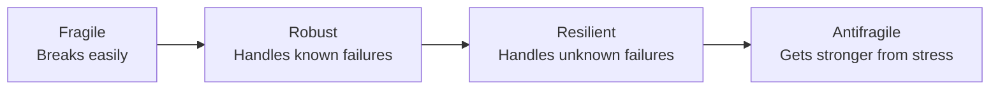
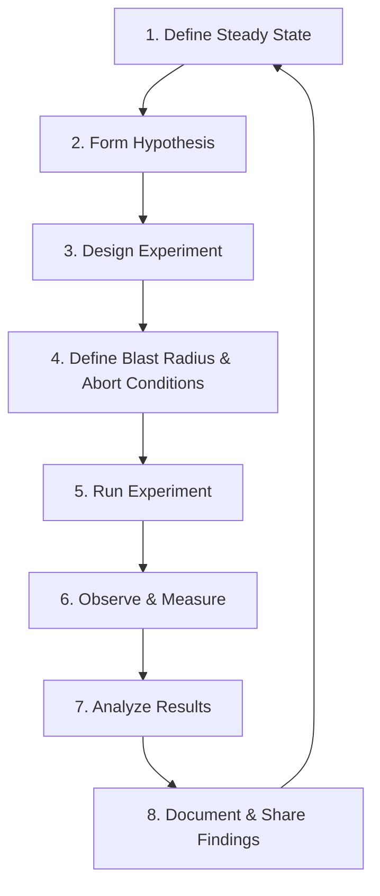
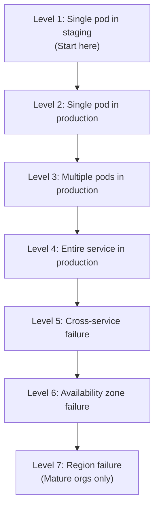
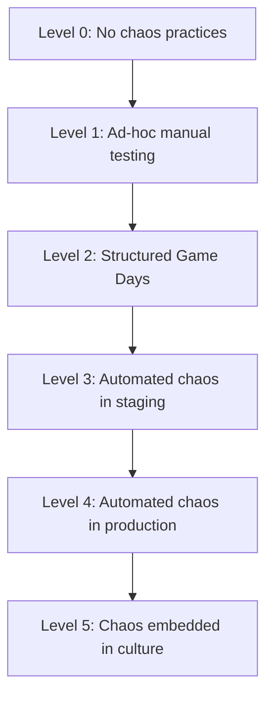
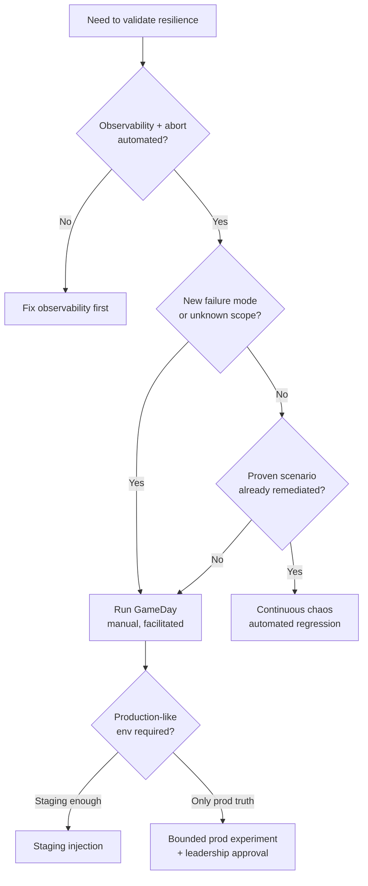

> **Discipline Module** | Complexity: `[QUICK]` | Time: 1.5 hours

## Prerequisites

Before starting this module:
- **Required**: [Kubernetes Basics](/prerequisites/kubernetes-basics/) — Core cluster concepts and workloads
- **Required**: [Release Engineering](/platform/disciplines/delivery-automation/release-engineering/) — Understanding deployment pipelines and rollbacks
- **Recommended**: Experience operating at least one production system
- **Recommended**: Familiarity with monitoring concepts (Prometheus, Grafana)

---

## What You'll Be Able to Do

After completing this module, you will be able to:

- **Design chaos engineering experiments with clear hypotheses, blast radius controls, and abort conditions**
- **Evaluate system resilience by identifying failure modes that monitoring and testing alone cannot catch**
- **Implement a chaos engineering program with incremental adoption from simple to complex experiments**
- **Build organizational buy-in for chaos engineering by communicating risk reduction in business terms**

## Why This Module Matters

**Hypothetical scenario:** A streaming platform team pushes a routine configuration change to a critical microservice on a Tuesday afternoon. Within roughly 45 minutes, checkout latency climbs, error rates spike, and support tickets flood in — not because the change was obviously wrong in code review, but because nobody had tested what would happen when that exact dependency slowed during peak traffic. The rollback takes two hours because the failure mode was emergent: healthy components interacting badly under a condition the test suite never simulated.

That uncomfortable pattern — discovering resilience gaps only when customers feel them — is exactly what chaos engineering was created to prevent. The discipline, formalized in the [Principles of Chaos Engineering](https://principlesofchaos.org/) by Netflix engineers Kolton Andrus and Casey Rosenthal, treats production systems as hypotheses to be tested rather than treasures to be guarded until they break on their own. Netflix's lineage from [Chaos Monkey](https://netflix.github.io/chaosmonkey/) through the broader [Simian Army](https://netflixtechblog.com/the-netflix-simian-army-16e57fbab116) to [Failure Injection Testing (FIT)](https://netflixtechblog.com/fit-failure-injection-testing-35d8db1bb9bb) and [ChAP (Chaos Automation Platform)](https://netflixtechblog.com/chaos-engineering-upgraded-8b929b87919d) shows how a single insight scaled into organizational practice: run thoughtful, controlled experiments in production to surface weaknesses before they become outages.

**Here's the uncomfortable truth that every SRE eventually learns:** your distributed system will fail in ways you did not explicitly design for. The only meaningful choice is whether you discover those failure modes on your terms — during a planned experiment at 2 PM on a Tuesday with abort conditions armed — or on production's terms at 3 AM on a holiday when your on-call engineer is alone and your dashboards are incomplete. Chaos engineering is not pessimism; it is the engineering discipline of converting unknown unknowns into known unknowns, then into remediated risks.

This module teaches the philosophy, scientific method, and safety practices that precede any chaos tool. You will learn what chaos engineering is and is not, how to define steady state with user-facing signals, how blast radius and abort conditions separate experiments from outages, and how GameDays and continuous chaos fit into a mature reliability program. The goal is durable practice you can apply with any injection mechanism — not a product tour that expires when vendor feature lists change.

---

## What Chaos Engineering Is — and What It Is Not

The biggest misconception about chaos engineering is also the most dangerous one: that it means randomly breaking production and watching what happens. That is vandalism with a monitoring dashboard, not engineering. Chaos engineering is a **disciplined investigation** that follows the scientific method as rigorously as a laboratory experiment. You define what "normal" means in measurable terms, form a falsifiable hypothesis about how the system should behave under stress, inject a real-world failure mode within a bounded blast radius, observe whether steady state holds, and document what you learned. When the hypothesis fails, the experiment succeeded — you found a weakness worth fixing.

The [Principles of Chaos Engineering](https://principlesofchaos.org/) articulate this mindset explicitly. The first principle states that a distributed system's steady state is defined by measurable output that indicates normal behavior — not by internal gauges that can look healthy while users suffer. The second principle requires you to hypothesize that steady state will continue in both control and experimental conditions. The third mandates varying real-world events such as server crashes, network latency, or dependency unavailability. The fourth insists you try to disprove the hypothesis by looking for a difference in steady state between control and experiment groups. The fifth turns every finding into action: if steady state breaks, you have found a weakness to address before it finds you.

Understanding what chaos is **not** protects your program from being shut down after the first preventable incident. Chaos engineering is not load testing, though both stress systems — load testing asks "how much traffic can we serve?" while chaos asks "what happens when a dependency fails during that traffic?" It is not penetration testing, which models adversarial intrusion rather than infrastructure failure. It is not a substitute for unit tests, integration tests, or code review; those validate components in isolation or in happy-path combinations. Chaos validates **emergent behavior** — properties that arise only when real components interact under real failure conditions in an environment that resembles production.

Every distributed system exhibits emergent behaviors that no single-component test can predict. Consider a microservices application with twenty services, each passing its own test suite. Service A retries failed calls to Service B. Service B slows because Service C's database is hot. A's retries amplify load on B, which cascades into Service D, whose thirty-second timeout blocks worker threads and stalls Service E. No individual service is "broken" in the traditional sense; the system fails because of interaction dynamics that appear only under specific timing and load. Chaos engineering is designed to surface exactly these interaction failures by injecting the timing and failure conditions that integration suites typically skip.

The distinction between **robustness** and **resilience** matters when you set program goals. Robustness means the system handles **known** failure modes you have already tested and coded for — a bridge rated for a defined wind load. Resilience means the system withstands **unknown or unexpected** failure modes and recovers gracefully — a bridge that sways in wind patterns engineers did not model and returns to equilibrium afterward. Chaos engineering primarily builds resilience: the confidence that when something you did not plan for happens, the system degrades in a bounded way and recovers without human heroics.



Netflix's early Chaos Monkey experience illustrates the antifragile end state when practice becomes culture: engineers initially resisted automated instance termination, then redesigned services so single-instance loss became invisible to customers. Each experiment drove a small improvement; over months the platform absorbed failures that would previously have caused visible outages. That trajectory — experiment, finding, fix, repeat — is the durable outcome chaos programs aim for, independent of which tool performs the injection.

---

## The Experiment Method: Five Steps and Why Each One Exists

Every chaos experiment, whether run manually during a GameDay or automatically through a scheduler, follows the same scientific spine. Skipping a step converts engineering into gambling. The cycle is intentionally repetitive: define steady state, form a hypothesis, design the experiment with safety bounds, execute while observing, analyze results, document and share, then refine and run again at slightly larger scope.



### Step 1: Define Steady State as Measurable Output

Before you can detect deviation, you must define "normal" in terms that reflect user experience. The Principles of Chaos Engineering insist that steady state be expressed through **measurable output** — service-level indicators (SLIs) such as success rate, latency percentiles, or throughput — rather than internal resource metrics alone. A pod can show perfect CPU and memory while the application drops transactions in a retry storm; steady state defined only on infrastructure metrics will lie to you at the worst possible moment.

Good steady-state definitions combine technical and business signals. Request latency at the ninety-ninth percentile below two hundred milliseconds, error rate below one tenth of one percent, order completion rate above ninety-eight and a half percent, and queue depth below five hundred messages each describe observable outcomes tied to customer value. When you align steady state with [SLOs](/platform/disciplines/core-platform/sre/module-1.2-slos/) your organization already uses, chaos experiments speak the same language as error-budget policy and incident response.

```yaml
# Example: Steady state as a monitoring rule
# This becomes your "is the experiment safe?" check
groups:
  - name: chaos-steady-state
    rules:
      - alert: SteadyStateViolation
        expr: |
          (
            histogram_quantile(0.99, rate(http_request_duration_seconds_bucket[5m])) > 0.2
            or
            sum(rate(http_requests_total{code=~"5.."}[5m])) / sum(rate(http_requests_total[5m])) > 0.001
            or
            rate(orders_completed_total[5m]) / rate(orders_started_total[5m]) < 0.985
          )
        for: 1m
        labels:
          severity: chaos-abort
```

### Step 2: Form a Falsifiable Hypothesis

A chaos hypothesis states what you expect to remain true during the experiment and **why** you believe the system's resilience mechanisms will hold. The canonical template from the Principles document is:

> **"We believe that [steady state behavior] will continue even when [failure condition], because [resilience mechanism]."**

Strong hypotheses are specific enough to fail. "We believe order processing will continue within three seconds even when the payment service pod is killed, because Kubernetes restarts the pod within thirty seconds and the order service retries with bounded backoff" gives you a clear pass/fail criterion. Weak hypotheses — "the system should handle pod failures" or "performance won't degrade" — cannot teach you anything because they cannot be disproven.

The hypothesis is also your communication tool for organizational buy-in. When you tell a product manager that you will kill one of three payment pods for ten minutes with automated abort if checkout success drops below ninety-five percent, you are describing a bounded scientific test — not asking permission to break production randomly.

### Step 3: Design the Experiment Specification

An experiment specification is a contract between the team running chaos and everyone who might be affected. It names the owner, approvers, environment, injection type, target selectors, duration, steady-state queries, abort thresholds, and rollback steps. Writing the spec before touching any tool forces clarity about scope and prevents "we'll just kill a pod and see" improvisation.

```yaml
# Chaos Experiment Specification (human-readable)
experiment:
  name: "Payment service pod failure during checkout"
  date: "2026-03-24"
  owner: "platform-team"
  approvers: ["lead-sre", "payment-team-lead"]

  hypothesis: >
    Order completion rate stays above 98.5% when the payment
    service pod is killed, due to Kubernetes auto-restart
    and order-service retry logic.

  steady_state:
    metrics:
      - name: order_completion_rate
        query: "rate(orders_completed[5m]) / rate(orders_started[5m])"
        expected: ">= 0.985"
      - name: p99_latency
        query: "histogram_quantile(0.99, rate(http_duration_bucket[5m]))"
        expected: "<= 0.5"

  injection:
    type: pod-kill
    target: "payment-service"
    namespace: "production"
    selector:
      app: payment-service
    count: 1  # kill 1 of 3 replicas

  abort_conditions:
    - "order_completion_rate < 0.95 for 2 minutes"
    - "p99_latency > 2s for 1 minute"
    - "any 500 errors on checkout endpoint"

  blast_radius:
    scope: "payment-service namespace only"
    max_impact: "1 pod out of 3 replicas"
    customer_impact: "possible 2-3s delay for ~5% of checkouts"

  duration: 10 minutes
  rollback: |
    kubectl get pods -l app=payment-service -n production -w
    kubectl scale deployment/payment-service -n production --replicas=3
```

### Step 4: Blast Radius and Abort Conditions

**Blast radius** is the maximum impact zone if everything goes wrong — not the impact you expect, the impact you are willing to accept to learn. Mature programs expand blast radius incrementally: one pod in staging, one pod in production, multiple pods, entire service, cross-service dependencies, availability zone, and only for very mature organizations, region-level faults. Each level should succeed repeatedly before you advance. Jumping to region failover on your first experiment violates the core safety principle and converts learning into outage response.

**Abort conditions** are the emergency brake that separates a controlled experiment from an incident you caused. They must be decided before execution, expressed as measurable thresholds, wired to automation that can halt injection, and tested in a dry run so you trust they fire. A human watching a dashboard is too slow and too subjective when error rates spike exponentially during a retry storm.



If your abort fires ten seconds into an experiment, that is often a **successful** outcome: you discovered that steady state breaks faster than expected, within bounds you defined, with injection stopped automatically. The failure would have happened eventually without chaos; you merely scheduled it on safer terms.

### Step 5: Execute, Observe, Analyze, and Share

Execution should happen when the team is available — business hours on Tuesday through Thursday for most organizations — with communication channels open and incident response ready if abort conditions fail. Observe dashboards and logs in real time, recording timestamps and qualitative notes alongside metrics. Analysis asks a single question: did the system behave as hypothesized? If yes, consider a slightly larger blast radius next time. If no, file remediation work and treat the finding as a win.

Sharing results broadly is non-negotiable. Undocumented experiments provide no organizational learning and cannot be reproduced. Tie findings to [blameless postmortem culture](/platform/disciplines/core-platform/sre/module-1.6-postmortems/): chaos reveals systemic gaps, not individual mistakes. The organizational confidence built through transparent sharing is what unlocks production experiments later.

---

## Steady-State Signals: Why User-Facing SLIs Beat Internal Metrics

Internal metrics — CPU utilization, memory pressure, garbage-collection pauses, pod restart counts — are necessary for debugging but dangerous as sole steady-state signals. They measure **causes** and **symptoms of infrastructure**, not **outcomes for users**. A service can sit at forty percent CPU while failing every checkout because a downstream authorization call times out and the application swallows errors incorrectly. Chaos experiments that only watch CPU will declare success while customers cannot pay.

User-facing SLIs align chaos with how your organization already thinks about reliability. If your checkout SLO defines success as ninety-nine point nine percent of requests completing under five hundred milliseconds, your steady-state hypothesis should reference that SLI directly. When chaos consumes a tiny slice of error budget deliberately, you can explain the trade to product leadership in terms they already approved rather than inventing a parallel metric language.

The [Google SRE Book chapter on testing for reliability](https://sre.google/sre-book/testing-reliability/) places proactive failure testing alongside other verification strategies because production is the only environment that combines real traffic patterns, real configuration drift, real dependency versions, and real operator fatigue. Chaos is not a replacement for pre-production testing; it is the complement that asks whether all your prior testing survived contact with production reality.

Choosing steady state also forces you to validate observability before injecting faults. If you cannot measure the SLI reliably at experiment granularity, you are not ready to run chaos in that environment — fix dashboards and alerts first, then return to the hypothesis.

Operationalizing steady state for abort automation often means wiring Prometheus alerts or equivalent monitors to your chaos controller's pause API. The [SRE Workbook guidance on alerting on SLOs](https://sre.google/workbook/alerting-on-slos/) recommends multi-window burn-rate alerts because single-threshold alerts either fire too late or flap uselessly. Chaos abort conditions can reuse the same burn-rate logic: if checkout error budget consumption exceeds a safe rate during an experiment, halt injection immediately and file a finding. Reusing SLO infrastructure keeps chaos from inventing a parallel alerting language that on-call engineers must learn separately.

---

## Blast Radius, Safety Culture, and Production Experiments

Running chaos in production sounds reckless until you understand that **production is where the truth lives**. Staging clusters often lack realistic traffic mixes, data volumes, feature-flag combinations, and third-party integration behavior. An experiment that passes in staging and fails in production teaches that staging lied — a valuable finding, but one that means you still need production experiments eventually, carefully bounded.

Safety culture prerequisites must exist before the first injection regardless of environment. You need observability that can detect steady-state violation, rollback or halt capability, explicit communication to stakeholders, management approval for production scope, and an incident process that treats experiment-triggered degradation like any other incident until abort confirms otherwise. The [opt-in principle](https://principlesofchaos.org/) matters culturally: teams volunteer services, define their own steady state and abort thresholds, participate in experiments on their code, and own remediation. Mandated chaos without ownership breeds resentment and corner-cutting.

Communicating about chaos to leadership requires reframing risk. Say "we verify resilience claims before customers test them for us," not "we break production for fun." Present blast-radius analysis, abort conditions, and rollback plans as seriously as you would a production deployment review. Connect deliberate experiments to [error budgets](/platform/disciplines/core-platform/sre/module-1.3-error-budgets/): spending a small, controlled fraction of budget on chaos prevents spending the entire budget on an unplanned outage.

```yaml
# Example abort configuration (Chaos Mesh style)
apiVersion: chaos-mesh.org/v1alpha1
kind: PodChaos
metadata:
  name: payment-pod-kill
spec:
  action: pod-kill
  mode: one
  selector:
    namespaces:
      - production
    labelSelectors:
      app: payment-service
  duration: "10m"
```

---

## GameDays, Continuous Chaos, and Organizational Learning

Two modes of practice coexist in mature organizations: **GameDays** and **continuous chaos**. Neither replaces the other; they solve different problems along the maturity curve.

A GameDay is a scheduled, facilitated exercise — a fire drill for your infrastructure. Participants hold defined roles: Game Master coordinates timing, Experimenter executes injection, Observer records metrics, Communicator interfaces with stakeholders, and Scribe documents findings in real time. The schedule includes steady-state verification before each experiment, timed injections, debriefs after each finding, and a closing retrospective that produces action items with owners. GameDays excel when you are introducing chaos to a new environment, testing multi-service scenarios, training incident responders, or validating resilience before a high-traffic event.

Continuous chaos automates well-understood experiments on a cadence — hourly, daily, or triggered by deployments. This is the model Netflix evolved toward with FIT and ChAP: once a failure mode is understood and remediated, automated injection prevents regression as code and configuration change. Continuous chaos is inappropriate as a starting point; running automated pod kills in production before anyone has validated abort wiring is how programs die in committee.



GameDays also build the cross-team relationships that make production experiments survivable. When payment, platform, and observability engineers have already run a tabletop together, the Slack message "starting chaos experiment CHK-204, abort on checkout SLO burn" lands in a shared context instead of triggering panic.

Running a successful GameDay requires logistical discipline as much as technical skill. Publish the schedule at least one week ahead so on-call rotations can be adjusted and customer-facing teams know when to expect elevated error budgets. Assign the Scribe role to someone who is not also the Experimenter — dual-hatting during injection leads to incomplete records. Hold debriefs immediately after each experiment while observations are fresh; waiting until end-of-day collapses distinct findings into vague memory. End every GameDay with a prioritized action list: each finding becomes an owner, a severity, and a target date, just like postmortem action items. Without that closure loop, GameDays become interesting theatre that never changes system design.

Continuous chaos complements GameDays by guarding against **resilience regression**. Modern teams deploy daily or hourly; code that passed last quarter's GameDay may have new retry logic, changed timeout defaults, or altered feature flags that reintroduce cascading failure. Automated experiments triggered on a schedule or after deployments catch those regressions within hours instead of months. The investment in automation pays off only after manual experiments have validated both the scenario and the abort wiring — automating a flawed experiment scales outages, not confidence.

When choosing between scheduling another GameDay and automating a proven scenario, ask whether the failure mode is **novel** or **regression-prone**. Novel modes — multi-service partitions, new region failover architecture, first experiment in a freshly migrated cluster — deserve facilitated GameDays with broad attendance. Regression-prone modes — single pod kill on a mature stateless service, dependency latency below circuit-breaker threshold — belong in continuous chaos with metrics exported to the same SLO dashboards leadership already reviews.

Document every experiment's steady-state queries and abort thresholds in version control alongside the application code they validate. When an engineer changes retry defaults or timeout values in a pull request, reviewers should see linked chaos experiment specs that must pass before merge — the same way unit tests gate correctness. That integration closes the loop between code change and resilience regression, which is the ultimate purpose of chaos engineering as a continuous engineering discipline rather than an annual event. Treat experiment specs as living documents that reviewers update when architecture changes, and retire experiments that no longer reflect the current production topology or steady-state definitions.

---

## Where Chaos Fits Among Other Reliability Practices

Chaos engineering does not replace your existing quality strategy; it occupies a specific niche in the verification portfolio. **Load and performance testing** establishes capacity ceilings and latency under expected peak traffic. **Failure-mode and effects analysis (FMEA)** systematically enumerates hypothetical failures before build-out. **Integration and end-to-end testing** validate expected paths through composed services. **Chaos engineering** injects real failures into running systems to observe emergent behavior those methods miss.

The relationship to SRE error budgets is particularly practical. An SLO with a ninety-nine point nine percent monthly target leaves roughly forty-three minutes of acceptable downtime per month — see the [availability table in the SRE Book](https://sre.google/sre-book/availability-table/). Deliberate chaos should consume minutes, not hours, of that budget, and should be scheduled when remaining budget is healthy, not when you are already in breach. The argument to skeptical product managers is economic: controlled experiments cost minutes of budget; uncontrolled outages cost reputation, revenue, and engineer sleep.

The [AWS Well-Architected Reliability pillar](https://docs.aws.amazon.com/wellarchitected/latest/reliability-pillar/test-resiliency.html) similarly recommends resiliency testing including failure injection as part of production readiness — not because failures are desirable, but because undiscovered failure modes are guaranteed inventory in distributed systems.

> **Landscape snapshot — as of 2026-06. This changes fast; verify against vendor docs before relying on specifics.**

| Capability | Chaos Mesh | LitmusChaos | AWS FIS | Gremlin (SaaS) |
|------------|------------|-------------|---------|----------------|
| Kubernetes-native CRD injection | Yes | Yes | Via EKS targets | Agent-based |
| Pod/process kill | Yes | Yes | Yes (EC2/ECS/EKS) | Yes |
| Network latency/partition | Yes | Yes | Yes | Yes |
| Resource stress (CPU/mem/IO) | Yes | Yes | Limited | Yes |
| Hypothesis/experiment workflow UI | Dashboard | ChaosCenter | Console wizard | SaaS console |
| CNCF project status | Incubating (verify at [landscape.cncf.io](https://landscape.cncf.io/?selected=chaos-mesh)) | Sandbox (verify at [cncf.io/projects/litmus](https://www.cncf.io/projects/litmus/)) | AWS managed service | Commercial |

The durable lesson is the **method** — steady state, hypothesis, bounded injection, abort, learn — not which row you pick this quarter. Module 1.2 walks through one Kubernetes-native implementation; the principles here apply regardless.

---

## Real-World Events to Inject: Choosing Faults That Teach

The third principle of chaos engineering requires varying **real-world events** — not synthetic errors that your application code never encounters in production. The faults you inject should mirror what actually breaks distributed systems: processes die, networks slow or partition, disks fill, certificates expire, DNS misbehaves, dependencies return errors, and entire zones become unreachable. The art is matching fault type to hypothesis so a failed experiment tells you exactly which resilience mechanism did not work.

**Instance and process failure** is the classic starting point because orchestrators like Kubernetes are built to replace failed pods. Killing one replica of a stateless deployment tests whether your Service endpoints update promptly, whether clients retry with backoff instead of hammering, and whether HPA scales correctly when capacity drops. The [Kubernetes pod lifecycle documentation](https://kubernetes.io/docs/concepts/workloads/pods/pod-lifecycle/) describes termination grace periods and restart policies that directly affect how quickly steady state recovers after pod-kill experiments.

**Resource exhaustion** — CPU throttling, memory pressure, disk fill, I/O latency — surfaces autoscaling misconfiguration, missing limits, and garbage-collection stalls that pod-kill tests miss. A service that survives instance death but collapses under memory pressure needs different remediation: right-sizing, cache bounds, or streaming instead of buffering.

**Network faults** reveal the majority of emergent failures in microservice architectures. Adding two hundred milliseconds of latency between the API gateway and a downstream service tests timeout alignment: if the gateway times out at one hundred milliseconds while the client retries three times, you have engineered a retry storm without any service being "down." Packet loss and partition faults test split-brain behavior in clustered data stores and cache invalidation paths that happy-path integration suites rarely cover.

**Dependency failure** injection asks what happens when a third-party payment API, identity provider, or message broker returns five hundred errors or hangs indefinitely. Circuit breakers, bulkheads, and graceful degradation patterns exist precisely for these scenarios — chaos proves whether they are configured with realistic thresholds rather than copied from a blog post.

**Regional and zonal faults** belong at the top of the maturity ladder. Simulating availability-zone loss validates that replicas spread across failure domains actually fail independently, that DNS or load balancers shift traffic within minutes, and that data replication lag does not violate consistency promises. These experiments demand executive sponsorship, careful customer communication, and months of smaller successes beneath them.

Each fault type should appear in your experiment backlog with a linked hypothesis, not as a menu you randomize. When a pod-kill experiment passes but latency injection fails, you have learned that your recovery mechanisms are compute-centric while your timeout graph is fragile — a precise finding that drives prioritized remediation instead of vague "improve resilience" tickets.

---

## Building Organizational Buy-In Beyond the Engineering Team

Chaos engineering fails in organizations that treat it as a platform team hobby. Reliability is a product concern because downtime is a revenue and trust concern. Building buy-in means translating hypotheses and blast-radius documents into the language of risk management that directors and product managers already use when they approve SLOs and on-call rotations.

Start by connecting chaos to **error-budget policy** rather than opposing it. When leadership has already accepted that a ninety-nine point nine percent SLO implies roughly forty-three minutes of acceptable downtime per month, you are not asking for new risk — you are asking to **spend** a few minutes of that budget deliberately. The [Google SRE Book on embracing risk](https://sre.google/sre-book/embracing-risk/) frames this trade explicitly: pursuing one hundred percent availability costs more than it returns and slows feature delivery. Chaos becomes the mechanism that ensures budget spent on experiments buys knowledge instead of surprise.

Second, present chaos proposals with the same rigor as production launches. Include environment, duration, steady-state SLIs, abort thresholds, named approvers, communication plan, and rollback steps. Directors who see a two-page experiment spec react differently than directors who hear "we might kill some pods Thursday." The rigor signals that your team respects production gravity.

Third, share wins and near-misses broadly. When a chaos experiment discovers a missing circuit breaker before Black Friday, quantify the prevented scenario in terms of checkout failure rate and support load — without inventing revenue figures you cannot verify. When an abort fires correctly, celebrate the safety mechanism as loudly as a passing hypothesis. Organizations adopt practices they see working for peers; siloed chaos results stay siloed.

Fourth, use **opt-in volunteering** to build champions. The payment team that defined its own steady state and fixed its own retry bug becomes an advocate in planning meetings where platform teams alone would be ignored. Mandating chaos on teams that did not participate in hypothesis design breeds workarounds: hidden feature flags, maintenance windows that mysteriously align with experiment schedules, and shadow environments that do not represent production.

Finally, pair early chaos efforts with GameDays that include product and support stakeholders as observers. Watching steady state dip on a dashboard and recover within abort bounds demystifies the practice. Support leads who see that experiments run with explicit customer-impact bounds become allies when you later request carefully bounded production scope.

---

## Contrasting Chaos with Load Testing and Failure-Mode Analysis

Teams already invest heavily in verification; chaos should complement rather than duplicate. **Load and performance testing** answers capacity questions: at what requests-per-second does latency exceed SLO, where is the saturation knee, does autoscaling add capacity fast enough for expected peaks? Load tests typically run success-path traffic at increasing volume. They rarely combine peak load with a dependency failure — yet production does exactly that when the catalog database slows during a flash sale.

**Failure-mode and effects analysis (FMEA)** is a design-phase structured brainstorm. Engineers enumerate components, assign severity and likelihood scores, and prioritize mitigations before build-out. FMEA is invaluable and inexpensive relative to runtime experiments, but it suffers from imagination limits: participants predict failures they have seen before. Chaos tests the combinations nobody listed — the interaction failures that appear only when real traffic meets real latency under real configuration.

**Integration and end-to-end tests** validate composed happy paths and a limited set of error stubs. Mocks, by design, simplify dependency behavior. A mocked payment service returns instantly or fails cleanly; a real payment gateway slows under issuer load and returns ambiguous timeout errors. Chaos injects realistic imperfection that mocks cannot replicate without becoming full simulators — at which point you are maintaining a second production.

The [Google SRE Book chapter on testing for reliability](https://sre.google/sre-book/testing-reliability/) places these techniques on a spectrum from least to most production-faithful. Unit tests are fast and precise but local. Integration tests widen scope but still control inputs. Load tests stress capacity. Chaos and disaster-recovery drills ask whether the entire system — code, config, networking, operators — survives contact with reality. Mature organizations keep all layers and allocate sprint capacity proportionally: most testing remains fast and pre-production, while a small, disciplined fraction runs in production with safety bounds.

When prioritizing the next experiment, ask which verification gap you are closing. If nobody knows whether the new autoscaling policy triggers under CPU pressure during deploys, a load test may suffice. If everyone assumes retries are safe but incident reviews mention mysterious latency spikes, chaos latency injection is the right tool. Matching method to uncertainty prevents chaos from becoming a theatrical duplicate of tests you already run well.

---

## Patterns and Anti-Patterns

### Patterns That Work

**Hypothesis-first design** means no injection runs without a written, falsifiable prediction tied to a user-facing SLI. Teams that skip this step cannot distinguish "we learned something" from "we caused pain and guessed why."

**Incremental blast-radius expansion** treats each successful small experiment as the gate for the next scope level. Pod in staging, pod in production, two pods, dependency latency, zone fault — the ladder is slow by design.

**Automated abort wired to SLO burn** stops experiments faster than human reaction time and produces auditable evidence that safety mechanisms work. Test abort in a non-destructive dry run before the first real injection.

**Blameless dissemination** publishes findings as systemic improvements linked to postmortem culture. Celebrating a broken hypothesis builds the trust required for production scope.

**Opt-in service ownership** lets teams that know their failure modes define steady state and remediation. Forced chaos on unwilling owners produces workarounds, not resilience.

### Anti-Patterns to Avoid

**Random destruction** — deleting all pods, killing nodes without selectors, or "trying something cool" — destroys program credibility in one afternoon and teaches nothing falsifiable.

**Infrastructure-only steady state** that ignores business SLIs declares victory while customers fail checkout; this anti-pattern is the most common first-experiment mistake.

**Friday afternoon production experiments** leave teams holding incidents across weekends when staffing is thin; schedule chaos when responders and approvers are present.

**Tool-first adoption** that buys a chaos platform before observability and abort automation exist automates outages instead of experiments.

**One-and-done GameDays** that never convert proven scenarios to continuous regression allow daily deploys to undo resilience gains within weeks.

**Punishing findings** by blaming the engineer whose service broke during injection guarantees chaos will go underground rather than disappear.

### Decision Framework: Which Experiment Mode Now?



Use the framework when prioritizing work: if you cannot answer whether steady state broke, no mode is appropriate yet. If the scenario is novel, GameDay structure provides learning and relationship-building. If the scenario is proven and you fear regression from frequent deploys, automate it.

---

## Did You Know?

- **Chaos Monkey's 2011 debut**: Netflix [open-sourced Chaos Monkey in 2011](https://netflixtechblog.com/chaos-monkey-released-2011-7b417b964b32) to randomly terminate EC2 instances in production during business hours, forcing engineers to build stateless, redundant services rather than assuming instance permanence.
- **Formal principles in 2015**: Kolton Andrus and Casey Rosenthal published the [Principles of Chaos Engineering](https://principlesofchaos.org/) to rename "chaos testing" into an engineering discipline with explicit hypotheses, steady-state definitions, and production experimentation norms.
- **From monkeys to automation platforms**: Netflix evolved from Chaos Monkey through the [Simian Army](https://netflixtechblog.com/the-netflix-simian-army-16e57fbab116) suite to [FIT](https://netflixtechblog.com/fit-failure-injection-testing-35d8db1bb9bb) and [ChAP](https://netflixtechblog.com/chaos-engineering-upgraded-8b929b87919d), showing how manual GameDay insights become automated regression tests at scale.
- **Kubernetes-native chaos in CNCF**: [Chaos Mesh](https://chaos-mesh.org/) and [LitmusChaos](https://litmuschaos.io/) bring CRD-based fault injection to Kubernetes clusters; maturity levels change — verify current status on the [CNCF landscape](https://landscape.cncf.io/?selected=chaos-mesh) before architecture decisions.

---

## Common Mistakes

| Mistake | Why It's a Problem | Better Approach |
|---------|-------------------|-----------------|
| Running chaos without observability | You cannot measure impact if you cannot see steady-state deviation — the experiment is useless or dangerous | Set up SLI dashboards and alerts first; verify you can detect violation before injecting |
| Skipping the hypothesis step | Without a hypothesis, you are breaking things randomly with no learning objective | Always write "We believe X will continue because Y" before any injection |
| Starting in production | First experiments risk customer impact while the team still learns tools and abort wiring | Start in staging; graduate to production only after repeated successful smaller runs |
| No abort conditions | Without automated abort, a runaway experiment becomes a real outage you caused | Define metrics-based abort thresholds and test they trigger before running |
| Running experiments on Fridays | Lasting damage lands when weekend staffing is thin | Run chaos Tuesday through Thursday during business hours with full team availability |
| Blaming individuals for findings | Blame kills program trust instantly; engineers will hide services from chaos | Treat findings as systemic improvements; celebrate discovery in blameless reviews |
| Too large a blast radius too soon | Massive first experiments guarantee outages instead of bounded learning | Start with one pod in staging; increase scope only after consecutive successes |
| Not documenting results | Undocumented experiments provide no organizational learning and cannot be reproduced | Write hypothesis, results, and action items; share in postmortem-style reviews |

---

## Quiz

Test your understanding of Chaos Engineering principles:

### Question 1: Random Vandalism vs. Engineering

> A junior engineer logs into the staging cluster, runs `kubectl delete pods --all`, and watches the monitoring dashboards to see what happens. When asked, they say they are practicing Chaos Engineering. Why is this engineer incorrect?

<details>
<summary>Answer</summary>

The engineer's actions represent random destruction, not chaos engineering, because they ignored the scientific method entirely. Chaos engineering requires defining measurable steady state, forming a specific falsifiable hypothesis, bounding blast radius, and establishing automated abort conditions before any failure is injected. Deleting every pod without selectors or success criteria teaches nothing precise about resilience mechanisms and risks uncontrolled collateral damage across services. True chaos engineering treats injection as a controlled measurement designed to disprove a hypothesis — not an ad-hoc stress test without safety rails or learning objectives.

</details>

### Question 2: The Right Way to Measure Steady State

> You are designing an experiment for a checkout service. Your steady-state definition checks that CPU usage remains below sixty percent and memory below five hundred twelve megabytes. During the experiment, pod metrics stay within limits, but the customer support desk receives hundreds of calls about failed payments. What fundamental mistake was made?

<details>
<summary>Answer</summary>

The team defined steady state entirely around infrastructure metrics while ignoring the business outcome the service exists to deliver. CPU and memory can remain healthy while application logic fails silently, retries exhaust thread pools, or dependency timeouts corrupt transactions. Valid steady state must include user-facing SLIs such as checkout success rate, payment completion latency, or orders processed per minute. Without business metrics, chaos experiments — and abort conditions — will declare success while customers experience an outage, defeating the purpose of proactive resilience testing.

</details>

### Question 3: Controlling the Blast Radius

> A team's first-ever chaos experiment simulates region-wide database failover in production to prove their new multi-region architecture. Leadership halts the experiment before it begins, citing unacceptable blast radius. What principle did the team violate?

<details>
<summary>Answer</summary>

They violated incremental blast-radius expansion, which requires starting with the smallest scope that can falsify the hypothesis safely. A first experiment should not jump to region-level production faults; it should begin in staging with a single pod or dependency latency injection after observability and abort automation are proven. Large-scope first experiments risk catastrophic customer impact if assumptions are wrong, and they provide no graduated evidence that safety mechanisms work. Build confidence through repeated successful small experiments before advancing the ladder toward zone or region faults.

</details>

### Question 4: Chaos Engineering and Availability Goals

> A product manager demands one hundred percent availability for a new microservice and refuses to authorize chaos experiments because they "might cause downtime." How should you explain the relationship between availability goals and chaos engineering?

<details>
<summary>Answer</summary>

Explain that one hundred percent availability is impractical in distributed systems and that pursuing it encourages risk-averse stagnation. Instead, teams set realistic SLOs — such as ninety-nine point nine percent — and manage an error budget representing acceptable unreliability. Chaos engineering deliberately spends a tiny, controlled portion of that budget to discover hidden failure modes on your schedule rather than during unplanned outages that consume the entire budget at once. Framed this way, chaos is not anti-availability; it is how you protect long-term availability by converting unknown failures into tracked remediations before customers encounter them at scale.

</details>

### Question 5: Designing the First Experiment

> Your team has robust monitoring, CI/CD pipelines, and management approval to begin chaos engineering. You are tasked with designing the very first experiment. Describe the environment, scope, and failure you would choose, and explain why.

<details>
<summary>Answer</summary>

The first experiment should run in staging, target one pod of a stateless service with three replicas, and test a simple hypothesis such as "error rate and latency SLIs remain within SLO when one pod is killed because Kubernetes replaces it within sixty seconds." Abort conditions should fire automatically if error rate exceeds a predefined threshold for one minute. This design validates the team's chaos process — observability queries, communication channels, abort wiring, and rollback steps — while minimizing customer risk. Starting small builds organizational confidence and produces a reproducible template for progressively larger production experiments later.

</details>

### Question 6: Maturing the Practice

> A mature SRE team wants to ensure auto-scaling policies keep working across fifty microservices as code deploys daily. They propose a four-hour GameDay once per quarter to manually test scaling. Why might this be suboptimal, and what should they adopt instead?

<details>
<summary>Answer</summary>

Quarterly GameDays leave three months between validations during which daily deploys can silently break auto-scaling behavior, circuit breakers, or retry policies. Once a failure mode is understood and remediated, it should move from manual GameDay exploration to continuous automated chaos triggered on a schedule or after deployments. Reserve GameDays for novel multi-service scenarios, training, and organizational learning rather than regression-testing known mechanisms. Netflix's progression from Chaos Monkey to FIT and ChAP illustrates the same pattern: automate proven experiments, facilitate new ones.

</details>

### Question 7: Building Organizational Buy-In

> Your director asks why the platform team should spend sprint capacity on "breaking things" instead of feature work. Which arguments best communicate chaos engineering in business terms?

<details>
<summary>Answer</summary>

Frame chaos as proactive risk reduction with bounded cost: controlled experiments surface failures before they become revenue-impacting outages, support tickets, and emergency weekend work. Present a written blast-radius analysis, abort conditions tied to customer-facing SLIs, and explicit rollback steps — the same seriousness as a production launch review. Connect planned experiments to error-budget policy so leadership sees chaos as a deliberate investment of acceptable downtime rather than random heroics. Emphasize that undiscovered failure modes are inventory every distributed system carries; chaos merely schedules their discovery when responders are staffed and stakes are bounded.

</details>

### Question 8: Evaluating Emergent Failures

> Integration tests pass, load tests pass, and all pods show healthy metrics during a traffic spike — yet checkout fails. Why is chaos engineering the appropriate next diagnostic step?

<details>
<summary>Answer</summary>

The symptom suggests an emergent failure mode arising from component interactions under realistic timing and dependency behavior that isolated tests do not reproduce. Integration suites typically validate expected paths; load tests validate capacity under success paths; neither systematically injects dependency latency, partial pod loss, or network partitions during peak load. Chaos engineering designs a hypothesis about checkout steady state and injects a specific real-world fault — such as payment service latency or pod kill — to observe whether retries, circuit breakers, and backoff behave as designed. When the hypothesis fails, you gain a reproducible scenario to fix before the next organic spike triggers the same failure.

</details>

---

## Hands-On

### Objective

Create a complete Chaos Experiment Document for a realistic Kubernetes application. This exercise builds structured thinking about chaos — the most important skill before touching any tool.

### Scenario

You are an SRE for an e-commerce platform running on Kubernetes with an ingress, API gateway, product/cart/order services, catalog database, Redis, and an external payment gateway.

### Tasks

**Task 1**: Define steady state for this system with at least five metrics including business SLIs, technical SLIs, and measurement sources.

**Task 2**: Write three experiment specifications targeting different failure domains: pod failure, network latency, and dependency unavailability.

**Task 3**: For each experiment, include a falsifiable hypothesis, blast-radius assessment, at least three abort conditions, and rollback commands.

**Task 4**: Design a half-day GameDay schedule with roles, debriefs, and buffer time between injections.

### Success Criteria

- [ ] Steady state includes at least two business-facing SLIs, not only CPU or memory
- [ ] All three hypotheses use the "We believe X even when Y because Z" format and are falsifiable
- [ ] Blast radius starts in staging with single-pod or single-dependency scope for the first experiment
- [ ] Abort conditions are metric-based, include thresholds and durations, and could be automated
- [ ] Rollback procedures name specific `kubectl` commands or chaos CRD deletion steps
- [ ] GameDay schedule assigns Game Master, Experimenter, Observer, Communicator, and Scribe roles
- [ ] Document is detailed enough that another engineer could execute without asking clarifying questions

### Example Solution (Experiment A only)

```yaml
experiment:
  name: "Cart Service Pod Failure During Active Shopping"
  date: "2026-03-28"
  owner: "platform-sre"
  environment: staging

  hypothesis: >
    We believe that shopping cart operations (add, view, update)
    will continue with less than 500ms p99 latency even when
    1 of 3 Cart Service pods is killed, because Kubernetes
    will restart the pod within 30 seconds, the API Gateway
    has a 3-second retry with exponential backoff, and Redis
    holds the cart state independently of the Cart Service pods.

  steady_state:
    - metric: cart_operation_success_rate
      expected: ">= 99.5%"
      source: prometheus
    - metric: cart_p99_latency
      expected: "<= 200ms"
      source: prometheus
    - metric: active_shopping_sessions
      expected: "within 10% of pre-experiment count"
      source: redis
    - metric: cart_service_pod_count
      expected: "3 (before), 2 (during), 3 (after recovery)"
      source: kube-state-metrics
    - metric: redis_connected_clients
      expected: ">= 2 (matching healthy pod count)"
      source: redis-exporter

  injection:
    type: pod-kill
    target: cart-service
    namespace: staging
    replicas_before: 3
    pods_to_kill: 1

  abort_conditions:
    - "cart_operation_success_rate < 95% for 1 minute"
    - "cart_p99_latency > 2s for 30 seconds"
    - "active_shopping_sessions drop > 25%"

  blast_radius:
    scope: "staging environment only"
    services_affected: ["cart-service"]
    max_user_impact: "none (staging)"

  rollback: |
    kubectl get pods -l app=cart-service -n staging -w
    kubectl scale deployment/cart-service -n staging --replicas=3
    kubectl wait --for=condition=available deployment/cart-service -n staging --timeout=60s

  duration: "10 minutes"
```

Complete all four tasks to build your chaos experiment planning muscle. This document becomes your template for every future experiment.

---

## Sources

- [Principles of Chaos Engineering](https://principlesofchaos.org/) — Canonical principles defining steady state, hypotheses, and controlled production experimentation by Kolton Andrus and Casey Rosenthal.
- [Chaos Monkey (GitHub documentation)](https://netflix.github.io/chaosmonkey/) — Netflix's original automated instance-termination tool and open-source documentation.
- [Chaos Monkey (GitHub repository)](https://github.com/Netflix/chaosmonkey) — Source repository for Netflix's first production chaos tool released in 2011.
- [Google SRE Book — Testing for Reliability](https://sre.google/sre-book/testing-reliability/) — Google's treatment of proactive failure testing as part of production readiness.
- [Google SRE Book — Embracing Risk](https://sre.google/sre-book/embracing-risk/) — Why perfect reliability is the wrong goal and how risk budgets frame engineering tradeoffs.
- [Google SRE Book — Service Level Objectives](https://sre.google/sre-book/service-level-objectives/) — SLI/SLO vocabulary for defining steady state and error budgets that chaos experiments should respect.
- [Google SRE Book — Postmortem Culture](https://sre.google/sre-book/postmortem-culture/) — Blameless learning practices that chaos findings should feed into.
- [Google SRE Book — Monitoring Distributed Systems](https://sre.google/sre-book/monitoring-distributed-systems/) — Symptom-oriented monitoring and the four golden signals for user-facing steady state.
- [Google SRE Book — Availability Table](https://sre.google/sre-book/availability-table/) — Nines of availability translated into downtime budgets for error-budget conversations.
- [SRE Workbook — Implementing SLOs](https://sre.google/workbook/implementing-slos/) — Practical steps connecting SLIs, SLOs, and error budgets to operational policy.
- [SRE Workbook — Alerting on SLOs](https://sre.google/workbook/alerting-on-slos/) — Multi-window burn-rate alerting aligned with budget consumption including planned experiments.
- [Chaos Mesh](https://chaos-mesh.org/) — Kubernetes-native chaos engineering platform documentation and architecture.
- [Chaos Mesh — CNCF Landscape entry](https://landscape.cncf.io/?selected=chaos-mesh) — Current CNCF maturity and project metadata (verify before architecture decisions).
- [LitmusChaos](https://litmuschaos.io/) — Kubernetes chaos engineering framework with ChaosCenter workflow UI.
- [Litmus — CNCF project page](https://www.cncf.io/projects/litmus/) — CNCF sandbox project information for LitmusChaos.
- [AWS Fault Injection Service — What is FIS?](https://docs.aws.amazon.com/fis/latest/userguide/what-is.html) — Amazon's managed fault-injection service for AWS workloads.
- [AWS Well-Architected — Test resiliency](https://docs.aws.amazon.com/wellarchitected/latest/reliability-pillar/test-resiliency.html) — Reliability pillar guidance on resiliency testing including failure injection.
- [Chaos Mesh GitHub repository](https://github.com/chaos-mesh/chaos-mesh) — Source, CRD definitions, and installation references for Chaos Mesh.
- [LitmusChaos GitHub repository](https://github.com/litmuschaos/litmus) — Source and experiment hub documentation for Litmus.
- [InfoQ — Chaos Engineering article](https://www.infoq.com/articles/chaos-engineering/) — Practitioner-oriented overview connecting principles to industrial practice.
- [Gremlin — What is Chaos Engineering?](https://www.gremlin.com/chaos-engineering/what-is-chaos-engineering) — Vendor-neutral explainer of definitions, prerequisites, and experiment phases.
- [Kubernetes — Pod Lifecycle](https://kubernetes.io/docs/concepts/workloads/pods/pod-lifecycle/) — Official documentation for pod restart and termination behavior relevant to pod-kill experiments.

---

## Next Module

Continue to [Module 1.2: Chaos Mesh Fundamentals](../module-1.2-chaos-mesh/) — Install, configure, and run your first chaos experiments using Chaos Mesh CRDs on a Kubernetes cluster.
