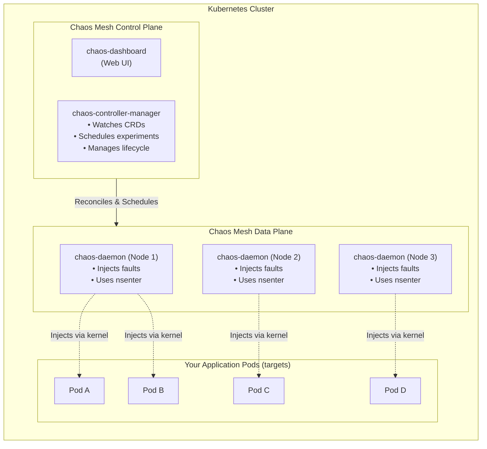

> **Discipline Module** | Complexity: `[MEDIUM]` | Time: 2.5 hours

## Prerequisites

Before starting this module:
- **Required**: [Module 1.1: Principles of Chaos Engineering](../module-1.1-chaos-principles/) — Understand hypotheses, blast radius, and abort conditions
- **Required**: [Kubernetes Basics](/prerequisites/kubernetes-basics/) — Deployments, Services, Namespaces, RBAC
- **Recommended**: A running Kubernetes cluster (kind or minikube)
- **Recommended**: Helm 3 installed

---

## What You'll Be Able to Do

After completing this module, you will be able to:

- **Implement Chaos Mesh on Kubernetes with proper RBAC, namespace scoping, and experiment scheduling**
- **Design pod-level chaos experiments — kill, CPU stress, memory stress, I/O delay — with Chaos Mesh CRDs**
- **Configure Chaos Mesh dashboards and workflows for recurring reliability validation**
- **Build automated chaos experiments that run as part of CI/CD pipelines before production deployments**

## Why This Module Matters

In the previous module, you learned the theory of Chaos Engineering — hypotheses, steady state, blast radius, safety nets. Theory is essential, but it doesn't tell you anything you didn't already suspect about your systems.

What actually tells you something new is **running the experiment**.

In March 2020, a fintech startup in Singapore discovered that their payment processing service had a retry storm vulnerability. They didn't discover it during code review, load testing, or penetration testing. They discovered it during a Chaos Mesh pod-kill experiment that exposed a missing circuit breaker. The fix took 30 minutes. Without the experiment, the bug would have surfaced during their next traffic spike — potentially costing them their banking license.

Chaos Mesh is the most widely adopted chaos engineering platform for Kubernetes. It's a CNCF Incubating project, fully open source, and designed to inject failures through Kubernetes-native CRDs. You don't write scripts. You don't SSH into nodes. You declare the failure you want, apply a YAML manifest, and Chaos Mesh handles the injection using Linux kernel capabilities.

This module teaches you to install Chaos Mesh, understand its architecture, and run your first real chaos experiments: pod kills, network faults, and resource stress.

---

## Did You Know?

> **Chaos Mesh was created by PingCAP** (makers of TiDB, a distributed SQL database) because they needed to test TiDB's fault tolerance. Testing a distributed database requires injecting every kind of failure imaginable — network partitions, disk delays, clock skew, process crashes. They built Chaos Mesh for themselves, then donated it to the CNCF in 2020 because they realized every Kubernetes operator needed the same tool.

> **Chaos Mesh uses Linux namespaces and cgroups** to inject faults without modifying your application code. When you inject network latency, Chaos Mesh uses `tc` (traffic control) inside the target pod's network namespace. When you inject CPU stress, it uses `stress-ng` inside the target's cgroup. Your application has no idea the faults are being injected — which is exactly the point.

> **The Chaos Mesh Dashboard** has prevented more accidental outages than any documentation. Engineers who can visually see the blast radius, active experiments, and abort buttons are 3x less likely to make mistakes compared to those using only CLI commands. Always use the dashboard for your first experiments.

> **Chaos Mesh supports 12 distinct fault types** across pod, network, stress, IO, time, DNS, HTTP, JVM, kernel, AWS, GCP, and Azure domains. This makes it the most comprehensive single chaos tool available for Kubernetes — most alternatives cover only 3-4 fault types.

---

## Chaos Mesh Architecture

### How It Works

Chaos Mesh runs as a set of controllers and daemon pods inside your Kubernetes cluster:



**Key components:**

| Component | What It Does | Runs As |
|-----------|-------------|---------|
| `chaos-controller-manager` | Watches CRD objects, reconciles desired chaos state | Deployment (1-3 replicas) |
| `chaos-daemon` | Enters target pod namespaces to inject faults | DaemonSet (every node) |
| `chaos-dashboard` | Web UI for managing experiments | Deployment (1 replica) |

### The CRD Model

Chaos Mesh is entirely CRD-driven. You create a Kubernetes custom resource, and the controller handles everything:

```
You apply YAML → Controller sees it → Controller tells chaos-daemon on correct node
                                       → Daemon enters pod's namespace
                                       → Daemon injects fault (tc, iptables, kill, etc.)
                                       → Duration expires → Daemon removes fault
                                       → Controller marks experiment complete
```

This means chaos experiments are:
- **Declarative**: Describe the fault, not the injection mechanism
- **Auditable**: `kubectl get podchaos -A` shows all active experiments
- **Reversible**: Delete the CRD, the fault is removed
- **RBAC-controlled**: Standard Kubernetes RBAC limits who can create chaos

---

## Installation

### Install with Helm (Recommended)

```bash
# Add the Chaos Mesh Helm repository
helm repo add chaos-mesh https://charts.chaos-mesh.org
helm repo update

# Create the chaos-mesh namespace
kubectl create namespace chaos-mesh

# Install Chaos Mesh
# For kind clusters:
helm install chaos-mesh chaos-mesh/chaos-mesh \
  --namespace chaos-mesh \
  --set chaosDaemon.runtime=containerd \
  --set chaosDaemon.socketPath=/run/containerd/containerd.sock \
  --set dashboard.securityMode=false \
  --version 2.7.0

# For minikube with Docker runtime:
helm install chaos-mesh chaos-mesh/chaos-mesh \
  --namespace chaos-mesh \
  --set chaosDaemon.runtime=docker \
  --set chaosDaemon.socketPath=/var/run/docker.sock \
  --set dashboard.securityMode=false \
  --version 2.7.0
```

### Verify Installation

```bash
# Check all pods are running
kubectl get pods -n chaos-mesh

# Expected output (on a 3-node cluster):
# NAME                                        READY   STATUS    RESTARTS   AGE
# chaos-controller-manager-7b6fc8d5b4-abc12   1/1     Running   0          2m
# chaos-controller-manager-7b6fc8d5b4-def34   1/1     Running   0          2m
# chaos-controller-manager-7b6fc8d5b4-ghi56   1/1     Running   0          2m
# chaos-daemon-jkl78                          1/1     Running   0          2m
# chaos-daemon-mno90                          1/1     Running   0          2m
# chaos-daemon-pqr12                          1/1     Running   0          2m
# chaos-dashboard-stu34-vwx56                 1/1     Running   0          2m

# Verify CRDs are installed
kubectl get crds | grep chaos-mesh

# Expected: podchaos, networkchaos, stresschaos, iochaos, timechaos, etc.
```

### Access the Dashboard

```bash
# Port-forward the dashboard
kubectl port-forward -n chaos-mesh svc/chaos-dashboard 2333:2333 &

# Open in browser: http://localhost:2333
```

### Deploy a Test Application

For all experiments in this module, we'll use a simple multi-tier application:

```yaml
# test-app.yaml — A simple frontend + backend application
apiVersion: v1
kind: Namespace
metadata:
  name: chaos-demo
---
apiVersion: apps/v1
kind: Deployment
metadata:
  name: frontend
  namespace: chaos-demo
spec:
  replicas: 3
  selector:
    matchLabels:
      app: frontend
  template:
    metadata:
      labels:
        app: frontend
    spec:
      containers:
        - name: nginx
          image: nginx:1.27
          ports:
            - containerPort: 80
          readinessProbe:
            httpGet:
              path: /
              port: 80
            initialDelaySeconds: 5
            periodSeconds: 5
          resources:
            requests:
              cpu: 50m
              memory: 64Mi
            limits:
              cpu: 100m
              memory: 128Mi
---
apiVersion: v1
kind: Service
metadata:
  name: frontend
  namespace: chaos-demo
spec:
  selector:
    app: frontend
  ports:
    - port: 80
      targetPort: 80
---
apiVersion: apps/v1
kind: Deployment
metadata:
  name: backend
  namespace: chaos-demo
spec:
  replicas: 3
  selector:
    matchLabels:
      app: backend
  template:
    metadata:
      labels:
        app: backend
    spec:
      containers:
        - name: httpbin
          image: mccutchen/go-httpbin:v2.14.0
          ports:
            - containerPort: 8080
          readinessProbe:
            httpGet:
              path: /get
              port: 8080
            initialDelaySeconds: 5
            periodSeconds: 5
          resources:
            requests:
              cpu: 50m
              memory: 64Mi
            limits:
              cpu: 200m
              memory: 256Mi
---
apiVersion: v1
kind: Service
metadata:
  name: backend
  namespace: chaos-demo
spec:
  selector:
    app: backend
  ports:
    - port: 80
      targetPort: 8080
```

```bash
# Deploy the test application
kubectl apply -f test-app.yaml

# Wait for all pods to be ready
kubectl wait --for=condition=ready pod -l app=frontend -n chaos-demo --timeout=120s
kubectl wait --for=condition=ready pod -l app=backend -n chaos-demo --timeout=120s

# Verify
kubectl get pods -n chaos-demo
```

---

## PodChaos: Pod-Level Fault Injection

PodChaos is the simplest and most commonly used chaos type. It targets pods directly with three actions:

| Action | What It Does | Use Case |
|--------|-------------|----------|
| `pod-kill` | Kills the pod process (container is terminated) | Test Kubernetes restart behavior and readiness probes |
| `pod-failure` | Sets pod to failed state for duration | Test how services handle unavailable dependencies |
| `container-kill` | Kills a specific container within a pod | Test sidecar failure, init container issues |

### Experiment 1: Pod Kill

**Hypothesis**: "We believe the frontend will continue serving HTTP 200 responses even when 1 of 3 pods is killed, because Kubernetes will restart the pod within 30 seconds and the Service will route traffic to the 2 remaining healthy pods."

```yaml
# pod-kill-experiment.yaml
apiVersion: chaos-mesh.org/v1alpha1
kind: PodChaos
metadata:
  name: frontend-pod-kill
  namespace: chaos-demo
spec:
  action: pod-kill
  mode: one                    # Kill exactly one pod
  selector:
    namespaces:
      - chaos-demo
    labelSelectors:
      app: frontend
  duration: "60s"              # Wait 60s, then allow recovery
  gracePeriod: 0               # Immediate kill (like kill -9)
```

> **Pause and predict**: What exact states will the targeted pod transition through immediately after this CRD is applied? How will the Service endpoint slice respond during this transition?

```bash
# Record steady state
kubectl get pods -n chaos-demo -l app=frontend -w &

# Apply the experiment
kubectl apply -f pod-kill-experiment.yaml

# Watch the pod get killed and restarted
# You should see one pod transition to Terminating, then a new one created

# Check experiment status
kubectl get podchaos -n chaos-demo

# Verify recovery
kubectl get pods -n chaos-demo -l app=frontend
# All 3 pods should be Running within 30-60 seconds

# Clean up
kubectl delete podchaos frontend-pod-kill -n chaos-demo
```

### Experiment 2: Pod Failure

Unlike pod-kill, pod-failure makes the pod **unavailable** for the entire duration without killing it. This simulates a hung process or unresponsive container.

```yaml
# pod-failure-experiment.yaml
apiVersion: chaos-mesh.org/v1alpha1
kind: PodChaos
metadata:
  name: backend-pod-failure
  namespace: chaos-demo
spec:
  action: pod-failure
  mode: fixed-percent          # Affect a percentage of pods
  value: "33"                  # ~33% of pods (1 of 3)
  selector:
    namespaces:
      - chaos-demo
    labelSelectors:
      app: backend
  duration: "120s"             # Pod unavailable for 2 minutes
```

```bash
# Apply the experiment
kubectl apply -f pod-failure-experiment.yaml

# Watch the pod status — one backend pod will show as not ready
kubectl get pods -n chaos-demo -l app=backend -w

# Test that the service still responds via remaining pods
kubectl run curl-test --image=curlimages/curl --rm -it --restart=Never -- \
  curl -s -o /dev/null -w "%{http_code}" http://backend.chaos-demo.svc.cluster.local/get

# Clean up after observing
kubectl delete podchaos backend-pod-failure -n chaos-demo
```

### Mode Options

The `mode` field controls how many pods are targeted:

| Mode | Value | Effect |
|------|-------|--------|
| `one` | (none) | Exactly 1 random pod |
| `all` | (none) | All matching pods |
| `fixed` | `"2"` | Exactly 2 pods |
| `fixed-percent` | `"50"` | 50% of matching pods |
| `random-max-percent` | `"70"` | Random percentage up to 70% |

**Safety rule**: Never use `mode: all` in production. Always use `one` or `fixed` with a small number.

---

## NetworkChaos: Network Fault Injection

NetworkChaos injects network-level faults between pods. This is where Chaos Mesh really shines — network issues are the most common cause of distributed system failures.

> **Stop and think**: If we add 150ms latency to the backend using NetworkChaos, but our frontend application code has a hard timeout of 50ms for all internal API calls, what HTTP status code will the end user ultimately receive when making a request?

### Network Latency

**Hypothesis**: "We believe the frontend can tolerate 150ms of added latency to the backend because our timeout is set to 3 seconds and p99 baseline latency is 50ms."

```yaml
# network-delay-experiment.yaml
apiVersion: chaos-mesh.org/v1alpha1
kind: NetworkChaos
metadata:
  name: backend-network-delay
  namespace: chaos-demo
spec:
  action: delay
  mode: all                    # Apply to all backend pods
  selector:
    namespaces:
      - chaos-demo
    labelSelectors:
      app: backend
  delay:
    latency: "150ms"           # Add 150ms of latency
    correlation: "75"          # 75% correlation between consecutive packets
    jitter: "25ms"             # ±25ms variation
  direction: to                # Delay incoming traffic to backend
  target:
    selector:
      namespaces:
        - chaos-demo
      labelSelectors:
        app: frontend
    mode: all
  duration: "180s"
```

```bash
# Measure baseline latency first
kubectl run curl-test --image=curlimages/curl --rm -it --restart=Never -n chaos-demo -- \
  sh -c 'for i in $(seq 1 5); do curl -s -o /dev/null -w "Attempt $i: %{time_total}s\n" http://backend.chaos-demo.svc.cluster.local/get; done'

# Apply the delay
kubectl apply -f network-delay-experiment.yaml

# Measure latency during experiment
kubectl run curl-test2 --image=curlimages/curl --rm -it --restart=Never -n chaos-demo -- \
  sh -c 'for i in $(seq 1 5); do curl -s -o /dev/null -w "Attempt $i: %{time_total}s\n" http://backend.chaos-demo.svc.cluster.local/get; done'

# You should see ~150ms added to each request

# Clean up
kubectl delete networkchaos backend-network-delay -n chaos-demo
```

### Packet Loss

```yaml
# packet-loss-experiment.yaml
apiVersion: chaos-mesh.org/v1alpha1
kind: NetworkChaos
metadata:
  name: backend-packet-loss
  namespace: chaos-demo
spec:
  action: loss
  mode: all
  selector:
    namespaces:
      - chaos-demo
    labelSelectors:
      app: backend
  loss:
    loss: "15"                 # 15% packet loss
    correlation: "50"          # 50% correlation
  direction: both              # Both ingress and egress
  duration: "120s"
```

### Bandwidth Limitation

```yaml
# bandwidth-experiment.yaml
apiVersion: chaos-mesh.org/v1alpha1
kind: NetworkChaos
metadata:
  name: backend-bandwidth-limit
  namespace: chaos-demo
spec:
  action: bandwidth
  mode: all
  selector:
    namespaces:
      - chaos-demo
    labelSelectors:
      app: backend
  bandwidth:
    rate: "1mbps"              # Limit to 1 Mbps
    limit: 20971520            # Queue limit in bytes (20MB)
    buffer: 10000              # Buffer size in bytes
  direction: to
  duration: "120s"
```

---

## StressChaos: CPU and Memory Stress

StressChaos injects resource pressure on target pods. This simulates noisy neighbors, resource exhaustion, and OOM scenarios.

### CPU Stress

**Hypothesis**: "We believe the backend will continue responding under 500ms even when 2 CPU cores are saturated by stress, because the pod has resource limits that prevent the stress from consuming the entire node and Kubernetes will throttle the stressed container."

```yaml
# cpu-stress-experiment.yaml
apiVersion: chaos-mesh.org/v1alpha1
kind: StressChaos
metadata:
  name: backend-cpu-stress
  namespace: chaos-demo
spec:
  mode: one
  selector:
    namespaces:
      - chaos-demo
    labelSelectors:
      app: backend
  stressors:
    cpu:
      workers: 2               # Number of CPU stress workers
      load: 80                 # Target 80% CPU load per worker
  duration: "120s"
```

```bash
# Apply CPU stress
kubectl apply -f cpu-stress-experiment.yaml

# Monitor CPU usage
kubectl top pods -n chaos-demo

# Test response times during stress
kubectl run curl-test3 --image=curlimages/curl --rm -it --restart=Never -n chaos-demo -- \
  sh -c 'for i in $(seq 1 10); do curl -s -o /dev/null -w "Attempt $i: %{time_total}s\n" http://backend.chaos-demo.svc.cluster.local/get; done'

# Clean up
kubectl delete stresschaos backend-cpu-stress -n chaos-demo
```

### Memory Stress

```yaml
# memory-stress-experiment.yaml
apiVersion: chaos-mesh.org/v1alpha1
kind: StressChaos
metadata:
  name: backend-memory-stress
  namespace: chaos-demo
spec:
  mode: one
  selector:
    namespaces:
      - chaos-demo
    labelSelectors:
      app: backend
  stressors:
    memory:
      workers: 1               # Number of memory stress workers
      size: "200Mi"            # Each worker allocates 200Mi
  duration: "90s"
```

**Warning**: Memory stress can trigger OOM kills if the stress allocation plus the application's memory exceeds the container's memory limit. Start with values well below your pod's memory limit.

---

## RBAC for Chaos Mesh

In production environments, you must restrict who can create chaos experiments. Chaos Mesh integrates with Kubernetes RBAC.

### Namespace-Scoped Chaos Operator

This role allows creating chaos experiments only within specific namespaces:

```yaml
# chaos-operator-role.yaml
apiVersion: rbac.authorization.k8s.io/v1
kind: Role
metadata:
  name: chaos-operator
  namespace: chaos-demo
rules:
  - apiGroups: ["chaos-mesh.org"]
    resources:
      - podchaos
      - networkchaos
      - stresschaos
    verbs: ["get", "list", "watch", "create", "update", "delete"]
  - apiGroups: ["chaos-mesh.org"]
    resources:
      - iochaos
      - timechaos
      - dnschaos
      - httpchaos
    verbs: ["get", "list", "watch"]    # Read-only for advanced types
---
apiVersion: rbac.authorization.k8s.io/v1
kind: RoleBinding
metadata:
  name: chaos-operator-binding
  namespace: chaos-demo
subjects:
  - kind: User
    name: sre-engineer
    apiGroup: rbac.authorization.k8s.io
roleRef:
  kind: Role
  name: chaos-operator
  apiGroup: rbac.authorization.k8s.io
```

### Protecting Production Namespaces

Use a `NetworkPolicy`-style approach: deny chaos in production by default, allow only with explicit approval:

```yaml
# Chaos Mesh supports namespace annotations to block experiments
# Add this annotation to protect a namespace:
apiVersion: v1
kind: Namespace
metadata:
  name: production
  annotations:
    chaos-mesh.org/inject: "disabled"    # Blocks all chaos injection
```

### Dashboard RBAC

When `securityMode` is enabled on the dashboard, users must authenticate:

```bash
# Install with security mode enabled (production)
helm upgrade chaos-mesh chaos-mesh/chaos-mesh \
  --namespace chaos-mesh \
  --set dashboard.securityMode=true

# Create a token for dashboard access
kubectl create serviceaccount chaos-viewer -n chaos-mesh
kubectl create clusterrolebinding chaos-viewer-binding \
  --clusterrole=chaos-mesh-viewer \
  --serviceaccount=chaos-mesh:chaos-viewer

# Get the token
kubectl create token chaos-viewer -n chaos-mesh
```

---

## Scheduling Experiments

Chaos Mesh supports scheduled experiments using the `Schedule` CRD — useful for continuous chaos:

```yaml
# scheduled-pod-kill.yaml
apiVersion: chaos-mesh.org/v1alpha1
kind: Schedule
metadata:
  name: daily-frontend-pod-kill
  namespace: chaos-demo
spec:
  schedule: "0 14 * * 1-5"    # 2 PM on weekdays
  type: PodChaos
  historyLimit: 5              # Keep last 5 experiment records
  concurrencyPolicy: Forbid    # Don't run if previous still active
  podChaos:
    action: pod-kill
    mode: one
    selector:
      namespaces:
        - chaos-demo
      labelSelectors:
        app: frontend
    duration: "60s"
```

```bash
# Apply the schedule
kubectl apply -f scheduled-pod-kill.yaml

# Check scheduled experiments
kubectl get schedule -n chaos-demo

# View experiment history
kubectl get podchaos -n chaos-demo --sort-by=.metadata.creationTimestamp
```

---

## Common Mistakes

| Mistake | Why It's a Problem | Better Approach |
|---------|-------------------|-----------------|
| Installing chaos-daemon without correct runtime socket | The daemon cannot inject faults if it cannot talk to the container runtime — experiments silently fail | Always set `chaosDaemon.runtime` and `chaosDaemon.socketPath` for your environment (containerd, Docker, CRI-O) |
| Using `mode: all` in production experiments | Killing or stressing all pods simultaneously guarantees an outage — this is not an experiment, it's sabotage | Use `mode: one` or `mode: fixed` with a value of 1 for initial experiments; increase gradually |
| Forgetting to set resource limits on target pods | StressChaos without resource limits can starve the entire node, affecting all pods on that node | Always set CPU and memory limits on target pods; StressChaos respects cgroup limits |
| Not cleaning up failed experiments | A stuck CRD can keep injecting faults indefinitely if the controller doesn't properly reconcile | Check `kubectl get podchaos,networkchaos,stresschaos -A` regularly; delete stuck experiments manually |
| Running NetworkChaos without understanding direction | Setting `direction: both` when you mean `direction: to` can cause unexpected traffic disruption in both directions | Start with `direction: to` (only incoming traffic to the target) and add `from` or `both` deliberately |
| Skipping the dashboard for CLI-only workflows | CLI-only workflows miss the visual overview of active experiments, making it easy to lose track of what's running | Use the dashboard for situational awareness, even if you create experiments via kubectl |
| Not verifying CRD deletion removes the fault | In rare cases, deleting the CRD does not properly clean up the injected fault (e.g., lingering tc rules) | After deleting a NetworkChaos experiment, verify with `kubectl exec` into the pod and check `tc qdisc show` |
| Testing chaos tools on a single-replica deployment | Killing the only pod of a Deployment means guaranteed downtime — you can't learn anything useful from guaranteed failure | Ensure target deployments have at least 2-3 replicas before running pod-kill experiments |

---

## Quiz

### Question 1: You have just applied a PodChaos CRD to kill a frontend pod, but absolutely nothing happens. The pod remains running. Assuming your RBAC is correct, which Chaos Mesh component is most likely failing to process the request, and why?

<details>
<summary>Show Answer</summary>

If the CRD is successfully accepted by the Kubernetes API but no fault is actually injected, the issue most likely lies with the **chaos-daemon** running on the target node. The chaos-controller-manager has likely seen the CRD and scheduled the work, but the daemon is failing to execute the physical injection. This commonly happens if the daemon was installed with an incorrect container runtime configuration (e.g., pointing to Docker when the node uses containerd), leaving it unable to interface with the target pod's processes or network namespace.

</details>

### Question 2: Your team is debating whether to use `pod-kill` or `pod-failure` to test how your payment gateway handles an external banking API outage. The banking API has historically gone silent for minutes at a time without closing connections. Which action should you choose and why?

<details>
<summary>Show Answer</summary>

You should definitively choose **`pod-failure`** for this experiment. A `pod-kill` action violently terminates the process and relies on Kubernetes immediately attempting a restart, which effectively tests your infrastructure's recovery speed and readiness probes. Conversely, `pod-failure` places the pod in an unavailable, non-ready state for a sustained duration without restarting it, directly mimicking the real-world behavior of a dependency that has hung or gone completely silent. This allows you to verify if your payment gateway's internal circuit breakers and timeout configurations behave correctly when a connection is left open but unresponsive.

</details>

### Question 3: A junior engineer proposes running a CPU Stress experiment on the `checkout` deployment using `mode: all` to "see if the autoscaler works." Why is this approach dangerous, and what configuration should they use instead to test the autoscaler safely?

<details>
<summary>Show Answer</summary>

Using `mode: all` is extremely dangerous because it simultaneously targets every single pod within the deployment, violating the core principle of minimizing the blast radius. If the application cannot gracefully handle the injected resource starvation before the autoscaler reacts, this configuration practically guarantees a complete service outage. Instead, the engineer should use `mode: fixed-percent` (e.g., targeting 30% of pods) or `mode: one`. This safer approach simulates partial degradation, allowing the autoscaler to trigger based on average aggregate metrics while preserving enough healthy pods to serve live traffic during the experiment.

</details>

### Question 4: You are designing a NetworkChaos experiment to test how your backend handles a degraded database connection. You apply 200ms of latency with `direction: both`. During the test, external monitoring systems report that the backend is completely unreachable, even though the database test succeeded. What caused this unintended blast radius, and how do you fix the CRD?

<details>
<summary>Show Answer</summary>

The unintended outage was caused by configuring `direction: both` without properly scoping the target. This setting forces Chaos Mesh to inject latency into all ingress and egress traffic for the backend pods, including critical internal cluster communications like Kubernetes readiness and liveness probes. Because the probes began failing due to the injected 200ms delay, Kubernetes marked the backend pods as unready and removed them from the Service endpoints, rendering the backend unreachable. To fix this, you must change the CRD to use `direction: to` and configure the `target` selector specifically for the database's namespace or labels, ensuring only the database communication path is affected.

</details>

### Question 5: An incident occurs during a NetworkChaos experiment where 150ms of latency was injected. The SRE team deletes the NetworkChaos CRD to abort the experiment, but application metrics show the latency is still present 10 minutes later. What is the technical mechanism causing this lingering fault, and what are two ways to permanently resolve it?

<details>
<summary>Show Answer</summary>

This lingering issue occurs when the `chaos-daemon` fails to clean up the injected `tc` (traffic control) rules inside the target pod's Linux network namespace after the CRD is deleted. This state mismatch typically happens due to network disruptions between the controller and the daemon, or if the daemon was restarted abruptly during the experiment's lifecycle. To permanently resolve the issue, you can either manually exec into the pod and delete the rogue tc rules (e.g., `tc qdisc del dev eth0 root`), or simply delete the affected application pod outright to force Kubernetes to schedule a completely fresh replica with a clean network namespace.

</details>

### Question 6: Your organization is rolling out Chaos Mesh globally. Last night, an automated CI pipeline mistakenly applied a development PodChaos CRD to the `production` namespace, causing a brief outage. What are three distinct Kubernetes-native security controls you must implement to ensure this specific scenario cannot happen again?

<details>
<summary>Show Answer</summary>

To prevent automated chaos injection in sensitive environments, you must implement a defense-in-depth strategy. First, apply the `chaos-mesh.org/inject: "disabled"` annotation to the `production` namespace, which acts as a hard backstop instructing the Chaos Mesh webhook to reject any fault injections for that namespace. Second, tightly restrict RBAC by ensuring that CI/CD service accounts and standard users only hold RoleBindings for chaos CRDs in designated testing namespaces, explicitly denying cluster-wide `create` permissions. Finally, enforce `dashboard.securityMode=true` if using the Web UI, which requires operators to authenticate and binds their dashboard actions directly to their restricted Kubernetes RBAC tokens.

</details>

---

## Hands-On Exercise: Pod Kill Experiment on a Stateless App

### Objective

Run a complete chaos experiment following the scientific method: define steady state, form hypothesis, inject a pod-kill fault, observe recovery, and document results.

### Setup

1. Ensure Chaos Mesh is installed (follow the installation section above)
2. Deploy the test application (`test-app.yaml` from above)
3. Open a terminal for monitoring

### Step 1: Define Steady State

```bash
# Verify all frontend pods are running
kubectl get pods -n chaos-demo -l app=frontend

# Record the pod names and their restart counts
kubectl get pods -n chaos-demo -l app=frontend -o custom-columns=\
NAME:.metadata.name,STATUS:.status.phase,RESTARTS:.status.containerStatuses[0].restartCount,AGE:.metadata.creationTimestamp

# Test that the service responds
kubectl run steady-state-check --image=curlimages/curl --rm -it --restart=Never -n chaos-demo -- \
  sh -c 'for i in $(seq 1 10); do
    CODE=$(curl -s -o /dev/null -w "%{http_code}" http://frontend.chaos-demo.svc.cluster.local/)
    echo "Request $i: HTTP $CODE"
  done'

# Expected: All 10 requests return HTTP 200
```

Record your steady state:
- Pod count: 3
- All pods status: Running
- HTTP response: 200 for 100% of requests
- Restart count: 0

### Step 2: Form Your Hypothesis

Write down your hypothesis before proceeding:

> "We believe that the frontend Service will continue returning HTTP 200 for 100% of requests even when 1 of 3 frontend pods is killed, because the Kubernetes Service will immediately stop routing traffic to the terminated pod and Kubernetes will restart the pod within 30 seconds."

### Step 3: Start Monitoring

```bash
# Terminal 1: Watch pod status
kubectl get pods -n chaos-demo -l app=frontend -w

# Terminal 2: Continuous HTTP checks (run this before applying chaos)
kubectl run continuous-check --image=curlimages/curl --rm -it --restart=Never -n chaos-demo -- \
  sh -c 'while true; do
    CODE=$(curl -s -o /dev/null -w "%{http_code}" --max-time 5 http://frontend.chaos-demo.svc.cluster.local/)
    echo "$(date +%H:%M:%S) HTTP $CODE"
    sleep 1
  done'
```

### Step 4: Apply the Experiment

```yaml
# Save as frontend-pod-kill.yaml
apiVersion: chaos-mesh.org/v1alpha1
kind: PodChaos
metadata:
  name: frontend-pod-kill-experiment
  namespace: chaos-demo
spec:
  action: pod-kill
  mode: one
  selector:
    namespaces:
      - chaos-demo
    labelSelectors:
      app: frontend
  gracePeriod: 0
  duration: "60s"
```

```bash
# Apply the experiment
kubectl apply -f frontend-pod-kill.yaml

# Record the time you applied it
echo "Experiment started at: $(date +%H:%M:%S)"
```

### Step 5: Observe

Watch Terminal 1 and Terminal 2. Record:
- What time was the pod killed?
- How long until a new pod was created?
- How long until the new pod was Ready?
- Did any HTTP requests fail during the experiment?
- What HTTP status codes did you see?

### Step 6: Analyze and Document

```bash
# Check experiment status
kubectl get podchaos -n chaos-demo

# Check pod restart count
kubectl get pods -n chaos-demo -l app=frontend -o custom-columns=\
NAME:.metadata.name,STATUS:.status.phase,RESTARTS:.status.containerStatuses[0].restartCount

# Clean up the experiment
kubectl delete podchaos frontend-pod-kill-experiment -n chaos-demo

# Clean up test pods
kubectl delete pod continuous-check -n chaos-demo --ignore-not-found
```

### Success Criteria

Your experiment is successful (regardless of whether the hypothesis was confirmed) when:

- [ ] You recorded steady state **before** the experiment
- [ ] Your hypothesis was specific and falsifiable
- [ ] You observed the experiment in real-time (pod status + HTTP responses)
- [ ] You recorded the timeline: kill time, new pod created time, ready time
- [ ] You documented whether the hypothesis was confirmed or refuted
- [ ] You identified at least one improvement (even if the hypothesis held)
- [ ] You cleaned up all chaos resources after the experiment
- [ ] You can explain to a teammate exactly what happened and what you learned

### Expected Results

In most configurations, you should observe:
- **Pod killed**: Within 1-2 seconds of applying the CRD
- **New pod created**: Within 5-10 seconds (Kubernetes controller reconciliation)
- **New pod ready**: Within 15-30 seconds (image pull + readiness probe)
- **HTTP failures**: 0-2 requests may fail during the transition (depends on Service update speed)
- **Recovery**: Full steady state restored within 60 seconds

If you saw more than 2 failed requests, investigate your readiness probe configuration and Service endpoint update timing — that's a real finding worth documenting.

---

## Summary

Chaos Mesh is a Kubernetes-native chaos engineering platform that uses CRDs to declare and manage experiments. Its architecture — controller, daemon, dashboard — provides a safe, auditable, RBAC-controlled way to inject pod kills, network faults, and resource stress into your cluster.

Key takeaways:
- **CRD-driven**: Experiments are Kubernetes objects, auditable and version-controlled
- **Safety by design**: RBAC, namespace annotations, mode controls, and duration limits
- **Three fault domains covered**: PodChaos (process), NetworkChaos (network), StressChaos (resources)
- **Dashboard is your friend**: Visual oversight prevents lost experiments
- **Always start with `mode: one`**: Expand blast radius only after successful small experiments

---

## Next Module

Continue to [Module 1.3: Advanced Network & Application Fault Injection](../module-1.3-network-fault-injection/) — Deep dive into latency injection, DNS failures, HTTP-level chaos, clock skew, and JVM/kernel fault injection.