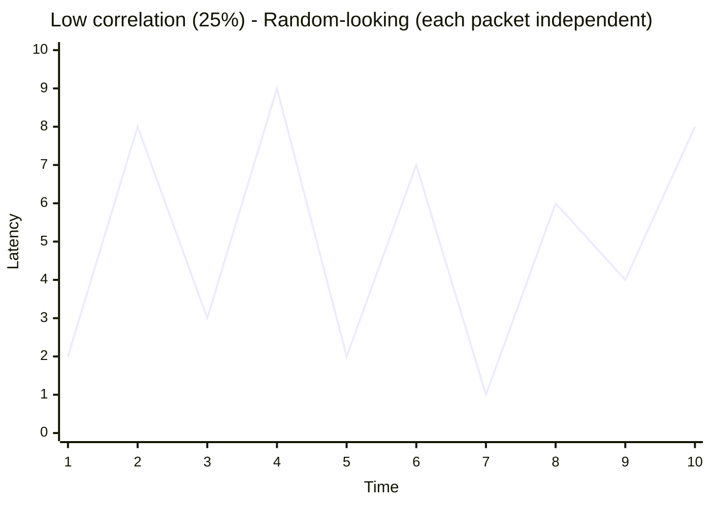
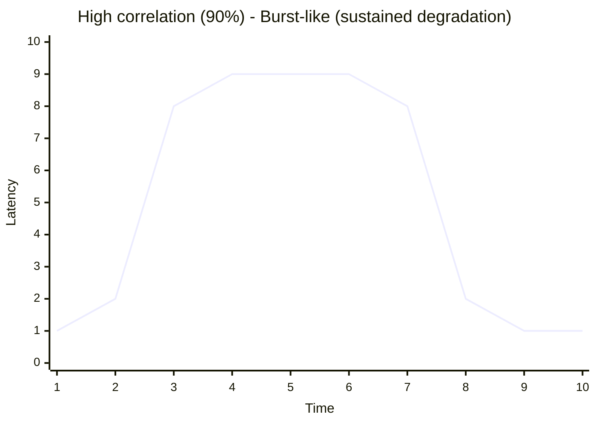
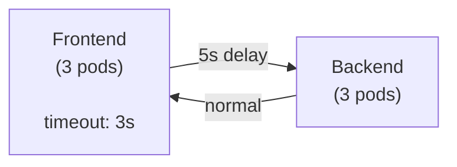

> **Discipline Module** | Complexity: `[COMPLEX]` | Time: 3 hours

## Prerequisites

Before starting this module:
- **Required**: [Module 1.2: Chaos Mesh Fundamentals](../module-1.2-chaos-mesh/) — PodChaos, NetworkChaos basics, installation
- **Required**: [Service Mesh basics](/platform/toolkits/observability-intelligence/observability/) — Understanding of sidecar proxies, traffic management
- **Recommended**: Familiarity with circuit breaker patterns (Envoy, Istio)
- **Recommended**: Basic understanding of TCP/IP, DNS resolution, HTTP headers

---

## What You'll Be Able to Do

After completing this module, you will be able to:

- **Implement network chaos experiments — latency, packet loss, partition, DNS failure — on Kubernetes**
- **Design network fault scenarios that validate service mesh resilience, retry logic, and timeout configurations**
- **Diagnose cascading failures caused by network partitions in distributed microservice architectures**
- **Build network chaos test suites that validate cross-service communication under degraded conditions**

## Why This Module Matters

On November 25, 2020, a major cloud provider experienced a cascading failure that took down dozens of high-profile services for over 6 hours. The root cause was not a server crash or a disk failure — it was a 300ms increase in cross-service latency caused by an overloaded internal DNS resolver. That tiny latency bump caused connection pools to fill, which caused timeouts, which caused retries, which amplified the DNS load further, which increased latency further. A 300ms hiccup became a 6-hour outage.

Network failures are the most dangerous class of distributed system failures because they are **partial and deceptive**. A crashed server is obvious — monitoring alerts, health checks fail, traffic reroutes. But a network that is slow, or drops 8% of packets, or returns stale DNS records? That creates a gray failure — the system appears to work but degrades in ways that cascade unpredictably.

This module teaches you to inject the network and application-level faults that cause the most devastating production outages: latency spikes between specific services, DNS resolution failures, HTTP-level errors, clock skew, and even JVM-level chaos. These are the faults that no amount of unit testing will ever catch.

---

## Did You Know?

> **Network partitions are more common than you think.** A 2014 study by Bailis and Kingsbury analyzed public postmortems from major cloud providers and found that network partitions occurred an average of once every 12 days across their sample. Most lasted under 15 minutes, but even short partitions caused data inconsistency, split-brain, and cascading failures in systems that hadn't been tested for them.

> **DNS is the most underestimated single point of failure** in Kubernetes. CoreDNS handles every service discovery request in the cluster. A study of Kubernetes outage reports found that 23% of cluster-wide incidents involved DNS — either CoreDNS overload, stale cache entries, or misconfigured ndots settings causing excessive DNS lookups. Yet most chaos engineering programs never test DNS failures.

> **Clock skew of just 5 seconds** can break TLS certificate validation (certificates have "not before" and "not after" timestamps), cause distributed locks to behave incorrectly (Redis SETNX with TTL depends on clock agreement), invalidate JWT tokens (exp claim depends on server time), and corrupt database replication (timestamp-based conflict resolution). TimeChaos lets you test all of these scenarios safely.

> **The "retry storm" pattern** has caused more outages than any individual server failure. When Service A has a 3-retry policy and calls Service B, which also has a 3-retry policy and calls Service C, a single failure in Service C generates 3 x 3 = 9 requests. With 4 layers of retries, a single failure becomes 81 requests. Netflix famously called this "the retry amplification problem" and used chaos experiments to find every instance of it in their architecture.

---

## Network Latency Injection: Beyond the Basics

In Module 1.2, you injected simple latency. Now we go deeper — targeting specific service-to-service communication paths, combining latency with jitter, and understanding the second-order effects.

### Targeted Latency Between Specific Services

The real power of NetworkChaos is injecting latency on **specific paths**, not just adding latency to all traffic for a pod:

```yaml
# targeted-latency.yaml
# Add latency ONLY between frontend and backend, not to any other traffic
apiVersion: chaos-mesh.org/v1alpha1
kind: NetworkChaos
metadata:
  name: frontend-to-backend-latency
  namespace: chaos-demo
spec:
  action: delay
  mode: all
  selector:
    namespaces:
      - chaos-demo
    labelSelectors:
      app: frontend
  delay:
    latency: "250ms"
    jitter: "50ms"
    correlation: "80"
  direction: to
  target:
    selector:
      namespaces:
        - chaos-demo
      labelSelectors:
        app: backend
    mode: all
  duration: "300s"
```

This is fundamentally different from adding latency to all backend traffic. Only the frontend-to-backend path is affected. Other services calling the backend are unaffected. This precision lets you test specific circuit breaker configurations and timeout settings.

### Understanding Correlation and Jitter

Real network degradation is not a constant delay. It fluctuates. Chaos Mesh models this with two parameters:

**Jitter**: The variation around the base latency. A 250ms latency with 50ms jitter means actual delays range from 200ms to 300ms.

**Correlation**: How much the current delay correlates with the previous one. At 100% correlation, if one packet is delayed 280ms, the next will likely be close to 280ms. At 0% correlation, each packet's delay is independent. Real networks have 60-85% correlation.

> **Stop and think**: If you set correlation to 100%, what happens to the jitter? The latency remains exactly the same as the first randomized value for the duration of the experiment, effectively eliminating the ongoing randomness of jitter.

Latency patterns with different correlation values:





High correlation is more realistic and more dangerous — it simulates sustained network degradation rather than random jitter. Always test with correlation >= 70%.

### Latency + Packet Loss Combination

Real network issues rarely come in a single flavor. Combine latency with loss to simulate a truly degraded link:

```yaml
# combined-network-fault.yaml
apiVersion: chaos-mesh.org/v1alpha1
kind: NetworkChaos
metadata:
  name: degraded-link-simulation
  namespace: chaos-demo
spec:
  action: delay
  mode: all
  selector:
    namespaces:
      - chaos-demo
    labelSelectors:
      app: backend
  delay:
    latency: "100ms"
    jitter: "30ms"
    correlation: "75"
  loss:
    loss: "5"                  # 5% packet loss
    correlation: "50"
  direction: to
  target:
    selector:
      namespaces:
        - chaos-demo
      labelSelectors:
        app: frontend
    mode: all
  duration: "300s"
```

**Why this matters**: 100ms latency alone might not trigger a circuit breaker. 5% packet loss alone might not be noticeable with TCP retransmission. But combined, the TCP retransmission of lost packets adds variable additional latency on top of the injected 100ms, creating a pattern that breaks timeout assumptions.

---

## DNS Fault Injection

DNS failures are silent killers. Services that hardcode IP addresses work fine. Services that rely on DNS resolution (which is everything in Kubernetes) can fail catastrophically when DNS misbehaves.

### DNSChaos: Error Responses

```yaml
# dns-error-experiment.yaml
apiVersion: chaos-mesh.org/v1alpha1
kind: DNSChaos
metadata:
  name: dns-resolution-failure
  namespace: chaos-demo
spec:
  action: error                # Return SERVFAIL for DNS queries
  mode: all
  selector:
    namespaces:
      - chaos-demo
    labelSelectors:
      app: frontend
  patterns:
    - "backend.chaos-demo.svc.cluster.local"   # Only affect this domain
  duration: "120s"
```

**Hypothesis**: "We believe the frontend will return a graceful error page (HTTP 503) when DNS resolution for the backend fails, because our connection handling catches UnknownHostException and returns a fallback response."

> **Pause and predict**: If you inject a DNS error but your application has already resolved and cached the IP address internally, will the application fail immediately? (Hint: DNS caching in the application layer often masks DNS failures until the cache expires.)

```bash
# Apply DNS chaos
kubectl apply -f dns-error-experiment.yaml

# Test from within the frontend pod
kubectl exec -it deployment/frontend -n chaos-demo -- \
  nslookup backend.chaos-demo.svc.cluster.local

# Expected: DNS resolution fails
# Check frontend behavior — does it crash, hang, or gracefully degrade?

# Clean up
kubectl delete dnschaos dns-resolution-failure -n chaos-demo
```

### DNSChaos: Random Responses

Even more insidious than DNS failure is DNS returning the **wrong answer**:

```yaml
# dns-random-experiment.yaml
apiVersion: chaos-mesh.org/v1alpha1
kind: DNSChaos
metadata:
  name: dns-wrong-answers
  namespace: chaos-demo
spec:
  action: random               # Return random IP addresses
  mode: all
  selector:
    namespaces:
      - chaos-demo
    labelSelectors:
      app: frontend
  patterns:
    - "backend.chaos-demo.svc.cluster.local"
  duration: "120s"
```

This simulates DNS cache poisoning or stale DNS records. Your frontend will try to connect to random IP addresses instead of the backend. Does it timeout gracefully? Does it retry DNS resolution? Does it cache the wrong answer and keep failing after the experiment ends?

### CoreDNS Overload Simulation

For a more realistic DNS chaos scenario, you can stress the CoreDNS pods themselves:

```yaml
# coredns-stress.yaml
apiVersion: chaos-mesh.org/v1alpha1
kind: StressChaos
metadata:
  name: coredns-cpu-stress
  namespace: kube-system
spec:
  mode: one                    # Stress only 1 of 2 CoreDNS replicas
  selector:
    namespaces:
      - kube-system
    labelSelectors:
      k8s-app: kube-dns
  stressors:
    cpu:
      workers: 2
      load: 90
  duration: "120s"
```

**Warning**: This experiment targets kube-system and affects all DNS resolution in the cluster. Only run this in staging/dev environments.

---

## HTTPChaos: Application-Layer Fault Injection

While NetworkChaos operates at the TCP/IP level, HTTPChaos injects faults at the HTTP application layer. This is more precise and enables scenarios impossible with network-level chaos.

### HTTP Abort (Error Injection)

Inject HTTP error responses without actually breaking the service:

```yaml
# http-abort-experiment.yaml
apiVersion: chaos-mesh.org/v1alpha1
kind: HTTPChaos
metadata:
  name: backend-http-500
  namespace: chaos-demo
spec:
  mode: all
  selector:
    namespaces:
      - chaos-demo
    labelSelectors:
      app: backend
  target: Response             # Modify responses (not requests)
  port: 80                     # Target port
  method: GET                  # Only affect GET requests
  path: "/api/products*"       # Only affect product API paths
  replace:
    code: 500                  # Replace response with HTTP 500
  duration: "120s"
```

This is extremely powerful because you can target **specific endpoints** with **specific HTTP methods**. Want to see what happens when only POST requests to `/api/checkout` fail? HTTPChaos makes that possible.

### HTTP Delay

Add latency at the HTTP layer (different from NetworkChaos delay because it affects only HTTP traffic, not all TCP):

> **Pause and predict**: If you add a 3-second HTTP delay, but your frontend has a 1-second timeout, what will the user experience? Will they see a graceful error, or will the frontend automatically retry and inadvertently multiply the delay?

```yaml
# http-delay-experiment.yaml
apiVersion: chaos-mesh.org/v1alpha1
kind: HTTPChaos
metadata:
  name: backend-http-slow
  namespace: chaos-demo
spec:
  mode: all
  selector:
    namespaces:
      - chaos-demo
    labelSelectors:
      app: backend
  target: Response
  port: 80
  method: GET
  path: "/api/search*"         # Only slow down search
  delay: "3s"                  # 3-second delay
  duration: "180s"
```

**Hypothesis**: "We believe the search feature will display 'Results are loading...' within 1 second and eventually show results after 3 seconds, because the frontend has a loading state for search responses slower than 500ms, rather than hanging with no feedback."

### HTTP Response Body Modification

Inject malformed responses to test error handling:

```yaml
# http-body-modification.yaml
apiVersion: chaos-mesh.org/v1alpha1
kind: HTTPChaos
metadata:
  name: backend-malformed-response
  namespace: chaos-demo
spec:
  mode: all
  selector:
    namespaces:
      - chaos-demo
    labelSelectors:
      app: backend
  target: Response
  port: 80
  path: "/api/*"
  replace:
    body: "eyJlcnJvciI6ICJpbnRlcm5hbCJ9"   # base64 of {"error": "internal"}
    headers:
      Content-Type: "application/json"
  code: 200                    # Return 200 but with wrong body
  duration: "120s"
```

This is particularly nasty — it returns HTTP 200 (so health checks pass) but with incorrect body content. This tests whether your services validate response payloads or blindly trust any 200 response.

---

## TimeChaos: Clock Skew Injection

Clock skew is one of the most subtle and devastating faults in distributed systems. TimeChaos shifts the system clock inside target containers without affecting the host or other containers.

```yaml
# time-skew-experiment.yaml
apiVersion: chaos-mesh.org/v1alpha1
kind: TimeChaos
metadata:
  name: backend-clock-skew
  namespace: chaos-demo
spec:
  mode: one
  selector:
    namespaces:
      - chaos-demo
    labelSelectors:
      app: backend
  timeOffset: "-5m"            # Clock is 5 minutes behind
  clockIds:
    - CLOCK_REALTIME           # Affect real-time clock (used by date, time())
  containerNames:
    - httpbin                  # Only affect this container
  duration: "180s"
```

### What Clock Skew Breaks

| Component | How Clock Skew Breaks It |
|-----------|------------------------|
| **TLS/mTLS** | Certificates appear expired or not-yet-valid; connections rejected |
| **JWT tokens** | Token `exp` claim comparison fails; tokens appear expired or not yet valid |
| **Distributed locks** | Lock TTLs calculated incorrectly; locks expire too early or never |
| **Database replication** | Timestamp-based conflict resolution makes wrong decisions |
| **Cron jobs** | Jobs fire at wrong times or skip executions |
| **Log correlation** | Timestamps don't match across services; debugging becomes impossible |
| **Rate limiters** | Token bucket refill rate calculated incorrectly; too permissive or too strict |
| **Cache TTL** | Items expire immediately or never, depending on skew direction |

```bash
# Apply clock skew
kubectl apply -f time-skew-experiment.yaml

# Check the time inside the affected pod
kubectl exec -it deployment/backend -n chaos-demo -- date

# Compare with host time
date

# The pod's clock should be 5 minutes behind
# Check if TLS connections to external services fail
# Check if any JWT validation errors appear in logs

# Clean up
kubectl delete timechaos backend-clock-skew -n chaos-demo
```

### Forward vs. Backward Skew

**Forward skew** (clock ahead): Certificates appear expired, tokens appear expired, locks expire early, caches expire prematurely.

**Backward skew** (clock behind): Certificates appear not-yet-valid, tokens appear not-yet-valid, locks live too long, scheduled jobs delayed.

Test both directions — they break different things.

---

## JVM Chaos

If your services run on the JVM (Java, Kotlin, Scala), Chaos Mesh can inject faults directly into the JVM runtime without network-level interference.

### JVM Exception Injection

```yaml
# jvm-exception-experiment.yaml
apiVersion: chaos-mesh.org/v1alpha1
kind: JVMChaos
metadata:
  name: backend-jvm-exception
  namespace: chaos-demo
spec:
  action: exception
  mode: one
  selector:
    namespaces:
      - chaos-demo
    labelSelectors:
      app: java-backend
  class: "com.example.service.PaymentService"
  method: "processPayment"
  exception: "java.io.IOException"
  message: "Chaos Mesh injected exception"
  port: 9277                   # JVM agent port
  duration: "120s"
```

This injects a `java.io.IOException` every time `PaymentService.processPayment()` is called. Your error handling, retry logic, and circuit breakers are tested without any network-level fault.

### JVM Latency

```yaml
# jvm-latency-experiment.yaml
apiVersion: chaos-mesh.org/v1alpha1
kind: JVMChaos
metadata:
  name: backend-jvm-slow-method
  namespace: chaos-demo
spec:
  action: latency
  mode: one
  selector:
    namespaces:
      - chaos-demo
    labelSelectors:
      app: java-backend
  class: "com.example.repository.ProductRepository"
  method: "findById"
  latency: 2000                # 2000ms delay per method call
  port: 9277
  duration: "120s"
```

This adds 2 seconds to every `ProductRepository.findById()` call. Unlike network latency, this delay is inside the application — it simulates a slow database query, slow external API call, or thread contention.

### JVM Stress (GC Pressure)

```yaml
# jvm-gc-stress.yaml
apiVersion: chaos-mesh.org/v1alpha1
kind: JVMChaos
metadata:
  name: backend-jvm-gc-stress
  namespace: chaos-demo
spec:
  action: stress
  mode: one
  selector:
    namespaces:
      - chaos-demo
    labelSelectors:
      app: java-backend
  memType: "heap"              # Stress heap memory
  port: 9277
  duration: "180s"
```

---

## Kernel Chaos

KernelChaos uses BPF (Berkeley Packet Filter) to inject faults at the Linux kernel level inside containers. This is the most advanced and most dangerous chaos type.

```yaml
# kernel-chaos-experiment.yaml
apiVersion: chaos-mesh.org/v1alpha1
kind: KernelChaos
metadata:
  name: backend-kernel-fault
  namespace: chaos-demo
spec:
  mode: one
  selector:
    namespaces:
      - chaos-demo
    labelSelectors:
      app: backend
  failKernRequest:
    callchain:
      - funcname: "read"       # Inject fault on read() syscall
    failtype: 0                # 0 = return error, 1 = panic (NEVER use 1)
    probability: 10            # 10% of read() calls fail
    times: 100                 # Affect up to 100 calls
  duration: "60s"
```

**Warning**: KernelChaos requires:
- Linux kernel 4.18+ with BPF support
- The `chaos-daemon` running with privileged access
- Careful testing in non-production environments first
- Never set `failtype: 1` (kernel panic) unless you truly intend to crash the node

---

## Combining Multiple Chaos Types: Workflow

For complex scenarios, Chaos Mesh provides the `Workflow` CRD that orchestrates multiple experiments:

```yaml
# multi-fault-workflow.yaml
apiVersion: chaos-mesh.org/v1alpha1
kind: Workflow
metadata:
  name: cascading-failure-test
  namespace: chaos-demo
spec:
  entry: the-entry
  templates:
    - name: the-entry
      templateType: Serial     # Run steps in sequence
      children:
        - network-degradation
        - pod-stress
        - observe-recovery

    - name: network-degradation
      templateType: NetworkChaos
      deadline: "180s"
      networkChaos:
        action: delay
        mode: all
        selector:
          namespaces:
            - chaos-demo
          labelSelectors:
            app: backend
        delay:
          latency: "200ms"
          jitter: "40ms"
        direction: to
        target:
          selector:
            namespaces:
              - chaos-demo
            labelSelectors:
              app: frontend
          mode: all

    - name: pod-stress
      templateType: StressChaos
      deadline: "120s"
      stressChaos:
        mode: one
        selector:
          namespaces:
            - chaos-demo
          labelSelectors:
            app: backend
        stressors:
          cpu:
            workers: 1
            load: 70

    - name: observe-recovery
      templateType: Suspend
      deadline: "60s"          # Wait 60s to observe recovery
```

This workflow first adds network latency, then adds CPU stress while the latency is still active, then pauses to let you observe recovery after both faults are removed.

---

## Common Mistakes

| Mistake | Why It's a Problem | Better Approach |
|---------|-------------------|-----------------|
| Injecting latency without measuring baseline first | You cannot assess impact if you don't know what "normal" looks like — 200ms added latency means nothing if baseline is unknown | Always measure p50, p95, and p99 latency before any experiment; record the baseline in your experiment document |
| Testing DNS failure without understanding ndots | Kubernetes DNS resolution tries multiple suffixes before the FQDN; your experiment may affect different lookups than expected | Check `/etc/resolv.conf` in target pods; understand that `ndots:5` means short names generate 5+ DNS queries |
| Using HTTPChaos on services behind a service mesh | If Istio/Envoy is terminating HTTP, HTTPChaos may inject faults at the wrong layer; the sidecar may mask or duplicate the fault | For service mesh environments, prefer using the mesh's own fault injection (Istio VirtualService faultInjection) or inject before the sidecar |
| Setting clock skew too large | A 1-hour clock skew will break almost everything and provide no useful signal — you already know that won't work | Start with 5-30 second skew; this tests edge cases in TTL handling and timeout logic without causing obvious, uninteresting failures |
| Running JVMChaos without the JVM agent | JVMChaos requires the Byteman agent to be loaded into the target JVM; without it, the experiment silently does nothing | Ensure the target pod has the JVM agent configured (either via init container or JVM arguments) before running JVMChaos |
| Combining too many fault types simultaneously | Multiple simultaneous faults make it impossible to determine which fault caused which behavior — you lose the scientific method | Inject one fault type at a time; if you need to test combinations, use Workflow with Serial steps and observe each fault's individual impact first |
| Forgetting that NetworkChaos uses tc rules that persist | If chaos-daemon crashes during an experiment, the tc rules remain in the pod's network namespace | After every NetworkChaos experiment, verify cleanup: `kubectl exec <pod> -- tc qdisc show` should show only the default qdisc |
| Not testing the circuit breaker trip AND recovery | Most teams verify that the circuit breaker opens but never test that it closes again and traffic resumes normally | Extend your observation period past the experiment duration to verify the system returns to steady state, not just survives the fault |

---

## Quiz

### Question 1: You are troubleshooting a microservice that communicates with a legacy database via TCP, and a modern REST API via HTTP. You want to test how the service handles slow responses from the REST API without affecting the database connection. Which chaos type should you use and why?

<details>
<summary>Show Answer</summary>

You should use HTTPChaos delay instead of NetworkChaos delay. NetworkChaos operates at the TCP/IP layer using Linux `tc` (traffic control), meaning it delays all packets on the network interface, which would affect both the database and REST API connections equally. HTTPChaos delay operates specifically at the application layer, allowing you to target only HTTP request/response processing. Furthermore, HTTPChaos allows you to filter by specific HTTP methods, paths, and status codes, ensuring that only the REST API traffic is degraded while the TCP database connection remains completely unaffected.

</details>

### Question 2: A junior engineer on your team wants to test what happens when the product catalog service cannot resolve the inventory service. They propose injecting a DNS error cluster-wide to see how the system reacts. Why is this approach dangerous in a Kubernetes environment, and how should they safely scope the experiment instead?

<details>
<summary>Show Answer</summary>

Injecting a cluster-wide DNS error is extremely dangerous because DNS is the critical foundation for all service discovery in Kubernetes, meaning every single `ServiceName.Namespace.svc.cluster.local` lookup would fail. This would cause massive cascading failures across entirely unrelated workloads, potentially breaking cluster controllers and service meshes. Furthermore, due to DNS caching and `ndots:5` configurations generating multiple queries, the effects can be unpredictable and persist even after the chaos experiment ends. To safely scope this test, the engineer should target only the specific product catalog pods using label selectors, restrict the chaos duration to 60-120 seconds, and use the `patterns` field to specifically target only the inventory service's domain name.

</details>

### Question 3: Your checkout service has a strict 3-second timeout configured for its database queries. To test this timeout, you inject exactly 2 seconds of network latency between the checkout service and the database using NetworkChaos. During the test, you observe that some queries are still timing out and failing. Why might the 3-second timeout fire when only 2 seconds of latency were injected?

<details>
<summary>Show Answer</summary>

The timeout can still fire because the injected 2 seconds of latency is only one component of the total round-trip time. You must account for the actual database query execution time, the network latency in both directions (request and response), and any application-level processing time. Additionally, when using Chaos Mesh, network latency typically includes a `jitter` parameter, meaning some packets will experience delays longer than the baseline 2 seconds. When combined with potential TCP retransmissions, connection pool exhaustion, or CPU throttling during the test, the cumulative delay can easily exceed the 3-second threshold. This is exactly why testing the actual behavior is far more reliable than just calculating theoretical limits.

</details>

### Question 4: You are running a chaos experiment where you apply a -5 minute TimeChaos (clock skew) to a pod responsible for issuing JWT tokens and communicating with an external payment gateway via mTLS. Suddenly, the pod stops being able to communicate with the payment gateway, and other internal services reject its tokens. What specific mechanisms are failing due to this clock skew?

<details>
<summary>Show Answer</summary>

The clock skew is causing critical timestamp validations to fail across multiple security mechanisms. First, the mTLS connection to the payment gateway fails because the pod's local clock is 5 minutes in the past, making the external server's certificate appear as "not yet valid" during the TLS handshake. Second, the JWT tokens issued by this pod are being rejected by other internal services because the tokens' `iat` (issued at) claim indicates a time 5 minutes in the past, but depending on the validation logic, they might also have expiration (`exp`) claims that are now completely misaligned with the receiving services' real-time clocks. Furthermore, if the pod relies on distributed locks or lease renewals, those mechanisms will also calculate incorrect TTLs, leading to lock contention or lease loss.

</details>

### Question 5: You inject 200ms of network latency between your frontend and backend services. Your frontend has a generously configured 5-second timeout, and monitoring shows exactly zero HTTP 5xx errors or timeout exceptions. However, customer support is flooded with complaints that the application is completely unusable and "hanging." What is the most likely cause of this discrepancy, and what should you investigate?

<details>
<summary>Show Answer</summary>

The application feels sluggish because the 200ms delay is compounding across multiple sequential requests, creating a massive total wait time for the user. While no single request hits the 5-second timeout threshold, a page load that requires 10 sequential API calls will now take an additional 2 seconds to render, far exceeding the typical user patience threshold of 1-2 seconds. To fix this, you should investigate the request waterfall in the frontend to see if these API calls can be parallelized or batched together into a single GraphQL or BFF (Backend-for-Frontend) request. Additionally, you should review your user-facing Service Level Objectives (SLOs) and connection reuse settings to ensure the system degrades gracefully or provides loading feedback rather than just technically keeping connections alive.

</details>

### Question 6: Your team is building a Java-based payment processing microservice that sits behind an Istio service mesh. You want to test how the application handles an internal `java.sql.SQLException` when the connection pool is exhausted, without actually taking down the database. Why should you choose JVMChaos for this test rather than NetworkChaos or HTTPChaos?

<details>
<summary>Show Answer</summary>

You should choose JVMChaos because it allows you to inject faults directly into the application's runtime execution, bypassing the network layer entirely. NetworkChaos and HTTPChaos operate at the network interface level, meaning they cannot trigger specific application-level exceptions like a `java.sql.SQLException` or simulate internal thread pool exhaustion. Furthermore, because your service is running behind an Istio service mesh, using network-level chaos might interact unpredictably with Envoy's own retry logic and routing rules, masking the application's actual behavior. JVMChaos uses the Byteman agent to target the exact Java method where the exception should occur, providing precise, localized fault injection that perfectly simulates the application state without impacting actual database connectivity.

</details>

---

## Hands-On Exercise: Network Delay with Circuit Breaker Observation

### Objective

Inject a 5-second network delay between a frontend and backend service, and observe whether a circuit breaker (or lack thereof) protects the system from cascading failure.

### Architecture



The frontend has a 3-second timeout. We're injecting 5 seconds of delay. Every request from frontend to backend will timeout. The question is: **what happens to the frontend when all backend requests timeout?**

### Setup

```bash
# Ensure the test application from Module 1.2 is deployed
kubectl get pods -n chaos-demo
# You should see 3 frontend and 3 backend pods

# Verify connectivity
kubectl exec -it deployment/frontend -n chaos-demo -- \
  curl -s -o /dev/null -w "Response time: %{time_total}s, Status: %{http_code}\n" \
  http://backend.chaos-demo.svc.cluster.local/get

# Expected: Response time: ~0.01s, Status: 200
```

### Step 1: Record Baseline

```bash
# Measure baseline latency (10 requests)
kubectl run baseline-test --image=curlimages/curl --rm -it --restart=Never -n chaos-demo -- \
  sh -c 'echo "=== Baseline Measurements ===" && \
  for i in $(seq 1 10); do \
    RESULT=$(curl -s -o /dev/null -w "%{time_total}" --max-time 10 http://backend.chaos-demo.svc.cluster.local/get) && \
    echo "Request $i: ${RESULT}s" || echo "Request $i: FAILED"; \
    sleep 0.5; \
  done'

# Record: average response time, min, max, failure count
```

### Step 2: Apply the 5-Second Delay

```yaml
# Save as network-delay-5s.yaml
apiVersion: chaos-mesh.org/v1alpha1
kind: NetworkChaos
metadata:
  name: frontend-backend-5s-delay
  namespace: chaos-demo
spec:
  action: delay
  mode: all
  selector:
    namespaces:
      - chaos-demo
    labelSelectors:
      app: frontend
  delay:
    latency: "5s"
    jitter: "500ms"
    correlation: "85"
  direction: to
  target:
    selector:
      namespaces:
        - chaos-demo
      labelSelectors:
        app: backend
    mode: all
  duration: "180s"
```

```bash
# Apply the experiment
kubectl apply -f network-delay-5s.yaml

echo "Experiment started at $(date +%H:%M:%S)"
```

### Step 3: Observe the Impact

```bash
# Measure latency during the experiment (10 requests with 10s max timeout)
kubectl run chaos-test --image=curlimages/curl --rm -it --restart=Never -n chaos-demo -- \
  sh -c 'echo "=== During Chaos ===" && \
  for i in $(seq 1 10); do \
    START=$(date +%s%N) && \
    RESULT=$(curl -s -o /dev/null -w "%{http_code}" --max-time 10 http://backend.chaos-demo.svc.cluster.local/get 2>/dev/null) && \
    END=$(date +%s%N) && \
    ELAPSED=$(( (END - START) / 1000000 )) && \
    echo "Request $i: HTTP ${RESULT:-TIMEOUT}, ${ELAPSED}ms" || \
    echo "Request $i: TIMEOUT"; \
    sleep 1; \
  done'
```

### Step 4: Document Observations

Answer these questions:

1. What HTTP status codes did you see during the experiment?
2. How long did each request take? (Should be ~5s if timeout > 5s, or timeout value if timeout < 5s)
3. Did any requests succeed during the experiment?
4. Check frontend pod CPU and memory — are they elevated from handling slow connections?
5. After the experiment ends (180s), how quickly does the system return to normal?

```bash
# Check pod resource usage during the experiment
kubectl top pods -n chaos-demo

# Check for any pod restarts caused by the experiment
kubectl get pods -n chaos-demo -o custom-columns=\
NAME:.metadata.name,RESTARTS:.status.containerStatuses[0].restartCount

# Wait for experiment to end, then verify recovery
kubectl get networkchaos -n chaos-demo

# Run the baseline test again after cleanup
kubectl delete networkchaos frontend-backend-5s-delay -n chaos-demo

# Wait 10 seconds for cleanup
sleep 10

kubectl run recovery-test --image=curlimages/curl --rm -it --restart=Never -n chaos-demo -- \
  sh -c 'echo "=== Post-Recovery ===" && \
  for i in $(seq 1 10); do \
    RESULT=$(curl -s -o /dev/null -w "%{time_total}" --max-time 10 http://backend.chaos-demo.svc.cluster.local/get) && \
    echo "Request $i: ${RESULT}s" || echo "Request $i: FAILED"; \
    sleep 0.5; \
  done'
```

### Success Criteria

- [ ] Baseline latency recorded before the experiment (10+ measurements)
- [ ] 5-second delay applied to the correct path (frontend-to-backend only)
- [ ] Observed impact during experiment documented (status codes, latencies, errors)
- [ ] Answered all 5 observation questions with specific data
- [ ] Verified system recovery after experiment removal
- [ ] Identified at least one improvement (e.g., "need a circuit breaker," "need a shorter timeout," "need a fallback response")
- [ ] Documented the complete timeline: baseline → injection → observation → recovery

### What You Should Find

Without a circuit breaker, you'll likely observe:
- All requests timing out at 5+ seconds
- Frontend threads blocked waiting for backend responses
- If frontend has limited connection pool, new users can't connect
- After the experiment ends, recovery is immediate (no state was corrupted)

The key learning: **a timeout alone is not enough**. You also need a circuit breaker that stops sending requests to a consistently failing backend, returning a fallback response instead. This is the motivation for implementing patterns like Istio's circuit breaker or libraries like resilience4j.

---

## Summary

Advanced network and application fault injection reveals the hidden dependencies and fragile assumptions in distributed systems. Network latency exposes timeout misconfigurations and retry storms. DNS failures reveal hardcoded assumptions about service discovery. HTTP-level chaos tests specific endpoint error handling. Clock skew breaks time-dependent logic across the board. JVM chaos targets application internals that network-level tools cannot reach.

Key takeaways:
- **Targeted injection** (specific service pairs, specific endpoints) is more useful than broad injection
- **Correlation and jitter** make experiments realistic — constant delays are too predictable
- **DNS is the silent SPOF** — test it early and often
- **Clock skew breaks everything** — start with small offsets (seconds, not hours)
- **Combine faults using Workflows** — but test each fault type individually first
- **Observe recovery**, not just failure — the system returning to steady state is as important as surviving the fault

---

## Next Module

Continue to [Module 1.4: Stateful Chaos — Databases & Storage](../module-1.4-stateful-chaos/) — Test database failover, IO delays, split-brain scenarios, and storage detachment in stateful Kubernetes workloads.