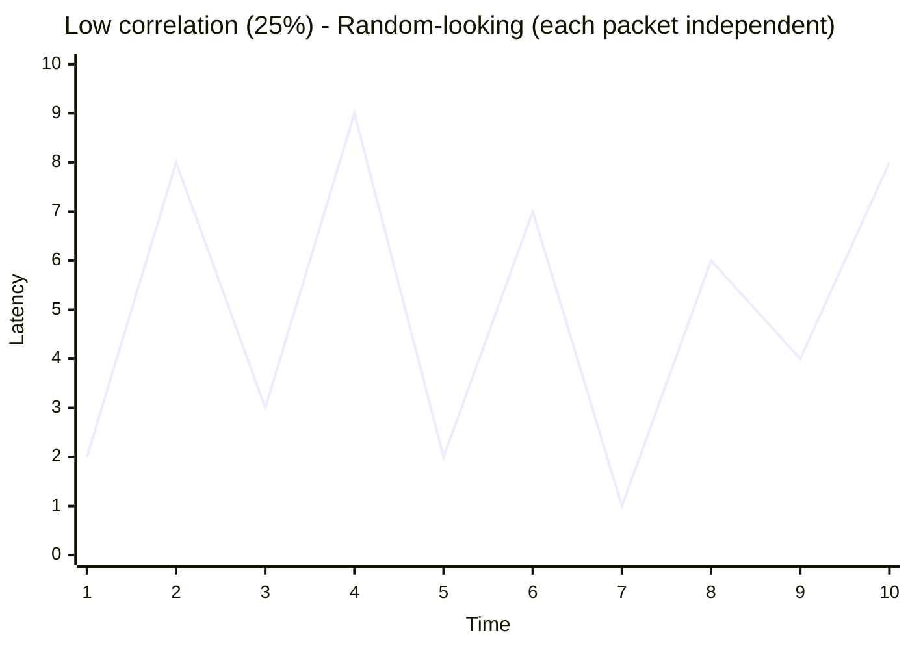
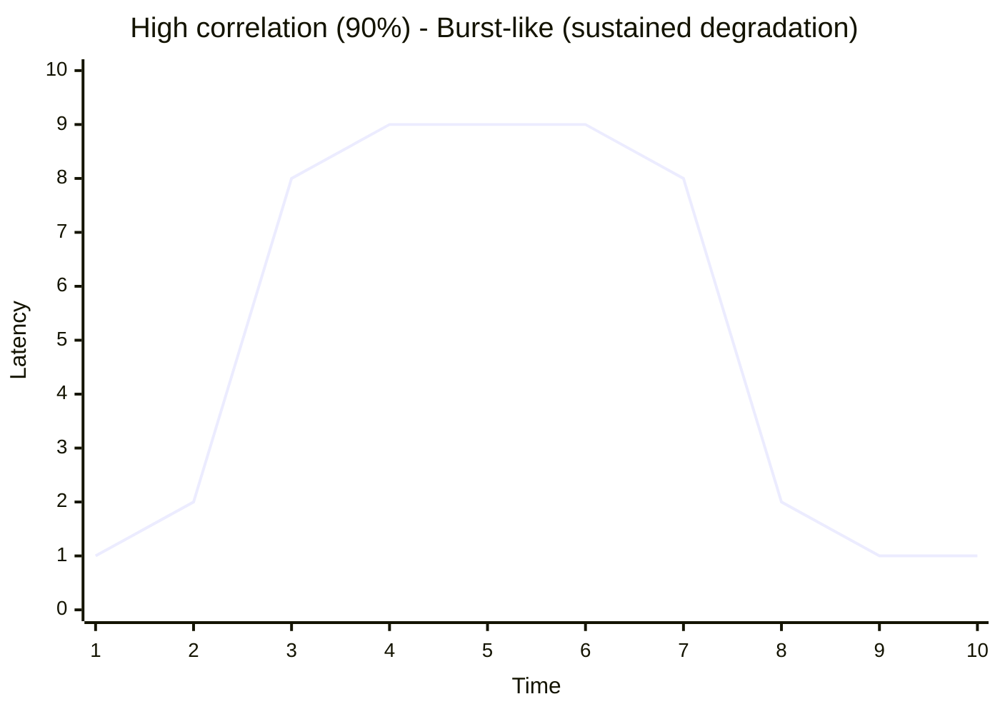
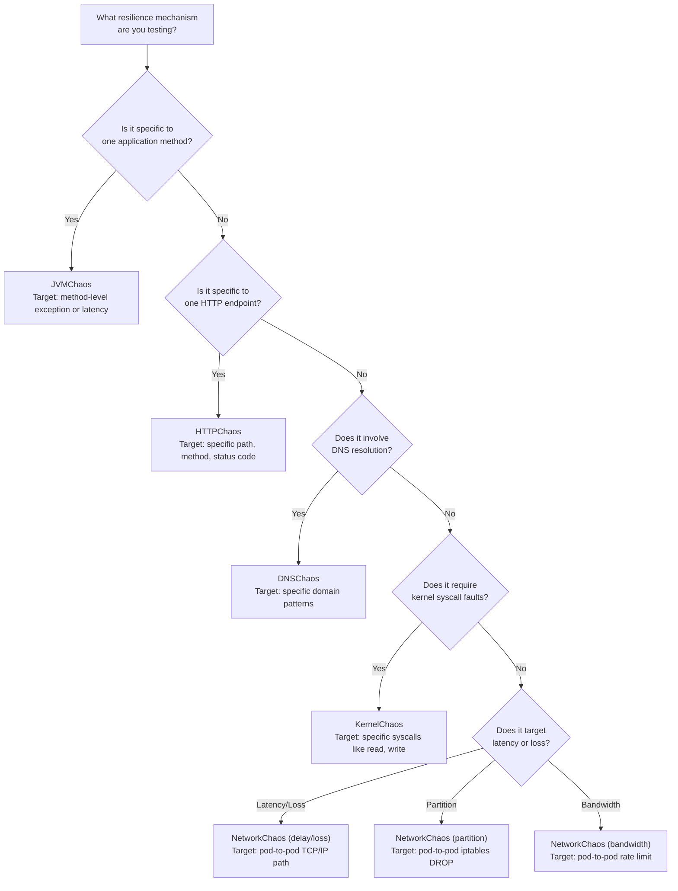
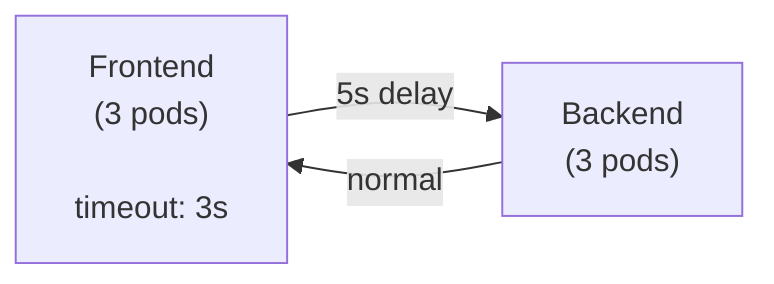

> **Discipline Module** | Complexity: `[COMPLEX]` | Time: 3 hours

## Prerequisites

Before starting this module:
- **Required**: [Module 1.2: Chaos Mesh Fundamentals](../module-1.2-chaos-mesh/) — PodChaos, NetworkChaos basics, installation
- **Required**: [Service Mesh basics](/platform/toolkits/observability-intelligence/observability/) — Understanding of sidecar proxies, traffic management
- **Recommended**: Familiarity with circuit breaker patterns (Envoy, Istio)
- **Recommended**: Basic understanding of TCP/IP, DNS resolution, HTTP headers

---

## What You'll Be Able to Do

After completing this module, you will be able to:

- **Implement network chaos experiments — latency, packet loss, partition, DNS failure — on Kubernetes**
- **Design network fault scenarios that validate service mesh resilience, retry logic, and timeout configurations**
- **Diagnose cascading failures caused by network partitions in distributed microservice architectures**
- **Build network chaos test suites that validate cross-service communication under degraded conditions**

## Why This Module Matters

Hypothetical scenario: a payment-processing platform serves approximately 2,000 transactions per minute across eight microservices. One afternoon, latency between the authorization service and the fraud-detection service climbs from 15ms to 350ms because a network switch along the path begins silently corrupting every few hundredth frame, forcing TCP retransmissions. The authorization service has a 500ms timeout, so individual calls do not fail outright. But the fraud-detection service takes 300ms to process each request. Combined with the 350ms network delay, each call now takes 650ms — above the timeout threshold. The authorization service opens its circuit breaker after five consecutive timeouts. With fraud detection unavailable, every transaction is declined. Within three minutes, customers are locked out and revenue has dropped to zero. The root cause was not a server crash, not a database failure, not a code bug. It was a degraded network path that no unit test, integration test, or load test had ever simulated.

Network faults are the single most dangerous class of failure in distributed systems because they are partial, deceptive, and self-amplifying. When a process crashes, the failure is unambiguous: health checks fail, orchestrators restart it, and traffic routes elsewhere. But when a network degrades — when packets are delayed rather than dropped, when DNS returns stale rather than empty answers, when one direction of a bidirectional link fails while the other remains intact — the system enters a gray zone where every component believes it is healthy but the aggregate behavior is catastrophically wrong. This is the territory that chaos engineering was invented to explore.

The theoretical foundation for why network faults dominate distributed-systems failures was articulated long before Kubernetes or microservices existed. In 1994, Peter Deutsch and James Gosling codified the **Fallacies of Distributed Computing**, a list of assumptions that programmers routinely and incorrectly make about networked systems. The first four fallacies are directly relevant to chaos engineering: the network is reliable; latency is zero; bandwidth is infinite; and the network is secure. Every one of these false assumptions has caused production outages. The network is not reliable — packets are dropped, corrupted, duplicated, and reordered at every layer of the stack, from physical media to overloaded switch buffers to kernel socket queues. Latency is not zero — it varies with load, distance, buffer depth, and the non-deterministic scheduling decisions of dozens of intermediate devices. Bandwidth is not infinite — TCP congestion control algorithms such as Cubic and BBR continuously probe for the ceiling and back off when they hit it, creating variable throughput that applications must handle. And the network is certainly not secure — but the security implications are beyond this module's scope.

This module teaches you to inject the specific network and application-layer faults that exploit these fallacies. You will learn to simulate latency with realistic jitter and correlation, to drop and corrupt packets at controlled rates, to create network partitions including the especially insidious asymmetric (one-way) partition, and to disrupt DNS resolution, the silent single point of failure in nearly every Kubernetes cluster. Beyond the network layer, you will learn to inject faults at the HTTP and JVM layers, giving you precision that no packet-level tool can provide. These are the faults that no amount of unit testing will ever catch — and they are the faults that cause the longest, most expensive, and most reputationally damaging outages in production.

<!-- incident-xref: NETWORK-FAULT-INJECTION -->

---

## The Network Fault Taxonomy

Before injecting faults, you must understand the taxonomy — the classification of what can go wrong on a network and why each category matters differently to application resilience. A taxonomy is essential because not all network faults are created equal. Latency and packet loss produce different failure modes. A partition is qualitatively different from throttled bandwidth. And some faults, like one-way partitions, are so counterintuitive that applications rarely handle them correctly unless they have been explicitly tested.

### Latency

Latency is the time a packet takes to travel from sender to receiver. In chaos engineering, we distinguish three parameters: the **base delay** (a constant added to every packet), **jitter** (the random variation around the base delay), and **correlation** (how much each packet's delay depends on the previous packet's delay). Real network degradation is never a flat, constant delay. A congested link produces bursts of high latency interspersed with periods of normal performance. A failing network interface may introduce variable latency that correlates across consecutive packets because the hardware error condition persists. Testing with constant latency alone is therefore insufficient — it tests a synthetic condition that never occurs in production, giving false confidence.

### Packet Loss

Packet loss occurs when packets are dropped before reaching their destination. Loss can happen at any layer: physical media corruption, switch buffer overflow during microbursts, kernel socket receive-buffer exhaustion, or intentional policy-based dropping by firewall rules. TCP masks loss through retransmission, which means that a 5% packet loss rate does not simply mean 5% of data is missing — it means TCP is silently retransmitting those segments, consuming additional bandwidth and adding variable latency that can push total request times past timeout thresholds. UDP has no retransmission, so applications using UDP must handle loss explicitly or accept silent data gaps. Loss combined with latency is particularly dangerous because the retransmission delay compounds the base latency, creating effective delays far larger than either fault alone.

### Packet Corruption

Packet corruption changes the content of packets in flight. TCP and UDP both use checksums to detect corruption, but the detection is not perfect — TCP's 16-bit checksum is known to miss certain bit-error patterns, especially in high-throughput environments where the probability of an undetected error scales with data volume. When corruption is detected, TCP discards the segment and triggers retransmission, which behaves like packet loss from the application's perspective. When corruption is _not_ detected, the application receives incorrect data, which can produce Byzantine failures: the system appears to work but produces wrong results, and the failure is extremely difficult to diagnose because no error is logged.

### Duplication and Reordering

The Internet Protocol explicitly permits routers to duplicate and reorder packets. In practice, duplication is rare in well-configured datacenter networks, but it becomes more common when network equipment is under stress or when routing changes cause packets to traverse different paths with different latencies. Duplication and reordering expose a critical requirement: application-level protocols must be **idempotent**. If a payment-processing service receives the same request twice, it must not charge the customer twice. Idempotency is easy to assert and hard to implement correctly — it requires unique request identifiers, durable idempotency-key storage, and careful handling of partial failures. Testing for idempotency under duplication is one of the highest-value chaos experiments you can run.

### Bandwidth Throttling

Bandwidth throttling limits the throughput available to a connection or to an entire pod. This simulates conditions where a shared network link is congested, where a cloud provider enforces bandwidth limits on a virtual instance, or where a misconfigured Quality of Service (QoS) policy starves certain traffic classes. Throttling tests whether applications handle degraded throughput gracefully or whether they collapse entirely — for example, by timing out while trying to send large payloads through a constrained pipe, or by building unbounded internal queues that eventually exhaust memory.

### Network Partition

A network partition occurs when two groups of nodes that should be able to communicate cannot reach each other. This is the fault with the deepest theoretical implications because it directly invokes the **CAP theorem**: in the presence of a partition, a distributed system must choose between consistency and availability. A **total partition** completely severs communication between two groups. A **partial partition** affects only specific paths — for example, Service A cannot reach Service B, but can reach Service C, and Service C can reach Service B. A partial partition is harder to detect because health checks to a generic endpoint may pass while the specific service dependency is unreachable.

The most insidious variant is the **asymmetric partition** (also called a one-way partition), where traffic flows in one direction but not the other. Service A can send requests to Service B and receive responses — so A believes B is healthy. But B's responses never reach A. A keeps sending requests, keeps timing out, keeps retrying, and the retries amplify the load. Asymmetric partitions frequently arise from firewall misconfigurations, asymmetric routing through redundant network paths where one path has failed, or a Network Interface Card (NIC) that can transmit but not receive. Most applications do not handle asymmetric partitions correctly unless they have been specifically tested for them.

---

## How It Works Under the Hood: tc/netem

Nearly every network chaos tool in the Linux and Kubernetes ecosystem — including Chaos Mesh NetworkChaos, Litmus network experiments, and custom scripts using `tc` — relies on the same durable kernel mechanism: Linux **traffic control** (`tc`) with the **network emulation** (`netem`) queuing discipline. Understanding this mechanism demystifies what chaos tools actually do and helps you diagnose when an experiment is not behaving as expected.

Linux traffic control organizes packet processing into a pipeline of **queuing disciplines** (qdiscs) attached to network interfaces. The default qdisc for most interfaces is `pfifo_fast`, a simple first-in-first-out queue with three priority bands. The `netem` qdisc replaces this with a programmable emulator that can delay, drop, duplicate, corrupt, and reorder packets according to configurable probability distributions. When Chaos Mesh creates a NetworkChaos resource, the `chaos-daemon` running on the target node enters the pod's network namespace and executes `tc qdisc` commands to replace or modify the qdisc on the pod's virtual Ethernet interface. The injection happens at the kernel level — below the application, below the TCP stack, below IP — which is why it affects all protocols equally and why no application-level workaround can bypass it.

Here is a concrete example of using `tc netem` directly to add 250ms of latency with 50ms of jitter to all traffic on interface `eth0`:

```bash
# Replace the root qdisc with netem, adding delay with jitter
tc qdisc replace dev eth0 root netem delay 250ms 50ms

# Verify the qdisc is active
tc qdisc show dev eth0
# Output: qdisc netem 8001: root refcnt 2 limit 1000 delay 250.0ms 50.0ms

# Remove the netem qdisc and restore the default
tc qdisc delete dev eth0 root
```

The `delay` parameter accepts up to four arguments: base delay, jitter, correlation percentage, and delay distribution (e.g., `normal`, `pareto`, `paretonormal`). This is rich enough to model realistic network degradation. For example, to simulate a link where delay follows a Pareto distribution (modeling the long-tail behavior of real network latency), you would use:

```bash
tc qdisc replace dev eth0 root netem delay 100ms 30ms 75% pareto
```

Packet loss is configured with the `loss` parameter, which accepts a loss percentage and an optional correlation value. Correlated loss is more realistic than independent random loss — in real networks, packet loss tends to cluster because it is caused by persistent conditions like buffer overflow, not by independent random events.

```bash
# 5% packet loss with 50% correlation between consecutive drops
tc qdisc replace dev eth0 root netem loss 5% 50%
```

Packet corruption uses the `corrupt` parameter, and duplication uses `duplicate`:

```bash
# Corrupt 1% of packets, duplicate 2% of packets
tc qdisc replace dev eth0 root netem corrupt 1% duplicate 2%
```

Network partitions are implemented through `iptables` rules rather than `tc`, because a partition requires dropping packets to and from specific hosts, which is a filtering operation rather than a queuing operation. Chaos Mesh handles this transparently: when you create a NetworkChaos with `action: partition`, the `chaos-daemon` adds `iptables` DROP rules in the target pod's network namespace for the specified source and destination IP addresses. For asymmetric partitions, DROP rules are added in only one direction.

Understanding these primitives means you can verify that an experiment is working correctly by inspecting the qdisc or iptables rules directly inside the pod:

```bash
# Check active qdiscs
kubectl exec <pod> -- tc qdisc show

# Check iptables rules for partition experiments
kubectl exec <pod> -- iptables -L -n
```

It also means you can design experiments that Chaos Mesh does not directly expose — for instance, combining `netem` delay with specific TCP congestion-control parameters, or testing behavior under the `pfifo` qdisc with different queue lengths. The tool is a convenience wrapper; the kernel is the durable engine.

---

## What to Test: Building Your Fault-Injection Test Suite

Knowing _how_ to inject network faults is necessary but not sufficient. The harder question is _what_ to test. Injecting faults without a hypothesis is not chaos engineering — it is vandalism. Each experiment must test a specific resilience mechanism that your system claims to implement. This section catalogs the mechanisms that network fault injection validates and explains how to design an experiment for each one.

### Timeout, Retry, and Backoff Correctness

Every service that makes a network call should have a timeout, and most services that retry failed calls should implement exponential backoff with jitter. Network latency injection tests whether these timeouts are configured correctly. Inject latency just above the timeout threshold and observe whether the service fails fast and gracefully, or whether it hangs, exhausts its thread pool, or retries without backoff.

The critical insight is that **timeout values must account for the entire request chain, not just the direct dependency**. If Service A calls Service B with a 3-second timeout, and Service B calls Service C with a 3-second timeout, then Service A's effective latency under degradation can be 6 seconds — and Service A's thread holding that connection is blocked for the entire duration. If Service A has a thread pool of 200 and 200 concurrent users hit the degraded path, the thread pool is exhausted and no other requests can be served. This is why timeouts must tighten at each layer of the call chain — a pattern sometimes called "timeout budgets" — and why testing the cumulative effect of latency at multiple layers is essential.

### Circuit Breaker and Bulkhead Validation

A circuit breaker prevents an application from repeatedly calling a failing dependency by tracking failure rates and opening the circuit (failing fast without attempting the call) when the failure rate exceeds a threshold. After a cooldown period, the circuit transitions to half-open and allows a limited number of trial requests to test whether the dependency has recovered. Network fault injection is the primary method for validating circuit breaker behavior end to end.

Test three scenarios: the trip (inject enough latency or loss to cause the failure rate to exceed the threshold), the half-open transition (remove the fault and verify the circuit closes again), and the retry-storm prevention (verify that when the circuit is open, the service returns a fallback response instantly rather than queuing requests). The recovery phase is as important as the failure phase — a circuit breaker that opens but never closes is a permanent outage by another name.

Connection-pool exhaustion is closely related to circuit breaking. When a service uses a connection pool (as most HTTP clients do), slow or hanging connections can exhaust the pool, blocking new requests even if the circuit breaker has not yet tripped. Inject latency that is below the circuit-breaker threshold but above the connection-pool timeout, and observe whether the pool size, connection timeout, and circuit-breaker threshold are tuned consistently.

### Retry-Storm Prevention

When services retry failed requests without coordination, each retry generates additional load on an already degraded system. If Service A retries 3 times, Service B retries 3 times, and Service C retries 3 times, a single initial failure generates up to 27 downstream requests. With more layers, the amplification grows exponentially. This is the **retry storm** problem, and network fault injection is the only reliable way to discover retry storms before they discover you.

Testing for retry storms requires observing _amplification_, not just failure rates. During a latency injection experiment, measure the request rate at each downstream service. If the downstream request rate increases while the upstream rate is constant, you have retry amplification. The fix is typically to limit retries to at most one layer of the call stack (preferably at the edge, where the client can retry without amplifying internal traffic), to use bounded retry budgets, or to use idempotency keys that make repeated requests safe rather than merely survivable.

### Graceful Degradation and Fallback Paths

Not every dependency is essential. If the recommendation service is slow, the product page should still load — perhaps with a default set of recommendations or with an empty "Recommended for You" section. Testing graceful degradation requires injecting faults on a non-critical dependency and verifying that the critical path remains functional and responsive. This is one of the highest-value chaos experiments for user-facing services because it tests the _user experience_ under degradation, not just the technical behavior of service-to-service communication.

### Idempotency Under Duplication

Packet duplication, TCP retransmission, and application-level retries can all cause a request to be delivered to the server more than once. If the operation is not idempotent — for example, creating a new order, charging a credit card, or sending a notification — the duplicate causes a correctness error, not just a performance degradation. Idempotency testing combines network-level duplication with business-logic verification: inject duplication of a specific percentage of requests and then audit the system state for duplicated side effects.

---

## Designing the Experiment

Every network chaos experiment begins with a hypothesis, a steady-state definition, a blast radius, and abort conditions. These four elements transform a network disruption into a rigorous experiment. Without them, you are breaking things and hoping to learn something — which is neither safe nor productive.

**The steady state** defines what "normal" looks like and how you will measure it. For a network latency experiment, the steady state includes the baseline latency distribution (p50, p95, p99) between the services under test, the baseline error rate, and the baseline throughput. Document this before the experiment begins so you have a quantitative basis for assessing impact.

**The hypothesis** must be specific and falsifiable. A weak hypothesis is "the system should handle latency." A strong hypothesis is "when latency between the order service and the payment service exceeds 2 seconds, the order service will return HTTP 503 within 500ms to the caller, the circuit breaker will open after 5 consecutive failures, and no orders will be created in a duplicate state." The strong hypothesis specifies the fault, the expected behavior, the threshold, and the verification criteria.

**The blast radius** limits the scope of the experiment to prevent collateral damage. Network faults are especially prone to blast-radius violations because network effects are transitive — slowing Service A's connection to Service B may cause Service A's connection pool to fill, which causes Service A to respond slowly to Service C, which causes Service C to timeout, and so on. Start with the smallest possible blast radius (one pod, one service pair, one namespace) and expand only after the experiment succeeds at the smaller scope.

**Abort conditions** define when to stop the experiment immediately. Network chaos experiments should have time-based abort conditions (a `duration` field in the chaos resource) and behavior-based abort conditions (if error rate exceeds X%, if p99 latency exceeds Y ms, if any production alert fires). In Chaos Mesh, the `duration` field provides the time-based abort. Behavior-based abort conditions require external monitoring — you must be watching your dashboards during the experiment and be prepared to delete the chaos resource manually if the system degrades beyond the expected envelope.

---

## Common Findings

Most teams that begin a network chaos engineering program discover the same set of issues in their first few experiments. Knowing these patterns in advance helps you prioritize which experiments to run first and interpret the results more quickly.

**Missing timeouts** — the most common finding. Somewhere in the call stack, a network call is made without a timeout, or with a timeout so long (30 seconds, 60 seconds, infinite) that it is functionally absent. A single missing timeout can block a thread indefinitely, and if that thread belongs to a bounded pool, the entire service eventually stalls. Network latency injection exposes missing timeouts immediately.

**Retry amplification without jitter** — nearly as common as missing timeouts. Teams implement retries with fixed backoff intervals, meaning that when a dependency becomes slow, every caller retries at exactly the same cadence, creating synchronized load spikes that further degrade the dependency. Adding jitter (random variation in the retry delay) distributes the retry load across time and prevents the synchronized stampede.

**Health-check false positives during partition** — when a service is partitioned from its dependencies but can still respond to a simple `/healthz` endpoint, the orchestrator considers it healthy and continues routing traffic to it. The service then fails on every real request because its dependencies are unreachable, but it never restarts because the health check passes. Network partition experiments test whether your health checks actually validate the dependencies that matter, or whether they only validate that the process is running.

**Cascading failure across unrelated services** — a network fault on one dependency causes resource exhaustion (threads, connections, memory) that affects how the service handles requests for completely unrelated dependencies. This is the "noisy neighbor" problem at the application level. Testing for cascading failures requires broad observation: during a targeted latency experiment, monitor _all_ endpoints served by the affected service, not just the endpoint that depends on the degraded path.

**TCP retransmission storms** — when packet loss causes TCP retransmissions, the retransmitted packets consume bandwidth that could have been used for new data, reducing effective throughput below what the raw loss percentage would suggest. In pathological cases, the retransmission rate can exceed the new-data rate, causing throughput to collapse even though the link itself is operational. This is visible in TCP statistics (`netstat -s` or `ss -ti`) as high retransmission counts and growing retransmission queues.

---

## Network Latency Injection: Beyond the Basics

In Module 1.2, you injected simple latency. Now we go deeper — targeting specific service-to-service communication paths, combining latency with jitter, and understanding the second-order effects.

### Targeted Latency Between Specific Services

The real power of NetworkChaos is injecting latency on **specific paths**, not just adding latency to all traffic for a pod:

```yaml
# targeted-latency.yaml
# Add latency ONLY between frontend and backend, not to any other traffic
apiVersion: chaos-mesh.org/v1alpha1
kind: NetworkChaos
metadata:
  name: frontend-to-backend-latency
  namespace: chaos-demo
spec:
  action: delay
  mode: all
  selector:
    namespaces:
      - chaos-demo
    labelSelectors:
      app: frontend
  delay:
    latency: "250ms"
    jitter: "50ms"
    correlation: "80"
  direction: to
  target:
    selector:
      namespaces:
        - chaos-demo
      labelSelectors:
        app: backend
    mode: all
  duration: "300s"
```

This is fundamentally different from adding latency to all backend traffic. Only the frontend-to-backend path is affected. Other services calling the backend are unaffected. This precision lets you test specific circuit breaker configurations and timeout settings.

### Understanding Correlation and Jitter

Real network degradation is not a constant delay. It fluctuates. Chaos Mesh models this with two parameters:

**Jitter**: The variation around the base latency. A 250ms latency with 50ms jitter means actual delays range from 200ms to 300ms.

**Correlation**: How much the current delay correlates with the previous one. At 100% correlation, if one packet is delayed 280ms, the next will likely be close to 280ms. At 0% correlation, each packet's delay is independent. Real networks have 60-85% correlation.

> **Stop and think**: If you set correlation to 100%, what happens to the jitter? The latency remains exactly the same as the first randomized value for the duration of the experiment, effectively eliminating the ongoing randomness of jitter.

Latency patterns with different correlation values:


```mermaid
xychart-beta
    title "Low correlation (25%) - Random-looking (each packet independent)"
    x-axis "Time" [1, 2, 3, 4, 5, 6, 7, 8, 9, 10]
    y-axis "Latency" 0 --> 10
    line [2, 8, 3, 9, 2, 7, 1, 6, 4, 8]
```


```mermaid
xychart-beta
    title "High correlation (90%) - Burst-like (sustained degradation)"
    x-axis "Time" [1, 2, 3, 4, 5, 6, 7, 8, 9, 10]
    y-axis "Latency" 0 --> 10
    line [1, 2, 8, 9, 9, 9, 8, 2, 1, 1]
```

High correlation is more realistic and more dangerous — it simulates sustained network degradation rather than random jitter. Always test with correlation >= 70%.

### Latency + Packet Loss Combination

Real network issues rarely come in a single flavor. Combine latency with loss to simulate a truly degraded link:

```yaml
# combined-network-fault.yaml
apiVersion: chaos-mesh.org/v1alpha1
kind: NetworkChaos
metadata:
  name: degraded-link-simulation
  namespace: chaos-demo
spec:
  action: delay
  mode: all
  selector:
    namespaces:
      - chaos-demo
    labelSelectors:
      app: backend
  delay:
    latency: "100ms"
    jitter: "30ms"
    correlation: "75"
  loss:
    loss: "5"                  # 5% packet loss
    correlation: "50"
  direction: to
  target:
    selector:
      namespaces:
        - chaos-demo
      labelSelectors:
        app: frontend
    mode: all
  duration: "300s"
```

**Why this matters**: 100ms latency alone might not trigger a circuit breaker. 5% packet loss alone might not be noticeable with TCP retransmission. But combined, the TCP retransmission of lost packets adds variable additional latency on top of the injected 100ms, creating a pattern that breaks timeout assumptions.

---

## DNS Fault Injection

DNS failures are silent killers. Services that hardcode IP addresses work fine. Services that rely on DNS resolution (which is everything in Kubernetes) can fail catastrophically when DNS misbehaves.

### DNSChaos: Error Responses

```yaml
# dns-error-experiment.yaml
apiVersion: chaos-mesh.org/v1alpha1
kind: DNSChaos
metadata:
  name: dns-resolution-failure
  namespace: chaos-demo
spec:
  action: error                # Return SERVFAIL for DNS queries
  mode: all
  selector:
    namespaces:
      - chaos-demo
    labelSelectors:
      app: frontend
  patterns:
    - "backend.chaos-demo.svc.cluster.local"   # Only affect this domain
  duration: "120s"
```

**Hypothesis**: "We believe the frontend will return a graceful error page (HTTP 503) when DNS resolution for the backend fails, because our connection handling catches UnknownHostException and returns a fallback response."

> **Pause and predict**: If you inject a DNS error but your application has already resolved and cached the IP address internally, will the application fail immediately? (Hint: DNS caching in the application layer often masks DNS failures until the cache expires.)

```bash
# Apply DNS chaos
kubectl apply -f dns-error-experiment.yaml

# Test from within the frontend pod
kubectl exec -it deployment/frontend -n chaos-demo -- \
  nslookup backend.chaos-demo.svc.cluster.local

# Expected: DNS resolution fails
# Check frontend behavior — does it crash, hang, or gracefully degrade?

# Clean up
kubectl delete dnschaos dns-resolution-failure -n chaos-demo
```

### DNSChaos: Random Responses

Even more insidious than DNS failure is DNS returning the **wrong answer**:

```yaml
# dns-random-experiment.yaml
apiVersion: chaos-mesh.org/v1alpha1
kind: DNSChaos
metadata:
  name: dns-wrong-answers
  namespace: chaos-demo
spec:
  action: random               # Return random IP addresses
  mode: all
  selector:
    namespaces:
      - chaos-demo
    labelSelectors:
      app: frontend
  patterns:
    - "backend.chaos-demo.svc.cluster.local"
  duration: "120s"
```

This simulates DNS cache poisoning or stale DNS records. Your frontend will try to connect to random IP addresses instead of the backend. Does it timeout gracefully? Does it retry DNS resolution? Does it cache the wrong answer and keep failing after the experiment ends?

### CoreDNS Overload Simulation

For a more realistic DNS chaos scenario, you can stress the CoreDNS pods themselves:

```yaml
# coredns-stress.yaml
apiVersion: chaos-mesh.org/v1alpha1
kind: StressChaos
metadata:
  name: coredns-cpu-stress
  namespace: kube-system
spec:
  mode: one                    # Stress only 1 of 2 CoreDNS replicas
  selector:
    namespaces:
      - kube-system
    labelSelectors:
      k8s-app: kube-dns
  stressors:
    cpu:
      workers: 2
      load: 90
  duration: "120s"
```

**Warning**: This experiment targets kube-system and affects all DNS resolution in the cluster. Only run this in staging/dev environments.

---

## HTTPChaos: Application-Layer Fault Injection

While NetworkChaos operates at the TCP/IP layer, HTTPChaos injects faults at the HTTP application layer. This is more precise and enables scenarios impossible with network-level chaos.

### HTTP Abort (Error Injection)

Inject HTTP error responses without actually breaking the service:

```yaml
# http-abort-experiment.yaml
apiVersion: chaos-mesh.org/v1alpha1
kind: HTTPChaos
metadata:
  name: backend-http-500
  namespace: chaos-demo
spec:
  mode: all
  selector:
    namespaces:
      - chaos-demo
    labelSelectors:
      app: backend
  target: Response             # Modify responses (not requests)
  port: 80                     # Target port
  method: GET                  # Only affect GET requests
  path: "/api/products*"       # Only affect product API paths
  replace:
    code: 500                  # Replace response with HTTP 500
  duration: "120s"
```

This is extremely powerful because you can target **specific endpoints** with **specific HTTP methods**. Want to see what happens when only POST requests to `/api/checkout` fail? HTTPChaos makes that possible.

### HTTP Delay

Add latency at the HTTP layer (different from NetworkChaos delay because it affects only HTTP traffic, not all TCP):

> **Pause and predict**: If you add a 3-second HTTP delay, but your frontend has a 1-second timeout, what will the user experience? Will they see a graceful error, or will the frontend automatically retry and inadvertently multiply the delay?

```yaml
# http-delay-experiment.yaml
apiVersion: chaos-mesh.org/v1alpha1
kind: HTTPChaos
metadata:
  name: backend-http-slow
  namespace: chaos-demo
spec:
  mode: all
  selector:
    namespaces:
      - chaos-demo
    labelSelectors:
      app: backend
  target: Response
  port: 80
  method: GET
  path: "/api/search*"         # Only slow down search
  delay: "3s"                  # 3-second delay
  duration: "180s"
```

**Hypothesis**: "We believe the search feature will display 'Results are loading...' within 1 second and eventually show results after 3 seconds, because the frontend has a loading state for search responses slower than 500ms, rather than hanging with no feedback."

### HTTP Response Body Modification

Inject malformed responses to test error handling:

```yaml
# http-body-modification.yaml
apiVersion: chaos-mesh.org/v1alpha1
kind: HTTPChaos
metadata:
  name: backend-malformed-response
  namespace: chaos-demo
spec:
  mode: all
  selector:
    namespaces:
      - chaos-demo
    labelSelectors:
      app: backend
  target: Response
  port: 80
  path: "/api/*"
  replace:
    body: "eyJlcn...bCJ9"   # base64 of {"error": "internal"}
    headers:
      Content-Type: "application/json"
  code: 200                    # Return 200 but with wrong body
  duration: "120s"
```

This is particularly nasty — it returns HTTP 200 (so health checks pass) but with incorrect body content. This tests whether your services validate response payloads or blindly trust any 200 response.

---

## TimeChaos: Clock Skew Injection

Clock skew is one of the most subtle and devastating faults in distributed systems. TimeChaos shifts the system clock inside target containers without affecting the host or other containers.

```yaml
# time-skew-experiment.yaml
apiVersion: chaos-mesh.org/v1alpha1
kind: TimeChaos
metadata:
  name: backend-clock-skew
  namespace: chaos-demo
spec:
  mode: one
  selector:
    namespaces:
      - chaos-demo
    labelSelectors:
      app: backend
  timeOffset: "-5m"            # Clock is 5 minutes behind
  clockIds:
    - CLOCK_REALTIME           # Affect real-time clock (used by date, time())
  containerNames:
    - httpbin                  # Only affect this container
  duration: "180s"
```

### What Clock Skew Breaks

| Component | How Clock Skew Breaks It |
|-----------|------------------------|
| **TLS/mTLS** | Certificates appear expired or not-yet-valid; connections rejected |
| **JWT tokens** | Token `exp` claim comparison fails; tokens appear expired or not yet valid |
| **Distributed locks** | Lock TTLs calculated incorrectly; locks expire too early or never |
| **Database replication** | Timestamp-based conflict resolution makes wrong decisions |
| **Cron jobs** | Jobs fire at wrong times or skip executions |
| **Log correlation** | Timestamps don't match across services; debugging becomes impossible |
| **Rate limiters** | Token bucket refill rate calculated incorrectly; too permissive or too strict |
| **Cache TTL** | Items expire immediately or never, depending on skew direction |

```bash
# Apply clock skew
kubectl apply -f time-skew-experiment.yaml

# Check the time inside the affected pod
kubectl exec -it deployment/backend -n chaos-demo -- date

# Compare with host time
date

# The pod's clock should be 5 minutes behind
# Check if TLS connections to external services fail
# Check if any JWT validation errors appear in logs

# Clean up
kubectl delete timechaos backend-clock-skew -n chaos-demo
```

### Forward vs. Backward Skew

Forward skew and backward skew produce qualitatively different failure modes, and testing only one direction leaves significant vulnerability unaddressed. **Forward skew** (clock ahead) causes certificates and tokens to appear expired before their actual expiration, locks to expire early (releasing resources that should still be held), and caches to evict entries prematurely, forcing unnecessary recomputation. **Backward skew** (clock behind) causes the inverse set of failures: certificates and tokens appear not-yet-valid and are rejected at the handshake, locks live too long (holding resources past their intended release), and scheduled jobs are delayed, potentially missing their execution windows entirely. Because the two directions break different components of the system, a complete chaos engineering program must test both forward and backward clock skew on every time-sensitive service, and the experiments must be run independently so that the failure signatures of each direction can be distinguished in the observability data.

---

## JVM Chaos

If your services run on the JVM (Java, Kotlin, Scala), Chaos Mesh can inject faults directly into the JVM runtime without network-level interference.

### JVM Exception Injection

```yaml
# jvm-exception-experiment.yaml
apiVersion: chaos-mesh.org/v1alpha1
kind: JVMChaos
metadata:
  name: backend-jvm-exception
  namespace: chaos-demo
spec:
  action: exception
  mode: one
  selector:
    namespaces:
      - chaos-demo
    labelSelectors:
      app: java-backend
  class: "com.example.service.PaymentService"
  method: "processPayment"
  exception: "java.io.IOException"
  message: "Chaos Mesh injected exception"
  port: 9277                   # JVM agent port
  duration: "120s"
```

This injects a `java.io.IOException` every time `PaymentService.processPayment()` is called. Your error handling, retry logic, and circuit breakers are tested without any network-level fault.

### JVM Latency

```yaml
# jvm-latency-experiment.yaml
apiVersion: chaos-mesh.org/v1alpha1
kind: JVMChaos
metadata:
  name: backend-jvm-slow-method
  namespace: chaos-demo
spec:
  action: latency
  mode: one
  selector:
    namespaces:
      - chaos-demo
    labelSelectors:
      app: java-backend
  class: "com.example.repository.ProductRepository"
  method: "findById"
  latency: 2000                # 2000ms delay per method call
  port: 9277
  duration: "120s"
```

This adds 2 seconds to every `ProductRepository.findById()` call. Unlike network latency, this delay is inside the application — it simulates a slow database query, slow external API call, or thread contention.

### JVM Stress (GC Pressure)

```yaml
# jvm-gc-stress.yaml
apiVersion: chaos-mesh.org/v1alpha1
kind: JVMChaos
metadata:
  name: backend-jvm-gc-stress
  namespace: chaos-demo
spec:
  action: stress
  mode: one
  selector:
    namespaces:
      - chaos-demo
    labelSelectors:
      app: java-backend
  memType: "heap"              # Stress heap memory
  port: 9277
  duration: "180s"
```

---

## Kernel Chaos

KernelChaos uses BPF (Berkeley Packet Filter) to inject faults at the Linux kernel level inside containers. This is the most advanced and most dangerous chaos type.

```yaml
# kernel-chaos-experiment.yaml
apiVersion: chaos-mesh.org/v1alpha1
kind: KernelChaos
metadata:
  name: backend-kernel-fault
  namespace: chaos-demo
spec:
  mode: one
  selector:
    namespaces:
      - chaos-demo
    labelSelectors:
      app: backend
  failKernRequest:
    callchain:
      - funcname: "read"       # Inject fault on read() syscall
    failtype: 0                # 0 = return error, 1 = panic (NEVER use 1)
    probability: 10            # 10% of read() calls fail
    times: 100                 # Affect up to 100 calls
  duration: "60s"
```

**Warning**: KernelChaos requires:
- Linux kernel 4.18+ with BPF support
- The `chaos-daemon` running with privileged access
- Careful testing in non-production environments first
- Never set `failtype: 1` (kernel panic) unless you truly intend to crash the node

---

## Combining Multiple Chaos Types: Workflow

For complex scenarios, Chaos Mesh provides the `Workflow` CRD that orchestrates multiple experiments:

```yaml
# multi-fault-workflow.yaml
apiVersion: chaos-mesh.org/v1alpha1
kind: Workflow
metadata:
  name: cascading-failure-test
  namespace: chaos-demo
spec:
  entry: the-entry
  templates:
    - name: the-entry
      templateType: Serial     # Run steps in sequence
      children:
        - network-degradation
        - pod-stress
        - observe-recovery

    - name: network-degradation
      templateType: NetworkChaos
      deadline: "180s"
      networkChaos:
        action: delay
        mode: all
        selector:
          namespaces:
            - chaos-demo
          labelSelectors:
            app: backend
        delay:
          latency: "200ms"
          jitter: "40ms"
        direction: to
        target:
          selector:
            namespaces:
              - chaos-demo
            labelSelectors:
              app: frontend
          mode: all

    - name: pod-stress
      templateType: StressChaos
      deadline: "120s"
      stressChaos:
        mode: one
        selector:
          namespaces:
            - chaos-demo
          labelSelectors:
            app: backend
        stressors:
          cpu:
            workers: 1
            load: 70

    - name: observe-recovery
      templateType: Suspend
      deadline: "60s"          # Wait 60s to observe recovery
```

This workflow first adds network latency, then adds CPU stress while the latency is still active, then pauses to let you observe recovery after both faults are removed.

---

## Patterns & Anti-Patterns

### Patterns

**Pattern 1: Start with the smallest blast radius and expand outward.** Begin your network chaos program with a single pod in a staging namespace. When the experiment succeeds there, expand to a single service pair. Then to an entire service. Then to production with a canary deployment. Each expansion validates that your resilience mechanisms scale with the scope of the fault.

**Pattern 2: Test latency, loss, and partition as three independent experiments before combining them.** Each fault type exercises different resilience mechanisms, and combining them before you understand the individual behaviors obscures which mechanism failed. Run the latency experiment, analyze the results, fix the issues, then move on to loss, then to partition, and only then combine them.

**Pattern 3: Include a recovery observation period in every experiment.** The system surviving the fault is necessary but not sufficient. It must also return to its pre-experiment steady state after the fault is removed. Measure latency, error rate, and throughput for at least twice the fault duration after the experiment ends, and verify that all metrics converge to baseline within an acceptable window.

**Pattern 4: Validate both the failure path AND the success path during the same experiment.** When you inject latency on the path from Service A to Service B, simultaneously send requests from Service C to Service B and verify they are unaffected. This confirms that your fault injection is properly scoped and that the monitoring data you collect during the experiment is attributable to the specific fault rather than to an unrelated degradation.

**Pattern 5: Automate network chaos experiments and run them as part of your CI/CD pipeline for critical services.** A one-time experiment proves that the system was resilient at a specific point in time. An automated experiment that runs on every deployment proves that resilience is maintained as the codebase evolves. Start with a weekly cadence in staging, then move to per-deployment in production for services with mature resilience patterns.

### Anti-Patterns

| Anti-Pattern | Why It's Bad | Better Approach |
|--------------|--------------|-----------------|
| Testing only constant-latency scenarios without jitter or correlation | Real networks never degrade in a flat, uniform way. Passing a constant-latency test gives false confidence that the system can handle realistic degradation. | Always use jitter >= 30% of the base latency and correlation >= 70% to simulate sustained, burst-like degradation. |
| Running network chaos in production without a well-defined blast radius | Network effects are transitive — slowing one service can cascade to unrelated services. Without blast-radius limits, a targeted experiment becomes a cluster-wide outage. | Use namespace selectors, label selectors, and `direction` fields to scope every experiment precisely. Run in staging first and expand incrementally. |
| Injecting faults on both directions of a service-to-service path simultaneously | A bidirectional fault makes it impossible to determine which direction's degradation caused the observed behavior, and it masks asymmetric failure modes that are common in real networks. | Test each direction independently before combining them. The asymmetric case (faults in one direction only) is often the more interesting experiment. |
| Deleting the chaos resource and immediately declaring success without a recovery measurement interval | The most dangerous failures manifest during recovery — connection pools repopulate, caches expire, and circuit breakers transition half-open. Rushing to conclude the experiment misses these failure modes. | Extend observation for at least 2x the fault duration after cleanup. Monitor for at least 5 minutes to catch recovery-phase failures. |
| Running DNS chaos without understanding ndots and search-domain behavior | Kubernetes `/etc/resolv.conf` includes `ndots:5` by default, which means a short name like `backend` generates 5 DNS queries (trying each search domain suffix) before resolving. DNS chaos on a short name may affect far more lookups than expected or may not affect the intended lookup at all. | Use fully qualified domain names (`backend.chaos-demo.svc.cluster.local`) in DNS chaos `patterns`. Verify `/etc/resolv.conf` in the target pods before the experiment. |
| Using the same chaos experiment manifest across environments without adapting thresholds | A latency of 500ms is devastating in a low-latency production environment that serves interactive users but trivial in a staging environment with no real traffic. Thresholds must reflect the environment's actual performance profile. | Measure baseline latency in each environment before the experiment and configure fault parameters as multiples of the environment-specific p95 latency, not as absolute values. |

---

## Decision Framework: Choosing the Right Fault Injection Layer

The choice between NetworkChaos, DNSChaos, HTTPChaos, JVMChaos, and KernelChaos depends on what resilience mechanism you are testing and how precisely you need to target the fault. The following decision framework helps you select the appropriate tool for each experiment.


```mermaid
flowchart TD
    A["What resilience mechanism<br/>are you testing?"] --> B{"Is it specific to<br/>one application method?"}
    B -->|Yes| C["JVMChaos<br/>Target: method-level exception or latency"]
    B -->|No| D{"Is it specific to<br/>one HTTP endpoint?"}
    D -->|Yes| E["HTTPChaos<br/>Target: specific path, method, status code"]
    D -->|No| F{"Does it involve<br/>DNS resolution?"}
    F -->|Yes| G["DNSChaos<br/>Target: specific domain patterns"]
    F -->|No| H{"Does it require<br/>kernel syscall faults?"}
    H -->|Yes| I["KernelChaos<br/>Target: specific syscalls like read, write"]
    H -->|No| J{"Does it target<br/>latency or loss?"}
    J -->|Latency/Loss| K["NetworkChaos (delay/loss)<br/>Target: pod-to-pod TCP/IP path"]
    J -->|Partition| L["NetworkChaos (partition)<br/>Target: pod-to-pod iptables DROP"]
    J -->|Bandwidth| M["NetworkChaos (bandwidth)<br/>Target: pod-to-pod rate limit"]
```

**Layer comparison (durable capability, not tool recommendation):**

| Capability | NetworkChaos (tc/netem) | HTTPChaos | DNSChaos | JVMChaos | Service Mesh (Istio) |
|---|---|---|---|---|---|
| Latency injection | All TCP/UDP traffic | HTTP requests only | N/A | Method-level | HTTP requests, per-route |
| Packet loss | All traffic | Indirect via abort | N/A | N/A | Indirect via abort |
| Fault scope precision | Pod + direction + target selector | Path, method, header | Domain pattern | Class + method | VirtualService route match |
| Partition simulation | Yes (iptables) | No | No | No | No (needs NetworkChaos) |
| Requires application changes | No | No | No | Yes (Byteman agent) | Yes (sidecar injection) |
| Durable mechanism | Linux tc (stable for 20+ years) | Proxy intercept | DNS intercept | Byteman bytecode | Envoy filter chain |

**Landscape snapshot — as of 2026-06. This changes fast; verify against vendor docs before relying on specifics.** Chaos Mesh NetworkChaos, HTTPChaos, DNSChaos, and JVMChaos are all graduated features in the Chaos Mesh project. LitmusChaos provides comparable network experiments via the `litmus-go` experiment runner, using the same `tc`/`iptables` substrate. Istio fault injection operates at the Envoy proxy layer and is particularly well-suited for service-mesh environments where the sidecar already terminates HTTP traffic. For most Kubernetes-native chaos engineering programs, Chaos Mesh and LitmusChaos are peers that share the same kernel mechanisms; the choice between them is primarily operational (installation complexity, CRD design, observability integration) rather than a difference in fault-injection capability.

---

## Did You Know?

- **Network partitions are more common than intuition suggests.** An analysis of public postmortems from major cloud providers found that network partitions occurred an average of once every 12 days across the sample. Most lasted under 15 minutes, but even short partitions caused data inconsistency, split-brain, and cascading failures in systems that had not been tested for them.

- **DNS is the most underestimated single point of failure in Kubernetes.** CoreDNS handles every service discovery request in the cluster. Studies of Kubernetes outage reports have found that a significant fraction of cluster-wide incidents involved DNS — either CoreDNS overload, stale cache entries, or misconfigured ndots settings causing excessive DNS lookups. Yet most chaos engineering programs never test DNS failures.

- **Clock skew of just 5 seconds can break TLS certificate validation**, cause distributed locks to behave incorrectly (Redis SETNX with TTL depends on clock agreement), invalidate JWT tokens (the `exp` claim depends on server time), and corrupt database replication (timestamp-based conflict resolution). TimeChaos lets you test all of these scenarios safely by shifting only the target container's clock.

- **The "retry storm" pattern has caused more outages than any individual server failure.** When Service A has a 3-retry policy and calls Service B, which also has a 3-retry policy and calls Service C, a single failure in Service C generates 3 \u00d7 3 = 9 requests. With 4 layers of retries, a single failure becomes 81 requests. Netflix documented this as "the retry amplification problem" and used chaos experiments to find every instance of it in their architecture.

---

## Common Mistakes

| Mistake | Why It's a Problem | Better Approach |
|---------|-------------------|-----------------|
| Injecting latency without measuring baseline first | You cannot assess impact if you don't know what "normal" looks like — 200ms added latency means nothing if baseline is unknown | Always measure p50, p95, and p99 latency before any experiment; record the baseline in your experiment document |
| Testing DNS failure without understanding ndots | Kubernetes DNS resolution tries multiple suffixes before the FQDN; your experiment may affect different lookups than expected | Check `/etc/resolv.conf` in target pods; understand that `ndots:5` means short names generate 5+ DNS queries |
| Using HTTPChaos on services behind a service mesh | If Istio/Envoy is terminating HTTP, HTTPChaos may inject faults at the wrong layer; the sidecar may mask or duplicate the fault | For service mesh environments, prefer using the mesh's own fault injection (Istio VirtualService `faultInjection`) or inject before the sidecar |
| Setting clock skew too large | A 1-hour clock skew will break almost everything and provide no useful signal — you already know that won't work | Start with 5-30 second skew; this tests edge cases in TTL handling and timeout logic without causing obvious, uninteresting failures |
| Running JVMChaos without the JVM agent | JVMChaos requires the Byteman agent to be loaded into the target JVM; without it, the experiment silently does nothing | Ensure the target pod has the JVM agent configured (either via init container or JVM arguments) before running JVMChaos |
| Combining too many fault types simultaneously | Multiple simultaneous faults make it impossible to determine which fault caused which behavior — you lose the scientific method | Inject one fault type at a time; if you need to test combinations, use Workflow with Serial steps and observe each fault's individual impact first |
| Forgetting that NetworkChaos uses tc rules that persist | If chaos-daemon crashes during an experiment, the tc rules remain in the pod's network namespace | After every NetworkChaos experiment, verify cleanup: `kubectl exec <pod> -- tc qdisc show` should show only the default qdisc |
| Not testing the circuit breaker trip AND recovery | Most teams verify that the circuit breaker opens but never test that it closes again and traffic resumes normally | Extend your observation period past the experiment duration to verify the system returns to steady state, not just survives the fault |

---

## Quiz

### Question 1: You are troubleshooting a microservice that communicates with a legacy database via TCP, and a modern REST API via HTTP. You want to test how the service handles slow responses from the REST API without affecting the database connection. Which chaos type should you use and why?

<details>
<summary>Show Answer</summary>

You should use HTTPChaos delay instead of NetworkChaos delay. NetworkChaos operates at the TCP/IP layer using Linux `tc` (traffic control), meaning it delays all packets on the network interface, which would affect both the database and REST API connections equally. HTTPChaos delay operates specifically at the application layer, allowing you to target only HTTP request/response processing. Furthermore, HTTPChaos allows you to filter by specific HTTP methods, paths, and status codes, ensuring that only the REST API traffic is degraded while the TCP database connection remains completely unaffected.

</details>

### Question 2: A junior engineer on your team wants to test what happens when the product catalog service cannot resolve the inventory service. They propose injecting a DNS error cluster-wide to see how the system reacts. Why is this approach dangerous in a Kubernetes environment, and how should they safely scope the experiment instead?

<details>
<summary>Show Answer</summary>

Injecting a cluster-wide DNS error is extremely dangerous because DNS is the critical foundation for all service discovery in Kubernetes, meaning every single `ServiceName.Namespace.svc.cluster.local` lookup would fail. This would cause massive cascading failures across entirely unrelated workloads, potentially breaking cluster controllers and service meshes. Furthermore, due to DNS caching and `ndots:5` configurations generating multiple queries, the effects can be unpredictable and persist even after the chaos experiment ends. To safely scope this test, the engineer should target only the specific product catalog pods using label selectors, restrict the chaos duration to 60-120 seconds, and use the `patterns` field to specifically target only the inventory service's domain name.

</details>

### Question 3: Your checkout service has a strict 3-second timeout configured for its database queries. To test this timeout, you inject exactly 2 seconds of network latency between the checkout service and the database using NetworkChaos. During the test, you observe that some queries are still timing out and failing. Why might the 3-second timeout fire when only 2 seconds of latency were injected?

<details>
<summary>Show Answer</summary>

The timeout can still fire because the injected 2 seconds of latency is only one component of the total round-trip time. You must account for the actual database query execution time, the network latency in both directions (request and response), and any application-level processing time. Additionally, when using Chaos Mesh, network latency typically includes a `jitter` parameter, meaning some packets will experience delays longer than the baseline 2 seconds. When combined with potential TCP retransmissions, connection pool exhaustion, or CPU throttling during the test, the cumulative delay can easily exceed the 3-second threshold. This is exactly why testing the actual behavior is far more reliable than just calculating theoretical limits. The lesson is that timeout values must be validated empirically under load, not derived solely from component-level latency budgets.

</details>

### Question 4: You are running a chaos experiment where you apply a -5 minute TimeChaos (clock skew) to a pod responsible for issuing JWT tokens and communicating with an external payment gateway via mTLS. Suddenly, the pod stops being able to communicate with the payment gateway, and other internal services reject its tokens. What specific mechanisms are failing due to this clock skew?

<details>
<summary>Show Answer</summary>

The clock skew is causing critical timestamp validations to fail across multiple security mechanisms. First, the mTLS connection to the payment gateway fails because the pod's local clock is 5 minutes in the past, making the external server's certificate appear as "not yet valid" during the TLS handshake. Second, the JWT tokens issued by this pod are being rejected by other internal services because the tokens' `iat` (issued at) claim indicates a time 5 minutes in the past, but depending on the validation logic, they might also have expiration (`exp`) claims that are now completely misaligned with the receiving services' real-time clocks. Furthermore, if the pod relies on distributed locks or lease renewals, those mechanisms will also calculate incorrect TTLs, leading to lock contention or lease loss.

</details>

### Question 5: You inject 200ms of network latency between your frontend and backend services. Your frontend has a generously configured 5-second timeout, and monitoring shows exactly zero HTTP 5xx errors or timeout exceptions. However, customer support is flooded with complaints that the application is completely unusable and "hanging." What is the most likely cause of this discrepancy, and what should you investigate?

<details>
<summary>Show Answer</summary>

The application feels sluggish because the 200ms delay is compounding across multiple sequential requests, creating a massive total wait time for the user. While no single request hits the 5-second timeout threshold, a page load that requires 10 sequential API calls will now take an additional 2 seconds to render, far exceeding the typical user patience threshold of 1-2 seconds. To fix this, you should investigate the request waterfall in the frontend to see if these API calls can be parallelized or batched together into a single GraphQL or BFF (Backend-for-Frontend) request. Additionally, you should review your user-facing Service Level Objectives (SLOs) and connection reuse settings to ensure the system degrades gracefully or provides loading feedback rather than just technically keeping connections alive.

</details>

### Question 6: Your team is building a Java-based payment processing microservice that sits behind an Istio service mesh. You want to test how the application handles an internal `java.sql.SQLException` when the connection pool is exhausted, without actually taking down the database. Why should you choose JVMChaos for this test rather than NetworkChaos or HTTPChaos?

<details>
<summary>Show Answer</summary>

You should choose JVMChaos because it allows you to inject faults directly into the application's runtime execution, bypassing the network layer entirely. NetworkChaos and HTTPChaos operate at the network interface level, meaning they cannot trigger specific application-level exceptions like a `java.sql.SQLException` or simulate internal thread pool exhaustion. Furthermore, because your service is running behind an Istio service mesh, using network-level chaos might interact unpredictably with Envoy's own retry logic and routing rules, masking the application's actual behavior. JVMChaos uses the Byteman agent to target the exact Java method where the exception should occur, providing precise, localized fault injection that perfectly simulates the application state without impacting actual database connectivity.

</details>

### Question 7: Hypothetical scenario: your team runs a NetworkChaos latency experiment with a 400ms delay and 80% correlation between the order service and the inventory service. The order service has a 500ms timeout and a circuit breaker that opens after 5 consecutive failures. The circuit breaker does not open during the experiment, and no errors are logged in the order service. The inventory service also shows no errors. Yet order throughput drops by 60%. What is the most likely cause, and how would you confirm it?

<details>
<summary>Show Answer</summary>

The most likely cause is thread-pool or connection-pool exhaustion in the order service. The 400ms latency, combined with the inventory service's processing time and the high correlation (meaning sustained latency rather than intermittent spikes), causes each request to hold a connection for nearly the full 500ms timeout window. If the order service has a fixed connection pool of, say, 20 connections and receives 50 concurrent requests, only 20 requests can be in flight at any moment. The remaining 30 queue up, and the queued requests time out from the client's perspective even though the order service itself never sees a timeout or error — it just processes them slowly. To confirm this, check the connection pool metrics in the order service (active connections, pending requests, queue depth) and the thread pool metrics (active threads, queue size). If either pool is saturated, the fix is to increase the pool size, reduce the timeout, or add a circuit breaker that opens before the pool is exhausted.

</details>

### Question 8: You want to test whether your service handles an asymmetric network partition correctly. You configure a NetworkChaos with `direction: to` and a 5% packet-loss rule from Service A to Service B. During the experiment, Service A's health check to Service B (a simple TCP connect) passes, but Service A's application-level requests to Service B's REST API all fail. Explain why the health check passes while the API requests fail, and what design flaw this reveals.

<details>
<summary>Show Answer</summary>

The health check passes because a TCP connect is a three-way handshake (SYN, SYN-ACK, ACK) that involves only a few small packets. With only 5% packet loss, the probability of all three packets in the handshake being dropped is approximately 0.01%, so the health check almost always succeeds. The REST API requests, however, involve significantly more packets — the HTTP request headers, the request body (if POST/PUT), the response headers, and the response body. With 5% packet loss across potentially dozens of packets, the probability of at least one packet being dropped in each request is very high, causing TCP retransmissions and eventual timeout if the loss persists across retransmissions. This reveals a critical design flaw: health checks must validate the application protocol, not just transport-layer connectivity. A TCP-connect health check is a liveness probe, not a readiness probe for serving API traffic. The fix is to use an HTTP GET health check that exercises the full request-response path for the specific endpoint, or to use a dedicated health endpoint that performs a lightweight call to the same dependencies the API uses.

</details>

---

## Hands-On Exercise: Network Delay with Circuit Breaker Observation

### Objective

Inject a 5-second network delay between a frontend and backend service, and observe whether a circuit breaker (or lack thereof) protects the system from cascading failure.

### Architecture


```mermaid
flowchart LR
    F["Frontend<br/>(3 pods)<br/><br/>timeout: 3s"]
    B["Backend<br/>(3 pods)"]

    F -- "5s delay" --> B
    B -- "normal" --> F
```

The frontend has a 3-second timeout. We're injecting 5 seconds of delay. Every request from frontend to backend will timeout. The question is: **what happens to the frontend when all backend requests timeout?**

### Setup

```bash
# Ensure the test application from Module 1.2 is deployed
kubectl get pods -n chaos-demo
# You should see 3 frontend and 3 backend pods

# Verify connectivity
kubectl exec -it deployment/frontend -n chaos-demo -- \
  curl -s -o /dev/null -w "Response time: %{time_total}s, Status: %{http_code}\n" \
  http://backend.chaos-demo.svc.cluster.local/get

# Expected: Response time: ~0.01s, Status: 200
```

### Step 1: Record Baseline

```bash
# Measure baseline latency (10 requests)
kubectl run baseline-test --image=curlimages/curl --rm -it --restart=Never -n chaos-demo -- \
  sh -c 'echo "=== Baseline Measurements ===" && \
  for i in $(seq 1 10); do \
    RESULT=$(curl -s -o /dev/null -w "%{time_total}" --max-time 10 http://backend.chaos-demo.svc.cluster.local/get) && \
    echo "Request $i: ${RESULT}s" || echo "Request $i: FAILED"; \
    sleep 0.5; \
  done'

# Record: average response time, min, max, failure count
```

### Step 2: Apply the 5-Second Delay

```yaml
# Save as network-delay-5s.yaml
apiVersion: chaos-mesh.org/v1alpha1
kind: NetworkChaos
metadata:
  name: frontend-backend-5s-delay
  namespace: chaos-demo
spec:
  action: delay
  mode: all
  selector:
    namespaces:
      - chaos-demo
    labelSelectors:
      app: frontend
  delay:
    latency: "5s"
    jitter: "500ms"
    correlation: "85"
  direction: to
  target:
    selector:
      namespaces:
        - chaos-demo
      labelSelectors:
        app: backend
    mode: all
  duration: "180s"
```

```bash
# Apply the experiment
kubectl apply -f network-delay-5s.yaml

echo "Experiment started at $(date +%H:%M:%S)"
```

### Step 3: Observe the Impact

```bash
# Measure latency during the experiment (10 requests with 10s max timeout)
kubectl run chaos-test --image=curlimages/curl --rm -it --restart=Never -n chaos-demo -- \
  sh -c 'echo "=== During Chaos ===" && \
  for i in $(seq 1 10); do \
    START=$(date +%s%N) && \
    RESULT=$(curl -s -o /dev/null -w "%{http_code}" --max-time 10 http://backend.chaos-demo.svc.cluster.local/get 2>/dev/null) && \
    END=$(date +%s%N) && \
    ELAPSED=$(( (END - START) / 1000000 )) && \
    echo "Request $i: HTTP ${RESULT:-TIMEOUT}, ${ELAPSED}ms" || \
    echo "Request $i: TIMEOUT"; \
    sleep 1; \
  done'
```

### Step 4: Document Observations

Answer these questions:

1. What HTTP status codes did you see during the experiment?
2. How long did each request take? (Should be ~5s if timeout > 5s, or timeout value if timeout < 5s)
3. Did any requests succeed during the experiment?
4. Check frontend pod CPU and memory — are they elevated from handling slow connections?
5. After the experiment ends (180s), how quickly does the system return to normal?

```bash
# Check pod resource usage during the experiment
kubectl top pods -n chaos-demo

# Check for any pod restarts caused by the experiment
kubectl get pods -n chaos-demo -o custom-columns=\
NAME:.metadata.name,RESTARTS:.status.containerStatuses[0].restartCount

# Wait for experiment to end, then verify recovery
kubectl get networkchaos -n chaos-demo

# Run the baseline test again after cleanup
kubectl delete networkchaos frontend-backend-5s-delay -n chaos-demo

# Wait 10 seconds for cleanup
sleep 10

kubectl run recovery-test --image=curlimages/curl --rm -it --restart=Never -n chaos-demo -- \
  sh -c 'echo "=== Post-Recovery ===" && \
  for i in $(seq 1 10); do \
    RESULT=$(curl -s -o /dev/null -w "%{time_total}" --max-time 10 http://backend.chaos-demo.svc.cluster.local/get) && \
    echo "Request $i: ${RESULT}s" || echo "Request $i: FAILED"; \
    sleep 0.5; \
  done'
```

### Success Criteria

- [ ] Baseline latency recorded before the experiment (10+ measurements)
- [ ] 5-second delay applied to the correct path (frontend-to-backend only)
- [ ] Observed impact during experiment documented (status codes, latencies, errors)
- [ ] Answered all 5 observation questions with specific data
- [ ] Verified system recovery after experiment removal (metrics returned to baseline within 60 seconds)
- [ ] Identified at least one improvement (e.g., "need a circuit breaker," "need a shorter timeout," "need a fallback response")
- [ ] Documented the complete timeline: baseline → injection → observation → recovery

### What You Should Find

Without a circuit breaker, you'll likely observe:
- All requests timing out at 5+ seconds
- Frontend threads blocked waiting for backend responses
- If frontend has limited connection pool, new users can't connect
- After the experiment ends, recovery is immediate (no state was corrupted)

The key learning: **a timeout alone is not enough**. You also need a circuit breaker that stops sending requests to a consistently failing backend, returning a fallback response instead. This is the motivation for implementing patterns like Istio's circuit breaker or libraries like resilience4j.

---

## Summary

Advanced network and application fault injection reveals the hidden dependencies and fragile assumptions in distributed systems. Network latency exposes timeout misconfigurations and retry storms. DNS failures reveal hardcoded assumptions about service discovery. HTTP-level chaos tests specific endpoint error handling. Clock skew breaks time-dependent logic across the board. JVM chaos targets application internals that network-level tools cannot reach.

Key takeaways:
- **Targeted injection** (specific service pairs, specific endpoints) is more useful than broad injection
- **Correlation and jitter** make experiments realistic — constant delays are too predictable
- **DNS is the silent SPOF** — test it early and often
- **Clock skew breaks everything** — start with small offsets (seconds, not hours)
- **Combine faults using Workflows** — but test each fault type individually first
- **Observe recovery**, not just failure — the system returning to steady state is as important as surviving the fault

---

## Sources

- [tc-netem(8) — Linux manual page](https://man7.org/linux/man-pages/man8/tc-netem.8.html)
- [Chaos Mesh: Simulate Network Chaos](https://chaos-mesh.org/docs/next/simulate-network-chaos-on-kubernetes/)
- [Chaos Mesh: Simulate DNS Chaos](https://chaos-mesh.org/docs/next/simulate-dns-chaos-on-kubernetes/)
- [Chaos Mesh: Simulate HTTP Chaos](https://chaos-mesh.org/docs/next/simulate-http-chaos-on-kubernetes/)
- [Chaos Mesh: Simulate Time Chaos](https://chaos-mesh.org/docs/next/simulate-time-chaos-on-kubernetes/)
- [Chaos Mesh: Simulate JVM Application Chaos](https://chaos-mesh.org/docs/next/simulate-jvm-application-chaos/)
- [Chaos Mesh: Create Workflow](https://chaos-mesh.org/docs/next/create-chaos-mesh-workflow/)
- [Istio: Fault Injection](https://istio.io/latest/docs/tasks/traffic-management/fault-injection/)
- [Principles of Chaos Engineering](https://principlesofchaos.org/)
- [Fallacies of Distributed Computing (Wikipedia)](https://en.wikipedia.org/wiki/Fallacies_of_distributed_computing)
- [Kubernetes: Services, Load Balancing, and Networking](https://kubernetes.io/docs/concepts/services-networking/service/)
- [Linux Traffic Control — HOWTO](https://tldp.org/HOWTO/Traffic-Control-HOWTO/intro.html)
- [Linux Kernel: TC Actions — Environmental Rules](https://www.kernel.org/doc/html/latest/networking/tc-actions-env-rules.html)
- [Google SRE: Addressing Cascading Failures](https://sre.google/sre-book/addressing-cascading-failures/)
- [CAP Theorem (Wikipedia)](https://en.wikipedia.org/wiki/CAP_theorem)
- [LitmusChaos — Cloud-Native Chaos Engineering](https://docs.litmuschaos.io/)
- [Jepsen: Distributed Systems Safety Research](https://jepsen.io/analyses)

---

## Next Module

Continue to [Module 1.4: Stateful Chaos — Databases & Storage](../module-1.4-stateful-chaos/) — Test database failover, IO delays, split-brain scenarios, and storage detachment in stateful Kubernetes workloads.
