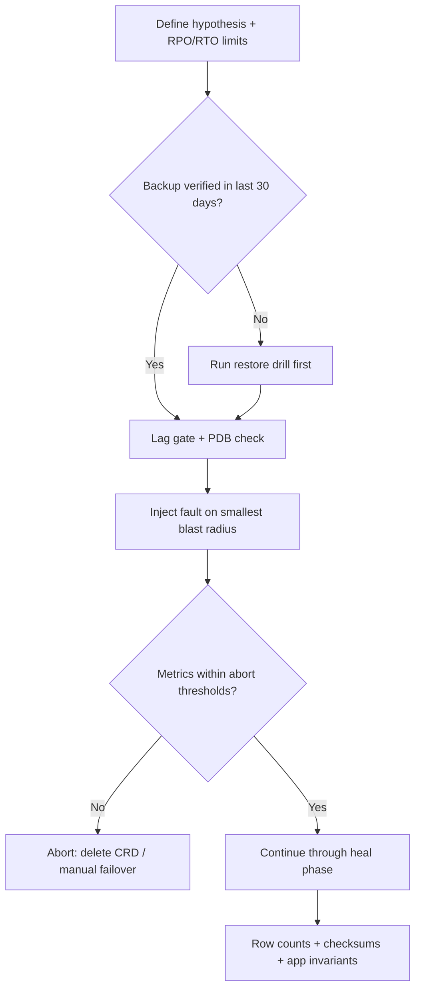

> **Discipline Module** | Complexity: `[COMPLEX]` | Time: 3 hours

## Prerequisites

Before starting this module:
- **Required**: [Module 1.2: Chaos Mesh Fundamentals](../module-1.2-chaos-mesh/) — PodChaos, NetworkChaos, StressChaos
- **Required**: [Kubernetes Basics — StatefulSets](/prerequisites/kubernetes-basics/) — PVs, PVCs, StatefulSets, headless Services
- **Recommended**: Basic PostgreSQL or MySQL administration experience
- **Recommended**: Understanding of database replication concepts (primary/replica, WAL shipping)

---

## What You'll Be Able to Do

After completing this module, you will be able to:

- **Design chaos experiments for stateful workloads — databases, queues, caches — with proper data safety controls**
- **Implement storage-level fault injection that tests volume failures, I/O errors, and disk pressure**
- **Evaluate data consistency guarantees under chaos conditions for stateful Kubernetes workloads**
- **Build recovery validation experiments that verify backup, restore, and failover procedures actually work**

## Why This Module Matters

In 2017, GitLab lost six hours of production data after all five of their backup and recovery mechanisms failed simultaneously — a canonical lesson that untested backups are not backups and untested failover is not failover. <!-- incident-xref: gitlab-2017-db1 --> For the full case study, see [What Is a Terminal](../../../../prerequisites/zero-to-terminal/module-0.2-what-is-a-terminal/).

Stateless services are straightforward to test with chaos: kill a pod, it restarts, traffic reroutes, and the experiment ends with a learning note rather than a data-loss incident. Stateful systems are fundamentally different because the pod is only the compute shell around durable identity and disk. When you kill a database pod, you do not merely lose a process — you potentially lose committed transactions, corrupt indexes, break replication chains, and violate consistency guarantees that your application assumed were true. The blast radius of stateful chaos is inherently larger, the safety bar is higher, and you must be able to restore to a known-good point before you ever touch production.

**Hypothetical scenario:** A platform team runs PodChaos against a three-replica PostgreSQL cluster in staging without checking replication lag first. The primary dies, Patroni promotes a replica that was thirty seconds behind, and roughly twelve thousand checkout rows vanish from the promoted database even though every health check turned green within twenty seconds. The team celebrates a fast failover while finance discovers mismatched order totals. The experiment succeeded at measuring speed and failed at measuring correctness — exactly the gap this module closes.

This module teaches you to safely inject chaos into stateful workloads — databases, caches, message queues, and persistent storage — so you test failover mechanisms, verify backup integrity, and surface hidden assumptions in your data layer without losing production bytes. You will learn durable practice: how to bound blast radius, how to measure RPO and RTO as steady-state metrics, and how to prove that "it came back up" does not mean "no data was lost."

---

## Why Stateful Chaos Is Harder Than Stateless Chaos

Stateful workloads on Kubernetes inherit constraints from [StatefulSets](https://kubernetes.io/docs/concepts/workloads/controllers/statefulset/), [PersistentVolumes](https://kubernetes.io/docs/concepts/storage/persistent-volumes/), and often from operators that encode day-two logic such as failover, backup, and re-sync. A Deployment pod is interchangeable; a StatefulSet pod named `postgresql-0` is bound to PVC `data-postgresql-0` and stable network identity via a headless Service. Killing `postgresql-0` does not create a fresh empty database — Kubernetes reschedules the pod and reattaches the same volume, which may require crash recovery, WAL replay, or operator intervention before the instance accepts traffic again.

The failure modes you care about shift from "request failed once" to "data is wrong forever." Silent corruption, split-brain writes, and promotion of a stale replica are all scenarios where the system appears healthy while serving incorrect state. That is why stateful chaos experiments must always include post-recovery verification: row counts, checksums, sequence monotonicity, and application-level invariants — not just HTTP 200 responses and green readiness probes.

Cross-reference the StatefulSet and storage fundamentals from [Kubernetes Basics — StatefulSets](/prerequisites/kubernetes-basics/) before running experiments. If you cannot explain how your PVC binds to a pod identity and what happens when the node disappears, you are not ready to inject faults into the primary.

Operators add another layer because they reconcile custom resources against cluster reality on a loop. When you delete a pod manually, you might expect Kubernetes to recreate it; when an operator owns the pod, recreation may include init logic, bootstrap from backup, or refusal to start if the CR status says the cluster is unhealthy. Chaos against stateful systems therefore requires reading operator documentation alongside Chaos Mesh docs — the experiment validates two control planes at once.

Connection pools, ORMs, and retry middleware form the application half of the stateful story. A database can fail over perfectly while the application continues hammering a dead TCP socket until threads exhaust. Stateful chaos metrics must include client-side error rates, pool refresh events, and transaction retry counts, not only server-side replication lag. Teams that test only the data plane often ship applications that pass lab failover but fail real incidents because HikariCP or pgBouncer settings were never exercised under fault.

---

## Designing Safe Stateful Chaos Experiments

Designing chaos for stateful systems begins with a written hypothesis and explicit abort criteria, not with a YAML file copied from a tutorial. Your hypothesis should state what steady-state behavior you expect under fault (for example, "writes fail fast with a clear error" or "failover completes within ninety seconds with zero lost transactions when lag is under one second"). Abort criteria tie to RPO and RTO thresholds you already agreed with stakeholders: if replication lag exceeds five seconds, if backup restore exceeds the RTO budget, or if any checksum mismatch appears, the experiment stops and you restore from backup rather than "seeing what happens."

Safety controls stack in layers. First, run in non-production until the runbook is proven; production experiments require verified backups taken immediately before the window and a restore drill completed within the last quarter. Second, bound blast radius: target one replica before the primary, one broker before the controller, one partition before the whole cluster. Third, use [PodDisruptionBudgets](https://kubernetes.io/docs/tasks/run-application/configure-pdb/) so Kubernetes and your chaos tooling cannot simultaneously evict more pods than your quorum allows. Fourth, keep a human on the abort switch who can delete Chaos Mesh CRDs and trigger operator-led failover manually if automation stalls.

Every design should answer four questions before execution: What is the worst credible data loss if this goes wrong? Can we restore within RTO from backups or replicas? Who approves production scope? What verification queries prove correctness after recovery? If any answer is "unknown," the experiment belongs in a lab cluster with synthetic data, not in a shared staging environment that other teams treat as truth.

Document the experiment like a production change: scope, rollback, observers, and communication channels. Notify downstream teams when staging holds shared datasets because a partition test on Redis may poison cache keys that batch jobs rely on overnight. Time-box duration fields on Chaos Mesh CRDs so faults self-heal if the engineer on abort duty loses connectivity. Pair every automated experiment with a manual runbook step that deletes CRDs and verifies CR status returns to normal — controllers occasionally need a reconcile nudge after aggressive fault injection.

Production stateful chaos, when permitted at all, should resemble a surgical drill rather than exploration. One service, one fault type, one business hour window, executive sponsor, and pre-agreed customer communication if external impact appears. The goal is confidence accumulation, not novelty; repeating the same primary-kill quarterly with improved measurements beats inventing exotic faults that nobody interprets.

---

## RPO, RTO, and Consistency Under Failure

Recovery Point Objective (RPO) is the maximum acceptable age of recovered data — how far back in time you are willing to rewind. Recovery Time Objective (RTO) is the maximum acceptable downtime before service is restored to a defined quality bar. These are business metrics, not database metrics, but chaos experiments make them measurable. When you kill a primary, the time between the last committed transaction on the old primary and the first writable state on the new primary is your observed RPO window unless you use synchronous replication that waits for quorum acknowledgment on every commit.

Synchronous replication narrows the data-loss window at the cost of latency and availability under partition: if a synchronous replica is unreachable, commits may block or fail. Asynchronous replication keeps the primary fast but allows lag; promoting a lagging replica crystallizes that lag as permanent loss. Chaos testing should record both failover duration (RTO component) and the gap between WAL positions or binlog coordinates before and after promotion (RPO component).

"It came back up" is the most dangerous sentence in incident response. A database that starts after crash recovery may skip torn pages, accept writes on a split-brain primary, or serve stale reads from a replica that has not caught up. Verification means comparing checksums (`pg_checksums` in PostgreSQL), row counts on critical tables, monotonic sequence values, and application-level idempotency tokens. The [Google SRE Book chapter on data integrity](https://sre.google/sre-book/data-integrity/) emphasizes that durability requires end-to-end checks, not assumptions from architecture diagrams.

Linearizability and serializability are formal consistency models that few teams implement end-to-end, yet everyone assumes informally. Chaos experiments translate those assumptions into observations: during partition, can two clients both succeed on conflicting writes? After heal, does any client read a value that was never committed on the surviving history? You do not need to run full Jepsen suites in your cluster to benefit from Jepsen’s lesson — design workloads that write monotonic tokens and read them back from multiple clients and replicas after faults. Gaps in the token sequence are smoke; matching sequences across replicas after heal are evidence that your operational model matches your mental model.

Read-your-writes and causal consistency show up in applications long before architects name them. A user updates a profile, refreshes, and sees stale data because the read hit a replica that lagged — chaos exposes that routing mistake faster than code review. Document which endpoints require primary reads versus replica reads, then fault the primary and verify that read-only traffic either fails fast with a clear message or follows replicas with bounded staleness acceptable to product owners.

---

## What to Test on Stateful Systems

A complete stateful chaos program exercises the failure modes your architecture claims to handle, not only the ones that are easy to trigger. Leader or primary failover tests answer whether promotion completes within RTO and what RPO the promotion actually incurred. Replica loss and re-sync tests answer whether remaining replicas absorb read load and whether the replaced member rejoins without manual rebuild. Quorum loss tests answer whether the cluster refuses writes rather than accepting divergent commits — the etcd failure documentation describes how minority members become read-only when quorum disappears.

Storage-layer faults deserve equal attention. Disk-full conditions, elevated IO latency, and injected IO errors (EIO) reveal whether applications time out gracefully or hang thread pools until the whole service stalls. PVC detach and node loss scenarios test whether StatefulSet rescheduling and volume reattachment complete within your runbook assumptions; cloud block storage reattach often takes minutes, not seconds. Network partitions between replicas test split-brain defenses: does the isolated primary stop accepting writes? Does consensus elect exactly one leader?

Backup and restore drills belong in the same program as live failover. Restore into an isolated database or cluster, then compare counts and checksums against the live system at backup time. Clock skew experiments using TimeChaos probe consensus algorithms that assume bounded time drift — relevant for etcd, ZooKeeper, and many distributed databases. Message queues and caches hold state too: durable queue semantics, ISR behavior in Kafka, and Sentinel promotion rules are all stateful surfaces even when the workload runs in memory.

Disk-full and inode exhaustion faults differ from latency injection because many databases stop accepting writes entirely when a volume fills — a condition IOChaos can approximate with error injection on append operations or with carefully scoped emptyDir pressure tests on log sidecars. The learning goal is whether monitoring fires before the database halts and whether autoscaling or log rotation runbooks execute without manual paging. Latency-only programs miss full-volume incidents because the process stays alive while every write blocks.

Replica re-sync after extended outage tests whether your operator rebuilds from scratch, reuses incremental catch-up, or requires human object-store restore. Kill a replica pod, pause it long enough for retention windows to expire WAL or binlog segments the primary no longer retains, then restart and measure rebuild time and load on the primary. That scenario mimics maintenance mistakes and network partitions longer than your retention policy allows — a common surprise in production that simple pod-kill tests never reach.

---

## IOChaos: Storage-Level Fault Injection

IOChaos intercepts filesystem operations inside target containers and injects delays, errors, or attribute modifications. This simulates degraded storage, failing disks, and IO controller issues without rewriting bytes on the underlying PersistentVolume — the application experiences real syscall failures and latency, which is what you need to test application and database behavior under stress.

Chaos Mesh implements IOChaos with a FUSE (Filesystem in Userspace) layer inserted between the application and the mounted volume path documented in the [IOChaos guide](https://chaos-mesh.org/docs/simulate-io-chaos-on-kubernetes/). When the experiment CRD is deleted, the FUSE layer is removed and IO returns to normal unless the application corrupted its own files in response to simulated errors — which is itself a valuable finding.

```
Normal IO path:
  Application → write() syscall → Filesystem → Block device → Disk

IOChaos path:
  Application → write() syscall → FUSE (Chaos Mesh) → delay/error → Filesystem → Disk
                                   ↑
                              Chaos Mesh injects
                              faults here
```

**Hypothesis**: "We believe the API will continue responding within two seconds even when disk read latency increases to one hundred milliseconds per operation, because frequently accessed data is cached in PostgreSQL shared buffers and only cold queries hit disk."

```yaml
# io-delay-experiment.yaml
apiVersion: chaos-mesh.org/v1alpha1
kind: IOChaos
metadata:
  name: postgres-io-delay
  namespace: database
spec:
  action: latency
  mode: one
  selector:
    namespaces:
      - database
    labelSelectors:
      app: postgresql
      role: primary
  volumePath: /var/lib/postgresql/data
  path: "**"
  delay: "100ms"
  percent: 100
  containerNames:
    - postgresql
  duration: "180s"
```

```bash
kubectl apply -f io-delay-experiment.yaml

kubectl exec -it deployment/api-server -n app -- \
  sh -c 'for i in $(seq 1 10); do
    START=$(date +%s%N)
    curl -s http://localhost:8080/api/products/1 > /dev/null
    END=$(date +%s%N)
    echo "Query $i: $(( (END - START) / 1000000 ))ms"
    sleep 1
  done'

kubectl exec -it postgresql-0 -n database -- \
  psql -U postgres -c "SELECT * FROM pg_stat_io WHERE backend_type = 'client backend';"

kubectl delete iochaos postgres-io-delay -n database
```

IO error injection on WAL paths can cause PostgreSQL to halt to protect integrity — expected behavior. The experiment question is whether your operator or runbook detects the crash and promotes a healthy replica within RTO. Target selective paths (`**/pg_wal/**`, `**/base/**`) to stress replication versus heap access separately rather than blasting one hundred percent errors at the primary without a standby ready to promote.

When interpreting IOChaos results, separate engine behavior from storage behavior. PostgreSQL may enter recovery mode, MySQL InnoDB may crash the mysqld process, and etcd may panic on fsync failure — each response is intentional crash safety, not a failed experiment. Capture logs from the moment of first injected error through restart or promotion so postmortems reference timestamps instead of memory. Compare `pg_stat_io` or equivalent metrics before, during, and after fault to confirm the FUSE layer fully detached; lingering elevation indicates cleanup issues worth filing against the chaos tooling or restarting the pod.

Percent-based IOChaos (`percent: 25`) models intermittent array glitches better than total failure and keeps the database running long enough to observe application retry storms. Pair intermittent faults with idempotent write tests: if duplicate charges appear after partial failures, the bug lives in application logic, not the storage tier. That combination is how stateful chaos earns its complexity label — you are debugging distributed systems behavior, not toggling a pod.

---

## Database Failover and Operator Logic

Modern Kubernetes databases are often operated by controllers — CloudNativePG for PostgreSQL, Strimzi for Kafka, Vitess for sharded MySQL — that encode failover, backup, and reconfiguration logic you previously performed by hand. Stateful chaos tests that day-two automation, not merely the database binary. When you kill the primary pod, you are asking whether the operator updates Services or endpoints, whether it respects replication lag before promotion, and whether it rebuilds failed members without human intervention.

Patroni-style PostgreSQL HA remains a common pattern: a distributed configuration store holds the leader key, replicas watch that key, and promotion runs `pg_ctl promote` on the lag-appropriate candidate. The [CloudNativePG failover documentation](https://cloudnative-pg.io/documentation/current/failover/) describes Kubernetes-native promotion flows that replace much of the Patroni glue with CRD status and controlled switchover. Either way, your experiment metrics are the same: time to writable primary, count of failed client writes, replication lag at kill time versus data visible after promotion, and time for the old primary to rejoin as a replica without split-brain.

```yaml
# patroni-failover-test.yaml
apiVersion: chaos-mesh.org/v1alpha1
kind: PodChaos
metadata:
  name: patroni-primary-kill
  namespace: database
spec:
  action: pod-kill
  mode: one
  selector:
    namespaces:
      - database
    labelSelectors:
      app: postgresql
      role: master
  gracePeriod: 0
  duration: "120s"
```

During failover, run parallel observers: cluster state from the operator CLI or `patronictl list`, application health and write probes, and replication lag queries on survivors. Record lag before the kill — if you skip that step, you cannot interpret data loss afterward. After failover, verify sequence continuity and row counts on tables that received writes during the window; gaps in serial columns or missing idempotency keys reveal RPO breaches that latency metrics hide.

Switchover differs from failover in ways chaos programs often ignore. Planned switchover moves leadership without crash, testing whether applications tolerate brief write pauses and DNS or Service updates. Failover chaos kills pods; switchover chaos should include operator-initiated `kubectl cnpg promote` or Patroni `switchover` commands to compare graceful handoff against violent loss. Teams that only test crash failover discover during maintenance that graceful paths drop more connections because connection draining behaved differently than SIGKILL.

Vitess and sharded MySQL introduce shard-level primary concepts — killing one tablet primary does not test the entire cluster, which is a feature for blast-radius control. Document which shard your experiment targets and whether cross-shard transactions can observe partial failure. Strimzi-managed Kafka treats brokers as cattle yet partitions as precious; broker chaos without producer/consumer load generates trivial results, so inject synthetic traffic or replay production traffic samples at reduced rate during broker faults.

The [PostgreSQL high availability documentation](https://www.postgresql.org/docs/current/high-availability.html) describes replication modes and standby promotion at the engine level; operators implement those rules with Kubernetes-specific timing. Read both layers before claiming your cluster is "HA" because it runs three pods.

---

## Split-Brain, Quorum Loss, and Network Partitions

Split-brain is the condition where two nodes both believe they are primary and accept writes, producing divergent histories that are painful or impossible to merge automatically. It is the failure mode [Jepsen](https://jepsen.io/analyses) repeatedly demonstrates when consensus boundaries are misunderstood. Testing split-brain requires NetworkChaos partitions that isolate the current primary from witnesses (Sentinel, etcd, or other replicas) while leaving some clients able to reach the isolated node — a deliberate setup that must never run uncontrolled in production.

```yaml
# split-brain-simulation.yaml
apiVersion: chaos-mesh.org/v1alpha1
kind: NetworkChaos
metadata:
  name: redis-network-partition
  namespace: cache
spec:
  action: partition
  mode: one
  selector:
    namespaces:
      - cache
    labelSelectors:
      app: redis
      role: master
  direction: both
  target:
    selector:
      namespaces:
        - cache
      labelSelectors:
        app: redis-sentinel
    mode: all
  duration: "120s"
```

The [Redis Sentinel documentation](https://redis.io/docs/latest/operate/oss_and_stack/management/sentinel/) describes subjective and objective down detection and the importance of quorum before failover. Your partition experiment should observe whether an isolated primary stops writes when it cannot reach enough replicas (`min-replicas-to-write` and related settings), whether clients follow the new master after `+switch-master`, and what happens to writes accepted on the losing side when the partition heals — typically they are discarded when the old primary resyncs.

Quorum loss testing applies to etcd and other Raft systems: killing a majority of members should make the cluster refuse writes rather than electing competing leaders. The [etcd failure guide](https://etcd.io/docs/v3.6/op-guide/failures/) documents expected behavior when members are unavailable. Attempt a write after losing quorum; you should see errors like `etcdserver: no leader`, not silent success on divergent nodes.

NetworkChaos direction matters for split-brain realism. Partitioning the primary from all replicas differs from partitioning one replica from the others; each topology teaches different fencing behavior. Use [NetworkChaos documentation](https://chaos-mesh.org/docs/simulate-network-chaos-on-kubernetes/) fields deliberately — `direction: both` with a `target` selector creates asymmetric paths that mirror partial switch failures better than blanket packet loss. Draw the partition on paper before applying YAML so observers know which clients should still reach which nodes.

Fencing is the durable concept behind split-brain prevention: the old primary must be prevented from accepting writes after a new primary wins. STONITH (shoot the other node in the head) in bare-metal clusters becomes cloud API stop-instance calls or operator demotion in Kubernetes. If your chaos experiment shows the old primary still writable after promotion, you lack fencing — no amount of replication tuning fixes that. Document the fencing mechanism your stack uses and test it explicitly during partition heal.

---

## PersistentVolume Chaos and Node Failure

When a node fails, StatefulSet pods reschedule with the same identity but the PersistentVolume must detach from the old node and attach to the new one. That attach/detach cycle is slow on many cloud providers and is a frequent source of RTO misses that pod-only chaos never reveals. You can simulate total volume unavailability with IOChaos at one hundred percent error rate on the data mount — the effect resembles sudden detach or array failure from the application's perspective.

After injecting total IO failure, observe whether the database process exits cleanly, whether the operator triggers failover, and how long until clients can write again. When IOChaos ends, verify automatic recovery: does the instance replay WAL and open for connections, or does it require manual `pg_resetwal`-class intervention that your runbook forbids? For node-level tests, cordon the node, delete the pod with zero grace, watch PVC binding events, and measure wall-clock time until the pod is running and ready on another node — then uncordon.

These experiments pair with [Kubernetes pod disruption concepts](https://kubernetes.io/docs/concepts/workloads/pods/disruptions/): voluntary disruptions (drains, PDB-aware evictions) and involuntary ones (node loss, kubelet death) interact with your chaos schedule. A Game Day that kills pods without accounting for simultaneous node maintenance teaches the wrong lesson.

Local versus remote volumes change the story materially. Local SSD or `local-path` PVs bind data to a node; node loss may mean unrecoverable placement until manual intervention copies data. Network-attached block storage survives node loss but pays attach latency. Chaos experiments should label which storage class they target so results are not generalized incorrectly across environments. A team on fast regional SSD may assume sub-minute RTO while another on cross-region disks learns double-digit minutes — both outcomes are valid when attributed to storage architecture rather than operator skill.

ReadWriteOnce volumes allow only one writer at a time, which protects against accidental dual mount but serializes failover during attach storms. If multiple pods mount the same RWO claim during a bad failover, filesystem corruption follows — another reason operators manage Services and endpoints tightly. After node failure simulation, inspect events on the PVC for `FailedAttachVolume` or `Multi-Attach error` messages; those strings appear in real incidents and should appear in your runbook index.

---

## Backup, Restore, and Recovery Validation

The GitLab incident demonstrates that multiple backup mechanisms can fail together when none were restore-tested under realistic conditions. Chaos-driven backup validation means taking a backup, introducing controlled damage or failover, restoring to an isolated scope, and proving row-level equality on representative tables — not merely observing that `pg_dump` exited zero.

```bash
kubectl exec -it postgresql-0 -n database -- \
  psql -U postgres -c "
    CREATE TABLE IF NOT EXISTS chaos_test (
      id SERIAL PRIMARY KEY,
      data TEXT,
      created_at TIMESTAMP DEFAULT NOW()
    );
    INSERT INTO chaos_test (data)
    SELECT 'record-' || generate_series(1, 1000);
    SELECT count(*) FROM chaos_test;"

kubectl exec -it postgresql-0 -n database -- \
  pg_dump -U postgres -F c -f /tmp/chaos_backup.dump postgres

kubectl exec -it postgresql-0 -n database -- \
  psql -U postgres -c "DELETE FROM chaos_test WHERE id % 3 = 0;"

kubectl exec -it postgresql-0 -n database -- \
  pg_restore -U postgres -d postgres --clean --if-exists /tmp/chaos_backup.dump

kubectl exec -it postgresql-0 -n database -- \
  psql -U postgres -c "SELECT count(*) FROM chaos_test;"

kubectl exec -it postgresql-0 -n database -- \
  psql -U postgres -c "DROP TABLE IF EXISTS chaos_test;"
```

Schedule restore verification regularly — weekly or monthly depending on RPO — into a disposable instance whose name includes the date, then drop it after checks. Measure restore duration every time; RTO budgets that assume "about thirty minutes" fail when the real restore takes ninety minutes on production-tier storage. If restore is too slow, your steady-state mitigation is replicas and point-in-time recovery, not optimism.

Point-in-time recovery (PITR) chaos combines base backup with WAL or binlog replay to a timestamp — closer to how large teams recover from operator error than full restore from yesterday’s dump. After taking a base backup, insert a known marker row, simulate accidental mass delete, then replay to one second before the delete and verify the marker survives while deleted rows reappear. PITR drills expose missing WAL archiving, wrong retention on object storage, and permission errors on backup buckets — failures GitLab’s postmortem showed can stack silently until needed.

Encrypt backups at rest and test restore credentials under fault: revoke the backup IAM role temporarily in lab to confirm alerts fire and restores fail loudly rather than writing empty files. Backup verification is also a security exercise because restored databases often land in less restricted networks; isolate restore namespaces with NetworkPolicy defaults deny and audit logging enabled.

---

## Message Queues, Caches, and TimeChaos

Kafka brokers, RabbitMQ nodes, and Redis primaries hold in-flight state that pod kills can orphan or duplicate depending on producer and consumer settings. Kafka partition leadership election after broker loss tests whether producers with `acks=all` block correctly and whether consumers stall or skip as ISR membership changes — Strimzi documents operator-managed rolling and recovery patterns in its [overview](https://strimzi.io/docs/operators/latest/overview.html). RabbitMQ mirrored queues test whether messages survive node restart when publishers use confirms and consumers use acknowledgments.

TimeChaos skews the clock inside selected pods, stressing lease timeouts, TLS validity checks, and consensus elections that assume synchronized time. Apply TimeChaos only in isolated namespaces with explicit duration caps; see the [TimeChaos documentation](https://chaos-mesh.org/docs/simulate-time-chaos-on-kubernetes/). Combined with network partitions, clock skew reveals edge cases in leader election that sequential PodChaos tests miss.

Caches are stateful even when labeled ephemeral. Redis persistence (RDB snapshots, AOF) means pod kill tests intersect disk IO and replication; pure in-memory mode means kill equals cold cache and thundering herd on rebuild. Design cache chaos hypotheses around business impact: elevated database load, stale feature flags, or rate-limit counters reset. RabbitMQ durable queues survive broker restart when messages were persisted and publishers used confirms; chaos without publisher confirms teaches little about production safety.

Kafka’s controller broker coordinates partition leadership; killing it triggers election storms that look scary in logs but should settle within broker-configured timeouts. Use [PodChaos on brokers](https://chaos-mesh.org/docs/simulate-pod-chaos-on-kubernetes/) with consumer groups running and measure duplicate delivery counts — exactly-once semantics are rare; chaos should quantify how many duplicates your idempotent consumers actually absorb. Document whether your stack uses Strimzi’s rolling update strategy or raw StatefulSet ordering because upgrade semantics change failure coupling during experiments.

---

## Landscape Snapshot — as of 2026-06. This changes fast; verify against vendor docs before relying on specifics.

| Capability | Chaos Mesh | Litmus |
|------------|------------|--------|
| Pod kill / container kill on StatefulSet targets | PodChaos | pod-delete / container-kill experiments |
| Network partition and latency | NetworkChaos | network-chaos experiments |
| IO latency and syscall errors on a volume path | IOChaos | limited; often combined with node IO stress |
| Clock skew injection | TimeChaos | time-chaos experiments |
| Operator-native DB failover hooks | none (BYO runbooks) | workflow hooks via ChaosCenter |

| Operator (illustrative) | Failover model (verify in docs) |
|-------------------------|----------------------------------|
| CloudNativePG | Kubernetes-native promotion; lag-aware switchover |
| Vitess | Planned and emergency reparent via vtctl ([operating guide](https://vitess.io/docs/21.0/user-guides/operating-vitess/)) |
| Strimzi | Kafka broker rolling restart; partition leader election via Kafka protocol |

We use Chaos Mesh YAML in examples because it makes IO and time faults explicit; Litmus and other frameworks can target the same durable capabilities — see [What is Litmus](https://docs.litmuschaos.io/docs/introduction/what-is-litmus/) for workflow-oriented Game Days. No single tool replaces post-experiment data verification.

Choosing a chaos framework for stateful work is less important than choosing observability signals. Prefer tools that integrate with your existing Prometheus metrics and Kubernetes events so experiments appear as annotated intervals on dashboards. Whether the fault arrives from IOChaos or a Litmus workflow, the post-experiment questions remain identical: what was lag at fault time, how many writes failed, how long until checksums match across replicas, and did the operator CR reach `Ready` without manual patch?

---

## Verifying Correctness After Every Experiment

Stateful chaos that ends when the CRD is deleted has missed half the learning. The heal phase — minutes to hours after fault removal — is when split-brain reconciliation, cache repopulation, and replica catch-up either succeed or expose drift. Schedule verification queries as a checklist tied to service name: financial tables get sum(amount) comparisons, identity tables get count distinct user_id, event streams get max(event_id) monotonicity checks. Automate the checklist in a Job that runs after Game Days so human fatigue does not skip steps.

Compare results against a snapshot taken immediately before fault injection, not against production’s current live state if other traffic mutated data during the experiment. For shared staging databases, use dedicated chaos schemas or tables prefixed `chaos_` so parallel teams do not confound measurements. When mismatch appears, capture page dumps, LSN positions, and operator logs before restarting pods — restart destroys evidence you need for root cause.

Silent corruption detection sometimes requires external auditors: `pg_amcheck` for PostgreSQL heap and index consistency, `mysqlcheck` for MySQL, or application-level reconciliation jobs that compare ledger totals to payment provider APIs. Chaos should trigger those auditors on schedule after IO fault classes even when user-facing metrics look green. The [Google SRE data integrity](https://sre.google/sre-book/data-integrity/) guidance recommends designing systems so integrity checks are routine, not emergency-only — stateful chaos is the forcing function that proves those checks exist and run.

Document every experiment outcome in a short record: hypothesis, fault applied, lag at start, RTO observed, RPO observed, verification query results, surprises, runbook updates filed. Over quarters that record becomes evidence for auditors and onboarding material for engineers who were not in the room. Without written outcomes, teams repeat the same primary kill annually and call it maturity when they are actually relearning the same thirty-second failover number without deepening correctness coverage.

Hypothetical scenario: After a NetworkChaos partition heals, row counts match on two of three replicas but diverge by fourteen rows on the third. An engineer restarts the odd replica without investigation, wiping the evidence that a partial write set replicated asymmetrically during partition. The correct response is to quarantine the divergent replica, pg_dump its conflicting rows for analysis, and only then rebuild from the known-good primary — chaos maturity means preserving ambiguity long enough to learn from it.

Game Day facilitation for stateful systems benefits from explicit roles: fault injector, metric watcher, application driver, scribe, and abort owner. The scribe captures timestamps when observers shout observations — "write failed at 14:03:08" — because post-hoc log correlation without notes devolves into guessing. Debrief within forty-eight hours while context is fresh; update runbooks the same week or the learning evaporates. Stateful chaos is as much organizational discipline as technical YAML.

When integrating with CI, keep stateful experiments out of pull-request pipelines unless the cluster is disposable and data is synthetic. The durable CI-friendly checks are restore drills against anonymized dumps and linting of chaos manifests for dangerous selectors (production namespace labels, `percent: 100` on primary without replica selectors). Full failover chaos belongs in scheduled staging windows with humans present — automating it without guards recreates the GitLab risk in miniature.

Finally, teach stakeholders the vocabulary of stateful chaos before the first Game Day. Product managers who understand RPO tradeoffs will accept brief write unavailability during staging drills; executives who do not may panic at expected error spikes. A fifteen-minute briefing on lag gates, restore isolation, and the difference between availability metrics and correctness metrics prevents organizational antibodies from shutting down a program that was actually working as designed.

Regulatory and contractual retention requirements intersect with chaos when experiments delete or corrupt audit tables — even in staging. If your staging database mirrors production schema including audit logs, scope faults to non-audit schemas or use synthetic tenants whose loss is immaterial. Legal hold and compliance teams should appear on the stakeholder list for any production-adjacent stateful experiment because the blast radius includes evidence chains, not only customer-facing rows.

Treat every stateful experiment as a rehearsal for the postmortem you hope never to write: if you cannot explain what broke, what was lost, and what runbook changed, the time was entertainment, not engineering. The scribe role exists so those answers are captured in the moment, not reconstructed from incomplete logs a week later when priorities have moved on and team memories have faded.

---

## Patterns & Anti-Patterns

### Patterns

**Lag gate before primary kill.** Measure replication lag immediately before any primary-targeting experiment; abort if lag exceeds your RPO budget. This pattern converts failover chaos from a gamble into a controlled measurement.

**Restore into isolation.** Always restore backups to a temporary instance or namespace, never onto the live primary. Verification learns restore mechanics without risking production corruption.

**Hypothesis with steady-state metrics.** Tie each experiment to Prometheus or operator metrics (lag bytes, write error rate, leader changes) so abort conditions are objective rather than debated mid-incident.

### Anti-Patterns

**Primary-first without standby health.** Killing the primary when replicas are degraded turns an experiment into an outage with no promotion target — the anti-pattern of testing availability by removing all redundancy.

**Green probe equals correct data.** Readiness only proves the process accepts connections; it does not prove replicas agree on row counts or that sequences are monotonic after promotion.

**Partition test without heal phase.** Stopping the experiment when the network heals is where reconciliation bugs appear; always extend observation through heal and run checksum or count queries on all members.

**Idle cluster fault injection.** Running chaos without representative write load hides connection pool exhaustion and retry storms that appear only under real concurrency; always generate synthetic or sampled production traffic during stateful faults.

### Decision Framework

| Situation | Start with | Escalate to | Stop if |
|-----------|------------|-------------|---------|
| New stateful service, no prior chaos | Replica pod kill, read-only checks | Primary kill in staging with lag gate | Lag unknown or no backup verified |
| Regulated data, strict RPO | IO latency on single replica | Network partition in lab only | Any checksum mismatch |
| Operator-managed database | Operator switchover drill | PodChaos on primary with runbook owner present | Operator CR reports failed reconciliation |
| Message queue | Single broker kill, ISR watch | Multi-broker loss in staging | Unclean leader election or duplicate delivery |



---

## Did You Know?

- **FUSE-based IOChaos does not mutate disk blocks**: Chaos Mesh intercepts syscalls in the mount namespace; deleting the experiment removes the interceptor, which is why IOChaos is preferred for storage degradation tests over destructive writes inside the container.
- **etcd requires quorum for writes**: When a majority of members are unavailable, the cluster becomes read-only rather than accepting conflicting writes — the behavior Jepsen tests often expect but applications forget to handle gracefully.
- **PostgreSQL halts on WAL IO errors by design**: An injected EIO on `pg_wal` may crash the postmaster to prevent torn writes; the learning goal is operator detection and promotion, not keeping a corrupt primary online.
- **Principles of Chaos include steady-state hypothesis**: The [Principles of Chaos Engineering](https://principlesofchaos.org/) argue every experiment should compare measurable steady-state behavior before and during fault — for stateful systems, steady state must include data correctness metrics, not only latency and error rate.

---

## Common Mistakes

| Mistake | Why It's a Problem | Better Approach |
|---------|-------------------|-----------------|
| Running IOChaos at 100% error rate on a primary without healthy replicas | The database crashes with no promotion target — an outage, not an experiment | Ensure at least one caught-up replica and tested promotion path before primary IO faults |
| Not checking replication lag before killing the primary | Promoting a lagging replica crystallizes lag as permanent data loss | Record lag seconds and bytes immediately before fault; abort if above RPO |
| Testing backup restore on the live primary | A failed restore corrupts production — worse than the simulated disaster | Restore to an isolated instance or temporary database only |
| Assuming StatefulSet restart implies data is safe | Incomplete writes and interrupted fsync may require recovery or fail checksum validation | Run `pg_amcheck` or equivalent after IO experiments |
| Ignoring connection pool behavior during failover | Apps may hang on dead connections even after DB recovery | Monitor pool reconnect metrics and set max lifetimes below expected failover time |
| Running split-brain tests without reading consensus docs | Misinterpreted results lead to false confidence | Study Raft/Sentinel/operator failover rules before NetworkChaos partitions |
| Ending partition tests when NetworkChaos deletes | Reconciliation bugs appear when the partition heals | Extend monitoring through heal; compare row counts on all replicas |
| Skipping post-IOChaos performance baseline | Stale FUSE mounts can leave volumes degraded silently | Re-run IO latency checks or restart pod if baseline not restored |

---

## Quiz

### Question 1: How do you design a safe chaos experiment for a three-replica PostgreSQL cluster before killing the primary?

<details>
<summary>Answer</summary>

Start with a written hypothesis and explicit RPO/RTO abort thresholds, then verify a recent backup restores successfully into an isolated instance — not onto the live primary. Measure replication lag on every replica and abort if lag exceeds your RPO budget; killing a primary while a replica is minutes behind converts lag into permanent loss. Confirm PodDisruptionBudgets and operator health, bound blast radius to one namespace, and assign a human abort owner who can delete Chaos Mesh CRDs immediately. Only after those safety controls are in place should you apply PodChaos to the primary, with parallel observers for cluster state, write probes, and post-failover row-count verification.

</details>

### Question 2: How does IOChaos inject faults without modifying bytes on the PersistentVolume?

<details>
<summary>Answer</summary>

IOChaos uses a FUSE layer in the container mount namespace to intercept read, write, and fsync syscalls before they reach the real filesystem backed by the PersistentVolume. The layer can delay operations or return errno values such as EIO without rewriting disk blocks. When the IOChaos custom resource is deleted, the interceptor is removed and syscalls reach the volume directly again. Applications may still corrupt their own files if they mishandle partial writes — that application response is part of what you are testing.

</details>

### Question 3: You killed a StatefulSet database pod and readiness returned green in twenty seconds. Why is that insufficient to prove correctness?

<details>
<summary>Answer</summary>

Readiness only indicates the process passed local checks — it does not prove replicas agree on data, that sequences are monotonic, or that no committed writes were lost during promotion. A stale replica promoted after primary loss can be writable while missing recent transactions; split-brain survivors can accept divergent writes before reconciliation. Correctness requires post-failover verification: compare row counts and checksums on critical tables, inspect replication lag captured before the kill, and validate application idempotency keys or audit logs for gaps.

</details>

### Question 4: Describe a split-brain test for Redis Sentinel and what you should observe during and after the partition.

<details>
<summary>Answer</summary>

Use NetworkChaos to partition the Redis master from Sentinel processes while some clients can still reach the isolated master. During partition, observe whether Sentinel promotes a replica on the majority side and whether the isolated master rejects writes when it cannot reach enough replicas (`min-replicas-to-write`). After heal, the demoted master should resync from the new primary; writes accepted only on the losing side during partition are typically discarded. Document whether clients followed `+switch-master` events or stale endpoints — client behavior dominates real-world RTO as much as Sentinel itself.

</details>

### Question 5: Why must you measure replication lag immediately before a failover chaos experiment?

<details>
<summary>Answer</summary>

Lag at kill time is the best estimate of data loss if the primary never flushes another byte. Asynchronous replication means commits acknowledged on the primary may not yet be on the replica chosen for promotion; that gap becomes permanent lost work. Recording lag before fault gives you a baseline to compare against post-promotion sequence positions and row counts. If lag is unexpectedly high, abort — the experiment would measure accidental data destruction, not production-like failure.

</details>

### Question 6: What is the difference between killing a Deployment pod and a StatefulSet pod regarding data impact?

<details>
<summary>Answer</summary>

Deployment pods are interchangeable; replacement starts with empty local state unless external storage is attached. StatefulSet pods retain stable identity and reattach the same PVC on reschedule, so on-disk data survives the restart but may require crash recovery or WAL replay. In-flight writes may be torn if the kill happens mid-fsync, and node loss can delay reschedule while volumes detach and reattach elsewhere. Chaos on StatefulSets therefore demands volume-aware runbooks and correctness checks Deployment tests skip.

</details>

### Question 7: Your restore test succeeds but takes ninety minutes for a twenty-gigabyte database. How do you evaluate whether that is acceptable?

<details>
<summary>Answer</summary>

Compare ninety minutes against your RTO budget including detection, decision, download, restore, application restart, and cache warm-up — not restore alone. Compute effective throughput (roughly twenty gigabytes in ninety minutes) and determine whether storage tier or parallel restore (`pg_restore -j`) can improve it. If total recovery exceeds RTO, steady-state architecture must change — hotter standbys, point-in-time recovery, or smaller backup scope — because a backup you cannot restore in time is not a viable control.

</details>

### Question 8: How do operators change what you are testing during stateful chaos?

<details>
<summary>Answer</summary>

Operators encode day-two automation: failover, backup, rolling updates, and rejoin of failed members. Killing a pod tests whether the operator reconciles desired CR state — new primary Service, replica rebuild, lag-aware promotion — not merely whether the database binary restarts. Failures often appear in operator logs and status conditions while pods look healthy. Stateful chaos should include operator metrics and events alongside database probes.

</details>

---

## Hands-On

**Objective:** Inject IO read/write delay on a PostgreSQL primary, observe query impact, and validate cluster recovery after experiment removal.

### Step 1: Verify cluster health and lag gate

```bash
kubectl exec -it postgresql-0 -n database -- patronictl list

kubectl exec -it postgresql-0 -n database -- \
  psql -U postgres -c "SELECT client_addr, state,
    pg_wal_lsn_diff(sent_lsn, replay_lsn) AS lag_bytes
    FROM pg_stat_replication;"
```

### Step 2: Apply IO delay and observe

```yaml
apiVersion: chaos-mesh.org/v1alpha1
kind: IOChaos
metadata:
  name: postgres-primary-io-delay
  namespace: database
spec:
  action: latency
  mode: one
  selector:
    namespaces:
      - database
    labelSelectors:
      app: postgresql
      role: master
  volumePath: /var/lib/postgresql/data
  path: "**"
  delay: "100ms"
  percent: 100
  containerNames:
    - postgresql
  duration: "300s"
```

```bash
kubectl apply -f postgres-primary-io-delay.yaml

kubectl exec -it postgresql-0 -n database -- \
  psql -U postgres -c "\timing on
    SELECT count(*) FROM pg_stat_user_tables;
    INSERT INTO chaos_probe DEFAULT VALUES;"
```

### Step 3: Remove chaos and verify baseline recovery

```bash
kubectl delete iochaos postgres-primary-io-delay -n database
sleep 15
kubectl exec -it postgresql-0 -n database -- \
  psql -U postgres -c "\timing on SELECT count(*) FROM pg_stat_user_tables;"
```

### Success Criteria

- [ ] Replication lag recorded before IOChaos; lag within agreed RPO budget
- [ ] Query and write timings documented during IO delay versus baseline
- [ ] IOChaos removed and read/write latency returns near baseline within fifteen minutes
- [ ] Patroni or operator cluster status shows stable leader and zero divergent replicas after recovery

---

## Sources

- [Chaos Mesh — Simulate IO Chaos on Kubernetes](https://chaos-mesh.org/docs/simulate-io-chaos-on-kubernetes/)
- [Chaos Mesh — Simulate Pod Chaos on Kubernetes](https://chaos-mesh.org/docs/simulate-pod-chaos-on-kubernetes/)
- [Chaos Mesh — Simulate Network Chaos on Kubernetes](https://chaos-mesh.org/docs/simulate-network-chaos-on-kubernetes/)
- [Chaos Mesh — Simulate Time Chaos on Kubernetes](https://chaos-mesh.org/docs/simulate-time-chaos-on-kubernetes/)
- [Kubernetes — StatefulSets](https://kubernetes.io/docs/concepts/workloads/controllers/statefulset/)
- [Kubernetes — Persistent Volumes](https://kubernetes.io/docs/concepts/storage/persistent-volumes/)
- [Kubernetes — Configure Pod Disruption Budgets](https://kubernetes.io/docs/tasks/run-application/configure-pdb/)
- [Kubernetes — Pod Disruptions](https://kubernetes.io/docs/concepts/workloads/pods/disruptions/)
- [CloudNativePG — Failover](https://cloudnative-pg.io/documentation/current/failover/)
- [Vitess — Operating Vitess](https://vitess.io/docs/21.0/user-guides/operating-vitess/)
- [Strimzi — Overview](https://strimzi.io/docs/operators/latest/overview.html)
- [Jepsen — Analyses](https://jepsen.io/analyses)
- [Google SRE Book — Data Integrity](https://sre.google/sre-book/data-integrity/)
- [Principles of Chaos Engineering](https://principlesofchaos.org/)
- [Litmus — What is Litmus](https://docs.litmuschaos.io/docs/introduction/what-is-litmus/)
- [PostgreSQL Documentation — High Availability](https://www.postgresql.org/docs/current/high-availability.html)
- [Redis — Sentinel Documentation](https://redis.io/docs/latest/operate/oss_and_stack/management/sentinel/)
- [etcd — Failures and Recovery](https://etcd.io/docs/v3.6/op-guide/failures/)
- [GitLab — Database Incident Postmortem (2017)](https://about.gitlab.com/blog/2017/02/01/gitlab-dot-com-database-incident/)

---

## Next Module

Continue to [Module 1.5: Automating Chaos & Game Days](../module-1.5-automating-chaos/) — Integrate chaos experiments into CI/CD pipelines, structure Game Days for maximum learning, and build automated abort mechanisms tied to Prometheus alerts.
