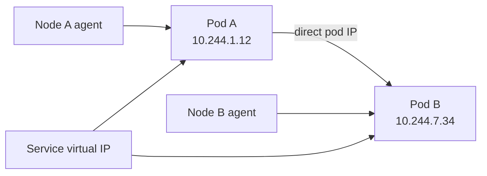
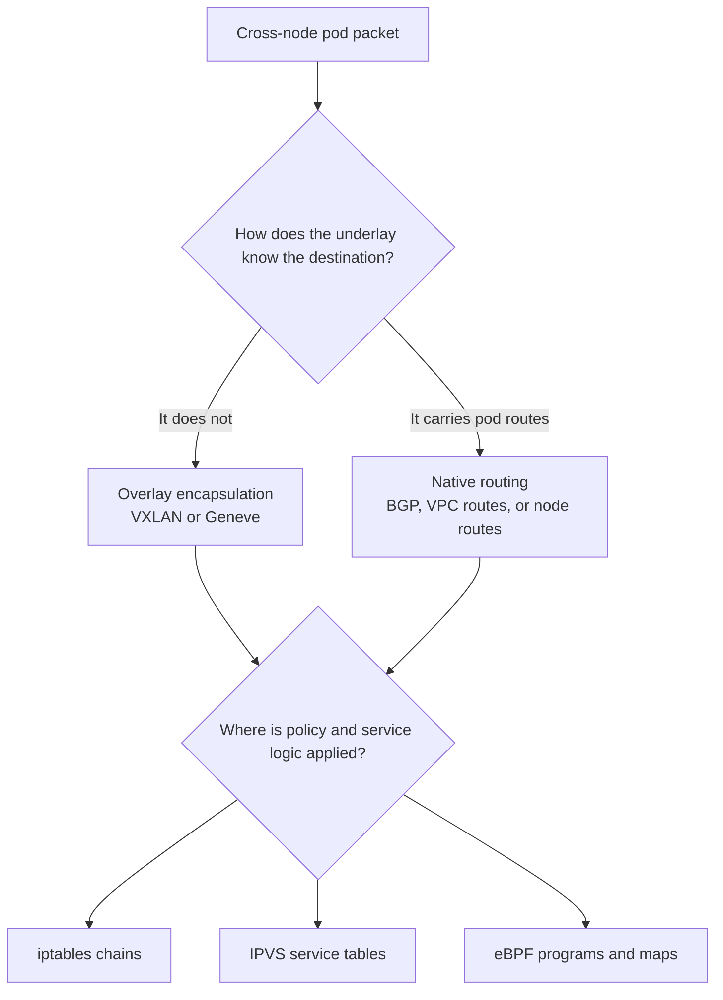
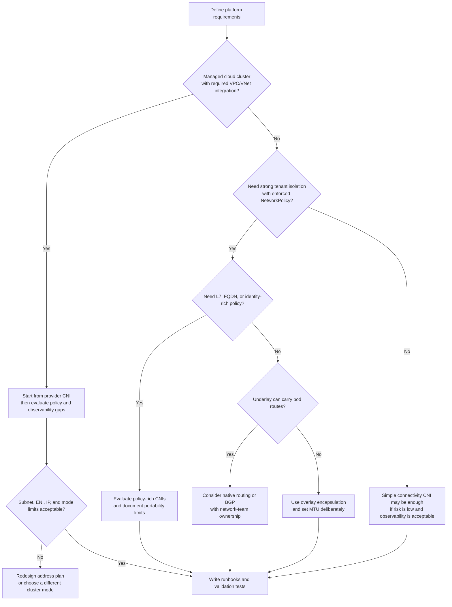

> **Discipline Module** | Complexity: `[COMPLEX]` | Time: 1.5 hours

## Prerequisites

Before starting this module:
- **Required**: [Kubernetes Basics](/prerequisites/kubernetes-basics/) - Pod, Service, and Namespace concepts
- **Required**: [Advanced Networking foundations](/platform/foundations/advanced-networking/) - IP addressing, routing, overlays, and zero-trust networking
- **Recommended**: Linux networking fundamentals, especially network namespaces, routes, veth pairs, and packet filtering
- **Helpful**: Experience operating a Kubernetes cluster with `kubectl`, kubelet logs, and node shell access

---

## What You'll Be Able to Do

After completing this module, you will be able to:

- **Evaluate CNI plugins — Calico, Cilium, Flannel, Weave — against your networking and security requirements**
- **Design Kubernetes network architectures with proper CIDR planning, overlay versus native routing, and IP management**
- **Implement CNI configuration for multi-tenant clusters with network isolation and performance requirements**
- **Diagnose CNI-level networking issues — pod connectivity failures, IP exhaustion, routing table corruption**

## Why This Module Matters

Hypothetical scenario: A platform team rebuilds a production Kubernetes cluster from a simple overlay CNI to a policy-capable CNI during a maintenance window. The team has tested application deploys, node drains, and storage failover, but they have not modeled what happens when old pod CIDRs, stale node routes, and new encapsulation settings coexist during the migration. In the first migrated batch, pods on new nodes can talk to each other, pods on old nodes can talk to each other, and cross-batch traffic fails in ways that look random until someone inspects routes and tunnel interfaces on the nodes. The outage is not caused by a defective CNI binary; it is caused by treating the cluster network as an interchangeable addon rather than as the data plane all workloads depend on.

Kubernetes makes networking look intentionally boring to application teams. A pod gets an IP address, another pod dials that IP, a Service gives stable virtual addressing, and most developers never have to learn whether the packet crossed a Linux bridge, a VXLAN tunnel, an eBPF program, a cloud VPC route, or a top-of-rack router. That simplicity is one of Kubernetes' strongest design choices, but it hides a platform engineering responsibility: somebody must select, configure, operate, observe, and eventually migrate the CNI implementation that makes the model true. When that layer breaks, nearly every symptom in the cluster can look like an application incident.

The durable lesson is that CNI is not "the thing that installs pod networking." It is the contract between the container runtime and network plugins, plus a family of implementations that satisfy the Kubernetes network model using very different data planes. A small development cluster might only need simple cross-node reachability. A regulated multi-tenant platform might need namespace isolation, egress controls, flow logs, transparent encryption, and policy that follows workload identity instead of fragile IP addresses. A large services cluster might care less about tunnel overhead than about how service routing and policy scale when endpoints churn all day.

This module teaches the durable spine before the tool roster. You will learn the Kubernetes network invariants, what a CNI plugin actually does during pod sandbox creation and deletion, how overlay and native routing differ, why packet-processing engines such as iptables, IPVS, and eBPF change operational behavior, how policy and encryption fit into CNI selection, and how to evaluate cloud-managed CNI choices without reducing architecture to a product comparison. Tool names appear because you must operate real systems, but the point is to build a decision process that survives vendor churn.

---

## The Kubernetes Network Model Is the Contract

The [Kubernetes cluster networking documentation](https://kubernetes.io/docs/concepts/cluster-administration/networking/) defines the model every cluster network must satisfy: pods can communicate with pods on any node without NAT, agents on a node can communicate with all pods on that node, and a pod's own view of its IP matches the IP other pods use to reach it. Those requirements are deliberately small, but they are powerful because they remove application-level topology work. A pod does not need to know which node hosts its peer, whether the peer moved after a reschedule, or whether traffic crossed a tunnel.

That flat model exists because early container platforms often made applications choose between host ports, explicit links, overlays with special DNS behavior, or per-host translation. Kubernetes chose a cleaner abstraction: every pod is an addressable endpoint in a cluster-wide network, and Services provide stable virtual endpoints for groups of pods. The model does not say how to implement routing, how to allocate addresses, how to enforce policy, or how to integrate with a cloud network. It only defines what must be true from the workload's point of view.

This distinction matters during selection. Kubernetes does not require that your pod IPs be routable from the corporate WAN, that traffic be encrypted between nodes, that NetworkPolicy be enforced, that packets avoid encapsulation, or that flow logs exist. Those are platform requirements layered on top of the base model. If your team says "we need Kubernetes networking," the minimum answer is pod-to-pod reachability. If your team says "we need a shared multi-tenant platform," the answer expands into policy enforcement, address planning, observability, upgrade safety, and operational ownership.

The network model also explains why CNI mistakes create strange symptoms. If pod-to-pod traffic fails only across nodes, the application may report database timeouts, DNS failures, readiness probe failures, or broken service calls, even though the root cause is cross-node routing. If a node cannot reach local pods, kubelet probes may fail while pods can still talk outward. If pods communicate through NAT unexpectedly, application logs and audit trails may show node IPs instead of workload IPs, breaking policy assumptions and troubleshooting. A good platform engineer keeps the model in mind and asks which invariant is broken before chasing individual symptoms.

The useful analogy is a city street grid. Kubernetes promises every building has an address and every other building can send a courier there without asking which landlord owns the road. CNI implementations are the road builders, traffic lights, tunnels, and maps. A small town might use simple roads and signs; a dense city might need traffic cameras, bus lanes, tolling, and tunnel ventilation. The address promise is stable, but the infrastructure needed to keep the promise changes with scale, risk, and operating model.



CIDR planning is part of the contract because pod and Service address spaces are difficult to change after cluster creation. Pod CIDRs must not overlap with node networks, service CIDRs, peered VPCs, VPN routes, on-premises networks, or other clusters you may connect later. A single-cluster lab can survive a lazy default; a platform with multi-cluster failover, service mesh, private endpoints, and hybrid connectivity cannot. The durable design question is not "what CIDR does this installer default to?" but "will this address plan still work when we add clusters, tenants, regions, and private routes?"

For the current KubeDojo target of Kubernetes 1.35, the same model still holds. What changes over time is the ecosystem around it: kube-proxy modes, eBPF dataplanes, cloud CNI integrations, policy APIs, and observability tooling. Keeping the base invariant separate from implementation details lets you reason clearly when a vendor page changes or a managed service adds a feature. You are not choosing whether Kubernetes should have a flat pod network; you are choosing how your platform will satisfy and extend that network safely.

---

## What a CNI Plugin Actually Does

The [CNI specification](https://github.com/containernetworking/cni/blob/main/SPEC.md) is an open standard for connecting a container runtime to network plugins. Kubernetes uses it through the node runtime path: kubelet asks the container runtime to create a pod sandbox, the runtime creates or references the pod network namespace, and the runtime invokes one or more CNI plugin binaries with environment variables and JSON configuration. The plugin returns structured result data, including interfaces, IP addresses, routes, and DNS information. The runtime does not need to know whether the plugin uses a bridge, a tunnel, BGP, eBPF, or cloud APIs.

The distinction between the CNI specification and a CNI implementation is easy to miss. The specification is the contract: commands, inputs, outputs, version behavior, error handling, and plugin chaining. An implementation is a program such as Cilium, Calico, Flannel, Antrea, AWS VPC CNI, Azure CNI, or another plugin that obeys that contract while programming the node network. When someone says "CNI is broken," ask whether they mean the runtime could not call the plugin, the plugin returned an error, IPAM failed, Linux interfaces were not created, routes were wrong, policy blocked traffic, or the data plane dropped packets.

The important CNI lifecycle operations are simple in name and deep in consequence. `ADD` attaches a container or pod sandbox to the network. `DEL` removes that attachment and releases resources. `CHECK` verifies an existing attachment still matches the expected state. `VERSION` lets runtimes and plugins negotiate supported versions. `GC` gives runtimes a standard way to ask plugins to clean up stale resources that no longer correspond to live containers. The current spec is small because it intentionally avoids dictating implementation internals.

```text
kubelet
  -> container runtime
       -> create pod sandbox network namespace
       -> invoke CNI plugin with CNI_COMMAND=ADD
       -> plugin allocates IP, wires interface, programs routes
       -> runtime starts workload containers in that namespace
```

A typical plugin execution has four jobs. First, it needs IPAM, or IP address management, to decide which pod IP belongs to this sandbox and to reserve that address so another pod does not receive it. Second, it wires the pod network namespace, often by creating a veth pair with one end moved into the pod namespace as `eth0` and the other end left on the host. Third, it configures routes so the pod knows how to reach the cluster and the host knows where to send traffic for the pod. Fourth, it programs the wider data plane: bridge membership, tunnel devices, BGP advertisements, eBPF maps, cloud ENI attachment, policy rules, or service routing state depending on the implementation.

Plugin chaining is how Kubernetes clusters compose small networking functions. A primary plugin might provide pod connectivity and IPAM, while additional plugins handle port mappings, bandwidth shaping, tuning, or loopback behavior. The [CNI conventions document](https://github.com/containernetworking/cni/blob/main/CONVENTIONS.md) describes common behaviors around capabilities and plugin composition. Chaining is powerful, but it also means a failure may come from a secondary plugin rather than the primary CNI. When hostPort stops working, the root cause might be the portmap plugin. When pod rate limits conflict with policy enforcement, the root cause might be two plugins competing for the same kernel hook.

```json
{
  "cniVersion": "1.1.0",
  "name": "k8s-pod-network",
  "plugins": [
    {
      "type": "primary-plugin",
      "ipam": { "type": "host-local" }
    },
    {
      "type": "portmap",
      "capabilities": { "portMappings": true }
    }
  ]
}
```

Operationally, the files matter. CNI configuration usually lives under `/etc/cni/net.d/`, and plugin binaries usually live under `/opt/cni/bin/`. Those paths are node-local state. If a migration leaves an old conflist in place, the runtime may call the wrong plugin. If a binary is missing on one node, only pods scheduled there fail. If the IPAM database under `/var/lib/cni/` is stale, a node may believe addresses are still allocated after pods disappeared. These problems do not show up in application manifests, so diagnosing them requires node-level inspection.

```bash
sudo ls -la /etc/cni/net.d/
sudo ls -la /opt/cni/bin/
sudo find /var/lib/cni -maxdepth 3 -type f -print
```

The pod sandbox is the reason application containers in the same pod share one IP. Kubernetes creates a pause or infrastructure container that owns the pod network namespace. The CNI plugin wires that namespace once, then application containers join it. If one application container restarts, the pod IP normally remains stable because the sandbox still exists. If the sandbox is recreated, the runtime calls CNI again and a new IP may be allocated. Understanding this lifecycle helps you explain why container restarts and pod recreations have different networking effects.

The deletion path is just as important as creation. `DEL` should remove interfaces, release IPAM reservations, and clean state that belongs only to that sandbox. In real clusters, node crashes, runtime failures, or plugin bugs can interrupt cleanup. That is why a good operational runbook includes stale veth inspection, IPAM state checks, and a safe node rebuild path. Do not start by deleting random interfaces on a production node; first identify whether they correspond to live pods, because the kernel does not know your intent.

---

## Dataplane Architecture: Overlay, Native Routing, and Packet Engines

The first durable axis is how packets move between nodes. Overlay designs encapsulate pod traffic inside an outer packet that the underlying network already knows how to route. VXLAN and Geneve are common examples. The pod packet remains intact inside the tunnel, while the outer header uses node IP addresses. This makes overlays attractive when you do not control the underlay network, cannot advertise pod routes, or need a consistent cluster network across clouds and datacenters. The tradeoff is overhead: encapsulation consumes MTU headroom, adds processing work, and introduces another interface and path to troubleshoot.

Native or underlay routing avoids encapsulation by making the underlying network know how to reach pod CIDRs. A CNI may install routes on nodes, advertise pod routes through BGP, or rely on cloud VPC route tables and network interfaces. This can reduce encapsulation overhead and make packet paths easier for network teams to inspect with familiar routing tools. The tradeoff is integration complexity. Someone must manage route scale, route convergence, subnet boundaries, cloud limits, firewall rules, and coordination with network infrastructure. Native routing is often excellent when the network team and platform team share ownership; it is risky when neither side owns the full path.

The overlay-versus-native decision is not a moral ranking. Overlay is often the pragmatic answer in heterogeneous environments because it isolates the cluster from the underlay. Native routing is often the pragmatic answer when pods must appear as first-class VPC or datacenter endpoints, or when strict latency and MTU constraints matter. Many CNIs support more than one mode because different clusters have different constraints. Your architecture document should state the selected mode and the reason: "VXLAN because the underlay cannot carry pod routes" is useful; "default install" is not.

The second durable axis is the packet-processing engine. Classic Kubernetes clusters often rely on iptables rules for Service routing, NAT, and policy. iptables is widely available and well understood, but large rule sets can become operationally painful because updates are table-oriented and troubleshooting requires following chains across generated rules. IPVS improves Service load balancing behavior by using kernel virtual server facilities for faster lookup patterns, but it does not by itself solve every policy or observability question. eBPF moves programmable packet handling into safe, verified kernel programs attached to hooks such as TC or XDP, with maps storing service, endpoint, identity, and policy state.

The [eBPF project documentation](https://ebpf.io/what-is-ebpf/) describes eBPF as a way to run sandboxed programs in privileged kernel contexts. For Kubernetes networking, the practical value is that the data plane can make decisions earlier and with richer context than long iptables chains. eBPF dataplanes can replace kube-proxy service routing, attach identity information to endpoints, collect flow events, enforce policy close to the packet path, and update maps without rewriting a large generated rule table. That is why CNI discussions often connect eBPF with scale, observability, and identity-based security.

Do not oversell eBPF as magic. It depends on kernel features, distribution support, CNI implementation quality, and operator familiarity. A cluster on old enterprise kernels may be safer with a mature iptables mode until the node OS strategy changes. A team with excellent network engineers and BGP experience may prefer native routing with a non-eBPF mode because they can reason about it confidently. A team that needs flow visibility, kube-proxy replacement, and identity-based policy may accept stricter kernel requirements to gain those capabilities. The decision is about fit, not fashion.



MTU is the practical symptom of this architecture choice. Encapsulation adds headers, so a packet that fit the pod interface MTU may become too large after tunneling unless the CNI lowers pod MTU or the underlay supports larger frames. MTU bugs appear as mysterious hangs on larger responses while small pings succeed. That is why platform runbooks should include path MTU checks and why CNI settings should not be copied blindly between cloud, on-premises, and VPN-connected clusters.

Service routing intersects with CNI selection even though Services are a Kubernetes API concept. In many clusters kube-proxy programs iptables or IPVS for Service virtual IPs. In some eBPF modes, the CNI replaces kube-proxy and handles Service translation itself. This can simplify one part of the packet path while making the CNI more central to cluster correctness. If kube-proxy replacement is enabled, the CNI upgrade process and observability become even more important because the same component now owns pod routing, policy, and service load balancing.

The right design review question is therefore concrete: for a packet from pod A to pod B on another node, list every transformation and decision point. Which namespace does it leave? Which host interface receives it? Is it routed, bridged, tunneled, or translated? Which component enforces policy? Which component handles Service translation? Which metric or log tells you it was dropped? If the team cannot answer those questions for its chosen CNI, it is not ready to operate that CNI in a high-stakes platform.

---

## Policy Enforcement: From IP Rules to Workload Intent

The [Kubernetes NetworkPolicy documentation](https://kubernetes.io/docs/concepts/services-networking/network-policies/) defines a standard API for controlling pod ingress and egress, but Kubernetes does not enforce those policies by itself. Enforcement is delegated to the networking implementation. This is one of the most important CNI selection facts: a cluster can accept NetworkPolicy YAML while the installed CNI ignores it. A policy object existing in the API server is not proof that packets are being filtered.

Basic Kubernetes NetworkPolicy is L3/L4: it selects pods by labels and allows traffic by peer selectors, namespaces, IP blocks, ports, and protocols. The model is intentionally portable and conservative. It is excellent for default-deny posture, namespace boundaries, application-to-database rules, and controlled egress to known CIDRs. It is not a full application firewall and does not natively understand HTTP paths, DNS names, JWT claims, or service identities beyond labels and IPs. Those higher-level needs are implementation extensions or service-mesh territory, which sets up the next module.

Policy implementation differs across CNIs. Calico supports Kubernetes NetworkPolicy and Calico policy resources with additional ordering and scope features. Cilium supports Kubernetes NetworkPolicy and Cilium policy resources with identity-aware behavior and optional L7 visibility or policy in specific configurations. Antrea supports Kubernetes NetworkPolicy and Antrea-native policy resources on top of Open vSwitch. AWS VPC CNI and Azure CNI have managed-service-specific policy options that depend on cluster mode and platform support. Flannel by itself focuses on connectivity and does not provide a native NetworkPolicy enforcement engine, so teams commonly pair it with another policy component or choose a policy-capable CNI.

Identity-based policy is the durable concept behind many newer CNI features. IP-based policy says "allow traffic from 10.244.3.21 to 10.244.8.14 on port 5432." That works until pods churn, nodes recycle, or IP pools change. Identity-based policy says "allow pods with app=api in namespace checkout to reach pods with app=postgres in namespace data on port 5432." The implementation still maps identity to packet decisions somewhere, but the operator expresses intent in workload terms. This makes policy review easier and reduces coupling to IPAM behavior.

L7 and FQDN policies are useful but volatile. L7 policy can say "allow GET /healthz but not POST /admin" for HTTP, or inspect DNS queries before allowing egress. FQDN policy can allow egress to names instead of static CIDRs, which helps with SaaS endpoints whose IPs change. These features depend heavily on implementation details such as DNS proxying, Envoy integration, sidecarless proxies, or managed platform constraints. Use them when they solve a real requirement, but document the dependency clearly because moving CNIs or managed-service modes may change what is enforceable.

Policy also has a failure mode: an incorrect default-deny can break core cluster services such as DNS, metrics, admission webhooks, or cloud metadata access. This is not an argument against policy; it is an argument for rollout discipline. Start with inventory and observability, then namespace-level default deny in low-risk environments, then explicit allows for DNS and control-plane dependencies, then tenant templates, then enforcement in production. A CNI with great policy features still needs a change-management model that prevents platform teams from cutting off the cluster's own nervous system.

---

## Encryption in Transit Is a CNI Capability, Not a Checkbox

The base Kubernetes network model does not require pod-to-pod traffic to be encrypted between nodes. If your nodes share a trusted private network, you may accept that. If your cluster spans untrusted networks, regulated environments, bare-metal racks with shared infrastructure, or multi-tenant nodes, you may require transparent encryption below the application. Some CNIs provide node-to-node pod traffic encryption using WireGuard or IPsec so application teams do not have to add transport security for every east-west path before the platform has a baseline.

WireGuard and IPsec solve similar platform goals with different operational profiles. WireGuard is usually simpler to reason about and uses a modern, compact protocol design. IPsec is familiar to many network and security teams and may fit existing compliance controls or hardware acceleration assumptions. The CNI-specific details matter: how keys are rotated, whether encryption applies to all pod traffic or selected paths, how node joins are handled, what metrics expose handshake health, and how the feature interacts with cloud-native routing or direct server return paths.

Transparent encryption is not a substitute for application-layer TLS or service mesh mTLS when those are required. It protects traffic between nodes or endpoints according to CNI behavior, but it may not authenticate application identities, express per-service authorization, or provide end-to-end encryption through proxies and gateways. Treat CNI encryption as a platform baseline for network exposure risk. Treat application TLS or mesh mTLS as a service-level identity and authorization mechanism. They can complement each other, but they answer different questions.

The selection question should be requirement-driven. If the cluster runs entirely inside a private managed service network and every sensitive service already uses mTLS, CNI encryption may add operational complexity without much risk reduction. If nodes span datacenters or cross administrative boundaries, transparent encryption may be mandatory before the platform is approved. If your team cannot monitor encryption status or recover from keying issues, enabling encryption can create a new outage mode. The design review should state the threat model, not just the feature.

---

## Designing Kubernetes Network Architecture

Designing Kubernetes network architectures starts with address ownership. Pick pod, Service, node, load balancer, and peering CIDRs as a single plan. Reserve room for future clusters, dual-stack adoption if it is on your roadmap, blue-green migrations, and disaster recovery environments. A pod CIDR that looks generous for one cluster can become a trap when you later need ten clusters connected through private routing. A Service CIDR that overlaps a corporate subnet can create years of exceptions because changing it usually means rebuilding the cluster.

The second design step is deciding where routes live. In an overlay cluster, the underlay routes only node IPs and the CNI handles pod reachability through tunnels. In a native-routed cluster, routers, cloud route tables, or node routes must understand pod CIDRs. In AWS EKS with the Amazon VPC CNI, pods can receive VPC addresses through elastic network interfaces, which gives strong cloud integration but ties pod density to subnet capacity and instance networking limits. In Azure CNI modes, pod addressing choices determine whether pod IPs come from overlay space or virtual network space. In GKE VPC-native clusters, alias IP ranges make pod and Service ranges part of VPC design. These are not late-stage implementation details; they are architecture constraints.

Multi-tenancy changes the shape of the problem. A single application team cluster may tolerate broad pod reachability and simple namespace conventions. A shared platform needs defaults that assume tenants should not talk until policy allows them. That usually means policy-capable CNI selection, tenant namespace templates, egress review, DNS allowances, observability for denied flows, and a documented break-glass process. Without those patterns, the flat pod network becomes a lateral-movement surface.

Performance requirements should be stated as workload characteristics rather than vague desires. High packet rate, low-latency trading, storage replication, DNS-heavy service discovery, and bursty HTTP microservices stress different parts of the data plane. Overlay overhead may matter for storage replication and jumbo responses. Rule update latency may matter for clusters with frequent endpoint churn. Flow visibility may matter more than raw throughput for regulated workloads. The CNI choice should trace back to the workload profile.

Operational familiarity is a first-class criterion. A BGP-native design may be technically elegant and operationally poor if the platform team has no BGP runbooks and the network team does not participate in cluster changes. An eBPF design may be powerful and operationally poor if node kernels vary wildly and nobody can inspect programs, maps, or flow events. A cloud-native CNI may be safe and operationally poor if subnet exhaustion alerts are absent. Architecture is not only what packets do; it is who can debug them at 2 AM.

The design artifact should be short enough to keep current and detailed enough to debug from. Include CIDRs, CNI mode, encapsulation mode, MTU, kube-proxy or replacement mode, policy engine, encryption stance, cloud integration points, observability tools, and migration constraints. A future engineer should be able to answer "why this CNI, why this mode, and what breaks if we change it?" without reading a hundred chat messages.

---

## Implementing CNI Configuration Safely

Implementation begins before `kubectl apply`. Confirm node OS and kernel versions, container runtime, Kubernetes version, cloud provider constraints, routing requirements, and whether kube-proxy replacement is in scope. Read the CNI's supported Kubernetes version matrix and installation mode for your environment. For managed clusters, read the provider's networking documentation before assuming you can replace the default CNI; managed platforms often couple node provisioning, load balancing, pod IP assignment, and policy support to their own network plugin.

For self-managed clusters, install the CNI before scheduling real workloads. kubeadm-style clusters usually require a pod CIDR at cluster initialization and remain NotReady until the network plugin is installed. The primary CNI manifests or operator create DaemonSets, CRDs, RBAC, configuration, and binaries that land on every node. If one node misses the DaemonSet because of taints, architecture, image pull errors, or a bad node selector, pods on that node will fail even while the cluster looks mostly healthy.

```bash
kubectl get nodes -o wide
kubectl -n kube-system get pods -o wide
kubectl get pods -A --field-selector=status.phase=Pending
kubectl describe node "$(kubectl get nodes -o jsonpath='{.items[0].metadata.name}')"
```

Configuration should be treated as platform code. Record the intended pod CIDR, encapsulation mode, MTU, policy defaults, kube-proxy mode, encryption settings, and observability settings in version control. Avoid one-off dashboard changes that nobody can reproduce. If your CNI uses an operator, store the custom resources and values files. If your CNI uses Helm, pin the chart through your normal dependency process, but remember that version pins are volatile facts and must be checked against current vendor support before each upgrade.

Multi-tenant implementation should start with safe defaults. Create namespaces through a template that includes labels used by policy, resource quotas, and a baseline NetworkPolicy posture. Ensure DNS egress is allowed intentionally, not accidentally. Provide examples for common patterns such as app-to-database, app-to-egress-proxy, and app-to-same-namespace communication. Make denied-flow visibility available to tenant teams; otherwise every blocked packet becomes a platform ticket with no self-service path.

```yaml
apiVersion: networking.k8s.io/v1
kind: NetworkPolicy
metadata:
  name: default-deny-ingress-egress
  namespace: tenant-a
spec:
  podSelector: {}
  policyTypes:
    - Ingress
    - Egress
---
apiVersion: networking.k8s.io/v1
kind: NetworkPolicy
metadata:
  name: allow-dns-egress
  namespace: tenant-a
spec:
  podSelector: {}
  policyTypes:
    - Egress
  egress:
    - to:
        - namespaceSelector:
            matchLabels:
              kubernetes.io/metadata.name: kube-system
      ports:
        - protocol: UDP
          port: 53
        - protocol: TCP
          port: 53
```

The YAML above is intentionally plain Kubernetes NetworkPolicy, not a vendor extension. It demonstrates the safe starting point: deny by default, then allow a required platform dependency. In production you must validate the DNS pod labels and namespace labels used by your cluster, because CoreDNS or managed DNS components may not match the simplified selector shown here. Copy-runnable does not mean copy-blind; it means the API is real and the operator still checks local labels before applying it.

Migration deserves special caution. There is rarely a safe "swap the CNI binary while workloads keep running" path because old and new plugins may disagree about IPAM, routes, tunnel devices, policy state, and kube-proxy assumptions. The safer pattern is blue-green cluster migration when business risk is high, or rolling node replacement when the platform can tolerate controlled workload movement. In both cases, test with representative Services, NetworkPolicies, DNS, ingress, node-local components, and workloads that use hostNetwork or hostPort.

```bash
kubectl cordon worker-03
kubectl drain worker-03 --ignore-daemonsets --delete-emptydir-data --timeout=10m
kubectl get pods -A -o wide --field-selector spec.nodeName=worker-03
```

Those commands do not perform a CNI migration by themselves; they show the safe beginning of a node replacement workflow. The dangerous work happens in the provider or node automation layer: rebuilding the node with the new CNI configuration, verifying the node joins Ready, confirming the CNI DaemonSet is healthy, and running cross-node connectivity tests before uncordoning. A runbook that jumps from "delete old CNI files" to "restart kubelet" without a rollback path should not be used on a shared platform.

---

## Diagnosing CNI-Level Networking Issues

Good CNI troubleshooting starts by classifying the failure. Is it pod-to-pod on the same node, pod-to-pod across nodes, pod-to-Service, pod-to-external, node-to-pod, ingress-to-pod, DNS resolution, or policy-specific? Each category points to different layers. Same-node pod failure suggests local namespace, veth, bridge, or policy problems. Cross-node pod failure adds tunnel, route, BGP, cloud firewall, and MTU questions. Pod-to-Service failure may involve kube-proxy, eBPF service maps, EndpointSlices, or service session affinity. Egress failure may involve NAT, routing, NetworkPolicy, DNS, or cloud security rules.

Start with Kubernetes state because it is the least invasive. Confirm pod IPs, node placement, endpoint readiness, and NetworkPolicy objects. Then test direct pod IP connectivity before testing Services. If direct pod IP works and Service IP fails, the CNI underlay may be fine and service routing may be broken. If direct pod IP fails only across nodes, focus on cross-node data plane. If both direct and Service paths fail only for one namespace, look at policy. This branching prevents random command execution.

```bash
kubectl get pod -A -o wide
kubectl get svc,endpointslices -A
kubectl get networkpolicy -A
kubectl describe pod -n default netshoot-a
```

Node inspection should be deliberate. Use `ip addr`, `ip route`, and `ip link` to identify pod interfaces, tunnel interfaces, and routes. Use CNI-specific status commands when available, but do not depend on them as your only source of truth. If a CNI status command says healthy while the Linux route table is missing a pod CIDR, the packet will follow the kernel, not the dashboard. Conversely, a strange-looking interface may be normal for your CNI. That is why your platform documentation should include examples from a healthy node.

```bash
ip addr show
ip route show
ip link show type veth
sudo ls -la /etc/cni/net.d/
sudo journalctl -u kubelet --since "30 min ago" --no-pager
```

For policy issues, look for denied-flow evidence before editing YAML. Cilium users may inspect Hubble flows. Calico users may inspect policy logs or flow observability features available in their edition and configuration. Antrea users may use Antrea-native visibility tooling. Managed cloud CNIs may expose flow logs or node-agent logs. The diagnostic principle is the same: prove whether the packet was dropped by policy, failed route lookup, failed DNS, or never left the source pod. Changing policy blindly can hide the real problem and weaken isolation.

IP exhaustion has a distinctive pattern. Pods stay Pending or ContainerCreating, CNI ADD fails, kubelet logs mention address allocation, and failures cluster on specific nodes or subnets. In cloud-native CNI modes, the limiting factor may be subnet free addresses, ENI attachment capacity, prefix delegation settings, or per-node pod limits. In overlay or host-local IPAM modes, the limiting factor may be per-node pod CIDR size or stale IPAM reservations. Do not increase pod density until you know which allocator is exhausted.

MTU failures have another pattern: small requests work, large responses hang, TLS handshakes fail intermittently, or only paths crossing VPNs and tunnels break. Test with packet sizes and the Don't Fragment bit when your environment allows it, and compare pod MTU with node and underlay MTU. The fix may be a CNI MTU setting, cloud network MTU setting, or avoiding nested encapsulation. A service owner will experience this as an application timeout; the platform owner should recognize it as a packet-size path problem.

Routing corruption is usually visible as asymmetry. A request reaches the destination pod, but the response takes a different path, hits a firewall, or returns through a node that lacks state. Native routing designs must pay special attention to this because external routers, cloud tables, and nodes all participate. Overlays hide some underlay route complexity but add tunnel health. In either case, capture the source pod IP, destination pod IP, source node, destination node, and expected return path before restarting components.

---

## Landscape Snapshot and Rosetta

> **Landscape snapshot — as of 2026-06. This changes fast; verify against vendor docs before relying on specifics.**

This snapshot is intentionally dated and limited. Cilium is listed by CNCF as a Graduated project. Antrea is listed by CNCF as a Sandbox project. Calico is a Tigera-maintained open source project with its own documentation and release lifecycle rather than a CNCF-hosted project maturity level. Flannel remains a simple Kubernetes networking project focused on connectivity. The original Weave Net repository is archived and read-only, so mention it only for legacy evaluation and migration planning, not as a current recommendation for new clusters.

| Durable capability | Cilium | Calico | Flannel | Antrea | AWS VPC CNI | Azure CNI |
|---|---|---|---|---|---|---|
| Dataplane engine | eBPF-first dataplane | iptables, nftables, eBPF, or other modes by configuration | Overlay-focused Linux networking | Open vSwitch data plane | VPC-native ENI/IP model with node agents | Azure VNet or overlay models; Cilium dataplane in supported modes |
| NetworkPolicy support | Kubernetes NetworkPolicy plus Cilium policy resources | Kubernetes NetworkPolicy plus Calico policy resources | Not native by itself | Kubernetes NetworkPolicy plus Antrea policy resources | Kubernetes NetworkPolicy support in supported EKS configurations | Policy options depend on AKS network dataplane and policy engine |
| L7 or FQDN policy | Available through Cilium policy features in supported configurations | Available through Calico extensions and integrations in supported configurations | No native L7 or FQDN policy | Antrea L7 policy exists in Antrea-native features | Not the primary reason to choose it | Cilium-powered modes expose Cilium policy capabilities with AKS constraints |
| Transparent encryption | WireGuard or IPsec options | WireGuard options in supported modes | Not a core feature | IPsec options in Antrea documentation and configuration | Usually relies on VPC and application controls | Depends on AKS mode and surrounding Azure network controls |
| BGP or native routing | Native routing modes are available | Strong BGP-native routing story | host-gw mode can avoid overlay on a simple L2 network | Supports noEncap and traffic modes by design | Native VPC pod IP integration | VNet-native or overlay IP assignment depending on AKS mode |
| eBPF | Central design point | Available as a dataplane option | No | No, OVS-based | Uses node agents and cloud networking, with policy implementation details managed by AWS | Cilium-powered mode uses Cilium dataplane |
| Multi-cluster | ClusterMesh | Calico multi-cluster capabilities vary by edition and design | Not a core capability | Antrea multi-cluster features exist; verify current scope | Use AWS networking primitives or add another layer | Use Azure networking primitives or add another layer |
| Observability | Hubble flow visibility | Calico observability varies by edition and configuration | Minimal native observability | Antrea-native flow and trace tooling | Cloud logs and add-on metrics | Azure Monitor, flow logs, and Cilium observability depending on mode |

Use the Rosetta as a translation aid, not a ranking. If your requirement is "default-deny namespace isolation with portable Kubernetes NetworkPolicy," several options can satisfy it. If your requirement is "workload-identity-aware L7 policy with built-in flow visibility," the viable set narrows. If your requirement is "pods must be first-class VPC IPs because downstream firewalls identify pod addresses," a cloud-native CNI may be a better starting point than a generic overlay. If your requirement is "small lab cluster with the fewest moving parts," simple connectivity may be enough.

The equivalent-language habit prevents tool lock-in. A Cilium design might say "identity-based policy with Hubble flow validation." The equivalent in Calico might be "label-driven policy with Calico policy resources and configured flow visibility." The equivalent in a cloud-native CNI might be "provider-supported NetworkPolicy plus VPC flow logs and subnet capacity monitoring." The specific commands differ, but the durable capability is the same: express allowed communication, enforce it, and prove it with observable traffic.

---

## Selection Criteria That Survive Tool Churn

Scale is the first criterion, but define it precisely. Node count matters, pod count matters, Service count matters, endpoint churn matters, and policy object count matters. A cluster with many idle pods is different from a cluster with constant deploys and EndpointSlice changes. A cluster with few Services and huge packet volume is different from a cluster with many Services and modest traffic. Ask which scaling dimension your workload stresses before selecting a data plane for "scale."

Policy needs are the second criterion. If the cluster is single-tenant and all sensitive traffic already uses application-layer controls, basic policy may be enough. If the cluster is a shared platform, default-deny and tenant isolation should be baseline requirements. If auditors ask who can call which HTTP paths or external domains, you may need L7 or FQDN features, and you should understand their portability limits before adopting them. Policy design should be reviewed with security teams before the CNI is locked.

Observability is the third criterion. A CNI that can show allowed and denied flows, source and destination identities, DNS names, and policy verdicts can reduce incident time dramatically. A simple CNI can still be valid, but you must add other tools or accept a slower troubleshooting loop. The question is not whether a dashboard looks attractive; it is whether an on-call engineer can answer "where was this packet dropped?" without guessing.

Encryption is the fourth criterion. Decide whether node-to-node pod traffic requires transparent encryption, whether application mTLS is sufficient, whether the platform spans trust boundaries, and who operates key rotation. If encryption is mandatory, confirm it works with your routing mode, MTU, kernel, and observability. If encryption is not mandatory, document the threat model so future reviewers know it was a deliberate decision.

Cloud integration is the fifth criterion. AWS VPC CNI, Azure CNI, and GKE VPC-native networking can make pod IPs part of the cloud network model, which helps with firewalls, routing, flow logs, and private service access. The tradeoff is provider-specific limits and migration coupling: subnet exhaustion, ENI or IP-per-node limits, managed add-on versions, and cluster modes that cannot be changed in place. If portability across clouds is a hard requirement, a generic overlay may be easier to standardize. If cloud-native integration is a hard requirement, portability may be a secondary concern.

Operational familiarity is the final criterion because the "right" architecture nobody can operate is wrong for your organization. List the skills required for your chosen mode: BGP, OVS, eBPF, cloud subnet planning, NetworkPolicy design, kernel debugging, or managed-service constraints. Then compare that to the skills you actually have on call. Training can close gaps, but pretending gaps do not exist turns every incident into a learning exercise under pressure.

---

## Patterns & Anti-Patterns

### Patterns

| Pattern | Why It Works | Where It Fits |
|---|---|---|
| Capability-first selection | Starts with requirements such as policy, observability, encryption, and cloud integration before naming tools | New platform design and major rebuilds |
| Dated landscape snapshot | Keeps volatile maturity and feature facts in one reviewable place | Vendor-heavy curriculum, architecture records, and platform RFCs |
| Default-deny with paved-road allows | Gives tenants safe isolation while preserving required platform dependencies such as DNS | Shared clusters and regulated environments |
| Blue-green CNI migration | Avoids mixing incompatible IPAM, tunnels, and routes on one live cluster | High-risk production CNI changes |
| Healthy-node packet-path examples | Gives incident responders a known-good route, interface, and policy picture | Runbooks and on-call training |

### Anti-Patterns

| Anti-Pattern | Why It's Bad | Better Approach |
|---|---|---|
| Choosing by product reputation | It hides actual requirements and produces untestable architecture claims | Write the capability matrix first, then map tools to it |
| Treating NetworkPolicy YAML as enforcement proof | Kubernetes accepts policy objects even when the CNI does not enforce them | Verify enforcement with denied-flow tests and CNI documentation |
| Copying CIDRs from a tutorial | Defaults can overlap future VPCs, VPNs, Services, and clusters | Reserve address space as part of platform network design |
| Enabling eBPF without kernel and runbook checks | Powerful features become outage risks if nodes or operators are unprepared | Validate kernel support and teach inspection workflows before rollout |
| Migrating CNI in place | Old and new plugins may disagree about IPAM, routes, tunnels, and policy state | Use blue-green clusters or controlled node replacement |
| Ignoring MTU after choosing an overlay | Large packets fail while small tests pass, creating confusing application symptoms | Set and test MTU explicitly for the underlay and encapsulation mode |

### Decision Framework



Use the framework as a forcing function. If a decision skips requirements and jumps straight to a product name, send it back. If a managed service integration is mandatory, evaluate the provider CNI first because replacing it can remove cloud-native behavior you rely on. If policy and observability are mandatory, do not accept a connectivity-only CNI unless another component explicitly fills the gap. If native routing looks attractive, require network-team ownership before you remove the overlay safety boundary.

---

## Did You Know?

- **The CNI spec is intentionally narrow**: The current [CNI specification](https://github.com/containernetworking/cni/blob/main/SPEC.md) standardizes plugin invocation and results, but it does not dictate whether an implementation uses bridges, tunnels, BGP, eBPF, OVS, or cloud APIs.
- **NetworkPolicy needs an enforcing plugin**: The [Kubernetes NetworkPolicy documentation](https://kubernetes.io/docs/concepts/services-networking/network-policies/) describes the API, but enforcement depends on the installed network plugin or managed networking layer.
- **CNCF maturity is not universal across CNIs**: [Cilium](https://www.cncf.io/projects/cilium/) is listed by CNCF as Graduated, while [Antrea](https://www.cncf.io/projects/antrea/) is listed as Sandbox; other CNIs may have no CNCF project maturity level at all.
- **Legacy CNIs still affect migrations**: The original [Weave Net repository](https://github.com/weaveworks/weave) is archived and read-only, so platform teams should treat Weave as a legacy footprint to evaluate or migrate away from, not a fresh selection target.

---

## Common Mistakes

| Mistake | Why It's a Problem | Better Approach |
|---|---|---|
| Selecting a CNI before writing requirements | The team argues product names instead of platform needs | Write requirements for routing, policy, observability, encryption, cloud integration, and operations first |
| Assuming all CNIs enforce NetworkPolicy | Policy objects may exist while traffic remains unrestricted | Run an explicit deny test and verify the CNI supports enforcement in your mode |
| Overlapping pod CIDR with VPC or on-premises routes | Cross-cluster, VPN, or private endpoint traffic becomes ambiguous | Reserve pod and Service ranges with the network team before cluster creation |
| Forgetting subnet or ENI limits in cloud-native CNI modes | Pods fail to start even when cluster CPU and memory are available | Monitor subnet capacity, node pod limits, and provider-specific IP allocation behavior |
| Treating eBPF as an automatic upgrade | Kernel support, observability, and operator skills may be missing | Validate node OS support, CNI docs, and debugging runbooks before enabling it |
| Ignoring MTU in overlay or nested-network designs | Large packets fail while small tests succeed, creating misleading symptoms | Set CNI MTU deliberately and test realistic payload sizes across nodes |
| Migrating without draining or rebuilding nodes | Old IPAM state, tunnels, and routes can coexist with new plugin state | Use blue-green clusters or controlled node replacement with connectivity gates |
| Debugging from application logs only | CNI failures surface as generic timeouts, DNS errors, or readiness failures | Classify the network path, then inspect pods, Services, routes, interfaces, and policy verdicts |

---

## Quiz

Test your understanding of CNI architecture and selection:

### Question 1: The Base Contract

> Hypothetical scenario: A developer asks why Kubernetes does not simply expose every pod through a node port and let applications track where their peers run. Explain the Kubernetes network model and how it changes application design.

<details>
<summary>Answer</summary>

Kubernetes expects every pod to have a routable pod IP and expects pods to communicate with pods on other nodes without NAT from the workload's point of view. That flat model lets application code dial peer pod IPs or Service addresses without knowing node placement, host ports, or tunnel details. The CNI implementation is responsible for making the model true through IPAM, interfaces, routes, policy, and data-plane programming. This is the foundation for designing Kubernetes network architectures with CIDR planning, overlay versus native routing, and IP management rather than pushing topology concerns into applications.

</details>

### Question 2: CNI Spec Versus Implementation

> Hypothetical scenario: During an incident, someone says "CNI is down." What follow-up questions help separate a CNI contract failure from an implementation data-plane failure?

<details>
<summary>Answer</summary>

Ask whether the runtime can invoke the plugin, whether `ADD` or `DEL` is failing, whether IPAM allocated an address, whether the pod network namespace has an interface, and whether node routes or policy rules were programmed correctly. The CNI spec defines the runtime-to-plugin contract, while implementations such as Calico, Cilium, Flannel, Antrea, AWS VPC CNI, and Azure CNI make different data-plane choices behind that contract. A plugin invocation error, stale IPAM reservation, missing veth, broken route, and policy drop all look like "networking" to an application but require different fixes. Clear diagnosis starts by locating which part of the lifecycle failed.

</details>

### Question 3: Overlay or Native Routing

> Hypothetical scenario: Your company runs Kubernetes on an on-premises network where the network team can advertise pod CIDRs through BGP and participate in operations. Another business unit runs clusters in a cloud account where route-table control is limited. How should the two teams think about overlay versus native routing?

<details>
<summary>Answer</summary>

The on-premises team can reasonably evaluate native routing because the underlay can carry pod routes and the network team is part of the operating model. That may reduce encapsulation overhead and make packet paths visible to existing routing tools, but it requires route ownership and convergence runbooks. The cloud team may prefer overlay or provider-native pod IP integration because it cannot assume direct route control. This is not a ranking; it is a design choice based on who owns the underlay, how routes scale, and how failures will be diagnosed.

</details>

### Question 4: Policy-Capable Multi-Tenancy

> Hypothetical scenario: A shared platform team wants tenant namespaces to default-deny all east-west traffic, allow DNS, and later add selected app-to-database rules. The current cluster uses a connectivity-only CNI. What should the team evaluate before adding tenants?

<details>
<summary>Answer</summary>

The team must verify that its CNI or an added policy component actually enforces Kubernetes NetworkPolicy, because policy YAML alone does not block packets. For multi-tenant clusters, they should implement CNI configuration for network isolation with namespace templates, default-deny policies, explicit DNS allows, denied-flow observability, and a safe rollout path. If the current CNI lacks policy enforcement, the team should evaluate a policy-capable CNI or a supported policy-only addon before onboarding tenants. The design must also include performance requirements and troubleshooting evidence so isolation does not become a blind support burden.

</details>

### Question 5: eBPF Tradeoffs

> Hypothetical scenario: A team wants to enable an eBPF dataplane because it heard that iptables does not scale well. What checks should happen before approving the change?

<details>
<summary>Answer</summary>

The team should confirm node kernel support, CNI version support, kube-proxy replacement expectations, observability changes, rollback strategy, and operator familiarity with eBPF-specific diagnostics. eBPF can replace long generated rule chains with programs and maps, which helps service routing, policy, and observability at scale, but it also makes the CNI more central to cluster behavior. If nodes run inconsistent kernels or the on-call team cannot inspect maps and flow events, the change may increase operational risk. Approve it only when the requirement and the runbook are both clear.

</details>

### Question 6: Cloud-Managed CNI Selection

> Hypothetical scenario: An EKS team asks whether it should replace AWS VPC CNI with a generic overlay CNI to standardize with other clusters. What tradeoffs should the architecture review cover?

<details>
<summary>Answer</summary>

The review should evaluate CNI plugins against networking and security requirements rather than assuming standardization is automatically better. AWS VPC CNI gives pods VPC-native addressing and integrates with AWS networking behavior, but it brings subnet capacity and provider-specific mode considerations. A generic overlay may improve cross-cloud consistency or unlock features the team wants, but it can remove VPC-native assumptions used by firewalls, flow logs, or security controls. The right answer depends on required policy, observability, encryption, IP capacity, migration risk, and operational ownership.

</details>

### Question 7: Diagnosing Cross-Node Failure

> Hypothetical scenario: Pods on the same node can communicate, but pods on different nodes time out. Services also fail only when endpoints live on another node. What CNI-level areas should you inspect first?

<details>
<summary>Answer</summary>

This pattern points away from application code and toward cross-node data-plane behavior. Inspect pod placement, direct pod IP connectivity, node routes, tunnel interfaces, BGP or cloud route state, MTU settings, and policy verdicts. If the CNI uses overlay encapsulation, verify tunnel health and MTU. If it uses native routing, verify that the source node and underlay know the destination pod CIDR and that the return path is symmetric.

</details>

### Question 8: Legacy Weave Footprint

> Hypothetical scenario: A legacy cluster still runs Weave Net, and a new platform standard must cover Calico, Cilium, Flannel, and cloud-managed CNIs. How should the team treat Weave in the evaluation?

<details>
<summary>Answer</summary>

The team should include Weave in the evaluation as a legacy migration concern, not as a current recommendation for new clusters, because the original repository is archived and read-only. The assessment should identify what capabilities the legacy cluster relies on, what gaps exist compared with current requirements, and which migration path avoids mixing incompatible CNI state. This keeps the outcome "Evaluate CNI plugins - Calico, Cilium, Flannel, Weave - against requirements" honest: evaluation can conclude that a legacy tool should be retired. The migration plan should then focus on CIDR compatibility, policy replacement, observability, and controlled node or cluster replacement.

</details>

---

## Hands-On

### Objective

Create a CNI selection and diagnostic brief for a realistic Kubernetes platform. The exercise focuses on durable decision quality rather than installing a specific vendor plugin.

### Scenario

Hypothetical scenario: You operate a shared Kubernetes platform for several product teams. The current cluster is a simple overlay network with no enforced NetworkPolicy. The next platform version must support tenant isolation, private cloud connectivity, flow-level troubleshooting, optional transparent encryption, and enough IP capacity for future clusters in two regions.

### Tasks

**Task 1**: Write the Kubernetes network invariants your platform must preserve, then list pod CIDR, Service CIDR, node CIDR, VPC or datacenter CIDR, and future cluster ranges. Identify any overlap risks.

**Task 2**: Compare at least four CNI options using durable capabilities: routing mode, policy support, observability, encryption, multi-cluster story, managed-cloud integration, kernel requirements, and operator familiarity.

**Task 3**: Pick one preferred architecture and one fallback architecture. For each, describe the packet path from pod A on node 1 to pod B on node 2, including policy and Service-routing decision points.

**Task 4**: Write a diagnostic runbook for three failures: cross-node pod timeout, IPAM exhaustion, and policy denying a valid application call.

**Task 5**: Write a migration strategy from the current CNI to the selected architecture. Decide whether blue-green cluster migration or rolling node replacement is safer, and explain why.

### Success Criteria

- [ ] The brief separates the Kubernetes network model from the CNI implementation and states which invariant each design protects
- [ ] CIDR planning covers pod, Service, node, cloud or datacenter, future cluster, and private connectivity ranges with no unexplained overlaps
- [ ] The comparison evaluates capabilities and tradeoffs instead of declaring a single tool "best"
- [ ] The selected architecture explains overlay versus native routing, packet-processing engine, policy engine, encryption stance, and observability path
- [ ] The diagnostic runbook includes concrete `kubectl`, node route, interface, and policy-verdict checks for each failure mode
- [ ] The migration plan avoids mixing incompatible CNI state and includes a rollback or blue-green cutover strategy

### Useful Commands for the Diagnostic Section

```bash
kubectl get pod -A -o wide
kubectl get svc,endpointslices -A
kubectl get networkpolicy -A
kubectl describe node "$(kubectl get nodes -o jsonpath='{.items[0].metadata.name}')"
```

```bash
ip addr show
ip route show
ip link show type veth
sudo ls -la /etc/cni/net.d/
sudo journalctl -u kubelet --since "30 min ago" --no-pager
```

---

## Sources

- [CNI Specification](https://github.com/containernetworking/cni/blob/main/SPEC.md)
- [CNI Conventions](https://github.com/containernetworking/cni/blob/main/CONVENTIONS.md)
- [Kubernetes: Services, Load Balancing, and Networking](https://kubernetes.io/docs/concepts/services-networking/)
- [Kubernetes: Cluster Networking](https://kubernetes.io/docs/concepts/cluster-administration/networking/)
- [Kubernetes: Network Policies](https://kubernetes.io/docs/concepts/services-networking/network-policies/)
- [Cilium: Routing](https://docs.cilium.io/en/stable/network/concepts/routing/)
- [Cilium: eBPF Datapath](https://docs.cilium.io/en/stable/network/ebpf/)
- [Cilium: Hubble](https://docs.cilium.io/en/stable/observability/hubble/)
- [Cilium: Transparent Encryption](https://docs.cilium.io/en/stable/security/network/encryption/)
- [Cilium: Cluster Mesh](https://docs.cilium.io/en/stable/network/clustermesh/)
- [Calico: About Calico](https://docs.tigera.io/calico/latest/about/)
- [Calico: Configure BGP Peering](https://docs.tigera.io/calico/latest/networking/configuring/bgp)
- [Calico: Enable the eBPF Dataplane](https://docs.tigera.io/calico/latest/operations/ebpf/enabling-ebpf)
- [Calico: Kubernetes Network Policy](https://docs.tigera.io/calico/latest/network-policy/get-started/kubernetes-policy/kubernetes-network-policy)
- [Calico: Configure VXLAN and IP-in-IP](https://docs.tigera.io/calico/latest/networking/configuring/vxlan-ipip)
- [Flannel: Backend Types](https://github.com/flannel-io/flannel/blob/master/Documentation/backends.md)
- [Flannel: Running Flannel with Kubernetes](https://github.com/flannel-io/flannel/blob/master/Documentation/kubernetes.md)
- [Antrea: Architecture](https://antrea.io/docs/main/docs/design/architecture/)
- [Antrea: NetworkPolicy CRDs](https://antrea.io/docs/main/docs/antrea-network-policy/)
- [Antrea: Layer 7 NetworkPolicy](https://antrea.io/docs/main/docs/antrea-l7-network-policy/)
- [Amazon EKS: Assign IPs to Pods with the Amazon VPC CNI](https://docs.aws.amazon.com/eks/latest/userguide/managing-vpc-cni.html)
- [Amazon EKS: Limit Pod Traffic with Kubernetes Network Policies](https://docs.aws.amazon.com/eks/latest/userguide/cni-network-policy.html)
- [Amazon EKS Best Practices: VPC CNI](https://docs.aws.amazon.com/eks/latest/best-practices/vpc-cni.html)
- [Azure AKS: Azure CNI Overlay](https://learn.microsoft.com/en-us/azure/aks/concepts-network-azure-cni-overlay)
- [Azure AKS: Azure CNI Pod Subnet](https://learn.microsoft.com/en-us/azure/aks/concepts-network-azure-cni-pod-subnet)
- [Azure AKS: Azure CNI Powered by Cilium](https://learn.microsoft.com/en-us/azure/aks/azure-cni-powered-by-cilium)
- [Azure AKS: Network Policies](https://learn.microsoft.com/en-us/azure/aks/use-network-policies)
- [Google Kubernetes Engine: Alias IPs](https://cloud.google.com/kubernetes-engine/docs/concepts/alias-ips)
- [Google Kubernetes Engine: Dataplane V2](https://cloud.google.com/kubernetes-engine/docs/concepts/dataplane-v2)
- [CNCF: Cilium Project](https://www.cncf.io/projects/cilium/)
- [CNCF: Antrea Project](https://www.cncf.io/projects/antrea/)
- [Weave Net Repository](https://github.com/weaveworks/weave)
- [eBPF: What Is eBPF?](https://ebpf.io/what-is-ebpf/)

---

## Next Module

In [Module 1.2: Network Policy Design Patterns](../module-1.2-network-policy-design/), you will turn the policy foundation from this module into practical default-deny, namespace isolation, egress control, and zero-trust design patterns.
