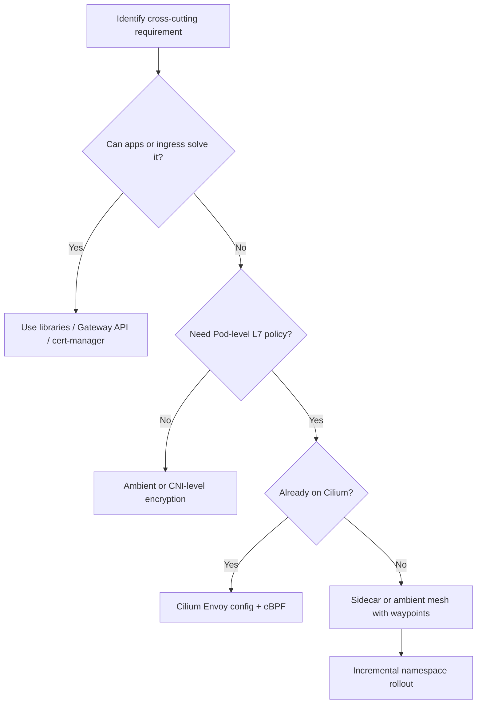

> **Discipline Module** | Complexity: `[COMPLEX]` | Time: 60-75 min

## Prerequisites

Before starting this module:
- **Required**: [Module 1.1: CNI Architecture](../module-1.1-cni-architecture/) — Understanding Pod networking fundamentals
- **Required**: [Module 1.2: Network Policy Design](../module-1.2-network-policy-design/) — L3/L4 segmentation knowledge
- **Recommended**: [Reliability Engineering foundations](/platform/foundations/reliability-engineering/) — Circuit breaking, retries, load balancing concepts
- **Helpful**: Experience deploying and debugging microservices

---

## What You'll Be Able to Do

After completing this module, you will be able to:

- **Evaluate service mesh solutions — Istio, Linkerd, Cilium mesh — against your observability and security needs**
- **Design service mesh architectures that add mTLS, traffic management, and observability without application changes**
- **Implement gradual service mesh adoption strategies that onboard services incrementally with rollback capability**
- **Analyze service mesh overhead — latency, resource consumption, operational complexity — to make informed trade-offs**

## Why This Module Matters

**Hypothetical scenario:** A mid-size e-commerce team with roughly twelve production services adopts a full sidecar mesh after reading conference talks about microservice resilience. Over the next two quarters they spend a large fraction of platform engineering capacity on control-plane upgrades, proxy CVE response, and debugging mysterious 503 responses that never appeared before the mesh existed. Latency at the tail grows because every request crosses an extra hop. Memory on worker nodes climbs because each Pod now runs an additional proxy container alongside the application. The team wanted transparent mTLS and uniform retries; those goals were achievable, but they never wrote down the operational cost they were willing to pay for them.

That story is illustrative, not a report from a specific company, yet the pattern repeats often enough to treat as a warning. Service meshes solve real problems — transparent mutual TLS, fine-grained traffic management, language-agnostic resilience policies, and automatic L7 telemetry — but they also introduce a permanent platform tax. You inherit another distributed system whose failure modes sit on the request path. This module teaches the durable spine: what a mesh actually is, how data-plane topologies differ, which capabilities belong in infrastructure versus application code, and how to decide whether you need a mesh at all before you commit your organization to operating one.

Network policies from Module 1.2 segment traffic at L3/L4. Ingress and Gateway API resources from Module 1.4 route north-south traffic at the cluster edge. A service mesh focuses on east-west traffic between services inside the cluster, adding identity, policy, and observability at the connection and HTTP/gRPC layer without rewriting every application. The strategic question is not "which mesh is winning the market" but "does our architecture benefit enough from uniform cross-cutting infrastructure to justify the complexity we are about to buy."

Teams sometimes conflate service mesh with API gateway because both sit on the request path, yet the durable boundary is direction and audience. Gateways aggregate north-south clients, enforce WAF rules, and expose public DNS names. Meshes govern east-west trust between services that never leave the cluster network. You may need both, neither, or one without the other depending on whether your pain is external client routing or internal service uniformity. Clarity on that boundary prevents double-paying for retries and TLS at two layers without coordination.

Document the decision in writing before procurement: required capabilities, excluded namespaces, target data-plane topology, and the operational roles accountable for control-plane upgrades. That record becomes the reference when new vendors pitch mesh platforms during the next budget cycle and helps you reject scope creep before it becomes a mandated production rollout.

---

## The Problem a Service Mesh Actually Solves

Microservice architectures scatter cross-cutting concerns across every codebase. When one team writes Go services with a mature HTTP client library, another team maintains legacy Java services with different timeout defaults, and a third team ships Python workers with no distributed tracing at all, production behavior becomes inconsistent in ways that show up only during incidents. Security teams want mutual TLS between every service identity, but asking each application team to implement certificate rotation independently does not scale past a handful of services. Platform teams want canary releases based on headers or user segments, yet implementing that logic inside every language stack duplicates effort and guarantees drift.

A service mesh moves those concerns into a uniform infrastructure layer that sits on the data path between services. Instead of each application opening a TCP connection directly to a Kubernetes Service IP, traffic flows through a proxy — or through kernel programs that behave like one — that can encrypt, authorize, retry, measure, and route before the packet or HTTP request reaches the destination container. The application binary stays unchanged; the mesh intercepts traffic transparently using network redirection, eBPF hooks, or injected sidecar containers depending on the topology you choose.

The durable motivation is separation of concerns at scale. Application developers focus on business logic. Platform engineers publish policies — retry budgets, timeout ceilings, traffic splits, authorization rules — that apply uniformly regardless of language or framework. Security engineers gain cryptographic identity for every workload through SPIFFE-compatible certificates rather than shared secrets baked into configuration files. SRE teams receive golden-signal metrics and distributed traces for service-to-service calls even when application instrumentation is incomplete, because the proxy observes wire-level behavior directly.

That value proposition has limits, and honest architecture starts by naming them. A mesh adds latency hops, consumes CPU and memory, expands your upgrade surface, and creates a new class of incidents where misconfiguration in a central control plane affects every service at once. Meshes shine when you have many services, heterogeneous runtimes, strict zero-trust requirements, and platform staff who can operate the control plane. They hurt when you have a small number of homogenous services, strong application libraries already in place, or a team that lacks bandwidth to debug proxy-level behavior under pressure. Treat the mesh as one option on a spectrum — application libraries, API gateways, CNI-level encryption, and ingress controllers each cover part of the same problem space with different tradeoffs.

Before you evaluate products, write down the behaviors you need uniformly enforced and mark which ones already exist in your stack. If cert-manager already rotates certificates that applications mount as files, you have partial mTLS without a mesh. If your API gateway terminates TLS and rate-limits public endpoints, you have north-south policy without east-west coverage. If OpenTelemetry SDKs are standardized across teams, automatic proxy spans add correlation rather than filling a complete observability void. The gap analysis keeps adoption honest: you are buying a mesh to close specific gaps, not to replicate capabilities you already operate reliably.

---

## Data Plane and Control Plane: The Durable Split

Every service mesh architecture separates into two planes that evolve on different lifecycles. The **data plane** consists of the components that handle live traffic: proxies on the request path, eBPF programs that redirect packets, or per-node agents that terminate TLS and enforce policy. The **control plane** is the configuration brain: it watches Kubernetes Services and custom resources, issues workload identities, and pushes routing and security policy to every data-plane instance. Understanding this split matters operationally because data-plane failures affect latency and availability immediately, while control-plane failures affect how quickly you can change policy and how certificates rotate during steady state.

In the classic **sidecar model**, each Pod receives an additional container — historically Envoy in Istio, linkerd2-proxy in Linkerd — injected by a mutating admission webhook. iptables rules or eBPF redirects inside the Pod network namespace force all inbound and outbound traffic through the sidecar before it reaches the application container. Two Pods communicating therefore traverse two proxies, one on each side, which gives fine-grained per-workload policy at the cost of one extra container per Pod. The control plane — istiod in Istio, the Linkerd destination and identity components — streams configuration to each sidecar using Envoy's xDS protocol or equivalent APIs, so every Endpoint change in Kubernetes potentially fans out to thousands of proxy instances.

The control plane also owns identity. Workloads receive short-lived certificates tied to Kubernetes ServiceAccounts or SPIFFE IDs. When Pod A calls Pod B, proxies present client certificates that Pod B's proxy validates before forwarding to the application. This model decouples cryptographic identity from application configuration: developers do not mount TLS secrets or configure cipher suites in code. Operators rotate trust anchors centrally. The tradeoff is that certificate issuance, revocation, and trust bundle distribution become platform-critical paths; a broken control plane does not always stop existing connections immediately, but it can block new Pods from receiving valid identities during rollout events.

Configuration propagation is the hidden scaling dimension. Every Service, EndpointSlice, and policy custom resource change may trigger updates to many proxies simultaneously. Large clusters with high churn — frequent deploys, autoscaling events, spot instance replacement — generate continuous xDS traffic. Platform teams must plan for push throttling, incremental updates, and observability into control-plane health. The data plane and control plane must stay within supported version skew windows; upgrading one without the other is a common source of mysterious 503 errors where proxies reject routes they no longer understand.

When you **design service mesh architectures**, document which team owns each plane. Application teams usually own Deployment manifests and ServiceAccounts; platform teams own control-plane availability, trust roots, and default policies; security teams often own authorization policy review. Clear ownership prevents policy drift where one team injects sidecars while another team publishes NetworkPolicies that contradict mesh authorization rules. Runbooks should name on-call rotations for control-plane failures separately from application incidents, because remediation steps differ even when symptoms look similar from the caller's perspective.

---

## Sidecar, Ambient, and Per-Node Data Plane Topologies

The sidecar model dominated service mesh design for years because colocating a proxy with each Pod gives the finest-grained identity and policy boundaries. Every workload gets its own TLS context, its own retry policy, and its own telemetry labels without sharing state with neighbors on the node. That isolation simplifies reasoning about blast radius when one application's proxy misbehaves, and it maps cleanly onto Kubernetes' Pod-centric security model where ServiceAccounts already identify workloads. The cost is resource multiplication: a cluster running thousands of Pods runs thousands of proxies, each reserving memory for connection pools, configuration caches, and WASM plugins even when idle.

**Ambient mesh** — Istio's sidecarless mode is the reference implementation teams discuss most often — reframes the problem by splitting L4 and L7 processing across different components. A lightweight per-node agent called **ztunnel** handles mutual TLS, basic authorization, and telemetry for all Pods on that node without injecting containers into application Pods. When a namespace needs HTTP-level features such as retries, header-based routing, or L7 authorization, operators deploy optional **waypoint** proxies scoped to a service or namespace rather than to every Pod. East-west traffic that only needs encryption therefore avoids the per-Pod proxy tax, while teams that need L7 policy pay for waypoint capacity only where required. This topology reflects a broader industry shift: not every call path needs a full Envoy instance, but many environments still need cryptographic identity everywhere.

**Per-node L7 proxy** models appear when the CNI already owns the datapath. Cilium implements mesh features using eBPF for connectivity, policy, and encryption while delegating HTTP-level routing to a shared Envoy instance per node when `envoyConfig` is enabled. Because Cilium already attaches programs at the kernel level for network policy and load balancing, adding mesh capabilities reuses that investment instead of injecting sidecars. The tradeoff is coupling mesh adoption to CNI choice: you gain operational simplicity when Cilium is already your networking layer, but you do not get a portable mesh story independent of the CNI if you standardize elsewhere.

Choosing among these topologies is an engineering decision about where you want to spend memory and latency. Sidecars maximize isolation and feature surface at the highest resource cost. Ambient and per-node models reduce per-Pod overhead by sharing infrastructure, but shared components introduce noisy-neighbor effects and require careful capacity planning on each node. None of these choices eliminates the need for a control plane or for upgrade discipline; they change the shape of the bill you pay on every worker node during normal operation and during traffic spikes.

Latency-sensitive workloads — payment authorization, real-time bidding, synchronous inference chains — should measure end-to-end impact with production-like payloads, not only synthetic health checks. A one-millisecond proxy tax per hop becomes two milliseconds round-trip in sidecar mode and may still matter at high percentile targets. Batch and asynchronous workloads often tolerate higher latency in exchange for uniform encryption. Document these classifications per namespace so adoption decisions reflect service criticality instead of applying one topology cluster-wide by default.

Istio ambient mode documents ztunnel as the node-level L4 component and waypoint proxies as optional L7 enforcement points; Cilium documents eBPF encryption and per-node Envoy for HTTP features. Linkerd remains sidecar-centric by design, trading maximum configurability for a smaller proxy and control-plane surface. None of these choices removes the need to understand iptables redirection, eBPF program attachment, or Envoy listener configuration at a conceptual level — on-call engineers still debug hops even when they do not author YAML daily.

```
Sidecar (per Pod)          Ambient (per node + optional waypoint)
┌─────────────────┐        ┌──────────────────────────────────┐
│ App + Proxy     │        │ App (no sidecar)                 │
│ App + Proxy     │   vs   │ App (no sidecar)                 │
│ App + Proxy     │        │ ztunnel (node) → waypoint (opt)  │
└─────────────────┘        └──────────────────────────────────┘
Finest isolation           Lower baseline overhead
N proxies for N Pods       Shared L4; L7 where declared
```

---

## Durable Mesh Capabilities: Identity, Traffic, Resilience, and Observability

Regardless of vendor, production meshes converge on a similar capability set. Treat these as the durable checklist you map to organizational requirements rather than as a shopping list to implement all at once.

**Mutual TLS and workload identity** bind cryptographic trust to workload identity instead of network location. SPIFFE defines a portable identity format — a SPIFFE ID like `spiffe://trust-domain/ns/production/sa/checkout` — and SPIRE or mesh-native issuers deliver short-lived X.509 certificates to workloads. Proxies terminate TLS, validate peer certificates, and optionally enforce authorization based on identity claims. This implements zero-trust east-west communication: even if an attacker reaches the pod network, they cannot impersonate a legitimate service without a valid identity. Network policies still matter for defense in depth, but mTLS adds authentication at the connection layer that IP rules alone cannot provide.

**Traffic management** covers routing, load balancing, splitting, mirroring, and fault injection. Meshes can send a small percentage of requests to a canary Deployment, mirror production traffic to a shadow environment for testing, or route specific headers to experimental backends. These features overlap partially with [Module 1.4: Ingress, Gateway API & Traffic Management](../module-1.4-ingress-gateway/) for north-south entry, but east-west splitting between internal services is where meshes historically differentiated. Modern convergence on Gateway API blurs that boundary; GAMMA extends Gateway API resources so HTTPRoute objects can attach to Service backends inside the mesh, giving teams one configuration vocabulary for ingress and in-mesh routing.

**Resilience policies** — retries, timeouts, circuit breaking, outlier detection — protect callers from flaky dependencies. A mesh-enforced retry budget applies uniformly even when application code forgets to configure backoff. Circuit breaking ejects unhealthy endpoints from load balancing pools before cascading failures consume thread pools upstream. The critical design constraint is idempotency: blind retries on POST requests can duplicate side effects, so policy authors must align mesh retry rules with application semantics or restrict retries to safe methods. Timeouts at the proxy layer protect tail latency when upstream services hang, but they must coordinate with application-level deadlines to avoid duplicate work when both layers fire independently.

**Observability** generates golden signals — request rate, errors, duration, and saturation proxies — plus distributed trace context propagation. Even services without OpenTelemetry SDKs often receive span identifiers because proxies inject and forward tracing headers on the wire. Mesh telemetry complements application instrumentation rather than replacing it: proxies see network-level failures and latency that code never records, while applications retain context about business operations and database queries inside the handler. Platform teams should plan how mesh metrics flow into Prometheus-compatible backends and how traces correlate with logs through shared trace IDs, aligning with OpenTelemetry conventions where possible.

Authorization at L7 closes gaps NetworkPolicy cannot express. A policy that allows Pod A to reach Pod B on port 8080 cannot distinguish GET /public from POST /admin; mesh AuthorizationPolicy or equivalent resources can. That precision requires accurate service graph knowledge: if an unexpected client appears, you update policy deliberately rather than widening CIDR rules. Combine L4 default-deny NetworkPolicy with explicit mesh authorization allow lists so compromise in one layer still faces constraints in the other, implementing defense in depth rather than choosing one mechanism alone.

Fault injection — delaying responses, returning synthetic errors, or splitting traffic to unavailable backends — supports resilience testing when your mesh exposes it. Use controlled fault injection in staging to validate that retries and timeouts behave as intended before production incidents prove otherwise. Production fault injection belongs behind change management and blast-radius controls; it is a sharp tool for game days, not a casual dashboard toggle.

---

## Gateway API, GAMMA, and Configuration Convergence

Kubernetes' original Ingress resource froze at GA without evolving further; Gateway API is the successor, designed with role-oriented separation between platform operators who manage Gateways and application teams who attach HTTPRoutes. For service meshes, the **GAMMA** initiative (Gateway API for Mesh Management and Administration) extends that model east-west: HTTPRoute, GRPCRoute, and related types can attach to Service objects as parent references, expressing in-mesh routing with the same API shape used at the cluster edge. That convergence matters strategically because it reduces bespoke CRD dialects per mesh and lets organizations standardize GitOps patterns across ingress and mesh teams.

Istio has integrated Gateway API for ingress and ambient L7 policy; Linkerd documents Gateway API support for traffic policy; Cilium connects Gateway API resources to its Envoy configuration pipeline. The durable lesson is not "pick Gateway API instead of VirtualService forever" but "expect mesh configuration surfaces to consolidate on Kubernetes SIG-owned APIs over time." When evaluating a mesh, ask how completely it supports Gateway API and GAMMA, how it translates those resources into data-plane behavior, and whether your GitOps pipelines can share validation tooling between edge routes and internal routes.

Cross-linking modules clarifies responsibility boundaries. Use Gateway API at the edge for TLS termination, WAF integration, and public routing. Use mesh-level HTTPRoutes or equivalent policies for internal canaries between `checkout` and `payments` services that never traverse a public load balancer. When both layers exist, define a naming and ownership model so platform teams operate Gateways while product teams own HTTPRoutes in their namespaces — the same persona split Gateway API was designed to encode.

Migration planning should assume dual configuration during transition. Teams running Istio VirtualService today may introduce HTTPRoute resources namespace by namespace while controllers translate both forms. GitOps repositories benefit from linting and schema validation shared across ingress and mesh routes so pull requests catch invalid backend references before they reach the cluster. The durable skill is reading Gateway API attachment semantics — parentRefs, backendRefs, and policy attachment — regardless of which vendor control plane executes them.

---

## Evaluating Mesh Options Against Your Requirements

Mesh selection is a capabilities-and-constraints exercise, not a popularity contest. Start from requirements: Do you need Pod-level identity or is node-level encryption sufficient? Must you support multi-cluster east-west routing today or only in a later phase? Does your team already operate Cilium as the CNI? Can you staff on-call rotation for a control plane that must stay highly available? Answer those questions before comparing feature matrices.

> **Landscape snapshot — as of 2026-06. This changes fast; verify against vendor docs before relying on specifics.** The table below summarizes peer projects at a high level; confirm current release features and CNCF status on official project pages before committing to a multi-year strategy.

| Project | CNCF / vendor status | Primary data-plane model | Notes |
|---------|---------------------|--------------------------|-------|
| Istio | [CNCF Graduated](https://www.cncf.io/projects/istio/) | Sidecar (default) or ambient (ztunnel + waypoint) | Broadest L7 feature surface; ambient mode reduces sidecar overhead |
| Linkerd | [CNCF Graduated](https://www.cncf.io/projects/linkerd/) | Sidecar (linkerd2-proxy) | Narrower feature set, lower proxy footprint; no ambient mode |
| Cilium Service Mesh | Cilium [CNCF Graduated](https://www.cncf.io/projects/cilium/) | eBPF datapath + optional per-node Envoy | Strong fit when Cilium is already the CNI |
| Consul service mesh | HashiCorp / IBM (not CNCF) | Sidecar (Envoy) | Multi-platform; integrates with Consul service discovery outside Kubernetes |

**Service mesh capability Rosetta** — rows describe durable capabilities; columns describe peer implementations. Cells summarize approach, not ranking.

| Capability | Istio | Linkerd | Cilium Service Mesh | Consul |
|------------|-------|---------|---------------------|--------|
| Data-plane model | Sidecar or ambient ztunnel/waypoint | Per-Pod Rust proxy | eBPF + per-node Envoy for L7 | Envoy sidecar |
| mTLS / identity | Istio CA / SPIFFE-compatible | Automatic mTLS by default | WireGuard/IPsec or SPIFFE via Cilium | Consul Connect CA |
| Traffic management | VirtualService, HTTPRoute (Gateway API) | ServiceProfile, HTTPRoute policies | CiliumEnvoyConfig, Gateway API | Intentions, service resolver |
| Gateway API / GAMMA | Supported (ingress + mesh) | Supported (policy resources) | Supported via Cilium Gateway API | Limited; Consul-specific APIs |
| Multi-cluster | Multi-primary / primary-remote patterns | Multi-cluster link | ClusterMesh | WAN federation |
| Observability | Mesh telemetry, Kiali integration | Built-in viz, tap | Hubble metrics and flows | Consul UI, Envoy stats |

The Rosetta table is a decision aid, not a scorecard. Two organizations with identical service counts may choose different columns because one already operates Cilium cluster-wide and another requires advanced L7 fault injection in staging. Revisit the snapshot quarterly or when a vendor ships a major dataplane change such as new ambient or Gateway API coverage, updating cells instead of rewriting the teaching sections above.

When **evaluating service mesh solutions against observability and security needs**, map each row to a concrete requirement from your organization. If you only need automatic mTLS and success-rate dashboards for internal HTTP, Linkerd or ambient Istio may cover the requirement with less configuration surface than full sidecar Istio. If you need L7 authorization by HTTP path across gRPC and HTTP with multi-cluster failover, Istio or Cilium with Envoy config may fit better — at the cost of more moving parts. Document the decision in an ADR that names rejected alternatives and the operational cost you accepted.

Consul service mesh matters when Kubernetes is only part of your estate. Connect attaches sidecars to services registered in Consul, including VMs and hybrid endpoints, which Kubernetes-native meshes handle through multi-cluster and external-service patterns with more friction. If your organization already standardizes on Consul for service discovery outside the cluster, evaluating Connect alongside Istio is rational even though Consul is not a CNCF project. If your workloads live entirely on Kubernetes, Consul adds another control plane unless existing HashiCorp investment already justifies it.

Proof-of-concept clusters should mirror production constraints: similar Pod density, comparable churn rate, and representative payload sizes. A POC on a quiet ten-node kind cluster tells you little about xDS push behavior during rolling updates across hundreds of nodes. Include failure injection in the POC — kill istiod pods, revoke a trust bundle, saturate a waypoint — and measure how long recovery takes with runbook steps you actually intend to follow during real incidents.

---

## Designing Mesh Architecture Without Application Changes

**Designing service mesh architectures** that add security and traffic features without application changes requires deliberate boundaries around injection, identity, and policy scope. Namespace labels commonly opt workloads into the mesh: Istio uses `istio.io/dataplane-mode=ambient` or revision labels for sidecar injection; Linkerd uses `linkerd.io/inject=enabled`; Cilium enables features at the cluster or namespace level through CiliumNetworkPolicy and Envoy config CRDs. Platform teams should maintain an explicit allowlist of namespaces eligible for injection and exclude batch Jobs, DaemonSets with host networking, and legacy workloads that cannot tolerate connection redirection.

Identity architecture should align with Kubernetes ServiceAccounts — one ServiceAccount per logical service role, not the default account shared by every Deployment in a namespace. Mesh certificates encode ServiceAccount identity into SPIFFE IDs, which AuthorizationPolicy and equivalent resources reference as principals. Multi-tenant clusters benefit from trust domain design early: will all namespaces share one trust anchor, or will production and staging use separable roots? Rotating trust bundles without downtime requires staged rollout procedures documented before you need them.

Policy layering prevents contradictions between network policy and mesh policy. Network policies from Module 1.2 enforce IP and port reachability; mesh authorization enforces HTTP methods, paths, and identities. A request can pass network policy yet fail mesh authorization, which is desirable when you want default-deny L7 rules on top of segmented L3 networks. Document which layer owns which concern so incident responders know whether to inspect CiliumNetworkPolicy, AuthorizationPolicy, or both when traffic drops unexpectedly.

For L7 features in ambient Istio, waypoint proxies become part of your capacity model. Deploy waypoints only for namespaces that need HTTP routing or L7 authz; leave pure TCP or simple HTTP services on ztunnel-only mode. This mirrors the general design principle: pay for proxy depth only where application protocol semantics matter, not uniformly across every microservice.

Egress traffic deserves explicit design. Meshes can route outbound traffic through egress gateways for compliance logging or fixed egress IP allowlisting, but default open egress through sidecars may surprise teams who assumed NetworkPolicy alone defined the perimeter. Document whether external SaaS calls traverse proxies and whether those proxies require additional certificates or DNS configuration. Misconfigured egress causes confusing partial outages where some third-party APIs work and others time out because only certain ports were declared.

Init container ordering and startup probes interact with injection. Sidecar containers must be ready before application containers receive traffic, which changes rollout timing compared to non-meshed Deployments. Readiness probes that hit localhost application ports still work, but mesh health checks may also require proxy readiness endpoints. When debugging CrashLoopBackOff after enabling injection, inspect init container logs for iptables setup failures before assuming application regression.

---

## Incremental Adoption and Rollout Strategy

**Implementing gradual service mesh adoption strategies** reduces the risk of platform-wide failure during learning phases. A proven pattern namespaces incremental rollout: begin with a non-production cluster or a single low-risk namespace, validate mTLS handshake metrics and latency baselines, then expand to staging, then to production tiers one namespace at a time. Maintain rollback by keeping injection labels removable and documenting a break-glass procedure that disables the mesh quickly — remove namespace labels, restart Deployments so Pods come up without proxies, and verify traffic flows directly service-to-service again.

Phase zero is observability-only mode where proxies collect metrics and traces without enforcing strict mTLS or authorization. Many teams run permissive TLS mode initially so legacy clients without sidecars continue working while you inventory dependencies. Only after dependency graphs are complete do you tighten to strict mTLS. Skipping this inventory causes outages when a batch job or admin tool without a proxy attempts plain-text HTTP to a service that now requires encrypted identity.

Change management for control-plane upgrades deserves the same rigor as application releases. Istio supports revision-based canary upgrades where multiple control-plane versions coexist while namespaces migrate by label. Linkerd upgrades the control plane in place while data-plane proxies remain compatible within documented skew. Cilium upgrades ride Helm releases with rolling node restarts. In every case, test upgrades in a representative staging cluster, watch proxy error rates and xDS push latency during migration, and keep a runbook entry for version skew failures that manifest as 503 responses with healthy application Pods.

Multi-cluster mesh — previewed here, detailed in [Module 1.5: Multi-Cluster Networking](../module-1.5-multi-cluster-networking/) — should not be day-one scope unless business requirements demand cross-cluster service discovery now. Single-cluster operational maturity precedes federated trust bundles, east-west gateways, and global traffic policies. Teams that skip straight to multi-cluster meshes often operate neither single-cluster nor multi-cluster meshes reliably.

**Implement gradual service mesh adoption strategies** by pairing technical rollout with education. Developers need to know that timeouts now occur at two layers, that trace headers may appear without SDK changes, and that local integration tests against plain Services may differ from cluster behavior after injection. Office hours during namespace onboarding surface unexpected callers — legacy cron scripts, monitoring probes, emergency admin tools — before strict policy blocks them. Adoption is as much social coordination as it is labeling namespaces.

Maintain a mesh exception registry listing workloads excluded from injection with owner, reason, and review date. Exceptions without expiry become permanent holes in mTLS coverage. Quarterly review reconciles the registry against actual namespace labels so security posture does not silently erode as teams copy-paste Deployment templates from older repositories without current mesh awareness.

---

## Analyzing Overhead, Complexity, and Operational Cost

**Analyzing service mesh overhead** means measuring latency, resource consumption, and human operational load together — optimizing only proxy milliseconds while ignoring on-call toil produces lopsided decisions. Baseline sidecar meshes add one or two proxy hops per request; ambient and eBPF models reduce hop count for L4-only traffic but still add encryption work on the node. Measure P50 and P99 latency before and after mesh enablement on representative workloads, not just synthetic health checks. CPU and memory increases appear in `kubectl top pods` as additional containers or in node-level daemonsets for ztunnel and Cilium agents.

Proxy CVE response becomes part of your vulnerability management program. Envoy-based meshes inherit Envoy's disclosure cadence; Linkerd's Rust proxy has a different supply chain. Platform teams should track mesh release notes with the same urgency as Kubernetes patch versions and maintain automated pipelines that roll data-plane updates without application image changes. Resource limits on proxies prevent unbounded memory growth during connection storms; omitting limits turns traffic spikes into node-level OOM events that evict unrelated workloads.

Debugging changes when every request traverses intermediaries. Application logs may show success while proxies return 503 because route configuration is stale or certificates expired. Train responders to use mesh-specific tooling — `istioctl proxy-status`, Linkerd `tap`, Hubble flows — alongside application traces. The operational complexity tax is often larger than the raw millisecond latency tax because it affects every incident until the team builds mesh fluency.

**Hypothetical scenario:** During a seasonal traffic spike, sidecar proxies on a few hot nodes grow connection pools until memory pressure triggers kubelet evictions. Each eviction changes endpoints, causing control-plane pushes to thousands of remaining proxies, which briefly increases CPU usage cluster-wide. Application dashboards look healthy while tail latency explodes because the mesh amplifies churn. Mitigations include proxy memory limits, push throttling configuration, ambient mode for dense namespaces, and rehearsed break-glass disable procedures — not because the mesh is inherently unsafe, but because shared infrastructure converts local overload into global control-plane work unless you design guardrails upfront.

Cost accounting should include control-plane nodes, observability storage for mesh metrics, and engineer time for upgrades. FinOps teams tracking only application CPU miss the steady-state tax of sidecar memory reservations that reduce schedulable Pod capacity on every worker. When you **analyze service mesh overhead**, present leadership with both latency histograms and effective capacity loss so decisions compare total cost of ownership, not only feature checklists.

Compliance narratives often cite mesh mTLS as encryption-in-transit evidence. Auditors may still ask how keys are protected, who can alter AuthorizationPolicy, and how non-mesh callers are prevented. Prepare answers that reference SPIFFE identity issuance, RBAC on mesh CRDs, and NetworkPolicy default-deny baselines. A mesh satisfies part of a control framework; it does not replace governance, access review, or logging retention policies.

---

## Patterns and Anti-Patterns

### Patterns

1. **Start from requirements, not from mesh adoption as a goal.** Document the specific gaps — mTLS coverage, canary routing, uniform retries — and verify simpler tools cannot close them. Revisit the decision when service count or language heterogeneity crosses thresholds you define in advance.

2. **Namespace-scoped incremental rollout with explicit rollback.** Enable the mesh one namespace at a time, measure golden signals against pre-mesh baselines, and keep label-removal rollback tested quarterly. Treat break-glass disable as a practiced drill, not an improvised incident hack.

3. **Align identity with ServiceAccounts and SPIFFE IDs.** One ServiceAccount per service role simplifies authorization policies and audit trails. Coordinate trust bundle rotation with deployment windows so certificate changes never surprise application teams.

4. **Use Gateway API where supported for routing policy.** Prefer HTTPRoute and GAMMA attachment patterns for new configuration so ingress and mesh teams share tooling. Wrap legacy mesh CRDs only where Gateway API coverage is still incomplete for your use case.

5. **Right-size data-plane topology to protocol needs.** Run ambient ztunnel or Cilium eBPF encryption for services that only need mTLS; add waypoint or per-node Envoy only where L7 routing, retries, or path authorization apply.

### Anti-Patterns

1. **Mesh-first for fewer than twenty services with one language.** Operational cost dominates benefits when homogenous client libraries already enforce TLS and retries consistently.

2. **Strict mTLS before dependency inventory completes.** Jobs, admin tools, and third-party integrations without proxies become instant outages when strict mode lands.

3. **Unbounded retries on mutating HTTP methods.** Duplicate orders and double charges follow when POST retries are enabled without idempotency keys at the application layer.

4. **Sidecar injection on CronJobs and short-lived Jobs without exit handling.** Proxies that never terminate keep Job Pods running forever unless injection is disabled or ambient mode avoids the sidecar lifecycle problem.

5. **Control-plane upgrade without data-plane skew planning.** Running new istiod against old sidecars beyond supported skew windows produces cluster-wide 503 storms with healthy application containers.

6. **Treating mesh metrics as sufficient application observability.** Proxy metrics expose wire behavior but miss business logic failures inside handlers; combine mesh telemetry with OpenTelemetry instrumentation for complete stories.

### Decision Framework

| If your situation looks like… | Consider… | Defer mesh if… |
|------------------------------|-----------|----------------|
| Few homogenous services, strong client libraries | cert-manager + app TLS, library retries | Operational bandwidth is limited |
| Many languages, need uniform mTLS and L7 policy | Sidecar or ambient mesh with Gateway API | You have not staffed mesh on-call |
| Cilium already CNI, want encryption without sidecars | Cilium mesh / WireGuard + selective Envoy | You need vendor-neutral portability off Cilium |
| Edge routing + internal canaries both required | Gateway API at edge + mesh HTTPRoutes internally | A single ingress controller covers routing needs |
| Multi-cluster service identity required | Federated mesh after single-cluster maturity | Single-cluster mesh is not yet stable |



---

## Illustrative Worked Example: Istio Ambient Mode

The commands below use Istio as an **illustrative** worked example — not an endorsement. Equivalent flows exist in Linkerd and Cilium; see the Rosetta table above. Ambient mode separates L4 and L7 as described earlier; these steps show how namespace labels activate ztunnel and optional waypoints.

```bash
# Install Istio with ambient profile (verify version against istio.io release notes)
istioctl install --set profile=ambient --skip-confirmation

kubectl get pods -n istio-system
# Expect istiod, istio-cni-node, and ztunnel DaemonSets

# Enable ambient dataplane for a namespace (L4 mTLS via ztunnel)
kubectl label namespace production istio.io/dataplane-mode=ambient

istioctl ztunnel-config workloads

# Add L7 waypoint only when HTTP routing or L7 authz is required
istioctl waypoint apply --namespace production --name production-waypoint
kubectl label namespace production istio.io/use-waypoint=production-waypoint
```

HTTP traffic splitting with Gateway API attaches to Service backends inside the mesh, which is the GAMMA pattern for expressing weighted backends without Istio-specific VirtualService types when your control plane supports the attachment semantics.

```yaml
apiVersion: gateway.networking.k8s.io/v1
kind: HTTPRoute
metadata:
  name: reviews-split
  namespace: production
spec:
  parentRefs:
    - group: ""
      kind: Service
      name: reviews
      port: 9080
  rules:
    - backendRefs:
        - name: reviews-v1
          port: 9080
          weight: 80
        - name: reviews-v2
          port: 9080
          weight: 20
```

Linkerd and Cilium equivalents use ServiceProfile and CiliumEnvoyConfig resources respectively; the durable concept — declarative weighted backends with mesh-enforced routing — is the same even when API objects differ.

Operating a mesh in production also means integrating with the broader incident response toolchain. Proxy access logs, Hubble flows, Kiali service graphs, and Grafana dashboards built from mesh metrics should link from the same runbook entry that application on-call uses when latency spikes. During the first months after adoption, expect incidents where the mesh is innocent — application regressions still happen — and incidents where policy misconfiguration is the root cause. Blameless postmortems should tag mesh-related factors explicitly so the organization learns whether gaps were training, tooling, or policy design rather than treating every proxy timeout as application failure.

---

## Did You Know?

- **SPIFFE is the portable identity layer beneath many meshes:** The [SPIFFE specification](https://spiffe.io/docs/latest/spiffe-about/overview/) defines workload identities independent of Kubernetes, allowing consistent mTLS semantics whether proxies run as sidecars, node agents, or VM agents outside the cluster.

- **Gateway API GAMMA attaches routes directly to Services:** The [GAMMA concept document](https://gateway-api.sigs.k8s.io/concepts/gamma/) explains how HTTPRoute parent references target in-mesh Services, converging east-west routing configuration with the same API family used for ingress.

- **Linkerd enables mTLS by default without manual certificate wiring:** [Automatic mTLS](https://linkerd.io/2/features/automatic-mtls/) issues short-lived certificates per Pod identity through the control plane, which is why Linkerd clusters often encrypt east-west traffic with zero application changes after injection.

- **Cilium can implement mesh features without per-Pod sidecars:** [Cilium Service Mesh](https://docs.cilium.io/en/stable/network/servicemesh/) combines eBPF datapath policy with optional per-node Envoy for L7, reflecting the broader shift toward shared dataplane components.

---

## Common Mistakes

| Mistake | Problem | Solution |
|---------|---------|----------|
| Adopting a mesh with fewer than ten services | Operational overhead dominates value at small scale | Use cert-manager plus application TLS and library retries until service count grows |
| Injecting sidecars into Jobs and CronJobs | Sidecar containers do not exit, blocking Job completion | Disable injection on batch workloads or use ambient mode without per-Pod sidecars |
| Omitting resource limits on proxies | Memory growth during traffic spikes triggers node OOM evictions | Set proxy CPU and memory limits; monitor proxy RSS alongside application metrics |
| Skipping control-plane and data-plane skew rules | Unsupported version gaps cause proxies to reject routes cluster-wide | Follow revision-based upgrades; restart workloads to pick up matching proxy versions |
| Enabling strict mTLS before full mesh coverage | Plain-text clients fail instantly against encrypted listeners | Run permissive mode during migration; inventory all callers including tools and jobs |
| Configuring retries on non-idempotent HTTP methods | Timeouts that retry POST requests create duplicate side effects | Restrict retries to idempotent methods or require application idempotency keys |
| Ignoring Gateway API convergence | Duplicate CRD dialects increase GitOps and training cost | Prefer HTTPRoute and GAMMA where supported; isolate legacy CRDs to gaps only |
| Operating multi-cluster mesh before single-cluster stability | Federated trust and routing failures compound debugging difficulty | Prove namespace-by-namespace rollout in one cluster before expanding topology |

---

## Quiz

1. **What problem does a service mesh solve that Kubernetes Services and NetworkPolicies alone do not?**

<details>
<summary>Answer</summary>

Kubernetes Services provide load-balanced IP endpoints and NetworkPolicies restrict L3/L4 reachability, but neither uniformly encrypts east-west traffic with workload identity, nor applies HTTP-level retries, timeouts, and routing rules across heterogeneous languages without application changes. A service mesh inserts infrastructure on the data path — proxies or eBPF programs — that enforces mTLS, L7 authorization, traffic splitting, and telemetry for every inter-service call. When you **evaluate service mesh solutions against observability and security needs**, you are measuring how much value that uniform layer adds compared to application libraries and cert-manager for your scale.
</details>

2. **Explain the difference between sidecar, ambient, and per-node mesh data-plane models.**

<details>
<summary>Answer</summary>

The **sidecar model** injects a proxy container into each Pod, giving maximum isolation and Pod-level identity at the cost of N proxies for N Pods. **Ambient mesh** uses per-node agents such as Istio ztunnel for L4 mTLS and optional waypoint proxies for L7 features only where needed, reducing baseline overhead. **Per-node models** like Cilium combine eBPF in the kernel for connectivity and encryption with a shared Envoy on the node for HTTP routing. When you **design service mesh architectures**, choose topology based on how much L7 policy you need and how much per-Pod memory you can afford.
</details>

3. **Scenario: Your organization has eight Go microservices and wants mTLS between them. Should you adopt a full service mesh?**

<details>
<summary>Answer</summary>

Probably not yet. Eight services in one language can often implement mTLS with cert-manager-issued certificates and Go `crypto/tls` configuration in a few focused engineering days, avoiding ongoing control-plane operations. A mesh becomes easier to justify above roughly twenty to thirty services, multiple languages, or strict requirements for uniform L7 policy without code changes. **Implement gradual service mesh adoption strategies** only after simpler approaches fail to meet policy or observability requirements at your current scale.
</details>

4. **What is the xDS protocol and why does it matter during high Kubernetes churn?**

<details>
<summary>Answer</summary>

xDS is Envoy's discovery protocol family — Cluster, Endpoint, Listener, Route, and Secret discovery services — that streams configuration from the control plane to proxies. Every Service or EndpointSlice change can trigger pushes to many proxies simultaneously. During large rollouts or node failures, push storms increase control-plane and data-plane CPU usage and can briefly destabilize routing if proxies cannot keep up. Operators mitigate push storms with throttling, incremental updates, and right-sized data-plane topologies that reduce the number of configuration consumers.
</details>

5. **How does GAMMA relate to Gateway API and service meshes?**

<details>
<summary>Answer</summary>

GAMMA extends Gateway API so route types like HTTPRoute can attach to Service parent references inside the cluster, not only to Gateway listeners at the edge. That lets teams express east-west traffic splits and backend policies with the same API objects used for ingress, reducing bespoke mesh CRDs over time. Meshes translate those resources into proxy configuration. Understanding GAMMA helps you **design service mesh architectures** that align with Kubernetes SIG direction rather than locking exclusively into vendor-specific route types.
</details>

6. **Why is enabling retries on POST /orders dangerous at the mesh layer?**

<details>
<summary>Answer</summary>

Mesh proxies observe transport timeouts, not business semantics. If a POST creates an order but the response is slow, the proxy may retry and issue a second create request, producing duplicate orders unless the application uses idempotency keys. Safe mesh retry policies limit methods to idempotent operations or routes explicitly marked retryable. This constraint applies regardless of vendor and is a core part of **analyzing service mesh overhead** — the mesh adds behavior your applications must account for even when code did not configure retries itself.
</details>

7. **Describe a break-glass procedure and why teams should rehearse it.**

<details>
<summary>Answer</summary>

Break-glass means a documented, tested path to disable mesh interception quickly during an outage — removing namespace injection labels, restarting Deployments so Pods run without proxies, or switching ambient namespaces back to plain service networking. Without rehearsal, incident responders lose precious minutes discovering disable steps while customer impact continues. Quarterly drills prove rollback works and give confidence that **incremental adoption** does not trap you in irreversible mesh dependency.
</details>

8. **Scenario: After an Istio control-plane upgrade, healthy application Pods return 503 errors. What is the most likely cause?**

<details>
<summary>Answer</summary>

The most common cause is unsupported skew between control-plane and data-plane versions: new istiod pushes xDS configuration that older sidecars or ztunnel instances reject or misinterpret. Fix by ensuring data-plane versions fall within the supported skew window documented on istio.io, then rolling workloads to pick up updated proxies. Revision-based canary upgrades keep old and new control planes side by side while namespaces migrate deliberately, which supports **gradual adoption** without cluster-wide version jumps.
</details>

---

## Hands-On

Deploy Linkerd on a lab cluster, observe east-west traffic and mTLS, configure a retry policy, and compare resource usage against an unmeshed baseline. These exercises use Linkerd as the worked example; the observability and identity concepts transfer to other meshes.

```bash
kind create cluster --name mesh-lab

curl --proto '=https' -sL https://run.linkerd.io/install | sh
export PATH=$HOME/.linkerd2/bin:$PATH

linkerd check --pre
linkerd install --crds | kubectl apply -f -
linkerd install | kubectl apply -f -
linkerd check

linkerd viz install | kubectl apply -f -

kubectl create namespace emojivoto
kubectl annotate namespace emojivoto linkerd.io/inject=enabled
kubectl apply -n emojivoto -f https://run.linkerd.io/emojivoto.yml
kubectl rollout status deployment -n emojivoto --timeout=120s

linkerd viz stat deployment -n emojivoto
linkerd viz dashboard &
```

Configure retries for a failing route with a ServiceProfile when you identify the high-error deployment in the dashboard, then compare resource usage between meshed and baseline nginx Deployments in separate namespaces to quantify the steady-state memory tax per Pod.

```bash
kubectl create namespace baseline
kubectl create deployment nginx-baseline --image=nginx:1.27 -n baseline --replicas=3
kubectl wait --for=condition=ready pods -l app=nginx-baseline -n baseline --timeout=60s
kubectl top pods -n baseline

kubectl create namespace with-sidecar
kubectl annotate namespace with-sidecar linkerd.io/inject=enabled
kubectl create deployment nginx-meshed --image=nginx:1.27 -n with-sidecar --replicas=3
kubectl wait --for=condition=ready pods -l app=nginx-meshed -n with-sidecar --timeout=60s
kubectl top pods -n with-sidecar
```

Use tap to verify mTLS on east-west requests and confirm JSON output reports TLS enabled for service-to-service connections inside the emojivoto namespace.

```bash
linkerd viz tap deployment/web -n emojivoto -o json | \
  jq '.requestInitEvent.tls // "not encrypted"' | head -10
```

Complete the lab when all success criteria below are satisfied:

- [ ] Linkerd control plane passes `linkerd check` with no failing components
- [ ] Live traffic topology visible in the Linkerd dashboard or `linkerd viz stat`
- [ ] ServiceProfile retry policy applied to the intentionally failing route
- [ ] Documented memory difference per Pod between baseline and meshed nginx Deployments
- [ ] Tap output confirms TLS on east-west requests between emojivoto services

---

## Sources

Primary references verified at authoring time (2026-06):

- [Istio — Architecture](https://istio.io/latest/docs/ops/deployment/architecture/)
- [Istio — Ambient Mesh Overview](https://istio.io/latest/docs/ambient/overview/)
- [Istio — Security Concepts (mTLS and policy)](https://istio.io/latest/docs/concepts/security/)
- [Istio — Traffic Management Concepts](https://istio.io/latest/docs/concepts/traffic-management/)
- [Istio — Gateway API Task Guide](https://istio.io/latest/docs/tasks/traffic-management/ingress/gateway-api/)
- [Linkerd — Overview](https://linkerd.io/2/overview/)
- [Linkerd — Automatic mTLS](https://linkerd.io/2/features/automatic-mtls/)
- [Cilium — Service Mesh Documentation](https://docs.cilium.io/en/stable/network/servicemesh/)
- [Kubernetes Gateway API](https://gateway-api.sigs.k8s.io/)
- [Gateway API — GAMMA Concept](https://gateway-api.sigs.k8s.io/concepts/gamma/)
- [SPIFFE Overview](https://spiffe.io/docs/latest/spiffe-about/overview/)
- [CNCF Istio Project Page](https://www.cncf.io/projects/istio/)
- [CNCF Linkerd Project Page](https://www.cncf.io/projects/linkerd/)
- [HashiCorp Consul — Service Mesh (Connect)](https://developer.hashicorp.com/consul/docs/connect)
- [OpenTelemetry — Traces Concept](https://opentelemetry.io/docs/concepts/signals/traces/)

---

## Next Module

In [Module 1.4: Ingress, Gateway API & Traffic Management](../module-1.4-ingress-gateway/), you learn how north-south traffic enters the cluster using Gateway API and ingress controllers, and how those edge routing patterns complement the east-west capabilities you planned in this module.
