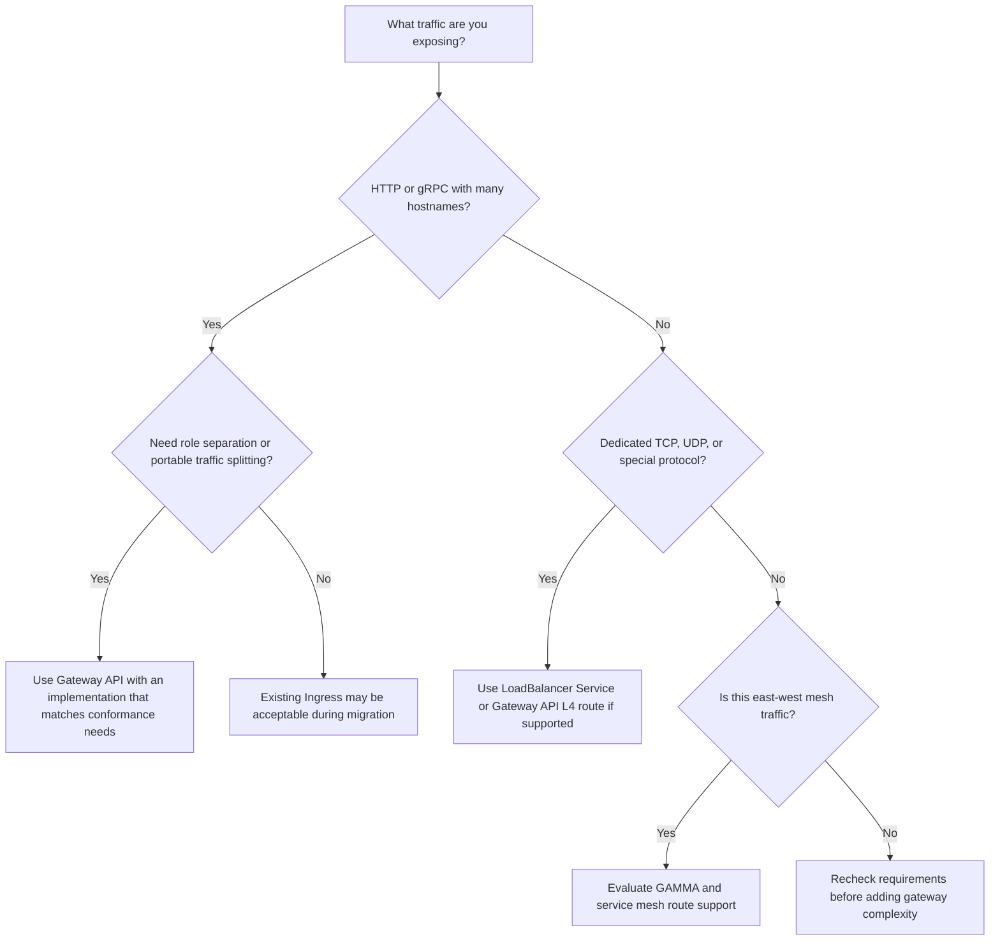

> **Discipline Module** | Complexity: `[COMPLEX]` | Time: 55-65 min

## What You'll Be Able to Do

After completing this module, you will be able to:

- **Design ingress and gateway architectures using Gateway API, Nginx, Envoy, or cloud load balancers**
- **Implement TLS termination, rate limiting, and authentication at the gateway layer**
- **Configure traffic routing policies — path-based, header-based, weighted — for canary and blue-green deployments**
- **Build high-availability gateway configurations that handle failover and horizontal scaling**

This module assumes you already understand Kubernetes Services, Pod networking, DNS, TLS basics, and the service mesh tradeoffs from [Module 1.3: Service Mesh Architecture & Strategy](../module-1.3-service-mesh-strategy/). We will not treat the gateway as a magic front door. We will treat it as shared production infrastructure where platform teams, application teams, security teams, and cloud networking teams all meet.

## Why This Module Matters

Hypothetical scenario: a product team runs twenty public HTTP services in one Kubernetes cluster. The first few services each receive their own `Service` of type `LoadBalancer`, because that is easy to understand and works during the pilot. Six months later, the team has twenty public IPs, twenty TLS certificate paths, twenty cloud load balancer bills, twenty places to configure health checks, and no single place to apply request limits during a noisy launch. Nothing is individually exotic, but the operational shape is brittle because every application has become its own edge platform.

The north-south traffic problem is not just "how do packets reach Pods?" Kubernetes already gives you primitives for that. The deeper problem is how to expose many workloads through a small, understandable, governable edge without making every application team learn cloud load balancer APIs, TLS renewal mechanics, host-based routing, path matching, abuse controls, and failure isolation. A production gateway is where a network address becomes an application contract: this hostname, this certificate, this path, this protocol, this policy, this backend, this failure behavior.

Ingress solved an important early version of that problem. It gave Kubernetes users a stable API object for HTTP and HTTPS routes, and it allowed controllers to turn those objects into real reverse proxy or cloud load balancer configuration. Kubernetes documentation still describes Ingress as the API object for managing external access to Services, typically HTTP, and it also states that the Ingress API is frozen and that the Kubernetes project recommends Gateway API for new development. That is the durable lesson: Ingress is stable, useful, and widely understood, but its shape stopped growing before platform teams needed richer routing and clearer ownership boundaries.

Gateway API is the response to that pressure. It splits the old "one object does everything" model into resources that match real operational roles: infrastructure providers define available gateway classes, cluster operators create shared gateways and listeners, and application developers attach routes for their services. The split looks bureaucratic until you operate a shared cluster. Then it becomes the difference between a safe self-service platform and a change queue where every route, certificate, and listener edit requires an infrastructure ticket.

The gateway layer also sits on the blast-radius boundary. A bad route can shadow another team's hostname, a wildcard certificate can be over-shared, a permissive cross-namespace reference can become a confused-deputy bug, and one overloaded proxy tier can make healthy applications look down. Learning Gateway API is therefore not only about newer YAML. It is about designing the shared edge as an explicit platform product with ownership, policy, observability, migration paths, and failure modes that application teams can reason about.

## The North-South Traffic Problem

Kubernetes has a clean internal networking promise: Pods can communicate, Services provide stable virtual addresses, and controllers keep endpoints current as workloads move. External clients do not participate in that cluster network. A browser, mobile application, partner system, or public API consumer begins outside the cluster, usually at DNS, then reaches some external load balancer or edge proxy, then eventually lands on a Service that selects ready Pods. The journey crosses trust boundaries, address boundaries, protocol boundaries, and ownership boundaries.

The simplest Kubernetes-native exposure primitive is `Service` type `NodePort`. Kubernetes allocates a port from the node port range, and every node forwards that port to ready endpoints behind the Service. This is useful for learning, bare-metal integration, and certain appliance-style deployments, but it is rarely the clean public interface for a multi-team platform. It exposes node addresses and high ports, pushes too much responsibility onto external network configuration, and gives you no native host or path dispatch.

`Service` type `LoadBalancer` is the next layer. On a supported cloud provider, Kubernetes asks the provider integration to provision an external load balancer for that Service, and the Service status eventually contains the assigned address or hostname. This is a good abstraction when one service genuinely deserves its own network entry point, such as a dedicated TCP endpoint, a private internal service, or a workload with unusual health-check requirements. It is not a complete HTTP application gateway by itself.

The raw `LoadBalancer`-per-service model breaks down because public HTTP platforms are mostly hostname and path problems, not port allocation problems. You usually want `api.example.com` and `shop.example.com` to share a small number of edge addresses, terminate TLS consistently, apply common headers, redirect HTTP to HTTPS, route `/checkout` to one service and `/catalog` to another, and shift a small amount of traffic to a new backend during rollout. Creating a separate cloud load balancer for every Service duplicates all of that work.

An L7 router consolidates those concerns. At Layer 7, the proxy can inspect HTTP hostnames, paths, methods, headers, and sometimes protocol-specific signals such as gRPC service and method names. That gives the platform a single edge surface where TLS policy, route ownership, redirects, request size limits, authentication integration, WAF policy, and observability can be made consistent. The individual applications still own their Services, but they no longer need to own every piece of the external edge.

The durable layer cake is therefore DNS, external load balancing, L7 routing, Services, and Pods. DNS points clients at an address. A cloud or physical load balancer gets traffic to the cluster or to a managed dataplane. An ingress or gateway controller programs an L7 proxy or cloud application load balancer. The Kubernetes Service gives the route a stable backend abstraction. The endpoint controller keeps that Service connected to the actual Pods. When troubleshooting, walking this layer cake in order prevents a lot of guesswork.

The key design question is not "Ingress or Gateway API?" until you know which layer you are designing. If you need one private TCP endpoint, a `LoadBalancer` Service may be enough. If you need many HTTP hostnames on one shared edge, you need a routing API and a controller. If you need mTLS, identity-aware retries, service-to-service traffic policy, and application telemetry inside the cluster, you may need a service mesh as well. Good gateway architecture starts by naming the traffic direction, protocol, owner, and policy surface.

```yaml
apiVersion: v1
kind: Service
metadata:
  name: checkout
  namespace: store
spec:
  type: LoadBalancer
  selector:
    app: checkout
  ports:
    - name: http
      protocol: TCP
      port: 80
      targetPort: 8080
```

That Service is real and valid, but it exposes only one Service. It does not know that `/checkout` and `/catalog` should share a hostname. It does not know how to split traffic between two versions. It does not encode which team may attach to the public edge. For those concerns, you need the routing layer that Ingress originally provided and Gateway API now models more explicitly.

## Ingress: Durable Concepts and Limits

Ingress is a Kubernetes API resource for HTTP and HTTPS routing. Its core ideas are simple: match a host, match a path, send traffic to a backend Service, optionally use a TLS Secret for a hostname, and rely on a default backend when no route matches. The resource is declarative, so the API server stores intent while an ingress controller watches those resources and turns them into actual dataplane configuration. Without a controller, creating an Ingress object has no effect beyond storing YAML.

That controller distinction matters because "Ingress" is not the proxy. The API object is the contract, and the controller is the implementation. One controller may program NGINX, another may program HAProxy, another may program Envoy, and a cloud provider controller may provision or configure a managed load balancer. When a learner says "the Ingress is down," the first correction is to ask whether the API object is invalid, the controller failed to reconcile it, the proxy Pod is unhealthy, the cloud load balancer is misconfigured, or DNS points elsewhere.

The durable Ingress concepts still show up in Gateway API. Host rules become hostnames. Path rules become route matches. TLS Secrets become listener certificate references. Default backend behavior becomes an explicit catch-all route. IngressClass foreshadows GatewayClass by naming which controller should handle the object. Understanding Ingress is therefore still valuable, because it teaches the basic mapping from HTTP request properties to Kubernetes Services.

Ingress reached its ceiling through extensibility pressure. The standard resource covers simple HTTP routing and TLS termination, but production platforms need more: weighted traffic splitting, request mirroring, header modification, authentication hooks, WAF attachment, rate limiting, timeout policy, backend TLS, gRPC-aware routing, cross-namespace delegation, and non-HTTP protocols. Controllers added those capabilities through annotations because the API had nowhere else to put them. The annotations worked, but every controller invented its own vocabulary.

Annotation sprawl creates portability and safety problems. A route copied from one controller may silently do the wrong thing on another controller, or it may be rejected because the annotation is unknown. An annotation value is often an unstructured string, so validation happens late, if at all. Some annotations expose powerful controller-specific behavior, which means an application team with permission to edit an Ingress can accidentally change shared proxy behavior far beyond one path rule. The issue is not that annotations are always bad; the issue is that they became the main extension mechanism.

Ingress also has a weak separation of concerns for shared clusters. The same resource can mix application routing intent, TLS choices, controller selection, and implementation-specific behavior. In a small cluster, one person may own all of that. In a platform environment, the infrastructure team should decide which public entry points exist, the security team should constrain certificate and policy attachment, and application teams should own their own host/path routing within those boundaries. Ingress can be made to work with RBAC and admission policy, but the model does not express that split naturally.

Non-HTTP traffic is another limit. Kubernetes documentation is explicit that Ingress does not expose arbitrary ports or protocols; traffic other than HTTP and HTTPS typically uses `NodePort` or `LoadBalancer` Services. Many controllers support TCP or UDP side channels through ConfigMaps or implementation-specific CRDs, but that is not the portable Ingress API. As platforms converge around HTTP, gRPC, TLS passthrough, and selected L4 use cases, a richer resource family becomes easier to govern than a single HTTP-only object plus escape hatches.

The right posture toward Ingress in 2026 is pragmatic. Existing Ingress resources do not need panic rewrites merely because the API is frozen, and Kubernetes has no announced plan to remove the API. However, the community `kubernetes/ingress-nginx` controller is a separate concern from the Ingress API, and the Kubernetes project announced that its maintenance would halt in March 2026. If you still run that controller, treat controller migration as a production program, not as a cosmetic YAML cleanup.

```yaml
apiVersion: networking.k8s.io/v1
kind: Ingress
metadata:
  name: store
  namespace: store
spec:
  ingressClassName: example
  tls:
    - hosts:
        - shop.example.com
      secretName: shop-example-com
  rules:
    - host: shop.example.com
      http:
        paths:
          - path: /checkout
            pathType: Prefix
            backend:
              service:
                name: checkout
                port:
                  number: 8080
          - path: /
            pathType: Prefix
            backend:
              service:
                name: storefront
                port:
                  number: 8080
```

That manifest is still useful teaching material. It shows host dispatch, path dispatch, TLS association, and Service backends. What it does not show is who owns the public listener, which namespaces may attach to it, how traffic weights are represented, how cross-namespace references are approved, or how the same model extends to gRPC and TLS passthrough. Those missing pieces are exactly where Gateway API becomes the better mental model for new platform designs.

## Gateway API: Role-Oriented Traffic Management

Gateway API is a family of Kubernetes resources for service networking. Its most important improvement is not one particular field; it is the resource model. `GatewayClass` is cluster-scoped and represents a class of gateways that can be instantiated by a controller. `Gateway` is a concrete entry point with listeners, addresses, TLS settings, and attachment policy. Route resources such as `HTTPRoute`, `GRPCRoute`, `TLSRoute`, and `TCPRoute` describe how traffic should move from that entry point to backend Services.

The role split maps cleanly onto platform work. An infrastructure provider or platform team defines `GatewayClass` objects such as `public-internet`, `private-internal`, or `mesh-edge`. A cluster operator creates `Gateway` objects in an infrastructure namespace, choosing listeners, ports, hostnames, and TLS policy. Application teams create route resources in their own namespaces, attaching to the allowed listener and routing to their Services. RBAC can now follow the resource model instead of fighting it.

The split also changes review boundaries. A pull request that changes a `GatewayClass` may affect every Gateway created from that class, so it deserves infrastructure review. A pull request that changes a `Gateway` listener may affect all routes attached to that listener, so it deserves platform and security review. A pull request that changes an `HTTPRoute` for one namespace can often be owned by that application team, as long as admission policy verifies hostname ownership and backend references. That is a healthier self-service contract than giving every team write access to one shared proxy configuration file.

```yaml
apiVersion: gateway.networking.k8s.io/v1
kind: GatewayClass
metadata:
  name: public-internet
spec:
  controllerName: gateway.envoyproxy.io/gatewayclass-controller
---
apiVersion: gateway.networking.k8s.io/v1
kind: Gateway
metadata:
  name: public-gateway
  namespace: platform-gateways
spec:
  gatewayClassName: public-internet
  listeners:
    - name: https
      hostname: "*.example.com"
      protocol: HTTPS
      port: 443
      tls:
        mode: Terminate
        certificateRefs:
          - group: ""
            kind: Secret
            name: wildcard-example-com
      allowedRoutes:
        namespaces:
          from: Selector
          selector:
            matchLabels:
              gateway-access: public
```

The `allowedRoutes` field is the first governance feature many teams notice. Instead of every namespace being able to attach routes to every listener, the Gateway can allow only same-namespace routes, all namespaces, or namespaces selected by label. This is not a replacement for RBAC or admission policy, but it is a useful handshake. The Gateway owner says "these namespaces may attach here," and the route owner still has to create a valid route whose hostnames and parent references match the listener.

`HTTPRoute` is the workhorse for web applications. It can match hostnames, paths, methods, headers, and query parameters, then forward to one or more backend references. Backend weights are native, so a route can send most traffic to the stable Service and a small share to a canary Service without using a controller-specific annotation. Filters provide standard request redirects, header modification, URL rewrites, request mirroring, and other behaviors with explicit conformance levels.

```yaml
apiVersion: gateway.networking.k8s.io/v1
kind: HTTPRoute
metadata:
  name: checkout
  namespace: store
spec:
  parentRefs:
    - name: public-gateway
      namespace: platform-gateways
      sectionName: https
  hostnames:
    - shop.example.com
  rules:
    - matches:
        - path:
            type: PathPrefix
            value: /checkout
      backendRefs:
        - name: checkout-v1
          port: 8080
          weight: 90
        - name: checkout-v2
          port: 8080
          weight: 10
    - matches:
        - path:
            type: PathPrefix
            value: /
      backendRefs:
        - name: storefront
          port: 8080
```

Weighted routing is deliberately proportional, not magical. If the weights are `90` and `10`, the implementation should aim for a nine-to-one split for matching traffic. If they are `9` and `1`, the desired split is the same. That means you can use round numbers that communicate intent, but you should still validate rollout behavior with request metrics, backend metrics, and error budgets. Routing policy is not a substitute for release observability.

`GRPCRoute` exists because gRPC is HTTP/2-based but has its own service and method semantics. Basic gRPC traffic can sometimes work through `HTTPRoute`, but `GRPCRoute` makes gRPC intent clearer and gives implementations room for gRPC-aware policy. `TLSRoute` handles TLS routing based on Server Name Indication when the Gateway should not terminate the connection. `TCPRoute` and `UDPRoute` cover selected L4 use cases, though support varies by implementation and conformance profile.

Cross-namespace routing requires careful thinking. Gateway API allows routes and Gateways to live in different namespaces, which is essential for shared platform entry points. Backend references across namespace boundaries are more sensitive because a route in one namespace could otherwise send traffic to a Service owned by another team. `ReferenceGrant` solves that by requiring the referenced namespace to explicitly allow the reference. The owner of the backend namespace grants permission; the route owner cannot grant permission on someone else's behalf.

```yaml
apiVersion: gateway.networking.k8s.io/v1
kind: ReferenceGrant
metadata:
  name: allow-store-routes
  namespace: shared-backends
spec:
  from:
    - group: gateway.networking.k8s.io
      kind: HTTPRoute
      namespace: store
  to:
    - group: ""
      kind: Service
```

Migration from Ingress to Gateway API should be incremental. First inventory existing Ingress resources, annotations, hostnames, TLS Secrets, and controller-specific behavior. Then classify what maps directly to `Gateway` and `HTTPRoute`, what maps to a standard Gateway API filter, what needs an implementation-specific policy, and what should be redesigned because it was relying on an unsafe escape hatch. Finally run both paths in parallel for selected hostnames, validate status conditions and metrics, and cut traffic over through DNS or load balancer configuration.

The most common migration mistake is assuming a YAML converter can understand operational intent. Tools can translate host and path rules, and the Gateway API project documents an `ingress2gateway` path for mechanical conversion. They cannot decide whether a wildcard certificate is still appropriate, which teams should attach to which listener, whether old annotations encode security policy, or whether the previous default backend hid errors that should now be explicit. Treat conversion output as a draft that needs platform review.

## TLS Termination and Certificate Automation

TLS at the gateway layer answers three questions: where does the client TLS session end, who manages the certificate, and whether traffic from the gateway to the backend is encrypted again. Edge termination means the Gateway or Ingress terminates TLS and forwards HTTP or gRPC to the backend. Passthrough means the Gateway keeps the client connection encrypted and routes based on SNI or lower-layer information. Re-encryption means the Gateway terminates the client connection and then opens a new TLS connection to the backend.

Edge termination is operationally attractive because it centralizes certificates, cipher policy, redirects, and HTTP routing. The proxy can inspect hostnames, paths, and headers after decryption, so L7 routing works naturally. The tradeoff is that traffic inside the cluster is no longer protected by that client TLS session. Whether that is acceptable depends on your threat model, network policy, node trust, compliance obligations, and whether another layer such as a service mesh provides workload-to-workload encryption.

Passthrough is attractive when the backend must own the certificate or see client certificate details directly. It is common for protocols that use TLS but are not HTTP, for legacy applications with strict certificate handling, or for environments where a gateway is not allowed to decrypt application traffic. The tradeoff is that the gateway loses most L7 visibility and control. It can often route by SNI, but it cannot inspect HTTP paths, add headers, apply HTTP authentication filters, or mirror specific requests.

Re-encryption is the middle path. The gateway terminates the public client connection so it can apply edge policy, then it creates a separate TLS connection to the backend. That gives you centralized public certificates and encrypted in-cluster transport, but it also creates two certificate lifecycles and more places to misconfigure trust. Gateway API models frontend TLS on listeners, and newer Gateway API work also models backend TLS policy, but implementation support and exact policy resources must be verified for your chosen controller.

Certificate automation is part of the gateway design, not an afterthought. Manual certificate renewal fails in boring ways: owners change, calendars drift, emergency rotations skip documentation, wildcard private keys spread, and expiry alerts page the wrong team. cert-manager turns a certificate request into Kubernetes resources, obtains certificates from an Issuer or ClusterIssuer, stores the result in a Secret, and renews before expiry. ACME and Let's Encrypt are common public-certificate paths, while private PKI may use Vault, CA issuers, or cloud certificate services.

```yaml
apiVersion: cert-manager.io/v1
kind: Certificate
metadata:
  name: wildcard-example-com
  namespace: platform-gateways
spec:
  secretName: wildcard-example-com
  issuerRef:
    name: letsencrypt-prod
    kind: ClusterIssuer
  dnsNames:
    - "*.example.com"
    - example.com
```

The Gateway then references the Secret through the listener. Keep the Secret in the same namespace as the Gateway unless you have a deliberate cross-namespace certificate-sharing model and the required grants. A wildcard certificate is convenient, but it is also broad authority over a domain. A platform team should decide whether teams receive individual certificates per hostname, delegated wildcard certificates per subdomain, or a central wildcard certificate with strict route ownership controls.

SNI is the bridge between TLS and routing. A client includes the intended server name during the TLS handshake, so a gateway can choose a certificate during termination or choose a backend during passthrough before seeing any HTTP request. SNI is not the same as an HTTP Host header, and it arrives earlier in the connection lifecycle. When debugging TLS routing, check DNS, SNI, listener hostname, certificate coverage, route hostname, and backend health as separate facts rather than treating "TLS failed" as one symptom.

Rate limiting and authentication often live near TLS because the gateway is the first application-aware enforcement point. Standard Gateway API resources define common routing primitives, while implementation-specific policies usually attach WAF, OAuth/OIDC, JWT validation, API key validation, local and global rate limits, and external authorization. That boundary is healthy when it is explicit. Use standard Gateway API fields where they exist, and use controller-specific policy CRDs where they are necessary, but do not hide security policy in opaque annotations without review.

## Gateway API and Service Mesh Convergence

Gateway API began with north-south traffic, but the same route resources are increasingly used for east-west service mesh traffic. The GAMMA initiative, Gateway API for Mesh Management and Administration, describes how route resources such as `HTTPRoute` can attach to Services for in-mesh traffic rather than only attaching to Gateways for external traffic. The convergence does not mean every cluster needs a mesh. It means the ecosystem is trying to reuse a common routing vocabulary for both edges.

The north-south and east-west mental models remain different. A Gateway owns an external entry point with listeners, addresses, and TLS policy. A mesh route often shapes traffic that is already inside the cluster, where workload identity, mTLS, retries, telemetry, and authorization may be controlled by sidecars, ambient data planes, or node-level proxies. The API surface may look similar, but the failure modes and owners are different. A public Gateway outage affects clients outside the cluster; a mesh route mistake may only affect calls between two services.

This module follows [Module 1.3: Service Mesh Architecture & Strategy](../module-1.3-service-mesh-strategy/) because gateway decisions and mesh decisions should be paired, not conflated. If your main problem is exposing a few public HTTP applications, Gateway API without a mesh may be enough. If your main problem is workload identity, service-to-service encryption, and internal traffic policy, a mesh may be justified even if your external gateway is simple. If you need both, choose implementations that make the handoff between edge and mesh visible.

Istio is a useful example of convergence because its documentation supports Kubernetes Gateway API for ingress, and the Gateway API implementation list tracks Istio as conformant for both gateway and mesh profiles. That does not make Istio the right answer for every team. It shows the architectural direction: gateway resources can model external entry points, while route resources can also participate in mesh traffic management. The durable lesson is to evaluate whether one routing vocabulary can reduce cognitive load across the platform.

Convergence can also create confusion. A team may see `HTTPRoute` and assume it behaves the same everywhere, but parent references, status conditions, supported filters, telemetry labels, and policy attachment can differ between north-south and mesh use cases. Platform documentation should name which profile a route belongs to, which controller reconciles it, what status conditions prove it is active, and which policies apply. The same API kind can still have different operational meaning in different profiles.

## Operational Concerns for Shared Gateways

A shared gateway is a production dependency, not a helper Deployment. It should have explicit ownership, resource requests, Pod disruption budgets, topology spread or zone-aware scheduling where available, upgrade plans, metrics, logs, tracing, and rollback procedures. The dataplane may run inside the cluster, outside the cluster as a managed cloud load balancer, or as a hybrid of both. In all cases, the platform team needs to know what happens when a route changes, a certificate rotates, a backend becomes unhealthy, or the controller loses API access.

Multiple gateways are usually healthier than one universal gateway. A public internet gateway, a private internal gateway, a partner gateway, and a high-risk experimentation gateway may have different certificates, WAF policies, logging retention, rate limits, and change controls. Splitting gateways by trust boundary and blast radius lets you upgrade or restrict one edge without changing every route in the organization. Splitting every application into its own gateway, however, gives up consolidation benefits and recreates the load-balancer-per-service problem.

Multiple controllers can also coexist, but only with deliberate class names and ownership. You might use a cloud gateway class for public managed load balancers, an Envoy-based class for self-hosted advanced L7 policy, and a mesh-integrated class for workloads that already depend on mesh identity. The controller name in `GatewayClass` must be unique enough to avoid collisions, and teams should know which classes are approved for which use cases. A random controller installed by a team should not suddenly reconcile shared edge resources.

Rate limiting, WAF, and authentication belong at the edge when they protect shared infrastructure or enforce organization-wide policy. They belong closer to the application when they depend on domain-specific user state or business rules. A gateway can reject obvious abuse, enforce request size limits, validate tokens, or require client certificates before traffic reaches Pods. It should not become a dumping ground for every application decision. The line between platform policy and application policy must be documented because both groups will otherwise assume the other owns it.

Observability must connect the client symptom to the Kubernetes route. At minimum, collect request count, latency, response code, upstream cluster or Service, route name, Gateway name, listener, namespace, TLS handshake failures, rejected route status, certificate expiry, controller reconcile errors, and dataplane resource saturation. Access logs should include request IDs and enough route metadata to correlate with application logs. A gateway that only reports aggregate proxy metrics is hard to operate in a multi-team cluster because every incident looks like "the edge is slow."

Status conditions are part of the API contract. Gateway API resources report whether classes are accepted, Gateways have programmed listeners, and routes are accepted by parent resources. Teach application teams to inspect status before opening an infrastructure incident. A route that exists but has not attached to a listener is not a dataplane mystery; it is usually a hostname mismatch, namespace permission issue, unsupported filter, missing ReferenceGrant, or controller conformance limit. Good runbooks start with `kubectl describe` and status conditions before jumping to packet captures.

High availability includes the control plane and the dataplane. If the controller is unavailable, existing dataplane configuration may continue serving, but new route changes, certificate updates, and backend changes may not reconcile. If the dataplane is unavailable, healthy backends do not matter because clients cannot reach them. If the cloud load balancer is healthy but every proxy Pod is saturated, traffic still fails. A high-availability gateway configuration therefore needs redundant dataplane instances, safe disruption settings, capacity tests, and monitoring for both reconcile health and request-serving health.

Capacity planning for gateways should be based on connection behavior, not only request rate. A small number of clients with long-lived HTTP/2 or gRPC streams can exercise file descriptors, memory, connection pools, and upstream concurrency very differently from a large number of short HTTP requests. TLS handshakes create CPU pressure, large request bodies create buffering pressure, and slow clients can hold resources even when backend Services are fast. Load tests should therefore include steady traffic, connection churn, large headers, slow uploads, backend failure, and route updates during traffic.

Change management also needs a gateway-specific path. A normal Deployment rollout changes application Pods behind one Service, while a Gateway or route change can alter how external clients reach many Services. For shared Gateways, require review for listener changes, wildcard hostname changes, certificate reference changes, cross-namespace grants, and implementation-specific policy attachments. Application-owned `HTTPRoute` changes can move faster, but they still need validation for hostname ownership, supported filters, and backend health. The goal is not to slow teams down; it is to put the right guardrail at the right layer.

Runbooks should teach operators how to prove where the fault lives. Start with DNS and the external load balancer address, then check Gateway listener status, route parent status, certificate readiness, and controller reconcile errors. After that, inspect dataplane logs and metrics, then backend Service endpoints and Pod readiness. This ordering matters because it prevents a team from restarting healthy applications when the actual issue is a rejected route, and it prevents a platform team from tuning proxy resources when the actual issue is a backend returning errors.

Finally, keep route ownership visible in observability and inventory. A shared edge becomes hard to govern when metrics say only "gateway returned 500" without naming the route, namespace, listener, and backend. Dashboards should let an on-call engineer filter by Gateway, route, hostname, Service, and response class. Inventory should show which namespaces attach to which Gateways, which certificates each listener uses, and which implementation-specific policies are attached. That metadata turns the gateway from a mysterious choke point into an understandable platform surface.

## Landscape snapshot — as of 2026-06. This changes fast; verify against vendor docs before relying on specifics.

The Gateway API Standard channel was at v1.5.x in the Kubernetes project material reviewed for this module, with GatewayClass, Gateway, HTTPRoute, GRPCRoute, TLSRoute, and ReferenceGrant documented as part of the Standard channel. Envoy Gateway's current documentation showed v1.8.1 commands, while older Envoy Gateway documentation versions were explicitly marked EOL. The Kubernetes project announced community ingress-nginx retirement with maintenance halted after March 2026, so new platform designs should not treat that controller as the default long-term choice. CNCF project pages reviewed for this module list Envoy and cert-manager as Graduated projects and Contour as Incubating.

| Durable capability | NGINX Ingress | Envoy Gateway | Istio gateway | Cloud gateways | Contour |
|---|---|---|---|---|---|
| API model: Ingress vs Gateway API | Community ingress-nginx historically centered on Ingress annotations; the project is past the announced retirement date | Gateway API controller using Envoy-managed dataplanes | Supports Kubernetes Gateway API alongside Istio APIs | Provider controllers map Gateway API to managed load balancers where supported | Supports Ingress, HTTPProxy, and Gateway API modes |
| HTTP/gRPC/TCP/TLS routes | HTTP/HTTPS Ingress is the portable API; non-HTTP behavior is controller-specific | Gateway API route support plus Envoy Gateway extension policies; verify exact conformance for the release | Gateway API for ingress and mesh profiles; verify managed-service limitations | Varies by provider and controller; check public docs and conformance reports | Documents HTTPRoute, TLSRoute, GRPCRoute, and TCPRoute support, with version-specific caveats |
| Traffic splitting | Usually annotation-based or controller-specific in Ingress | Native `HTTPRoute` and `GRPCRoute` backend weights where supported | Gateway API routes can express weights; mesh behavior depends on profile | Supported by some providers; verify per implementation and route type | Gateway API and Contour-specific APIs both have traffic-management paths |
| Cross-namespace routing | Usually governed by RBAC and controller behavior, not a core Ingress delegation model | Gateway `allowedRoutes` and `ReferenceGrant` are central checks | Gateway and mesh profiles use Gateway API attachment rules; policy may layer with mesh config | Provider implementations may add cloud IAM and load balancer constraints | Gateway provisioning mode affects how Gateway and Envoy resources are kept in sync |
| Mesh/GAMMA | Not a mesh API | North-south gateway focus; mesh integration is implementation-specific | Strong convergence story because Istio is both gateway and service mesh | Managed service mesh integrations vary by provider | Primarily ingress/gateway with Envoy dataplane |
| Cloud LB integration | Often fronted by a `LoadBalancer` Service or cloud-specific controller | Usually needs a load balancer implementation or cloud integration for external addresses | Depends on installation model and cloud environment | Native strength: provisions provider load balancers directly | Can run with cloud LBs such as AWS NLB through documented deployment patterns |

## Patterns & Anti-Patterns

Patterns are reusable shapes, not universal recipes. The right gateway architecture depends on traffic direction, protocol, compliance requirements, controller support, cloud integration, and team ownership. Use these patterns to make design conversations concrete, then validate the selected pattern with conformance reports, controller docs, failure testing, and a small migration before you standardize it across a platform.

| Pattern | When It Works | Why It Works |
|---|---|---|
| Shared public Gateway with namespace-selected route attachment | Many teams expose HTTP services under approved domains | Platform owns listeners and TLS while app teams own their routes |
| Separate Gateways by trust boundary | Public, private, partner, and experimental traffic need different policies | Blast radius, logging, WAF, and change control can differ cleanly |
| Route-owned rollout policy | Application teams need canary or blue-green control without editing shared proxies | `HTTPRoute` backend weights keep rollout intent near the Service owner |
| Explicit backend grants | A route must send traffic to a Service in another namespace | `ReferenceGrant` makes the backend namespace owner approve the reference |

Anti-patterns usually come from treating the gateway as either too small or too magical. Too small means seeing it as a dumb reverse proxy and forgetting ownership, certificates, limits, and observability. Too magical means putting every security and rollout concern at the edge until application teams no longer understand what happens before their Pods receive a request. A good platform keeps the gateway powerful but legible.

| Anti-Pattern | Why It Fails | Better Approach |
|---|---|---|
| One `LoadBalancer` Service per HTTP workload | Duplicates TLS, health checks, addresses, and policy across services | Use shared L7 Gateways for host/path dispatch where protocols allow |
| One universal Gateway for every trust boundary | A policy or capacity issue can affect unrelated traffic classes | Split Gateways by exposure, sensitivity, and operational ownership |
| Annotation-only production policy | Behavior is hard to validate, port, and review consistently | Prefer standard Gateway API fields, then explicit implementation policies |
| Uncontrolled wildcard hostnames | Teams can accidentally shadow routes or overuse broad certificates | Use admission policy, hostname ownership, and constrained listener attachment |

Decision frameworks prevent "which controller do you like?" debates from replacing engineering. Start with the durable requirement, then choose the smallest implementation set that satisfies it. If a managed cloud gateway meets your needs, it may reduce operations. If you need portable self-hosted policy, an Envoy- or HAProxy-based controller may fit. If mesh integration is mandatory, evaluate the mesh controller's Gateway API profile and its operational coupling.

| Decision Point | Favor Service LoadBalancer | Favor Ingress | Favor Gateway API | Favor Mesh Integration |
|---|---|---|---|---|
| Protocol | Dedicated TCP or UDP endpoint | Simple HTTP/HTTPS | HTTP, gRPC, TLS, and selected L4 routes | Service-to-service HTTP/gRPC policy |
| Ownership | One service owner controls the endpoint | One team owns simple web routing | Platform owns listeners, apps own routes | Platform and service owners share mesh policy |
| Traffic rollout | External tool or application logic | Controller-specific annotation | Native backend weights where supported | Mesh route policy and workload identity |
| Portability need | Low | Medium for basic HTTP | Higher for standard fields and conformance | Depends on mesh and GAMMA support |
| Operational burden | Cloud load balancer per Service | Controller and annotation knowledge | Controller plus Gateway API status model | Mesh control plane plus gateway model |



## Did You Know?

- **Ingress is frozen, not removed**: Kubernetes documents the Ingress API as stable and frozen, with no announced plan to remove it, while recommending Gateway API for new functionality.
- **A Gateway is not always a Pod**: Depending on the implementation, creating a `Gateway` can configure a cloud load balancer, spawn a software proxy, add configuration to an existing proxy, or program network infrastructure.
- **ReferenceGrant protects the referenced namespace**: The namespace that owns the backend must grant cross-namespace references; the route namespace cannot unilaterally approve access to someone else's Service or Secret.
- **TLSRoute is about SNI-level routing**: It can route encrypted traffic based on the server name from the TLS handshake, which is useful when the gateway must not inspect HTTP content.

## Common Mistakes

| Mistake | Why It Happens | How to Fix It |
|---|---|---|
| Treating the Ingress API and ingress-nginx controller as the same thing | The names are similar, but one is a Kubernetes API and the other is a specific controller | Inventory both API usage and controller dependency before migration |
| Creating a `Gateway` but forgetting route attachment policy | The listener exists, but routes from application namespaces are not allowed to attach | Set `allowedRoutes` deliberately and teach teams to inspect route status |
| Using Gateway API examples without checking implementation conformance | The API is portable, but not every implementation supports every route type or extended feature | Check conformance reports and vendor docs for the exact version in use |
| Moving annotations blindly into Gateway API | Some annotations map to standard fields, while others require implementation-specific policies or redesign | Classify each annotation during migration and review security-sensitive behavior |
| Sharing TLS Secrets across namespaces casually | Certificate reuse can become broad domain authority and cross-team coupling | Keep certificates near the Gateway or require explicit grants and ownership policy |
| Putting all traffic behind one Gateway | A route bug, certificate issue, or dataplane overload can affect unrelated teams | Split Gateways by trust boundary, policy set, and blast-radius tolerance |
| Ignoring controller and dataplane observability | The route object may look valid while the controller or proxy is unhealthy | Monitor status conditions, reconcile errors, proxy saturation, route labels, and TLS failures |
| Assuming mesh and gateway routes behave identically | The same API kind can be reconciled under different profiles and policy layers | Document parent references, controller ownership, and supported filters for each profile |

## Quiz

<details>
<summary>1. Scenario: A team exposes twelve HTTP services with twelve `LoadBalancer` Services and asks why costs and certificate work keep growing. What architecture would you propose?</summary>

Design ingress and gateway architectures by first recognizing that the team has an L7 routing problem, not twelve unrelated port problems. A shared Gateway API entry point can consolidate DNS targets, TLS termination, host dispatch, path dispatch, and route ownership while keeping each backend as a normal Service. You might keep a dedicated `LoadBalancer` for an unusual non-HTTP service, but most public HTTP workloads should attach routes to a shared Gateway. The proposal should also include ownership rules for listeners, certificates, and route attachment.
</details>

<details>
<summary>2. Why does the Ingress resource require an ingress controller, and what goes wrong if you forget that distinction?</summary>

The Ingress resource stores desired routing intent, but the controller is the component that turns that intent into a real proxy or cloud load balancer configuration. If you forget the distinction, you may debug YAML while the actual problem is a crashed controller, unsupported annotation, missing IngressClass, or unhealthy dataplane. You may also assume two controllers behave the same because they watch the same API. A reliable runbook checks the API object, class selection, controller reconciliation, proxy health, and external load balancer path separately.
</details>

<details>
<summary>3. Scenario: You need a canary where requests with a test header go to v2, and then a small share of normal traffic shifts to v2. How does Gateway API express this?</summary>

Configure traffic routing policies with an `HTTPRoute` that has a more specific header-matching rule for test traffic and a default rule with weighted `backendRefs` for normal traffic. The header rule sends matching requests to the v2 Service so internal testers can validate behavior before production shifting begins. The weighted rule sends most traffic to v1 and a smaller proportional weight to v2. During rollout, request metrics and backend error rates should decide whether to increase, hold, or roll back the weight.
</details>

<details>
<summary>4. Scenario: Security wants public TLS centralized, but backend owners also require encrypted traffic from the gateway to their Services. Which TLS model fits?</summary>

Implement TLS termination at the gateway for the downstream client connection, then use backend TLS or mesh encryption for the upstream connection to the Service. This is often called re-encryption because the public client TLS session ends at the gateway and a separate encrypted connection begins toward the backend. The model allows the gateway to inspect HTTP routing fields while avoiding plaintext backend transport. The design must include certificate automation, trust roots, and monitoring for both frontend and backend certificate failures.
</details>

<details>
<summary>5. Why did annotation-heavy Ingress usage become hard to operate across teams?</summary>

Annotations became the escape hatch for features the Ingress API did not model, such as rewrites, traffic splitting, authentication hooks, and rate limits. Because annotations are controller-specific strings, they are harder to validate, review, and port between implementations. They can also put infrastructure behavior in application-owned resources without a clean role boundary. Gateway API reduces that pressure by modeling many common routing features directly and by using policy attachment for implementation-specific behavior.
</details>

<details>
<summary>6. Scenario: A route in namespace `store` needs to send a path to a shared Service in namespace `shared-backends`. Who must approve that reference?</summary>

The owner of `shared-backends` must create a `ReferenceGrant` that permits HTTPRoutes from the `store` namespace to reference Services in `shared-backends`. The route owner cannot approve access to another namespace's backend by editing only the route. This protects against confused-deputy behavior where one namespace tricks a shared gateway into sending traffic to a backend it does not own. The route status should be checked after the grant is added because implementations validate these references at runtime.
</details>

<details>
<summary>7. Scenario: Your organization already has a service mesh. Does that mean every external gateway should be replaced by mesh routing?</summary>

No. Gateway API and service mesh solve overlapping but distinct problems, and the right design depends on traffic direction and ownership. North-south traffic still needs external addresses, listeners, certificates, and edge policy, while east-west mesh traffic focuses on workload identity, internal routing, and service-to-service controls. GAMMA shows a convergence path where Gateway API route resources can participate in mesh traffic, but the operational profile is still different. Keep the edge design explicit even when the mesh is involved.
</details>

<details>
<summary>8. Scenario: A platform team wants high availability for a shared public Gateway. What should they verify beyond "two replicas"?</summary>

Build high-availability gateway configurations by checking both dataplane and controller failure modes. The team should verify topology spread, Pod disruption budgets, resource headroom, cloud load balancer health checks, certificate renewal, route status conditions, controller reconcile errors, and rollback behavior during upgrades. They should also test what happens when a backend is unhealthy, a route is rejected, and one proxy instance is drained. Two replicas help, but observability and failure drills prove whether failover actually works.
</details>

## Hands-On

This lab uses Envoy Gateway as an illustrative Gateway API implementation because its current documentation provides a compact quickstart and standard Gateway API manifests. The point is not to endorse one controller; the point is to practice the durable workflow of installing a controller, creating a Gateway, attaching an `HTTPRoute`, and observing weighted routing. Verify the exact Envoy Gateway version and Gateway API bundle against the vendor docs before using these commands outside a temporary lab.

```bash
kind create cluster --name gateway-lab
helm install eg oci://docker.io/envoyproxy/gateway-helm \
  --version v1.8.1 \
  -n envoy-gateway-system \
  --create-namespace
kubectl wait --timeout=5m -n envoy-gateway-system deployment/envoy-gateway \
  --for=condition=Available
```

Create two simple backends. They use a standard nginx image and ConfigMaps so each backend returns a visible version string without relying on a demo-specific application image.

```yaml
apiVersion: v1
kind: Namespace
metadata:
  name: store
  labels:
    gateway-access: public
---
apiVersion: v1
kind: ConfigMap
metadata:
  name: checkout-v1-content
  namespace: store
data:
  index.html: |
    checkout-v1
---
apiVersion: v1
kind: ConfigMap
metadata:
  name: checkout-v2-content
  namespace: store
data:
  index.html: |
    checkout-v2
---
apiVersion: apps/v1
kind: Deployment
metadata:
  name: checkout-v1
  namespace: store
spec:
  replicas: 2
  selector:
    matchLabels:
      app: checkout-v1
  template:
    metadata:
      labels:
        app: checkout-v1
    spec:
      containers:
        - name: nginx
          image: nginx:stable-alpine
          ports:
            - containerPort: 80
          volumeMounts:
            - name: content
              mountPath: /usr/share/nginx/html
      volumes:
        - name: content
          configMap:
            name: checkout-v1-content
---
apiVersion: apps/v1
kind: Deployment
metadata:
  name: checkout-v2
  namespace: store
spec:
  replicas: 2
  selector:
    matchLabels:
      app: checkout-v2
  template:
    metadata:
      labels:
        app: checkout-v2
    spec:
      containers:
        - name: nginx
          image: nginx:stable-alpine
          ports:
            - containerPort: 80
          volumeMounts:
            - name: content
              mountPath: /usr/share/nginx/html
      volumes:
        - name: content
          configMap:
            name: checkout-v2-content
---
apiVersion: v1
kind: Service
metadata:
  name: checkout-v1
  namespace: store
spec:
  selector:
    app: checkout-v1
  ports:
    - name: http
      port: 8080
      targetPort: 80
---
apiVersion: v1
kind: Service
metadata:
  name: checkout-v2
  namespace: store
spec:
  selector:
    app: checkout-v2
  ports:
    - name: http
      port: 8080
      targetPort: 80
```

Apply the backend manifest from a local file, then create a Gateway and an `HTTPRoute` with a test-header rule plus weighted default traffic.

```yaml
apiVersion: gateway.networking.k8s.io/v1
kind: Gateway
metadata:
  name: lab-gateway
  namespace: store
spec:
  gatewayClassName: envoy-gateway
  listeners:
    - name: http
      protocol: HTTP
      port: 80
      hostname: shop.example.test
      allowedRoutes:
        namespaces:
          from: Same
---
apiVersion: gateway.networking.k8s.io/v1
kind: HTTPRoute
metadata:
  name: checkout
  namespace: store
spec:
  parentRefs:
    - name: lab-gateway
      sectionName: http
  hostnames:
    - shop.example.test
  rules:
    - matches:
        - headers:
            - name: X-Canary
              value: "true"
      backendRefs:
        - name: checkout-v2
          port: 8080
    - matches:
        - path:
            type: PathPrefix
            value: /
      backendRefs:
        - name: checkout-v1
          port: 8080
          weight: 90
        - name: checkout-v2
          port: 8080
          weight: 10
```

Use the Envoy Gateway service selector from the current quickstart to test without requiring a local `LoadBalancer` implementation.

```bash
kubectl apply -f backends.yaml
kubectl apply -f gateway-route.yaml
kubectl wait --timeout=2m -n store gateway/lab-gateway --for=condition=Programmed

export ENVOY_SERVICE=$(kubectl get svc -n envoy-gateway-system \
  --selector=gateway.envoyproxy.io/owning-gateway-namespace=store,gateway.envoyproxy.io/owning-gateway-name=lab-gateway \
  -o jsonpath='{.items[0].metadata.name}')

kubectl -n envoy-gateway-system port-forward "service/${ENVOY_SERVICE}" 8888:80 &
PF_PID=$!
sleep 2

curl -s --header "Host: shop.example.test" http://127.0.0.1:8888/
curl -s --header "Host: shop.example.test" --header "X-Canary: true" http://127.0.0.1:8888/
for i in $(seq 1 40); do
  curl -s --header "Host: shop.example.test" http://127.0.0.1:8888/
done | sort | uniq -c

kill "$PF_PID"
```

Success criteria:

- [ ] The Gateway reports `Programmed=True`, and the `HTTPRoute` reports an accepted parent reference.
- [ ] A request with `X-Canary: true` reaches `checkout-v2` every time.
- [ ] Repeated normal requests show mostly `checkout-v1` responses and some `checkout-v2` responses.
- [ ] You can explain which team would own the Gateway, which team would own the route, and where TLS automation would be added.

Clean up the temporary cluster when finished.

```bash
kind delete cluster --name gateway-lab
```

## Sources

- [Kubernetes Service documentation](https://kubernetes.io/docs/concepts/services-networking/service/)
- [Kubernetes Ingress documentation](https://kubernetes.io/docs/concepts/services-networking/ingress/)
- [Ingress NGINX Retirement: What You Need to Know](https://kubernetes.io/blog/2025/11/11/ingress-nginx-retirement/)
- [Gateway API API Overview](https://gateway-api.sigs.k8s.io/concepts/api-overview/)
- [Gateway API Roles and Personas](https://gateway-api.sigs.k8s.io/concepts/roles-and-personas/)
- [Gateway API GatewayClass](https://gateway-api.sigs.k8s.io/api-types/gatewayclass/)
- [Gateway API Gateway](https://gateway-api.sigs.k8s.io/api-types/gateway/)
- [Gateway API HTTPRoute](https://gateway-api.sigs.k8s.io/api-types/httproute/)
- [Gateway API GRPCRoute](https://gateway-api.sigs.k8s.io/api-types/grpcroute/)
- [Gateway API TLSRoute](https://gateway-api.sigs.k8s.io/api-types/tlsroute/)
- [Gateway API ReferenceGrant](https://gateway-api.sigs.k8s.io/api-types/referencegrant/)
- [Gateway API TLS Configuration](https://gateway-api.sigs.k8s.io/guides/tls/)
- [Gateway API HTTP Traffic Splitting](https://gateway-api.sigs.k8s.io/guides/traffic-splitting/)
- [Gateway API Service Mesh Overview](https://gateway-api.sigs.k8s.io/mesh/)
- [Gateway API Implementations](https://gateway-api.sigs.k8s.io/docs/implementations/list/)
- [Gateway API Migrating from Ingress](https://gateway-api.sigs.k8s.io/guides/getting-started/migrating-from-ingress/)
- [Envoy Gateway Quickstart](https://gateway.envoyproxy.io/docs/tasks/quickstart/)
- [Ingress-NGINX Annotations](https://kubernetes.github.io/ingress-nginx/user-guide/nginx-configuration/annotations/)
- [Contour Gateway API Support](https://projectcontour.io/docs/main/config/gateway-api/)
- [Istio Kubernetes Gateway API](https://istio.io/latest/docs/tasks/traffic-management/ingress/gateway-api/)
- [cert-manager Certificate Resource](https://cert-manager.io/docs/usage/certificate/)
- [cert-manager ACME Configuration](https://cert-manager.io/docs/configuration/acme/)
- [RFC 8555: Automatic Certificate Management Environment](https://datatracker.ietf.org/doc/html/rfc8555)
- [Let's Encrypt: How It Works](https://letsencrypt.org/how-it-works/)
- [GKE Gateway API](https://docs.cloud.google.com/kubernetes-engine/docs/concepts/gateway-api)
- [AWS Load Balancer Controller Gateway API](https://kubernetes-sigs.github.io/aws-load-balancer-controller/latest/guide/gateway/gateway/)
- [CNCF Envoy](https://www.cncf.io/projects/envoy/)
- [CNCF cert-manager](https://www.cncf.io/projects/cert-manager/)
- [CNCF Contour](https://www.cncf.io/projects/contour/)

## Next Module

In [Module 1.5: Multi-Cluster & Hybrid Networking](../module-1.5-multi-cluster-networking/), you will extend the same traffic-management thinking beyond one cluster by studying cross-cluster service discovery, regional failover, hybrid connectivity, and the operational cost of spanning network boundaries.
