> **Complexity**: `[COMPLEX]`
>
> **Time to Complete**: 3 hours
>
> **Prerequisites**: Basic DNS (A/AAAA/CNAME records), Kubernetes Ingress concepts
>
> **Track**: Foundations — Advanced Networking

### What You'll Be Able to Do

After completing this module, you will be able to:

1. **Design** DNS architectures for global traffic management using weighted routing, geolocation policies, and health-checked failover
2. **Diagnose** DNS resolution failures by tracing queries through recursive resolvers, authoritative servers, and caching layers
3. **Implement** DNS-based service discovery patterns and explain their tradeoffs compared to service mesh alternatives
4. **Evaluate** DNS security risks (cache poisoning, DDoS amplification, hijacking) and apply DNSSEC, DoH, and split-horizon mitigations

---

**July 22, 2016. A routine configuration update at Dyn, one of the world's largest managed DNS providers, propagates a change to their Anycast network. Nothing unusual. But three months later, Dyn would learn a very different lesson about DNS at scale.**

On October 21, 2016, the Mirai botnet unleashed a massive DDoS attack against Dyn's infrastructure. Tens of millions of IP addresses, mostly from compromised IoT devices, flooded Dyn's DNS resolvers. The attack was devastating not because Dyn was careless, but because **DNS is the single most critical piece of internet infrastructure that almost everyone takes for granted**.

Twitter, GitHub, Netflix, Reddit, Spotify, The New York Times — all went dark. Not because their servers were down, but because nobody could look up their IP addresses. **It was like erasing every phone number from every phone book simultaneously.**

The Dyn attack exposed what infrastructure engineers already knew: DNS is the first thing that happens in every connection and the last thing anyone thinks about until it breaks. This module teaches you to think about DNS the way the engineers who keep the internet running do — as a globally distributed, latency-sensitive, security-critical system that demands deliberate architecture.

---

## Why This Module Matters

Every single request your application serves begins with a DNS lookup. Before TLS handshakes, before HTTP requests, before any application logic — the client must resolve a hostname to an IP address. If that resolution is slow, everything is slow. If it fails, nothing works.

At scale, DNS stops being a simple lookup table and becomes a global traffic management system. It decides which datacenter serves your users. It detects failures and reroutes traffic. It balances load across continents. It enforces security policies before a single packet reaches your infrastructure.

Yet most engineers treat DNS as "set it and forget it." They paste records into a web UI and wonder why their global application has mysterious latency spikes for users in certain regions, or why failover takes 20 minutes instead of 20 seconds.

> **The Air Traffic Control Analogy**
>
> Think of DNS like air traffic control. Every plane (request) needs to be told which runway (server) to land on. Good ATC considers weather (server health), fuel levels (client proximity), runway capacity (server load), and traffic patterns (routing policies). Bad ATC just assigns runways randomly and hopes for the best. DNS at scale is your application's ATC system.

---

## What You'll Learn

- Advanced DNS record types beyond A/AAAA/CNAME (ALIAS, ANAME, CAA, SRV)
- Anycast routing and why it matters for DNS
- Traffic management policies: latency-based, weighted, geolocation, failover
- DNSSEC: how it works and why adoption is still incomplete
- TTL tuning and the caching trap that catches everyone
- Hands-on: Building latency-based routing with health checks and failover

---

## Part 1: Beyond Basic DNS Records

### 1.1 The Record Types You Already Know

```text
BASIC DNS RECORDS — QUICK REVIEW
═══════════════════════════════════════════════════════════════

A RECORD
─────────────────────────────────────────────────────────────
Maps hostname -> IPv4 address

    app.example.com.   300   IN   A   203.0.113.10

AAAA RECORD
─────────────────────────────────────────────────────────────
Maps hostname -> IPv6 address

    app.example.com.   300   IN   AAAA   2001:db8::1

CNAME RECORD
─────────────────────────────────────────────────────────────
Maps hostname -> another hostname (alias)

    www.example.com.   300   IN   CNAME   app.example.com.

    WARNING: LIMITATION: CNAME cannot coexist with other records
        at the same name (RFC 1034). This means you CANNOT
        put a CNAME at the zone apex (example.com).

MX RECORD
─────────────────────────────────────────────────────────────
Maps hostname -> mail server (with priority)

    example.com.   300   IN   MX   10   mail.example.com.
    example.com.   300   IN   MX   20   backup.example.com.
```

### 1.2 Advanced Record Types for Scale

```text
ADVANCED DNS RECORDS
═══════════════════════════════════════════════════════════════

ALIAS / ANAME RECORD (Provider-Specific)
─────────────────────────────────────────────────────────────
Solves the "CNAME at zone apex" problem.

Problem:
    example.com.   CNAME   lb.cloud.com.    <- ILLEGAL per RFC
    example.com.   A       ???              <- Need dynamic IP

Solution: ALIAS/ANAME resolves at the DNS server level

    example.com.   ALIAS   lb.us-east-1.elb.amazonaws.com.

How it works:
    1. Client queries: example.com A?
    2. DNS server resolves lb.us-east-1.elb.amazonaws.com -> 52.1.2.3
    3. DNS server returns: example.com A 52.1.2.3
```

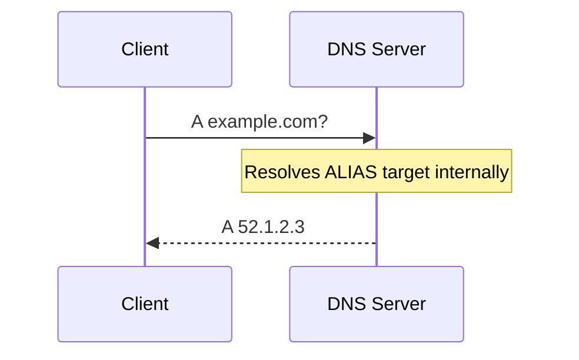

```text
    WARNING: NOT standardized. Called "ALIAS" (Route53, DNSimple),
        "ANAME" (PowerDNS, RFC draft), "CNAME flattening"
        (Cloudflare). Behavior varies by provider.

SRV RECORD
─────────────────────────────────────────────────────────────
Service discovery with port and priority.

Format: _service._protocol.name TTL IN SRV priority weight port target

    _http._tcp.example.com. 300 IN SRV 10 60 8080 web1.example.com.
    _http._tcp.example.com. 300 IN SRV 10 40 8080 web2.example.com.
    _http._tcp.example.com. 300 IN SRV 20  0 8080 backup.example.com.

    Priority 10 (lower = preferred): 60% to web1, 40% to web2
    Priority 20 (fallback): backup only if priority 10 fails

    Used by: Kubernetes services, LDAP, SIP, XMPP, MongoDB

CAA RECORD (Certificate Authority Authorization)
─────────────────────────────────────────────────────────────
Controls which CAs can issue certificates for your domain.

    example.com.  300  IN  CAA  0  issue  "letsencrypt.org"
    example.com.  300  IN  CAA  0  issuewild  "letsencrypt.org"
    example.com.  300  IN  CAA  0  iodef  "mailto:security@example.com"

    issue      -> Who can issue regular certs
    issuewild  -> Who can issue wildcard certs
    iodef      -> Where to report violations

    Since Sept 2017, CAs MUST check CAA before issuing.
    Missing CAA = any CA can issue (bad for security).

TXT RECORD (Verification & Policy)
─────────────────────────────────────────────────────────────
Free-form text, used heavily for verification and email auth.

    example.com. 300 IN TXT "v=spf1 include:_spf.google.com ~all"
    _dmarc.example.com. 300 IN TXT "v=DMARC1; p=reject; rua=..."
    google._domainkey.example.com. 300 IN TXT "v=DKIM1; k=rsa; p=..."

    SPF:   Which servers can send email for your domain
    DKIM:  Cryptographic email signing
    DMARC: What to do with failed SPF/DKIM checks
```

> **Pause and predict**: If a client queries an ALIAS record, what record type does the DNS server actually return?

### 1.3 DNS Hierarchy and Resolution

```text
DNS RESOLUTION — THE FULL PICTURE
═══════════════════════════════════════════════════════════════

When you type "app.example.com" in your browser:
```

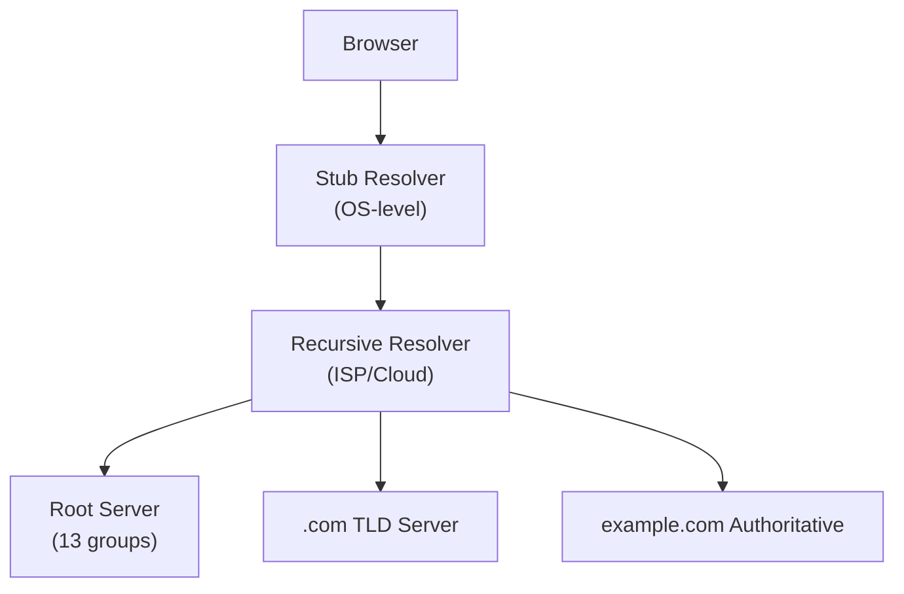

```text
Step-by-step (uncached):
    1. Browser checks its cache -> miss
    2. OS stub resolver checks /etc/hosts -> miss
    3. OS sends query to configured recursive resolver
    4. Recursive resolver asks root: "Where is .com?"
    5. Root says: "Try 192.5.6.30 (a.gtld-servers.net)"
    6. Recursive asks .com TLD: "Where is example.com?"
    7. TLD says: "Try 198.51.100.1 (ns1.example.com)"
    8. Recursive asks authoritative: "What is app.example.com?"
    9. Authoritative responds with the A record
   10. Recursive caches result, returns to client

TOTAL UNCACHED LOOKUP TIME
─────────────────────────────────────────────────────────────
    Root query:          ~5-30ms  (Anycast, nearby)
    TLD query:           ~10-50ms
    Authoritative query: ~10-200ms (depends on location)
    ──────────────────────────────────────────────
    Total:               ~25-280ms for first lookup
    Cached:              ~0-5ms for subsequent lookups
```

---

## Part 2: Anycast — The Secret Behind Fast DNS

### 2.1 Unicast vs Anycast

```text
UNICAST vs ANYCAST
═══════════════════════════════════════════════════════════════

UNICAST (Traditional)
─────────────────────────────────────────────────────────────
One IP address -> One physical server
```

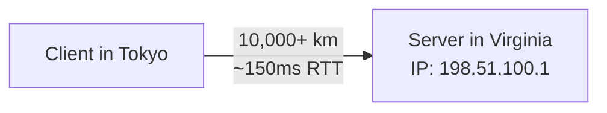

```text
    Every client goes to the same server, regardless of location.

ANYCAST
─────────────────────────────────────────────────────────────
One IP address -> Multiple physical servers
BGP routing sends each client to the nearest one.
```

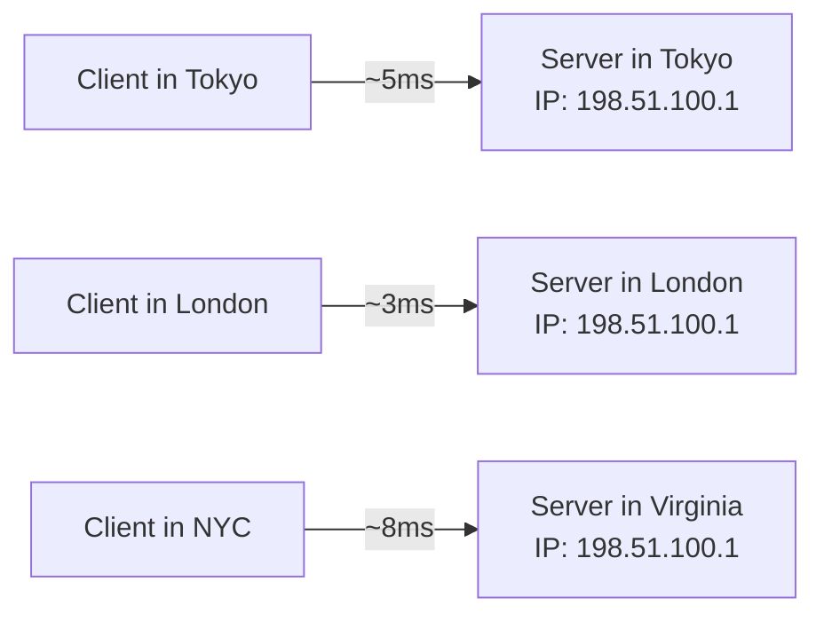

```text
    Same IP, different physical servers!

HOW ANYCAST WORKS
─────────────────────────────────────────────────────────────
Multiple servers announce the same IP prefix via BGP.
```

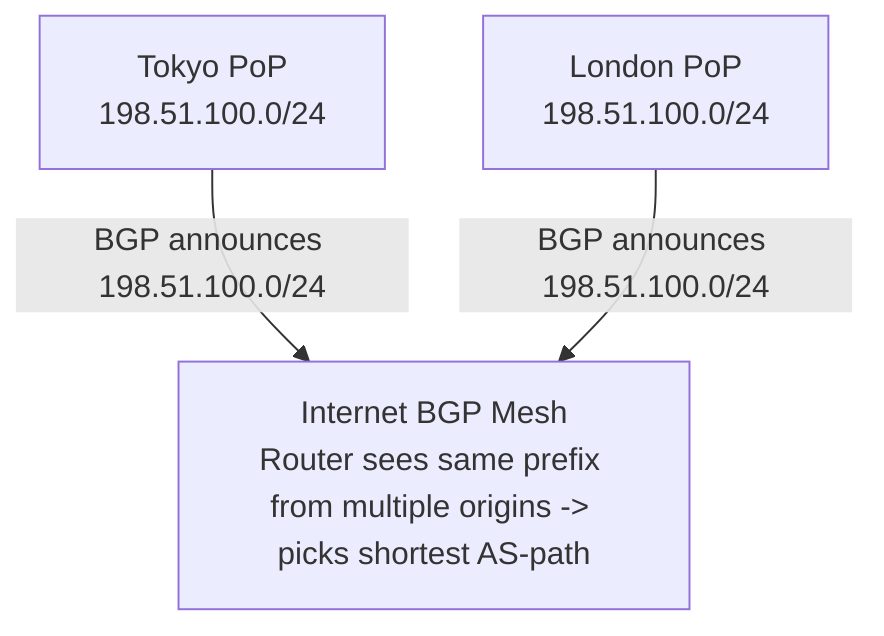

```text
WHY IT WORKS FOR DNS (AND CDN)
─────────────────────────────────────────────────────────────
    + DNS is UDP-based -> no long-lived connections
    + Each query is independent -> stateless
    + BGP convergence time (~30-90s) > DNS query time (~ms)
    + Natural DDoS absorption: attack traffic gets distributed

    WARNING: Less suitable for TCP (BGP route changes can break
       established connections). Some providers handle this
       with connection migration or short-lived flows.
```

### 2.2 Anycast in Practice

```text
ANYCAST DEPLOYMENTS — REAL NUMBERS
═══════════════════════════════════════════════════════════════

ROOT DNS SERVERS
─────────────────────────────────────────────────────────────
    13 root server "identities" (a.root-servers.net through m)
    But NOT 13 physical servers!

    Total root server instances worldwide: 1,700+
    All using Anycast to serve from nearest location.

    Example: f.root-servers.net (ISC)
    - 256+ instances across 6 continents
    - All announce same 192.5.5.241 via Anycast

CLOUDFLARE DNS (1.1.1.1)
─────────────────────────────────────────────────────────────
    330+ cities worldwide
    Average response time: <11ms globally
    All serving from the same 1.1.1.1 Anycast address

GOOGLE PUBLIC DNS (8.8.8.8)
─────────────────────────────────────────────────────────────
    Anycast across Google's global network
    ~20+ PoP locations
    Average response time: ~12ms
```

> **Stop and think**: Why is Anycast not typically recommended for stateful TCP connections over long durations?

---

## Part 3: Global Traffic Management with DNS

### 3.1 Traffic Routing Policies

```text
DNS-BASED TRAFFIC MANAGEMENT
═══════════════════════════════════════════════════════════════

Instead of returning a static IP, smart DNS returns DIFFERENT
IPs based on the client's context. This is how global load
balancing works at the DNS layer.

SIMPLE (Round Robin)
─────────────────────────────────────────────────────────────
Return all IPs, rotate the order.

    Query 1: app.example.com -> [10.0.1.1, 10.0.2.1, 10.0.3.1]
    Query 2: app.example.com -> [10.0.2.1, 10.0.3.1, 10.0.1.1]
    Query 3: app.example.com -> [10.0.3.1, 10.0.1.1, 10.0.2.1]

    Pros: Dead simple
    Cons: No health awareness, no locality, uneven distribution

WEIGHTED
─────────────────────────────────────────────────────────────
Return IPs based on configured weights.

    us-east   70%  ->  52.1.1.1    (primary, more capacity)
    eu-west   20%  ->  54.2.2.2    (secondary)
    ap-south  10%  ->  13.3.3.3    (new region, testing)

    Use cases:
    - Gradual migration (90/10 -> 80/20 -> 50/50 -> 0/100)
    - Canary deployments
    - Proportional to capacity

LATENCY-BASED
─────────────────────────────────────────────────────────────
Return the IP with lowest latency to the client.

    Client in Tokyo   -> ap-northeast-1 (13.3.3.3)   ~5ms
    Client in NYC     -> us-east-1 (52.1.1.1)         ~8ms
    Client in Berlin  -> eu-west-1 (54.2.2.2)         ~12ms

    How it works:
    1. DNS provider continuously measures latency from
       resolver locations to each endpoint
    2. Maps client's resolver IP to nearest region
    3. Returns the lowest-latency endpoint

    WARNING: EDNS Client Subnet (ECS) improves accuracy.
        Without ECS, latency is measured to the RESOLVER,
        not the actual client. A user in Tokyo using 8.8.8.8
        might get routed based on Google's resolver location.

GEOLOCATION
─────────────────────────────────────────────────────────────
Return IPs based on the client's geographic location.

    Client in Germany -> eu-central-1 (GDPR compliance!)
    Client in China   -> cn-north-1  (content compliance!)
    Client in Brazil  -> sa-east-1   (data sovereignty!)

    Use cases:
    - Regulatory compliance (data residency)
    - Content licensing (geo-restricted media)
    - Language-specific endpoints

    Hierarchy: Continent -> Country -> State -> City
    Fallback if no match: default record

GEOPROXIMITY
─────────────────────────────────────────────────────────────
Like geolocation, but with a tunable "bias" that shifts
the geographic boundary between regions.
```

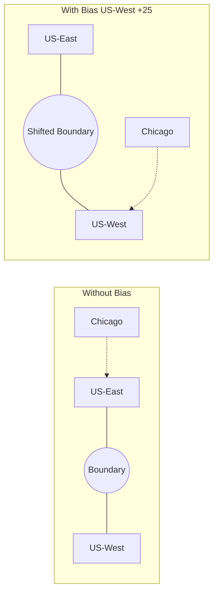

```text
FAILOVER (Active-Passive)
─────────────────────────────────────────────────────────────
Return primary IP unless health check fails, then failover.

    Normal:
        app.example.com -> 52.1.1.1 (primary, healthy)

    After primary fails health check:
        app.example.com -> 54.2.2.2 (secondary)

    Health check configuration:
        Protocol: HTTP/HTTPS/TCP
        Path: /healthz
        Interval: 10s
        Threshold: 3 consecutive failures -> failover
        Recovery: 3 consecutive successes -> failback

MULTIVALUE ANSWER
─────────────────────────────────────────────────────────────
Like round robin, but with health checks.
Returns up to 8 healthy IPs. Client picks one.

    Healthy:  [52.1.1.1 [OK], 54.2.2.2 [OK], 13.3.3.3 [OK]]
    Response: [52.1.1.1, 54.2.2.2, 13.3.3.3]

    After 54.2.2.2 fails:
    Response: [52.1.1.1, 13.3.3.3]  (only healthy IPs)
```

### 3.2 Health Checks and Failover Architecture

```text
HEALTH CHECK ARCHITECTURE
═══════════════════════════════════════════════════════════════

DNS health checks run from MULTIPLE locations to avoid
false positives from network issues.
```

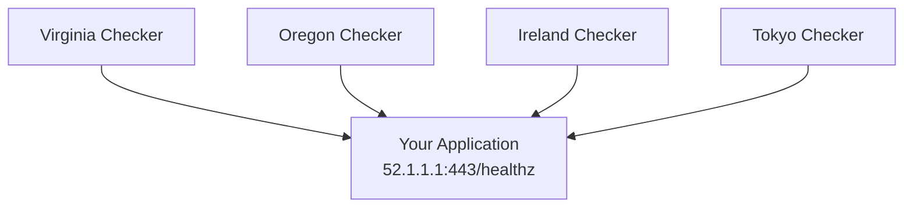

```text
    Failure determination:
    ─────────────────────────────────────────────────
    If 1/4 checkers fail   -> Network issue, ignore
    If 2/4 checkers fail   -> Possible problem
    If 3/4 checkers fail   -> Mark unhealthy, failover
    If 4/4 checkers fail   -> Definitely down

CALCULATED HEALTH CHECKS (Composite)
─────────────────────────────────────────────────────────────
```

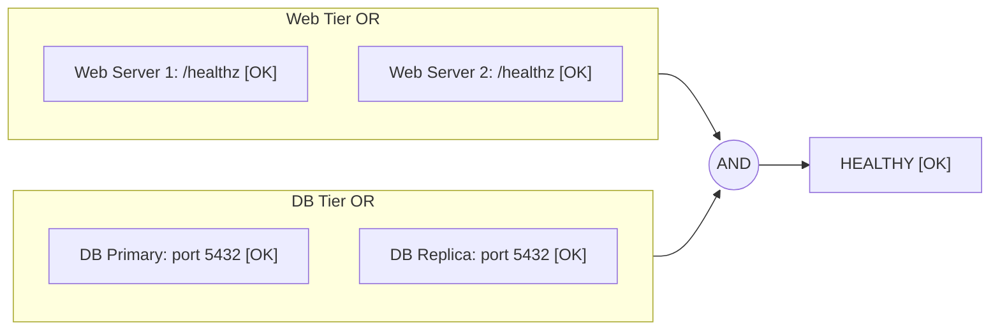

```text
    Region is healthy only if BOTH web AND database
    have at least one healthy instance.

FAILOVER TIMING BREAKDOWN
─────────────────────────────────────────────────────────────
    Health check interval:           10s
    Failure threshold:               3 checks
    Time to detect failure:          ~30s
    DNS propagation (TTL dependent): 0-60s
    Client cache expiry:             0-300s
    ─────────────────────────────────────────────────
    Worst case total:                ~6 minutes
    Best case total:                 ~30 seconds

    This is why low TTLs matter for failover!
```

---

## Part 4: TTL — The Caching Trap

### 4.1 How TTL Actually Works

```text
TTL (TIME TO LIVE) — THE MISUNDERSTOOD SETTING
═══════════════════════════════════════════════════════════════

TTL tells resolvers how long to cache a DNS response.

    app.example.com.  60  IN  A  52.1.1.1
                      ^^
                      TTL = 60 seconds

THE CACHING CHAIN
─────────────────────────────────────────────────────────────
```

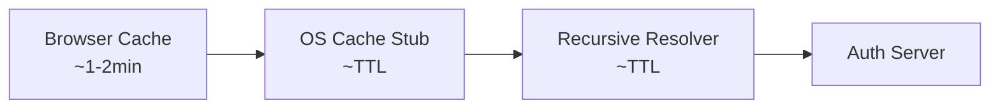

```text
Each layer can cache independently!

THE COUNTDOWN PROBLEM
─────────────────────────────────────────────────────────────

    t=0:    Auth server sets TTL=300 (5 min)
    t=0:    Recursive resolver caches with TTL=300
    t=120:  Client A queries resolver -> gets answer with TTL=180
    t=120:  Client A caches with TTL=180
    t=290:  Client B queries resolver -> gets answer with TTL=10
    t=290:  Client B caches with TTL=10

    Client A won't re-query for 3 minutes.
    Client B will re-query in 10 seconds.
    SAME answer, DIFFERENT freshness guarantees.

WHEN TTL IS IGNORED
─────────────────────────────────────────────────────────────
    Java's InetAddress:         Caches FOREVER by default!
                                (networkaddress.cache.ttl=30)
    Some ISP resolvers:         Ignore low TTLs, cache longer
    Browser DNS cache:          Chrome: ~1 minute regardless
    Corporate proxies:          May cache aggressively
    Mobile carriers:            Often ignore TTL completely
```

### 4.2 TTL Strategy Guide

```text
TTL STRATEGY BY USE CASE
═══════════════════════════════════════════════════════════════

HIGH TTL (3600-86400 seconds / 1h-24h)
─────────────────────────────────────────────────────────────
Use when: Records rarely change, performance matters most

    MX records:           86400  (mail routing rarely changes)
    SPF/DKIM/DMARC:       3600   (email auth records)
    Static infrastructure: 3600  (on-prem servers)

    + Fewer queries to authoritative servers
    + Faster resolution for end users
    - Changes take hours to propagate
    - Failover is slow

MEDIUM TTL (60-300 seconds / 1-5 min)
─────────────────────────────────────────────────────────────
Use when: Balance between performance and flexibility

    Production apps:      300  (good default)
    API endpoints:        120  (moderate change frequency)

    + Reasonable cache hit rate
    + Changes propagate within minutes
    - More queries than high TTL

LOW TTL (10-60 seconds)
─────────────────────────────────────────────────────────────
Use when: Fast failover required, frequent changes

    Active failover:      60   (1 minute max staleness)
    Blue-green deploys:   30   (fast cutover)
    During migrations:    10   (minimize risk window)

    + Fast failover
    + Rapid propagation
    - High query volume
    - Higher latency (more cache misses)
    - Higher cost (DNS queries per second pricing)

PRE-MIGRATION TTL STRATEGY
─────────────────────────────────────────────────────────────

    Day -7:  Lower TTL from 3600 to 300
             (wait for old caches to expire)
    Day -1:  Lower TTL from 300 to 60
    Day 0:   Perform migration (change IP)
    Day +1:  Verify everything works
    Day +7:  Raise TTL back to 3600

    WARNING: You must lower the TTL BEFORE the migration!
        If TTL is 3600, you need to wait 1 hour for the
        old TTL to expire before the low TTL takes effect.
```

> **Pause and predict**: If you lower the TTL from 1 hour to 1 minute right as you make a DNS change, how long will some users still see the old IP?

---

## Part 5: DNSSEC — Authenticating the Phonebook

### 5.1 The Problem DNSSEC Solves

```text
DNS CACHE POISONING ATTACK
═══════════════════════════════════════════════════════════════

Without DNSSEC, DNS responses are NOT authenticated.
An attacker can forge responses.

THE ATTACK (Kaminsky Attack, 2008)
─────────────────────────────────────────────────────────────
```

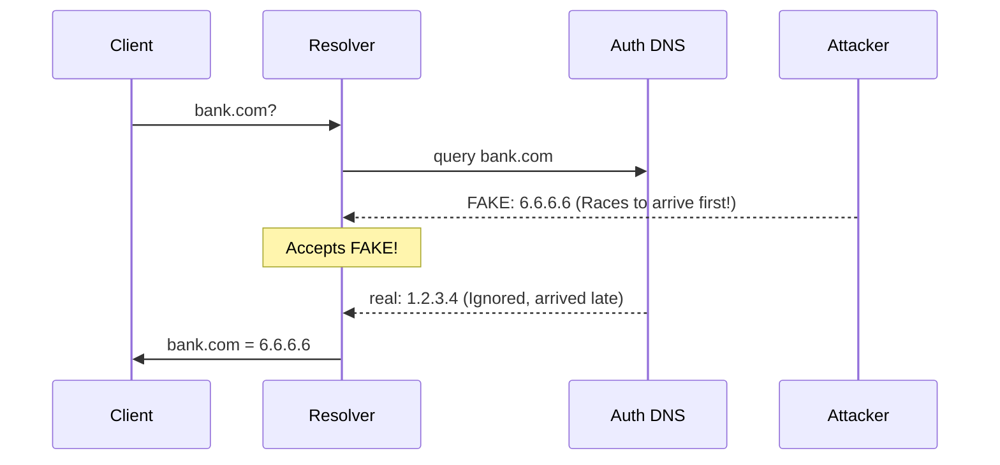

```text
    Attacker races the real response with a forged one.
    If the forged response arrives first with the right
    transaction ID, the resolver caches the FAKE answer.

    Now EVERY client using that resolver gets sent to
    the attacker's server. For bank.com. With a valid-
    looking certificate (if attacker also has a cert).

HOW DNSSEC PREVENTS THIS
─────────────────────────────────────────────────────────────

DNSSEC adds cryptographic signatures to DNS responses.

    Zone owner signs records with private key.
    Resolver verifies signatures with public key.
    Forged responses fail signature verification.

    ------------------------------------------------------
      example.com.  300  A  52.1.1.1                     
                                                           
      RRSIG:  A 13 2 300 20250101000000 20241201000000   
              12345 example.com.                           
              <base64-encoded-signature>                   
    ------------------------------------------------------

    Resolver checks: Does the RRSIG match the A record
    using example.com's DNSKEY? If yes -> trust. If no -> reject.
```

### 5.2 DNSSEC Chain of Trust

```text
DNSSEC CHAIN OF TRUST
═══════════════════════════════════════════════════════════════
```

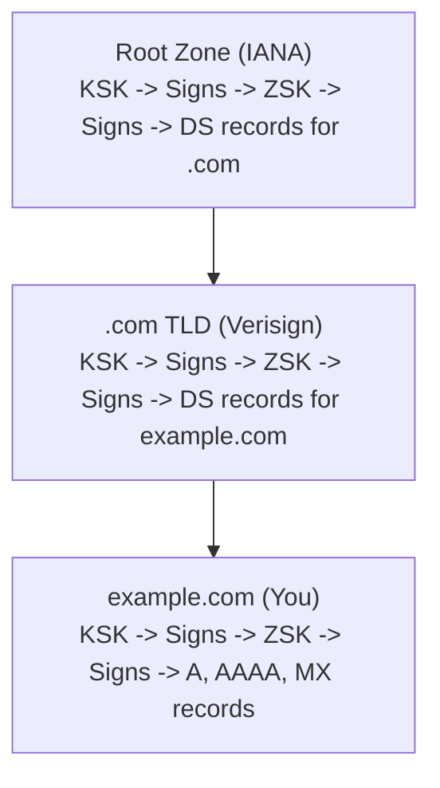

```text
KEY TYPES
─────────────────────────────────────────────────────────────
    KSK (Key Signing Key):  Signs the DNSKEY set
                             Registered as DS in parent zone
                             Rotated infrequently (yearly+)

    ZSK (Zone Signing Key):  Signs actual records
                              Rotated more frequently (monthly)

RECORD TYPES
─────────────────────────────────────────────────────────────
    DNSKEY:  Public keys for the zone
    RRSIG:   Signature over a record set
    DS:      Hash of child's KSK (in parent zone)
    NSEC/NSEC3: Proves a record does NOT exist
                (authenticated denial of existence)

DNSSEC ADOPTION (2025)
─────────────────────────────────────────────────────────────
    .com zones signed:        ~5%    (surprisingly low!)
    .gov zones signed:        ~93%   (mandated by policy)
    .nl (Netherlands):        ~58%   (highest country TLD)
    .se (Sweden):             ~52%

    Why so low?
    - Operational complexity (key rotation)
    - Risk of self-inflicted outages (expired signatures)
    - Performance overhead (larger responses)
    - HTTPS/TLS already provides endpoint authentication
    - DNS-over-HTTPS (DoH) provides channel encryption
```

> **Stop and think**: Does DNSSEC encrypt your DNS queries to prevent ISPs from seeing which websites you visit?

---

## Part 6: DNS in Kubernetes

### 6.1 CoreDNS and Cluster DNS

```text
KUBERNETES DNS ARCHITECTURE
═══════════════════════════════════════════════════════════════

Every Kubernetes cluster runs CoreDNS for internal resolution.
```

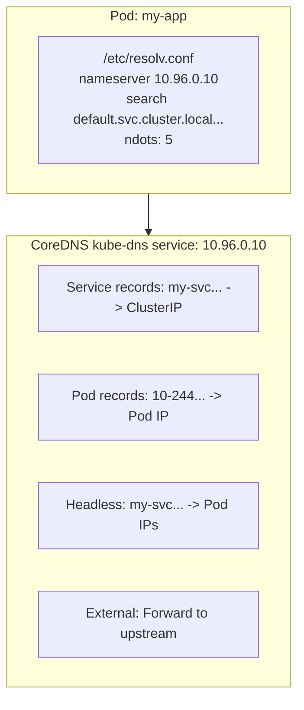

```text
THE ndots TRAP
─────────────────────────────────────────────────────────────
    ndots:5 means any name with fewer than 5 dots gets the
    search domains appended FIRST.

    Query: api.example.com (2 dots, < 5)

    Resolution order:
    1. api.example.com.default.svc.cluster.local  -> NXDOMAIN
    2. api.example.com.svc.cluster.local          -> NXDOMAIN
    3. api.example.com.cluster.local              -> NXDOMAIN
    4. api.example.com.                           -> SUCCESS!

    That's 3 WASTED queries for every external domain!

    Fix: Add trailing dot (api.example.com.) or lower ndots.
    In pod spec:
      dnsConfig:
        options:
          - name: ndots
            value: "2"
```

### 6.2 ExternalDNS — Bridging Cluster and Cloud DNS

```text
EXTERNALDNS
═══════════════════════════════════════════════════════════════

ExternalDNS automatically creates DNS records in cloud
providers based on Kubernetes resources.
```

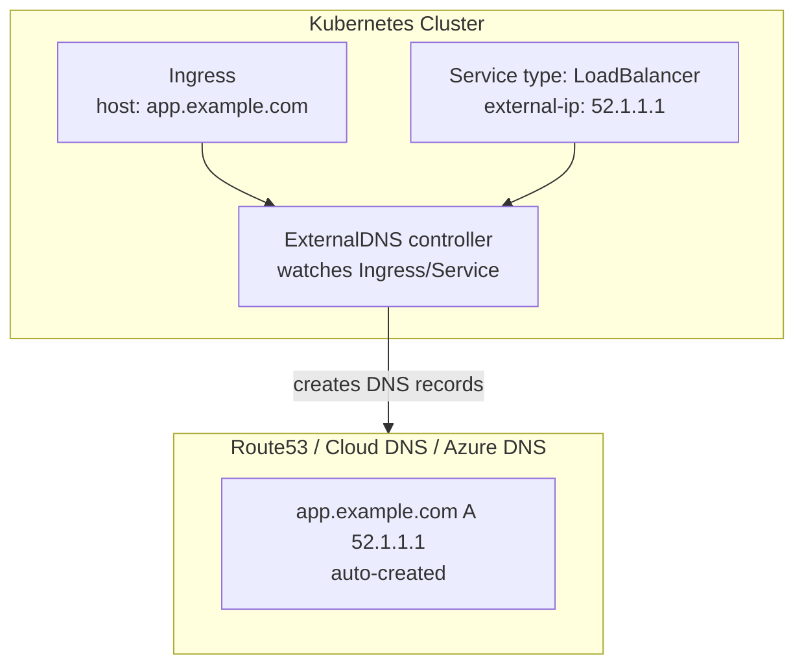

```text
    Annotations for fine-tuning:
    ─────────────────────────────────────────────────
    external-dns.alpha.kubernetes.io/hostname: app.example.com
    external-dns.alpha.kubernetes.io/ttl: "60"
    external-dns.alpha.kubernetes.io/target: 52.1.1.1
```

---

## Did You Know?

- **The entire root zone file is only about 2MB.** Despite being the foundation of the entire internet's naming system, the root zone contains just around 1,500 TLD delegations. It is signed with DNSSEC and updated roughly twice daily by IANA.

- **A single DNS query can trigger up to 23 separate lookups internally.** Between CNAME chains, DNAME redirections, and DNSSEC validation (fetching DNSKEY, DS, and RRSIG records at each level), what looks like one query can cascade into a complex resolution tree. This is why recursive resolvers are some of the most heavily optimized software on the internet.

- **Cloudflare's 1.1.1.1 resolver was almost never usable.** The IP address 1.1.1.1 was historically "squatted" by many networks that used it as a dummy or test address internally. When Cloudflare launched their resolver in April 2018, they spent months working with networks worldwide to stop hijacking traffic destined for 1.1.1.1. Some corporate networks still inadvertently block it today.

---

## Common Mistakes

| Mistake | Problem | Solution |
|---------|---------|----------|
| Using CNAME at zone apex | Violates RFC, breaks MX/TXT records | Use ALIAS/ANAME record or A record |
| TTL too high during migration | Users stuck on old IP for hours | Lower TTL days before migration |
| Ignoring Java DNS caching | JVM caches DNS forever by default | Set `networkaddress.cache.ttl=30` |
| No health checks on DNS failover | Traffic routed to dead endpoints | Always pair DNS routing with health checks |
| Kubernetes ndots:5 with external calls | 3-4x DNS queries for external domains | Lower ndots to 2 or use FQDN with trailing dot |
| Not monitoring DNS resolution time | Silent latency added to every request | Track DNS resolution time in application metrics |
| DNSSEC without automation | Expired signatures cause total outage | Use managed DNSSEC or automated key rotation |
| Single DNS provider | Provider outage = complete domain blackout | Use multi-provider DNS (NS records from 2+ providers) |

---

## Quiz

1. **Scenario: You are migrating your company's main website (example.com) to a new cloud load balancer that provides a dynamically changing IP address. Your cloud provider gives you the target `lb-123.cloud.com`. You attempt to create a CNAME record for example.com pointing to `lb-123.cloud.com`, but your DNS provider rejects it. Why did this happen, and what specific alternatives can you implement to achieve this routing?**
   <details>
   <summary>Answer</summary>

   Your DNS provider rejected the configuration because RFC 1034 strictly forbids a CNAME record from coexisting with any other record type at the same hostname. Since the zone apex (example.com) inherently requires SOA and NS records to function, adding a CNAME there creates an invalid DNS state. To solve this, you can use provider-specific solutions like an ALIAS or ANAME record, which allows the DNS server to resolve the target internally and return an A record to the client. Alternatively, Cloudflare's CNAME flattening achieves a similar result by returning the resolved IPs directly. If dynamic IP changes are rare, you could also manually configure static A records pointing to the load balancer, though this lacks automated failover.
   </details>

2. **Scenario: Your global DNS infrastructure currently routes all traffic to a single datacenter in Virginia using Unicast. You are tasked with improving resolution latency for European and Asian users without giving them different DNS server IPs. You decide to implement Anycast. How will Anycast achieve this, and why would you hesitate to use this same Anycast IP for a long-running database replication TCP connection?**
   <details>
   <summary>Answer</summary>

   Anycast achieves global low latency by assigning the exact same IP address to multiple DNS servers across different geographic regions. Each server announces this identical IP prefix via BGP, causing internet routers to automatically direct a user's DNS query to the physically closest server based on the shortest network path. This works flawlessly for DNS because UDP queries are stateless and typically resolved in a single request-response cycle. However, using Anycast for long-running TCP connections is risky because TCP is stateful and bound to a specific server. If internet BGP routes shift mid-connection, subsequent packets might be routed to a different Anycast node that has no knowledge of the session, abruptly terminating the connection.
   </details>

3. **Scenario: You are planning a critical database migration on Saturday night that requires changing the IP address of your primary API endpoint (`api.company.com`). The current A record has a TTL of 3600 seconds (1 hour). Outline the exact timeline and steps you must take to ensure the failover happens within 60 seconds for all users during the maintenance window.**
   <details>
   <summary>Answer</summary>

   To achieve a fast failover, you must proactively reduce the TTL well before the migration begins because clients will cache the old TTL value. Several days prior (e.g., Wednesday), you should lower the TTL from 3600 seconds to 300 seconds, and then down to 60 seconds at least an hour before the maintenance window on Saturday. This wait ensures that any long-lived DNS caches have fully expired and clients are now respecting the new 60-second TTL. On Saturday night, you can safely update the IP address, knowing that resolvers will query for the new IP within one minute. Finally, after the migration is confirmed stable, you should restore the TTL to 3600 seconds to reduce the load on your authoritative servers and improve average query latency.
   </details>

4. **Scenario: You deploy a new microservice in your Kubernetes cluster that makes thousands of API requests per second to an external payment gateway (`api.stripe.com`). During load testing, you notice unexpectedly high latency and massive CPU spikes on your cluster's CoreDNS pods. You discover the issue is related to the default `ndots: 5` setting. Why does this setting cause the problem, and how can you modify the pod's configuration to fix it?**
   <details>
   <summary>Answer</summary>

   The high latency and CoreDNS load occur because the default `ndots: 5` setting forces Kubernetes to treat any domain with fewer than five dots as a relative hostname. Consequently, for a domain like `api.stripe.com` (which only has two dots), the resolver first appends multiple cluster search domains, sequentially querying `api.stripe.com.default.svc.cluster.local`, then `.svc.cluster.local`, and so on. These guaranteed NXDOMAIN failures waste significant time and multiply the query volume hitting CoreDNS by a factor of three or four. You can resolve this by adding a trailing dot to the domain in your application code (`api.stripe.com.`) to explicitly mark it as absolute. Alternatively, you can override the `dnsConfig` in the pod spec to set `ndots` to a lower value like `2`, preventing the search domain expansion for most external hostnames.
   </details>

5. **Scenario: You are designing a global architecture for a healthcare application deployed in `us-east-1` and `eu-west-1`. To comply with data sovereignty laws, European users must absolutely connect to `eu-west-1`. However, if `eu-west-1` experiences a complete outage, the business prefers to route European users to `us-east-1` rather than showing an offline error, assuming legal teams have approved emergency cross-border data transfers. How do you configure the DNS routing policies to achieve this behavior?**
   <details>
   <summary>Answer</summary>

   You must implement a multi-layered DNS configuration combining geolocation routing with health-checked failover policies. First, you configure a geolocation rule that directs all European traffic to the `eu-west-1` endpoint, while a default rule directs all other global traffic to `us-east-1`. For the European geolocation rule, you attach a failover policy where the primary record points to `eu-west-1` and the secondary record points to `us-east-1`. Crucially, you must associate strict health checks with the primary `eu-west-1` endpoint so that DNS servers can dynamically detect an outage. If the health checks fail consistently, the DNS provider will automatically begin returning the `us-east-1` IP to European users until the primary region recovers.
   </details>

6. **Scenario: You are proposing security upgrades for your company's infrastructure. A junior engineer suggests enabling DNSSEC on your primary `.com` domain to prevent cache poisoning attacks, noting that it has been available for over a decade. However, your lead SRE strongly pushes back, arguing the operational risks currently outweigh the benefits. What are the key operational risks and industry factors that explain the lead SRE's hesitation and the generally low adoption of DNSSEC?**
   <details>
   <summary>Answer</summary>

   The lead SRE is likely concerned because DNSSEC introduces significant operational complexity, primarily around cryptographic key rotation and management. If an automated Key Signing Key (KSK) rollover fails or a signature expires, validating resolvers will reject the domain entirely, resulting in a catastrophic, self-inflicted outage. Furthermore, the perceived value of DNSSEC has diminished because ubiquitous HTTPS and TLS already provide robust endpoint authentication, meaning an attacker spoofing DNS still cannot present a valid certificate. Finally, DNSSEC responses are substantially larger and require more processing overhead, while newer protocols like DNS-over-HTTPS (DoH) address the privacy aspect of DNS without the fragility of the DNSSEC trust chain.
   </details>

---

## Hands-On Exercise

**Objective**: Build a latency-based DNS routing setup with health checks and failover using a simulated multi-region architecture.

**Environment**: kind cluster + CoreDNS + custom DNS server

### Part 1: Set Up the Multi-Region Simulation (20 minutes)

```bash
# Create a kind cluster using Kubernetes 1.35
cat <<'EOF' > /tmp/dns-lab-cluster.yaml
kind: Cluster
apiVersion: kind.x-k8s.io/v1alpha4
nodes:
  - role: control-plane
  - role: worker
    labels:
      region: us-east
  - role: worker
    labels:
      region: eu-west
EOF

kind create cluster --name dns-lab --config /tmp/dns-lab-cluster.yaml --image kindest/node:v1.35.0
```

### Part 2: Deploy Region-Specific Applications (15 minutes)

```bash
# Deploy "us-east" application
cat <<'EOF' | kubectl apply -f -
apiVersion: apps/v1
kind: Deployment
metadata:
  name: app-us-east
  labels:
    app: webapp
    region: us-east
spec:
  replicas: 2
  selector:
    matchLabels:
      app: webapp
      region: us-east
  template:
    metadata:
      labels:
        app: webapp
        region: us-east
    spec:
      nodeSelector:
        region: us-east
      containers:
        - name: web
          image: nginx:1.27
          ports:
            - containerPort: 80
          readinessProbe:
            httpGet:
              path: /
              port: 80
            initialDelaySeconds: 3
            periodSeconds: 5
          volumeMounts:
            - name: html
              mountPath: /usr/share/nginx/html
      volumes:
        - name: html
          configMap:
            name: us-east-html
---
apiVersion: v1
kind: ConfigMap
metadata:
  name: us-east-html
data:
  index.html: |
    <h1>Region: us-east-1</h1>
    <p>Latency: ~10ms from East Coast</p>
  healthz: "OK"
---
apiVersion: v1
kind: Service
metadata:
  name: app-us-east
  labels:
    region: us-east
spec:
  selector:
    app: webapp
    region: us-east
  ports:
    - port: 80
      targetPort: 80
  type: ClusterIP
EOF

# Deploy "eu-west" application
cat <<'EOF' | kubectl apply -f -
apiVersion: apps/v1
kind: Deployment
metadata:
  name: app-eu-west
  labels:
    app: webapp
    region: eu-west
spec:
  replicas: 2
  selector:
    matchLabels:
      app: webapp
      region: eu-west
  template:
    metadata:
      labels:
        app: webapp
        region: eu-west
    spec:
      nodeSelector:
        region: eu-west
      containers:
        - name: web
          image: nginx:1.27
          ports:
            - containerPort: 80
          readinessProbe:
            httpGet:
              path: /
              port: 80
            initialDelaySeconds: 3
            periodSeconds: 5
          volumeMounts:
            - name: html
              mountPath: /usr/share/nginx/html
      volumes:
        - name: html
          configMap:
            name: eu-west-html
---
apiVersion: v1
kind: ConfigMap
metadata:
  name: eu-west-html
data:
  index.html: |
    <h1>Region: eu-west-1</h1>
    <p>Latency: ~15ms from Western Europe</p>
  healthz: "OK"
---
apiVersion: v1
kind: Service
metadata:
  name: app-eu-west
  labels:
    region: eu-west
spec:
  selector:
    app: webapp
    region: eu-west
  ports:
    - port: 80
      targetPort: 80
  type: ClusterIP
EOF
```

### Part 3: Deploy a Custom DNS Router (25 minutes)

```bash
# Deploy a CoreDNS instance acting as a "global traffic manager"
cat <<'EOF' | kubectl apply -f -
apiVersion: v1
kind: ConfigMap
metadata:
  name: dns-router-config
data:
  Corefile: |
    app.lab.local:5353 {
        log
        health :8080

        # Respond with different IPs based on query metadata
        # In production this would use geolocation/latency data
        template IN A app.lab.local {
            answer "app.lab.local. 60 IN A {%s}"
        }

        # Forward everything else to cluster DNS
        forward . /etc/resolv.conf
    }

    .:5353 {
        forward . /etc/resolv.conf
        log
    }
---
apiVersion: apps/v1
kind: Deployment
metadata:
  name: dns-router
spec:
  replicas: 1
  selector:
    matchLabels:
      app: dns-router
  template:
    metadata:
      labels:
        app: dns-router
    spec:
      containers:
        - name: coredns
          image: coredns/coredns:1.12.0
          args: ["-conf", "/etc/coredns/Corefile"]
          ports:
            - containerPort: 5353
              protocol: UDP
            - containerPort: 5353
              protocol: TCP
            - containerPort: 8080
              protocol: TCP
          volumeMounts:
            - name: config
              mountPath: /etc/coredns
      volumes:
        - name: config
          configMap:
            name: dns-router-config
---
apiVersion: v1
kind: Service
metadata:
  name: dns-router
spec:
  selector:
    app: dns-router
  ports:
    - port: 53
      targetPort: 5353
      protocol: UDP
      name: dns-udp
    - port: 53
      targetPort: 5353
      protocol: TCP
      name: dns-tcp
EOF
```

### Part 4: Health Check and Failover Testing (20 minutes)

```bash
# Deploy a health checker that monitors both regions
cat <<'EOF' | kubectl apply -f -
apiVersion: v1
kind: ConfigMap
metadata:
  name: health-checker-script
data:
  check.sh: |
    #!/bin/sh
    echo "=== DNS Health Checker ==="
    echo ""

    while true; do
      US_STATUS=$(wget -q -O /dev/null -T 2 http://app-us-east/healthz 2>&1 && echo "HEALTHY" || echo "UNHEALTHY")
      EU_STATUS=$(wget -q -O /dev/null -T 2 http://app-eu-west/healthz 2>&1 && echo "HEALTHY" || echo "UNHEALTHY")

      TIMESTAMP=$(date '+%H:%M:%S')
      echo "[$TIMESTAMP] us-east: $US_STATUS | eu-west: $EU_STATUS"

      if [ "$US_STATUS" = "UNHEALTHY" ] && [ "$EU_STATUS" = "UNHEALTHY" ]; then
        echo "  WARNING: BOTH REGIONS DOWN - no healthy endpoints!"
      elif [ "$US_STATUS" = "UNHEALTHY" ]; then
        echo "  -> Failover: routing all traffic to eu-west"
      elif [ "$EU_STATUS" = "UNHEALTHY" ]; then
        echo "  -> Failover: routing all traffic to us-east"
      else
        echo "  -> Normal: latency-based routing active"
      fi

      sleep 5
    done
---
apiVersion: v1
kind: Pod
metadata:
  name: health-checker
spec:
  containers:
    - name: checker
      image: busybox:1.37
      command: ["/bin/sh", "/scripts/check.sh"]
      volumeMounts:
        - name: scripts
          mountPath: /scripts
  volumes:
    - name: scripts
      configMap:
        name: health-checker-script
        defaultMode: 0755
EOF

# Watch health check output
kubectl logs -f health-checker
```

### Part 5: Simulate Region Failure (15 minutes)

```bash
# Simulate us-east failure by scaling to 0
echo "--- Simulating us-east failure ---"
kubectl scale deployment app-us-east --replicas=0

# Watch the health checker detect the failure
kubectl logs -f health-checker --tail=10

# Verify eu-west is still serving
kubectl exec -it health-checker -- wget -qO- http://app-eu-west/

# Restore us-east
echo "--- Restoring us-east ---"
kubectl scale deployment app-us-east --replicas=2

# Watch recovery
kubectl logs -f health-checker --tail=10
```

### Part 6: Examine DNS Resolution Behavior (15 minutes)

```bash
# Launch a debug pod
kubectl run dns-debug --image=busybox:1.37 --rm -it -- sh

# Inside the pod, examine DNS configuration
cat /etc/resolv.conf

# Observe the ndots problem
# Count queries for an external domain
nslookup -debug api.example.com 2>&1 | head -30

# Compare with FQDN (trailing dot)
nslookup api.example.com. 2>&1 | head -10

# Test resolution timing
time nslookup kubernetes.default.svc.cluster.local
time nslookup google.com
time nslookup google.com.   # With trailing dot - faster!
```

### Clean Up

```bash
kind delete cluster --name dns-lab
```

**Success Criteria**:
- [ ] Deployed region-specific applications on labeled nodes
- [ ] Health checker correctly detects regional health status
- [ ] Observed failover behavior when scaling a region to zero
- [ ] Verified recovery when the region comes back
- [ ] Examined the ndots:5 behavior and tested FQDN optimization
- [ ] Understood the difference between DNS routing policies

---

## Further Reading

- **"DNS and BIND" (5th Edition)** — Cricket Liu & Paul Albitz. The definitive reference for DNS internals and configuration.

- **RFC 8499: DNS Terminology** — The official glossary of DNS terms, clarifying decades of ambiguity.

- **"The Anatomy of the Dyn DDoS Attack"** — Dyn's own post-mortem of the October 2016 attack, detailing how Anycast both helped and complicated recovery.

- **Cloudflare Learning Center: DNS** — Excellent free resource with interactive diagrams explaining DNS concepts from basics to advanced.

---

## Key Takeaways

Before moving on, ensure you understand:

- [ ] **ALIAS/ANAME solve the apex CNAME problem** by resolving at the DNS server level, returning A records to clients
- [ ] **Anycast assigns one IP to many servers** using BGP, routing clients to the nearest node. Ideal for stateless protocols like DNS
- [ ] **Traffic policies go beyond round robin**: Weighted, latency-based, geolocation, and failover policies turn DNS into a global traffic manager
- [ ] **Health checks are mandatory for DNS-based failover**: Without them, DNS happily routes traffic to dead servers
- [ ] **TTL is a promise that is frequently broken**: Browsers, JVMs, ISPs, and mobile carriers all cache DNS differently. Pre-migration TTL lowering is essential
- [ ] **DNSSEC authenticates but doesn't encrypt**: It prevents cache poisoning but does not hide your queries. DoH/DoT handle encryption
- [ ] **Kubernetes ndots:5 multiplies external DNS queries**: Use trailing dots or lower ndots for applications making many external calls
- [ ] **ExternalDNS bridges cluster and cloud DNS**: Automatically manages DNS records based on Kubernetes Ingress and Service resources

---

## Next Module

[Module 1.2: CDN & Edge Computing](../module-1.2-cdn-edge/) — How content delivery networks minimize latency by caching at the edge, and how edge compute is changing application architecture.