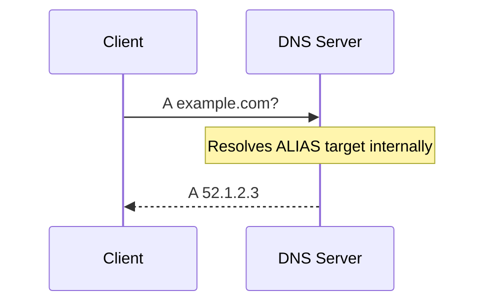
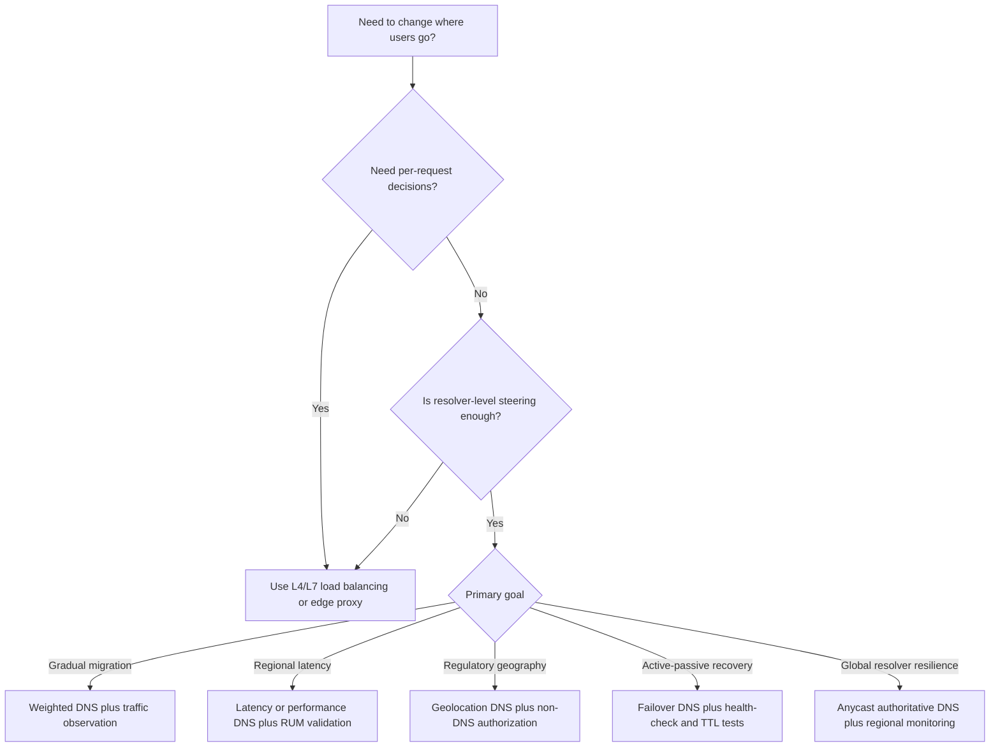

> **Complexity**: `[COMPLEX]`
>
> **Time to Complete**: 3 hours
>
> **Prerequisites**: Basic DNS (A/AAAA/CNAME records), Kubernetes Ingress concepts
>
> **Track**: Foundations — Advanced Networking

## What You'll Be Able to Do

After completing this module, you will be able to:

1. **Design** DNS architectures for global traffic management using weighted routing, geolocation policies, Anycast, and health-checked failover
2. **Diagnose** DNS resolution failures by tracing queries through recursive resolvers, authoritative servers, positive caches, and negative caches
3. **Compare** advanced DNS record types such as ALIAS/ANAME, CAA, SRV, TXT, and PTR against simpler A, AAAA, and CNAME patterns
4. **Secure** DNS answers with DNSSEC's chain of trust while explaining what DoH, DoT, and split-horizon DNS protect instead
5. **Operate** TTL changes, DNS traffic-management policies, and health checks without creating stale-answer migration traps

---

## Why This Module Matters

On October 21, 2016, the Mirai botnet unleashed a major DDoS attack against Dyn's managed DNS infrastructure. Traffic from compromised IoT devices disrupted name resolution for widely used services including Twitter, Reddit, GitHub, Spotify, and others. The attack was devastating not because those application servers all failed at once, but because **DNS is the single most critical piece of internet infrastructure that almost everyone takes for granted**.

For affected users, the experience looked like the internet itself had gone dark. Not because every origin server was down, but because clients could not reliably look up the IP addresses they needed. **It was like erasing every phone number from every phone book simultaneously.**

The Dyn attack exposed what infrastructure engineers already knew: DNS is the first thing that happens in every connection and the last thing anyone thinks about until it breaks. This module teaches you to think about DNS the way the engineers who keep the internet running do — as a globally distributed, latency-sensitive, security-critical system that demands deliberate architecture.

Every new connection to a hostname depends on DNS — though resolver and OS caching, plus TCP connection reuse, can skip the lookup when a fresh answer is already known. Before TLS handshakes, before HTTP requests, before any application logic on a new connection — the client must resolve the hostname to an IP address. If that resolution is slow, everything is slow. If it fails, nothing works.

At scale, DNS stops being a simple lookup table and becomes a global traffic management system. It decides which datacenter serves your users. It detects failures and reroutes traffic. It balances load across continents. It enforces security policies before a single packet reaches your infrastructure.

Yet most engineers treat DNS as "set it and forget it." They paste records into a web UI and wonder why their global application has mysterious latency spikes for users in certain regions, or why failover takes 20 minutes instead of 20 seconds.

The durable ideas in this module are the ones that survive provider churn: record semantics, recursive and authoritative caching, DNSSEC validation, Anycast routing, health-checked answers, and the policy choices that decide which endpoint a resolver receives. Product names appear only as examples because the names, limits, and feature packaging change far faster than the underlying DNS principles.

> **The Air Traffic Control Analogy**
>
> Think of DNS like air traffic control. Every plane (request) needs to be told which runway (server) to land on. Good ATC considers weather (server health), fuel levels (client proximity), runway capacity (server load), and traffic patterns (routing policies). Bad ATC just assigns runways randomly and hopes for the best. DNS at scale is your application's ATC system.

---

## Part 1: Beyond Basic DNS Records

The first step in DNS design is recognizing that record types are not labels for the same kind of data. They are small contracts between authoritative servers, recursive resolvers, clients, certificate authorities, mail receivers, and operational tooling. When you choose the wrong record type, you are not just making a naming mistake; you are changing what other systems are allowed to infer.

### 1.1 The Record Types You Already Know

```text
BASIC DNS RECORDS — QUICK REVIEW
═══════════════════════════════════════════════════════════════

A RECORD
─────────────────────────────────────────────────────────────
Maps hostname -> IPv4 address

    app.example.com.   300   IN   A   203.0.113.10

AAAA RECORD
─────────────────────────────────────────────────────────────
Maps hostname -> IPv6 address

    app.example.com.   300   IN   AAAA   2001:db8::1

CNAME RECORD
─────────────────────────────────────────────────────────────
Maps hostname -> another hostname (alias)

    www.example.com.   300   IN   CNAME   app.example.com.

    WARNING: LIMITATION: CNAME cannot coexist with other records
        at the same name (RFC 1034). This means you CANNOT
        put a CNAME at the zone apex (example.com).

MX RECORD
─────────────────────────────────────────────────────────────
Maps hostname -> mail server (with priority)

    example.com.   300   IN   MX   10   mail.example.com.
    example.com.   300   IN   MX   20   backup.example.com.
```

A and AAAA records are intentionally blunt instruments: a name maps to an address, and the rest of the routing decision happens somewhere else. CNAME records are more expressive because they make one name an alias for another name, but RFC 1034's rule that a CNAME cannot coexist with other data at the same owner name is what blocks a standards-compliant CNAME at the zone apex. The apex already needs SOA and NS records, so it cannot also be a pure alias.

That apex rule is the root of many cloud-era surprises. A provider-managed load balancer often exposes a hostname whose backing addresses change as the provider replaces nodes, expands regions, or rotates infrastructure. A learner naturally wants `example.com` to point at that hostname, but the standards-compliant DNS data model says the apex must keep its authoritative zone records there too.

### 1.2 Advanced Record Types for Scale

```text
ADVANCED DNS RECORDS
═══════════════════════════════════════════════════════════════

ALIAS / ANAME RECORD (Provider-Specific)
─────────────────────────────────────────────────────────────
Solves the "CNAME at zone apex" problem.

Problem:
    example.com.   CNAME   lb.cloud.com.    <- ILLEGAL per RFC
    example.com.   A       ???              <- Need dynamic IP

Solution: ALIAS/ANAME resolves at the DNS server level

    example.com.   ALIAS   lb.us-east-1.elb.amazonaws.com.

How it works:
    1. Client queries: example.com A?
    2. DNS server resolves lb.us-east-1.elb.amazonaws.com -> 52.1.2.3
    3. DNS server returns: example.com A 52.1.2.3
```


```mermaid
sequenceDiagram
    participant Client
    participant DNS Server
    Client->>DNS Server: A example.com?
    Note over DNS Server: Resolves ALIAS target internally
    DNS Server-->>Client: A 52.1.2.3
```

```text
    WARNING: NOT standardized. Called "ALIAS" (Route53, DNSimple),
        "ANAME" (PowerDNS, RFC draft), "CNAME flattening"
        (Cloudflare). Behavior varies by provider.

SRV RECORD
─────────────────────────────────────────────────────────────
Service discovery with port and priority.

Format: _service._protocol.name TTL IN SRV priority weight port target

    _http._tcp.example.com. 300 IN SRV 10 60 8080 web1.example.com.
    _http._tcp.example.com. 300 IN SRV 10 40 8080 web2.example.com.
    _http._tcp.example.com. 300 IN SRV 20  0 8080 backup.example.com.

    Priority 10 (lower = preferred): when both are healthy, web1 is
        chosen first ~60% of the time and web2 ~40% (RFC 2782 weight
        is selection-order probability among same-priority targets,
        not a guaranteed traffic split — unlike provider weighted-routing
        policies, which do steer resolver traffic)
    Priority 20 (fallback): backup only if all priority-10 targets fail

    Used by: headless Kubernetes services (named ports such as
        _port._proto.service.ns.svc.cluster.local), LDAP, SIP, XMPP

CAA RECORD (Certificate Authority Authorization)
─────────────────────────────────────────────────────────────
Controls which CAs can issue certificates for your domain.

    example.com.  300  IN  CAA  0  issue  "letsencrypt.org"
    example.com.  300  IN  CAA  0  issuewild  "letsencrypt.org"
    example.com.  300  IN  CAA  0  iodef  "mailto:security@example.com"

    issue      -> Who can issue regular certs
    issuewild  -> Who can issue wildcard certs
    iodef      -> Where to report violations

    Since Sept 2017, CAs MUST check CAA before issuing.
    Missing CAA = any CA can issue (bad for security).

TXT RECORD (Verification & Policy)
─────────────────────────────────────────────────────────────
Free-form text, used heavily for verification and email auth.

    example.com. 300 IN TXT "v=spf1 include:_spf.google.com ~all"
    _dmarc.example.com. 300 IN TXT "v=DMARC1; p=reject; rua=..."
    google._domainkey.example.com. 300 IN TXT "v=DKIM1; k=rsa; p=..."

    SPF:   Which servers can send email for your domain
    DKIM:  Cryptographic email signing
    DMARC: What to do with failed SPF/DKIM checks
```

> **Pause and predict**: If a client queries an ALIAS record, what record type does it ultimately receive? The client normally receives ordinary A or AAAA answers, because the authoritative provider performs the target lookup internally and returns address records rather than exposing a standards-track ALIAS record on the wire.

ALIAS, ANAME, and CNAME flattening are implementation patterns rather than one portable IETF record type. The durable idea is not the name of the feature; it is server-side indirection at answer time. The authoritative provider follows the target, converts the target's current addresses into apex-safe A or AAAA responses, and takes responsibility for refreshing those addresses often enough that the apex does not drift behind the target.

SRV records solve a different problem: service discovery needs more than an address. A client that understands SRV can discover the target host, port, priority, and relative weight for a service such as LDAP, SIP, XMPP, or a database driver that explicitly implements SRV lookup. This is useful when the protocol expects it, but it is not a universal web answer because ordinary browsers do not use SRV to decide where `https://example.com` should connect.

CAA records make DNS part of certificate issuance control. A public certificate authority checks CAA data before issuing, and the record tells it which authorities are authorized for regular or wildcard certificates and where policy violations can be reported. CAA does not replace certificate transparency monitoring or private-key hygiene, but it reduces the blast radius of a mistaken or unauthorized issuance path.

TXT records are the overloaded toolbox of DNS. SPF, DKIM, and DMARC use TXT records to publish mail-sending policy and cryptographic verification material, while many SaaS tools use TXT records to prove domain control. The operational risk is that "just add this TXT string" can turn into a pile of overlapping policy records unless ownership, review, and removal are treated as part of the DNS change process.

PTR records reverse the usual lookup direction by mapping an address back to a name under the `in-addr.arpa` or `ip6.arpa` reverse trees. They matter for mail reputation, troubleshooting, and network inventory because many tools and operators use reverse DNS to interpret who owns an address. PTR records are controlled by whoever controls the address block, not necessarily whoever owns the forward domain name, which is why cloud and ISP coordination often appears in reverse-DNS runbooks.

### 1.3 Records as Contracts, Not Decorations

The easiest way to misuse advanced records is to treat them as decorative metadata. In reality, each record type is consumed by a different class of software with different failure behavior. A browser ignores your SRV record for a normal HTTPS site, a public CA treats your CAA record as issuance policy, a mail receiver evaluates TXT policy strings during authentication, and a resolver caches A and AAAA answers according to TTL.

At platform scale, record ownership should follow those consuming systems. The team that operates inbound mail should own SPF, DKIM, and DMARC changes because a malformed TXT policy can reject legitimate mail. The team that owns certificate automation should review CAA changes because an omitted CA can break renewal. The team that owns global ingress should review ALIAS targets because a flattened apex answer can make an external load balancer look deceptively simple.

The record-type decision also shapes observability. If a service fails behind an A record, you can query the authoritative server and inspect address answers directly. If it fails behind ALIAS flattening, you must inspect the flattened answer and the target name it follows. If it fails behind SRV, you must check whether the client actually performed SRV lookup and whether priority and weight were interpreted the way the protocol expects.

---

## Part 2: Anycast DNS and Global Resilience

Anycast is the practice of announcing the same IP prefix from multiple network locations so internet routing carries a client or resolver to a nearby reachable site. The DNS server IP looks singular, but the path to that IP is selected by BGP and the surrounding inter-domain routing system. That makes Anycast a routing technique, not a DNS record type, and the deeper BGP mechanics are covered in [Module 1.4: BGP & Core Routing](module-1.4-bgp-routing/).

The contrast with unicast is straightforward. With unicast, one IP address normally identifies one logical network location, so a resolver far away must traverse the network to that place. With Anycast, the same service address is announced from many places, so different resolvers can reach different sites while using the same configured nameserver address. This reduces lookup latency when routing converges on a nearby healthy site.

Anycast also changes failure behavior. If one site stops answering DNS but keeps announcing the route, users near that site may continue to reach a broken server. If the site withdraws the route or its upstreams stop carrying it, BGP can move affected traffic toward another announcing site. The hard part is coupling DNS health, routing health, and operational automation so a bad node disappears without causing route flapping.

The DDoS value comes from distribution. A volumetric flood aimed at an Anycasted authoritative nameserver address can be absorbed across many network edges instead of concentrating on one datacenter. That does not make the attack harmless, and it does not replace filtering, capacity planning, or upstream coordination, but it gives defenders more places to shed malicious traffic before legitimate resolvers lose all paths.

Anycast has a hidden diagnostic cost. Two engineers can query the same nameserver IP from two networks and reach different physical sites, which means one "works for me" result may not represent the whole internet. Serious DNS operations therefore check from multiple vantage points, record which Anycast site served a response when possible, and alert on regional symptoms rather than only global success averages.

The safest mental model is that DNS Anycast improves reachability when the service is consistently configured everywhere. It becomes dangerous when different sites serve inconsistent zones, stale signing keys, or divergent health-check decisions. Anycast gets the query to a close door; it does not guarantee every door has the same answer behind it.

---

## Landscape Snapshot

> **Landscape snapshot — as of 2026-06. This changes fast; verify against vendor docs before relying on specifics.**
>
> The table maps durable DNS traffic-management capabilities to example product language. Treat these cells as a translation aid, not a ranking or endorsement, because feature packaging, limits, and names change faster than the principles.

| Durable capability | AWS Route 53 example | Google Cloud DNS example | Azure example | Cloudflare example |
|---|---|---|---|---|
| Weighted steering | Weighted routing policy | Weighted round robin routing policy | Traffic Manager weighted routing | Load Balancing steering policies with weighted pools |
| Latency or performance steering | Latency routing policy | Usually paired with load balancing or geography-aware design | Traffic Manager performance routing | Dynamic or proximity steering |
| Geographic steering | Geolocation and geoproximity routing | Geolocation routing policy | Traffic Manager geographic routing | Geo steering |
| Active-passive failover | Failover routing policy with health checks | Failover routing policy with health checks | Traffic Manager priority routing with endpoint monitoring | Pool health monitors and fallback pools |
| Multiple healthy answers | Multivalue answer routing | Multiple records or policy items where supported | Multiple endpoints in a profile | Multiple healthy origins or pools |

The durable lesson behind the Rosetta table is that providers package similar ideas at different layers. One provider may express the choice directly in authoritative DNS, another may combine DNS with an application load balancer, and another may steer through an edge proxy that also terminates TLS. Before you copy a design, identify which layer owns the answer, which layer owns health, and which layer can observe the user's real path.

---

## Part 3: Traffic-Management Policies

DNS traffic management is controlled imprecision. Authoritative DNS can decide which answer to hand to a recursive resolver, but it cannot force every individual browser behind that resolver to behave like a fresh independent decision. Caches, shared resolvers, mobile networks, and client retries all blur the exact distribution, so DNS policies should be designed as steering mechanisms rather than packet-accurate load balancers.

Weighted routing is the simplest policy for gradual change. You assign relative weights to two or more answers, and the authoritative system returns them in proportions that approximate those weights over many resolver queries. This is useful for canaries, blue-green migrations, controlled regional ramp-ups, and draining an old endpoint, but it should not be used when every individual user must receive exactly the same percentage split.

Latency-based routing uses measured or inferred network performance to choose the answer that should be fastest for the resolver's location. The subtle phrase is "resolver's location" because authoritative DNS usually sees the recursive resolver, not the end user's device. EDNS Client Subnet can provide a more specific hint when resolvers send it, but privacy, resolver support, and provider behavior vary, so latency policies must be validated with real user monitoring rather than assumed from geography.

Geolocation routing maps resolver or client-subnet location to a configured answer. It is useful for jurisdictional routing, language defaults, data-residency boundaries, or sending a region to a nearby deployment that has region-specific data. It is a poor substitute for authorization because IP-derived location is approximate and because a determined user can change networks, resolvers, or proxy paths.

Geoproximity routing starts from resource locations and lets operators bias traffic toward or away from places. The durable idea is pull strength, not a particular provider term. You might bias a new region down during warm-up, bias an overloaded region away during maintenance, or widen a region's catchment when a neighboring region is unavailable.

Failover routing is active-passive steering. The authoritative service returns primary answers while health checks pass, then returns backup answers when the primary is considered unhealthy. This design is attractive because it is easy to explain, but it relies on the health check representing user-visible availability and on TTLs expiring quickly enough for cached primary answers to age out.

Multivalue-answer routing returns several healthy records, often randomized or filtered by health. It is a pragmatic pattern for simple clients that can retry another address when one connection fails. It is not the same as a load balancer because the client chooses what to do with the set, and many clients will use the first address until connection failure or local cache expiry.

Health checks are the hinge for every policy that claims to avoid broken endpoints. A TCP connect check might prove a port is open while the application is returning errors, an HTTP check might pass a shallow path while dependencies are down, and an overly strict check can remove a healthy region because a monitoring path is blocked. Good checks are boring, stable, and close to the user's critical path without depending on every optional backend.

The strongest DNS designs combine policies intentionally. Weighted routing can move a small percentage of traffic into a new region, failover can protect a primary dependency, and geolocation can keep regulated traffic inside a boundary. The trap is layering policies until nobody can predict which answer a resolver should receive, especially when each layer has separate health semantics and separate caches.

---

## Part 4: DNSSEC and the Chain of Trust

DNSSEC answers a narrow but important question: did this DNS data come from the zone owner without being modified? It does not encrypt the query, hide the name being resolved, or prove that the server behind the returned address is safe. It adds origin authentication and data integrity to DNS answers by signing record sets and giving validating resolvers a chain they can verify.

The chain begins at a trust anchor, normally the signed root. The root signs information that lets a resolver verify the top-level domain, the top-level domain publishes a DS record that points to the child zone's key, and the child zone publishes DNSKEY records and RRSIG signatures over its record sets. A validating resolver walks that chain from root to TLD to zone before treating the answer as authentic.

RRSIG records are signatures over RRsets, not over individual query transactions. DNSKEY records hold public keys for the zone, and DS records in the parent zone bind the child zone's key into the hierarchy. NSEC or NSEC3 records prove authenticated denial of existence, which is how a resolver can distinguish "this name does not exist and the zone proves it" from "an attacker removed the answer."

Validation failure is intentionally harsh. If a resolver expects a signed answer and the signatures, keys, or DS delegation do not validate, the resolver should return a failure rather than silently falling back to insecure data. That is the security value, but it is also why key rollover, registrar coordination, and zone-signing automation deserve rehearsal before production cutovers.

DNSSEC adoption remains incomplete for operational reasons more than conceptual ones. Signing a zone introduces key lifecycle work, larger responses, registrar or parent-zone coordination for DS records, and a failure mode where a stale signature can make an otherwise healthy service disappear to validating resolvers. Teams that automate certificate renewal sometimes forget that DNSSEC key rollover needs the same level of runbook maturity.

DNSSEC also does not solve confidentiality. A validating resolver can authenticate the answer, but classic DNS queries are still visible on the network path. DNS over TLS and DNS over HTTPS protect the stub-to-resolver transport by encrypting that channel, while DNSSEC protects the data's authenticity across resolver behavior. They are complementary tools for different threats.

The practical platform stance is not "turn DNSSEC on everywhere tomorrow." It is to know which zones are signed, who owns DS updates at the registrar or parent, how rollovers are rehearsed, how expiry alerts are tested, and which resolvers your users depend on. A signed zone with no rollover practice is not a security program; it is a future outage waiting for a calendar date.

---

## Part 5: TTLs, Caches, and the Migration Trap

TTL is not a freshness wish; it is a cache contract. When an authoritative server returns an answer with a TTL, recursive resolvers can reuse that answer until the TTL ages down. Clients and operating systems may also cache answers, and provider-side ALIAS flattening can add another refresh layer before the answer even reaches the recursive resolver.

The migration trap is predictable. A team plans to move `app.example.com` to a new load balancer, leaves the old answer at a long TTL, changes the record during the cutover, and then discovers that many resolvers continue serving the old address for hours. The authoritative zone is correct, dashboards show the new record, and users still hit the old endpoint because the old answer was cached before the change.

The fix is a calendar, not a command. Before a planned cutover, lower the TTL far enough in advance that old long-lived answers expire across recursive caches, wait at least the previous TTL window, make the change, verify from multiple resolvers, and only raise the TTL again after the new steady state is proven. Lowering the TTL at the same moment as the cutover helps only future answers, not the stale answers already cached.

Negative caching catches teams from the opposite direction. If a resolver asks for a name before it exists and receives an NXDOMAIN or NODATA response, RFC 2308 describes how that negative response can be cached using the SOA record's MINIMUM field (the TTL knob for NXDOMAIN and NODATA caching, often overlooked during migrations). Creating the missing record immediately afterward may not help clients whose recursive resolver is still caching the earlier "does not exist" result.

Authoritative and recursive perspectives matter during troubleshooting. The authoritative server can show what the zone would answer now, while a public recursive resolver shows what one cache is currently serving, and a client machine shows what the local stub or OS resolver sees. Good DNS incident response checks all three instead of treating one `dig` command as the whole truth.

For platform migrations, TTL choice is a risk tradeoff. Short TTLs improve steering agility and failover freshness but increase query volume and make cache behavior more visible during provider incidents. Long TTLs reduce lookup pressure and can protect against brief authoritative outages, but they slow recovery from mistakes and make planned migrations require earlier coordination.

---

## Decision Framework

Use this matrix when a DNS design discussion starts with a product feature name. First translate the feature back into the durable choice, then decide whether DNS is the right control plane at all. If the requirement needs per-request load balancing, request headers, user authentication, or application-layer retries, a load balancer or edge proxy may be the correct layer even when DNS participates in the entry path.

| Decision | Choose this when | Avoid it when | Required guardrail |
|---|---|---|---|
| Weighted DNS | You need gradual migration, canary traffic, or rough proportional steering across resolver populations | You need exact per-user percentages or sticky sessions | Observe real traffic, not only DNS answers |
| Latency or performance DNS | You have multiple regions and resolver location is a useful proxy for user experience | Users share distant resolvers or performance depends on application load | Validate with real user monitoring |
| Geolocation DNS | You need regulatory, language, or regional default routing | You need security enforcement or precise user location | Keep authorization outside DNS |
| Failover DNS | You have a clear active-passive service model and health checks represent user-visible readiness | Failover must be instant or clients cache aggressively | Lower TTL before risk windows and test health behavior |
| Anycast authoritative DNS | You need low-latency global resolution and DDoS absorption across many edges | Sites cannot serve consistent zones and signing material | Monitor by region and withdraw unhealthy sites |
| DNSSEC | You need authenticated DNS data and can operate key lifecycle safely | You lack registrar coordination, alerting, or rollover practice | Rehearse rollovers and monitor signature validity |


```mermaid
flowchart TD
    A[Need to change where users go?] --> B{Need per-request decisions?}
    B -->|Yes| C[Use L4/L7 load balancing or edge proxy]
    B -->|No| D{Is resolver-level steering enough?}
    D -->|No| C
    D -->|Yes| E{Primary goal}
    E -->|Gradual migration| F[Weighted DNS plus traffic observation]
    E -->|Regional latency| G[Latency or performance DNS plus RUM validation]
    E -->|Regulatory geography| H[Geolocation DNS plus non-DNS authorization]
    E -->|Active-passive recovery| I[Failover DNS plus health-check and TTL tests]
    E -->|Global resolver resilience| J[Anycast authoritative DNS plus regional monitoring]
```

The flowchart deliberately sends some requirements away from DNS. That is not a failure of DNS; it is architecture discipline. DNS chooses names and answers at cacheable lookup time, while load balancers and proxies make decisions at connection or request time with richer context and stronger feedback loops.

---

## Patterns & Anti-Patterns

### Patterns

**Pattern: lower TTL before planned change.** Treat TTL reduction as a scheduled precursor to a migration, not as part of the migration itself. The useful change happens when old cached answers age out, so the waiting period must be based on the previous TTL rather than the new shorter TTL you wish resolvers already had.

**Pattern: pair steering policies with user-visible health.** A DNS failover policy is only as good as the signal it trusts. Health checks should test the protocol, host header, TLS path, and dependency slice that users need, while avoiding fragile checks that fail because a monitoring source was blocked or an optional endpoint was slow.

**Pattern: separate durable zone ownership from temporary rollout control.** Core records, CAA policy, DNSSEC keys, and delegation should have conservative review, while weighted rollout values can have a faster operational path. This separation prevents urgent traffic shifts from becoming accidental authority, certificate, or signing changes.

**Pattern: test from multiple resolver vantage points.** Query the authoritative servers directly, at least two public recursive resolvers, and a network near affected users. This catches stale caches, regional Anycast differences, DNSSEC validation failures, and resolver-specific behavior that a single workstation cannot reveal.

### Anti-Patterns

**Anti-pattern: treating DNS as an instant kill switch.** DNS can help drain traffic, but cached answers mean it cannot guarantee immediate removal of a bad endpoint. If instant isolation is required, place a load balancer, firewall rule, or edge proxy control in the path where it can act on existing flows.

**Anti-pattern: using geolocation DNS as authorization.** Geography-derived DNS answers can support defaults and compliance routing, but they are not proof of user identity or legal entitlement. Authorization belongs in the application, identity layer, or policy enforcement point, with DNS acting only as one steering hint.

**Anti-pattern: enabling DNSSEC without rollover ownership.** A signed zone with unclear DS ownership and untested key rollover can fail more dramatically than an unsigned zone. The anti-pattern is not DNSSEC itself; it is adding validation-sensitive state without operational ownership, rehearsals, and expiry alerting.

**Anti-pattern: hiding all teaching in provider consoles.** Console screenshots and current product names age quickly, while record semantics, TTL behavior, resolver caching, and health-check design stay useful. Use providers as worked examples, then document the durable decision so another provider or an internal DNS platform can implement the same pattern later.

---

## Part 6: Resolver Paths, Split-Horizon DNS, and Service Discovery

A DNS answer is the end of a small distributed-system workflow, not a local database read. A stub resolver on the client asks a recursive resolver, the recursive resolver may ask root, TLD, and authoritative servers, and each layer may cache what it learns. When troubleshooting, you need to know which actor you are interrogating because the client, the recursive resolver, and the authoritative server can all be telling the truth from their own point in time.

That workflow is why `dig @authoritative.example.net app.example.com A` and `dig @1.1.1.1 app.example.com A` answer different questions. The authoritative query asks what the zone would serve now, ignoring a public recursive cache. The recursive query asks what a real resolver is currently willing to return, including cached positive answers, cached negative answers, DNSSEC validation behavior, and resolver-specific policy.

Split-horizon DNS deliberately returns different answers depending on where the query comes from or which resolver path is used. An internal resolver might return private addresses for `api.example.com`, while public authoritative DNS returns an edge address or no answer at all. This pattern is useful for private control planes, internal APIs, hybrid networks, and migrations where internal clients must use private connectivity while public users stay on the internet path.

The risk in split-horizon design is accidental ambiguity. If the same name can mean "private service" inside the network and "public service" outside it, logs, runbooks, and alerts must always record which resolver path was used. Otherwise a production incident turns into a debate where one engineer proves the public answer is correct while another proves the private answer is correct, and both are looking at legitimate but different DNS views.

Kubernetes adds another naming plane. Cluster DNS gives pods names for Services and workloads inside the cluster, while public DNS gives users names for ingress, load balancers, and edge entry points outside the cluster. Those planes should meet through explicit ingress records, external-dns automation, or platform-owned delegation, not through ad hoc copying of cluster-internal names into public zones.

DNS-based service discovery works best when clients are built to respect DNS semantics. SRV-aware clients can consume priority, weight, port, and target fields; ordinary clients can resolve A or AAAA answers and retry another address if their connection fails; some runtimes cache DNS longer than expected unless configured carefully. The platform cannot assume "DNS changed" means "every long-running process will reconnect immediately."

Service mesh discovery solves a different class of problem. A mesh sidecar or ambient proxy can observe requests, apply identity, retry at request granularity, and react to endpoint health faster than a cached DNS answer. DNS remains the universal bootstrap mechanism because nearly every client understands names, but the mesh or load balancer is often the better place for per-request policy, mutual TLS, and fine-grained failover.

The useful comparison is not DNS versus mesh as rivals. DNS is excellent for broad, cacheable, low-dependency naming decisions that must work before the application stack exists. Mesh and load-balancer control planes are excellent for rich policy once traffic reaches an environment they control. Good platform designs use DNS to get clients to the right edge or region, then use a richer traffic layer for request-level behavior.

Resolver choice also shapes privacy and correctness. A corporate resolver may apply split-horizon rules, security filtering, or logging. A public resolver may support DNSSEC validation, encrypted transport, and EDNS Client Subnet differently. A local operating system may cache aggressively or route queries through a VPN. During incidents, record the resolver address, transport, validation status, and network path before drawing conclusions from a lookup.

For observability, treat DNS as a dependency with its own golden signals. Track authoritative error rates, latency, zone serial changes, DNSSEC signature age, health-check state, answer diversity, and resolver-visible symptoms from multiple regions. Application uptime dashboards are incomplete when they start at the load balancer, because a broken delegation or stale DS record can prevent users from ever reaching that load balancer.

DNS logging needs restraint because query names can reveal user behavior, internal service names, and deployment details. Capture enough to debug resolver behavior and attack patterns, but define retention, access, and redaction rules before an incident. For public zones, aggregated query trends are usually more useful than hoarding raw client-level detail; for internal zones, names can be sensitive inventory.

Delegation is another operational boundary worth making explicit. A parent zone delegates authority to child nameservers with NS records, and DNSSEC adds DS records in the parent when the child is signed. If a platform team owns `platform.example.com` but a central infrastructure team owns `example.com`, then nameserver changes, DS updates, and emergency rollbacks require a shared runbook across both teams.

The same boundary appears with SaaS integrations. A vendor may ask for a CNAME, TXT proof, DKIM key, or CAA adjustment, but adding that record gives the vendor some degree of operational influence over a name under your domain. Good review asks what system consumes the record, how it will be removed, whether it conflicts with existing policy, and whether the record owner will still exist when renewal or rotation happens.

DNS incident drills should include boring failures before dramatic ones. Practice an expired signature, a bad CAA change, a missing reverse record, a stale negative cache, a failed health check, and a delegated child zone whose nameservers are unreachable. These drills teach the team which symptoms appear at the resolver, which appear at the authoritative server, and which appear only in application metrics after clients finally connect.

Finally, remember that DNS changes are production changes even when the edit looks tiny. A one-line TXT record can stop mail, a one-line CAA record can stop certificate renewal, a one-line DS mismatch can break validation, and a one-line low TTL can increase resolver load during an attack. The operational habit is simple: treat the zone file as code, review intent, verify from multiple resolvers, and keep rollback instructions close to the change.

Rollback planning for DNS starts before the first edit. If the old answer had a long TTL, rolling back the authoritative record may not bring back users who already cached the new answer. A useful rollback plan therefore includes the previous records, their previous TTLs, the resolver vantage points that will be checked, and the application-layer controls that can protect users while caches converge.

Change review should also separate syntax correctness from semantic correctness. A zone file can parse, an API request can succeed, and a console can display the intended record while the design still breaks renewal, routing, or validation. Reviewers should ask what consumer reads the record, what cached state already exists, what health signal controls it, and what alert will fire if the intended behavior does not appear.

For high-risk changes, make the first production test observable rather than dramatic. Create a temporary name, sign it if the parent design requires signing, attach the same policy type, and query it through the same recursive resolvers before moving the user-facing name. This does not eliminate production risk, but it turns "we hope the provider behaves this way" into "we observed this behavior on the same control plane."

The final habit is to write down the owner of each DNS layer. One team may own the registrar, another owns authoritative hosting, another owns public ingress, and another owns cluster-internal service names. Incidents slow down when nobody knows who can update DS records, who can withdraw an Anycast site, or who can approve a CAA change needed for emergency certificate replacement.

---

## Did You Know?

- **The original DNS design is split across two core RFCs**: RFC 1034 explains the concepts and facilities, while RFC 1035 describes implementation details and wire formats that still anchor modern DNS operations.
- **SRV records carry service priority, weight, port, and target**: that is why SRV-aware protocols can discover both where a service runs and which endpoint should be preferred without inventing a custom registry.
- **Negative answers can be cached too**: NXDOMAIN and NODATA responses are not always forgotten immediately, so creating a record after a failed lookup can still leave some resolvers serving the earlier absence.
- **DNSSEC and encrypted DNS protect different layers**: DNSSEC authenticates DNS data, while DNS over TLS and DNS over HTTPS encrypt the client-to-resolver transport path.

---

## Common Mistakes

| Mistake | Why It Hurts | Better Approach |
|---|---|---|
| Putting a CNAME at the zone apex | The apex must also contain SOA and NS records, and CNAME cannot coexist with other data at the same owner name | Use provider-supported ALIAS, ANAME, or flattening, and document that behavior as provider-specific |
| Lowering TTL during the cutover | Resolvers that already cached the old long TTL keep serving it until it expires | Lower TTL before the cutover, wait through the previous TTL, then change the answer |
| Treating weighted DNS as exact load balancing | Recursive resolver caches and shared resolvers skew the observed traffic split | Measure real traffic and use a load balancer when exact per-request distribution matters |
| Enabling failover with a shallow health check | A port can be open while the application path users need is broken | Probe the user-visible protocol path and test the failover decision before relying on it |
| Signing DNSSEC without ownership of DS updates | A stale or mismatched DS record can make the zone fail validation for strict resolvers | Assign registrar or parent-zone ownership and rehearse key rollovers |
| Assuming Anycast means every site gives the same answer | Anycast routes queries to different physical sites, so configuration drift can be regional | Compare answers from multiple networks and alert on regional inconsistency |
| Using geolocation DNS as a security boundary | DNS location is approximate and can be changed by resolver choice, VPNs, or proxies | Keep authorization in identity and application policy, and use DNS only for steering |

---

## Quiz

1. A team wants to move `example.com` from one managed load balancer hostname to another, but the name is the zone apex. Why is a normal CNAME the wrong design, and what should they use instead?

<details>
<summary>Answer</summary>

A normal CNAME is wrong because the apex must also hold zone records such as SOA and NS, while CNAME data cannot coexist with other data at the same owner name. To compare advanced DNS record types correctly, the team should use an apex-safe provider mechanism such as ALIAS, ANAME, or CNAME flattening, which returns A or AAAA answers to clients. They should also document that this is provider behavior, not a portable standards-track record type.

</details>

2. Users in one country report DNS failures, but your workstation and one public resolver both return healthy answers. What should you diagnose next?

<details>
<summary>Answer</summary>

You should diagnose DNS resolution from multiple vantage points, including the authoritative servers, recursive resolvers near the affected users, and validating resolvers if DNSSEC is enabled. Anycast can send the same nameserver IP to different physical DNS sites, and recursive caches can hold different positive or negative answers. A single successful lookup proves only that one path works; it does not prove global DNS resolution is healthy.

</details>

3. You are introducing a new region and want roughly one out of ten resolver decisions to receive the new address during the first hour. Which policy fits, and what measurement should you distrust?

<details>
<summary>Answer</summary>

Weighted DNS is the right starting policy for this global traffic management design because it can return the new endpoint in a small proportion of authoritative decisions. You should distrust the idea that DNS answers equal exact user traffic, because recursive resolver caching and shared resolvers can skew the observed split. The better operating model is to compare DNS answer logs with real request metrics from the old and new regions.

</details>

4. A signed zone starts returning SERVFAIL from validating resolvers after a key rollover, while non-validating tests still show the correct A record. What is the likely class of failure?

<details>
<summary>Answer</summary>

This is likely a DNSSEC chain-of-trust failure involving DNSKEY, RRSIG, or DS data rather than an ordinary address-record problem. A secure DNS answer depends on the resolver validating signatures from the root through the TLD to the zone, and a stale DS record can make otherwise correct data look bogus. DNS over HTTPS or DNS over TLS would not fix this, because they encrypt transport rather than repairing DNSSEC validation.

</details>

5. A migration failed because many users kept reaching the old endpoint after the authoritative record was changed. The new record had a short TTL at change time. What went wrong?

<details>
<summary>Answer</summary>

The team operated TTL timing incorrectly because resolvers may have cached the old answer with the previous longer TTL before the change. To operate TTL changes safely, the team should lower the TTL before the migration, wait for the old TTL window to pass, perform the cutover, and then verify from multiple resolvers. The same planning discipline applies to negative caching when a name was queried before it existed.

</details>

6. A platform team publishes SRV records for an HTTPS application and expects ordinary browsers to discover the service port automatically. Why is this expectation risky?

<details>
<summary>Answer</summary>

SRV can implement DNS-based service discovery only for clients and protocols that explicitly perform SRV lookup. Ordinary web navigation to an HTTPS URL does not generally use SRV to choose the host and port, so the record may be correct but ignored by the client that matters. The team should use SRV for SRV-aware protocols and use normal web routing, redirects, or load balancing for browser traffic.

</details>

7. Your primary region is healthy at the network port, but the login dependency is failing and users cannot authenticate. Should DNS failover activate?

<details>
<summary>Answer</summary>

DNS failover should activate only if the health check is meant to represent user-visible service readiness, and a bare port check would miss this failure. A better check tests the protocol, hostname, TLS behavior, and a stable critical path that reflects whether users can actually use the service. Failover still depends on TTL and cache behavior, so health-check design and cache planning must be tested together.

</details>

---

## Hands-On Exercise

**Task**: Design and verify a weighted DNS rollout with health-checked failover for a service you control. Use any DNS platform that supports weighted or failover answers; the commands below use `dig` to observe behavior from the resolver side rather than relying only on a console view.

The lab is intentionally provider-neutral because the durable skill is the sequence: define endpoint intent, attach health semantics, observe resolver answers, simulate failure, and confirm that cached behavior matches your TTL expectations. If you use a cloud DNS provider, translate the policy names through the Rosetta table above and keep the capability choices the same.

1. Pick a lab hostname such as `app-lab.example.com`, two reachable HTTPS endpoints, and one health path that returns success only when the application is truly ready. Set an initial low TTL for the lab record before testing so resolver caches do not hide mistakes for longer than the exercise requires.
2. Create a weighted policy that sends most traffic to the primary endpoint and a small share to the secondary endpoint. Attach health checks to both endpoints, and write down what should happen when the primary fails, when the secondary fails, and when both fail.
3. Query through several resolvers and compare the answer distribution with actual request logs. The answer split does not need to be exact, but you should be able to explain why resolver caches, shared resolvers, and TTLs make it approximate.

```yaml
service: app-lab.example.com
policy: weighted-with-failover
ttl_seconds: 60
endpoints:
  - name: primary-region
    address: 203.0.113.10
    weight: 90
    health_check: https://primary.example.net/ready
  - name: secondary-region
    address: 198.51.100.20
    weight: 10
    health_check: https://secondary.example.net/ready
expected_behavior:
  primary_healthy_secondary_healthy: "Mostly primary, some secondary"
  primary_unhealthy_secondary_healthy: "Only secondary should be returned after caches expire"
  primary_healthy_secondary_unhealthy: "Only primary should be returned after caches expire"
```

```bash
DOMAIN=app-lab.example.com

for resolver in 1.1.1.1 8.8.8.8 9.9.9.9; do
  echo "Resolver: ${resolver}"
  for attempt in 1 2 3 4 5 6 7 8 9 10; do
    dig @"${resolver}" +short "${DOMAIN}" A
  done | sort | uniq -c
done
```

```bash
DOMAIN=app-lab.example.com

# drill is not on stock macOS — install via: brew install ldns
# or on Debian/Ubuntu: apt-get install ldnsutils
# dig-only equivalent:
dig @"1.1.1.1" +dnssec +multi "${DOMAIN}" A
dig @"8.8.8.8" +dnssec +multi "${DOMAIN}" A
dig +trace "${DOMAIN}" A
```

**Success Criteria**:

- [ ] The lab hostname returns only documented endpoint addresses, and each address maps to an intentional routing policy decision.
- [ ] At least two recursive resolvers show behavior you can explain using TTL, cache state, and weighted or failover policy configuration.
- [ ] When one endpoint is marked unhealthy, new resolver answers stop selecting it after the relevant TTL window expires.
- [ ] Your runbook states who owns TTL changes, health-check changes, CAA changes, and DNSSEC or delegation changes for the zone.

**Verification**:

Run the `dig` loop before failure, during simulated failure, and after recovery. If the provider exposes authoritative nameserver hostnames, query one authoritative server directly as well, then compare authoritative answers with recursive answers so you can distinguish current zone state from cached resolver state.

---

## Sources

- [RFC 1034: Domain Names - Concepts and Facilities](https://www.rfc-editor.org/rfc/rfc1034)
- [RFC 1035: Domain Names - Implementation and Specification](https://www.rfc-editor.org/rfc/rfc1035)
- [RFC 2181: Clarifications to the DNS Specification](https://www.rfc-editor.org/rfc/rfc2181)
- [RFC 2308: Negative Caching of DNS Queries](https://www.rfc-editor.org/rfc/rfc2308)
- [RFC 2782: A DNS RR for Specifying the Location of Services](https://www.rfc-editor.org/rfc/rfc2782)
- [RFC 4033: DNS Security Introduction and Requirements](https://www.rfc-editor.org/rfc/rfc4033)
- [RFC 4034: Resource Records for the DNS Security Extensions](https://www.rfc-editor.org/rfc/rfc4034)
- [RFC 4035: Protocol Modifications for DNSSEC](https://www.rfc-editor.org/rfc/rfc4035)
- [RFC 7766: DNS Transport over TCP](https://www.rfc-editor.org/rfc/rfc7766)
- [RFC 7858: DNS over TLS](https://www.rfc-editor.org/rfc/rfc7858)
- [RFC 8484: DNS Queries over HTTPS](https://www.rfc-editor.org/rfc/rfc8484)
- [RFC 8659: DNS Certification Authority Authorization](https://www.rfc-editor.org/rfc/rfc8659)
- [RFC 4271: Border Gateway Protocol 4](https://www.rfc-editor.org/rfc/rfc4271)
- [Amazon Route 53 routing policies](https://docs.aws.amazon.com/Route53/latest/DeveloperGuide/routing-policy.html)
- [Google Cloud DNS routing policies and health checks](https://cloud.google.com/dns/docs/routing-policies-overview)
- [Azure Traffic Manager routing methods](https://learn.microsoft.com/en-us/azure/traffic-manager/traffic-manager-routing-methods)
- [Cloudflare global traffic steering policies](https://developers.cloudflare.com/load-balancing/understand-basics/traffic-steering/steering-policies/)
- [Cloudflare CNAME flattening documentation](https://developers.cloudflare.com/dns/cname-flattening/)
- [ISC Knowledge Base: Root trust anchor and DNSSEC validation](https://kb.isc.org/docs/aa-01640)
- [CA/Browser Forum Ballot 187: Make CAA Checking Mandatory](https://cabforum.org/2017/03/08/ballot-187-make-caa-checking-mandatory/)
- [KrebsOnSecurity reporting on the October 2016 DNS-provider outage](https://krebsonsecurity.com/2016/10/ddos-on-dyn-impacts-twitter-spotify-reddit/)
- [Wired reporting on the 2016 DNS-provider outage](https://www.wired.com/2016/10/internet-outage-ddos-dns-dyn)

---

## Next Module

Continue with [Module 1.2: CDN & Edge Computing](module-1.2-cdn-edge/) to learn how edge caches, origin shielding, cache invalidation, and edge compute build on the DNS entry path you just designed.
