> **Complexity**: `[MEDIUM]`
>
> **Time to Complete**: 2.5 hours
>
> **Prerequisites**: HTTP basics (methods, status codes, headers), basic understanding of caching
>
> **Track**: Foundations — Advanced Networking

### What You'll Be Able to Do

After completing this module, you will be able to:

1. **Design** CDN caching strategies that maximize cache hit ratios while ensuring content freshness through explicit TTLs, deterministic cache keys, and robust invalidation patterns.
2. **Evaluate** CDN architectures, selecting the right approach for different content types, latency tolerances, and global traffic distribution requirements.
3. **Compare** pull versus push CDN configurations and active-active multi-CDN routing strategies to architect highly available, fault-tolerant delivery networks.
4. **Implement** edge computing patterns that move critical application logic—such as authentication and request manipulation—closer to users for latency-sensitive workloads.
5. **Diagnose** CDN cache misses, stale content issues, and origin shielding failures using HTTP header inspection and systematic trace analysis.

---

## Why This Module Matters

On the morning of June 8, 2021, a single customer updated their configuration on the Fastly Content Delivery Network. Within minutes, a latent software bug was triggered across Fastly's entire global edge network. Instantly, 85 percent of their network returned error messages. Massive swaths of the internet—including Amazon, Reddit, Spotify, PayPal, and the UK Government portal—vanished from the web. Retailers lost an estimated $1.5 million per minute during the 45-minute outage, highlighting a terrifying reality: the modern internet does not run on central servers; it runs on the edge.

Latency is the silent killer of digital revenue. The speed of light in fiber optic cables dictates a hard physical limit of roughly 200,000 kilometers per second. A simple TCP handshake from New York to Singapore requires over 150 milliseconds of transit time, and no amount of origin server optimization can defeat physics. Content Delivery Networks (CDNs) solve this physical barrier by distributing content to hundreds of global locations, absorbing up to 90 percent of all internet traffic. When CDNs function correctly, users in Tokyo pull data from a server down the street rather than across an ocean.

However, the transition from simple static asset caching to advanced edge computing, multi-CDN routing, and tiered caching architectures introduces immense systemic complexity. A misconfigured cache header can accidentally share private user data globally, while an inefficient cache key can obliterate performance and overwhelm your origin databases. Understanding how to orchestrate this edge layer—and how to diagnose it when it fails—is what separates resilient global platforms from those that crumble under the weight of their own traffic.

> **The Local Library Analogy**
>
> Imagine a world where the only physical library is in Washington, D.C. Every person in every city who wants to read a book must request it from D.C., wait weeks for it to be shipped, read it, and ship it back. This is absurd and highly inefficient. CDNs act like building local library branches in every single city, stocking them with copies of the most frequently requested books. The vast majority of readers simply walk down the street to their local branch, and they never need to contact the central library at all.

---

## Part 1: CDN Architecture and the Edge

### 1.1 Points of Presence (PoPs)

A CDN is a globally distributed network of servers grouped into Points of Presence (PoPs) that cache and serve content as physically close to end users as possible.

**Single PoP Anatomy**

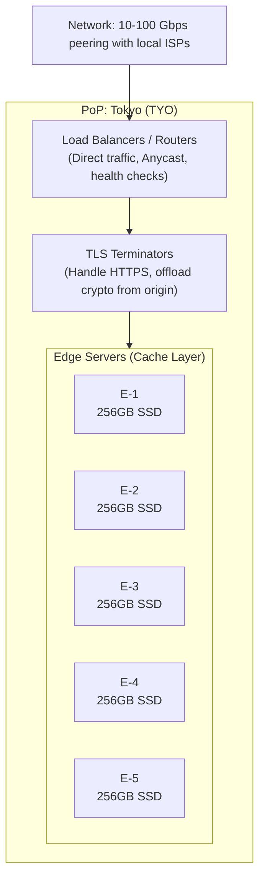

A typical PoP consists of several distinct layers. At the perimeter, heavy-duty load balancers and routers direct incoming Anycast traffic. They pass the connections to TLS terminators, which handle the computationally expensive cryptographic handshakes, freeing up the Origin server. Finally, the requests reach the Edge Servers—massive arrays of high-speed, SSD-backed machines that hold the actual cached content and serve it directly to the local users.

### 1.2 Pull vs. Push Architectures

When configuring how a CDN acquires content from your origin server, you must evaluate and choose between two fundamental network architectures.

**Pull CDN Architecture**
This is the default configuration for modern web delivery. The CDN edge nodes start completely empty. When a user requests an asset, the edge node "pulls" it dynamically from your origin server, caches it locally, and serves it.
- **Best for**: Dynamic websites, HTML pages, API responses, and frequently changing static assets.
- **Advantage**: Requires absolutely no changes to your deployment workflow. The CDN acts as a transparent reverse proxy.

**Push CDN Architecture**
In this model, your engineering team proactively uploads (pushes) content directly to the CDN's storage layer before any user ever requests it. The CDN effectively acts as your origin server for those specific assets.
- **Best for**: Massive Video-on-Demand (VOD) libraries, heavy game client patches, and large static software binaries.
- **Advantage**: Guarantees a perfect cache hit rate and completely removes your operational origin server from the heavy-bandwidth delivery path.

### 1.3 How CDNs Connect: Peering and Transit

CDNs achieve sub-millisecond latency to users by actively minimizing the network hops between their edge servers and the local Internet Service Providers (ISPs).

**Internet Exchange Points (IXPs)**

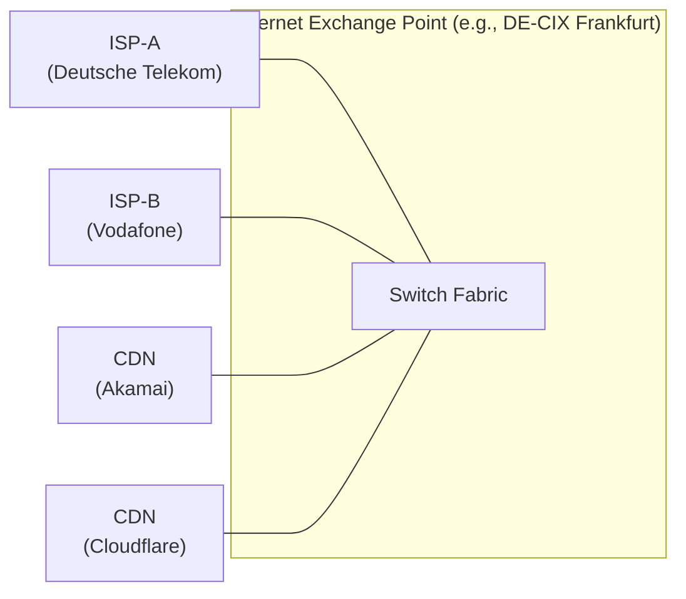

Direct peering at massive data centers known as IXPs means CDN traffic destined for ISP subscribers crosses only one network hop. This completely avoids the congested public internet routing backbone and ensures high-throughput, reliable delivery.

**Embedded Caching**

To achieve the absolute lowest latency possible, premium CDNs place their edge cache servers physically inside the ISP networks.

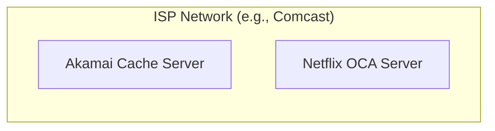

Content served from an embedded cache never leaves the ISP's internal network infrastructure. This provides extreme bandwidth savings for the ISP and guarantees latency under five milliseconds for the end user, a critical requirement for high-definition video streaming.

---

## Part 2: Mitigating Origin Overload with Tiered Caching

### 2.1 The Thundering Herd Problem

If your application relies solely on hundreds of independent edge PoPs, a viral event can still easily overwhelm your origin. Without tiered caching, every single edge PoP that experiences a cache miss must independently request the exact same asset from your origin server simultaneously.

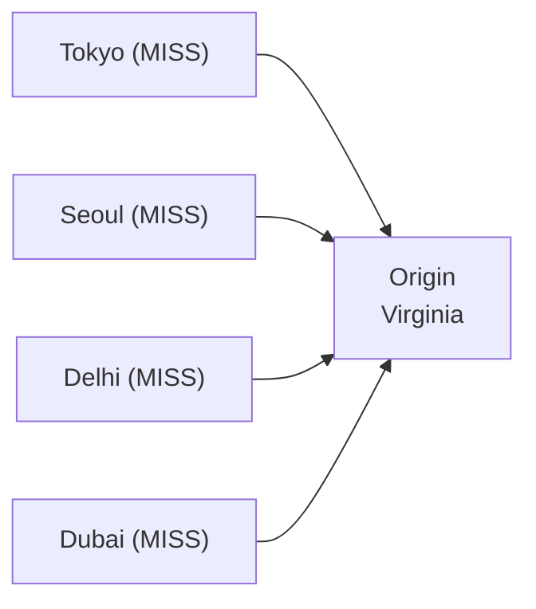

If one hundred different global PoPs receive a request for a newly published hero image at the exact same time, your origin receives one hundred simultaneous requests. This architectural flaw completely defeats the purpose of the CDN for newly published content.

### 2.2 Implementing Origin Shielding

To solve this, modern CDNs utilize Tiered Caching (often called Origin Shielding or Midgress caching). The edge PoPs do not go directly to the origin. Instead, they check a regional "shield" tier first.

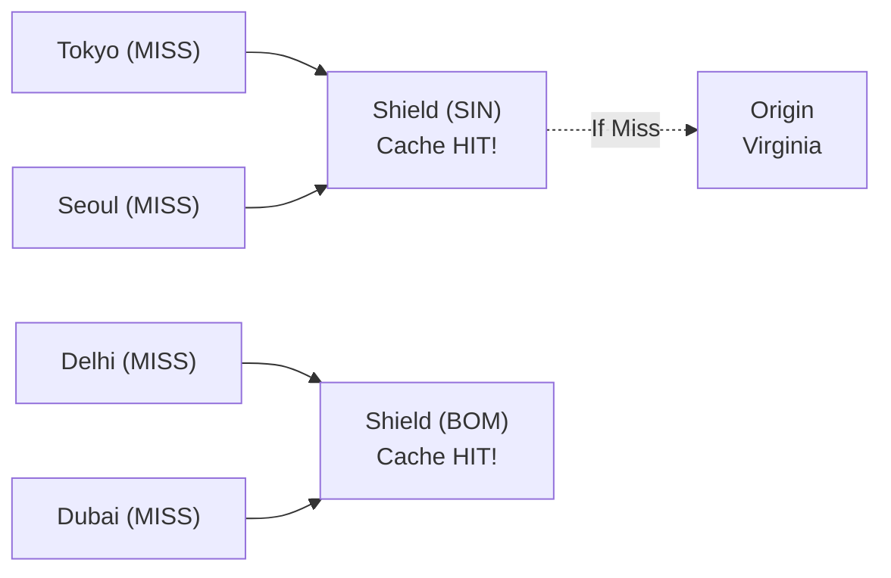

The shield servers are massive, highly consolidated cache pools located physically close to your origin server deployment. 

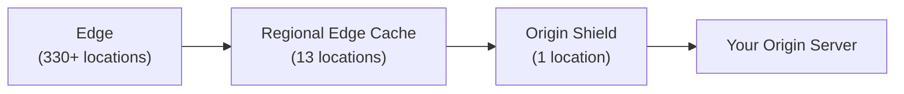

By enabling an Origin Shield, you dramatically consolidate cache misses. During a global viral event, hundreds of edge PoPs will query the regional shield. The shield experiences a single cache miss, requests the asset from your origin exactly once, caches it, and immediately fans it out to all the requesting edge PoPs. This architectural pattern reduces origin load by up to eighty percent in production environments.

---

## Part 3: Controlling the Cache (Mechanics & Headers)

### 3.1 Cache-Control Headers

The `Cache-Control` HTTP header is the universal language used to tell CDNs, corporate proxies, and web browsers exactly how to cache a response.

**Cacheable for a duration**
```http
Cache-Control: public, max-age=86400
```
The `public` directive means any cache in the delivery chain can store the response. The `max-age` dictates the time-to-live in seconds.

**Different TTL for CDN vs Browser**
```http
Cache-Control: public, max-age=60, s-maxage=86400
```
This crucial pattern allows you to control browser freshness separately from CDN freshness. The browser caches for a brief sixty seconds (`max-age`), but the shared CDN holds the asset for a full day (`s-maxage`).

**Stale Content Control**
```http
Cache-Control: public, max-age=300, stale-while-revalidate=60, stale-if-error=86400
```
This instructs the CDN to serve stale content for sixty seconds while it fetches a fresh copy asynchronously in the background (`stale-while-revalidate`). If the origin crashes entirely, it can gracefully degrade and serve stale content for up to a full day (`stale-if-error`), providing massive system resilience.

**Never Cache**
```http
Cache-Control: no-store
```
Use this directive strictly for highly sensitive personal data, banking information, or private medical records to ensure no cache ever writes the data to disk.

> **Stop and think**: A common mistake is using `no-cache` when you actually mean `no-store`. `no-cache` means "cache it, but revalidate with origin before serving" — NOT "don't cache."

**Revalidation**
```http
Cache-Control: no-cache
ETag: "v1.2.3-abc123"
```
The CDN stores the response but must cryptographically verify with the origin (using the `ETag` header) before serving it to the user to ensure it has not changed.

### 3.2 Cache Keys and Vary

The CDN determines if two requests can share a cached response by generating a deterministic "Cache Key." The default cache key is typically the combination of the request Scheme, Host, Path, and Query String. The `Vary` header instructs the CDN to explicitly split the cache key based on the value of specific incoming request headers.

> **Pause and predict**: What happens to your cache hit ratio if you use `Vary: Accept-Language` without normalizing the header first? It gets destroyed!

You must ruthlessly minimize cache key variations. Never vary on `Cookie` or raw `User-Agent` headers, as these contain thousands of highly unique string values and will rapidly drive your cache hit rate to zero, overwhelming your origin.

### 3.3 Cache Invalidation

When content changes before its TTL naturally expires, you must proactively invalidate the cache.

```bash
# Purge a specific URL
curl -X PURGE https://cdn.example.com/image.png

# Ban by pattern (Fastly/Varnish)
curl -X BAN https://cdn.example.com/ -H "X-Ban-Pattern: /products/.*"
```

Purging by URL over an API is slow and difficult to orchestrate at scale. The best engineering practice is to use "Cache Busting" via versioned URLs (e.g., `/assets/app.a1b2c3.js`). Because the filename itself contains a cryptographic content hash, the URL is guaranteed to change when the code changes. This robust strategy allows you to safely cache the asset forever without ever needing to issue a manual purge command.

---

## Part 4: Optimizing Dynamic Delivery and Media

### 4.1 Dynamic Content Acceleration

Even for uncacheable API responses, CDNs provide massive application acceleration through raw network optimization. Edge servers maintain pre-established, warm TCP connections to the origin server. This eliminates the extremely expensive TLS handshake latency for every single new client request.

Furthermore, CDNs can speak modern, highly optimized protocols to the client while seamlessly communicating with legacy protocols to your older origin servers.


Instead of relying on the public internet's BGP routing—which optimizes for network cost and peering policy rather than raw speed—CDNs utilize Smart Routing across their private fiber backbones to constantly map and utilize the lowest-latency path.

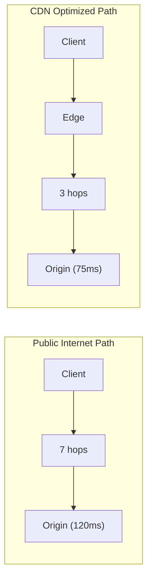

### 4.2 Image Optimization at the Edge

Images frequently account for over half of most web page network payloads. Modern CDNs can actively intercept image requests and optimize them dynamically based on the requesting client's exact device capabilities.

> **Pause and predict**: If you transform an image based on the raw `Accept` header, how many cache variations might you create? Since `Accept` headers vary widely between browsers, you must normalize them to just the formats your CDN supports (like WebP or AVIF) before generating the cache key, otherwise your hit rate will plummet.

Rather than storing dozens of hard-coded variations on your origin storage, you store one high-resolution master file. The CDN dynamically resizes the image, converts it to next-generation payload formats, compresses it, and securely caches the result directly at the edge.

---

## Part 5: Edge Computing and TLS

### 5.1 What is Edge Compute?

Edge compute represents a fundamental paradigm shift in distributed application architecture. Instead of running backend logic in a centralized cloud region, you deploy specialized code directly to the CDN's PoP locations, executing within milliseconds of the end user.

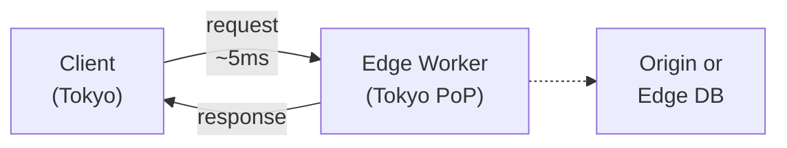

Edge functions run on specialized lightweight runtimes like V8 isolates or WebAssembly (WASM), allowing them to instantiate and execute in under five milliseconds, completely eliminating the cold-start problems associated with legacy serverless computing.

### 5.2 Edge Compute Use Cases

Edge compute is perfectly suited for tasks that require extremely low latency execution but do not need heavy relational database lifting. A prime example is validating authentication tokens before a request is ever allowed to traverse the network to your origin.

```javascript
export default {
  async fetch(request) {
    const token = request.headers.get("Authorization");
    if (!token) {
      return new Response("Unauthorized", { status: 401 });
    }

    try {
      const payload = await verifyJWT(token, JWT_SECRET);
      // Add user info as header for origin
      const newRequest = new Request(request);
      newRequest.headers.set("X-User-ID", payload.sub);
      return fetch(newRequest);
    } catch (e) {
      return new Response("Invalid token", { status: 403 });
    }
  }
};
```

Other critical enterprise use cases include:
- **A/B Testing**: Intelligently routing users to different origin deployments based on cookies without any jarring client-side JavaScript flicker.
- **Geolocation Routing**: Injecting the user's localized country code into the headers before passing the request to the origin.
- **Security Headers**: Standardizing `Content-Security-Policy` across complex legacy applications that are difficult to modify directly.

### 5.3 TLS at the Edge

Deciding exactly where and how to decrypt HTTPS traffic is a critical infrastructure security decision.

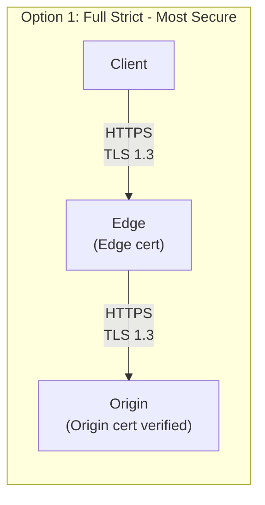
This is the strict enterprise standard. Data is encrypted end-to-end, and the Edge strictly verifies the Origin's cryptographic identity before transmitting data.

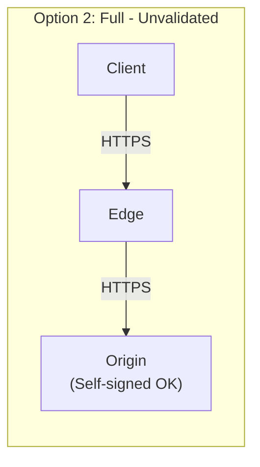
Data is encrypted in transit, but the Edge carelessly accepts any self-signed certificate, leaving you highly vulnerable to internal Man-In-The-Middle attacks across the network backbone.

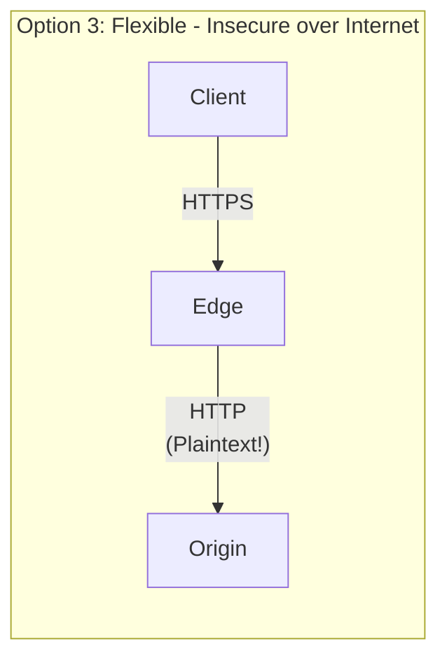

> **Stop and think**: Data is unencrypted between edge and origin. This is only acceptable if the edge and origin are in the exact same private physical network.

```mermaid
flowchart LR
    subgraph Option 4: Origin Pull (mTLS)
    C4["Client"] -- "HTTPS" --> E4["Edge"]
    E4 -- "mTLS\n(Both present certs)" --> O4["Origin"]
    end
```
In this highly secure configuration, the Origin server firmly refuses to communicate with anything other than the authorized CDN. Both the Edge and the Origin present valid certificates to prove their mutual identity, completely locking down the infrastructure.

---

## Part 6: Enterprise Strategies

### 6.1 Multi-CDN Architectures

Relying on a single premium CDN provider still creates a devastating global single point of failure. Enterprise architectures routinely employ Multi-CDN strategies to ensure continuous availability.

- **Active-Passive (Failover)**: Traffic is exclusively directed to the primary CDN. If global health checks fail, DNS records are automatically updated to point to a backup CDN. This architecture is cost-effective but routinely results in a massive "cold cache" performance drop during failover events, which can temporarily overwhelm the origin.
- **Active-Active (Load Balanced)**: Traffic is continuously split between two or more CDNs based on real-time geographic performance, Real User Monitoring (RUM) telemetry, or negotiated bandwidth costs. This keeps multiple distinct caches warm and ensures users are always dynamically routed to the fastest available network.

### 6.2 Diagnosing Caching Failures

Diagnosing caching failures requires a rigid, systematic approach. When a user complains about stale content, strictly follow this diagnostic workflow:

**Step 1: Isolate the Edge**
Bypass the web browser entirely to prevent local cache interference. Always use the `curl` utility with the verbose flag (`-v`) or header flag (`-I`) to explicitly inspect the exact raw response directly from the CDN edge node.

**Step 2: Inspect Cache Status Headers**
Look carefully for the `X-Cache` header. 
- `X-Cache: HIT` indicates the CDN successfully served the asset from local memory. 
- `X-Cache: MISS` indicates the CDN was forced to fetch it from the origin. 
If you expect a HIT but consistently see a MISS, you must inspect the `Cache-Control` headers returned by your origin to ensure it is actually granting the CDN permission to store the file.

**Step 3: Check the Age**
The `Age` HTTP header tells you exactly how many seconds the asset has been sitting in the edge cache. If the `Age` is higher than your strictly defined `max-age`, your programmatic invalidation strategy has failed.

**Step 4: Validate Vary Headers**
If hit rates are catastrophically low across the board, meticulously check the `Vary` header. If it contains highly volatile string fields like `User-Agent` or `Cookie`, you have definitively found your root cause.

---

## Did You Know?

- **Netflix's Open Connect serves over 400 Gbps from a single ISP-embedded server.** Their custom-built CDN appliances use FreeBSD, nginx, and NVMe SSDs to stream video from within ISP networks. During peak hours, Netflix accounts for roughly 15% of all downstream internet traffic in the United States, and nearly all of it is served from these embedded boxes.
- **Akamai delivers between 15-30% of all web traffic worldwide.** Founded in 1998 by MIT mathematicians who won a challenge to solve internet congestion, Akamai now operates over 365,000 servers. When Akamai sneezes, the internet catches a cold — their outage in July 2021 briefly took down major banks, airlines, and government sites.
- **The `stale-while-revalidate` Cache-Control directive was standardized in RFC 5861 in 2010, but didn't see wide browser support until Chrome 75 in 2019.** For nearly a decade, this elegant caching strategy existed only in CDNs and reverse proxies. Now it works end-to-end, giving users instant responses while quietly refreshing content in the background.
- **On February 11, 2023, Cloudflare mitigated a record-breaking DDoS attack that peaked at 71 million requests per second.** This massive assault, originating from a botnet of over 30,000 devices, demonstrated the sheer network capacity and automated mitigation power required by modern CDNs to keep the internet functioning under extreme duress.

---

## Common Mistakes

| Mistake | Problem | Solution |
|---------|---------|----------|
| Caching responses with `Set-Cookie` | Users see other users' sessions | `Cache-Control: private` for personalized content |
| `Vary: User-Agent` | Thousands of cache variants, near-zero hit rate | Normalize to device class (mobile/desktop/tablet) |
| No `s-maxage` distinct from `max-age` | Browser and CDN cache for same duration | Use `s-maxage` for CDN, `max-age` for browser |
| Cache busting via query string only | Some CDNs ignore query strings by default | Use filename hashing: `app.a1b2c3.js` |
| Flexible TLS (HTTP between edge and origin) | Data exposed on the wire between CDN and origin | Use Full (Strict) with validated origin certificate |
| Not setting `immutable` on hashed assets | Browsers revalidate on refresh despite long max-age | Add `immutable` to skip revalidation entirely |
| Ignoring CDN cache hit ratio | Poor performance, high origin load, wasted CDN spend | Monitor hit ratio; target >90% for static content |
| Edge functions calling origin on every request | Adds latency, defeats purpose of edge compute | Cache at edge, use edge KV stores when possible |
| Single CDN provider without failover | CDN outage = global outage | Consider multi-CDN with DNS-based failover |

---

## Quiz

1. **You are optimizing the caching strategy for a global news website's homepage, which updates frequently. You want returning readers to experience zero latency, but you also want to reduce load on your origin server and keep the news relatively fresh. How would you use `max-age`, `s-maxage`, and `stale-while-revalidate` to achieve this?**
<details>
   <summary>Answer</summary>

   By combining these three directives, you create a tiered caching strategy that perfectly balances instant load times with content freshness. Setting `max-age=0` forces the browser to always revalidate, ensuring it never uses an outdated local copy without checking first. However, setting `s-maxage=300` allows the CDN (shared cache) to cache the homepage for 5 minutes, which shields your origin server from the thousands of users requesting the site during that window. Adding `stale-while-revalidate=60` ensures that when the 5-minute CDN cache expires, the very next user isn't punished with a slow origin request; instead, the CDN instantly serves them the slightly stale copy while asynchronously fetching the fresh news homepage from the origin. This guarantees that no user ever experiences origin latency, and content is never older than 6 minutes.
   </details>

2. **Your team notices that your CDN cache hit rate has plummeted to 2% after a new release. You inspect the HTTP headers and discover `Vary: User-Agent` was added so the backend could return different HTML for mobile and desktop users. Why did this destroy your hit rate, and how should you redesign this delivery?**
<details>
   <summary>Answer</summary>

   The `Vary` header instructs the CDN to cache a separate copy of the response for every unique value of the specified header. Because there are thousands of unique `User-Agent` strings in the wild—varying by browser version, minor OS updates, device models, and bots—the CDN treats almost every request as unique, preventing cache sharing between users and driving your hit rate to near zero. Instead of varying by raw User-Agent, you should use client hints like `Sec-CH-UA-Mobile` (which only has two values: `?0` or `?1`) or rely on the CDN's normalized device-type headers (e.g., `Cloudflare-Device-Type`). Better yet, serve a single responsive HTML payload and use CSS media queries to adapt the layout, completely eliminating the need for backend variation and maximizing cacheability.
   </details>

3. **Your startup just launched a viral campaign, and traffic is spiking globally. You are using a CDN with 300+ edge locations, but your single origin server in Virginia is still getting overwhelmed by thousands of cache miss requests for new content. How would implementing tiered caching resolve this "thundering herd" problem?**
<details>
   <summary>Answer</summary>

   Without tiered caching, every single CDN edge location that experiences a cache miss will independently request the asset from your origin, meaning a new viral video could generate over 300 simultaneous requests to your Virginia server. Tiered caching introduces an intermediate layer (a regional "shield" cache) between the hundreds of edge nodes and your origin server. When users in Tokyo, Seoul, and Sydney request the video, their local edge nodes check the APAC regional shield; only the very first request misses the shield and travels to Virginia. The shield caches the response, and subsequent misses from other APAC edge nodes are served directly from the shield, protecting your origin server from redundant requests and reducing overall origin load by up to 80%.
   </details>

4. **You are architecting a new application that needs to intercept incoming requests and validate JWT tokens before allowing them to reach your API origin. You evaluate Cloudflare Workers, Lambda @src/content/docs/platform/foundations/advanced-networking/module-1.2-cdn-edge.md, and CloudFront Functions. Based on performance profiles and execution limits, under what circumstances would you choose each of these edge compute solutions?**
<details>
   <summary>Answer</summary>

   The choice of edge runtime depends entirely on the complexity of your logic and your required start-up latency. If you are building a full application with complex routing, external network calls, or require global sub-millisecond cold starts, Cloudflare Workers (running on V8 isolates) provides the best performance and ecosystem. If you are already deeply embedded in the AWS ecosystem and need to perform complex request manipulation that might take up to 30 seconds or require Node/Python libraries, Lambda @src/content/docs/platform/foundations/advanced-networking/module-1.2-cdn-edge.md is appropriate despite its higher 50-200ms cold starts. However, if your JWT validation is extremely lightweight, requires no external network calls, and must execute in under 2ms at every edge location, CloudFront Functions offers near-instant startup latency at a lower cost than Lambda @src/content/docs/platform/foundations/advanced-networking/module-1.2-cdn-edge.md.
   </details>

5. **You are tasked with caching product pages for an e-commerce site to handle a major flash sale. The product descriptions and images are identical for everyone, but the top navigation bar displays the logged-in user's name and a dynamic shopping cart count. How can you architect this page to achieve a 99% CDN cache hit rate without showing users the wrong names?**
<details>
   <summary>Answer</summary>

   The most resilient and standard approach is to decouple the static content from the personalized state using a client-side architecture. You should cache the full, unpersonalized HTML page at the CDN with a long `s-maxage`, ensuring the heavy lifting of rendering product data is served instantly from the edge for 99% of requests. To handle the personalization, the cached HTML should include lightweight JavaScript that asynchronously fetches the user's specific state (name, cart count) from a private API endpoint (using `Cache-Control: private`). This guarantees that users get an instant page load from the CDN and never see another user's cached session data, while the small, targeted API call resolves a fraction of a second later to populate the cart and greeting.
   </details>

6. **Your enterprise application currently utilizes a single, premium CDN provider. After a major regional outage at the provider took your application offline for three hours, leadership has mandated a Multi-CDN strategy. You need to implement an architecture that protects against full provider outages but minimizes the risk of a "cold cache" performance drop during a failover event. Which strategy should you design, and why?**
<details>
   <summary>Answer</summary>

   An Active-Active (Load Balanced) Multi-CDN architecture using Real User Monitoring (RUM) or geographic DNS steering is the optimal design. In an Active-Passive setup, the secondary CDN sits completely idle; if a sudden failover occurs, the secondary CDN has a totally cold cache and will immediately flood your origin with massive traffic, potentially causing a secondary cascading outage. By running an Active-Active setup, both CDNs continuously serve a percentage of production traffic, constantly keeping their respective distributed caches warm. When one provider inevitably fails, the global traffic safely shifts to the healthy provider, which already holds the vast majority of your content in its hot cache, ensuring a seamless user experience.
</details>

---

## Hands-On Exercise

**Objective**: Deploy a functional static site with complex CDN-style caching, robust custom cache headers, and an edge function simulation that dynamically injects strict security headers.

**Environment**: A local kind cluster running nginx as your origin server and Varnish simulating your global CDN edge network.

> **Note:** This robust exercise is thoroughly validated against Kubernetes v1.35+.

### Task 1: Deploy the Origin Server
Provision a robust kind cluster and deploy an nginx origin server containing varied HTML, CSS, JS, and SVG assets. You must carefully configure the web server with highly specific `Cache-Control` headers tailored for both dynamic HTML responses and deeply cacheable static assets.

<details>
<summary>Solution: Deploy Origin</summary>

```bash
# Create a kind cluster
kind create cluster --name cdn-lab

# Create a static site with different asset types
cat <<'EOF' | kubectl apply -f -
apiVersion: v1
kind: ConfigMap
metadata:
  name: static-site
data:
  index.html: |
    <!DOCTYPE html>
    <html>
    <head>
      <title>CDN Lab</title>
      <link rel="stylesheet" href="/assets/style.css">
    </head>
    <body>
      <h1>CDN & Edge Computing Lab</h1>
      <p>Served at: <span id="time"></span></p>
      
      <script src="/assets/app.js"></script>
    </body>
    </html>
  style.css: |
    body { font-family: sans-serif; max-width: 800px; margin: 2em auto; }
    h1 { color: #2563eb; }
  app.js: |
    document.getElementById('time').textContent = new Date().toISOString();
  logo.svg: |
    <svg xmlns="http://www.w3.org/2000/svg" width="100" height="100">
      <circle cx="50" cy="50" r="40" fill="#2563eb"/>
      <text x="50" y="55" text-anchor="middle" fill="white" font-size="16">CDN</text>
    </svg>
  nginx.conf: |
    server {
      listen 80;

      # HTML — short cache, revalidate
      location / {
        root /usr/share/nginx/html;
        index index.html;
        add_header Cache-Control "public, max-age=0, s-maxage=60, stale-while-revalidate=30";
        add_header X-Served-By "origin";
      }

      # Static assets — long cache, immutable
      location /assets/ {
        alias /usr/share/nginx/html/assets/;
        add_header Cache-Control "public, max-age=31536000, immutable";
        add_header X-Served-By "origin";
      }

      # Health check
      location /healthz {
        return 200 'OK';
        add_header Content-Type text/plain;
      }
    }
---
apiVersion: apps/v1
kind: Deployment
metadata:
  name: origin
spec:
  replicas: 1
  selector:
    matchLabels:
      app: origin
  template:
    metadata:
      labels:
        app: origin
    spec:
      containers:
        - name: nginx
          image: nginx:1.27
          ports:
            - containerPort: 80
          volumeMounts:
            - name: config
              mountPath: /etc/nginx/conf.d/default.conf
              subPath: nginx.conf
            - name: html
              mountPath: /usr/share/nginx/html/index.html
              subPath: index.html
            - name: assets-css
              mountPath: /usr/share/nginx/html/assets/style.css
              subPath: style.css
            - name: assets-js
              mountPath: /usr/share/nginx/html/assets/app.js
              subPath: app.js
            - name: assets-svg
              mountPath: /usr/share/nginx/html/assets/logo.svg
              subPath: logo.svg
      volumes:
        - name: config
          configMap:
            name: static-site
            items: [{ key: nginx.conf, path: nginx.conf }]
        - name: html
          configMap:
            name: static-site
            items: [{ key: index.html, path: index.html }]
        - name: assets-css
          configMap:
            name: static-site
            items: [{ key: style.css, path: style.css }]
        - name: assets-js
          configMap:
            name: static-site
            items: [{ key: app.js, path: app.js }]
        - name: assets-svg
          configMap:
            name: static-site
            items: [{ key: logo.svg, path: logo.svg }]
---
apiVersion: v1
kind: Service
metadata:
  name: origin
spec:
  selector:
    app: origin
  ports:
    - port: 80
EOF
```

</details>

### Task 2: Deploy the CDN Simulator
Deploy Varnish cache to act dynamically as your edge node. Configure the VCL (Varnish Configuration Language) to act as an intelligent reverse proxy, explicitly stripping cookies from static assets to ensure high cacheability, injecting verifiable cache hit/miss diagnostic indicators, and injecting rigorous security headers to simulate programmatic edge compute logic.

<details>
<summary>Solution: Deploy Edge Simulation</summary>

```bash
cat <<'EOF' | kubectl apply -f -
apiVersion: v1
kind: ConfigMap
metadata:
  name: varnish-config
data:
  default.vcl: |
    vcl 4.1;

    backend origin {
      .host = "origin";
      .port = "80";
      .probe = {
        .url = "/healthz";
        .interval = 5s;
        .timeout = 2s;
        .threshold = 3;
        .window = 5;
      }
    }

    sub vcl_recv {
      # Strip cookies for static assets (improve cache hit rate)
      if (req.url ~ "\.(css|js|svg|png|jpg|gif|ico|woff2)$") {
        unset req.http.Cookie;
      }
    }

    sub vcl_backend_response {
      # Add cache status header
      set beresp.http.X-Cache-TTL = beresp.ttl;
    }

    sub vcl_deliver {
      # Add hit/miss indicator
      if (obj.hits > 0) {
        set resp.http.X-Cache = "HIT";
        set resp.http.X-Cache-Hits = obj.hits;
      } else {
        set resp.http.X-Cache = "MISS";
      }

      # Security headers (simulating edge function)
      set resp.http.X-Content-Type-Options = "nosniff";
      set resp.http.X-Frame-Options = "DENY";
      set resp.http.Referrer-Policy = "strict-origin-when-cross-origin";
      set resp.http.Strict-Transport-Security = "max-age=63072000; includeSubDomains";
      set resp.http.Content-Security-Policy = "default-src 'self'; style-src 'self' 'unsafe-inline'; script-src 'self' 'unsafe-inline'";
    }
---
apiVersion: apps/v1
kind: Deployment
metadata:
  name: cdn-edge
spec:
  replicas: 2
  selector:
    matchLabels:
      app: cdn-edge
  template:
    metadata:
      labels:
        app: cdn-edge
    spec:
      containers:
        - name: varnish
          image: varnish:7.6
          ports:
            - containerPort: 80
          args:
            - "-f"
            - "/etc/varnish/default.vcl"
            - "-s"
            - "malloc,256m"
            - "-a"
            - "0.0.0.0:80"
          volumeMounts:
            - name: config
              mountPath: /etc/varnish/default.vcl
              subPath: default.vcl
      volumes:
        - name: config
          configMap:
            name: varnish-config
---
apiVersion: v1
kind: Service
metadata:
  name: cdn-edge
spec:
  selector:
    app: cdn-edge
  ports:
    - port: 80
EOF
```

</details>

### Task 3: Test Dynamic Caching Behavior
Launch an interactive test client within the cluster sandbox to execute raw HTTP requests against the CDN edge. You must empirically verify that the very first request results in a MISS, subsequent requests result in a HIT, and that edge-injected security headers are successfully present in the payload.

<details>
<summary>Solution: Test Caching</summary>

```bash
# Deploy a test client
kubectl run test-client --image=curlimages/curl:8.11.1 --rm -it -- sh

# Inside the test client:

# 1. First request (cache MISS)
curl -sI http://cdn-edge/ | grep -E "X-Cache|Cache-Control|X-Served"

# Expected:
# X-Cache: MISS
# Cache-Control: public, max-age=0, s-maxage=60, stale-while-revalidate=30

# 2. Second request (cache HIT)
curl -sI http://cdn-edge/ | grep -E "X-Cache|Cache-Control"

# Expected:
# X-Cache: HIT
# X-Cache-Hits: 1

# 3. Check security headers from "edge function"
curl -sI http://cdn-edge/ | grep -E "X-Content-Type|X-Frame|Referrer|Strict-Transport|Content-Security"

# 4. Test static assets (long cache)
curl -sI http://cdn-edge/assets/style.css | grep -E "X-Cache|Cache-Control"

# Expected:
# Cache-Control: public, max-age=31536000, immutable

# 5. Rapid requests — watch hit count increase
for i in $(seq 1 10); do
  echo "Request $i:"
  curl -sI http://cdn-edge/ | grep "X-Cache"
done
```

</details>

### Task 4: Measure System Cache Effectiveness
Compare the empirical response latency between making sequential requests directly to the origin server versus making the same requests to the populated, hot CDN edge.

<details>
<summary>Solution: Measure Latency</summary>

```bash
# Still inside test client:

# Compare direct origin vs CDN edge
echo "=== Direct to Origin ==="
time curl -so /dev/null http://origin/
time curl -so /dev/null http://origin/
time curl -so /dev/null http://origin/

echo "=== Via CDN Edge (cached) ==="
time curl -so /dev/null http://cdn-edge/
time curl -so /dev/null http://cdn-edge/
time curl -so /dev/null http://cdn-edge/

# The CDN responses should be faster after the first request
# because they're served from Varnish cache without hitting origin
```

</details>

### Task 5: Clean Up
Destroy the temporary cluster network to safely free up your local orchestration resources.

<details>
<summary>Solution: Teardown</summary>

```bash
kind delete cluster --name cdn-lab
```

</details>

**Success Checklist**:
- [ ] Observed deterministic cache MISS on the first request and highly predictable HIT on subsequent repeated requests.
- [ ] Successfully verified vastly different `Cache-Control` header directives for HTML payloads versus static assets.
- [ ] Confirmed strict security headers are effectively injected by the intermediate CDN layer (Varnish).
- [ ] Measured the distinct latency discrepancy between hitting origin directly and utilizing the cached edge responses.
- [ ] Practically understood the complex relationship between `max-age`, `s-maxage`, and `stale-while-revalidate` directives.
- [ ] Watched the explicit cache hit counter increase linearly with rapidly repeated network requests.

---

## Next Module

[Module 1.3: WAF & DDoS Mitigation](../module-1.3-waf-ddos/) — Learn exactly how Web Application Firewalls secure endpoints against devastating OWASP Top 10 vulnerabilities directly at the edge, and dive deep into how global CDNs algorithmically scrub massive DDoS floods before they ever touch your vulnerable infrastructure.