> **Complexity**: `[MEDIUM]`
>
> **Time to Complete**: 2.5 hours
>
> **Prerequisites**: HTTP basics (methods, status codes, headers), basic understanding of caching
>
> **Track**: Foundations — Advanced Networking

### What You'll Be Able to Do

After completing this module, you will be able to:

1. **Design** CDN caching strategies that maximize cache hit ratios while ensuring content freshness through TTLs, cache keys, and invalidation patterns
2. **Evaluate** CDN architectures (pull vs. push, multi-CDN, edge compute) and select the right approach for different content types and traffic patterns
3. **Implement** edge computing patterns that move application logic closer to users for latency-sensitive workloads
4. **Diagnose** CDN cache misses, stale content issues, and origin shielding failures using cache headers and CDN analytics

---

**November 24, 2017. Black Friday. At precisely 12:01 AM Eastern, the largest online shopping event of the year begins. In the first sixty seconds, millions of browsers simultaneously request the same product images, CSS files, JavaScript bundles, and promotional videos from thousands of retail sites.**

Without CDNs, this traffic would crush origin servers. A single popular retailer might serve 50,000 requests per second for the same hero image. From their single origin datacenter in Virginia. To users in Tokyo, Mumbai, Sao Paulo, and London. Each request traveling thousands of kilometers, competing for bandwidth, adding 100-300ms of latency.

But that's not what happens. Instead, **a user in Tokyo receives that hero image from a server in Tokyo. A user in Mumbai gets it from Mumbai. A user in London gets it from London.** The origin server in Virginia barely notices, because 98% of requests never reach it.

This is the magic of Content Delivery Networks. They transformed the internet from a system where every request traveled to a distant origin server into one where content lives at the edge, physically close to users. CDNs serve an estimated **73% of all internet traffic** as of 2025. Without them, the modern internet would be unusably slow.

---

## Why This Module Matters

Latency is the tax users pay for distance. Light in fiber optic cable travels at about 200,000 km/s — roughly two-thirds the speed of light in vacuum. A round trip from New York to Singapore is about 30,000 km through undersea cables, imposing a minimum 150ms delay that no amount of server optimization can eliminate.

CDNs solve this fundamental physics problem by moving content closer to users. But modern CDNs have evolved far beyond simple caching. They now offer TLS termination, DDoS protection, image optimization, A/B testing, authentication, and even full application logic at the edge.

Understanding CDN architecture isn't optional for anyone building applications that serve global users. It's the difference between a sub-100ms page load and a 3-second one. And in 2025, it's also the difference between running code in a central datacenter and running it at 300+ locations worldwide.

> **The Local Library Analogy**
>
> Imagine a world where the only library was in Washington, D.C. Every person in every city who wanted to read a book had to request it from D.C., wait for it to be shipped, read it, and ship it back. Absurd, right? CDNs are like building local library branches in every city, stocking them with copies of the most popular books. Most readers never need to contact the central library at all.

---

## What You'll Learn

- CDN architecture: PoPs, edge servers, peering, and tiered caching
- Cache mechanics: headers, invalidation, stale-while-revalidate
- Dynamic content acceleration and route optimization
- Edge compute: running code at CDN locations
- TLS at the edge: termination strategies and trade-offs
- Hands-on: Deploying a static site with CDN caching and edge functions

---

## Part 1: CDN Architecture

### 1.1 Points of Presence (PoPs)

A CDN is a globally distributed network of servers (PoPs) that cache and serve content close to end users.

**Single PoP Anatomy**

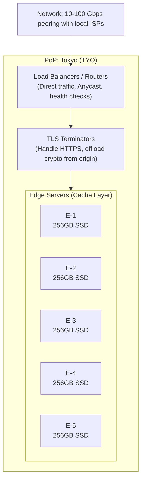

**Global CDN Scale (2025)**

- **Cloudflare**: 330+ cities, 120+ countries
- **Akamai**: 4,200+ PoPs, 135+ countries
- **AWS CloudFront**: 600+ PoPs, 100+ cities
- **Fastly**: 90+ PoPs (fewer but larger, programmable)
- **Google Cloud CDN**: 180+ PoPs via Google's network

### 1.2 Tiered Caching

Without tiered caching, every edge PoP with a cache miss goes directly to origin.
100 PoPs × 1 cache miss each = 100 requests to origin.

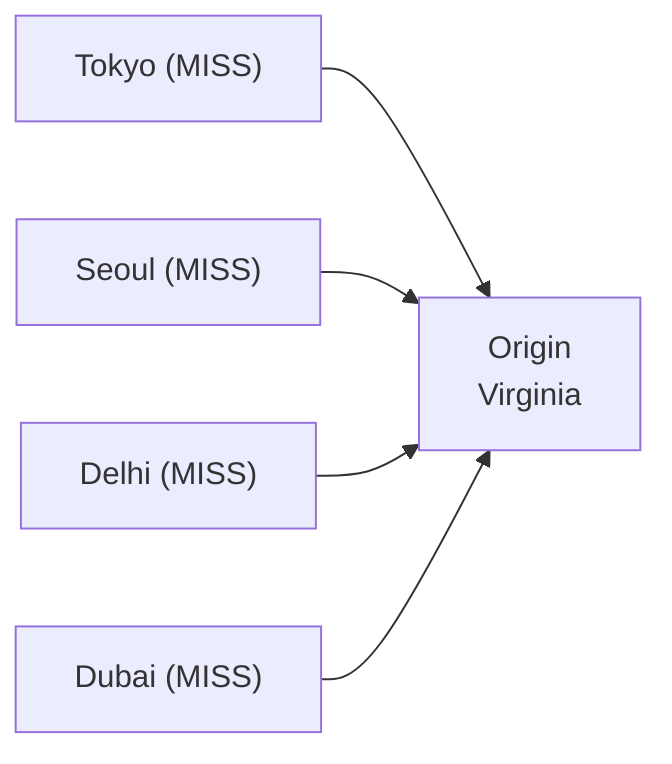

With tiered caching (shield / midgress), edge PoPs check a regional "shield" tier first. The shield has a larger cache and fewer instances.

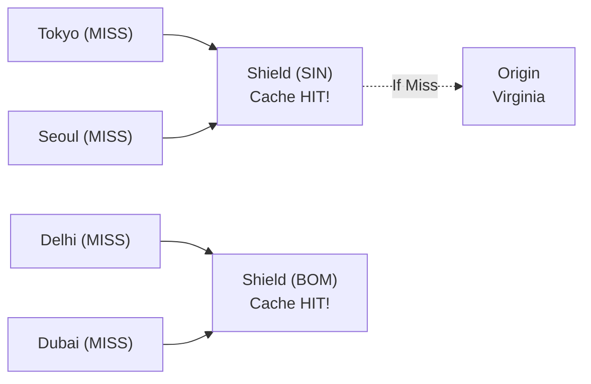

Only 2 requests reach the shield. Only 1 reaches origin if missed at the shield.

**CloudFront Origin Shield**

Enable origin shield in the region closest to your origin. Adds one more cache layer between edge and origin. Reduces origin load by 50-80% in practice.

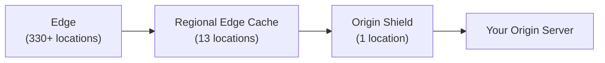

### 1.3 How CDNs Connect: Peering and Transit

CDNs minimize hops between themselves and ISPs through direct peering — physical connections in data centers.

**Internet Exchange Points (IXPs)**

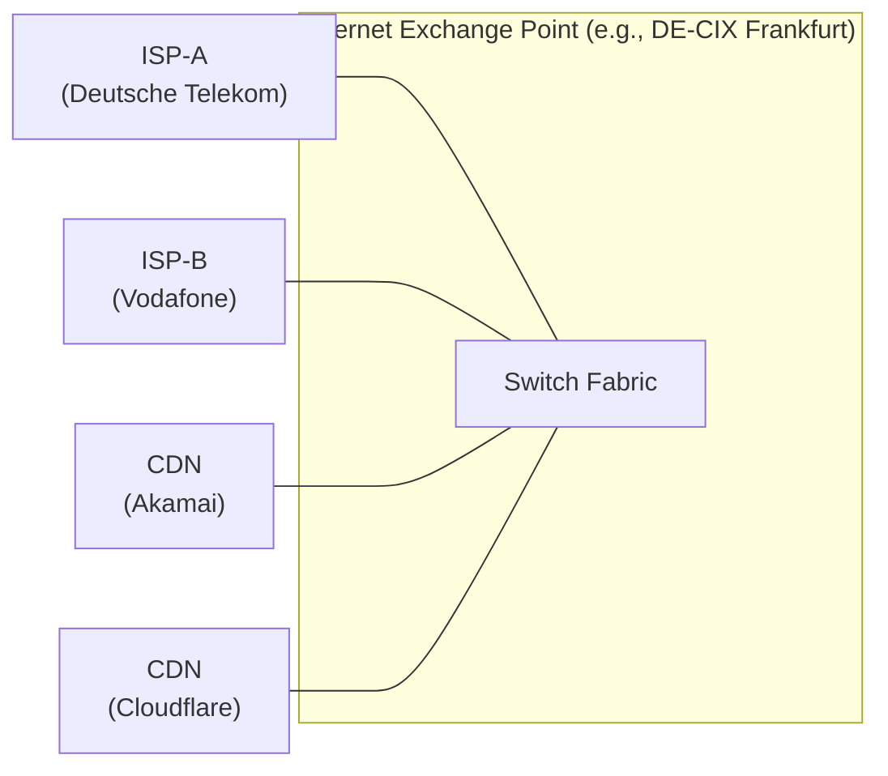

Direct peering means CDN traffic to ISP subscribers crosses ONE network hop instead of traversing the public internet through multiple autonomous systems.

- DE-CIX Frankfurt: 1,100+ connected networks
- AMS-IX Amsterdam: 900+ connected networks
- LINX London: 950+ connected networks

**Embedded Caching**

Some CDNs place servers INSIDE ISP networks.

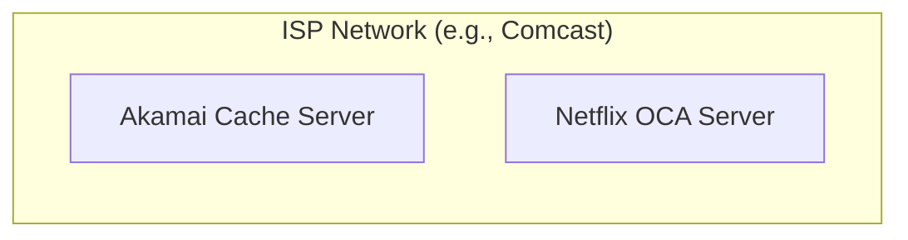

CDN content never leaves the ISP network! Latency: <5ms. Bandwidth: free to ISP.

- Netflix Open Connect: 18,000+ servers in 6,000+ ISPs
- Serves 95%+ of Netflix traffic from within ISP networks

---

## Part 2: Cache Mechanics

### 2.1 Cache-Control Headers

The `Cache-Control` header tells CDNs (and browsers) how to cache a response.

**Directives Reference**

*Cacheable for a duration*
```http
Cache-Control: public, max-age=86400
```
- `public`: Any cache can store (CDN, browser, proxy)
- `max-age`: Cache for N seconds (86400 = 24 hours)

*Different TTL for CDN vs Browser*
```http
Cache-Control: public, max-age=60, s-maxage=86400
```
- `max-age`: Browser caches for 60 seconds
- `s-maxage`: Shared caches (CDN) cache for 86400 seconds
This lets you control browser freshness separately from CDN freshness. Very useful pattern.

*Stale Content Control*
```http
Cache-Control: public, max-age=300, stale-while-revalidate=60, stale-if-error=86400
```
- `stale-while-revalidate`: Serve stale for 60s while fetching fresh in background
- `stale-if-error`: Serve stale for 24h if origin is down (graceful degradation!)

*Never Cache*
```http
Cache-Control: no-store
```
- `no-store`: Never cache. Not in CDN, not in browser. Use for sensitive data (banking, health).

> **Stop and think**: A common mistake is using `no-cache` when you actually mean `no-store`. `no-cache` means "cache it, but revalidate with origin before serving" — NOT "don't cache."

*Revalidation*
```http
Cache-Control: no-cache
ETag: "v1.2.3-abc123"
```
CDN caches the response but checks with origin before every serve using the `If-None-Match` header. Origin responds `304 Not Modified` if unchanged.

**Practical Caching Strategies**

- **Static assets (images, fonts, JS/CSS with hash):**
  `Cache-Control: public, max-age=31536000, immutable`
  (1 year! Safe because filename contains content hash: `/assets/app.a1b2c3d4.js`)
- **HTML pages:**
  `Cache-Control: public, max-age=0, s-maxage=60, stale-while-revalidate=30`
  (Browser always revalidates, CDN caches 60s)
- **API responses (private):**
  `Cache-Control: private, max-age=0`
  (Never cache in shared caches — user-specific data)
- **API responses (public, same for all users):**
  `Cache-Control: public, s-maxage=10, stale-while-revalidate=5`
  (CDN caches 10s, serves stale 5s while refreshing)

### 2.2 Cache Keys and Vary

A cache key determines if two requests can share a response.

**Default Cache Key**
`Scheme + Host + Path + Query String`

- `https://example.com/image.png` → Key 1
- `https://example.com/image.png?v=2` → Key 2 (different!)
- `http://example.com/image.png` → Key 3 (different!)
- `https://example.com/IMAGE.png` → Key 4 (depends on CDN)

**The Vary Header — Splitting Caches**
`Vary` tells the CDN: "The response changes based on these request headers. Cache separately for each value."

*Vary: Accept-Encoding*
Cache separately for gzip, brotli, identity.
- `GET /app.js` with `Accept-Encoding: gzip` → Cached (gzip)
- `GET /app.js` with `Accept-Encoding: br` → Cached (brotli)

*Vary: Accept-Language*
Cache separately per language. Sounds good, BUT: `en`, `en-US`, `en-GB`, `en-AU`, `en-CA`, `en-us`, `EN-US`... Each is a different cache key!

> **Pause and predict**: What happens to your cache hit ratio if you use `Vary: Accept-Language` without normalizing the header first? It gets destroyed!

*Vary: \**
NEVER cache. Every request is unique. This is almost always a mistake.

**Cache Key Best Practices**
- Include only what affects the response
- Strip unnecessary query parameters (tracking: `utm_*`, `fbclid`)
- Sort query parameters (`a=1&b=2` = `b=2&a=1`)
- Normalize `Accept-Encoding` to a few canonical values
- **Don't** Vary on `Cookie` (almost every user has different cookies)
- **Don't** Vary on `User-Agent` (thousands of unique values)

### 2.3 Cache Invalidation

> *"There are only two hard things in Computer Science: cache invalidation and naming things."* — Phil Karlton

**Strategy 1: TTL-Based Expiration**
Just wait for the cache to expire naturally.
- `max-age=300` → Content refreshes every 5 minutes
- `max-age=60` → Content refreshes every minute
*Pros*: Simple, no invalidation infrastructure needed.
*Cons*: Users see stale content for up to TTL duration.

**Strategy 2: Purge / Ban**
Explicitly remove content from cache.
```bash
# Purge a specific URL
curl -X PURGE https://cdn.example.com/image.png

# Ban by pattern (Fastly/Varnish)
curl -X BAN https://cdn.example.com/ -H "X-Ban-Pattern: /products/.*"
```
*Pros*: Immediate invalidation.
*Cons*: Must know what to purge, propagation time across PoPs.
*(Cloudflare: <2s, CloudFront: 5-15m, Fastly: <150ms, Akamai: <5s)*

**Strategy 3: Versioned URLs (Cache Busting)**
Include a version/hash in the filename.
- Old: `/assets/app.v1.js` (or better: `/assets/app.a1b2c3.js`)
- New: `/assets/app.v2.js` (or better: `/assets/app.d4e5f6.js`)

HTML references the new filename → new cache key. Old version naturally expires. No purge needed.
*Pros*: Perfect cache busting, immutable caching.
*Cons*: Only works for assets referenced from HTML/CSS. Can't version API responses or HTML pages.

**Strategy 4: Stale-While-Revalidate**
Serve stale content while fetching fresh in background.
`Cache-Control: max-age=60, stale-while-revalidate=30`

*Timeline:*
- **t=0**: Content cached. Fresh.
- **t=60**: max-age expired. Content is "stale."
- **t=61**: Request arrives. Serve stale content immediately (fast!). Background: fetch fresh from origin.
- **t=61.5**: Background fetch completes. Cache updated with fresh content.
- **t=62**: Next request gets fresh content.

Best of both worlds: User always gets instant response, and content is never more than `max-age + stale-while-revalidate` old.

---

## Part 3: Beyond Static Caching

### 3.1 Dynamic Content Acceleration

Not everything can be cached. API responses, personalized pages, database queries — these are unique per request. CDNs still help through network optimization.

**1. Persistent Connections (Connection Pooling)**
Without CDN:
- Client -> TLS handshake -> Origin (150ms each time)

With CDN:
- Client -> TLS -> Edge (20ms)
- Edge -> pre-established connection -> Origin (0ms setup)

Edge keeps warm connections to origin. Saves 130ms+ on every new client connection.

**2. TCP Optimization**
CDN edge servers tune TCP parameters for the last-mile connection to each client:
- Larger initial congestion window (start faster)
- BBR congestion control (better than Cubic on lossy links)
- TCP Fast Open (reduce handshake RTT)

Between edge and origin, use optimized backbone:
- Dedicated fiber paths (less congestion)
- Fewer hops (direct routing)
- Larger buffers (handle bursts)

**3. Protocol Optimization**

Edge can speak newer protocols to clients even if origin only supports HTTP/1.1.


**4. Route Optimization (Argo Smart Routing)**
Internet routing (BGP) optimizes for policy, not speed. CDN backbone routing optimizes for latency.

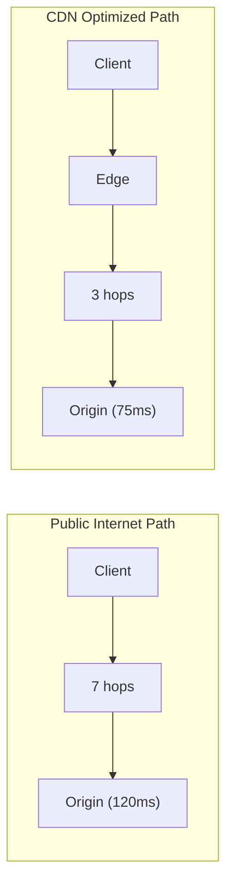

Cloudflare Argo: ~30% latency reduction on average. Measured by testing all paths and choosing fastest.

### 3.2 Image Optimization at the Edge

Images are 40-60% of most web page weight. Modern CDNs optimize images on the fly.

> **Pause and predict**: If you transform an image based on the raw `Accept` header, how many cache variations might you create? Since `Accept` headers vary widely between browsers, you must normalize them to just the formats your CDN supports (like WebP or AVIF) before generating the cache key, otherwise your hit rate will plummet.

**Transformations**
Original: `product-photo.png` (4.2 MB, 4000x3000, PNG)

- *Desktop request*: Resize to 1200x900, Convert to WebP, Quality 85%. Result: 142 KB (97% smaller!)
- *Mobile request*: Resize to 600x450, Convert to AVIF, Quality 75%. Result: 48 KB (99% smaller!)

Format selection based on `Accept` header:
- `Accept: image/avif,image/webp,image/*` → AVIF
- `Accept: image/webp,image/*` → WebP
- `Accept: image/*` → Original format

**URL-Based Transforms (Cloudflare, imgix)**
`/cdn-cgi/image/width=800,quality=80,format=auto/photo.jpg`

Parameters like `width`, `height`, `fit`, `quality`, `format`, `dpr`, `blur`, `sharpen` can be passed. Each unique parameter set = separate cache entry. Transformed images are cached at edge, not re-generated.

---

## Part 4: Edge Computing

### 4.1 What is Edge Compute?

Edge compute lets you run code at CDN PoP locations, within milliseconds of users, instead of in a central datacenter hundreds of milliseconds away.

**The Evolution**
- **Era 1: Static CDN** (cache files) - "Here's the image, cached at the edge."
- **Era 2: Dynamic CDN** (optimize delivery) - "I'll optimize the connection and route."
- **Era 3: Edge Compute** (run logic) - "I'll run your code at the edge and respond directly."

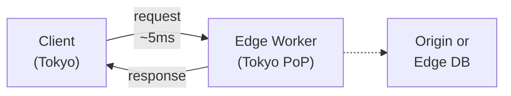

No round trip to origin! Response in single-digit ms.

**Platforms**

- **Cloudflare Workers**: Runtime: V8 isolates (not containers). Startup: <5ms cold start. Locations: 330+ cities. Languages: JavaScript/TypeScript, Rust, C, C++ (WASM). Storage: KV, Durable Objects, D1, R2.
- **AWS Lambda@Edge / CloudFront Functions**: Lambda@Edge (Node.js/Python) runs at 13 regional edge caches with 50-200ms cold starts. CloudFront Functions (JavaScript) runs everywhere with <1ms startup for ultra-fast header manipulation.
- **Fastly Compute**: Runtime: WebAssembly. Startup: ~35μs cold start (microseconds!). Languages: Rust, Go, JavaScript (compiled to WASM).
- **Deno Deploy**: Runtime: Deno (V8-based) in 35+ regions. Languages: TypeScript/JavaScript.

### 4.2 Edge Compute Use Cases

**Authentication & Authorization**
Validate JWT tokens at the edge. Reject unauthorized requests before they reach origin.
```javascript
export default {
  async fetch(request) {
    const token = request.headers.get("Authorization");
    if (!token) {
      return new Response("Unauthorized", { status: 401 });
    }

    try {
      const payload = await verifyJWT(token, JWT_SECRET);
      // Add user info as header for origin
      const newRequest = new Request(request);
      newRequest.headers.set("X-User-ID", payload.sub);
      return fetch(newRequest);
    } catch (e) {
      return new Response("Invalid token", { status: 403 });
    }
  }
};
```

**A/B Testing**
Route users to different origins based on cookies/headers. No client-side JavaScript, no flash of unstyled content.

**Security Headers**
Add `Content-Security-Policy`, `HSTS`, `X-Frame-Options` consistently across all responses, regardless of origin.

**Geolocation Routing**
Route requests based on user location, available automatically at the edge via request metadata (e.g., `request.cf.country`).

**URL Rewriting & Redirects**
Handle thousands of redirects at the edge. No origin request needed.

---

## Part 5: TLS at the Edge

### 5.1 TLS Termination Strategies

Where should you decrypt HTTPS traffic?

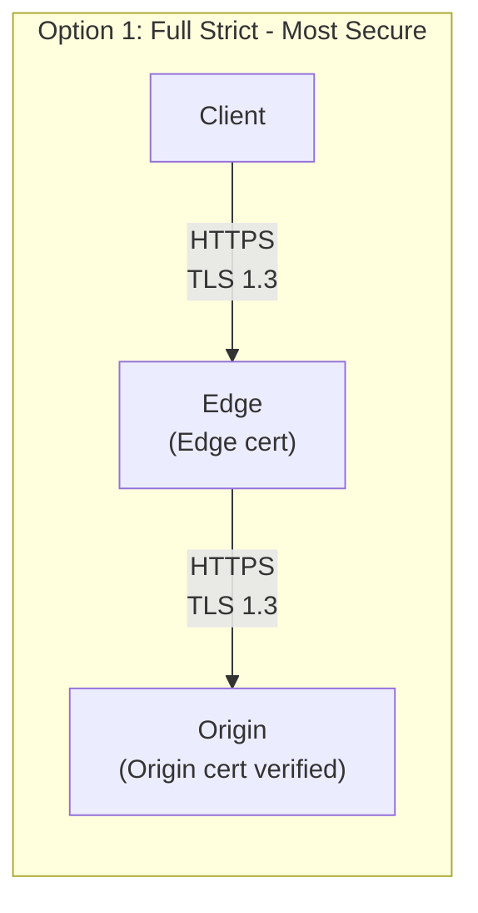
Edge verifies origin certificate (strict validation). End-to-end encryption.
- **Pro:** Data encrypted everywhere. Protects against MITM between edge and origin.
- **Con:** Must manage certificate on origin. Slightly higher latency.

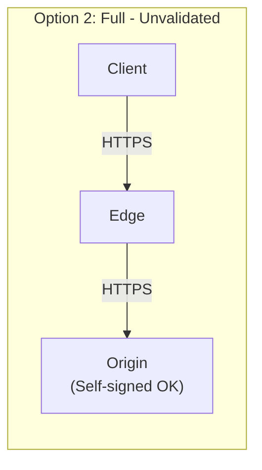
Edge connects to origin via HTTPS but accepts any cert.
- **Pro:** Encrypted in transit.
- **Con:** Origin certificate not validated (MITM possible). False sense of security.

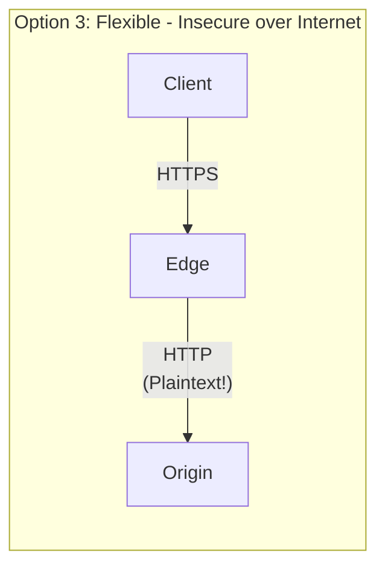
> **Stop and think**: Data is unencrypted between edge and origin. This is only acceptable if the edge and origin are in the exact same private physical network.

```mermaid
flowchart LR
    subgraph Option 4: Origin Pull (mTLS)
    C4["Client"] -- "HTTPS" --> E4["Edge"]
    E4 -- "mTLS\n(Both present certs)" --> O4["Origin"]
    end
```
Origin ONLY accepts connections from CDN. Prevents direct-to-origin attacks bypassing CDN/WAF.

**Certificate Management at Scale**
CDNs manage millions of certificates automatically:
- **Let's Encrypt integration**: Auto-issue, auto-renew, zero downtime rotation.
- **SAN certificates**: One cert covering many domains.
- **Keyless SSL (Cloudflare)**: Private key never leaves your infrastructure. CDN handles TLS but calls your key server for signing.

---

## Did You Know?

- **Netflix's Open Connect serves over 400 Gbps from a single ISP-embedded server.** Their custom-built CDN appliances use FreeBSD, nginx, and NVMe SSDs to stream video from within ISP networks. During peak hours, Netflix accounts for roughly 15% of all downstream internet traffic in the United States, and nearly all of it is served from these embedded boxes.

- **Akamai delivers between 15-30% of all web traffic worldwide.** Founded in 1998 by MIT mathematicians who won a challenge to solve internet congestion, Akamai now operates over 365,000 servers. When Akamai sneezes, the internet catches a cold — their outage in July 2021 briefly took down major banks, airlines, and government sites.

- **The `stale-while-revalidate` Cache-Control directive was standardized in RFC 5861 in 2010, but didn't see wide browser support until Chrome 75 in 2019.** For nearly a decade, this elegant caching strategy existed only in CDNs and reverse proxies. Now it works end-to-end, giving users instant responses while quietly refreshing content in the background.

---

## Common Mistakes

| Mistake | Problem | Solution |
|---------|---------|----------|
| Caching responses with `Set-Cookie` | Users see other users' sessions | `Cache-Control: private` for personalized content |
| `Vary: User-Agent` | Thousands of cache variants, near-zero hit rate | Normalize to device class (mobile/desktop/tablet) |
| No `s-maxage` distinct from `max-age` | Browser and CDN cache for same duration | Use `s-maxage` for CDN, `max-age` for browser |
| Cache busting via query string only | Some CDNs ignore query strings by default | Use filename hashing: `app.a1b2c3.js` |
| Flexible TLS (HTTP between edge and origin) | Data exposed on the wire between CDN and origin | Use Full (Strict) with validated origin certificate |
| Not setting `immutable` on hashed assets | Browsers revalidate on refresh despite long max-age | Add `immutable` to skip revalidation entirely |
| Ignoring CDN cache hit ratio | Poor performance, high origin load, wasted CDN spend | Monitor hit ratio; target >90% for static content |
| Edge functions calling origin on every request | Adds latency, defeats purpose of edge compute | Cache at edge, use edge KV stores when possible |
| Single CDN provider without failover | CDN outage = global outage | Consider multi-CDN with DNS-based failover |

---

## Quiz

1. **You are optimizing the caching strategy for a global news website's homepage, which updates frequently. You want returning readers to experience zero latency, but you also want to reduce load on your origin server and keep the news relatively fresh. How would you use `max-age`, `s-maxage`, and `stale-while-revalidate` to achieve this?**
   <details>
   <summary>Answer</summary>

   By combining these three directives, you create a tiered caching strategy that perfectly balances instant load times with content freshness. Setting `max-age=0` forces the browser to always revalidate, ensuring it never uses an outdated local copy without checking first. However, setting `s-maxage=300` allows the CDN (shared cache) to cache the homepage for 5 minutes, which shields your origin server from the thousands of users requesting the site during that window. Adding `stale-while-revalidate=60` ensures that when the 5-minute CDN cache expires, the very next user isn't punished with a slow origin request; instead, the CDN instantly serves them the slightly stale copy while asynchronously fetching the fresh news homepage from the origin. This guarantees that no user ever experiences origin latency, and content is never older than 6 minutes.
   </details>

2. **Your team notices that your CDN cache hit rate has plummeted to 2% after a new release. You inspect the HTTP headers and discover `Vary: User-Agent` was added so the backend could return different HTML for mobile and desktop users. Why did this destroy your hit rate, and how should you redesign this delivery?**
   <details>
   <summary>Answer</summary>

   The `Vary` header instructs the CDN to cache a separate copy of the response for every unique value of the specified header. Because there are thousands of unique `User-Agent` strings in the wild—varying by browser version, minor OS updates, device models, and bots—the CDN treats almost every request as unique, preventing cache sharing between users and driving your hit rate to near zero. Instead of varying by raw User-Agent, you should use client hints like `Sec-CH-UA-Mobile` (which only has two values: `?0` or `?1`) or rely on the CDN's normalized device-type headers (e.g., `Cloudflare-Device-Type`). Better yet, serve a single responsive HTML payload and use CSS media queries to adapt the layout, completely eliminating the need for backend variation and maximizing cacheability.
   </details>

3. **Your startup just launched a viral campaign, and traffic is spiking globally. You are using a CDN with 300+ edge locations, but your single origin server in Virginia is still getting overwhelmed by thousands of cache miss requests for new content. How would implementing tiered caching resolve this "thundering herd" problem?**
   <details>
   <summary>Answer</summary>

   Without tiered caching, every single CDN edge location that experiences a cache miss will independently request the asset from your origin, meaning a new viral video could generate over 300 simultaneous requests to your Virginia server. Tiered caching introduces an intermediate layer (a regional "shield" cache) between the hundreds of edge nodes and your origin server. When users in Tokyo, Seoul, and Sydney request the video, their local edge nodes check the APAC regional shield; only the very first request misses the shield and travels to Virginia. The shield caches the response, and subsequent misses from other APAC edge nodes are served directly from the shield, protecting your origin server from redundant requests and reducing overall origin load by up to 80%.
   </details>

4. **You are architecting a new application that needs to intercept incoming requests and validate JWT tokens before allowing them to reach your API origin. You evaluate Cloudflare Workers, Lambda@Edge, and CloudFront Functions. Based on performance profiles and execution limits, under what circumstances would you choose each of these edge compute solutions?**
   <details>
   <summary>Answer</summary>

   The choice of edge runtime depends entirely on the complexity of your logic and your required start-up latency. If you are building a full application with complex routing, external network calls, or require global sub-millisecond cold starts, Cloudflare Workers (running on V8 isolates) provides the best performance and ecosystem. If you are already deeply embedded in the AWS ecosystem and need to perform complex request manipulation that might take up to 30 seconds or requires Node/Python libraries, Lambda@Edge is appropriate despite its higher 50-200ms cold starts. However, if your JWT validation is extremely lightweight, requires no external network calls, and must execute in under 2ms at every edge location, CloudFront Functions offers near-instant startup latency at a lower cost than Lambda@Edge.
   </details>

5. **You are tasked with caching product pages for an e-commerce site to handle a major flash sale. The product descriptions and images are identical for everyone, but the top navigation bar displays the logged-in user's name and a dynamic shopping cart count. How can you architect this page to achieve a 99% CDN cache hit rate without showing users the wrong names?**
   <details>
   <summary>Answer</summary>

   The most resilient and standard approach is to decouple the static content from the personalized state using a client-side architecture. You should cache the full, unpersonalized HTML page at the CDN with a long `s-maxage`, ensuring the heavy lifting of rendering product data is served instantly from the edge for 99% of requests. To handle the personalization, the cached HTML should include lightweight JavaScript that asynchronously fetches the user's specific state (name, cart count) from a private API endpoint (using `Cache-Control: private`). This guarantees that users get an instant page load from the CDN and never see another user's cached session data, while the small, targeted API call resolves a fraction of a second later to populate the cart and greeting.
   </details>

---

## Hands-On Exercise

**Objective**: Deploy a static site with CDN-style caching, custom cache headers, and an edge function that adds security headers.

**Environment**: kind cluster with nginx as origin + Varnish as CDN simulation

> **Note:** This exercise is validated against Kubernetes v1.35+.

### Part 1: Deploy Origin Server (15 minutes)

```bash
# Create a kind cluster
kind create cluster --name cdn-lab

# Create a static site with different asset types
cat <<'EOF' | kubectl apply -f -
apiVersion: v1
kind: ConfigMap
metadata:
  name: static-site
data:
  index.html: |
    <!DOCTYPE html>
    <html>
    <head>
      <title>CDN Lab</title>
      <link rel="stylesheet" href="/assets/style.css">
    </head>
    <body>
      <h1>CDN & Edge Computing Lab</h1>
      <p>Served at: <span id="time"></span></p>
      
      <script src="/assets/app.js"></script>
    </body>
    </html>
  style.css: |
    body { font-family: sans-serif; max-width: 800px; margin: 2em auto; }
    h1 { color: #2563eb; }
  app.js: |
    document.getElementById('time').textContent = new Date().toISOString();
  logo.svg: |
    <svg xmlns="http://www.w3.org/2000/svg" width="100" height="100">
      <circle cx="50" cy="50" r="40" fill="#2563eb"/>
      <text x="50" y="55" text-anchor="middle" fill="white" font-size="16">CDN</text>
    </svg>
  nginx.conf: |
    server {
      listen 80;

      # HTML — short cache, revalidate
      location / {
        root /usr/share/nginx/html;
        index index.html;
        add_header Cache-Control "public, max-age=0, s-maxage=60, stale-while-revalidate=30";
        add_header X-Served-By "origin";
      }

      # Static assets — long cache, immutable
      location /assets/ {
        alias /usr/share/nginx/html/assets/;
        add_header Cache-Control "public, max-age=31536000, immutable";
        add_header X-Served-By "origin";
      }

      # Health check
      location /healthz {
        return 200 'OK';
        add_header Content-Type text/plain;
      }
    }
---
apiVersion: apps/v1
kind: Deployment
metadata:
  name: origin
spec:
  replicas: 1
  selector:
    matchLabels:
      app: origin
  template:
    metadata:
      labels:
        app: origin
    spec:
      containers:
        - name: nginx
          image: nginx:1.27
          ports:
            - containerPort: 80
          volumeMounts:
            - name: config
              mountPath: /etc/nginx/conf.d/default.conf
              subPath: nginx.conf
            - name: html
              mountPath: /usr/share/nginx/html/index.html
              subPath: index.html
            - name: assets-css
              mountPath: /usr/share/nginx/html/assets/style.css
              subPath: style.css
            - name: assets-js
              mountPath: /usr/share/nginx/html/assets/app.js
              subPath: app.js
            - name: assets-svg
              mountPath: /usr/share/nginx/html/assets/logo.svg
              subPath: logo.svg
      volumes:
        - name: config
          configMap:
            name: static-site
            items: [{ key: nginx.conf, path: nginx.conf }]
        - name: html
          configMap:
            name: static-site
            items: [{ key: index.html, path: index.html }]
        - name: assets-css
          configMap:
            name: static-site
            items: [{ key: style.css, path: style.css }]
        - name: assets-js
          configMap:
            name: static-site
            items: [{ key: app.js, path: app.js }]
        - name: assets-svg
          configMap:
            name: static-site
            items: [{ key: logo.svg, path: logo.svg }]
---
apiVersion: v1
kind: Service
metadata:
  name: origin
spec:
  selector:
    app: origin
  ports:
    - port: 80
EOF
```

### Part 2: Deploy Varnish as CDN Simulator (15 minutes)

```bash
cat <<'EOF' | kubectl apply -f -
apiVersion: v1
kind: ConfigMap
metadata:
  name: varnish-config
data:
  default.vcl: |
    vcl 4.1;

    backend origin {
      .host = "origin";
      .port = "80";
      .probe = {
        .url = "/healthz";
        .interval = 5s;
        .timeout = 2s;
        .threshold = 3;
        .window = 5;
      }
    }

    sub vcl_recv {
      # Strip cookies for static assets (improve cache hit rate)
      if (req.url ~ "\.(css|js|svg|png|jpg|gif|ico|woff2)$") {
        unset req.http.Cookie;
      }
    }

    sub vcl_backend_response {
      # Add cache status header
      set beresp.http.X-Cache-TTL = beresp.ttl;
    }

    sub vcl_deliver {
      # Add hit/miss indicator
      if (obj.hits > 0) {
        set resp.http.X-Cache = "HIT";
        set resp.http.X-Cache-Hits = obj.hits;
      } else {
        set resp.http.X-Cache = "MISS";
      }

      # Security headers (simulating edge function)
      set resp.http.X-Content-Type-Options = "nosniff";
      set resp.http.X-Frame-Options = "DENY";
      set resp.http.Referrer-Policy = "strict-origin-when-cross-origin";
      set resp.http.Strict-Transport-Security = "max-age=63072000; includeSubDomains";
      set resp.http.Content-Security-Policy = "default-src 'self'; style-src 'self' 'unsafe-inline'; script-src 'self' 'unsafe-inline'";
    }
---
apiVersion: apps/v1
kind: Deployment
metadata:
  name: cdn-edge
spec:
  replicas: 2
  selector:
    matchLabels:
      app: cdn-edge
  template:
    metadata:
      labels:
        app: cdn-edge
    spec:
      containers:
        - name: varnish
          image: varnish:7.6
          ports:
            - containerPort: 80
          args:
            - "-f"
            - "/etc/varnish/default.vcl"
            - "-s"
            - "malloc,256m"
            - "-a"
            - "0.0.0.0:80"
          volumeMounts:
            - name: config
              mountPath: /etc/varnish/default.vcl
              subPath: default.vcl
      volumes:
        - name: config
          configMap:
            name: varnish-config
---
apiVersion: v1
kind: Service
metadata:
  name: cdn-edge
spec:
  selector:
    app: cdn-edge
  ports:
    - port: 80
EOF
```

### Part 3: Test Caching Behavior (20 minutes)

```bash
# Deploy a test client
kubectl run test-client --image=curlimages/curl:8.11.1 --rm -it -- sh

# Inside the test client:

# 1. First request (cache MISS)
curl -sI http://cdn-edge/ | grep -E "X-Cache|Cache-Control|X-Served"

# Expected:
# X-Cache: MISS
# Cache-Control: public, max-age=0, s-maxage=60, stale-while-revalidate=30

# 2. Second request (cache HIT)
curl -sI http://cdn-edge/ | grep -E "X-Cache|Cache-Control"

# Expected:
# X-Cache: HIT
# X-Cache-Hits: 1

# 3. Check security headers from "edge function"
curl -sI http://cdn-edge/ | grep -E "X-Content-Type|X-Frame|Referrer|Strict-Transport|Content-Security"

# 4. Test static assets (long cache)
curl -sI http://cdn-edge/assets/style.css | grep -E "X-Cache|Cache-Control"

# Expected:
# Cache-Control: public, max-age=31536000, immutable

# 5. Rapid requests — watch hit count increase
for i in $(seq 1 10); do
  echo "Request $i:"
  curl -sI http://cdn-edge/ | grep "X-Cache"
done
```

### Part 4: Measure Cache Effectiveness (10 minutes)

```bash
# Still inside test client:

# Compare direct origin vs CDN edge
echo "=== Direct to Origin ==="
time curl -so /dev/null http://origin/
time curl -so /dev/null http://origin/
time curl -so /dev/null http://origin/

echo "=== Via CDN Edge (cached) ==="
time curl -so /dev/null http://cdn-edge/
time curl -so /dev/null http://cdn-edge/
time curl -so /dev/null http://cdn-edge/

# The CDN responses should be faster after the first request
# because they're served from Varnish cache without hitting origin
```

### Clean Up

```bash
kind delete cluster --name cdn-lab
```

**Success Criteria**:
- [ ] Observed cache MISS on first request and HIT on subsequent requests
- [ ] Verified different Cache-Control headers for HTML vs static assets
- [ ] Confirmed security headers are injected by the CDN layer (Varnish)
- [ ] Measured latency difference between origin and cached responses
- [ ] Understood the relationship between `max-age`, `s-maxage`, and `stale-while-revalidate`
- [ ] Watched cache hit count increase with repeated requests

---

## Further Reading

- **"High Performance Browser Networking"** — Ilya Grigorik. Free online at hpbn.co. Essential reading on HTTP caching, CDNs, and network performance optimization.

- **"CDN Planet"** — Comprehensive CDN comparison site with real-world performance data across providers.

- **Cloudflare Blog: "How We Built Workers"** — Deep dive into V8 isolate architecture and why it enables sub-millisecond cold starts.

- **Netflix Open Connect** — Netflix's documentation on their custom CDN architecture, the largest single-purpose CDN in the world.

---

## Key Takeaways

Before moving on, ensure you understand:

- [ ] **CDNs solve a physics problem**: No amount of code optimization overcomes the speed of light. CDNs move content physically closer to users
- [ ] **Tiered caching prevents origin overload**: Edge → Shield → Origin reduces origin requests by 50-80%
- [ ] **`s-maxage` separates CDN and browser caching**: Different TTLs for shared and private caches give you fine-grained control
- [ ] **`stale-while-revalidate` is the best of both worlds**: Users get instant responses while fresh content loads in the background
- [ ] **Cache keys determine hit rates**: Adding unnecessary Vary headers or query parameters destroys cache effectiveness
- [ ] **Edge compute runs code at CDN locations**: V8 isolates and WASM enable full application logic with sub-5ms cold starts
- [ ] **TLS termination strategy matters for security**: Full (Strict) with origin certificate validation should be the default, not Flexible
- [ ] **Client-side personalization beats ESI for most cases**: Cache the page, personalize with JavaScript — simplest and most resilient approach

---

## Next Module

[Module 1.3: WAF & DDoS Mitigation](../module-1.3-waf-ddos/) — How Web Application Firewalls protect against OWASP Top 10 attacks, and how DDoS mitigation works at scale.