> **Complexity**: `[MEDIUM]`
>
> **Time to Complete**: 2.5 hours
>
> **Prerequisites**: HTTP basics (methods, status codes, headers), basic understanding of caching
>
> **Track**: Foundations — Advanced Networking

## What You'll Be Able to Do

After completing this module, you will be able to:

1. **Design** CDN caching strategies that maximize cache hit ratios while ensuring content freshness through explicit TTLs, deterministic cache keys, and robust invalidation patterns.
2. **Evaluate** CDN architectures, selecting the right approach for different content types, latency tolerances, and global traffic distribution requirements.
3. **Compare** pull versus push CDN configurations and active-active multi-CDN routing strategies to architect highly available, fault-tolerant delivery networks.
4. **Implement** edge computing patterns that move critical application logic—such as authentication and request manipulation—closer to users for latency-sensitive workloads.
5. **Diagnose** CDN cache misses, stale content issues, and origin shielding failures using HTTP header inspection and systematic trace analysis.

---

## Why This Module Matters

On the morning of June 8, 2021, a single customer pushed a valid configuration change to the Fastly content delivery network. Within minutes, a latent software bug—introduced in a May 12 deployment but dormant until that specific configuration pattern appeared—propagated across Fastly's global edge. According to Fastly's post-incident report, roughly 85 percent of the network began returning errors; monitoring detected the disruption within about one minute, and 95 percent of the network recovered within 49 minutes after engineers disabled the triggering configuration. Major sites that depended on that CDN for HTML, APIs, and static assets became unreachable worldwide, not because origin servers failed, but because the shared edge layer between users and origins stopped serving traffic correctly.

That outage is a durable lesson about blast radius. When you centralize delivery through a global CDN, you inherit its reliability profile along with its performance benefits. Latency is the everyday reason teams adopt CDNs in the first place: light in fiber travels at a finite speed, so a TCP and TLS handshake from New York to Singapore routinely costs well over 100 milliseconds before your application code runs at all. CDNs place cached copies and connection-terminating proxies in hundreds of metropolitan PoPs so most users talk to infrastructure in their own region instead of crossing an ocean on every request. When the edge works, it absorbs the majority of read-heavy web traffic and shields origins from repetitive byte serving.

The engineering challenge is that caching is deceptively simple at the whiteboard and brutally subtle in production. Two famous hard problems in computer science—cache invalidation and naming things—show up immediately once you add shared caches, personalized headers, and global purge APIs. A mis-set `Cache-Control` directive can leak one user's session page to another continent; an overly granular cache key can drive hit ratio toward zero while your origin drowns in duplicate fetches; a purge storm during a product launch can recreate the thundering herd you thought tiered caching had solved. This module teaches the durable mechanics—HTTP freshness, cache keys, tiered shields, edge compute boundaries, and TLS termination choices—so you can design CDN layers that survive traffic spikes instead of amplifying them. Treat every cache header as part of your security boundary, not as an optimization afterthought.

> **The Local Library Analogy**
>
> Imagine a world where the only physical library is in Washington, D.C. Every person in every city who wants to read a book must request it from D.C., wait weeks for it to be shipped, read it, and ship it back. This is absurd and highly inefficient. CDNs act like building local library branches in every single city, stocking them with copies of the most frequently requested books. The vast majority of readers simply walk down the street to their local branch, and they never need to contact the central library at all.

---

## Part 1: CDN Architecture and the Edge

### 1.1 Points of Presence (PoPs)

A CDN is a globally distributed network of servers grouped into Points of Presence (PoPs) that cache and serve content as physically close to end users as possible. Each PoP is not a single machine; it is a small data-center footprint with routing gear, TLS terminators, and a fleet of cache servers backed by fast local storage, orchestrated so failures in one edge node do not remove the entire metro from service. The PoP's job is to answer as many requests as possible without contacting your origin, which means the edge must understand HTTP caching semantics, connection reuse, and health signaling just as carefully as your application cluster does internally.

A typical PoP stacks perimeter routing, TLS termination, and SSD-backed cache servers in sequence, which the diagram below labels as a single PoP anatomy for clarity.

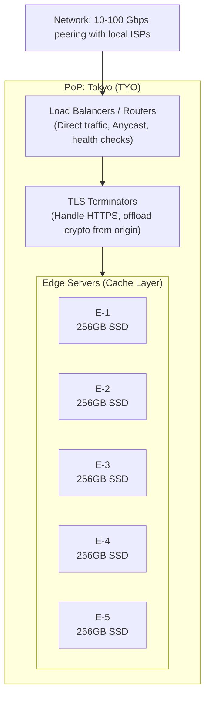
```mermaid
flowchart TD
    subgraph PoP ["PoP: Tokyo (TYO)"]
        direction TB
        LB["Load Balancers / Routers\n(Direct traffic, Anycast, health checks)"]
        TLS["TLS Terminators\n(Handle HTTPS, offload crypto from origin)"]
        subgraph Edge ["Edge Servers (Cache Layer)"]
            direction LR
            E1["E-1\n256GB SSD"]
            E2["E-2\n256GB SSD"]
            E3["E-3\n256GB SSD"]
            E4["E-4\n256GB SSD"]
            E5["E-5\n256GB SSD"]
        end
        
        LB --> TLS
        TLS --> Edge
    end
    Net["Network: 10-100 Gbps peering with local ISPs"]
    Net --> LB
```

A typical PoP consists of several distinct layers working in sequence. At the perimeter, load balancers and routers accept traffic that arrived via Anycast or DNS-directed anycast-like steering, perform health checks, and spread connections across TLS terminators that complete cryptographic handshakes at the edge. Only after TLS termination does the request reach SSD-backed cache servers that either serve a stored object or initiate an origin fetch on a cache miss. This layering matters because TLS at scale is CPU-intensive; terminating at the edge frees origin CPUs for application logic while keeping certificates and cipher policy centralized.

### 1.2 Pull vs. Push Architectures

When configuring how a CDN acquires content from your origin server, you evaluate two fundamental acquisition models. Most teams choose pull by default and add push workflows only where origin bandwidth or time-to-first-byte constraints justify the operational cost of pre-seeding.

**Pull CDN Architecture** — Pull is the default configuration for modern web delivery. Edge nodes start empty relative to your catalog; the first request for an object triggers an origin fetch, after which the response is stored locally subject to `Cache-Control` and provider rules. Pull fits dynamic sites, HTML documents, JSON APIs that tolerate short TTL caching, and frequently updated static bundles because your deployment pipeline does not need a separate upload step to the CDN—publication to origin implicitly publishes to the edge on demand. Operations teams like pull because it preserves a single source of truth at origin and lets cache behavior emerge from HTTP semantics rather than from a parallel upload pipeline that can drift out of sync during incidents.

**Push CDN Architecture** — In a push model, operators upload objects to CDN storage before user demand arrives. Large video libraries, game patches, and multi-gigabyte installer images often use push because the first viewer should never pay the cold-miss penalty of filling a global cache tree from a single origin link. Push guarantees high hit ratio for known catalogs but shifts complexity to upload orchestration, integrity checks, and cache warming schedules. When catalog size is measured in terabytes and origin egress is priced per gigabyte, push economics can dominate even though day-to-day HTML still pulls on demand.

When you **compare** pull and push during architecture review, ask whether content is discoverable at request time or known ahead of time, whether origin egress is a bottleneck, and whether a cold global miss is acceptable during viral spikes. Hybrid designs are common: pull for HTML and APIs, push for immutable media mezzanine files, with automation verifying that push manifests match the checksums your build system emitted so edges never serve truncated objects during a partial upload.

### 1.3 How CDNs Connect: Peering and Transit

CDNs achieve low latency to users by minimizing hops between edge servers and local Internet Service Providers. Public transit paths optimize for carrier economics; CDN backbones optimize for RTT and loss, which is why premium delivery networks invest heavily in private fiber and settlement-free peering at Internet exchange points (IXPs), where many networks meet in a shared switching fabric.

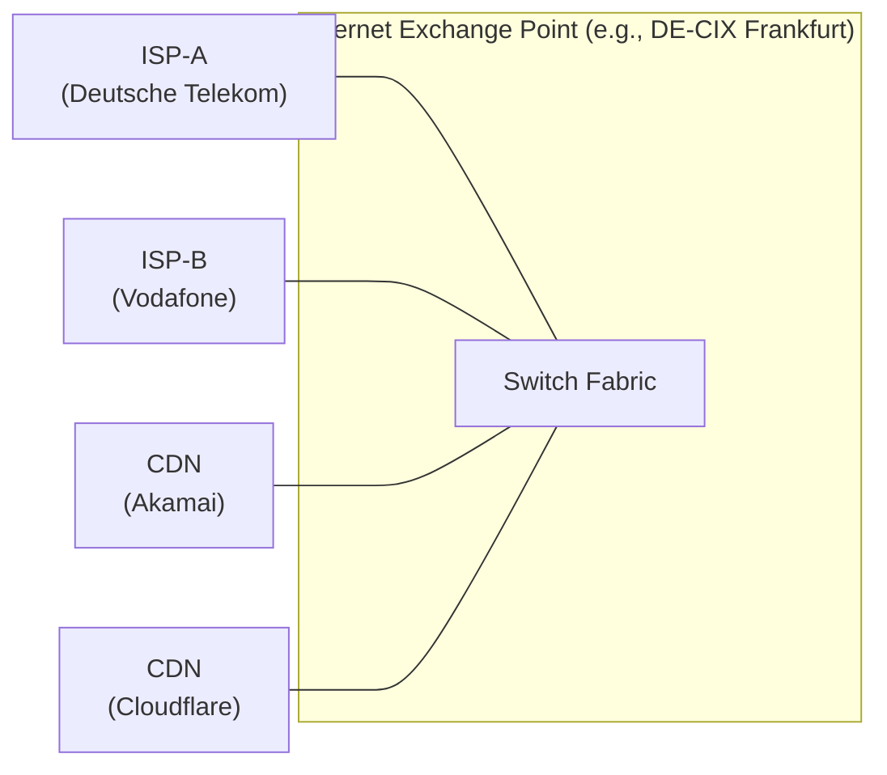
```mermaid
flowchart LR
    subgraph IXP ["Internet Exchange Point (e.g., DE-CIX Frankfurt)"]
        SF["Switch Fabric"]
    end
    
    ISPA["ISP-A\n(Deutsche Telekom)"] --- SF
    ISPB["ISP-B\n(Vodafone)"] --- SF
    CDNA["CDN\n(Akamai)"] --- SF
    CDNC["CDN\n(Cloudflare)"] --- SF
```

Direct peering at IXPs means CDN traffic destined for ISP subscribers often crosses a single hop inside the exchange fabric instead of riding unpredictable transit paths. That reduces jitter for video and API workloads and lowers packet loss during congestion events on the broader internet. Some providers go further with embedded caching—placing appliances inside ISP networks so popular objects never leave the ISP administrative domain:

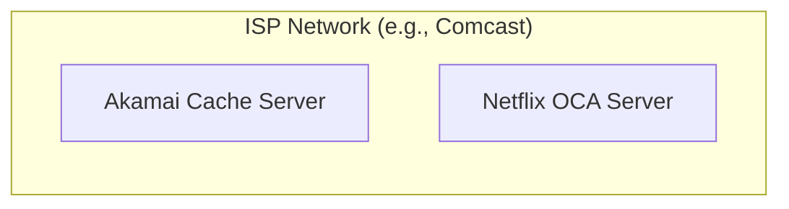
```mermaid
flowchart LR
    subgraph ISP ["ISP Network (e.g., Comcast)"]
        AC["Akamai Cache Server"]
        NC["Netflix OCA Server"]
    end
```

Embedded caches never leave the ISP's administrative domain for popular titles, which saves ISP backhaul capacity and can keep playback startup times in the low milliseconds for well-provisioned titles. The tradeoff is operational coupling: capacity planning now involves both your CDN relationship and each ISP's acceptance process, and troubleshooting spans two support organizations when playback degrades.

### 1.4 How Requests Reach the Nearest PoP

Users do not magically appear at the correct PoP; routing is a deliberate stack of DNS answers, Anycast announcements, and provider-specific traffic maps. At a high level, a hostname in your zone resolves to addresses that map onto the provider's edge anycast cloud or to region-specific names that steer clients toward a geographic footprint. Anycast—multiple PoPs announcing the same IP prefix and letting BGP choose the closest exit—is the low-latency trick behind many global edges; DNS-based weighted or latency policies add application-aware steering when you need gradual rollouts or multi-CDN splitting. For the full treatment of Anycast and DNS steering, see [Module 1.1: DNS at Scale & Global Traffic Management](../module-1.1-dns-at-scale/) and [Module 1.4: BGP & Inter-Domain Routing](../module-1.4-bgp-routing/).

Once packets arrive at a PoP, the cache layer performs a lookup on a normalized cache key derived from method, scheme, host, path, selected query parameters, and negotiated variants. Misses trigger an origin fetch—directly or via a shield tier—while hits short-circuit before your origin sees bytes. Understanding that lookup path is the foundation for every later optimization in this module: if routing sends Tokyo users to a Virginia PoP by mistake, no TTL tuning will fix the latency problem.

Routing mistakes show up in support tickets as "slow CDN" when the CDN is actually doing exactly what DNS told it to do. Always validate both geographic steering and cache behavior: traceroutes and provider debug headers confirm PoP selection; `Age` and cache status headers confirm object freshness. Teams that skip the routing layer and only tune TTLs often ship a perfectly configured cache attached to the wrong continent.

---

## Part 2: Mitigating Origin Overload with Tiered Caching

### 2.1 The Thundering Herd Problem

If your application relies solely on hundreds of independent edge PoPs, a viral event can still overwhelm your origin. Without tiered caching, every edge PoP that experiences a cache miss must independently request the same asset from your origin server simultaneously, turning a popularity spike into an origin stampede.

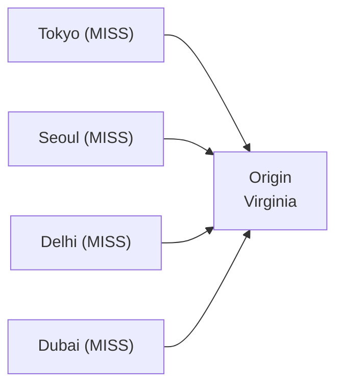
```mermaid
flowchart LR
    T["Tokyo (MISS)"] --> O["Origin\nVirginia"]
    S["Seoul (MISS)"] --> O
    D["Delhi (MISS)"] --> O
    Db["Dubai (MISS)"] --> O
```

If one hundred different global PoPs receive a request for a newly published hero image at the same time, your origin receives one hundred simultaneous fetches for identical bytes. That pattern defeats the economic purpose of a CDN for newly published objects and can collapse databases that sit behind the origin web tier unless shields or coalescing intervene early in the rollout window.

### 2.2 Implementing Origin Shielding

Modern CDNs implement tiered caching—origin shielding or midgress—to collapse those misses. Edge PoPs consult a regional shield pool before contacting your origin; only the first miss in a region fans out upstream.

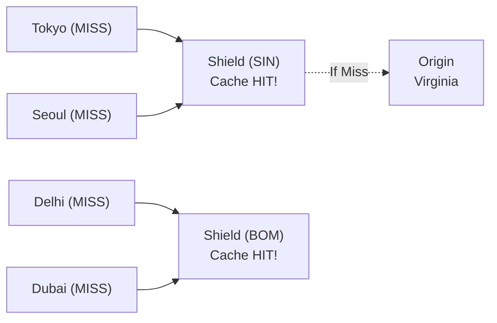
```mermaid
flowchart LR
    T["Tokyo (MISS)"] --> S1["Shield (SIN)\nCache HIT!"]
    S["Seoul (MISS)"] --> S1
    S1 -.->|If Miss| O["Origin\nVirginia"]
    
    D["Delhi (MISS)"] --> S2["Shield (BOM)\nCache HIT!"]
    Db["Dubai (MISS)"] --> S2
```

Shield servers are large, consolidated caches placed near your origin region. During a global launch, hundreds of edge nodes may miss locally, but the shield sees one miss per region, fetches once, and satisfies downstream edges from warm storage. Operations teams should monitor shield hit ratio separately from edge hit ratio; a healthy edge with a failing shield still translates viral traffic into origin pain. Capacity plans should include shield egress as well as origin egress because shields can become accidental bottlenecks if their storage or link toward origin is undersized relative to fan-in from edges.


```mermaid
flowchart LR
    E["Edge\n(330+ locations)"] --> R["Regional Edge Cache\n(13 locations)"]
    R --> S["Origin Shield\n(1 location)"]
    S --> O["Your Origin Server"]
```

---

## Part 3: Controlling the Cache (Mechanics & Headers)

### 3.1 Cache-Control Headers

The `Cache-Control` header is the universal language used to tell CDNs, corporate proxies, and browsers how to cache a response. Good CDN **design** starts here: explicit freshness beats implicit heuristics every time. The examples below show the most common response shapes you will emit from origin or edge logic.

For cacheable static assets with a known lifetime, public caching with explicit max-age is the baseline pattern:
```http
Cache-Control: public, max-age=86400
```
The `public` directive means any cache in the delivery chain may store the response. The `max-age` directive sets time-to-live in seconds for private caches such as browsers unless overridden by `s-maxage` on shared caches.

When browsers and CDNs need different freshness windows, split directives on one line:
```http
Cache-Control: public, max-age=60, s-maxage=86400
```
Browsers revalidate frequently (`max-age=60`), while the shared CDN holds the asset for a full day (`s-maxage=86400`), reducing origin load without trapping users on stale local copies for hours.

Resilience during origin slowness or failure often uses stale extensions standardized in RFC 5861:
```http
Cache-Control: public, max-age=300, stale-while-revalidate=60, stale-if-error=86400
```
`stale-while-revalidate` allows the CDN to serve slightly stale content while refreshing asynchronously in the background, hiding revalidation latency from users. `stale-if-error` permits serving stale responses when the origin is unreachable—valuable during partial outages if your content tolerates brief staleness.

Sensitive payloads must never persist on shared disks; `no-store` is the correct tool:
```http
Cache-Control: no-store
```
Use `no-store` for highly sensitive personal data, banking flows, or medical records so no intermediary persists response bodies to disk.

> **Stop and think**: A common mistake is using `no-cache` when you actually mean `no-store`. `no-cache` means "cache it, but revalidate with origin before serving" — NOT "don't cache."

Validator-based freshness uses stored copies with mandatory revalidation:
```http
Cache-Control: no-cache
ETag: "v1.2.3-abc123"
```
The CDN may store the response but must verify freshness with the origin using validators such as `ETag` or `Last-Modified` before serving. Conditional GET requests with `If-None-Match` keep bandwidth low while guaranteeing semantic freshness for HTML templates that change frequently but compress well when unchanged.

### 3.2 Cache Keys and Vary

The CDN decides whether two requests can share a cached response by hashing a deterministic cache key—typically scheme, host, path, and query string unless configured otherwise. The `Vary` response header instructs caches to fork the key based on selected request headers such as `Accept-Encoding` or negotiated language.

> **Pause and predict**: What happens to your cache hit ratio if you use `Vary: Accept-Language` without normalizing the header first? It gets destroyed!

Minimize deliberate key fragmentation. Varying on `Cookie` or raw `User-Agent` explodes cardinality because those headers carry enormous entropy. Prefer device classes, normalized `Accept` values for image formats, or client hints with small enumerated ranges. Query-string policy deserves equal scrutiny: analytics parameters appended to every URL (`?utm_source=...`) can unintentionally unique every request unless the CDN normalizes or ignores benign parameters via configured allowlists. Document which query keys participate in the hash the same way you document database indexes—future you will not remember why `sessionId` ended up in cache keys until hit ratio collapses during a marketing campaign.

### 3.3 Cache Invalidation and the Hit Ratio Tradeoff

Invalidation is the second hard problem. Purging by URL works for emergencies but scales poorly when thousands of objects change during a deploy. Pattern bans help but require careful testing to avoid evicting unrelated traffic.

```bash
# Purge a specific URL
curl -X PURGE https://cdn.example.com/image.png

# Ban by pattern (Fastly/Varnish)
curl -X BAN https://cdn.example.com/ -H "X-Ban-Pattern: /products/.*"
```

Versioned URLs—`/assets/app.a1b2c3.js` with content hashes in filenames—let you cache immutables with `max-age=31536000, immutable` and avoid purge orchestration entirely. When content changes, the URL changes, and old entries age out naturally.

### 3.4 Surrogate Keys, Cache Tags, and Purge APIs

URL-level purges do not scale when a product catalog update touches ten thousand paths. Surrogate-key (or cache-tag) models attach opaque labels to cached objects at response time—`Surrogate-Key: product-8812 category-footwear`—so operators purge `product-8812` once and every edge that stored matching objects evicts them together. The durable pattern separates identity (URL) from invalidation grouping (surrogate key). Application middleware must emit consistent keys: too granular and purges miss shards; too coarse and you flush unrelated traffic. Document key grammar in the same place you document database schema because on-call engineers will need both during incidents.

Provider purge APIs differ in idempotency, propagation time, and whether bans are regex-based or tag-based. Treat purge latency as part of your SLA story: users may still see old content until edges acknowledge eviction, which is another reason hashed immutable filenames outperform purge-heavy workflows for static bundles. When you must purge, prefer tag scopes tied to business entities (SKU, article ID, feature flag) rather than path prefixes that accidentally include marketing pages.

### 3.5 Cache Stampede, Coalescing, and Request Collapsing

When a popular object's TTL expires, many clients may miss simultaneously and stampede the origin—the same failure mode as a global cold start, but localized to one hot key. Mitigations include single-flight request coalescing (only one origin fetch per key while others wait), short soft-TTL windows with background refresh, and proactive revalidation before hard expiry using `stale-while-revalidate`. At the application layer, jittered TTLs prevent synchronized expiry across edges. These techniques complement tiered shields: shields collapse geographic fan-out, coalescing collapses temporal fan-out on a single node.

> **Hypothetical scenario:** A flash-sale badge on a product page is cached with a hard `s-maxage=60` and no stale serving. At second 60, ten thousand shoppers refresh simultaneously across three continents. Without request coalescing, each edge node that lacks the object fires an origin fetch, recreating a miniature thundering herd on a single URL even though tiered shields protect you from three-hundred-PoP fan-out. With coalescing enabled, one fetch per edge fills the slot while others wait milliseconds for the in-flight response, and with `stale-while-revalidate=30` configured, most users never observe the refresh at all because the edge serves the prior revision while one background validator updates storage.

### 3.6 End-to-End Cache Lifecycle (One Request)

Tracing a single GET helps tie headers, keys, and shields together. Suppose a client in Madrid requests `https://cdn.example.com/assets/app.9f2a.js`, which ships with `Cache-Control: public, max-age=31536000, immutable` and a filename that embeds a content hash. DNS or Anycast delivers the client to a nearby PoP where TLS terminates and the cache hash lookup runs on `(GET, https, cdn.example.com, /assets/app.9f2a.js)` without cookies in the key because static paths strip `Cookie` at the edge. On a hit, the edge returns bytes immediately with `Age` increasing each second and `X-Cache: HIT`; your origin never sees the transaction. On a miss, the edge checks the regional shield; if the shield also misses, one fetch retrieves the object from origin, stores it at both shield and edge, and responds with `X-Cache: MISS` once. Subsequent Madrid clients hit locally, while clients in other regions populate their own edges from their regional shields rather than hammering Virginia. That lifecycle is why immutable hashed assets are the highest-ROI CDN optimization: they maximize hits, minimize purge need, and make hit ratio a meaningful SLO instead of a vanity metric. Walk through the trace in your next design review: if any step cannot be explained by a named header or key rule, the architecture still contains magic—and magic becomes incidents under load.

---

## Part 4: Optimizing Dynamic Delivery and Media

### 4.1 Dynamic Content Acceleration

Even uncacheable API responses benefit from CDN presence because the edge terminates client connections and reuses warm pools toward origin. Edge nodes maintain persistent TCP and TLS sessions to origins, amortizing handshake cost across thousands of client connections that would otherwise each pay full setup latency to a distant region. Providers also negotiate modern protocols toward clients—HTTP/2 multiplexing, HTTP/3 over QUIC—while speaking whatever legacy stack your origin still runs, which lets you upgrade client experience without rewriting monolithic backends overnight.


```mermaid
flowchart LR
    C["Client\n(QUIC)"] -- "HTTP/3\n0-RTT\n~20ms" --> E["Edge"]
    E -- "HTTP/2\nmux, warm" --> O["Origin\n(H/1.1)"]
```

Private backbone paths frequently beat best-effort internet routing for loss and RTT because they optimize for delivery SLA rather than settlement-free peering policy alone.

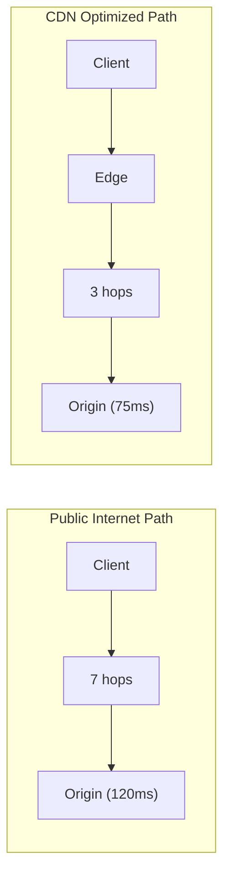
```mermaid
flowchart LR
    subgraph Public Internet Path
    C1["Client"] --> H1["7 hops"] --> O1["Origin (120ms)"]
    end
    subgraph CDN Optimized Path
    C2["Client"] --> E2["Edge"] --> H2["3 hops"] --> O2["Origin (75ms)"]
    end
```

Static acceleration caches bytes; dynamic acceleration reduces connection setup and path latency for personalized or authenticated flows that cannot be stored wholesale. Teams sometimes conflate the two and expect high cache hit ratio on API gateways that correctly emit `private` responses—those deployments still benefit from edge TLS and routing, but the success metric shifts from hit ratio to p95 origin RTT and connection reuse rather than byte sharing.

### 4.2 Image Optimization at the Edge

Images often dominate page weight. Edge image optimizers transcode, resize, and compress based on client capabilities, caching derived variants at the PoP so repeat viewers download right-sized bytes instead of multi-megabyte masters scaled down in the browser.

> **Pause and predict**: If you transform an image based on the raw `Accept` header, how many cache variations might you create? Since `Accept` headers vary widely between browsers, you must normalize them to just the formats your CDN supports (like WebP or AVIF) before generating the cache key, otherwise your hit rate will plummet.

Store one high-resolution master on origin; let the edge generate responsive derivatives on demand with bounded cache keys. The durable principle is compute-near-data: transformation happens where bytes already flow, not back at a central image worker that must push results outward afterward. Teams that skip normalization and vary on raw `Accept` headers often discover their "optimization" layer reduced hit ratio below what a dumb static PNG would have achieved, which is why image pipelines should be designed with cache cardinality budgets the same way database teams budget index count.

---

## Part 5: Edge Computing and TLS

### 5.1 What is Edge Compute?

Edge compute moves request-time logic from centralized regions to CDN PoPs so decisions happen milliseconds from the user. Instead of every authentication check crossing an ocean, a lightweight runtime validates tokens, rewrites headers, or selects routing metadata locally.

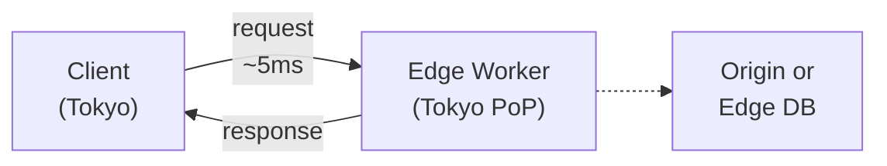
```mermaid
flowchart LR
    C["Client\n(Tokyo)"] -- "request\n~5ms" --> E["Edge Worker\n(Tokyo PoP)"]
    E -- "response" --> C
    E -.-> O["Origin or\nEdge DB"]
```

Runtimes based on V8 isolates or WebAssembly emphasize fast startup compared with container-based functions, though CPU and memory ceilings remain stricter than in a full Kubernetes pod. The durable design question is what belongs at the edge: validation, routing, and header normalization usually yes; heavy database transactions usually no. Stateful edge programs need explicit data placement—edge KV, replicated configuration, or tightly bounded caches—because PoP-local memory is ephemeral and not a substitute for a regional database. Security boundaries matter too: edge code runs in multi-tenant infrastructure, so secrets should be scoped, rotated, and injected via provider mechanisms rather than baked into source bundles checked into git.

### 5.2 Edge Compute Use Cases

Edge compute suits low-latency, state-light tasks such as JWT validation before traffic reaches your API origin.

```javascript
export default {
  async fetch(request) {
    const token = request.headers.get("Authorization");
    if (!token) {
      return new Response("Unauthorized", { status: 401 });
    }

    try {
      const payload = await verifyJWT(token, JWT_SECRET);
      // Add user info as header for origin
      const newRequest = new Request(request);
      newRequest.headers.set("X-User-ID", payload.sub);
      return fetch(newRequest);
    } catch (e) {
      return new Response("Invalid token", { status: 403 });
    }
  }
};
```

Additional patterns include A/B routing without client-side flicker, geolocation header injection, standardized security headers on legacy apps, and bot scoring before expensive origin work. When you **implement** edge logic, measure p99 latency with and without origin subrequests; an edge function that calls home on every request often adds RTT instead of removing it. Keep edge handlers deterministic and small enough to reason about during incidents—if only one engineer understands the worker, it has become undeployable production state.

### 5.3 TLS at the Edge

HTTPS termination location defines your trust boundary. Full (Strict) mode encrypts client-to-edge and edge-to-origin while validating origin certificates. Flexible mode—HTTPS to clients but plaintext to origin—exposes bytes on the backbone unless origin communication stays inside a private network.

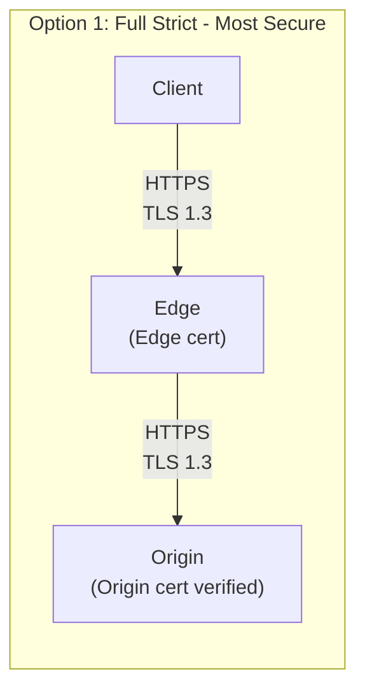
```mermaid
flowchart LR
    subgraph Option 1: Full Strict - Most Secure
    C1["Client"] -- "HTTPS\nTLS 1.3" --> E1["Edge\n(Edge cert)"]
    E1 -- "HTTPS\nTLS 1.3" --> O1["Origin\n(Origin cert verified)"]
    end
```

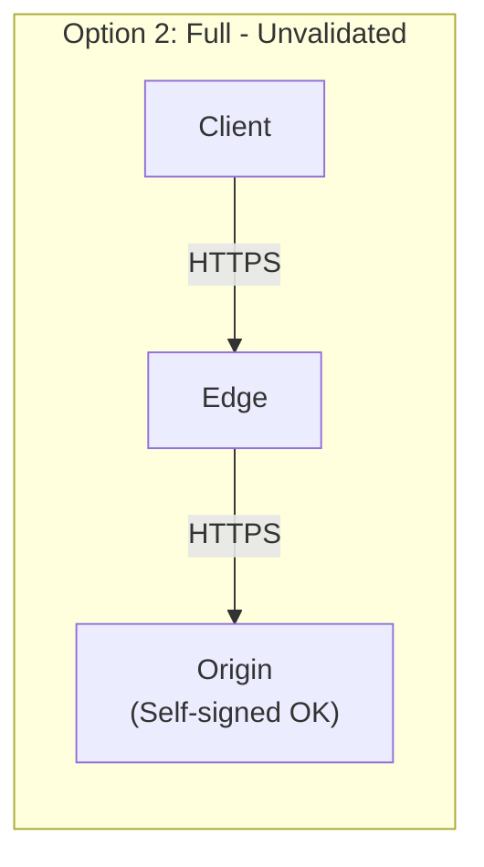
```mermaid
flowchart LR
    subgraph Option 2: Full - Unvalidated
    C2["Client"] -- "HTTPS" --> E2["Edge"]
    E2 -- "HTTPS" --> O2["Origin\n(Self-signed OK)"]
    end
```

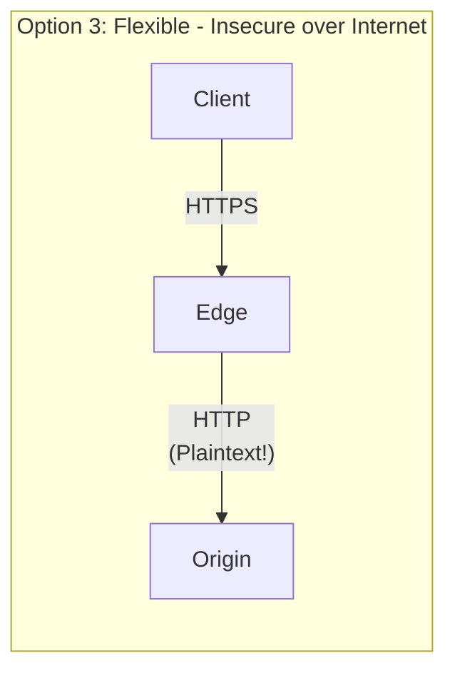
```mermaid
flowchart LR
    subgraph Option 3: Flexible - Insecure over Internet
    C3["Client"] -- "HTTPS" --> E3["Edge"]
    E3 -- "HTTP\n(Plaintext!)" --> O3["Origin"]
    end
```

> **Stop and think**: Data is unencrypted between edge and origin in Flexible mode. This is only acceptable if the edge and origin share a private network path you control.

```mermaid
flowchart LR
    subgraph Option 4: Origin Pull (mTLS)
    C4["Client"] -- "HTTPS" --> E4["Edge"]
    E4 -- "mTLS\n(Both present certs)" --> O4["Origin"]
    end
```

Mutual TLS on origin pull ensures only authorized CDN edges establish upstream connections—a strong pattern when origins are exposed on the public internet. Certificate rotation on both sides must be automated: expired origin certs break every PoP simultaneously, which looks like a CDN outage from the client perspective even when edges are healthy. Keep a calendar for edge-managed certificates separately from origin-managed ones so renewals do not collide during holiday change freezes.

Edge TLS also positions the CDN to absorb volumetric floods before they reach your cluster; for scrubbing mechanics see [Module 1.3: WAF & DDoS Mitigation](../module-1.3-waf-ddos/). The split of responsibility is durable: CDN edges handle certificate presentation to clients and bulk traffic spikes; origins enforce business authorization and data integrity on the bytes that survive filtering.

---

## Part 6: Enterprise Strategies — Evaluate, Compare, and Diagnose

### 6.1 Multi-CDN Architectures

Single-provider dependence concentrates outage blast radius. Multi-CDN strategies **compare** failover models against cost and cache warmth.

- **Active-Passive (Failover)**: Traffic uses one primary CDN; health checks shift DNS or traffic maps to a secondary when the primary fails. Cost stays lower, but the standby cache is cold, so failover can spike origin load unless you pre-warm critical objects or maintain origin headroom for refill events.
- **Active-Active (Load Balanced)**: Traffic splits continuously using RUM telemetry, geolocation, or cost policies so multiple caches stay warm. Failover is smoother because the surviving provider already serves production fractions of each object, which is why regulated industries increasingly accept the extra cost after high-profile single-provider outages.

When leadership mandates resilience after a provider incident, favor active-active if origin capacity cannot survive a global cold-cache event. Document the steering mechanism—DNS weight changes, anycast withdrawal, or client-side RUM SDK—so operators know which control plane to touch during failure and which metrics confirm traffic actually moved.

### 6.2 Diagnosing Caching Failures

When users report stale assets or missing updates, **diagnose** systematically before changing TTLs blindly. Start by isolating the edge: bypass browser caches using `curl -I` or `curl -v` against the CDN hostname, optionally with provider-specific debug headers that force a particular PoP or disable downstream caching. Next inspect cache status headers such as `X-Cache`, `CF-Cache-Status`, or `Age`. A `HIT` means the edge served stored bytes; `MISS` or `BYPASS` means the request reached origin logic, which often traces to `Cache-Control: private`, `Set-Cookie` on cacheable templates, or auth cookies included in cache keys. If `Age` exceeds effective TTL, invalidation or origin misconfiguration failed. When hit ratio collapses globally, validate `Vary` dimensions—`Vary: Cookie` and `Vary: User-Agent` are frequent culprits—and normalize or split personalized fragments instead of varying on high-entropy headers. Finally, when edges show confusing `MISS`/`HIT` alternation during steady traffic, compare response headers from a direct origin request against the CDN path; surrogate keys, `Cache-Tag`, or provider-specific `CDN-Cache-Control` headers sometimes override naive `Cache-Control` parsing, and documenting precedence saves hours during incidents.

---

## Part 7: Cache Hit Ratio as an Operational Signal

Hit ratio is the thermometer for CDN health, but it must be interpreted in context rather than chased as a single headline number. A static marketing site should run hot—often above ninety percent byte hit ratio for immutable assets—while an authenticated API gateway might legitimately sit near zero if responses are `private` or keyed on session cookies. The mistake is comparing those workloads against one dashboard threshold without segmenting by content class, PoP, and cache tier.

Operations teams should monitor at least three layers: edge hit ratio, shield hit ratio, and origin request rate per URL class. Edge misses that shield hits indicate healthy tiering; edge misses that become origin misses during steady-state traffic indicate TTL, key, or `Vary` misconfiguration. Sudden hit-ratio cliffs after deploys usually trace to accidental `Set-Cookie` on HTML templates, new query parameters appended by analytics scripts, or a changed `Vary` dimension rather than to mysterious CDN failure.

Capacity planning uses the same signals. If origin egress scales linearly with user growth while CDN spend stays flat, you are not benefiting from caching. If CDN bill grows but origin stays quiet, you may be caching low-value bytes or paying for dynamic acceleration features you do not need. Pair hit ratio with `Age` histograms and top-N miss URLs weekly so performance regressions show up in trends before marketing launches expose them.

For incident response, temporarily lowering TTL globally feels tempting but often worsens origin load during the exact moment you are fragile. Prefer surgical purges on surrogate keys, enable stale serving while fixing origin, or shift read-heavy paths to pre-warmed push objects if you maintain a catalog. After Fastly-class edge incidents, caches refill organically; origins should be sized to tolerate refill spikes even when user-facing errors have cleared, because latency can remain elevated until hot objects repopulate across PoPs.

Finally, document cache semantics in the same runbook as database failover. On-call engineers should know which paths are immutable, which APIs are never cached, which purges require change tickets, and which headers must never appear on shared HTML. That documentation is boring until the night a viral post meets a mis-set `Cache-Control` header—and then it pays for years of maintenance in a single hour.

### 7.1 When a CDN Helps—and When It Hurts

CDNs excel at read-heavy, shared bytes: static assets, public HTML shells, software downloads, and video segments with predictable caching rules. They hurt when every response is unique, legally cannot be stored, or depends on fine-grained authorization evaluated only at origin. Authentication gates, per-user pricing, medical records, and real-time bidding payloads often belong behind `private` or `no-store` policies with CDN value limited to TLS offload and DDoS absorption rather than object caching. Edge compute can still help those paths by rejecting anonymous junk early, but you should not expect high hit ratio on the response bodies themselves.

Latency-sensitive dynamic APIs sometimes see benefit from connection reuse and route optimization even at zero byte hit ratio—measure before assuming caching is the goal. Conversely, teams that force CDN caching on semi-personalized HTML to save origin cost often spend more time debugging leakage and stale carts than they saved in compute. The decision framework later in this module walks through those branches; the operational signal in Part 7 is whether your metrics match the branch you think you deployed.

Treat CDN adoption as a capacity and security contract, not only a performance feature. Procurement conversations focus on PoP maps and list prices, but engineering success depends on cache key discipline, purge runbooks, TLS modes, and multi-CDN failover drills. A well-run CDN program schedules regular game days that simulate provider failure and cache cold start while origin on-call watches request rates—exercises that reveal whether your shields, coalescing, and immutable asset strategy actually match the traffic mix you operate in production.

---

## Landscape snapshot — as of 2026-06

Vendor product names, PoP counts, edge-runtime limits, and pricing change quarterly. Treat the table below as a capability map for design conversations, not a purchase guide. Verify current limits in each vendor's documentation before committing spend or SLAs. The durable rows—caching, TLS termination, purge, shielding, edge code—appear across providers because they solve transport and HTTP problems every large site shares; only the control-plane names and quota numbers churn quickly.

| Durable capability | Illustrative products (peers, not ranked) |
|---|---|
| Global HTTP caching & TLS termination | Amazon CloudFront, Google Cloud CDN, Azure Front Door, Cloudflare CDN, Fastly, Akamai |
| DNS + traffic steering integration | Amazon Route 53, Google Cloud DNS, Azure DNS, Cloudflare DNS |
| Edge compute (request-time code) | Cloudflare Workers, Fastly Compute, Akamai EdgeWorkers, CloudFront Functions, Lambda@Edge |
| Instant / API-driven purge | All major CDNs (semantics differ: URL vs tag vs surrogate-key) |
| Tiered cache / origin shield | CloudFront Origin Shield, Cloudflare Tiered Cache, Fastly shield POPs, Akamai midgress |
| WAF + DDoS integration at edge | Cloudflare, AWS Shield + WAF, Azure Front Door WAF, Google Cloud Armor |

Cross-vendor Rosetta (rows = capability, columns = example providers):

| Capability | AWS | Google Cloud | Azure | Cloudflare | Fastly |
|---|---|---|---|---|---|
| Pull origin caching | CloudFront | Cloud CDN / Media CDN | Front Door / CDN | CDN proxy | CDN service |
| Edge JavaScript/WASM | CloudFront Functions / Lambda@Edge | Cloud CDN + Cloud Run (regional) | Front Door rules / Functions | Workers | Compute@Edge |
| Tag/key purge | CloudFront invalidation APIs | URL map / backend updates | Front Door endpoints | Surrogate-key purge | Surrogate keys |
| Private origin (mTLS) | Origin access controls | Cloud CDN signed requests | Private Link origins | Authenticated origin pulls | TLS to origin |

The Rosetta table above maps durable capabilities to illustrative provider surfaces; names change, but the capabilities—edge compute, tag purge, tiered cache, mTLS origin—recur because they solve the same physics and HTTP constraints everywhere.

---

## Patterns & Anti-Patterns

| Pattern | When to use it | Why it works |
|---|---|---|
| Content-hash immutable assets | JS/CSS/fonts with build pipelines | Infinite TTL without purge storms; browsers skip revalidation with `immutable` |
| Split HTML shell vs personalized API | Logged-in retail or SaaS dashboards | Keeps shared HTML at high hit ratio while private JSON stays `Cache-Control: private` |
| Regional origin shield | Global viral launches | Collapses hundreds of edge misses into one origin fetch per region |
| Stale-while-revalidate on semi-static HTML | News homepages, status pages | Users see instant responses while background revalidation refreshes content |
| Active-active multi-CDN with RUM steering | Revenue-critical global sites | Surviving provider already holds hot objects during peer outages |
| Normalize `Vary` dimensions | Image negotiation, language | Prevents accidental per-user cache shards |

Choosing patterns deliberately beats copying a provider cookbook. Anti-patterns below are the failures platform teams see repeatedly when caching is treated as a switch-flip rather than a contract between origin, CDN, and client behavior.

| Anti-pattern | What goes wrong | Better approach |
|---|---|---|
| Caching responses that set session cookies | Cross-user leakage | Mark HTML private or strip cookies on cacheable static paths |
| Purge-only deploy workflow | Slow, incomplete invalidation | Prefer hashed filenames; purge only for emergencies |
| Edge functions with synchronous origin RPC | Adds RTT; negates edge value | Cache decisions locally; use edge KV for small state |
| Flexible TLS over the public internet | Plaintext origin segment | Full (Strict) HTTPS or private connectivity |
| `Vary: User-Agent` without normalization | Near-zero hit ratio | Responsive design or coarse device classes |
| Ignoring shield metrics | Origin spikes despite "good" edge hits | Dashboard edge vs shield vs origin separately |

---

## Decision Framework

Use this flow when deciding whether to front a workload with a CDN and how aggressively to cache it.

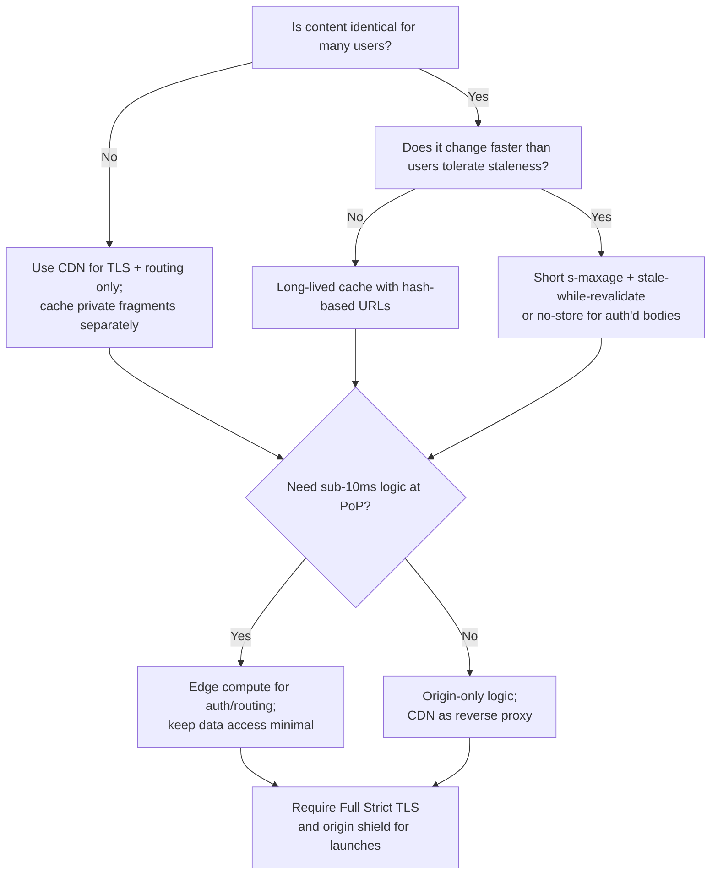
```mermaid
flowchart TD
    A[Is content identical for many users?] -->|No| B[Use CDN for TLS + routing only;\ncache private fragments separately]
    A -->|Yes| C[Does it change faster than users tolerate staleness?]
    C -->|Yes| D[Short s-maxage + stale-while-revalidate\nor no-store for auth'd bodies]
    C -->|No| E[Long-lived cache with hash-based URLs]
    B --> F{Need sub-10ms logic at PoP?}
    E --> F
    D --> F
    F -->|Yes| G[Edge compute for auth/routing;\nkeep data access minimal]
    F -->|No| H[Origin-only logic;\nCDN as reverse proxy]
    G --> I[Require Full Strict TLS\nand origin shield for launches]
    H --> I
```

The flowchart summarizes policy branches; the matrix below translates them into review questions you can paste directly into design documents. Require one command, dashboard, or test artifact for every "yes" answer before production cutover.

| Question | If yes | If no |
|---|---|---|
| Can HTML be shared without cookies? | Cache HTML at CDN with `s-maxage` | Split static shell + async personalization API |
| Will a launch spike miss globally? | Enable origin shield + request coalescing | Edge-only caching may suffice |
| Is hit ratio below target for static assets? | Audit `Vary`, query-string policy, cookies | Investigate origin `Cache-Control` mistakes first |
| Does compliance forbid shared caches? | `private` / `no-store` on sensitive routes | Broader caching OK |
| Is a CDN outage unacceptable? | Active-active multi-CDN | Document cold-cache origin capacity for failover |
| Do clients need HTTP/3 while origin speaks HTTP/1.1? | Terminate modern protocols at edge | Direct origin may be simpler |

---

## Did You Know?

- **Netflix Open Connect appliances embed caches inside ISP networks** to keep video bytes off congested transit links. Netflix publishes that Open Connect serves a large fraction of its traffic from ISP-located hardware rather than from the public internet backbone alone, which is why peak-hour viewing scales without linearly scaling central origin egress.
- **Akamai pioneered commercial CDN services in the late 1990s** and still operates one of the largest distributed caching platforms on the internet. Their July 2021 DNS-related service disruption briefly affected high-profile customers—a reminder that even mature edge networks require change management and independent failover paths.
- **The `stale-while-revalidate` Cache-Control extension was standardized in RFC 5861 in 2010**, but mainstream browser support arrived later; Chrome added native handling in version 75 per web.dev compatibility notes. CDNs and reverse proxies implemented the pattern years earlier, so operations teams could benefit before browsers caught up.
- **In February 2023, Cloudflare reported mitigating HTTP DDoS attacks exceeding 71 million requests per second**, sourced from tens of thousands of IPs—evidence that modern edges must absorb application-layer floods far beyond what a single origin cluster could survive alone.

---

## Common Mistakes

| Mistake | Problem | Solution |
|---------|---------|----------|
| Caching responses with `Set-Cookie` | Users see other users' sessions | `Cache-Control: private` for personalized content |
| `Vary: User-Agent` | Thousands of cache variants, near-zero hit rate | Normalize to device class (mobile/desktop/tablet) |
| No `s-maxage` distinct from `max-age` | Browser and CDN cache for same duration | Use `s-maxage` for CDN, `max-age` for browser |
| Cache busting via query string only | Some CDNs ignore query strings by default | Use filename hashing: `app.a1b2c3.js` |
| Flexible TLS (HTTP between edge and origin) | Data exposed on the wire between CDN and origin | Use Full (Strict) with validated origin certificate |
| Not setting `immutable` on hashed assets | Browsers revalidate on refresh despite long max-age | Add `immutable` to skip revalidation entirely |
| Single CDN provider without failover | CDN outage becomes your outage | Multi-CDN with health-checked steering |
| Edge functions calling origin on every request | Adds latency, defeats purpose of edge compute | Cache at edge, use edge KV stores when possible |

---

## Quiz

1. **You are optimizing the caching strategy for a global news website's homepage, which updates frequently. You want returning readers to experience zero latency, but you also want to reduce load on your origin server and keep the news relatively fresh. How would you use `max-age`, `s-maxage`, and `stale-while-revalidate` to achieve this?**
<details>
   <summary>Answer</summary>

   By combining these three directives, you create a tiered caching strategy that balances instant load times with freshness—exactly the kind of CDN caching **design** teams use for semi-dynamic HTML. Setting `max-age=0` forces browsers to revalidate, ensuring they never use an outdated local copy without checking first. Setting `s-maxage=300` allows the CDN to cache the homepage for five minutes, shielding the origin from thousands of concurrent readers during that window. Adding `stale-while-revalidate=60` ensures that when the CDN TTL expires, the next user is not blocked on a slow origin fetch; the edge serves a slightly stale copy while asynchronously refreshing from origin. No user waits on cross-region origin RTT, and content is bounded by roughly six minutes of staleness unless you purge manually.
   </details>

2. **Your team notices that your CDN cache hit rate has plummeted to 2% after a new release. You inspect the HTTP headers and discover `Vary: User-Agent` was added so the backend could return different HTML for mobile and desktop users. Why did this destroy your hit rate, and how should you redesign this delivery?**
<details>
   <summary>Answer</summary>

   The `Vary` header instructs the CDN to cache a separate copy of the response for every unique value of the specified header. Because there are thousands of unique `User-Agent` strings in the wild, the CDN treats almost every request as unique, preventing cache sharing and driving hit ratio toward zero. To **diagnose** and fix this class of failure, normalize variation: use client hints like `Sec-CH-UA-Mobile`, rely on provider device-type headers, or serve one responsive HTML document styled with CSS media queries. Each approach restores a small set of cache variants instead of one shard per browser fingerprint.
   </details>

3. **Your startup just launched a viral campaign, and traffic is spiking globally. You are using a CDN with 300+ edge locations, but your single origin server in Virginia is still getting overwhelmed by thousands of cache miss requests for new content. How would implementing tiered caching resolve this "thundering herd" problem?**
<details>
   <summary>Answer</summary>

   Without tiered caching, every edge PoP that misses independently fetches the same object from origin, so a viral asset can generate hundreds of simultaneous origin requests. Tiered caching inserts a regional shield between edges and origin; the first miss in a region populates the shield, and subsequent edge misses in that region are satisfied locally. Origin sees one fetch per region instead of one per PoP, which is how teams **evaluate** shielding when origin capacity is finite during launches.
   </details>

4. **You need to validate JWT tokens before API traffic reaches origin. When would you choose lightweight edge runtimes (CloudFront Functions, Cloudflare Workers) versus heavier edge functions (Lambda@Edge) for this **implement**ation?**
<details>
   <summary>Answer</summary>

   Match runtime to logic weight and latency budget. CloudFront Functions and similar micro-runtimes suit sub-millisecond header checks with tight CPU limits and no network subrequests—ideal for pure JWT signature verification with embedded keys. Cloudflare Workers or Fastly Compute fit richer routing, WASM modules, or moderate outbound fetches with still-low cold start. Lambda@Edge (or regional functions behind CloudFront) makes sense when you need larger libraries, longer execution windows, or AWS-native integrations despite higher cold-start latency. If every request must stay under a few milliseconds at PoP, prefer the smallest runtime that can complete crypto locally without calling origin.
   </details>

5. **You are architecting product pages for a flash sale. Product HTML is identical for all visitors, but the navigation bar shows the logged-in user's name and cart count. How can you architect this page to achieve a high CDN cache hit rate without cross-user leakage?**
<details>
   <summary>Answer</summary>

   Decouple static merchandise HTML from personalized state. Cache the shared product document at the CDN with a long `s-maxage`, and load name/cart data via a small private API (`Cache-Control: private`) invoked from JavaScript after paint. Users get instant shell rendering from the edge while personalization arrives milliseconds later—standard **design** for e-commerce CDNs that must never serve one shopper's session HTML to another.
   </details>

6. **After a three-hour CDN provider outage, leadership mandates multi-CDN resilience. Which architecture minimizes cold-cache origin floods during failover, and why?**
<details>
   <summary>Answer</summary>

   Active-active multi-CDN with RUM or DNS steering keeps both providers serving production traffic continuously, so caches on each side stay warm. Active-passive failover is cheaper but leaves the standby CDN cold; when the primary fails, a sudden traffic shift can miss globally and **compare** unfavorably against origin capacity you sized for normal steady state. Warm secondary caches are the difference between seamless failover and a second outage triggered by your own origin.
   </details>

---

## Hands-On Exercise

**Objective**: Deploy a functional static site with complex CDN-style caching, robust custom cache headers, and an edge function simulation that dynamically injects strict security headers. You will observe how origin policy (`Cache-Control`, cookie handling) and edge policy (VCL header injection, cookie stripping on static paths) interact—the same separation production teams maintain when origin developers own freshness semantics and platform teams own edge safety controls.

**Environment**: A local kind cluster running nginx as your origin server and Varnish simulating your global CDN edge network. The lab mirrors production separation of concerns: origin emits cache policy, edge enforces keying and optional request-time header injection, and clients observe HIT/MISS through diagnostic response headers rather than guessing from latency alone.

### Task 1: Deploy the Origin Server
Provision a robust kind cluster and deploy an nginx origin server containing varied HTML, CSS, JS, and SVG assets. You must carefully configure the web server with highly specific `Cache-Control` headers tailored for both dynamic HTML responses and deeply cacheable static assets.

<details>
<summary>Solution: Deploy Origin</summary>

```bash
# Create a kind cluster
kind create cluster --name cdn-lab

# Create a static site with different asset types
cat <<'EOF' | kubectl apply -f -
apiVersion: v1
kind: ConfigMap
metadata:
  name: static-site
data:
  index.html: |
    <!DOCTYPE html>
    <html>
    <head>
      <title>CDN Lab</title>
      <link rel="stylesheet" href="/assets/style.css">
    </head>
    <body>
      <h1>CDN & Edge Computing Lab</h1>
      <p>Served at: <span id="time"></span></p>
      
      <script src="/assets/app.js"></script>
    </body>
    </html>
  style.css: |
    body { font-family: sans-serif; max-width: 800px; margin: 2em auto; }
    h1 { color: #2563eb; }
  app.js: |
    document.getElementById('time').textContent = new Date().toISOString();
  logo.svg: |
    <svg xmlns="http://www.w3.org/2000/svg" width="100" height="100">
      <circle cx="50" cy="50" r="40" fill="#2563eb"/>
      <text x="50" y="55" text-anchor="middle" fill="white" font-size="16">CDN</text>
    </svg>
  nginx.conf: |
    server {
      listen 80;

      # HTML — short cache, revalidate
      location / {
        root /usr/share/nginx/html;
        index index.html;
        add_header Cache-Control "public, max-age=0, s-maxage=60, stale-while-revalidate=30";
        add_header X-Served-By "origin";
      }

      # Static assets — long cache, immutable
      location /assets/ {
        alias /usr/share/nginx/html/assets/;
        add_header Cache-Control "public, max-age=31536000, immutable";
        add_header X-Served-By "origin";
      }

      # Health check
      location /healthz {
        default_type text/plain;
        return 200 'OK';
      }
    }
---
apiVersion: apps/v1
kind: Deployment
metadata:
  name: origin
spec:
  replicas: 1
  selector:
    matchLabels:
      app: origin
  template:
    metadata:
      labels:
        app: origin
    spec:
      containers:
        - name: nginx
          image: nginx:1.27
          ports:
            - containerPort: 80
          volumeMounts:
            - name: config
              mountPath: /etc/nginx/conf.d/default.conf
              subPath: nginx.conf
            - name: html
              mountPath: /usr/share/nginx/html/index.html
              subPath: index.html
            - name: assets-css
              mountPath: /usr/share/nginx/html/assets/style.css
              subPath: style.css
            - name: assets-js
              mountPath: /usr/share/nginx/html/assets/app.js
              subPath: app.js
            - name: assets-svg
              mountPath: /usr/share/nginx/html/assets/logo.svg
              subPath: logo.svg
      volumes:
        - name: config
          configMap:
            name: static-site
            items: [{ key: nginx.conf, path: nginx.conf }]
        - name: html
          configMap:
            name: static-site
            items: [{ key: index.html, path: index.html }]
        - name: assets-css
          configMap:
            name: static-site
            items: [{ key: style.css, path: style.css }]
        - name: assets-js
          configMap:
            name: static-site
            items: [{ key: app.js, path: app.js }]
        - name: assets-svg
          configMap:
            name: static-site
            items: [{ key: logo.svg, path: logo.svg }]
---
apiVersion: v1
kind: Service
metadata:
  name: origin
spec:
  selector:
    app: origin
  ports:
    - port: 80
EOF
```

</details>

### Task 2: Deploy the CDN Simulator
Deploy Varnish cache to act dynamically as your edge node. Configure the VCL (Varnish Configuration Language) to act as an intelligent reverse proxy, explicitly stripping cookies from static assets to ensure high cacheability, injecting verifiable cache hit/miss diagnostic indicators, and injecting rigorous security headers to simulate programmatic edge compute logic.

<details>
<summary>Solution: Deploy Edge Simulation</summary>

```bash
cat <<'EOF' | kubectl apply -f -
apiVersion: v1
kind: ConfigMap
metadata:
  name: varnish-config
data:
  default.vcl: |
    vcl 4.1;

    backend origin {
      .host = "origin";
      .port = "80";
      .probe = {
        .url = "/healthz";
        .interval = 5s;
        .timeout = 2s;
        .threshold = 3;
        .window = 5;
      }
    }

    sub vcl_recv {
      # Strip cookies for static assets (improve cache hit rate)
      if (req.url ~ "\.(css|js|svg|png|jpg|gif|ico|woff2)$") {
        unset req.http.Cookie;
      }
    }

    sub vcl_backend_response {
      # Add cache status header
      set beresp.http.X-Cache-TTL = beresp.ttl;
    }

    sub vcl_deliver {
      # Add hit/miss indicator
      if (obj.hits > 0) {
        set resp.http.X-Cache = "HIT";
        set resp.http.X-Cache-Hits = obj.hits;
      } else {
        set resp.http.X-Cache = "MISS";
      }

      # Security headers (simulating edge function)
      set resp.http.X-Content-Type-Options = "nosniff";
      set resp.http.X-Frame-Options = "DENY";
      set resp.http.Referrer-Policy = "strict-origin-when-cross-origin";
      set resp.http.Strict-Transport-Security = "max-age=63072000; includeSubDomains";
      set resp.http.Content-Security-Policy = "default-src 'self'; style-src 'self' 'unsafe-inline'; script-src 'self' 'unsafe-inline'";
    }
---
apiVersion: apps/v1
kind: Deployment
metadata:
  name: cdn-edge
spec:
  replicas: 2
  selector:
    matchLabels:
      app: cdn-edge
  template:
    metadata:
      labels:
        app: cdn-edge
    spec:
      containers:
        - name: varnish
          image: varnish:8
          ports:
            - containerPort: 80
          args:
            - "-F"
            - "-f"
            - "/etc/varnish/default.vcl"
            - "-s"
            - "malloc,256m"
            - "-a"
            - "0.0.0.0:80"
          volumeMounts:
            - name: config
              mountPath: /etc/varnish/default.vcl
              subPath: default.vcl
      volumes:
        - name: config
          configMap:
            name: varnish-config
---
apiVersion: v1
kind: Service
metadata:
  name: cdn-edge
spec:
  selector:
    app: cdn-edge
  ports:
    - port: 80
EOF
```

</details>

### Task 3: Test Dynamic Caching Behavior
Launch an interactive test client within the cluster sandbox to execute raw HTTP requests against the CDN edge. You must empirically verify that the very first request results in a MISS, subsequent requests result in a HIT, and that edge-injected security headers are successfully present in the payload.

<details>
<summary>Solution: Test Caching</summary>

```bash
# Deploy a test client
kubectl run test-client --image=curlimages/curl:8.11.1 --rm -it -- sh

# Inside the test client:

# 1. First request (cache MISS)
curl -sI http://cdn-edge/ | grep -E "X-Cache|Cache-Control|X-Served"

# Expected:
# X-Cache: MISS
# Cache-Control: public, max-age=0, s-maxage=60, stale-while-revalidate=30

# 2. Second request (cache HIT)
curl -sI http://cdn-edge/ | grep -E "X-Cache|Cache-Control"

# Expected:
# X-Cache: HIT
# X-Cache-Hits: 1

# 3. Check security headers from "edge function"
curl -sI http://cdn-edge/ | grep -E "X-Content-Type|X-Frame|Referrer|Strict-Transport|Content-Security"

# 4. Test static assets (long cache)
curl -sI http://cdn-edge/assets/style.css | grep -E "X-Cache|Cache-Control"

# Expected:
# Cache-Control: public, max-age=31536000, immutable

# 5. Rapid requests — watch hit count increase
for i in $(seq 1 10); do
  echo "Request $i:"
  curl -sI http://cdn-edge/ | grep "X-Cache"
done
```

</details>

### Task 4: Measure System Cache Effectiveness
Compare the empirical response latency between making sequential requests directly to the origin server versus making the same requests to the populated, hot CDN edge.

<details>
<summary>Solution: Measure Latency</summary>

```bash
# Still inside test client:

# Compare direct origin vs CDN edge
echo "=== Direct to Origin ==="
time curl -so /dev/null http://origin/
time curl -so /dev/null http://origin/
time curl -so /dev/null http://origin/

echo "=== Via CDN Edge (cached) ==="
time curl -so /dev/null http://cdn-edge/
time curl -so /dev/null http://cdn-edge/
time curl -so /dev/null http://cdn-edge/

# The CDN responses should be faster after the first request
# because they're served from Varnish cache without hitting origin
```

</details>

### Task 5: Clean Up

Destroy the temporary cluster network to safely free up your local orchestration resources when you finish capturing observations.

<details>
<summary>Solution: Teardown</summary>

```bash
kind delete cluster --name cdn-lab
```

</details>

**Success Checklist**:
- [ ] Observed deterministic cache MISS on the first request and HIT on subsequent repeated requests.
- [ ] Verified different `Cache-Control` directives for HTML payloads versus static assets.
- [ ] Confirmed security headers injected by the Varnish edge layer.
- [ ] Measured latency difference between direct origin access and cached edge responses.

---

## Sources

- [RFC 5861 — HTTP Cache-Control Extensions for Stale Content](https://datatracker.ietf.org/doc/html/rfc5861)
- [RFC 9111 — HTTP Caching](https://datatracker.ietf.org/doc/html/rfc9111)
- [RFC 9110 — HTTP Semantics (Cache-Control overview)](https://datatracker.ietf.org/doc/html/rfc9110)
- [MDN — Cache-Control header](https://developer.mozilla.org/en-US/docs/Web/HTTP/Reference/Headers/Cache-Control)
- [web.dev — Keeping things fresh with stale-while-revalidate](https://web.dev/articles/stale-while-revalidate)
- [MDN — CDN (Content Delivery Network) Glossary](https://developer.mozilla.org/en-US/docs/Glossary/CDN)
- [Amazon CloudFront — How CloudFront delivers content](https://docs.aws.amazon.com/AmazonCloudFront/latest/DeveloperGuide/HowCloudFrontWorks.html)
- [Google Cloud CDN — Overview](https://cloud.google.com/cdn/docs/overview)
- [Varnish Cache — The VCL Guide](https://varnish-cache.org/docs/trunk/users-guide/vcl-guide.html)
- [Cloudflare Blog — Record-breaking 71 million rps DDoS attack (February 2023)](https://blog.cloudflare.com/cloudflare-mitigates-record-breaking-71-million-request-per-second-ddos-attack/)
- [Google SRE Book — Addressing Cascading Failures (load and overload)](https://sre.google/sre-book/addressing-cascading-failures/)

---

## Next Module

[Module 1.3: WAF & DDoS Mitigation](../module-1.3-waf-ddos/) — Learn exactly how Web Application Firewalls secure endpoints against devastating OWASP Top 10 vulnerabilities directly at the edge, and dive deep into how global CDNs algorithmically scrub massive DDoS floods before they ever touch your vulnerable infrastructure.
