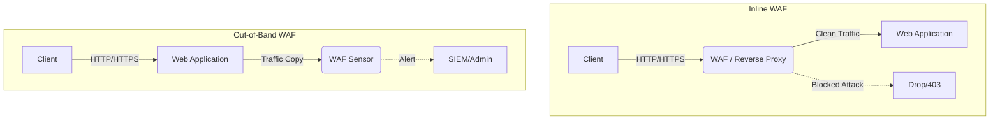
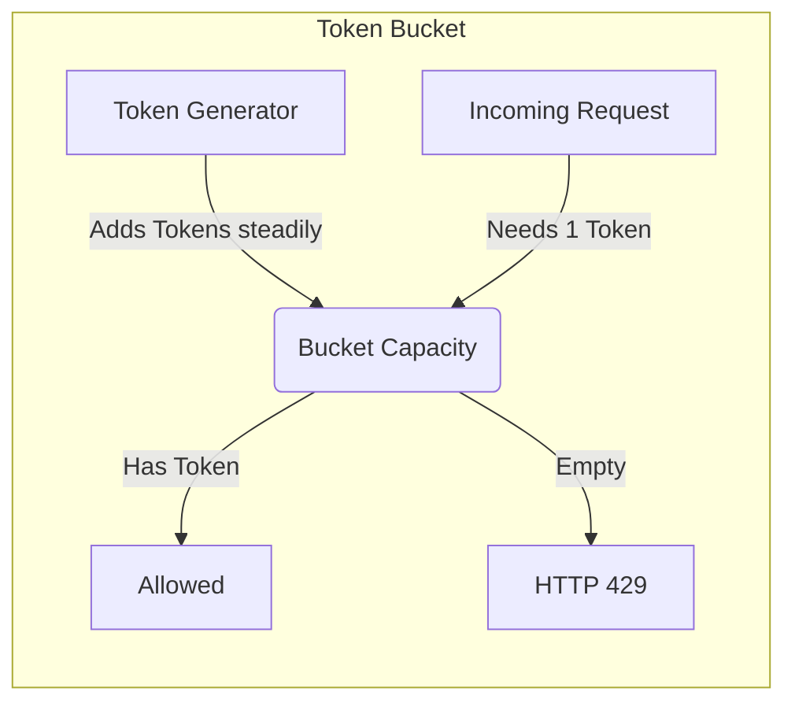

> **Complexity**: `[MEDIUM]`
>
> **Time to Complete**: 2.5 hours
>
> **Prerequisites**: [Module 1.2: CDN & Edge Computing](../module-1.2-cdn-edge/), basic web security concepts (HTTP methods, SQL, XSS)
>
> **Track**: Foundations — Advanced Networking

### What You'll Be Able to Do

After completing this module, you will be able to:

1. **Design** WAF rule sets that protect against OWASP Top 10 attacks without generating excessive false positives on legitimate traffic
2. **Implement** layered DDoS mitigation strategies combining network-level scrubbing, rate limiting, and application-level bot detection
3. **Evaluate** WAF deployment modes (inline vs. out-of-band, managed vs. custom rules) and their impact on latency, coverage, and operational burden
4. **Analyze** attack traffic patterns to distinguish volumetric, protocol, and application-layer DDoS attacks and select appropriate countermeasures

---

**September 2017. Equifax, one of the three major US credit bureaus, discloses a breach that exposed the personal data of 147 million Americans — Social Security numbers, birth dates, addresses, and driver's license numbers.**

The root cause? An unpatched Apache Struts vulnerability (CVE-2017-5638) that had a public patch available for two months before the breach. An attacker sent a crafted `Content-Type` header containing an OGNL expression that achieved remote code execution. A single malicious HTTP request, buried in normal traffic, compromised one of the largest repositories of personal data in the United States.

A properly configured Web Application Firewall would have blocked that request on day one. The OGNL injection pattern was well-known. The exploit matched signatures that WAF vendors had deployed within days of the CVE disclosure. **Equifax didn't need to patch faster — they needed a layer of defense that bought them time.**

This is the core promise of WAFs and DDoS mitigation: not perfection, but defense in depth. They don't replace good application security practices, but they catch what slips through — and when the entire internet decides to attack you at once, they're often the only thing standing between your application and total darkness.

---

## Why This Module Matters

Every application exposed to the internet is under constant attack. Not "might be attacked someday" — under attack right now, continuously, from automated scanners, botnets, and targeted adversaries. A typical public-facing web application sees thousands of malicious requests per day: SQL injection probes, cross-site scripting attempts, credential stuffing attacks, and vulnerability scanners looking for unpatched software.

WAFs provide a layer of protection between attackers and your application. They inspect HTTP traffic in real time, matching requests against known attack patterns and behavioral anomalies. When configured correctly, they block attacks that would otherwise exploit vulnerabilities in your code, your frameworks, or your infrastructure.

DDoS mitigation addresses a fundamentally different threat: overwhelming your application with sheer volume. When millions of compromised devices flood your servers with traffic, no amount of application security helps. You need network-level defenses that can absorb and filter traffic at scales that would crush any single server or datacenter.

> **The Bouncer Analogy**
>
> Think of a WAF as the bouncer at a nightclub. The bouncer checks IDs (validates inputs), turns away known troublemakers (blocks malicious signatures), and watches for suspicious behavior (detects anomalies). DDoS protection is more like crowd control outside the venue — when ten thousand people show up at once, you need barriers, police, and a plan that goes beyond what one bouncer can handle.

---

## What You'll Learn

- WAF architecture and inspection methods
- OWASP Top 10 and how WAF rules address each category
- Rate limiting algorithms: token bucket and leaky bucket
- Bot management and the arms race with automation
- DDoS attack taxonomy: volumetric, protocol, and application layer
- Tuning WAFs to minimize false positives
- Hands-on: Deploying a WAF with SQLi blocking and rate limiting

---

## Part 1: Web Application Firewall Architecture

### Deployment Modes

A WAF must inspect HTTP/S traffic, which means it needs access to the unencrypted payload. This generally requires TLS termination to happen at or before the WAF. There are two primary deployment modes:

1. **Inline (Reverse Proxy)**: The WAF sits directly in the traffic path. All requests pass through the WAF before reaching the application. If the WAF detects an attack, it can actively block the request (drop or return a 403 Forbidden). This is the most common and effective deployment for modern web applications, often integrated into an Ingress Controller or Edge CDN.
2. **Out-of-Band (Passive/Monitoring)**: The WAF receives a copy of the traffic (e.g., via a SPAN port or traffic mirroring). It analyzes the traffic asynchronously. If it detects an attack, it cannot drop the request directly; it must signal another device (like a firewall) to block the IP, or simply generate an alert. This mode introduces zero latency to the application but cannot guarantee the blocking of a single-request exploit (like the Equifax Struts vulnerability).

> **Stop and think**: If your application is highly sensitive to latency (e.g., high-frequency trading API) but still requires security visibility, which deployment mode would you choose, and what risks are you accepting?

### Security Models

WAFs evaluate traffic using two primary philosophies:

- **Negative Security (Blocklisting)**: Deny known bad. The WAF maintains a list of signatures for known attacks (e.g., SQLi patterns, malicious user agents). Anything not explicitly forbidden is allowed. This is easy to deploy but struggles against zero-day attacks.
- **Positive Security (Allowlisting)**: Allow only known good. The WAF enforces strict schemas, accepted HTTP methods, specific header lengths, and valid parameter types. Anything not explicitly permitted is blocked. This provides excellent security but requires meticulous configuration and constant maintenance as the application evolves.

Most modern WAFs use a hybrid approach: they use managed blocklists (like the OWASP Core Rule Set) to catch common attacks instantly, while allowing administrators to define allowlists for highly sensitive API endpoints.

---

## Part 2: Addressing the OWASP Top 10

The Open Web Application Security Project (OWASP) Top 10 represents the most critical security risks to web applications. A WAF is primarily designed to mitigate these exact vulnerabilities.

### SQL Injection (SQLi) and Cross-Site Scripting (XSS)

These are the bread-and-butter of WAF capabilities. WAFs inspect the URL path, query string, headers, and body payload (including JSON and XML) for malicious syntax.

For example, a WAF signature might look for SQL keywords mixed with punctuation, such as `' OR 1=1 --`. If a user submits a form where the `username` field is `admin' --`, the WAF triggers a rule violation.

### Broken Access Control & Authentication

A WAF *cannot* fix bad authorization logic in your code. If user A is allowed to view user B's invoice by simply changing a URL parameter (`/invoice/1234` to `/invoice/1235`), the WAF cannot easily detect this unless it deeply understands your application's state and session management (which is rare). 

However, a WAF *can* protect authentication endpoints against brute force and credential stuffing attacks using rate limiting and bot detection.

> **Pause and predict**: If an attacker discovers a zero-day vulnerability in your application's custom business logic (e.g., a multi-step workflow flaw), will the WAF's default signature set protect you? Why or why not?

---

## Part 3: Rate Limiting Algorithms

Rate limiting prevents a single client from overwhelming your service. It is a fundamental defense against both abuse (like scraping or credential stuffing) and application-layer DDoS attacks.

Understanding *how* rate limiting is calculated is critical for configuring it correctly.

### The Token Bucket

Imagine a bucket that holds a maximum number of tokens. Every second, a new token is added to the bucket (up to the maximum capacity). When a request arrives, it must take a token from the bucket to proceed. 
- If the bucket has tokens, the request is allowed.
- If the bucket is empty, the request is rejected (typically with an `HTTP 429 Too Many Requests`).

**Why use it?** Token bucket allows for short bursts of traffic. If a user hasn't made requests in a while, their bucket fills up, allowing them to make several rapid requests simultaneously (like loading a web page with many assets) before the strict per-second rate limit enforces pacing.

### The Leaky Bucket

Imagine a bucket with a hole in the bottom. Requests are poured into the top of the bucket. They leak out of the bottom at a constant, steady rate (processed by the server).
- If requests pour in faster than they leak out, the bucket fills up.
- If the bucket overflows, new requests are discarded.

**Why use it?** Leaky bucket enforces a perfectly smooth, constant output rate. It smooths out bursts entirely, ensuring the backend server is never hit with concurrent spikes, but it can artificially delay requests during a burst.

---

## Part 4: Bot Management and the Arms Race

Not all automated traffic is malicious (e.g., Googlebot), but malicious automated traffic (credential stuffing, scraping, vulnerability scanning) constitutes a massive portion of internet noise.

Simple WAF rules block "dumb" bots:
- Missing `User-Agent` headers.
- Known malicious IP addresses.
- Requests exceeding humanly possible rate limits.

However, attackers adapt. The modern arms race involves advanced botnets that rotate through millions of residential IP proxies, execute JavaScript, mimic human mouse movements, and throttle their own request rates to fly under the radar.

Advanced Bot Management solutions use:
1. **Device Fingerprinting**: Collecting signals from the client browser (canvas rendering, installed fonts, WebGL parameters) to uniquely identify the device regardless of its IP address.
2. **Behavioral Analysis**: Training machine learning models on what "normal" traffic looks like for *your* specific application, and blocking sessions that deviate from the baseline.
3. **Challenges**: Silently injecting JavaScript challenges (like Proof of Work) or presenting CAPTCHAs when traffic is suspicious.

---

## Part 5: DDoS Attack Taxonomy

Distributed Denial of Service (DDoS) attacks aim to exhaust resources so legitimate users cannot access the service. These attacks target different layers of the OSI model and require different mitigation strategies.

### 1. Volumetric Attacks (Layer 3/4)
**Goal:** Consume all available bandwidth between the target and the internet.
**Mechanism:** Often relies on Amplification (e.g., DNS or NTP amplification), where an attacker sends a small spoofed request to a vulnerable public server, which replies with a massive response directed at the victim.
**Mitigation:** You cannot mitigate this on your own servers; your internet pipe is already full. You must use a cloud-based DDoS scrubbing service (like Cloudflare, AWS Shield, or Akamai) that has massive global network capacity to absorb the traffic and drop the junk before it reaches your datacenter.

### 2. Protocol Attacks (Layer 3/4)
**Goal:** Exhaust state table capacity in firewalls, load balancers, or servers.
**Mechanism:** SYN Floods are the classic example. The attacker initiates millions of TCP connections (SYN) but never completes the handshake (ACK). The server leaves the connections half-open, quickly running out of memory to track new connections.
**Mitigation:** SYN cookies (handling handshakes statelessly), dropping malformed packets, and specialized hardware firewalls.

### 3. Application Layer Attacks (Layer 7)
**Goal:** Exhaust application resources (CPU, memory, database connections) using seemingly legitimate HTTP requests.
**Mechanism:** HTTP Floods. The attacker might request a search endpoint that requires heavy database queries, or repeatedly download a large PDF. The bandwidth used is small, but the server CPU spikes to 100%.
**Mitigation:** This is where the WAF, rate limiting, and bot management shine. Identifying behavioral anomalies and rate-limiting expensive endpoints is critical.

---

## Part 6: Tuning WAFs (The False Positive Problem)

The hardest part of operating a WAF is not turning it on; it is keeping it tuned. 

When you deploy a new WAF rule, it will inevitably block some legitimate traffic. This is a **False Positive**. 
- If a user pastes a large block of code into a developer forum, a poorly tuned WAF might block it as an XSS attempt.
- If a marketing tracking cookie contains a strange string of punctuation, it might trigger a SQLi rule.

Conversely, a **False Negative** occurs when malicious traffic slips through undetected.

> **Stop and think**: If you prioritize eliminating false negatives entirely, what happens to your false positive rate? How does this impact the business?

### The Tuning Lifecycle

1. **Logging / Monitor Mode**: When deploying a WAF, never start in blocking mode. Run rules in "Count" or "Log Only" mode for several weeks.
2. **Analysis**: Review the logs. Identify which legitimate requests triggered rules.
3. **Exceptions / Allowlisting**: Create specific, narrowly scoped exceptions. If rule `942100` (SQLi) triggers on the `/api/comments` endpoint specifically for the `body` parameter, disable *only* that rule for *that specific parameter on that specific endpoint*. Do not disable the rule globally.
4. **Enforcement**: Once false positives are reduced to an acceptable level, switch the rules to blocking mode.
5. **Continuous Review**: Application code changes. Attack patterns change. WAF tuning is a permanent operational requirement.

---

## Knowledge Check

> **Note**: Test your understanding with these scenario-based questions.

### Question 1

You are the lead engineer for an e-commerce platform. During Black Friday, your monitoring alerts you that the backend database CPU is at 100%. Looking at the logs, you see thousands of unique IP addresses searching for random, highly complex, 50-character strings in the product search bar. The total bandwidth of these requests is only about 50 Mbps, well within your infrastructure limits.

Which type of attack is this, and what is the most effective immediate countermeasure?

- [ ] A) Volumetric Attack. You should route traffic through a cloud scrubbing center to absorb the bandwidth.
- [ ] B) Protocol Attack (SYN Flood). You should enable SYN cookies on your load balancers.
- [ ] C) Application Layer (Layer 7) Attack. You should implement strict rate limiting on the `/search` endpoint and deploy a JavaScript challenge to verify browsers.
- [ ] D) SQL Injection Attack. You should enable the OWASP Core Rule Set on your WAF to block malicious payloads.

<strong>View Answer and Explanation</strong>

**Correct Answer: C**

**Explanation**: 
This is a textbook Application Layer (Layer 7) attack, specifically an HTTP flood targeting a computationally expensive endpoint (the search function). Because the bandwidth is low (50 Mbps), it is not a Volumetric attack (ruling out A). Because it involves complete HTTP requests reaching the database tier, the TCP handshakes are completing, meaning it is not a Protocol/SYN flood (ruling out B). The attackers are searching for random strings, which causes heavy database lookups, rather than attempting to manipulate the database query structure with malicious syntax, making it an exhaustion tactic rather than a SQLi attempt (ruling out D). Applying rate limits to the specific expensive endpoint and challenging bots is the most effective way to drop the malicious traffic while allowing legitimate shoppers to proceed.

### Question 2

A development team at your company has just launched a new internal REST API designed to sync highly sensitive financial records between two microservices. The services reside in different data centers and communicate over a dedicated private network link, completely isolated from the public internet. Due to strict latency requirements for real-time trading, the API response time must remain under 5 milliseconds. The security team mandates that all APIs must be protected by an inline WAF using the OWASP Core Rule Set.

Based on WAF architecture principles, how should you respond to this mandate?

- [ ] A) Agree and deploy the inline WAF immediately, as internal traffic is just as vulnerable to the OWASP Top 10 as public traffic.
- [ ] B) Push back on the mandate. An inline WAF will introduce processing latency that likely violates the 5ms SLA, and the risk of external OWASP attacks is minimal on an isolated private link. Suggest an out-of-band monitoring solution instead.
- [ ] C) Deploy the inline WAF, but configure it to use a Positive Security model (allowlisting) instead of the OWASP Core Rule Set to reduce latency.
- [ ] D) Agree, but place the WAF only on the receiving microservice to halve the latency impact.

<strong>View Answer and Explanation</strong>

**Correct Answer: B**

**Explanation**: 
When designing security controls, you must balance risk mitigation against operational requirements. An inline WAF requires deep packet inspection, payload buffering, and complex regex evaluations, which inherently adds processing latency (often 10-50ms or more depending on rule complexity). For an application with a strict 5ms SLA, an inline WAF will almost certainly cause the service to fail its performance requirements. Furthermore, because the link is isolated and internal, the threat model is vastly different from a public-facing web app; the risk of external, automated OWASP Top 10 attacks is practically zero. Suggesting an out-of-band (passive) monitoring solution provides the security team with visibility without impacting the critical latency path of the application.

