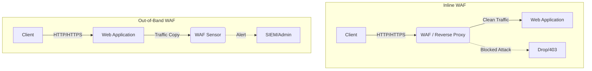
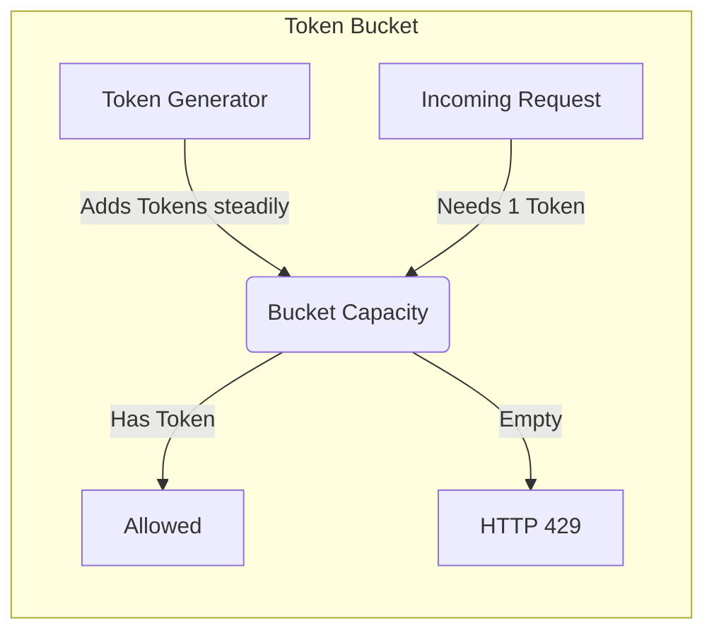
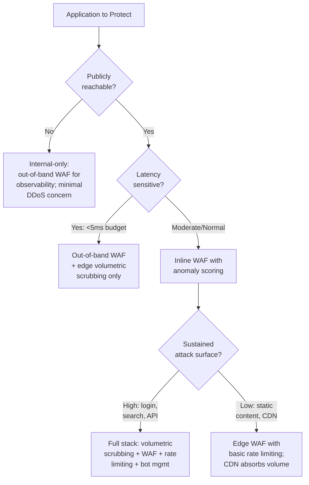

> **Complexity**: `[MEDIUM]`
>
> **Time to Complete**: 2.5 hours
>
> **Prerequisites**: [Module 1.2: CDN & Edge Computing](../module-1.2-cdn-edge/), basic web security concepts (HTTP methods, SQL, XSS)
>
> **Track**: Foundations — Advanced Networking

## What You'll Be Able to Do

After completing this module, you will be able to:

1. **Design** WAF rule sets that protect against OWASP Top 10 attacks without generating excessive false positives on legitimate traffic
2. **Implement** layered DDoS mitigation strategies combining network-level scrubbing, rate limiting, and application-level bot detection
3. **Evaluate** WAF deployment modes (inline vs. out-of-band, managed vs. custom rules) and their impact on latency, coverage, and operational burden
4. **Distinguish** volumetric, protocol, and application-layer DDoS attacks and select the appropriate countermeasure for each
5. **Configure** rate limiting with appropriate algorithms and keying strategies for different traffic profiles and threat models

---

In a defense-in-depth stack, a WAF that blocks known exploit signatures can sometimes intercept automated probes against unpatched frameworks — giving operators a window to deploy patches, though it never replaces vulnerability management or timely patching. The 2017 Equifax breach — rooted in an unpatched Apache Struts vulnerability that exposed the personal data of 147 million Americans — is a cross-referenced reminder that primary controls are patch and asset management, not edge filtering alone. <!-- incident-xref: equifax-2017 --> For the full breakdown, see [Docker Fundamentals](../../../prerequisites/cloud-native-101/module-1.2-docker-fundamentals/).

This is the core promise of WAFs and DDoS mitigation: not perfection, but defense in depth. They don't replace good application security practices, but they catch what slips through — and when the entire internet decides to attack you at once, they're often the only thing standing between your application and total darkness.

---

## Why This Module Matters

Every application exposed to the internet is under constant attack. Not "might be attacked someday" — under attack right now, continuously, from automated scanners, botnets, and targeted adversaries. A typical public-facing web application sees thousands of malicious requests per day: SQL injection probes, cross-site scripting attempts, credential stuffing attacks, and vulnerability scanners looking for unpatched software.

WAFs provide a layer of protection between attackers and your application. They inspect HTTP traffic in real time, matching requests against known attack patterns and behavioral anomalies. When configured correctly, they block attacks that would otherwise exploit vulnerabilities in your code, your frameworks, or your infrastructure.

DDoS mitigation addresses a fundamentally different threat: overwhelming your application with sheer volume. When millions of compromised devices flood your servers with traffic, no amount of application security helps. You need network-level defenses that can absorb and filter traffic at scales that would crush any single server or datacenter.

Understanding how a WAF inspects traffic at the application layer means grasping how it terminates TLS, parses HTTP semantics, and applies rule engines against every part of a request — all while adding as little latency as possible. Understanding DDoS mitigation means knowing the attack taxonomy cold: volumetric floods, protocol-level state exhaustion, and application-layer resource targeting each demand different countermeasures because they attack fundamentally different resources. And understanding rate limiting means knowing not just which algorithm to pick — token bucket, leaky bucket, fixed window, sliding window — but where to key your limits so that one abusive client behind a shared IP address doesn't get a free pass while another is unfairly blocked.

> **The Bouncer Analogy**
>
> Think of a WAF as the bouncer at a nightclub. The bouncer checks IDs (validates inputs), turns away known troublemakers (blocks malicious signatures), and watches for suspicious behavior (detects anomalies). DDoS protection is more like crowd control outside the venue — when ten thousand people show up at once, you need barriers, police, and a plan that goes beyond what one bouncer can handle.

---

## Part 1: Web Application Firewall Architecture

### Deployment Modes

A WAF must inspect HTTP/S traffic, which means it needs access to the unencrypted payload. This generally requires TLS termination to happen at or before the WAF. There are two primary deployment modes:

1. **Inline (Reverse Proxy)**: The WAF sits directly in the traffic path. All requests pass through the WAF before reaching the application. If the WAF detects an attack, it can actively block the request (drop or return a 403 Forbidden). This is the most common and effective deployment for modern web applications, often integrated into an Ingress Controller or Edge CDN.
2. **Out-of-Band (Passive/Monitoring)**: The WAF receives a copy of the traffic (e.g., via a SPAN port or traffic mirroring). It analyzes the traffic asynchronously. If it detects an attack, it cannot drop the request directly; it must signal another device (like a firewall) to block the IP, or simply generate an alert. This mode introduces zero latency to the application but cannot guarantee the blocking of a single-request exploit (like the Equifax Struts vulnerability).

The choice between these modes forces a tradeoff that every operations team must confront. Inline WAFs provide active protection — they can stop an attack in flight — but they add latency. Every request must pass through the WAF's inspection pipeline before the application sees it, and that inspection has a real cost in microseconds or milliseconds. For most web applications, this overhead is negligible compared to application processing time, but for latency-sensitive workloads such as real-time trading APIs or high-throughput stream processing, even a few milliseconds of added latency can mean lost revenue or breached SLAs. Out-of-band WAFs avoid this entirely by analyzing a mirrored copy of traffic asynchronously, but they cannot block an attack in real time. By the time the alert fires, the exploit may have already executed. This is why security-sensitive deployments almost always favor inline mode with careful performance tuning, while observability-first teams use out-of-band to gather signals without touching the critical path.

The TLS termination requirement adds another architectural constraint. To inspect HTTP payloads, the WAF must decrypt the traffic, which means it must hold the TLS private key or sit behind a TLS-terminating load balancer. In an inline deployment, the WAF typically terminates TLS itself, presenting its own certificate to clients and establishing a separate TLS session to the backend. This split-TLS architecture — sometimes called "TLS bridging" — gives the WAF full visibility into the plaintext but creates two distinct TLS sessions, each with its own cipher negotiation and certificate validation. The operational implication is that certificate management becomes the WAF operator's responsibility: certificate rotation, revocation checking, and cipher suite configuration must all be coordinated between the WAF and the backend, and a misconfiguration at the WAF level (expired certificate, unsupported cipher) takes the entire application offline even if the backend is perfectly healthy.


```mermaid
graph TD
    subgraph Inline WAF
        A1[Client] -->|HTTP/HTTPS| B1(WAF / Reverse Proxy)
        B1 -->|Clean Traffic| C1[Web Application]
        B1 -.->|Blocked Attack| D1[Drop/403]
    end

    subgraph Out-of-Band WAF
        A2[Client] -->|HTTP/HTTPS| C2[Web Application]
        C2 -->|Traffic Copy| B2(WAF Sensor)
        B2 -.->|Alert| D2[SIEM/Admin]
    end
```

> **Stop and think**: If your application is highly sensitive to latency (e.g., high-frequency trading API) but still requires security visibility, which deployment mode would you choose, and what risks are you accepting?

### Security Models and Rule Engines

WAFs evaluate traffic using two primary philosophies, and the modern approach combines both into a layered inspection pipeline:

- **Negative Security (Blocklisting)**: Deny known bad. The WAF maintains a list of signatures for known attacks (e.g., SQLi patterns, malicious user agents). Anything not explicitly forbidden is allowed. This is easy to deploy but struggles against zero-day attacks.
- **Positive Security (Allowlisting)**: Allow only known good. The WAF enforces strict schemas, accepted HTTP methods, specific header lengths, and valid parameter types. Anything not explicitly permitted is blocked. This provides excellent security but requires meticulous configuration and constant maintenance as the application evolves.

Most modern WAFs use a hybrid approach: they use managed blocklists (like the OWASP Core Rule Set) to catch common attacks instantly, while allowing administrators to define allowlists for highly sensitive API endpoints.

Under the hood, WAF rule engines process each request through a series of phases. When a request arrives, the engine first decodes the payload — handling URL encoding, Base64, nested encodings — because attackers routinely encode payloads to evade simple string matches. After decoding, the engine applies transformation functions (normalizing whitespace, lowercasing, stripping null bytes) and then runs each active rule against the normalized request. Rules typically consist of a condition (a regular expression or logical expression matching request fields), an action (block, log, pass, or score), and metadata tracking which OWASP category and paranoia level the rule belongs to. This phased processing pipeline is the reason WAF latency scales with rule count and request complexity: each decoding pass, each transformation, and each regex evaluation adds time, and a request that triggers many rules (even if none blocks) is more expensive to process than one that passes through cleanly. For this reason, WAF performance tuning often focuses on reducing the number of rules that run against common, low-risk endpoints — not by disabling rules globally, but by configuring early-pass rules that skip inspection on paths known to serve only static assets or health-check endpoints.

The **OWASP Core Rule Set (CRS)** implements an anomaly scoring model rather than simple pass/fail matching. Each rule that fires contributes a score based on its severity: a critical SQLi detection might add 5 points, while a suspicious user-agent heuristic adds 2. If a single request accumulates a score above a configurable threshold — typically 5 for the standard paranoia level — the WAF blocks it. This cumulative approach is more robust than per-rule blocking because sophisticated attacks often trigger multiple borderline rules rather than one perfect signature. A request that looks slightly off in three different dimensions is far more suspicious than one that triggers a single rule weakly, and the anomaly score captures this aggregated signal. The CRS defines four paranoia levels (PL1–PL4): PL1 is safe for most production deployments with minimal false positives; PL4 applies every rule with maximum sensitivity and will almost certainly block legitimate traffic without extensive tuning.

---

## Part 2: Addressing the OWASP Top 10

The Open Web Application Security Project (OWASP) Top 10 represents the most critical security risks to web applications. A WAF is primarily designed to mitigate these exact vulnerabilities, but it is essential to understand precisely what a WAF can and cannot do for each category.

### Injection (SQLi, Command Injection, LDAP Injection)

These are the bread-and-butter of WAF capabilities. WAFs inspect the URL path, query string, headers, and body payload (including JSON and XML) for malicious syntax. For example, a WAF signature might look for SQL keywords mixed with punctuation, such as `' OR 1=1 --`. If a user submits a form where the `username` field is `admin' --`, the WAF triggers a rule violation.

But injection is not limited to SQL — command injection through shell metacharacters (`;`, `|`, backticks), LDAP injection through filter syntax manipulation, and template injection through server-side template engines all demand their own rule families. The CRS maintains separate rule groups for each injection category, and understanding which rules cover which injection type is essential for tuning: turning off all SQLi rules because a legacy application legitimately sends SQL-like syntax in API payloads means you lose protection against all injection vectors, so exceptions must be scoped as narrowly as possible to the specific rule, parameter, and endpoint.

### Broken Access Control

A WAF *cannot* fix bad authorization logic in your code. If user A is allowed to view user B's invoice by simply changing a URL parameter (`/invoice/1234` to `/invoice/1235`), the WAF cannot easily detect this unless it deeply understands your application's state and session management (which is rare). However, a WAF *can* protect authentication endpoints against brute force and credential stuffing attacks using rate limiting and bot detection.

### Cryptographic Failures and Sensitive Data Exposure

WAFs can enforce TLS requirements — blocking plaintext HTTP connections, requiring minimum TLS versions, and rejecting weak cipher suites — but they cannot fix a server that stores passwords in plaintext or uses hardcoded encryption keys. The WAF operates at the transport and application layers; cryptographic failures in the data layer are beyond its reach.

### Security Misconfiguration

A WAF can compensate for some misconfigurations (e.g., blocking access to exposed admin panels, `.env` files, or verbose error pages that leak stack traces), but it cannot fix the underlying configuration. Treat WAF rules that paper over misconfigurations as temporary bandaids, not permanent solutions.

### Server-Side Request Forgery (SSRF)

SSRF is a challenging category for WAFs because the attack payload is often a simple URL embedded in a legitimate-looking request. If a user submits `http://169.254.169.254/latest/meta-data/` as a webhook URL, the WAF must detect that this resolves to an internal cloud metadata endpoint — requiring DNS resolution and IP reputation checks integrated into the rule evaluation, which adds latency and complexity.

Similarly, **XML External Entity (XXE) injection** and **insecure deserialization** sit in the same category of difficult-to-detect attacks: the payload is often a structured document (XML, JSON, serialized objects) that the application actively expects and processes. A WAF rule that simply blocks all XML would break legitimate integrations; a rule that inspects XML deeply must parse the document, understand its structure, and evaluate whether entity declarations reference dangerous targets. This parsing cost is significant, and many WAF deployments choose to apply XML body inspection only on endpoints that are known to accept XML — a compromise between security coverage and performance. The broader lesson is that WAF effectiveness is not uniform across the OWASP Top 10: injection attacks map well to signature-based detection; business logic and access control flaws map poorly; and structural attacks like SSRF and XXE sit in a middle ground where the WAF helps but requires careful, endpoint-specific configuration to avoid both false positives and false negatives.

> **Pause and predict**: If an attacker discovers a zero-day vulnerability in your application's custom business logic (e.g., a multi-step workflow flaw), will the WAF's default signature set protect you? Why or why not?

---

## Part 3: Rate Limiting Algorithms

Rate limiting prevents a single client from overwhelming your service. It is a fundamental defense against both abuse (like scraping or credential stuffing) and application-layer DDoS attacks. Understanding *how* rate limiting is calculated is critical for configuring it correctly, because the choice of algorithm directly determines whether legitimate users experience graceful degradation or sudden, confusing failures.

### The Token Bucket

Imagine a bucket that holds a maximum number of tokens. Every second, a new token is added to the bucket (up to the maximum capacity). When a request arrives, it must take a token from the bucket to proceed.
- If the bucket has tokens, the request is allowed.
- If the bucket is empty, the request is rejected (typically with an `HTTP 429 Too Many Requests`).

**Why use it?** Token bucket allows for short bursts of traffic. If a user hasn't made requests in a while, their bucket fills up, allowing them to make several rapid requests simultaneously (like loading a web page with many assets) before the strict per-second rate limit enforces pacing.

### The Leaky Bucket

Imagine a bucket with a hole in the bottom. Requests are poured into the top of the bucket. They leak out of the bottom at a constant, steady rate (processed by the server).
- If requests pour in faster than they leak out, the bucket fills up.
- If the bucket overflows, new requests are discarded.

**Why use it?** Leaky bucket enforces a perfectly smooth, constant output rate. It smooths out bursts entirely, ensuring the backend server is never hit with concurrent spikes, but it can artificially delay requests during a burst.

### Fixed Window and Sliding Window

Beyond the token and leaky bucket, two simpler algorithms appear frequently in production systems, and each has a failure mode you must understand:

**Fixed Window**: Divide time into discrete buckets (e.g., 60-second windows). Count requests per window. If the count exceeds the limit within the current window, reject all further requests until the next window. Fixed window is trivially simple to implement — you maintain a counter and a timestamp — but it suffers from a severe edge-case vulnerability: if the limit is 100 requests per minute, an attacker can send 100 requests in the last second of minute N and 100 more in the first second of minute N+1, effectively achieving a burst of 200 requests across a two-second boundary while technically never exceeding the per-window limit. This is the fixed-window reset attack, and it makes the algorithm unacceptable for security-sensitive rate limiting without additional burst protection.

**Sliding Window Log**: Record the timestamp of every request. When a new request arrives, count how many requests occurred in the trailing window (e.g., the last 60 seconds). If the count exceeds the limit, reject. This eliminates the boundary attack entirely — the window slides continuously, so there is no moment when the counter resets. The tradeoff is memory: you must store the timestamp of every request within the window, which for a high-traffic service can mean millions of entries. The practical compromise is the **sliding window counter**, which combines a fixed-window counter with a weighted estimate from the previous window, achieving near-perfect accuracy with constant memory.


```mermaid
graph LR
    subgraph Token Bucket
        T1[Token Generator] -->|Adds Tokens steadily| B1(Bucket Capacity)
        R1[Incoming Request] -->|Needs 1 Token| B1
        B1 -->|Has Token| A1[Allowed]
        B1 -->|Empty| D1[HTTP 429]
    end
```

### Where to Key the Limit

The rate limit is only as good as the key you choose to identify "a client." The most obvious key — the source IP address — fails badly in modern network environments:

- **Carrier-Grade NAT (CGNAT)** places thousands of mobile users behind a single public IP. If you rate-limit by IP, one heavy user can exhaust the limit and block everyone else on the same carrier.
- **Corporate egress proxies** concentrate all outbound traffic from an entire organization behind a single IP or small IP range.
- **IPv6 complicates this further**: a single device may use a new temporary address for every connection (privacy extensions), making IP-based limiting ineffective in the opposite direction — the attacker rotates through addresses faster than you can count.

The solution is to key on higher-fidelity identifiers wherever possible: an authenticated session token, an API key, or a combination of IP and a device fingerprint. For unauthenticated traffic, consider combining IP with a TLS session ID or a cryptographically signed cookie. The principle is: key on the most stable, hardest-to-spoof identifier you have access to, and accept that no single key is perfect for every scenario.

A practical consideration that often surprises operators is that rate limiting at the edge and rate limiting at the application layer serve different purposes and should use different implementations. Edge rate limiting (CDN, load balancer, reverse proxy) operates on connection-level metadata — source IP, destination port, TLS session — with minimal per-request state. It excels at dropping volumetric noise before it consumes application resources. Application-layer rate limiting (WAF, API gateway, application middleware) operates on HTTP semantics — endpoint, method, API key, user session — and can enforce complex policies like "5 login attempts per account per minute, but 100 static asset requests per IP per second." The two layers are complementary, not redundant, because the edge cannot see HTTP semantics and the application cannot handle edge-scale throughput. A well-designed system uses both: edge limits to protect the WAF from being overwhelmed, and WAF limits to enforce business-appropriate access policies on the traffic that reaches the application.

---

## Part 4: Bot Management and the Arms Race

Not all automated traffic is malicious (e.g., Googlebot), but malicious automated traffic (credential stuffing, scraping, vulnerability scanning) constitutes a massive portion of internet noise.

Simple WAF rules block "dumb" bots:
- Missing `User-Agent` headers.
- Known malicious IP addresses.
- Requests exceeding humanly possible rate limits.

However, attackers adapt. The modern arms race involves advanced botnets that rotate through millions of residential IP proxies, execute JavaScript, mimic human mouse movements, and throttle their own request rates to fly under the radar. These bots do not trip simple rate limits because they stay below the threshold; they do not appear on IP blocklists because each request comes from a different residential proxy; they execute JavaScript and render pages, so server-side challenges that check only for JS execution capability pass through.

Advanced Bot Management solutions use multiple layers of detection:

1. **Device Fingerprinting**: The client browser is asked (silently, through JavaScript) to reveal characteristics that are difficult to spoof: canvas rendering output, WebGL renderer strings, installed fonts, screen dimensions, audio processing fingerprints, and browser plugin enumeration. These signals combine into a hash that uniquely identifies the device across IP changes. An attacker rotating through a residential proxy network will still present the same or similar fingerprint — unless they rotate browsers too, which adds cost and complexity.

2. **Behavioral Analysis**: Rather than matching static signatures, behavioral models train on what normal traffic looks like for *your specific application*. A human browsing an e-commerce site moves through pages at a certain pace, spends time on product detail pages, and exhibits irregular but bounded click patterns. A bot doing credential stuffing hits the login endpoint at precise intervals with no preceding page views. These deviations stand out not as a single rule violation but as a statistical anomaly.

3. **Challenges**: When traffic is suspicious but not clearly malicious, the WAF can inject a challenge. A **JavaScript challenge** runs a computation in the browser that a legitimate browser handles transparently but a simple script cannot — this filters out most low-grade bots. A **Proof-of-Work (PoW) challenge** asks the client to solve a cryptographic puzzle that consumes CPU time, making large-scale automation more expensive. A **CAPTCHA** is the challenge of last resort, presented only when the previous layers still cannot decide, because CAPTCHAs create friction that drives real users away.

The cost of each detection layer is borne disproportionately by the attacker. Generating a convincing browser fingerprint for every request requires running full browsers (not just headless scripts), which dramatically increases infrastructure costs. Solving CAPTCHAs at scale requires either paying human-solving services or investing in ML models that still fail a significant percentage of the time. The goal of bot management is not to make automation impossible — that is an unwinnable absolute — but to raise the attacker's cost until the attack is no longer economically viable while keeping the false-positive cost to legitimate users as close to zero as possible.

This last point — the false-positive cost — deserves emphasis because it's where bot management intersects with business reality. Every challenge presented to a user adds friction. A JavaScript challenge that takes 200 milliseconds is invisible to a human but costs a bot real compute. A CAPTCHA, however, is visible and frustrating: academic studies have measured CAPTCHA-driven abandonment rates in the range of 10–30% for affected sessions, depending on the CAPTCHA difficulty and the user's context. If your bot management system presents a CAPTCHA to every user from a suspect IP range, and that IP range covers a legitimate mobile carrier in a developing market, you're not protecting your application — you're blocking paying customers. The operational art of bot management is tuning the challenge escalation ladder so that the lightest possible challenge (JS computation or silent fingerprint check) is presented first, and CAPTCHAs are reserved for the sessions where every other signal already suggests automation. Automating this tuning — through supervised ML models trained on your own labeled traffic — is where the industry is moving, but it requires a feedback loop of labeled attack and legitimate traffic that smaller organizations often lack.

---

## Part 5: DDoS Attack Taxonomy

Distributed Denial of Service (DDoS) attacks aim to exhaust resources so legitimate users cannot access the service. These attacks target different layers of the OSI model and require different mitigation strategies. The taxonomy has three categories, and confusing them leads to deploying the wrong countermeasure — sending volumetric mitigation for an application-layer attack, or attempting to rate-limit a volumetric flood at your origin server.

### 1. Volumetric Attacks (Layer 3/4)

**Goal:** Consume all available bandwidth between the target and the internet.
**Mechanism:** Often relies on Amplification, where an attacker sends a small spoofed request to a vulnerable public server, which replies with a massive response directed at the victim. Common amplification vectors include DNS (a 60-byte query producing a 3,000-byte response — roughly 50× amplification), NTP `monlist` commands (up to 500× amplification on misconfigured servers), and memcached UDP (capable of 50,000× amplification in the worst case). By sourcing these queries from a botnet and spoofing the victim's IP address, the attacker funnels massive traffic flows toward the target without needing a correspondingly large botnet.
**Mitigation:** You cannot mitigate this on your own servers; your internet pipe is already full. You must use a cloud-based DDoS scrubbing service that has massive global network capacity to absorb the traffic and drop the junk before it reaches your datacenter. This is where Anycast — covered in depth in [Module 1.1: DNS at Scale](../module-1.1-dns-at-scale/) — becomes critical: by announcing the same IP address from dozens or hundreds of points of presence worldwide, the attack traffic is distributed across the provider's entire network rather than converging on your single origin. The scrubbing centers filter out the malicious flows, and only clean traffic is forwarded to your origin over a GRE tunnel or direct connect.

### 2. Protocol Attacks (Layer 3/4)

**Goal:** Exhaust state table capacity in firewalls, load balancers, or servers.
**Mechanism:** SYN Floods are the classic example. The attacker initiates millions of TCP connections (SYN) but never completes the handshake (ACK). The server leaves the connections half-open, quickly running out of memory to track new connections. Other protocol attacks include `ACK` floods, `RST` floods, and `UDP` floods — each targeting a different aspect of the TCP/IP stack's connection tracking.
**Mitigation:** SYN cookies allow the server to complete the TCP handshake without allocating any state until the client proves its identity by returning a cryptographically signed acknowledgment. The server encodes the connection parameters into the SYN-ACK sequence number; only when it receives a valid ACK does it reconstruct the connection and allocate memory. This makes it impossible for an attacker to exhaust state through half-open connections. Additional defenses include dropping malformed packets at the network edge, rate-limiting SYN packets per source IP, and using specialized hardware or kernel bypass techniques (eBPF/XDP) to filter attack traffic before it reaches the kernel's networking stack.

### 3. Application Layer Attacks (Layer 7)

**Goal:** Exhaust application resources (CPU, memory, database connections) using seemingly legitimate HTTP requests.
**Mechanism:** HTTP Floods. The attacker might request a search endpoint that requires heavy database queries, or repeatedly download a large PDF. The bandwidth used is small, but the server CPU spikes to 100%. Variants include **Slowloris** — opening many connections and sending HTTP headers one byte at a time, keeping connections open indefinitely and exhausting the server's connection pool — and **HTTP POST floods** that send large request bodies slowly, tying up application threads.
**Mitigation:** This is where the WAF, rate limiting, and bot management layers shine. Unlike volumetric attacks that are absorbed at the network edge, application-layer attacks reach your application servers and must be detected there. Behavioral anomaly detection — noticing that the `/search?q=` endpoint suddenly receives 50× its normal traffic volume — combined with per-endpoint rate limiting and JavaScript challenges is the standard defense. Connection timeouts that are aggressively short (closing idle connections after a few seconds) defeat Slowloris. For a deeper treatment of how routing policies and traffic engineering can complement application-layer defenses, see [Module 1.4: BGP Routing & Traffic Engineering](../module-1.4-bgp-routing/).

---

## Part 6: Tuning WAFs (The False Positive Problem)

The hardest part of operating a WAF is not turning it on; it is keeping it tuned. When you deploy a new WAF rule, it will inevitably block some legitimate traffic. This is a **False Positive**. If a user pastes a large block of code into a developer forum, a poorly tuned WAF might block it as an XSS attempt. If a marketing tracking cookie contains a strange string of punctuation, it might trigger a SQLi rule.

Conversely, a **False Negative** occurs when malicious traffic slips through undetected.

> **Stop and think**: If you prioritize eliminating false negatives entirely, what happens to your false positive rate? How does this impact the business?

### The False-Positive/False-Negative Tradeoff

There is no setting that eliminates both false positives and false negatives. The fundamental tradeoff is: tighter rules catch more attacks but block more legitimate users; looser rules let legitimate traffic through but allow some attacks. This is identical in structure to the precision/recall tradeoff in machine learning, and WAF operators face it every time they adjust a rule threshold.

The business cost of false positives is direct and measurable. A blocked legitimate user who cannot complete a purchase represents lost revenue. A blocked API client whose integration suddenly returns 403 errors may trigger an incident response and consume engineering time. Conversely, the cost of false negatives — a successful attack — may be catastrophic but is harder to quantify in daily operations. This asymmetry causes many teams to bias toward permissiveness, which is exactly what attackers exploit.

Consider a concrete scenario: a news organization deploys a WAF at PL1. A journalist files a story that includes a block of SQL code as an example — the WAF blocks the submission with a 403. The journalist, late on deadline, cannot publish. The error is cryptic; there's no guidance for what to change. The journalist escalates to the engineering team, consuming two hours of senior engineer time to diagnose a WAF false positive — time that engineer could have spent on features. Multiply this by the number of content creators, the frequency of their submissions, and the variety of input they produce, and you arrive at a recurring operational cost that far exceeds the threat of the attacks the WAF is blocking. This is why "log-only first, then enforce" is not just a best practice — it is an economic imperative. The WAF must earn its place in the request path by demonstrating that its true-positive detections justify its false-positive operational burden. A WAF that generates more support tickets than attacks blocked is a net drain on the organization, regardless of how many OWASP categories it claims to cover.

### The Tuning Lifecycle

1. **Logging / Monitor Mode**: When deploying a WAF, never start in blocking mode. Run rules in "Count" or "Log Only" mode for several weeks. The goal is to gather a baseline of what triggers which rules for your specific application traffic — not generic internet traffic, but *your* traffic, with *your* application's API shapes, user behaviors, and legitimate edge cases.
2. **Analysis**: Review the logs. Identify which legitimate requests triggered rules. Look for patterns: a specific endpoint sending Base64-encoded payloads (a legitimate API design) might trigger injection rules; a content management system that accepts HTML from authenticated editors will trigger XSS detection. These aren't bugs — they're your application's legitimate behavior that the generic rule set doesn't know about.
3. **Exceptions / Allowlisting**: Create specific, narrowly scoped exceptions. If rule `942100` (SQLi) triggers on the `/api/comments` endpoint specifically for the `body` parameter, disable *only* that rule for *that specific parameter on that specific endpoint*. Do not disable the rule globally. Use the CRS exclusion syntax: `SecRuleUpdateTargetById 942100 "!ARGS:body"` scoped to the specific location in your configuration. Broad exceptions ("disable all SQLi rules for this virtual host") are security gaps.
4. **Enforcement**: Once false positives are reduced to an acceptable level, switch the rules to blocking mode. But do this incrementally — raise the anomaly threshold gradually and observe. Start at a high threshold (e.g., score 10) that blocks only the most egregious attacks, then lower it to the standard threshold (score 5) as your confidence grows.
5. **Continuous Review**: Application code changes. Attack patterns change. WAF tuning is a permanent operational requirement, not a one-time configuration task. Every deployment that adds a new endpoint, changes a parameter format, or modifies an API contract should be accompanied by a review of WAF logs to ensure the new code doesn't trigger false positives.

### Navigating CRS Paranoia Levels

The OWASP Core Rule Set defines four paranoia levels that control how aggressively the WAF blocks traffic, and understanding what changes at each level is essential for tuning. The levels are not just a sensitivity slider — they activate different rule groups with fundamentally different detection philosophies:

- **PL1 (Default)**: Activates rules with very low false-positive rates — the signatures that are unambiguously malicious. SQLi patterns like `' OR 1=1`, classic XSS vectors, and known shell command injection syntax are blocked. PL1 catches most automated attack tooling and should be the starting point for every deployment. False positives at PL1 are rare but not impossible, particularly for applications that accept rich text, code snippets, or complex structured data in user inputs.

- **PL2**: Adds rules that detect more sophisticated evasion techniques — encoding tricks, comment obfuscation in SQL payloads, and character-set manipulation. These rules have a moderate false-positive rate because legitimate applications sometimes use encoding and special characters legitimately. PL2 is appropriate for applications that have been through a full tuning cycle at PL1 and whose operators understand which endpoints trigger additional rules. Do not jump to PL2 on day one.

- **PL3**: Activates rules designed to catch advanced, targeted attacks — the kind that a skilled human attacker crafts to bypass automated scanners. False-positive rates increase substantially because these rules look for subtle anomalies that can appear in legitimate traffic from unusual clients, older browsers, or non-standard integrations. PL3 requires per-endpoint tuning and is generally reserved for high-security environments (financial services, government applications) where the cost of a false negative far exceeds the cost of investigating false positives.

- **PL4**: Applies every rule with maximum sensitivity. At this level, the WAF will block traffic that looks even slightly unusual — unusual header ordering, unexpected parameter structures, or rare HTTP methods. False positives are guaranteed at PL4 without extensive, per-request tuning. PL4 is almost never used in production for general web traffic; it exists for environments where security overrides all other considerations, such as air-gapped networks or systems processing classified data.

The operational pattern is: deploy at PL1, tune until false positives are negligible, then evaluate whether PL2 would catch attacks that your threat model justifies blocking. Every paranoia-level increase is a commitment to more tuning effort in exchange for catching more sophisticated attacks. Organizations that treat paranoia levels as a "turn it up to be safe" knob without investing corresponding tuning effort invariably cause production incidents from blocked legitimate traffic.

---

## Patterns & Anti-Patterns

Effective WAF and DDoS defense follows repeatable patterns that emerge from the principles covered in this module. Recognizing both the patterns and their corresponding anti-patterns prevents the most common operational failures.

### Patterns

1. **Defense-in-Depth Layering**: Place a cloud-based volumetric DDoS scrubber at the edge, a WAF at the application ingress, rate limiting at both layers, and bot detection integrated throughout. No single layer catches everything; the combination of layers covers each other's blind spots. A volumetric attack that saturates the pipe never reaches the WAF; an application-layer attack that looks like legitimate HTTP passes through the scrubber but gets caught by the WAF's behavioral analysis. The architectural insight is that each layer operates on a different dimension of the traffic: the edge focuses on packet volume and protocol validity, the WAF on HTTP semantics and attack signatures, rate limiting on request frequency and endpoint cost, and bot detection on client behavior and identity. An attack that evades one dimension will almost certainly be caught by another, because the attacker must solve all four detection problems simultaneously — an exponentially harder task than defeating any single layer.

2. **Log-First Deployment**: Every new WAF rule, bot detection signal, or rate limit threshold enters production in log-only mode first. Only after a representative traffic sample confirms the rule's behavior as expected — catching attacks without blocking legitimate users — does it transition to enforcement. This applies equally to vendor-managed rule updates: do not auto-apply new rule versions in blocking mode. The corollary is that your monitoring pipeline must be capable of surfacing actionable alerts from WAF logs within minutes, not hours. If your team only reviews WAF logs once a week, a log-first deployment that catches an attack on day two provides no protection at all — the attack will have succeeded before anyone looked. Log-first works when log-review is continuous.

3. **Narrow Exceptions**: When a rule produces false positives, create the minimum exception needed to allow legitimate traffic while preserving protection. A parameter-level exclusion on a specific endpoint preserves more security coverage than a global rule disable. A well-maintained WAF configuration has many narrow exceptions and zero broad ones. The test for whether an exception is narrow enough: if an attacker can exploit the exception to craft a payload that evades the WAF on a different endpoint, the exception is too broad. Each exception should be traceable to a specific, documented, legitimate use case with a known expiration if the use case is temporary.

### Anti-Patterns

| Anti-Pattern | Why It's Bad | Better Approach |
|---|---|---|
| Deploying WAF rules in blocking mode on day one | Blocks legitimate users immediately, creating incidents and eroding trust in the WAF | Start in log-only mode, tune for weeks, then migrate to blocking incrementally |
| Using IP-based rate limiting as the sole key | Behind CGNAT or corporate proxies, one bad actor blocks thousands of legitimate users | Combine IP with session tokens, API keys, or device fingerprints |
| Disabling entire rule categories because one endpoint triggers them | Removes protection against an entire attack class (e.g., all SQLi) | Create narrow, parameter-level exceptions for the specific endpoint and rule |
| Treating WAF as a substitute for patching | The WAF blocks known exploit signatures; it cannot fix the underlying code vulnerability | Patch the vulnerability. The WAF is a safety net, not the fix |
| Applying volumetric DDoS mitigations to application-layer attacks | Scrubbing centers filter on packet volume and protocol anomalies, not HTTP semantics | Use WAF behavioral analysis, per-endpoint rate limiting, and bot challenges |
| Relying on a single threshold score for all endpoints | A login endpoint and a static asset endpoint have completely different traffic profiles | Tune anomaly thresholds per-endpoint or per-application-component |

---

## Decision Framework

When designing a WAF and DDoS mitigation strategy, the following decision flow guides the key architectural choices. Start at the top and follow the path that matches your constraints:


```mermaid
flowchart TD
    START[Application to Protect] --> Q1{Publicly<br>reachable?}
    Q1 -->|No| INTERNAL[Internal-only:<br>out-of-band WAF for<br>observability; minimal<br>DDoS concern]
    Q1 -->|Yes| Q2{Latency<br>sensitive?}
    Q2 -->|Yes: &lt;5ms budget| OOB[Out-of-band WAF<br>+ edge volumetric<br>scrubbing only]
    Q2 -->|Moderate/Normal| INLINE[Inline WAF with<br>anomaly scoring]
    INLINE --> Q3{Sustained<br>attack surface?}
    Q3 -->|High: login,<br>search, API| FULL[Full stack: volumetric<br>scrubbing + WAF + rate<br>limiting + bot mgmt]
    Q3 -->|Low: static<br>content, CDN| LIGHT[Edge WAF with<br>basic rate limiting;<br>CDN absorbs volume]
```

The key branching decisions:

- **Inline vs. out-of-band**: If your latency budget is measured in single-digit milliseconds, out-of-band is the only viable option — accept the risk that you cannot block single-request exploits in exchange for preserving application performance. For everything else, inline mode with anomaly scoring provides active protection. The decision isn't binary: some architectures deploy an inline WAF at the edge (where the latency budget is most generous and the traffic volume highest) and an out-of-band analyzer behind it for deeper inspection of samples that the inline WAF flagged as suspicious but not clearly malicious. This two-tier model trades a small operational complexity cost for significantly better detection coverage on ambiguous traffic.

- **Volumetric scrubbing**: If your application is publicly reachable and would suffer financial or reputational damage from being unreachable, you need a cloud-based scrubbing service. The question is not "are we big enough to be attacked?" but "what is the cost of being down for an hour?" Scrubbing services are not a luxury — they are insurance. The cost structure is typically a flat monthly fee plus a per-attack or per-Tbps-metered charge, and for most organizations, the flat fee alone is less than a single hour of application downtime. The operational decision is not whether to buy scrubbing but which provider's network topology best covers your user base: a provider with dense POP coverage in your primary user regions will add less latency during an attack than one that routes your traffic through distant scrubbing centers.

- **Bot management**: If your application has authentication endpoints, search functionality, checkout flows, or any API that costs money to serve, you need bot management. Bots target these endpoints for credential stuffing, scraping, and inventory hoarding, and simple rate limiting alone is insufficient against sophisticated botnets. The threshold question is: does your application serve content that someone would pay to scrape? Competitor pricing data, user-generated content for AI training, ticket inventory, and product availability are all high-value scraping targets that justify investing in bot management long before you experience a volumetric DDoS.

- **Rate limiting granularity**: Apply coarse limits (requests-per-second per IP) at the network edge, then finer-grained limits (per-session, per-API-key, per-endpoint) at the WAF layer. The edge limit catches volumetric noise; the WAF limit catches targeted abuse of expensive endpoints. This two-tier model is important because edge devices have limited state — they cannot track per-session counters across millions of concurrent users — but they can enforce simple per-IP limits efficiently in hardware or kernel bypass. The WAF, with its access to HTTP semantics and application-layer state, can enforce the fine-grained policies that actually differentiate legitimate users from abusers.

---

## Landscape Snapshot — as of 2026-06

> This changes fast; verify against vendor docs before relying on specifics.

### Cross-Vendor Rosetta Table

| Capability | Cloudflare | AWS | GCP | Azure |
|---|---|---|---|---|
| Managed WAF Rules | WAF Managed Rules (Cloudflare + OWASP CRS) | AWS WAF Managed Rules (AWS + third-party) | Cloud Armor (preconfigured rules + CRS) | Azure Front Door / Application Gateway WAF (OWASP CRS + bot rules) |
| Rate Limiting | Rate Limiting Rules (per-path, per-header) | AWS WAF rate-based rules (5-minute sliding window) | Cloud Armor rate limiting (per-IP, per-header) | Azure WAF custom rate-limit rules |
| Bot Management | Bot Management (ML-based scoring) | AWS WAF Bot Control (managed rule group) | reCAPTCHA Enterprise + Cloud Armor | Azure Bot Manager (Front Door) |
| L7 DDoS Protection | Built into WAF/CDN (automatic) | AWS Shield Advanced (application-layer monitoring) | Cloud Armor Adaptive Protection (ML-based) | Azure DDoS Protection (L3/4) + WAF (L7) |
| Custom Rules | Custom WAF rules (Cloudflare expression language) | AWS WAF custom rules (JSON-based) | Cloud Armor custom rules (CEL expression language) | Azure WAF custom rules (JSON-based) |
| Volumetric Scrubbing (L3/4) | Magic Transit / Spectrum | AWS Shield Advanced | Cloud Armor / Global Load Balancing | Azure DDoS Protection |

The durable pattern across all providers is the same: managed rule sets (often OWASP CRS) for signature-based detection, custom rules for application-specific logic, rate limiting for abuse prevention, and bot management for automation detection. The differentiation is in the expression languages, the granularity of the rate-limiting windows, and the quality of the managed rule updates — but the architectural decomposition into these four layers is universal.

---

## Did You Know?

- **OWASP CRS is an open-source project maintained by a volunteer community** and integrated into ModSecurity, Coraza, and many commercial WAF products, protecting a very large volume of internet traffic. The rule set is freely available and peer-reviewed, making it one of the most battle-tested security rule bases in existence.
- **DNS amplification is one of the most common volumetric DDoS vectors** because there are millions of open DNS resolvers on the internet that will respond to a small query with a large response. Mitigating this requires both source-address validation (BCP 38) at the network edge and DNS response rate limiting (DNS RRL) on authoritative servers.
- **Rate limiting is not just for DDoS protection** — it is a fundamental availability pattern. Without rate limits, a single misbehaving microservice, an uncontrolled retry storm, or a buggy mobile client that retries on every network error can bring down your entire platform through cascading overload, even with no malicious intent.
- **The line between WAF and API gateway is blurring.** Modern API gateways increasingly embed WAF capabilities — schema validation, rate limiting, bot detection — because API traffic is structured and predictable in ways that general web traffic is not, making positive-security (allowlist) WAF models far more practical for API endpoints than for human-facing web applications.

---

## Common Mistakes

| Mistake | Problem | Solution |
|---|---|---|
| Enabling all CRS rules at paranoia level 4 on day one | Blocks a significant portion of legitimate traffic — CRS PL4 is designed for environments where security trumps usability | Start at PL1. Only increase paranoia level after extensive tuning and log review |
| Rate limiting by IP without considering shared IPs | CGNAT, corporate proxies, and IPv6 privacy extensions make IP an unreliable client identifier | Key on session tokens, API keys, or combined IP+fingerprint where auth is unavailable |
| Using the same rate limit for all endpoints | An expensive search endpoint needs a lower limit than a static asset endpoint; a login endpoint needs different protection than an API | Configure per-endpoint or per-route rate limits with limits proportional to endpoint cost |
| Disabling SQLi rule `942100` globally because one endpoint triggers false positives | Removes protection against a critical injection vector for your entire application | Use `SecRuleUpdateTargetById 942100 "!ARGS:param"` scoped to the specific path |
| Assuming the WAF replaces secure coding practices | WAFs catch known patterns; they do not fix business logic flaws, authorization bugs, or cryptographic weaknesses | Treat the WAF as defense-in-depth — write secure code, then add the WAF as a safety net |
| Deploying WAF without monitoring and alerting | An attacker who triggers rules at a low rate below the anomaly threshold may be probing your defenses without detection | Ship WAF logs to your SIEM, set up dashboards for rule-trigger trends, and alert on anomalous spikes |
| Applying network-level DDoS mitigation to application-layer attacks | Scrubbing centers operate at L3/4 — they cannot distinguish a legitimate HTTP request from a malicious one | Use WAF behavioral analysis and per-endpoint rate limiting for L7 attacks; use scrubbing for volumetric floods |
| Forgetting to tune after application changes | A new API endpoint that accepts rich text or Base64 input will trigger WAF rules that previously never fired | Include WAF log review in your deployment checklist; treat it as part of the change-management process |

---

## Knowledge Check

Test your understanding with these scenario-based questions.

### Question 1

You are the lead engineer for an e-commerce platform. During Black Friday, your monitoring alerts you that the backend database CPU is at 100%. Looking at the logs, you see thousands of unique IP addresses searching for random, highly complex, 50-character strings in the product search bar. The total bandwidth of these requests is only about 50 Mbps, well within your infrastructure limits.

Which type of attack is this, and what is the most effective immediate countermeasure?

- [ ] A) Volumetric Attack. You should route traffic through a cloud scrubbing center to absorb the bandwidth.
- [ ] B) Protocol Attack (SYN Flood). You should enable SYN cookies on your load balancers.
- [ ] C) Application Layer (Layer 7) Attack. You should implement strict rate limiting on the `/search` endpoint and deploy a JavaScript challenge to verify browsers.
- [ ] D) SQL Injection Attack. You should enable the OWASP Core Rule Set on your WAF to block malicious payloads.

<details>
<summary><strong>View Answer and Explanation</strong></summary>

**Correct Answer: C**

**Explanation**:
This is a textbook Application Layer (Layer 7) attack, specifically an HTTP flood targeting a computationally expensive endpoint (the search function). Because the bandwidth is low (50 Mbps), it is not a Volumetric attack (ruling out A). Because it involves complete HTTP requests reaching the database tier, the TCP handshakes are completing, meaning it is not a Protocol/SYN flood (ruling out B). The attackers are searching for random strings, which causes heavy database lookups, rather than attempting to manipulate the database query structure with malicious syntax, making it an exhaustion tactic rather than a SQLi attempt (ruling out D). Applying rate limits to the specific expensive endpoint and challenging bots is the most effective way to drop the malicious traffic while allowing legitimate shoppers to proceed.

</details>

### Question 2

A development team at your company has just launched a new internal REST API designed to sync highly sensitive financial records between two microservices. The services reside in different data centers and communicate over a dedicated private network link, completely isolated from the public internet. Due to strict latency requirements for real-time trading, the API response time must remain under 5 milliseconds. The security team mandates that all APIs must be protected by an inline WAF using the OWASP Core Rule Set.

Based on WAF architecture principles, how should you respond to this mandate?

- [ ] A) Agree and deploy the inline WAF immediately, as internal traffic is just as vulnerable to the OWASP Top 10 as public traffic.
- [ ] B) Push back on the mandate. An inline WAF will introduce processing latency that likely violates the 5ms SLA, and the risk of external OWASP attacks is minimal on an isolated private link. Suggest an out-of-band monitoring solution instead.
- [ ] C) Deploy the inline WAF, but configure it to use a Positive Security model (allowlisting) instead of the OWASP Core Rule Set to reduce latency.
- [ ] D) Agree, but place the WAF only on the receiving microservice to halve the latency impact.

<details>
<summary><strong>View Answer and Explanation</strong></summary>

**Correct Answer: B**

**Explanation**:
When designing security controls, you must balance risk mitigation against operational requirements. An inline WAF requires deep packet inspection, payload buffering, and complex regex evaluations, which inherently adds processing latency (often 10-50ms or more depending on rule complexity). For an application with a strict 5ms SLA, an inline WAF will almost certainly cause the service to fail its performance requirements. Furthermore, because the link is isolated and internal, the threat model is vastly different from a public-facing web app; the risk of external, automated OWASP Top 10 attacks is practically zero. Suggesting an out-of-band (passive) monitoring solution provides the security team with visibility without impacting the critical latency path of the application.

</details>

### Question 3

Your team is deploying a WAF in front of a public API that serves mobile applications. The API has a `/login` endpoint that authenticates users, a `/search` endpoint that runs expensive database queries, and a `/static` path that serves images. You need to configure rate limiting. The mobile carrier serving most of your users places them behind a CGNAT that maps thousands of users to a single public IPv4 address.

Which rate-limiting strategy is most appropriate?

- [ ] A) Apply the same 100-requests-per-minute IP-based limit to all three endpoints. This is the simplest and most maintainable approach.
- [ ] B) Key limits by session token for `/login` and `/search`, by IP for `/static`, with per-endpoint thresholds: low for `/search`, medium for `/login`, high for `/static`.
- [ ] C) Use IP-based rate limiting exclusively. The CGNAT scenario can be solved by simply raising the limit high enough to accommodate all shared users.
- [ ] D) Do not rate-limit authenticated endpoints. Rate limiting is only necessary for unauthenticated public endpoints.

<details>
<summary><strong>View Answer and Explanation</strong></summary>

**Correct Answer: B**

**Explanation**:
Behind a CGNAT, IP-based rate limiting fails because thousands of users share one IP address. If you key on IP alone, one heavy user could exhaust the limit and deny service to all others on the same carrier (ruling out A and C). Authenticated endpoints should key on the session token or API key, which uniquely identifies the user regardless of their IP. Different endpoints have different costs: `/search` is expensive (datacenter resource consumption) and should have the lowest limit; `/login` is a security-sensitive target for credential stuffing and needs bot detection plus a moderate limit; `/static` serves cached assets and can have a high limit keyed simply on IP since the cost per request is minimal. Option D is wrong because authenticated endpoints are precisely the ones attackers target with credential stuffing and API abuse.

</details>

### Question 4

You have deployed a WAF with the OWASP Core Rule Set at paranoia level 1. After two weeks in log-only mode, you observe that rule `942100` (a SQL injection detection rule) triggers on the `/api/export` endpoint when users include SQL-like column names in a JSON payload. The application legitimately accepts these column names as configuration parameters, and no actual SQL injection is possible because the application uses parameterized queries.

What is the correct tuning action?

- [ ] A) Disable rule `942100` globally — parameterized queries prevent SQLi, so the rule is unnecessary.
- [ ] B) Raise the paranoia level to 2 so that only higher-confidence rules fire; rule `942100` will stop triggering.
- [ ] C) Create a rule exclusion that disables `942100` specifically for the `body` parameter on the `/api/export` endpoint, while leaving it enabled everywhere else.
- [ ] D) Switch to blocking mode immediately — the false positive rate is low enough with only one rule triggering on a single endpoint.

<details>
<summary><strong>View Answer and Explanation</strong></summary>

**Correct Answer: C**

**Explanation**:
The correct WAF tuning practice is to create the narrowest possible exception. Disabling rule `942100` globally (A) removes SQLi protection from your entire application — even if `/api/export` is safe, other endpoints may not be, and the rule is your defense-in-depth layer. Raising the paranoia level (B) makes rules stricter, which would increase false positives, not decrease them. Switching to blocking mode (D) while a known false positive exists will block legitimate `/api/export` requests from your users, causing an operational incident. The correct approach is a scoped exclusion: disable the specific rule for the specific parameter on the specific endpoint where it triggers legitimately, preserving protection everywhere else.

</details>

### Question 5

An attacker is launching a SYN flood against your load balancer. Your monitoring shows that the server's connection table is filling with half-open TCP connections, and legitimate users are experiencing intermittent timeouts during the TCP handshake. You have a WAF deployed at the application layer, but it shows no increase in blocked requests.

Why is the WAF not helping, and what should you do?

- [ ] A) The WAF is misconfigured. You should add a custom rule to detect SYN packets in HTTP headers.
- [ ] B) The attack operates at Layer 4, below the WAF's Layer 7 inspection point. You should enable SYN cookies on the load balancer and deploy protocol-level filtering.
- [ ] C) The WAF anomaly threshold is too high. Lower it to score 3 so that the SYN flood triggers the WAF's rate-limiting rules.
- [ ] D) You should switch the WAF from inline to out-of-band mode so it can inspect traffic without adding latency during the attack.

<details>
<summary><strong>View Answer and Explanation</strong></summary>

**Correct Answer: B**

**Explanation**:
A SYN flood is a Layer 4 protocol attack that never completes the TCP three-way handshake. The WAF operates at Layer 7 (HTTP) — it only sees traffic that has successfully completed the TCP handshake and established an HTTP connection. Since SYN flood packets never reach the HTTP layer, the WAF has no visibility into the attack at all, which is why its blocked-request count shows no change. Option A is nonsensical because SYN packets are TCP-level, not HTTP headers. Option C misunderstands the OSI model: lowering the anomaly threshold won't help if the traffic never reaches the WAF. Option D is irrelevant — switching deployment modes doesn't change the OSI layer at which the WAF operates. The correct mitigation is at Layer 4: enable SYN cookies on the load balancer so that half-open connections consume no state, and deploy protocol-level filtering (packet inspection, rate limiting of SYN packets per source IP) at the network edge.

</details>

### Question 6

Your security team has rolled out a positive-security WAF model for a critical REST API. The WAF validates every request against an OpenAPI schema: allowed HTTP methods, parameter types and lengths, header requirements, and response codes. Two weeks later, the development team deploys a new API version that adds an optional `fields` query parameter for sparse field selection. Immediately, all requests using the new parameter are blocked with 403 errors.

What went wrong, and what does this reveal about the positive-security model?

- [ ] A) The WAF has a bug. Positive-security models should automatically detect new parameters and allow them by default.
- [ ] B) Security and development teams need a shared change-management process. The WAF schema must be updated whenever the API contract changes, making positive-security operationally expensive but highly secure.
- [ ] C) The WAF is too strict. Switch to a negative-security model, which is more flexible and better suited to rapidly evolving APIs.
- [ ] D) The development team should have deployed the new parameter in log-only mode first before adding it to the WAF schema.

<details>
<summary><strong>View Answer and Explanation</strong></summary>

**Correct Answer: B**

**Explanation**:
This scenario reveals the core tradeoff of positive-security WAF models: they provide the strongest possible protection — nothing passes through that hasn't been explicitly allowed — but at the cost of high operational overhead. The WAF blocked the new parameter because it was never added to the allowlist; from the WAF's perspective, an unknown parameter is suspicious and should be blocked. This is not a bug (A) — it's the model working as designed. The correct response is to establish a change-management process where API schema changes trigger corresponding WAF configuration updates, ideally automated: the OpenAPI spec that defines the API contract should also drive the WAF's positive-security rules. Switching to negative-security (C) would solve the operational problem but at the cost of accepting unknown/zero-day attacks. Option D misapplies the log-first deployment pattern — it's the WAF rules that need tuning, not the API changes.

</details>

### Question 7

You are configuring rate limiting for a public-facing file download service. Downloads are large (average 500 MB per file) and take several minutes. A token bucket algorithm is configured with a rate of 2 requests per second and a burst capacity of 5 tokens. A user reports that their download manager, which opens 8 parallel connections simultaneously to accelerate a single large file download, receives HTTP 429 errors on 3 of the 8 connections.

What is happening, and what is the best resolution?

- [ ] A) The token bucket is working correctly. The user should configure their download manager to use fewer parallel connections, respecting the service's rate limit.
- [ ] B) Increase the burst capacity to 10 tokens. The bucket rate (2 req/s) remains the same, so sustained throughput is unchanged, but legitimate bursts from download managers will be accommodated.
- [ ] C) Switch to a leaky bucket algorithm, which handles parallel connection patterns better than token bucket.
- [ ] D) Remove rate limiting for authenticated users. Rate limiting should only apply to unauthenticated access.

<details>
<summary><strong>View Answer and Explanation</strong></summary>

**Correct Answer: B**

**Explanation**:
The token bucket has a burst capacity of 5, meaning it can serve at most 5 requests instantaneously before clients must wait for tokens to regenerate at 2 per second. The user's download manager sends 8 simultaneous requests, so 5 succeed (consuming all burst tokens) and 3 are rate-limited (429). This is the correct behavior — the algorithm is working as designed — but the configuration doesn't match the expected usage pattern. Increasing the burst capacity to 10 allows the full 8-connection burst while keeping the sustained rate at 2 requests per second, which is appropriate since each download takes minutes and the sustained rate rather than the instantaneous burst determines server load. Switching to leaky bucket (C) would make the problem worse because leaky bucket smooths bursts — it would delay or drop requests even more aggressively. Option A shifts the burden to users when the configuration can be adjusted. Option D is overly permissive and removes protection from a valuable attack surface.

</details>

---

## Hands-On — Configuring WAF and Rate Limiting

In this exercise, we will configure a Kubernetes Ingress resource to enforce rate limiting and enable a Web Application Firewall to block a basic SQL injection attack using standard [kubernetes/ingress-nginx](https://kubernetes.github.io/ingress-nginx/) annotations.

### Lab Prerequisites

Before you start, confirm the following operational setup — without it, the WAF and rate-limit demonstrations will not behave as written. You need an ingress-nginx controller installed with `ingressClassName: nginx`, and the controller ConfigMap (typically `ingress-nginx-controller` in the `ingress-nginx` namespace) must have ModSecurity and the OWASP Core Rule Set enabled globally via `enable-modsecurity: "true"` and `enable-owasp-core-rules: "true"`. Apply changes with `kubectl edit configmap ingress-nginx-controller -n ingress-nginx`, then restart the controller pods so the new settings load before you create the lab Ingress resources.

You also need host name resolution for `webapp.local` and `secure.webapp.local`. Add entries to `/etc/hosts` pointing at your ingress endpoint (NodePort IP, LoadBalancer IP, or `127.0.0.1` if you port-forward), or pass `--resolve webapp.local:8080:127.0.0.1` on each `curl` command, adjusting the port and IP to match your setup. To reach the ingress HTTP port when you do not have a LoadBalancer or NodePort exposed, port-forward the controller service with `kubectl port-forward -n ingress-nginx svc/ingress-nginx-controller 8080:80`, then target `http://webapp.local:8080` and `http://secure.webapp.local:8080` in the verification commands below.

**Success Criteria** (leave unchecked until you verify each item yourself):
- [ ] A test web application is deployed and reachable through the Ingress Controller
- [ ] Rate limiting is active: 5 requests per second per client (burst multiplier 1), with request 6+ in the same second receiving 503 responses
- [ ] The WAF (OWASP Core Rule Set) is active and blocks a basic SQL injection payload with a 403 response
- [ ] You can explain why the rate-limiting rejection code differs from the WAF rejection code and what each signals to the client

### Step 1: Deploy the Target Application

First, deploy a simple web service that we will protect.

```yaml
apiVersion: apps/v1
kind: Deployment
metadata:
  name: webapp
spec:
  replicas: 1
  selector:
    matchLabels:
      app: webapp
  template:
    metadata:
      labels:
        app: webapp
    spec:
      containers:
      - name: webapp
        image: nginx:1.25
        ports:
        - containerPort: 80
---
apiVersion: v1
kind: Service
metadata:
  name: webapp-svc
spec:
  ports:
  - port: 80
    targetPort: 80
  selector:
    app: webapp
```

### Step 2: Configure Rate Limiting

We will configure the Ingress resource to limit clients to 5 requests per second. NGINX Ingress uses the leaky bucket algorithm for its `limit-rps` annotations. By default, ingress-nginx sets `limit-burst-multiplier: 5`, so `limit-rps: "5"` allows a burst of 25 requests before throttling — fine for production, but misleading for a tight lab demo. Set `limit-burst-multiplier: "1"` so burst capacity equals the RPS limit and the 6th request in the same second is rejected.

```yaml
apiVersion: networking.k8s.io/v1
kind: Ingress
metadata:
  name: webapp-ingress-ratelimit
  annotations:
    nginx.ingress.kubernetes.io/limit-rps: "5"
    nginx.ingress.kubernetes.io/limit-burst-multiplier: "1"
spec:
  ingressClassName: nginx
  rules:
  - host: webapp.local
    http:
      paths:
      - path: /
        pathType: Prefix
        backend:
          service:
            name: webapp-svc
            port:
              number: 80
```

> **Pause and predict**: With `limit-burst-multiplier: "1"`, if you run `curl` against `webapp.local` 10 times in one second, what HTTP status code will the 6th request return? (Without the burst override, the default multiplier of 5 would allow roughly 25 requests before throttling.)

### Step 3: Enable the WAF (OWASP Core Rule Set)

Next, enable ModSecurity and the OWASP Core Rule Set on this Ingress. Do **not** add a bare `modsecurity-snippet` here — a custom snippet overrides the controller's default snippet that `Include`s the CRS, which would leave SQLi rules unloaded even with `enable-owasp-core-rules: "true"`. The two enable annotations below are sufficient when the controller ConfigMap prerequisites from above are in place.

```yaml
apiVersion: networking.k8s.io/v1
kind: Ingress
metadata:
  name: webapp-ingress-waf
  annotations:
    nginx.ingress.kubernetes.io/enable-modsecurity: "true"
    nginx.ingress.kubernetes.io/enable-owasp-core-rules: "true"
spec:
  ingressClassName: nginx
  rules:
  - host: secure.webapp.local
    http:
      paths:
      - path: /
        pathType: Prefix
        backend:
          service:
            name: webapp-svc
            port:
              number: 80
```

### Step 4: Verify the Protection

1. **Test Rate Limiting**:
   ```bash
   # Send 10 rapid requests (adjust port if not using default 80)
   for i in {1..10}; do curl -s -o /dev/null -w "%{http_code}\n" http://webapp.local:8080; done
   ```
   With `limit-rps: "5"` and `limit-burst-multiplier: "1"`, you should see `200` for the first 5 requests, then `503` (Service Unavailable) from request 6 onward — the default `limit-req-status-code` for ingress-nginx rate limiting.

2. **Test SQL Injection**:
   ```bash
   # Attempt a basic SQLi payload in the query string (adjust port if needed)
   curl "http://secure.webapp.local:8080/?id=1' OR '1'='1"
   ```
   ModSecurity inspects the query string, the OWASP CRS matches the SQL injection signature, and ingress-nginx returns `403 Forbidden`.

Why do these two rejection codes differ? The `503` from rate limiting signals a transient condition — the server is temporarily unable to serve the request due to capacity, and the client should retry after a delay (ideally respecting a `Retry-After` header if one is sent). The `403` from the WAF signals a permanent refusal — the request is considered malicious, and retrying with the same payload will produce the same result. A well-behaved client should back off on 503 and never retry on 403 without changing the request.

---

## Sources

1. [OWASP Core Rule Set Documentation](https://coreruleset.org/docs/)
2. [OWASP Top 10 — 2021](https://owasp.org/www-project-top-ten/)
3. [OWASP ModSecurity Core Rule Set (GitHub)](https://github.com/coreruleset/coreruleset)
4. [Cloudflare Learning Center — What is a WAF?](https://www.cloudflare.com/learning/ddos/glossary/web-application-firewall-waf/)
5. [Cloudflare Learning Center — What is a DDoS Attack?](https://www.cloudflare.com/learning/ddos/what-is-a-ddos-attack/)
6. [Coraza Web Application Firewall](https://coraza.io/)
7. [ingress-nginx — Annotations (rate limiting)](https://kubernetes.github.io/ingress-nginx/user-guide/nginx-configuration/annotations/#rate-limiting)
8. [ingress-nginx — ModSecurity and OWASP CRS](https://kubernetes.github.io/ingress-nginx/user-guide/third-party-links/modsecurity/)
9. [CWE-89 — SQL Injection](https://cwe.mitre.org/data/definitions/89.html)
10. [CAPEC-469 — HTTP DoS](https://capec.mitre.org/data/definitions/469.html)
11. [NIST SP 800-189 — Resiliency of Platform Services (DDoS guidance)](https://csrc.nist.gov/publications/detail/sp/800-189/final)
12. [AWS Shield Advanced Developer Guide](https://docs.aws.amazon.com/waf/latest/developerguide/ddos-overview.html)
13. [Google Cloud Armor Documentation](https://cloud.google.com/armor/docs)
14. [Azure Web Application Firewall Documentation](https://learn.microsoft.com/en-us/azure/web-application-firewall/)
15. [Google SRE Book — Load Balancing at the Frontend](https://sre.google/sre-book/load-balancing-frontend/)
16. [BCP 38 — Network Ingress Filtering](https://datatracker.ietf.org/doc/html/bcp38)

---

## Next Module

Continue to [Module 1.4: BGP Routing & Traffic Engineering](../module-1.4-bgp-routing/), where we explore how inter-domain routing policies and traffic engineering techniques enable the global reachability and resilience that WAF and DDoS mitigation layers depend on.
