> **Complexity**: `[COMPLEX]`
>
> **Time to Complete**: 3.5 hours
>
> **Prerequisites**: Basic IP subnetting (CIDR notation, subnet masks), familiarity with how IP packets are routed
>
> **Track**: Foundations — Advanced Networking

### What You'll Be Able to Do

After completing this module, you will be able to:

1. **Explain** how BGP path selection works across autonomous systems and why the protocol's trust model creates systemic vulnerability
2. **Analyze** BGP hijack and route leak incidents by tracing AS path propagation and identifying where filtering failed
3. **Implement** BGP security controls (RPKI/ROA, route filtering, prefix limits, ASPA) to protect against route hijacking and leaks
4. **Design** multi-homed network architectures with BGP that balance redundancy, performance, and security considerations

---

**April 24, 2018. Traffic destined for Amazon's Route53 DNS service suddenly takes an unexpected detour. For approximately two hours, a small ISP in Ohio called eNet (AS10297) announces BGP routes for Amazon's IP prefixes. Routers across the internet, following the fundamental trust model of BGP, accept these routes and begin forwarding traffic to eNet instead of Amazon.**

The attacker's target was not Amazon itself, but cryptocurrency. By hijacking Route53's IP space, the attacker redirected DNS queries for MyEtherWallet.com to a server in Russia. Users who typed the correct URL, used the correct DNS resolver, and saw the correct domain name in their browser were silently sent to a phishing site. **Approximately $17 million in Ethereum was stolen in those two hours.**

The attack exploited a fundamental property of BGP that has existed since the protocol was designed in 1989: **BGP is built entirely on trust.** When a network announces "I can reach these IP addresses," other networks believe it. There is no built-in verification. No cryptographic proof. No central authority. Just trust between 75,000+ autonomous systems that collectively form the internet's routing fabric.

This module explains how BGP works, why it's both the most critical and most vulnerable protocol on the internet, and how the industry is slowly — very slowly — adding the trust layer that was missing from the start.

---

## Why This Module Matters

BGP (Border Gateway Protocol) is the routing protocol that holds the internet together. Every packet that crosses network boundaries — from your laptop to a server in another country, from one cloud region to another, from a CDN edge to your ISP — is routed by BGP. If DNS is the internet's phone book, BGP is its postal system.

For platform engineers, BGP knowledge matters in several concrete ways. Cloud providers use BGP for Direct Connect / ExpressRoute / Cloud Interconnect, giving you dedicated paths between your datacenter and the cloud. Kubernetes networking (Calico, MetalLB) uses BGP to advertise pod and service IPs. CDNs rely on BGP Anycast for global load distribution. And when a BGP incident happens — a route leak, a hijack, or a misconfiguration — understanding what went wrong and what you can do about it is the difference between waiting helplessly and making informed decisions.

Most engineers never touch a BGP router directly. But understanding how BGP works changes how you think about internet reliability, cloud architecture, and the trust model underlying every network connection your application makes.

> **The Postal System Analogy**
>
> Imagine a world where every country's postal service independently decides how to route mail, based solely on what neighboring countries tell them. "Send mail for France through me," says Germany. No one verifies this claim. If someone in Belarus announces "I'm the best route to France," postal services worldwide might start routing French mail through Minsk. This is roughly how BGP works — and why it's both remarkably resilient and terrifyingly fragile.

---

## What You'll Learn

- What Autonomous Systems (ASNs) are and how they form the internet's structure
- Internet peering: transit, peering, and the economics of connectivity
- BGP path selection: Local Preference, AS-Path, MED, and the full decision process
- eBGP vs iBGP: inter-domain and intra-domain routing
- BGP security threats: route leaks, hijacks, and blackholing
- RPKI and the push for route origin validation
- Direct Connect, ExpressRoute, and private interconnection
- Hands-on: eBGP peering between two Autonomous Systems using FRRouting

---

## Part 1: Autonomous Systems and Internet Structure

### 1.1 What is an Autonomous System?

```text
AUTONOMOUS SYSTEMS (AS)
═══════════════════════════════════════════════════════════════

An Autonomous System is a network (or group of networks)
under a single administrative authority that presents a
unified routing policy to the internet.

REAL-WORLD ASNs
─────────────────────────────────────────────────────────────

    ASN       Organization           Type
    ──────── ────────────────────── ─────────────
    AS15169   Google                 Content
    AS16509   Amazon (AWS)           Cloud
    AS13335   Cloudflare             CDN/Security
    AS8075    Microsoft              Cloud
    AS32934   Meta (Facebook)        Content
    AS7018    AT&T                   ISP (Transit)
    AS3356    Lumen (Level 3)        ISP (Transit)
    AS2914    NTT America            ISP (Transit)
    AS6939    Hurricane Electric     ISP (Transit)
    AS714     Apple                  Content

ASN FORMAT
─────────────────────────────────────────────────────────────
    2-byte ASN: 1 to 65535        (original, mostly allocated)
    4-byte ASN: 65536 to 4294967295  (extended, still available)

    Private ASNs: 64512-65534 (2-byte), 4200000000-4294967294 (4-byte)
    Used for internal networks, not announced to the internet.

    Total ASNs allocated: ~115,000 (as of 2025)
    Total actively routing: ~75,000

HOW TO LOOK UP AN ASN
─────────────────────────────────────────────────────────────

    # Who owns an IP address?
    $ whois 8.8.8.8
    ...
    OriginAS:  AS15169
    OrgName:   Google LLC

    # What prefixes does an ASN announce?
    # (Using bgp.tools, bgpview.io, or stat.ripe.net)
    AS15169 announces ~18,000 IPv4 prefixes
    AS16509 announces ~9,000 IPv4 prefixes
```

### 1.2 Internet Topology

```text
INTERNET HIERARCHY
═══════════════════════════════════════════════════════════════

TIER 1: GLOBAL TRANSIT PROVIDERS
─────────────────────────────────────────────────────────────
Can reach every IP on the internet without paying anyone.
They peer with all other Tier 1s for free (settlement-free).

    Lumen (Level 3)   AS3356
    NTT               AS2914
    Cogent             AS174
    Telia Carrier      AS1299
    GTT                AS3257
    Arelion            AS1299

    ~15-20 networks worldwide. They ARE the internet backbone.

TIER 2: REGIONAL PROVIDERS / LARGE ISPs
─────────────────────────────────────────────────────────────
Buy transit from Tier 1s AND peer with other Tier 2s.
Can't reach all IPs through peering alone.

    Comcast            AS7922     (US residential ISP)
    Deutsche Telekom   AS3320     (European ISP)
    Telefonica         AS12956    (Latin American ISP)

TIER 3: LOCAL ISPs / ENTERPRISE
─────────────────────────────────────────────────────────────
Buy transit from Tier 2s. No peering.
Purely customers, not providers.

CONTENT NETWORKS (Special category)
─────────────────────────────────────────────────────────────
Don't fit the hierarchy. Peer directly with everyone.

    Google, Meta, Netflix, Apple, Cloudflare, Amazon

    These networks generate so much traffic that ISPs
    WANT to peer with them (saves transit costs).
```

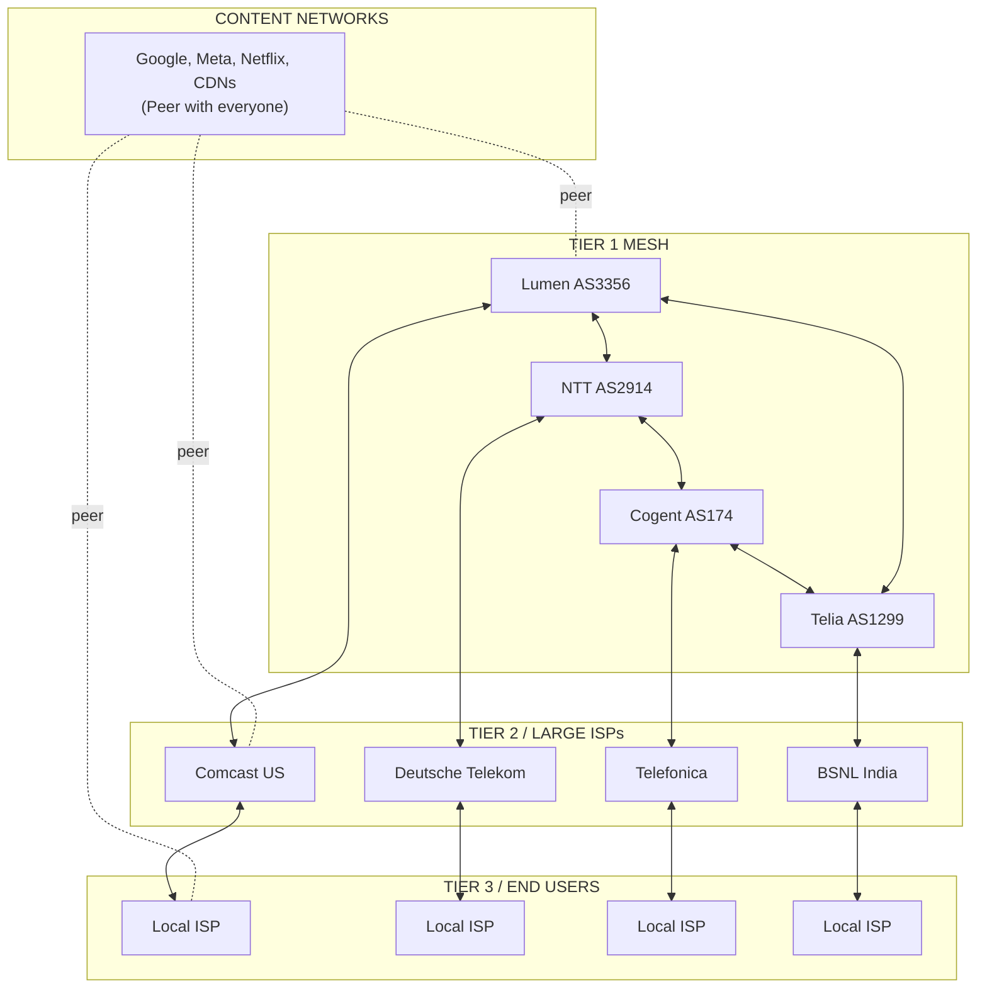

### 1.3 Transit vs Peering

```text
CONNECTIVITY ECONOMICS
═══════════════════════════════════════════════════════════════

TRANSIT
─────────────────────────────────────────────────────────────
Pay another network to carry your traffic to the full internet.

    You (AS65001) pays Lumen (AS3356) for transit.
    Lumen announces your prefixes to the entire internet.
    You can reach any IP through Lumen.

    Cost: $0.50-$5.00 per Mbps/month (depends on volume/location)
    10 Gbps transit in US: ~$5,000-$15,000/month

PEERING (Settlement-Free)
─────────────────────────────────────────────────────────────
Two networks agree to exchange traffic for free.
Each carries traffic only for their own customers.

    Comcast (AS7922) peers with Google (AS15169).
    Comcast sends Google-bound traffic directly to Google.
    Google sends Comcast-subscriber traffic directly to Comcast.
    Neither pays the other.

    Why peer?
    - Saves transit costs (don't pay Lumen to reach Google)
    - Lower latency (fewer hops)
    - More control over traffic path

PAID PEERING
─────────────────────────────────────────────────────────────
One network pays the other for direct peering.
Cheaper than full transit. Used when traffic ratio is uneven.

    (Netflix sends 100x more traffic than it receives)

WHERE PEERING HAPPENS
─────────────────────────────────────────────────────────────
    Internet Exchange Points (IXPs):
        DE-CIX Frankfurt: 1,100+ networks, 14+ Tbps peak
        AMS-IX Amsterdam: 900+ networks, 12+ Tbps peak
        LINX London: 950+ networks

    Private Network Interconnect (PNI):
        Direct fiber between two networks in the same facility.
        Higher capacity, dedicated bandwidth.
        Common between hyperscalers and large ISPs.
        (e.g., in the same Equinix datacenter)
```

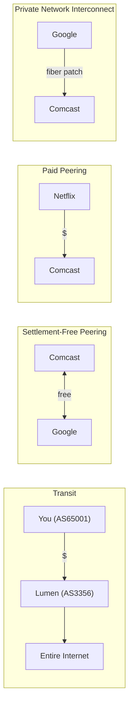

> **Stop and think**: If peering is settlement-free (free), why wouldn't a Tier 3 ISP just peer with everyone instead of paying for transit?

---

## Part 2: How BGP Works

### 2.1 BGP Basics

```text
BGP FUNDAMENTALS
═══════════════════════════════════════════════════════════════

BGP is a PATH VECTOR protocol.
Each route carries the full list of ASNs it traverses.

BGP UPDATE MESSAGE (Simplified)
─────────────────────────────────────────────────────────────

    "I can reach 203.0.113.0/24 via path [AS3356 AS15169]"

    Prefix:    203.0.113.0/24        (the destination network)
    AS-Path:   [AS3356, AS15169]     (networks traversed)
    Next-Hop:  192.0.2.1             (where to send packets)
    Origin:    IGP                    (learned internally)

    As the route propagates, each AS prepends its own ASN:

    AS15169 originates:  203.0.113.0/24  path: [AS15169]
    AS3356 receives, prepends: path: [AS3356, AS15169]
    AS7922 receives, prepends: path: [AS7922, AS3356, AS15169]

BGP SESSION ESTABLISHMENT
─────────────────────────────────────────────────────────────

    1. TCP connection on port 179
    2. OPEN message (ASN, hold time, router ID)
    3. KEEPALIVE exchange
    4. UPDATE messages (full routing table, then incremental)
```

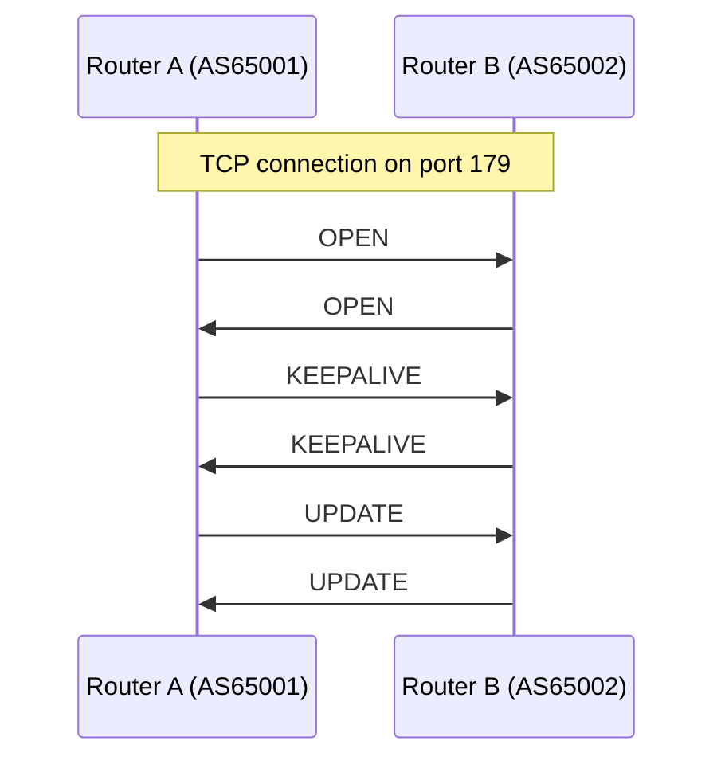

```text
    Full internet routing table: ~1,000,000 IPv4 prefixes (2025)
                                 ~230,000 IPv6 prefixes
    Memory needed: ~2-4 GB RAM for full table

eBGP vs iBGP
─────────────────────────────────────────────────────────────

    eBGP (External BGP)
    ─────────────────────────────────────────────
    Between DIFFERENT Autonomous Systems.
    Used for internet routing between organizations.

    - TTL=1 by default (directly connected)
    - AS-Path prepended when sending
    - Next-hop changes to sender's address
    - This is "the internet"

    iBGP (Internal BGP)
    ─────────────────────────────────────────────
    Within the SAME Autonomous System.
    Distributes external routes to internal routers.
```

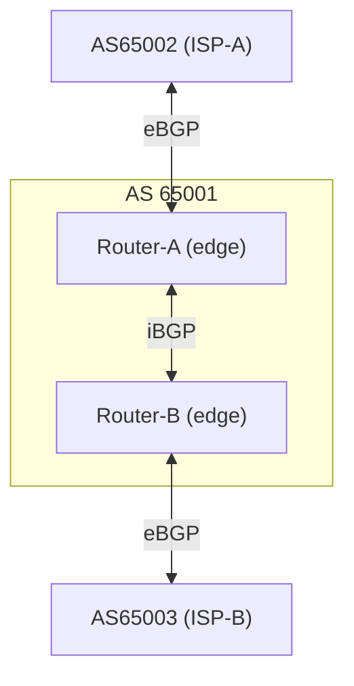

```text
    - Full mesh required (or use route reflectors)
    - AS-Path NOT modified
    - Next-hop NOT changed (must be reachable via IGP)
    - Prevents routing loops within the AS
```

### 2.2 BGP Path Selection (The Decision Process)

```text
BGP BEST PATH SELECTION — THE FULL ALGORITHM
═══════════════════════════════════════════════════════════════

When a router receives multiple routes to the same prefix,
it selects the BEST path using this ordered algorithm.
Earlier criteria take absolute priority over later ones.

STEP  ATTRIBUTE              PREFER        TYPICAL USE
───── ──────────────────── ────────────── ───────────────────

 1    Weight                 HIGHEST        Cisco-specific, local
                                           to router. Override
                                           everything.

 2    LOCAL PREFERENCE       HIGHEST        "Which exit do I
      (LOCAL_PREF)                          prefer from my AS?"
                                           Set by policy.
                                           Default: 100.

      Example:
      Route via ISP-A: LOCAL_PREF 200 ← PREFERRED
      Route via ISP-B: LOCAL_PREF 100

      Use case: Prefer cheaper transit provider,
      prefer direct peering over transit.

 3    LOCALLY ORIGINATED     PREFER         Routes you originate
                             LOCAL          are preferred over
                                           learned routes.

 4    AS-PATH LENGTH         SHORTEST       Fewer ASNs = fewer
                                           network hops.

      Route 1: [AS3356, AS15169]        → 2 hops
      Route 2: [AS7018, AS2914, AS15169] → 3 hops
      Route 1 preferred (shorter path).

      ⚠️  AS-Path is hops between NETWORKS,
         not physical routers. A route through
         2 ASNs could traverse 20 physical routers.

 5    ORIGIN TYPE            IGP > EGP      Rarely relevant in
                             > INCOMPLETE    modern networks.

 6    MED (Multi-Exit        LOWEST         "Which entrance to
      Discriminator)                        my AS do you prefer?"

      AS65002 tells AS65001:
        Enter via Router-A: MED 100 ← PREFERRED
        Enter via Router-B: MED 200

      Used when two ASNs have multiple peering points.
      "Please send traffic to my less-congested link."

      ⚠️  MED is only compared between routes from
         the SAME neighboring AS (by default).

 7    eBGP over iBGP         eBGP           Prefer externally
                             PREFERRED      learned routes over
                                           internally distributed.

 8    IGP METRIC             LOWEST         Closest exit point
      (to next-hop)                         within your own AS.
                                           "Hot potato routing."

 9    OLDEST ROUTE           OLDEST         Prefer stability.
                                           Don't flap between
                                           equal routes.

 10   ROUTER ID              LOWEST         Tiebreaker. Lowest
                                           router IP IP wins.
```

> **Stop and think**: If AS-Path length is the default way BGP determines the "shortest" route, how might an attacker manipulate this attribute to draw traffic toward their network without changing the origin ASN?

```text
MOST IMPORTANT IN PRACTICE
─────────────────────────────────────────────────────────────
    LOCAL_PREF:  Controls YOUR outbound preferences
    AS-PATH:     Natural shortest-path routing
    MED:         Neighbor's inbound preference hint

    Everything else is tiebreaking.
```

### 2.3 BGP Communities

```text
BGP COMMUNITIES — SIGNALING BETWEEN NETWORKS
═══════════════════════════════════════════════════════════════

Communities are tags attached to routes that signal routing
intent between ASNs. Like metadata labels for routes.

FORMAT
─────────────────────────────────────────────────────────────
    Standard:  ASN:VALUE  (e.g., 3356:100)
    Extended:  Type:ASN:VALUE
    Large:     ASN:Function:Parameter (32-bit each)

WELL-KNOWN COMMUNITIES
─────────────────────────────────────────────────────────────
    NO_EXPORT       Don't advertise outside your AS
    NO_ADVERTISE    Don't advertise to ANY peer
    NO_PEER         Don't advertise to peers (only transit)

COMMON USES
─────────────────────────────────────────────────────────────

    BLACKHOLE COMMUNITY
    ─────────────────────────────────────────────
    "Drop all traffic to this prefix."

    Attach community 3356:9999 to 203.0.113.5/32
    → Lumen drops all traffic destined for 203.0.113.5

    Used during DDoS: sacrifice one IP to save the rest.

    LOCAL PREFERENCE SIGNALING
    ─────────────────────────────────────────────
    Tell your transit provider how to prioritize routes.

    3356:70   → Set LOCAL_PREF 70  (backup route)
    3356:80   → Set LOCAL_PREF 80  (normal)
    3356:90   → Set LOCAL_PREF 90  (preferred)

    PREPENDING REQUEST
    ─────────────────────────────────────────────
    Ask transit to prepend your AS-Path (make route longer).

    3356:3001  → Prepend AS once (AS-Path +1)
    3356:3003  → Prepend AS three times (AS-Path +3)

    Makes the route less preferred by others.
    Used for traffic engineering (push traffic to other links).

    GEOGRAPHIC COMMUNITIES
    ─────────────────────────────────────────────
    Tag routes with geographic information.

    65001:1000  → Learned in North America
    65001:2000  → Learned in Europe
    65001:3000  → Learned in Asia-Pacific

    Useful for debugging and policy decisions.
```

---

## Part 3: BGP Security Threats

### 3.1 Route Hijacking

```text
BGP ROUTE HIJACKING
═══════════════════════════════════════════════════════════════

An attacker (or misconfigured router) announces someone
else's IP prefixes, diverting their traffic.

HOW IT WORKS
─────────────────────────────────────────────────────────────

    Legitimate: AS15169 (Google) announces 8.8.8.0/24
    Attacker:   AS666 announces 8.8.8.0/24 (same prefix!)

    OR WORSE — More Specific Prefix:
    Attacker:   AS666 announces 8.8.8.0/25 (more specific!)

    BGP prefers more specific prefixes (longest match).
    Even if AS15169 announces 8.8.8.0/24, the /25 wins
    for half the address space.
```

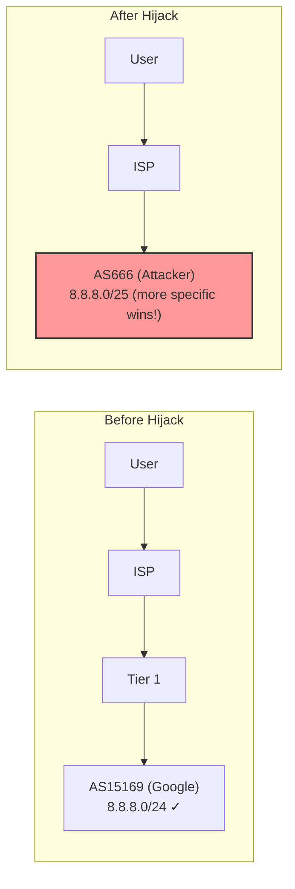

```text
NOTABLE INCIDENTS
─────────────────────────────────────────────────────────────

    2008: Pakistan Telecom hijacks YouTube
    ─────────────────────────────────────────────
    Pakistan government orders YouTube blocked.
    Pakistan Telecom announces YouTube's prefix internally.
    Announcement LEAKS to the internet via PCCW (transit).
    YouTube goes dark worldwide for ~2 hours.

    2018: Amazon Route53 hijack (BGP + DNS)
    ─────────────────────────────────────────────
    eNet (AS10297) announces Amazon DNS prefixes.
    MyEtherWallet DNS queries diverted to phishing server.
    ~$17 million in Ethereum stolen.

    2019: China Telecom re-routes European traffic
    ─────────────────────────────────────────────
    China Telecom (AS4134) announces European prefixes.
    Traffic for European networks routed through China.
    Duration: ~2 hours. Intent: unclear (espionage? accident?)

    2022: Russian hijack of Twitter, Google prefixes
    ─────────────────────────────────────────────
    During Ukraine conflict, Russian ASNs briefly
    announced prefixes belonging to Twitter, Google,
    and Cloudflare. Duration: minutes. Impact: limited.
```

### 3.2 Route Leaks

```text
BGP ROUTE LEAKS
═══════════════════════════════════════════════════════════════

A route leak is when a network announces routes it should
NOT announce — not maliciously, but by misconfiguration.

HOW ROUTE LEAKS HAPPEN
─────────────────────────────────────────────────────────────
```

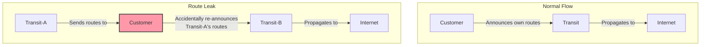

```text
    The customer becomes a "transit" between two providers.
    Traffic that should flow directly between Tier 1s now
    flows through a small customer network (bottleneck!).

NOTABLE ROUTE LEAKS
─────────────────────────────────────────────────────────────

    2019: Allegheny Technologies (AS396531)
    ─────────────────────────────────────────────
    Small company leaks 20,000+ routes from Verizon
    to their other transit (DQE). Routes propagate
    globally. Major sites affected for hours.

    2019: Swiss Colocation (AS21217)
    ─────────────────────────────────────────────
    Leaks full BGP table (~800,000 routes) through
    their connection. Causes global routing instability.
    Large swaths of European internet disrupted.

    2021: Vodafone India route leak
    ─────────────────────────────────────────────
    Vodafone (AS55410) leaks 30,000 BGP routes
    from various networks, causing routing disruption
    across Asia for approximately 60 minutes.

ROUTE LEAK vs HIJACK
─────────────────────────────────────────────────────────────
    Hijack:  Announce someone else's prefix as your own
             (malicious or accidental, you claim ownership)

    Leak:    Re-announce routes you received to networks
             you shouldn't (always accidental, you're passing
             through, not claiming ownership)

    Both cause traffic to flow through the wrong path.
    Leaks are FAR more common than hijacks.
```

> **Stop and think**: Why are route leaks often harder to automatically detect and drop than basic route hijacks?

### 3.3 BGP Blackholing

```text
BGP BLACKHOLE ROUTING — INTENTIONAL TRAFFIC DROPPING
═══════════════════════════════════════════════════════════════

Blackholing deliberately drops traffic at the network edge.
Used defensively during DDoS attacks.

REMOTE TRIGGERED BLACKHOLE (RTBH)
─────────────────────────────────────────────────────────────

    You're being DDoS'd at 203.0.113.10.
    200 Gbps of attack traffic is saturating your links.

    Without blackholing:
        Attack traffic + legitimate traffic → your router
        Link saturated → EVERYTHING affected

    With blackholing:
        Announce 203.0.113.10/32 with blackhole community
        → Transit provider drops ALL traffic to that IP
        → Attack traffic never reaches your network
        → Your other IPs are safe

    ⚠️  The sacrifice: 203.0.113.10 is now unreachable.
        You've "cut off the gangrenous limb to save the body."
```

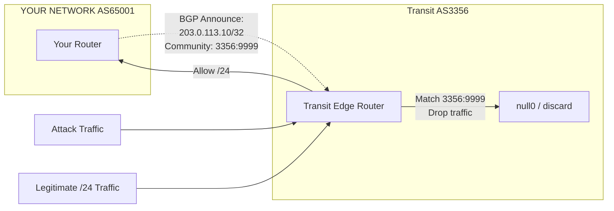

> **Pause and predict**: If you use BGP blackholing for a single IP under attack, what happens to legitimate traffic trying to reach that specific IP during the mitigation?

```text
FLOWSPEC — SURGICAL BLACKHOLING
─────────────────────────────────────────────────────────────
    Instead of dropping ALL traffic to an IP, FlowSpec
    can drop traffic matching specific criteria.

    "Drop UDP traffic to 203.0.113.10 port 53
     from source port 19 with packet size > 500 bytes"

    This blocks the DNS amplification attack while
    keeping legitimate traffic to 203.0.113.10 flowing.

    ✓ More surgical than full blackhole
    ✗ Not all transit providers support FlowSpec
    ✗ Complex to configure under pressure
```

---

## Part 4: BGP Security — RPKI and Route Origin Validation

### 4.1 RPKI (Resource Public Key Infrastructure)

```text
RPKI — ADDING TRUST TO BGP
═══════════════════════════════════════════════════════════════

RPKI cryptographically verifies that an AS is authorized
to announce a specific IP prefix.

HOW RPKI WORKS
─────────────────────────────────────────────────────────────

    1. Resource holder creates a ROA (Route Origin Authorization)
       "AS15169 is authorized to announce 8.8.8.0/24 with max /24"

    2. ROA is signed by the RIR (Regional Internet Registry)
       ARIN, RIPE, APNIC, LACNIC, AFRINIC

    3. Validators download ROAs from all RIRs
       Build a validated cache of authorized announcements

    4. Routers query validator before accepting routes
```

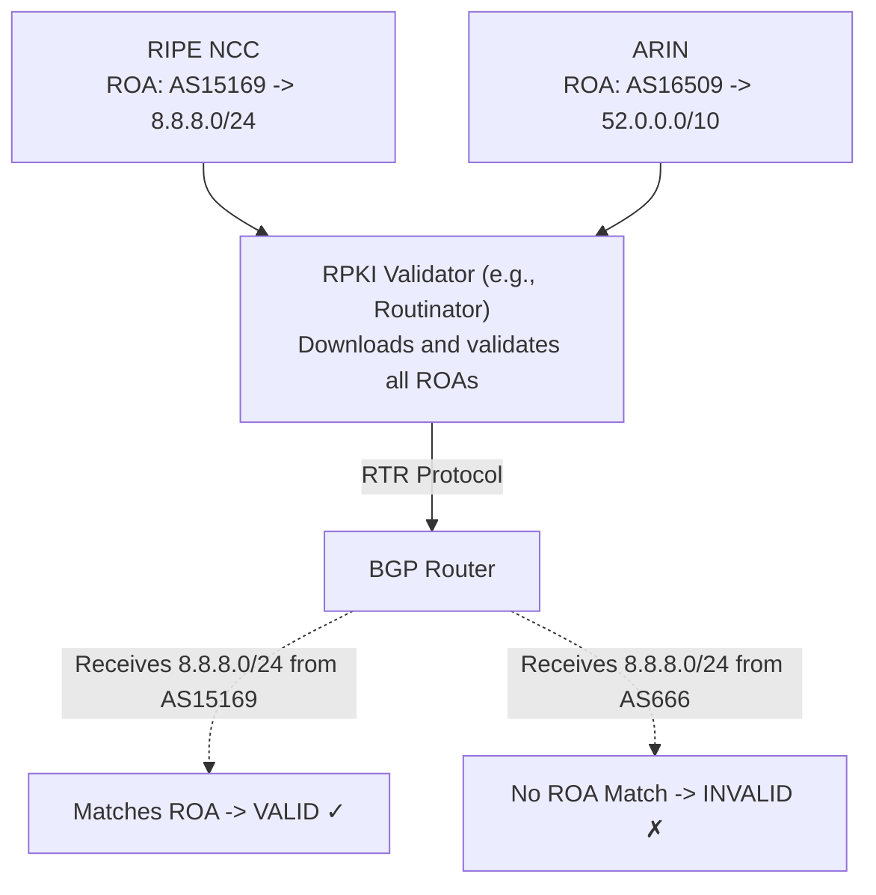

```text
VALIDATION STATES
─────────────────────────────────────────────────────────────
    VALID:     Route matches a ROA (correct AS, correct prefix)
    INVALID:   Route conflicts with a ROA (wrong AS or too specific)
    NOT FOUND: No ROA exists for this prefix (unknown)
```

> **Pause and predict**: If a major Tier 1 provider drops all "INVALID" routes but accepts "NOT FOUND" routes, what happens to traffic destined for an organization that has never created a ROA?

```text
RPKI ADOPTION (2025)
─────────────────────────────────────────────────────────────
    ROA coverage:
      IPv4 routes with valid ROA:  ~52%
      IPv6 routes with valid ROA:  ~55%

    Route Origin Validation (dropping invalids):
      Major networks enforcing:
        AT&T, Cloudflare, Google, NTT, Lumen, KDDI,
        Hurricane Electric, many European networks

      Still not enforcing:
        Some regional ISPs, enterprise networks

    Impact: RPKI would have prevented MOST of the
    hijacking incidents described earlier.
    But "NOT FOUND" is still treated as acceptable
    (otherwise ~48% of the internet would be unreachable).
```

### 4.2 Other BGP Security Mechanisms

```text
ADDITIONAL BGP SECURITY
═══════════════════════════════════════════════════════════════

BGPsec (RFC 8205)
─────────────────────────────────────────────────────────────
    Cryptographically signs every hop in the AS-Path.
    Proves the path hasn't been tampered with.

    Current status: Almost zero adoption.
    Problem: Every AS in the path must support it.
    One AS without BGPsec breaks the chain.
    Performance cost: Crypto operations per route per update.

ASPA (Autonomous System Provider Authorization)
─────────────────────────────────────────────────────────────
    AS publishes a list of its authorized transit providers.
    "AS65001 uses AS3356 and AS2914 as transit."

    If AS65001's routes appear via any other transit,
    it's likely a route leak.

    Status: IETF draft, gaining traction. Simpler than BGPsec.

IRR (Internet Routing Registry)
─────────────────────────────────────────────────────────────
    Database of intended routing policies (RPSL format).
    Networks register what they plan to announce.
    Transit providers filter based on IRR data.

    Databases: RADB, RIPE, ARIN, APNIC, etc.

    Problem: Voluntary, often outdated, no crypto verification.
    Still useful as one signal among many.

PREFIX FILTERING BEST PRACTICES
─────────────────────────────────────────────────────────────
    1. Filter customer routes based on IRR + RPKI
    2. Reject routes for bogon prefixes (unallocated, RFC1918)
    3. Reject routes with AS-Path containing bogon ASNs
    4. Limit maximum prefix count from each peer
    5. Reject routes more specific than /24 (IPv4) or /48 (IPv6)
    6. Implement RPKI Route Origin Validation
    7. Deploy MANRS (Mutually Agreed Norms for Routing Security)
```

---

## Part 5: Cloud Interconnection

### 5.1 Direct Connect / ExpressRoute / Cloud Interconnect

```text
PRIVATE CLOUD CONNECTIVITY
═══════════════════════════════════════════════════════════════

Instead of reaching cloud providers over the public internet,
you can establish dedicated, private connections via BGP.

AWS DIRECT CONNECT
─────────────────────────────────────────────────────────────
```

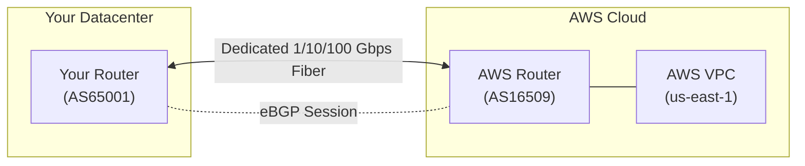

```text
    Types:
    ─────────────────────────────────────────────
    Dedicated Connection: 1/10/100 Gbps physical port
    Hosted Connection:    50 Mbps - 10 Gbps (via partner)

    BGP Configuration:
    ─────────────────────────────────────────────
    Your ASN:     65001 (private) or your public ASN
    AWS ASN:      7224 (default) or 64512 (custom)
    VLAN:         Tagged (one per Virtual Interface)
    BGP Auth:     MD5 password

    Virtual Interfaces:
    ─────────────────────────────────────────────
    Private VIF: Access VPC resources (10.x.x.x)
    Public VIF:  Access AWS public services (S3, DynamoDB)
    Transit VIF: Access via Transit Gateway (multi-VPC)

AZURE EXPRESSROUTE
─────────────────────────────────────────────────────────────
    Similar concept, Microsoft's implementation.

    Peering types:
    - Azure Private Peering (VNet access)
    - Microsoft Peering (Microsoft 365, Azure public services)

    Speeds: 50 Mbps to 100 Gbps
    Redundancy: Always two connections (active/active)
    BGP: Your ASN ↔ Microsoft ASN (12076)

GOOGLE CLOUD INTERCONNECT
─────────────────────────────────────────────────────────────
    Dedicated Interconnect: 10/100 Gbps (your own fiber)
    Partner Interconnect:   50 Mbps - 50 Gbps (via partner)
    Cross-Cloud Interconnect: Connect to other clouds

    BGP: Your ASN ↔ Google ASN (16550 for peering)

WHY USE PRIVATE INTERCONNECT?
─────────────────────────────────────────────────────────────
    ✓ Consistent latency (no internet congestion)
    ✓ Higher bandwidth (up to 100 Gbps dedicated)
    ✓ Lower cost per GB (no data transfer charges)
    ✓ Compliance (traffic doesn't traverse public internet)
    ✓ Reduced attack surface (no DDoS from internet)

    ✗ Physical infrastructure dependency
    ✗ Lead time for provisioning (weeks/months)
    ✗ Monthly port fees ($200-$6,000+ depending on speed)
    ✗ Need colocation in same facility or partner
```

### 5.2 BGP in Kubernetes

```text
BGP IN KUBERNETES
═══════════════════════════════════════════════════════════════

Several Kubernetes networking solutions use BGP to advertise
pod and service IPs to the physical network.

CALICO BGP MODE
─────────────────────────────────────────────────────────────
```

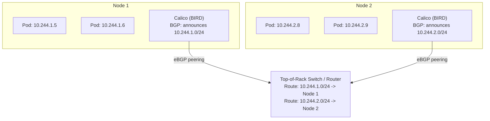

```text
    Physical network can route to pods directly!

METALLB BGP MODE
─────────────────────────────────────────────────────────────

    MetalLB assigns external IPs to LoadBalancer services
    and announces them via BGP.
```

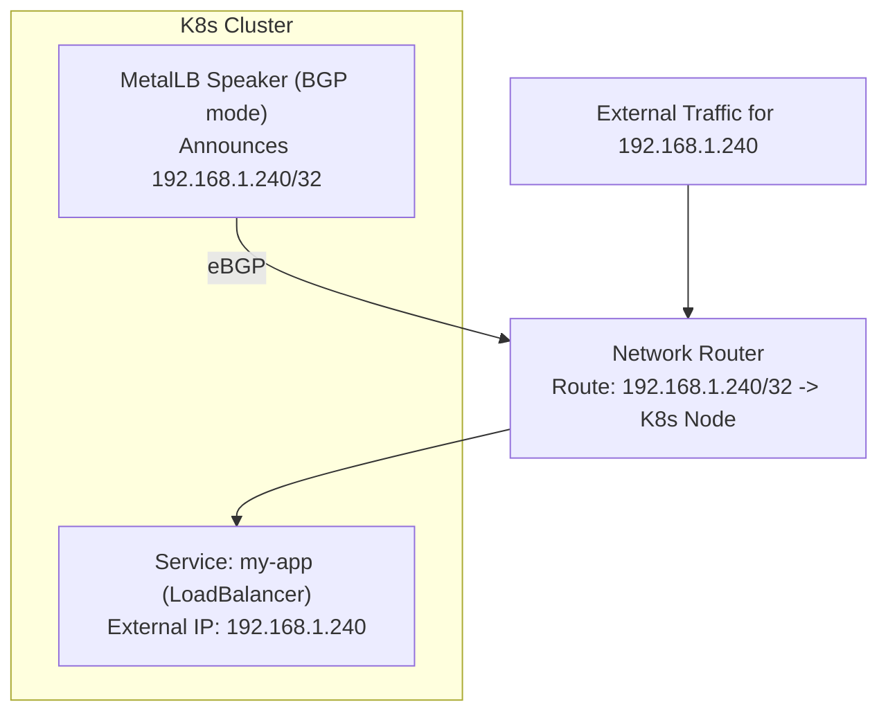

> **Stop and think**: If MetalLB in BGP mode announces a `/32` address to the top-of-rack switch, what must the physical network infrastructure support for external users to reach that service?

---

## Did You Know?

- **The full BGP routing table crossed 1 million IPv4 prefixes in 2024.** In 1992, the entire internet routing table had fewer than 5,000 entries. This exponential growth means BGP routers need multi-gigabyte memory and increasingly powerful CPUs just to keep up with route calculations. Every time a route changes, routers across the internet recalculate their best paths.

- **A single BGP misconfiguration can affect the entire internet.** In June 2019, a route leak through a small Pennsylvania ISP (AS33154, via Allegheny Technologies) caused major routing disruptions for services including Cloudflare, Amazon, and Fastly. The leak propagated because Verizon, one of the world's largest networks, failed to filter routes from their customer — a basic best practice that many networks still skip.

- **BGP was designed over lunch on two napkins.** In 1989, engineers Yakov Rekhter (IBM) and Kirk Lougheed (Cisco) sketched the initial BGP protocol design on the back of napkins at an IETF meeting. The protocol they designed — fundamentally based on trust between networks — is still what runs the internet 36 years later, handling over a million routes across 75,000+ autonomous systems.

---

## Common Mistakes

| Mistake | Problem | Solution |
|---------|---------|----------|
| No prefix filtering on customer BGP sessions | Customer can accidentally leak full table through your network | Implement strict prefix limits and IRR-based filters |
| Ignoring RPKI ROA creation | Your prefixes have no cryptographic authorization, making hijacks easier | Create ROAs for all your prefixes at your RIR |
| Single Direct Connect without redundancy | Physical failure = total cloud connectivity loss | Always provision two connections in different facilities |
| AS-Path prepending as primary traffic engineering | Fragile, unpredictable, adds propagation delay | Use LOCAL_PREF and MED first; prepending as last resort |
| Running iBGP full mesh at scale | O(n^2) sessions, operational nightmare | Use route reflectors or confederations |
| No BGP session authentication | Neighbor spoofing possible on shared networks | Enable MD5 or TCP-AO authentication on all sessions |
| Not monitoring BGP route counts from peers | Peer could send unexpected routes (route leak) | Set max-prefix limits with warning thresholds |
| Announcing /25 or smaller to the internet | Many networks filter prefixes smaller than /24 | Keep announcements at /24 or larger for IPv4 |

---

## Quiz

1. **Your team is designing a multi-region network for a new datacenter. One engineer suggests using eBGP between all routers inside the datacenter to ensure paths are properly tracked. Why might this approach be flawed, and how does the standard iBGP approach handle routing loops without modifying the AS-Path?**
   <details>
   <summary>Answer</summary>

   eBGP is designed for inter-domain routing between different Autonomous Systems, where it inherently prevents loops by rejecting routes that contain the local ASN in the AS-Path. If you use eBGP within a single datacenter, you would either have to assign a unique ASN to every single router, which becomes an administrative nightmare, or override loop prevention mechanisms, risking routing loops. Instead, iBGP is used within the same AS to distribute externally learned routes without modifying the AS-Path. Because iBGP does not update the AS-Path, it relies on a different loop prevention rule: iBGP routers never re-advertise a route learned from one iBGP peer to another iBGP peer. This split-horizon rule ensures loops cannot form, but requires either a full mesh of iBGP connections or the use of route reflectors to scale.
   </details>

2. **You receive alerts that outbound traffic to a major cloud provider has suddenly shifted from your dedicated 10Gbps transit link to a more expensive, congested backup link. Both links advertise the same prefix, and your edge router's BGP configuration sets the same LOCAL_PREF for both. What mechanism in the BGP path selection algorithm is likely causing this shift, and how does the router break the tie?**
   <details>
   <summary>Answer</summary>

   When BGP evaluates multiple routes to the same destination, it processes attributes in a strict, ordered sequence. Since the LOCAL_PREF is identical for both links, the router moves to the next criteria in the decision process, which evaluates whether the route was locally originated. If neither is local, it checks the AS-Path length, preferring the path with the fewest number of network hops. It is highly likely that the primary link's AS-Path increased because the cloud provider or an intermediate ISP began prepending their ASN, making the backup link appear as the "shorter" path. If the AS-Path lengths are also identical, the router will continue down the list, evaluating the Origin type and MED, until a tiebreaker like the lowest Router ID finally determines the best path.
   </details>

3. **A monitoring tool reports that traffic bound for your main application from users in Europe is suddenly being routed through a small regional ISP in South America, causing massive latency. The origin ASN in the BGP updates is still correctly showing as your ASN. Based on this evidence, are you experiencing a route hijack or a route leak? Explain the mechanics of what happened.**
   <details>
   <summary>Answer</summary>

   Based on the evidence, your network is experiencing a route leak rather than a route hijack. In a route hijack, an attacker maliciously or accidentally announces your prefix while claiming to be the origin, which would result in the origin ASN changing to the attacker's ASN. Because the origin ASN remains correct in this scenario, the route is legitimate at its source but is being propagated along an unauthorized path. This happens when a network, like the small South American ISP, accidentally re-announces routes it learned from one transit provider to another. By doing so, it effectively turns itself into an unintended transit path for global traffic, creating a massive bottleneck that causes the observed latency.
   </details>

4. **Your company is hit with a 100 Gbps DDoS attack targeting a single IP address on your network. Your upstream provider offers a BGP blackholing service. Describe the process of triggering this mitigation, and explain the exact trade-off you must make when employing it.**
   <details>
   <summary>Answer</summary>

   To trigger BGP blackholing, you configure your edge router to announce a /32 host route for the specific targeted IP address, attaching a predetermined BGP community string (such as the blackhole community) to the announcement. When your transit provider receives this route, their routers are configured to match that community and immediately rewrite the next-hop for that IP to a null interface, dropping the traffic at the provider's edge before it traverses your link. The critical trade-off is that you are completely sacrificing the availability of that specific IP address, cutting off all legitimate traffic alongside the malicious traffic. However, this aggressive measure protects your uplinks from being saturated by the volumetric attack. By dropping the attack traffic upstream, you ensure that the rest of the IP addresses and services in your subnet remain online and unaffected.
   </details>

5. **After implementing strict RPKI Route Origin Validation (ROV) on all edge routers, your CISO asks if the network is now fully protected against all BGP-related traffic redirection attacks. How should you respond, and what specific types of routing incidents could still occur despite having RPKI in place?**
   <details>
   <summary>Answer</summary>

   You must inform the CISO that while RPKI is a critical security control, it does not fully protect against all BGP-related redirection attacks. RPKI exclusively validates the origin ASN of a prefix announcement against cryptographically signed records (ROAs), effectively preventing simple prefix hijacks where an attacker claims to originate your IP space. However, RPKI provides absolutely no validation of the AS-Path itself. This means the network remains entirely vulnerable to route leaks, where a legitimate origin route is mistakenly propagated through an unauthorized intermediary network. Furthermore, an attacker can still execute a path manipulation attack by injecting your valid ASN at the end of a spoofed path, bypassing ROV completely.
   </details>

6. **A company uses AWS Direct Connect for their primary cloud connectivity. Their single 10 Gbps connection goes down. What happens to their cloud workloads, and how should they architect for resilience?**
   <details>
   <summary>Answer</summary>

   When the single Direct Connect link fails, all private routing between the on-premises network and the AWS VPC is severed, though the cloud workloads themselves will continue to run normally in AWS. Any on-premises services relying on private IP communication with the cloud will experience immediate timeouts and failures because the BGP session drops and the corresponding routes are withdrawn. To architect for resilience, the company should provision at least two Direct Connect links terminating in completely separate physical facilities, using different hardware and carriers to eliminate single points of failure. Additionally, they can configure a Site-to-Site VPN over the public internet as a path of last resort. By setting a lower BGP LOCAL_PREF on the VPN connection, it remains in standby and is only utilized if both physical Direct Connect links fail.
   </details>

---

## Hands-On Exercise

**Objective**: Set up eBGP peering between two Autonomous Systems using FRRouting (FRR) containers and observe route propagation, path selection, and failure behavior.

**Environment**: Docker containers running FRRouting

### Part 1: Create the Network Topology (15 minutes)

```bash
# Create a Docker network for each "link" between ASNs
docker network create --subnet=10.0.12.0/24 link-as1-as2
docker network create --subnet=10.0.13.0/24 link-as1-as3
docker network create --subnet=10.0.23.0/24 link-as2-as3

# Create three FRRouting containers (one per AS)
docker run -d --name as1-router \
  --hostname as1-router \
  --privileged \
  --network link-as1-as2 \
  --ip 10.0.12.1 \
  quay.io/frrouting/frr:10.2.1

docker run -d --name as2-router \
  --hostname as2-router \
  --privileged \
  --network link-as1-as2 \
  --ip 10.0.12.2 \
  quay.io/frrouting/frr:10.2.1

docker run -d --name as3-router \
  --hostname as3-router \
  --privileged \
  --network link-as1-as3 \
  --ip 10.0.13.3 \
  quay.io/frrouting/frr:10.2.1

# Connect AS1 to the AS1-AS3 link
docker network connect --ip 10.0.13.1 link-as1-as3 as1-router

# Connect AS2 to the AS2-AS3 link
docker network connect --ip 10.0.23.2 link-as2-as3 as2-router

# Connect AS3 to the AS2-AS3 link
docker network connect --ip 10.0.23.3 link-as2-as3 as3-router
```

### Topology

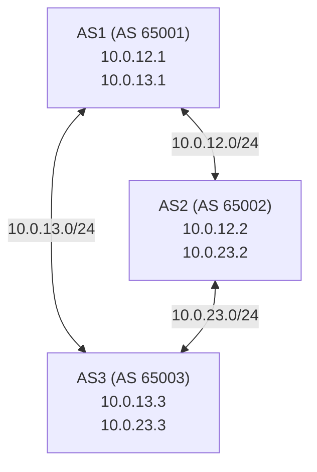

### Part 2: Configure BGP on AS1 (15 minutes)

```bash
# Enter AS1 router
docker exec -it as1-router vtysh

# Configure BGP
configure terminal

router bgp 65001
 bgp router-id 1.1.1.1
 no bgp ebgp-requires-policy

 ! Announce AS1's own prefix
 network 172.16.1.0/24

 ! eBGP peer with AS2
 neighbor 10.0.12.2 remote-as 65002
 neighbor 10.0.12.2 description AS2-peer

 ! eBGP peer with AS3
 neighbor 10.0.13.3 remote-as 65003
 neighbor 10.0.13.3 description AS3-peer

exit

! Create a loopback with the announced prefix
interface lo
 ip address 172.16.1.1/24
exit

end
write memory
```

### Part 3: Configure BGP on AS2 and AS3 (15 minutes)

```bash
# Configure AS2
docker exec -it as2-router vtysh

configure terminal

router bgp 65002
 bgp router-id 2.2.2.2
 no bgp ebgp-requires-policy
 network 172.16.2.0/24

 neighbor 10.0.12.1 remote-as 65001
 neighbor 10.0.12.1 description AS1-peer
 neighbor 10.0.23.3 remote-as 65003
 neighbor 10.0.23.3 description AS3-peer
exit

interface lo
 ip address 172.16.2.1/24
exit

end
write memory
exit

# Configure AS3
docker exec -it as3-router vtysh

configure terminal

router bgp 65003
 bgp router-id 3.3.3.3
 no bgp ebgp-requires-policy
 network 172.16.3.0/24

 neighbor 10.0.13.1 remote-as 65001
 neighbor 10.0.13.1 description AS1-peer
 neighbor 10.0.23.2 remote-as 65002
 neighbor 10.0.23.2 description AS2-peer
exit

interface lo
 ip address 172.16.3.1/24
exit

end
write memory
exit
```

### Part 4: Verify BGP Peering and Routes (15 minutes)

```bash
# Check BGP summary on AS1
docker exec -it as1-router vtysh -c "show bgp summary"

# Expected: Two peers (AS2, AS3) in Established state

# Check BGP routes learned by AS1
docker exec -it as1-router vtysh -c "show bgp ipv4 unicast"

# Expected routes on AS1:
# 172.16.1.0/24  (local, originated here)
# 172.16.2.0/24  via 10.0.12.2 (from AS2, path: 65002)
# 172.16.3.0/24  via 10.0.13.3 (from AS3, path: 65003)
# 172.16.2.0/24  via 10.0.13.3 (from AS3, path: 65003 65002)
# 172.16.3.0/24  via 10.0.12.2 (from AS2, path: 65002 65003)

# Check the detailed path for a specific prefix
docker exec -it as1-router vtysh -c "show bgp ipv4 unicast 172.16.2.0/24"

# Verify on AS2
docker exec -it as2-router vtysh -c "show bgp ipv4 unicast"

# Verify on AS3
docker exec -it as3-router vtysh -c "show bgp ipv4 unicast"
```

### Part 5: Observe Path Selection (15 minutes)

```bash
# On AS1, check the best path to AS3's network
docker exec -it as1-router vtysh -c "show bgp ipv4 unicast 172.16.3.0/24"

# Two paths should exist:
# 1. Direct: via AS3 (path: 65003)         ← BEST (shorter)
# 2. Indirect: via AS2 → AS3 (path: 65002 65003)

# Now use LOCAL_PREF to override path selection
# Make AS1 prefer the indirect path through AS2

docker exec -it as1-router vtysh

configure terminal

! Create a route-map to set LOCAL_PREF
route-map PREFER-AS2 permit 10
 set local-preference 200
exit

router bgp 65001
 ! Apply route-map to routes from AS2
 neighbor 10.0.12.2 route-map PREFER-AS2 in
exit

end
clear bgp ipv4 unicast * soft in

! Check again - AS2 path should now be preferred
show bgp ipv4 unicast 172.16.3.0/24

! Expected: Path via AS2 (65002 65003) is now BEST
! despite being longer, because LOCAL_PREF 200 > 100

exit
```

### Part 6: Simulate Link Failure (15 minutes)

```bash
# Disconnect AS1 from AS2 (simulate link failure)
docker network disconnect link-as1-as2 as1-router

# Wait for BGP hold timer to expire (~90 seconds)
# or watch the session drop
sleep 10
docker exec -it as1-router vtysh -c "show bgp summary"

# AS2 peer should show as "Connect" or "Active" (not Established)

# Check routes - traffic to AS2's network should now go via AS3
docker exec -it as1-router vtysh -c "show bgp ipv4 unicast 172.16.2.0/24"

# Expected: Only path via AS3 (65003 65002) remains

# Restore the link
docker network connect --ip 10.0.12.1 link-as1-as2 as1-router

# Wait for BGP session to re-establish
sleep 15
docker exec -it as1-router vtysh -c "show bgp summary"

# Both peers should be Established again
# Original path via AS2 should be restored
```

### Clean Up

```bash
docker rm -f as1-router as2-router as3-router
docker network rm link-as1-as2 link-as1-as3 link-as2-as3
```

**Success Criteria**:
- [ ] Three BGP sessions established (AS1-AS2, AS1-AS3, AS2-AS3)
- [ ] Each AS learns routes to all three /24 prefixes
- [ ] Observed BGP preferring shorter AS-Path (direct over indirect)
- [ ] Used LOCAL_PREF to override AS-Path length preference
- [ ] Simulated link failure and observed automatic failover to alternate path
- [ ] Observed BGP session recovery after link restoration
- [ ] Understood the relationship between AS-Path, LOCAL_PREF, and path selection

---

## Further Reading

- **"BGP: Building Reliable Networks with the Border Gateway Protocol"** — Iljitsch van Beijnum. The most accessible book-length treatment of BGP for practitioners.

- **bgp.tools** — Real-time BGP routing data, route leak detection, and RPKI status for any ASN or prefix. Essential for monitoring.

- **"Internet Routing Registries and RPKI" (MANRS)** — The Mutually Agreed Norms for Routing Security initiative provides best practices for network operators.

- **Cloudflare Blog: "How Verizon and a BGP Optimizer Knocked Large Parts of the Internet Offline"** <!-- incident-xref: cloudflare-2019-regex --> — Detailed analysis of the 2019 route leak that shows exactly how BGP incidents propagate. For the canonical treatment of the Cloudflare 2019 regex outage, see [CI/CD Pipelines](../../../prerequisites/modern-devops/module-1.3-cicd-pipelines/).

---

## Key Takeaways

Before moving on, ensure you understand:

- [ ] **Autonomous Systems are the building blocks of internet routing**: Each AS is an independently administered network that uses BGP to exchange reachability information with other ASNs
- [ ] **BGP path selection follows a strict hierarchy**: LOCAL_PREF (your outbound policy) beats AS-Path length, which beats MED (neighbor's inbound preference)
- [ ] **BGP is built on trust with no built-in verification**: Any AS can announce any prefix, and neighbors will believe it unless they explicitly filter
- [ ] **Route hijacks steal traffic, route leaks misroute it**: Hijacks claim false origin; leaks propagate routes through unauthorized paths. Leaks are more common
- [ ] **RPKI validates origin but not path**: ROAs prove which AS may originate a prefix but cannot prevent route leaks or path manipulation
- [ ] **BGP blackholing sacrifices one IP to save the rest**: During DDoS, announcing a /32 with a blackhole community drops all traffic at the transit edge
- [ ] **Direct Connect / ExpressRoute use BGP for private cloud connectivity**: Dedicated links with BGP peering provide consistent latency and reduced attack surface
- [ ] **Kubernetes uses BGP via Calico and MetalLB**: Pod CIDRs and LoadBalancer IPs can be announced to the physical network via BGP

---

## Next Module

[Module 1.5: Cloud Load Balancing Deep Dive](../module-1.5-load-balancing/) — The mechanics of L4 and L7 load balancers, connection draining, Proxy Protocol, and the architectures behind cloud load balancing services.