> **Complexity**: `[COMPLEX]`
>
> **Time to Complete**: 3.5 hours
>
> **Prerequisites**: Basic IP subnetting (CIDR notation, subnet masks), familiarity with how IP packets are routed
>
> **Track**: Foundations — Advanced Networking

## What You'll Be Able to Do

After completing this module, you will be able to:

1. **Explain** how BGP path selection works across autonomous systems and why the protocol's trust model creates systemic vulnerability
2. **Analyze** BGP hijack and route leak incidents by tracing AS path propagation and identifying where filtering failed
3. **Implement** BGP security controls (RPKI/ROA, route filtering, prefix limits, ASPA) to protect against route hijacking and leaks
4. **Design** multi-homed network architectures with BGP that balance redundancy, performance, and security considerations
5. **Distinguish** eBGP from iBGP sessions and apply route reflectors or confederations when scaling internal BGP within a single autonomous system

---

**April 24, 2018. Traffic destined for Amazon's Route53 DNS service suddenly takes an unexpected detour. For approximately two hours, a small ISP in Ohio called eNet (AS10297) announces BGP routes for Amazon's IP prefixes. Routers across the internet, following the fundamental trust model of BGP, accept these routes and begin forwarding traffic to eNet instead of Amazon.**

The attacker's target was not Amazon itself, but cryptocurrency. By hijacking Route53's IP space, the attacker redirected DNS queries for MyEtherWallet.com to a server in Russia. Users who typed the correct URL, used the correct DNS resolver, and saw the correct domain name in their browser were silently sent to a phishing site. **Reports from [ThousandEyes](https://www.thousandeyes.com/blog/amazon-route-53-dns-and-bgp-hijack) and [CyberScoop](https://cyberscoop.com/ether-dns-bgp-amazon-route-53-heist/) put the theft at about 215 ETH, roughly $152,000, during the two-hour incident.**

The attack exploited a fundamental property of BGP that has existed since the protocol was designed in 1989: **BGP is built entirely on trust.** When a network announces "I can reach these IP addresses," other networks believe it. There is no built-in verification in the base protocol. No cryptographic proof accompanies a standard BGP UPDATE. No central authority validates announcements before propagation. Roughly 75,000 autonomous systems collectively form the internet's routing fabric by exchanging reachability information on faith, moderated only by voluntary filtering and increasingly by RPKI origin validation where deployed.

This module explains how BGP works, why it is both the most critical and most vulnerable protocol on the internet, and how the industry is slowly adding the trust layer that was missing from the start. You will learn to read AS-Paths, configure eBGP peering in a lab environment, evaluate RPKI and ASPA as defense layers, and recognize whether an outage symptom indicates hijack, leak, or internal policy failure.

---

## Why This Module Matters

BGP (Border Gateway Protocol) is the routing protocol that holds the internet together. Every packet that crosses network boundaries — from your laptop to a server in another country, from one cloud region to another, from a CDN edge to your ISP — is routed by BGP. If DNS is the internet's phone book, BGP is its postal system. Unlike DNS, which resolves names to addresses at the application edge, BGP determines which autonomous systems carry packets between those addresses for every hop that leaves your network's administrative boundary.

Understanding BGP clarifies why your multi-cloud architecture behaves differently when one Direct Connect circuit flaps, why a CDN can absorb a DDoS attack that would overwhelm your origin, and why a routing incident on another continent can still affect your application's latency. The protocol is old, trust-based, and imperfect — but it is also the only mechanism that scales global routing to a million prefixes without a central coordinator.

For platform engineers, BGP knowledge matters in several concrete ways. Cloud providers use BGP for Direct Connect, ExpressRoute, and Cloud Interconnect — dedicated paths between your datacenter and the cloud that exchange routes over eBGP sessions rather than static routing. Kubernetes networking projects such as Calico, Cilium, and MetalLB use BGP to advertise pod CIDRs and LoadBalancer service IPs to the physical fabric, making cluster networks first-class citizens in the datacenter routing table. CDNs and anycast services rely on BGP to announce the same prefix from dozens of global locations, letting the internet's path selection deliver users to the nearest edge. When a BGP incident happens — a route leak, a hijack, or an internal policy error like Cloudflare's 2020 backbone misconfiguration — understanding what went wrong and what you can do about it is the difference between waiting helplessly and making informed decisions about failover, prefix filtering, and communication with transit providers.

Most engineers never touch a BGP router directly. That is normal. But understanding how BGP works changes how you think about internet reliability, cloud architecture, and the trust model underlying every network connection your application makes. The sections that follow build from AS structure and peering economics through path selection, security mechanisms, and hands-on peering labs so you can read incident reports, design multi-homed connectivity, and participate credibly in routing discussions with network operations teams.

> **The Postal System Analogy**
>
> Imagine a world where every country's postal service independently decides how to route mail, based solely on what neighboring countries tell them. "Send mail for France through me," says Germany. No one verifies this claim. If someone in Belarus announces "I'm the best route to France," postal services worldwide might start routing French mail through Minsk. This is roughly how BGP works — and why it's both remarkably resilient and terrifyingly fragile.

---

## Part 1: Autonomous Systems and Internet Structure

### 1.1 What is an Autonomous System?

Every device on the internet reaches every other device through a chain of routing decisions made by autonomous systems. An AS is the unit of routing policy — a boundary where one organization's rules end and another's begin. When Google (AS15169) peers with Comcast (AS7922), they exchange BGP UPDATE messages listing which IP prefixes they can reach and through which paths. Neither party controls the other's internal topology; they only see the unified policy the peer presents at the border.

```text
AUTONOMOUS SYSTEMS (AS)
═══════════════════════════════════════════════════════════════

An Autonomous System is a network (or group of networks)
under a single administrative authority that presents a
unified routing policy to the internet.

REAL-WORLD ASNs
─────────────────────────────────────────────────────────────

    ASN       Organization           Type
    ──────── ────────────────────── ─────────────
    AS15169   Google                 Content
    AS16509   Amazon (AWS)           Cloud
    AS13335   Cloudflare             CDN/Security
    AS8075    Microsoft              Cloud
    AS32934   Meta (Facebook)        Content
    AS7018    AT&T                   ISP (Transit)
    AS3356    Lumen (Level 3)        ISP (Transit)
    AS2914    NTT America            ISP (Transit)
    AS6939    Hurricane Electric     ISP (Transit)
    AS714     Apple                  Content

ASN FORMAT
─────────────────────────────────────────────────────────────
    2-byte ASN: 1 to 65535        (original, mostly allocated)
    4-byte ASN: 65536 to 4294967295  (extended, still available)

    Private ASNs: 64512-65534 (2-byte), 4200000000-4294967294 (4-byte)
    Used for internal networks, not announced to the internet.

    Total ASNs allocated: ~115,000 (as of 2025)
    Total actively routing: ~75,000

HOW TO LOOK UP AN ASN
─────────────────────────────────────────────────────────────

    # Who owns an IP address?
    $ whois 8.8.8.8
    ...
    OriginAS:  AS15169
    OrgName:   Google LLC

    # What prefixes does an ASN announce?
    # (Using bgp.tools, bgpview.io, or stat.ripe.net)
    AS15169 announces ~18,000 IPv4 prefixes
    AS16509 announces ~9,000 IPv4 prefixes
```

An Autonomous System is not merely a label on a router configuration — it is a contract with the rest of the internet about how you will behave. When you receive an ASN from a Regional Internet Registry (RIR), you are declaring that every prefix you originate and every BGP session you maintain will follow a coherent routing policy. Platform engineers rarely configure BGP on day one, but they encounter ASNs constantly: in cloud interconnect documentation, in CDN anycast announcements, in incident postmortems that reference `AS13335` or `AS16509`, and in security advisories about route leaks. Learning to read an ASN the way you read a hostname — as identity, not just a number — is the first step toward understanding why a misconfigured customer session can redirect traffic across continents.

Private ASNs exist precisely because not every network needs a public identity. When you peer with AWS Direct Connect or Azure ExpressRoute, you may use a private ASN (64512–65534 for 2-byte, or the 4-byte private range) on your side while the cloud provider presents its own ASN on theirs. The BGP session still follows identical path-selection rules; only the scope of propagation changes. Private ASNs must never appear in the global routing table, which is why transit providers filter them aggressively at the edge.

Tools like [bgp.tools](https://bgp.tools), [BGPView](https://bgpview.io), and the RIPEstat looking-glass APIs let you inspect what any ASN announces in real time. When troubleshooting latency or investigating a suspected hijack, the question is never "is BGP broken?" but "which path did my traffic take, and who authorized that path?" A prefix that suddenly appears with a shorter AS-Path through an unfamiliar transit provider is often the first observable signal of a leak or hijack — hours before application-level alerts fire.

### 1.2 Internet Topology

```text
INTERNET HIERARCHY
═══════════════════════════════════════════════════════════════

TIER 1: GLOBAL TRANSIT PROVIDERS
─────────────────────────────────────────────────────────────
Can reach every IP on the internet without paying anyone.
They peer with all other Tier 1s for free (settlement-free).

    Lumen (Level 3)   AS3356
    NTT               AS2914
    Cogent             AS174
    Telia Carrier      AS1299
    GTT                AS3257
    Arelion            AS1299

    ~15-20 networks worldwide. They ARE the internet backbone.

TIER 2: REGIONAL PROVIDERS / LARGE ISPs
─────────────────────────────────────────────────────────────
Buy transit from Tier 1s AND peer with other Tier 2s.
Can't reach all IPs through peering alone.

    Comcast            AS7922     (US residential ISP)
    Deutsche Telekom   AS3320     (European ISP)
    Telefonica         AS12956    (Latin American ISP)

TIER 3: LOCAL ISPs / ENTERPRISE
─────────────────────────────────────────────────────────────
Buy transit from Tier 2s. No peering.
Purely customers, not providers.

CONTENT NETWORKS (Special category)
─────────────────────────────────────────────────────────────
Don't fit the hierarchy. Peer directly with everyone.

    Google, Meta, Netflix, Apple, Cloudflare, Amazon

    These networks generate so much traffic that ISPs
    WANT to peer with them (saves transit costs).
```

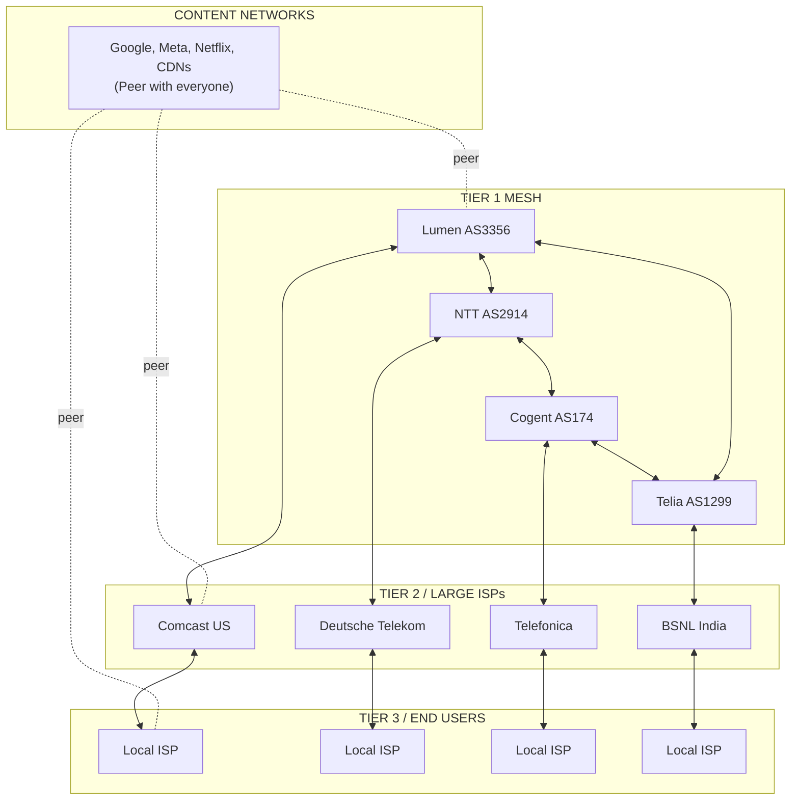
```mermaid
graph TD
    subgraph T1 [TIER 1 MESH]
        Lumen["Lumen AS3356"] <--> NTT["NTT AS2914"]
        NTT <--> Cogent["Cogent AS174"]
        Cogent <--> Telia["Telia AS1299"]
        Telia <--> Lumen
    end

    subgraph T2 [TIER 2 / LARGE ISPs]
        Comcast["Comcast US"]
        DT["Deutsche Telekom"]
        Tele["Telefonica"]
        BSNL["BSNL India"]
    end

    subgraph T3 [TIER 3 / END USERS]
        L1["Local ISP"]
        L2["Local ISP"]
        L3["Local ISP"]
        L4["Local ISP"]
    end

    subgraph Content [CONTENT NETWORKS]
        G["Google, Meta, Netflix, CDNs<br>(Peer with everyone)"]
    end

    Lumen <--> Comcast
    NTT <--> DT
    Cogent <--> Tele
    Telia <--> BSNL

    Comcast <--> L1
    DT <--> L2
    Tele <--> L3
    BSNL <--> L4

    G -. "peer" .- Lumen
    G -. "peer" .- Comcast
    G -. "peer" .- L1
```

The Tier-1/2/3 model is a simplification, but it captures an essential economic truth: connectivity is purchased in layers. A Tier-3 ISP buys transit from a Tier-2; the Tier-2 buys from a Tier-1; and the Tier-1s peer with each other in a mesh that forms the default-free zone (DFZ). Inside the DFZ, routes propagate without further upstream payment because every Tier-1 already knows how to reach every other prefix through settlement-free peering or its own transit purchases. Content networks like Google and Netflix occupy a special position: they generate so much outbound traffic that ISPs actively seek peering agreements with them, sometimes paying for the privilege of direct connection rather than hauling traffic through expensive transit links.

When you design multi-homed connectivity — two transit providers, Direct Connect plus VPN backup, or any architecture with more than one exit — you are navigating this hierarchy deliberately. Your LOCAL_PREF values, your prefix announcements, and your filtering policies determine which tier carries your traffic under normal conditions and which absorbs it during failure. The topology diagram is not academic decoration; it is the map your packets follow when nothing goes wrong, and the map you reconstruct when something goes very wrong.

### 1.3 Transit vs Peering

```text
CONNECTIVITY ECONOMICS
═══════════════════════════════════════════════════════════════

TRANSIT
─────────────────────────────────────────────────────────────
Pay another network to carry your traffic to the full internet.

    You (AS65001) pays Lumen (AS3356) for transit.
    Lumen announces your prefixes to the entire internet.
    You can reach any IP through Lumen.

    Cost: $0.50-$5.00 per Mbps/month (depends on volume/location)
    10 Gbps transit in US: ~$5,000-$15,000/month

PEERING (Settlement-Free)
─────────────────────────────────────────────────────────────
Two networks agree to exchange traffic for free.
Each carries traffic only for their own customers.

    Comcast (AS7922) peers with Google (AS15169).
    Comcast sends Google-bound traffic directly to Google.
    Google sends Comcast-subscriber traffic directly to Comcast.
    Neither pays the other.

    Why peer?
    - Saves transit costs (don't pay Lumen to reach Google)
    - Lower latency (fewer hops)
    - More control over traffic path

PAID PEERING
─────────────────────────────────────────────────────────────
One network pays the other for direct peering.
Cheaper than full transit. Used when traffic ratio is uneven.

    (Netflix sends 100x more traffic than it receives)

WHERE PEERING HAPPENS
─────────────────────────────────────────────────────────────
    Internet Exchange Points (IXPs):
        DE-CIX Frankfurt: 1,100+ networks, 14+ Tbps peak
        AMS-IX Amsterdam: 900+ networks, 12+ Tbps peak
        LINX London: 950+ networks

    Private Network Interconnect (PNI):
        Direct fiber between two networks in the same facility.
        Higher capacity, dedicated bandwidth.
        Common between hyperscalers and large ISPs.
        (e.g., in the same Equinix datacenter)
```

Peering economics explain why Netflix historically paid Comcast for paid peering while Google peers settlement-free with the same ISP. The difference is traffic ratio: Netflix sends far more bits to Comcast subscribers than it receives, so Comcast's transit costs would spike if it carried that traffic for free. Google operates services in both directions (search, YouTube upload/download, cloud APIs) and often caches content inside ISP networks via Google Global Cache, improving the balance. Platform teams choosing between "buy transit" and "get a cross-connect at an IXP" are making the same economic calculation at smaller scale.

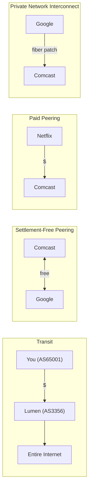
```mermaid
graph LR
    subgraph Transit [Transit]
        You["You (AS65001)"] -- "$" --> Lumen["Lumen (AS3356)"]
        Lumen --> Internet["Entire Internet"]
    end

    subgraph Peering [Settlement-Free Peering]
        Comcast["Comcast"] <-->|"free"| Google["Google"]
    end

    subgraph PaidPeering [Paid Peering]
        Netflix["Netflix"] -- "$" --> Comcast2["Comcast"]
    end

    subgraph PNI [Private Network Interconnect]
        Google2["Google"] -- "fiber patch" --> Comcast3["Comcast"]
    end
```

> **Stop and think**: If peering is settlement-free (free), why wouldn't a Tier 3 ISP just peer with everyone instead of paying for transit?

Settlement-free peering is never automatic. Tier-1 networks peer with each other because traffic ratios are roughly balanced and both parties save transit costs. A Tier-3 ISP with a few hundred customers generates almost no traffic that a Google or Lumen would want to carry for free — the ratio is overwhelmingly inbound to the content network. Peering agreements also require physical presence at exchange points or private interconnect facilities, operational maturity to maintain stable BGP sessions, and contractual terms about route filtering. Transit is the default path into the global routing table for anyone who cannot meet those bar.

Internet Exchange Points (IXPs) democratize peering somewhat by colocating hundreds of networks in one facility, but they do not eliminate the economics. You still need to transport your traffic to the IXP, maintain redundant sessions, and negotiate each peering relationship individually. For most enterprise and platform teams, the practical model is one or two transit providers plus optional Direct Connect or ExpressRoute into cloud — not a DIY peering strategy.

---

## Part 2: How BGP Works

BGP version 4, standardized in [RFC 4271](https://www.rfc-editor.org/rfc/rfc4271), is the only exterior gateway protocol used on the public internet today. Unlike interior protocols such as OSPF or IS-IS, which optimize for shortest physical path within a single administrative domain, BGP optimizes for policy. A longer AS-Path through a preferred transit provider may beat a shorter path through a congested peer because LOCAL_PREF says so. That policy-first design is why BGP scales to a million-prefix global table but also why a single misconfigured community or local-preference value can redirect traffic for millions of users.

Every BGP speaker maintains a Routing Information Base (RIB) — the full set of candidate paths — and selects one best path per prefix using the deterministic algorithm described below. When the best path changes, the router installs it into the Forwarding Information Base (FIB) and may send UPDATE messages to its neighbors. Convergence time after a link failure depends on hold timers (typically 90–180 seconds), the number of prefixes affected, and how aggressively upstream providers filter your withdrawals. Platform teams feel this as "why did failover take three minutes?" when a Direct Connect circuit flaps.

### 2.1 BGP Basics

```text
BGP FUNDAMENTALS
═══════════════════════════════════════════════════════════════

BGP is a PATH VECTOR protocol.
Each route carries the full list of ASNs it traverses.

BGP UPDATE MESSAGE (Simplified)
─────────────────────────────────────────────────────────────

    "I can reach 203.0.113.0/24 via path [AS3356 AS15169]"

    Prefix:    203.0.113.0/24        (the destination network)
    AS-Path:   [AS3356, AS15169]     (networks traversed)
    Next-Hop:  192.0.2.1             (where to send packets)
    Origin:    IGP                    (learned internally)

    As the route propagates, each AS prepends its own ASN:

    AS15169 originates:  203.0.113.0/24  path: [AS15169]
    AS3356 receives, prepends: path: [AS3356, AS15169]
    AS7922 receives, prepends: path: [AS7922, AS3356, AS15169]

BGP SESSION ESTABLISHMENT
─────────────────────────────────────────────────────────────

    1. TCP connection on port 179
    2. OPEN message (ASN, hold time, router ID)
    3. KEEPALIVE exchange
    4. UPDATE messages (full routing table, then incremental)
```

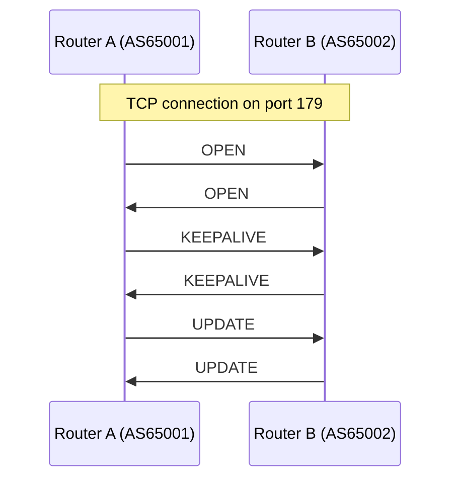
```mermaid
sequenceDiagram
    participant A as Router A (AS65001)
    participant B as Router B (AS65002)
    Note over A,B: TCP connection on port 179
    A->>B: OPEN
    B->>A: OPEN
    A->>B: KEEPALIVE
    B->>A: KEEPALIVE
    A->>B: UPDATE
    B->>A: UPDATE
```

The TCP session on port 179 is worth emphasizing because everything else depends on it. BGP has no built-in encryption or authentication in the base protocol — operators rely on TCP-AO (TCP Authentication Option) or MD5 session passwords, IP allowlists, and physical or VLAN isolation for session security. Once established, neighbors exchange their full routing tables (or a subset filtered by policy), then send incremental UPDATE messages when paths change. A single UPDATE can add routes, withdraw routes, or modify attributes on existing routes. Monitoring UPDATE rates is a standard operational practice: a sudden flood of updates from a customer session often precedes a route leak.

```text
    Full internet routing table: ~1,000,000 IPv4 prefixes (2025)
                                 ~230,000 IPv6 prefixes
    Memory needed: ~2-4 GB RAM for full table

eBGP vs iBGP
─────────────────────────────────────────────────────────────

    eBGP (External BGP)
    ─────────────────────────────────────────────
    Between DIFFERENT Autonomous Systems.
    Used for internet routing between organizations.

    - TTL=1 by default (directly connected)
    - AS-Path prepended when sending
    - Next-hop changes to sender's address
    - This is "the internet"

    iBGP (Internal BGP)
    ─────────────────────────────────────────────
    Within the SAME Autonomous System.
    Distributes external routes to internal routers.
```

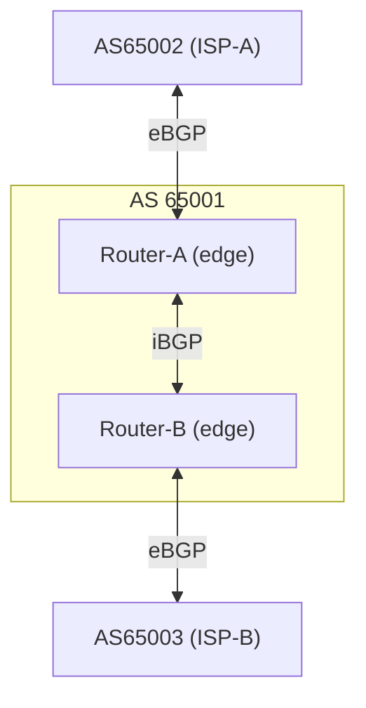
```mermaid
graph TD
    subgraph AS65001 [AS 65001]
        RA["Router-A (edge)"] <-->|"iBGP"| RB["Router-B (edge)"]
    end
    AS65002["AS65002 (ISP-A)"] <-->|"eBGP"| RA
    RB <-->|"eBGP"| AS65003["AS65003 (ISP-B)"]
```

```text
    - Full mesh required (or use route reflectors)
    - AS-Path NOT modified
    - Next-hop NOT changed (must be reachable via IGP)
    - Prevents routing loops within the AS
```

## eBGP vs iBGP: Inter-Domain and Intra-Domain Routing

Every organization that participates in global routing runs BGP in two distinct modes. **eBGP** (external BGP) connects your Autonomous System to other ASNs — your transit providers, your cloud Direct Connect peer, your CDN's anycast edge. **iBGP** (internal BGP) distributes the routes you learned from those external sessions to every router inside your own AS so that all edge routers agree on the same exit policy.

The distinction matters because the protocols share a name but follow different rules. eBGP modifies the AS-Path by prepending your ASN when you advertise outward, changes the next-hop to your router's address, and uses a default TTL of 1 (directly connected peers unless multihop is configured). iBGP leaves the AS-Path untouched — the path reflects how traffic entered your network, not how it hops between your internal routers — and preserves the external next-hop so that internal routers know which edge to use for forwarding.

### Why iBGP Does Not Re-Advertise iBGP Routes

The most important iBGP rule for loop prevention: **a router will not advertise a route learned from one iBGP peer to another iBGP peer.** This split-horizon rule exists because the AS-Path does not grow inside your AS. If Router B learned `203.0.113.0/24` from edge Router A via iBGP, and Router B re-advertised it to edge Router C, Router C would have no way to know the route already passed through the AS. eBGP avoids this by rejecting any route whose AS-Path contains the local ASN.

The consequence is architectural: every iBGP speaker must learn every external route. In a small network with two edge routers, a full mesh of iBGP sessions (each router peers with every other) is manageable. At ten edge routers, you need 45 sessions; at fifty, the number becomes operationally absurd. Two scaling patterns solve this:

**Route reflectors** designate one or more routers as reflectors that re-advertise iBGP routes to clients, breaking the full-mesh requirement while preserving loop prevention through cluster IDs and originator IDs. **Confederations** split a large AS into sub-ASNs that run eBGP with each other internally but present a single AS to the outside world — useful for very large providers but rare in enterprise deployments.

### next-hop-self and IGP Reachability

When an edge router learns `203.0.113.0/24` via eBGP, the next-hop attribute points to the external peer's address — often not directly reachable from internal routers. Edge routers typically apply **next-hop-self**, rewriting the next-hop to their own address so internal routers forward traffic to the edge first. Internal routers must reach that next-hop via an IGP (OSPF, IS-IS) or static routes. A classic failure mode: eBGP sessions up, iBGP sessions up, but traffic black-holed because the IGP does not route to the edge loopback or peering address used as next-hop.

### When Platform Engineers Touch iBGP

You may not configure iBGP on a datacenter router, but you encounter its effects constantly. Cloud providers run massive iBGP meshes (or reflector hierarchies) inside their ASNs; your Direct Connect learns routes via eBGP at the edge, and those routes propagate internally via iBGP to every availability zone. Calico and Cilium in BGP mode speak **eBGP** to your ToR switches — they are edge speakers for a pod network that behaves like a small AS. MetalLB speakers similarly use eBGP to announce `/32` service IPs. Understanding iBGP explains why "the BGP session is Established" on one router does not guarantee every router in the building knows the route.

```text
eBGP vs iBGP — QUICK REFERENCE
─────────────────────────────────────────────────────────────

    eBGP (External BGP)
    ─────────────────────────────────────────────
    Between DIFFERENT Autonomous Systems.
    Used for internet routing between organizations.

    - TTL=1 by default (directly connected)
    - AS-Path prepended when sending
    - Next-hop changes to sender's address
    - This is "the internet"

    iBGP (Internal BGP)
    ─────────────────────────────────────────────
    Within the SAME Autonomous System.
    Distributes external routes to internal routers.

    - Full mesh required (or use route reflectors)
    - AS-Path NOT modified
    - Next-hop NOT changed (must be reachable via IGP)
    - Prevents routing loops within the AS
    - Does NOT re-advertise iBGP-learned routes to iBGP peers
```

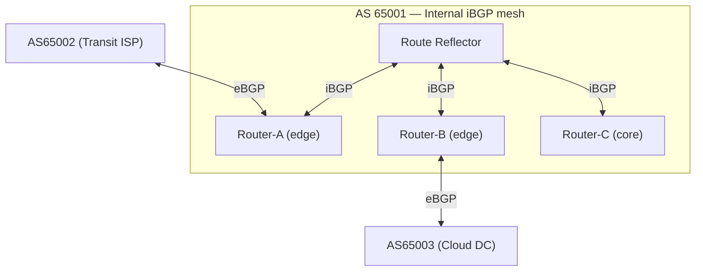
```mermaid
graph TD
    subgraph AS65001 [AS 65001 — Internal iBGP mesh]
        RR["Route Reflector"] <-->|"iBGP"| RA["Router-A (edge)"]
        RR <-->|"iBGP"| RB["Router-B (edge)"]
        RR <-->|"iBGP"| RC["Router-C (core)"]
    end
    AS65002["AS65002 (Transit ISP)"] <-->|"eBGP"| RA
    RB <-->|"eBGP"| AS65003["AS65003 (Cloud DC)"]
```

### 2.2 BGP Path Selection (The Decision Process)

Path selection is deterministic within a router's configured policy and implementation family, but the exact ordered list varies by vendor. The table below uses a common Cisco-style decision process: Cisco `Weight` is first and local to one router, while the standardized attributes begin with `LOCAL_PREF`. That predictability is essential for debugging ("why is traffic exiting via ISP-B?") and for security ("why did this hijacked route win?"). Walk the algorithm top to bottom when analyzing a path — the first differing attribute decides the winner; attributes below it are irrelevant for that comparison.

```text
BGP BEST PATH SELECTION — THE FULL ALGORITHM
═══════════════════════════════════════════════════════════════

When a router receives multiple routes to the same prefix,
it selects the BEST path using this ordered algorithm.
Earlier criteria take absolute priority over later ones.

STEP  ATTRIBUTE              PREFER        TYPICAL USE
───── ──────────────────── ────────────── ───────────────────

 1    Weight                 HIGHEST        Cisco-specific, local
                                           to router. Override
                                           everything.

 2    LOCAL PREFERENCE       HIGHEST        "Which exit do I
      (LOCAL_PREF)                          prefer from my AS?"
                                           Set by policy.
                                           Default: 100.

      Example:
      Route via ISP-A: LOCAL_PREF 200 ← PREFERRED
      Route via ISP-B: LOCAL_PREF 100

      Use case: Prefer cheaper transit provider,
      prefer direct peering over transit.

 3    LOCALLY ORIGINATED     PREFER         Routes you originate
                             LOCAL          are preferred over
                                           learned routes.

 4    AS-PATH LENGTH         SHORTEST       Fewer ASNs = fewer
                                           network hops.

      Route 1: [AS3356, AS15169]        → 2 hops
      Route 2: [AS7018, AS2914, AS15169] → 3 hops
      Route 1 preferred (shorter path).

      ⚠️  AS-Path is hops between NETWORKS,
         not physical routers. A route through
         2 ASNs could traverse 20 physical routers.

 5    ORIGIN TYPE            IGP > EGP      Rarely relevant in
                             > INCOMPLETE    modern networks.

 6    MED (Multi-Exit        LOWEST         "Which entrance to
      Discriminator)                        my AS do you prefer?"

      AS65002 tells AS65001:
        Enter via Router-A: MED 100 ← PREFERRED
        Enter via Router-B: MED 200

      Used when two ASNs have multiple peering points.
      "Please send traffic to my less-congested link."

      ⚠️  MED is only compared between routes from
         the SAME neighboring AS (by default).

 7    eBGP over iBGP         eBGP           Prefer externally
                             PREFERRED      learned routes over
                                           internally distributed.

 8    IGP METRIC             LOWEST         Closest exit point
      (to next-hop)                         within your own AS.
                                           "Hot potato routing."

 9    OLDEST ROUTE           OLDEST         Prefer stability.
                                           Don't flap between
                                           equal routes.

 10   ROUTER ID              LOWEST         Tiebreaker. Lowest
                                           router IP IP wins.
```

> **Stop and think**: If AS-Path length helps BGP choose among equally specific routes, what path or prefix tricks can draw traffic toward an attacker?

An attacker who wants to attract traffic must make the malicious route look **more preferred**, not longer. The most reliable tactic is a **more-specific prefix hijack**: announcing `203.0.113.0/25` beats a legitimate `203.0.113.0/24` because longest-prefix match happens before AS-Path comparison matters. If the competing routes have the same prefix length, a forged or unusually short AS-Path can also win when filters fail. **AS-Path prepending does the opposite**: adding repeated copies of your own ASN makes the path longer and less preferred, so legitimate operators use prepending to steer traffic away from one ingress path toward another.

```text
MOST IMPORTANT IN PRACTICE
─────────────────────────────────────────────────────────────
    LOCAL_PREF:  Controls YOUR outbound preferences
    AS-PATH:     Natural shortest-path routing
    MED:         Neighbor's inbound preference hint

    Everything else is tiebreaking.
```

Weight (step 1) is Cisco-specific and local to the router — it never propagates to peers. Operators use it for hot standby on a single device. LOCAL_PREF (step 2) is the primary traffic-engineering knob for outbound traffic from your AS: set 200 on routes from cheap transit and 100 on expensive backup, and all routers in your AS prefer the cheaper exit. AS-Path length (step 4) is the default inbound tiebreaker from the internet's perspective — why hijackers use more-specific prefixes instead of fighting LOCAL_PREF they do not control. MED (step 6) only compares routes from the same neighbor ASN by default, preventing MED wars between unrelated peers.

BGP communities deserve emphasis as the **policy API between networks**. [RFC 1997](https://www.rfc-editor.org/rfc/rfc1997) defines the standard Communities attribute as an optional transitive path attribute, not as a cryptographic command channel. When you attach community `3356:9999` to a prefix, you are attaching a policy tag that a peer may interpret according to its published local policy and your mutual agreement; intermediate ASes can append, strip, or modify communities by policy. Large providers publish community guides listing hundreds of values for blackholing, local-preference manipulation, geographic tagging, and DDoS mitigation. Mis-tagging a community during an incident — attaching a blackhole community to your entire `/16` instead of one `/32` host — is a recurring cause of self-inflicted outages. Treat community strings with the same change-control rigor as firewall rules.

### 2.3 BGP Communities

```text
BGP COMMUNITIES — SIGNALING BETWEEN NETWORKS
═══════════════════════════════════════════════════════════════

Communities are tags attached to routes that signal routing
intent between ASNs. Like metadata labels for routes.

FORMAT
─────────────────────────────────────────────────────────────
    Standard:  ASN:VALUE  (e.g., 3356:100)
    Extended:  Type:ASN:VALUE
    Large:     ASN:Function:Parameter (32-bit each)

WELL-KNOWN COMMUNITIES
─────────────────────────────────────────────────────────────
    NO_EXPORT       Don't advertise outside your AS
    NO_ADVERTISE    Don't advertise to ANY peer
    NO_PEER         Don't advertise to peers (only transit)

COMMON USES
─────────────────────────────────────────────────────────────

    BLACKHOLE COMMUNITY
    ─────────────────────────────────────────────
    "Drop all traffic to this prefix."

    Attach community 3356:9999 to 203.0.113.5/32
    → Lumen drops all traffic destined for 203.0.113.5

    Used during DDoS: sacrifice one IP to save the rest.

    LOCAL PREFERENCE SIGNALING
    ─────────────────────────────────────────────
    Tell your transit provider how to prioritize routes.

    3356:70   → Set LOCAL_PREF 70  (backup route)
    3356:80   → Set LOCAL_PREF 80  (normal)
    3356:90   → Set LOCAL_PREF 90  (preferred)

    PREPENDING REQUEST
    ─────────────────────────────────────────────
    Ask transit to prepend your AS-Path (make route longer).

    3356:3001  → Prepend AS once (AS-Path +1)
    3356:3003  → Prepend AS three times (AS-Path +3)

    Makes the route less preferred by others.
    Used for traffic engineering (push traffic to other links).

    GEOGRAPHIC COMMUNITIES
    ─────────────────────────────────────────────
    Tag routes with geographic information.

    65001:1000  → Learned in North America
    65001:2000  → Learned in Europe
    65001:3000  → Learned in Asia-Pacific

    Useful for debugging and policy decisions.
```

---

## Part 3: BGP Security Threats

BGP's trust model made sense in 1989 when the internet connected a few hundred research networks operated by people who knew each other. Today, with roughly 75,000 actively routing autonomous systems and a global routing table exceeding one million IPv4 prefixes, that same trust model means any participant can potentially redirect anyone else's traffic by announcing attractive routes. Security incidents fall into three mechanistic categories: **hijacks** (false origin or more-specific capture), **leaks** (unauthorized re-propagation of someone else's routes), and **blackholing** (intentional withdrawal or discard of reachability). Understanding the mechanism precedes choosing the right mitigation — RPKI stops many hijacks but not leaks; prefix limits stop leaks at your edge but not hijacks upstream.

### 3.1 Route Hijacking

Route hijacking is the unauthorized announcement of IP prefixes with the intent — or effect — of attracting traffic away from the legitimate origin. Hijacks range from malicious (cryptocurrency theft via DNS redirection, as in the 2018 Route53 incident) to accidental (misconfigured prefix list on a customer router). The mechanism always exploits the same BGP property: if your route looks more attractive by longest-prefix match or shorter AS-Path, global routers will prefer it until someone filters or withdraws the announcement.

```text
BGP ROUTE HIJACKING
═══════════════════════════════════════════════════════════════

An attacker (or misconfigured router) announces someone
else's IP prefixes, diverting their traffic.

HOW IT WORKS
─────────────────────────────────────────────────────────────

    Legitimate: AS15169 (Google) announces 8.8.8.0/24
    Attacker:   AS666 announces 8.8.8.0/24 (same prefix!)

    OR WORSE — More Specific Prefix:
    Attacker:   AS666 announces 8.8.8.0/25 (more specific!)

    BGP prefers more specific prefixes (longest match).
    Even if AS15169 announces 8.8.8.0/24, the /25 wins
    for half the address space.
```

Longest-prefix match is the first rule IP routers apply before BGP path selection even enters the picture. When your router receives both `8.8.8.0/24` from Google and `8.8.8.0/25` from an attacker, the `/25` wins for addresses in that half regardless of AS-Path length or LOCAL_PREF. Hijackers therefore often announce more-specific prefixes rather than competing on path length. Defense requires RPKI (INVALID if ROA says max length is /24), upstream filtering of prefixes longer than /24 from customers, and monitoring for unexpected more-specifics in routing registries. The 2018 Route53 hijack combined prefix capture with DNS redirection — BGP steered packets to the attacker's network, and DNS responses from that network sent users to a phishing site.

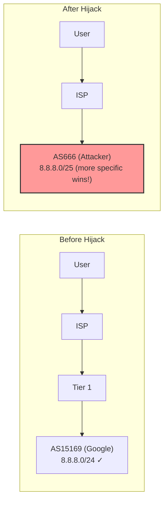
```mermaid
graph LR
    subgraph Before[Before Hijack]
        User1[User] --> ISP1[ISP]
        ISP1 --> Tier1[Tier 1]
        Tier1 --> Google["AS15169 (Google)<br>8.8.8.0/24 ✓"]
    end
    subgraph After[After Hijack]
        User2[User] --> ISP2[ISP]
        ISP2 --> Attacker["AS666 (Attacker)<br>8.8.8.0/25 (more specific wins!)"]
        style Attacker fill:#f99,stroke:#333,stroke-width:2px
    end
```

```text
NOTABLE INCIDENTS
─────────────────────────────────────────────────────────────

    2008: Pakistan Telecom hijacks YouTube
    ─────────────────────────────────────────────
    Pakistan government orders YouTube blocked.
    Pakistan Telecom announces YouTube's prefix internally.
    Announcement LEAKS to the internet via PCCW (transit).
    YouTube goes dark worldwide for ~2 hours.

    2018: Amazon Route53 hijack (BGP + DNS)
    ─────────────────────────────────────────────
    eNet (AS10297) announces Amazon DNS prefixes.
    MyEtherWallet DNS queries diverted to phishing server.
    About 215 ETH, roughly $152,000, stolen.

    2019: China Telecom re-routes European traffic
    ─────────────────────────────────────────────
    China Telecom (AS4134) announces European prefixes.
    Traffic for European networks routed through China.
    Duration: ~2 hours. Intent: unclear (espionage? accident?)

    2022: Russian hijack of Twitter, Google prefixes
    ─────────────────────────────────────────────
    During Ukraine conflict, Russian ASNs briefly
    announced prefixes belonging to Twitter, Google,
    and Cloudflare. Duration: minutes. Impact: limited.
```

These incidents share a mechanism: BGP propagated an attractive route that was not the intended path. Detection improved since 2008 — RIPE RIS, RouteViews, and public tools like bgp.tools provide near-real-time alerts — but propagation still outruns human response. Mean time to mitigation for global leaks remains measured in tens of minutes because filtering must happen at multiple tiers, and operators hesitate to drop routes that might be legitimate alternate paths. Your responsibility as a prefix holder includes ROA creation, IRR registration, and monitoring your prefixes from external vantage points.

### 3.2 Route Leaks

```text
BGP ROUTE LEAKS
═══════════════════════════════════════════════════════════════

A route leak is when a network announces routes it should
NOT announce — not maliciously, but by misconfiguration.

HOW ROUTE LEAKS HAPPEN
─────────────────────────────────────────────────────────────
```

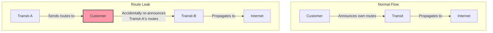
```mermaid
graph TD
    subgraph Normal Flow
        C[Customer] -->|Announces own routes| T[Transit]
        T -->|Propagates to| I[Internet]
    end

    subgraph Route Leak
        TA[Transit-A] -->|Sends routes to| C2[Customer]
        C2 -->|Accidentally re-announces<br>Transit-A's routes| TB[Transit-B]
        TB -->|Propagates to| I2[Internet]
    end
    style C2 fill:#f9a,stroke:#333,stroke-width:2px
```

```text
    The customer becomes a "transit" between two providers.
    Traffic that should flow directly between Tier 1s now
    flows through a small customer network (bottleneck!).

NOTABLE ROUTE LEAKS
─────────────────────────────────────────────────────────────

    2019: Allegheny Technologies (AS396531)
    ─────────────────────────────────────────────
    Small company leaks 20,000+ routes from Verizon
    to their other transit (DQE). Routes propagate
    globally. Major sites affected for hours.

    2019: Swiss Colocation (AS21217)
    ─────────────────────────────────────────────
    Leaks full BGP table (~800,000 routes) through
    their connection. Causes global routing instability.
    Large swaths of European internet disrupted.

    2021: Vodafone India route leak
    ─────────────────────────────────────────────
    Vodafone (AS55410) leaks 30,000 BGP routes
    from various networks, causing routing disruption
    across Asia for approximately 60 minutes.

ROUTE LEAK vs HIJACK
─────────────────────────────────────────────────────────────
    Hijack:  Announce someone else's prefix as your own
             (malicious or accidental, you claim ownership)

    Leak:    Re-announce routes you received to networks
             you shouldn't (often accidental, but RFC 7908
             also allows malicious leaks; you're passing
             routes through, not claiming ownership)

    Both cause traffic to flow through the wrong path.
    Leaks are FAR more common than hijacks.
```

Route leaks dominate incident statistics because they often require no malicious intent — only a missing export filter, a wrong route-map, or a customer BGP session configured without `allowas-in` restrictions. [RFC 7908](https://www.rfc-editor.org/rfc/rfc7908) still defines route leaks broadly enough to include accidental and malicious policy violations. The 2019 Verizon/DQE leak through Allegheny Technologies (AS396531) propagated over 20,000 routes globally because Verizon did not filter what its customer re-advertised — a failure of provider-side prefix and AS-Path filtering that MANRS explicitly recommends. The 2008 Pakistan Telecom/YouTube incident illustrates the leak mechanism cleanly: an internal null route for censorship leaked externally via PCCW transit, making Pakistan's internal policy the world's routing policy for YouTube prefixes for roughly two hours.

### 3.2.1 Cloudflare July 2020: Configuration as Routing Policy

On July 17, 2020, Cloudflare experienced a 27-minute partial outage affecting edge locations connected to its private backbone — including San Jose, Dallas, Chicago, London, Amsterdam, Frankfurt, and São Paulo. Network traffic across Cloudflare's network dropped by roughly half during the incident. This was not a hijack, a leak to the public internet, or an attack; it was an **internal BGP policy error** on a backbone router in Atlanta.

Engineers were responding to unrelated congestion on the Newark–Chicago backbone segment. To reduce traffic through Atlanta, they modified a router configuration — but instead of removing Atlanta routes from the backbone, a one-line change removed a prefix-list condition from a route policy. The Atlanta router began leaking **all** BGP routes into the backbone with LOCAL_PREF 200. Compute-node routes inside each PoP typically carried LOCAL_PREF 100. Because higher local preference wins, traffic meant for local compute nodes in dozens of cities was attracted to Atlanta, overwhelming that router and causing connected PoPs to fail.

Cloudflare disabled the Atlanta router at 21:39 UTC (approximately 27 minutes after the change at 21:12) and restored normal forwarding. Post-incident changes included adjusting LOCAL_PREF for local server routes so one location could not attract another's traffic, and adding maximum-prefix limits on backbone BGP sessions. For platform engineers, the lesson is structural: **BGP policy is code**. A single omitted prefix-list condition had the same blast radius as a bad deployment — and propagated at routing speed, not application rollout speed. Internal backbone BGP deserves the same review, testing, and rollback discipline as external peering.

> **Stop and think**: Why are route leaks often harder to automatically detect and drop than basic route hijacks?

Leaks often propagate **valid origin ASNs** along an invalid path. RPKI Route Origin Validation checks whether the announcing ASN is authorized for the prefix — a leaked Verizon route still shows origin AS7018 (Verizon), which matches the ROA. Heuristic filters may not trigger because the AS-Path looks plausible and the prefix is legitimately owned. Detection relies on path anomaly monitoring (bgp.tools, Cloudflare Radar, RIPE RIS) comparing observed paths against historical baselines. Hijacks that claim a wrong origin are easier to catch with RPKI INVALID state; leaks require relationship-aware filtering (ASPA aims to solve this) or provider-side max-prefix and customer cone enforcement.

### 3.3 BGP Blackholing

```text
BGP BLACKHOLE ROUTING — INTENTIONAL TRAFFIC DROPPING
═══════════════════════════════════════════════════════════════

Blackholing deliberately drops traffic at the network edge.
Used defensively during DDoS attacks.

REMOTE TRIGGERED BLACKHOLE (RTBH)
─────────────────────────────────────────────────────────────

    You're being DDoS'd at 203.0.113.10.
    200 Gbps of attack traffic is saturating your links.

    Without blackholing:
        Attack traffic + legitimate traffic → your router
        Link saturated → EVERYTHING affected

    With blackholing:
        Announce 203.0.113.10/32 with blackhole community
        → Transit provider drops ALL traffic to that IP
        → Attack traffic never reaches your network
        → Your other IPs are safe

    ⚠️  The sacrifice: 203.0.113.10 is now unreachable.
        You've "cut off the gangrenous limb to save the body."
```

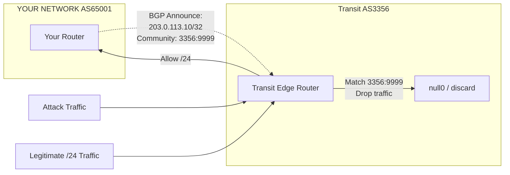
```mermaid
graph LR
    subgraph AS65001 [YOUR NETWORK AS65001]
        Router[Your Router]
    end

    subgraph AS3356 [Transit AS3356]
        Transit[Transit Edge Router]
        Null0[null0 / discard]
    end

    Router -. "BGP Announce:<br>203.0.113.10/32<br>Community: 3356:9999" .-> Transit
    Transit -- "Match 3356:9999<br>Drop traffic" --> Null0

    Attack[Attack Traffic] --> Transit
    Legit[Legitimate /24 Traffic] --> Transit
    Transit -- "Allow /24" --> Router
```

> **Pause and predict**: If you use BGP blackholing for a single IP under attack, what happens to legitimate traffic trying to reach that specific IP during the mitigation?

Legitimate and attack traffic share the same fate for that `/32`. RTBH is a blunt instrument chosen when link saturation threatens the entire prefix. FlowSpec ([RFC 8955](https://www.rfc-editor.org/rfc/rfc8955)) offers finer control by matching source/destination ports, protocols, and packet sizes, but requires provider support and pre-provisioned templates — not something to invent during an active attack. Many organizations maintain pre-approved FlowSpec rules for common amplification vectors (DNS, NTP, SSDP) alongside RTBH runbooks that name the exact community strings each transit provider expects.

```text
FLOWSPEC — SURGICAL BLACKHOLING
─────────────────────────────────────────────────────────────
    Instead of dropping ALL traffic to an IP, FlowSpec
    can drop traffic matching specific criteria.

    "Drop UDP traffic to 203.0.113.10 port 53
     from source port 19 with packet size > 500 bytes"

    This blocks the DNS amplification attack while
    keeping legitimate traffic to 203.0.113.10 flowing.

    ✓ More surgical than full blackhole
    ✗ Not all transit providers support FlowSpec
    ✗ Complex to configure under pressure
```

---

## Part 4: BGP Security — RPKI and Route Origin Validation

Resource Public Key Infrastructure (RPKI) addresses the most glaring gap in BGP's trust model: anyone can claim to originate your prefix, but only you (via your RIR) can cryptographically authorize which ASN may announce it. RPKI does not sign AS-Paths — only origin validation — which is why route leaks remain possible even with full RPKI deployment. The industry has accepted this tradeoff because origin validation alone would have prevented the majority of high-profile hijacks, including the 2018 Route53 incident where eNet (AS10297) claimed Amazon's prefixes.

### 4.1 RPKI (Resource Public Key Infrastructure)

```text
RPKI — ADDING TRUST TO BGP
═══════════════════════════════════════════════════════════════

RPKI cryptographically verifies that an AS is authorized
to announce a specific IP prefix.

HOW RPKI WORKS
─────────────────────────────────────────────────────────────

    1. Resource holder creates a ROA (Route Origin Authorization)
       "AS15169 is authorized to announce 8.8.8.0/24 with max /24"

    2. ROA is signed by the RIR (Regional Internet Registry)
       ARIN, RIPE, APNIC, LACNIC, AFRINIC

    3. Validators download ROAs from all RIRs
       Build a validated cache of authorized announcements

    4. Routers query validator before accepting routes
```

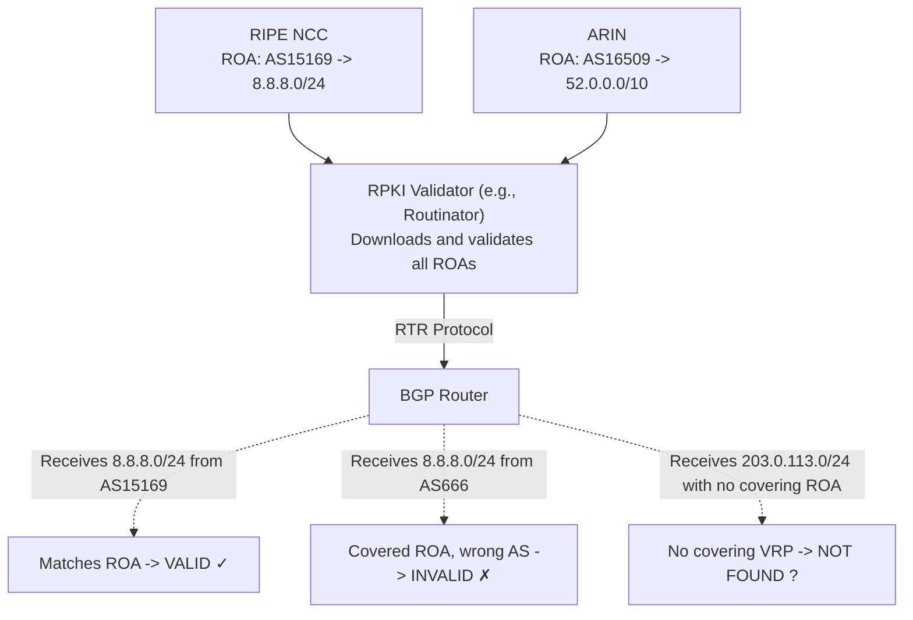
```mermaid
graph TD
    RIPE["RIPE NCC<br>ROA: AS15169 -> 8.8.8.0/24"] --> Validator["RPKI Validator (e.g., Routinator)<br>Downloads and validates all ROAs"]
    ARIN["ARIN<br>ROA: AS16509 -> 52.0.0.0/10"] --> Validator
    Validator -- "RTR Protocol" --> Router["BGP Router"]
    Router -. "Receives 8.8.8.0/24 from AS15169" .-> Valid["Matches ROA -> VALID ✓"]
    Router -. "Receives 8.8.8.0/24 from AS666" .-> Invalid["Covered ROA, wrong AS -> INVALID ✗"]
    Router -. "Receives 203.0.113.0/24 with no covering ROA" .-> NotFound["No covering VRP -> NOT FOUND ?"]
```

```text
VALIDATION STATES
─────────────────────────────────────────────────────────────
    VALID:     At least one VRP covers the prefix and matches the origin ASN and maxLength
    INVALID:   At least one VRP covers the prefix, but none matches because the ASN is wrong or the prefix is too specific
    NOT FOUND: No VRP covers the route prefix (also called Unknown in some tools)
```

> **Pause and predict**: If a major Tier 1 provider drops all "INVALID" routes but accepts "NOT FOUND" routes, what happens to traffic destined for an organization that has never created a ROA?

Traffic continues to flow normally for NOT FOUND prefixes — the router treats them as unverified but acceptable. Only INVALID routes (wrong ASN or prefix longer than ROA maxLength) are dropped. This is why creating ROAs for your own space matters: until you do, your legitimate announcements look identical to hijacks from networks that enforce drop-invalid-only policy. Gradual adoption is intentional; sudden drop-unknown would partition the internet between RPKI-enrolled and legacy networks.

```text
RPKI ADOPTION (2025)
─────────────────────────────────────────────────────────────
    ROA coverage:
      IPv4 routes with valid ROA:  ~52%
      IPv6 routes with valid ROA:  ~55%

    Route Origin Validation (dropping invalids):
      Major networks enforcing:
        AT&T, Cloudflare, Google, NTT, Lumen, KDDI,
        Hurricane Electric, many European networks

      Still not enforcing:
        Some regional ISPs, enterprise networks

    Impact: RPKI would have prevented MOST of the
    hijacking incidents described earlier.
    But "NOT FOUND" is still treated as acceptable
    (otherwise ~48% of the internet would be unreachable).
```

RPKI validators such as [Routinator](https://github.com/NLnetLabs/routinator) download signed ROA objects from all five RIRs, validate the certificate chain, and serve results to routers via the RPKI-to-Router (RTR) protocol defined in [RFC 8210](https://www.rfc-editor.org/rfc/rfc8210). Routers tag each received route as VALID, INVALID, or NOT FOUND. Operator policy typically drops INVALID routes immediately while accepting NOT FOUND — a conservative default that improves security without breaking reachability to unregistered prefixes. Creating ROAs for your own address space is free at your RIR and should be standard practice before any prefix is announced to transit.

### 4.2 Other BGP Security Mechanisms

```text
ADDITIONAL BGP SECURITY
═══════════════════════════════════════════════════════════════

BGPsec (RFC 8205)
─────────────────────────────────────────────────────────────
    Cryptographically signs every hop in the AS-Path.
    Proves the path hasn't been tampered with.

    Current status: Almost zero adoption.
    Problem: Every AS in the path must support it.
    One AS without BGPsec breaks the chain.
    Performance cost: Crypto operations per route per update.

ASPA (Autonomous System Provider Authorization)
─────────────────────────────────────────────────────────────
    AS publishes a list of its authorized transit providers.
    "AS65001 uses AS3356 and AS2914 as transit."

    If AS65001's routes appear via any other transit,
    it's likely a route leak.

    Status: IETF draft, gaining traction. Simpler than BGPsec.

IRR (Internet Routing Registry)
─────────────────────────────────────────────────────────────
    Database of intended routing policies (RPSL format).
    Networks register what they plan to announce.
    Transit providers filter based on IRR data.

    Databases: RADB, RIPE, ARIN, APNIC, etc.

    Problem: Voluntary, often outdated, no crypto verification.
    Still useful as one signal among many.

PREFIX FILTERING BEST PRACTICES
─────────────────────────────────────────────────────────────
    1. Filter customer routes based on IRR + RPKI
    2. Reject routes for bogon prefixes (unallocated, RFC1918)
    3. Reject routes with AS-Path containing bogon ASNs
    4. Limit maximum prefix count from each peer
    5. Reject routes more specific than /24 (IPv4) or /48 (IPv6)
    6. Implement RPKI Route Origin Validation
    7. Deploy MANRS (Mutually Agreed Norms for Routing Security)
```

[MANRS](https://www.manrs.org/) codifies operational norms — filtering, anti-spoofing, coordination, and global validation — that complement RPKI with relationship-aware practices. [RFC 9582](https://www.rfc-editor.org/rfc/rfc9582) is the current ROA profile: it defines the signed object used for Route Origin Authorizations, not ASPA. ASPA (Autonomous System Provider Authorization) is still specified by the IETF SIDROPS drafts for the [ASPA object profile](https://datatracker.ietf.org/doc/draft-ietf-sidrops-aspa-profile/) and [AS_PATH verification](https://datatracker.ietf.org/doc/draft-ietf-sidrops-aspa-verification/): your AS publishes which transit providers may carry your routes, enabling detection when a route appears via an unauthorized upstream. ASPA adoption is earlier-stage than ROV but directly targets route leaks like the Verizon/DQE incident. BGPsec ([RFC 8205](https://www.rfc-editor.org/rfc/rfc8205)) remains largely undeployed due to per-hop signing overhead and the requirement that every AS in a path participate.

---

## Part 5: Cloud Interconnection

Dedicated cloud connectivity replaces best-effort internet transit with private fiber (or partner cross-connects) and BGP sessions that exchange routes between your datacenter and the cloud provider's edge. The durable pattern is identical across AWS Direct Connect, Azure ExpressRoute, and Google Cloud Interconnect: you establish a Layer 2 circuit, configure an eBGP session with MD5 authentication, advertise your on-premises prefixes, and learn cloud VPC/VNet prefixes in return. Traffic flows without traversing the public internet, which reduces exposure to DDoS, improves latency consistency, and often lowers data transfer cost for sustained high-volume workloads.

> **Landscape snapshot — as of 2026-06. This changes fast; verify against vendor docs before relying on specifics.**
>
> | Capability | AWS Direct Connect | Azure ExpressRoute | Google Cloud Interconnect |
> |---|---|---|---|
> | Dedicated port speeds | 1 / 10 / 100 / 400 Gbps | 50 Mbps – 100 Gbps | 10 / 100 / 400 Gbps (Dedicated) |
> | Hosted/partner option | 50 Mbps – 25 Gbps via partners | Via ExpressRoute partners | Partner Interconnect VLAN attachments 50 Mbps – 100 Gbps where offered |
> | Default provider ASN | 7224 (7224 or 64512 for GovCloud) | 12076 (Microsoft peering) | 16550 |
> | Private + public peering split | Private VIF + Public VIF + Transit VIF | Private peering + Microsoft peering | VLAN attachment per VPC |
> | Typical provisioning lead time | Weeks (physical cross-connect) | Weeks | Weeks |
> | Redundancy recommendation | Two connections, different locations | Two connections required for SLA | Two attachments, different edge domains |

The table captures product shapes, not rankings. Each provider implements the same durable idea — private L2 + eBGP — with different naming, ASN defaults, and virtual interface models. Always confirm current limits in official documentation before designing a production architecture.

### 5.1 Direct Connect / ExpressRoute / Cloud Interconnect

```text
PRIVATE CLOUD CONNECTIVITY
═══════════════════════════════════════════════════════════════

Instead of reaching cloud providers over the public internet,
you can establish dedicated, private connections via BGP.

AWS DIRECT CONNECT
─────────────────────────────────────────────────────────────
```

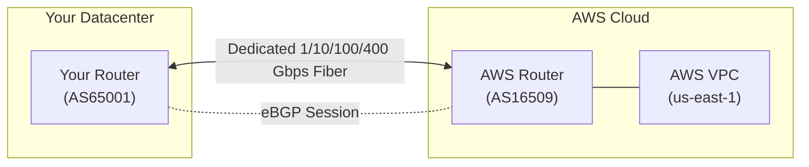
```mermaid
graph LR
    subgraph Customer [Your Datacenter]
        Router["Your Router<br>(AS65001)"]
    end

    subgraph AWS Cloud
        DX["AWS Router<br>(AS16509)"]
        VPC["AWS VPC<br>(us-east-1)"]
    end

    Router <-->|"Dedicated 1/10/100/400 Gbps Fiber"| DX
    Router -. "eBGP Session" .- DX
    DX --- VPC
```

```text
    Types:
    ─────────────────────────────────────────────
    Dedicated Connection: 1/10/100/400 Gbps physical port
    Hosted Connection:    50 Mbps - 25 Gbps (via partner)

    BGP Configuration:
    ─────────────────────────────────────────────
    Your ASN:     65001 (private) or your public ASN
    AWS ASN:      7224 (default) or 64512 (custom)
    VLAN:         Tagged (one per Virtual Interface)
    BGP Auth:     MD5 password

    Virtual Interfaces:
    ─────────────────────────────────────────────
    Private VIF: Access VPC resources (10.x.x.x)
    Public VIF:  Access AWS public services (S3, DynamoDB)
    Transit VIF: Access via Transit Gateway (multi-VPC)

AZURE EXPRESSROUTE
─────────────────────────────────────────────────────────────
    Similar concept, Microsoft's implementation.

    Peering types:
    - Azure Private Peering (VNet access)
    - Microsoft Peering (Microsoft 365, Azure public services)

    Speeds: 50 Mbps to 100 Gbps
    Redundancy: Always two connections (active/active)
    BGP: Your ASN ↔ Microsoft ASN (12076)

GOOGLE CLOUD INTERCONNECT
─────────────────────────────────────────────────────────────
    Dedicated Interconnect: 10/100/400 Gbps circuits (your own fiber)
    Partner Interconnect:   50 Mbps - 100 Gbps VLAN attachments where offered by the partner
    Cross-Cloud Interconnect: Connect to other clouds

    BGP: Your ASN ↔ Google ASN (16550 for peering)

WHY USE PRIVATE INTERCONNECT?
─────────────────────────────────────────────────────────────
    ✓ Consistent latency (no internet congestion)
    ✓ Higher bandwidth (up to 400 Gbps dedicated ports)
    ✓ Lower or more predictable per-GB pricing for sustained egress
      (outbound data transfer over private interconnect is still billed)
    ✓ Compliance (traffic doesn't traverse public internet)
    ✓ Reduced attack surface (no DDoS from internet)

    ✗ Physical infrastructure dependency
    ✗ Lead time for provisioning (weeks/months)
    ✗ Monthly port fees ($200-$6,000+ depending on speed)
    ✗ Need colocation in same facility or partner
```

Multi-homed cloud connectivity follows the same BGP principles as internet multi-homing. Advertise the same prefixes over both Direct Connect circuits with identical MED or AS-Path attributes unless you want active/standby behavior. Set LOCAL_PREF higher on the primary circuit so outbound traffic prefers the dedicated path. Keep a Site-to-Site VPN as tertiary backup with lower LOCAL_PREF — it rides the public internet but preserves connectivity when both physical circuits fail. Test failover quarterly by withdrawing routes on one session and verifying convergence time meets your RTO.

### 5.2 BGP in Kubernetes

```text
BGP IN KUBERNETES
═══════════════════════════════════════════════════════════════

Several Kubernetes networking solutions use BGP to advertise
pod and service IPs to the physical network.

CALICO BGP MODE
─────────────────────────────────────────────────────────────
```

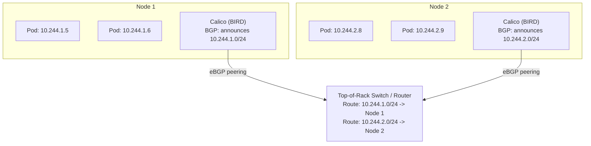
```mermaid
graph TD
    subgraph Node 1
        P1["Pod: 10.244.1.5"]
        P2["Pod: 10.244.1.6"]
        C1["Calico (BIRD)<br>BGP: announces 10.244.1.0/24"]
    end

    subgraph Node 2
        P3["Pod: 10.244.2.8"]
        P4["Pod: 10.244.2.9"]
        C2["Calico (BIRD)<br>BGP: announces 10.244.2.0/24"]
    end

    ToR["Top-of-Rack Switch / Router<br>Route: 10.244.1.0/24 -> Node 1<br>Route: 10.244.2.0/24 -> Node 2"]

    C1 -- "eBGP peering" --> ToR
    C2 -- "eBGP peering" --> ToR
```

In Calico's BGP mode, each node runs a BIRD or FRR instance that peers eBGP with the ToR switch, announcing only that node's pod CIDR (typically `/24` or `/26`). The ToR aggregates or installs host routes depending on your design. This eliminates kube-proxy hairpin for pod-to-pod traffic across nodes when the fabric supports direct routing. The Kubernetes control plane still manages endpoints and policies; BGP only replaces overlay tunneling for the data plane path. On bare-metal clusters, this is the standard pattern for performance-sensitive workloads.

```text
METALLB BGP MODE
─────────────────────────────────────────────────────────────

    MetalLB assigns external IPs to LoadBalancer services
    and announces them via BGP.
```

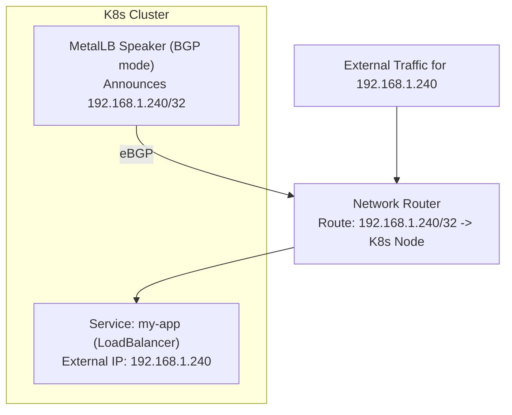
```mermaid
graph TD
    subgraph K8s Cluster
        Svc["Service: my-app (LoadBalancer)<br>External IP: 192.168.1.240"]
        MLB["MetalLB Speaker (BGP mode)<br>Announces 192.168.1.240/32"]
    end

    Router["Network Router<br>Route: 192.168.1.240/32 -> K8s Node"]

    MLB -- "eBGP" --> Router
    Ext["External Traffic for 192.168.1.240"] --> Router
    Router --> Svc
```

> **Stop and think**: If MetalLB in BGP mode announces a `/32` address to the top-of-rack switch, what must the physical network infrastructure support for external users to reach that service?

The ToR switch must accept the `/32` host route via eBGP and install it in its routing table with a next-hop pointing to the announcing node. Upstream routers must either accept `/32` advertisements or aggregate them — many enterprise networks filter anything longer than `/24` on external sessions, which breaks MetalLB unless you coordinate filtering policy. ECMP across multiple MetalLB speakers announcing the same `/32` requires all speakers to be reachable and the upstream to support equal-cost multipath for host routes. For platform teams, the actionable checklist is: confirm ToR BGP peering config, confirm prefix length filters, confirm next-hop reachability from the L3 gateway, then deploy speakers.

---

## Patterns & Anti-Patterns

| Pattern | When to Use | Why It Works |
|---|---|---|
| Dual transit with LOCAL_PREF primary/backup | Multi-homed enterprise or platform egress | Policy-based failover without waiting for AS-Path convergence; primary path wins even if backup has shorter path |
| Route reflectors for iBGP scaling | More than four edge routers in one AS | Eliminates O(n²) iBGP mesh while preserving loop prevention via cluster/ originator IDs |
| RPKI ROV drop-invalid at edge | Any network originating or transiting routes | Stops wrong-ASN hijacks at the border before propagation; low false-positive rate when ROAs exist |
| RTBH with FlowSpec fallback | DDoS on single host or narrow attack signature | RTBH protects uplink immediately; FlowSpec preserves legitimate traffic when attack is protocol-specific |
| max-prefix limits on customer sessions | Transit provider or enterprise accepting BGP from tenants | Session shuts down before a route leak floods your RIB — fail-safe over availability |

| Anti-Pattern | Why Teams Fall Into It | Better Alternative |
|---|---|---|
| iBGP full mesh beyond six routers | "BGP requires full connectivity" myth from small-lab configs | Deploy route reflectors from day one of multi-site iBGP |
| AS-Path prepending as only traffic engineering | Easy to configure, no provider coordination | LOCAL_PREF for outbound, MED agreements with peers, communities for inbound |
| Accepting full table from customer BGP | Customer asks for "full routes" for troubleshooting | Default route plus specific prefixes; max-prefix at 110% of expected count |
| RPKI ROV drop-unknown (not-found) | Aggressive security posture without impact analysis | Drop INVALID only until ROA coverage justifies stricter policy |
| Single Direct Connect, no VPN backup | Cost savings on dedicated circuit | Second circuit in different facility + VPN with lower LOCAL_PREF |
| Announcing pod CIDRs wider than /24 to internet | Calico auto-aggregates per-node /24s | Summarize at edge or use eBGP per-node only within datacenter |

## Decision Framework

Use this flowchart when choosing connectivity and BGP security posture for a new deployment:

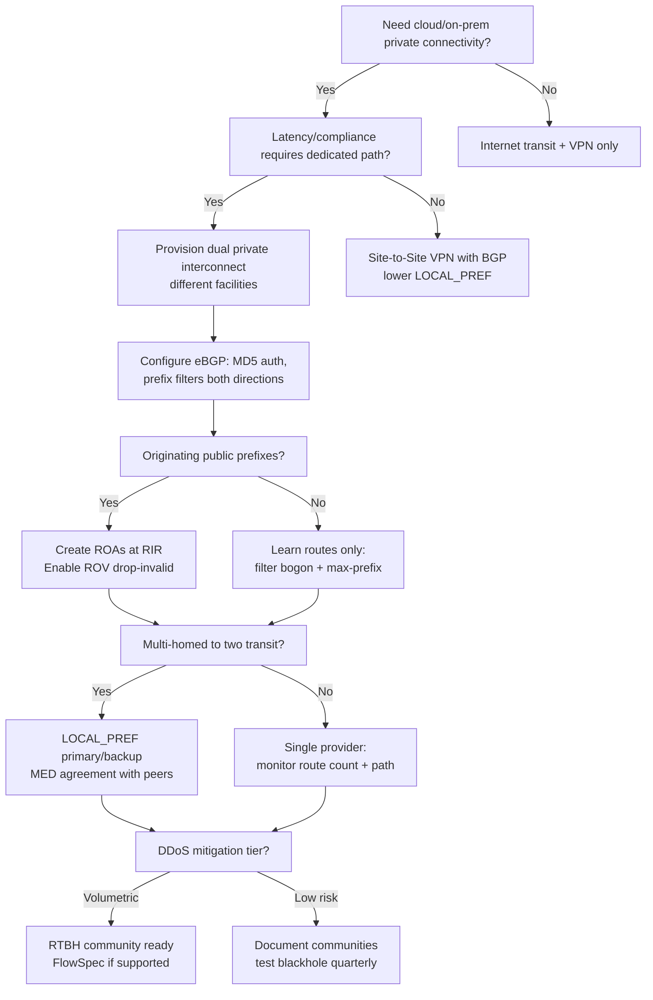
```mermaid
flowchart TD
    A["Need cloud/on-prem private connectivity?"] -->|Yes| B["Latency/compliance requires dedicated path?"]
    A -->|No| C["Internet transit + VPN only"]
    B -->|Yes| D["Provision dual private interconnect<br>different facilities"]
    B -->|No| E["Site-to-Site VPN with BGP<br>lower LOCAL_PREF"]
    D --> F["Configure eBGP: MD5 auth,<br>prefix filters both directions"]
    F --> G["Originating public prefixes?"]
    G -->|Yes| H["Create ROAs at RIR<br>Enable ROV drop-invalid"]
    G -->|No| I["Learn routes only:<br>filter bogon + max-prefix"]
    H --> J["Multi-homed to two transit?"]
    I --> J
    J -->|Yes| K["LOCAL_PREF primary/backup<br>MED agreement with peers"]
    J -->|No| L["Single provider:<br>monitor route count + path"]
    K --> M["DDoS mitigation tier?"]
    L --> M
    M -->|Volumetric| N["RTBH community ready<br>FlowSpec if supported"]
    M -->|Low risk| O["Document communities<br>test blackhole quarterly"]
```

The decision tree separates **connectivity** (private vs VPN, dual vs single), **security** (RPKI for originators, filtering for listeners), and **resilience** (multi-homing policy, DDoS tier). Revisit when you add a new region, acquire IP space, or change transit providers — each event triggers a BGP policy review.

When designing multi-homed platform egress, start from business requirements: active/active vs active/standby, acceptable convergence time, and whether you originate prefixes or only consume routes. Originating prefixes obligates ROA creation, IRR maintenance, and coordination with both transit providers on prefix filters. Consuming routes only (typical cloud Direct Connect) still requires filtering what you accept — bogons, default routes, and maximum prefix counts — and documenting which communities trigger blackholing before an attack rather than during one.

---

## Did You Know?

- **The full BGP routing table crossed 1 million IPv4 prefixes in 2024.** In 1992, the entire internet routing table had fewer than 5,000 entries. This exponential growth means BGP routers need multi-gigabyte memory and increasingly powerful CPUs just to keep up with route calculations. Every time a route changes, routers across the internet recalculate their best paths.

- **A single BGP misconfiguration can affect the entire internet.** In June 2019, a route leak through a small Pennsylvania ISP (AS33154, via Allegheny Technologies) caused major routing disruptions for services including Cloudflare, Amazon, and Fastly. The leak propagated because Verizon, one of the world's largest networks, failed to filter routes from their customer — a basic best practice that many networks still skip.

- **BGP was designed over lunch on two napkins.** In 1989, engineers Yakov Rekhter (IBM) and Kirk Lougheed (Cisco) sketched the initial BGP protocol design on the back of napkins at an IETF meeting. The protocol they designed — fundamentally based on trust between networks — is still what runs the internet 36 years later, handling over a million routes across 75,000+ autonomous systems.

- **RPKI invalid routes are dropped by major transit networks, but ROA coverage remains incomplete.** According to [NIST RPKI Monitor](https://rpki-monitor.antd.nist.gov/) and RIPE NCC statistics, roughly half of IPv4 routes have valid ROAs as of 2025–2026, meaning the other half still relies on trust alone. Networks that drop NOT FOUND would isolate large portions of the internet — the gradual adoption curve is a policy compromise, not a technical limitation.

---

## Common Mistakes

| Mistake | Problem | Solution |
|---------|---------|----------|
| No prefix filtering on customer BGP sessions | Customer can accidentally leak full table through your network | Implement strict prefix limits and IRR-based filters |
| Ignoring RPKI ROA creation | Your prefixes have no cryptographic authorization, making hijacks easier | Create ROAs for all your prefixes at your RIR |
| Single Direct Connect without redundancy | Physical failure = total cloud connectivity loss | Always provision two connections in different facilities |
| AS-Path prepending as primary traffic engineering | Fragile, unpredictable, adds propagation delay | Use LOCAL_PREF and MED first; prepending as last resort |
| Running iBGP full mesh at scale | O(n^2) sessions, operational nightmare | Use route reflectors or confederations |
| No BGP session authentication | Neighbor spoofing possible on shared networks | Enable MD5 or TCP-AO authentication on all sessions |
| Not monitoring BGP route counts from peers | Peer could send unexpected routes (route leak) | Set max-prefix limits with warning thresholds |
| Announcing /25 or smaller to the internet | Many networks filter prefixes smaller than /24 | Keep announcements at /24 or larger for IPv4 |

---

## Quiz

These questions test whether you can apply BGP concepts to operational scenarios — not merely recite the path-selection order. Read each scenario carefully; the answer explains the mechanism, not just the conclusion. Scenario-based troubleshooting is how network operations teams actually use BGP knowledge during live incidents, weekly reviews, and formal postmortems.

1. **Your team is designing a multi-region network for a new datacenter. One engineer suggests using eBGP between all routers inside the datacenter to ensure paths are properly tracked. Why might this approach be flawed, and how does the standard iBGP approach handle routing loops without modifying the AS-Path?**
   <details>
   <summary>Answer</summary>

   eBGP is designed for inter-domain routing between different Autonomous Systems, where it inherently prevents loops by rejecting routes that contain the local ASN in the AS-Path. If you use eBGP within a single datacenter, you would either have to assign a unique ASN to every single router, which becomes an administrative nightmare, or override loop prevention mechanisms, risking routing loops. Instead, iBGP is used within the same AS to distribute externally learned routes without modifying the AS-Path. Because iBGP does not update the AS-Path, it relies on a different loop prevention rule: iBGP routers never re-advertise a route learned from one iBGP peer to another iBGP peer. This split-horizon rule ensures loops cannot form, but requires either a full mesh of iBGP connections or the use of route reflectors to scale.
   </details>

2. **You receive alerts that outbound traffic to a major cloud provider has suddenly shifted from your dedicated 10Gbps transit link to a more expensive, congested backup link. Both links advertise the same prefix, and your edge router's BGP configuration sets the same LOCAL_PREF for both. What mechanism in the BGP path selection algorithm is likely causing this shift, and how does the router break the tie?**
   <details>
   <summary>Answer</summary>

   When BGP evaluates multiple routes to the same destination, it processes attributes in a strict, ordered sequence. Since the LOCAL_PREF is identical for both links, the router moves to the next criteria in the decision process, which evaluates whether the route was locally originated. If neither is local, it checks the AS-Path length, preferring the path with the fewest number of network hops. It is highly likely that the primary link's AS-Path increased because the cloud provider or an intermediate ISP began prepending their ASN, making the backup link appear as the "shorter" path. If the AS-Path lengths are also identical, the router will continue down the list, evaluating the Origin type and MED, until a tiebreaker like the lowest Router ID finally determines the best path.
   </details>

3. **A monitoring tool reports that traffic bound for your main application from users in Europe is suddenly being routed through a small regional ISP in South America, causing massive latency. The origin ASN in the BGP updates is still correctly showing as your ASN. Based on this evidence, are you experiencing a route hijack or a route leak? Explain the mechanics of what happened.**
   <details>
   <summary>Answer</summary>

   Based on the evidence, your network is experiencing a route leak rather than a route hijack. In a route hijack, an attacker maliciously or accidentally announces your prefix while claiming to be the origin, which would result in the origin ASN changing to the attacker's ASN. Because the origin ASN remains correct in this scenario, the route is legitimate at its source but is being propagated along an unauthorized path. This happens when a network, like the small South American ISP, accidentally re-announces routes it learned from one transit provider to another. By doing so, it effectively turns itself into an unintended transit path for global traffic, creating a massive bottleneck that causes the observed latency.
   </details>

4. **Your company is hit with a 100 Gbps DDoS attack targeting a single IP address on your network. Your upstream provider offers a BGP blackholing service. Describe the process of triggering this mitigation, and explain the exact trade-off you must make when employing it.**
   <details>
   <summary>Answer</summary>

   To trigger BGP blackholing, you configure your edge router to announce a /32 host route for the specific targeted IP address, attaching a predetermined BGP community string (such as the blackhole community) to the announcement. When your transit provider receives this route, their routers are configured to match that community and immediately rewrite the next-hop for that IP to a null interface, dropping the traffic at the provider's edge before it traverses your link. The critical trade-off is that you are completely sacrificing the availability of that specific IP address, cutting off all legitimate traffic alongside the malicious traffic. However, this aggressive measure protects your uplinks from being saturated by the volumetric attack. By dropping the attack traffic upstream, you ensure that the rest of the IP addresses and services in your subnet remain online and unaffected.
   </details>

5. **After implementing strict RPKI Route Origin Validation (ROV) on all edge routers, your CISO asks if the network is now fully protected against all BGP-related traffic redirection attacks. How should you respond, and what specific types of routing incidents could still occur despite having RPKI in place?**
   <details>
   <summary>Answer</summary>

   You must inform the CISO that while RPKI is a critical security control, it does not fully protect against all BGP-related redirection attacks. RPKI exclusively validates the origin ASN of a prefix announcement against cryptographically signed records (ROAs), effectively preventing simple prefix hijacks where an attacker claims to originate your IP space. However, RPKI provides absolutely no validation of the AS-Path itself. This means the network remains entirely vulnerable to route leaks, where a legitimate origin route is mistakenly propagated through an unauthorized intermediary network. Furthermore, an attacker can still execute a path manipulation attack by injecting your valid ASN at the end of a spoofed path, bypassing ROV completely.
   </details>

6. **A company uses AWS Direct Connect for their primary cloud connectivity. Their single 10 Gbps connection goes down. What happens to their cloud workloads, and how should they architect for resilience?**
   <details>
   <summary>Answer</summary>

   When the single Direct Connect link fails, all private routing between the on-premises network and the AWS VPC is severed, though the cloud workloads themselves will continue to run normally in AWS. Any on-premises services relying on private IP communication with the cloud will experience immediate timeouts and failures because the BGP session drops and the corresponding routes are withdrawn. To architect for resilience, the company should provision at least two Direct Connect links terminating in completely separate physical facilities, using different hardware and carriers to eliminate single points of failure. Additionally, they can configure a Site-to-Site VPN over the public internet as a path of last resort. By setting a lower BGP LOCAL_PREF on the VPN connection, it remains in standby and is only utilized if both physical Direct Connect links fail.
   </details>

---

## Hands-On Exercise

**Objective**: Set up eBGP peering between two Autonomous Systems using FRRouting (FRR) containers and observe route propagation, path selection, and failure behavior.

This lab uses three Docker containers as three separate ASNs with full mesh eBGP peering — the simplest topology to observe AS-Path propagation, LOCAL_PREF override, and failover without iBGP complexity. FRRouting (FRR) implements the same BGP state machine as production routers; commands you run in `vtysh` transfer directly to Cisco/Juniper/Arista concepts with syntax differences only. The exercise deliberately uses private ASNs 65001–65003, which must never be announced to real transit providers.

**Environment**: Docker containers running FRRouting

### Part 1: Create the Network Topology (15 minutes)

```bash
# Create a Docker network for each "link" between ASNs
docker network create --subnet=10.0.12.0/24 link-as1-as2
docker network create --subnet=10.0.13.0/24 link-as1-as3
docker network create --subnet=10.0.23.0/24 link-as2-as3

# Create three FRRouting containers (one per AS)
docker run -d --name as1-router \
  --hostname as1-router \
  --privileged \
  --network link-as1-as2 \
  --ip 10.0.12.1 \
  quay.io/frrouting/frr:10.2.1

docker run -d --name as2-router \
  --hostname as2-router \
  --privileged \
  --network link-as1-as2 \
  --ip 10.0.12.2 \
  quay.io/frrouting/frr:10.2.1

docker run -d --name as3-router \
  --hostname as3-router \
  --privileged \
  --network link-as1-as3 \
  --ip 10.0.13.3 \
  quay.io/frrouting/frr:10.2.1

# Connect AS1 to the AS1-AS3 link
docker network connect --ip 10.0.13.1 link-as1-as3 as1-router

# Connect AS2 to the AS2-AS3 link
docker network connect --ip 10.0.23.2 link-as2-as3 as2-router

# Connect AS3 to the AS2-AS3 link
docker network connect --ip 10.0.23.3 link-as2-as3 as3-router
```

### Topology

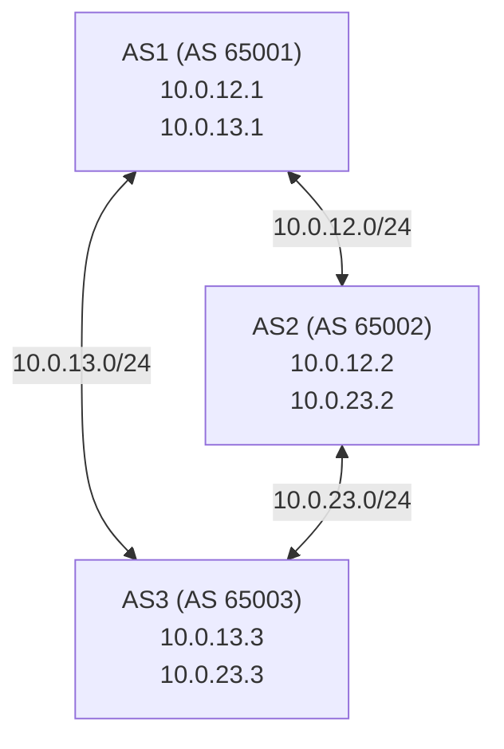
```mermaid
graph TD
    AS1["AS1 (AS 65001)<br>10.0.12.1<br>10.0.13.1"]
    AS2["AS2 (AS 65002)<br>10.0.12.2<br>10.0.23.2"]
    AS3["AS3 (AS 65003)<br>10.0.13.3<br>10.0.23.3"]

    AS1 <-->|"10.0.12.0/24"| AS2
    AS1 <-->|"10.0.13.0/24"| AS3
    AS2 <-->|"10.0.23.0/24"| AS3
```

### Part 2: Configure BGP on AS1 (15 minutes)

```bash
# Enter AS1 router
docker exec -it as1-router vtysh

# Configure BGP
configure terminal

router bgp 65001
 bgp router-id 1.1.1.1
 no bgp ebgp-requires-policy

 ! Announce AS1's own prefix
 network 172.16.1.0/24

 ! eBGP peer with AS2
 neighbor 10.0.12.2 remote-as 65002
 neighbor 10.0.12.2 description AS2-peer

 ! eBGP peer with AS3
 neighbor 10.0.13.3 remote-as 65003
 neighbor 10.0.13.3 description AS3-peer

exit

! Create a loopback with the announced prefix
interface lo
 ip address 172.16.1.1/24
exit

end
write memory
```

### Part 3: Configure BGP on AS2 and AS3 (15 minutes)

```bash
# Configure AS2
docker exec -it as2-router vtysh

configure terminal

router bgp 65002
 bgp router-id 2.2.2.2
 no bgp ebgp-requires-policy
 network 172.16.2.0/24

 neighbor 10.0.12.1 remote-as 65001
 neighbor 10.0.12.1 description AS1-peer
 neighbor 10.0.23.3 remote-as 65003
 neighbor 10.0.23.3 description AS3-peer
exit

interface lo
 ip address 172.16.2.1/24
exit

end
write memory
exit

# Configure AS3
docker exec -it as3-router vtysh

configure terminal

router bgp 65003
 bgp router-id 3.3.3.3
 no bgp ebgp-requires-policy
 network 172.16.3.0/24

 neighbor 10.0.13.1 remote-as 65001
 neighbor 10.0.13.1 description AS1-peer
 neighbor 10.0.23.2 remote-as 65002
 neighbor 10.0.23.2 description AS2-peer
exit

interface lo
 ip address 172.16.3.1/24
exit

end
write memory
exit
```

### Part 4: Verify BGP Peering and Routes (15 minutes)

```bash
# Check BGP summary on AS1
docker exec -it as1-router vtysh -c "show bgp summary"

# Expected: Two peers (AS2, AS3) in Established state

# Check BGP routes learned by AS1
docker exec -it as1-router vtysh -c "show bgp ipv4 unicast"

# Expected routes on AS1:
# 172.16.1.0/24  (local, originated here)
# 172.16.2.0/24  via 10.0.12.2 (from AS2, path: 65002)
# 172.16.3.0/24  via 10.0.13.3 (from AS3, path: 65003)
# 172.16.2.0/24  via 10.0.13.3 (from AS3, path: 65003 65002)
# 172.16.3.0/24  via 10.0.12.2 (from AS2, path: 65002 65003)

# Check the detailed path for a specific prefix
docker exec -it as1-router vtysh -c "show bgp ipv4 unicast 172.16.2.0/24"

# Verify on AS2
docker exec -it as2-router vtysh -c "show bgp ipv4 unicast"

# Verify on AS3
docker exec -it as3-router vtysh -c "show bgp ipv4 unicast"
```

### Part 5: Observe Path Selection (15 minutes)

```bash
# On AS1, check the best path to AS3's network
docker exec -it as1-router vtysh -c "show bgp ipv4 unicast 172.16.3.0/24"

# Two paths should exist:
# 1. Direct: via AS3 (path: 65003)         ← BEST (shorter)
# 2. Indirect: via AS2 → AS3 (path: 65002 65003)

# Now use LOCAL_PREF to override path selection
# Make AS1 prefer the indirect path through AS2

docker exec -it as1-router vtysh

configure terminal

! Create a route-map to set LOCAL_PREF
route-map PREFER-AS2 permit 10
 set local-preference 200
exit

router bgp 65001
 ! Apply route-map to routes from AS2
 neighbor 10.0.12.2 route-map PREFER-AS2 in
exit

end
clear bgp ipv4 unicast * soft in

! Check again - AS2 path should now be preferred
show bgp ipv4 unicast 172.16.3.0/24

! Expected: Path via AS2 (65002 65003) is now BEST
! despite being longer, because LOCAL_PREF 200 > 100

exit
```

### Part 6: Simulate Link Failure (15 minutes)

```bash
# Disconnect AS1 from AS2 (simulate link failure)
docker network disconnect link-as1-as2 as1-router

# Wait for BGP hold timer to expire (~90 seconds)
# or watch the session drop
sleep 10
docker exec -it as1-router vtysh -c "show bgp summary"

# AS2 peer should show as "Connect" or "Active" (not Established)

# Check routes - traffic to AS2's network should now go via AS3
docker exec -it as1-router vtysh -c "show bgp ipv4 unicast 172.16.2.0/24"

# Expected: Only path via AS3 (65003 65002) remains

# Restore the link
docker network connect --ip 10.0.12.1 link-as1-as2 as1-router

# Wait for BGP session to re-establish
sleep 15
docker exec -it as1-router vtysh -c "show bgp summary"

# Both peers should be Established again
# Original path via AS2 should be restored
```

### Clean Up

```bash
docker rm -f as1-router as2-router as3-router
docker network rm link-as1-as2 link-as1-as3 link-as2-as3
```

**Success Criteria**:
- [ ] Three BGP sessions established (AS1-AS2, AS1-AS3, AS2-AS3)
- [ ] Each AS learns routes to all three /24 prefixes
- [ ] Used LOCAL_PREF to override AS-Path length preference
- [ ] Simulated link failure and observed automatic failover to alternate path

---

## Sources

- [RFC 4271 — A Border Gateway Protocol 4 (BGP-4)](https://www.rfc-editor.org/rfc/rfc4271)
- [RFC 6480 — An Infrastructure to Support Secure Internet Routing (RPKI)](https://www.rfc-editor.org/rfc/rfc6480)
- [RFC 1997 — BGP Communities Attribute](https://www.rfc-editor.org/rfc/rfc1997)
- [RFC 6811 — BGP Prefix Origin Validation](https://www.rfc-editor.org/rfc/rfc6811)
- [RFC 7908 — Problem Definition and Classification of BGP Route Leaks](https://www.rfc-editor.org/rfc/rfc7908)
- [RFC 8210 — The RPKI-Router Protocol (RTR)](https://www.rfc-editor.org/rfc/rfc8210)
- [RFC 9582 — A Profile for Route Origin Authorizations (ROAs)](https://www.rfc-editor.org/rfc/rfc9582)
- [IETF SIDROPS Draft — ASPA Object Profile](https://datatracker.ietf.org/doc/draft-ietf-sidrops-aspa-profile/)
- [IETF SIDROPS Draft — ASPA-based AS_PATH Verification](https://datatracker.ietf.org/doc/draft-ietf-sidrops-aspa-verification/)
- [RFC 8205 — BGPsec Protocol Specification](https://www.rfc-editor.org/rfc/rfc8205)
- [Cloudflare Blog — Today's outage and what happened (July 17, 2020)](https://blog.cloudflare.com/todays-outage/)
- [MANRS — Mutually Agreed Norms for Routing Security](https://www.manrs.org/)
- [ThousandEyes — Anatomy of a BGP Hijack on Amazon's Route 53 DNS Service](https://www.thousandeyes.com/blog/amazon-route-53-dns-and-bgp-hijack)
- [CyberScoop — Internet infrastructure server hijacked for $152,000 Ether theft](https://cyberscoop.com/ether-dns-bgp-amazon-route-53-heist/)
- [AWS Direct Connect — Connection Options](https://docs.aws.amazon.com/directconnect/latest/UserGuide/connection_options.html)
- [AWS Direct Connect — What is Direct Connect?](https://docs.aws.amazon.com/directconnect/latest/UserGuide/Welcome.html)
- [AWS Direct Connect — BGP Peering Configuration](https://docs.aws.amazon.com/directconnect/latest/UserGuide/WorkingWithVirtualInterfaces.html)
- [Azure ExpressRoute — BGP with ExpressRoute](https://learn.microsoft.com/en-us/azure/expressroute/expressroute-routing)
- [Google Cloud — Cloud Interconnect Overview](https://cloud.google.com/network-connectivity/docs/interconnect/concepts/overview)
- [Google Cloud — Cloud Interconnect Quotas and Limits](https://cloud.google.com/network-connectivity/docs/interconnect/quotas)
- [Google Cloud — Cloud Interconnect Pricing](https://cloud.google.com/network-connectivity/docs/interconnect/pricing)
- [Google SRE Book — Addressing Cascading Failures (load balancing and routing context)](https://sre.google/sre-book/addressing-cascading-failures/)
- [Cloudflare Learning — What is BGP?](https://www.cloudflare.com/learning/security/glossary/what-is-bgp/)
- [NLnet Labs Routinator — RPKI Validator](https://github.com/NLnetLabs/routinator)
- [FRRouting Documentation — BGP Configuration](https://docs.frrouting.org/en/latest/bgp.html)

---

## Next Module

[Module 1.5: Cloud Load Balancing Deep Dive](../module-1.5-load-balancing/) — The mechanics of L4 and L7 load balancers, connection draining, Proxy Protocol, and the architectures behind cloud load balancing services.
