> **Complexity**: `[COMPLEX]`
>
> **Time to Complete**: 3 hours
>
> **Prerequisites**: [Module 1.1: DNS at Scale](../module-1.1-dns-at-scale/), basic understanding of TCP/IP and HTTP
>
> **Track**: Foundations — Advanced Networking

### What You'll Be Able to Do

After completing this module, you will be able to:

1. **Compare** L4 and L7 load balancers by explaining their architectural differences and selecting the right tier for a given workload
2. **Design** health check configurations, connection draining, and cross-zone settings that ensure graceful failover during outages
3. **Diagnose** load balancer issues (uneven distribution, connection reuse problems, TLS termination latency) using connection-level metrics and access logs
4. **Implement** advanced load balancing patterns including weighted routing, session affinity, and global server load balancing across regions

---

**November 14, 2023. AWS experiences an extended outage in us-east-1. Thousands of applications go offline. But a curious pattern emerges in the post-incident analysis: applications using Network Load Balancers (NLBs) recovered faster than those on Application Load Balancers (ALBs). Applications with properly configured health checks and connection draining experienced near-zero user-visible errors during failover. Applications without them dropped thousands of in-flight requests.**

The difference between graceful degradation and catastrophic failure during that outage came down to load balancing configuration — not the load balancers themselves, but how engineers configured health checks, draining timeouts, cross-zone settings, and connection handling. The same infrastructure, the same outage, wildly different outcomes.

This pattern repeats across every major cloud incident. Load balancers are the front door to every serious application, handling connection management, TLS termination, health monitoring, and traffic distribution. Yet most engineers treat them as black boxes — click a few settings in the console and forget about them. When the load balancer behaves unexpectedly during a failure, they have no mental model for what's happening and no tools to debug it.

This module opens the black box. You'll understand exactly how L4 and L7 load balancers work, why their differences matter for your architecture, and how to configure them for resilience instead of just convenience.

---

## Why This Module Matters

Every request to your production application passes through a load balancer. It's the single most impactful piece of infrastructure between your users and your code. Get it right, and your application handles failures gracefully, scales seamlessly, and maintains consistent performance. Get it wrong, and you'll spend 3 AM incidents debugging connection resets, asymmetric routing, lost client IPs, and mysterious 502 errors.

Cloud load balancers are deceptively simple to set up and deceptively complex to operate well. The default settings work for demos. Production requires understanding connection draining (how long to wait before killing active connections), health check tuning (fast enough to detect failures, slow enough to avoid false positives), cross-zone load balancing (and its cost implications), Proxy Protocol (preserving client IPs through L4 proxies), and the fundamental architectural differences between L4 and L7 load balancing.

> **The Traffic Cop vs The Hotel Concierge**
>
> An L4 load balancer is like a traffic cop at an intersection. It sees cars (packets) and directs them to different lanes (servers) based on simple rules — it doesn't know or care what's inside the cars. An L7 load balancer is like a hotel concierge. It opens your luggage (HTTP request), reads your reservation (path, headers, cookies), and personally escorts you to the right room (backend). The concierge is smarter but slower. The traffic cop handles more throughput but can't make content-aware decisions.

---

## What You'll Learn

- L4 vs L7 load balancing: mechanics, trade-offs, and when to use each
- Connection draining: graceful shutdown without dropping requests
- Session affinity: sticky sessions and their hidden costs
- Proxy Protocol v1 and v2: preserving client IP through L4 proxies
- Cross-zone load balancing: behavior, costs, and failure domains
- Cloud LB architectures: AWS NLB/ALB, Google Maglev, Azure LB
- Hands-on: NLB with Proxy Protocol, upstream Kubernetes Ingress, verifying client IP preservation

---

## Part 1: L4 vs L7 Load Balancing

> **Stop and think**: If an L4 load balancer only operates on TCP/UDP streams and never inspects the content, how does it consistently route packets belonging to the same connection to the exact same backend server?

### 1.1 Layer 4 Load Balancing (Transport Layer)

L4 load balancers operate on TCP/UDP connections.
They see: Source IP, Source Port, Dest IP, Dest Port, Protocol.
They DON'T see: HTTP headers, URLs, cookies, request body.

**How L4 Load Balancing Works**

Client `1.2.3.4:54321` → LB `10.0.0.1:443`
LB selects backend server (e.g., `10.0.1.5:443`)

**Method 1: DSR (Direct Server Return)**
LB rewrites destination MAC address. Packet goes to backend at L2.
Backend responds DIRECTLY to client (bypasses LB).

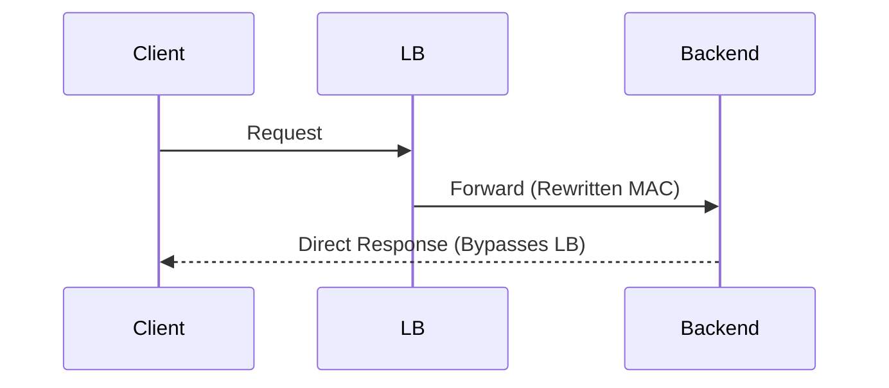

- ✓ Massive throughput (LB only handles inbound)
- ✓ LB doesn't become bandwidth bottleneck
- ✗ LB can't inspect or modify responses
- ✗ Backend must be L2-adjacent to LB
- ✗ Backend must be configured to accept traffic for LB's IP

**Method 2: DNAT (Destination NAT)**
LB rewrites destination IP to backend IP.
Backend responds to LB. LB rewrites source back.

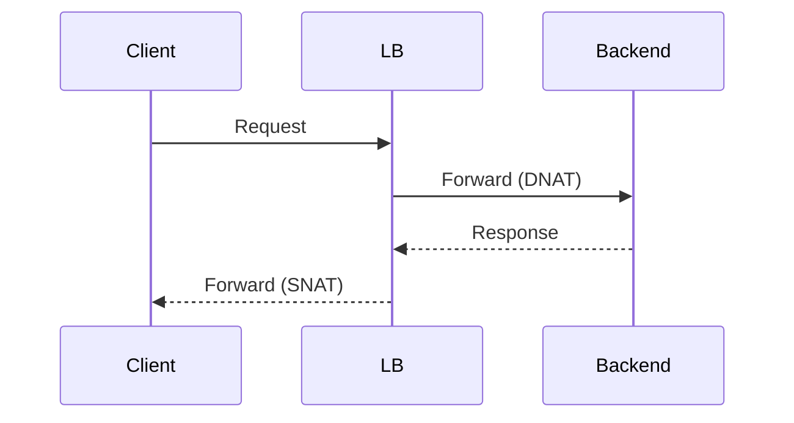

- ✓ Works across L3 networks
- ✓ LB sees all traffic (can do health tracking)
- ✗ LB handles both directions (bandwidth)
- ✗ Must maintain connection tracking table

**Method 3: Tunneling (IP-in-IP / GUE)**
LB encapsulates packet in outer IP header.
Backend decapsulates and responds directly.
Used by Google Maglev, AWS NLB.

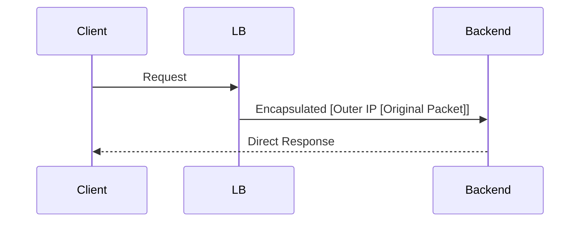

**L4 Load Balancing Algorithms**

- **Round Robin**: Server A → Server B → Server C → Server A → ... Simple, even distribution. No awareness of server load.
- **Weighted Round Robin**: Server A (weight 3): gets 3x traffic. Server B (weight 1): gets 1x traffic. Useful when servers have different capacity.
- **Least Connections**: Route to server with fewest active connections. Better than round robin when requests have varying duration.
- **Source IP Hash (Consistent Hashing)**: `hash(client_ip) % num_servers`. Same client always goes to same server. Used for basic session affinity at L4.
- **Maglev Hashing (Google)**: Consistent hash with minimal disruption on server changes. When one server is removed, only 1/N traffic shifts. Used in Google Cloud Load Balancing.

**L4 Characteristics**

- **Throughput**: Millions of connections/second
- **Latency added**: <1ms (often microseconds)
- **TLS**: Pass-through (backend handles TLS) OR TLS termination (with SNI routing)
- **Protocols**: Any TCP or UDP protocol
- **Connection state**: Tracked per 5-tuple
- **Use cases**: Database traffic, non-HTTP protocols, highest-performance requirements, upstream to L7 load balancers

### 1.2 Layer 7 Load Balancing (Application Layer)

L7 load balancers operate on HTTP/HTTPS.
They see EVERYTHING: URL, headers, cookies, body, method.
They must fully terminate the TCP and TLS connection.

**How L7 Load Balancing Works**

1. Client opens TCP connection to LB
2. TLS handshake completes (LB terminates TLS)
3. Client sends HTTP request
4. LB parses the full HTTP request
5. LB applies routing rules (path, headers, etc.)
6. LB opens NEW connection to selected backend
7. LB forwards request to backend
8. Backend responds to LB
9. LB forwards response to client

These are two separate connections!


This is why L7 LBs are also called "reverse proxies."

**Routing Capabilities**

- **Path-Based Routing**
  - `/api/*` → api-service (port 8080)
  - `/static/*` → cdn-origin (port 80)
  - `/admin/*` → admin-service (port 8443)
  - `/` → frontend (port 3000)
- **Host-Based Routing**
  - `app.example.com` → app-backend
  - `api.example.com` → api-backend
- **Header-Based Routing**
  - `X-Version: canary` → canary-backend (10% traffic)
  - `X-Version: stable` → stable-backend (90% traffic)
- **Cookie-Based Routing**
  - `JSESSIONID=abc123` → server-A (session affinity)
- **Weighted Routing**
  - Backend-A: 90% (current version)
  - Backend-B: 10% (canary deployment)

**L7 Characteristics**

- **Throughput**: Tens of thousands of requests/second
- **Latency added**: 1-5ms (TLS termination + parsing)
- **TLS**: TERMINATED at LB (can inspect traffic)
- **Protocols**: HTTP/1.1, HTTP/2, WebSocket, gRPC
- **Connection state**: HTTP-level (request/response)
- **Use cases**: Web applications, microservices routing, TLS termination, request manipulation

### 1.3 L4 vs L7 Decision Matrix

| Requirement | L4 | L7 |
| :--- | :--- | :--- |
| **Maximum throughput** | ✓ Best | ✗ Limited |
| **Lowest latency** | ✓ <1ms | ✗ 1-5ms |
| **HTTP path/header routing** | ✗ Can't see | ✓ Full control |
| **TLS termination** | ✗ Pass-through | ✓ Terminates |
| **WebSocket support** | ✓ Transparent | ✓ Managed |
| **gRPC load balancing** | ✗ Per-connection | ✓ Per-request |
| **Non-HTTP protocols (DB, SMTP)**| ✓ Any protocol | ✗ HTTP only |
| **Request/response modification**| ✗ No access | ✓ Full access |
| **Cookie-based session affinity**| ✗ No cookies | ✓ Cookie aware |
| **Client certificate (mTLS)** | ✗ Pass-through | ✓ Validates |
| **Health checks (HTTP)** | ✗ TCP only* | ✓ HTTP checks |
| **Connection draining** | ✓ Timer-based | ✓ Request-aware |
| **Cost** | ✓ Lower | ✗ Higher |

*\* Some L4 LBs support limited HTTP health checks*

**Common Architecture: L4 + L7 Together**

Why use both?
- NLB handles TLS passthrough and raw throughput
- NLB preserves client IP via Proxy Protocol
- Ingress Controller (nginx/envoy) handles HTTP routing
- Best of both worlds: performance + routing flexibility

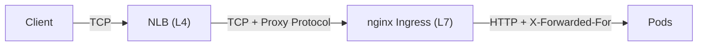

NLB adds the Proxy Protocol header (client IP). nginx reads Proxy Protocol, routes by path/host, and passes the IP. The Pod sees `X-Forwarded-For: original client IP`.

---

## Part 2: Connection Draining

> **Pause and predict**: What happens to a 5-minute file upload if the backend server actively receiving the stream suddenly fails its load balancer health check and is removed from the target group?

### 2.1 The Problem: Killing Active Connections

When a backend server is removed (health check failure, scaling down, deployment), what happens to active connections?

**Without Connection Draining**

- `t=0`: Server has 50 active connections
- `t=0`: Health check fails → server marked unhealthy
- `t=0`: LB immediately drops all 50 connections
  - → 50 users see connection reset errors
  - → In-flight API calls return with no response
  - → File uploads are truncated
  - → WebSocket connections are severed

User experience: ERROR, ERROR, ERROR.

**With Connection Draining (Deregistration Delay)**

- `t=0`: Server has 50 active connections
- `t=0`: Health check fails → server enters "draining" state
- `t=0`: LB stops sending NEW connections to this server
- `t=0`: Existing 50 connections continue normally
- `t=10s`: 45 connections complete naturally
- `t=30s`: 48 connections complete naturally
- `t=60s`: 49 connections complete naturally
- `t=300s`: Draining timeout reached → last connection closed (or all complete before timeout)

User experience: Most requests complete successfully. Only extremely long requests (>5 min) might be dropped.

**Draining State Diagram**

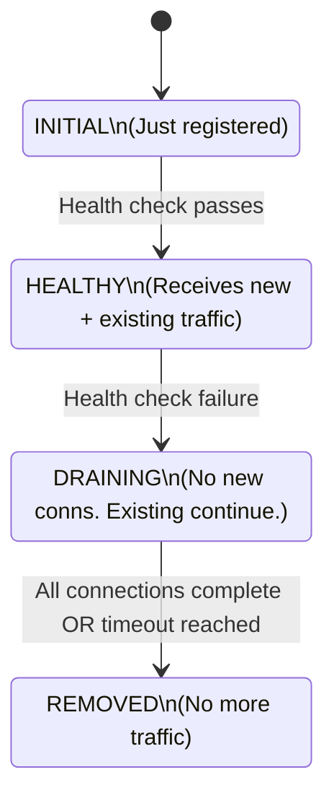

**Kubernetes Graceful Shutdown**

Kubernetes pods have a similar concept:
1. Pod enters "Terminating" state
2. `preStop` hook runs (if configured)
3. SIGTERM sent to container
4. Container should: stop accepting new connections, complete in-flight requests, close gracefully.
5. After `terminationGracePeriodSeconds` (default 30s): SIGKILL sent (forced kill).

*Common issue*: Endpoint is removed from Service before pod receives SIGTERM. Add a preStop sleep:
```yaml
lifecycle:
  preStop:
    exec:
      command: ["sh", "-c", "sleep 5"]
```
This gives kube-proxy time to remove the endpoint before the pod starts shutting down.

**Draining Timeout Guidelines**
- API endpoints (fast): 30 seconds
- Web applications: 60 seconds
- WebSocket connections: 300 seconds (5 min)
- File upload endpoints: 600 seconds (10 min)
- Long-running streams: 3600 seconds (1 hour)
- Database connections: 60 seconds (with query timeout)

---

## Part 3: Session Affinity (Sticky Sessions)

> **Pause and predict**: If you scale up your backend from 3 to 10 instances during a traffic spike, but your load balancer uses cookie-based session affinity, what will happen to the load distribution across your new instances?

### 3.1 Types of Session Affinity

Session affinity ensures the same client always reaches the same backend server.

**Source IP Affinity (L4)**
`hash(client_ip) % num_servers = selected_server`
- Client 1.2.3.4 → always hits Server-A
- Client 5.6.7.8 → always hits Server-B
- ✓ Works at L4 (no HTTP inspection needed)
- ✗ Breaks behind NAT (all users behind same IP → same server)
- ✗ Uneven distribution, no affinity when servers are added/removed (rehashing)

**Cookie-Based Affinity (L7)**
LB sets a cookie on first response (`Set-Cookie: AWSALB=server-a`). Subsequent requests include the cookie, and LB routes appropriately.
- ✓ Precise per-user affinity, survives NAT/VPNs
- ✗ Requires L7 inspection, adds byte overhead

**Application-Generated Affinity (L7)**
Application sets its own session cookie (`Set-Cookie: JSESSIONID=abc123`). LB routes based on this value.
- ✓ Application controls session semantics
- ✗ Tighter coupling between app and LB config

**Header-Based Affinity (L7)**
Route based on a custom header (e.g., `X-User-ID: 12345`).
- ✓ Works for API clients (no cookies)
- ✗ Requires L7 inspection

**The Case Against Sticky Sessions**

Problems:
1. **Uneven Load**: Popular users stuck on one server → that server overloaded while others are idle.
2. **Cascading Failure**: Server dies → all its sticky users are redistributed → other servers overloaded → more servers die.
3. **Scaling Difficulty**: Adding a server doesn't immediately help — existing users stay on old servers.
4. **Deployment Complexity**: Rolling update means users must be drained from old servers to new ones.

**Better Alternative:**
Store session state externally (Redis, Memcached, DynamoDB). Any server can handle any request. No affinity needed.

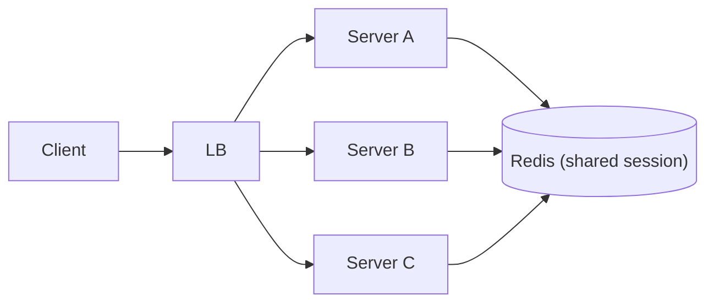

---

## Part 4: Proxy Protocol

> **Stop and think**: If an L4 load balancer simply forwards TCP packets by rewriting destination IP addresses (DNAT), what happens to the source IP address by the time the packet reaches your backend application?

### 4.1 The Client IP Problem

L7 load balancers can add `X-Forwarded-For` headers because they parse HTTP. L4 load balancers can't — they just forward TCP connections.

**Without Proxy Protocol:**
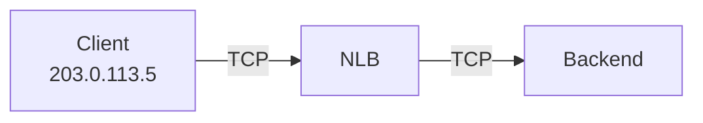
The backend sees the source IP of the NLB internal IP (10.0.1.x). The client's real IP is LOST. This breaks access logging, geo-targeting, rate limiting, and compliance.

**Proxy Protocol v1 (Text)**
Prepends a single text line before the TCP data stream.
Format: `PROXY <protocol> <src_ip> <dst_ip> <src_port> <dst_port>\r\n`
Example: `PROXY TCP4 203.0.113.5 10.0.0.1 54321 443\r\n`
- ✓ Human-readable, simple to implement
- ✗ Text parsing overhead, limited data

**Proxy Protocol v2 (Binary)**
Binary format. More efficient, extensible with TLV fields.
Can carry TLS version, cipher negotiated, client cert details, and AWS VPC endpoint IDs.
- ✓ More efficient, extensible
- ✗ Not human-readable, more complex

**How It Works In Practice**

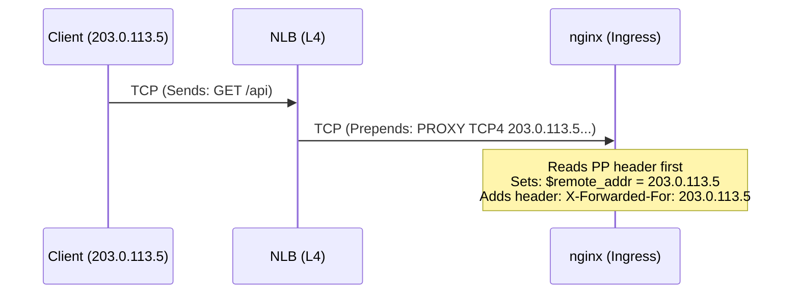
Backend application sees `X-Forwarded-For: 203.0.113.5` (real client IP!).

### 4.2 Proxy Protocol Configuration

⚠️ **CRITICAL**: Both sides must agree! If LB sends Proxy Protocol but backend doesn't expect it, backend sees "PROXY TCP4..." as garbage → connection fails.

**NGINX Configuration (Receiving Proxy Protocol)**
```nginx
server {
    # Enable Proxy Protocol on the listen directive
    listen 443 ssl proxy_protocol;

    # Use the real client IP from Proxy Protocol
    set_real_ip_from 10.0.0.0/8;     # Trust NLB's IP range
    real_ip_header proxy_protocol;   # Get IP from PP header

    # Pass real IP to backend as header
    proxy_set_header X-Real-IP       $proxy_protocol_addr;
    proxy_set_header X-Forwarded-For $proxy_protocol_addr;
}
```

**HAProxy Configuration**
```haproxy
# Receiving Proxy Protocol
frontend web
    bind *:443 accept-proxy ssl crt /etc/ssl/cert.pem

# Sending Proxy Protocol to backend
backend servers
    server s1 10.0.1.5:8080 send-proxy-v2
```

**AWS NLB + Proxy Protocol**
Target Group settings: Proxy Protocol v2 Enabled.
⚠️ NLB sends Proxy Protocol v2 (binary). Your backend MUST support v2.

**Common Gotcha: Health Checks**
NLB health checks do NOT send Proxy Protocol headers. If your backend requires Proxy Protocol on ALL connections, NLB health checks will fail.
*Solution 1*: Use a separate port for health checks.
*Solution 2*: Configure backend to accept connections both with and without Proxy Protocol.

---

## Part 5: Cross-Zone Load Balancing

> **Stop and think**: If enabling cross-zone load balancing distributes traffic perfectly across all backends, why do cloud providers sometimes charge extra for it, and why might you choose to leave it disabled?

### 5.1 The Cross-Zone Problem

Cloud load balancers span multiple Availability Zones. Cross-zone determines whether traffic can flow across zones.

**Without Cross-Zone (Zone-Isolated)**
Each AZ's LB node only sends to backends in its own AZ.

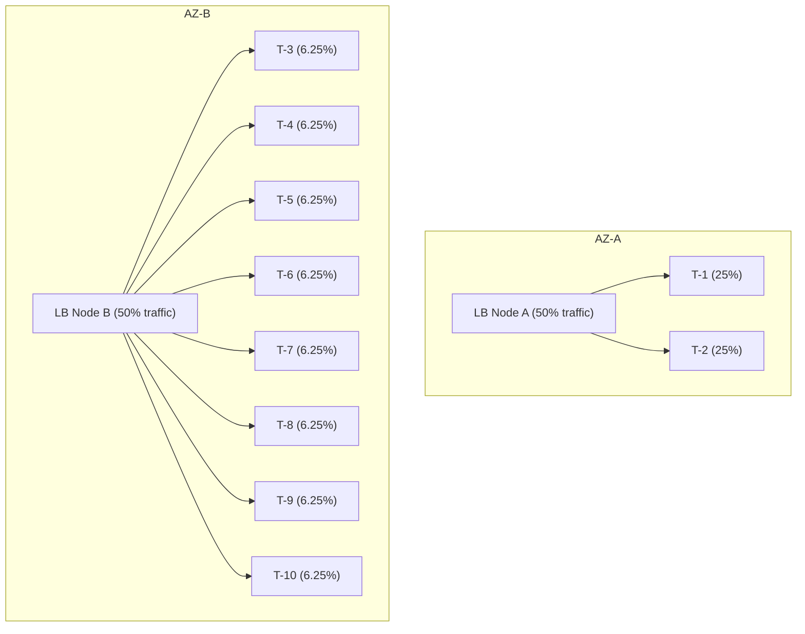
Problem: AZ-A targets are 4x overloaded!

**With Cross-Zone (Default for ALB, optional for NLB)**
Each LB node distributes evenly across ALL backends.

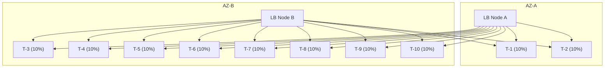

**Trade-Offs**
- **Cross-Zone ON**: Even distribution, better utilization. *Drawbacks*: Cross-AZ data transfer charges, slightly higher latency, AZ failure might affect traffic in other AZs.
- **Cross-Zone OFF**: No cross-AZ charges, isolation. *Drawbacks*: Uneven distribution if target count differs.

**AWS Defaults**
- ALB: Cross-zone ON (always)
- NLB: Cross-zone OFF (can enable per target group, costs $0.006/GB inter-AZ)

---

## Part 6: Cloud Load Balancer Architectures

> **Pause and predict**: If a cloud load balancer uses consistent hashing to map flows to backend servers, what happens to existing active connections mapped to Server A if Server B crashes?

### 6.1 AWS Load Balancers

**Network Load Balancer (NLB)**
- **Layer**: 4 (TCP, UDP, TLS)
- **Performance**: Millions of requests/sec, <100μs latency
- **IPs**: Static (Elastic IP per AZ)
- **Architecture**: Uses flow hash (5-tuple) for connection distribution. Backed by Hyperplane (distributed across all hosts in the AZ). No single point of failure.

**Application Load Balancer (ALB)**
- **Layer**: 7 (HTTP, HTTPS, gRPC)
- **IPs**: Dynamic (DNS-based resolution)
- **Advanced features**: Weighted routing, OIDC/Cognito auth, WAF integration, header modification.

**NLB + ALB Pattern**
Internet → NLB (static IPs, Proxy Protocol) → ALB (HTTP routing, WAF, auth) → Targets.
*Why*: Some use cases need BOTH static IPs (firewall allowlisting) AND L7 features (path routing).

### 6.2 Google Maglev

Maglev is Google's custom software-defined L4 load balancer.

**Architecture**

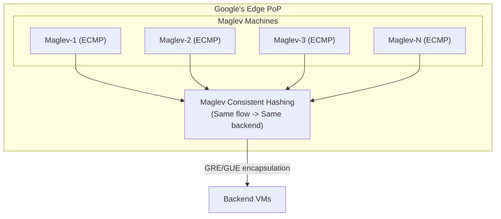

**Maglev Consistent Hashing**
Guarantees:
- Same 5-tuple always maps to same backend
- ANY Maglev machine produces the SAME mapping
- When a backend is removed, ONLY that backend's flows are redistributed
- Stateless: Multiple machines can handle traffic via ECMP without coordination.

### 6.3 Kubernetes Load Balancing

**ClusterIP (Internal L4)**
Virtual IP via kube-proxy iptables or IPVS.
IPVS mode is better for large clusters (O(1) connection forwarding).

**NodePort**
Opens a port (30000-32767) on every node.
⚠️ **Double-hop problem**: Traffic hits Node A → Pod is on Node B. Extra hop, SNAT hides client IP.
`externalTrafficPolicy: Local` preserves client IP (no SNAT), but if no pod is on that node, the connection is refused.

**LoadBalancer**
Cloud provider provisions external LB automatically.
```yaml
# AWS NLB
service.beta.kubernetes.io/aws-load-balancer-type: "nlb"
service.beta.kubernetes.io/aws-load-balancer-proxy-protocol: "*"
service.beta.kubernetes.io/aws-load-balancer-cross-zone-load-balancing-enabled: "true"

# Target type (instance vs ip)
service.beta.kubernetes.io/aws-load-balancer-nlb-target-type: "ip"
```
- `instance` mode: NLB → NodePort → kube-proxy → Pod
- `ip` mode: NLB → Pod directly (requires VPC CNI)

**Ingress (L7) & Gateway API**
Ingress Controller (nginx, envoy) provides L7 behind a LoadBalancer Service.
Gateway API is the modern standard, offering more expressive routing, Canary traffic splitting, and TLS per route.

---

## Did You Know?

- **Google's Maglev handles all of Google's external traffic** — every search query, YouTube video, Gmail message, and Cloud Platform API call passes through Maglev. At peak, this is millions of packets per second per machine, across hundreds of machines at each of Google's edge PoPs. The design was published in a 2016 NSDI paper that has become a reference for building software load balancers.

- **AWS NLB can handle millions of requests per second with single-digit microsecond latency** because it runs on Hyperplane, AWS's internal software-defined networking platform. Unlike ALB, which runs on EC2 instances, NLB is embedded in the network fabric itself. This is why NLB supports static Elastic IPs while ALB's IPs are dynamic — they're fundamentally different architectures.

- **The Proxy Protocol specification was created by Willy Tarreau, the author of HAProxy, in 2010.** What started as a simple solution for HAProxy has become an industry standard supported by every major load balancer, web server, and CDN. Version 2 added binary encoding and TLV extensions that carry TLS metadata, AWS VPC information, and custom application data — far beyond the original "just pass the client IP" use case.

---

## Common Mistakes

| Mistake | Problem | Solution |
|---------|---------|----------|
| No connection draining configured | Active requests dropped during deployments | Set deregistration delay (300s for most apps) |
| Proxy Protocol mismatch | Backend expects PP but LB doesn't send (or vice versa) → connection failures | Enable/disable on BOTH sides simultaneously |
| NLB health checks failing with Proxy Protocol | NLB health checks don't send PP headers | Use separate health check port or HTTP health check |
| Sticky sessions hiding backend failures | Unhealthy server keeps receiving sticky traffic | Always combine stickiness with health checks |
| Using ALB when you need static IPs | ALB IPs change; firewall allowlists break | Use NLB (static EIPs) in front of ALB, or use Global Accelerator |
| Cross-zone off with uneven target distribution | Some targets get 4x more traffic than others | Either enable cross-zone or ensure equal targets per AZ |
| Not setting `externalTrafficPolicy: Local` | Client IP lost due to SNAT on the second hop | Set to Local (but ensure pods exist on all receiving nodes) |
| Ingress controller without readiness gates | Pods receive traffic before they're ready | Use pod readiness gates tied to LB target health |
| Ignoring NLB connection idle timeout | Long-lived connections (WebSocket) silently dropped at 350s | Set idle timeout appropriately; use TCP keepalive |

---

## Quiz

1. **You are designing an architecture for a new microservice that needs to route traffic based on the `/api/v2` URL path, but your team insists on using a high-throughput L4 load balancer to minimize latency. Why will this approach fail, and what is the fundamental architectural difference preventing it?**
   <details>
   <summary>Answer</summary>

   This approach will fail because an L4 load balancer operates exclusively at the transport layer (TCP/UDP) and cannot read or route based on HTTP paths. L4 balancers see only the 5-tuple (source IP, source port, destination IP, destination port, and protocol) and forward raw TCP streams without terminating the connection or decrypting TLS. In contrast, an L7 load balancer operates at the application layer, fully terminating the TCP and TLS connections to parse the HTTP request. Because the URL path `/api/v2` is encrypted inside the TLS payload of the HTTP request, an L4 load balancer simply cannot access this data to make routing decisions.
   </details>

2. **During a routine midday deployment, your monitoring system alerts you that hundreds of users are receiving abrupt "connection reset" errors. You discover your load balancer's deregistration delay (connection draining) is set to 5 seconds. Why is this specific configuration causing the errors, and what is happening to the active connections?**
   <details>
   <summary>Answer</summary>

   The 5-second deregistration delay is causing these errors because it forces the load balancer to forcefully sever any connection that takes longer than 5 seconds to complete after a backend is marked for removal. During a deployment, older pods are removed from the load balancer and placed into a "draining" state, where they stop receiving new requests but are expected to finish existing ones. If a user is downloading a large file, executing a slow database query, or maintaining a long-lived WebSocket connection, 5 seconds is insufficient time for the request to naturally complete. Consequently, the load balancer abruptly drops these in-flight connections once the brief timeout is reached, resulting in the "connection reset" errors seen by the users.
   </details>

3. **Your team is migrating a legacy e-commerce application to Kubernetes and a senior engineer suggests enabling sticky sessions on the load balancer so users don't lose their shopping carts during pod restarts. Why is this considered a cloud-native anti-pattern, and what operational risks does it introduce during scaling events?**
   <details>
   <summary>Answer</summary>

   Sticky sessions are considered an anti-pattern in modern cloud-native architectures because they tightly couple a user's session state to a specific ephemeral pod, undermining the fundamental principle of statelessness. When scaling events occur, sticky sessions create severe operational risks such as uneven load distribution, where popular users become trapped on a single overloaded pod while newly provisioned pods sit idle. Furthermore, if a pod crashes or restarts, all users pinned to that pod immediately lose their session data (like their shopping carts) and must re-establish their connections on a new pod. A far more resilient and scalable approach is to store session state in an external, distributed datastore like Redis, enabling any backend pod to safely handle any user's request.
   </details>

4. **You configure an AWS Network Load Balancer (NLB) with Proxy Protocol v2 enabled, but your backend application shows the NLB's internal IP in access logs instead of the true client IP. What are the most likely causes of this discrepancy, and why does it happen?**
   <details>
   <summary>Answer</summary>

   The most likely cause is that the backend application (or an intermediate proxy like an ingress controller) has not been explicitly configured to expect and parse the Proxy Protocol header. Proxy Protocol v2 prepends a binary header to the beginning of the TCP stream, and if the backend does not decode this header, it will simply fall back to reading the TCP source IP, which belongs to the NLB. Another possible cause is that the Proxy Protocol setting was enabled on the NLB listener but not explicitly on the target group, preventing the NLB from injecting the header in the first place. Finally, an intermediate proxy (like kube-proxy in iptables mode) might be stripping the header before it reaches the application, meaning the entire chain must be configured to pass or translate the client IP.
   </details>

5. **You have deployed an application across two Availability Zones: 2 pods in AZ-A and 6 pods in AZ-B. Your Network Load Balancer has cross-zone load balancing disabled to save on data transfer costs. Suddenly, the pods in AZ-A start crashing from CPU exhaustion while AZ-B pods are mostly idle. What percentage of the total traffic is each pod receiving, and why did this configuration cause the outage?**
   <details>
   <summary>Answer</summary>

   With cross-zone load balancing disabled, the load balancer distributes incoming traffic evenly between the two Availability Zones at the DNS level, meaning AZ-A and AZ-B each receive 50% of the total traffic. Because there are only 2 pods in AZ-A, each of those pods must handle 25% of the overall traffic load. In contrast, the 6 pods in AZ-B share their 50% evenly, meaning each pod in AZ-B handles roughly 8.3% of the traffic. This immense imbalance forced the pods in AZ-A to process three times the traffic volume of their counterparts in AZ-B, rapidly exhausting their CPU resources and causing the cascading failure.
   </details>

6. **You configure a NodePort service in your cluster to receive external traffic, but a security audit reveals that the application logs show all requests coming from internal node IPs rather than the actual external client IPs. You apply `externalTrafficPolicy: Local` to fix this, but now some connections are being completely refused. Explain the original "double-hop" mechanism that hid the IPs, how the new policy fixed it, and why connections are now failing.**
   <details>
   <summary>Answer</summary>

   The original "double-hop" issue occurred because kube-proxy randomly routes NodePort traffic to any pod in the cluster, meaning traffic hitting Node A might be forwarded to a pod on Node B. To ensure the response routes back properly, kube-proxy performs Source NAT (SNAT), replacing the client's external IP with Node A's internal IP. Applying `externalTrafficPolicy: Local` solves the SNAT problem by forcing kube-proxy to only route traffic to pods located on the same node that initially received the request, thereby preserving the original client IP. However, this introduces a new failure mode: if external traffic hits a node that happens to have zero instances of your application pod running locally, that node has nowhere to route the traffic and immediately drops or refuses the connection.
   </details>

---

## Hands-On Exercise

**Objective**: Set up an L4 load balancer with Proxy Protocol forwarding to a Kubernetes Ingress controller, and verify that the real client IP is preserved in application logs.

**Environment**: kind cluster + MetalLB (L4 LB simulation) + nginx Ingress

### Part 1: Create the Cluster (10 minutes)

```bash
cat <<'EOF' > /tmp/lb-lab-cluster.yaml
kind: Cluster
apiVersion: kind.x-k8s.io/v1alpha4
nodes:
  - role: control-plane
  - role: worker
  - role: worker
EOF

kind create cluster --name lb-lab --config /tmp/lb-lab-cluster.yaml --image=kindest/node:v1.35.0
```

### Part 2: Deploy nginx Ingress with Proxy Protocol Support (15 minutes)

```bash
# Install nginx Ingress Controller
kubectl apply -f https://raw.githubusercontent.com/kubernetes/ingress-nginx/controller-v1.12.0/deploy/static/provider/kind/deploy.yaml

# Wait for ingress controller to be ready
kubectl wait --namespace ingress-nginx \
  --for=condition=ready pod \
  --selector=app.kubernetes.io/component=controller \
  --timeout=120s

# Configure nginx to accept Proxy Protocol
cat <<'EOF' | kubectl apply -f -
apiVersion: v1
kind: ConfigMap
metadata:
  name: ingress-nginx-controller
  namespace: ingress-nginx
data:
  use-proxy-protocol: "true"
  compute-full-forwarded-for: "true"
  use-forwarded-headers: "true"
  proxy-real-ip-cidr: "0.0.0.0/0"
EOF

# Restart the ingress controller to pick up the config
kubectl rollout restart deployment ingress-nginx-controller -n ingress-nginx
kubectl rollout status deployment ingress-nginx-controller -n ingress-nginx
```

### Part 3: Deploy Backend Application with IP Logging (10 minutes)

```bash
cat <<'EOF' | kubectl apply -f -
apiVersion: v1
kind: ConfigMap
metadata:
  name: ip-logger-code
data:
  server.py: |
    from http.server import HTTPServer, BaseHTTPRequestHandler
    import json
    import os

    class Handler(BaseHTTPRequestHandler):
        def do_GET(self):
            # Collect all IP-related headers
            ip_info = {
                "pod_name": os.environ.get("HOSTNAME", "unknown"),
                "remote_addr": self.client_address[0],
                "x_forwarded_for": self.headers.get("X-Forwarded-For", "not set"),
                "x_real_ip": self.headers.get("X-Real-IP", "not set"),
                "x_forwarded_proto": self.headers.get("X-Forwarded-Proto", "not set"),
                "all_headers": dict(self.headers),
            }

            self.send_response(200)
            self.send_header("Content-Type", "application/json")
            self.end_headers()
            self.wfile.write(json.dumps(ip_info, indent=2).encode())

        def log_message(self, format, *args):
            xff = self.headers.get("X-Forwarded-For", "-") if hasattr(self, 'headers') else "-"
            print(f"[{self.client_address[0]}] XFF={xff} {args[0]}")

    HTTPServer(("0.0.0.0", 8080), Handler).serve_forever()
---
apiVersion: apps/v1
kind: Deployment
metadata:
  name: ip-logger
spec:
  replicas: 3
  selector:
    matchLabels:
      app: ip-logger
  template:
    metadata:
      labels:
        app: ip-logger
    spec:
      containers:
        - name: app
          image: python:3.12-slim
          command: ["python", "/app/server.py"]
          ports:
            - containerPort: 8080
          readinessProbe:
            httpGet:
              path: /
              port: 8080
            initialDelaySeconds: 3
            periodSeconds: 5
---
apiVersion: v1
kind: Service
metadata:
  name: ip-logger
spec:
  selector:
    app: ip-logger
  ports:
    - port: 80
      targetPort: 8080
---
apiVersion: networking.k8s.io/v1
kind: Ingress
metadata:
  name: ip-logger
  annotations:
    nginx.ingress.kubernetes.io/proxy-set-headers: "ingress-nginx/custom-headers"
spec:
  ingressClassName: nginx
  rules:
    - host: ip-test.local
      http:
        paths:
          - path: /
            pathType: Prefix
            backend:
              service:
                name: ip-logger
                port:
                  number: 80
EOF
```

### Part 4: Test Client IP Preservation (15 minutes)

```bash
# Get the ingress controller's cluster IP
INGRESS_IP=$(kubectl get svc ingress-nginx-controller -n ingress-nginx -o jsonpath='{.spec.clusterIP}')

# Deploy test client
kubectl run test-client --image=curlimages/curl:8.11.1 --rm -it -- sh

# Test 1: Request through Ingress (with Proxy Protocol support)
echo "=== Test 1: Via Ingress ==="
curl -s -H "Host: ip-test.local" http://${INGRESS_IP}/ | python3 -m json.tool

# Observe:
# - x_forwarded_for should contain the test client's pod IP
# - x_real_ip should contain the test client's pod IP
# - remote_addr is the ingress controller's IP

# Test 2: Multiple requests — observe load balancing
echo "=== Test 2: Load Balancing Distribution ==="
for i in $(seq 1 12); do
  POD=$(curl -s -H "Host: ip-test.local" http://${INGRESS_IP}/ | python3 -c "import sys,json; print(json.load(sys.stdin)['pod_name'])")
  echo "Request $i → $POD"
done

# You should see requests distributed across all 3 replicas

# Test 3: Check X-Forwarded-* headers
echo "=== Test 3: Header Inspection ==="
curl -s -H "Host: ip-test.local" \
  -H "X-Custom-Header: test-value" \
  http://${INGRESS_IP}/ | python3 -m json.tool
```

### Part 5: Observe Connection Draining (15 minutes)

```bash
# In one terminal: continuous requests
kubectl run load-gen --image=curlimages/curl:8.11.1 --rm -it -- sh -c '
  while true; do
    STATUS=$(curl -s -o /dev/null -w "%{http_code}" -H "Host: ip-test.local" http://ip-logger/)
    echo "$(date +%H:%M:%S) HTTP $STATUS"
    sleep 0.5
  done
'

# In another terminal: scale down to 1 replica
kubectl scale deployment ip-logger --replicas=1

# Watch the load-gen output:
# - You should see continuous 200 responses
# - No 502 or 503 errors during scale-down
# - This is connection draining in action

# Scale back up
kubectl scale deployment ip-logger --replicas=3

# Scale to 0 (all pods removed)
kubectl scale deployment ip-logger --replicas=0

# Now watch load-gen — should see 503 errors
# (no backends available)

# Restore
kubectl scale deployment ip-logger --replicas=3
```

### Part 6: Test Session Affinity (10 minutes)

```bash
# Enable cookie-based session affinity on the Ingress
cat <<'EOF' | kubectl apply -f -
apiVersion: networking.k8s.io/v1
kind: Ingress
metadata:
  name: ip-logger
  annotations:
    nginx.ingress.kubernetes.io/affinity: "cookie"
    nginx.ingress.kubernetes.io/affinity-mode: "persistent"
    nginx.ingress.kubernetes.io/session-cookie-name: "SERVERID"
    nginx.ingress.kubernetes.io/session-cookie-max-age: "172800"
spec:
  ingressClassName: nginx
  rules:
    - host: ip-test.local
      http:
        paths:
          - path: /
            pathType: Prefix
            backend:
              service:
                name: ip-logger
                port:
                  number: 80
EOF

# Test without cookie (different pods)
echo "=== Without Session Cookie ==="
for i in $(seq 1 6); do
  POD=$(curl -s -H "Host: ip-test.local" http://${INGRESS_IP}/ | python3 -c "import sys,json; print(json.load(sys.stdin)['pod_name'])")
  echo "Request $i → $POD"
done

# Test with cookie (same pod every time)
echo "=== With Session Cookie ==="
COOKIE=$(curl -s -c - -H "Host: ip-test.local" http://${INGRESS_IP}/ | grep SERVERID | awk '{print $NF}')
for i in $(seq 1 6); do
  POD=$(curl -s -b "SERVERID=$COOKIE" -H "Host: ip-test.local" http://${INGRESS_IP}/ | python3 -c "import sys,json; print(json.load(sys.stdin)['pod_name'])")
  echo "Request $i → $POD (sticky)"
done

# All sticky requests should hit the same pod!
```

### Clean Up

```bash
kind delete cluster --name lb-lab
```

**Success Criteria**:
- [ ] nginx Ingress controller deployed and accepting connections
- [ ] Client IP visible in X-Forwarded-For header in application response
- [ ] Observed load balancing across 3 replicas (roughly even distribution)
- [ ] Scaling down to 1 replica produced no error responses (connection draining)
- [ ] Scaling to 0 replicas produced 503 errors (no backends)
- [ ] Cookie-based session affinity routed all requests to the same pod
- [ ] Without session cookie, requests distributed across pods

---

## Further Reading

- **"Maglev: A Fast and Reliable Software Network Load Balancer"** (Google, NSDI 2016) — The paper describing Google's L4 load balancer architecture. Required reading for anyone building software load balancers.

- **AWS Elastic Load Balancing documentation** — Detailed deep dives on NLB, ALB, and Gateway LB architecture, particularly the "How Elastic Load Balancing Works" section.

- **"HAProxy Architecture Guide"** — The HAProxy documentation includes excellent explanations of L4 vs L7 load balancing, connection management, and Proxy Protocol.

- **"Proxy Protocol Specification"** (HAProxy) — The official specification for Proxy Protocol v1 and v2, including TLV extension format.

---

## Key Takeaways

Before moving on, ensure you understand:

- [ ] **L4 load balancers forward connections, L7 load balancers proxy requests**: L4 is faster (microseconds, millions of CPS) but cannot inspect HTTP content; L7 terminates TLS and parses HTTP for rich routing
- [ ] **Connection draining prevents dropped requests**: Configure deregistration delay to match your longest expected request duration; 300 seconds is a safe default
- [ ] **Sticky sessions create operational complexity**: Prefer external session storage (Redis); use sticky sessions only when refactoring is impractical
- [ ] **Proxy Protocol preserves client IP through L4 proxies**: Both LB and backend must be configured; mismatch causes connection failures
- [ ] **Cross-zone load balancing trades cost for evenness**: On by default for ALB, off for NLB. Uneven target distribution without cross-zone creates hotspots
- [ ] **NLB + Ingress Controller is a powerful pattern**: NLB provides static IPs and Proxy Protocol; Ingress provides HTTP routing and TLS termination
- [ ] **Kubernetes `externalTrafficPolicy: Local` preserves client IP**: But requires pods on all nodes receiving traffic, or health checks must exclude empty nodes
- [ ] **Maglev consistent hashing enables stateless L4 LBs**: Any LB machine produces the same backend selection for the same flow, no shared state needed

---

## Next Module

[Module 1.6: Zero Trust Networking & VPN Alternatives](../module-1.6-zero-trust/) — Moving beyond perimeter security to identity-based access, with practical deployment of identity-aware proxies and SSE solutions.