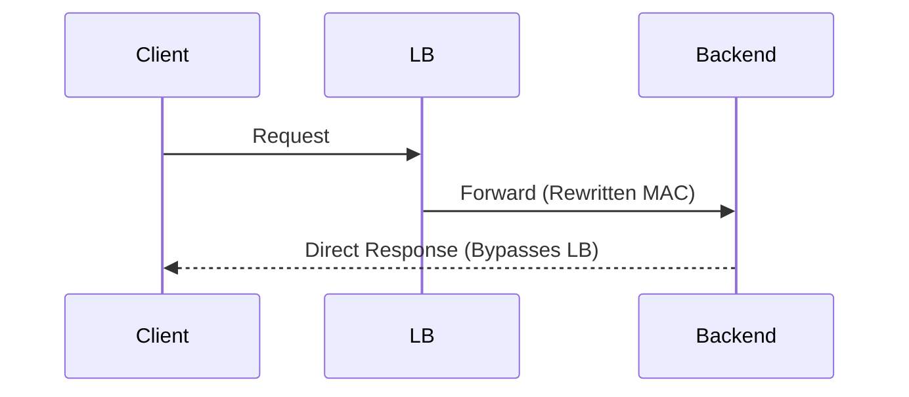
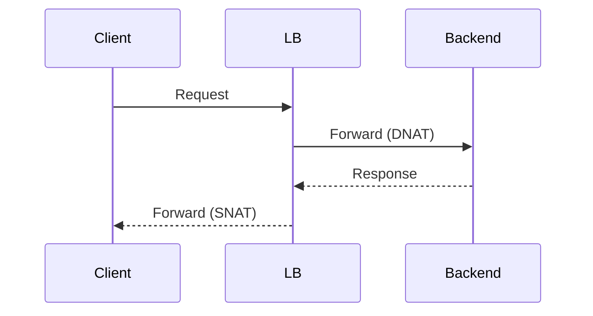
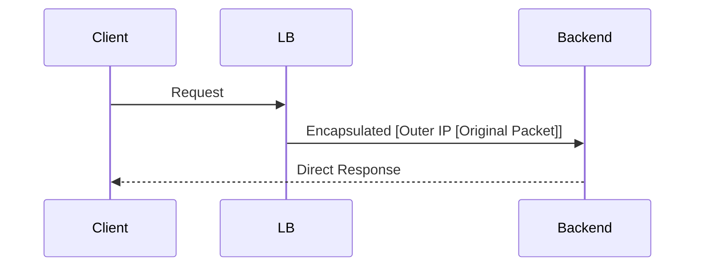
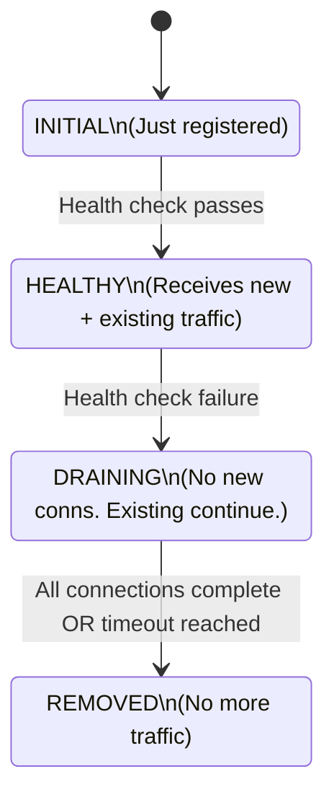
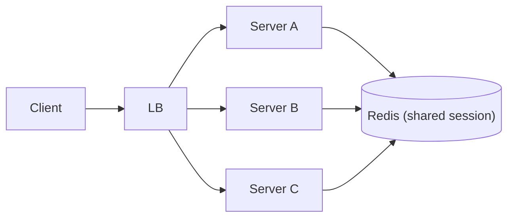
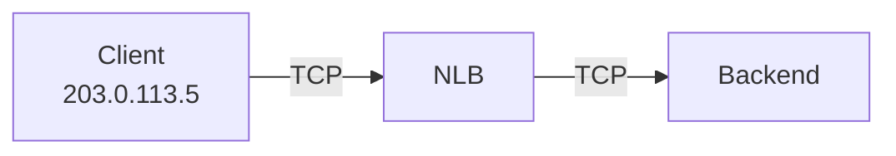
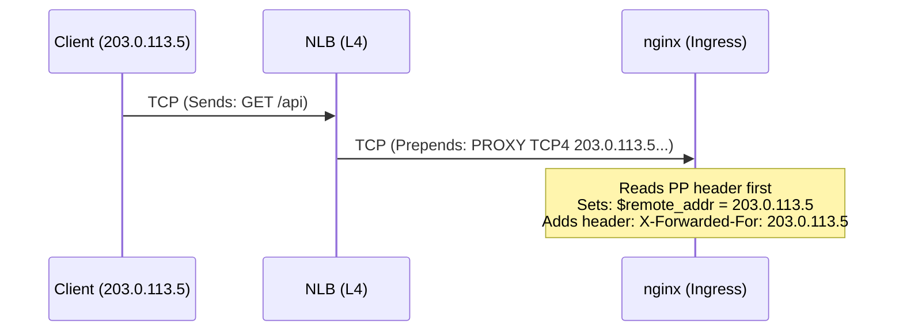
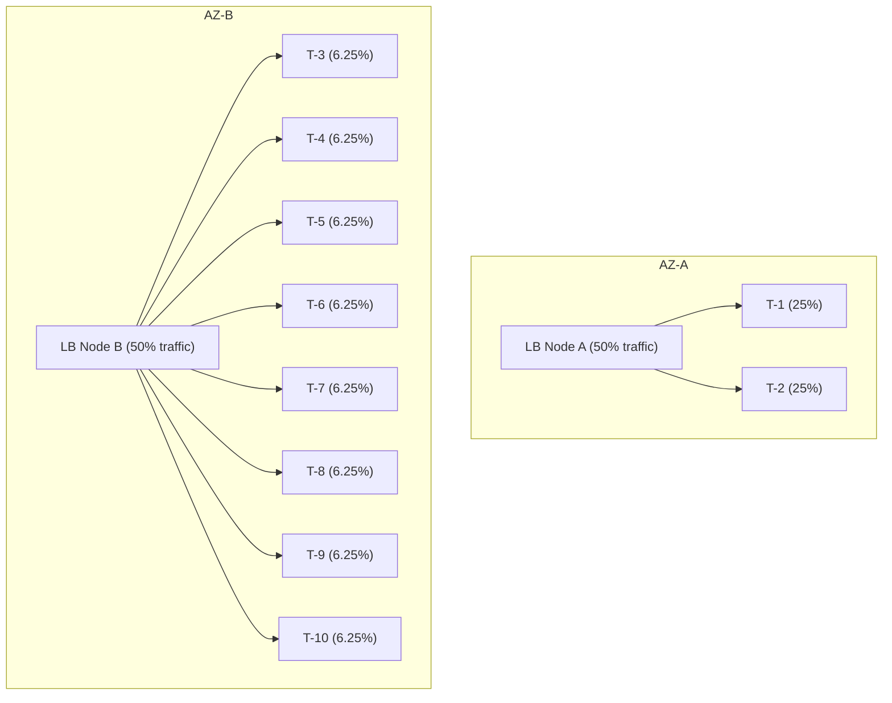
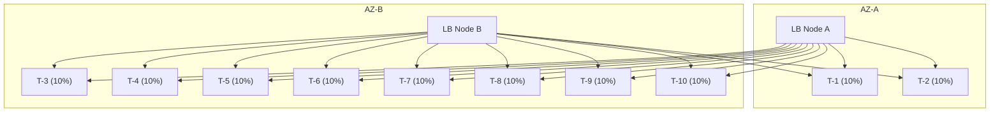
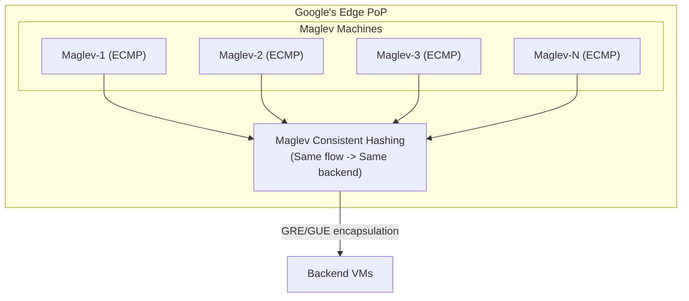

> **Complexity**: `[COMPLEX]`
>
> **Time to Complete**: 3 hours
>
> **Prerequisites**: [Module 1.1: DNS at Scale](../module-1.1-dns-at-scale/), basic understanding of TCP/IP and HTTP
>
> **Track**: Foundations — Advanced Networking

### What You'll Be Able to Do

After completing this module, you will be able to:

1. **Compare** L4 and L7 load balancers by explaining their architectural differences and selecting the right tier for a given workload.
2. **Design** health check configurations, connection draining, and cross-zone settings that ensure graceful failover during outages.
3. **Diagnose** load balancer issues, such as uneven distribution, connection reuse problems, and TLS termination latency, using connection-level metrics and access logs.
4. **Evaluate** proxy protocols and routing mechanisms to guarantee client IP preservation across multi-hop ingress architectures.
5. **Implement** advanced load balancing patterns including weighted routing, session affinity, and Global Server Load Balancing (GSLB) across multiple geographic regions.

---

### Why This Module Matters

On December 7, 2021, an automated process in AWS's US-East-1 region triggered an unexpected scaling event within their internal network.
This caused a massive surge of connection attempts to internal routing devices, effectively overwhelming them.
Within minutes, thousands of external customers, including global streaming platforms and major ticketing agencies, experienced severe degradation.
The financial impact was staggering, with some estimates suggesting enterprise companies lost upwards of $100 million in revenue during the multi-hour window.
But in the post-incident analysis, a curious pattern emerged across the industry.
Applications with properly configured health checks and connection draining experienced near-zero user-visible errors during failover.
Applications without them dropped thousands of in-flight requests and suffered catastrophic application lockups.

The difference between graceful degradation and catastrophic failure during network turbulence almost always comes down to load balancing architecture.
Load balancers are the fundamental gatekeepers of your infrastructure.
They terminate transport layer security (TLS), manage long-lived TCP connections, route application layer payloads, and dictate exactly how traffic behaves when a backend server spontaneously combusts.
Despite their criticality, many engineers treat cloud load balancers as magical black boxes.
They deploy an ingress controller, point it at a cloud provider service, and assume the platform will handle the rest.
This assumption works flawlessly—until you hit a sudden traffic spike and your default idle timeouts start silently severing active WebSocket streams.

This module is designed to shatter that black-box mentality.
You will explore the exact mechanics of Layer 4 transport and Layer 7 application load balancing.
You will dive into the nuances of connection draining, proxy protocols, and global server load balancing.
By the time you finish, you will no longer view load balancers as mere traffic distributors, but as complex, stateful systems that require deliberate architectural design to survive the inevitable chaos of cloud-native environments.

> **The Traffic Cop vs The Hotel Concierge**
>
> An L4 load balancer is like a traffic cop at an intersection.
> It sees cars (packets) and directs them to different lanes (servers) based on simple rules — it doesn't know or care what's inside the cars.
> An L7 load balancer is like a hotel concierge.
> It opens your luggage (HTTP request), reads your reservation (path, headers, cookies), and personally escorts you to the right room (backend).
> The concierge is smarter but slower.
> The traffic cop handles more throughput but can't make content-aware decisions.

---

## Part 1: L4 vs L7 Load Balancing

> **Stop and think**: If an L4 load balancer only operates on TCP/UDP streams and never inspects the content, how does it consistently route packets belonging to the same connection to the exact same backend server?

### 1.1 Layer 4 Load Balancing (Transport Layer)

Layer 4 load balancers operate strictly at the transport layer of the OSI model, dealing with raw TCP and UDP connections.
They make routing decisions based entirely on the network 5-tuple: Source IP, Source Port, Destination IP, Destination Port, and Protocol.
Because they do not inspect the application payload, they are entirely blind to HTTP headers, URLs, cookies, and request bodies.
This blindness is their greatest strength, allowing them to process millions of packets per second with sub-millisecond latency.

When a client establishes a connection to a Layer 4 load balancer, the load balancer must efficiently forward those packets to a backend server.
It accomplishes this using one of three primary methods:

**Method 1: DSR (Direct Server Return)**
In a DSR architecture, the load balancer alters only the destination MAC address of the incoming packet, leaving the IP headers intact.
The packet is then forwarded to the backend server at Layer 2.
Because the source IP remains the original client's IP, the backend server can respond directly to the client, completely bypassing the load balancer on the return trip.



- **Advantage:** Massive throughput, as the load balancer only processes inbound traffic.
- **Advantage:** The load balancer does not become a bandwidth bottleneck for large outbound responses (like video streaming).
- **Disadvantage:** The load balancer cannot inspect or modify server responses.
- **Disadvantage:** Backend servers must be Layer 2-adjacent to the load balancer and configured to accept traffic destined for the load balancer's IP.

**Method 2: DNAT (Destination Network Address Translation)**
DNAT is a more common approach in cloud environments where Layer 2 adjacency is impossible.
The load balancer rewrites the destination IP address of the incoming packet to match the chosen backend server.
When the backend responds, the traffic flows back through the load balancer, which rewrites the source IP back to its own before sending it to the client (Source NAT, or SNAT).



- **Advantage:** Works seamlessly across Layer 3 routed networks.
- **Advantage:** The load balancer sees all bidirectional traffic, enabling sophisticated health tracking and connection state management.
- **Disadvantage:** The load balancer must handle both inbound and outbound bandwidth, requiring significantly more processing power.
- **Disadvantage:** Requires the load balancer to maintain a massive connection tracking table in memory.

**Method 3: Tunneling (IP-in-IP / GUE)**
Modern hyper-scale load balancers, such as AWS Network Load Balancer and Google Maglev, utilize encapsulation.
The load balancer wraps the entire original packet inside a new outer IP header destined for the backend server.
The backend server decapsulates the packet and, similar to DSR, can often respond directly to the client.



**L4 Load Balancing Algorithms**
Choosing the right backend server involves applying a load balancing algorithm:
- **Round Robin**: Distributes connections sequentially. Simple but ignores server capacity.
- **Weighted Round Robin**: Assigns more connections to servers with higher configured weights.
- **Least Connections**: Routes the next packet to the server with the fewest active TCP connections.
- **Source IP Hash (Consistent Hashing)**: Calculates a hash of the client's IP address modulo the number of servers, ensuring a specific client always hits the same backend.
- **Maglev Hashing**: A Google-designed consistent hashing algorithm that minimizes disruption when backend servers are added or removed.

### 1.2 Layer 7 Load Balancing (Application Layer)

Layer 7 load balancers operate at the application layer, interacting directly with HTTP, HTTPS, and gRPC traffic.
Unlike Layer 4 balancers, they see the entire application payload, including the URL path, HTTP headers, cookies, and the request body.
To achieve this visibility, a Layer 7 load balancer must fully terminate the TCP connection and decrypt the TLS session.

This means a Layer 7 load balancer acts as a true reverse proxy, maintaining two completely separate TCP connections: one with the client and one with the backend server.


**Routing Capabilities**
Because they understand application semantics, Layer 7 load balancers unlock powerful routing capabilities:
- **Path-Based Routing**: Sending `/api/v1/*` to your API microservice and `/assets/*` to a static file server.
- **Host-Based Routing**: Directing `admin.example.com` to internal administration pods and `shop.example.com` to customer-facing pods.
- **Header-Based Routing**: Enabling canary deployments by routing requests with `X-Version: experimental` to a new deployment tier.
- **Cookie-Based Routing**: Inspecting session cookies to guarantee that an authenticated user is pinned to a specific backend process.

While Layer 7 load balancers offer immense flexibility, they introduce additional latency (typically 1-5ms) due to TLS decryption and HTTP parsing overhead.
They are also more computationally expensive and generally have lower maximum throughput compared to their Layer 4 counterparts.

### 1.3 L4 vs L7 Decision Matrix

When designing cloud architectures, you must evaluate the trade-offs between transport and application tier load balancing.

| Requirement | L4 | L7 |
| :--- | :--- | :--- |
| **Maximum throughput** | Best | Limited |
| **Lowest latency** | <1ms | 1-5ms |
| **HTTP path/header routing** | Can't see | Full control |
| **TLS termination** | Pass-through | Terminates |
| **WebSocket support** | Transparent | Managed |
| **gRPC load balancing** | Per-connection | Per-request |
| **Non-HTTP protocols (DB, SMTP)**| Any protocol | HTTP only |
| **Request/response modification**| No access | Full access |
| **Cookie-based session affinity**| No cookies | Cookie aware |
| **Client certificate (mTLS)** | Pass-through | Validates |
| **Health checks (HTTP)** | TCP only* | HTTP checks |
| **Connection draining** | Timer-based | Request-aware |
| **Cost** | Lower | Higher |

*\* Some L4 LBs support limited HTTP health checks*

**Common Architecture: L4 + L7 Together**
Modern Kubernetes architectures rarely choose just one tier.
The most resilient pattern is to deploy a Layer 4 load balancer (like AWS NLB) at the network edge, which then forwards traffic to a Layer 7 ingress controller (like NGINX or Envoy) running inside the cluster.


This hybrid approach provides the raw throughput, static IP addresses, and DDOS protection of an L4 balancer, combined with the granular HTTP routing and TLS termination capabilities of an L7 ingress proxy.

---

## Part 2: Connection Draining

> **Pause and predict**: What happens to a 5-minute file upload if the backend server actively receiving the stream suddenly fails its load balancer health check and is removed from the target group?

### 2.1 The Problem: Killing Active Connections

Infrastructure is ephemeral.
Backend servers will be routinely removed from rotation due to failed health checks, automated scale-down events, or rolling Kubernetes deployments.
The critical question is: what happens to the active TCP connections currently being processed by the server when it is removed?

**Without Connection Draining**
If connection draining is disabled, the load balancer acts ruthlessly.
The moment a health check fails, the backend is evicted, and the load balancer immediately sends TCP RST (Reset) packets to all active client connections.
If a user is midway through a large file upload, a slow database query, or holding an open WebSocket, their connection is instantly destroyed.
This results in a flurry of user-facing 502 Bad Gateway and Connection Reset errors.

**With Connection Draining (Deregistration Delay)**
Connection draining, also known as deregistration delay, ensures graceful degradation.
When a server fails a health check or is marked for termination, it enters a "draining" state.
The load balancer immediately stops forwarding *new* requests to the server, but it allows *existing* established connections to continue communicating until they complete naturally, or until the hard timeout is reached.



**Kubernetes Graceful Shutdown Integration**
In Kubernetes, connection draining must be synchronized with pod lifecycle events.
When a pod is deleted, it enters the "Terminating" state and is sent a SIGTERM signal.
However, it can take several seconds for the `kube-proxy` rules across the cluster to update and remove the pod from the service endpoints.
If the application shuts down immediately upon receiving SIGTERM, it will drop requests that are still actively being routed to it.

To prevent this race condition, you must configure a `preStop` lifecycle hook that forces the pod to wait before shutting down, allowing the network configuration to propagate:

```yaml
lifecycle:
  preStop:
    exec:
      command: ["sh", "-c", "sleep 5"]
```

**Draining Timeout Guidelines**
Selecting the correct deregistration delay requires understanding your application's traffic profile:
- Fast API endpoints: 30 seconds
- Standard web applications: 60 seconds
- Persistent WebSocket connections: 300 seconds (5 minutes)
- Large file upload endpoints: 600 seconds (10 minutes)

---

## Part 3: Session Affinity (Sticky Sessions)

> **Pause and predict**: If you scale up your backend from 3 to 10 instances during a traffic spike, but your load balancer uses cookie-based session affinity, what will happen to the load distribution across your new instances?

### 3.1 Types of Session Affinity

Session affinity, commonly referred to as "sticky sessions," is a load balancing configuration that attempts to bind a specific client to a single backend server for the duration of their session.
This is often implemented to support legacy stateful applications that store user data (like shopping carts) directly in the server's local memory.

**Source IP Affinity (L4)**
Implemented at the transport layer, the load balancer hashes the client's IP address to select a server.
While simple and efficient, it suffers from severe limitations.
If hundreds of users are operating behind a single corporate NAT gateway, they all share the same public IP and will be pinned to a single, easily overwhelmed backend server.

**Cookie-Based Affinity (L7)**
Operating at the application layer, the load balancer intercepts the first response and injects a tracking cookie (e.g., `AWSALB=server-a`).
Subsequent requests from the client include this cookie, allowing the load balancer to route them precisely.
This survives NAT translation but requires TLS termination and HTTP parsing.

**The Case Against Sticky Sessions**
While sticky sessions might seem convenient, they are a profound anti-pattern in distributed systems.
They fundamentally violate the principle of statelessness required for elastic scalability.

The most severe consequence of sticky sessions is uneven load distribution during scaling events.
If a traffic spike triggers an autoscaling event that adds five new servers, the load balancer will route *new* users to those servers.
However, all *existing* users will remain permanently glued to the original, overloaded servers.
The new servers will sit practically idle while the old servers crash under the weight of their sticky traffic.

Furthermore, if a server crashes, all users pinned to it lose their local session state completely.

**The Cloud-Native Solution**
To build truly resilient architectures, you must decouple session state from the compute tier.
Store session data in external, low-latency datastores like Redis or Memcached.
By centralizing the state, any backend server can safely process any request from any user at any time.



---

## Part 4: Proxy Protocol

> **Stop and think**: If an L4 load balancer simply forwards TCP packets by rewriting destination IP addresses (DNAT), what happens to the source IP address by the time the packet reaches your backend application?

### 4.1 The Client IP Problem

A fundamental challenge with network load balancing is preserving the original client's IP address.
Layer 7 load balancers solve this elegantly by injecting the `X-Forwarded-For` HTTP header.
However, Layer 4 load balancers operate below the application layer; they cannot modify HTTP headers.

Without special configuration, when a client connects to a Layer 4 proxy, the proxy must perform Source NAT (SNAT) to ensure the response routes back properly.
As a result, the backend application sees the connection originating from the load balancer's internal IP address, permanently losing the client's true identity.



This catastrophic loss of data breaks access logging, geographic traffic analysis, rate limiting algorithms, and compliance auditing.

**The Solution: Proxy Protocol**
To solve this, the industry adopted the Proxy Protocol, originally authored by the creators of HAProxy.
Proxy Protocol is an intelligent hack: it forces the Layer 4 proxy to prepend a small packet of metadata to the very beginning of the TCP stream, immediately after the connection is established but before the application payload begins.

**Proxy Protocol v1** prepends a human-readable text string:
`PROXY TCP4 203.0.113.5 10.0.0.1 54321 443\r\n`

**Proxy Protocol v2** improves upon this by using a tightly packed binary format.
It reduces parsing overhead and supports extensibility via TLV (Type-Length-Value) fields, allowing the proxy to pass down advanced metadata such as the negotiated TLS cipher suite or internal VPC endpoint identifiers.

When implemented in a modern Kubernetes stack, the flow looks like this:



### 4.2 Proxy Protocol Configuration

Implementing Proxy Protocol requires extreme caution: both the sender (the load balancer) and the receiver (the backend proxy) must be explicitly configured to expect it.
If the load balancer sends a Proxy Protocol header, but the backend application is not configured to decode it, the application will interpret the binary header as a malformed HTTP request and instantly drop the connection.

**NGINX Configuration (Receiving Proxy Protocol)**
To configure NGINX to accept the protocol and extract the real IP:
```nginx
server {
    # Enable Proxy Protocol on the listen directive
    listen 443 ssl proxy_protocol;

    # Use the real client IP from Proxy Protocol
    set_real_ip_from 10.0.0.0/8;     # Trust NLB's IP range
    real_ip_header proxy_protocol;   # Get IP from PP header

    # Pass real IP to backend as header
    proxy_set_header X-Real-IP       $proxy_protocol_addr;
    proxy_set_header X-Forwarded-For $proxy_protocol_addr;
}
```

**HAProxy Configuration**
```haproxy
# Receiving Proxy Protocol
frontend web
    bind *:443 accept-proxy ssl crt /etc/ssl/cert.pem

# Sending Proxy Protocol to backend
backend servers
    server s1 10.0.1.5:8080 send-proxy-v2
```

**The Health Check Gotcha**
A notorious production failure involves AWS Network Load Balancers and Proxy Protocol.
When you enable Proxy Protocol on an NLB target group, the NLB prepends the header to all actual client traffic.
However, the NLB's internal health checker *does not* send the Proxy Protocol header.
If your backend strictly enforces the protocol, the health checks will fail, and the NLB will remove all servers from rotation.
To bypass this, you must configure a dedicated port exclusively for health checks that does not enforce Proxy Protocol.

---

## Part 5: Cross-Zone Load Balancing

> **Stop and think**: If enabling cross-zone load balancing distributes traffic perfectly across all backends, why do cloud providers sometimes charge extra for it, and why might you choose to leave it disabled?

### 5.1 The Cross-Zone Problem

Enterprise cloud environments deploy infrastructure across multiple isolated datacenters, known as Availability Zones (AZs), to guarantee fault tolerance.
A critical architectural decision is determining whether traffic should be allowed to cross these zone boundaries.

**Without Cross-Zone Load Balancing (Zone-Isolated)**
When cross-zone load balancing is disabled, DNS resolves traffic evenly between the regional load balancer nodes, and each node only forwards traffic to backend servers residing in its own AZ.

Consider a scenario where an autoscaler provisions resources unevenly: AZ-A receives 2 pods, while AZ-B receives 8 pods.
Because the load balancer nodes receive 50% of the traffic each, the two pods in AZ-A must process half of the entire region's workload.



This drastic imbalance will rapidly exhaust the CPU resources of the AZ-A pods, triggering localized failures.

**With Cross-Zone Load Balancing**
Enabling cross-zone load balancing forces the load balancer nodes to evaluate the entire regional pool of backend servers, disregarding AZ boundaries.
Every backend server, regardless of location, receives an equal slice of the traffic.



**The Cost and Reliability Trade-Offs**
While cross-zone load balancing prevents hot spots, it introduces two significant challenges.
First, transferring data between Availability Zones incurs monetary charges, which can quickly escalate into thousands of dollars for bandwidth-heavy applications.
Second, it compromises the isolation of failure domains.
If a network partition occurs between AZs, cross-zone routing might attempt to forward packets into a black hole, exacerbating the outage.
For this reason, AWS Application Load Balancers enable cross-zone by default, while Network Load Balancers leave it disabled, forcing engineers to explicitly opt-in.

---

## Part 6: Cloud Load Balancer Architectures

> **Pause and predict**: If a cloud load balancer uses consistent hashing to map flows to backend servers, what happens to existing active connections mapped to Server A if Server B crashes?

### 6.1 AWS Load Balancers

Amazon Web Services dominates the cloud load balancing landscape with two primary offerings, each backed by radically different internal architectures.

**Network Load Balancer (NLB)**
Operating at Layer 4, the NLB is engineered for extreme performance, capable of sustaining millions of requests per second with latency measured in the single-digit microseconds.
Unlike traditional load balancers running on dedicated virtual machines, the NLB is powered by AWS Hyperplane, a distributed, software-defined network state tracker embedded directly into the physical network fabric of the data center.
Because it integrates at the fabric layer, an NLB guarantees static Elastic IP addresses per Availability Zone, making it ideal for enterprise environments requiring strict firewall allowlisting.

**Application Load Balancer (ALB)**
The ALB operates at Layer 7 and focuses on complex HTTP inspection.
It supports advanced features like native OIDC authentication, deep integration with Web Application Firewalls (WAF), and precise header modification.
Unlike the NLB, the ALB relies on dynamic IP addresses managed through DNS records, which can shift without warning during scaling events.

### 6.2 Google Maglev

Google Cloud's approach to load balancing is fundamentally software-defined, driven by a proprietary system known as Maglev.

**Architecture**
Maglev abandons hardware load balancers entirely.
Instead, it utilizes a massive fleet of standard Linux machines operating at the edge of Google's global network.



Incoming traffic reaches Google's edge routers, which use Equal-Cost Multi-Path (ECMP) routing to spray packets evenly across the fleet of Maglev machines.
Because packets from the same TCP connection might land on different Maglev nodes, the system requires a rock-solid mathematical guarantee that every node will independently arrive at the same backend routing decision.

This is achieved through Maglev Consistent Hashing.
Every machine maintains an identical lookup table mapping the TCP 5-tuple to specific backend virtual machines.
When a backend fails, the algorithm recalculates, but it mathematically minimizes the disruption—only the specific connections mapped to the dead server are re-routed, ensuring the vast majority of active traffic remains undisturbed.

### 6.3 Kubernetes Load Balancing

Within a Kubernetes cluster, load balancing manifests through several distinct layers of abstraction.

**ClusterIP (Internal L4)**
The foundational service type, ClusterIP, provisions a virtual IP address inside the cluster network.
Traffic sent to this IP is intercepted by `kube-proxy`, which uses `iptables` or IPVS rules to distribute the packets across healthy pods.
IPVS is highly recommended for massive clusters, as it replaces linear `iptables` rule evaluation with O(1) hash table lookups, drastically reducing CPU overhead.

**LoadBalancer Services**
When a service is exposed as a LoadBalancer, a cloud controller manager provisions external infrastructure, such as an AWS NLB, to route external traffic into the cluster.
The configuration is driven extensively by metadata annotations:

```yaml
# AWS NLB
service.beta.kubernetes.io/aws-load-balancer-type: "nlb"
service.beta.kubernetes.io/aws-load-balancer-proxy-protocol: "*"
service.beta.kubernetes.io/aws-load-balancer-cross-zone-load-balancing-enabled: "true"

# Target type (instance vs ip)
service.beta.kubernetes.io/aws-load-balancer-nlb-target-type: "ip"
```

Historically, traffic entered via `instance` mode, hitting an arbitrary NodePort before being routed to a pod, which caused an unnecessary network hop and obfuscated the client IP via SNAT.
Modern architectures utilize `ip` mode (direct pod routing via the VPC CNI) to bypass the node layer entirely, improving latency and simplifying IP preservation.

---

## Part 7: Diagnosing with Connection-Level Metrics

When an application experiences instability behind a load balancer, standard application logs often paint an incomplete picture.
If an application container hangs or the network fabric drops packets, the HTTP request might never reach your application logging middleware.
To effectively diagnose complex failures, you must analyze telemetry at the transport layer using connection-level metrics.

**Understanding Core Telemetry**
Cloud providers surface several critical metrics that provide direct insight into TCP health:
- **ActiveConnectionCount**: Represents the total volume of concurrent TCP connections maintained by the load balancer. A sudden, massive spike without a corresponding increase in raw HTTP requests often indicates that backend servers are failing to close connections, potentially due to application thread exhaustion or database deadlocks.
- **NewConnectionCount**: Tracks the rate of newly established TCP sessions. An abnormally high rate suggests that clients are repeatedly opening and closing connections rather than utilizing HTTP keep-alives (connection pooling). This rapid churn wastes immense CPU cycles on TLS handshake overhead.
- **TCP_Client_Reset_Count**: Measures the volume of TCP RST (Reset) packets sent by the client. High values typically mean users are abandoning the application—closing their browsers or terminating their scripts—because the backend is taking too long to respond.
- **TCP_Target_Reset_Count**: Measures RST packets originating from your backend servers. This is almost always a configuration flaw, commonly triggered by mismatched idle timeouts.

**War Story: The Silent Idle Timeout Mismatch**
A classic, elusive production outage occurs when load balancer timeouts drift out of sync with application timeouts.
Consider a scenario where an AWS ALB has an idle connection timeout configured to 350 seconds, but the upstream Node.js backend server defaults to a strict 120-second idle timeout.

A client opens a persistent connection, executes an API call, and goes idle.
At the 120-second mark, the Node.js server decides the connection is stale and silently drops it internally.
However, the ALB remains blissfully unaware, keeping its side of the connection open to the client.
At 200 seconds, the client attempts to reuse the connection and fires a new HTTP request.
The ALB forwards this request down the existing socket, but the Node.js server rejects it immediately with a TCP RST, as it believes the socket is closed.
The load balancer, receiving the reset, generates an immediate 502 Bad Gateway error to the client.
The fix is absolute rule of infrastructure engineering: Your backend application's idle timeout must always be explicitly configured to be strictly longer than the load balancer's idle timeout.

---

## Part 8: Global Server Load Balancing (GSLB)

As a distributed system scales internationally, routing all global traffic to a single cloud region introduces severe latency penalties and creates a catastrophic single point of failure.
Global Server Load Balancing (GSLB) mitigates this risk by dynamically routing users across multiple geographically disparate datacenters.

**The Mechanics of DNS-Based Routing**
Unlike traditional Layer 4 or Layer 7 load balancers that proxy raw network traffic, GSLB is fundamentally an intelligent DNS resolution layer augmented with global health probing.
When a user attempts to access `api.example.com`, their request hits a GSLB service (such as AWS Route 53, NS1, or Cloudflare).

The GSLB evaluates the request against a matrix of routing policies:
- **Latency-Based Routing**: The GSLB analyzes the geographic origin of the DNS query and resolves the domain to the IP address of the regional load balancer that will provide the lowest millisecond latency for that specific user.
- **Health-Aware Failover**: The GSLB constantly executes synthetic probes against all regional endpoints from dozens of global vantage points. If the primary `eu-central-1` ingress controller stops returning `200 OK` HTTP responses, the GSLB immediately pulls that IP address from the DNS rotation, failing all European traffic over to `us-east-1`.
- **Weighted Traffic Splitting**: Engineers can leverage GSLB to route 95% of traffic to their primary region and 5% to a disaster recovery region, ensuring the backup infrastructure is continuously validated by live traffic.

**Engineering for Split-Brain Scenarios**
Implementing GSLB introduces profound architectural complexity, most notably the risk of "split-brain" divergence.
Consider an active-active global architecture backed by a synchronously replicated multi-region database.
If the inter-region fiber optic link is severed, but the application servers in both regions remain perfectly healthy, the GSLB will continue to route users to both datacenters.
Because the datacenters can no longer synchronize with each other, they begin processing conflicting transactions, irrevocably corrupting the global data state.

To prevent split-brain disasters, GSLB health checks must evaluate extreme depth.
A simple check that confirms if the web server is running is dangerously insufficient.
The health endpoint must actively validate the application's ability to communicate with the local persistence tier *and* confirm that the persistence tier is successfully replicating data to the global quorum.
If replication fails, the region must proactively declare itself unhealthy, forcing the GSLB to safely evacuate all traffic.

---

## Did You Know?

- **Google's Maglev handles all of Google's external traffic** — every search query, YouTube video, Gmail message, and Cloud Platform API call passes through Maglev. At peak, this is millions of packets per second per machine, across hundreds of machines at each of Google's edge PoPs. The design was published in a 2016 NSDI paper that has become a reference for building software load balancers.
- **AWS NLB can handle millions of requests per second with single-digit microsecond latency** because it runs on Hyperplane, AWS's internal software-defined networking platform. Unlike ALB, which runs on EC2 instances, NLB is embedded in the network fabric itself. This is why NLB supports static Elastic IPs while ALB's IPs are dynamic — they're fundamentally different architectures.
- **The Proxy Protocol specification was created by Willy Tarreau, the author of HAProxy, in 2010.** What started as a simple solution for HAProxy has become an industry standard supported by every major load balancer, web server, and CDN. Version 2 added binary encoding and TLV extensions that carry TLS metadata, AWS VPC information, and custom application data — far beyond the original "just pass the client IP" use case.
- **Kubernetes introduced IPVS-based load balancing for kube-proxy in version 1.11 (released in 2018),** which revolutionized cluster networking. It allowed enterprise clusters to seamlessly scale past 10,000 internal services by replacing CPU-intensive linear `iptables` rule evaluations with blazing-fast O(1) hash table lookups.

---

## Common Mistakes

| Mistake | Problem | Solution |
|---------|---------|----------|
| No connection draining configured | Active requests dropped during deployments | Set deregistration delay (300s for most apps) |
| Proxy Protocol mismatch | Backend expects PP but LB doesn't send (or vice versa) → connection failures | Enable/disable on BOTH sides simultaneously |
| NLB health checks failing with Proxy Protocol | NLB health checks don't send PP headers | Use separate health check port or HTTP health check |
| Sticky sessions hiding backend failures | Unhealthy server keeps receiving sticky traffic | Always combine stickiness with health checks |
| Using ALB when you need static IPs | ALB IPs change; firewall allowlists break | Use NLB (static EIPs) in front of ALB, or use Global Accelerator |
| Cross-zone off with uneven target distribution | Some targets get 4x more traffic than others | Either enable cross-zone or ensure equal targets per AZ |
| Not setting `externalTrafficPolicy: Local` | Client IP lost due to SNAT on the second hop | Set to Local (but ensure pods exist on all receiving nodes) |
| Ingress controller without readiness gates | Pods receive traffic before they're ready | Use pod readiness gates tied to LB target health |
| Ignoring NLB connection idle timeout | Long-lived connections (WebSocket) silently dropped at 350s | Set idle timeout appropriately; use TCP keepalive |

---

## Quiz

1. **You are designing an architecture for a new microservice that needs to route traffic based on the `/api/v2` URL path, but your team insists on using a high-throughput L4 load balancer to minimize latency. Why will this approach fail, and what is the fundamental architectural difference preventing it?**
   <details>
   <summary>Answer</summary>

   This approach will fail because an L4 load balancer operates exclusively at the transport layer (TCP/UDP) and cannot read or route based on HTTP paths. L4 balancers see only the 5-tuple (source IP, source port, destination IP, destination port, and protocol) and forward raw TCP streams without terminating the connection or decrypting TLS. In contrast, an L7 load balancer operates at the application layer, fully terminating the TCP and TLS connections to parse the HTTP request. Because the URL path `/api/v2` is encrypted inside the TLS payload of the HTTP request, an L4 load balancer simply cannot access this data to make routing decisions.
   </details>

2. **During a routine midday deployment, your monitoring system alerts you that hundreds of users are receiving abrupt "connection reset" errors. You discover your load balancer's deregistration delay (connection draining) is set to 5 seconds. Why is this specific configuration causing the errors, and what is happening to the active connections?**
   <details>
   <summary>Answer</summary>

   The 5-second deregistration delay is causing these errors because it forces the load balancer to forcefully sever any connection that takes longer than 5 seconds to complete after a backend is marked for removal. During a deployment, older pods are removed from the load balancer and placed into a "draining" state, where they stop receiving new requests but are expected to finish existing ones. If a user is downloading a large file, executing a slow database query, or maintaining a long-lived WebSocket connection, 5 seconds is insufficient time for the request to naturally complete. Consequently, the load balancer abruptly drops these in-flight connections once the brief timeout is reached, resulting in the "connection reset" errors seen by the users.
   </details>

3. **Your team is migrating a legacy e-commerce application to Kubernetes and a senior engineer suggests enabling sticky sessions on the load balancer so users don't lose their shopping carts during pod restarts. Why is this considered a cloud-native anti-pattern, and what operational risks does it introduce during scaling events?**
   <details>
   <summary>Answer</summary>

   Sticky sessions are considered an anti-pattern in modern cloud-native architectures because they tightly couple a user's session state to a specific ephemeral pod, undermining the fundamental principle of statelessness. When scaling events occur, sticky sessions create severe operational risks such as uneven load distribution, where popular users become trapped on a single overloaded pod while newly provisioned pods sit idle. Furthermore, if a pod crashes or restarts, all users pinned to that pod immediately lose their session data (like their shopping carts) and must re-establish their connections on a new pod. A far more resilient and scalable approach is to store session state in an external, distributed datastore like Redis, enabling any backend pod to safely handle any user's request.
   </details>

4. **You configure an AWS Network Load Balancer (NLB) with Proxy Protocol v2 enabled, but your backend application shows the NLB's internal IP in access logs instead of the true client IP. What are the most likely causes of this discrepancy, and why does it happen?**
   <details>
   <summary>Answer</summary>

   The most likely cause is that the backend application (or an intermediate proxy like an ingress controller) has not been explicitly configured to expect and parse the Proxy Protocol header. Proxy Protocol v2 prepends a binary header to the beginning of the TCP stream, and if the backend does not decode this header, it will simply fall back to reading the TCP source IP, which belongs to the NLB. Another possible cause is that the Proxy Protocol setting was enabled on the NLB listener but not explicitly on the target group, preventing the NLB from injecting the header in the first place. Finally, an intermediate proxy (like kube-proxy in iptables mode) might be stripping the header before it reaches the application, meaning the entire chain must be configured to pass or translate the client IP.
   </details>

5. **You have deployed an application across two Availability Zones: 2 pods in AZ-A and 6 pods in AZ-B. Your Network Load Balancer has cross-zone load balancing disabled to save on data transfer costs. Suddenly, the pods in AZ-A start crashing from CPU exhaustion while AZ-B pods are mostly idle. What percentage of the total traffic is each pod receiving, and why did this configuration cause the outage?**
   <details>
   <summary>Answer</summary>

   With cross-zone load balancing disabled, the load balancer distributes incoming traffic evenly between the two Availability Zones at the DNS level, meaning AZ-A and AZ-B each receive 50% of the total traffic. Because there are only 2 pods in AZ-A, each of those pods must handle 25% of the overall traffic load. In contrast, the 6 pods in AZ-B share their 50% evenly, meaning each pod in AZ-B handles roughly 8.3% of the traffic. This immense imbalance forced the pods in AZ-A to process three times the traffic volume of their counterparts in AZ-B, rapidly exhausting their CPU resources and causing the cascading failure.
   </details>

6. **You configure a NodePort service in your cluster to receive external traffic, but a security audit reveals that the application logs show all requests coming from internal node IPs rather than the actual external client IPs. You apply `externalTrafficPolicy: Local` to fix this, but now some connections are being completely refused. Explain the original "double-hop" mechanism that hid the IPs, how the new policy fixed it, and why connections are now failing.**
   <details>
   <summary>Answer</summary>

   The original "double-hop" issue occurred because kube-proxy randomly routes NodePort traffic to any pod in the cluster, meaning traffic hitting Node A might be forwarded to a pod on Node B. To ensure the response routes back properly, kube-proxy performs Source NAT (SNAT), replacing the client's external IP with Node A's internal IP. Applying `externalTrafficPolicy: Local` solves the SNAT problem by forcing kube-proxy to only route traffic to pods located on the same node that initially received the request, thereby preserving the original client IP. However, this introduces a new failure mode: if external traffic hits a node that happens to have zero instances of your application pod running locally, that node has nowhere to route the traffic and immediately drops or refuses the connection.
   </details>

---

## Hands-On Exercise

**Objective**: Set up an L4 load balancer with Proxy Protocol forwarding to a Kubernetes Ingress controller, and verify that the real client IP is preserved in application logs.

**Environment**: kind cluster + MetalLB (L4 LB simulation) + nginx Ingress

### Part 1: Create the Cluster (10 minutes)

```bash
cat <<'EOF' > /tmp/lb-lab-cluster.yaml
kind: Cluster
apiVersion: kind.x-k8s.io/v1alpha4
nodes:
  - role: control-plane
  - role: worker
  - role: worker
EOF

kind create cluster --name lb-lab --config /tmp/lb-lab-cluster.yaml --image=kindest/node:v1.35.0
```

### Part 2: Deploy nginx Ingress with Proxy Protocol Support (15 minutes)

```bash
# Install nginx Ingress Controller
kubectl apply -f https://raw.githubusercontent.com/kubernetes/ingress-nginx/controller-v1.12.0/deploy/static/provider/kind/deploy.yaml

# Wait for ingress controller to be ready
kubectl wait --namespace ingress-nginx \
  --for=condition=ready pod \
  --selector=app.kubernetes.io/component=controller \
  --timeout=120s

# Configure nginx to accept Proxy Protocol
cat <<'EOF' | kubectl apply -f -
apiVersion: v1
kind: ConfigMap
metadata:
  name: ingress-nginx-controller
  namespace: ingress-nginx
data:
  use-proxy-protocol: "true"
  compute-full-forwarded-for: "true"
  use-forwarded-headers: "true"
  proxy-real-ip-cidr: "0.0.0.0/0"
EOF

# Restart the ingress controller to pick up the config
kubectl rollout restart deployment ingress-nginx-controller -n ingress-nginx
kubectl rollout status deployment ingress-nginx-controller -n ingress-nginx
```

### Part 3: Deploy Backend Application with IP Logging (10 minutes)

```bash
cat <<'EOF' | kubectl apply -f -
apiVersion: v1
kind: ConfigMap
metadata:
  name: ip-logger-code
data:
  server.py: |
    from http.server import HTTPServer, BaseHTTPRequestHandler
    import json
    import os

    class Handler(BaseHTTPRequestHandler):
        def do_GET(self):
            # Collect all IP-related headers
            ip_info = {
                "pod_name": os.environ.get("HOSTNAME", "unknown"),
                "remote_addr": self.client_address[0],
                "x_forwarded_for": self.headers.get("X-Forwarded-For", "not set"),
                "x_real_ip": self.headers.get("X-Real-IP", "not set"),
                "x_forwarded_proto": self.headers.get("X-Forwarded-Proto", "not set"),
                "all_headers": dict(self.headers),
            }

            self.send_response(200)
            self.send_header("Content-Type", "application/json")
            self.end_headers()
            self.wfile.write(json.dumps(ip_info, indent=2).encode())

        def log_message(self, format, *args):
            xff = self.headers.get("X-Forwarded-For", "-") if hasattr(self, 'headers') else "-"
            print(f"[{self.client_address[0]}] XFF={xff} {args[0]}")

    HTTPServer(("0.0.0.0", 8080), Handler).serve_forever()
---
apiVersion: apps/v1
kind: Deployment
metadata:
  name: ip-logger
spec:
  replicas: 3
  selector:
    matchLabels:
      app: ip-logger
  template:
    metadata:
      labels:
        app: ip-logger
    spec:
      containers:
        - name: app
          image: python:3.12-slim
          command: ["python", "/app/server.py"]
          ports:
            - containerPort: 8080
          readinessProbe:
            httpGet:
              path: /
              port: 8080
            initialDelaySeconds: 3
            periodSeconds: 5
---
apiVersion: v1
kind: Service
metadata:
  name: ip-logger
spec:
  selector:
    app: ip-logger
  ports:
    - port: 80
      targetPort: 8080
---
apiVersion: networking.k8s.io/v1
kind: Ingress
metadata:
  name: ip-logger
  annotations:
    nginx.ingress.kubernetes.io/proxy-set-headers: "ingress-nginx/custom-headers"
spec:
  ingressClassName: nginx
  rules:
    - host: ip-test.local
      http:
        paths:
          - path: /
            pathType: Prefix
            backend:
              service:
                name: ip-logger
                port:
                  number: 80
EOF
```

### Part 4: Test Client IP Preservation (15 minutes)

```bash
# Get the ingress controller's cluster IP
INGRESS_IP=$(kubectl get svc ingress-nginx-controller -n ingress-nginx -o jsonpath='{.spec.clusterIP}')

# Deploy test client
kubectl run test-client --image=curlimages/curl:8.11.1 --rm -it -- sh

# Test 1: Request through Ingress (with Proxy Protocol support)
echo "=== Test 1: Via Ingress ==="
curl -s -H "Host: ip-test.local" http://${INGRESS_IP}/ | python3 -m json.tool

# Observe:
# - x_forwarded_for should contain the test client's pod IP
# - x_real_ip should contain the test client's pod IP
# - remote_addr is the ingress controller's IP

# Test 2: Multiple requests — observe load balancing
echo "=== Test 2: Load Balancing Distribution ==="
for i in $(seq 1 12); do
  POD=$(curl -s -H "Host: ip-test.local" http://${INGRESS_IP}/ | python3 -c "import sys,json; print(json.load(sys.stdin)['pod_name'])")
  echo "Request $i → $POD"
done

# You should see requests distributed across all 3 replicas

# Test 3: Check X-Forwarded-* headers
echo "=== Test 3: Header Inspection ==="
curl -s -H "Host: ip-test.local" \
  -H "X-Custom-Header: test-value" \
  http://${INGRESS_IP}/ | python3 -m json.tool
```

### Part 5: Observe Connection Draining (15 minutes)

```bash
# In one terminal: continuous requests
kubectl run load-gen --image=curlimages/curl:8.11.1 --rm -it -- sh -c '
  while true; do
    STATUS=$(curl -s -o /dev/null -w "%{http_code}" -H "Host: ip-test.local" http://ip-logger/)
    echo "$(date +%H:%M:%S) HTTP $STATUS"
    sleep 0.5
  done
'

# In another terminal: scale down to 1 replica
kubectl scale deployment ip-logger --replicas=1

# Watch the load-gen output:
# - You should see continuous 200 responses
# - No 502 or 503 errors during scale-down
# - This is connection draining in action

# Scale back up
kubectl scale deployment ip-logger --replicas=3

# Scale to 0 (all pods removed)
kubectl scale deployment ip-logger --replicas=0

# Now watch load-gen — should see 503 errors
# (no backends available)

# Restore
kubectl scale deployment ip-logger --replicas=3
```

### Part 6: Test Session Affinity (10 minutes)

```bash
# Enable cookie-based session affinity on the Ingress
cat <<'EOF' | kubectl apply -f -
apiVersion: networking.k8s.io/v1
kind: Ingress
metadata:
  name: ip-logger
  annotations:
    nginx.ingress.kubernetes.io/affinity: "cookie"
    nginx.ingress.kubernetes.io/affinity-mode: "persistent"
    nginx.ingress.kubernetes.io/session-cookie-name: "SERVERID"
    nginx.ingress.kubernetes.io/session-cookie-max-age: "172800"
spec:
  ingressClassName: nginx
  rules:
    - host: ip-test.local
      http:
        paths:
          - path: /
            pathType: Prefix
            backend:
              service:
                name: ip-logger
                port:
                  number: 80
EOF

# Test without cookie (different pods)
echo "=== Without Session Cookie ==="
for i in $(seq 1 6); do
  POD=$(curl -s -H "Host: ip-test.local" http://${INGRESS_IP}/ | python3 -c "import sys,json; print(json.load(sys.stdin)['pod_name'])")
  echo "Request $i → $POD"
done

# Test with cookie (same pod every time)
echo "=== With Session Cookie ==="
COOKIE=$(curl -s -c - -H "Host: ip-test.local" http://${INGRESS_IP}/ | grep SERVERID | awk '{print $NF}')
for i in $(seq 1 6); do
  POD=$(curl -s -b "SERVERID=$COOKIE" -H "Host: ip-test.local" http://${INGRESS_IP}/ | python3 -c "import sys,json; print(json.load(sys.stdin)['pod_name'])")
  echo "Request $i → $POD (sticky)"
done

# All sticky requests should hit the same pod!
```

### Clean Up

```bash
kind delete cluster --name lb-lab
```

**Success Criteria**:
- [ ] nginx Ingress controller deployed and accepting connections
- [ ] Client IP visible in X-Forwarded-For header in application response
- [ ] Observed load balancing across 3 replicas (roughly even distribution)
- [ ] Scaling down to 1 replica produced no error responses (connection draining)
- [ ] Scaling to 0 replicas produced 503 errors (no backends)
- [ ] Cookie-based session affinity routed all requests to the same pod
- [ ] Without session cookie, requests distributed across pods

---

## Further Reading

- **"Maglev: A Fast and Reliable Software Network Load Balancer"** (Google, NSDI 2016) — The paper describing Google's L4 load balancer architecture. Required reading for anyone building software load balancers.
- **AWS Elastic Load Balancing documentation** — Detailed deep dives on NLB, ALB, and Gateway LB architecture, particularly the "How Elastic Load Balancing Works" section.
- **"HAProxy Architecture Guide"** — The HAProxy documentation includes excellent explanations of L4 vs L7 load balancing, connection management, and Proxy Protocol.
- **"Proxy Protocol Specification"** (HAProxy) — The official specification for Proxy Protocol v1 and v2, including TLV extension format.

---

## Key Takeaways

Before moving on, ensure you understand:

- [ ] **L4 load balancers forward connections, L7 load balancers proxy requests**: L4 is faster (microseconds, millions of CPS) but cannot inspect HTTP content; L7 terminates TLS and parses HTTP for rich routing.
- [ ] **Connection draining prevents dropped requests**: Configure deregistration delay to match your longest expected request duration; 300 seconds is a safe default.
- [ ] **Sticky sessions create operational complexity**: Prefer external session storage (Redis); use sticky sessions only when refactoring is impractical.
- [ ] **Proxy Protocol preserves client IP through L4 proxies**: Both LB and backend must be configured; mismatch causes connection failures.
- [ ] **Cross-zone load balancing trades cost for evenness**: On by default for ALB, off for NLB. Uneven target distribution without cross-zone creates hotspots.
- [ ] **NLB + Ingress Controller is a powerful pattern**: NLB provides static IPs and Proxy Protocol; Ingress provides HTTP routing and TLS termination.
- [ ] **Kubernetes `externalTrafficPolicy: Local` preserves client IP**: But requires pods on all nodes receiving traffic, or health checks must exclude empty nodes.
- [ ] **Maglev consistent hashing enables stateless L4 LBs**: Any LB machine produces the same backend selection for the same flow, no shared state needed.
- [ ] **Global Server Load Balancing requires deep health checking**: Simple TCP checks are insufficient to prevent split-brain routing in multi-region deployments.

---

## Next Module

[Module 1.6: Zero Trust Networking & VPN Alternatives](../module-1.6-zero-trust/) — Moving beyond perimeter security to identity-based access, with practical deployment of identity-aware proxies and SSE solutions.