> **Complexity**: `[COMPLEX]`
>
> **Time to Complete**: 3 hours
>
> **Prerequisites**: [Module 1.1: DNS at Scale](../module-1.1-dns-at-scale/), basic understanding of TCP/IP and HTTP
>
> **Track**: Foundations — Advanced Networking

## What You'll Be Able to Do

After completing this module, you will be able to:

1. **Compare** L4 and L7 load balancers by explaining their architectural differences and selecting the right tier for a given workload.
2. **Design** health check configurations, connection draining, and cross-zone settings that ensure graceful failover during outages.
3. **Diagnose** load balancer issues, such as uneven distribution, connection reuse problems, and TLS termination latency, using connection-level metrics and access logs.
4. **Evaluate** proxy protocols, session affinity strategies, and global routing mechanisms to guarantee client IP preservation and regional failover across multi-hop ingress architectures.
5. **Implement** advanced load balancing patterns including health-aware algorithm selection, consistent hashing, and Global Server Load Balancing (GSLB) across multiple geographic regions.

---

## Why This Module Matters

**Hypothetical scenario:** Your team runs a regional API behind a cloud load balancer at roughly ten thousand requests per minute.
A rolling deployment removes half the backend pool while traffic holds steady.
Cross-zone load balancing is disabled, and autoscaler placement left two pods in one AZ and eight in another.
Within minutes, the smaller zone's pods absorb a disproportionate share of new connections.
CPU saturates on those backends, and in-flight requests on draining pods return connection resets when deregistration delay is shorter than your slowest endpoint.

The difference between graceful degradation and catastrophic failure during network turbulence almost always comes down to load balancing architecture.
Load balancers are the fundamental gatekeepers of your infrastructure.
They terminate transport layer security (TLS), manage long-lived TCP connections, route application layer payloads, and dictate exactly how traffic behaves when a backend server spontaneously combusts.
Despite their criticality, many engineers treat cloud load balancers as magical black boxes.
They deploy an ingress controller, point it at a cloud provider service, and assume the platform will handle the rest.
This assumption works flawlessly—until you hit a sudden traffic spike and your default idle timeouts start silently severing active WebSocket streams.

This module is designed to shatter that black-box mentality.
You will explore the exact mechanics of Layer 4 transport and Layer 7 application load balancing.
You will dive into the nuances of connection draining, proxy protocols, and global server load balancing.
By the time you finish, you will no longer view load balancers as mere traffic distributors, but as complex, stateful systems that require deliberate architectural design to survive the inevitable chaos of cloud-native environments.

> **The Traffic Cop vs The Hotel Concierge**
>
> An L4 load balancer is like a traffic cop at an intersection.
> It sees cars (packets) and directs them to different lanes (servers) based on simple rules — it doesn't know or care what's inside the cars.
> An L7 load balancer is like a hotel concierge.
> It opens your luggage (HTTP request), reads your reservation (path, headers, cookies), and personally escorts you to the right room (backend).
> The concierge is smarter but slower.
> The traffic cop handles more throughput but can't make content-aware decisions.

---

## Part 1: L4 vs L7 Load Balancing

> **Stop and think**: If an L4 load balancer only operates on TCP/UDP streams and never inspects the content, how does it consistently route packets belonging to the same connection to the exact same backend server?

### 1.1 Layer 4 Load Balancing (Transport Layer)

Layer 4 load balancers operate strictly at the transport layer of the OSI model, dealing with raw TCP and UDP connections.
They make routing decisions based entirely on the network 5-tuple: Source IP, Source Port, Destination IP, Destination Port, and Protocol.
Because they do not inspect the application payload, they are entirely blind to HTTP headers, URLs, cookies, and request bodies.
This blindness is their greatest strength, allowing them to process millions of packets per second with sub-millisecond latency.

When a client establishes a connection to a Layer 4 load balancer, the load balancer must efficiently forward those packets to a backend server.
It accomplishes this using one of three primary methods:

**Method 1: DSR (Direct Server Return)**
In a DSR architecture, the load balancer alters only the destination MAC address of the incoming packet, leaving the IP headers intact.
The packet is then forwarded to the backend server at Layer 2.
Because the source IP remains the original client's IP, the backend server can respond directly to the client, completely bypassing the load balancer on the return trip.

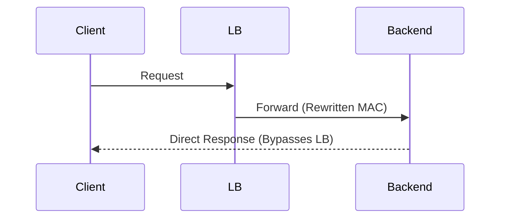
```mermaid
sequenceDiagram
    participant C as Client
    participant L as LB
    participant B as Backend
    C->>L: Request
    L->>B: Forward (Rewritten MAC)
    B-->>C: Direct Response (Bypasses LB)
```

- **Advantage:** Massive throughput, as the load balancer only processes inbound traffic, and it does not become a bandwidth bottleneck for large outbound responses like video streaming or file downloads. The asymmetry of DSR — where the load balancer sees only the inbound request while the backend's response flows directly to the client — makes it the architecture of choice for bandwidth-heavy workloads.
- **Disadvantage:** The load balancer cannot inspect or modify server responses, and backend servers must be Layer 2-adjacent to the load balancer, configured to accept traffic destined for the load balancer's IP address. This Layer 2 adjacency requirement makes DSR impractical in most cloud environments where virtual machines in different subnets cannot share a broadcast domain.

**Method 2: DNAT (Destination Network Address Translation)**
DNAT is a more common approach in cloud environments where Layer 2 adjacency is impossible.
The load balancer rewrites the destination IP address of the incoming packet to match the chosen backend server.
When the backend responds, the traffic flows back through the load balancer, which rewrites the source IP back to its own before sending it to the client (Source NAT, or SNAT).

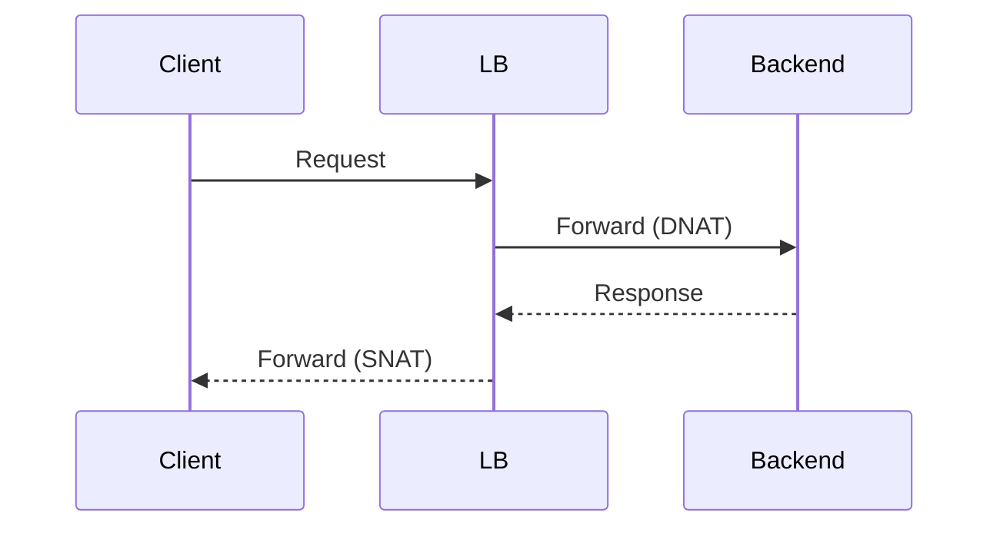
```mermaid
sequenceDiagram
    participant C as Client
    participant L as LB
    participant B as Backend
    C->>L: Request
    L->>B: Forward (DNAT)
    B-->>L: Response
    L-->>C: Forward (SNAT)
```

- **Advantage:** Works seamlessly across Layer 3 routed networks, and because the load balancer sees all bidirectional traffic, it can perform sophisticated health tracking and connection state management that would be impossible in a one-way forwarding architecture.
- **Disadvantage:** The load balancer must handle both inbound and outbound bandwidth, requiring significantly more processing power and memory to maintain a massive connection tracking table. For high-throughput applications, the load balancer's network interface becomes the ceiling on total throughput, unlike DSR where outbound traffic bypasses the balancer entirely.

**Method 3: Flow Hashing and Encapsulation**
L4 load balancers do not all share the same internal forwarding model.
AWS Network Load Balancer is a Hyperplane-based flow-hash load balancer.
It tracks TCP and UDP flows by 5-tuple and forwards packets to targets.
It preserves client source IP when configured (for example via Proxy Protocol).
NLB does not use GENEVE encapsulation — that pattern belongs to AWS Gateway Load Balancer (GWLB), which wraps traffic for inline network appliances such as firewalls and IDS sensors.

Separately, software load balancers at hyper-scale — such as Google Maglev — may encapsulate the original packet inside a new outer IP header (GRE/GUE) destined for the backend.
The backend decapsulates the packet and, similar to DSR, can often respond directly to the client.

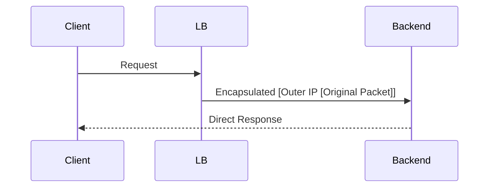
```mermaid
sequenceDiagram
    participant C as Client
    participant L as LB
    participant B as Backend
    C->>L: Request
    L->>B: Encapsulated [Outer IP [Original Packet]]
    B-->>C: Direct Response
```

**L4 Load Balancing Algorithms**

Choosing the right backend server involves applying a load balancing algorithm, and the choice has profound implications for cache efficiency, connection distribution fairness, and resilience to membership changes. Below are the core algorithms, grouped by their operational characteristics.

**Simple distribution algorithms** work well when backends are homogeneous and sessions are short-lived:

- **Round Robin** distributes connections sequentially across the server pool. It is the simplest possible algorithm and imposes near-zero computational overhead, but it ignores server capacity entirely — a backend with half the CPU of its peers receives the same connection load, creating dangerous imbalances in heterogeneous clusters.
- **Weighted Round Robin** addresses this by assigning a weight to each backend, distributing more connections to higher-capacity servers. This works well when capacity differences are static, but it cannot adapt to runtime conditions like CPU saturation or memory pressure.
- **Least Connections** routes each new connection to the backend with the fewest active TCP connections. Slow backends hold connections longer and accumulate more of them, so this algorithm sends them fewer new requests. Faster backends stay lighter and receive the overflow. This makes least-connections the default choice for workloads with widely varying request processing times, such as mixed read/write API traffic.

**Affinity-based algorithms** preserve a relationship between a specific client or resource and a specific backend:

- **Source IP Hash** computes a hash of the client's IP address modulo the number of servers, ensuring a specific client always reaches the same backend. This is stateless — any load balancer instance can independently compute the same mapping — but it breaks down when the server pool changes. Adding or removing a backend changes the modulus, reassigning roughly 90% of all clients to different backends and invalidating any per-backend caches.
- **Consistent Hashing** (ring-based implementations such as **ketama**) solves the reshuffling problem by placing both backends and hash outputs onto a conceptual ring. When a backend is added or removed, only the clients assigned to the affected region of the ring are remapped — typically a small fraction of the total. This makes consistent hashing the foundation of distributed caching systems (like CDN edge caches and Memcached clusters), where cache locality directly determines hit rate and tail latency.
- **Rendezvous hashing (Highest Random Weight / HRW)** is a separate minimal-reshuffle scheme — not a ring — that assigns each key to the backend with the highest computed weight among all candidates. Like consistent hashing, it limits remapping when membership changes, but uses a different mathematical structure.

**Power-of-two-choices** (also called "best of two") improves on purely random distribution through a remarkably simple mechanism: when a new connection arrives, the load balancer randomly selects two backends and routes the connection to the one with fewer active connections. This small amount of deliberate comparison drives the distribution toward near-optimal balance without requiring the load balancer to track the state of every backend. The theoretical result, proven by Mitzenmacher in 1996, shows that the maximum load with two choices is exponentially lower than with pure random selection — O(log log n) versus O(log n). Envoy and HAProxy both implement variants of this approach under names like "least request" or "power of two random choices."

**Maglev Hashing** is Google's consistent hashing variant, designed for the extreme case where every packet must be independently hashed at line rate on commodity hardware. Unlike traditional consistent hashing, Maglev precomputes a fixed-size lookup table on every load balancer machine. A connection's 5-tuple is hashed into this table, and table lookups are O(1) with no modulo operation. When a backend fails, only the table entries pointing to that backend are reassigned — the rest of the table stays unchanged, preserving connection affinity for the vast majority of active traffic. The Maglev design was published at NSDI 2016 and has since been adopted by Envoy and other open-source proxies, making it accessible beyond Google's infrastructure.

### 1.2 Layer 7 Load Balancing (Application Layer)

Layer 7 load balancers operate at the application layer, interacting directly with HTTP, HTTPS, and gRPC traffic.
Unlike Layer 4 balancers, they see the entire application payload, including the URL path, HTTP headers, cookies, and the request body.
To achieve this visibility, a Layer 7 load balancer must fully terminate the TCP connection and decrypt the TLS session.

This means a Layer 7 load balancer acts as a true reverse proxy, maintaining two completely separate TCP connections: one with the client and one with the backend server.


```mermaid
flowchart LR
    Client <-->|Connection A| LB
    LB <-->|Connection B| Backend
```

**Routing Capabilities**
Because they understand application semantics, Layer 7 load balancers unlock powerful routing capabilities:
- **Path-Based Routing**: Sending `/api/v1/*` to your API microservice and `/assets/*` to a static file server.
- **Host-Based Routing**: Directing `admin.example.com` to internal administration pods and `shop.example.com` to customer-facing pods.
- **Header-Based Routing**: Enabling canary deployments by routing requests with `X-Version: experimental` to a new deployment tier.
- **Cookie-Based Routing**: Inspecting session cookies to guarantee that an authenticated user is pinned to a specific backend process.

While Layer 7 load balancers offer immense flexibility, they introduce additional latency (typically 1-5ms) due to TLS decryption and HTTP parsing overhead.
They are also more computationally expensive and generally have lower maximum throughput compared to their Layer 4 counterparts.

### 1.3 L4 vs L7 Decision Matrix

When designing cloud architectures, you must evaluate the trade-offs between transport and application tier load balancing.

| Requirement | L4 | L7 |
| :--- | :--- | :--- |
| **Maximum throughput** | Best | Limited |
| **Lowest latency** | <1ms | 1-5ms |
| **HTTP path/header routing** | Can't see | Full control |
| **TLS termination** | Pass-through | Terminates |
| **WebSocket support** | Transparent | Managed |
| **gRPC load balancing** | Per-connection | Per-request |
| **Non-HTTP protocols (DB, SMTP)**| Any protocol | HTTP only |
| **Request/response modification**| No access | Full access |
| **Cookie-based session affinity**| No cookies | Cookie aware |
| **Client certificate (mTLS)** | Pass-through | Validates |
| **Health checks (HTTP)** | TCP only* | HTTP checks |
| **Connection draining** | Timer-based | Request-aware |
| **Cost** | Lower | Higher |

*\* Some L4 LBs support limited HTTP health checks*

**Common Architecture: L4 + L7 Together**
Modern Kubernetes architectures rarely choose just one tier.
The most resilient pattern is to deploy a Layer 4 load balancer (like AWS NLB) at the network edge, which then forwards traffic to a Layer 7 ingress controller (like NGINX or Envoy) running inside the cluster.


```mermaid
flowchart LR
    Client -->|TCP| NLB["NLB (L4)"]
    NLB -->|TCP + Proxy Protocol| Ingress["nginx Ingress (L7)"]
    Ingress -->|HTTP + X-Forwarded-For| Pods["Pods"]
```

This hybrid approach provides the raw throughput, static IP addresses, and DDOS protection of an L4 balancer, combined with the granular HTTP routing and TLS termination capabilities of an L7 ingress proxy.

---

## Part 2: Connection Draining

> **Pause and predict**: What happens to a 5-minute file upload if the backend server actively receiving the stream suddenly fails its load balancer health check and is removed from the target group?

### 2.1 The Problem: Killing Active Connections

Infrastructure is ephemeral.
Backend servers will be routinely removed from rotation due to failed health checks, automated scale-down events, or rolling Kubernetes deployments.
The critical question is: what happens to the active TCP connections currently being processed by the server when it is removed?

**Without Connection Draining**
If connection draining is disabled, the load balancer acts ruthlessly.
The moment a health check fails, the backend is evicted, and the load balancer immediately sends TCP RST (Reset) packets to all active client connections.
If a user is midway through a large file upload, a slow database query, or holding an open WebSocket, their connection is instantly destroyed.
This results in a flurry of user-facing 502 Bad Gateway and Connection Reset errors.

**With Connection Draining (Deregistration Delay)**
Connection draining, also known as deregistration delay, ensures graceful degradation.
When a server fails a health check or is marked for termination, it enters a "draining" state.
The load balancer immediately stops forwarding *new* requests to the server, but it allows *existing* established connections to continue communicating until they complete naturally, or until the hard timeout is reached.

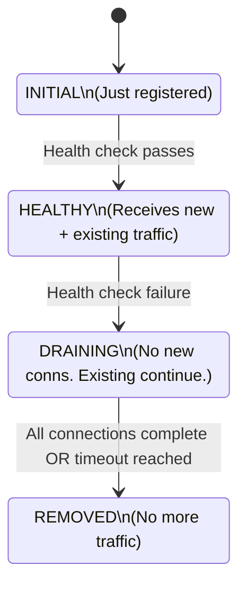
```mermaid
stateDiagram-v2
    state "INITIAL\n(Just registered)" as INITIAL
    state "HEALTHY\n(Receives new + existing traffic)" as HEALTHY
    state "DRAINING\n(No new conns. Existing continue.)" as DRAINING
    state "REMOVED\n(No more traffic)" as REMOVED

    [*] --> INITIAL
    INITIAL --> HEALTHY : Health check passes
    HEALTHY --> DRAINING : Health check failure
    DRAINING --> REMOVED : All connections complete OR timeout reached
```

**Kubernetes Graceful Shutdown Integration**
In Kubernetes, connection draining must be synchronized with pod lifecycle events.
When a pod is deleted, it enters the "Terminating" state and is sent a SIGTERM signal.
However, it can take several seconds for the `kube-proxy` rules across the cluster to update and remove the pod from the service endpoints.
If the application shuts down immediately upon receiving SIGTERM, it will drop requests that are still actively being routed to it.

To prevent this race condition, you must configure a `preStop` lifecycle hook that forces the pod to wait before shutting down, allowing the network configuration to propagate:

```yaml
lifecycle:
  preStop:
    exec:
      command: ["sh", "-c", "sleep 5"]
```

**Draining Timeout Guidelines**
Selecting the correct deregistration delay requires understanding your application's traffic profile. For fast API endpoints with sub-second response times, 30 seconds is usually sufficient to drain any in-flight requests. Standard web applications handling page renders and form submissions benefit from 60 seconds to accommodate slower network clients. Persistent WebSocket connections — which may remain open for hours carrying intermittent messages — require much longer draining windows, typically 300 seconds (5 minutes), to allow natural connection teardown. Large file upload endpoints, where a single request can span minutes of data transfer across a slow client link, demand the longest draining windows, often 600 seconds (10 minutes), to avoid truncating uploads mid-stream. The guiding principle is that the deregistration delay must exceed the maximum expected request duration for the workload served by that backend pool.

---

## Health Checks

Health checks are the load balancer's mechanism for determining whether a backend server is capable of serving traffic. Without accurate health checking, a load balancer will happily forward requests to dead, degraded, or hung backends — producing user-facing errors that could have been avoided entirely.

### Active vs Passive Health Checks

**Active health checks** are out-of-band probes that the load balancer periodically sends to each backend. These probes can range from simple TCP connection attempts (did the port accept?) to HTTP requests against a dedicated health endpoint (did `/healthz` return 200?) to application-level checks that verify deeper dependencies like database connectivity or cache warmth. Active checks provide the fastest detection of backend failure because the load balancer is constantly probing, but they add overhead: a fleet of 1,000 backends probed every 5 seconds generates 200 requests per second just for health checking, and each probe consumes a small amount of CPU and memory on the backend.

**Passive health checks** observe the results of real production traffic to infer backend health. If a backend returns a string of 5xx errors or consistently times out, the load balancer marks it unhealthy without ever sending a dedicated probe. Passive checks add zero overhead but detect failure more slowly — you must accumulate enough failing requests to cross the unhealthy threshold, and during that accumulation window, real users are experiencing errors. The most resilient architectures combine both: active checks provide a fast baseline signal while passive checks catch subtle degradation (high latency, intermittent errors) that a simple `/healthz` might miss.

### Liveness vs Readiness: The Kubernetes Model

Kubernetes formalizes a critical distinction that applies to all load-balanced systems, not just container orchestration. A **liveness probe** answers "is the process running?" — if it fails, the container is restarted. A **readiness probe** answers "can this pod accept traffic?" — if it fails, the pod is removed from the Service endpoints but the container keeps running.

The classic mistake is conflating the two. A pod might be alive (the process hasn't crashed) but not ready: it could be warming a cache, replaying a write-ahead log, or operating with a saturated thread pool that cannot accept new work. If your health check only confirms liveness, the load balancer will route traffic to pods that are alive but incapable of serving requests, generating latency spikes and errors. The readiness probe must verify the application's actual ability to process work — not just its continued existence.

### Tuning Health Check Parameters

Three parameters control the speed-versus-stability tradeoff of health checking:

- **Check interval**: How frequently the load balancer probes each backend. Shorter intervals (5 seconds) detect failure faster but generate more load on both the load balancer and the backends. Longer intervals (30 seconds) are more economical but leave unhealthy backends in rotation for longer, exposing users to errors.
- **Unhealthy threshold**: How many consecutive failures must accumulate before the backend is evicted from rotation. A threshold of 2 provides fast failover but risks evicting a backend due to a single transient network glitch. A threshold of 5 is more stable but delays eviction by up to 5 × the check interval.
- **Healthy threshold**: How many consecutive successes before a recovering backend is placed back into rotation. Setting this too low can reintroduce a flapping backend before it has truly stabilized, triggering another eviction cycle.

The most dangerous failure mode is **health check flapping**, where a backend oscillates between healthy and unhealthy because the threshold is too low relative to the check interval. Every flap triggers a connection-draining cycle: existing connections are drained, the backend is evicted, and then it recovers, re-enters rotation, receives traffic, and fails again. The system enters a destructive cycle of eviction-reentry-eviction that degrades the entire service — not just the troubled backend. The fix is to widen the unhealthy threshold, add a healthy threshold that requires sustained success, or introduce an initial delay before a newly healthy backend receives full traffic.

---

## Part 3: Session Affinity (Sticky Sessions)

> **Pause and predict**: If you scale up your backend from 3 to 10 instances during a traffic spike, but your load balancer uses cookie-based session affinity, what will happen to the load distribution across your new instances?

### 3.1 Types of Session Affinity

Session affinity, commonly referred to as "sticky sessions," is a load balancing configuration that attempts to bind a specific client to a single backend server for the duration of their session.
This is often implemented to support legacy stateful applications that store user data (like shopping carts) directly in the server's local memory.

**Source IP Affinity (L4)**
Implemented at the transport layer, the load balancer hashes the client's IP address to select a server.
While simple and efficient, it suffers from severe limitations.
If hundreds of users are operating behind a single corporate NAT gateway, they all share the same public IP and will be pinned to a single, easily overwhelmed backend server.

**Cookie-Based Affinity (L7)**
Operating at the application layer, the load balancer intercepts the first response and injects a tracking cookie (e.g., `AWSALB=server-a`).
Subsequent requests from the client include this cookie, allowing the load balancer to route them precisely.
This survives NAT translation but requires TLS termination and HTTP parsing.

**The Case Against Sticky Sessions**
While sticky sessions might seem convenient, they are a profound anti-pattern in distributed systems.
They fundamentally violate the principle of statelessness required for elastic scalability.

The most severe consequence of sticky sessions is uneven load distribution during scaling events.
If a traffic spike triggers an autoscaling event that adds five new servers, the load balancer will route *new* users to those servers.
However, all *existing* users will remain permanently glued to the original, overloaded servers.
The new servers will sit practically idle while the old servers crash under the weight of their sticky traffic.

Furthermore, if a server crashes, all users pinned to it lose their local session state completely, and the load balancer cannot redirect them to a healthy server without breaking the very session continuity that affinity was supposed to provide.

**The Cloud-Native Solution**
To build truly resilient architectures, you must decouple session state from the compute tier.
Store session data in external, low-latency datastores like Redis or Memcached.
By centralizing the state, any backend server can safely process any request from any user at any time.

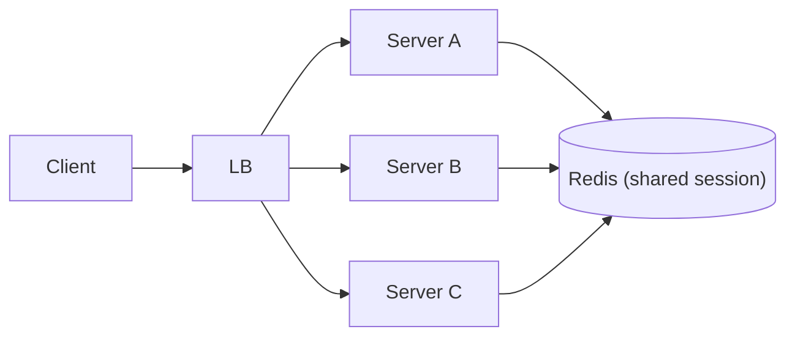
```mermaid
flowchart LR
    Client --> LB
    LB --> ServerA["Server A"]
    LB --> ServerB["Server B"]
    LB --> ServerC["Server C"]
    ServerA --> Redis[("Redis (shared session)")]
    ServerB --> Redis
    ServerC --> Redis
```

---

## Part 4: Proxy Protocol

> **Stop and think**: If an L4 load balancer simply forwards TCP packets by rewriting destination IP addresses (DNAT), what happens to the source IP address by the time the packet reaches your backend application?

### 4.1 The Client IP Problem

A fundamental challenge with network load balancing is preserving the original client's IP address.
Layer 7 load balancers solve this elegantly by injecting the `X-Forwarded-For` HTTP header.
However, Layer 4 load balancers operate below the application layer; they cannot modify HTTP headers.

Without special configuration, when a client connects to a Layer 4 proxy, the proxy must perform Source NAT (SNAT) to ensure the response routes back properly.
As a result, the backend application sees the connection originating from the load balancer's internal IP address, permanently losing the client's true identity.

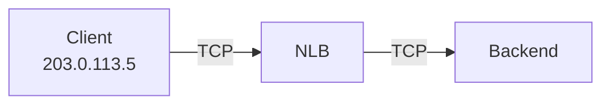
```mermaid
flowchart LR
    Client["Client\n203.0.113.5"] -- TCP --> NLB["NLB"]
    NLB -- TCP --> Backend
```

This catastrophic loss of data breaks access logging, geographic traffic analysis, rate limiting algorithms, and compliance auditing — every downstream system that depends on knowing who made the request becomes effectively blind. Without knowing the true client IP, you cannot enforce per-user rate limits, geolocate traffic for regional compliance, or trace an attack back to its source.

**The Solution: Proxy Protocol**
To solve this, the industry adopted the Proxy Protocol, originally authored by the creators of HAProxy.
Proxy Protocol is an intelligent hack: it forces the Layer 4 proxy to prepend a small packet of metadata to the very beginning of the TCP stream, immediately after the connection is established but before the application payload begins.

**Proxy Protocol v1** prepends a human-readable text string:
`PROXY TCP4 203.0.113.5 10.0.0.1 54321 443\r\n`

**Proxy Protocol v2** improves upon this by using a tightly packed binary format.
It reduces parsing overhead and supports extensibility via TLV (Type-Length-Value) fields, allowing the proxy to pass down advanced metadata such as the negotiated TLS cipher suite or internal VPC endpoint identifiers.

When implemented in a modern Kubernetes stack, the flow looks like this:

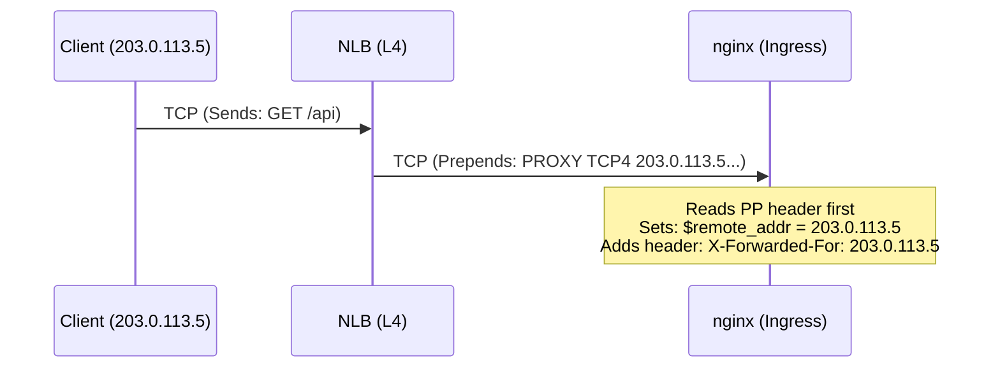
```mermaid
sequenceDiagram
    participant C as Client (203.0.113.5)
    participant N as NLB (L4)
    participant I as nginx (Ingress)
    
    C->>N: TCP (Sends: GET /api)
    N->>I: TCP (Prepends: PROXY TCP4 203.0.113.5...)
    Note over I: Reads PP header first<br>Sets: $remote_addr = 203.0.113.5<br>Adds header: X-Forwarded-For: 203.0.113.5
```

### 4.2 Proxy Protocol Configuration

Implementing Proxy Protocol requires extreme caution: both the sender (the load balancer) and the receiver (the backend proxy) must be explicitly configured to expect it.
If the load balancer sends a Proxy Protocol header, but the backend application is not configured to decode it, the application will interpret the binary header as a malformed HTTP request and instantly drop the connection.

**NGINX Configuration (Receiving Proxy Protocol)**
To configure NGINX to accept the protocol and extract the real IP:
```nginx
server {
    # Enable Proxy Protocol on the listen directive
    listen 443 ssl proxy_protocol;

    # Use the real client IP from Proxy Protocol
    set_real_ip_from 10.0.0.0/8;     # Trust NLB's IP range
    real_ip_header proxy_protocol;   # Get IP from PP header

    # Pass real IP to backend as header
    proxy_set_header X-Real-IP       $proxy_protocol_addr;
    proxy_set_header X-Forwarded-For $proxy_protocol_addr;
}
```

**HAProxy Configuration**
```haproxy
# Receiving Proxy Protocol
frontend web
    bind *:443 accept-proxy ssl crt /etc/ssl/cert.pem

# Sending Proxy Protocol to backend
backend servers
    server s1 10.0.1.5:8080 send-proxy-v2
```

**The Health Check Gotcha**
A notorious production failure involves AWS Network Load Balancers and Proxy Protocol.
When you enable Proxy Protocol on an NLB target group, the NLB prepends the header to all actual client traffic.
However, the NLB's internal health checker *does not* send the Proxy Protocol header.
If your backend strictly enforces the protocol, the health checks will fail, and the NLB will remove all servers from rotation.
To bypass this, you must configure a dedicated port exclusively for health checks that does not enforce Proxy Protocol.

---

## Part 5: Cross-Zone Load Balancing

> **Stop and think**: If enabling cross-zone load balancing distributes traffic perfectly across all backends, why do cloud providers sometimes charge extra for it, and why might you choose to leave it disabled?

### 5.1 The Cross-Zone Problem

Enterprise cloud environments deploy infrastructure across multiple isolated datacenters, known as Availability Zones (AZs), to guarantee fault tolerance.
A critical architectural decision is determining whether traffic should be allowed to cross these zone boundaries.

**Without Cross-Zone Load Balancing (Zone-Isolated)**
When cross-zone load balancing is disabled, each per-AZ load balancer node forwards traffic only to backend servers in its own AZ.
As a simplified teaching model, assume each AZ's node receives roughly half of regional traffic — actual splits vary with DNS resolver behavior, client-to-AZ affinity, and NLB per-AZ endpoint selection.

Consider a scenario where an autoscaler provisions resources unevenly: AZ-A receives 2 pods, while AZ-B receives 8 pods.
Because the load balancer nodes receive 50% of the traffic each, the two pods in AZ-A must process half of the entire region's workload.

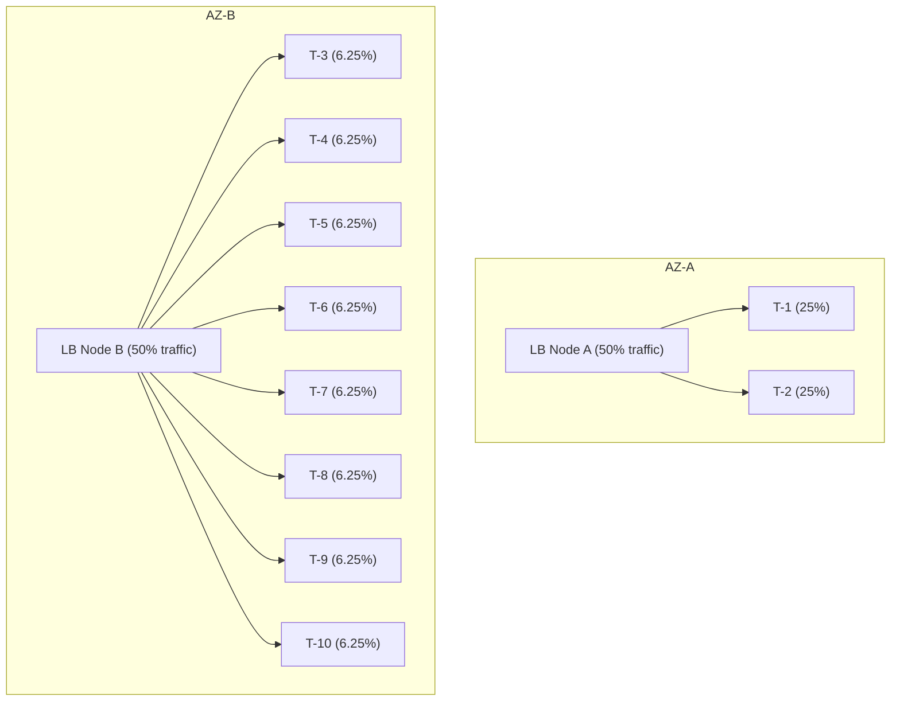
```mermaid
flowchart TD
    subgraph AZA [AZ-A]
        LBA["LB Node A (50% traffic)"]
        T1["T-1 (25%)"]
        T2["T-2 (25%)"]
        LBA --> T1
        LBA --> T2
    end
    subgraph AZB [AZ-B]
        LBB["LB Node B (50% traffic)"]
        T3["T-3 (6.25%)"]
        T4["T-4 (6.25%)"]
        T5["T-5 (6.25%)"]
        T6["T-6 (6.25%)"]
        T7["T-7 (6.25%)"]
        T8["T-8 (6.25%)"]
        T9["T-9 (6.25%)"]
        T10["T-10 (6.25%)"]
        LBB --> T3 & T4 & T5 & T6 & T7 & T8 & T9 & T10
    end
```

This drastic imbalance will rapidly exhaust the CPU resources of the AZ-A pods, triggering localized failures.

**With Cross-Zone Load Balancing**
Enabling cross-zone load balancing forces the load balancer nodes to evaluate the entire regional pool of backend servers, disregarding AZ boundaries.
Every backend server, regardless of location, receives an equal slice of the traffic.

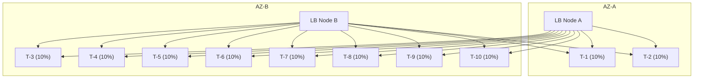
```mermaid
flowchart TD
    subgraph AZA [AZ-A]
        LBA["LB Node A"]
        T1["T-1 (10%)"]
        T2["T-2 (10%)"]
    end
    subgraph AZB [AZ-B]
        LBB["LB Node B"]
        T3["T-3 (10%)"]
        T4["T-4 (10%)"]
        T5["T-5 (10%)"]
        T6["T-6 (10%)"]
        T7["T-7 (10%)"]
        T8["T-8 (10%)"]
        T9["T-9 (10%)"]
        T10["T-10 (10%)"]
    end
    LBA --> T1 & T2 & T3 & T4 & T5 & T6 & T7 & T8 & T9 & T10
    LBB --> T1 & T2 & T3 & T4 & T5 & T6 & T7 & T8 & T9 & T10
```

**The Cost and Reliability Trade-Offs**
While cross-zone load balancing prevents hot spots, it introduces two significant challenges.
First, transferring data between Availability Zones incurs monetary charges, which can quickly escalate into thousands of dollars for bandwidth-heavy applications.
Second, it compromises the isolation of failure domains.
If a network partition occurs between AZs, cross-zone routing might attempt to forward packets into a black hole, exacerbating the outage.
For this reason, AWS Application Load Balancers enable cross-zone by default, while Network Load Balancers leave it disabled, forcing engineers to explicitly opt-in.

---

## Part 6: Cloud Load Balancer Architectures

> **Pause and predict**: If a cloud load balancer uses consistent hashing to map flows to backend servers, what happens to existing active connections mapped to Server A if Server B crashes?

### 6.1 AWS Load Balancers

Amazon Web Services offers two primary load balancer types, each backed by radically different internal architectures.

**Network Load Balancer (NLB)**
Operating at Layer 4, the NLB is engineered for extreme performance, capable of sustaining millions of requests per second with latency measured in the single-digit microseconds.
Unlike traditional load balancers running on dedicated virtual machines, the NLB is powered by AWS Hyperplane, a distributed, software-defined network state tracker embedded directly into the physical network fabric of the data center.
Because it integrates at the fabric layer, an NLB guarantees static Elastic IP addresses per Availability Zone, making it ideal for enterprise environments requiring strict firewall allowlisting.

**Application Load Balancer (ALB)**
The ALB operates at Layer 7 and focuses on complex HTTP inspection.
It supports advanced features like native OIDC authentication, deep integration with Web Application Firewalls (WAF), and precise header modification.
Unlike the NLB, the ALB relies on dynamic IP addresses managed through DNS records, which can shift without warning during scaling events.

### 6.2 Google Maglev

Google Cloud's approach to load balancing is fundamentally software-defined, driven by a proprietary system known as Maglev.

**Architecture**
Maglev abandons hardware load balancers entirely.
Instead, it utilizes a massive fleet of standard Linux machines operating at the edge of Google's global network.

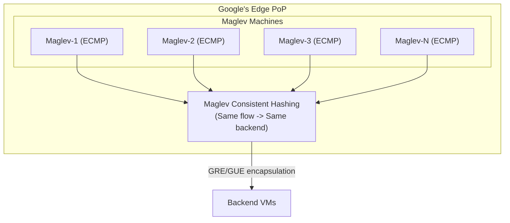
```mermaid
flowchart TD
    subgraph EdgePoP [Google's Edge PoP]
        subgraph Maglevs [Maglev Machines]
            M1["Maglev-1 (ECMP)"]
            M2["Maglev-2 (ECMP)"]
            M3["Maglev-3 (ECMP)"]
            MN["Maglev-N (ECMP)"]
        end
        Hash["Maglev Consistent Hashing<br>(Same flow -> Same backend)"]
        M1 --> Hash
        M2 --> Hash
        M3 --> Hash
        MN --> Hash
    end
    Hash -->|GRE/GUE encapsulation| BackendVMs["Backend VMs"]
```

Incoming traffic reaches Google's edge routers, which use Equal-Cost Multi-Path (ECMP) routing to spray packets evenly across the fleet of Maglev machines.
Because packets from the same TCP connection might land on different Maglev nodes, the system requires a rock-solid mathematical guarantee that every node will independently arrive at the same backend routing decision.

This is achieved through Maglev Consistent Hashing.
Every machine maintains an identical lookup table mapping the TCP 5-tuple to specific backend virtual machines.
When a backend fails, the algorithm recalculates, but it mathematically minimizes the disruption—only the specific connections mapped to the dead server are re-routed, ensuring the vast majority of active traffic remains undisturbed.

### 6.3 Kubernetes Load Balancing

Within a Kubernetes cluster, load balancing manifests through several distinct layers of abstraction.

**ClusterIP (Internal L4)**
The foundational service type, ClusterIP, provisions a virtual IP address inside the cluster network.
Traffic sent to this IP is intercepted by `kube-proxy`, which uses `iptables` or IPVS rules to distribute the packets across healthy pods.
IPVS is highly recommended for massive clusters, as it replaces linear `iptables` rule evaluation with O(1) hash table lookups, drastically reducing CPU overhead.

**LoadBalancer Services**
When a service is exposed as a LoadBalancer, a cloud controller manager provisions external infrastructure, such as an AWS NLB, to route external traffic into the cluster.
The configuration is driven extensively by metadata annotations:

```yaml
# AWS NLB
service.beta.kubernetes.io/aws-load-balancer-type: "nlb"
service.beta.kubernetes.io/aws-load-balancer-proxy-protocol: "*"
service.beta.kubernetes.io/aws-load-balancer-cross-zone-load-balancing-enabled: "true"

# Target type (instance vs ip)
service.beta.kubernetes.io/aws-load-balancer-nlb-target-type: "ip"
```

Historically, traffic entered via `instance` mode, hitting an arbitrary NodePort before being routed to a pod, which caused an unnecessary network hop and obfuscated the client IP via SNAT.
Modern architectures utilize `ip` mode (direct pod routing via the VPC CNI) to bypass the node layer entirely, improving latency and simplifying IP preservation.

---

## Part 7: Diagnosing with Connection-Level Metrics

When an application experiences instability behind a load balancer, standard application logs often paint an incomplete picture.
If an application container hangs or the network fabric drops packets, the HTTP request might never reach your application logging middleware.
To effectively diagnose complex failures, you must analyze telemetry at the transport layer using connection-level metrics.

**Understanding Core Telemetry**
Cloud providers surface several critical metrics that provide direct insight into TCP health:
- **ActiveConnectionCount**: Represents the total volume of concurrent TCP connections maintained by the load balancer. A sudden, massive spike without a corresponding increase in raw HTTP requests often indicates that backend servers are failing to close connections, potentially due to application thread exhaustion or database deadlocks.
- **NewConnectionCount**: Tracks the rate of newly established TCP sessions. An abnormally high rate suggests that clients are repeatedly opening and closing connections rather than utilizing HTTP keep-alives (connection pooling). This rapid churn wastes immense CPU cycles on TLS handshake overhead.
- **TCP_Client_Reset_Count**: Measures the volume of TCP RST (Reset) packets sent by the client. High values typically mean users are abandoning the application—closing their browsers or terminating their scripts—because the backend is taking too long to respond.
- **TCP_Target_Reset_Count**: Measures RST packets originating from your backend servers. This is almost always a configuration flaw, commonly triggered by mismatched idle timeouts.

**Hypothetical scenario: The Silent Idle Timeout Mismatch**
A classic, elusive production outage occurs when load balancer timeouts drift out of sync with application timeouts. As a teaching scenario, consider a setup where a cloud L7 load balancer has an idle connection timeout configured to 350 seconds, but the upstream backend server defaults to a strict 120-second idle timeout.

A client opens a persistent connection, executes an API call, and goes idle. At the 120-second mark, the backend server decides the connection is stale and silently drops it internally. However, the load balancer remains unaware, keeping its side of the connection open to the client. At roughly the 200-second mark, the client attempts to reuse the connection and fires a new HTTP request. The load balancer forwards this request down the existing socket, but the backend server rejects it immediately with a TCP RST, as it believes the socket is closed.

The load balancer, receiving the reset, generates an immediate 502 Bad Gateway error to the client. If your service handles thousands of concurrent persistent connections, this timeout mismatch can silently cause a failure rate of several percent — enough to degrade user experience without triggering any obvious alert. The fix is an absolute rule of infrastructure engineering: your backend application's idle timeout must always be explicitly configured to be strictly longer than the load balancer's idle timeout.

---

## Part 8: Global Server Load Balancing (GSLB)

As a distributed system scales internationally, routing all global traffic to a single cloud region introduces severe latency penalties and creates a catastrophic single point of failure.
Global Server Load Balancing (GSLB) mitigates this risk by dynamically routing users across multiple geographically disparate datacenters.

**The Mechanics of DNS-Based Routing**
Unlike traditional Layer 4 or Layer 7 load balancers that proxy raw network traffic, GSLB is fundamentally an intelligent DNS resolution layer augmented with global health probing.
When a user attempts to access `api.example.com`, their request hits a GSLB service (such as AWS Route 53, NS1, or Cloudflare).

The GSLB evaluates the request against a matrix of routing policies:
- **Latency-Based Routing**: The GSLB analyzes the geographic origin of the DNS query and resolves the domain to the IP address of the regional load balancer that will provide the lowest millisecond latency for that specific user.
- **Health-Aware Failover**: The GSLB constantly executes synthetic probes against all regional endpoints from dozens of global vantage points. If the primary `eu-central-1` ingress controller stops returning `200 OK` HTTP responses, the GSLB immediately pulls that IP address from the DNS rotation, failing all European traffic over to `us-east-1`.
- **Weighted Traffic Splitting**: Engineers can leverage GSLB to route 95% of traffic to their primary region and 5% to a disaster recovery region, ensuring the backup infrastructure is continuously validated by live traffic.

**Engineering for Split-Brain Scenarios**
Implementing GSLB introduces profound architectural complexity, most notably the risk of "split-brain" divergence.
Consider an active-active global architecture backed by a synchronously replicated multi-region database.
If the inter-region fiber optic link is severed, but the application servers in both regions remain perfectly healthy, the GSLB will continue to route users to both datacenters.
Because the datacenters can no longer synchronize with each other, they begin processing conflicting transactions, irrevocably corrupting the global data state.

To prevent split-brain disasters, GSLB health checks must evaluate extreme depth.
A simple check that confirms if the web server is running is dangerously insufficient.
The health endpoint must actively validate the application's ability to communicate with the local persistence tier *and* confirm that the persistence tier is successfully replicating data to the global quorum.
If replication fails, the region must proactively declare itself unhealthy, forcing the GSLB to safely evacuate all traffic.

---

## Load Balancing Failure Modes

Load balancers solve distribution problems but introduce their own failure modes. Understanding these patterns — and the mitigation strategies — separates reliable systems from brittle ones.

### Thundering Herd

A thundering herd occurs when many clients simultaneously discover that a cached resource has expired or a backend has recovered, and they all rush to the same backend at once. The sudden spike in connections overwhelms the backend before it can stabilize.

Consider a CDN edge cache that expires a popular asset. Hundreds of edge nodes simultaneously forward requests to the origin server, which was sized for steady-state traffic — not a flash flood. The origin collapses under the combined load, the CDN cannot refresh the cache because the origin is down, and the asset remains unavailable even though the underlying server is fundamentally healthy. The load balancer itself becomes the funnel through which the stampede reaches the backend.

Mitigation strategies include **request collapsing** (the load balancer coalesces identical concurrent requests and fans out a single upstream request, distributing the result to all waiting clients), **consistent hashing** (which naturally pins the same resource to the same backend, containing the blast radius to one backend rather than all of them), and **staggered TTLs** on caches (adding a small random jitter to expiry times so they don't all expire simultaneously).

### Retry Storms

When a backend starts returning errors, well-intentioned clients often retry — and when their retries also fail, they retry again. Each retry multiplies the load on an already-struggling system. A single failed request can cascade into a flood if every layer in the stack (client SDK, service mesh sidecar, ingress proxy) independently retries, turning a 1× failure into a 9× or 27× amplification of the original request rate.

The fix is **exponential backoff with jitter**. Rather than retrying immediately, the client waits: 100 ms, then 200 ms, then 400 ms, then 800 ms, with a small random component added to each interval. This spreads retries across time rather than concentrating them into synchronized bursts that recreate the thundering herd problem at a different layer. Additionally, **circuit breaking** at the load balancer layer stops forwarding requests to a backend that consistently fails, giving it time to recover rather than drowning it in the very retries meant to restore service.

### The Load Balancer as a Single Point of Failure

There is a deep irony in load balancing: the component designed to eliminate single points of failure can itself become the most dangerous one. A single load balancer instance, no matter how powerful or well-engineered, is a failure domain of size one.

The standard mitigations require explicit architectural commitment. Deploy load balancers in **high-availability pairs** using protocols like VRRP (Virtual Router Redundancy Protocol) to float a virtual IP between active and standby instances — if the active fails, the standby assumes the IP within seconds. At cloud scale, use **Anycast** to announce the same load balancer IP from multiple independent instances in different physical locations; if one instance fails, BGP withdraws its route and traffic automatically shifts to the survivors without any client-side reconfiguration. Within Kubernetes, running multiple ingress controller replicas with pod anti-affinity across nodes and availability zones prevents a single rack or power feed failure from taking down all ingress capacity.

---

## Patterns & Anti-Patterns

### Patterns

1. **L4 at the edge, L7 inside** — Deploy a high-throughput L4 load balancer (handling TCP, static IPs, DDoS absorption) at the network boundary, forwarding to L7 proxies inside the trusted network that handle HTTP routing, TLS termination, and header manipulation. This layering gives you the strengths of both tiers without forcing either tier to do everything.

2. **Stateless backends with external session storage** — Decouple user session state from compute instances by storing sessions in Redis, Memcached, or a database. Any backend can serve any request, eliminating the need for sticky sessions and enabling seamless horizontal scaling without the uneven load distribution that affinity creates.

3. **Deep health checks for global routing** — A health check that merely confirms the web server process is running is dangerously insufficient for multi-region deployments. The health endpoint must verify that the local persistence tier is reachable, replication is current, and critical downstream dependencies are healthy. A region with a severed database link should declare itself unhealthy and voluntarily exit the GSLB rotation.

4. **Graceful shutdown with connection draining** — Every backend should implement a shutdown sequence that stops accepting new connections, completes in-flight requests, and only then exits. Paired with load balancer deregistration delay, this ensures zero-downtime deployments where no user request is dropped during a rollout.

5. **Circuit breaking at every hop** — Every service-to-service call should be wrapped in a circuit breaker that opens when the downstream error rate exceeds a threshold. This prevents cascading failures where a slow dependency saturates thread pools across the entire call chain, turning a localized outage into a system-wide collapse.

### Anti-Patterns

1. **Sticky sessions as a substitute for state management** — Pinning users to specific backends masks the absence of a shared session store. The moment that backend fails, all pinned users lose their state. Sticky sessions create uneven load distribution and defeat horizontal scaling by trapping existing users on overloaded instances.

2. **Identical health check and liveness probe** — Using the same endpoint for both conflates "the process is alive" with "the process can serve traffic." A saturated thread pool, a cold cache, or a disconnected database all produce a living process that should not receive requests. Separate the two checks.

3. **No idle timeout coordination** — Configuring the load balancer's idle timeout independently of the backend's keepalive timeout creates a gap where the backend has already closed the socket but the load balancer still forwards requests down it, generating 502 errors for otherwise healthy traffic. Always ensure backend timeout exceeds load balancer timeout.

4. **Single load balancer instance in production** — A lone load balancer instance, regardless of vendor reliability claims, represents an unacceptable single point of failure. Always deploy at least two instances with automated failover, whether through VRRP, Anycast, or cloud-provider managed high availability.

---

## Decision Framework

Choosing the right load balancing strategy requires evaluating your workload across several dimensions. The flowchart below walks through the key decisions, from protocol type through algorithm selection to global routing strategy:

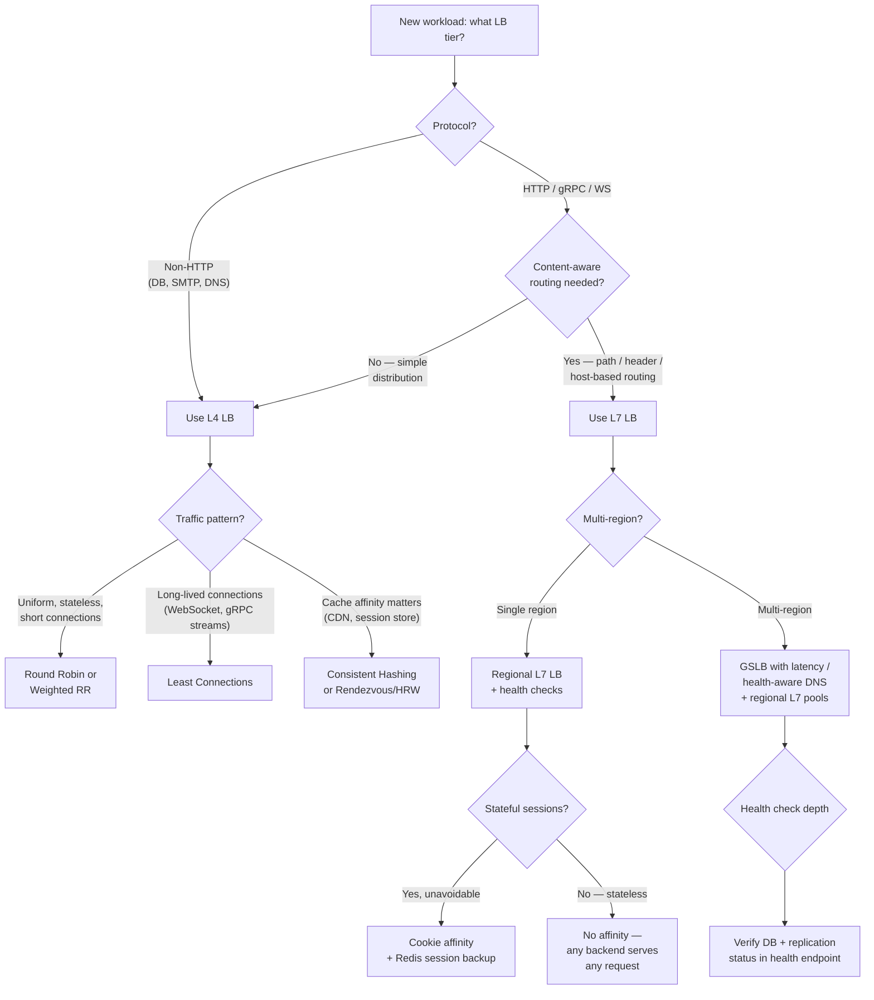
```mermaid
flowchart TD
    Start["New workload: what LB tier?"] --> Proto{"Protocol?"}
    Proto -->|"Non-HTTP\n(DB, SMTP, DNS)"| L4["Use L4 LB"]
    Proto -->|"HTTP / gRPC / WS"| Content{"Content-aware\nrouting needed?"}
    Content -->|"No — simple\ndistribution"| L4
    Content -->|"Yes — path / header /\nhost-based routing"| L7["Use L7 LB"]
    
    L4 --> Algo{"Traffic pattern?"}
    Algo -->|"Uniform, stateless,\nshort connections"| RR["Round Robin or\nWeighted RR"]
    Algo -->|"Long-lived connections\n(WebSocket, gRPC streams)"| LC["Least Connections"]
    Algo -->|"Cache affinity matters\n(CDN, session store)"| CH["Consistent Hashing\nor Rendezvous/HRW"]
    
    L7 --> Global{"Multi-region?"}
    Global -->|"Single region"| Region["Regional L7 LB\n+ health checks"]
    Global -->|"Multi-region"| GSLB["GSLB with latency /\nhealth-aware DNS\n+ regional L7 pools"]
    
    Region --> Affinity{"Stateful sessions?"}
    Affinity -->|"Yes, unavoidable"| Sticky["Cookie affinity\n+ Redis session backup"]
    Affinity -->|"No — stateless"| Stateless["No affinity —\nany backend serves\nany request"]
    
    GSLB --> Health{"Health check depth"}
    Health --> Deep["Verify DB + replication\nstatus in health endpoint"]
```

The dimensional matrix below captures the tradeoffs for the three major LB tiers:

| Dimension | L4 (TCP/UDP) | L7 (HTTP/gRPC) | GSLB (DNS) |
|-----------|-------------|----------------|------------|
| **Throughput** | Millions CPS | Thousands RPS | N/A (resolution only) |
| **Latency added** | <1 ms | 1–5 ms | Tens to hundreds of ms (DNS lookup, cache miss, TTL) |
| **Content routing** | None | Full (path, header, cookie) | Region-level only |
| **Health granularity** | TCP connect / port | HTTP status, body match | Deep application health |
| **Session affinity** | Source IP hash | Cookie injection | Region pinning |
| **Failure scope** | Per-backend | Per-backend + per-path | Per-region |
| **Cost** | Lower | Medium | Medium–High (probes) |

---

## Landscape Snapshot — as of 2026-06

> **This changes fast; verify against vendor docs before relying on specifics.** This snapshot maps durable load balancing capabilities to current (mid-2026) vendor implementations. It is a starting point for product selection, not a permanent reference.

### Cross-Vendor Rosetta Table

| Capability | AWS | GCP | Azure | Open Source |
|-----------|-----|-----|-------|-------------|
| **L4 LB (TCP/UDP)** | NLB (Hyperplane-based, static EIPs, cross-zone optional) | External TCP/UDP Network LB (Maglev-backed, global or regional) | Azure Load Balancer (Basic/Standard SKU, HA ports) | HAProxy (TCP mode), Envoy (TCP proxy), IPVS, BIRD |
| **L7 LB (HTTP/gRPC)** | ALB (path/host/header routing, OIDC, WAF integration) | External HTTP(S) LB (global, URL map routing, Cloud Armor) | Application Gateway v2 (WAF, path/host routing, cookie affinity, autoscaling) | Envoy, NGINX, HAProxy, Traefik, Caddy |
| **Global LB** | Global Accelerator (Anycast, static IPs) + Route 53 (latency/geo/weighted routing) | Global external HTTP(S) LB (single Anycast IP, cross-region) | Front Door (Anycast, global HTTP routing, WAF) + Traffic Manager (DNS) | BIRD/FRRouting + Anycast (DIY), PowerDNS + Lua records |
| **Algorithm options** | NLB: flow hash (5-tuple). ALB: round robin, least outstanding requests | Round robin (configurable session affinity via client IP or cookie) | Source IP hash (default), session persistence (client IP / protocol) | HAProxy: RR, leastconn, source, URI, random. Envoy: RR, least request, ring hash, Maglev, random |
| **Health check types** | TCP, HTTP, HTTPS, gRPC (ALB); TCP, HTTP, HTTPS (NLB target groups) | TCP, HTTP, HTTPS, HTTP/2, gRPC | TCP, HTTP, HTTPS | HAProxy: TCP, HTTP, MySQL, PostgreSQL, Redis, LDAP, script. Envoy: HTTP, gRPC, TCP, custom |
| **Proxy Protocol** | NLB supports PP v2 on target groups | Supported on external TCP proxy LB | Not natively supported on Azure LB; Application Gateway uses X-Forwarded-For | HAProxy (v1/v2 send + receive), NGINX (receive), Envoy (receive via listener filter) |
| **Connection draining** | Deregistration delay (1–3,600 s) + termination grace (ALB) | Connection draining timeout (0–3,600 s) | Drain timeout on backend pool removal | HAProxy: `hard-stop-after`, Envoy: drain listeners, NGINX: `worker_shutdown_timeout` |
| **Idle timeout (default)** | NLB: 350 s (TCP/TLS; TCP configurable 60–6000 s). UDP: 120 s (fixed). ALB: 60 s | TCP LB: 600 s. HTTP LB: 600 s (backend), configurable frontend | Azure LB: 4 min (default), 4–30 min configurable. App Gateway: 20 s (frontend), 30 s (backend) | Envoy: 1 h (default stream). HAProxy: `timeout client`/`timeout server`. NGINX: `keepalive_timeout` 75 s |

> **Key volatility points (2026-06):** GCP recently introduced regional external proxy Network LB with support for Proxy Protocol. Azure Front Door still does not support Proxy Protocol natively — rely on X-Forwarded-For at the L7 layer. Envoy 1.32+ includes an improved Maglev implementation from the original Google NSDI paper. AWS Gateway Load Balancer (GWLB) with GENEVE encapsulation is the newest tier, designed for inline network appliance insertion (firewalls, IDS/IPS) — it does not compete with NLB/ALB for application traffic routing.

---

## Did You Know?

- **Google's Maglev handles all of Google's external traffic** — every search query, YouTube video, Gmail message, and Cloud Platform API call passes through Maglev. At peak, this is millions of packets per second per machine, across hundreds of machines at each of Google's edge PoPs. The design was published in a 2016 NSDI paper that has become a reference for building software load balancers.
- **AWS NLB can handle millions of requests per second with single-digit microsecond latency** because it runs on Hyperplane, AWS's internal software-defined networking platform. Unlike ALB, which runs on EC2 instances, NLB is embedded in the network fabric itself. This is why NLB supports static Elastic IPs while ALB's IPs are dynamic — they're fundamentally different architectures.
- **The Proxy Protocol specification was created by Willy Tarreau, the author of HAProxy, in 2010.** What started as a simple solution for HAProxy has become an industry standard supported by every major load balancer, web server, and CDN. Version 2 added binary encoding and TLV extensions that carry TLS metadata, AWS VPC information, and custom application data — far beyond the original "just pass the client IP" use case.
- **Kubernetes introduced IPVS-based load balancing for kube-proxy in version 1.11 (released in 2018),** which revolutionized cluster networking. It allowed enterprise clusters to seamlessly scale past 10,000 internal services by replacing CPU-intensive linear `iptables` rule evaluations with blazing-fast O(1) hash table lookups.

---

## Common Mistakes

| Mistake | Problem | Solution |
|---------|---------|----------|
| No connection draining configured | Active requests dropped during deployments | Set deregistration delay (at least 30s for API, 60s for web apps, 300s for WebSockets) |
| Proxy Protocol mismatch | Backend expects PP but LB doesn't send (or vice versa) → connection failures | Enable/disable on BOTH sides simultaneously; use a separate health check port if NLB health probes don't send PP |
| Sticky sessions hiding backend failures | Unhealthy server keeps receiving sticky traffic | Always combine stickiness with health checks; prefer shared session store over affinity |
| Cross-zone off with uneven target distribution | Some targets get 3-4x more traffic than others, creating hotspots | Either enable cross-zone or ensure equal targets per AZ through topology-aware scheduling |
| Not setting `externalTrafficPolicy: Local` | Client IP lost due to SNAT on the second hop | Set to Local (but ensure pods exist on all receiving nodes, or use pod anti-affinity) |
| Ingress controller without readiness gates | Pods receive traffic before they're ready | Use pod readiness gates tied to LB target group health |
| Ignoring idle timeout configuration | Long-lived connections (WebSocket, SSE) silently dropped at default timeout | Set idle timeout appropriately for your workload; always keep backend timeout > LB timeout |

---

## Quiz

1. **You are designing an architecture for a new microservice that needs to route traffic based on the `/api/v2` URL path, but your team insists on using a high-throughput L4 load balancer to minimize latency. Why will this approach fail, and what is the fundamental architectural difference preventing it?**
   <details>
   <summary>Answer</summary>

   This approach will fail because an L4 load balancer operates exclusively at the transport layer (TCP/UDP) and cannot read or route based on HTTP paths. L4 balancers see only the 5-tuple (source IP, source port, destination IP, destination port, and protocol) and forward raw TCP streams without terminating the connection or decrypting TLS. In contrast, an L7 load balancer operates at the application layer, fully terminating the TCP and TLS connections to parse the HTTP request. Because the URL path `/api/v2` is encrypted inside the TLS payload of the HTTP request, an L4 load balancer simply cannot access this data to make routing decisions.
   </details>

2. **During a routine midday deployment, your monitoring system alerts you that hundreds of users are receiving abrupt "connection reset" errors. You discover your load balancer's deregistration delay (connection draining) is set to 5 seconds. Why is this specific configuration causing the errors, and what is happening to the active connections?**
   <details>
   <summary>Answer</summary>

   The 5-second deregistration delay is causing these errors because it forces the load balancer to forcefully sever any connection that takes longer than 5 seconds to complete after a backend is marked for removal. During a deployment, older pods are removed from the load balancer and placed into a "draining" state, where they stop receiving new requests but are expected to finish existing ones. If a user is downloading a large file, executing a slow database query, or maintaining a long-lived WebSocket connection, 5 seconds is insufficient time for the request to naturally complete. Consequently, the load balancer abruptly drops these in-flight connections once the brief timeout is reached, resulting in the "connection reset" errors seen by the users.
   </details>

3. **Your team is migrating a legacy e-commerce application to Kubernetes and a senior engineer suggests enabling sticky sessions on the load balancer so users don't lose their shopping carts during pod restarts. Why is this considered a cloud-native anti-pattern, and what operational risks does it introduce during scaling events?**
   <details>
   <summary>Answer</summary>

   Sticky sessions are considered an anti-pattern in modern cloud-native architectures because they tightly couple a user's session state to a specific ephemeral pod, undermining the fundamental principle of statelessness. When scaling events occur, sticky sessions create severe operational risks such as uneven load distribution, where popular users become trapped on a single overloaded pod while newly provisioned pods sit idle. Furthermore, if a pod crashes or restarts, all users pinned to that pod immediately lose their session data (like their shopping carts) and must re-establish their connections on a new pod. A far more resilient and scalable approach is to store session state in an external, distributed datastore like Redis, enabling any backend pod to safely handle any user's request.
   </details>

4. **You configure an AWS Network Load Balancer (NLB) with Proxy Protocol v2 enabled, but your backend application shows the NLB's internal IP in access logs instead of the true client IP. What are the most likely causes of this discrepancy, and why does it happen?**
   <details>
   <summary>Answer</summary>

   The most likely cause is that the backend application (or an intermediate proxy like an ingress controller) has not been explicitly configured to expect and parse the Proxy Protocol header. Proxy Protocol v2 prepends a binary header to the beginning of the TCP stream, and if the backend does not decode this header, it will simply fall back to reading the TCP source IP, which belongs to the NLB. Another possible cause is that the Proxy Protocol setting was enabled on the NLB listener but not explicitly on the target group, preventing the NLB from injecting the header in the first place. Finally, an intermediate proxy (like kube-proxy in iptables mode) might be stripping the header before it reaches the application, meaning the entire chain must be configured to pass or translate the client IP.
   </details>

5. **You have deployed an application across two Availability Zones: 2 pods in AZ-A and 6 pods in AZ-B. Your Network Load Balancer has cross-zone load balancing disabled to save on data transfer costs. Suddenly, the pods in AZ-A start crashing from CPU exhaustion while AZ-B pods are mostly idle. What percentage of the total traffic is each pod receiving, and why did this configuration cause the outage?**
   <details>
   <summary>Answer</summary>

   With cross-zone load balancing disabled, each AZ's load balancer node forwards only to targets in its own zone.
   In the simplified teaching model from Part 5, AZ-A and AZ-B each receive roughly 50% of regional traffic — actual splits vary with resolver behavior and client affinity.
   Because there are only 2 pods in AZ-A, each of those pods must handle about 25% of the overall traffic load.
   In contrast, the 6 pods in AZ-B share their 50% evenly, meaning each pod in AZ-B handles roughly 8.3% of the traffic.
   This immense imbalance forced the pods in AZ-A to process three times the traffic volume of their counterparts in AZ-B, rapidly exhausting their CPU resources and causing the cascading failure.
   </details>

6. **You configure a NodePort service in your cluster to receive external traffic, but a security audit reveals that the application logs show all requests coming from internal node IPs rather than the actual external client IPs. You apply `externalTrafficPolicy: Local` to fix this, but now some connections are being completely refused. Explain the original "double-hop" mechanism that hid the IPs, how the new policy fixed it, and why connections are now failing.**
   <details>
   <summary>Answer</summary>

   The original "double-hop" issue occurred because kube-proxy randomly routes NodePort traffic to any pod in the cluster, meaning traffic hitting Node A might be forwarded to a pod on Node B. To ensure the response routes back properly, kube-proxy performs Source NAT (SNAT), replacing the client's external IP with Node A's internal IP. Applying `externalTrafficPolicy: Local` solves the SNAT problem by forcing kube-proxy to only route traffic to pods located on the same node that initially received the request, thereby preserving the original client IP. However, this introduces a new failure mode: if external traffic hits a node that happens to have zero instances of your application pod running locally, that node has nowhere to route the traffic and immediately drops or refuses the connection.
   </details>

---

## Hands-On Exercise

**Objective**: Deploy nginx Ingress on a kind cluster, verify client IP preservation via `X-Forwarded-For`, observe load balancing across replicas, and test connection draining and session affinity.

**Environment**: kind cluster + ingress-nginx (in-cluster ClusterIP access from test pods)

> **Note on Proxy Protocol**: Production L4→L7 stacks often place an NLB or HAProxy in front of ingress-nginx with Proxy Protocol enabled. This lab uses direct ingress access inside the cluster — the standard path for kind — so you observe `X-Forwarded-For` propagation without an L4 PROXY sender. The Proxy Protocol mechanics from Part 4 apply when you add an external NLB later.

### Part 1: Create the Cluster (10 minutes)

```bash
cat <<'EOF' > /tmp/lb-lab-cluster.yaml
kind: Cluster
apiVersion: kind.x-k8s.io/v1alpha4
nodes:
  - role: control-plane
    kubeadmConfigPatches:
      - |
        kind: InitConfiguration
        nodeRegistration:
          kubeletExtraArgs:
            node-labels: "ingress-ready=true"
    extraPortMappings:
      - containerPort: 80
        hostPort: 80
        protocol: TCP
      - containerPort: 443
        hostPort: 443
        protocol: TCP
  - role: worker
  - role: worker
EOF

kind create cluster --name lb-lab --config /tmp/lb-lab-cluster.yaml --image=kindest/node:v1.35.0
```

### Part 2: Deploy nginx Ingress Controller (15 minutes)

```bash
# Install nginx Ingress Controller (kind manifest exposes NodePort on the control-plane node)
kubectl apply -f https://raw.githubusercontent.com/kubernetes/ingress-nginx/controller-v1.12.0/deploy/static/provider/kind/deploy.yaml

# Wait for ingress controller to be ready
kubectl wait --namespace ingress-nginx \
  --for=condition=ready pod \
  --selector=app.kubernetes.io/component=controller \
  --timeout=120s

# Wait for the admission webhook bootstrap jobs before creating any Ingress objects
kubectl wait --namespace ingress-nginx \
  --for=condition=complete job/ingress-nginx-admission-create \
  --timeout=120s
kubectl wait --namespace ingress-nginx \
  --for=condition=complete job/ingress-nginx-admission-patch \
  --timeout=120s

# Enable forwarded-client-IP handling (no Proxy Protocol — nothing in this lab sends PROXY headers)
cat <<'EOF' | kubectl apply -f -
apiVersion: v1
kind: ConfigMap
metadata:
  name: ingress-nginx-controller
  namespace: ingress-nginx
data:
  compute-full-forwarded-for: "true"
  use-forwarded-headers: "true"
  proxy-real-ip-cidr: "0.0.0.0/0"
EOF

# Restart the ingress controller to pick up the config
kubectl rollout restart deployment ingress-nginx-controller -n ingress-nginx
kubectl rollout status deployment ingress-nginx-controller -n ingress-nginx
kubectl wait --namespace ingress-nginx \
  --for=condition=ready pod \
  --selector=app.kubernetes.io/component=controller \
  --timeout=120s
sleep 10
```

### Part 3: Deploy Backend Application with IP Logging (10 minutes)

```bash
cat <<'EOF' | kubectl apply -f -
apiVersion: v1
kind: ConfigMap
metadata:
  name: ip-logger-code
data:
  server.py: |
    from http.server import HTTPServer, BaseHTTPRequestHandler
    import json
    import os

    class Handler(BaseHTTPRequestHandler):
        def do_GET(self):
            # Collect all IP-related headers
            ip_info = {
                "pod_name": os.environ.get("HOSTNAME", "unknown"),
                "remote_addr": self.client_address[0],
                "x_forwarded_for": self.headers.get("X-Forwarded-For", "not set"),
                "x_real_ip": self.headers.get("X-Real-IP", "not set"),
                "x_forwarded_proto": self.headers.get("X-Forwarded-Proto", "not set"),
                "all_headers": dict(self.headers),
            }

            self.send_response(200)
            self.send_header("Content-Type", "application/json")
            self.end_headers()
            self.wfile.write(json.dumps(ip_info, indent=2).encode())

        def log_message(self, format, *args):
            xff = self.headers.get("X-Forwarded-For", "-") if hasattr(self, 'headers') else "-"
            print(f"[{self.client_address[0]}] XFF={xff} {args[0]}")

    HTTPServer(("0.0.0.0", 8080), Handler).serve_forever()
---
apiVersion: apps/v1
kind: Deployment
metadata:
  name: ip-logger
spec:
  replicas: 3
  selector:
    matchLabels:
      app: ip-logger
  template:
    metadata:
      labels:
        app: ip-logger
    spec:
      containers:
        - name: app
          image: python:3.12-slim
          command: ["python", "/app/server.py"]
          volumeMounts:
            - name: code
              mountPath: /app
          ports:
            - containerPort: 8080
          readinessProbe:
            httpGet:
              path: /
              port: 8080
            initialDelaySeconds: 3
            periodSeconds: 5
      volumes:
        - name: code
          configMap:
            name: ip-logger-code
---
apiVersion: v1
kind: Service
metadata:
  name: ip-logger
spec:
  selector:
    app: ip-logger
  ports:
    - port: 80
      targetPort: 8080
---
apiVersion: networking.k8s.io/v1
kind: Ingress
metadata:
  name: ip-logger
spec:
  ingressClassName: nginx
  rules:
    - host: ip-test.local
      http:
        paths:
          - path: /
            pathType: Prefix
            backend:
              service:
                name: ip-logger
                port:
                  number: 80
EOF

kubectl wait --for=condition=available deployment/ip-logger --timeout=120s
kubectl wait --for=jsonpath='{.status.readyReplicas}'=3 deployment/ip-logger --timeout=120s
```

### Part 4: Test Client IP Preservation (15 minutes)

```bash
# Run a disposable client pod with curl and jq. The pod targets the in-cluster
# ingress-nginx Service DNS name, so no local INGRESS_IP variable has to cross
# into the container environment. Logs are collected after completion so this
# block can be pasted into a noninteractive shell without stdin being consumed.
kubectl delete pod test-client --ignore-not-found
kubectl run test-client --image=nicolaka/netshoot:v0.15 --restart=Never --command -- sh -c '
set -eu
URL="http://ingress-nginx-controller.ingress-nginx.svc.cluster.local/"
HOST_HEADER="ip-test.local"
CLIENT_IP=$(hostname -i | cut -d" " -f1)

echo "=== Test 1: Via Ingress ==="
curl -fsS -H "Host: ${HOST_HEADER}" "${URL}" | tee /tmp/response.json | jq .
XFF=$(jq -r ".x_forwarded_for" /tmp/response.json)
case "${XFF}" in
  *"${CLIENT_IP}"*) echo "X-Forwarded-For includes client pod IP ${CLIENT_IP}" ;;
  *) echo "Expected X-Forwarded-For to include ${CLIENT_IP}; got ${XFF}" >&2; exit 1 ;;
esac

echo "=== Test 2: Load Balancing Distribution ==="
: > /tmp/seen-pods.txt
for i in $(seq 1 18); do
  POD=$(curl -fsS -H "Host: ${HOST_HEADER}" "${URL}" | jq -r ".pod_name")
  echo "Request ${i} -> ${POD}"
  echo "${POD}" >> /tmp/seen-pods.txt
done
UNIQUE_PODS=$(sort -u /tmp/seen-pods.txt | wc -l | tr -d " ")
test "${UNIQUE_PODS}" -eq 3
echo "Observed all ${UNIQUE_PODS} backend replicas"

echo "=== Test 3: Header Inspection ==="
curl -fsS -H "Host: ${HOST_HEADER}" \
  -H "X-Custom-Header: test-value" \
  "${URL}" | jq .
'
if ! kubectl wait --for=jsonpath='{.status.phase}'=Succeeded pod/test-client --timeout=120s; then
  kubectl logs test-client || true
  kubectl delete pod test-client --ignore-not-found
  exit 1
fi
kubectl logs test-client
kubectl delete pod test-client
```

### Part 5: Observe Connection Draining (15 minutes)

```bash
# Start a finite load generator through the ingress, then scale down while it runs.
kubectl run load-gen --image=nicolaka/netshoot:v0.15 --restart=Never --command -- sh -c '
URL="http://ingress-nginx-controller.ingress-nginx.svc.cluster.local/"
for i in $(seq 1 40); do
  STATUS=$(curl -s -o /dev/null -w "%{http_code}" -H "Host: ip-test.local" "${URL}" || echo "000")
  echo "$(date +%H:%M:%S) HTTP ${STATUS}"
  sleep 0.5
done
'
kubectl wait --for=condition=Ready pod/load-gen --timeout=120s
sleep 2

# Scale down to 1 replica while requests are in flight.
kubectl scale deployment ip-logger --replicas=1
kubectl rollout status deployment/ip-logger --timeout=120s

kubectl wait --for=jsonpath='{.status.phase}'=Succeeded pod/load-gen --timeout=90s
kubectl logs load-gen | tee /tmp/load-gen-scale1.log
if grep -E "HTTP (502|503|000)" /tmp/load-gen-scale1.log; then
  echo "Unexpected ingress errors during scale-down" >&2
  exit 1
fi
kubectl delete pod load-gen --ignore-not-found

# Scale back up
kubectl scale deployment ip-logger --replicas=3
kubectl wait --for=jsonpath='{.status.readyReplicas}'=3 deployment/ip-logger --timeout=120s

# Scale to 0 (all pods removed)
kubectl scale deployment ip-logger --replicas=0
kubectl wait --for=delete pod -l app=ip-logger --timeout=120s

kubectl delete pod no-backends-check --ignore-not-found
kubectl run no-backends-check --image=nicolaka/netshoot:v0.15 --restart=Never --command -- sh -c '
URL="http://ingress-nginx-controller.ingress-nginx.svc.cluster.local/"
for i in $(seq 1 3); do
  STATUS=$(curl -s -o /dev/null -w "%{http_code}" -H "Host: ip-test.local" "${URL}" || true)
  echo "HTTP ${STATUS}"
done
'
if ! kubectl wait --for=jsonpath='{.status.phase}'=Succeeded pod/no-backends-check --timeout=120s; then
  kubectl logs no-backends-check || true
  kubectl delete pod no-backends-check --ignore-not-found
  exit 1
fi
kubectl logs no-backends-check | tee /tmp/no-backends.log
kubectl delete pod no-backends-check
grep -q "HTTP 503" /tmp/no-backends.log

# Restore
kubectl scale deployment ip-logger --replicas=3
kubectl wait --for=condition=available deployment/ip-logger --timeout=120s
kubectl wait --for=jsonpath='{.status.readyReplicas}'=3 deployment/ip-logger --timeout=120s
```

### Part 6: Test Session Affinity (10 minutes)

```bash
# Enable cookie-based session affinity on the Ingress
cat <<'EOF' | kubectl apply -f -
apiVersion: networking.k8s.io/v1
kind: Ingress
metadata:
  name: ip-logger
  annotations:
    nginx.ingress.kubernetes.io/affinity: "cookie"
    nginx.ingress.kubernetes.io/affinity-mode: "persistent"
    nginx.ingress.kubernetes.io/session-cookie-name: "SERVERID"
    nginx.ingress.kubernetes.io/session-cookie-max-age: "172800"
spec:
  ingressClassName: nginx
  rules:
    - host: ip-test.local
      http:
        paths:
          - path: /
            pathType: Prefix
            backend:
              service:
                name: ip-logger
                port:
                  number: 80
EOF

sleep 5

kubectl delete pod test-client-2 --ignore-not-found
kubectl run test-client-2 --image=nicolaka/netshoot:v0.15 --restart=Never --command -- sh -c '
set -eu
URL="http://ingress-nginx-controller.ingress-nginx.svc.cluster.local/"
HOST_HEADER="ip-test.local"

echo "=== Without Session Cookie ==="
: > /tmp/no-cookie-pods.txt
for i in $(seq 1 12); do
  POD=$(curl -fsS -H "Host: ${HOST_HEADER}" "${URL}" | jq -r ".pod_name")
  echo "Request ${i} -> ${POD}"
  echo "${POD}" >> /tmp/no-cookie-pods.txt
done
NO_COOKIE_UNIQUE=$(sort -u /tmp/no-cookie-pods.txt | wc -l | tr -d " ")
test "${NO_COOKIE_UNIQUE}" -ge 2
echo "Observed ${NO_COOKIE_UNIQUE} pods without a session cookie"

echo "=== With Session Cookie ==="
: > /tmp/sticky-pods.txt
FIRST_POD=$(curl -fsS -c /tmp/cookies.txt -H "Host: ${HOST_HEADER}" "${URL}" | jq -r ".pod_name")
echo "Initial sticky pod -> ${FIRST_POD}"
echo "${FIRST_POD}" >> /tmp/sticky-pods.txt
for i in $(seq 1 6); do
  POD=$(curl -fsS -b /tmp/cookies.txt -c /tmp/cookies.txt -H "Host: ${HOST_HEADER}" "${URL}" | jq -r ".pod_name")
  echo "Request ${i} -> ${POD} (sticky)"
  echo "${POD}" >> /tmp/sticky-pods.txt
done
STICKY_UNIQUE=$(sort -u /tmp/sticky-pods.txt | wc -l | tr -d " ")
test "${STICKY_UNIQUE}" -eq 1
echo "Cookie affinity kept all sticky requests on ${FIRST_POD}"
'
if ! kubectl wait --for=jsonpath='{.status.phase}'=Succeeded pod/test-client-2 --timeout=120s; then
  kubectl logs test-client-2 || true
  kubectl delete pod test-client-2 --ignore-not-found
  exit 1
fi
kubectl logs test-client-2
kubectl delete pod test-client-2
```

### Clean Up

```bash
kind delete cluster --name lb-lab
```

**Success Criteria**: Verify your work against the following checkpoints:
- [ ] nginx Ingress controller deployed and accepting connections
- [ ] Client IP visible in X-Forwarded-For header in application response
- [ ] Observed load balancing across 3 replicas (roughly even distribution)
- [ ] Scaling down to 1 replica produced no error responses (connection draining)
- [ ] Scaling to 0 replicas produced 503 errors (no backends)
- [ ] Cookie-based session affinity routed all requests to the same pod
- [ ] Without session cookie, requests distributed across pods

---

## Sources

- [RFC 4271 — A Border Gateway Protocol 4 (BGP-4)](https://datatracker.ietf.org/doc/html/rfc4271)
- [RFC 1035 — Domain Names — Implementation and Specification](https://datatracker.ietf.org/doc/html/rfc1035)
- [Maglev: A Fast and Reliable Software Network Load Balancer](https://static.googleusercontent.com/media/research.google.com/en//pubs/archive/44824.pdf) — Eisenbud et al., NSDI 2016
- [Proxy Protocol Specification](https://www.haproxy.org/download/2.9/doc/proxy-protocol.txt) — Willy Tarreau, HAProxy
- [Cloudflare Learning Center — What Is Load Balancing?](https://www.cloudflare.com/learning/performance/what-is-load-balancing/)
- [AWS Elastic Load Balancing — How Elastic Load Balancing Works](https://docs.aws.amazon.com/elasticloadbalancing/latest/userguide/how-elastic-load-balancing-works.html)
- [Google Cloud — Load Balancing Overview](https://cloud.google.com/load-balancing/docs/load-balancing-overview)
- [Azure Load Balancer Documentation](https://learn.microsoft.com/en-us/azure/load-balancer/load-balancer-overview)
- [Envoy Proxy — Load Balancing Architecture Overview](https://www.envoyproxy.io/docs/envoy/latest/intro/arch_overview/upstream/load_balancing/load_balancing)
- [HAProxy — Load Balancing Algorithms](https://docs.haproxy.org/2.9/configuration.html#4-balance)
- [Kubernetes — Services, Load Balancing, and Networking](https://kubernetes.io/docs/concepts/services-networking/service/)
- [Chapter 20: Load Balancing in the Datacenter — Google SRE Book](https://sre.google/sre-book/load-balancing-datacenter/)
- [NIST SP 800-189 — Secure Interdomain Traffic Exchange: BGP Robustness and Security](https://csrc.nist.gov/pubs/sp/800/189/final)

---

## Next Module

[Module 1.6: Zero Trust Networking & VPN Alternatives](../module-1.6-zero-trust/) — Moving beyond perimeter security to identity-based access, with practical deployment of identity-aware proxies and SSE solutions.
