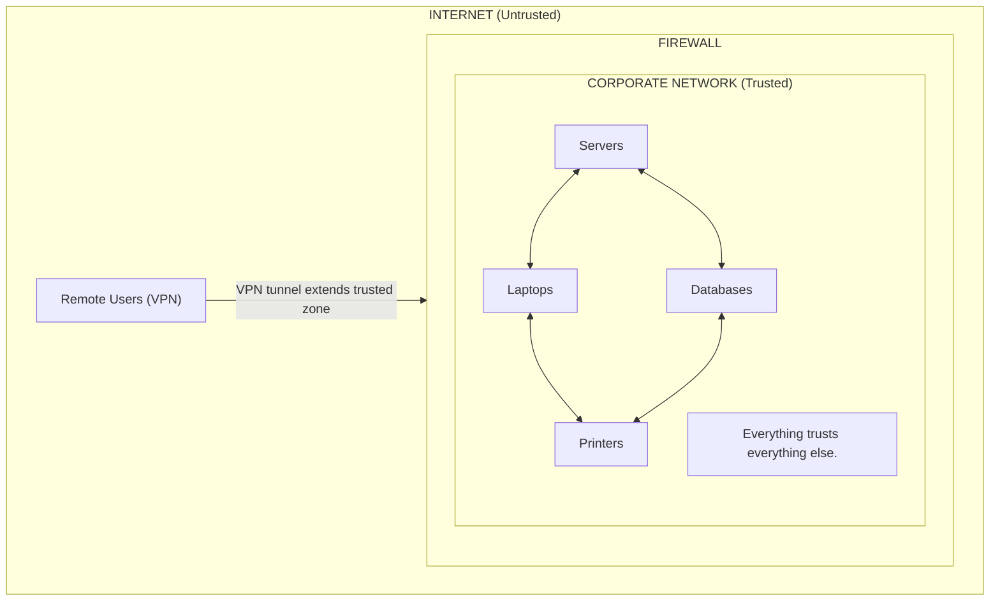
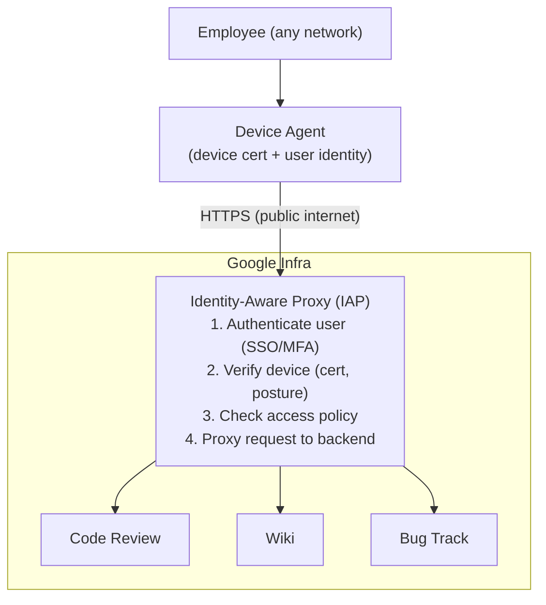
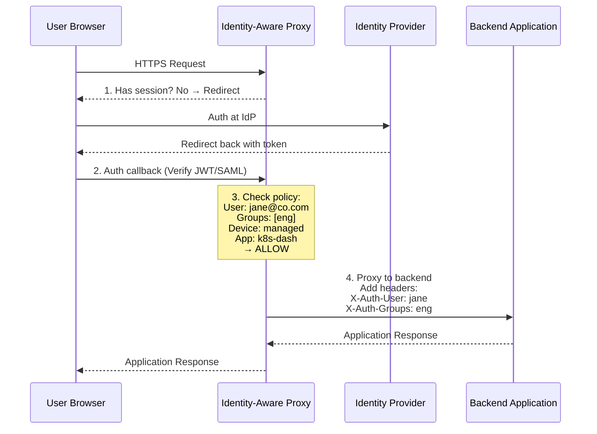
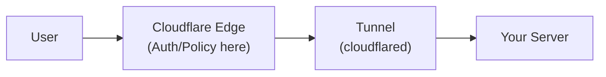
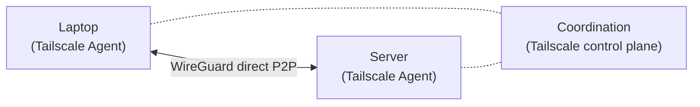
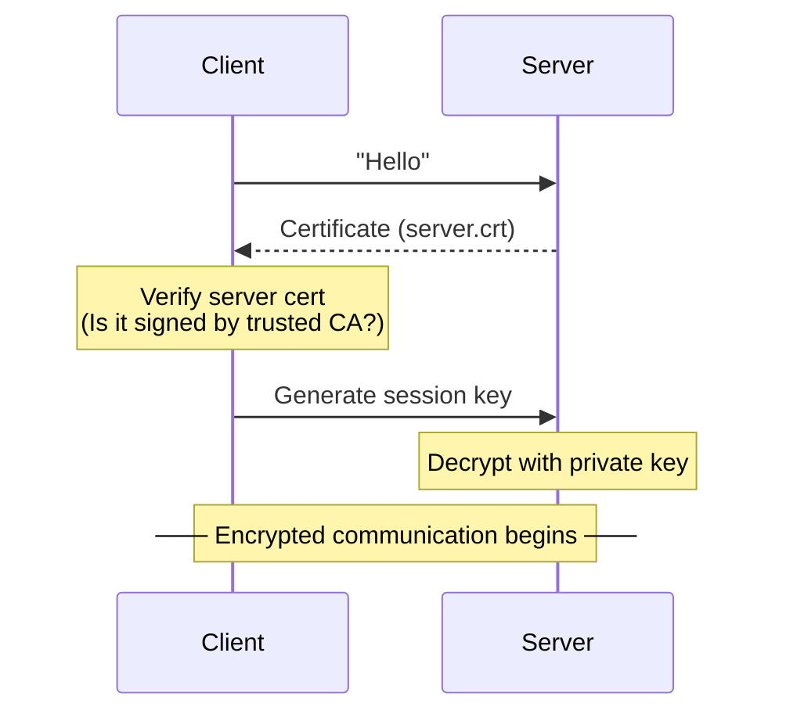
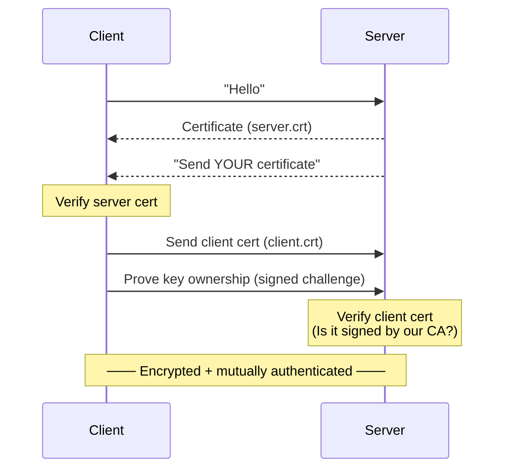

> **Complexity**: `[MEDIUM]`
>
> **Time to Complete**: 2.5 hours
>
> **Prerequisites**: Identity management basics (SSO, OIDC, SAML), basic understanding of TLS and certificates
>
> **Track**: Foundations — Advanced Networking

### What You'll Be Able to Do

After completing this module, you will be able to:

1. **Design** a zero trust architecture that replaces perimeter-based security with identity-aware, context-driven access controls
2. **Evaluate** VPN alternatives (BeyondCorp-style proxies, ZTNA, service mesh mTLS) and justify which approach fits a given organizational context
3. **Implement** micro-segmentation and continuous verification policies that limit lateral movement even after credential compromise
4. **Analyze** existing network architectures to identify implicit trust assumptions and create a migration plan toward zero trust

---

In 2020, the SolarWinds supply-chain compromise allowed attackers to move laterally across 18,000 customer networks for months — not by breaking firewalls, but by exploiting implicit trust once inside. <!-- incident-xref: solarwinds-2020 --> For the full case study, see [CI/CD Pipelines](../../../prerequisites/modern-devops/module-1.3-cicd-pipelines/).

The SolarWinds breach was not the first time the perimeter model failed catastrophically, but it became the definitive case study for why "trust the network" is a fundamentally broken security model. It accelerated a shift that had been building for years: the move to **Zero Trust**, where no user, device, or network location is inherently trusted, and every access request must be explicitly verified.

This module covers the principles, architectures, and practical implementations of Zero Trust networking — the model that replaces VPNs, firewalls-as-security, and the assumption that "inside the network" means "safe."

---

## Why This Module Matters

The traditional network security model is simple: build a strong perimeter (firewall), put everything valuable inside, and trust anything that gets through. This model worked when employees sat in offices, applications ran in on-premises datacenters, and the network boundary was a physical thing you could point to.

That world is gone. Your developers work from home, coffee shops, and co-working spaces. Your applications run across multiple cloud providers, SaaS platforms, and edge locations. Your "network" extends to mobile phones, personal laptops, IoT devices, and third-party APIs. There is no perimeter to defend.

Zero Trust is not a product you buy. It's an architectural principle: **never trust, always verify**. [Every request is authenticated and authorized regardless of network location](https://csrc.nist.gov/pubs/sp/800/207/final). Every connection is encrypted. Every access decision considers user identity, device health, application context, and risk signals — not just "are you on the corporate network?"

For platform engineers, Zero Trust changes how you architect access to Kubernetes dashboards, internal tools, databases, and cloud consoles. It replaces VPNs with identity-aware proxies. It replaces network segmentation with application-level authorization. And it provides better security with a better user experience.

> **The Hotel Keycard Analogy**
>
> Traditional VPN security is like a hotel that gives you one master key at check-in that opens every door in the building. If someone steals your key, they have access to everything. Zero Trust is like a modern hotel where your keycard is programmed for your room, the gym, and the pool — and only during your stay. Each door checks your card individually. Even if someone clones your card, it only works for the doors you were authorized for, and only until it expires.

---

## What You'll Learn

- The perimeter model's failure and the principles behind Zero Trust (BeyondCorp)
- Identity-Aware Proxies: architecture and access decisions
- mTLS beyond the service mesh: machine-to-machine authentication
- Security Service Edge (SSE): Tailscale, Cloudflare Access, Zscaler
- Device posture assessment and conditional access policies
- Practical deployment patterns for protecting internal services
- Hands-on: Protecting a Kubernetes dashboard with SSO using Pomerium

---

## Part 1: The Perimeter Model and Why It Failed

### 1.1 The Castle-and-Moat Problem

```text
THE PERIMETER SECURITY MODEL
═══════════════════════════════════════════════════════════════

Traditional model: Everything inside the firewall is trusted.
```



The perimeter failures include two canonical case studies: the [2013 Target breach](../security-principles/module-4.2-defense-in-depth/)<!-- incident-xref: target-2013 --> and the [2017 Equifax breach](../../../prerequisites/cloud-native-101/module-1.2-docker-fundamentals/)<!-- incident-xref: equifax-2017 --> — both covered in depth in their canonical modules.

```text
WHY THIS FAILS
─────────────────────────────────────────────────────────────

    1. LATERAL MOVEMENT
    ─────────────────────────────────────────────
    Once inside, attacker moves freely between systems.
    SolarWinds: 9 months of undetected lateral movement.
    Colonial Pipeline: One compromised VPN credential
    → ransomware shut down US fuel supply.

    2. VPN = FULL NETWORK ACCESS
    ─────────────────────────────────────────────
    VPN grants access to the entire network.
    Contractor needs one internal app → gets access to
    everything: databases, admin panels, file shares.

    3. NO PERIMETER EXISTS ANYMORE
    ─────────────────────────────────────────────
    Applications in AWS, GCP, Azure, SaaS platforms.
    Employees on home WiFi, coffee shop, mobile data.
    Partners accessing shared systems from their networks.

    Where is the perimeter? Everywhere and nowhere.

    4. TRUST DOESN'T SCALE
    ─────────────────────────────────────────────
    10 employees in one office: trust works.
    10,000 employees in 50 countries with BYOD: trust breaks.

BREACHES CAUSED BY PERIMETER TRUST
─────────────────────────────────────────────────────────────
    2013: Target — third-party vendor access contributed to a major retail breach affecting tens of millions of customers
    2017: Equifax — an internet-facing web application flaw exposed personal data for well over 100 million people
    2020: SolarWinds — a supply-chain compromise reached multiple government and private-sector networks
    2021: Colonial Pipeline — a remote-access compromise and ransomware incident disrupted fuel distribution
    2023: MGM Resorts — social engineering triggered a disruptive cyber incident with major operational and financial consequences
    2023: Okta — Employee laptop → customer support systems
```

### 1.2 Zero Trust Principles

```text
ZERO TRUST PRINCIPLES
═══════════════════════════════════════════════════════════════

Core maxim: "Never trust, always verify."

PRINCIPLE 1: VERIFY EXPLICITLY
─────────────────────────────────────────────────────────────
    Every access request is authenticated and authorized.
    Use ALL available signals:
    - User identity (who are you?)
    - Device identity (what device?)
    - Device health (is it patched? encrypted?)
    - Location (where are you?)
    - Application (what are you accessing?)
    - Time (is this normal hours?)
    - Risk score (is this behavior anomalous?)

PRINCIPLE 2: LEAST PRIVILEGE ACCESS
─────────────────────────────────────────────────────────────
    Grant minimum access needed, for minimum time.

    Old model:
      VPN login → Access to everything, forever

    Zero Trust:
      SSO login → Access to approved apps only
      → For approved actions only
      → Time-limited (re-auth after 8 hours)
      → Context-dependent (deny from high-risk locations)

PRINCIPLE 3: ASSUME BREACH
─────────────────────────────────────────────────────────────
    Design as if attackers are already inside.
    Minimize blast radius. Segment everything.
    Detect anomalies. Log everything.

    Even if user is authenticated:
    - Encrypt all traffic (even internal)
    - Monitor all access patterns
    - Alert on anomalous behavior
    - Limit blast radius of compromised credentials

ZERO TRUST vs PERIMETER
─────────────────────────────────────────────────────────────

    ASPECT              PERIMETER          ZERO TRUST
    ─────────────────── ────────────────── ─────────────
    Trust model         Location-based     Identity-based
    Network access      Full (via VPN)     Per-application
    Authentication      At the gate        Every request
    Authorization       Implicit (inside)  Explicit (policy)
    Encryption          Perimeter only     Everywhere
    User experience     VPN + jump hosts   SSO + direct access
    Lateral movement    Easy once inside   Blocked by design
    Device trust        Corporate managed  Assessed per access
    Monitoring          Perimeter logs     All access logged
```

> **Stop and think**: Think about your own organization's current access model. Are there any internal systems that assume trust simply because you are connected to the corporate network or VPN? How would an attacker exploit that implicit trust?

---

## Part 2: BeyondCorp — Google's Zero Trust Implementation

### 2.1 The BeyondCorp Model

```text
BEYONDCORP — ZERO TRUST AT GOOGLE SCALE
═══════════════════════════════════════════════════════════════

In the early 2010s, Google began moving away from privileged VPN-based access for internal applications.
Instead, ALL applications (internal and external) are
accessed through an identity-aware proxy.

ARCHITECTURE
─────────────────────────────────────────────────────────────
```



```text
KEY CONCEPTS
─────────────────────────────────────────────────────────────

    1. NO VPN. Applications are accessed over the internet.
       The proxy is the only entry point.

    2. DEVICE IDENTITY. Each device has a certificate
       installed by IT. The proxy verifies the certificate
       before even checking user identity.

    3. ACCESS TIERS. Different applications have different
       trust requirements:

       Tier 1 (Low sensitivity): Authenticated user + managed device
       Tier 2 (Medium):         + Encrypted disk + Updated OS
       Tier 3 (High):           + Hardware security key + recent auth

    4. CONTEXT-AWARE ACCESS. Same user, different decisions:

       Request from: Managed laptop, office network, MFA today
       → Full access to engineering systems [+]

       Request from: Personal phone, coffee shop WiFi, no MFA
       → Read-only access to documentation [+]
       → NO access to engineering systems [-]

IMPACT
─────────────────────────────────────────────────────────────
    Google has described operating this model at very large organizational scale.
    All internal applications accessible from any network.
    Same security model for office, home, and travel.
    Published in 2014 research papers, now industry standard.
```

---

## Part 3: Identity-Aware Proxies

### 3.1 How Identity-Aware Proxies Work

```text
IDENTITY-AWARE PROXY (IAP) ARCHITECTURE
═══════════════════════════════════════════════════════════════

An IAP sits in front of your application and handles
authentication, authorization, and device verification
before proxying the request to the backend.

REQUEST FLOW
─────────────────────────────────────────────────────────────
```



```text
POLICY ENGINE
─────────────────────────────────────────────────────────────

    Policies define WHO can access WHAT under WHICH conditions.

    # Example: Pomerium policy
    - from: https://k8s-dashboard.company.com
      to: http://kubernetes-dashboard.kubernetes-dashboard.svc:443
      policy:
        - allow:
            or:
              - groups:
                  has: "platform-engineering"
              - groups:
                  has: "sre-team"
          and:
            - device:
                is:
                  registered: true
            - claim:
                name: "mfa"
                value: "true"

    Translation: Allow access to K8s dashboard if:
    - User is in platform-engineering OR sre-team group
    - AND device is registered (managed)
    - AND user has completed MFA

HEADERS PASSED TO BACKEND
─────────────────────────────────────────────────────────────
    The IAP sets trusted headers on the proxied request.
    Backend can use these for application-level authorization.

    X-Pomerium-Claim-Email: jane@company.com
    X-Pomerium-Claim-Groups: ["engineering","sre"]
    X-Pomerium-Claim-Name: Jane Smith
    X-Pomerium-Jwt-Assertion: eyJhbGciOiJFUzI1NiIs...

    The JWT assertion allows the backend to VERIFY the
    claims cryptographically — no need to trust the proxy
    implicitly. The backend validates the JWT signature.
```

### 3.2 Major IAP Solutions

```text
IAP SOLUTIONS COMPARISON
═══════════════════════════════════════════════════════════════

POMERIUM (Open Source)
─────────────────────────────────────────────────────────────
    Type:           Self-hosted identity-aware proxy
    Auth:           OIDC (Google, Azure AD, Okta, GitHub, etc.)
    Deployment:     Kubernetes, Docker, Linux binary
    Device Trust:   Via third-party (Kolide, CrowdStrike)
    Protocol:       HTTP/HTTPS, TCP, gRPC
    License:        Apache 2.0 (core), Enterprise add-ons

    Strengths:
    [+] Fully self-hosted (data sovereignty)
    [+] Kubernetes-native deployment
    [+] TCP tunnel support (SSH, databases)
    [+] Per-route policies with group-based access
    [-] More operational overhead than managed solutions

CLOUDFLARE ACCESS (Managed)
─────────────────────────────────────────────────────────────
    Type:           Cloud-managed Zero Trust gateway
    Auth:           OIDC, SAML, GitHub, Google, Okta, Azure AD
    Deployment:     Cloudflare edge (managed) + Tunnel agent
    Device Trust:   Cloudflare WARP client
    Protocol:       HTTP, SSH, RDP, arbitrary TCP/UDP
    Pricing:        Free (up to 50 users), then per-seat

    Strengths:
    [+] No infrastructure to manage
    [+] Global edge deployment (300+ PoPs)
    [+] Cloudflare Tunnel = no public IPs needed
    [+] Browser-based SSH and VNC
    [-] Data traverses Cloudflare's network

    Cloudflare Tunnel architecture:
    ─────────────────────────────────────────────
    cloudflared (agent) creates outbound tunnel
    from your infrastructure to Cloudflare's edge.

    Your server has NO inbound ports open.
    Cloudflare handles TLS, auth, and proxying.
```



```text
TAILSCALE (WireGuard-Based)
─────────────────────────────────────────────────────────────
    Type:           Mesh VPN / overlay network
    Auth:           SSO integration (Google, Microsoft, Okta)
    Deployment:     Agent on each device/server
    Protocol:       Any IP traffic (full network layer)
    Device Trust:   Tailscale manages device identity
    Pricing:        Free personal tier, then per-seat plans

    Architecture:
    ─────────────────────────────────────────────
    Every device runs Tailscale agent.
    Devices connect peer-to-peer via WireGuard.
    Coordination server (hosted or self-hosted) manages keys.
```



```text
    ACLs: Define who can reach what.
    {
      "acls": [
        {"action": "accept",
         "src": ["group:engineering"],
         "dst": ["tag:k8s-cluster:443"]},
        {"action": "accept",
         "src": ["group:sre"],
         "dst": ["tag:database:5432"]}
      ]
    }

    [+] True peer-to-peer (no traffic through central server)
    [+] Works for ANY protocol (not just HTTP)
    [+] NAT traversal built-in (works from any network)
    [+] MagicDNS (hostname resolution for all devices)
    [-] Requires agent on every device
    [-] Network-level access (not application-level)

GOOGLE IAP (Cloud-Native)
─────────────────────────────────────────────────────────────
    Type:           GCP-native identity-aware proxy
    Auth:           Google Identity, Cloud Identity
    Deployment:     Built into GCP load balancer
    Pricing:        Included with GCP

    Used with: Cloud Run, App Engine, GKE, Compute Engine

    [+] Zero infrastructure (built into GCP LB)
    [+] Tight integration with Google Workspace
    [-] GCP-only (no multi-cloud)

ZSCALER PRIVATE ACCESS (ZPA) — Enterprise
─────────────────────────────────────────────────────────────
    Type:           Enterprise SSE platform
    Auth:           SAML, SCIM from any IdP
    Deployment:     App Connectors + Cloud broker
    Pricing:        Enterprise (per-seat)

    [+] Designed for large enterprise deployments
    [+] Private app access without network access
    [+] User-to-app segmentation
    [-] Expensive
    [-] Complex to deploy
```

---

> **Pause and predict**: If Identity-Aware Proxies handle user-to-service authentication, how do headless microservices authenticate with each other? Without user intervention, how can a backend API guarantee the request came from the legitimate frontend service and not a rogue container?

## Part 4: mTLS Beyond the Service Mesh

### 4.1 Machine-to-Machine Authentication

```text
mTLS — MUTUAL TLS AUTHENTICATION
═══════════════════════════════════════════════════════════════

In standard TLS, only the SERVER presents a certificate.
The client verifies the server's identity, not vice versa.

In mTLS, BOTH sides present certificates.
Server verifies client. Client verifies server.

STANDARD TLS (One-Way)
─────────────────────────────────────────────────────────────
```



```text
    Client is NOT authenticated at the TLS level.
    Server doesn't know WHO the client is.

MUTUAL TLS (Two-Way)
─────────────────────────────────────────────────────────────
```



```text
    Both sides know WHO they're talking to.

WHERE mTLS IS USED
─────────────────────────────────────────────────────────────

    1. SERVICE MESH (Istio, Linkerd)
    ─────────────────────────────────────────────
    Sidecar proxies automatically establish mTLS between
    all pods. No application code changes needed.

    Pod A (envoy) ←── mTLS ──→ Pod B (envoy)

    Certificates are automatically issued and rotated
    by the mesh control plane (SPIFFE identities).

    2. API GATEWAY AUTHENTICATION
    ─────────────────────────────────────────────
    Partners/services present client certificates to
    authenticate to your API.

    Partner's Server → [client cert] → Your API Gateway
    Gateway verifies cert is signed by partner's CA.

    3. CDN-TO-ORIGIN (Authenticated Origin Pulls)
    ─────────────────────────────────────────────
    Origin server only accepts connections from CDN.
    CDN presents a client certificate. Origin verifies.

    Cloudflare → [client cert] → Your Origin
    (Prevents direct-to-origin attacks bypassing CDN/WAF)

    4. DIRECT CONNECT / PRIVATE INTERCONNECTION
    ─────────────────────────────────────────────
    Cloud provider and customer authenticate each other
    on dedicated interconnect links.

    5. ZERO TRUST SERVICE-TO-SERVICE
    ─────────────────────────────────────────────
    In a Zero Trust architecture, even internal services
    authenticate each other via mTLS. No network-level trust.

CERTIFICATE MANAGEMENT AT SCALE
─────────────────────────────────────────────────────────────

    Challenge: Managing certificates for thousands of services.

    Solutions:
    ─────────────────────────────────────────────
    SPIFFE (Secure Production Identity Framework)
    ─────────────────────────────────────────────
    Standard for service identity. Each workload gets a
    SPIFFE ID: spiffe://company.com/ns/prod/sa/api-server

    SPIRE (SPIFFE Runtime Environment) issues and rotates
    certificates automatically.

    cert-manager (Kubernetes)
    ─────────────────────────────────────────────
    Automates certificate lifecycle in Kubernetes.
    Issues, renews, and rotates certificates from
    Let's Encrypt, Vault, self-signed CAs, and more.

    HashiCorp Vault PKI
    ─────────────────────────────────────────────
    Vault acts as a private CA.
    Services request short-lived certificates (e.g., 24 hours).
    Automatic rotation. Audit trail for all issued certs.

    Short-lived certificates > Long-lived certificates:
    ─────────────────────────────────────────────
    24-hour cert: If compromised, attacker has 24h max.
    1-year cert: If compromised, attacker has 1 year.
    Rotation: Less painful when automated and frequent.
```

---

## Part 5: Device Posture and Conditional Access

### 5.1 Device Trust Assessment

```text
DEVICE POSTURE — IS THE DEVICE TRUSTWORTHY?
═══════════════════════════════════════════════════════════════

Zero Trust doesn't just verify the user — it verifies the
device. A legitimate user on a compromised device is a risk.

DEVICE POSTURE SIGNALS
─────────────────────────────────────────────────────────────

    SIGNAL                 CHECKS                    WHY
    ─────────────────── ─────────────────────────── ─────────
    OS Version            Latest patches installed?   Unpatched
                                                     OS = known
                                                     vulnerabilities

    Disk Encryption       FileVault/BitLocker on?     Lost device
                                                     = data exposure

    Firewall              Host firewall enabled?      Basic network
                                                     protection

    Screen Lock           Auto-lock configured?       Unattended
                          PIN/biometric required?     device access

    Antivirus/EDR         CrowdStrike/SentinelOne    Malware
                          installed and running?      detection

    Jailbreak/Root        Is device rooted?           Security
                                                     controls
                                                     bypassed

    Device Management     MDM enrolled?               IT can
                          (Jamf, Intune, etc.)        manage/wipe

    Certificate           Device certificate present? Proves it's
                          (signed by company CA)      a managed
                                                     device

    Hardware Attestation  TPM/Secure Enclave          Hardware-
                          present and functional?      backed trust

CONDITIONAL ACCESS POLICIES
─────────────────────────────────────────────────────────────

    Policy: Access to production Kubernetes dashboard

    CONDITION                              ACTION
    ──────────────────────────────────── ────────────
    Managed device + MFA + corp group      Full access
    Managed device + MFA + contractor       Read-only
    Unmanaged device + MFA                  Deny
    Any device + no MFA                     Deny
    Any device + impossible travel alert    Deny + alert SOC

    Policy: Access to company documentation

    CONDITION                              ACTION
    ──────────────────────────────────── ────────────
    Any managed device + authenticated     Full access
    Unmanaged device + MFA                  Read-only
    Unmanaged device + no MFA              Deny

    Tiered access based on risk context:
    ─────────────────────────────────────────────
    Highest trust:  Managed device + MFA + low risk IP
    Medium trust:   Managed device + MFA + unknown IP
    Low trust:      Personal device + MFA
    No trust:       Unmanaged device + no MFA

IMPLEMENTATION
─────────────────────────────────────────────────────────────

    Microsoft Entra ID (Azure AD) Conditional Access:
    ─────────────────────────────────────────────
    Built into Azure AD. Evaluates:
    - User/group membership
    - Device compliance (Intune)
    - Location (IP-based)
    - Application being accessed
    - Sign-in risk (AI-assessed)

    Google BeyondCorp Enterprise:
    ─────────────────────────────────────────────
    Integrates with Chrome Enterprise for device signals.
    Access levels:
    - Device must be encrypted
    - OS within N versions of latest
    - Screen lock enabled
    - No jailbreak

    Device-trust agents can feed posture signals into access-policy decisions:
    ─────────────────────────────────────────────
    Open-source device trust agent.
    Checks: OS version, disk encryption, firewall,
    screen lock, specific software installed.
    Reports to Tailscale/Pomerium for policy decisions.
```

> **Stop and think**: How would a conditional access policy handle a scenario where an authorized user logs in from a known, managed device, but their IP address originates from a country where your company does no business?

---

## Part 6: Practical Zero Trust Patterns

### 6.1 Replacing VPN with Zero Trust

```text
VPN REPLACEMENT PATTERNS
═══════════════════════════════════════════════════════════════

PATTERN 1: IDENTITY-AWARE PROXY FOR WEB APPS
─────────────────────────────────────────────────────────────
Replace: VPN → Internal web applications
With:    IAP (Pomerium/Cloudflare Access) in front of apps

    Before:
    User → VPN → Corporate network → App (http://internal-app:8080)

    After:
    User → https://app.company.com → IAP → App
    (no VPN, no network-level access)

    Benefits:
    - Per-app access control (not full network)
    - SSO integration (no VPN passwords to manage)
    - Audit trail per request
    - Works from any network without VPN client

PATTERN 2: TUNNEL FOR NON-HTTP SERVICES
─────────────────────────────────────────────────────────────
Replace: VPN → SSH to servers, database access
With:    Tailscale/Cloudflare Tunnel + ACLs

    Before:
    User → VPN → ssh jump-host → ssh prod-server
    User → VPN → psql -h db.internal:5432

    After (Tailscale):
    User → ssh prod-server.tailnet.ts.net
    User → psql -h db.tailnet.ts.net:5432

    ACLs control who can reach which services.
    No jump hosts. No VPN. Direct encrypted access.

    After (Cloudflare Tunnel):
    User → cloudflared access ssh --hostname ssh.company.com
    User → cloudflared access tcp --hostname db.company.com:5432

    Cloudflare Access verifies identity before
    establishing the tunnel to the service.

PATTERN 3: KUBERNETES ACCESS WITHOUT VPN
─────────────────────────────────────────────────────────────
Replace: VPN → kubectl to private API server
With:    Multiple options:

    Option A: Teleport (with Kubernetes support)
    ─────────────────────────────────────────────
    tsh kube login --cluster=prod
    kubectl get pods  # Authenticated via SSO

    Option B: Tailscale Operator for Kubernetes
    ─────────────────────────────────────────────
    Install Tailscale operator in cluster.
    API server exposed on Tailscale network.
    kubectl access with Tailscale ACLs.

    Option C: IAP + kubectl proxy
    ─────────────────────────────────────────────
    Pomerium/Cloudflare Access in front of K8s API.
    Requires kubeconfig with OIDC auth.

PATTERN 4: THIRD-PARTY/CONTRACTOR ACCESS
─────────────────────────────────────────────────────────────
Replace: VPN accounts for external contractors
With:    Time-limited, app-specific access

    Before:
    Create VPN account → Contractor has network access
    → Forget to disable after contract ends
    → Former contractor still has access 6 months later

    After:
    IAP policy: Allow contractor@partner.com
                to access specific app only
                until 2026-06-30
                from managed device only
                with MFA required

    Access automatically revoked when contract expires.
    No network-level access. Only the specific application.
```

### 6.2 Zero Trust Maturity Model

```text
ZERO TRUST MATURITY — WHERE ARE YOU?
═══════════════════════════════════════════════════════════════

LEVEL 0: TRADITIONAL (Perimeter Only)
─────────────────────────────────────────────────────────────
    - VPN for remote access
    - Firewall = security boundary
    - Internal = trusted
    - Passwords (maybe MFA for VPN)

    Risk: High. Lateral movement is trivial.

LEVEL 1: ENHANCED IDENTITY
─────────────────────────────────────────────────────────────
    - SSO for cloud applications
    - MFA everywhere (hardware keys for admins)
    - VPN still used for internal apps
    - Starting to inventory devices

    Progress: Identity is verified, but network is still
    the trust boundary for internal resources.

LEVEL 2: APP-LEVEL ACCESS CONTROL
─────────────────────────────────────────────────────────────
    - IAP/Cloudflare Access for web applications
    - Tailscale/WireGuard replacing VPN for some use cases
    - Device posture checks starting
    - Per-application access policies
    - VPN being phased out

    Progress: Applications are protected individually.
    Some network-level trust remains.

LEVEL 3: MICROSEGMENTATION
─────────────────────────────────────────────────────────────
    - Service mesh (mTLS between all services)
    - Network policies (deny-all default)
    - Short-lived credentials (Vault, SPIFFE)
    - Continuous device assessment
    - VPN fully eliminated

    Progress: East-west traffic is authenticated and
    encrypted. Lateral movement is difficult.

LEVEL 4: CONTINUOUS VERIFICATION
─────────────────────────────────────────────────────────────
    - Behavioral analytics on all access
    - Real-time risk scoring
    - Adaptive access (step-up auth for anomalies)
    - Automated response to threats
    - Full audit trail for compliance

    Progress: Access is not just verified once but
    continuously evaluated throughout the session.

Many organizations are still in the early-to-middle stages of zero-trust adoption
TARGET FOR PLATFORM TEAMS: Level 3
ASPIRATION: Level 4
```

---

## Did You Know?

- **Google published BeyondCorp papers starting in 2014 after moving away from privileged network access at large scale, helping popularize identity-aware access patterns.

- **Tailscale's coordination server typically does not carry user traffic.** Unlike a traditional VPN where all traffic flows through a central server, Tailscale uses WireGuard to create direct peer-to-peer encrypted connections. The coordination server only helps devices find each other and exchange public keys. Even if Tailscale's infrastructure were completely compromised, an attacker could not decrypt user traffic — they would only see which devices are connected to each other.

- **The concept predates Google's BeyondCorp papers and is commonly associated with analyst work from the early 2010s that challenged perimeter-based trust.

---

## Common Mistakes

| Mistake | Problem | Solution |
|---------|---------|----------|
| "Zero Trust" = buying one product | Vendors sell "Zero Trust solutions" but ZT is an architecture | Implement principles incrementally: SSO, MFA, IAP, device trust |
| Keeping VPN alongside Zero Trust "just in case" | VPN becomes a bypass for all Zero Trust controls | Fully decommission VPN once IAP covers all applications |
| No device posture checks | Authenticated user on compromised device = still a risk | Deploy device trust agent (Kolide, CrowdStrike, Intune) |
| MFA only at initial login | Session tokens valid for weeks; stolen token = full access | Short session lifetimes (8-12 hours), re-auth for sensitive ops |
| Trusting X-Forwarded-For headers blindly | Backend trusts IAP headers but attacker could set them directly | Backends must verify JWT assertion from IAP cryptographically |
| Ignoring service-to-service authentication | East-west traffic between services is unauthenticated | Deploy service mesh (mTLS) or SPIFFE for service identity |
| Same access level for all applications | Low-risk apps have same restrictions as high-risk ones | Tiered policies: public docs = low friction, prod access = high |
| Not logging all access decisions | Cannot detect anomalies or investigate incidents | Log every allow/deny with user, device, app, and context |
| Treating Zero Trust as a project with an end date | Zero Trust is continuous improvement, not a checkbox | Build team capability, iterate on policies, adapt to new threats |

---

## Quiz

1. **Scenario: Your company mandates that all remote employees use a VPN with multi-factor authentication (MFA) to access internal applications. The CISO argues that this satisfies the requirements for a Zero Trust architecture because users are strongly authenticated. Why is the CISO incorrect?**
   <details>
   <summary>Answer</summary>

   The CISO is incorrect because a VPN with MFA still relies on network-centric perimeter security rather than continuous, granular verification. While MFA strongly authenticates the user at the point of entry, the VPN subsequently grants broad, implicit trust to the user's network connection, often allowing lateral movement across the internal network. Zero Trust mandates per-application, context-aware authorization that evaluates not just the user's identity, but also device posture, location, and behavior on every single request. A compromised device or a stolen VPN session token would still allow an attacker to bypass the MFA check and gain extensive access, which directly violates the core Zero Trust principle of "assume breach" and "least privilege."
   </details>

2. **Scenario: You are tasked with exposing a sensitive internal Kubernetes dashboard to developers working remotely. A team member suggests placing a traditional NGINX reverse proxy in front of it using HTTP Basic Auth to restrict access. You advocate for an Identity-Aware Proxy (IAP) instead. What are the critical security differences between these two approaches in this context?**
   <details>
   <summary>Answer</summary>

   An Identity-Aware Proxy provides a significantly more robust, context-aware security model compared to the static nature of HTTP Basic Auth. Basic Auth relies solely on a static username and password transmitted with every request, completely lacking the ability to evaluate device posture, enforce multi-factor authentication, or integrate seamlessly with modern centralized Identity Providers (IdPs). Furthermore, an IAP can evaluate dynamic signals such as the user's group membership, location, and risk profile to make granular, policy-based access decisions. If an attacker compromises a Basic Auth password, they gain persistent access from any device or location, whereas an IAP would detect anomalies and could mandate short-lived session tokens, requiring continuous re-authentication under changing risk conditions.
   </details>

3. **Scenario: Your platform team is migrating a monolithic application into microservices running on a Kubernetes cluster. Currently, the services communicate over standard HTTP, as the cluster is deployed within a private VPC. A security audit mandates the implementation of Mutual TLS (mTLS) for all service-to-service communication. Why is this necessary under Zero Trust, and how does a framework like SPIFFE solve the operational challenges of implementing it?**
   <details>
   <summary>Answer</summary>

   Under a Zero Trust architecture, no network segment is inherently trusted, even a private VPC or the internal network of a Kubernetes cluster. Standard HTTP or even one-way TLS only verifies the server's identity, leaving the system vulnerable to a compromised container impersonating a legitimate client service to access sensitive data. mTLS ensures that both the client and the server cryptographically prove their identities to each other before any communication occurs, effectively neutralizing network-level spoofing or lateral movement by an unauthorized pod. Managing the immense volume of certificates required for mTLS across dynamic microservices is operationally impossible manually; SPIFFE automates this by providing a standardized identity framework and a runtime (SPIRE) that automatically issues, securely distributes, and frequently rotates short-lived certificates for every authenticated workload.
   </details>

4. **Scenario: A startup is evaluating VPN replacements to provide remote developers access to both internal web applications (like Jira and a custom CRM) and non-HTTP infrastructure (like SSH jump hosts and direct PostgreSQL database connections). They are deciding between Cloudflare Access and Tailscale. How should they evaluate these tools for their specific mix of resources?**
   <details>
   <summary>Answer</summary>

   Cloudflare Access and Tailscale approach Zero Trust from different fundamental paradigms, making them suited for different types of resources. Cloudflare Access operates primarily at the application layer, acting as an identity-aware proxy that is exceptional for web applications because it requires no client-side agent for HTTP traffic, seamlessly integrating with IdPs for browser-based access. However, Tailscale operates at the network layer using WireGuard to create a peer-to-peer encrypted mesh, which is vastly superior when developers need direct, native access to non-HTTP protocols like SSH or PostgreSQL databases without relying on complex tunneling proxies. Given the startup's requirement to support both web apps and direct database/SSH access, they might optimally deploy Cloudflare Access to provide frictionless, agentless access to Jira and the CRM for all employees, while mandating Tailscale for the engineering team to securely access backend infrastructure.
   </details>

5. **Scenario: You are configuring access policies for a production Kubernetes API server protected by Pomerium (an IAP). You have three distinct user groups: SREs who need full administrative access, Developers who need namespace-scoped edit access, and external Auditors who require read-only access. Design a conditional access policy that enforces Least Privilege and incorporates device posture checks for each group.**
   <details>
   <summary>Answer</summary>

   For the SRE team, the policy must demand the highest level of assurance due to their broad administrative privileges. Access should be restricted to users in the 'sre-team' IdP group, require a hardware MFA key on every login, and mandate that the device is fully managed (MDM enrolled) with disk encryption and an active EDR agent, with sessions limited to 8 hours. The Developer team policy should be slightly less restrictive to reduce friction, allowing access to the 'engineering' group with standard MFA from a managed device, but authorization at the Kubernetes API level must be restricted via RBAC to only their specific namespaces. Finally, the Auditor team policy must accommodate potential external devices; they should be permitted read-only access via the 'audit-team' group using standard MFA, but if connecting from an unmanaged device, the policy should strictly enforce read-only RBAC and log all actions, perhaps imposing a shorter 4-hour session timeout to mitigate the increased risk profile.
   </details>

---

## Hands-On Exercise

**Objective**: Deploy Pomerium as an Identity-Aware Proxy to protect a Kubernetes Dashboard with SSO authentication, demonstrating Zero Trust access without VPN.

**Environment**: kind cluster + Pomerium + mock OIDC provider

### Part 1: Create the Cluster (5 minutes)

```bash
kind create cluster --name zero-trust-lab
```

### Part 2: Deploy a Protected Application (10 minutes)

```bash
# Deploy a simple dashboard-like application
cat <<'EOF' | kubectl apply -f -
apiVersion: apps/v1
kind: Deployment
metadata:
  name: internal-dashboard
  labels:
    app: dashboard
spec:
  replicas: 2
  selector:
    matchLabels:
      app: dashboard
  template:
    metadata:
      labels:
        app: dashboard
    spec:
      containers:
        - name: dashboard
          image: nginx:1.27
          ports:
            - containerPort: 80
          volumeMounts:
            - name: html
              mountPath: /usr/share/nginx/html
      volumes:
        - name: html
          configMap:
            name: dashboard-content
---
apiVersion: v1
kind: ConfigMap
metadata:
  name: dashboard-content
data:
  index.html: |
    <!DOCTYPE html>
    <html>
    <head><title>Internal Dashboard</title></head>
    <body>
      <h1>Internal Kubernetes Dashboard</h1>
      <p>This application is protected by an Identity-Aware Proxy.</p>
      <h2>Request Headers (set by IAP):</h2>
      <pre id="headers"></pre>
      <script>
        // Display headers that were set by the proxy
        // (In production, these come from the backend, not JS)
        document.getElementById('headers').textContent =
          'If you see this page, you passed authentication!\n' +
          'In production, the IAP would set:\n' +
          '  X-Pomerium-Claim-Email: user@company.com\n' +
          '  X-Pomerium-Claim-Groups: ["engineering"]\n' +
          '  X-Pomerium-Jwt-Assertion: <signed JWT>';
      </script>
    </body>
    </html>
---
apiVersion: v1
kind: Service
metadata:
  name: internal-dashboard
spec:
  selector:
    app: dashboard
  ports:
    - port: 80
EOF
```

### Part 3: Deploy OAuth2 Proxy as IAP Simulation (20 minutes)

```bash
# Since we can't use a real IdP in a local lab, we'll deploy
# OAuth2 Proxy with a built-in test provider to simulate IAP behavior.

cat <<'EOF' | kubectl apply -f -
apiVersion: v1
kind: ConfigMap
metadata:
  name: oauth2-proxy-config
data:
  oauth2-proxy.cfg: |
    # OAuth2 Proxy configuration
    # In production, replace with real OIDC provider

    # Listen address
    http_address = "0.0.0.0:4180"

    # Upstream (the protected application)
    upstreams = ["http://internal-dashboard:80"]

    # Use a built-in test provider for local demo
    provider = "oidc"
    provider_display_name = "Company SSO (Simulated)"

    # Cookie settings
    cookie_name = "_zero_trust_session"
    cookie_secret = "dGhpc2lzYXZlcnlzZWN1cmVzZWNyZXQ="
    cookie_secure = false  # Only for lab! Use true in production

    # In a real deployment, these would point to your IdP:
    # client_id = "your-client-id"
    # client_secret = "your-client-secret"
    # oidc_issuer_url = "https://accounts.google.com"

    # For this lab, we'll use htpasswd for local auth
    # to demonstrate the proxy pattern
    htpasswd_file = "/etc/oauth2-proxy/htpasswd"

    # Headers passed to upstream (simulating IAP headers)
    set_xauthrequest = true
    pass_access_token = false

    # Email domain restriction (simulating group-based access)
    email_domains = ["*"]

    # Skip the OIDC provider for local testing
    skip_provider_button = true
  htpasswd: |
    # user: engineer@company.com, password: demo
    engineer@company.com:$2y$10$xGj.FYiT0o8fPKSy.tXnZeN0Jl0VxQhHhGxxU7e/8.0.hGUq.iuy
    # user: auditor@company.com, password: readonly
    auditor@company.com:$2y$10$xGj.FYiT0o8fPKSy.tXnZeN0Jl0VxQhHhGxxU7e/8.0.hGUq.iuy
---
apiVersion: apps/v1
kind: Deployment
metadata:
  name: iap-proxy
  labels:
    app: iap-proxy
spec:
  replicas: 1
  selector:
    matchLabels:
      app: iap-proxy
  template:
    metadata:
      labels:
        app: iap-proxy
    spec:
      containers:
        - name: oauth2-proxy
          image: quay.io/oauth2-proxy/oauth2-proxy:v7.7.1
          args:
            - --config=/etc/oauth2-proxy/oauth2-proxy.cfg
            - --skip-oidc-discovery
            - --login-url=http://localhost:4180/sign_in
            - --redeem-url=http://localhost:4180/sign_in
            - --oidc-jwks-url=http://localhost:4180
            - --htpasswd-user-group=engineer@company.com:engineering
            - --htpasswd-user-group=auditor@company.com:audit
          ports:
            - containerPort: 4180
          volumeMounts:
            - name: config
              mountPath: /etc/oauth2-proxy
      volumes:
        - name: config
          configMap:
            name: oauth2-proxy-config
---
apiVersion: v1
kind: Service
metadata:
  name: iap-proxy
spec:
  selector:
    app: iap-proxy
  ports:
    - port: 80
      targetPort: 4180
EOF
```

### Part 4: Demonstrate the Zero Trust Access Pattern (15 minutes)

```bash
# Deploy a test client to demonstrate the access pattern
cat <<'EOF' | kubectl apply -f -
apiVersion: v1
kind: ConfigMap
metadata:
  name: zt-test-script
data:
  test.sh: |
    #!/bin/sh
    echo "============================================"
    echo "  Zero Trust Access Pattern Demonstration"
    echo "============================================"
    echo ""

    echo "=== Test 1: Direct access to internal dashboard ==="
    echo "    (Simulates: attacker on the network)"
    echo ""
    STATUS=$(wget -q -O /dev/null -S http://internal-dashboard 2>&1 | grep "HTTP/" | awk '{print $2}')
    echo "    Direct access: HTTP $STATUS"
    echo "    WARNING: In production, internal-dashboard would NOT be"
    echo "    accessible without going through the IAP."
    echo "    NetworkPolicy would block direct access."
    echo ""

    echo "=== Test 2: Access through IAP without credentials ==="
    echo "    (Simulates: unauthenticated user)"
    echo ""
    STATUS=$(wget -q -O /dev/null -S http://iap-proxy 2>&1 | grep "HTTP/" | awk '{print $2}')
    echo "    IAP without auth: HTTP $STATUS"
    echo "    Expected: 403 or redirect to login"
    echo ""

    echo "=== Test 3: IAP with valid credentials ==="
    echo "    (Simulates: authenticated engineer)"
    echo ""
    RESPONSE=$(wget -q -O - http://iap-proxy/ 2>/dev/null || echo "Authentication required")
    echo "    Response: $(echo $RESPONSE | head -c 100)..."
    echo ""

    echo "=== Architecture Summary ==="
    echo ""
    echo "    Traditional (VPN):"
    echo "    User → VPN → Network → Dashboard (anyone on network can access)"
    echo ""
    echo "    Zero Trust (IAP):"
    echo "    User → IAP → (auth + device + policy) → Dashboard"
    echo "    (only authenticated, authorized users with trusted devices)"
    echo ""
    echo "============================================"
---
apiVersion: v1
kind: Pod
metadata:
  name: zt-demo
spec:
  containers:
    - name: demo
      image: busybox:1.37
      command: ["/bin/sh", "/scripts/test.sh"]
      volumeMounts:
        - name: scripts
          mountPath: /scripts
  restartPolicy: Never
  volumes:
    - name: scripts
      configMap:
        name: zt-test-script
        defaultMode: 0755
EOF

# View the demonstration output
kubectl wait --for=condition=complete pod/zt-demo --timeout=60s 2>/dev/null
kubectl logs zt-demo
```

### Part 5: Deploy NetworkPolicy (True Zero Trust) (15 minutes)

```bash
# In true Zero Trust, the dashboard is ONLY accessible through the IAP.
# NetworkPolicy enforces this at the network level.

cat <<'EOF' | kubectl apply -f -
apiVersion: networking.k8s.io/v1
kind: NetworkPolicy
metadata:
  name: dashboard-only-via-iap
spec:
  podSelector:
    matchLabels:
      app: dashboard
  policyTypes:
    - Ingress
  ingress:
    # Only allow traffic from the IAP proxy
    - from:
        - podSelector:
            matchLabels:
              app: iap-proxy
      ports:
        - protocol: TCP
          port: 80
---
# Default deny all ingress for the namespace
apiVersion: networking.k8s.io/v1
kind: NetworkPolicy
metadata:
  name: default-deny-ingress
spec:
  podSelector: {}
  policyTypes:
    - Ingress
  ingress: []
---
# Allow traffic TO the IAP proxy (the only entry point)
apiVersion: networking.k8s.io/v1
kind: NetworkPolicy
metadata:
  name: allow-iap-ingress
spec:
  podSelector:
    matchLabels:
      app: iap-proxy
  policyTypes:
    - Ingress
  ingress:
    - ports:
        - protocol: TCP
          port: 4180
EOF

echo ""
echo "NetworkPolicies deployed. Now:"
echo "  - Direct access to dashboard: BLOCKED"
echo "  - Access through IAP proxy: ALLOWED"
echo "  - This is Zero Trust at the network level."
echo ""
echo "Note: NetworkPolicy enforcement requires a CNI that supports it"
echo "(Calico, Cilium, etc.). kind's default CNI (kindnet) has limited support."
```

### Part 6: Examine the Zero Trust Architecture (10 minutes)

```bash
# Review the full architecture
echo "=== Zero Trust Lab Architecture ==="
echo ""
echo "┌─────────────────────────────────────────────────────────┐"
echo "│  External User                                          │"
echo "│  (any network)                                          │"
echo "└────────────┬────────────────────────────────────────────┘"
echo "             │"
echo "             │ HTTPS"
echo "             ▼"
echo "┌─────────────────────────────────────────────────────────┐"
echo "│  IAP Proxy (OAuth2 Proxy / Pomerium)                    │"
echo "│  - Authenticates user (SSO/OIDC)                        │"
echo "│  - Checks device posture                                │"
echo "│  - Evaluates access policy                              │"
echo "│  - Adds identity headers to request                     │"
echo "└────────────┬────────────────────────────────────────────┘"
echo "             │"
echo "             │ HTTP (internal, identity headers set)"
echo "             │ NetworkPolicy: ONLY IAP → Dashboard"
echo "             ▼"
echo "┌─────────────────────────────────────────────────────────┐"
echo "│  Internal Dashboard                                     │"
echo "│  - Receives authenticated request                       │"
echo "│  - X-Auth-User: engineer@company.com                    │"
echo "│  - Verifies JWT assertion (optional)                    │"
echo "│  - No direct external access (NetworkPolicy)            │"
echo "└─────────────────────────────────────────────────────────┘"
echo ""

# Show current policies
echo "=== NetworkPolicies ==="
kubectl get networkpolicy
echo ""

# Show services
echo "=== Services ==="
kubectl get svc
echo ""

# Show pods
echo "=== Pods ==="
kubectl get pods
```

### Clean Up

```bash
kind delete cluster --name zero-trust-lab
```

**Success Criteria**:
- [ ] Internal dashboard deployed and serving content
- [ ] IAP proxy deployed as the authentication gateway
- [ ] Understood that unauthenticated requests are rejected by the IAP
- [ ] NetworkPolicy deployed to restrict direct dashboard access
- [ ] Understood the architectural difference between VPN and IAP patterns
- [ ] Recognized that the IAP sets identity headers (X-Auth-User, JWT) for the backend
- [ ] Grasped the layered defense: IAP (authentication) + NetworkPolicy (network) + RBAC (application)

---

## Further Reading

- **"BeyondCorp: A New Approach to Enterprise Security"** (Google, 2014) — The original paper that launched the Zero Trust movement. Describes how Google replaced VPN with identity-aware proxies.

- **NIST SP 800-207: Zero Trust Architecture** — The US government's formal definition of Zero Trust principles, architecture, and deployment models. The most authoritative reference.

- **"Zero Trust Networks" by Evan Gilman & Doug Barth** (O'Reilly) — Practical guide to implementing Zero Trust, including network architecture, identity, and device trust.

- **Tailscale Blog: "How Tailscale Works"** — Deep technical explanation of WireGuard mesh networking, NAT traversal, and the coordination protocol.

---

## Key Takeaways

Before moving on, ensure you understand:

- [ ] **The perimeter model fails because there is no perimeter**: Cloud, remote work, SaaS, and mobile devices make "inside the network" meaningless as a trust signal
- [ ] **Zero Trust verifies every request**: Identity, device, application, context, and risk are evaluated for every access decision, not just at the gate
- [ ] **Identity-Aware Proxies replace VPNs for web apps**: Users get SSO access to specific applications without network-level access. Better security AND better UX
- [ ] **Tailscale/WireGuard replaces VPN for non-HTTP**: When you need TCP/UDP access (databases, SSH), mesh VPN with ACLs provides per-service access control
- [ ] **mTLS authenticates machines, not just humans**: Service-to-service communication must be authenticated and encrypted even on "internal" networks
- [ ] **Device posture is part of access decisions**: An authenticated user on a compromised device is still a risk. OS version, encryption, and EDR status matter
- [ ] **Conditional access creates tiered trust**: High-risk operations require managed devices + MFA + hardware keys; documentation access can be lighter
- [ ] **Zero Trust is a journey, not a product**: Start with SSO + MFA, add IAP for key apps, deploy device trust, implement microsegmentation, then continuous verification

---

## Series Complete

Congratulations on completing the Advanced Networking foundation series! You now have deep understanding of:

1. **DNS at Scale** — Global traffic management, Anycast, DNSSEC
2. **CDN & Edge Computing** — Caching, edge functions, TLS strategies
3. **WAF & DDoS Mitigation** — Application protection and volumetric defense
4. **BGP & Core Routing** — Internet routing, security, and interconnection
5. **Cloud Load Balancing** — L4/L7 mechanics, Proxy Protocol, architecture
6. **Zero Trust Networking** — Identity-based access, VPN replacement

These topics form the networking foundation for platform engineering. Each concept builds on the others — DNS routes to CDN, CDN integrates WAF, BGP underlies all routing, load balancers distribute traffic, and Zero Trust secures access across every layer.

## Sources

- [CISA Advisory AA20-352A: Advanced Persistent Threat Compromise of Government Agencies, Critical Infrastructure, and Private Sector Organizations](https://www.cisa.gov/news-events/cybersecurity-advisories/aa20-352a) — Documents the SolarWinds campaign, including the compromise timeline and U.S. attribution to Russia's SVR.
- [FBI/CISA Joint Statement on SolarWinds](https://www.cisa.gov/news-events/news/joint-statement-federal-bureau-investigation-fbi-cybersecurity-and-infrastructure-security-agency-0) — Summarizes the scope of affected SolarWinds customers and the narrower set of follow-on compromise victims.
- [NIST SP 800-207: Zero Trust Architecture](https://csrc.nist.gov/pubs/sp/800/207/final) — Defines zero-trust terminology, principles, and reference deployment models in the primary standards document.
- [Google Cloud Identity-Aware Proxy Documentation](https://cloud.google.com/iap/docs) — Describes Google Cloud IAP as a context-aware access layer for services such as Cloud Run, App Engine, Compute Engine, and GKE.
- [RFC 8446: TLS 1.3](https://www.rfc-editor.org/rfc/rfc8446.html) — Specifies TLS 1.3 handshake behavior, including server authentication and optional client-certificate authentication.
- [Istio Peer Authentication and mTLS](https://istio.io/latest/docs/tasks/security/authentication/authn-policy/) — Shows how Istio enables and enforces mutual TLS between workloads with peer-authentication policy.
- [HashiCorp Vault PKI Engine Tutorial](https://developer.hashicorp.com/vault/tutorials/secrets-management/pki-engine) — Explains how Vault PKI acts as a private CA and issues short-lived certificates.
- [Microsoft Intune Conditional Access](https://learn.microsoft.com/en-us/intune/intune-service/protect/conditional-access) — Describes Conditional Access evaluation across identity, device compliance, application, location, and risk signals.
- [BeyondCorp Enterprise: Define Access Policies](https://cloud.google.com/beyondcorp-enterprise/docs/define-access-policies) — Documents device-attribute and context-based access rules in BeyondCorp Enterprise.
- [BeyondCorp: A New Approach to Enterprise Security](https://www.usenix.org/publications/login/dec14/ward) — Presents the original public description of Google's BeyondCorp architecture and its move away from privileged network access.
