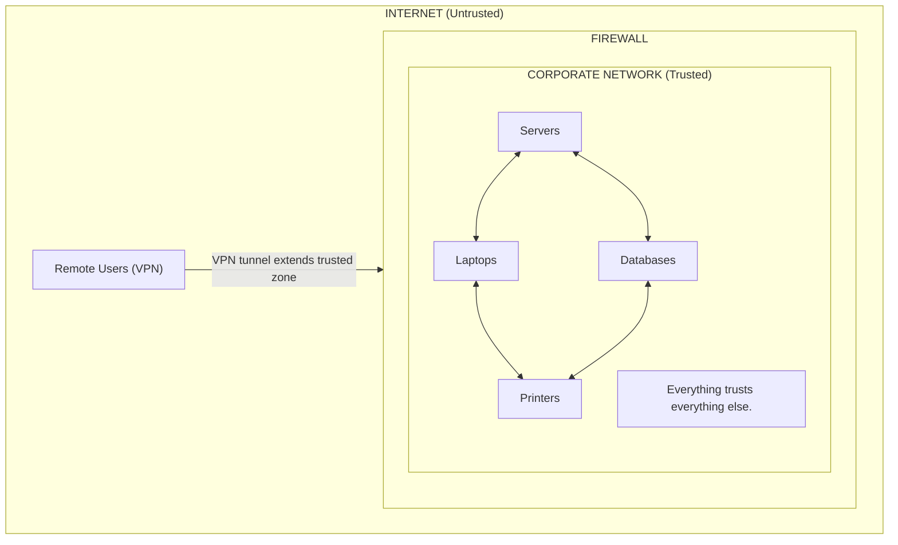
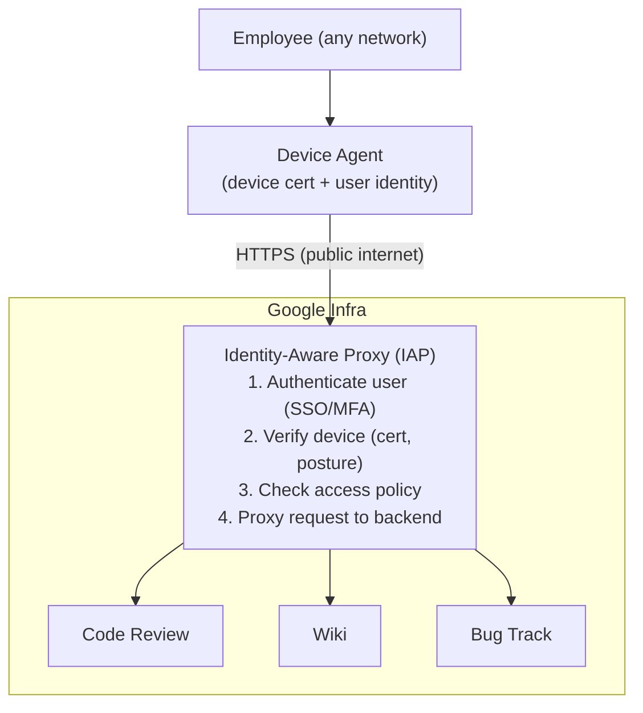
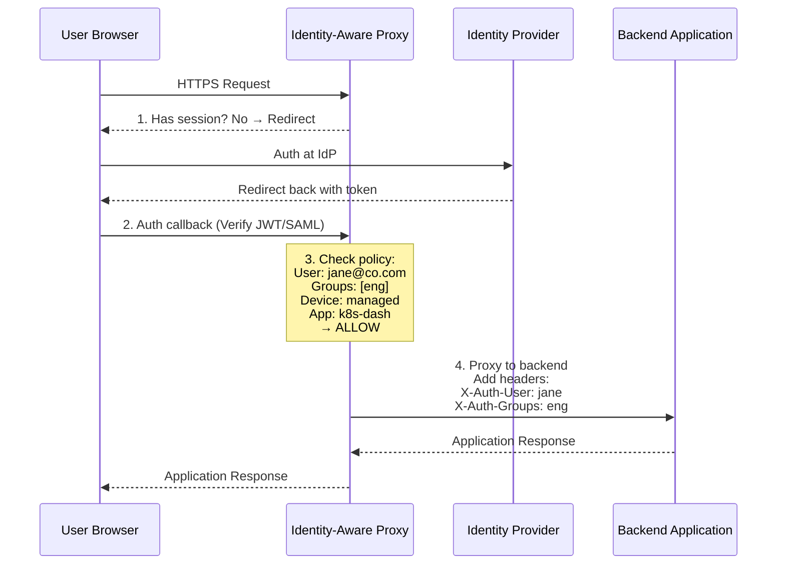
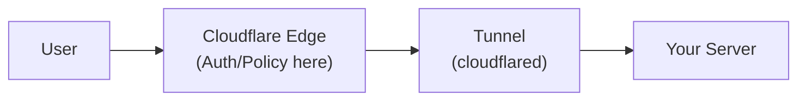
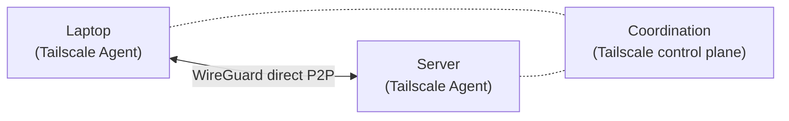
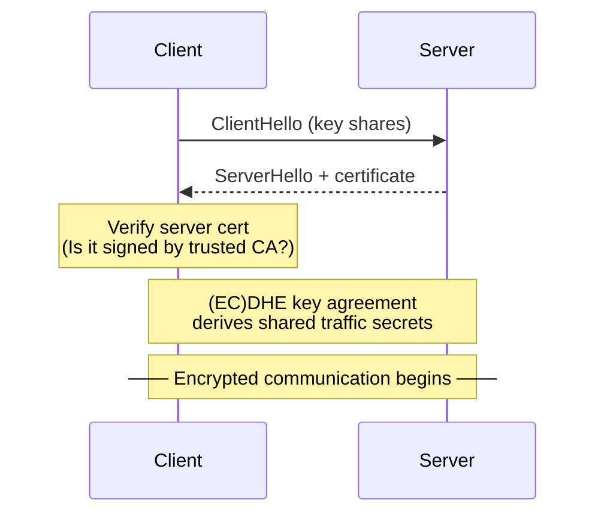
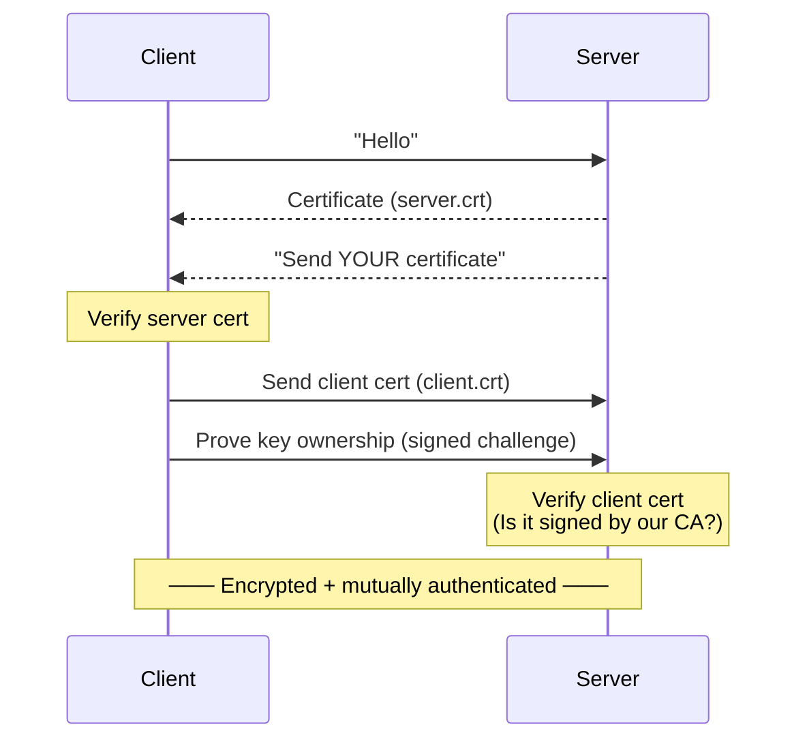

> **Complexity**: `[MEDIUM]`
>
> **Time to Complete**: 2.5 hours
>
> **Prerequisites**: Identity management basics (SSO, OIDC, SAML), basic understanding of TLS and certificates
>
> **Track**: Foundations — Advanced Networking

## What You'll Be Able to Do

After completing this module, you will be able to design, evaluate, implement, analyze, and deploy Zero Trust controls using the same vocabulary your security and platform peers use in architecture reviews:

1. **Design** a zero trust architecture that replaces perimeter-based security with identity-aware, context-driven access controls
2. **Evaluate** VPN alternatives (BeyondCorp-style proxies, ZTNA, service mesh mTLS) and justify which approach fits a given organizational context
3. **Implement** micro-segmentation and continuous verification policies that limit lateral movement even after credential compromise
4. **Analyze** existing network architectures to identify implicit trust assumptions and create a migration plan toward zero trust
5. **Deploy** an identity-aware proxy in front of an internal application, wiring SSO authentication, device posture checks, and network-level enforcement without relying on a corporate VPN

---

In 2020, the SolarWinds supply-chain compromise reached nearly 18,000 organizations that received the compromised Orion updates; the attackers then selected a much smaller, high-value subset (around 100) for active follow-on intrusion — not by breaking firewalls at scale, but by exploiting implicit trust once inside selected targets. <!-- incident-xref: solarwinds-2020 --> For the full case study, see [CI/CD Pipelines](../../../prerequisites/modern-devops/module-1.3-cicd-pipelines/).

That breach was not the first time the perimeter model failed catastrophically, but it became the definitive case study for why "trust the network" is a fundamentally broken security model. It accelerated a shift that had been building for years: the move to **Zero Trust**, where no user, device, or network location is inherently trusted, and every access request must be explicitly verified.

This module covers the principles, architectures, and practical implementations of Zero Trust networking — the model that replaces VPNs, firewalls-as-security, and the assumption that "inside the network" means "safe." You will learn durable patterns that survive vendor churn: identity-aware proxies, mutual TLS for workloads, device posture gates, and the policy layering that makes deny-by-default operational rather than theoretical.

Each part builds on the previous one. Part 1 explains why perimeter trust fails in cloud-native environments. Part 2 introduces BeyondCorp as a reference shape. Parts 3 through 5 cover the three enforcement layers most platform teams deploy first—human access via IAP, machine access via mTLS, and device context via conditional access. Part 6 ties the patterns into a migration playbook you can adapt to your organization, followed by a hands-on lab that implements the IAP plus NetworkPolicy stack on kind.

Platform engineers often inherit a patchwork of access paths: legacy VPN for databases, SSO for SaaS, shared SSH keys for break-glass, and cluster-admin kubeconfigs distributed through runbooks. Zero Trust consolidation does not mean eliminating diversity overnight—it means making every path explicit, logged, and revocable. When you present leadership with a single diagram showing enforcement points instead of a slide deck of vendor logos, you earn budget for the unglamorous work: certificate rotation, IdP group hygiene, and SIEM field normalization that determines whether the program survives its first audit.

---

## Why This Module Matters

The traditional network security model is simple: build a strong perimeter (firewall), put everything valuable inside, and trust anything that gets through. This model worked when employees sat in offices, applications ran in on-premises datacenters, and the network boundary was a physical thing you could point to.

That world is gone. Your developers work from home, coffee shops, and co-working spaces. Your applications run across multiple cloud providers, SaaS platforms, and edge locations. Your "network" extends to mobile phones, personal laptops, IoT devices, and third-party APIs. There is no perimeter to defend.

Zero Trust is not a product you buy. It's an architectural principle: **never trust, always verify**. [Every request is authenticated and authorized regardless of network location](https://csrc.nist.gov/pubs/sp/800/207/final). Every connection is encrypted. Every access decision considers user identity, device health, application context, and risk signals — not just "are you on the corporate network?"

For platform engineers, Zero Trust changes how you architect access to Kubernetes dashboards, internal tools, databases, and cloud consoles. It replaces VPNs with identity-aware proxies. It augments network segmentation with application-level authorization. And it provides better security with a better user experience when implemented as a coherent program rather than a single product purchase.

The same engineering discipline that makes load balancers and DNS policies auditable applies here: every allow decision should cite a policy version, every deny should log enough context to replay in an incident review, and every exception should expire automatically. Zero Trust is not less convenient than VPN by necessity—it is less convenient only when teams skip the SSO integration work and bolt a proxy onto legacy basic-auth applications without cleaning up the trust assumptions underneath.

> **The Hotel Keycard Analogy**
>
> Traditional VPN security is like a hotel that gives you one master key at check-in that opens every door in the building. If someone steals your key, they have access to everything. Zero Trust is like a modern hotel where your keycard is programmed for your room, the gym, and the pool — and only during your stay. Each door checks your card individually. Even if someone clones your card, it only works for the doors you were authorized for, and only until it expires.

---

## Part 1: The Perimeter Model and Why It Failed

Perimeter security dominated enterprise design for two decades because it matched how datacenters were physically wired: a DMZ for public services, a trusted interior for databases, and a firewall between them. That mental model still appears in runbooks written as "if the request originates inside the VPC, skip authentication." Cloud-native platforms inherit the same bug when security groups default to allow-all east-west traffic and engineers assume Kubernetes NetworkPolicy is optional until an audit fails.

Understanding why the model failed is prerequisite to selling Zero Trust to stakeholders who remember when VPN plus firewall was "good enough." The failures are not anecdotal—they repeat across retail breaches, credit bureau exposures, supply-chain compromises, and ransomware incidents where attackers never needed to defeat TLS at the edge because the interior never challenged them.

### 1.1 The Castle-and-Moat Problem

```text
THE PERIMETER SECURITY MODEL
═══════════════════════════════════════════════════════════════

Traditional model: Everything inside the firewall is trusted.
```


```mermaid
flowchart TD
    subgraph Internet ["INTERNET (Untrusted)"]
        RemoteUser["Remote Users (VPN)"]
        subgraph Firewall ["FIREWALL"]
            subgraph CorpNet ["CORPORATE NETWORK (Trusted)"]
                direction TB
                Servers <--> Databases
                Servers <--> Laptops
                Laptops <--> Printers
                Databases <--> Printers
                Note["Everything trusts everything else."]
            end
        end
        RemoteUser -- "VPN tunnel extends trusted zone" --> Firewall
    end
```

The perimeter failures repeat across retail breaches, credit bureau exposures, supply-chain compromises, and ransomware incidents where attackers never needed to defeat TLS at the edge because the interior never challenged them. A major retailer was breached via a third-party HVAC vendor's network access; a credit bureau was compromised through an unpatched internet-facing web framework; a fuel pipeline operator was hit by credential-based ransomware after remote-access VPN trust extended too far inside the network. Those patterns share a structural lesson with that campaign: attackers did not need novel zero-day exploits at the perimeter if interior systems accepted connections without re-authenticating the client. Retail POS networks, credit bureau web tiers, build pipelines, and fuel-distribution SCADA interfaces each trusted network placement more than cryptographic identity.

Documenting your own interior trust assumptions is the first deliverable in any Zero Trust program. Walk a single user journey—from laptop browser to Kubernetes API to etcd backup bucket—and note every hop that checks only source IP or VPC ID. Those hops are where IAP, mTLS, or signed service tokens pay off first because they remove implicit trust without waiting for a full VPN decommission project to finish.

```text
WHY THIS FAILS
─────────────────────────────────────────────────────────────

    1. LATERAL MOVEMENT
    ─────────────────────────────────────────────
    Once inside, attacker moves freely between systems.
    Supply-chain compromise: months of undetected lateral movement in
    actively compromised targets.
    Credential-based ransomware: one stolen VPN credential
    → operational shutdown of critical infrastructure.

    2. VPN = FULL NETWORK ACCESS
    ─────────────────────────────────────────────
    VPN grants access to the entire network.
    Contractor needs one internal app → gets access to
    everything: databases, admin panels, file shares.

    3. NO PERIMETER EXISTS ANYMORE
    ─────────────────────────────────────────────
    Applications in AWS, GCP, Azure, SaaS platforms.
    Employees on home WiFi, coffee shop, mobile data.
    Partners accessing shared systems from their networks.

    Where is the perimeter? Everywhere and nowhere.

    4. TRUST DOESN'T SCALE
    ─────────────────────────────────────────────
    10 employees in one office: trust works.
    10,000 employees in 50 countries with BYOD: trust breaks.

BREACHES CAUSED BY PERIMETER TRUST (PATTERNS)
─────────────────────────────────────────────────────────────
    Third-party vendor access → major retail breach affecting
    tens of millions of customers
    Unpatched internet-facing web application → credit bureau
    exposure of well over 100 million personal records
    Supply-chain compromise → trojanized updates reaching
    thousands of downstream organizations
    Stolen remote-access credentials → ransomware disrupting
    fuel distribution operations
    Social engineering against IT help desk → disruptive
    cyber incident with major operational and financial impact
    Compromised employee laptop → lateral movement into
    customer-facing support systems
```

The perimeter model treats the corporate network as a single trust zone. Once a packet crosses the firewall, routing and application layers often assume the sender is legitimate. That assumption made sense when every employee sat at a desk on a managed LAN and every server lived in the same datacenter rack. It collapses the moment your attack surface spans SaaS logins, contractor laptops, CI runners in ephemeral cloud VMs, and Kubernetes API servers reachable from half a dozen ingress paths.

Lateral movement is the mechanism attackers exploit once that implicit trust exists. A stolen VPN credential or a compromised developer laptop does not need to break additional firewalls if east-west traffic inside the VPC is unauthenticated HTTP. The attacker pivots from a low-value staging pod to a production database because nothing at the network or application layer re-verifies identity on each hop. Micro-segmentation and per-request authorization exist precisely to break that pivot chain.

Remote work, bring-your-own-device policies, and multi-cloud deployments removed the physical boundary the perimeter model depended on. Your "internal network" is now a graph of identities, certificates, and policy engines—not a VLAN you can draw on a whiteboard. Platform engineers feel this acutely when a security team asks for "VPN access to the cluster" while developers already reach the same API through three different ingress controllers, each with different authentication behavior.

Zero Trust reframes the question from "which network are you on?" to "who are you, on what device, requesting access to which resource, under what risk signals right now?" The durable primitives—identity providers, device posture agents, identity-aware proxies, mutual TLS, and continuous policy evaluation—outlast any single vendor product. The sections that follow teach those primitives first and only then map them to current tools in a dated landscape snapshot.

Incident response playbooks should assume attackers target your IAP and IdP integrations directly once VPN routes disappear. Phishing pages that mimic your SSO login, stolen refresh tokens, and compromised CI pipelines that mint valid OIDC tokens are the next wave after perimeter hardening. Pair technical controls with user education on recognizing IdP prompts and with detection rules on impossible OAuth grant patterns—Zero Trust shifts the adversary's focus from firewall rules to identity artifacts you must guard with equal rigor.

### 1.2 Zero Trust Principles

```text
ZERO TRUST PRINCIPLES
═══════════════════════════════════════════════════════════════

Core maxim: "Never trust, always verify."

PRINCIPLE 1: VERIFY EXPLICITLY
─────────────────────────────────────────────────────────────
    Every access request is authenticated and authorized.
    Use ALL available signals:
    - User identity (who are you?)
    - Device identity (what device?)
    - Device health (is it patched? encrypted?)
    - Location (where are you?)
    - Application (what are you accessing?)
    - Time (is this normal hours?)
    - Risk score (is this behavior anomalous?)

PRINCIPLE 2: LEAST PRIVILEGE ACCESS
─────────────────────────────────────────────────────────────
    Grant minimum access needed, for minimum time.

    Old model:
      VPN login → Access to everything, forever

    Zero Trust:
      SSO login → Access to approved apps only
      → For approved actions only
      → Time-limited (re-auth after 8 hours)
      → Context-dependent (deny from high-risk locations)

PRINCIPLE 3: ASSUME BREACH
─────────────────────────────────────────────────────────────
    Design as if attackers are already inside.
    Minimize blast radius. Segment everything.
    Detect anomalies. Log everything.

    Even if user is authenticated:
    - Encrypt all traffic (even internal)
    - Monitor all access patterns
    - Alert on anomalous behavior
    - Limit blast radius of compromised credentials

ZERO TRUST vs PERIMETER
─────────────────────────────────────────────────────────────

    ASPECT              PERIMETER          ZERO TRUST
    ─────────────────── ────────────────── ─────────────
    Trust model         Location-based     Identity-based
    Network access      Full (via VPN)     Per-application
    Authentication      At the gate        Every request
    Authorization       Implicit (inside)  Explicit (policy)
    Encryption          Perimeter only     Everywhere
    User experience     VPN + jump hosts   SSO + direct access
    Lateral movement    Easy once inside   Blocked by design
    Device trust        Corporate managed  Assessed per access
    Monitoring          Perimeter logs     All access logged
```

The comparison table above is the checklist for architecture reviews. When you read a design document, highlight every row where the proposed system still behaves like the perimeter column—full-network VPN profiles, shared admin passwords on internal UIs, or services that trust client IP without verifying identity. Each highlighted row is a migration ticket.

Principle 1 (**verify explicitly**) means authentication and authorization happen at the enforcement point closest to the resource, not once at the VPN concentrator. Principle 2 (**least privilege**) means contractors receive documentation access without inheriting SSH keys to production nodes. Principle 3 (**assume breach**) means your monitoring budget assumes compromise has already occurred and optimizes for detection speed and blast-radius containment rather than perfect prevention alone.

> **Stop and think**: Map every internal hostname your team reaches through VPN today—Grafana, Argo CD, Jenkins, the Kubernetes API, artifact registries, and runbook wikis. For each one, ask whether network location alone ever justified access, and what an identity-aware proxy would need to know (groups, device posture, MFA method) to make the same allow decision explicitly.

---

## Part 2: BeyondCorp — Google's Zero Trust Implementation

### 2.1 The BeyondCorp Model

Google's public BeyondCorp writing describes a deliberate inversion: internal applications receive the same threat model as SaaS products on the public internet. There is no trusted interior VLAN—only authenticated sessions, device certificates, and policy decisions evaluated at the proxy. Google's scale is unusual, but the decomposition is portable. Small teams run the same shape with a single Pomerium deployment and an Okta tenant; enterprises add dedicated policy engines and SIEM pipelines without changing the core ask of every request.

The access control engine aggregates signals that used to live in separate silos. HR identity from the IdP, device compliance from MDM, geolocation from IP reputation feeds, and application metadata from service catalogs feed one decision. When the engine denies access, the user sees a actionable error ("device encryption disabled") rather than a generic 403, which reduces help-desk load during rollout. When it allows access, downstream apps receive signed assertions they can verify independently—critical when multiple teams own different microservices behind the same ingress.

```text
BEYONDCORP — ZERO TRUST AT GOOGLE SCALE
═══════════════════════════════════════════════════════════════

In the early 2010s, Google began moving away from privileged VPN-based access for internal applications.
Instead, ALL applications (internal and external) are
accessed through an identity-aware proxy.

ARCHITECTURE
─────────────────────────────────────────────────────────────
```


```mermaid
flowchart TD
    Employee["Employee (any network)"]
    Device["Device Agent<br/>(device cert + user identity)"]
    Employee --> Device
    Device -- "HTTPS (public internet)" --> IAP["Identity-Aware Proxy (IAP)<br/>1. Authenticate user (SSO/MFA)<br/>2. Verify device (cert, posture)<br/>3. Check access policy<br/>4. Proxy request to backend"]
    
    subgraph Google Infra
        IAP --> Code["Code Review"]
        IAP --> Wiki["Wiki"]
        IAP --> Bug["Bug Track"]
    end
```

```text
KEY CONCEPTS
─────────────────────────────────────────────────────────────

    1. NO VPN. Applications are accessed over the internet.
       The proxy is the only entry point.

    2. DEVICE IDENTITY. Each device has a certificate
       installed by IT. The proxy verifies the certificate
       before even checking user identity.

    3. ACCESS TIERS. Different applications have different
       trust requirements:

       Tier 1 (Low sensitivity): Authenticated user + managed device
       Tier 2 (Medium):         + Encrypted disk + Updated OS
       Tier 3 (High):           + Hardware security key + recent auth

    4. CONTEXT-AWARE ACCESS. Same user, different decisions:

       Request from: Managed laptop, office network, MFA today
       → Full access to engineering systems [+]

       Request from: Personal phone, coffee shop WiFi, no MFA
       → Read-only access to documentation [+]
       → NO access to engineering systems [-]

IMPACT
─────────────────────────────────────────────────────────────
    Google has described operating this model at very large organizational scale.
    All internal applications accessible from any network.
    Same security model for office, home, and travel.
    Published in 2014 research papers, now industry standard.
```

BeyondCorp is the reference architecture most teams cite when they say "Zero Trust networking," not because Google invented the idea, but because Google published enough detail for others to copy the shape. Four components recur in every serious deployment: an **access proxy** that terminates TLS and enforces policy inline, an **access control engine** that evaluates identity and context signals, a **device inventory** that knows which endpoints are managed and compliant, and a **trust inference** layer that scores risk from telemetry rather than from IP geolocation alone.

The shift from network-location trust to identity-plus-device trust is the durable lesson. A developer on a managed laptop authenticating through SSO to reach an internal wiki is the same trust path whether they sit in headquarters or a hotel in another country. The proxy never asks "are you on the corporate VLAN?" It asks "does this OIDC token belong to an active employee, is the device certificate valid, and does policy allow this URL path?" That inversion is what makes Zero Trust portable across cloud regions and Kubernetes namespaces.

When you design platform access, treat BeyondCorp as a pattern library rather than a product checklist. You might deploy Pomerium in front of Grafana, Cloudflare Access in front of a legacy PHP admin panel, and mesh mTLS between microservices—all in the same organization. The unifying idea is that each enforcement point makes an explicit allow/deny decision with enough logging to reconstruct an incident timeline months later.

Operationalizing BeyondCorp also means investing in device inventory hygiene. A proxy that trusts device certificates without a revocation story recreates VPN weaknesses in X.509 form. Runbooks should cover certificate renewal on reinstalled laptops, offboarding contractors whose devices still appear in MDM, and emergency revocation when a fleet of managed machines shares a compromised root of trust. These processes are boring infrastructure work—and they determine whether Zero Trust survives your first real incident.

Brownfield migrations should inventory authentication headers your applications already consume. Many internal Rails or Spring services read `REMOTE_USER` or custom headers set by an older reverse proxy. Mapping those headers to IAP-issued JWT claims reduces rewrite scope: the proxy changes, the application binary does not. Where applications parse headers unsafely, fix that before exposing them through a new IAP hostname—header injection bugs become critical when the proxy is the sole gate.

---

## Part 3: Identity-Aware Proxies

Identity-aware proxies are the user-facing enforcement point in most Zero Trust rollouts. They terminate TLS from browsers, integrate with your IdP's OIDC or SAML flows, evaluate policy, and only then forward requests to upstream applications that may still speak plain HTTP inside the cluster. That last detail matters for brownfield migrations: you can protect legacy apps without rewriting them for OAuth if the proxy handles authentication and injects trusted headers the app already understands.

Policy documents for IAPs should be version-controlled like application code. A policy change that accidentally grants contractors write access to production Grafana is a production incident waiting for the next business day. GitOps workflows—pull request review, automated diff in CI, staged rollout to staging hostnames—apply directly to Pomerium routes, Cloudflare Access applications, and Google IAP bindings even when the vendor UI also offers click-to-edit consoles.

Testing IAP policies requires negative cases, not only happy-path SSO logins. Automated suites should assert that unauthenticated requests receive 401 or 403, that users outside required IdP groups cannot reach upstream paths, and that expired sessions cannot reuse stale cookies. Include a case where device posture fails—simulated by marking a test device non-compliant in MDM—to confirm deny messages are actionable for help-desk staff rather than opaque "access denied" strings with no remediation hint.

### 3.1 How Identity-Aware Proxies Work

```text
IDENTITY-AWARE PROXY (IAP) ARCHITECTURE
═══════════════════════════════════════════════════════════════

An IAP sits in front of your application and handles
authentication, authorization, and device verification
before proxying the request to the backend.

REQUEST FLOW
─────────────────────────────────────────────────────────────
```


```mermaid
sequenceDiagram
    participant User as User Browser
    participant IAP as Identity-Aware Proxy
    participant IdP as Identity Provider
    participant Backend as Backend Application

    User->>IAP: HTTPS Request
    IAP-->>User: 1. Has session? No → Redirect
    User->>IdP: Auth at IdP
    IdP-->>User: Redirect back with token
    User->>IAP: 2. Auth callback (Verify JWT/SAML)
    Note over IAP: 3. Check policy:<br/>User: jane@co.com<br/>Groups: [eng]<br/>Device: managed<br/>App: k8s-dash<br/>→ ALLOW
    IAP->>Backend: 4. Proxy to backend<br/>Add headers:<br/>X-Auth-User: jane<br/>X-Auth-Groups: eng
    Backend-->>IAP: Application Response
    IAP-->>User: Application Response
```

```text
POLICY ENGINE
─────────────────────────────────────────────────────────────

    Policies define WHO can access WHAT under WHICH conditions.

    # Example: Pomerium policy
    - from: https://k8s-dashboard.company.com
      to: http://kubernetes-dashboard.kubernetes-dashboard.svc:443
      policy:
        - allow:
            or:
              - groups:
                  has: "platform-engineering"
              - groups:
                  has: "sre-team"
          and:
            - device:
                is:
                  registered: true
            - claim:
                name: "mfa"
                value: "true"

    Translation: Allow access to K8s dashboard if:
    - User is in platform-engineering OR sre-team group
    - AND device is registered (managed)
    - AND user has completed MFA

HEADERS PASSED TO BACKEND
─────────────────────────────────────────────────────────────
    The IAP sets trusted headers on the proxied request.
    Backend can use these for application-level authorization.

    X-Pomerium-Claim-Email: jane@company.com
    X-Pomerium-Claim-Groups: ["engineering","sre"]
    X-Pomerium-Claim-Name: Jane Smith
    X-Pomerium-Jwt-Assertion: eyJhbGciOiJFUzI1NiIs...

    The JWT assertion allows the backend to VERIFY the
    claims cryptographically — no need to trust the proxy
    implicitly. The backend validates the JWT signature.
```

An identity-aware proxy differs from a VPN in scope and granularity. A VPN extends your internal routing table to a remote laptop; once connected, the user can often reach any RFC1918 address the firewall permits. An IAP exposes only the applications you front with it—typically over HTTPS—and evaluates policy per request. VPN access is network-level; IAP access is application-level. Both can use the same identity provider, but the blast radius of a stolen VPN session is usually much larger than a stolen IAP session scoped to one hostname.

OIDC authorization-code flow with PKCE is the default integration pattern for browser-based IAP deployments in 2026. The proxy redirects unauthenticated users to the IdP, receives an authorization code on the registered callback URL, exchanges it for ID and access tokens server-side, and stores a session cookie scoped to the proxy hostname. SAML remains common in regulated industries where legacy assertions must map to mainframe or ERP systems; many teams run both protocols in parallel during multi-year migrations. Regardless of protocol, never forward raw tokens to upstream applications unless those applications validate audience, issuer, and expiry—prefer signed JWT assertions with narrow claims.

The request flow always follows the same choreography even when vendors differ. The user hits the proxy URL, the proxy redirects unauthenticated sessions to the IdP, the IdP returns an OIDC authorization code or SAML assertion, and the proxy mints a session cookie or bearer token for subsequent requests. On each request the policy engine re-evaluates group membership, device posture, and optional risk scores before forwarding to the upstream. Backends that trust `X-Forwarded-*` headers without verifying a signed JWT assertion recreate the perimeter mistake at the application layer—always validate cryptographically.

For Kubernetes platform teams, IAPs solve a recurring problem: the dashboard and metrics stack were never meant to face the public internet, yet engineers need them from home. Placing an IAP in front of the ingress—rather than opening a VPN route to the entire cluster API—limits exposure to one hostname and one policy document. Pair that with NetworkPolicy so only the proxy pod can reach the dashboard Service, and you have defense in depth without managing split-tunnel VPN profiles for every OS.

Inside the cluster, complement north-south IAP controls with east-west defaults that deny all traffic except explicitly allowed paths. Kubernetes RBAC scopes who may impersonate service accounts or read Secrets cluster-wide; NetworkPolicy scopes which pods may dial which Services; Istio or Linkerd peer authentication scopes which workloads present valid client certificates. None of these layers replaces the others—auditors expect defense in depth, and attackers expect at least one layer to be misconfigured. Your architecture wins when misconfiguring a single layer still leaves two independent gates intact.

### 3.2 Major IAP Solutions

> **Landscape snapshot — as of 2026-06. Vendor features, pricing tiers, and product names change quickly; verify against current documentation before relying on specifics.**

| Capability | Self-hosted IAP (e.g. Pomerium) | Managed SSE gateway (e.g. Cloudflare Access) | Mesh overlay (e.g. Tailscale) | Cloud-native IAP (e.g. Google Cloud IAP) |
|------------|--------------------------------|-----------------------------------------------|------------------------------|------------------------------------------|
| Primary layer | HTTP/TCP application proxy | Edge-terminated HTTP/SSH/TCP | L3/L4 mesh VPN with ACLs | Load-balancer-integrated HTTP |
| Typical deployment | Kubernetes or VM in your VPC | Agent (`cloudflared`) + edge PoPs | Agent on each device/server | GCP LB policy attachment |
| Identity integration | OIDC/SAML from any IdP | OIDC/SAML from any IdP | SSO + ACL tags | Google/Cloud Identity |
| Best fit when | You need data sovereignty and per-route YAML policies | You want zero ingress ports and global edge auth | You need arbitrary TCP between many hosts | You already run services on GCP |

The comparison table captures **capabilities**, not rankings. Teams frequently run more than one column simultaneously: mesh overlay for engineer SSH, managed SSE for SaaS-like internal tools, and mesh mTLS inside the cluster.

```text
IAP SOLUTIONS COMPARISON
═══════════════════════════════════════════════════════════════

POMERIUM (Open Source)
─────────────────────────────────────────────────────────────
    Type:           Self-hosted identity-aware proxy
    Auth:           OIDC (Google, Azure AD, Okta, GitHub, etc.)
    Deployment:     Kubernetes, Docker, Linux binary
    Device Trust:   Via third-party (Kolide, CrowdStrike)
    Protocol:       HTTP/HTTPS, TCP, gRPC
    License:        Apache 2.0 (core), Enterprise add-ons

    Strengths:
    [+] Fully self-hosted (data sovereignty)
    [+] Kubernetes-native deployment
    [+] TCP tunnel support (SSH, databases)
    [+] Per-route policies with group-based access
    [-] More operational overhead than managed solutions

CLOUDFLARE ACCESS (Managed)
─────────────────────────────────────────────────────────────
    Type:           Cloud-managed Zero Trust gateway
    Auth:           OIDC, SAML, GitHub, Google, Okta, Azure AD
    Deployment:     Cloudflare edge (managed) + Tunnel agent
    Device Trust:   Cloudflare WARP client
    Protocol:       HTTP, SSH, RDP, arbitrary TCP
    Pricing:        Free (up to 50 users), then per-seat

    Strengths:
    [+] No infrastructure to manage
    [+] Global edge deployment (300+ PoPs)
    [+] Cloudflare Tunnel = no public IPs needed
    [+] Browser-based SSH and VNC
    [-] Data traverses Cloudflare's network

    Cloudflare Tunnel architecture:
    ─────────────────────────────────────────────
    cloudflared (agent) creates outbound tunnel
    from your infrastructure to Cloudflare's edge.

    Your server has NO inbound ports open.
    Cloudflare handles TLS, auth, and proxying.
```


```mermaid
flowchart LR
    User["User"]
    Edge["Cloudflare Edge<br/>(Auth/Policy here)"]
    Tunnel["Tunnel<br/>(cloudflared)"]
    Server["Your Server"]

    User --> Edge
    Edge --> Tunnel
    Tunnel --> Server
```

```text
TAILSCALE (WireGuard-Based)
─────────────────────────────────────────────────────────────
    Type:           Mesh VPN / overlay network
    Auth:           SSO integration (Google, Microsoft, Okta)
    Deployment:     Agent on each device/server
    Protocol:       Any IP traffic (full network layer)
    Device Trust:   Tailscale coordinates device identity
    Pricing:        Free personal tier, then per-seat plans

    Architecture:
    ─────────────────────────────────────────────
    Every device runs Tailscale agent.
    Devices connect peer-to-peer via WireGuard when possible.
    Coordination server distributes public keys and helps
    endpoints discover each other (private keys never leave
    the device).
```


```mermaid
flowchart LR
    Laptop["Laptop<br/>(Tailscale Agent)"]
    Server["Server<br/>(Tailscale Agent)"]
    Coord["Coordination<br/>(Tailscale control plane)"]

    Laptop <-->|WireGuard direct P2P| Server
    Laptop -.- Coord
    Server -.- Coord
```

```text
    ACLs: Define who can reach what.
    {
      "acls": [
        {"action": "accept",
         "src": ["group:engineering"],
         "dst": ["tag:k8s-cluster:443"]},
        {"action": "accept",
         "src": ["group:sre"],
         "dst": ["tag:database:5432"]}
      ]
    }

    [+] Peer-to-peer WireGuard when direct paths exist (DERP
        relay servers carry encrypted traffic when NAT or
        firewall rules block a direct connection)
    [+] Works for ANY protocol (not just HTTP)
    [+] NAT traversal built-in (works from any network)
    [+] MagicDNS (hostname resolution for all devices)
    [-] Requires agent on every device
    [-] Network-level access (not application-level)

GOOGLE IAP (Cloud-Native)
─────────────────────────────────────────────────────────────
    Type:           GCP-native identity-aware proxy
    Auth:           Google Identity, Cloud Identity
    Deployment:     Built into GCP load balancer
    Pricing:        Included with GCP

    Used with: Cloud Run, App Engine, GKE, Compute Engine

    [+] Zero infrastructure (built into GCP LB)
    [+] Tight integration with Google Workspace
    [-] GCP-only (no multi-cloud)

ZSCALER PRIVATE ACCESS (ZPA) — Enterprise
─────────────────────────────────────────────────────────────
    Type:           Enterprise SSE platform
    Auth:           SAML, SCIM from any IdP
    Deployment:     App Connectors + Cloud broker
    Pricing:        Enterprise (per-seat)

    [+] Designed for large enterprise deployments
    [+] Private app access without network access
    [+] User-to-app segmentation
    [-] Expensive
    [-] Complex to deploy
```

Security Service Edge (SSE) products bundle identity-aware access with other edge security functions, but the primitive you are buying is the same: an enforcement point that knows who the user is before packets reach your origin. Whether that enforcement runs on a global CDN edge, inside your cluster as a sidecar, or on a WireGuard interface is an operational tradeoff, not a different security model. Choose based on protocol needs (HTTP only versus arbitrary TCP), data residency requirements, and how much control you need over policy YAML versus a vendor console.

Integrations with enterprise IdPs should be planned before vendor selection. If your organization standardizes on SAML for legacy apps and OIDC for cloud-native tooling, confirm the proxy supports both flows on the same hostname routes without forcing duplicate user records. Group membership propagation—engineering, sre-team, contractors—must map cleanly to policy rules; otherwise you will recreate role sprawl inside YAML files that are harder to audit than IdP group memberships alone.

Session lifetime and step-up authentication belong in the same policy document as hostname routes. A common failure mode is configuring brilliant per-app rules while leaving refresh tokens valid for thirty days on shared kiosks. Pair short IAP session cookies with IdP conditional access so sensitive routes require fresh MFA even when the user already has a valid SSO session for email or chat applications.

---

> **Pause and predict**: Before reading Part 4, sketch the trust boundaries in your cluster: which Services accept traffic from the internet via Ingress, which accept only in-cluster clients, and which Secrets or ConfigMaps those clients could read if mTLS were absent. That sketch becomes your micro-segmentation backlog.

## Part 4: mTLS Beyond the Service Mesh

Human-facing Zero Trust gets the executive slides, but machine-to-machine authentication determines whether a compromised pod can harvest Secrets or pivot to the control plane. Every IAP deployment should have a paired story for service identity: how workloads prove themselves when no browser session exists, how certificates rotate without weekend maintenance windows, and how audit logs attribute API calls to SPIFFE IDs rather than ephemeral pod IPs.

### 4.1 Machine-to-Machine Authentication

```text
mTLS — MUTUAL TLS AUTHENTICATION
═══════════════════════════════════════════════════════════════

In standard TLS, only the SERVER presents a certificate.
The client verifies the server's identity, not vice versa.

In mTLS, BOTH sides present certificates.
Server verifies client. Client verifies server.

STANDARD TLS (One-Way)
─────────────────────────────────────────────────────────────
```


```mermaid
sequenceDiagram
    participant Client
    participant Server
    
    Client->>Server: ClientHello (key shares)
    Server-->>Client: ServerHello + certificate
    Note over Client: Verify server cert<br/>(Is it signed by trusted CA?)
    Note over Client,Server: (EC)DHE key agreement<br/>derives shared traffic secrets
    Note over Client,Server: ─── Encrypted communication begins ───
```

```text
    Client is NOT authenticated at the TLS level.
    Server doesn't know WHO the client is.

MUTUAL TLS (Two-Way)
─────────────────────────────────────────────────────────────
```


```mermaid
sequenceDiagram
    participant Client
    participant Server
    
    Client->>Server: "Hello"
    Server-->>Client: Certificate (server.crt)
    Server-->>Client: "Send YOUR certificate"
    Note over Client: Verify server cert
    Client->>Server: Send client cert (client.crt)
    Client->>Server: Prove key ownership (signed challenge)
    Note over Server: Verify client cert<br/>(Is it signed by our CA?)
    Note over Client,Server: ─── Encrypted + mutually authenticated ───
```

```text
    Both sides know WHO they're talking to.

WHERE mTLS IS USED
─────────────────────────────────────────────────────────────

    1. SERVICE MESH (Istio, Linkerd)
    ─────────────────────────────────────────────
    Sidecar proxies automatically establish mTLS between
    all pods. No application code changes needed.

    Pod A (envoy) ←── mTLS ──→ Pod B (envoy)

    Certificates are automatically issued and rotated
    by the mesh control plane (SPIFFE identities).

    2. API GATEWAY AUTHENTICATION
    ─────────────────────────────────────────────
    Partners/services present client certificates to
    authenticate to your API.

    Partner's Server → [client cert] → Your API Gateway
    Gateway verifies cert is signed by partner's CA.

    3. CDN-TO-ORIGIN (Authenticated Origin Pulls)
    ─────────────────────────────────────────────
    Origin server only accepts connections from CDN.
    CDN presents a client certificate. Origin verifies.

    Cloudflare → [client cert] → Your Origin
    (Prevents direct-to-origin attacks bypassing CDN/WAF)

    4. SERVICE-TO-SERVICE mTLS (INTERNAL APIs)
    ─────────────────────────────────────────────
    Internal microservices present client certificates to
    each other or to an API gateway that enforces mTLS.

    payments-svc → [client cert] → ledger-api
    Gateway verifies cert is signed by your private CA.

    5. ZERO TRUST SERVICE-TO-SERVICE
    ─────────────────────────────────────────────
    In a Zero Trust architecture, even internal services
    authenticate each other via mTLS. No network-level trust.

CERTIFICATE MANAGEMENT AT SCALE
─────────────────────────────────────────────────────────────

    Challenge: Managing certificates for thousands of services.

    Solutions:
    ─────────────────────────────────────────────
    SPIFFE (Secure Production Identity Framework)
    ─────────────────────────────────────────────
    Standard for service identity. Each workload gets a
    SPIFFE ID: spiffe://company.com/ns/prod/sa/api-server

    SPIRE (SPIFFE Runtime Environment) issues and rotates
    certificates automatically.

    cert-manager (Kubernetes)
    ─────────────────────────────────────────────
    Automates certificate lifecycle in Kubernetes.
    Issues, renews, and rotates certificates from
    Let's Encrypt, Vault, self-signed CAs, and more.

    HashiCorp Vault PKI
    ─────────────────────────────────────────────
    Vault acts as a private CA.
    Services request short-lived certificates (e.g., 24 hours).
    Automatic rotation. Audit trail for all issued certs.

    Short-lived certificates > Long-lived certificates:
    ─────────────────────────────────────────────
    24-hour cert: If compromised, attacker has 24h max.
    1-year cert: If compromised, attacker has 1 year.
    Rotation: Less painful when automated and frequent.
```

SPIFFE (Secure Production Identity Framework for Everyone) standardizes **workload identity** as a URI-shaped SPIFFE ID such as `spiffe://example.com/ns/prod/sa/payments`. SPIRE, the reference implementation, runs as an agent on each node, attests the workload (often via Kubernetes service account tokens), and issues short-lived X.509 SVID certificates bound to that identity. cert-manager and Vault PKI solve overlapping problems when you already standardized on those tools—the important design choice is automated rotation on a schedule measured in hours, not years.

Meshless mTLS is viable when you cannot justify a full Istio control plane. Sidecar-less approaches attach certificates directly to applications or terminate mTLS at ingress gateways while still requiring client certificates for admin APIs. The operational cost shifts from "manage a mesh" to "manage a CA and issuance pipeline," which is why many platform teams centralize on Vault or cloud KMS-backed private CAs regardless of mesh adoption.

For machine identity, treat certificates like API keys that expire quickly. A one-year TLS cert on an internal service is a latent breach window; a twenty-four-hour cert limits attacker utility and forces you to build the automation you needed anyway for GitOps-driven clusters. Auditors and incident responders also benefit: every issuance event in Vault or SPIRE logs maps to a service account or namespace, making blast-radius analysis faster than grep-ing nginx access logs for mystery IPs.

Service meshes remain the most common on-ramp to mTLS inside Kubernetes, but they are not mandatory. Teams allergic to sidecars can terminate mTLS at ingress gateways and enforce client certificates on admin APIs while keeping stateless microservices on plain HTTP behind NetworkPolicy. The wrong choice is skipping machine identity entirely because Istio feels heavyweight—pick SPIRE, cert-manager with a private CA issuer (Vault PKI or an internal CA), or cloud KMS-backed issuers that match your operational maturity, then grow into full mesh when east-west traffic justifies the control-plane cost.

---

## Part 5: Device Posture and Conditional Access

Device posture closes the gap between "correct password" and "safe endpoint." Phishing-resistant MFA stops credential theft at the IdP, but it cannot stop an engineer from authenticating on a family PC infected with credential-stuffing malware. Conditional access policies combine user identity with device signals so high-risk applications refuse sessions that would have sailed through a VPN concentrator because the tunnel itself was considered proof of trust.

### 5.1 Device Trust Assessment

```text
DEVICE POSTURE — IS THE DEVICE TRUSTWORTHY?
═══════════════════════════════════════════════════════════════

Zero Trust doesn't just verify the user — it verifies the
device. A legitimate user on a compromised device is a risk.

DEVICE POSTURE SIGNALS
─────────────────────────────────────────────────────────────

    SIGNAL                 CHECKS                    WHY
    ─────────────────── ─────────────────────────── ─────────
    OS Version            Latest patches installed?   Unpatched
                                                     OS = known
                                                     vulnerabilities

    Disk Encryption       FileVault/BitLocker on?     Lost device
                                                     = data exposure

    Firewall              Host firewall enabled?      Basic network
                                                     protection

    Screen Lock           Auto-lock configured?       Unattended
                          PIN/biometric required?     device access

    Antivirus/EDR         CrowdStrike/SentinelOne    Malware
                          installed and running?      detection

    Jailbreak/Root        Is device rooted?           Security
                                                     controls
                                                     bypassed

    Device Management     MDM enrolled?               IT can
                          (Jamf, Intune, etc.)        manage/wipe

    Certificate           Device certificate present? Proves it's
                          (signed by company CA)      a managed
                                                     device

    Hardware Attestation  TPM/Secure Enclave          Hardware-
                          present and functional?      backed trust

CONDITIONAL ACCESS POLICIES
─────────────────────────────────────────────────────────────

    Policy: Access to production Kubernetes dashboard

    CONDITION                              ACTION
    ──────────────────────────────────── ────────────
    Managed device + MFA + corp group      Full access
    Managed device + MFA + contractor       Read-only
    Unmanaged device + MFA                  Deny
    Any device + no MFA                     Deny
    Any device + impossible travel alert    Deny + alert SOC

    Policy: Access to company documentation

    CONDITION                              ACTION
    ──────────────────────────────────── ────────────
    Any managed device + authenticated     Full access
    Unmanaged device + MFA                  Read-only
    Unmanaged device + no MFA              Deny

    Tiered access based on risk context:
    ─────────────────────────────────────────────
    Highest trust:  Managed device + MFA + low risk IP
    Medium trust:   Managed device + MFA + unknown IP
    Low trust:      Personal device + MFA
    No trust:       Unmanaged device + no MFA

IMPLEMENTATION
─────────────────────────────────────────────────────────────

    Microsoft Entra ID (Azure AD) Conditional Access:
    ─────────────────────────────────────────────
    Built into Azure AD. Evaluates:
    - User/group membership
    - Device compliance (Intune)
    - Location (IP-based)
    - Application being accessed
    - Sign-in risk (AI-assessed)

    Google BeyondCorp Enterprise:
    ─────────────────────────────────────────────
    Integrates with Chrome Enterprise for device signals.
    Access levels:
    - Device must be encrypted
    - OS within N versions of latest
    - Screen lock enabled
    - No jailbreak

    Device-trust agents can feed posture signals into access-policy decisions:
    ─────────────────────────────────────────────
    Open-source device trust agent.
    Checks: OS version, disk encryption, firewall,
    screen lock, specific software installed.
    Reports to Tailscale/Pomerium for policy decisions.
```

Conditional access is where human identity meets device telemetry. Microsoft Entra ID, Google BeyondCorp Enterprise, and open-source proxies like Pomerium all consume the same signal categories even when the UI differs: Is disk encryption enabled? Is the OS within your patch window? Is an EDR agent reporting clean status? A policy that ignores device posture effectively says "any browser on any machine counts as corporate," which defeats the purpose of moving beyond VPN trust.

Tiered trust lets you tune friction to risk. Read-only documentation might require only SSO from a managed device, while production `kubectl` access demands hardware MFA plus a device certificate issued by your MDM. Step-up authentication triggers when signals change mid-session—impossible travel, a new device fingerprint, or a spike in denied authorization attempts. Platform engineers should document which tier each internal tool requires so security reviews do not rediscover the matrix from scratch every quarter.

When a user connects from a known managed device but the IP geolocates to a country where you have no employees, the durable response is deny-by-default with an explicit break-glass path—not silent allow because the device certificate looked fine. Log the decision with enough context (user, device ID, policy version, matched rule) to explain to auditors why access was blocked without asking them to trust a black-box score.

Device posture agents differ from MDM enrollment checks. MDM confirms the device is registered in your fleet; posture agents report runtime state such as encryption status, firewall configuration, and EDR health. Both signals matter because a registered laptop with disabled disk encryption remains a high-risk endpoint for production access. Start with boolean gates in IAP policy, then evolve toward numeric risk scores once your telemetry pipeline matures enough to avoid false positives during patch cycles.

Geolocation and impossible-travel rules should ship with documented break-glass workflows tied to change tickets. Permanent country allow-lists that bypass IAP recreate VPN-era trust assumptions under a different label. Time-boxed exceptions with executive approval on file satisfy auditors while keeping daily operations predictable for engineers who legitimately travel.

Risk-based step-up authentication also applies inside long-lived platform sessions. An engineer who authenticated to a staging cluster eight hours ago should not inherit the same trust score when opening a production incident channel during a declared Sev-1. Proxies and IdPs that support incremental authentication—demanding hardware MFA only when crossing sensitivity tiers—reduce daily friction while preserving strict gates where database dumps or kube-admin credentials are in scope.

> **Stop and think**: Draft a three-tier policy matrix for your organization—low sensitivity (internal docs), medium sensitivity (CI/CD and staging clusters), high sensitivity (production control plane and customer data stores). For each tier, specify minimum device posture, MFA type, session lifetime, and logging destination before selecting a vendor console to implement it.

---

## Part 6: Practical Zero Trust Patterns

**Hypothetical scenario:** A platform team decommissions corporate VPN over a single weekend after buying an SSE license. Monday morning, database administrators cannot reach PostgreSQL because their GUI tools relied on split-tunnel RFC1918 routes, contractors lose access to legal-review portals that were never added to the IAP catalog, and on-call engineers discover that break-glass SSH still pointed at jump hosts removed from DNS. The technology worked; the migration sequencing did not.

Avoid that failure mode by publishing a phased roadmap tied to application tiers. Phase one centralizes identity and enables MFA on every IdP-integrated app. Phase two fronts tier-one internal web properties with IAP and enables device posture on those same routes. Phase three enforces east-west mTLS or default-deny NetworkPolicy inside Kubernetes. Phase four retires VPN routes as each legacy dependency documents an alternative path. Each phase has measurable exit criteria—percentage of apps behind IAP, count of VPN sessions, percentage of namespaces with deny-all default—so leadership sees progress without mistaking license purchase for architecture change.

Compliance frameworks increasingly ask for evidence of least privilege rather than checkbox firewall diagrams. SOC 2 and ISO 27001 auditors want to see who accessed production during a change window, whether contractors were time-boxed, and whether deny decisions were logged with enough context to replay. Zero Trust architectures produce that evidence as a byproduct when IAP and IdP logs feed a centralized SIEM with retention policies matching your regulatory obligations. Treat log schema design as part of the architecture—fields like `policy_id`, `device_posture_status`, and `auth_method` should be consistent across every enforcement point so correlation queries remain simple during quarterly access reviews.

### 6.1 Replacing VPN with Zero Trust

```text
VPN REPLACEMENT PATTERNS
═══════════════════════════════════════════════════════════════

PATTERN 1: IDENTITY-AWARE PROXY FOR WEB APPS
─────────────────────────────────────────────────────────────
Replace: VPN → Internal web applications
With:    Identity-aware proxy (IAP) in front of apps

    Before:
    User → VPN → Corporate network → App (http://internal-app:8080)

    After:
    User → https://app.company.com → IAP → App
    (no VPN, no network-level access)

    Benefits:
    - Per-app access control (not full network)
    - SSO integration (no VPN passwords to manage)
    - Audit trail per request
    - Works from any network without VPN client

PATTERN 2: TUNNEL FOR NON-HTTP SERVICES
─────────────────────────────────────────────────────────────
Replace: VPN → SSH to servers, database access
With:    Mesh overlay or managed tunnel + ACLs

    Before:
    User → VPN → ssh jump-host → ssh prod-server
    User → VPN → psql -h db.internal:5432

    After (mesh overlay):
    User → encrypted overlay hostname for prod-server
    User → encrypted overlay hostname for database
    ACLs control who can reach which services.
    No jump hosts. No VPN. Direct encrypted access.

    After (managed SSE tunnel):
    User → identity-verified SSH or TCP tunnel to hostname
    Gateway verifies identity before establishing the tunnel.

    (See the landscape snapshot in Part 3.2 for current
    vendor-specific tunnel and mesh commands.)

PATTERN 3: KUBERNETES ACCESS WITHOUT VPN
─────────────────────────────────────────────────────────────
Replace: VPN → kubectl to private API server
With:    Multiple options:

    Option A: Certificate-based access broker
    ─────────────────────────────────────────────
    SSO-authenticated kubectl via a broker that issues
    short-lived credentials mapped to RBAC.

    Option B: Mesh operator for Kubernetes
    ─────────────────────────────────────────────
    Expose API server on an encrypted overlay network.
    kubectl access governed by overlay ACLs.

    Option C: IAP + OIDC kubeconfig
    ─────────────────────────────────────────────
    Identity-aware proxy in front of K8s API.
    Requires kubeconfig with OIDC auth.

    (See the landscape snapshot in Part 3.2 for current
    Teleport, Tailscale, and IAP integration patterns.)

PATTERN 4: THIRD-PARTY/CONTRACTOR ACCESS
─────────────────────────────────────────────────────────────
Replace: VPN accounts for external contractors
With:    Time-limited, app-specific access

    Before:
    Create VPN account → Contractor has network access
    → Forget to disable after contract ends
    → Former contractor still has access 6 months later

    After:
    IAP policy: Allow contractor@partner.com
                to access specific app only
                until 2026-06-30
                from managed device only
                with MFA required

    Access automatically revoked when contract expires.
    No network-level access. Only the specific application.
```

Adoption rarely succeeds as a big-bang VPN replacement. Mature teams sequence the journey deliberately: consolidate identity with SSO and MFA everywhere, front the highest-risk internal apps with an IAP, introduce device posture checks for those same apps, roll out east-west mTLS or network policies inside Kubernetes, and only then declare the legacy VPN read-only before decommissioning it. Skipping straight to mesh mTLS while employees still share one VPN password for twelve legacy systems produces expensive certificates that nobody trusts in incident response.

Start with applications that already hurt when accessed remotely—Kubernetes dashboards, internal Git hosting, on-call runbooks behind basic auth. Each IAP deployment teaches your IdP integration, header trust model, and logging pipeline before you tackle harder targets like mainframe terminal sessions or air-gapped build agents. Document every implicit trust assumption you remove; that list becomes the migration backlog your security champions can prioritize with product owners.

The hands-on exercise later in this module walks through the IAP plus NetworkPolicy pattern on a kind cluster. The goal is not to memorize Pomerium YAML syntax—it is to internalize the layering: identity at the proxy, segmentation at the network policy, authorization at RBAC inside the API server. That three-layer pattern repeats whether your proxy is Pomerium, Cloudflare Access, or a cloud provider's native IAP integration.

Contractor and third-party access deserves explicit mention because it is where VPN sprawl historically began. Instead of issuing shared contractor VPN profiles, issue IdP guest accounts with IAP routes scoped to single hostnames, automatic expiry aligned to contract end dates, and device posture requirements that match the sensitivity of the data being accessed. Legal and procurement teams often welcome this model because access revocation becomes an automated IdP lifecycle event rather than a ticket to network operations asking someone to delete a firewall rule at midnight.

Logging and detection complete the pattern. Every deny decision should reach your SIEM with structured fields; every allow to production systems should correlate with change-management records when possible. Zero Trust without telemetry is merely expensive authentication—you cannot prove least privilege during audits or reconstruct lateral movement during incidents if proxy logs live only on a single VM's disk with thirty-day rotation.

Runbooks for on-call engineers should document how to rotate IAP signing keys, how to disable a compromised IdP application registration, and which stakeholders approve emergency access when the primary proxy fails open versus fails closed. Those procedures rarely appear in vendor quick-start guides, yet they determine whether a Sev-1 lasts hours or days when authentication infrastructure itself is the incident.

Treat break-glass accounts like production secrets: few in number, hardware-MFA protected, monitored with higher alert sensitivity, and reviewed weekly for stale permissions. Zero Trust programs fail reputational audits when emergency bypass accounts become the everyday login path for teams that never finished IAP rollout. Document every break-glass use in the same ticket system you use for production changes so auditors can correlate access spikes with approved incidents.

### 6.2 Zero Trust Maturity Model

```text
ZERO TRUST MATURITY — WHERE ARE YOU?
═══════════════════════════════════════════════════════════════

LEVEL 0: TRADITIONAL (Perimeter Only)
─────────────────────────────────────────────────────────────
    - VPN for remote access
    - Firewall = security boundary
    - Internal = trusted
    - Passwords (maybe MFA for VPN)

    Risk: High. Lateral movement is trivial.

LEVEL 1: ENHANCED IDENTITY
─────────────────────────────────────────────────────────────
    - SSO for cloud applications
    - MFA everywhere (hardware keys for admins)
    - VPN still used for internal apps
    - Starting to inventory devices

    Progress: Identity is verified, but network is still
    the trust boundary for internal resources.

LEVEL 2: APP-LEVEL ACCESS CONTROL
─────────────────────────────────────────────────────────────
    - IAP/Cloudflare Access for web applications
    - Tailscale/WireGuard replacing VPN for some use cases
    - Device posture checks starting
    - Per-application access policies
    - VPN being phased out

    Progress: Applications are protected individually.
    Some network-level trust remains.

LEVEL 3: MICROSEGMENTATION
─────────────────────────────────────────────────────────────
    - Service mesh (mTLS between all services)
    - Network policies (deny-all default)
    - Short-lived credentials (Vault, SPIFFE)
    - Continuous device assessment
    - VPN fully eliminated

    Progress: East-west traffic is authenticated and
    encrypted. Lateral movement is difficult.

LEVEL 4: CONTINUOUS VERIFICATION
─────────────────────────────────────────────────────────────
    - Behavioral analytics on all access
    - Real-time risk scoring
    - Adaptive access (step-up auth for anomalies)
    - Automated response to threats
    - Full audit trail for compliance

    Progress: Access is not just verified once but
    continuously evaluated throughout the session.
```

Many organizations are still in the early-to-middle stages of zero-trust adoption.
Platform engineering teams should target Level 3—mesh mTLS, deny-by-default network policies, and short-lived credentials—before chasing Level 4 behavioral analytics that require mature logging pipelines. Honest self-assessment prevents buying an SSE suite when you still have shared admin passwords on internal tools.

Executive sponsorship matters because Zero Trust crosses organizational silos. Network teams own VPN decommissioning, identity teams own IdP conditional access, endpoint teams own MDM posture signals, and platform teams own Kubernetes ingress and service mesh policy. Without a single written architecture standard, each silo optimizes locally—perfect IAP rules in front of Grafana while CI runners still mount cluster-admin kubeconfigs—and auditors correctly conclude the program is immature. Publish a reference architecture diagram that names enforcement points, log sinks, and escalation paths so every team knows which layer they own.

---

## Did You Know?

- **Google published BeyondCorp research starting in 2014**, describing how the company replaced privileged VPN access with identity-aware proxies and device certificates. The papers remain the most cited public blueprint for enterprise Zero Trust networking even as individual products evolved.

- **Tailscale's coordination server typically does not carry user traffic.** Unlike a traditional VPN where all traffic flows through a central concentrator, Tailscale uses WireGuard for direct peer-to-peer encrypted connections after devices exchange keys. The coordination server only helps endpoints discover each other; compromising it reveals topology, not plaintext payloads.

- **NIST SP 800-207 defines Zero Trust as an architecture, not a SKU.** The publication separates policy engine, policy administrator, and policy enforcement point so procurement teams can evaluate whether a vendor fills one role or all three—avoiding the trap of renaming a firewall "Zero Trust" without changing trust assumptions.

- **SPIFFE IDs are URIs, not usernames.** A SPIFFE ID like `spiffe://example.com/ns/prod/sa/api` binds cryptographic identity to Kubernetes namespace and service account semantics, which makes certificate issuance auditable in GitOps repositories that already track those objects.

---

## Common Mistakes

| Mistake | Problem | Solution |
|---------|---------|----------|
| "Zero Trust" = buying one product | Vendors sell "Zero Trust solutions" but ZT is an architecture | Implement principles incrementally: SSO, MFA, IAP, device trust |
| Keeping VPN alongside Zero Trust "just in case" | VPN becomes a bypass for all Zero Trust controls | Fully decommission VPN once IAP covers all applications |
| No device posture checks | Authenticated user on compromised device = still a risk | Deploy device trust agent and feed signals into IAP policy |
| MFA only at initial login | Session tokens valid for weeks; stolen token = full access | Short session lifetimes (8-12 hours), re-auth for sensitive ops |
| Trusting X-Forwarded-For headers blindly | Backend trusts IAP headers but attacker could set them directly | Backends must verify JWT assertion from IAP cryptographically |
| Ignoring service-to-service authentication | East-west traffic between services is unauthenticated | Deploy service mesh (mTLS) or SPIFFE for service identity |
| Treating Zero Trust as a project with an end date | Zero Trust is continuous improvement, not a checkbox | Build team capability, iterate on policies, adapt to new threats |

---

## Quiz

1. **Scenario: Your company mandates that all remote employees use a VPN with multi-factor authentication (MFA) to access internal applications. The CISO argues that this satisfies the requirements for a Zero Trust architecture because users are strongly authenticated. Why is the CISO incorrect?**
   <details>
   <summary>Answer</summary>

   The CISO is incorrect because a VPN with MFA still relies on network-centric perimeter security rather than continuous, granular verification. While MFA strongly authenticates the user at the point of entry, the VPN subsequently grants broad, implicit trust to the user's network connection, often allowing lateral movement across the internal network. Zero Trust mandates per-application, context-aware authorization that evaluates not just the user's identity, but also device posture, location, and behavior on every single request. A compromised device or a stolen VPN session token would still allow an attacker to bypass the MFA check and gain extensive access, which directly violates the core Zero Trust principle of "assume breach" and "least privilege."
   </details>

2. **Scenario: You are tasked with exposing a sensitive internal Kubernetes dashboard to developers working remotely. A team member suggests placing a traditional NGINX reverse proxy in front of it using HTTP Basic Auth to restrict access. You advocate for an Identity-Aware Proxy (IAP) instead. What are the critical security differences between these two approaches in this context?**
   <details>
   <summary>Answer</summary>

   An Identity-Aware Proxy provides a significantly more robust, context-aware security model compared to the static nature of HTTP Basic Auth. Basic Auth relies solely on a static username and password transmitted with every request, completely lacking the ability to evaluate device posture, enforce multi-factor authentication, or integrate seamlessly with modern centralized Identity Providers (IdPs). Furthermore, an IAP can evaluate dynamic signals such as the user's group membership, location, and risk profile to make granular, policy-based access decisions. If an attacker compromises a Basic Auth password, they gain persistent access from any device or location, whereas an IAP would detect anomalies and could mandate short-lived session tokens, requiring continuous re-authentication under changing risk conditions.
   </details>

3. **Scenario: Your platform team is migrating a monolithic application into microservices running on a Kubernetes cluster. Currently, the services communicate over standard HTTP, as the cluster is deployed within a private VPC. A security audit mandates the implementation of Mutual TLS (mTLS) for all service-to-service communication. Why is this necessary under Zero Trust, and how does a framework like SPIFFE solve the operational challenges of implementing it?**
   <details>
   <summary>Answer</summary>

   Under a Zero Trust architecture, no network segment is inherently trusted, even a private VPC or the internal network of a Kubernetes cluster. Standard HTTP or even one-way TLS only verifies the server's identity, leaving the system vulnerable to a compromised container impersonating a legitimate client service to access sensitive data. mTLS ensures that both the client and the server cryptographically prove their identities to each other before any communication occurs, effectively neutralizing network-level spoofing or lateral movement by an unauthorized pod. Managing the immense volume of certificates required for mTLS across dynamic microservices is operationally impossible manually; SPIFFE automates this by providing a standardized identity framework and a runtime (SPIRE) that automatically issues, securely distributes, and frequently rotates short-lived certificates for every authenticated workload.
   </details>

4. **Scenario: A startup is evaluating VPN replacements to provide remote developers access to both internal web applications (like Jira and a custom CRM) and non-HTTP infrastructure (like SSH jump hosts and direct PostgreSQL database connections). They are deciding between Cloudflare Access and Tailscale. How should they evaluate these tools for their specific mix of resources?**
   <details>
   <summary>Answer</summary>

   Cloudflare Access and Tailscale approach Zero Trust from different fundamental paradigms, making them suited for different types of resources. Cloudflare Access operates primarily at the application layer, acting as an identity-aware proxy that is exceptional for web applications because it requires no client-side agent for HTTP traffic, seamlessly integrating with IdPs for browser-based access. However, Tailscale operates at the network layer using WireGuard to create a peer-to-peer encrypted mesh, which is vastly superior when developers need direct, native access to non-HTTP protocols like SSH or PostgreSQL databases without relying on complex tunneling proxies. Given the startup's requirement to support both web apps and direct database/SSH access, they might optimally deploy Cloudflare Access to provide frictionless, agentless access to Jira and the CRM for all employees, while mandating Tailscale for the engineering team to securely access backend infrastructure.
   </details>

5. **Scenario: You are configuring access policies for a production Kubernetes API server protected by Pomerium (an IAP). You have three distinct user groups: SREs who need full administrative access, Developers who need namespace-scoped edit access, and external Auditors who require read-only access. Design a conditional access policy that enforces Least Privilege and incorporates device posture checks for each group.**
   <details>
   <summary>Answer</summary>

   For the SRE team, the policy must demand the highest level of assurance due to their broad administrative privileges. Access should be restricted to users in the 'sre-team' IdP group, require a hardware MFA key on every login, and mandate that the device is fully managed (MDM enrolled) with disk encryption and an active EDR agent, with sessions limited to 8 hours. The Developer team policy should be slightly less restrictive to reduce friction, allowing access to the 'engineering' group with standard MFA from a managed device, but authorization at the Kubernetes API level must be restricted via RBAC to only their specific namespaces.    Finally, the Auditor team policy must accommodate potential external devices; they should be permitted read-only access via the 'audit-team' group using standard MFA, but if connecting from an unmanaged device, the policy should strictly enforce read-only RBAC and log all actions, perhaps imposing a shorter 4-hour session timeout to mitigate the increased risk profile.
   </details>

6. **Scenario: Your security architect asks you to compare three approaches for contractor access to a single internal documentation portal: (A) a site-to-site VPN, (B) an identity-aware proxy with OIDC, and (C) a mesh overlay with ACLs. Which approach best satisfies Zero Trust least-privilege for HTTP-only access, and what signal would you monitor to detect policy drift over time?**
   <details>
   <summary>Answer</summary>

   For HTTP-only documentation, an identity-aware proxy (option B) provides the narrowest blast radius because contractors authenticate through your IdP, receive only the routes fronted by the proxy, and never join a shared routing domain. Site-to-site VPN (option A) typically exposes every RFC1918 destination the firewall permits once the tunnel is up. Mesh overlay (option C) is powerful for arbitrary TCP but adds operational overhead when a single web app is the only requirement. Monitor deny/allow decision logs from the proxy—spikes in denied requests, new user agents, or policy versions changing without change tickets indicate drift or misconfiguration faster than VPN connection counts alone.
   </details>

7. **Scenario: An engineer attempts to reach the production Kubernetes API from a managed laptop while traveling. Device posture checks pass, but geolocation policy blocks the request because the country is not on the allow list. The engineer insists their VPN used to work from anywhere. Explain the Zero Trust rationale for the block and the minimum viable break-glass process you would document.**
   <details>
   <summary>Answer</summary>

   Zero Trust treats location as one context signal among many; passing device posture does not override an explicit geofence when production API access is high risk. The durable rationale is deny-by-default with auditable exceptions rather than implicit trust based on historical VPN convenience. A minimum break-glass process issues a time-boxed policy exception recorded in your change system, requires secondary approval from on-call security, forces hardware MFA for the session, and expires automatically—never a standing "travel VPN profile" that bypasses IAP policy permanently.
   </details>

8. **Scenario: After deploying OAuth2 Proxy with Dex in front of an internal dashboard in kind, you verify that unauthenticated requests receive HTTP 403 (or a redirect to SSO) while authenticated engineers reach the app with a valid session cookie. NetworkPolicy allows ingress only from the proxy pod. A teammate asks why you still need RBAC on the Kubernetes API server if NetworkPolicy already blocks lateral movement. What layered defense argument do you give?**
   <details>
   <summary>Answer</summary>

   NetworkPolicy enforces segmentation at the pod network layer—it stops arbitrary pods from dialing the dashboard Service—but it does not authenticate humans or authorize Kubernetes API verbs. RBAC on the API server answers different questions: which identities may create Roles, read Secrets, or exec into pods cluster-wide. IAP plus NetworkPolicy covers north-south access to one application; RBAC covers east-west privilege inside the control plane. Zero Trust stacks independent enforcement points so compromise of one layer does not collapse the entire model.
   </details>

---

## Hands-On Exercise

**Objective**: Deploy OAuth2 Proxy with an in-cluster Dex OIDC provider to protect an internal dashboard, demonstrating Zero Trust access without VPN.

**Environment**: kind cluster with Dex (minimal OIDC IdP), OAuth2 Proxy as the identity-aware proxy, and a programmatic test that completes the OIDC login flow to obtain a session cookie.

**Lab credentials**: `engineer@company.com` / `demo` (static Dex user for this exercise only).

### Part 1: Create the Cluster (5 minutes)

```bash
kind create cluster --name zero-trust-lab
```

### Part 2: Deploy a Protected Application (10 minutes)

```bash
# Deploy a simple dashboard-like application
cat <<'EOF' | kubectl apply -f -
apiVersion: apps/v1
kind: Deployment
metadata:
  name: internal-dashboard
  labels:
    app: dashboard
spec:
  replicas: 2
  selector:
    matchLabels:
      app: dashboard
  template:
    metadata:
      labels:
        app: dashboard
    spec:
      containers:
        - name: dashboard
          image: nginx:1.27
          ports:
            - containerPort: 80
          volumeMounts:
            - name: html
              mountPath: /usr/share/nginx/html
      volumes:
        - name: html
          configMap:
            name: dashboard-content
---
apiVersion: v1
kind: ConfigMap
metadata:
  name: dashboard-content
data:
  index.html: |
    <!DOCTYPE html>
    <html>
    <head><title>Internal Dashboard</title></head>
    <body>
      <h1>Internal Kubernetes Dashboard</h1>
      <p>This application is protected by an Identity-Aware Proxy.</p>
      <h2>Request Headers (set by IAP):</h2>
      <pre id="headers"></pre>
      <script>
        // Display headers that were set by the proxy
        // (In production, these come from the backend, not JS)
        document.getElementById('headers').textContent =
          'If you see this page, you passed authentication!\n' +
          'In production, the IAP would set:\n' +
          '  X-Pomerium-Claim-Email: user@company.com\n' +
          '  X-Pomerium-Claim-Groups: ["engineering"]\n' +
          '  X-Pomerium-Jwt-Assertion: <signed JWT>';
      </script>
    </body>
    </html>
---
apiVersion: v1
kind: Service
metadata:
  name: internal-dashboard
spec:
  selector:
    app: dashboard
  ports:
    - port: 80
EOF
```

### Part 3: Deploy Dex as In-Cluster OIDC Provider (15 minutes)

OAuth2 Proxy's OIDC provider requires a real `client-id`, `client-secret`, and issuer URL — `htpasswd_file` does not replace OIDC. For this lab, deploy Dex with a static password user and a static OAuth client so the full login flow runs without an external IdP.

```bash
cat <<'EOF' | kubectl apply -f -
apiVersion: v1
kind: ConfigMap
metadata:
  name: dex-config
data:
  config.yaml: |
    issuer: http://dex:5556/dex
    storage:
      type: memory
    web:
      http: 0.0.0.0:5556
    staticClients:
      - id: oauth2-proxy
        redirectURIs:
          - 'http://iap-proxy/oauth2/callback'
        name: oauth2-proxy
        secret: lab-client-secret-32chars!
    enablePasswordDB: true
    staticPasswords:
      - email: engineer@company.com
        hash: "$2y$10$plHR9N7dMGAm11oy3oAYqO8wpUN.rloPqfBIfjmbETxkfosG5wlq."
        username: engineer
        userID: "08a8684b-db88-4b73-90a9-dda7459c5ba7"
---
apiVersion: apps/v1
kind: Deployment
metadata:
  name: dex
  labels:
    app: dex
spec:
  replicas: 1
  selector:
    matchLabels:
      app: dex
  template:
    metadata:
      labels:
        app: dex
    spec:
      containers:
        - name: dex
          image: ghcr.io/dexidp/dex:v2.41.1
          args: ["dex", "serve", "/etc/dex/config.yaml"]
          ports:
            - containerPort: 5556
          volumeMounts:
            - name: dex-config
              mountPath: /etc/dex
      volumes:
        - name: dex-config
          configMap:
            name: dex-config
---
apiVersion: v1
kind: Service
metadata:
  name: dex
spec:
  selector:
    app: dex
  ports:
    - port: 5556
      targetPort: 5556
EOF

kubectl wait --for=condition=available deployment/dex --timeout=120s
```

### Part 4: Deploy OAuth2 Proxy as IAP (20 minutes)

```bash
cat <<'EOF' | kubectl apply -f -
apiVersion: v1
kind: ConfigMap
metadata:
  name: oauth2-proxy-config
data:
  oauth2-proxy.cfg: |
    http_address = "0.0.0.0:4180"
    upstreams = ["http://internal-dashboard:80"]
    provider = "oidc"
    provider_display_name = "Lab SSO (Dex)"
    oidc_issuer_url = "http://dex:5556/dex"
    client_id = "oauth2-proxy"
    client_secret = "lab-client-secret-32chars!"
    redirect_url = "http://iap-proxy/oauth2/callback"
    cookie_name = "_zero_trust_session"
    cookie_secret = "dGhpc2lzYXZlcnlzZWN1cmVzZWNyZXQ="
    cookie_secure = false
    email_domains = ["*"]
    set_xauthrequest = true
    pass_access_token = false
    skip_provider_button = false
    insecure_oidc_skip_issuer_verification = true
---
apiVersion: apps/v1
kind: Deployment
metadata:
  name: iap-proxy
  labels:
    app: iap-proxy
spec:
  replicas: 1
  selector:
    matchLabels:
      app: iap-proxy
  template:
    metadata:
      labels:
        app: iap-proxy
    spec:
      containers:
        - name: oauth2-proxy
          image: quay.io/oauth2-proxy/oauth2-proxy:v7.7.1
          args:
            - --config=/etc/oauth2-proxy/oauth2-proxy.cfg
          ports:
            - containerPort: 4180
          volumeMounts:
            - name: config
              mountPath: /etc/oauth2-proxy
      volumes:
        - name: config
          configMap:
            name: oauth2-proxy-config
---
apiVersion: v1
kind: Service
metadata:
  name: iap-proxy
spec:
  selector:
    app: iap-proxy
  ports:
    - port: 80
      targetPort: 4180
EOF

kubectl wait --for=condition=available deployment/iap-proxy --timeout=120s
```

### Part 5: Demonstrate the Zero Trust Access Pattern (15 minutes)

The test pod uses `curl` to show the difference between unauthenticated and authenticated access. Unauthenticated requests hit the IAP sign-in challenge; authenticated requests complete the Dex OIDC flow (login + consent approval) and reuse the resulting session cookie.

```bash
cat <<'EOF' | kubectl apply -f -
apiVersion: v1
kind: ConfigMap
metadata:
  name: zt-test-script
data:
  test.sh: |
    #!/bin/sh
    set -e
    COOKIE_JAR=/tmp/cookies.txt

    echo "============================================"
    echo "  Zero Trust Access Pattern Demonstration"
    echo "============================================"
    echo ""

    echo "=== Test 1: Direct access to internal dashboard ==="
    echo "    (Simulates: attacker on the network)"
    echo ""
    STATUS=$(curl -s -o /dev/null -w "%{http_code}" http://internal-dashboard/ || echo "000")
    echo "    Direct access: HTTP $STATUS"
    echo "    In production, NetworkPolicy blocks direct access."
    echo ""

    echo "=== Test 2: IAP access without credentials ==="
    echo "    (Simulates: unauthenticated user)"
    echo ""
    UNAUTH=$(curl -s -o /dev/null -w "%{http_code}" http://iap-proxy/)
    echo "    IAP without session cookie: HTTP $UNAUTH"
    echo "    Expected: 403 sign-in challenge or 302 redirect to SSO"
    case "$UNAUTH" in 403|302|401) echo "    Result: blocked as expected" ;; *) echo "    WARNING: unexpected status"; exit 1 ;; esac
    echo ""

    echo "=== Test 3: IAP with valid OIDC session ==="
    echo "    (Simulates: authenticated engineer)"
    echo ""
    rm -f "$COOKIE_JAR"
    curl -s -c "$COOKIE_JAR" -b "$COOKIE_JAR" -D /tmp/oauth-start.hdr -o /dev/null \
      "http://iap-proxy/oauth2/start?rd=%2F"
    DEX_AUTH=$(grep -i "^location:" /tmp/oauth-start.hdr | tr -d '\r' | awk '{print $2}')
    curl -s -c "$COOKIE_JAR" -b "$COOKIE_JAR" -o /tmp/dex-login.html -L --max-redirs 2 "$DEX_AUTH"
    LOGIN_ACTION=$(grep -o 'action="[^"]*"' /tmp/dex-login.html | head -1 | sed 's/action="//;s/"$//;s/&amp;/\&/g')
    case "$LOGIN_ACTION" in /*) LOGIN_ACTION="http://dex:5556$LOGIN_ACTION";; esac
    curl -s -c "$COOKIE_JAR" -b "$COOKIE_JAR" -D /tmp/dex-post.hdr -o /dev/null --max-redirs 0 \
      -X POST "$LOGIN_ACTION" -d "login=engineer@company.com&password=demo"
    APPROVAL_URL=$(grep -i "^location:" /tmp/dex-post.hdr | tr -d '\r' | awk '{print $2}')
    case "$APPROVAL_URL" in /*) APPROVAL_URL="http://dex:5556$APPROVAL_URL";; esac
    curl -s -c "$COOKIE_JAR" -b "$COOKIE_JAR" -D /tmp/dex-approve.hdr -o /dev/null --max-redirs 0 \
      -X POST "$APPROVAL_URL" -d "approval=approve"
    CALLBACK_URL=$(grep -i "^location:" /tmp/dex-approve.hdr | tr -d '\r' | awk '{print $2}')
    curl -s -c "$COOKIE_JAR" -b "$COOKIE_JAR" -L --max-redirs 3 -o /dev/null "$CALLBACK_URL"
    AUTH_BODY=$(curl -s -b "$COOKIE_JAR" http://iap-proxy/)
    echo "$AUTH_BODY" | grep -q "Internal Kubernetes Dashboard" && echo "    Authenticated access: OK" || { echo "    Authenticated access: FAILED"; exit 1; }
    echo ""

    echo "=== Architecture Summary ==="
    echo "    Zero Trust (IAP): User → IAP → (OIDC auth) → Dashboard"
    echo "============================================"
---
apiVersion: v1
kind: Pod
metadata:
  name: zt-demo
spec:
  containers:
    - name: demo
      image: curlimages/curl:8.11.1
      command: ["/bin/sh", "/scripts/test.sh"]
      volumeMounts:
        - name: scripts
          mountPath: /scripts
  restartPolicy: Never
  volumes:
    - name: scripts
      configMap:
        name: zt-test-script
        defaultMode: 0755
EOF

kubectl wait --for=jsonpath='{.status.phase}'=Succeeded pod/zt-demo --timeout=120s
kubectl logs zt-demo
```

### Part 6: Deploy NetworkPolicy (True Zero Trust) (15 minutes)

```bash
# In true Zero Trust, the dashboard is ONLY accessible through the IAP.
# NetworkPolicy enforces this at the network level.

cat <<'EOF' | kubectl apply -f -
apiVersion: networking.k8s.io/v1
kind: NetworkPolicy
metadata:
  name: dashboard-only-via-iap
spec:
  podSelector:
    matchLabels:
      app: dashboard
  policyTypes:
    - Ingress
  ingress:
    # Only allow traffic from the IAP proxy
    - from:
        - podSelector:
            matchLabels:
              app: iap-proxy
      ports:
        - protocol: TCP
          port: 80
---
# Default deny all ingress for the namespace
apiVersion: networking.k8s.io/v1
kind: NetworkPolicy
metadata:
  name: default-deny-ingress
spec:
  podSelector: {}
  policyTypes:
    - Ingress
  ingress: []
---
# Allow traffic TO the IAP proxy (the only entry point)
apiVersion: networking.k8s.io/v1
kind: NetworkPolicy
metadata:
  name: allow-iap-ingress
spec:
  podSelector:
    matchLabels:
      app: iap-proxy
  policyTypes:
    - Ingress
  ingress:
    - ports:
        - protocol: TCP
          port: 4180
EOF

echo ""
echo "NetworkPolicies deployed. Now:"
echo "  - Direct access to dashboard: BLOCKED"
echo "  - Access through IAP proxy: ALLOWED"
echo "  - This is Zero Trust at the network level."
echo ""
echo "Note: NetworkPolicy enforcement requires a CNI that supports it"
echo "(Calico, Cilium, etc.). kind's default CNI (kindnet) has limited support."
```

### Part 7: Examine the Zero Trust Architecture (10 minutes)

```bash
# Review the full architecture
echo "=== Zero Trust Lab Architecture ==="
echo ""
echo "┌─────────────────────────────────────────────────────────┐"
echo "│  External User                                          │"
echo "│  (any network)                                          │"
echo "└────────────┬────────────────────────────────────────────┘"
echo "             │"
echo "             │ HTTPS"
echo "             ▼"
echo "┌─────────────────────────────────────────────────────────┐"
echo "│  IAP Proxy (OAuth2 Proxy / Pomerium)                    │"
echo "│  - Authenticates user (SSO/OIDC)                        │"
echo "│  - Checks device posture                                │"
echo "│  - Evaluates access policy                              │"
echo "│  - Adds identity headers to request                     │"
echo "└────────────┬────────────────────────────────────────────┘"
echo "             │"
echo "             │ HTTP (internal, identity headers set)"
echo "             │ NetworkPolicy: ONLY IAP → Dashboard"
echo "             ▼"
echo "┌─────────────────────────────────────────────────────────┐"
echo "│  Internal Dashboard                                     │"
echo "│  - Receives authenticated request                       │"
echo "│  - X-Auth-User: engineer@company.com                    │"
echo "│  - Verifies JWT assertion (optional)                    │"
echo "│  - No direct external access (NetworkPolicy)            │"
echo "└─────────────────────────────────────────────────────────┘"
echo ""

# Show current policies
echo "=== NetworkPolicies ==="
kubectl get networkpolicy
echo ""

# Show services
echo "=== Services ==="
kubectl get svc
echo ""

# Show pods
echo "=== Pods ==="
kubectl get pods
```

### Clean Up

```bash
kind delete cluster --name zero-trust-lab
```

**Success Criteria**: Complete each checkpoint below to confirm the lab demonstrated identity-aware access rather than merely deploying containers—the distinction matters when you translate the pattern to production IAP policy.

- [ ] Internal dashboard deployed and serving content
- [ ] Dex OIDC provider deployed with static lab user
- [ ] OAuth2 Proxy deployed and connected to Dex
- [ ] Unauthenticated requests blocked by IAP (403 or SSO redirect)
- [ ] Authenticated session reaches dashboard after OIDC login
- [ ] NetworkPolicy deployed to restrict direct dashboard access
- [ ] Understood the architectural difference between VPN and IAP patterns
- [ ] Recognized that the IAP sets identity headers (X-Auth-User, JWT) for the backend
- [ ] Grasped the layered defense: IAP (authentication) + NetworkPolicy (network) + RBAC (application)

---

## Key Takeaways

The checklist below summarizes durable concepts you should be able to explain to a colleague without opening vendor documentation—if any item feels fuzzy, revisit the corresponding Part before running the lab in production-like conditions.

Before moving on, ensure you understand:

- [ ] **The perimeter model fails because there is no perimeter**: Cloud, remote work, SaaS, and mobile devices make "inside the network" meaningless as a trust signal
- [ ] **Zero Trust verifies every request**: Identity, device, application, context, and risk are evaluated for every access decision, not just at the gate
- [ ] **Identity-Aware Proxies replace VPNs for web apps**: Users get SSO access to specific applications without network-level access. Better security AND better UX
- [ ] **Mesh VPN overlays replace VPN for non-HTTP**: When you need TCP access (databases, SSH), encrypted mesh overlays with ACLs provide per-service access control
- [ ] **mTLS authenticates machines, not just humans**: Service-to-service communication must be authenticated and encrypted even on "internal" networks
- [ ] **Device posture is part of access decisions**: An authenticated user on a compromised device is still a risk. OS version, encryption, and EDR status matter
- [ ] **Conditional access creates tiered trust**: High-risk operations require managed devices + MFA + hardware keys; documentation access can be lighter
- [ ] **Zero Trust is a journey, not a product**: Start with SSO + MFA, add IAP for key apps, deploy device trust, implement microsegmentation, then continuous verification

---

## Next Module

Continue the Advanced Networking track with [Module 1.7: IPv6 Fundamentals](../module-1.7-ipv6-fundamentals/) — address families, SLAAC, NDP, and hands-on IPv6 troubleshooting — or return to the [Advanced Networking overview](../index/) to review the full module sequence.

---

## Sources

- [CISA Advisory AA20-352A: Advanced Persistent Threat Compromise of Government Agencies, Critical Infrastructure, and Private Sector Organizations](https://www.cisa.gov/news-events/cybersecurity-advisories/aa20-352a) — Documents the 2020 Orion supply-chain campaign, including the compromise timeline and U.S. attribution to Russia's SVR.
- [FBI/CISA Joint Statement on the 2020 supply-chain compromise](https://www.cisa.gov/news-events/news/joint-statement-federal-bureau-investigation-fbi-cybersecurity-and-infrastructure-security-agency-0) — Summarizes the scope of affected organizations and the narrower set of follow-on compromise victims.
- [NIST SP 800-207: Zero Trust Architecture](https://csrc.nist.gov/pubs/sp/800/207/final) — Defines zero-trust terminology, principles, and reference deployment models in the primary standards document.
- [Google Cloud Identity-Aware Proxy Documentation](https://cloud.google.com/iap/docs) — Describes Google Cloud IAP as a context-aware access layer for services such as Cloud Run, App Engine, Compute Engine, and GKE.
- [RFC 8446: TLS 1.3](https://www.rfc-editor.org/rfc/rfc8446.html) — Specifies TLS 1.3 handshake behavior, including server authentication and optional client-certificate authentication.
- [Istio Peer Authentication and mTLS](https://istio.io/latest/docs/tasks/security/authentication/authn-policy/) — Shows how Istio enables and enforces mutual TLS between workloads with peer-authentication policy.
- [HashiCorp Vault PKI Engine Tutorial](https://developer.hashicorp.com/vault/tutorials/secrets-management/pki-engine) — Explains how Vault PKI acts as a private CA and issues short-lived certificates.
- [Microsoft Intune Conditional Access](https://learn.microsoft.com/en-us/intune/intune-service/protect/conditional-access) — Describes Conditional Access evaluation across identity, device compliance, application, location, and risk signals.
- [BeyondCorp Enterprise: Define Access Policies](https://cloud.google.com/beyondcorp-enterprise/docs/define-access-policies) — Documents device-attribute and context-based access rules in BeyondCorp Enterprise.
- [BeyondCorp: A New Approach to Enterprise Security](https://www.usenix.org/publications/login/dec14/ward) — Presents the original public description of Google's BeyondCorp architecture and its move away from privileged network access.
