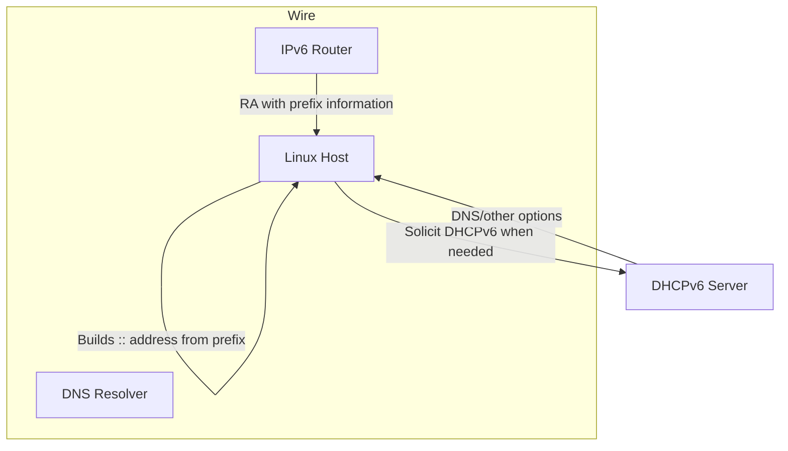
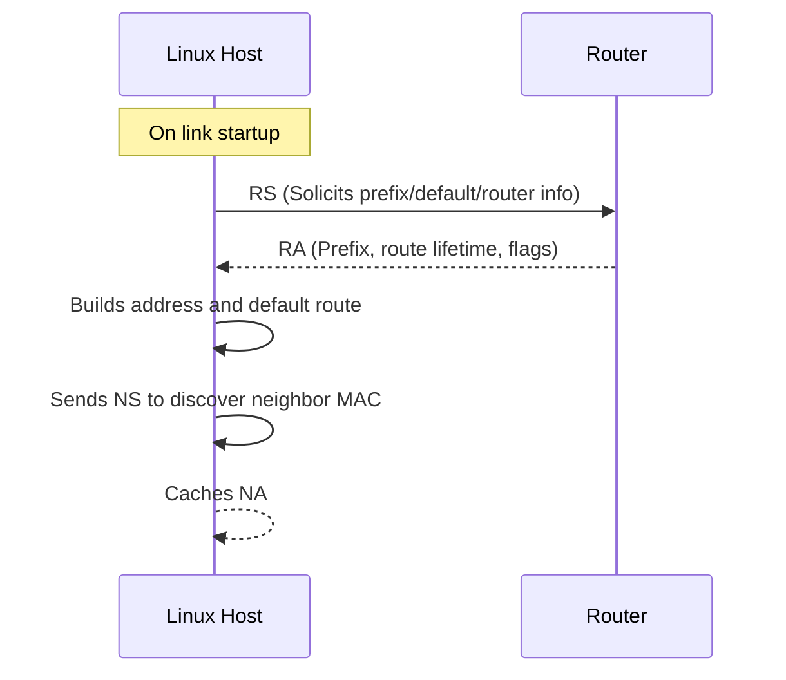

> **Complexity**: `[COMPLEX]`
>
> **Time to Complete**: 3.5 hours
>
> **Prerequisites**: IP subnetting fundamentals (`CIDR`, binary reasoning), `iproute2` basics, basic Linux shell debugging
>
> **Track**: Foundations — Advanced Networking

## Learning Outcomes

After completing this module, you will be able to:

1. **Explain** why IPv6 replaced IPv4 assumptions in modern architectures and **evaluate** how address-family transitions affect routing, security boundaries, and on-call workflows.
2. **Analyze** IPv6 address formats and classes, **design** deterministic subnet plans across GUA, ULA, link-local, and multicast prefixes, and **predict** where a host should send and accept traffic from each scope.
3. **Differentiate** stateless autoconfiguration and DHCPv6, then **design** assignment strategies that minimize operator mistakes in mixed IPv4/IPv6 estates.
4. **Debug** ND and address-resolution failures using Linux tooling and packet-visible signals, and **evaluate** whether an incident likely came from misconfigured SLAAC, RA filtering, DNS, or source/destination policy issues.

## Why This Module Matters

In January 2026, Cloudflare published a concrete postmortem where a routing-policy automation mistake leaked IPv6 prefixes from a Miami router to the wrong BGP neighbors, causing part of the backbone to carry unexpected traffic for 25 minutes, with peak dropped traffic around 12 Gbps [for non-downstream prefixes](https://blog.cloudflare.com/route-leak-incident-january-22-2026/). Even in a globally distributed provider, IPv6 behavior was at the center of impact, not because IPv6 is inherently unstable, but because the organization had moved many services into a dual-protocol environment where a conceptual mistake is now far more expensive. This is a realistic “real incident” pattern: most IPv6 outages happen not in protocol theory, but at the edge between protocol expectations and operations practice.

This module matters because many platform teams now operate hybrid estates where IPv4 and IPv6 co-exist, yet observability and incident runbooks are still written in IPv4-first assumptions. A packet captured at the wrong layer, a firewall that assumes IPv4-only tuple semantics, or a DNS decision that changes family precedence can create production instability that feels “random” unless the team understands IPv6-specific mechanics.

**The Phone Number Analogy (issue-anchor):** Imagine IPv4 as a city with 7-digit local numbers and a short city list, and IPv6 as a globally unique 16-digit prefix system. IPv4 worked when population was low; IPv6 is the only model that keeps numbers unique as growth accelerates. IPv6 addresses are like phone numbers with a country code (`2001:`), region block (`db8:`), and subscriber portion (`::42`), which makes routing and assignment far more scalable than squeezing an entire telecom into an outdated plan.

The direct lesson for platform engineers is this: if you can’t reason about how IPv6 addresses are formed and how Linux interprets them, you cannot design reliable dual-stack services or debug outages confidently. You can still pass superficial tests, but the first real incident will expose the gaps, and by then the fastest path to truth is usually the one that starts with addressing.

## Core Content

### 1) IPv6 addressing and format: what changed and why

IPv6 uses 128-bit addresses, represented as eight 16-bit hexadecimal blocks, which yields `2^128` total values. It replaces IPv4’s 32-bit space where an endpoint has only about `2^32` combinations (roughly 4.29 billion). That difference is not just larger math; it changes operations expectations. In IPv6-heavy environments, uniqueness and topology mapping cannot be solved by repeating exhausted patterns. You design allocation systems up front.

An IPv6 address often appears compressed, for example `2001:0db8:0000:0000:0000:ff00:0042:8329` can be rewritten as `2001:db8::ff00:42:8329`.

Compression is convenient but dangerous for humans. Double-colon `::` collapses one or more consecutive all-zero groups, and by design it can appear only once in any valid textual representation. Operators must keep this constraint in mind when writing scripts and comparing logs because naive string matching can incorrectly flag distinct addresses as equal.

Also remember that hexadecimal notation is base-16 grouping and **not** decimal dot notation. If an interface has host-derived bits ending in `::1`, the same host could still be a `/64` endpoint from a subnet perspective while also carrying multiple interface identifiers depending on protocol behavior and assignment method. This matters for subnet policy because route granularity and ACL design are often easier if you understand where host bits begin.

```ascii
IPv6 Address Anatomy
+---------+------------------------------+-----------------------------+
| Prefix | Interface Identifier / SLAAC ID | 128-bit total (binary scope) |
| 64 bits | 64 bits                        | 8 groups of 16-bit hex       |
+---------+------------------------------+-----------------------------+
      |
      +--> often represented as: 2001:db8:1234:10::aabb:ccdd
```

**Predict:** If someone gives you `2001:db8:abcd:1::42` and asks where this host sits in aggregate policy, what is the first step before applying any filter: prefix length review, interface identifier decomposition, or source policy context (application/host/interface)?

The answer is always prefix length first, then policy context. With IPv6 you often see `/56` or `/64` at enterprise level and `/120` in specialized management networks, so making this sequence muscle-memory reduces incident time.

Good IPv6 planning starts by separating the routeable prefix from the interface identifier. In IPv4-heavy habits, engineers often look for the host address first because the subnet is small enough to feel concrete. IPv6 reverses that instinct. The prefix tells you which organization, site, environment, or link owns the traffic path, while the lower bits may be generated automatically, randomized for privacy, or assigned by a management system. A stable troubleshooting method therefore begins with "who owns this prefix?" before asking "which exact host is this?"

That shift matters during reviews because the same written address can carry different operational meaning depending on prefix length. `2001:db8:abcd:1::42/64` can be an ordinary host address inside one site, while `2001:db8:abcd::/48` may represent a larger allocation that should never appear as a single endpoint. Teams that record only the compressed address and omit the prefix force every future reader to reconstruct intent from context. Teams that write both address and prefix length make routing, firewall, and DNS decisions easier to audit.

#### 1.1 Address types you must keep in your mental model

Four classes recur in operational conversations:

| Type | Prefix | Purpose |
|---|---|---|
| Global Unicast (GUA) | `2000::/3` | Internet-routable and globally unique when allocated via global registries |
| Unique Local Address (ULA) | `fc00::/7` | Internal-only addressing, often for private services and internal automation |
| Link-Local | `fe80::/10` | Auto-configured per-interface addresses for immediate-neighbor discovery |
| Multicast | `ff00::/8` | Group-based delivery replacing broadcast behavior |

ULA deserves one extra detail: `fc00::/7` is the RFC 4193/IANA block, but operational deployments normally generate local prefixes under `fd00::/8`; `fc00::/8` remains reserved rather than a source of ordinary local prefixes.

A strong mental distinction: **GUA** and ULA are unicast and represent endpoint identity, while multicast is destination semantics for groups. Link-local is operationally critical for neighbor discovery and control-plane protocols and is not a “weaker internet address” so much as a local transport scope.

The biggest novice trap is to treat `fe80::/10` as routable internet-facing traffic. It is not routable across subnets and should stay in scope where protocol intent expects local-layer discovery and protocol control, so it can be used safely without weakening perimeter assumptions.

The ULA choice is not a shortcut for avoiding design discipline. A `fd00::/8` prefix still needs ownership, collision avoidance, DNS policy, and firewall intent. Treating ULA as "private, therefore harmless" recreates an old IPv4 anti-pattern where internal networks become harder to reason about than public ones. A well-run environment can explain why a ULA exists, which systems may route it, and what happens if a host accidentally advertises it outside the intended boundary.

Multicast also changes operator instincts because IPv6 has no broadcast in the IPv4 sense. Neighbor discovery and local control flows use multicast groups with scoped meaning, which makes blanket "drop multicast" security guidance risky unless it is tied to the exact group and interface. When a firewall blocks the wrong ICMPv6 or multicast path, symptoms often look like random reachability failure even though the actual break is in local discovery. That is why address type, scope, and control-plane purpose should be read together.

#### 1.2 Common address decomposition workflow

For troubleshooting, you should always carry an order-of-operations checklist:

1. Confirm family with a strict command (`ip -6`) before assuming parser behavior.
2. Expand short-form mentally into canonical groups.
3. Verify prefix length and route scope.
4. Compare against policy assumptions (GUA vs ULA vs link-local).

```bash
ip -6 addr show dev eth0
ip -6 route show
ip -6 -j route show table all
```

A line like `inet6 2001:db8:10::42/64 scope global` is semantically very different from `inet6 fe80::42/64 scope link`. Scope affects whether the address can be forwarded outside link-local context.

### 2) SLAAC, DHCPv6, and why “stateless” still requires state awareness

SLAAC (Stateless Address Autoconfiguration) is often misunderstood because “stateless” sounds like “no control.” In practice, it means local address construction is performed without server-side per-host state. Routers send Router Advertisements (RA), hosts create addresses from prefix plus interface identifier, and normal IPv6 pathing can proceed without a DHCP lease for the base unicast.

This simplicity is useful for scale, but it hides operational tradeoffs:

- SLAAC works very well for host identity in dynamic environments.
- SLAAC does not itself convey all policy fields that DHCPv6 can carry.
- SLAAC and DHCPv6 may be used together in different combinations (`A`, `O`, and stateful patterns).



In many estates, DHCPv6 remains essential for deterministic DNS server assignment and enterprise governance even when SLAAC handles address generation.

**Try this:** In a lab with `iproute2` installed, compare route and DNS behaviors after disabling RA or disabling DHCPv6 in a Linux network namespace. Ask whether address loss or name-resolution behavior changes first, then inspect service impact.

#### 2.1 SLAAC vs DHCPv6 quick comparison

| Mode | How address obtained | What you control centrally | Best for |
|---|---|---|---|
| SLAAC only | RA prefix + interface identifier | Prefix and RA policy | Fast bootstrap, simple ephemeral workloads |
| SLAAC + DHCPv6 stateful | Host self-generates address, DHCPv6 for options/lease metadata | Options and optional additional params | Mixed environments needing policy-compliant DNS/resolution metadata |
| DHCPv6 stateful only | Full address from server | Central lease and full control | Highly regulated or tightly managed estates |

Note how `/64` remains the common SLAAC host-route length in much of the industry because it keeps EUI-64/IR-based host bits and privacy addressing behavior consistent, even though operators can and do use other masks where needed.

#### 2.2 Router Advertisement ownership and DHCPv6 boundaries

Router Advertisements are small messages with large consequences. They do not merely say "a router exists"; they can influence prefixes, default-route lifetime, and whether hosts should expect other configuration from DHCPv6. In a clean design, one team owns the RA policy, another may operate DHCPv6, and both agree on the address-assignment story before hosts join the network. In a weak design, RA and DHCPv6 are tuned independently and hosts receive a technically valid but operationally confusing mixture of signals.

The most important mental model is that SLAAC and DHCPv6 solve overlapping but not identical problems. SLAAC gives the host enough information to build an address and route, while DHCPv6 can provide managed options, leases, and policy metadata depending on mode. A host can therefore have IPv6 reachability while still missing the resolver or domain-search behavior an application expects. This split explains many incidents where "IPv6 works" at ping level but service discovery is still broken.

Privacy addressing adds another operational wrinkle. Modern clients may generate temporary interface identifiers so the host is not permanently trackable through a stable address suffix. That is good for user privacy, but it means inventory and allowlist processes must not assume that the lower 64 bits identify a machine forever. Servers, appliances, and managed hosts often need more deterministic addressing; client fleets often need privacy and churn tolerance. The policy should say which category a system belongs to.

During design review, ask what should happen when RA exists but DHCPv6 does not, when DHCPv6 exists but RA is absent, and when both exist but DNS options disagree. Those three cases reveal whether the team understands the actual control points. They also produce clear lab exercises: disable one component at a time, capture the route table and resolver behavior, and record which failure is expected instead of treating every mismatch as a surprise.

### 3) NDP: IPv6’s neighbor-resolution contract

ARP in IPv4 has a familiar function, but IPv6 replaces the discovery/announcement model with NDP messages encapsulated in ICMPv6: RS (Router Solicitation), RA (Router Advertisement), NS (Neighbor Solicitation), NA (Neighbor Advertisement), and Redirects. Operationally this means the protocol that builds address tables at layer 2/3 is different enough that old debugging instincts break.

NDP also underpins not just local neighbor reachability, but more broadly host-router relationships, address reachability for on-link detection, and part of router-first troubleshooting behavior on Linux.



```text
NDP Message Taxonomy
┌───────────────────┬──────────────────────────────┐
│ Message           │ Role                         │
├───────────────────┼──────────────────────────────┤
│ RS                │ Host asks for RA               │
│ RA                │ Router advertises prefixes     │
│ NS                │ Find neighbor/link-layer data   │
│ NA                │ Confirm mapping + reachability  │
│ Redirect          │ Suggest better next hop         │
└───────────────────┴──────────────────────────────┘
```

#### 3.1 NDP troubleshooting workflow that survives midnight incidents

A practical sequence when debugging a weird one-way path or intermittent service behavior:

1. Verify RA presence and timing in neighbor cache context.
2. Inspect neighbor table transitions (`ip -6 neigh`).
3. Confirm link-local source addresses on hop-by-hop messages when expected.
4. Validate that firewall rules are not dropping ICMPv6, especially types/codes used by NDP.
5. Only then move to higher-layer checks (DNS, service policy, route policy).

```bash
ip -6 -s neigh
ip -6 route get 2001:db8::1
ip -6 addr show dev eth0 | sed -n '1,80p'
```

The biggest misdiagnosis is to blame application DNS when RA/NDP is already failing because the host never becomes truly on-link visible.

#### 3.2 ICMPv6, caches, and why "ping is optional" is the wrong lesson

IPv4 culture taught many teams to block ICMP aggressively because echo requests felt like optional diagnostics. IPv6 makes that habit dangerous. ICMPv6 carries essential neighbor discovery and path-control behavior, so a firewall rule that treats all ICMP as low-value noise can break legitimate traffic before the application sees a packet. Security policy can still be strict, but it must distinguish echo behavior from protocol-required NDP and path messages rather than flattening them into one deny rule.

Neighbor caches also create delayed symptoms. A path can keep working briefly because the host already has a usable neighbor entry, then fail later when the cache expires and a blocked NS/NA exchange cannot refresh it. This makes some IPv6 incidents feel intermittent even when the configuration is consistently wrong. The lesson is to compare timing: if failures appear after cache lifetimes, after link churn, or after a route update, NDP evidence deserves priority over application logs.

Duplicate Address Detection is another reason the first packet is not always the first signal. Hosts must make sure an address is not already in use before assigning it, and that process depends on local discovery. If DAD is blocked, delayed, or noisy, addresses may fail to become usable even though the written prefix plan looks correct. A good incident note records whether the address is tentative, preferred, deprecated, or failed, because those states tell a more precise story than "the host has IPv6."

When teaching this workflow, keep ARP analogies short. Saying "NDP is IPv6 ARP" helps only for the first five minutes; after that it hides RA, redirects, DAD, and multicast scoping. A better operational statement is: NDP is the local IPv6 control contract that lets hosts find routers, prove neighbor reachability, and maintain address safety. That wording gives the learner more hooks for debugging.

### 4) IPv6 DNS and reverse zones: AAAA, ip6.arpa, and mixed-resolution behavior

DNS in IPv6 is not “new DNS,” but it adds practical surface area through AAAA records and longer reverse mapping spaces. The key concept is that forward and reverse records must align with address selection strategy, especially when both families are enabled.

An A record maps IPv4 names to IPv4 addresses; AAAA maps names to IPv6. Reverse lookups move from `in-addr.arpa` to `ip6.arpa`, where nibbles are reversed at the hex level. This is a major source of operational errors because people often generate reverse zones manually and forget nibble order. A compact example is useful in runbooks: `api.platform.example` resolves to `2001:db8:55::a00:20ff:fe7c:1f5`, while reverse naming expects `5.f.1.5.f.e.c.0.2.0.2.0.0.0.0.0.0.1.0.0.0...` when expanded to nibble format. Run these commands to verify both directions explicitly:

`getent ahosts api.platform.internal`, `dig +short AAAA api.platform.internal`, and `dig -x 2001:db8:55::a00:20ff:fe7c:1f5 +short`.

In dual-stack services, DNS policy can silently route failures into the wrong family during resolver behavior changes. A safe playbook for incident triage is to force family-specific resolution and compare outcomes; if one family fails while the other succeeds, you now have a scoped investigation area.

#### 4.1 How IPv6 DNS behavior affects application resilience

Some services degrade gracefully, resolving only one family and relying on OS preferences. Others fail fast when one family is broken due to strict API clients, ACL assumptions, or policy mismatch. Therefore, your design goal is not only “IPv6 works” but “IPv6 failures are observable and bounded.” This means:

- Keep AAAA and A monitoring in parallel.
- Ensure name resolution order is explicit in incident runbooks.
- Validate reverse zones for at least one canonical critical service before production rollout.

#### 4.2 Address selection and reverse lookup discipline

Forward DNS answers do not decide the whole connection path. Client libraries, operating-system address selection rules, cached responses, proxy settings, and application retry behavior can all influence whether an A or AAAA answer is attempted first. This means a healthy AAAA record can still produce user-visible slowness if the chosen IPv6 route is broken and the client waits before falling back. The diagnostic sequence should therefore capture both what DNS returned and what the client actually attempted.

Reverse DNS matters less for ordinary request routing than for operations evidence, but that does not make it optional. Logs, allowlist audits, abuse workflows, and incident timelines often need names that line up with addresses. If a critical service has a forward AAAA record but no usable reverse entry, the service may still function while the investigation becomes slower and less trustworthy. The cost appears during an incident, not during the first availability test.

The `ip6.arpa` nibble format is deliberately mechanical: expand the address to 32 hexadecimal nibbles, reverse them, and append the zone. Humans are bad at doing that by hand under pressure. Tools such as `dig -x` reduce copy-paste errors because they generate the correct reverse name from the address. Teach the format so learners understand what is happening, then teach the command so runbooks do not depend on manual nibble reversal.

The safest DNS test compares four views: `dig A`, `dig AAAA`, `dig -x`, and the application or shell command that opens the connection. If all four agree, the incident likely lives elsewhere. If forward and reverse disagree, naming discipline is suspect. If DNS looks good but the client chooses a failing address family, address selection or routing is the next layer. This four-view habit prevents teams from declaring DNS healthy too early.

### 5) Tools and operational workflows on Linux

Linux provides strong IPv6 workflows, but the CLI surface can be misleading if you do not internalize scope and family flags.

Common commands should be chosen by layer so the output tells you whether the failure is local state, path state, or name-resolution behavior:
- `ip -6` for addresses, links, neighbors, and routes.
- `ping -6` or `ping6` for basic reachability and path latency.
- `traceroute6` for path discovery.
- `tcpdump -i <iface> ip6` for packet-level inspection.
- `bpftrace` for kernel-level probes when packet drops need fine-grained visibility.

Modern Linux commonly prefers `ping -6`, while many systems still provide `ping6` as a compatibility command for older scripts and runbooks.

> **Important URL format difference:** bracket IPv6 literals in URLs, because unbracketed colons conflict with host and port parsing: `http://[::1]:8080` and `http://[2001:db8::10]:8080`.

```bash
# URL test with bracketed IPv6 literal
curl -g 'http://[2001:db8::10]:8080/healthz'

# Observe interface link-local communication
ip -6 addr
ip -6 neigh
ip -6 route
```

`ping -6` or `ping6` succeeds when one-way routing is broken less often than when DNS path is wrong; combine it with `tcpdump` to separate host, path, and app-layer failures.

```bash
ping -6 -c 3 fe80::1%eth0
ping -6 -c 3 2001:db8:55::10
ip -6 route get 2001:db8:55::10
```

#### 5.1 A repeatable Linux tool sequence

The best IPv6 command sequence starts wide and narrows quickly. First, confirm what the host believes about its interfaces with `ip -6 addr show`; then confirm where it would send a packet with `ip -6 route get`; then confirm whether the next hop or peer is visible with `ip -6 neigh`. This order avoids a common trap where the operator tests an endpoint before proving the local host has a coherent source address and route.

After local state looks plausible, test a path with a command that forces the address family. `ping -6` is useful because it removes resolver ambiguity, but it is not a complete application test. A successful echo only proves that a particular ICMPv6 path worked at that moment. You still need a TCP or UDP check that matches the real service protocol, plus a socket view such as `ss -6` when listener scope might be wrong.

Packet capture is the bridge between host state and path state. `tcpdump -i <iface> ip6` can show whether RS, RA, NS, NA, and application packets appear on the expected interface. If no packets appear, the failure may be before the wire: wrong source address, wrong route, local firewall, or application bind. If packets appear but no answer returns, the path or peer is more suspicious. The evidence changes the next command.

When kernel tracing is available, use it as a calibration tool before treating it as a verdict. A concrete tracepoint that emits for a known local test builds confidence that the tool is attached correctly. If the tracepoint is silent during the known test, fix the probe, permissions, or kernel compatibility before interpreting silence during the real incident. This small discipline prevents a second troubleshooting problem from masquerading as the first.

```ascii
IPv6 Troubleshooting Triage Ladder
┌───────────────────────────────┐
│ 1) Family and scope
│ 2) Address format and prefix
│ 3) NDP presence
│ 4) Route and firewall path
│ 5) DNS forward/reverse consistency
│ 6) Service response behavior
└───────────────────────────────┘
```

### 6) Practical design checklists for IPv6 in production

When designing IPv6 for production service estates, teams usually fail in one of four ways: wrong `/` mask assumptions, mixed link-local misuse, RA over-permissiveness, and brittle DNS cutover playbooks. Build a design habit around explicit policy documents and testable assumptions.

```text
DESIGN REVIEW SHEET FOR IPV6
════════════════════════════════════════════════════
- Which prefixes are global routable?
- Which are private-only and why?
- Which control-plane protocols rely on link-local scope?
- Where is IPv6-first-family logic in service startup?
- Which observability command is the first signal?
- What is the rollback path for address-family regressions?
════════════════════════════════════════════════════
```

For platform teams, an often useful policy is to require a minimum set of checks before any production rollout:

- Route table deterministic for each workload class.
- DNS forward/reverse assertions for at least one service per environment.
- Link-local and default route validity on each node class.
- A documented fallback strategy for IPv6-only control-plane traffic during partial failures.

At this point, this module shifts from vocabulary to execution. The goal is to turn IPv6 knowledge into an engineering system that behaves predictably under failure.

```ascii
Design maturity ladder
━━━━━━━━━━━━━━━━━━━━
1) Knowledge: address formats, prefixing, RA semantics
2) Reproducibility: lab notebooks, expected commands, baseline captures
3) Determinism: documented fallback path and explicit family policy
4) Confidence: incident drills with objective pass/fail criteria
```

#### 6.1 Migration design and address planning

Most production outages around IPv6 are not caused by malformed packets arriving from the internet; they are caused by wrong assumptions made by humans and scripts.

If your design starts with a random `/64` everywhere, you lose the opportunity to model intent. Start instead with a matrix that aligns business role, link role, and route policy:

```text
Intentional prefix planning matrix
+----------------------+-----------------------+----------------------------+-----------------------------+
| Network scope        | Suggested prefix size  | Why it is sized this way    | Failure mode if wrong        |
+----------------------+-----------------------+----------------------------+-----------------------------+
| Application ingress   | /56 or /64            | Balance route aggregation +  | Overlapping subnets at edge  |
|                      |                        | easier ownership            |                             |
| Node-to-node links    | /127                  | Reduce ambiguity on p2p      | Duplicate-like neighbor state |
|                      |                        | adjacency behavior          |                             |
| Management/control    | /64 or /120           | Policy clarity + readability | Unexpected scope/route drift  |
|                      |                        |                              |                             |
| Internal tooling VPC  | ULA (`fd00::/8`)      | Keep non-production tooling  | Inadvertent public exposure   |
|                      |                        | off core perimeter           |                              |
| Public-facing API     | GUA (`2000::/3`)      | Required for global reachability| Non-routable behavior in tests |
+----------------------+-----------------------+----------------------------+-----------------------------+
```

**Predict:** Where is `/127` usually safer than `/64`, and what operational risk does that trade for?  
**Try:** In a notebook, sketch one node-to-node adjacency with both masks and predict how neighbor cache should differ.

```bash
# Keep a migration register for deterministic review
cat > /tmp/ipv6-prefix-register.md <<'EOF'
## Prefix register
- Name: app-edge
  Subnet: 2001:db8:10::/56
  Child subnets:
  - region-a: 2001:db8:10:10::/64
  - region-b: 2001:db8:10:20::/64

- Name: p2p-spine
  Subnet: 2001:db8:fe::/127
  Notes: one address per node, strict neighbor checks
EOF
```

#### 6.2 Family-policy controls that stay platform-agnostic

This foundation module stops at network and host readiness. Kubernetes API fields, Service family policies, CNI-specific rollout patterns, and cluster-observability tool integrations belong in the follow-on dual-stack Kubernetes module, where the platform-specific contracts can be taught without blurring the base protocol model.

The useful control at this layer is a short, reusable family-policy card. It should answer questions that apply to bare Linux hosts, appliances, virtual machines, cloud load balancers, and later cluster implementations alike:

```text
IPv6 family-policy card
1) Which prefixes are routable outside the site, and which are ULA-only?
2) Which interfaces are expected to have link-local addresses only?
3) Which DNS names must publish AAAA, and which require reverse DNS?
4) Which ICMPv6 types must be allowed for NDP and path health?
5) Which command proves the first failing layer during rollback?
```

Do not turn this card into a product config. Its value is that it records intent before implementation details appear. If a later system uses Kubernetes, a network appliance, or a cloud control plane, the same answers should still constrain the design.

```ascii
Family behavior before product behavior
+----------------------+-------------------------+
| Question             | Evidence                |
+----------------------+-------------------------+
| Address scope        | ip -6 addr / prefix map |
| Route expectation    | ip -6 route get target  |
| Neighbor health      | ip -6 neigh / tcpdump   |
| DNS family behavior  | dig A, dig AAAA, dig -x |
| Service bind scope   | ss -6 and app logs      |
+----------------------+-------------------------+
```

> **Try this:** Write one family-policy card for a simple web service before picking any orchestration technology. If the card cannot say which address family should fail open or fail closed, the design is not ready for a dual-stack rollout.

#### 6.3 Operational SLAAC vs DHCPv6 decision matrix

The design choice between SLAAC, SLAAC+DHCPv6, and DHCPv6-only is a practical controls question rather than a taste preference.

```text
Decision matrix
+-----------------------+---------------------+--------------------------+-----------------------+
| Requirement           | SLAAC only          | SLAAC + DHCPv6           | DHCPv6 only           |
+-----------------------+---------------------+--------------------------+-----------------------+
| Automatic scale       | Excellent           | Good                     | Good                  |
| Central DNS control    | Limited             | Strong                   | Strong                |
| Operator predictability| Moderate            | High                     | High                  |
| Compliance artifacts   | Weak to moderate    | Strong                   | Strong                |
| Troubleshooting pace   | Fast bootstrap      | Fast in regulated ops     | Fastest for policy    |
+-----------------------+---------------------+--------------------------+-----------------------+
```

A common production pattern is:

- bootstrap networking with SLAAC,
- use DHCPv6 for policy-critical metadata,
- continuously validate that DNS and host-assignment semantics remain coherent.

```bash
ip -6 addr | grep -E "global|link"
grep -R "dhcp6" /etc/dhcp/ /var/log 2>/dev/null | head -n 20
```

This is where outcome 3 can become concrete: can your team **differentiate** when SLAAC alone is enough, and **design** where DHCPv6 must remain mandatory?

#### 6.4 IPv6 failure simulation drill (realistic and repeatable)

Readiness comes from scenario rehearsal, not from one-time command memorization.

Run three repeatable fault patterns, each with fixed expected artifacts and deterministic outcomes for the same baseline.

1. Scope inversion drill: link-local-only responder recorded as a global target.
2. RA visibility drill: observe route context before and after expected advertisements.
3. DNS precedence drill: remove or override an AAAA answer in a lab resolver and observe fallback behavior.

For every drill, capture at least three evidence classes in one shared record: neighbor transitions, route-table behavior, and DNS family resolution outcomes.

- Packet view: `tcpdump` for ICMPv6 / NDP messages.
- Route view: `ip -6 route` and neighbor transitions.
- Service view: endpoint availability, retry patterns, and error classes.

```text
Drill timeline
T+00:00 baseline capture
T+00:10 inject one controlled fault
T+00:15 verify first signal + alert
T+00:30 rollback
T+00:45 post-incident artifact
```

```text
Predict and test:
If AAAA is removed during a dual-stack transition and no resolver family policy exists,
should the expected outcome be graceful IPv4 continuity, partial service behavior, or full failover loss?
```

Set objective scoring with explicit thresholds for recovery latency, evidence completeness, and rollback reversibility.

- Baseline captured in under 2 minutes.
- First signal identified in under 60 seconds.
- Recovery completed in under 5 minutes.
- Postmortem template completed with root family and command evidence.

#### 6.5 BPF-enabled investigation with bpftrace

This course includes a platform-adjacent observability requirement. In incident response, a minimal IPv6 BPF probe is often the quickest way to prove whether packets enter expected kernel paths without assuming the application layer is guilty.

```bash
id -u
uname -r
sudo bpftrace -l 'kprobe:ndisc*' | head -n 20
```

```bash
# Small control probe for IPv6 delivery signals
sudo bpftrace -e '
tracepoint:ipv6:ipv6_deliver { @[comm] = count(); }
interval:s:5 { exit(); }
'
```

If output is empty, avoid assuming protocol failure first:

- Validate kernel tracepoint compatibility and permissions.
- Validate traffic path (is traffic truly in IPv6 path?).
- Validate whether the selected command triggers the specific probe.

```ascii
Troubleshoot decision path
┌───────────────────────────┐
│ Is probe output expected? │
│ at command level?         │
└────────────┬──────────────┘
             │No
             ▼
      Check privileges / tracepoints
             │
             ├─ Kernel permissions?
             ├─ Tracepoint exists?
             └─ Correct traffic class?
             │
             ▼
        Capture evidence and continue
```

#### 6.6 Platform-ready IPv6 runbook (short version for on-call)

For production teams, keep this compact list visible:

```text
IPv6 Incident Runbook v1
1) Confirm family in error path (`ip -6`)
2) Confirm scope and route (`ip -6 route`, `ip -6 neigh`)
3) Confirm RA/NDP behavior
4) Confirm DNS consistency (`dig AAAA`, `dig -x`)
5) Confirm endpoint binding and policy
6) Confirm bpftrace control probe viability
7) Apply reversible change (RA, DNS, policy, route)
8) Roll forward or rollback with evidence
```

> **Try this:** Execute checks 1 through 4 first in a controlled lab and explain the failure class before reading application logs.

#### 6.7 Capacity-aware IPv6 planning and performance realism

At scale, the IPv6 design story is not only about routing correctness; it is also about cache pressure, table size, and human observability bandwidth. Teams who only plan addresses and ignore operating capacity often discover a second-order failure: the network becomes technically correct but hard to diagnose.

The practical model is to treat capacity as a first-class line item in each design document. Route tables may grow during transition phases, neighbor caches can look noisy during churn, and policy checks may branch differently once each connection can negotiate family preference.

```text
Capacity thinking checklist
+--------------------------------------+--------------------------------+
| Symptom                              | Mitigation                     |
+--------------------------------------+--------------------------------+
| Noisy neighbor transitions           | Tighten expected NDP windows   |
| Ambiguous scope in incident scripts  | Add scope-specific fields      |
| BPF probe empty despite traffic      | Validate tracepoint selection  |
| DNS looks healthy but path fails     | Compare AAAA, route, and bind  |
+--------------------------------------+--------------------------------+
```

This framing aligns with incident leadership: when someone says "it works in the lab," ask what evidence would still be clear during a high-pressure rollout at night.

#### 6.8 Field journal: one compact rehearsal loop

Use one short field journal instead of repeating the same command loop for every scenario. Choose a stable Linux host with `iproute2`, `dig`, and optional `bpftrace`. Before changing anything, write a four-column note: command, observed state, expected state, next action.

```bash
ip -6 addr show
ip -6 route show
ip -6 neigh show
dig +short AAAA localhost
dig -x 2001:db8:55::10 +short
```

Then make one prediction before each command family. The prediction is the real learning step: if `ip -6 route get ::1` succeeds but a global test prefix has no route, say whether that is expected for loopback-only validation or evidence of a broken external path.

```bash
ip -6 route get ::1
ip -6 route get 2001:db8:55::10
ping -6 -c 1 -W 1 2001:db8:ffff::1 || true
```

Add one neighbor and socket pass so routing success does not hide service-scope mistakes:

```bash
ip -6 neigh
ss -6lntup | head -n 20
```

If `bpftrace` is available, calibrate one concrete tracepoint before using it as evidence. A missing probe output should trigger probe validation first, not an immediate protocol conclusion.

```bash
sudo bpftrace -l 'tracepoint:ipv6:*' | head -n 20
sudo bpftrace -e 'tracepoint:ipv6:ipv6_deliver { @[comm] = count(); } interval:s:5 { exit(); }' 2>/dev/null
```

Close the journal by naming one reversible action. If you applied a temporary route, DNS override, firewall rule, or interface change in a lab, remove that exact change and rerun the baseline commands. If you did not alter state, the rollback note should explicitly say "no persistent change made." That habit prevents ambiguous cleanup during real incidents.

The objective is that each engineer can describe IPv6 behavior in terms of three things: expected state, expected symptom, and expected recovery. If that sentence is easy to say, the module has moved from passive reading into operational capability.

#### 6.9 Platform-neutral design review walkthrough

Imagine a team preparing to expose one customer-facing API over IPv6 while keeping the existing IPv4 path available. The work is not a Kubernetes task yet, and it is not a firewall task alone. It is a family-transition task that touches prefix ownership, DNS records, listener behavior, routing, monitoring, and rollback language. The review should begin by naming those layers explicitly so no team can assume another team already handled the family-specific part.

The first artifact is an address plan that separates public reachability from internal-only reachability. A public API should use a GUA allocation with a documented owner and route announcement path. Internal automation can use ULA, but only when the document also states who may route it and which DNS names should never resolve publicly. Link-local addresses should appear only as local control-plane evidence, not as stable service targets. This one page prevents the most common scope confusion before commands enter the conversation.

The second artifact is a name-resolution plan. It should say which hostnames publish AAAA records, whether A and AAAA lifecycles are tied together, and how reverse DNS is generated. The rollback plan should include the exact DNS action and the expected client effect. Removing an AAAA record is not the same as fixing the IPv6 path; it is a traffic-shaping decision that can reduce impact while the root cause is investigated. Writing that distinction avoids treating rollback as proof that IPv6 was the problem.

The third artifact is a listener and source-address plan. Services that bind to `::` may accept IPv6 on all interfaces depending on operating-system and application behavior; services that bind to `::1` are local-only; services that bind only to an IPv4 literal will not become reachable just because DNS has an AAAA answer. A review should ask the application owner to prove which address family the process listens on and which source address outbound checks will use. This is still protocol foundations, not product-specific configuration.

The fourth artifact is an ICMPv6 and firewall statement. A secure environment can be restrictive, but it cannot be vague. The policy should identify which NDP and path messages are allowed, where echo is allowed or denied, and how the team will distinguish an intentional deny from a broken discovery path. If the policy owner cannot explain the difference between blocking arbitrary probes and blocking essential neighbor discovery, the rollout is not ready.

The fifth artifact is an observation plan that works before the incident starts. It should define what a normal `ip -6 route get` result looks like for one representative target, what a healthy neighbor table looks like during quiet periods, and which DNS command confirms reverse lookup behavior. The point is not to store endless command output. The point is to know what "normal enough" looks like so a responder can recognize meaningful deviation quickly.

A strong review then turns each artifact into a failure prediction. If DNS is wrong, users should see one class of symptom. If listener scope is wrong, packet arrival and socket state should disagree. If NDP is broken, route and DNS may look fine while neighbor state degrades. If firewall policy is wrong, packet capture should show a different story than application logs. These predictions are valuable because they give responders a map before stress and alerts distort the discussion.

During rollout, avoid the phrase "turn on IPv6" unless the scope is tiny and reversible. A safer phrase is "make this named path reachable over IPv6 under these constraints." That wording forces the team to name the actual service, prefix, DNS name, listener, policy boundary, and rollback condition. It also prevents accidental expansion from one tested path to a broader estate that was never reviewed. Good IPv6 work is often slower at the sentence level and faster during incidents.

When a failure appears, the recovery discussion should repair assumptions rather than only restoring traffic. If the root cause is a missing reverse zone, update the DNS generation process. If it is a listener bound to loopback, update service templates or deployment documentation. If it is blocked NDP, update firewall review criteria. If it is address-selection behavior in one client, add that client to the compatibility matrix. Each fix should leave behind a better review question for the next rollout.

This walkthrough is intentionally platform-neutral because the same logic survives technology changes. A later module can map these controls onto Kubernetes Services, Pod CIDRs, CNI behavior, and cluster rollout waves. At this layer, the learner should instead master the invariant reasoning: addresses have scope, routes express intent, DNS changes client choices, NDP makes local reachability real, and observability must prove the layer that failed. Those concepts are portable, which is exactly why they belong in a foundations module.

#### 6.10 Handoff criteria for teams that share IPv6 ownership

IPv6 work often crosses organizational boundaries, so handoff quality matters as much as command knowledge. Network engineering may own prefix allocation and routing, security may own filtering, application teams may own listener behavior, and operations may own incident evidence. A poor handoff says "IPv6 enabled" and leaves every reader to guess the scope. A useful handoff says which address family changed, which prefixes were affected, which evidence proved success, and which rollback remained available.

For design documents, require a plain-language risk sentence. Good examples sound like: "If AAAA records are published before listener scope is verified, clients that prefer IPv6 may see connection timeouts while IPv4 clients remain healthy." That sentence is not fancy, but it is actionable. It names the condition, the affected client group, and the visible symptom. Reviewers can then ask for the exact command or test that proves the condition is controlled.

For incident notes, require layer-specific evidence rather than generic screenshots. A route command explains local forwarding intent, a neighbor command explains local discovery state, a DNS command explains name choice, and a socket command explains service binding. A single dashboard may be useful, but it rarely distinguishes these layers by itself. The handoff should therefore preserve enough raw command evidence that another engineer can reconstruct the reasoning without relying on memory.

For rollback, require an owner and a criterion. "Rollback if errors increase" is too vague for a family transition because errors may increase after DNS cache delay, client retry behavior, or neighbor cache expiration. Better criteria name the signal: rollback the AAAA publication if IPv6 connection attempts fail above the agreed threshold while IPv4 remains healthy, or revert a route policy if `ip -6 route get` and packet capture disagree after the planned change. Specific criteria reduce argument during pressure.

Finally, treat every IPv6 handoff as a small training artifact. The next reader should learn one thing about scope, control messages, DNS, or tooling from the way the change was documented. This does not mean turning every ticket into a textbook. It means writing decisions in a way that future responders can reuse. Over time, the team builds a shared language where IPv6 is not a specialist corner, but an ordinary part of reliable service design.

### See also: where these foundations appear later

After this module, IPv6 terms appear inside Kubernetes networking material, but the cluster-specific mechanics are intentionally taught elsewhere. Revisit these existing inline references when you want to see the vocabulary in context: [EndpointSlices and dual-stack discovery](/k8s/cka/part3-services-networking/module-3.2-endpoints/), [CNI CIDR planning and dual-stack capacity](/k8s/cka/part3-services-networking/module-3.7-cni/), [network troubleshooting with address-family notes](/k8s/cka/part5-troubleshooting/module-5.5-networking/), and [CKS network-security checks for IPv6 listeners](/k8s/cks/part3-system-hardening/module-3.4-network-security/).

## Did You Know?

- IPv6 has `128` bits per address, which means `2^128` values. That is approximately `3.4 × 10^38`, often described as `340 undecillion` in decimal terms.
- The IPv6 link-local range is `fe80::/10`, and these addresses are always expected to remain within the local link for neighbor and control-plane discovery.
- SLAAC workflows commonly use `/64` network prefixes, giving hosts `2^64` possibilities for interface identifiers within a subnet.
- The Cloudflare route leak incident in January 2026 affected traffic for `25` minutes and included around `12 Gbps` of IPv6 traffic discarded at a backbone edge during congestion.

## Common Mistakes

| Mistake | Why it hurts | Fix |
|---|---|---|
| Treating `fe80::/10` as routable internet traffic | Link-local is neighbor-only and not meant to carry general service traffic | Reserve link-local for local discovery, RA, and protocol-level control | 
| Using `/64` as a hard rule in every management network including WAN point-to-point links | Some point-to-point and management links are better served with `/127` or `/126` planning for ambiguity reduction | Apply route-design intention explicitly (endpoint density vs operational safety) |
| Assuming `/64` means “default for all interfaces” without checking transport expectations | Point-to-point adjacencies and transit links may need different masks and neighbor expectations | Decide mask strategy per link role, not by habit |
| Enabling `::1` and GUA responses interchangeably without endpoint validation | Service health checks can pass while clients route to non-service endpoints in mixed policy | Validate DNS records and service binding per family explicitly |
| Forgetting to bracket IPv6 URLs | `http://[2001:db8::10]:8080` is required by URI rules for most clients and docs | Use bracketed literals whenever addressing endpoints in text and automation |
| Assuming DHCPv6 is optional in all environments because “SLAAC is enough” | DNS, options, and option-based policy still need deterministic behavior in many systems | Document where SLAAC alone is acceptable and where DHCPv6 is mandatory |
| Mixing IPv4 and IPv6 families without explicit policy ordering | Fallback logic varies by resolver and can create non-deterministic incident behavior | Define resolver precedence and family failover in deployment guides |
| Ignoring ICMPv6 in firewall policy except ping | ICMPv6 carries protocol-essential control messages, including NDP behavior | Keep explicit ICMPv6 allow rules tied to operational policy rather than broad deny assumptions |

## Quiz

1. 
<details>
<summary>Your platform has `fe80::1` on all nodes and `2001:db8:55::/64` on the same subnet, but service calls intermittently fail from one node to another. Which IPv6-specific check should be first: (A) disable firewall temporarily, (B) confirm link-local reachability with `ip -6 neigh` and RA presence, (C) restart the application, or (D) force AAAA to IPv4 only.</summary>
Correct answer: B. Intermittent cross-host failure in IPv6 networks with mixed scopes often starts with neighbor discovery and link-local reachability.

This is a layer-2/3 control-plane symptom first, not an application bug. Before any remediation, capture whether RA/NDP messages are present and whether neighbor-cache state is stable. If this fails, restarting app logic usually masks the root cause and extends MTTR.
</details>

2. 
<details>
<summary>A platform team must choose address assignment for a mixed environment. Which option best **differentiates** SLAAC and DHCPv6 behavior while still producing a design that is operationally stable?</summary>
A) SLAAC and DHCPv6 are identical; both require per-host state and central DNS policy.
B) DHCPv6 is needed only for IPv4 coexistence, while SLAAC only works for link-local traffic.
C) SLAAC provides host-address derivation from prefixes with little per-host lease state; DHCPv6 adds managed metadata or full addressing, so stable fleets often use SLAAC + DHCPv6 for policy-critical roles.
D) SLAAC always provides deterministic DNS and security policy, while DHCPv6 can only be used for test labs.

Correct answer: C. SLAAC can scale quickly and handles autoconfiguration, while DHCPv6 is often required where deterministic metadata, DNS options, or centralized policy is mandatory. A common stable design is SLAAC for bootstrap plus DHCPv6 for policy-intensive workloads.

The key design rule is not “one protocol everywhere,” but “role-aligned assignment policy”: pick the mechanism that balances bootstrap speed with operational governance needs.
</details>

3. 
<details>
<summary>Which statement most accurately captures NDP versus ARP behavior?</summary>
A) ARP and NDP are equivalent and interchangeable in both IPv4 and IPv6.
B) NDP is only used for DNS, while ARP handles address-to-MAC mappings.
C) NDP runs in IPv6 control paths using ICMPv6 messages like RS, RA, NS, and NA; ARP is IPv4-specific.
D) NDP is only for multicast and cannot perform neighbor resolution.

Correct answer: C. ARP is IPv4-specific for IP-to-MAC mapping. IPv6 uses NDP for equivalent discovery functions plus router announcement/neighbor control flow.

The practical implication: a troubleshooting script that copies IPv4 checks to IPv6 one-to-one often misses critical RA/NS/NA signals.
</details>

4. 
<details>
<summary>A service has correct AAAA records, but many clients fail with high latency after dual-stack rollout. What is the most evidence-driven first diagnostic sequence?</summary>
A) Restart network daemons first.
B) Force all clients to IPv4 and defer IPv6 changes.
C) Validate AAAA reachability, reverse DNS expectations (`ip6.arpa`), then NDP and route scope on affected paths.
D) Disable all DNS caching and flush browser caches.

Correct answer: C. This sequence isolates layer order: protocol reachability and address correctness first, then naming consistency and neighbor/path control signals.

It is tempting to force IPv4, but that often hides a systemic address-family issue and can turn a temporary rollout gap into a permanent technical debt item.
</details>

5. 
<details>
<summary>A packet capture indicates successful ND messages but still no service response. Which IPv6 behavior is most likely still breaking, and what should be checked next?</summary>
A) The endpoint may be using `::1` only locally while clients use global unicast; validate service bind addresses and security policy.
B) RA is wrong; no additional checks needed.
C) Address lengths are always fixed, so there is no additional issue.
D) The issue is always TCP checksum in ICMPv6.

Correct answer: A. ND may be healthy while service plane still binds only loopback or wrong scope. After NDP validation, check endpoint listeners and family-aware policy.

This is a common operations mismatch: control-plane discovery passes, but service binding and policy rules are scoped incorrectly.
</details>

6. 
<details>
<summary>In a mixed environment, why does writing `::` without scoping in local commands sometimes fail where IPv4 still appears fine?</summary>
A) IPv6 has no compression and `::` is not valid.
B) Interface scope, especially on link-local addresses, is frequently required and missing scope leads to ambiguous interface selection.
C) Link-local addresses are automatically routable across subnets.
D) IPv6 has no concept of interface context.

Correct answer: B. Link-local addresses are scoped and typically need interface context (for example `%eth0`) when resolved in per-node tools.

This is one of the highest-frequency operator errors in Linux when validating local behavior. The address itself may be correct, but the selected interface is not.
</details>

7. 
<details>
<summary>A team deploys `bpftrace` probes and sees no output during an IPv6 path incident. Which interpretation is most defensible first?</summary>
A) IPv6 is impossible to observe with eBPF.
B) The tracepoint/program name is probably wrong, execution path is not matching selected probes, or node permissions are incomplete.
C) NDP does not involve the kernel.
D) The packet path is definitely external-only.

Correct answer: B. Probe selection and kernel capability context matter. Missing output is often a targeting or permission issue, not necessarily a protocol failure.

Before any claim of product defect, validate probe attachment points and execute a small control command that should trigger known events.
</details>

## Hands-on Exercise

This exercise is designed for any Linux host with `bpftrace` installed and `iproute2` available.

### Goal

Build and verify core IPv6 troubleshooting visibility with `ip -6`, `ping -6` or `ping6`, DNS checks, and a focused `bpftrace` probe.

### Task

```bash
command -v bpftrace >/dev/null
ip -6 addr show
ip -6 route show
ping -6 -c 2 ::1
```

1. **Collect baseline evidence from your current network namespace**
   1. Confirm IPv6 is enabled and discover all addresses in your current network namespace.
   2. Verify loopback IPv6 (`::1`) responds to `ping -6` or `ping6`.
2. **Inspect scope-aware addressing and routes**
   1. Identify one link-local and one global unicast address from `ip -6 addr show`.
   2. Run a route lookup for the global address and a neighbor lookup for link-local peer reachability.
3. **Probe IPv6 neighbor discovery behavior**
   1. Run a minimal bpftrace snippet with root privileges to observe kernel entry for NDP-related probes.
   2. Capture command output and verify event count changes when you issue an ICMPv6 neighbor query.
4. **Validate DNS family behavior**
   1. Resolve both A and AAAA for a known host.
   2. Compare `ping -6` behavior to verify actual packet path capability.

### Success Criteria

- [ ] `ip -6 addr show` includes at least one `scope link` and one `scope global` example in the environment where expected.
- [ ] `ping -6` or `ping6` succeeds to local loopback and fails only with intentional changes.
- [ ] `ip -6 neigh` and `ip -6 route get` reflect expected neighbor and next-hop behavior.
- [ ] At least one `bpftrace` control command executes successfully and emits an event when ICMPv6 traffic is generated.
- [ ] DNS checks demonstrate that AAAA values and expected IPv6 reachability are not silently ignored.

### Verification Commands

```bash
# Baseline (safe commands)
ip -6 addr show
dig +short AAAA localhost
ip -6 neigh
ip -6 route get ::1

# Optional IPv6-only NDP observability using bpftrace (requires privileges)
sudo bpftrace -l 'kprobe:ndisc*' | head -n 20

# Minimal control probe
sudo bpftrace -e 'tracepoint:ipv6:ipv6_deliver { @[comm] = count(); } interval:s:5 { exit(); }' 2>/dev/null || true
```

> **Try this:** Before declaring success, run one command that intentionally fails (for example, `ping -6` to an unroutable test address) and verify you can trace where validation should stop: resolver, route, or neighbor scope.

## Next Module

The canonical follow-on is the planned [Dual-stack K8s Setup module in issue #1523](https://github.com/kube-dojo/kube-dojo.github.io/issues/1523), which will layer Kubernetes-specific Services, Pod CIDRs, and cluster rollout mechanics on top of these foundations. Until that lands, use the upstream [Kubernetes dual-stack networking overview](https://kubernetes.io/docs/concepts/services-networking/dual-stack/) as a reference, not as this module’s main teaching path.

## Sources

- [RFC 4291: IPv6 Addressing Architecture](https://www.rfc-editor.org/rfc/rfc4291.html)
- [RFC 4861: Neighbor Discovery for IPv6](https://www.rfc-editor.org/rfc/rfc4861.html)
- [RFC 4862: IPv6 Stateless Address Autoconfiguration](https://www.rfc-editor.org/rfc/rfc4862.html)
- [RFC 4193: Unique Local IPv6 Unicast Addresses](https://www.rfc-editor.org/rfc/rfc4193.html)
- [RFC 5952: A Recommendation for IPv6 Address Text Representation](https://www.rfc-editor.org/rfc/rfc5952.html)
- [IANA IPv6 address registry](https://www.iana.org/assignments/ipv6-address-space/ipv6-address-space.xhtml)
- [IANA IP address space](https://www.iana.org/assignments/ip-address-space/ip-address-space.xhtml)
- [RFC7908](https://datatracker.ietf.org/doc/html/rfc7908)
- [Linux iproute2 man page](https://man7.org/linux/man-pages/man8/ip.8.html)
- [ping6 man page](https://man7.org/linux/man-pages/man8/ping6.8.html)
- [bpftrace project documentation](https://github.com/bpftrace/bpftrace)
- [Cloudflare route leak incident on January 22, 2026](https://blog.cloudflare.com/route-leak-incident-january-22-2026/)
- [Kubernetes IPv6 and dual-stack networking overview](https://kubernetes.io/docs/concepts/services-networking/dual-stack/)
