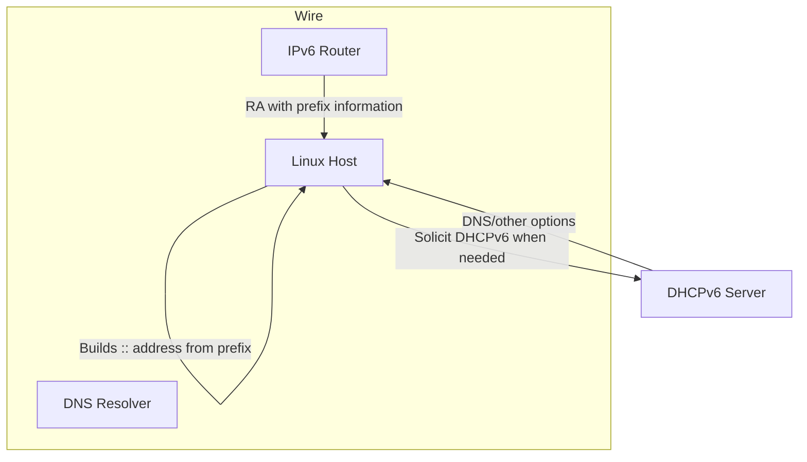
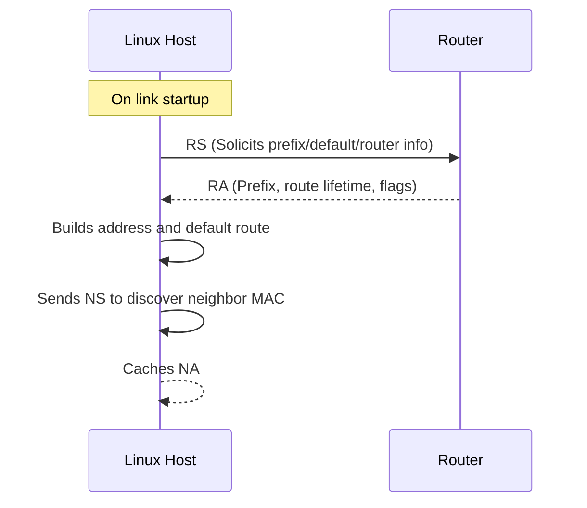

> **Complexity**: `[COMPLEX]`
>
> **Time to Complete**: 3.5 hours
>
> **Prerequisites**: IP subnetting fundamentals (`CIDR`, binary reasoning), `iproute2` basics, basic Linux shell debugging
>
> **Track**: Foundations — Advanced Networking

## Learning Outcomes

After completing this module, you will be able to:

1. **Explain** why IPv6 replaced IPv4 assumptions in modern architectures and **evaluate** how address-family transitions affect routing, security boundaries, and on-call workflows.
2. **Analyze** IPv6 address formats and classes, **design** deterministic subnet plans across GUA, ULA, link-local, and multicast prefixes, and **predict** where a host should send and accept traffic from each scope.
3. **Differentiate** stateless autoconfiguration and DHCPv6, then **design** assignment strategies that minimize operator mistakes in mixed IPv4/IPv6 estates.
4. **Debug** ND and address-resolution failures using Linux tooling and packet-visible signals, and **evaluate** whether an incident likely came from misconfigured SLAAC, RA filtering, DNS, or source/destination policy issues.

## Why This Module Matters

In January 2026, Cloudflare published a concrete postmortem where a routing-policy automation mistake leaked IPv6 prefixes from a Miami router to the wrong BGP neighbors, causing part of the backbone to carry unexpected traffic for 25 minutes, with peak dropped traffic around 12 Gbps [for non-downstream prefixes](https://blog.cloudflare.com/route-leak-incident-january-22-2026/). Even in a globally distributed provider, IPv6 behavior was at the center of impact, not because IPv6 is inherently unstable, but because the organization had moved many services into a dual-protocol environment where a conceptual mistake is now far more expensive. This is a realistic “real incident” pattern: most IPv6 outages happen not in protocol theory, but at the edge between protocol expectations and operations practice.

This module matters because many platform teams now operate hybrid estates where IPv4 and IPv6 co-exist, yet observability and incident runbooks are still written in IPv4-first assumptions. A packet captured at the wrong layer, a firewall that assumes IPv4-only tuple semantics, or a DNS decision that changes family precedence can create production instability that feels “random” unless the team understands IPv6-specific mechanics.

**The Phone Number Analogy (issue-anchor):** Imagine IPv4 as a city with 7-digit local numbers and a short city list, and IPv6 as a globally unique 16-digit prefix system. IPv4 worked when population was low; IPv6 is the only model that keeps numbers unique as growth accelerates. IPv6 addresses are like phone numbers with a country code (`2001:`), region block (`db8:`), and subscriber portion (`::42`), which makes routing and assignment far more scalable than squeezing an entire telecom into an outdated plan.

The direct lesson for platform engineers is this: if you can’t reason about how IPv6 addresses are formed and how Linux interprets them, you cannot design reliable dual-stack services or debug outages confidently. You can still pass superficial tests, but the first real incident will expose the gaps, and by then the fastest path to truth is usually the one that starts with addressing.

## Core Content

### 1) IPv6 addressing and format: what changed and why

IPv6 uses 128-bit addresses, represented as eight 16-bit hexadecimal blocks, which yields `2^128` total values. It replaces IPv4’s 32-bit space where an endpoint has only about `2^32` combinations (roughly 4.29 billion). That difference is not just larger math; it changes operations expectations. In IPv6-heavy environments, uniqueness and topology mapping cannot be solved by repeating exhausted patterns. You design allocation systems up front.

An IPv6 address often appears compressed, for example `2001:0db8:0000:0000:0000:ff00:0042:8329` can be rewritten as `2001:db8::ff00:42:8329`.

Compression is convenient but dangerous for humans. Double-colon `::` collapses one or more consecutive all-zero groups, and by design it can appear only once in any valid textual representation. Operators must keep this constraint in mind when writing scripts and comparing logs because naive string matching can incorrectly flag distinct addresses as equal.

Also remember that hexadecimal notation is base-16 grouping and **not** decimal dot notation. If an interface has host-derived bits ending in `::1`, the same host could still be a `/64` endpoint from a subnet perspective while also carrying multiple interface identifiers depending on protocol behavior and assignment method. This matters for subnet policy because route granularity and ACL design are often easier if you understand where host bits begin.

```ascii
IPv6 Address Anatomy
+---------+------------------------------+-----------------------------+
| Prefix | Interface Identifier / SLAAC ID | 128-bit total (binary scope) |
| 64 bits | 64 bits                        | 8 groups of 16-bit hex       |
+---------+------------------------------+-----------------------------+
      |
      +--> often represented as: 2001:db8:1234:10::aabb:ccdd
```

**Predict:** If someone gives you `2001:db8:abcd:1::42` and asks where this host sits in aggregate policy, what is the first step before applying any filter: prefix length review, interface identifier decomposition, or source policy context (pod/namespace/node)?

The answer is always prefix length first, then policy context. With IPv6 you often see `/56` or `/64` at enterprise level and `/120` in specialized management networks, so making this sequence muscle-memory reduces incident time.

#### 1.1 Address types you must keep in your mental model

Four classes recur in operational conversations:

| Type | Prefix | Purpose |
|---|---|---|
| Global Unicast (GUA) | `2000::/3` | Internet-routable and globally unique when allocated via global registries |
| Unique Local Address (ULA) | `fc00::/7` | Internal-only addressing, often for private services and internal automation |
| Link-Local | `fe80::/10` | Auto-configured per-interface addresses for immediate-neighbor discovery |
| Multicast | `ff00::/8` | Group-based delivery replacing broadcast behavior |

A strong mental distinction: **GUA** and ULA are unicast and represent endpoint identity, while multicast is destination semantics for groups. Link-local is operationally critical for neighbor discovery and control-plane protocols and is not a “weaker internet address” so much as a local transport scope.

The biggest novice trap is to treat `fe80::/10` as routable internet-facing traffic. It is not routable across subnets and should stay in scope where protocol intent expects local-layer discovery and protocol control, so it can be used safely without weakening perimeter assumptions.

#### 1.2 Common address decomposition workflow

For troubleshooting, you should always carry an order-of-operations checklist:

1. Confirm family with a strict command (`ip -6`) before assuming parser behavior.
2. Expand short-form mentally into canonical groups.
3. Verify prefix length and route scope.
4. Compare against policy assumptions (GUA vs ULA vs link-local).

```bash
ip -6 addr show dev eth0
ip -6 route show
ip -6 -j route show table all
```

A line like `inet6 2001:db8:10::42/64 scope global` is semantically very different from `inet6 fe80::42/64 scope link`. Scope affects whether the address can be forwarded outside link-local context.

### 2) SLAAC, DHCPv6, and why “stateless” still requires state awareness

SLAAC (Stateless Address Autoconfiguration) is often misunderstood because “stateless” sounds like “no control.” In practice, it means local address construction is performed without server-side per-host state. Routers send Router Advertisements (RA), hosts create addresses from prefix plus interface identifier, and normal IPv6 pathing can proceed without a DHCP lease for the base unicast.

This simplicity is useful for scale, but it hides operational tradeoffs:

- SLAAC works very well for host identity in dynamic environments.
- SLAAC does not itself convey all policy fields that DHCPv6 can carry.
- SLAAC and DHCPv6 may be used together in different combinations (`A`, `O`, and stateful patterns).



In many estates, DHCPv6 remains essential for deterministic DNS server assignment and enterprise governance even when SLAAC handles address generation.

**Try this:** In a lab with `iproute2` installed, compare route and DNS behaviors after disabling RA or disabling DHCPv6 on a Linux lab namespace. Ask whether address loss or name-resolution behavior changes first, then inspect service impact.

#### 2.1 SLAAC vs DHCPv6 quick comparison

| Mode | How address obtained | What you control centrally | Best for |
|---|---|---|---|
| SLAAC only | RA prefix + interface identifier | Prefix and RA policy | Fast bootstrap, simple ephemeral workloads |
| SLAAC + DHCPv6 stateful | Host self-generates address, DHCPv6 for options/lease metadata | Options and optional additional params | Mixed environments needing policy-compliant DNS/resolution metadata |
| DHCPv6 stateful only | Full address from server | Central lease and full control | Highly regulated or tightly managed estates |

Note how `/64` remains the common SLAAC host-route length in much of the industry because it keeps EUI-64/IR-based host bits and privacy addressing behavior consistent, even though operators can and do use other masks where needed.

### 3) NDP: IPv6’s neighbor-resolution contract

ARP in IPv4 has a familiar function, but IPv6 replaces the discovery/announcement model with NDP messages encapsulated in ICMPv6: RS (Router Solicitation), RA (Router Advertisement), NS (Neighbor Solicitation), NA (Neighbor Advertisement), and Redirects. Operationally this means the protocol that builds address tables at layer 2/3 is different enough that old debugging instincts break.

NDP also underpins not just local neighbor reachability, but more broadly host-router relationships, address reachability for on-link detection, and part of router-first troubleshooting behavior on Linux.



```text
NDP Message Taxonomy
┌───────────────────┬──────────────────────────────┐
│ Message           │ Role                         │
├───────────────────┼──────────────────────────────┤
│ RS                │ Host asks for RA               │
│ RA                │ Router advertises prefixes     │
│ NS                │ Find neighbor/link-layer data   │
│ NA                │ Confirm mapping + reachability  │
│ Redirect          │ Suggest better next hop         │
└───────────────────┴──────────────────────────────┘
```

#### 3.1 NDP troubleshooting workflow that survives midnight incidents

A practical sequence when debugging a weird one-way path or intermittent service behavior:

1. Verify RA presence and timing in neighbor cache context.
2. Inspect neighbor table transitions (`ip -6 neigh`).
3. Confirm link-local source addresses on hop-by-hop messages when expected.
4. Validate that firewall rules are not dropping ICMPv6, especially types/codes used by NDP.
5. Only then move to higher-layer checks (DNS, service policy, route policy).

```bash
ip -6 -s neigh
ip -6 route get 2001:db8::1
ip -6 addr show dev eth0 | sed -n '1,80p'
```

The biggest misdiagnosis is to blame application DNS when RA/NDP is already failing because the host never becomes truly on-link visible.

### 4) IPv6 DNS and reverse zones: AAAA, ip6.arpa, and mixed-resolution behavior

DNS in IPv6 is not “new DNS,” but it adds practical surface area through AAAA records and longer reverse mapping spaces. The key concept is that forward and reverse records must align with address selection strategy, especially when both families are enabled.

An A record maps IPv4 names to IPv4 addresses; AAAA maps names to IPv6. Reverse lookups move from `in-addr.arpa` to `ip6.arpa`, where nibbles are reversed at the hex level. This is a major source of operational errors because people often generate reverse zones manually and forget nibble order. A compact example is useful in runbooks: `api.platform.example` resolves to `2001:db8:55::a00:20ff:fe7c:1f5`, while reverse naming expects `5.f.1.5.f.e.c.0.2.0.2.0.0.0.0.0.0.1.0.0.0...` when expanded to nibble format. Run these commands to verify both directions explicitly:

`getent ahosts api.platform.internal`, `dig +short AAAA api.platform.internal`, and `host 2001:db8:55::a00:20ff:fe7c:1f5 ip6.arpa`.

In dual-stack services, DNS policy can silently route failures into the wrong family during resolver behavior changes. A safe playbook for incident triage is to force family-specific resolution and compare outcomes; if one family fails while the other succeeds, you now have a scoped investigation area.

#### 4.1 How IPv6 DNS behavior affects application resilience

Some services degrade gracefully, resolving only one family and relying on OS preferences. Others fail fast when one family is broken due to strict API clients, ACL assumptions, or policy mismatch. Therefore, your design goal is not only “IPv6 works” but “IPv6 failures are observable and bounded.” This means:

- Keep AAAA and A monitoring in parallel.
- Ensure name resolution order is explicit in incident runbooks.
- Validate reverse zones for at least one canonical critical service before production rollout.

### 5) Tools and operational workflows on Linux

Linux provides strong IPv6 workflows, but the CLI surface can be misleading if you do not internalize scope and family flags.

Common commands:
- `ip -6` for addresses, links, neighbors, and routes.
- `ping6` for basic reachability and path latency.
- `traceroute6` for path discovery.
- `tcpdump -i <iface> ip6` for packet-level inspection.
- `bpftrace` for kernel-level probes when packet drops need fine-grained visibility.

> **Important URL format difference:** bracket IPv6 literals in URLs: `http://[::1]:8080` and `http://[2001:db8::10]:8080`.

```bash
# URL test with bracketed IPv6 literal
curl -g 'http://[2001:db8::10]:8080/healthz'

# Observe interface link-local communication
ip -6 addr
ip -6 neigh
ip -6 route
```

`ping6` succeeds when one-way routing is broken less often than when DNS path is wrong; combine it with `tcpdump` to separate host, path, and app-layer failures.

```bash
ping6 -c 3 fe80::1%eth0
ping6 -c 3 2001:db8:55::10
ip -6 route get 2001:db8:55::10
```

```ascii
IPv6 Troubleshooting Triage Ladder
┌───────────────────────────────┐
│ 1) Family and scope
│ 2) Address format and prefix
│ 3) NDP presence
│ 4) Route and firewall path
│ 5) DNS forward/reverse consistency
│ 6) Service response behavior
└───────────────────────────────┘
```

### 6) Practical design checklists for IPv6 in production

When designing IPv6 for production service meshes or platform overlays, teams usually fail in one of four ways: wrong `/` mask assumptions, mixed link-local misuse, RA over-permissiveness, and brittle DNS cutover playbooks. Build a design habit around explicit policy documents and testable assumptions.

```text
DESIGN REVIEW SHEET FOR IPV6
════════════════════════════════════════════════════
- Which prefixes are global routable?
- Which are private-only and why?
- Which control-plane protocols rely on link-local scope?
- Where is IPv6-first-family logic in service startup?
- Which observability command is the first signal?
- What is the rollback path for address-family regressions?
════════════════════════════════════════════════════
```

For platform teams, an often useful policy is to require a minimum set of checks before any production rollout:

- Route table deterministic for each workload class.
- DNS forward/reverse assertions for at least one service per namespace.
- Link-local and default route validity on each node class.
- A documented fallback strategy for IPv6-only control-plane traffic during partial failures.

At this point, this module shifts from vocabulary to execution. The goal is to turn IPv6 knowledge into an engineering system that behaves predictably under failure.

```ascii
Design maturity ladder
━━━━━━━━━━━━━━━━━━━━
1) Knowledge: address formats, prefixing, RA semantics
2) Reproducibility: lab notebooks, expected commands, baseline captures
3) Determinism: documented fallback path and explicit family policy
4) Confidence: incident drills with objective pass/fail criteria
```

#### 6.1 Migration design and address planning

Most production outages around IPv6 are not caused by malformed packets arriving from the internet; they are caused by wrong assumptions made by humans and scripts.

If your design starts with a random `/64` everywhere, you lose the opportunity to model intent. Start instead with a matrix that aligns business role, link role, and route policy:

```text
Intentional prefix planning matrix
+----------------------+-----------------------+----------------------------+-----------------------------+
| Network scope        | Suggested prefix size  | Why it is sized this way    | Failure mode if wrong        |
+----------------------+-----------------------+----------------------------+-----------------------------+
| Pod/service ingress   | /56 or /64            | Balance route aggregation +  | Overlapping subnets at edge  |
|                      |                        | easier ownership            |                             |
| Node-to-node links    | /127                  | Reduce ambiguity on p2p      | Duplicate-like neighbor state |
|                      |                        | adjacency behavior          |                             |
| Management/control    | /64 or /120           | Policy clarity + readability | Unexpected scope/route drift  |
|                      |                        |                              |                             |
| Internal tooling VPC  | ULA (`fc00::/7`)      | Keep non-production tooling  | Inadvertent public exposure   |
|                      |                        | off core perimeter           |                              |
| Public-facing API     | GUA (`2000::/3`)      | Required for global reachability| Non-routable behavior in tests |
+----------------------+-----------------------+----------------------------+-----------------------------+
```

**Predict:** Where is `/127` usually safer than `/64`, and what operational risk does that trade for?  
**Try:** In a notebook, sketch one node-to-node adjacency with both masks and predict how neighbor cache should differ.

```bash
# Keep a migration register for deterministic review
cat > /tmp/ipv6-prefix-register.md <<'EOF'
## Prefix register
- Name: pod-plane
  Subnet: 2001:db8:10::/56
  Child subnets:
  - cluster-a: 2001:db8:10:10::/64
  - cluster-b: 2001:db8:10:20::/64

- Name: p2p-spine
  Subnet: 2001:db8:fe::/127
  Notes: one address per node, strict neighbor checks
EOF
```

#### 6.2 Kubernetes-aligned controls: where IPv6 leaks into workload behavior

IPv6 in Kubernetes is often treated as a networking detail, but this is incomplete. It also directly affects API defaults, service rollout behavior, and endpoint reachability assumptions.

The most common operational issues begin where implicit family policy is missing, especially when template scope, DNS family preference, and endpoint policy are controlled by different owners without a shared validation sequence.

- dual-stack service definitions
- pod network plugin behavior
- ingress/egress policy defaults
- readiness/liveness probes that exercise only one family

Use a shared policy card per namespace profile to force explicit choices:

```yaml
apiVersion: v1
kind: ConfigMap
metadata:
  name: ipv6-defaults
data:
  clusterAddressFamily: "DualStack"
  serviceAddressFamilies: |
    - "IPv4"
    - "IPv6"
  dnsFamilySelection: "auto-both"
  ipv6PreferLocal: "true"
```

This is a teaching artifact for on-call readiness. Each team should document:

1. Which family should default at bootstrap.
2. Which family should carry health-check-first logic for each critical component.
3. Which observability path gives equivalent parity for both families.

```ascii
Flow of family behavior in dual-stack services
┌───────────────┐
│ Service name  │
└──────┬────────┘
       │
       ▼
DNS lookup (A and AAAA)
       │
       ├── A selected → IPv4 path
       └── AAAA selected → IPv6 path
               │
               ▼
LB/ingress and policy check
               │
               ▼
Pod endpoint selection
               │
               ▼
Observed app binding on ::, 0.0.0.0, or both
```

> **Try this:** Before rollout, write the exact family precedence rule in your deployment template and then purposely reverse it in a staging namespace. Confirm your service script behavior matches the rule.

#### 6.3 Operational SLAAC vs DHCPv6 decision matrix

The design choice between SLAAC, SLAAC+DHCPv6, and DHCPv6-only is a practical controls question rather than a taste preference.

```text
Decision matrix
+-----------------------+---------------------+--------------------------+-----------------------+
| Requirement           | SLAAC only          | SLAAC + DHCPv6           | DHCPv6 only           |
+-----------------------+---------------------+--------------------------+-----------------------+
| Automatic scale       | Excellent           | Good                     | Good                  |
| Central DNS control    | Limited             | Strong                   | Strong                |
| Operator predictability| Moderate            | High                     | High                  |
| Compliance artifacts   | Weak to moderate    | Strong                   | Strong                |
| Troubleshooting pace   | Fast bootstrap      | Fast in regulated ops     | Fastest for policy    |
+-----------------------+---------------------+--------------------------+-----------------------+
```

A common production pattern is:

- bootstrap networking with SLAAC,
- use DHCPv6 for policy-critical metadata,
- continuously validate that DNS and host-assignment semantics remain coherent.

```bash
ip -6 addr | grep -E "global|link"
grep -R "dhcp6" /etc/dhcp/ /var/log 2>/dev/null | head -n 20
```

This is where outcome 3 can become concrete: can your team **differentiate** when SLAAC alone is enough, and **design** where DHCPv6 must remain mandatory?

#### 6.4 IPv6 failure simulation drill (realistic and repeatable)

Readiness comes from scenario rehearsal, not from one-time command memorization.

Run three repeatable fault patterns, each with fixed expected artifacts and deterministic outcomes for the same baseline.

1. Scope inversion drill: link-local-only responder published as a global target.
2. RA filter drill: disable RA briefly and observe route-context loss.
3. DNS precedence drill: remove AAAA response first and observe fallback behavior.

For every drill, capture at least three evidence classes in one shared record: neighbor transitions, route-table behavior, and DNS family resolution outcomes.

- Packet view: `tcpdump` for ICMPv6 / NDP messages.
- Route view: `ip -6 route` and neighbor transitions.
- Service view: endpoint availability, retry patterns, and error classes.

```text
Drill timeline
T+00:00 baseline capture
T+00:10 inject one controlled fault
T+00:15 verify first signal + alert
T+00:30 rollback
T+00:45 post-incident artifact
```

```text
Predict and test:
If AAAA is removed during a dual-stack transition and no resolver family policy exists,
should the expected outcome be graceful IPv4 continuity, partial service behavior, or full failover loss?
```

Set objective scoring with explicit thresholds for recovery latency, evidence completeness, and rollback reversibility.

- Baseline captured in under 2 minutes.
- First signal identified in under 60 seconds.
- Recovery completed in under 5 minutes.
- Postmortem template completed with root family and command evidence.

#### 6.5 BPF-enabled investigation with bpftrace

This course includes a platform-adjacent observability requirement. In incident response, a minimal IPv6 BPF probe is often the quickest way to prove whether packets enter expected kernel paths.

```bash
id -u
uname -r
sudo bpftrace -l 'kprobe:ndisc*' | head -n 20
```

```bash
# Small and stable control probe for ICMPv6-forwarding signals
sudo bpftrace -e '
tracepoint:ipv6:ipv6_fwd { @[comm, cpu] = count(); }
tracepoint:ipv6:ipv6_deliver { @[comm, args->daddr] = count(); }
'
```

If output is empty, avoid assuming protocol failure first:

- Validate kernel tracepoint compatibility and permissions.
- Validate traffic path (is traffic truly in IPv6 path?).
- Validate whether the selected command triggers the specific probe.

```ascii
Troubleshoot decision path
┌───────────────────────────┐
│ Is probe output expected? │
│ at command level?         │
└────────────┬──────────────┘
             │No
             ▼
      Check privileges / tracepoints
             │
             ├─ Kernel permissions?
             ├─ Tracepoint exists?
             └─ Correct traffic class?
             │
             ▼
        Capture evidence and continue
```

#### 6.6 Platform-ready IPv6 runbook (short version for on-call)

For production teams, keep this compact list visible:

```text
IPv6 Incident Runbook v1
1) Confirm family in error path (`ip -6`)
2) Confirm scope and route (`ip -6 route`, `ip -6 neigh`)
3) Confirm RA/NDP behavior
4) Confirm DNS consistency (`dig AAAA`, `ip6.arpa`)
5) Confirm endpoint binding and policy
6) Confirm bpftrace control probe viability
7) Apply reversible change (RA, DNS, policy, route)
8) Roll forward or rollback with evidence
```

> **Try this:** Execute checks 1 through 4 first in a controlled lab and explain the failure class before reading application logs.

#### 6.7 Capacity-aware IPv6 planning and performance realism

At scale, the IPv6 design story is not only about routing correctness; it is also about controller limits, cache pressure, and human observability bandwidth. Teams who only plan addresses and ignore operational capacity often discover a second-order failure: the network becomes technically correct but operations-unfriendly.

The practical model is to treat capacity as a first-class line item in each design document. For example, node-level kernel tables, endpoint density, and control-plane watchers each scale with family complexity. In practice, what looked like a simple switch from IPv4 to dual-stack becomes a change to multiple bounded resources:

1. Route tables may grow in unexpected directions during transition phases.
2. Neighbor caches can appear “noisy” during churn when RA intervals and client refresh behavior interact.
3. Policy engines may process higher branching logic because each connection path can now negotiate family preference.

These impacts do not usually trigger a major alarm immediately; they show up as degraded automation confidence and longer MTTR during the first large incident.

```text
Capacity thinking checklist
┌────────────────────────────────────────────────────┐
│ Symptom                                     │ Mitigation                        │
├────────────────────────────────────────────────────┤
│ Increased p2p chatter with stable SLAAC      │ Tighten neighbor validation windows │
│ Long incident scripts due to ambiguous scope  │ Add scope-specific runbook fields  │
│ Sudden policy drift in endpoint bindings      │ Add family-aware CI checks         │
│ BPF probe empty output despite traffic        │ Validate tracepoint mapping by family│
└────────────────────────────────────────────────────┘
```

This framing aligns with incident leadership: when someone says “it works in the lab,” ask “what is the worst case during 1,000-node rollout at 2 a.m.?”

#### 6.8 IPv6 and policy layers: Cilium, Tetragon, KubeArmor, and Pixie touchpoints

Although this module belongs to Foundations, platform teams often apply these concepts directly in CNI, workload policy, and observability stacks.

- **Cilium:** handles eBPF-managed service path and needs predictable interface and pod-level visibility; address-family assumptions leak into policy compilation and route expectations.
- **Tetragon:** offers runtime security visibility where family-level mismatches matter in tracing and event correlation.
- **KubeArmor:** policy engines often evaluate endpoint scope; mixed protocols without explicit rules make policy audits noisy and less reliable.
- **Pixie:** observability workflows become stronger when IPv6 command checks are integrated into trace workflows from day one.

The message for this course is not to learn these tools deeply, but to avoid designing IPv6 in isolation from them.

```bash
# If you later integrate with policy tools, keep these checks in CI preconditions
ip -6 route show > /tmp/routes.ipv6
ip -6 neigh show | head -n 40
ss -6tnp | head -n 40
```

Use this as a bridge statement in code reviews: “No merge unless route, neighbor, and socket-family checks are coherent in the same change set.” This single line prevents many expensive regressions.

#### 6.9 Incident case study: what would have prevented a scope outage?

Imagine a team has two clusters, Cluster-A for staging and Cluster-B for production. Both run dual-stack. A policy template accidentally points one deployment to bind only `::1` for testing while still advertising a GUA endpoint in the service record. A partial rollout to the shared path triggers intermittent client errors.

Walk through what your triage should do with evidence:

- First, validate whether failures are family-specific at packet level.
- Next, inspect endpoint binding and ensure service listeners actually accept both families when expected.
- Then confirm DNS records in the client path, including whether `dig AAAA` and `dig A` still return coherent targets.
- Finally, confirm policy and observability traces can show when family mismatches happen.

This is exactly the type of chain where teams lose time because they start at logs and skip infrastructure checks.

**Try this (prediction drill):** before applying a fix, predict whether DNS records or app binding will fail first in this pattern. Now replay the scenario in a safe test environment and compare.

The educational point is deep but simple: if the command you need is clear during design, incident response becomes a deterministic sequence instead of a guessing game.

```ascii
Prevention vs discovery
┌───────────────────────────────────┐
│ Pre-change                        │
│ 1) Design checklists             │
│ 2) Predictive review             │
│ 3) Automation guardrails          │
└──────────────┬────────────────────┘
               │
               ▼
                Runtime incident
               │
               ▼
┌───────────────────────────────────┐
│ If guardrails were present:         │
│ - shorter MTTR                    │
│ - cleaner evidence                 │
│ - less “it looked fine in staging” │
└───────────────────────────────────┘
```

#### 6.10 Runbook literacy and documentation debt

One overlooked skill in platform engineering is documenting failure mode intent, not just success behavior. Teams often have polished “happy-path” docs and a broken “break-path” narrative. This section is about that debt.

Every design review should include a one-hour doc drill:

- If IPv6 address creation uses SLAAC, where is the DHCPv6 exception documented?
- Who owns link-local vs global policy for that cluster class?
- When a probe does not emit output, who decides whether this means false negative or wrong tracepoint?
- Which metrics and commands must be recorded before rollback?

You can make this practical by adding two “must-hold” artifacts:

```text
Runbook evidence pack
1) Command output snapshot (`ip -6 route`, `ip -6 neigh`, `dig AAAA`)
2) Decision prediction and why it failed or passed
3) Family-specific recovery action and rollback command
4) Postmortem section linked to team handoff notes
```

This discipline is a form of engineering anti-fragility. You are not only checking that IPv6 works; you are proving that your team can diagnose it under pressure.

```bash
# Example command order to avoid random probing
set -o pipefail
echo "[1] Family + scope snapshot"
ip -6 addr show | sed -n '1,120p'
echo "[2] Route and reachability snapshot"
ip -6 route show
echo "[3] Neighbors and DNS"
ip -6 neigh
dig +short AAAA localhost
```

By the time this block is repeated weekly, teams stop treating IPv6 as an exam topic and treat it as routine operations discipline.

#### 6.11 End-to-end IPv6 design simulation: a full planning case

Consider a real migration story you can model as a teaching exercise without making up external details. Your team has an internal platform with three environments: dev, staging, and production. The cluster networking currently works with IPv4-only service assumptions, but product demand requires global customers to reach services with IPv6 by next quarter. This is a classic sequencing problem. If you rush directly from “dual-stack enabled” to “traffic cutover,” you often discover that each layer—DNS, endpoint binding, firewalling, observability—has independent preconditions, and one missing assumption collapses the entire rollout.

You begin with a design charter that names ownership explicitly. For each environment, you define who approves prefix allocation, who validates DNS policy, and who authorizes route changes. This pre-work sounds managerial, but it is technically essential because IPv6 has more implicit coupling between control plane and runtime than most IPv4 migration plans reveal. A subnet may be technically valid but still wrong for service binding if nobody owns the endpoint policy check. The same can be said for DNS: if no one owns reverse zone generation, a healthy-looking AAAA set can still become an operational blind spot.

Your first technical step is to separate planning data from deployment mechanics. You maintain two documents that move together: one for addressing model, one for service family behavior. The addressing model defines how `/56`, `/60`, `/64`, and `/127` patterns are allocated by purpose. The service model defines whether each workload tolerates IPv6-first behavior, whether failover goes to IPv4 first, and which errors are actionable versus cosmetic. These documents prevent “operator magic,” because every decision gets recorded before code lands.

Next comes baseline evidence collection. You capture `ip -6 addr`, `ip -6 route`, `ip -6 neigh`, and `dig AAAA` on all control and data planes. This is not just ritual: those outputs become the comparison set for every later stage. If production is stable now, you can still detect early regression because any future change can be judged against those snapshots. Without this baseline, teams tend to create “it worked in staging” narratives that cannot be replicated in operations rooms.

Then you define a migration wave model. Wave 1 is dual-stack DNS and service manifests, without changing external internet exposure. Wave 2 is selective workload enablement where traffic can still fail open to IPv4. Wave 3 is full policy and observability enforcement with family-aware runbooks. This staged approach is often unpopular because it slows initial speed, but it is measurable in safety: each wave has explicit acceptance criteria tied to evidence, not sentiment.

At run-time, each deployment must pass a deterministic check sequence before merging. If the service manifest changed only one part and created a broken endpoint binding, the check should fail in the same way every time. If DNS records for AAAA exist but a pod is still reachable only on IPv4, that condition should be flagged immediately and the change should not proceed. If a route table suggests global routes but neighbor cache is inconsistent on peer nodes, that issue should be categorized as network-control risk and escalated without waiting for user-visible alarms.

Now assume a controlled failure is injected: a node advertises RA unexpectedly, while another path has a stale filter that drops ICMPv6 neighbor messages. At first, your synthetic clients may still hit endpoints due to cached state, which creates a misleading sense of resilience. A proper runbook sequence catches this because your checks run from family-aware signals rather than a single end-to-end ping success. When NDP behavior degrades but packet capture still shows partial success, you should treat the event as a controlled partial failure, not a false positive, and record the exact point where reachability diverges.

The exercise becomes most valuable when teams must predict the incident class before remediation. Ask whether the symptom belongs to:

- address family mismatch (service binds `::` vs `0.0.0.0`),
- route scope mismatch (global route assumed where scope link is required),
- control-plane packet mismatch (RA or NDP missing in one lane),
- DNS-policy mismatch (AAAA exists but family precedence is unstable),
- or policy mismatch (firewall rules that do not consider ICMPv6 essentials).

Predictive training here reduces MTTR because the team spends less time discovering context during incident response and more time executing known steps.

During the recovery phase, you do not just repair one faulty node. You repair assumptions. If the root cause is scope confusion, you update your allocation and review process so the next rollout enforces explicit scope assertions in templates. If the root cause is DNS precedence, you update service templates and runbooks to include dual-check logic in both acceptance and rollback paths. If observability was insufficient, you add a bpftrace control command tied to the incident artifact package, plus a minimal check for output behavior in pre-merge conditions.

The final requirement before moving to next wave is documentation of family transitions. Each rollout note should include the same categories:
1) what changed,
2) why that change changed risk,
3) how the change was tested,
4) what output was captured,
5) what rollback existed and when it triggered.

You can require these five fields in code review templates so IPv6 expertise compounds over time instead of repeating in one human’s notes.

Now expand the same plan into an explicit bpftrace confidence step. The objective is not to expose kernel internals to everyone, but to ensure at least one team member can prove packet behavior without assumptions. In production-like labs you should test a stable control command plus a known fault trigger. If the command does not emit expected probes when traffic is forced, that itself is a learning signal; your next step should be tracepoint validation, not product panic. This avoids false root-cause conclusions and keeps remediation aligned with evidence.

From a pedagogy perspective, this section closes a major gap: networking is not merely protocol mechanics, it is coordination mechanics. The best engineers do not memorize addresses; they design workflows that make protocol behavior observable and repeatable. If your module teaches only address format and command syntax, it has not solved the operational problem. The goal is an operational pattern where protocol knowledge can be applied in minutes under pressure with minimum ambiguity.

You can also integrate observability tools at this stage rather than as afterthoughts. If the team uses Cilium-based networking, map each IPv6 design assumption to a Cilium policy check item. If they use Tetragon or KubeArmor for guardrail enforcement, enforce an additional policy review where endpoints and namespace policies are tested across both families. If Pixie is present, attach flow-level traces in the same way that you attach DNS and neighbor checks. The conceptual move is to make IPv6 checks first-class citizens in security and observability workflows, not late-stage tickets.

This is where advanced teams diverge. Teams that keep IPv6 in a separate “networking specialty” silo eventually fail on-call because no single person owns cross-tool context during incidents. Teams that treat IPv6 as an engineering habit maintain smaller MTTR, because each tool and policy layer can communicate through shared observability signals and consistent family-aware language.

As a final exercise, ask every engineer to explain the same migration in ten lines before writing any code. If they cannot explain where RA, NDP, DNS, route policy, and endpoint binding interact, pause the rollout and invest in design education. If they can explain it, the architecture may still break technically, but the team will recover faster and with less chaos.

> **Predict:** In this staged migration, which layer should fail first if ICMPv6 is accidentally blocked at host firewall level, and why does that produce delayed symptoms in distributed systems?  
> **Try:** Run this thought experiment on paper with your team: swap one event order and predict what check catches it first.

To avoid rework, close each quarter with a full script-level dry run using the full sequence above. Teams that do this regularly do not “hope the IPv6 path works,” they demonstrate it with reproducible, auditable evidence and known recovery playbooks.

#### 6.12 Field journal: command-first scenario training

If this module is taught in a practical classroom, this subsection becomes the central exercise. It is intentionally verbose because teams learn better from repeated command cycles that include expected signals and interpretations. A command-only lab is not enough unless the learner can predict what the command will show and why each output line matters for IPv6 reliability.

Start by choosing a stable baseline node with `iproute2`, `dig`, and `bpftrace` available. Open a terminal and write down the exact sequence you will run before changing anything. This removes variance introduced by ad-hoc probing and makes subsequent analysis traceable.

```bash
ip -6 addr show
ip -6 route show
ip -6 neigh show
dig +short AAAA localhost
grep -i "ndisc\|icmpv6" /etc/services 2>/dev/null
```

Now run each command again and compare diff-style. The learner should notice that baseline stability is not judged by “everything is green,” but by consistency and intention. If one command has high churn while another is stable, that churn is not automatically bad; you interpret it with scope, timing, and expected role.

Next, force one controlled family boundary. For example, use a temporary local scope adjustment in lab settings and observe whether your route and neighbor tables still match expected transitions.

```bash
# Controlled experiment: narrow scope check (example only)
sudo ip -6 link set dev lo up
ip -6 route get ::1
ip -6 route get 2001:db8:55::10
```

The key is not the specific addresses; it is whether the outputs tell a coherent story. If `ip -6 route get` for loopback behaves differently from your expected global path, you already found a design assumption mismatch before application logs become meaningful.

Now test DNS and reverse behavior with one known host and one synthetic host pattern from lab docs. Record if `dig +short AAAA` and `host <ipv6>` produce complementary answers.

```bash
dig +short AAAA localhost
host 2001:db8:55::10 ip6.arpa
```

If reverse behavior diverges while forward works, do not interpret that as pure DNS failure immediately. It may mean naming discipline is inconsistent across teams, especially when service templates create family-specific aliases and fallback rules that do not match deployment defaults.

At this point, add neighbor visibility. In many teams, NDP signals are still assumed to be “automatic,” yet operators do not capture the intermediate states.

```bash
ip -6 neigh
ip -6 neigh show nud stalled
ip -6 neigh show nud failed
```

You are looking for predictable transitions. A long burst of failed neighbor states may be transient during a simulation, but if it persists across repeated checks, classify it as infrastructure risk and treat it before any application-layer rollout.

Next, connect these observations to service behavior.

```bash
ss -lntup | grep -E "LISTEN|LISTENING"
```

If service sockets are bound only to loopback (`::1`) in places where external family checks were expected, you have a binding-policy problem, not only a routing problem. In dual-stack systems this distinction becomes crucial because IPv6 and IPv4 service binding patterns are often not symmetric.

Bring in one control probe to verify kernel traceability. This does not need to be deep eBPF mastery; it needs deterministic control behavior.

```bash
sudo bpftrace -l 'tracepoint:ipv6:*' | head -n 30
sudo bpftrace -e '
tracepoint:ipv6:ipv6_deliver {
  @[args->saddr, args->daddr] = count();
}
' 2>/dev/null | head -n 5
```

If the probe output remains empty, your next decision is probe calibration, not emergency architecture rewrite. The common mistake is attributing all missing output to network failure when missing output can simply mean mismatched probe scope.

Now write a concise inference log. Four columns are enough:

1. command,
2. observed state,
3. expected state,
4. next action.

This is a minimal operational habit that scales better than large notebooks.

Repeat the same loop on a second node or namespace and compare delta patterns. You should now separate node-local faults from path-wide faults. This distinction improves triage because the fix may be one node restart, one link configuration fix, or one policy update—not always a cluster-wide rollback.

After the second run, run a full incident rehearsal simulation with one deliberate failure. For example, temporarily delay route expectation by stopping one link-level behavior in one place, then collect all three families of signals again. The learner should predict which signal breaks first, then validate against output.

```bash
ip -6 neigh flush all
ip -6 neigh
ip -6 route show
```

Flushing neighbor cache in a controlled environment is not a permanent playbook step, but it helps demonstrate that neighbor resolution is stateful and expected to recover with correct RA/NDP context.

In environments where security policy teams need cross-tool visibility, add one short paragraph per command line to your module notes. For example, if an `ip -6 neigh` check reveals unexpected transitions after policy push, connect this to the expected behavior in Cilium or Tetragon instrumentation.

The objective is to force a bilingual operating model: networking language and security-language both agree on the same observed state.

Run a final closeout checkpoint by calculating whether each command family remained within expected ranges. If any family regressed repeatedly across two consecutive runs, it becomes a required precondition before any production shift. This is where training becomes governance.

#### 6.13 Documentation and governance for long-horizon reliability

The final part of this section is often skipped, but long-lived teams only stay stable when reliability expectations are encoded in process. Create a governance rule that every dual-stack work item must include evidence of scope alignment, neighbor sanity, DNS coherence, and observability readiness.

For every feature PR, require at least two reviewers: one for networking mechanics and one for platform operations sequence. Reviewers should not just validate syntax. They should confirm that the expected output from `ip -6` commands aligns with the incident hypothesis and that rollback has a deterministic criterion.

Use a concise template for PR description:

```text
Dual-stack change template
- Addressing decision and rationale
- Expected service family behavior
- DNS forward/reverse checks
- NDP/RA checks
- Observability command for verification
- Rollback criterion by family
```

This template is the same template you use during on-call incidents. If you can document it during development, you do not invent it during an outage. That single consistency reduces stress, confusion, and handoff overhead.

When teams mature, they can remove this module from induction and use it as production muscle memory. The long-form habit is that learners become comfortable with both expected outputs and deliberate uncertainty. They can say: this family mismatch is expected under this specific deployment sequence, this mismatch is not.

By building a loop that alternates plan, run, observe, and correct, the team transforms IPv6 from an isolated protocol chapter into a routine capability that withstands incident pressure without panic.

#### 6.14 Final field sequence to satisfy operational muscle memory

Now take the same environment and run an intentionally boring, repeated exercise for 20 minutes. The point is to make the checks feel routine so that when a real incident appears you can execute without hesitation. In each iteration, keep one worksheet with six columns: timestamp, command, observed signal, expected signal, interpretation, next action. Repetition creates a stable team language.

In the first five minutes, run only passive baseline commands and write exact output signatures for the local machine. You are not trying to change configuration, only collecting evidence that can be compared later. This helps reduce ambiguity because operators can separate “policy changed” from “environment changed.” Even identical commands can become ambiguous if run only once and not written down.

In the next three minutes, run a controlled positive case. Generate an IPv6 connectivity check that should succeed, then run a path-specific DNS check that should also succeed. The important decision is to compare both outputs side by side and decide whether they represent the same family assumption. A green ping result with a broken reverse zone is not a failed host; it is a documentation mismatch with operational implications.

Spend the next block on one controlled negative test. Use a deliberate invalid destination that you can justify. Predict the failure point before running the command. If the output deviates from your prediction, adjust your mental model and rewrite the hypothesis. This prevents “rote command execution” and builds genuine diagnostic fluency.

For this stage, keep command selection conservative and repeatable. Example order is `ip -6 addr`, `ip -6 route`, `ip -6 neigh`, one DNS command, then one tracepoint probe command. Do not add extra experiments in this rehearsal because noise introduces false patterning. The exercise teaches consistency under low variance, which is exactly what you need during production noise.

After the negative test, perform scoped rollback. In this pedagogy, rollback is itself a learning step, not a cleanup chore. Ask which output changed fastest, which stayed unchanged, and which still looked noisy. The output that changes fastest usually points to ephemeral control-plane state; the output that persists points to configuration issues.

Continue this sequence for a second host and keep your note style identical. If the second host produces a different signal profile, annotate the difference explicitly and classify the type. This is how teams avoid false consensus when an environment has mixed platform configurations and different kernel defaults.

Use one paragraph to review firewall and ICMPv6 assumptions after each iteration. A lot of IPv6 failures are “invisible” until someone finally checks family-aware filtering. Write down what was allowed and what was dropped in one line, then repeat once on the next window. If the signal pattern is not stable yet, treat that as a separate control-plane debt item.

At the midpoint, switch to one bpftrace control probe check. This is where engineering teams often become overconfident because kernel visibility is hard, but the target is simple: can we produce a bounded output signal for a known input path. If not, your goal is to recalibrate probe selection, not to rewrite the whole architecture.

When this control probe works, run the same command again immediately and compare throughput of event capture. The exact difference is less important than signal determinism. If the same command yields entirely different event volume with identical inputs, you have a process issue in your runbook and your measurement is not yet reliable.

One exercise that appears low value but gives high value is repeated command timing. Capture wall-clock duration for route and neighbor checks across ten consecutive runs. Sudden timing variance can indicate resource pressure or unexpected background churn. This is important because teams often treat all latency as application-level, but networking control-plane latency can delay incident interpretation.

Now connect this exercise to operational handoff. At the end of each run, assign one team member to summarize what changed in language understandable by both platform and application engineers. If they can give a clean family-aware summary with no tool-specific jargon, the module is transitioning from “learned” to “adopted.”

Finish by documenting one anti-pattern discovered during the lab. Do not just write the issue, write the precondition that made it possible. For example: “link-local was used as service endpoint because environment template did not enforce scope ownership.” That sentence is far more useful than “SLAAC was wrong.”

Finally, run the same 20-minute loop once more, now with a teammate who did not author the module section. Their first question will usually reveal the single point where your teaching still hides a gap. Capture that and feed it directly into your next iteration of this module.

For teams that want a measurable baseline target, require one minimum quality target: at least one pass where baseline, controlled failure, and rollback all complete under 30 minutes with predictable signal output and an unambiguous final recommendation.

The objective is that each engineer can now describe IPv6 behavior in terms of three things: expected state, expected symptom, and expected recovery. If that sentence is easy to say, the module has moved from passive reading into operational capability.

## Did You Know?

- IPv6 has `128` bits per address, which means `2^128` values. That is approximately `3.4 × 10^38`, often described as `340 undecillion` in decimal terms.
- The IPv6 link-local range is `fe80::/10`, and these addresses are always expected to remain within the local link for neighbor and control-plane discovery.
- SLAAC workflows commonly use `/64` network prefixes, giving hosts `2^64` possibilities for interface identifiers within a subnet.
- The Cloudflare route leak incident in January 2026 affected traffic for `25` minutes and included around `12 Gbps` of IPv6 traffic discarded at a backbone edge during congestion.

## Common Mistakes

| Mistake | Why it hurts | Fix |
|---|---|---|
| Treating `fe80::/10` as routable internet traffic | Link-local is neighbor-only and not meant to carry general service traffic | Reserve link-local for local discovery, RA, and protocol-level control | 
| Using `/64` as a hard rule in every management network including WAN point-to-point links | Some point-to-point and management links are better served with `/127` or `/126` planning for ambiguity reduction | Apply route-design intention explicitly (endpoint density vs operational safety) |
| Assuming `/64` means “default for all interfaces” without checking transport expectations | Point-to-point adjacencies and transit links may need different masks and neighbor expectations | Decide mask strategy per link role, not by habit |
| Enabling `::1` and GUA responses interchangeably without endpoint validation | Service health checks can pass while clients route to non-service endpoints in mixed policy | Validate DNS records and service binding per family explicitly |
| Forgetting to bracket IPv6 URLs | `http://[2001:db8::10]:8080` is required by URI rules for most clients and docs | Use bracketed literals whenever addressing endpoints in text and automation |
| Assuming DHCPv6 is optional in all environments because “SLAAC is enough” | DNS, options, and option-based policy still need deterministic behavior in many systems | Document where SLAAC alone is acceptable and where DHCPv6 is mandatory |
| Mixing IPv4 and IPv6 families without explicit policy ordering | Fallback logic varies by resolver and can create non-deterministic incident behavior | Define resolver precedence and family failover in deployment guides |
| Ignoring ICMPv6 in firewall policy except ping | ICMPv6 carries protocol-essential control messages, including NDP behavior | Keep explicit ICMPv6 allow rules tied to operational policy rather than broad deny assumptions |

## Quiz

1. 
<details>
<summary>Your platform has `fe80::1` on all nodes and `2001:db8:55::/64` on the same subnet, but service calls intermittently fail from one node to another. Which IPv6-specific check should be first: (A) disable firewall temporarily, (B) confirm link-local reachability with `ip -6 neigh` and RA presence, (C) restart the application, or (D) force AAAA to IPv4 only.</summary>
A) B. Intermittent cross-host failure in IPv6 networks with mixed scopes often starts with neighbor discovery and link-local reachability.

This is a layer-2/3 control-plane symptom first, not an application bug. Before any remediation, capture whether RA/NDP messages are present and whether neighbor-cache state is stable. If this fails, restarting app logic usually masks the root cause and extends MTTR.
</details>

2. 
<details>
<summary>A platform team must choose address assignment for a mixed environment. Which option best **differentiates** SLAAC and DHCPv6 behavior while still producing a design that is operationally stable?</summary>
A) SLAAC and DHCPv6 are identical; both require per-host state and central DNS policy.
B) DHCPv6 is needed only for IPv4 coexistence, while SLAAC only works for link-local traffic.
C) SLAAC provides host-address derivation from prefixes with little per-host lease state; DHCPv6 adds managed metadata or full addressing, so stable fleets often use SLAAC + DHCPv6 for policy-critical roles.
D) SLAAC always provides deterministic DNS and security policy, while DHCPv6 can only be used for test labs.

Correct answer: C. SLAAC can scale quickly and handles autoconfiguration, while DHCPv6 is often required where deterministic metadata, DNS options, or centralized policy is mandatory. A common stable design is SLAAC for bootstrap plus DHCPv6 for policy-intensive workloads.

The key design rule is not “one protocol everywhere,” but “role-aligned assignment policy”: pick the mechanism that balances bootstrap speed with operational governance needs.
</details>

3. 
<details>
<summary>Which statement most accurately captures NDP versus ARP behavior?</summary>
A) ARP and NDP are equivalent and interchangeable in both IPv4 and IPv6.
B) NDP is only used for DNS, while ARP handles address-to-MAC mappings.
C) NDP runs in IPv6 control paths using ICMPv6 messages like RS, RA, NS, and NA; ARP is IPv4-specific.
D) NDP is only for multicast and cannot perform neighbor resolution.

Correct answer: C. ARP is IPv4-specific for IP-to-MAC mapping. IPv6 uses NDP for equivalent discovery functions plus router announcement/neighbor control flow.

The practical implication: a troubleshooting script that copies IPv4 checks to IPv6 one-to-one often misses critical RA/NS/NA signals.
</details>

4. 
<details>
<summary>A service has correct AAAA records, but many clients fail with high latency after dual-stack rollout. What is the most evidence-driven first diagnostic sequence?</summary>
A) Restart kubelet and network daemons.
B) Force all clients to IPv4 and defer IPv6 changes.
C) Validate AAAA reachability, reverse DNS expectations (`ip6.arpa`), then NDP and route scope on affected paths.
D) Disable all DNS caching and flush browser caches.

Correct answer: C. This sequence isolates layer order: protocol reachability and address correctness first, then naming consistency and neighbor/path control signals.

It is tempting to force IPv4, but that often hides a systemic address-family issue and can turn a temporary rollout gap into a permanent technical debt item.
</details>

5. 
<details>
<summary>A packet capture indicates successful ND messages but still no service response. Which IPv6 behavior is most likely still breaking, and what should be checked next?</summary>
A) The endpoint may be using `::1` only locally while clients use global unicast; validate service bind addresses and security policy.
B) RA is wrong; no additional checks needed.
C) Address lengths are always fixed, so there is no additional issue.
D) The issue is always TCP checksum in ICMPv6.

Correct answer: A. ND may be healthy while service plane still binds only loopback or wrong scope. After NDP validation, check endpoint listeners and family-aware policy.

This is a common operations mismatch: control-plane discovery passes, but service binding and policy rules are scoped incorrectly.
</details>

6. 
<details>
<summary>In a mixed environment, why does writing `::` without scoping in local commands sometimes fail where IPv4 still appears fine?</summary>
A) IPv6 has no compression and `::` is not valid.
B) Interface scope, especially on link-local addresses, is frequently required and missing scope leads to ambiguous interface selection.
C) Link-local addresses are automatically routable across subnets.
D) IPv6 has no concept of interface context.

Correct answer: B. Link-local addresses are scoped and typically need interface context (for example `%eth0`) when resolved in per-node tools.

This is one of the highest-frequency operator errors in Linux when validating local behavior. The address itself may be correct, but the selected interface is not.
</details>

7. 
<details>
<summary>A team deploys `bpftrace` probes and sees no output during an IPv6 path incident. Which interpretation is most defensible first?</summary>
A) IPv6 is impossible to observe with eBPF.
B) The tracepoint/program name is probably wrong, execution path is not matching selected probes, or node permissions are incomplete.
C) NDP does not involve the kernel.
D) The packet path is definitely external-only.

Correct answer: B. Probe selection and kernel capability context matter. Missing output is often a targeting or permission issue, not necessarily a protocol failure.

Before any claim of product defect, validate probe attachment points and execute a small control command that should trigger known events.
</details>

## Hands-on Exercise

This exercise is designed for any Linux host with `bpftrace` installed and `iproute2` available.

### Goal

Build and verify core IPv6 troubleshooting visibility with `ip -6`, `ping6`, DNS checks, and a focused `bpftrace` probe.

### Task

```bash
command -v bpftrace >/dev/null
ip -6 addr show
ip -6 route show
ping6 -c 2 ::1
```

1. **Create a small namespace exercise and collect baseline evidence**
   1. Confirm IPv6 is enabled and discover all addresses in your default namespace.
   2. Verify loopback IPv6 (`::1`) responds to ping6.
2. **Inspect scope-aware addressing and routes**
   1. Identify one link-local and one global unicast address from `ip -6 addr show`.
   3. Run a route lookup for the global address and a neighbor lookup for link-local peer reachability.
3. **Probe IPv6 neighbor discovery behavior**
   1. Run a minimal bpftrace snippet with root privileges to observe kernel entry for NDP-related probes.
   2. Capture command output and verify event count changes when you issue an ICMPv6 neighbor query.
4. **Validate DNS family behavior**
   1. Resolve both A and AAAA for a known host.
   2. Compare `ping6` behavior to verify actual packet path capability.

### Success Criteria

- [ ] `ip -6 addr show` includes at least one `scope link` and one `scope global` example in the environment where expected.
- [ ] `ping6` succeeds to local loopback and fails only with intentional changes.
- [ ] `ip -6 neigh` and `ip -6 route get` reflect expected neighbor and next-hop behavior.
- [ ] At least one `bpftrace` control command executes successfully and emits an event when ICMPv6 traffic is generated.
- [ ] DNS checks demonstrate that AAAA values and expected IPv6 reachability are not silently ignored.

### Verification Commands

```bash
# Baseline (safe commands)
ip -6 addr show
dig +short AAAA localhost
ip -6 neigh
ip -6 route get ::1

# Optional IPv6-only NDP observability using bpftrace (requires privileges)
sudo bpftrace -l 'kprobe:ndisc*' | head -n 20

# Minimal control probe
sudo bpftrace -e 'tracepoint:ipv6:ipv6:* { @[probefunc] = count(); }
' 2>/dev/null || true
```

> **Try this:** Before declaring success, run one command that intentionally fails (for example, `ping6` to an unroutable test address) and verify you can trace where validation should stop: resolver, route, or neighbor scope.

## Next Module

For a practical K8s-facing follow-up, move to [Kubernetes dual-stack networking fundamentals](https://kubernetes.io/docs/concepts/services-networking/dual-stack/) before this module’s design and operations concepts are applied in cluster APIs.

## Sources

- [RFC 4291: IPv6 Addressing Architecture](https://www.rfc-editor.org/rfc/rfc4291.html)
- [RFC 4861: Neighbor Discovery for IPv6](https://www.rfc-editor.org/rfc/rfc4861.html)
- [RFC 4862: IPv6 Stateless Address Autoconfiguration](https://www.rfc-editor.org/rfc/rfc4862.html)
- [RFC 4193: Unique Local IPv6 Unicast Addresses](https://www.rfc-editor.org/rfc/rfc4193.html)
- [RFC 5952: A Recommendation for IPv6 Address Text Representation](https://www.rfc-editor.org/rfc/rfc5952.html)
- [IANA IPv6 address registry](https://www.iana.org/assignments/ipv6-address-space/ipv6-address-space.xhtml)
- [IANA IP address space](https://www.iana.org/assignments/ip-address-space/ip-address-space.xhtml)
- [RFC7908](https://datatracker.ietf.org/doc/html/rfc7908)
- [Linux iproute2 man page](https://man7.org/linux/man-pages/man8/ip.8.html)
- [ping6 man page](https://man7.org/linux/man-pages/man8/ping6.8.html)
- [bpftrace project documentation](https://github.com/bpftrace/bpftrace)
- [Cloudflare route leak incident on January 22, 2026](https://blog.cloudflare.com/route-leak-incident-january-22-2026/)
- [Kubernetes IPv6 and dual-stack networking overview](https://kubernetes.io/docs/concepts/services-networking/dual-stack/)
- [Cilium IPv6 networking concepts](https://docs.cilium.io/en/stable/network/concepts/ipv6/)
- [Pixie observability for Kubernetes networking](https://docs.px.dev/about-pixie/)
- [Tetragon threat-aware networking for Kubernetes](https://tetragon.io/docs/)
